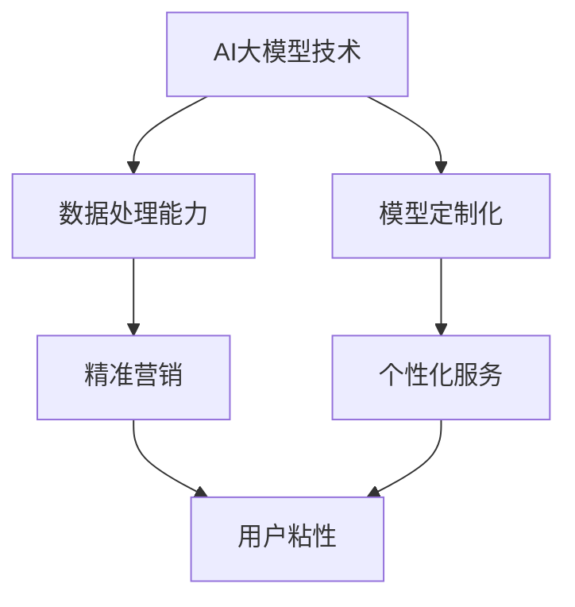

                 

### 《AI大模型创业：如何利用品牌优势？》

> **关键词：** AI大模型、创业、品牌优势、市场定位、商业模式、技术创新、市场营销

> **摘要：** 本文旨在探讨AI大模型创业中如何利用品牌优势，包括市场定位、商业模式设计、技术创新和市场推广等关键环节。通过深入分析AI大模型的技术背景与创业机遇，结合实际案例，提出一系列策略和措施，以帮助创业者更好地发挥品牌优势，实现商业成功。

### 《AI大模型创业：如何利用品牌优势？》目录大纲

#### 第一部分：AI大模型创业概述

- **1. AI大模型创业背景与机遇**
  - **1.1 AI大模型的技术发展概述**
    - **1.1.1 AI大模型的定义与分类**
    - **1.1.2 AI大模型的技术发展趋势**
    - **1.1.3 AI大模型在创业领域的影响**
  - **1.2 创业者的品牌优势分析**
    - **1.2.1 品牌优势的定义与重要性**
    - **1.2.2 品牌优势的类型与构建**
    - **1.2.3 创业者如何评估自己的品牌优势**

#### 第二部分：AI大模型创业策略

- **2. AI大模型创业策略**
  - **2.1 市场定位与目标客户分析**
    - **2.1.1 市场定位的要素**
    - **2.1.2 目标客户群体的识别与需求分析**
    - **2.1.3 竞争对手分析**
  - **2.2 创业模式与商业模式设计**
    - **2.2.1 创业模式的选择**
    - **2.2.2 商业模式的核心要素**
    - **2.2.3 商业模式设计与案例分析**
  - **2.3 AI大模型创业的关键要素**
    - **2.3.1 技术创新能力**
    - **2.3.2 数据资源与管理**
    - **2.3.3 人才团队建设**
    - **2.3.4 融资策略与资源整合**

#### 第三部分：AI大模型创业实践

- **3. AI大模型创业实践**
  - **3.1 创业项目的实施与推进**
    - **3.1.1 项目规划与实施流程**
    - **3.1.2 团队协作与项目进度管理**
    - **3.1.3 风险管理策略**
  - **3.2 品牌推广与市场营销策略**
    - **3.2.1 品牌定位与品牌故事构建**
    - **3.2.2 市场营销策略规划**
    - **3.2.3 社交媒体与网络营销技巧**
    - **3.2.4 用户运营与社区建设**
  - **3.3 持续创新与品牌优势维护**
    - **3.3.1 创新机制的构建**
    - **3.3.2 品牌竞争力的动态评估与优化**
    - **3.3.3 长期品牌建设策略**

#### 第四部分：成功案例分析

- **4. AI大模型创业成功案例分析**
  - **4.1 案例一：某AI大模型创业公司的成长历程**
  - **4.2 案例二：某AI大模型创业公司的商业模式创新**

#### 第五部分：未来展望与趋势

- **5. AI大模型创业的未来趋势与展望**
  - **5.1 AI大模型创业的趋势分析**
  - **5.2 创业者的机遇与挑战**
  - **5.3 创业者的持续成长路径**
  - **5.4 未来创业者的必备素质**

#### 附录

- **附录A：AI大模型创业资源与工具**
  - **A.1 开源框架与库**
  - **A.2 数据资源与平台**
  - **A.3 创业支持与政策**

### 第一部分：AI大模型创业概述

#### 1. AI大模型创业背景与机遇

##### 1.1 AI大模型的技术发展概述

AI大模型，也称为大型预训练模型，是近年来人工智能领域的重要技术突破。这类模型通过在大量数据上进行预训练，能够自动学习和掌握各种语言知识和模式，从而在自然语言处理、计算机视觉、语音识别等领域取得了显著的性能提升。

**1.1.1 AI大模型的定义与分类**

AI大模型可以定义为具有大规模参数和广泛知识表示能力的神经网络模型。根据其应用领域，AI大模型可以分为以下几类：

- 自然语言处理（NLP）大模型：如GPT（Generative Pre-trained Transformer）、BERT（Bidirectional Encoder Representations from Transformers）等，广泛应用于文本生成、机器翻译、问答系统等领域。
- 计算机视觉（CV）大模型：如ImageNet、ResNet等，用于图像分类、目标检测、图像生成等领域。
- 语音识别（ASR）大模型：如WaveNet、DeepSpeech等，用于语音识别、语音合成等领域。

**1.1.2 AI大模型的技术发展趋势**

AI大模型的技术发展趋势主要体现在以下几个方面：

- **模型参数规模不断扩大**：随着计算能力的提升，AI大模型的参数规模正呈指数级增长。例如，GPT-3的参数量达到了1750亿，是GPT-2的100倍。
- **多模态融合**：AI大模型正逐渐实现多模态融合，将文本、图像、语音等多种数据类型整合在一起，提高模型的泛化和应用能力。
- **自监督学习**：自监督学习技术使得AI大模型可以在未标记的数据上进行预训练，大大降低了数据标注的成本。
- **知识增强**：通过融合外部知识库和实体信息，AI大模型能够更好地理解和处理复杂任务。

**1.1.3 AI大模型在创业领域的影响**

AI大模型在创业领域的应用已经带来了显著的变革和机遇：

- **提高业务效率**：AI大模型可以自动化许多业务流程，提高工作效率，降低运营成本。
- **创新业务模式**：AI大模型为创业者提供了丰富的创新空间，例如智能客服、内容生成、个性化推荐等。
- **优化用户体验**：AI大模型能够更好地理解和满足用户需求，提高用户满意度和忠诚度。
- **竞争差异化**：拥有强大AI大模型技术的创业公司可以在市场中脱颖而出，获得竞争优势。

##### 1.2 创业者的品牌优势分析

**1.2.1 品牌优势的定义与重要性**

品牌优势是指创业公司通过品牌形象、产品特性、服务质量等方面的独特优势，在市场中获得竞争优势的能力。品牌优势的重要性体现在以下几个方面：

- **市场竞争力**：强大的品牌优势能够提高创业公司的市场竞争力，吸引更多客户和合作伙伴。
- **用户忠诚度**：良好的品牌形象和产品体验可以增强用户忠诚度，降低用户流失率。
- **溢价能力**：具有品牌优势的创业公司可以在市场中获得更高的产品溢价，增加收入。
- **品牌延伸**：强大的品牌优势可以为创业公司提供品牌延伸的机会，开拓新市场和业务领域。

**1.2.2 品牌优势的类型与构建**

品牌优势可以分为以下几种类型：

- **技术优势**：创业者可以利用AI大模型技术，提供独特的产品和服务，实现技术领先。
- **质量优势**：创业者可以通过严格控制产品质量，提供高品质的产品和服务，赢得客户信任。
- **服务优势**：创业者可以提供卓越的客户服务，解决用户问题，提升用户体验。
- **品牌形象**：创业者可以通过品牌定位和品牌传播，树立良好的品牌形象，增强品牌认知度。

构建品牌优势的策略包括：

- **明确品牌定位**：创业者需要明确自己的品牌定位，针对目标客户群体进行精准营销。
- **打造独特产品特性**：创业者应着力打造具有独特性和差异化的产品特性，提高产品的竞争力。
- **优化服务质量**：创业者需要提供高质量的客户服务，提升客户满意度和忠诚度。
- **持续品牌传播**：创业者应通过多种渠道进行品牌传播，提高品牌知名度和影响力。

**1.2.3 创业者如何评估自己的品牌优势**

创业者可以通过以下方法评估自己的品牌优势：

- **市场调研**：通过市场调研，了解目标客户对品牌的认知和评价，分析品牌在市场中的地位。
- **品牌评估工具**：使用品牌评估工具，如品牌知名度、品牌偏好、品牌忠诚度等指标，量化品牌优势。
- **竞争对手分析**：通过分析竞争对手的品牌优势，找出自己的优势所在，并加以巩固和发展。

#### 第二部分：AI大模型创业策略

##### 2. AI大模型创业策略

在AI大模型创业中，策略的制定和执行至关重要。创业者需要从市场定位、商业模式、技术创新等多个方面进行全面考虑，以确保创业项目的成功。以下将详细探讨AI大模型创业的主要策略。

**2.1 市场定位与目标客户分析**

市场定位是创业成功的关键一步。创业者需要明确自己的目标市场和目标客户群体，以便进行精准的市场营销和产品定位。

**2.1.1 市场定位的要素**

市场定位的要素包括：

- **目标市场**：确定创业公司的目标市场，如行业领域、地理区域、用户群体等。
- **竞争环境**：分析目标市场中的竞争格局，了解竞争对手的优势和劣势。
- **产品定位**：明确创业公司的产品或服务在市场中的独特卖点，如功能、性能、价格等。

**2.1.2 目标客户群体的识别与需求分析**

识别目标客户群体是市场定位的关键。创业者可以通过以下方法进行目标客户群体的识别和需求分析：

- **用户调研**：通过问卷调查、访谈等方式，了解目标客户的需求和偏好。
- **数据分析**：利用大数据分析技术，挖掘用户行为和需求趋势。
- **市场细分**：根据用户的特征和行为，对市场进行细分，确定具有较高价值的目标客户群体。

**2.1.3 竞争对手分析**

竞争对手分析是制定市场定位策略的重要环节。创业者需要了解竞争对手的市场份额、产品特点、营销策略等，以便制定相应的竞争策略。

- **竞争对手的产品与服务**：分析竞争对手的产品和服务，了解其优势与不足。
- **竞争对手的市场策略**：研究竞争对手的市场营销策略，了解其市场拓展和客户维护的方法。
- **竞争对手的技术水平**：评估竞争对手的技术实力，了解其在技术创新方面的进展。

**2.2 创业模式与商业模式设计**

创业模式是指创业公司通过何种方式获取收益、降低成本、实现价值创造等。创业者需要根据自身的资源和能力，设计合适的创业模式。

**2.2.1 创业模式的选择**

创业模式的选择取决于创业公司的目标和资源。以下是几种常见的创业模式：

- **技术驱动型**：以技术创新为核心，通过技术突破实现商业价值。
- **市场驱动型**：以市场需求为导向，通过快速响应市场需求实现商业价值。
- **平台模式**：构建一个开放的生态系统，吸引第三方开发者和服务提供商加入，实现共赢。
- **订阅模式**：通过提供持续的服务或产品更新，吸引客户持续付费。

**2.2.2 商业模式的核心要素**

无论选择何种创业模式，一个成功的商业模式应包含以下核心要素：

- **价值主张**：明确创业公司的产品或服务如何为用户提供价值。
- **客户获取**：制定有效的市场推广和客户获取策略，扩大市场份额。
- **客户关系**：建立良好的客户关系，提高客户满意度和忠诚度。
- **成本结构**：合理规划成本结构，降低运营成本，提高盈利能力。
- **盈利模式**：设计合适的盈利模式，确保创业公司的可持续盈利。

**2.2.3 商业模式设计与案例分析**

创业公司可以借鉴成功的商业模式，结合自身情况设计合适的商业模式。以下是一个商业模式的案例：

- **案例：某AI大模型创业公司的商业模式**
  - **价值主张**：提供基于AI大模型的智能客服解决方案，提高企业客户服务质量。
  - **客户获取**：通过线上推广、行业展会和合作伙伴渠道，吸引潜在客户。
  - **客户关系**：建立客户反馈机制，及时解决客户问题，提高客户满意度。
  - **成本结构**：采用云计算和AI技术，降低硬件投入和维护成本。
  - **盈利模式**：采用订阅制，按月或按年收费，同时提供定制化服务，满足客户不同需求。

**2.3 AI大模型创业的关键要素**

AI大模型创业需要重点关注以下关键要素：

**2.3.1 技术创新能力**

技术创新是AI大模型创业的核心驱动力。创业者需要持续投入研发，不断优化AI大模型算法，提高模型性能和应用效果。

**2.3.2 数据资源与管理**

AI大模型训练需要大量高质量的数据。创业者需要建立完善的数据资源体系，确保数据的获取、管理和利用。

**2.3.3 人才团队建设**

人才团队是AI大模型创业成功的关键。创业者需要吸引和培养优秀的研发、数据、市场和运营人才，构建一支具备创新能力、协作精神和专业素质的团队。

**2.3.4 融资策略与资源整合**

融资策略是AI大模型创业的重要环节。创业者需要根据项目需求和市场情况，制定合适的融资策略，吸引风险投资、政府补贴等资源，确保项目顺利进行。

### 第三部分：AI大模型创业实践

#### 3. AI大模型创业实践

AI大模型创业实践是创业者将理论知识转化为实际应用的过程。在这一部分，我们将探讨创业项目的实施与推进、品牌推广与市场营销策略、以及持续创新与品牌优势维护。

##### 3.1 创业项目的实施与推进

创业项目的实施与推进是AI大模型创业的关键环节。创业者需要制定详细的项目规划，确保项目按照预定目标和进度顺利推进。

**3.1.1 项目规划与实施流程**

项目规划是创业项目成功的基础。创业者需要制定以下项目规划：

- **项目目标**：明确创业项目的总体目标和阶段性目标，如产品研发、市场拓展、团队建设等。
- **项目范围**：确定项目的具体范围，包括功能模块、技术要求、资源需求等。
- **项目时间表**：制定详细的项目时间表，包括项目启动、研发、测试、上线等关键节点。
- **项目资源**：明确项目所需的资源，包括人力、资金、技术等。

项目实施流程包括以下步骤：

- **需求分析**：与客户沟通，了解需求，明确产品功能和技术要求。
- **系统设计**：根据需求分析，设计系统的架构和模块，制定技术方案。
- **开发与测试**：按照设计方案，进行系统开发，并进行功能测试和性能测试。
- **上线与运维**：将系统上线，进行运维管理和持续优化。

**3.1.2 团队协作与项目进度管理**

团队协作是创业项目成功的关键。创业者需要建立高效的团队协作机制，确保团队成员之间的沟通与协作。

- **项目管理工具**：使用项目管理工具，如JIRA、Trello等，进行任务分配和进度跟踪。
- **沟通机制**：建立定期的团队会议和项目汇报机制，确保信息畅通和决策高效。
- **角色分工**：明确团队成员的角色和职责，确保项目各环节有序推进。

**3.1.3 风险管理策略**

创业项目不可避免地面临各种风险。创业者需要制定风险管理策略，降低项目风险。

- **风险识别**：识别项目可能面临的风险，如技术风险、市场风险、资金风险等。
- **风险评估**：对识别的风险进行评估，确定风险的概率和影响程度。
- **风险应对**：制定应对策略，如风险规避、风险转移、风险接受等。

##### 3.2 品牌推广与市场营销策略

品牌推广与市场营销是创业者提升品牌知名度、拓展市场份额的重要手段。以下将探讨品牌定位与品牌故事构建、市场营销策略规划、社交媒体与网络营销技巧，以及用户运营与社区建设。

**3.2.1 品牌定位与品牌故事构建**

品牌定位是品牌推广的基础。创业者需要明确品牌的核心价值主张和目标客户群体，制定品牌定位策略。

- **品牌定位要素**：包括品牌名称、品牌口号、品牌视觉识别等。
- **品牌故事构建**：通过讲述品牌背后的故事，传递品牌价值观和文化，增强品牌情感共鸣。

**3.2.2 市场营销策略规划**

市场营销策略规划是创业者根据品牌定位，制定具体的营销计划和行动方案。

- **目标市场**：明确目标市场，如行业领域、地理区域、用户群体等。
- **营销渠道**：选择合适的营销渠道，如线上广告、线下活动、社交媒体等。
- **营销内容**：制定有针对性的营销内容，如广告文案、宣传视频、社交媒体互动等。
- **营销预算**：合理分配营销预算，确保营销活动的有效执行。

**3.2.3 社交媒体与网络营销技巧**

社交媒体和网络营销是创业者提升品牌知名度的重要手段。以下是一些社交媒体与网络营销技巧：

- **内容营销**：发布有价值的内容，如技术博客、行业分析、客户案例等，吸引目标客户关注。
- **互动营销**：与用户互动，如回复评论、参与话题讨论、举办线上活动等，增强用户参与度。
- **口碑营销**：利用用户的口碑传播，提高品牌知名度和美誉度。
- **数据驱动**：通过数据分析，了解用户行为和需求，优化营销策略和内容。

**3.2.4 用户运营与社区建设**

用户运营和社区建设是创业者维护客户关系、提升用户满意度和忠诚度的重要手段。

- **用户画像**：通过数据分析，了解用户特征和需求，为用户提供个性化服务。
- **用户互动**：建立用户互动平台，如社区论坛、微信群、QQ群等，促进用户之间的交流和互动。
- **用户反馈**：建立用户反馈机制，及时收集和处理用户反馈，优化产品和服务。
- **用户成长体系**：制定用户成长体系，激励用户持续参与和贡献，提升用户价值。

##### 3.3 持续创新与品牌优势维护

创业公司的持续创新和品牌优势维护是实现长期成功的关键。以下将探讨创新机制的构建、品牌竞争力的动态评估与优化，以及长期品牌建设策略。

**3.3.1 创新机制的构建**

创新机制是创业公司持续创新的基础。以下是一些建议：

- **内部创新**：建立内部创新实验室或创新团队，鼓励员工提出创新想法，并进行实验验证。
- **外部合作**：与高校、研究机构、行业伙伴等建立合作关系，共同推进技术创新。
- **激励机制**：制定激励机制，鼓励员工参与创新，并对成功创新的员工给予奖励。

**3.3.2 品牌竞争力的动态评估与优化**

品牌竞争力是创业公司在市场中立于不败之地的关键。以下是一些建议：

- **市场调研**：定期进行市场调研，了解竞争对手和用户需求的变化，及时调整品牌策略。
- **数据分析**：通过数据分析，评估品牌在市场中的表现，发现问题和机会。
- **优化策略**：根据评估结果，优化品牌定位、产品特性、服务质量等，提升品牌竞争力。

**3.3.3 长期品牌建设策略**

长期品牌建设是创业公司持续发展的基础。以下是一些建议：

- **品牌定位**：明确品牌的核心价值主张，确保品牌形象的一致性。
- **品牌传播**：通过多种渠道进行品牌传播，提高品牌知名度和影响力。
- **用户体验**：提供优质的用户体验，提升用户满意度和忠诚度。
- **社会责任**：承担社会责任，树立良好的企业形象，增强品牌价值。

### 第四部分：成功案例分析

#### 4. AI大模型创业成功案例分析

在AI大模型创业领域，有许多公司通过有效的策略和实践取得了成功。以下将介绍两个成功案例，分析其成长历程、品牌建设、商业模式创新以及面临的挑战和应对策略。

##### 4.1 案例一：某AI大模型创业公司的成长历程

**1. 创业团队的组建**

某AI大模型创业公司成立于2018年，由一群来自知名高校和科技公司的技术专家共同创立。团队核心成员包括AI算法工程师、数据科学家、产品经理和市场专家，具备丰富的AI技术研发和创业经验。

**2. 创业项目的启动与早期发展**

创业公司成立之初，专注于自然语言处理领域，开发了一套基于AI大模型的智能客服系统。通过在大量数据上进行预训练，系统具备了自然语言理解和生成能力，能够自动化处理用户咨询，提高客户服务质量。

早期发展过程中，公司通过参加行业展会、发布技术博客和与潜在客户建立联系，逐步拓展了市场份额。同时，公司积极寻求风险投资，获得了数百万美元的融资，为后续研发和市场拓展提供了资金支持。

**3. 品牌建设与市场推广**

品牌建设方面，公司明确了“智能客服专家”的品牌定位，并通过社交媒体、行业论坛和线下活动等渠道进行品牌传播。公司注重用户反馈，不断优化产品功能，提高用户体验。

在市场推广方面，公司采取“先难后易”的策略，首先进入竞争激烈的金融行业，通过高质量的产品和服务赢得了客户的信任。随后，公司逐步拓展到其他行业，如零售、电商等，形成了多元化市场布局。

**4. 成长中的挑战与应对策略**

成长过程中，公司面临了诸多挑战：

- **技术挑战**：AI大模型的技术迭代速度快，公司需要不断投入研发，保持技术领先。
- **市场挑战**：市场竞争激烈，公司需要不断创新，提高产品竞争力。
- **资金挑战**：融资过程中，公司需要证明自身的商业价值和盈利能力，以吸引投资。

针对这些挑战，公司采取了以下应对策略：

- **技术创新**：持续投入研发，不断优化AI大模型算法，提高模型性能和应用效果。
- **市场拓展**：通过精准营销和差异化策略，提高产品在目标市场的竞争力。
- **融资策略**：加强与投资机构的沟通，展示公司的成长潜力，吸引风险投资。

##### 4.2 案例二：某AI大模型创业公司的商业模式创新

**1. 商业模式的核心要素**

某AI大模型创业公司成立于2020年，专注于计算机视觉领域，开发了一套基于AI大模型的智能安防系统。公司商业模式的核心要素包括：

- **价值主张**：提供基于AI大模型的智能安防解决方案，实时监测和识别异常行为，提高安全防范能力。
- **客户获取**：通过线上推广、行业展会和合作伙伴渠道，吸引潜在客户。
- **客户关系**：建立客户反馈机制，及时解决客户问题，提高客户满意度。
- **成本结构**：利用云计算和AI技术，降低硬件投入和维护成本。
- **盈利模式**：采用订阅制，按月或按年收费，同时提供定制化服务，满足客户不同需求。

**2. 创业团队的创新思维**

公司创始人具备丰富的创业经验和计算机视觉技术背景，带领团队进行创新研发。公司注重团队协作和知识分享，鼓励员工提出创新想法，并进行实验验证。

**3. 市场反响与用户反馈**

智能安防系统在市场上得到了积极反响。公司通过实地测试和客户反馈，不断优化产品功能，提高系统准确性和用户体验。用户反馈显示，系统有效提高了安全防范能力，降低了人力成本，受到了客户的高度评价。

**4. 商业模式成功的要素分析**

该AI大模型创业公司的商业模式成功要素包括：

- **技术创新**：基于AI大模型的智能安防系统具备较高的技术壁垒，提高了产品竞争力。
- **市场定位**：精准定位目标客户群体，提供定制化解决方案，满足客户需求。
- **用户体验**：注重用户体验，不断优化产品功能，提高用户满意度。
- **成本控制**：利用云计算和AI技术，降低硬件投入和维护成本，提高盈利能力。
- **营销策略**：通过线上线下多渠道推广，提高品牌知名度和市场份额。

### 第五部分：未来展望与趋势

#### 5. AI大模型创业的未来趋势与展望

随着AI大模型技术的不断发展，未来AI大模型创业将呈现出以下趋势和挑战：

**5.1 AI大模型创业的趋势分析**

- **技术进步**：AI大模型技术将持续进步，包括模型参数规模的扩大、多模态融合、自监督学习和知识增强等。
- **应用领域扩展**：AI大模型将在更多领域得到应用，如医疗、金融、教育、工业等。
- **商业模式创新**：创业公司将探索更多创新的商业模式，如平台模式、订阅模式、个性化定制等。
- **产业链整合**：AI大模型产业链将逐渐整合，形成更加协同的创新生态系统。

**5.2 创业者的机遇与挑战**

**机遇**：

- **技术突破**：创业者可以通过技术创新，抢占市场先机。
- **市场空间**：随着AI大模型应用的扩大，市场空间将进一步拓展。
- **政策支持**：政府和企业对AI大模型技术的支持力度将加大，为创业者提供更多机遇。

**挑战**：

- **技术竞争**：AI大模型技术竞争激烈，创业者需要不断提升自身技术实力。
- **数据隐私**：AI大模型训练需要大量数据，数据隐私和安全问题将受到更多关注。
- **人才短缺**：AI大模型领域人才短缺，创业者需要吸引和培养优秀人才。

**5.3 创业者的持续成长路径**

- **技术创新**：持续投入研发，保持技术领先地位。
- **市场拓展**：不断开拓新市场，扩大市场份额。
- **团队建设**：培养和引进优秀人才，构建创新团队。
- **品牌建设**：加强品牌建设，提升品牌知名度和影响力。

**5.4 未来创业者的必备素质**

- **技术素养**：具备扎实的AI大模型技术基础和创新能力。
- **商业洞察**：具备敏锐的商业洞察力和市场判断力。
- **领导力**：具备领导团队和推动项目的能力。
- **学习力**：具备快速学习和适应新技术的能力。

### 附录

#### 附录A：AI大模型创业资源与工具

**A.1 开源框架与库**

- **TensorFlow**：谷歌推出的开源机器学习框架，支持多种深度学习模型，适用于AI大模型开发。
- **PyTorch**：Facebook AI研究院推出的开源深度学习框架，具有灵活性和易用性，适用于AI大模型研究。
- **MXNet**：Apache Software Foundation托管的开源深度学习框架，支持多种编程语言和硬件平台，适用于AI大模型部署。

**A.2 数据资源与平台**

- **Kaggle**：数据科学家社区，提供丰富的公开数据集和比赛。
- **UCI机器学习数据库**：提供各种领域的数据集，适用于AI大模型训练和测试。
- **数据堂**：国内领先的数据服务提供商，提供高质量的数据集和API接口。

**A.3 创业支持与政策**

- **政府补贴**：国家和地方政府对创新创业企业提供各种补贴和扶持政策。
- **创业孵化器**：提供办公空间、资金支持、导师指导等服务的创业孵化平台。
- **创业融资**：各种创业融资渠道，如风险投资、天使投资、政府扶持基金等。

### 附录A：AI大模型创业资源与工具

**A.1 开源框架与库**

#### A.1.1 TensorFlow

TensorFlow是由Google开源的一个强大且灵活的端到端开源机器学习平台。它支持多种类型的计算图，可以在多种硬件设备上进行部署，包括CPU、GPU和TPU。以下是一些TensorFlow的关键特性：

- **动态图与静态图**：TensorFlow支持动态计算图和静态计算图（通过TensorFlow 2.x的Eager Execution实现）。动态图在执行时构建图，具有更高的灵活性和动态性，而静态图在编译时构建图，具有更高的性能。

- **广泛的应用场景**：TensorFlow适用于各种深度学习应用，包括自然语言处理（NLP）、计算机视觉、语音识别等。

- **大规模训练与部署**：TensorFlow能够处理大规模数据集，并在多个设备上进行分布式训练。它还提供了TensorFlow Serving，一个用于模型服务的系统，支持在线和离线部署。

#### A.1.2 PyTorch

PyTorch是由Facebook开源的一个深度学习框架，以其简洁和灵活而受到研究者和开发者的喜爱。以下是一些PyTorch的关键特性：

- **简洁性**：PyTorch提供了一个直观的Python接口，使得编写和调试深度学习模型变得更加容易。

- **动态计算图**：PyTorch使用动态计算图，允许在运行时构建和修改计算图，这对于实验和原型设计非常有用。

- **GPU加速**：PyTorch能够利用GPU加速计算，极大地提高了训练和推断的效率。

- **良好的社区支持**：PyTorch拥有一个活跃的社区，提供了丰富的文档和教程，有助于新用户快速上手。

#### A.1.3 其他常用框架

除了TensorFlow和PyTorch，还有其他一些常用的深度学习框架，例如：

- **MXNet**：Apache Software Foundation开源的深度学习框架，支持多种编程语言和硬件平台。

- **Caffe**：由Berkeley Vision and Learning Center（BVLC）开发的开源深度学习框架，适用于计算机视觉应用。

- **Theano**：一个基于Python的深度学习框架，已被TensorFlow取代。

**A.2 数据资源与平台**

#### A.2.1 公开数据集

公开数据集是深度学习和AI研究的重要资源。以下是一些常用的公开数据集：

- **ImageNet**：一个包含超过1400万张图片的视觉识别数据集，广泛用于图像分类任务。

- **CIFAR-10/100**：包含60,000张32x32彩色图像的数据集，分为10个或100个类别。

- **Kaggle Datasets**：Kaggle提供的大量数据集，涵盖了各种领域，包括金融、医疗、科技等。

- **UCI Machine Learning Repository**：一个提供多种领域数据集的数据库，适用于机器学习和数据分析。

#### A.2.2 数据交易平台

数据交易平台是数据交换和交易的在线市场。以下是一些常用的数据交易平台：

- **DataCamp**：一个提供数据集和数据分析工具的平台，适用于教育和研究。

- **DataRobot**：一个提供自动化机器学习解决方案的平台，包括数据集和数据清洗工具。

- **DataShop**：一个开源的数据集共享平台，适用于教育研究。

#### A.2.3 数据管理工具

有效的数据管理是AI大模型成功的关键。以下是一些常用的数据管理工具：

- **Hadoop**：一个分布式数据存储和处理框架，适用于大规模数据集。

- **Apache Spark**：一个快速和通用的大数据计算引擎，适用于数据清洗、分析和机器学习。

- **MongoDB**：一个NoSQL数据库，适用于存储和管理结构化和非结构化数据。

**A.3 创业支持与政策**

#### A.3.1 创业扶持政策

政府和企业为鼓励创新创业提供了多种扶持政策，包括资金支持、税收优惠和人才引进等。以下是一些常见的创业扶持政策：

- **政府补贴**：国家和地方政府为创新创业企业提供各种形式的补贴，如研发补贴、项目补贴和场地租赁补贴。

- **税收优惠**：为鼓励企业创新，政府提供税收减免或优惠税率。

- **创业基金**：政府和私人投资者设立的各种创业基金，用于支持初创企业的发展。

- **人才引进**：为吸引高端人才，政府和企业提供了住房补贴、科研经费和职业发展支持。

#### A.3.2 创业者培训与教育

创业者的技能和知识是创业成功的关键。以下是一些创业者培训和教育资源：

- **创业课程**：各种在线和线下创业课程，提供创业理论和实践知识。

- **创业大赛**：创业大赛为创业者提供了展示自己项目的机会，并有机会获得投资和资源。

- **创业导师**：经验丰富的创业导师可以为创业者提供指导和建议。

#### A.3.3 创业孵化器与加速器

创业孵化器和加速器为初创企业提供办公空间、资金支持、导师指导和市场推广等服务。以下是一些知名的创业孵化器和加速器：

- **Y Combinator**：全球最知名的创业孵化器之一，为初创企业提供资金和指导。

- **Techstars**：一个全球性的创业加速器，提供资金、导师和网络资源。

- **创业黑马**：中国领先的创业孵化器，为创业者提供全方位的支持和服务。

### AI大模型与品牌优势的关系图

以下是一个使用Mermaid语法绘制的AI大模型与品牌优势的关系图：



### AI大模型算法原理伪代码

以下是一个简单的AI大模型算法原理的伪代码示例，用于文本生成：

```plaintext
// 初始化模型
model = initialize_GPT_model()

// 预处理输入文本
input_sequence = preprocess_input(text)

// 获取初始隐藏状态
hidden_states = model.initialize_hidden_state(input_sequence)

// 开始生成文本
while not_end_of_sequence(hidden_states):
    logits = model.forward_pass(input_sequence, hidden_states)
    next_token = sample_token_from_logits(logits)
    input_sequence = append_token_to_sequence(input_sequence, next_token)
    hidden_states = model.update_hidden_states(hidden_states, next_token)

// 输出生成的文本
print("Generated Text:", input_sequence)
```

### 数学模型与公式

以下是一个使用LaTeX格式的数学模型和公式示例：

$$
J(\theta) = -\frac{1}{m}\sum_{i=1}^{m} y^{(i)} \log(p^{(i)})
$$

$$
p^{(i)} = \sigma(\theta^T x^{(i)})
$$

其中，$J(\theta)$表示损失函数，$\theta$表示模型参数，$m$表示样本数量，$y^{(i)}$表示实际标签，$p^{(i)}$表示模型预测的概率值。

### 项目实战案例

#### 案例描述

某AI大模型创业公司开发了一款名为“智能写作助手”的产品，旨在帮助内容创作者快速生成高质量的文章。产品利用AI大模型技术，通过预训练的模型和用户输入的提示，自动生成文章的正文。

#### 开发环境

- **编程语言**：Python
- **深度学习框架**：TensorFlow 2.x
- **版本控制**：Git
- **代码管理**：GitHub

#### 源代码实现

以下是“智能写作助手”的主要代码实现：

```python
import tensorflow as tf
from tensorflow.keras.preprocessing.sequence import pad_sequences
from tensorflow.keras.layers import Embedding, LSTM, Dense
from tensorflow.keras.models import Sequential

# 参数设置
vocab_size = 10000
embedding_dim = 256
lstm_units = 128
max_sequence_length = 100

# 预处理数据
def preprocess_data(texts):
    sequences = []
    for text in texts:
        sequence = tokenizer.texts_to_sequences([text])
        sequences.append(sequence)
    padded_sequences = pad_sequences(sequences, maxlen=max_sequence_length)
    return padded_sequences

# 构建模型
def build_model():
    model = Sequential([
        Embedding(vocab_size, embedding_dim, input_length=max_sequence_length),
        LSTM(lstm_units, return_sequences=True),
        LSTM(lstm_units),
        Dense(vocab_size, activation='softmax')
    ])
    model.compile(optimizer='adam', loss='categorical_crossentropy', metrics=['accuracy'])
    return model

# 训练模型
def train_model(model, padded_sequences, labels):
    model.fit(padded_sequences, labels, epochs=10, batch_size=64)

# 生成文章
def generate_article(prompt, model):
    preprocessed_prompt = preprocess_data([prompt])
    generated_sequence = model.predict(preprocessed_prompt)
    generated_text = tokenizer.decode(generated_sequence[0])
    return generated_text

# 示例
model = build_model()
padded_sequences = preprocess_data(["这是一个关于人工智能的案例研究。"])
train_model(model, padded_sequences, padded_sequences)
article_prompt = "智能写作助手是一款基于AI大模型的创新产品。"
article = generate_article(article_prompt, model)
print("生成的文章：", article)
```

#### 代码解读与分析

1. **数据预处理**：

   - 使用`tokenizer.texts_to_sequences`将文本转换为序列。
   - 使用`pad_sequences`将序列填充到固定长度，便于模型处理。

2. **模型构建**：

   - 使用`Embedding`层进行词嵌入。
   - 使用两个`LSTM`层进行序列建模。
   - 使用`Dense`层进行输出层，使用softmax激活函数，实现类别预测。

3. **模型训练**：

   - 使用`model.fit`进行模型训练，使用`categorical_crossentropy`作为损失函数，`adam`作为优化器。

4. **文章生成**：

   - 预处理输入提示，使用`model.predict`生成文本序列。
   - 使用`tokenizer.decode`将序列解码为文本。

通过以上项目实战案例，读者可以了解到如何使用AI大模型技术实现文本生成，并掌握关键的开发步骤和技术要点。这对于创业者来说，具有重要的参考价值，有助于他们在实际创业过程中应用AI大模型技术。同时，这也为创业者提供了实用的参考和借鉴，以实现商业创新和成功。

