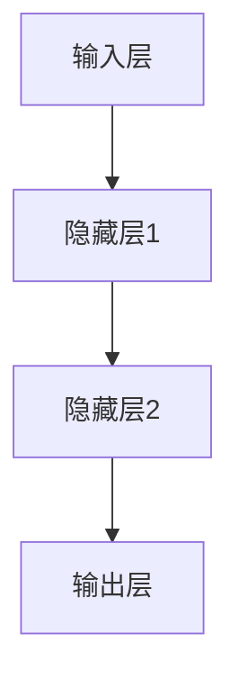

                 

# AI 大模型创业：如何利用渠道优势？

> **关键词：** AI大模型，创业，渠道优势，市场拓展，技术战略，法律法规，社会责任

> **摘要：** 本文将探讨人工智能大模型创业的关键成功因素，特别是如何利用渠道优势拓展市场。我们将从AI大模型的基础知识出发，深入分析其核心技术与应用案例，随后介绍创业方法论，重点探讨如何通过渠道战略、营销策略和运营维护实现市场拓展。最后，我们将讨论人工智能大模型创业面临的法律和伦理问题，并展望其未来发展趋势。通过本文，创业者将获得全面的指导，以在激烈的人工智能市场中立足和发展。

## 第一部分: AI 大模型基础

### 第1章: AI 大模型概述

#### 1.1 AI 大模型的概念与重要性

**1.1.1 什么是 AI 大模型**

AI大模型，通常指的是那些具有非常高的参数数量、复杂结构和强大计算能力的人工智能模型。这些模型通过深度学习算法，从大量数据中自动学习特征和规律，以实现对复杂问题的建模和解决。典型的大模型包括GPT-3、BERT、DALL-E等。

**1.1.2 AI 大模型的重要性**

AI大模型的重要性体现在多个方面：

1. **提升效率：** 大模型能够快速处理大量数据，大大提升了工作效率。
2. **突破瓶颈：** 传统算法在面对复杂任务时可能力不从心，大模型则可以突破这些瓶颈。
3. **创新应用：** 大模型的出现为人工智能带来了新的发展机遇，推动了诸多领域的技术进步。
4. **商业价值：** AI大模型在商业领域的应用，为企业和创业者带来了巨大的商业价值。

**1.1.3 AI 大模型与传统 AI 的区别**

传统AI模型通常参数量较少，结构简单，而大模型具有以下特点：

1. **参数规模：** 大模型的参数数量可以达数十亿，远超传统模型。
2. **数据处理能力：** 大模型能够处理海量数据，实现更准确和鲁棒的学习效果。
3. **学习方式：** 大模型通常采用深度学习算法，包括多层神经网络等，而传统AI模型多为单层或简单多层结构。
4. **应用范围：** 大模型在自然语言处理、计算机视觉、语音识别等领域取得了显著成果，而传统AI模型应用范围相对较窄。

#### 1.2 AI 大模型的分类

AI大模型可以按照应用领域进行分类，主要包括以下几种：

**1.2.1 自然语言处理大模型**

自然语言处理（NLP）大模型是AI大模型中的重要组成部分，例如GPT-3、BERT等。这些模型通过学习大量的文本数据，能够进行文本生成、机器翻译、情感分析等多种NLP任务。

**1.2.2 计算机视觉大模型**

计算机视觉（CV）大模型如ResNet、EfficientNet等，通过学习图像数据，能够实现图像分类、目标检测、图像生成等任务。这些模型在自动驾驶、医疗影像分析等领域有着广泛应用。

**1.2.3 其他领域的大模型**

除了NLP和CV，AI大模型还涵盖其他领域，如推荐系统（如DeepFM、Wide&Deep等）、金融风控（如XGBoost、LightGBM等）等。这些模型通过特定的数据集进行训练，能够为相应领域提供高效、准确的解决方案。

#### 1.3 AI 大模型的应用场景

AI大模型的应用场景非常广泛，主要包括以下几类：

**1.3.1 企业级应用**

在企业级应用中，AI大模型能够用于数据分析、客户关系管理、供应链优化等。例如，通过自然语言处理大模型，企业可以自动化处理客户服务，提高响应速度和服务质量。

**1.3.2 消费级应用**

在消费级应用中，AI大模型主要用于推荐系统、语音助手、智能音箱等。例如，通过计算机视觉大模型，智能手机可以实现更精准的人脸识别和场景识别功能。

**1.3.3 公共服务应用**

在公共服务领域，AI大模型被广泛应用于智慧城市、智能医疗、环境保护等。例如，通过智能医疗诊断系统，医生可以利用AI大模型辅助诊断，提高诊断准确率和效率。

### 第2章: AI 大模型核心技术

#### 2.1 深度学习基础

**2.1.1 神经网络概述**

神经网络是深度学习的基础，它由一系列模拟人脑神经元连接的结构组成。神经网络通过层层传递输入数据，进行特征提取和分类。以下是神经网络的简化流程：



**2.1.2 深度学习架构**

深度学习架构包括多层神经网络，每层网络都对输入数据进行处理，并传递到下一层。常见的深度学习架构有卷积神经网络（CNN）、循环神经网络（RNN）和Transformer等。

**2.1.3 深度学习优化算法**

深度学习优化算法用于调整网络参数，以最小化损失函数。常见的优化算法有梯度下降（Gradient Descent）、Adam优化器等。以下是一个简单的梯度下降算法伪代码：

```python
while not converged:
    gradient = compute_gradient(w)
    w = w - learning_rate * gradient
```

#### 2.2 自然语言处理技术

**2.2.1 词嵌入技术**

词嵌入是将词汇映射到高维向量空间的技术。常见的词嵌入方法有Word2Vec、GloVe等。以下是一个简单的Word2Vec算法伪代码：

```python
for each sentence in corpus:
    for each word in sentence:
        compute context_words = get_context_words(word)
        update_vector(word, context_words)
```

**2.2.2 序列模型**

序列模型是用于处理序列数据（如文本、语音）的深度学习模型。常见的序列模型有RNN、LSTM和GRU等。以下是一个简单的LSTM算法伪代码：

```python
def lstm(input, h_prev, c_prev):
    forget_gate = sigmoid(W_f * [h_prev, input] + b_f)
    input_gate = sigmoid(W_i * [h_prev, input] + b_i)
    output_gate = sigmoid(W_o * [h_prev, input] + b_o)
    cell = tanh(W_c * [h_prev, input] + b_c)
    
    i遗忘 = forget_gate .* c_prev
    i输入 = input_gate .* cell
    c_new = i遗忘 + i输入
    
    h_new = output_gate .* tanh(c_new)
    
    return h_new, c_new
```

**2.2.3 注意力机制**

注意力机制是用于提高神经网络在处理序列数据时对关键信息的关注程度的机制。常见的注意力机制有Softmax Attention和MultiHead Attention等。以下是一个简单的Softmax Attention算法伪代码：

```python
def softmax(x):
    exp_x = np.exp(x)
    sum_exp_x = np.sum(exp_x)
    return exp_x / sum_exp_x

def attention(q, k, v, mask=None):
    scores = np.dot(q, k.T) / np.sqrt(k.shape[1])
    if mask is not None:
        scores += mask
    attn_weights = softmax(scores)
    output = np.dot(attn_weights, v)
    return output, attn_weights
```

#### 2.3 计算机视觉技术

**2.3.1 图像识别**

图像识别是计算机视觉的基础任务，其主要目标是给图像中的对象进行分类。常见的图像识别算法有LeNet、AlexNet、VGG等。以下是一个简单的LeNet算法伪代码：

```python
def lenet(input_image):
    conv1 = convolution(input_image, W1, b1)
    pool1 = max_pool(conv1)
    
    conv2 = convolution(pool1, W2, b2)
    pool2 = max_pool(conv2)
    
    flatten = flatten(pool2)
    fc1 = fully_connected(flatten, W3, b3)
    fc2 = fully_connected(fc1, W4, b4)
    output = softmax(fc2)
    
    return output
```

**2.3.2 目标检测**

目标检测是计算机视觉中的另一重要任务，其主要目标是在图像中定位并识别多个对象。常见的目标检测算法有R-CNN、Faster R-CNN、SSD等。以下是一个简单的Faster R-CNN算法伪代码：

```python
def faster_r_cnn(image, rois, labels):
    feature_map = extract_features(image, rois)
    fc6 = fully_connected(feature_map, W6, b6)
    fc7 = fully_connected(fc6, W7, b7)
    pool5 = max_pool(fc7)
    
    roi_pool = roi_pool(pool5, rois, output_size=(7, 7))
    fc8 = fully_connected(roi_pool, W8, b8)
    scores = softmax(fc8)
    labels_pred = argmax(scores, axis=1)
    
    return labels_pred
```

**2.3.3 图像生成**

图像生成是计算机视觉中的又一重要任务，其主要目标是生成具有真实感的图像。常见的图像生成算法有GAN、VAE等。以下是一个简单的GAN算法伪代码：

```python
def gan(z, G, D):
    fake_images = G(z)
    D_fake = D(fake_images)
    real_labels = ones((batch_size, 1))
    fake_labels = zeros((batch_size, 1))
    
    D_loss_real = -np.mean(np.log(D(real_images)))
    D_loss_fake = -np.mean(np.log(D_fake))
    D_loss = D_loss_real + D_loss_fake
    
    G_loss = -np.mean(np.log(D_fake))
    
    G_grad = grad(G_loss, G_params)
    D_grad = grad(D_loss, D_params)
    
    update_params(G_params, G_lr, G_grad)
    update_params(D_params, D_lr, D_grad)
    
    return G_loss, D_loss
```

#### 2.4 大规模预训练模型

**2.4.1 预训练模型的概念**

预训练模型是指在大规模数据集上预先训练好的模型，这些模型经过大量数据的训练，已经学习到了丰富的特征和规律。预训练模型的核心思想是将原始模型在大规模数据集上进行训练，使其具备良好的通用性，然后再将其应用到特定任务中进行微调。

**2.4.2 自监督学习**

自监督学习是一种在无监督学习场景下，利用未标注数据进行模型训练的方法。自监督学习的核心思想是通过对数据进行预处理和再编码，使其自动学习到数据中的有用信息。常见的自监督学习方法有掩码语言模型（Masked Language Model, MLM）等。

**2.4.3 迁移学习**

迁移学习是一种利用预训练模型在特定任务上的经验，将其应用于其他相关任务的方法。迁移学习的核心思想是通过调整预训练模型的参数，使其在新任务上取得更好的性能。常见的迁移学习方法有微调（Fine-tuning）等。

### 第3章: AI 大模型应用案例解析

#### 3.1 案例一：企业智能客服系统

**3.1.1 项目背景**

企业智能客服系统是一种基于AI大模型的技术，旨在为企业提供高效、智能的客户服务。该项目旨在通过自然语言处理大模型，实现对用户查询的自动响应，提高客服效率和服务质量。

**3.1.2 技术实现**

技术实现主要包括以下几个步骤：

1. **数据收集与预处理：** 收集企业客服记录数据，对数据进行清洗、去重和归一化处理。
2. **模型训练：** 利用自然语言处理大模型，对预处理后的数据进行训练，以实现对话生成、意图识别等功能。
3. **模型部署：** 将训练好的模型部署到服务器上，通过API接口与客服系统进行集成。
4. **性能评估与优化：** 通过实际运行数据，对模型进行性能评估和优化，以提高服务质量和用户满意度。

**3.1.3 优势和挑战**

优势：

1. **高效响应：** 智能客服系统能够快速响应用户查询，大大提高了客服效率。
2. **个性化服务：** 通过学习用户历史数据和偏好，智能客服系统能够提供更加个性化的服务。
3. **降低成本：** 智能客服系统可以部分或全部替代人工客服，降低了企业的人力成本。

挑战：

1. **数据隐私：** 在收集和处理用户数据时，需要确保数据隐私和安全。
2. **模型适应性：** 智能客服系统需要不断学习和适应新的用户查询和场景，以保持高效性和准确性。
3. **用户满意度：** 需要不断提高智能客服系统的服务质量，以赢得用户的信任和满意度。

#### 3.2 案例二：智能医疗诊断系统

**3.2.1 项目背景**

智能医疗诊断系统是一种基于计算机视觉和深度学习大模型的医疗诊断工具。该项目旨在通过图像识别和自然语言处理技术，实现对医疗影像的自动诊断和报告生成。

**3.2.2 技术实现**

技术实现主要包括以下几个步骤：

1. **数据收集与预处理：** 收集大量的医疗影像数据，对数据进行清洗、标注和归一化处理。
2. **模型训练：** 利用计算机视觉大模型，对预处理后的数据进行训练，以实现图像识别和分类功能。
3. **自然语言处理：** 对训练好的模型进行微调，以实现医学报告生成功能。
4. **模型部署与集成：** 将训练好的模型部署到医疗系统中，通过API接口与医院信息系统进行集成。

**3.2.3 优势和挑战**

优势：

1. **提高诊断效率：** 智能医疗诊断系统能够快速处理大量医疗影像，提高了医生的工作效率。
2. **辅助诊断：** 通过学习大量的医疗数据，智能医疗诊断系统可以为医生提供辅助诊断意见，提高诊断准确率。
3. **减少误诊率：** 智能医疗诊断系统可以减少人为因素导致的误诊，提高了诊断的可靠性。

挑战：

1. **数据质量：** 需要保证医疗影像数据的准确性和完整性，以确保诊断结果的准确性。
2. **算法可靠性：** 需要不断优化和改进算法，以提高智能医疗诊断系统的可靠性。
3. **法律法规：** 需要遵循相关的法律法规，确保医疗数据的隐私和安全。

#### 3.3 案例三：自动驾驶技术

**3.3.1 项目背景**

自动驾驶技术是一种基于计算机视觉、自然语言处理和深度学习大模型的技术，旨在实现车辆的自主驾驶。该项目旨在通过多传感器数据融合和深度学习算法，实现车辆的自动驾驶功能。

**3.3.2 技术实现**

技术实现主要包括以下几个步骤：

1. **数据收集与预处理：** 收集车辆传感器数据（如摄像头、雷达、激光雷达等），对数据进行清洗、标注和归一化处理。
2. **模型训练：** 利用深度学习大模型，对预处理后的数据进行训练，以实现环境感知、路径规划和决策控制等功能。
3. **模型部署与集成：** 将训练好的模型部署到自动驾驶系统中，通过API接口与车辆控制系统进行集成。

**3.3.3 优势和挑战**

优势：

1. **提高行车安全：** 自动驾驶技术可以减少人为驾驶导致的交通事故，提高行车安全。
2. **提高交通效率：** 自动驾驶技术可以优化车辆行驶路线，提高交通效率，减少拥堵。
3. **提升用户体验：** 自动驾驶技术可以为用户提供更舒适、便捷的出行体验。

挑战：

1. **传感器融合：** 需要解决多传感器数据融合的问题，以确保自动驾驶系统的稳定性和可靠性。
2. **环境适应性：** 需要不断提高自动驾驶系统对复杂环境的适应能力，以应对各种天气和路况。
3. **法律法规：** 需要完善自动驾驶技术的法律法规，确保自动驾驶车辆的安全和社会接受度。

## 第二部分: AI 大模型创业实战

### 第4章: AI 大模型创业方法论

#### 4.1 创业环境分析

**4.1.1 行业趋势分析**

AI大模型创业的环境正在不断优化，以下是当前行业趋势的分析：

1. **技术成熟度：** AI大模型技术已经取得显著进展，特别是在自然语言处理和计算机视觉领域，技术成熟度较高。
2. **市场需求：** 随着人工智能技术的普及，各行各业对AI大模型的需求日益增长，市场需求旺盛。
3. **政策支持：** 各国政府纷纷出台政策，支持人工智能技术的发展，为AI大模型创业提供了良好的政策环境。
4. **投资热情：** 风险投资和政府资金对AI大模型项目的投资热情高涨，为创业者提供了充足的资金支持。

**4.1.2 市场需求分析**

AI大模型在多个领域具有广泛的应用前景，以下是主要市场需求的分析：

1. **企业级应用：** 企业希望利用AI大模型提高生产效率、优化业务流程和提升客户满意度。
2. **消费级应用：** 消费者希望AI大模型能够为他们的日常生活提供便利和愉悦，如智能语音助手、智能家居等。
3. **公共服务应用：** 公共服务部门希望利用AI大模型提升服务效率和质量，如智能医疗、智能交通等。

**4.1.3 竞争态势分析**

AI大模型创业的竞争态势日益激烈，以下是竞争态势的分析：

1. **技术创新：** 各大科技公司和创业公司都在不断加大技术创新力度，争夺市场份额。
2. **市场细分：** 市场细分成为竞争的关键，创业者需要找到独特的市场定位，以差异化产品赢得竞争优势。
3. **资本投入：** 资本投入成为竞争的重要手段，创业者需要积极寻求资金支持，以保持竞争优势。

#### 4.2 创业团队构建

**4.2.1 技术团队搭建**

构建一个高效的技术团队是AI大模型创业成功的关键。以下是技术团队搭建的建议：

1. **核心技术人员：** 拥有丰富的人工智能领域经验和技能的核心技术人员，如深度学习工程师、数据科学家等。
2. **研发团队：** 包括算法工程师、软件工程师、测试工程师等，负责产品开发和维护。
3. **数据团队：** 负责数据收集、处理和标注，为模型训练提供高质量的数据支持。
4. **运维团队：** 负责系统部署、运维和监控，确保产品稳定运行。

**4.2.2 运营团队搭建**

运营团队是AI大模型创业成功的重要保障。以下是运营团队搭建的建议：

1. **产品经理：** 负责产品规划、设计和迭代，确保产品满足市场需求。
2. **市场经理：** 负责市场推广、品牌建设和客户关系管理，提高产品知名度和市场占有率。
3. **销售团队：** 负责产品销售和客户拓展，实现产品商业价值的最大化。
4. **客服团队：** 负责客户咨询和服务，提高客户满意度和忠诚度。

**4.2.3 融资与投资**

融资与投资是AI大模型创业的重要环节。以下是融资与投资的建议：

1. **天使投资：** 初始阶段可以寻求天使投资，以获得资金支持。
2. **风险投资：** 发展阶段可以寻求风险投资，以扩大市场份额和提升企业估值。
3. **政府资助：** 可以申请政府科技创新基金和补贴，以减轻财务压力。
4. **股权融资：** 后续可以通过股权融资，引入战略投资者，以实现企业快速发展。

#### 4.3 创业项目规划

**4.3.1 项目定位**

项目定位是AI大模型创业成功的关键。以下是项目定位的建议：

1. **市场需求：** 分析市场需求，找到潜在的客户群体，明确产品的目标市场。
2. **技术优势：** 确定自身在技术上的独特优势，如算法创新、数据处理能力等。
3. **竞争分析：** 分析竞争对手的优势和劣势，找到差异化的市场定位。
4. **商业模式：** 确定商业模式的可行性，如产品定价、盈利模式等。

**4.3.2 技术路线选择**

技术路线选择是AI大模型创业的核心。以下是技术路线选择的建议：

1. **核心技术：** 选择适合自身业务需求的核心技术，如深度学习、自然语言处理等。
2. **算法优化：** 通过不断优化算法，提高模型的性能和效率。
3. **数据积累：** 收集和积累高质量的数据，为模型训练提供支持。
4. **技术创新：** 关注前沿技术动态，不断创新，保持技术领先优势。

**4.3.3 产品规划**

产品规划是AI大模型创业的重要环节。以下是产品规划的建议：

1. **产品定义：** 明确产品的功能和定位，确保产品满足用户需求。
2. **产品迭代：** 制定产品迭代计划，根据用户反馈和市场变化，不断优化产品。
3. **用户体验：** 关注用户体验，提高产品的易用性和用户满意度。
4. **功能扩展：** 根据市场需求，逐步扩展产品的功能和应用场景。

#### 4.4 创业风险管理与应对

**4.4.1 技术风险**

技术风险是AI大模型创业的重要风险之一。以下是技术风险管理的建议：

1. **技术储备：** 加强技术研发，保持技术储备，以应对技术变化和竞争压力。
2. **知识产权保护：** 申请专利和版权，保护自身的核心技术。
3. **技术迭代：** 不断迭代和优化技术，保持技术领先地位。
4. **合作与交流：** 与行业内的其他企业和研究机构保持合作和交流，共享技术资源和经验。

**4.4.2 市场风险**

市场风险是AI大模型创业的另一重要风险。以下是市场风险管理的建议：

1. **市场研究：** 深入研究市场需求和竞争态势，制定合适的市场策略。
2. **产品差异化：** 通过产品差异化，提高市场竞争力。
3. **客户关系管理：** 建立稳定的客户关系，提高客户满意度和忠诚度。
4. **市场拓展：** 逐步拓展市场，提高市场占有率。

**4.4.3 运营风险**

运营风险是AI大模型创业的常见风险。以下是运营风险管理的建议：

1. **团队建设：** 加强团队建设，提高团队执行力。
2. **财务管理：** 精细财务管理，确保资金链稳定。
3. **风险预警：** 建立风险预警机制，及时发现和应对潜在风险。
4. **合规经营：** 遵守相关法律法规，确保企业合法合规经营。

### 第5章: 利用渠道优势拓展市场

#### 5.1 渠道战略规划

**5.1.1 渠道类型**

在AI大模型创业中，渠道战略规划至关重要。以下是常见的渠道类型：

1. **直销渠道：** 直接面对客户，提供产品和服务。适用于高端市场和定制化服务。
2. **代理渠道：** 通过代理商拓展市场，代理商负责销售和售后服务。适用于大范围市场拓展。
3. **电商平台：** 利用电商平台销售产品，如阿里巴巴、京东等。适用于消费级应用。
4. **合作伙伴渠道：** 与其他企业合作，共同推广产品。适用于跨界合作和市场拓展。

**5.1.2 渠道建设**

渠道建设是渠道战略规划的重要一环。以下是渠道建设的建议：

1. **明确目标：** 根据市场需求和产品特点，明确渠道建设的目标和方向。
2. **选择渠道：** 根据目标客户群体和市场特点，选择合适的渠道类型。
3. **培训团队：** 对渠道团队成员进行培训，提高业务能力和服务水平。
4. **优化流程：** 优化渠道运营流程，提高运营效率和客户满意度。

**5.1.3 渠道合作策略**

渠道合作策略是渠道战略规划的核心。以下是渠道合作策略的建议：

1. **利益分配：** 设定合理的利益分配机制，确保渠道合作伙伴的利益。
2. **合作共赢：** 与渠道合作伙伴建立长期稳定的合作关系，实现共赢发展。
3. **品牌推广：** 与渠道合作伙伴共同推广品牌，提高市场知名度。
4. **渠道管理：** 建立完善的渠道管理体系，确保渠道运营的规范和高效。

#### 5.2 渠道营销策略

**5.2.1 品牌推广**

品牌推广是渠道营销策略的核心。以下是品牌推广的建议：

1. **定位明确：** 确定品牌的市场定位和品牌形象，确保品牌推广的一致性。
2. **多渠道宣传：** 利用多种宣传渠道，如社交媒体、广告、公关活动等，提高品牌知名度。
3. **内容营销：** 创造高质量的内容，吸引目标客户群体，提高品牌影响力。
4. **口碑营销：** 利用用户口碑，提高品牌的美誉度和忠诚度。

**5.2.2 销售渠道优化**

销售渠道优化是渠道营销策略的重要环节。以下是销售渠道优化的建议：

1. **渠道拓展：** 不断拓展新的销售渠道，提高市场覆盖率。
2. **渠道整合：** 对现有销售渠道进行整合，提高渠道效率和客户满意度。
3. **渠道管理：** 建立完善的渠道管理体系，确保销售渠道的规范和高效。
4. **客户关系管理：** 加强客户关系管理，提高客户满意度和忠诚度。

**5.2.3 用户反馈与迭代**

用户反馈与迭代是渠道营销策略的关键。以下是用户反馈与迭代的建议：

1. **用户调研：** 定期进行用户调研，了解用户需求和满意度。
2. **反馈机制：** 建立有效的用户反馈机制，及时收集和处理用户反馈。
3. **产品迭代：** 根据用户反馈，不断优化和迭代产品，提高产品竞争力。
4. **服务质量：** 提高服务质量，确保用户在使用产品过程中的满意度和舒适度。

#### 5.3 渠道运营与维护

**5.3.1 渠道关系管理**

渠道关系管理是渠道运营与维护的核心。以下是渠道关系管理的建议：

1. **建立信任：** 与渠道合作伙伴建立信任关系，确保合作的稳定和长期发展。
2. **沟通协调：** 加强与渠道合作伙伴的沟通协调，确保信息的及时传递和问题的快速解决。
3. **利益保障：** 确保渠道合作伙伴的利益，提高其合作积极性和忠诚度。
4. **风险管理：** 对渠道合作伙伴进行风险评估和管理，确保渠道的稳定性和安全性。

**5.3.2 数据分析与优化**

数据分析与优化是渠道运营与维护的重要手段。以下是数据分析与优化的建议：

1. **数据收集：** 收集渠道运营相关数据，包括销售额、客户反馈、市场表现等。
2. **数据分析：** 对收集到的数据进行详细分析，找出运营中的问题和优化方向。
3. **数据驱动：** 基于数据分析结果，制定针对性的优化策略，提高渠道运营效率。
4. **持续优化：** 对渠道运营进行持续优化，不断提高运营效果和客户满意度。

**5.3.3 持续改进与优化**

持续改进与优化是渠道运营与维护的关键。以下是持续改进与优化的建议：

1. **定期评估：** 定期对渠道运营效果进行评估，找出优势和不足。
2. **反馈机制：** 建立有效的反馈机制，及时收集和处理用户和渠道合作伙伴的反馈。
3. **改进措施：** 制定针对性的改进措施，解决运营中的问题和挑战。
4. **创新驱动：** 鼓励创新思维，不断探索新的运营模式和策略，提高渠道竞争力。

### 第6章: 人工智能法律法规与伦理

#### 6.1 法律法规概述

**6.1.1 国际法规**

人工智能（AI）在全球范围内受到越来越多的关注，各国和国际组织纷纷制定相关法律法规。以下是国际法规的概述：

1. **欧盟：** 欧盟通过了《通用数据保护条例》（GDPR），对个人数据的收集、处理和保护提出了严格要求。
2. **美国：** 美国推出了《消费者数据隐私法案》（CCPA），加强对消费者数据的保护。
3. **联合国：** 联合国教科文组织发布了《人工智能伦理建议》，提出了人工智能发展的伦理原则。

**6.1.2 中国法规**

中国在人工智能领域也制定了多项法律法规，以规范人工智能的应用和发展。以下是主要法规的概述：

1. **《网络安全法》**：规定了网络运营者的数据收集、处理和保护义务。
2. **《数据安全法》**：对数据安全保护提出了具体要求，包括数据分类、风险评估等。
3. **《人工智能发展计划》**：提出了人工智能发展的目标和政策措施，包括伦理规范和安全要求。

**6.1.3 行业自律**

除了法律法规，行业自律也在人工智能发展中发挥着重要作用。以下是行业自律的概述：

1. **国际人工智能联合会（IJCAI）**：发布了《人工智能伦理指南》，提出了人工智能伦理原则。
2. **中国人工智能学会**：发布了《人工智能伦理规范》，对人工智能应用提出了道德准则。
3. **企业自律**：许多人工智能企业也制定了内部伦理规范，以确保产品和服务符合社会道德标准。

#### 6.2 数据保护与隐私

**6.2.1 数据保护法规**

数据保护法规是人工智能法律法规的重要组成部分。以下是数据保护法规的概述：

1. **欧盟GDPR**：规定了个人数据的合法性、目的明确性、数据最小化原则等，对数据处理者提出了严格的要求。
2. **美国CCPA**：明确了消费者对其个人数据的权利，包括访问、删除和拒绝销售等。
3. **中国网络安全法**：规定了网络运营者对用户数据的收集、存储、处理和保护义务。

**6.2.2 隐私保护技术**

隐私保护技术在人工智能应用中至关重要。以下是隐私保护技术的概述：

1. **数据加密**：通过对数据进行加密，确保数据在传输和存储过程中的安全性。
2. **差分隐私**：通过在数据中加入噪声，确保数据分析结果不会泄露个人隐私。
3. **联邦学习**：通过在本地设备上进行模型训练，避免数据传输和集中存储，从而保护用户隐私。

**6.2.3 用户隐私保护实践**

用户隐私保护实践是人工智能企业在发展过程中需要关注的重点。以下是用户隐私保护实践的概述：

1. **隐私政策**：明确告知用户其数据的使用方式和目的，取得用户的知情同意。
2. **数据匿名化**：对用户数据进行匿名化处理，确保数据无法直接关联到具体个人。
3. **隐私审计**：定期进行隐私审计，评估产品和服务对用户隐私的影响，及时进行改进。

#### 6.3 伦理问题与道德准则

**6.3.1 伦理问题概述**

人工智能在带来巨大便利的同时，也引发了一系列伦理问题。以下是伦理问题的概述：

1. **算法偏见**：算法可能因数据偏差而产生偏见，导致不公平的结果。
2. **隐私泄露**：人工智能应用可能侵犯用户隐私，泄露个人信息。
3. **自主性**：人工智能的自主性可能超出人类的控制范围，带来不可预知的风险。
4. **伦理决策**：人工智能在面临伦理决策时，可能无法做出符合人类价值观的判断。

**6.3.2 道德准则制定**

为了解决人工智能伦理问题，需要制定相应的道德准则。以下是道德准则的概述：

1. **公平性**：确保人工智能应用对所有用户公平，不产生歧视性结果。
2. **透明性**：确保人工智能应用的可解释性，让用户了解其工作原理。
3. **安全性**：确保人工智能应用的安全性和可靠性，防止意外事故发生。
4. **责任性**：明确人工智能应用的责任主体，确保在出现问题时能够追溯责任。

**6.3.3 伦理教育与实践**

伦理教育与实践是解决人工智能伦理问题的关键。以下是伦理教育与实践的概述：

1. **伦理培训**：对人工智能从业人员进行伦理培训，提高其伦理意识和道德素养。
2. **伦理审查**：建立伦理审查机制，对人工智能项目进行伦理评估和监督。
3. **公众参与**：鼓励公众参与人工智能伦理讨论，提高社会的伦理意识和参与度。

### 第7章: 总结与展望

#### 7.1 AI 大模型创业总结

**7.1.1 经验教训**

AI大模型创业过程中，积累了丰富的经验教训，以下是主要的经验教训：

1. **技术创新**：持续关注技术创新，保持技术领先地位，是AI大模型创业成功的关键。
2. **市场需求**：深入分析市场需求，找准市场定位，是AI大模型创业成功的基础。
3. **团队建设**：打造一支高效的技术团队和运营团队，是AI大模型创业成功的重要保障。
4. **风险管理**：积极应对创业过程中的各种风险，确保企业的稳定发展。

**7.1.2 成功案例**

以下是一些AI大模型创业的成功案例：

1. **OpenAI**：OpenAI是一家专注于人工智能研究的公司，其研究成果包括GPT-3等大模型，在人工智能领域具有很高的声誉。
2. **DeepMind**：DeepMind是一家专注于人工智能研究的公司，其研究成果包括AlphaGo等大模型，在围棋领域取得了重大突破。
3. **SenseTime**：SenseTime是一家专注于计算机视觉应用的公司，其产品在智能安防、自动驾驶等领域取得了广泛应用。

**7.1.3 未来发展趋势**

未来，AI大模型创业将呈现以下发展趋势：

1. **技术创新**：持续推动技术创新，开发更多高效、智能的大模型。
2. **跨界融合**：与其他领域（如医疗、金融、教育等）进行跨界融合，拓展AI大模型的应用场景。
3. **国际化发展**：积极拓展国际市场，与国际企业和研究机构合作，提升国际竞争力。
4. **社会责任**：关注人工智能伦理和社会责任，推动AI大模型在保护隐私、促进公平、保障安全等方面的应用。

#### 7.2 创业者应具备的素质

**7.2.1 技术素养**

创业者应具备扎实的技术素养，包括对AI大模型原理和技术的深入理解，以及实际应用的能力。以下是技术素养的具体要求：

1. **深度学习基础**：掌握神经网络、深度学习算法、优化算法等基础知识。
2. **数据处理能力**：熟悉数据处理、数据清洗、数据标注等流程，具备数据分析和处理的能力。
3. **模型部署与优化**：了解模型部署、调优和优化的方法和技巧，确保模型在实际应用中的性能。

**7.2.2 商业思维**

创业者应具备敏锐的商业思维，能够洞察市场需求，制定合适的市场策略。以下是商业思维的具体要求：

1. **市场分析**：能够对市场进行深入分析，找到潜在的商业机会。
2. **商业模式**：能够设计合理的商业模式，实现盈利和可持续发展。
3. **商业谈判**：具备良好的商业谈判技巧，能够与合作伙伴建立稳定的合作关系。

**7.2.3 团队协作**

创业者应具备团队协作能力，能够搭建和管理高效的技术团队和运营团队。以下是团队协作的具体要求：

1. **沟通与协调**：具备良好的沟通能力和协调能力，能够与团队成员有效沟通和协作。
2. **领导力**：具备领导力，能够激励团队，带领团队实现共同目标。
3. **项目管理**：熟悉项目管理方法和工具，能够高效管理项目进度和质量。

#### 7.3 AI 大模型创业的未来

**1. 人工智能大模型创业的生态系统建设**

人工智能大模型创业的生态系统建设是推动行业发展的关键。以下是生态系统建设的要点：

1. **数据资源**：构建高质量、多元化的数据资源库，为AI大模型训练提供支持。
2. **计算资源**：提供强大的计算资源，支持AI大模型的训练和推理。
3. **开发工具**：开发高效的AI大模型开发工具，降低创业门槛。
4. **人才支持**：培养和引进优秀的人才，为AI大模型创业提供智力支持。
5. **市场推广**：建立完善的推广渠道，提高AI大模型创业项目的知名度。

**2. 新兴技术趋势对创业的影响**

当前，人工智能领域的新兴技术趋势不断涌现，对创业产生了深远影响。以下是新兴技术趋势的影响：

1. **生成对抗网络（GAN）**：GAN技术可以生成高质量的图像、语音等，为AI大模型创业提供了新的应用场景。
2. **图神经网络（GNN）**：GNN技术可以处理复杂的图数据，为社交网络、推荐系统等领域提供了新的解决方案。
3. **强化学习**：强化学习技术在游戏、机器人等领域取得了显著进展，为AI大模型创业带来了新的机遇。

**3. 人工智能大模型创业的国际合作与竞争**

人工智能大模型创业的国际合作与竞争日益激烈。以下是国际合作与竞争的要点：

1. **国际合作**：通过国际合作，共享技术资源，提升国际竞争力。
2. **竞争态势**：关注国际市场上的竞争对手，找准自身的竞争优势。
3. **市场定位**：根据国际市场需求，找准市场定位，实现差异化竞争。

**4. 社会责任与可持续发展**

人工智能大模型创业需要关注社会责任和可持续发展。以下是社会责任和可持续发展的要点：

1. **隐私保护**：保护用户隐私，确保AI大模型的应用符合法律法规。
2. **公平公正**：确保AI大模型的应用公平公正，不产生歧视性结果。
3. **安全可靠**：确保AI大模型的安全可靠，防止意外事故发生。
4. **社会责任**：关注人工智能的社会影响，积极参与公益事业，推动人工智能为人类创造更多价值。

## 作者

**作者：** AI天才研究院/AI Genius Institute & 禅与计算机程序设计艺术 /Zen And The Art of Computer Programming

**摘要：** 本文从AI大模型的基础知识出发，深入探讨了AI大模型创业的关键成功因素，特别是如何利用渠道优势拓展市场。通过分析行业趋势、市场需求、技术风险和法律法规，本文为创业者提供了全面的指导，帮助他们在激烈的人工智能市场中立足和发展。本文还展望了AI大模型创业的未来趋势，强调了社会责任和可持续发展的重要性。希望通过本文，创业者能够更好地把握机遇，实现商业成功和社会价值的双重提升。**

