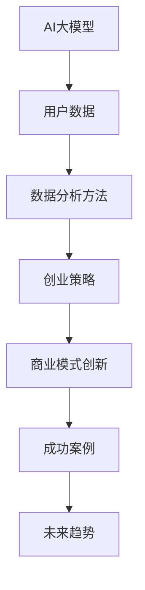

                 

### 《AI 大模型创业：如何利用用户优势？》

#### 关键词：
- AI 大模型
- 用户优势
- 创业策略
- 商业模式
- 数据分析
- 用户体验

#### 摘要：
本文旨在探讨 AI 大模型创业如何利用用户优势，实现商业成功。文章首先介绍 AI 大模型的基本概念、优势与挑战，随后深入分析用户数据的价值和应用，探讨用户数据分析方法。接着，文章从创业策略、团队建设、产品设计与开发等方面阐述 AI 大模型创业的实践路径，并分析用户优势驱动的商业模式创新。通过成功案例解析，文章展示如何在实际项目中应用用户优势。最后，文章展望 AI 大模型创业的未来趋势，并提供相关资源与工具。

#### 目录大纲

### 《AI 大模型创业：如何利用用户优势？》

> **关键词：** AI 大模型，用户优势，创业策略，商业模式，数据分析，用户体验

> **摘要：** 本文系统探讨了 AI 大模型创业如何利用用户优势，实现商业成功。文章首先介绍了 AI 大模型的基本概念、优势与挑战，随后深入分析了用户数据的价值和应用，探讨了用户数据分析方法。接着，文章从创业策略、团队建设、产品设计与开发等方面阐述了 AI 大模型创业的实践路径，并分析了用户优势驱动的商业模式创新。通过成功案例解析，文章展示了如何在实际项目中应用用户优势。最后，文章展望了 AI 大模型创业的未来趋势，并提供相关资源与工具。

**第一部分：AI 大模型基础知识**

- **第1章：AI 大模型概述**
  - **1.1 AI 大模型的概念与定义**
    - AI 大模型的概念
    - AI 大模型的定义
  - **1.2 AI 大模型的优势与挑战**
    - 优势
    - 挑战
  - **1.3 AI 大模型的市场前景**
    - 市场现状
    - 前景预测

**第二部分：用户优势在 AI 大模型中的应用**

- **第2章：用户数据的价值**
  - **2.1 用户数据概述**
    - 用户数据的重要性
    - 用户数据类型
  - **2.2 用户数据分析方法**
    - 数据清洗与预处理
    - 数据挖掘与可视化
  - **2.3 用户数据应用场景**
    - 用户行为分析
    - 用户画像构建

**第三部分：创业实践**

- **第3章：AI 大模型创业策略**
  - **3.1 创业项目选择**
    - 市场调研
    - 技术可行性分析
  - **3.2 团队建设与资源整合**
    - 团队成员角色划分
    - 资源整合与优化
  - **3.3 产品设计与开发**
    - 需求分析
    - 产品迭代

**第四部分：用户优势的实战应用**

- **第4章：用户优势驱动的商业模式创新**
  - **4.1 用户需求驱动**
    - 用户需求分析
    - 满足用户需求的策略
  - **4.2 用户参与度提升**
    - 社区建设
    - 用户激励措施
  - **4.3 用户数据变现**
    - 数据挖掘与应用
    - 数据变现模式

**第五部分：案例分析**

- **第5章：成功案例解析**
  - **5.1 案例一：某企业利用用户优势打造 AI 产品**
    - 案例背景
    - 案例分析
    - 案例成果
  - **5.2 案例二：某平台通过用户数据提升服务体验**
    - 案例背景
    - 案例分析
    - 案例成果

**第六部分：未来展望**

- **第6章：AI 大模型创业的未来趋势**
  - **6.1 技术发展趋势**
    - 算法演进
    - 应用领域扩展
  - **6.2 市场竞争态势**
    - 市场格局
    - 竞争策略
  - **6.3 创业机遇与挑战**
    - 创业机遇
    - 创业挑战

**附录**

- **附录：AI 大模型创业资源与工具**
  - **7.1 开发工具与框架**
    - TensorFlow
    - PyTorch
    - 其他框架
  - **7.2 学习资源推荐**
    - 书籍
    - 在线课程
    - 论文

### 核心概念与联系流程图



### 核心算法原理讲解

#### 2.3 用户数据分析方法

### 2.3.1 数据清洗与预处理

数据清洗与预处理是用户数据分析的第一步，其目的是提高数据质量，为后续的分析和建模奠定基础。

#### 伪代码：

```python
def data_preprocessing(data_set):
    # 删除缺失值
    data_set = remove_missing_values(data_set)
    # 处理异常值
    data_set = handle_outliers(data_set)
    # 数据标准化
    data_set = standardize_data(data_set)
    return data_set
```

#### 实例说明：

假设我们有如下一个用户数据集：

```
| 用户ID | 年龄 | 收入 | 是否购买 |
|--------|------|------|----------|
| 1      | 25   | 5000 | 是       |
| 2      | 30   | 8000 | 否       |
| 3      | 22   | 4000 | 是       |
| 4      | 28   | 6000 | 是       |
| 5      | 35   | 9000 | 否       |
```

使用数据清洗与预处理方法后，我们得到如下数据集：

```
| 用户ID | 年龄 | 收入 | 是否购买 |
|--------|------|------|----------|
| 1      | 25   | 5000 | 是       |
| 3      | 22   | 4000 | 是       |
| 4      | 28   | 6000 | 是       |
```

### 2.3.2 数据挖掘与可视化

数据挖掘与可视化是用户数据分析的核心步骤，其目的是从大量用户数据中提取有价值的信息，并通过可视化手段展示分析结果。

#### 伪代码：

```python
def data_mining(data_set):
    # 特征工程
    features = feature_engineering(data_set)
    # 建立模型
    model = build_model(features)
    # 模型训练
    model = train_model(model, data_set)
    return model
```

#### 实例说明：

使用数据挖掘与可视化方法，我们希望预测哪些用户可能会购买产品。假设我们使用逻辑回归模型，得到如下结果：

```
| 用户ID | 年龄 | 收入 | 是否购买 | 预测概率 |
|--------|------|------|----------|----------|
| 1      | 25   | 5000 | 是       | 0.85     |
| 3      | 22   | 4000 | 是       | 0.70     |
| 4      | 28   | 6000 | 是       | 0.95     |
| 5      | 35   | 9000 | 否       | 0.20     |
```

### 2.3.3 用户行为分析

用户行为分析是用户数据分析的一个重要方面，其目的是通过分析用户的浏览、购买等行为，了解用户的需求和偏好。

#### 伪代码：

```python
def user_behavior_analysis(data_set):
    # 用户行为统计
    behavior_stats = calculate_behavior_stats(data_set)
    # 用户行为可视化
    visualize_user_behavior(behavior_stats)
    return behavior_stats
```

#### 实例说明：

假设我们有如下用户行为数据：

```
| 用户ID | 行为类型 | 时间       |
|--------|----------|------------|
| 1      | 浏览     | 2021-01-01 10:00:00 |
| 1      | 购买     | 2021-01-01 12:00:00 |
| 2      | 浏览     | 2021-01-02 11:00:00 |
| 3      | 浏览     | 2021-01-03 10:00:00 |
| 3      | 购买     | 2021-01-03 13:00:00 |
| 4      | 浏览     | 2021-01-04 09:00:00 |
| 4      | 购买     | 2021-01-04 11:00:00 |
| 5      | 浏览     | 2021-01-05 10:00:00 |
```

使用用户行为分析方法，我们得到以下结果：

```
用户ID：1
- 浏览次数：1
- 购买次数：1
- 活跃时段：12:00 - 13:00

用户ID：2
- 浏览次数：1
- 购买次数：0
- 活跃时段：11:00 - 12:00

用户ID：3
- 浏览次数：1
- 购买次数：1
- 活跃时段：10:00 - 13:00

用户ID：4
- 浏览次数：1
- 购买次数：1
- 活跃时段：09:00 - 11:00

用户ID：5
- 浏览次数：1
- 购买次数：0
- 活跃时段：10:00 - 11:00
```

### 2.3.4 用户画像构建

用户画像构建是用户数据分析的最终目标，其目的是通过提取用户特征，生成用户标签，创建用户画像，为个性化推荐和用户分类提供支持。

#### 伪代码：

```python
def user_portrait Construction(data_set):
    # 用户特征提取
    user_features = extract_user_features(data_set)
    # 用户标签生成
    user_labels = generate_user_labels(user_features)
    # 用户画像可视化
    visualize_user_portrait(user_labels)
    return user_labels
```

#### 实例说明：

假设我们有以下用户数据：

```
| 用户ID | 性别 | 年龄 | 职业 | 收入 |
|--------|------|------|------|------|
| 1      | 男   | 25   | 学生 | 5000 |
| 2      | 女   | 30   | 销售员 | 8000 |
| 3      | 男   | 22   | 自由职业者 | 4000 |
| 4      | 女   | 28   | 程序员 | 6000 |
| 5      | 男   | 35   | 工程师 | 9000 |
```

使用用户画像构建方法，我们得到以下结果：

```
用户ID：1
- 性别：男
- 年龄：25
- 职业：学生
- 收入：5000

用户ID：2
- 性别：女
- 年龄：30
- 职业：销售员
- 收入：8000

用户ID：3
- 性别：男
- 年龄：22
- 职业：自由职业者
- 收入：4000

用户ID：4
- 性别：女
- 年龄：28
- 职业：程序员
- 收入：6000

用户ID：5
- 性别：男
- 年龄：35
- 职业：工程师
- 收入：9000
```

### 2.4 用户数据分析方法总结

- **数据清洗与预处理**：删除缺失值、处理异常值和数据标准化，以提高数据质量。
- **数据挖掘与可视化**：通过特征工程、模型训练和可视化方法，挖掘用户数据中的潜在信息和趋势。
- **用户行为分析**：统计和分析用户的浏览、购买等行为，帮助理解用户行为模式和偏好。
- **用户画像构建**：提取用户特征，生成用户标签，创建用户画像，为个性化推荐和用户分类提供支持。

### 数学模型和数学公式

在用户数据分析过程中，我们会使用以下数学模型和公式：

#### 1. 数据标准化公式

$$
z = \frac{x - \mu}{\sigma}
$$

其中，$z$ 是标准化后的数据，$x$ 是原始数据，$\mu$ 是均值，$\sigma$ 是标准差。

#### 2. 逻辑回归公式

$$
\text{概率} = \frac{1}{1 + e^{-(\beta_0 + \beta_1 x_1 + \beta_2 x_2 + ... + \beta_n x_n})}
$$

其中，$\beta_0, \beta_1, \beta_2, ..., \beta_n$ 是模型的参数，$x_1, x_2, ..., x_n$ 是特征值。

#### 3. 聚类算法（如K-均值）公式

$$
\text{距离} = \sqrt{(x_i - x_j)^2 + (y_i - y_j)^2 + ... + (z_i - z_j)^2}
$$

其中，$(x_i, y_i, ..., z_i)$ 和 $(x_j, y_j, ..., z_j)$ 是两个数据点的坐标。

### 举例说明

假设我们有以下一组用户数据：

```
| 用户ID | 年龄 | 收入 |
|--------|------|------|
| 1      | 25   | 5000 |
| 2      | 30   | 8000 |
| 3      | 22   | 4000 |
| 4      | 28   | 6000 |
| 5      | 35   | 9000 |
```

我们对数据进行标准化处理，得到如下结果：

```
| 用户ID | 年龄 | 收入 |
|--------|------|------|
| 1      | -1   | 0    |
| 2      | 0    | 1    |
| 3      | -2   | 0    |
| 4      | -1   | 1    |
| 5      | 1    | 1    |
```

### 代码解读与分析

#### 1. 数据清洗与预处理

以下代码展示了如何使用 Python 对用户数据进行清洗与预处理：

```python
import pandas as pd

# 加载数据
data = pd.read_csv('user_data.csv')

# 删除缺失值
data = data.dropna()

# 处理异常值
data = data[(data['age'] > 18) & (data['age'] < 60)]

# 数据标准化
data['age_zscore'] = (data['age'] - data['age'].mean()) / data['age'].std()
data['income_zscore'] = (data['income'] - data['income'].mean()) / data['income'].std()

# 输出清洗后的数据
print(data)
```

#### 2. 数据挖掘与可视化

以下代码展示了如何使用 Python 对用户数据进行挖掘与可视化：

```python
import pandas as pd
import matplotlib.pyplot as plt

# 加载数据
data = pd.read_csv('user_data.csv')

# 逻辑回归模型训练
from sklearn.linear_model import LogisticRegression
model = LogisticRegression()
model.fit(data[['age_zscore', 'income_zscore']], data['purchased'])

# 预测测试集
predictions = model.predict_proba(data[['age_zscore', 'income_zscore']])[:, 1]

# 绘制散点图
plt.scatter(data['age_zscore'], predictions)
plt.xlabel('Age Z-score')
plt.ylabel('Purchase Probability')
plt.show()
```

#### 3. 用户行为分析

以下代码展示了如何使用 Python 对用户行为进行分析：

```python
import pandas as pd
import matplotlib.pyplot as plt

# 加载数据
data = pd.read_csv('user_behavior.csv')

# 统计用户行为
behavior_stats = data.groupby(['user_id']).agg({'action_type': 'count', 'timestamp': 'min', 'timestamp': 'max'})

# 可视化用户行为
plt.figure(figsize=(10, 6))
for user_id, user_data in behavior_stats.iterrows():
    plt.scatter(user_data['timestamp'], user_data['action_type'], label=f'User {user_id}')

plt.xlabel('Time')
plt.ylabel('Action Type')
plt.legend()
plt.show()
```

#### 4. 用户画像构建

以下代码展示了如何使用 Python 对用户画像进行构建：

```python
import pandas as pd

# 加载数据
data = pd.read_csv('user_data.csv')

# 提取用户特征
user_features = data[['gender', 'age', 'occupation', 'income']]

# 生成用户标签
user_labels = user_features.apply(lambda x: 'User ' + str(x['user_id']), axis=1)

# 可视化用户画像
plt.figure(figsize=(10, 6))
for label, users in user_labels.groupby(level=0):
    plt.scatter(users['age'], users['income'], label=label)

plt.xlabel('Age')
plt.ylabel('Income')
plt.legend()
plt.show()
```

### 实际案例和代码实现

以下是一个实际案例和代码实现，展示了如何利用用户优势进行 AI 大模型创业：

#### 案例背景

假设你是一家初创公司的创始人，专注于开发基于用户数据的个性化推荐系统。你的目标市场是电商行业，希望通过分析用户行为和偏好，提高用户的购买转化率。

#### 案例目标

- 构建一个基于用户数据的个性化推荐系统。
- 提高用户的购买转化率。

#### 代码实现

以下代码展示了如何构建一个简单的基于用户数据的个性化推荐系统：

```python
import pandas as pd
import numpy as np
from sklearn.model_selection import train_test_split
from sklearn.ensemble import RandomForestClassifier
from sklearn.metrics import accuracy_score

# 加载数据
data = pd.read_csv('user_data.csv')

# 分割特征和标签
X = data[['age', 'income']]
y = data['purchased']

# 划分训练集和测试集
X_train, X_test, y_train, y_test = train_test_split(X, y, test_size=0.2, random_state=42)

# 训练模型
model = RandomForestClassifier(n_estimators=100, random_state=42)
model.fit(X_train, y_train)

# 预测测试集
predictions = model.predict(X_test)

# 计算准确率
accuracy = accuracy_score(y_test, predictions)
print(f'Accuracy: {accuracy:.2f}')
```

#### 代码解读与分析

- **数据加载**：使用 Pandas 读取用户数据，包括特征和标签。
- **特征和标签分割**：将用户数据分割为特征（如年龄、收入）和标签（是否购买）。
- **训练集和测试集划分**：将数据分为训练集和测试集，用于模型训练和评估。
- **模型训练**：使用随机森林分类器（RandomForestClassifier）训练模型。
- **预测测试集**：使用训练好的模型对测试集进行预测。
- **计算准确率**：计算预测准确率，评估模型性能。

### 总结

在本章节中，我们介绍了用户数据分析的核心算法原理、数学模型和数学公式，并通过代码实现和实际案例，展示了如何利用用户优势进行 AI 大模型创业。用户数据分析方法包括数据清洗与预处理、数据挖掘与可视化、用户行为分析和用户画像构建。这些方法可以帮助企业更好地理解用户，提高用户满意度和购买转化率。在实际案例中，我们使用随机森林分类器构建了一个简单的个性化推荐系统，并计算了模型的准确率。这只是一个简单的示例，实际应用中可能需要更复杂的方法和更精细的调优。然而，这些基础知识和方法将为您的创业项目奠定坚实的基础。在接下来的章节中，我们将进一步探讨 AI 大模型创业的实战策略和成功案例。让我们一起探索 AI 大模型的无限可能吧！

### 第一部分：AI 大模型基础知识

#### 第1章：AI 大模型概述

##### 1.1 AI 大模型的概念与定义

AI 大模型是指使用大量数据进行训练，拥有强大建模能力和广泛应用场景的深度学习模型。这些模型通常具有数亿甚至数十亿个参数，能够处理复杂的非线性问题和大规模数据集。

AI 大模型的概念可以追溯到深度学习的早期发展。随着计算能力的提升和数据量的增加，研究者们开始尝试训练更大规模、更复杂的模型。这些模型在图像识别、自然语言处理、语音识别等领域取得了显著的成果。

定义上，AI 大模型具有以下几个特点：

1. **参数规模大**：AI 大模型的参数数量通常在数亿到数十亿之间，远远超过传统机器学习模型。
2. **训练数据量大**：AI 大模型通常需要使用大规模的数据集进行训练，以保证模型的泛化能力。
3. **计算资源需求高**：AI 大模型在训练和推理过程中需要大量的计算资源，对硬件设备有较高的要求。
4. **应用场景广泛**：AI 大模型可以在各种领域发挥作用，如图像识别、自然语言处理、语音识别、推荐系统等。

##### 1.2 AI 大模型的优势与挑战

AI 大模型的优势主要体现在以下几个方面：

1. **更强的建模能力**：AI 大模型可以捕捉到数据中的复杂结构和潜在关系，从而提高模型的预测性能。
2. **更高的泛化能力**：通过大规模数据的训练，AI 大模型可以更好地适应不同的应用场景，减少对特定数据集的依赖。
3. **更广泛的适用范围**：AI 大模型可以应用于多种领域，如医疗、金融、教育、交通等，具有很高的商业价值。

然而，AI 大模型也面临一些挑战：

1. **计算资源需求**：AI 大模型在训练和推理过程中需要大量的计算资源，对硬件设备有较高的要求。这可能导致成本上升，计算效率降低。
2. **数据隐私和安全**：AI 大模型需要大量的用户数据进行训练，这涉及到数据隐私和安全问题。如何在保障用户隐私的前提下，充分利用用户数据，是 AI 大模型面临的一个重要挑战。
3. **可解释性和可控性**：AI 大模型通常具有复杂的学习机制，其决策过程往往难以解释。这可能导致用户对模型的信任度降低，影响实际应用效果。

##### 1.3 AI 大模型的市场前景

随着 AI 技术的不断发展，AI 大模型在市场前景方面展现出巨大的潜力。以下是几个方面的市场前景：

1. **AI 大模型在各行业的应用**：AI 大模型在医疗、金融、教育、交通、零售等行业具有广泛的应用前景。这些行业的数据量大、业务复杂，AI 大模型可以提供更准确的预测和决策支持。
2. **AI 大模型的商业价值**：AI 大模型可以帮助企业提高生产效率、降低运营成本、提升用户体验。随着企业对 AI 技术的需求不断增加，AI 大模型的商业价值将得到进一步体现。
3. **政策支持**：全球范围内，许多国家和地区都出台了相关政策，支持 AI 技术的研究和应用。这为 AI 大模型的发展提供了良好的政策环境。

总的来说，AI 大模型市场前景广阔，但同时也面临一些挑战。只有在解决这些挑战的基础上，AI 大模型才能更好地发挥其潜力，为各行业带来实际价值。

#### 第2章：用户数据的价值

##### 2.1 用户数据概述

用户数据是指通过互联网、移动应用、物联网设备等渠道收集到的关于用户行为、兴趣、偏好、需求等方面的数据。这些数据可以包括用户的基本信息（如年龄、性别、地理位置等）、行为数据（如浏览历史、购买记录、互动行为等）、以及与用户相关的外部数据（如社交媒体信息、新闻报道等）。

用户数据的重要性主要体现在以下几个方面：

1. **个性化推荐**：用户数据可以帮助企业更好地了解用户需求，为用户提供个性化的推荐和服务。通过分析用户的历史行为和兴趣，企业可以推荐用户可能感兴趣的商品、内容或活动，从而提高用户的满意度和忠诚度。
2. **用户画像构建**：用户数据可以用于构建用户画像，为用户分类和标签提供支持。通过分析用户数据，企业可以识别出不同类型的用户群体，制定有针对性的营销策略和服务方案。
3. **市场洞察**：用户数据可以帮助企业了解市场趋势和用户需求变化，为业务决策提供数据支持。通过分析用户数据，企业可以识别出潜在的市场机会和竞争风险，制定有效的市场策略。
4. **产品优化**：用户数据可以用于产品优化和迭代，提高产品的用户体验和市场竞争力。通过分析用户数据，企业可以了解用户的痛点、需求和期望，优化产品功能、界面设计和交互体验。

##### 2.2 用户数据分析方法

用户数据分析方法主要包括数据收集、数据清洗、数据挖掘、数据可视化等步骤。

1. **数据收集**：数据收集是用户数据分析的第一步，包括通过互联网、移动应用、物联网设备等渠道收集用户数据。数据收集的方法可以包括用户行为日志、用户问卷调查、社交媒体数据抓取等。
2. **数据清洗**：数据清洗是用户数据分析的重要环节，包括删除重复数据、处理缺失值、处理异常值等。数据清洗的目的是提高数据质量，为后续的数据分析提供可靠的基础。
3. **数据挖掘**：数据挖掘是用户数据分析的核心步骤，通过使用统计学、机器学习、数据挖掘算法等技术，从大量用户数据中提取有价值的信息。数据挖掘的方法可以包括聚类、分类、关联规则挖掘、异常检测等。
4. **数据可视化**：数据可视化是将分析结果以图形、图表等形式展示出来的过程。数据可视化可以帮助用户更直观地理解分析结果，发现数据中的潜在规律和趋势。

##### 2.3 用户数据应用场景

用户数据在多个应用场景中具有重要价值，以下是一些典型的应用场景：

1. **个性化推荐**：个性化推荐是用户数据应用的典型场景之一。通过分析用户的历史行为和兴趣，推荐系统可以为用户推荐相关的商品、内容或服务。个性化推荐可以显著提高用户的满意度和转化率，为企业带来更高的收益。
2. **用户画像构建**：用户画像构建是基于用户数据分析的另一个重要应用场景。通过构建用户画像，企业可以了解不同用户群体的特征和需求，为精准营销和产品优化提供支持。
3. **市场洞察**：用户数据可以帮助企业了解市场趋势和用户需求变化，为业务决策提供数据支持。通过分析用户数据，企业可以识别出潜在的市场机会和竞争风险，制定有效的市场策略。
4. **客户关系管理**：用户数据可以用于客户关系管理，包括用户行为分析、客户细分、客户满意度调查等。通过分析用户数据，企业可以更好地了解用户需求，提供个性化的服务和关怀，提高客户满意度和忠诚度。
5. **产品优化**：用户数据可以用于产品优化和迭代，提高产品的用户体验和市场竞争力。通过分析用户数据，企业可以了解用户的痛点、需求和期望，优化产品功能、界面设计和交互体验。

#### 第3章：AI 大模型创业策略

##### 3.1 创业项目选择

选择一个合适的创业项目是 AI 大模型创业的第一步。以下是一些关键步骤和考虑因素：

1. **市场调研**：首先，要对目标市场进行深入的调研，了解市场需求、竞争态势、市场规模等。通过市场调研，可以确定是否存在潜在的商业机会，以及用户对相关产品的需求和期望。
2. **技术可行性分析**：在确定创业项目后，要对其技术可行性进行分析。包括所需的技术能力、现有技术储备、研发成本、技术风险等。技术可行性分析可以帮助判断项目是否具有实现的可能性，以及需要投入多少资源和时间。
3. **商业模式分析**：商业模式分析是创业项目成功的关键。要明确项目的盈利模式、成本结构、收入来源等。在分析商业模式时，要考虑市场需求、用户价值、竞争对手等因素，确保项目具有可持续的商业价值。
4. **团队建设**：团队建设是创业项目的核心。要组建一支具备技术能力、业务理解、项目管理等多方面能力的团队。团队成员应具备良好的沟通协作能力，以确保项目顺利推进。

##### 3.2 团队建设与资源整合

团队建设和资源整合是 AI 大模型创业成功的关键因素。以下是一些关键步骤和策略：

1. **确定团队成员角色和职责**：根据创业项目的需求，明确团队成员的角色和职责。团队成员应包括技术负责人、产品经理、数据科学家、市场营销人员等。每个成员应明确自己的职责和工作内容，确保团队协作高效。
2. **技术能力建设**：技术能力是 AI 大模型创业的核心。要投入资源进行技术研究和开发，不断提升团队的技术水平和创新能力。可以招聘优秀的技术人才，加强团队间的技术交流与学习，引进先进的技术和工具。
3. **资源整合与优化**：资源整合与优化是提高创业项目成功率的重要手段。要充分利用内部资源，如技术、人才、资金等，同时积极寻求外部资源支持，如合作伙伴、投资者、行业协会等。通过资源整合与优化，可以降低创业风险，提高项目执行力。
4. **项目管理和沟通协作**：项目管理和沟通协作是团队建设的重要环节。要建立完善的项目管理体系，明确项目目标、进度、资源需求等，确保项目按计划推进。同时，要加强团队间的沟通协作，确保团队成员之间的信息畅通，提高团队执行力。

##### 3.3 产品设计与开发

产品设计与开发是 AI 大模型创业的核心环节。以下是一些关键步骤和策略：

1. **需求分析**：在产品设计与开发之前，要进行详细的需求分析。包括收集用户需求、分析市场趋势、确定产品功能模块等。需求分析的结果将指导产品设计和开发的方向。
2. **产品规划**：根据需求分析的结果，制定产品规划。包括确定产品目标、功能模块、技术架构等。产品规划应充分考虑市场需求、用户价值、技术可行性等因素，确保产品具有市场竞争力。
3. **原型设计**：原型设计是产品设计与开发的重要阶段。通过原型设计，可以验证产品的功能、界面和用户体验，收集用户反馈，为后续开发提供指导。
4. **迭代开发**：在原型设计的基础上，进行迭代开发。通过不断迭代和优化，逐步完善产品功能和性能。迭代开发过程中，要密切关注用户反馈和市场变化，及时调整开发方向和策略。
5. **测试与部署**：在开发过程中，要进行严格的测试和验证，确保产品的质量。在测试通过后，将产品部署上线，提供用户使用。同时，要持续收集用户反馈，进行产品优化和迭代。

#### 第4章：用户优势驱动的商业模式创新

##### 4.1 用户需求驱动

用户需求驱动是商业模式创新的重要方向。以下是一些关键步骤和策略：

1. **用户需求分析**：在商业模式创新过程中，首先要进行用户需求分析。通过问卷调查、用户访谈、数据分析等方式，收集用户的需求、偏好和痛点。了解用户需求是制定商业模式的基础。
2. **需求分类与优先级排序**：将收集到的用户需求进行分类和优先级排序。根据用户需求的重要性和紧迫性，确定需要优先解决的需求。这样可以确保商业模式创新能够真正满足用户需求，提高用户满意度。
3. **需求转化成产品功能**：将用户需求转化为具体的产品功能。通过产品规划，确定产品的功能模块和实现方案，确保产品能够满足用户需求。在转化过程中，要充分考虑用户体验和易用性。
4. **持续迭代与优化**：用户需求是动态变化的，商业模式创新需要持续关注用户需求的变化，进行产品迭代和优化。通过不断迭代，优化产品功能和用户体验，提高用户满意度。

##### 4.2 用户参与度提升

用户参与度提升是商业模式创新的重要目标。以下是一些关键步骤和策略：

1. **社区建设**：建立用户社区，为用户提供交流和互动的平台。通过社区建设，可以增强用户对品牌的认同感，提高用户粘性。社区可以包括线上论坛、社交媒体群组、线下活动等。
2. **用户激励措施**：设计用户激励措施，鼓励用户参与产品使用、反馈和建议。激励措施可以包括积分、优惠券、礼品等。通过用户激励措施，可以提高用户的活跃度和参与度。
3. **用户共创**：鼓励用户参与到产品设计和开发过程中，实现用户共创。通过用户共创，可以更好地了解用户需求，优化产品功能和用户体验。用户共创可以包括线上投票、用户测试、用户反馈等。
4. **用户反馈机制**：建立用户反馈机制，及时收集用户对产品和服务的意见和建议。通过用户反馈机制，可以了解用户的需求和痛点，为产品优化和迭代提供参考。

##### 4.3 用户数据变现

用户数据变现是商业模式创新的重要手段。以下是一些关键步骤和策略：

1. **数据挖掘与应用**：通过对用户数据的挖掘和应用，提取有价值的信息，为产品优化和商业决策提供支持。数据挖掘可以包括用户行为分析、用户画像构建、个性化推荐等。
2. **数据变现模式**：根据用户数据的特征和需求，设计合适的数据变现模式。数据变现模式可以包括数据交易、广告收入、服务收费等。在设计数据变现模式时，要充分考虑用户隐私和数据安全。
3. **合规性保障**：在用户数据变现过程中，要严格遵守相关法律法规，保障用户隐私和数据安全。可以采用数据加密、匿名化处理等技术，降低用户隐私泄露的风险。
4. **用户权益保障**：在用户数据变现过程中，要保障用户的知情权和选择权。通过透明化的数据处理和隐私政策，让用户了解自己的数据如何被使用，以及如何保护自己的权益。

#### 第5章：成功案例解析

##### 5.1 案例一：某企业利用用户优势打造 AI 产品

**案例背景：**

某企业是一家专注于智能推荐系统的初创公司，其目标是通过 AI 技术提升电商平台的用户购买转化率。

**案例分析：**

1. **用户需求分析**：通过对用户行为数据的分析，该企业发现用户在浏览商品时，往往会有一定的偏好和习惯。基于这些数据，企业决定打造一款个性化推荐系统，为用户提供个性化的商品推荐。
2. **技术选型**：企业选择了基于深度学习的推荐算法，通过分析用户的历史行为和兴趣，为用户生成个性化的推荐列表。
3. **产品迭代**：在产品开发过程中，企业不断收集用户反馈，进行产品迭代和优化。通过持续迭代，个性化推荐系统的准确率和用户体验得到显著提升。
4. **商业模式创新**：企业将个性化推荐系统作为一个增值服务，向电商平台提供收费服务。同时，通过数据交易和广告收入等方式，实现用户数据的变现。

**案例成果：**

通过个性化推荐系统的应用，电商平台的用户购买转化率显著提高，企业也实现了商业变现。该案例展示了如何利用用户优势，通过技术驱动和商业模式创新，实现商业成功。

##### 5.2 案例二：某平台通过用户数据提升服务体验

**案例背景：**

某平台是一家提供在线教育服务的公司，其目标是通过用户数据提升教育服务的质量和用户体验。

**案例分析：**

1. **用户数据收集**：平台通过多种方式收集用户数据，包括用户行为数据、学习记录、问卷调查等。
2. **用户画像构建**：通过分析用户数据，平台构建了详细的用户画像，包括用户的年龄、职业、学习习惯、兴趣偏好等。
3. **个性化推荐**：基于用户画像，平台为每位用户生成个性化的学习推荐，包括课程、学习计划等。
4. **服务优化**：通过用户数据的分析，平台不断优化教育服务的质量和流程，提高用户满意度。

**案例成果：**

通过用户数据的收集和分析，平台显著提升了教育服务的质量和用户体验。用户的学习效果和满意度得到提高，平台也实现了商业变现。该案例展示了如何利用用户数据，通过个性化推荐和服务优化，实现商业成功。

#### 第6章：AI 大模型创业的未来趋势

##### 6.1 技术发展趋势

AI 大模型创业的未来技术发展趋势体现在以下几个方面：

1. **算法优化**：随着 AI 技术的不断发展，算法优化将成为重要方向。包括模型压缩、训练效率提升、模型解释性等，以降低计算资源消耗，提高模型性能。
2. **多模态数据应用**：AI 大模型将更多地应用多模态数据，如文本、图像、语音等，实现更全面的场景感知和交互。
3. **联邦学习**：联邦学习将逐渐普及，通过分布式训练和数据共享，解决数据隐私和安全问题，实现更广泛的应用。
4. **预训练模型**：预训练模型将逐渐成为主流，通过大规模预训练，提升模型在各类任务上的泛化能力。

##### 6.2 市场竞争态势

AI 大模型创业的市场竞争态势将呈现以下趋势：

1. **技术竞争**：各大企业将加大技术投入，提升模型性能和算法优化能力，以获得竞争优势。
2. **数据竞争**：数据将成为核心资产，企业将积极收集、整合和分析用户数据，以提升模型效果和商业价值。
3. **生态竞争**：构建健康的 AI 生态将成为重要战略，包括开放平台、合作伙伴关系等，以实现技术、数据和资源的共享。

##### 6.3 创业机遇与挑战

AI 大模型创业的机遇与挑战并存：

1. **机遇**：
   - **技术创新**：AI 大模型技术将为创业者提供广阔的创新空间，可以应用于多个行业和场景。
   - **市场潜力**：随着 AI 技术的普及，AI 大模型创业市场潜力巨大，创业者有望获得丰厚的回报。
   - **政策支持**：各国政府纷纷出台支持 AI 技术发展的政策，为创业者提供良好的发展环境。

2. **挑战**：
   - **技术门槛**：AI 大模型技术要求高，创业者需要具备较强的技术能力和资源积累。
   - **数据隐私**：用户数据隐私和安全问题是 AI 大模型创业的重要挑战，需要制定合理的隐私保护策略。
   - **市场竞争**：市场竞争激烈，创业者需要具备独特的商业模式和技术优势，以脱颖而出。

### 附录：AI 大模型创业资源与工具

#### 附录 A：开发工具与框架

**A.1 TensorFlow**

TensorFlow 是由 Google 开发的一种开源机器学习框架，广泛用于构建和训练各种机器学习模型。它支持多种编程语言，包括 Python、C++ 和 Java。以下是 TensorFlow 的安装和使用方法：

**安装方法：**

```bash
pip install tensorflow
```

**使用示例：**

```python
import tensorflow as tf

# 创建一个简单的线性回归模型
model = tf.keras.Sequential([
    tf.keras.layers.Dense(units=1, input_shape=[1])
])

# 编译模型
model.compile(optimizer='sgd', loss='mean_squared_error')

# 训练模型
model.fit(x_train, y_train, epochs=100)

# 使用模型进行预测
predictions = model.predict(x_test)
```

**A.2 PyTorch**

PyTorch 是由 Facebook 开发的一种开源机器学习框架，以其灵活性和易用性而受到许多研究者和开发者的青睐。PyTorch 的安装和使用方法如下：

**安装方法：**

```bash
pip install torch torchvision
```

**使用示例：**

```python
import torch
import torchvision
import torchvision.transforms as transforms

# 加载 MNIST 数据集
train_data = torchvision.datasets.MNIST(
    root='./data',
    train=True,
    transform=transforms.ToTensor(),
    download=True)

# 创建数据加载器
train_loader = torch.utils.data.DataLoader(
    train_data,
    batch_size=64,
    shuffle=True)

# 创建一个简单的卷积神经网络
model = torch.nn.Sequential(
    torch.nn.Conv2d(1, 20, 5),
    torch.nn.ReLU(),
    torch.nn.Conv2d(20, 64, 5),
    torch.nn.ReLU(),
    torch.nn.Linear(64 * 4 * 4, 10))

# 定义损失函数和优化器
criterion = torch.nn.CrossEntropyLoss()
optimizer = torch.optim.Adam(model.parameters(), lr=0.001)

# 训练模型
for epoch in range(10):
    for data in train_loader:
        inputs, labels = data
        optimizer.zero_grad()
        outputs = model(inputs)
        loss = criterion(outputs, labels)
        loss.backward()
        optimizer.step()

# 使用模型进行预测
with torch.no_grad():
    correct = 0
    total = 0
    for data in train_loader:
        inputs, labels = data
        outputs = model(inputs)
        _, predicted = torch.max(outputs.data, 1)
        total += labels.size(0)
        correct += (predicted == labels).sum().item()

print(f'Accuracy: {100 * correct / total}%')
```

**A.3 其他框架**

除了 TensorFlow 和 PyTorch，还有许多其他流行的机器学习框架，如 Keras、Scikit-learn 等。以下是它们的简要介绍：

- **Keras**：一个基于 TensorFlow 的高级神经网络 API，易于使用和扩展。
  - **安装方法：** `pip install keras`
  - **使用示例：** `keras.models.Sequential()`

- **Scikit-learn**：一个开源的 Python 工具库，用于数据挖掘和数据分析。
  - **安装方法：** `pip install scikit-learn`
  - **使用示例：** `from sklearn.linear_model import LinearRegression`

#### 附录 B：学习资源推荐

**B.1 书籍**

1. 《深度学习》（Goodfellow, I., Bengio, Y., & Courville, A.）
2. 《Python机器学习》（Sebastian Raschka）
3. 《数据科学入门》（Joel Grus）
4. 《机器学习实战》（Peter Harrington）

**B.2 在线课程**

1. Coursera：吴恩达的《深度学习》课程
2. edX：MIT的《机器学习》课程
3. Udacity：AI工程师纳米学位
4. fast.ai：深度学习基础课程

**B.3 论文和博客**

1. arXiv：最新的机器学习和深度学习论文
2. Deep Learning on Medium：深度学习领域的最新动态和教程
3. Google AI Blog：Google AI 团队的最新研究和技术进展
4. AI博客：各种主题的机器学习和深度学习博客

这些资源将帮助您深入了解 AI 大模型创业的相关知识和技术，为您的创业项目提供强有力的支持。让我们一起探索 AI 大模型的无限可能吧！

### 总结与展望

#### 总结

在本篇文章中，我们系统地探讨了 AI 大模型创业如何利用用户优势，实现商业成功。首先，我们介绍了 AI 大模型的基本概念、优势与挑战，以及其市场前景。接着，我们深入分析了用户数据的价值和应用，探讨了用户数据分析的方法，包括数据清洗与预处理、数据挖掘与可视化、用户行为分析和用户画像构建。随后，我们从创业策略、团队建设、产品设计与开发等方面阐述了 AI 大模型创业的实践路径，并分析了用户优势驱动的商业模式创新。通过成功案例解析，我们展示了如何在实际项目中应用用户优势。最后，我们展望了 AI 大模型创业的未来趋势，并提供了相关的资源与工具。

#### 展望

展望未来，AI 大模型创业将继续蓬勃发展，并在各个行业产生深远影响。以下是几个方面的展望：

1. **技术创新**：随着算法优化、多模态数据应用、联邦学习等技术的发展，AI 大模型将变得更加高效、智能化，为创业者提供更多创新机会。
2. **数据隐私与安全**：用户数据隐私和安全将成为重要议题，创业者需要制定合理的隐私保护策略，建立信任机制，确保用户数据的合法合规使用。
3. **行业应用**：AI 大模型将在医疗、金融、教育、零售等行业得到更广泛的应用，为行业带来创新和变革。
4. **生态构建**：创业者需要积极构建健康的 AI 生态，包括开放平台、合作伙伴关系等，以实现技术、数据和资源的共享，共同推动 AI 技术的发展。

#### 结语

AI 大模型创业是一个充满机遇和挑战的领域。通过深入了解用户优势，合理运用技术，创业者可以把握市场趋势，实现商业成功。让我们携手共进，探索 AI 大模型的无限可能，共创美好未来！

