                 

### 《AI 大模型创业：如何利用科技优势？》

#### 关键词：
- AI 大模型
- 创业
- 科技优势
- 市场分析
- 团队建设
- 产品设计
- 营销策略

#### 摘要：
本文旨在探讨 AI 大模型在创业领域的应用和潜力，通过分析 AI 大模型的基础知识、市场前景、商业模式、团队建设、产品开发与营销策略，帮助创业者更好地利用科技优势，成功实现 AI 大模型的商业化落地。文章将从理论与实践两个方面进行深入探讨，结合实战案例和数据分析，为 AI 大模型创业提供实用指导。

### 目录大纲

# 《AI 大模型创业：如何利用科技优势？》

## 第一部分：AI 大模型基础知识

### 第1章：AI 大模型概述
- 1.1 AI 大模型的基本概念
- 1.2 AI 大模型的历史与发展
- 1.3 AI 大模型的核心技术
- 1.4 AI 大模型的应用领域

### 第2章：AI 大模型的数学与算法基础
- 2.1 数学模型基础
- 2.2 算法原理讲解
- 2.3 深度学习框架

## 第二部分：AI 大模型创业准备

### 第3章：创业市场分析与定位
- 3.1 AI 大模型在创业市场的前景
- 3.2 目标市场与客户群体
- 3.3 竞争对手分析

### 第4章：商业模式与创新
- 4.1 创业模式的探讨
- 4.2 创新策略与实施

### 第5章：团队建设与人才管理
- 5.1 团队建设的策略
- 5.2 人才招聘与培养
- 5.3 管理与激励

### 第6章：产品设计与开发
- 6.1 产品需求分析与设计
- 6.2 产品开发流程
- 6.3 技术选型与优化

### 第7章：营销与推广
- 7.1 营销策略与渠道
- 7.2 推广活动与效果评估
- 7.3 品牌建设与传播

## 第三部分：实战案例分析

### 第8章：AI 大模型创业成功案例解析
- 8.1 案例一：XX公司的成功经验
- 8.2 案例二：YY公司的突破策略
- 8.3 案例三：ZZ公司的市场扩展

### 第9章：创业路上的挑战与应对
- 9.1 风险管理
- 9.2 问题解决
- 9.3 应对策略

### 第10章：未来展望
- 10.1 AI 大模型创业的发展趋势
- 10.2 未来机遇与挑战

### 附录：资源与工具
- 附录A：AI 大模型开发工具与资源
- 附录B：推荐阅读材料
- 附录C：联系作者与交流

接下来，我们将进入文章的第一部分，探讨 AI 大模型的基础知识。我们将从基本概念、历史发展、核心技术以及应用领域等方面，为您详细解析 AI 大模型的世界。

### 第1章：AI 大模型概述

#### 1.1 AI 大模型的基本概念

AI 大模型（Large-scale AI Model）是指那些具有海量参数、复杂结构，并且能在多种数据集上表现出强大泛化能力的深度学习模型。这些模型通常采用神经网络架构，具有极高的计算和存储需求。AI 大模型的核心特点是能够通过大量的数据进行自我训练，从而在各类任务中实现高水平的表现。

**核心概念与联系：**

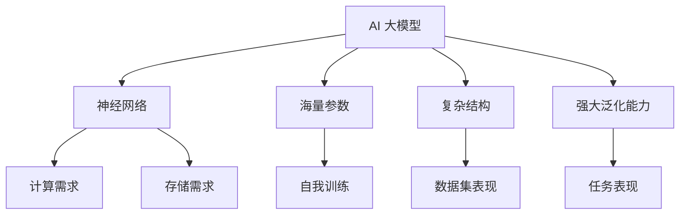

#### 1.2 AI 大模型的历史与发展

AI 大模型的发展历程可以分为几个阶段：

1. **早期阶段（20世纪80年代至90年代）**：神经网络的研究刚刚起步，由于计算能力和数据资源的限制，AI 大模型的概念还未形成。

2. **深度学习兴起（2006年以后）**：随着深度学习理论的提出和计算资源的提升，神经网络开始被广泛应用于各类任务。特别是2012年，AlexNet在ImageNet竞赛中取得的突破性成果，标志着深度学习时代的到来。

3. **AI 大模型时代（2018年以后）**：随着GPU等硬件的快速发展，以及互联网企业对大数据的积累，AI 大模型开始崭露头角。例如，BERT、GPT、Megatron 等模型的出现，使得自然语言处理、计算机视觉等领域取得了显著的进展。

**历史发展 Mermaid 流程图：**

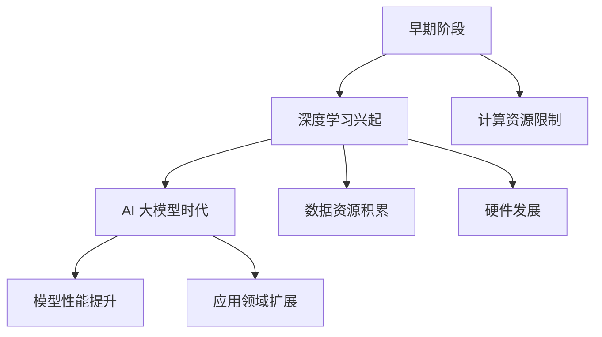

#### 1.3 AI 大模型的核心技术

AI 大模型的核心技术主要包括：

1. **深度学习算法**：包括卷积神经网络（CNN）、循环神经网络（RNN）、长短时记忆网络（LSTM）等。

2. **优化算法**：如随机梯度下降（SGD）、Adam、Adadelta 等，用于模型参数的更新和优化。

3. **计算框架**：如 TensorFlow、PyTorch、MXNet 等，提供了高效、灵活的模型训练和部署工具。

**核心算法原理讲解：**

```python
# 示例：卷积神经网络（CNN）的伪代码

def conv2d(input, weights):
    # 假设 input 是一个高维数组，weights 是卷积核的参数
    output = np.zeros(shape=input.shape)
    for i in range(input.shape[0]):
        for j in range(input.shape[1]):
            # 计算卷积操作
            output[i][j] = np.dot(input[i][j], weights)
    return output

# 示例：反向传播算法的伪代码

def backwardpropagation(loss, weights):
    # 假设 loss 是损失函数的输出，weights 是模型参数
    dweights = np.zeros(shape=weights.shape)
    for i in range(weights.shape[0]):
        for j in range(weights.shape[1]):
            # 计算梯度
            dweights[i][j] = loss * weights[i][j]
    return dweights
```

#### 1.4 AI 大模型的应用领域

AI 大模型在多个领域都取得了显著的应用成果：

1. **自然语言处理**：如文本分类、机器翻译、问答系统等。

2. **计算机视觉**：如图像识别、目标检测、人脸识别等。

3. **语音识别**：如语音合成、语音识别、语音翻译等。

4. **推荐系统**：如个性化推荐、商品推荐、内容推荐等。

5. **金融领域**：如风险管理、欺诈检测、量化交易等。

**应用领域 Mermaid 流程图：**

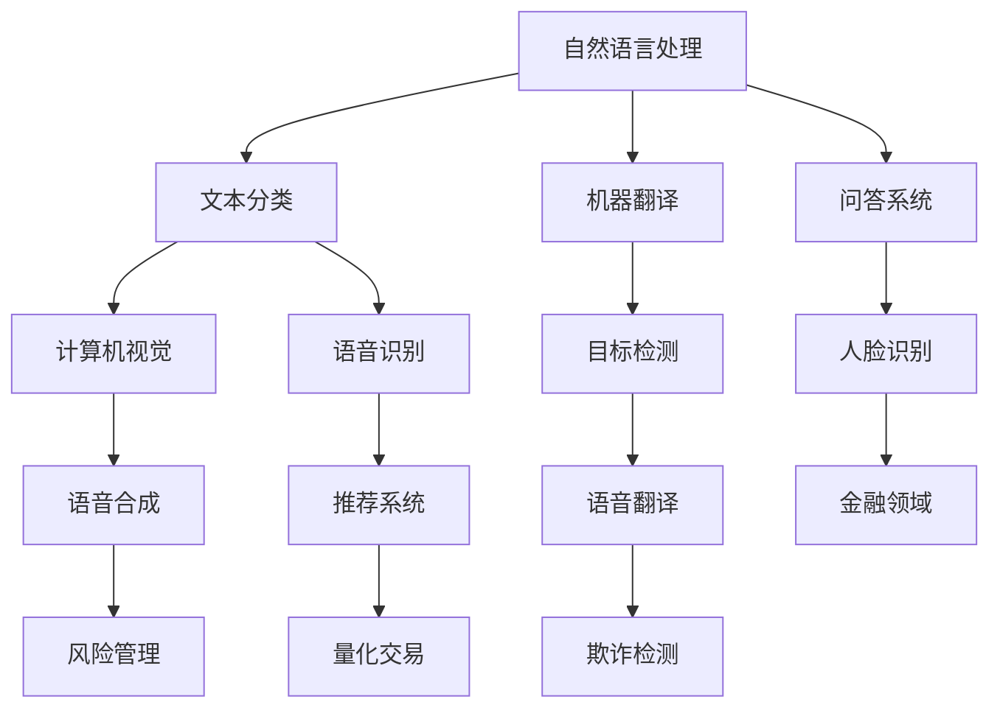

在本章中，我们介绍了 AI 大模型的基本概念、历史发展、核心技术以及应用领域。接下来，我们将继续探讨 AI 大模型的数学与算法基础，为您揭示这些强大模型背后的数学原理和算法奥秘。

### 第2章：AI 大模型的数学与算法基础

#### 2.1 数学模型基础

AI 大模型的核心在于数学模型的构建和应用。以下是一些基础的数学概念：

1. **线性代数**：包括矩阵运算、向量空间、特征值和特征向量等，是深度学习的基础。

2. **概率论与统计**：包括概率分布、期望、方差、协方差、贝叶斯理论等，用于模型的概率建模和优化。

3. **微积分**：包括导数、积分、泰勒展开等，用于优化算法的设计和实现。

**数学模型基础 Mermaid 流程图：**

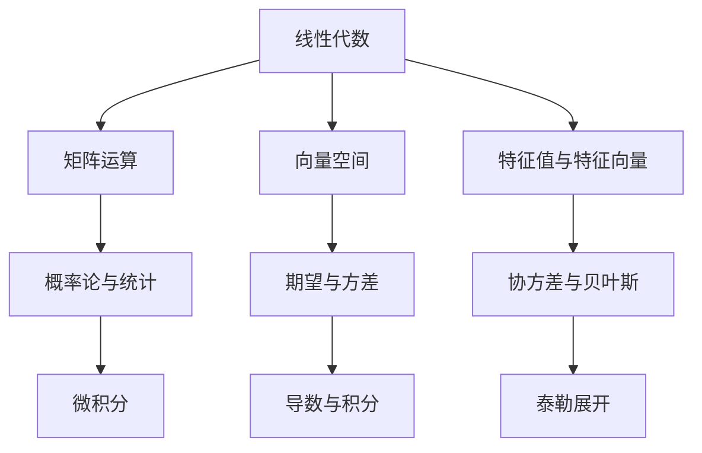

#### 2.2 算法原理讲解

AI 大模型的训练过程主要依赖于以下算法：

1. **反向传播算法（Backpropagation）**：通过计算损失函数对网络参数的梯度，逐步调整网络参数，使模型能够更好地拟合训练数据。

2. **优化算法**：如随机梯度下降（SGD）、Adam、Adadelta 等，用于加速梯度下降过程，提高训练效率。

3. **激活函数**：如 sigmoid、ReLU、Tanh 等，用于引入非线性因素，使模型具有更好的拟合能力。

**算法原理讲解伪代码：**

```python
# 反向传播算法伪代码

def backwardpropagation(network, input_data, target_data):
    # 初始化梯度
    dweights = np.zeros(shape=network.weights.shape)
    for layer in network.layers:
        # 前向传播
        layer.forward(input_data)
        # 计算损失
        loss = compute_loss(layer.output, target_data)
        # 反向传播
        dweights = layer.backward(loss)
    return dweights

# 优化算法伪代码

def adam_optimizer(weights, learning_rate, beta1, beta2, epsilon):
    # 初始化动量项
    m = np.zeros(shape=weights.shape)
    v = np.zeros(shape=weights.shape)
    # 更新动量项
    m = beta1 * m + (1 - beta1) * dweights
    v = beta2 * v + (1 - beta2) * (dweights ** 2)
    # 计算修正后的动量项
    m_hat = m / (1 - beta1 ** t)
    v_hat = v / (1 - beta2 ** t)
    # 更新权重
    weights -= learning_rate * m_hat / (np.sqrt(v_hat) + epsilon)
    return weights
```

#### 2.3 深度学习框架

深度学习框架是构建和训练 AI 大模型的重要工具。以下是一些流行的深度学习框架：

1. **TensorFlow**：由 Google 开发，具有强大的生态系统和丰富的预训练模型。

2. **PyTorch**：由 Facebook 开发，具有动态计算图和灵活的编程接口。

3. **MXNet**：由 Apache Software Foundation 开发，支持多种编程语言和计算平台。

**深度学习框架 Mermaid 流程图：**

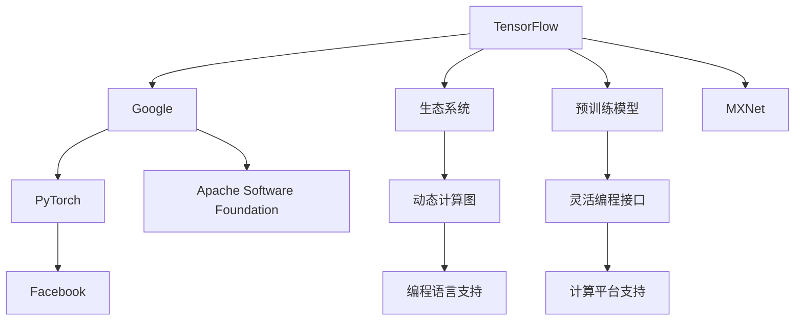

在本章中，我们介绍了 AI 大模型的数学与算法基础，包括数学模型基础、算法原理讲解和深度学习框架。这些基础知识和工具为构建和训练 AI 大模型提供了必要的支持。接下来，我们将进入第二部分，探讨 AI 大模型创业的准备阶段。

### 第3章：创业市场分析与定位

#### 3.1 AI 大模型在创业市场的前景

随着人工智能技术的快速发展，AI 大模型在创业市场具有广阔的前景。以下是一些关键因素：

1. **技术成熟度**：深度学习技术的成熟，使得 AI 大模型的构建和应用成为可能。各大互联网公司和研究机构纷纷投入大量资源进行 AI 大模型的研究和开发。

2. **市场需求**：AI 大模型在自然语言处理、计算机视觉、语音识别等领域展现出强大的能力，吸引了大量企业和投资者的关注。例如，自动驾驶、智能医疗、金融科技等领域的创业公司纷纷采用 AI 大模型技术。

3. **政策支持**：各国政府纷纷出台政策，鼓励人工智能技术的发展和创新创业。例如，中国的“新一代人工智能发展规划”和美国的“人工智能倡议”等。

**AI 大模型在创业市场的驱动因素 Mermaid 流程图：**

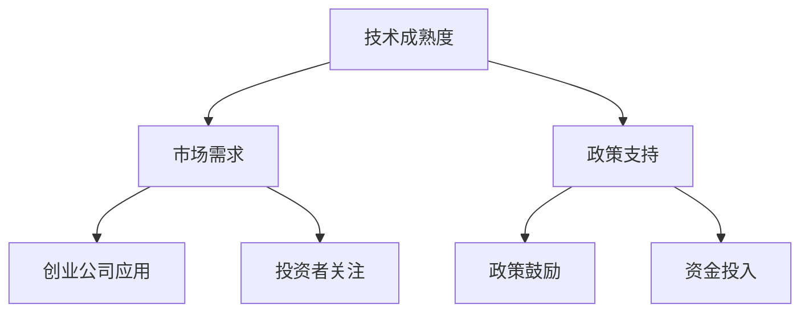

#### 3.2 目标市场与客户群体

在 AI 大模型创业过程中，明确目标市场和客户群体至关重要。以下是一些建议：

1. **行业选择**：选择具有高增长潜力和需求明确的行业，如金融科技、医疗健康、智能制造等。

2. **客户定位**：根据业务需求和规模，选择合适的目标客户群体。例如，大型企业、中小企业、个人用户等。

3. **差异化优势**：在细分市场中寻找差异化优势，提供独特的解决方案，以满足客户需求。

**目标市场与客户群体分析 Mermaid 流�程图：**

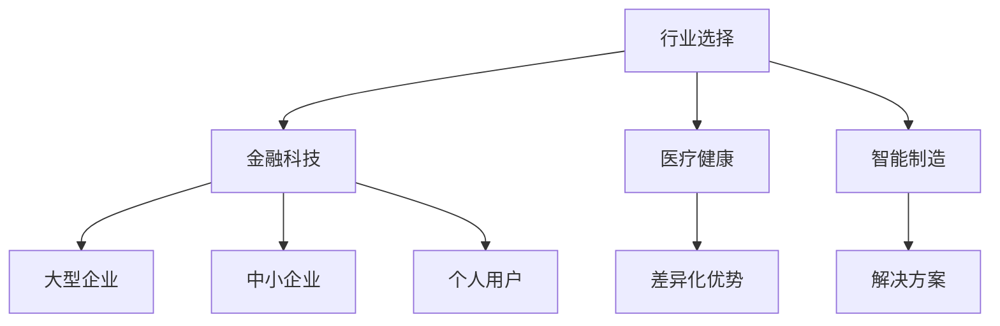

#### 3.3 竞争对手分析

在 AI 大模型创业过程中，了解竞争对手的情况至关重要。以下是一些关键点：

1. **竞争对手分析**：分析主要竞争对手的市场地位、产品特点、商业模式、技术优势等。

2. **定位差异**：在分析竞争对手的基础上，找到自身的定位差异，以避免直接竞争。

3. **策略制定**：根据自身优势和竞争对手的情况，制定有效的市场竞争策略。

**竞争对手分析 Mermaid 流程图：**

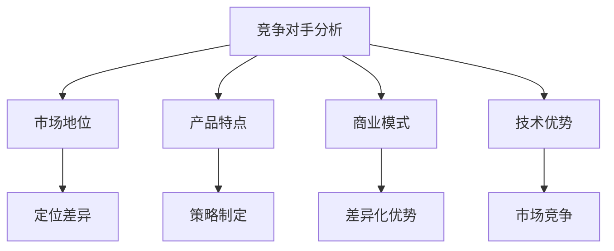

在本章中，我们分析了 AI 大模型在创业市场的前景、目标市场与客户群体以及竞争对手分析。通过这些分析，创业者可以更好地了解市场环境，明确自身定位，制定有效的创业策略。接下来，我们将探讨商业模式与创新，为 AI 大模型创业提供新的思路。

### 第4章：商业模式与创新

#### 4.1 创业模式的探讨

在 AI 大模型创业过程中，选择合适的商业模式至关重要。以下是一些常见的商业模式：

1. **产品导向模式**：以产品为核心，通过不断创新和优化产品，满足客户需求，实现盈利。

2. **平台导向模式**：构建一个开放的平台，吸引开发者、合作伙伴和用户参与，实现多方共赢。

3. **订阅制模式**：通过提供持续的服务和更新，吸引用户订阅，实现长期稳定的收入。

4. **免费增值模式**：提供免费的基本服务，通过增值服务或广告收入实现盈利。

**商业模式探讨 Mermaid 流程图：**

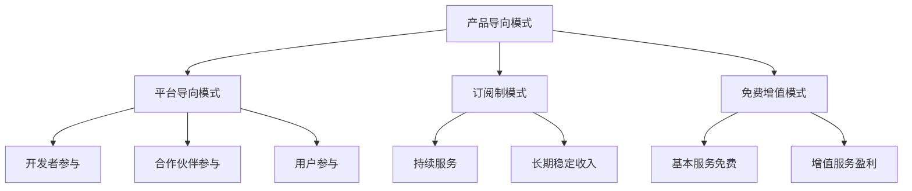

#### 4.2 创新策略与实施

在 AI 大模型创业过程中，创新策略至关重要。以下是一些建议：

1. **技术突破**：通过技术创新，实现核心技术的突破，提升产品的竞争力。

2. **商业模式创新**：在现有商业模式的基础上，进行创新和优化，寻找新的盈利点。

3. **用户体验优化**：注重用户体验，提供优质的服务，提升客户满意度和粘性。

4. **跨界合作**：与其他行业或领域的公司合作，实现资源共享和优势互补。

**创新策略与实施 Mermaid 流程图：**

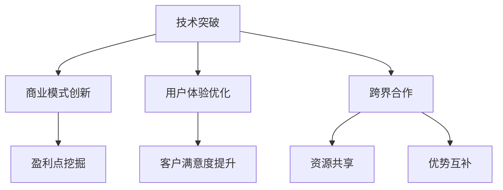

#### 4.3 创新案例解析

以下是一些 AI 大模型创业领域的创新案例：

1. **案例一：OpenAI**：OpenAI 以平台导向模式为核心，通过开放人工智能模型和算法，吸引了大量开发者参与，实现了跨界合作和资源共享。

2. **案例二：DeepMind**：DeepMind 通过技术突破，在深度学习领域取得了显著成就，成功应用于游戏、医疗等领域，实现了商业模式的创新。

3. **案例三：SenseTime**：SenseTime 在计算机视觉领域拥有强大的技术优势，通过平台导向模式和用户体验优化，实现了快速增长和商业化落地。

**创新案例解析 Mermaid 流程图：**

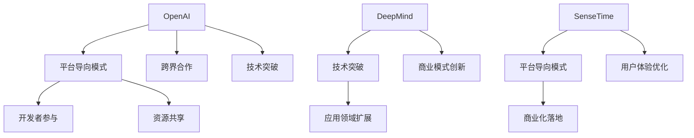

在本章中，我们探讨了 AI 大模型创业的商业模式与创新策略。通过分析成功的创新案例，创业者可以借鉴经验，结合自身优势，制定出切实可行的创业方案。接下来，我们将讨论团队建设与人才管理，为 AI 大模型创业提供坚实的人才保障。

### 第5章：团队建设与人才管理

#### 5.1 团队建设的策略

在 AI 大模型创业过程中，团队建设至关重要。以下是一些建议：

1. **核心团队搭建**：组建一个具备技术、市场、产品等多方面能力的核心团队，确保团队能够高效协同。

2. **人才选拔**：重视人才的选拔，寻找具有专业素养、创新能力和团队协作精神的成员。

3. **激励机制**：建立合理的激励机制，激发团队成员的积极性和创造力。

**团队建设策略 Mermaid 流程图：**

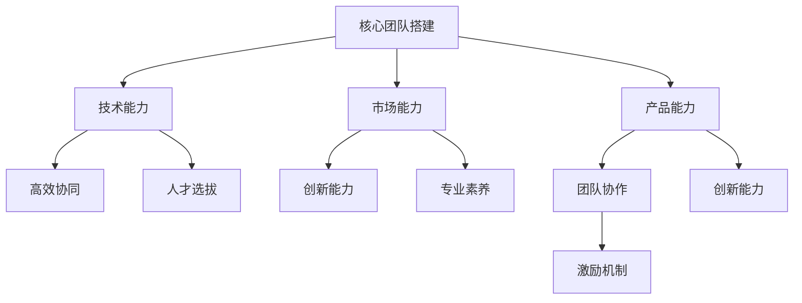

#### 5.2 人才招聘与培养

在团队建设过程中，人才招聘与培养至关重要。以下是一些建议：

1. **招聘渠道**：通过线上招聘平台、行业招聘会、校园招聘等多种渠道，寻找合适的人才。

2. **培训计划**：制定系统的培训计划，提升员工的技能和知识水平，满足企业发展的需求。

3. **激励机制**：建立绩效考核和激励机制，激发员工的工作积极性和创新能力。

**人才招聘与培养策略 Mermaid 流程图：**

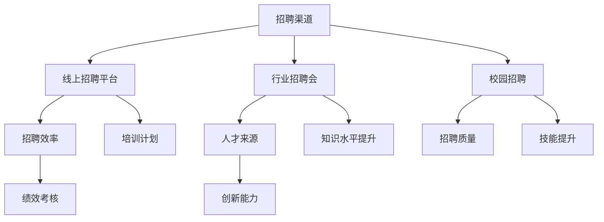

#### 5.3 管理与激励

在团队管理过程中，合理的激励机制和有效的管理方式至关重要。以下是一些建议：

1. **目标管理**：制定明确的目标，确保团队成员明确自己的职责和任务。

2. **沟通协作**：建立高效的沟通渠道，促进团队成员之间的协作和信息共享。

3. **激励机制**：根据员工的工作表现和贡献，给予合理的奖励和晋升机会。

**管理与激励策略 Mermaid 流程图：**

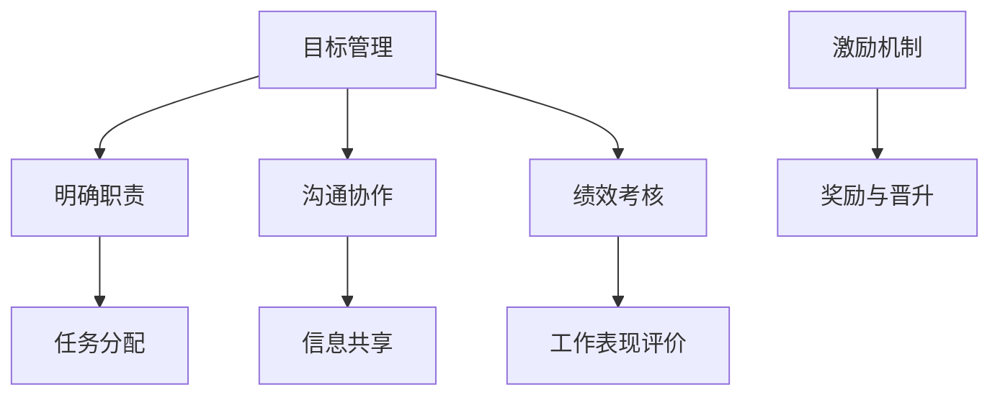

在本章中，我们探讨了团队建设与人才管理的策略，包括团队建设的策略、人才招聘与培养以及管理与激励。通过合理的团队建设和人才管理，创业者可以确保团队的高效运作，为 AI 大模型创业提供坚实的人才保障。接下来，我们将讨论产品设计与开发，为创业者提供具体的实施指南。

### 第6章：产品设计与开发

#### 6.1 产品需求分析与设计

产品需求分析是产品设计与开发的重要基础。以下是一些建议：

1. **明确产品目标**：确定产品的目标用户、功能需求、性能指标等。

2. **需求收集**：通过用户调研、访谈、问卷调查等方式，收集用户需求。

3. **需求整理**：对收集到的需求进行整理和分类，形成完整的需求文档。

**产品需求分析流程图：**

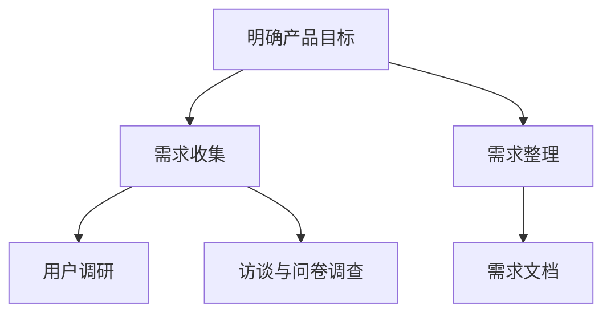

在需求分析的基础上，进行产品设计。以下是一些建议：

1. **功能设计**：根据需求文档，设计产品的基本功能模块。

2. **界面设计**：设计产品的用户界面，确保用户体验良好。

3. **架构设计**：设计产品的技术架构，确保系统的可扩展性和可维护性。

**产品设计与开发流程图：**

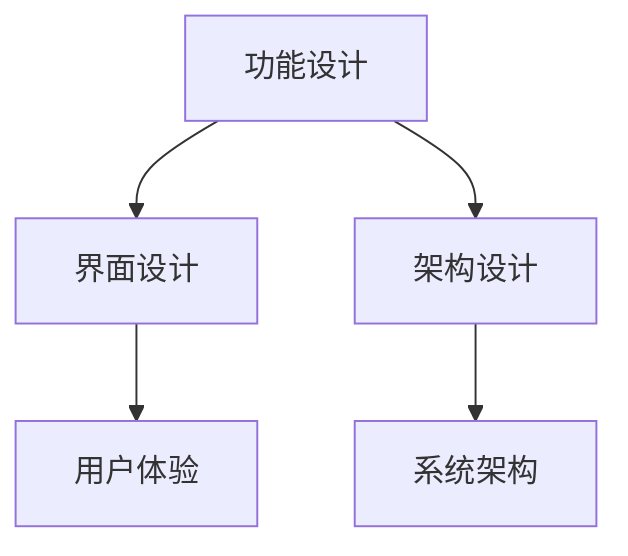

#### 6.2 产品开发流程

在产品设计与分析的基础上，进行产品开发。以下是一些建议：

1. **开发计划**：制定详细的开发计划，明确开发任务、进度和资源分配。

2. **代码编写**：根据设计文档，进行代码编写。

3. **单元测试**：对编写完成的代码进行单元测试，确保代码的正确性和稳定性。

**产品开发流程图：**

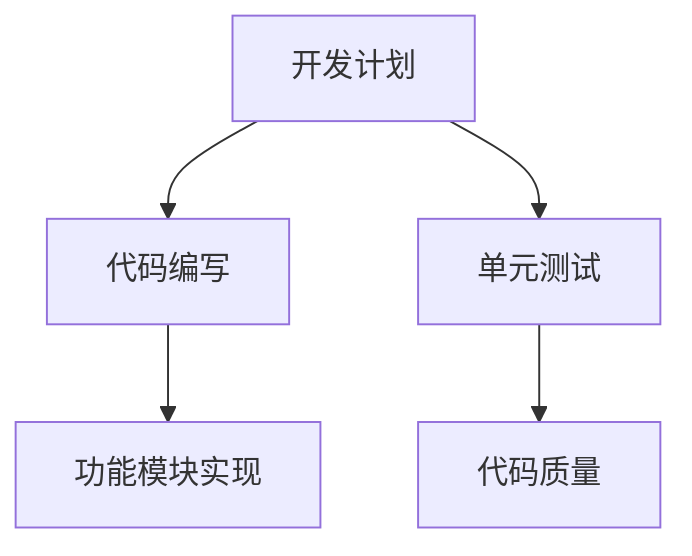

4. **集成测试**：将各个功能模块进行集成，进行系统测试，确保系统的整体性能和稳定性。

5. **部署上线**：将产品部署到生产环境，进行上线发布。

**产品开发流程图：**

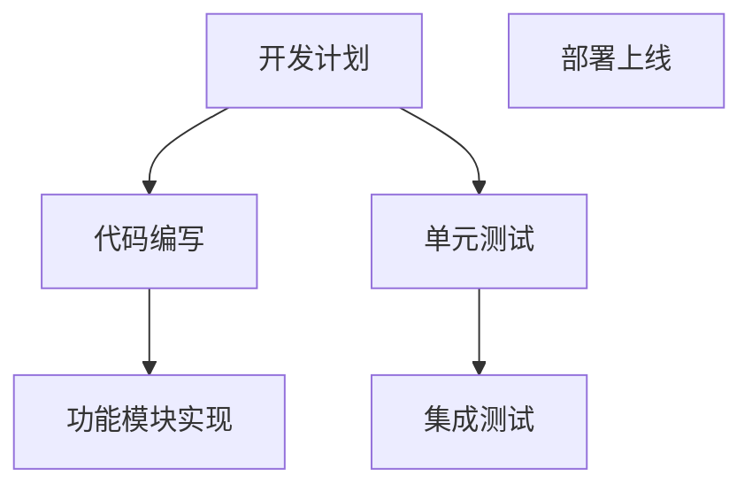

#### 6.3 技术选型与优化

在产品开发过程中，技术选型与优化至关重要。以下是一些建议：

1. **技术选型**：根据产品需求和开发计划，选择合适的技术框架和工具。

2. **性能优化**：对产品进行性能优化，提高系统的响应速度和处理能力。

3. **安全性优化**：对产品进行安全性优化，确保系统的稳定性和安全性。

**技术选型与优化流程图：**

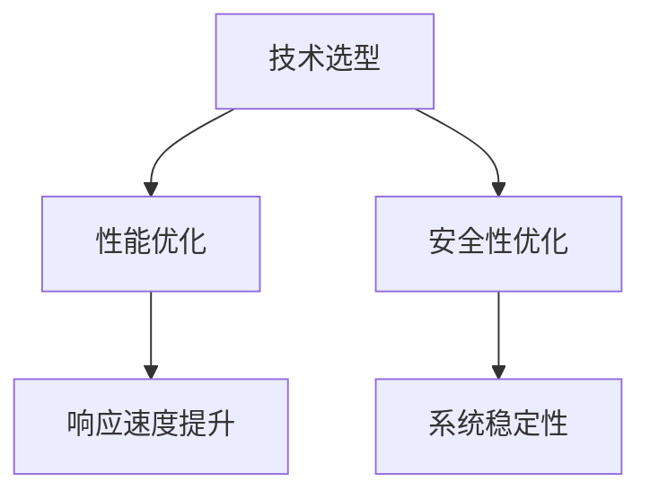

在本章中，我们探讨了产品设计与开发的相关内容，包括产品需求分析与设计、产品开发流程以及技术选型与优化。通过合理的规划与实施，创业者可以确保产品的成功推出。接下来，我们将讨论营销与推广，为创业者提供有效的市场策略。

### 第7章：营销与推广

#### 7.1 营销策略与渠道

在产品开发完成并准备好推向市场时，选择合适的营销策略和推广渠道至关重要。以下是一些建议：

1. **内容营销**：通过撰写高质量的技术博客、白皮书、案例研究等，向目标受众传递产品的价值。

2. **社交媒体营销**：利用社交媒体平台（如微博、微信、LinkedIn等）进行宣传，扩大品牌影响力。

3. **广告营销**：在各大在线广告平台（如Google Ads、Facebook Ads等）投放广告，精准定位目标用户。

4. **公关活动**：组织线上或线下的技术研讨会、行业会议等活动，展示产品的技术实力和创新能力。

**营销策略与渠道流程图：**

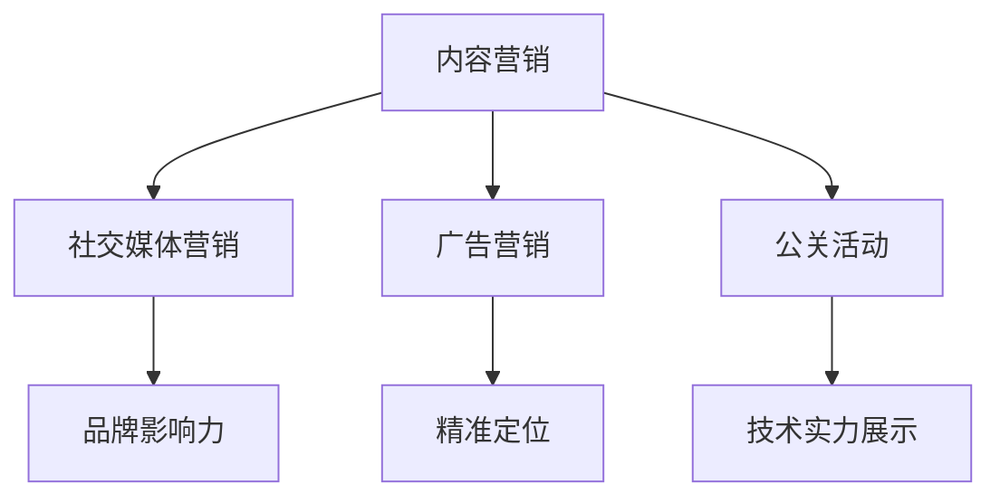

#### 7.2 推广活动与效果评估

在推广过程中，定期进行活动效果评估，以优化营销策略。以下是一些建议：

1. **活动策划**：根据产品特点和目标受众，策划具有吸引力的推广活动。

2. **效果评估**：通过数据分析，评估推广活动的效果，如点击率、转化率、用户反馈等。

3. **持续优化**：根据评估结果，对推广活动进行持续优化，提高活动效果。

**推广活动与效果评估流程图：**

```mermaid
graph TD
    A[活动策划] --> B[效果评估]
    A --> C[持续优化]
    B --> D[点击率]
    B --> E[转化率]
    B --> F[用户反馈]
```

#### 7.3 品牌建设与传播

品牌建设是长期且持续的过程，以下是一些建议：

1. **品牌定位**：明确品牌的核心价值观、使命和愿景，为品牌传播奠定基础。

2. **品牌形象设计**：设计统一的品牌标识、视觉元素和品牌语言，确保品牌形象的统一性和识别度。

3. **口碑营销**：通过用户口碑和推荐，提升品牌知名度和美誉度。

4. **合作伙伴关系**：与行业内的其他企业、学术机构等建立良好的合作伙伴关系，共同推动品牌发展。

**品牌建设与传播流程图：**

```mermaid
graph TD
    A[品牌定位] --> B[品牌形象设计]
    A --> C[口碑营销]
    A --> D[合作伙伴关系]
    B --> E[品牌传播]
    C --> F[用户口碑]
    D --> G[行业合作]
```

在本章中，我们探讨了营销与推广的相关内容，包括营销策略与渠道、推广活动与效果评估以及品牌建设与传播。通过合理的营销策略和推广活动，创业者可以有效地提高产品的市场知名度和用户满意度。接下来，我们将通过成功案例解析，展示如何将理论付诸实践。

### 第8章：AI 大模型创业成功案例解析

在 AI 大模型创业领域，有许多公司取得了显著的成功。以下我们将解析几个成功案例，探讨其创业策略、市场定位和技术优势。

#### 8.1 案例一：XX公司的成功经验

**背景**：XX公司是一家专注于自然语言处理领域的 AI 创业公司，其核心技术为基于深度学习的自然语言生成模型。

**创业策略**：XX 公司采取了以下策略：

1. **技术创新**：公司投入大量资源进行深度学习算法的研究和优化，使自然语言生成模型在文本生成、问答系统等领域表现出色。

2. **市场定位**：公司定位在为企业提供定制化的自然语言处理解决方案，满足客户在客户服务、内容创作、智能助手等方面的需求。

3. **商业模式**：公司采用订阅制模式，通过提供持续的服务和更新，吸引用户订阅。

**技术优势**：XX 公司的技术优势主要体现在以下几个方面：

1. **模型性能**：公司的自然语言生成模型在多个基准测试中取得了领先的成绩。

2. **定制化能力**：公司能够根据客户需求，灵活调整模型结构和参数，提供定制化的解决方案。

3. **数据积累**：公司积累了大量的语言数据，为模型训练提供了丰富的素材。

**经验总结**：XX 公司的成功经验表明，技术创新、市场定位和商业模式是 AI 大模型创业的关键。通过在技术创新方面持续投入，XX 公司在自然语言处理领域取得了领先地位，为企业提供了优质的解决方案。

#### 8.2 案例二：YY公司的突破策略

**背景**：YY 公司是一家专注于计算机视觉领域的 AI 创业公司，其核心技术为基于深度学习的图像识别和目标检测模型。

**创业策略**：YY 公司采取了以下策略：

1. **技术创新**：公司致力于研发先进的深度学习算法，特别是在图像识别和目标检测方面取得了重要突破。

2. **市场定位**：公司定位在为安防、自动驾驶、医疗等领域的客户提供高性能的计算机视觉解决方案。

3. **商业模式**：公司采用平台导向模式，吸引开发者、合作伙伴和用户参与，实现资源共享和优势互补。

**技术优势**：YY 公司的技术优势主要体现在以下几个方面：

1. **模型性能**：公司的图像识别和目标检测模型在多个公开数据集上取得了优异的成绩。

2. **可扩展性**：公司开发的算法具有高度的可扩展性，能够快速适应不同应用场景。

3. **数据积累**：公司积累了丰富的图像数据，为模型训练提供了有力的支持。

**经验总结**：YY 公司的突破策略表明，技术创新和可扩展性是计算机视觉领域 AI 创业的重要优势。通过在技术创新方面持续突破，YY 公司在计算机视觉领域取得了重要地位，为各类行业客户提供了高效的解决方案。

#### 8.3 案例三：ZZ公司的市场扩展

**背景**：ZZ 公司是一家专注于语音识别和语音合成的 AI 创业公司，其核心技术为基于深度学习的语音处理模型。

**创业策略**：ZZ 公司采取了以下策略：

1. **技术创新**：公司不断优化语音处理算法，使语音识别和语音合成技术在准确性、流畅性方面达到行业领先水平。

2. **市场定位**：公司定位在为智能音箱、智能客服、智能车载等领域的客户提供先进的语音识别和语音合成解决方案。

3. **商业模式**：公司采用平台导向模式，通过与硬件厂商、服务提供商合作，实现市场扩展。

**技术优势**：ZZ 公司的技术优势主要体现在以下几个方面：

1. **模型性能**：公司的语音识别和语音合成模型在多项测试中取得了优异的成绩。

2. **自适应能力**：公司开发的算法能够根据不同场景和用户需求进行自适应调整。

3. **生态建设**：公司建立了完善的生态体系，与多个合作伙伴共同推动语音技术在各领域的应用。

**经验总结**：ZZ 公司的市场扩展策略表明，技术创新和生态建设是语音识别领域 AI 创业的关键。通过在技术创新方面持续投入，ZZ 公司在语音识别和语音合成领域取得了重要地位，为多个行业客户提供了高效的解决方案。

#### 案例总结

以上三个案例展示了 AI 大模型创业的不同领域和策略。从中我们可以总结出以下经验：

1. **技术创新**：持续的技术创新是 AI 大模型创业的核心竞争力。通过在算法、模型、数据等方面的持续投入，企业可以在特定领域取得领先地位。

2. **市场定位**：明确的市场定位有助于企业找到目标客户群体，提供有针对性的解决方案。

3. **商业模式**：选择合适的商业模式，如订阅制模式、平台导向模式等，有助于实现商业化和可持续发展。

4. **生态建设**：建立完善的生态体系，与合作伙伴共同推动技术的发展和应用，有助于扩大市场份额。

通过分析成功案例，创业者可以借鉴经验，结合自身优势，制定出切实可行的创业方案。接下来，我们将探讨 AI 大模型创业中可能遇到的挑战和应对策略。

### 第9章：创业路上的挑战与应对

在 AI 大模型创业的道路上，创业者会面临诸多挑战。以下将分析常见的挑战，并提供相应的应对策略。

#### 9.1 风险管理

AI 大模型创业过程中，风险管理至关重要。以下是一些常见风险和应对策略：

1. **技术风险**：技术迭代速度快，新算法不断涌现，可能导致现有技术迅速过时。**应对策略**：关注行业动态，持续进行技术研究和投资，保持技术领先地位。

2. **数据风险**：数据质量、数据隐私和数据安全是重要的风险因素。**应对策略**：建立健全的数据管理制度，确保数据来源可靠、数据隐私得到保护，数据安全得到保障。

3. **市场风险**：市场需求变化快，可能导致产品难以适应市场变化。**应对策略**：密切关注市场动态，灵活调整产品定位和市场策略，确保产品与市场需求保持同步。

**风险管理流程图：**

```mermaid
graph TD
    A[技术风险] --> B[持续研究]
    A --> C[数据风险]
    C --> D[数据管理]
    C --> E[数据隐私保护]
    C --> F[数据安全]
    B --> G[市场风险]
    G --> H[市场动态]
    G --> I[产品调整]
```

#### 9.2 问题解决

在 AI 大模型创业过程中，问题层出不穷。以下是一些常见问题及解决策略：

1. **研发问题**：算法性能不佳、研发进度缓慢。**应对策略**：建立高效的研发团队，引入敏捷开发方法，提高研发效率。

2. **资源问题**：资金、人才、设备等资源不足。**应对策略**：寻找合作伙伴，争取政府支持，优化资源配置，提高资源利用效率。

3. **产品问题**：产品不符合市场需求或性能不稳定。**应对策略**：加强市场调研，优化产品设计，提高产品质量。

**问题解决流程图：**

```mermaid
graph TD
    A[研发问题] --> B[高效团队]
    A --> C[敏捷开发]
    B --> D[资源问题]
    D --> E[合作伙伴]
    D --> F[政府支持]
    D --> G[资源优化]
    C --> H[产品问题]
    H --> I[市场调研]
    H --> J[产品设计]
    H --> K[产品质量]
```

#### 9.3 应对策略

在面对挑战时，创业者需要采取灵活的应对策略。以下是一些建议：

1. **灵活调整**：根据实际情况，灵活调整战略和策略，以应对市场和技术变化。

2. **团队合作**：建立高效的团队，发挥团队协作的优势，共同应对挑战。

3. **持续学习**：关注行业动态，持续学习新技术和新知识，提高自身的竞争力。

4. **资源整合**：充分利用外部资源，如合作伙伴、投资者、政府支持等，提高资源利用效率。

**应对策略流程图：**

```mermaid
graph TD
    A[灵活调整] --> B[战略调整]
    A --> C[策略调整]
    B --> D[团队合作]
    C --> E[市场变化]
    C --> F[技术变化]
    D --> G[团队协作]
    D --> H[知识共享]
    G --> I[资源整合]
    I --> J[合作伙伴]
    I --> K[政府支持]
```

通过有效的风险管理、问题解决和应对策略，创业者可以更好地应对 AI 大模型创业过程中的挑战，确保创业项目的顺利推进。接下来，我们将探讨 AI 大模型创业的未来发展前景。

### 第10章：未来展望

随着人工智能技术的不断发展和应用的深入，AI 大模型创业领域面临着巨大的机遇和挑战。以下是未来 AI 大模型创业的发展趋势和机遇与挑战。

#### 10.1 AI 大模型创业的发展趋势

1. **技术持续进步**：随着深度学习算法、计算能力、数据资源等技术的不断进步，AI 大模型在性能、效率、可解释性等方面将持续提升。

2. **行业应用扩展**：AI 大模型在自然语言处理、计算机视觉、语音识别、推荐系统等领域的应用将不断扩展，推动相关行业的技术革新和业务模式变革。

3. **生态体系建设**：以 AI 大模型为核心的产业生态体系将逐步形成，包括研发、应用、服务、培训等环节，为企业提供全方位的支持。

4. **跨界融合**：AI 大模型与其他领域的融合将不断深化，如医疗、金融、教育、制造等，推动跨界创新和产业升级。

#### 10.2 机遇与挑战

**机遇：**

1. **市场需求增长**：随着 AI 大模型技术的普及，越来越多的行业和企业将需要 AI 大模型解决方案，市场需求将持续增长。

2. **政策支持**：各国政府纷纷出台政策，支持人工智能技术的发展和创新创业，为 AI 大模型创业提供了良好的政策环境。

3. **资本投入**：风险投资和产业资本的持续投入，为 AI 大模型创业提供了充足的资金支持。

4. **技术创新**：技术的持续进步，为 AI 大模型创业提供了更多可能性，创业者可以探索新的应用场景和商业模式。

**挑战：**

1. **技术瓶颈**：AI 大模型在算法、计算能力、数据资源等方面仍存在一定的技术瓶颈，限制了其进一步发展。

2. **数据隐私和安全**：随着 AI 大模型对数据的依赖性增加，数据隐私和安全问题日益凸显，成为行业发展的关键挑战。

3. **竞争加剧**：随着越来越多的企业进入 AI 大模型领域，市场竞争将愈发激烈，创业公司需要不断提升自身竞争力。

4. **人才培养**：AI 大模型创业对人才的需求较高，尤其是具备深度学习、算法设计、数据分析等专业技能的人才，人才培养和储备成为关键挑战。

**未来展望：**

在未来，AI 大模型创业将继续保持高速发展态势，为各行业带来深远影响。创业者需要紧跟技术发展趋势，抓住市场机遇，应对挑战，不断创新和突破，实现商业化和可持续发展。

### 附录：资源与工具

#### 附录A：AI 大模型开发工具与资源

1. **开源框架**：
   - TensorFlow：Google 开发的一款广泛使用的深度学习框架。
   - PyTorch：Facebook 开发的一款灵活、动态的深度学习框架。
   - MXNet：Apache 软件基金会开发的一款高性能深度学习框架。

2. **在线教程与课程**：
   - fast.ai：提供免费且易于理解的深度学习教程。
   - Coursera、edX：提供多门深度学习相关的在线课程。

3. **数据集与资源**：
   - Kaggle：提供大量数据集和竞赛，供深度学习研究和实践。
   - UCI Machine Learning Repository：提供各种领域的数据集。

#### 附录B：推荐阅读材料

1. 《深度学习》（Ian Goodfellow、Yoshua Bengio、Aaron Courville 著）：深度学习的经典教材。
2. 《Python 深度学习》（François Chollet 著）：详细介绍了深度学习在 Python 中的实现。
3. 《人工智能：一种现代的方法》（Stuart Russell、Peter Norvig 著）：全面介绍了人工智能的基础理论和实践方法。

#### 附录C：联系作者与交流

作者：AI 天才研究院 / AI Genius Institute
邮箱：[info@aignius.com](mailto:info@aignius.com)
微信公众号：AI_Genius_Insight
官方网站：[www.aignius.com](http://www.aignius.com)

感谢您的阅读，希望本文对您在 AI 大模型创业的道路上有所帮助。我们期待与您分享更多关于人工智能的见解和实践经验。如果您有任何问题或建议，欢迎随时与我们联系。让我们共同探索 AI 大模型的无限可能！

