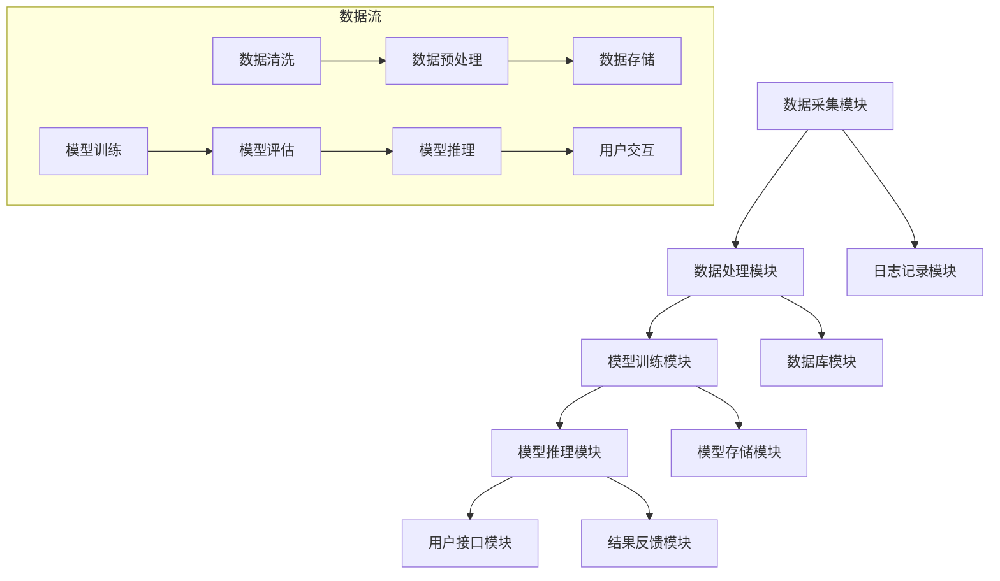
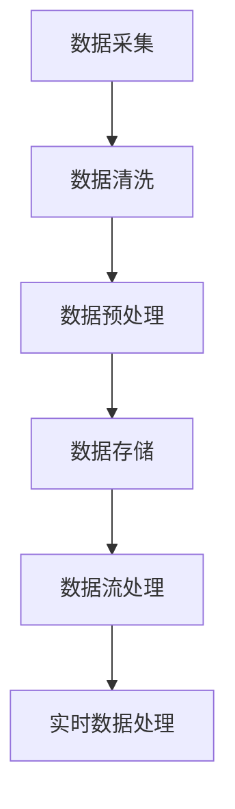
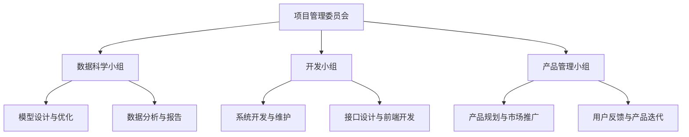
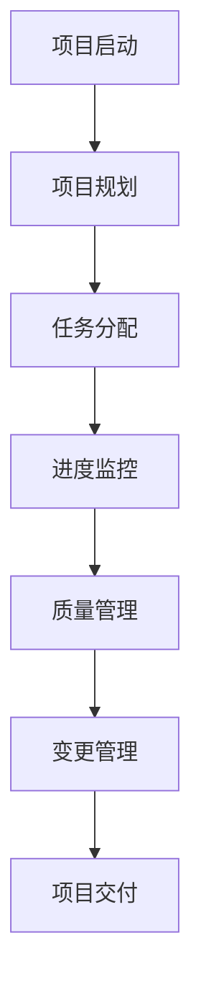
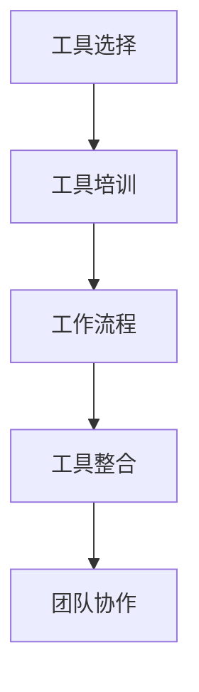
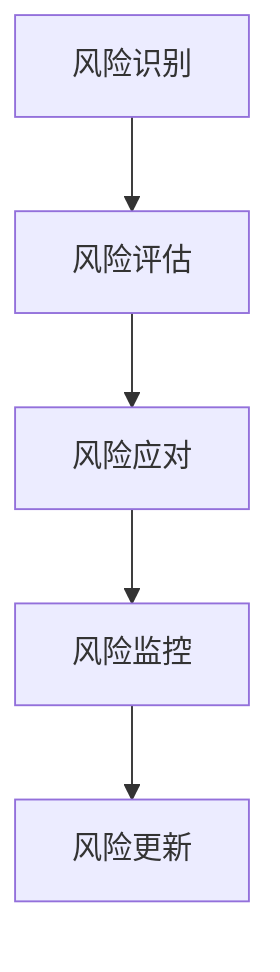

                 

### 引言

近年来，人工智能（AI）技术取得了前所未有的进展，其中，AI大模型成为了一个备受关注的研究热点。大模型，顾名思义，是指拥有巨大参数规模和训练数据量的AI模型，如GPT-3、BERT等。这些模型在自然语言处理、计算机视觉、语音识别等领域展现出了惊人的性能。随着AI大模型技术的发展，越来越多的创业者开始探索如何利用这一先进技术创造商业价值。

然而，AI大模型创业并非易事，创业者需要面对众多挑战。首先，大模型的训练和部署需要庞大的计算资源和数据资源，这对创业者的资金和技术实力提出了很高的要求。其次，市场环境瞬息万变，创业者需要准确把握市场趋势，及时调整产品策略。此外，创业过程中的团队建设、项目运营、融资策略等也是一大挑战。

本书旨在为AI大模型创业者提供一份实用指南，帮助他们在资源有限的条件下，充分发挥自身优势，顺利走上创业之路。本书将分为以下几个部分：

- **第1章 引言**：介绍书籍背景及目的，AI大模型的发展趋势，以及创业者面临的挑战。
- **第2章 AI大模型基础知识**：详细讲解AI大模型的核心概念、原理和应用领域。
- **第3章 资源优势分析**：分析创业者如何利用数据资源、算力资源和人力资源。
- **第4章 创业项目规划**：讨论项目目标设定、市场分析和产品规划。
- **第5章 技术路线规划**：探讨技术选型、技术架构设计和技术路线演进规划。
- **第6章 团队建设与运营**：介绍团队建设策略、项目运营管理和风险管理。
- **第7章 融资策略与市场推广**：讨论融资策略、市场推广策略。
- **第8章 成功案例分析与创业经验总结**：分析成功案例，总结创业经验。

通过以上内容，我们希望能够为AI大模型创业者提供有价值的参考，助力他们在创新创业的道路上取得成功。

### 2.1.1 AI大模型的定义

AI大模型是指具有非常大规模参数和高度复杂结构的机器学习模型。这类模型通常包含数亿甚至数万亿个参数，通过学习大量数据来捕捉复杂的关系和模式。与传统的中小规模模型相比，AI大模型具有更强的表达能力和更广泛的适用性。

AI大模型的发展得益于多个领域的进步，包括计算能力、数据获取和处理技术的提升，以及深度学习算法的创新。传统的机器学习模型如SVM、决策树等通常只能处理几千到几百万级别的参数，而AI大模型则能够处理数十亿乃至数万亿级别的参数。

具体来说，AI大模型的核心特点包括：

1. **大规模参数**：AI大模型拥有非常多的参数，这使得模型能够更好地捕捉数据中的复杂模式。
2. **高度非线性的结构**：通过多层神经网络结构，AI大模型能够实现高度非线性的映射，从而提高模型的泛化能力。
3. **大量训练数据**：AI大模型通常需要使用大量数据来训练，以充分挖掘数据中的信息。
4. **强大的表达能力**：由于参数众多，AI大模型能够表示复杂的函数关系，从而实现更为精确的预测和分类。

AI大模型在多个领域都取得了显著的应用成果。例如，在自然语言处理领域，GPT-3、BERT等大模型在文本生成、机器翻译、情感分析等方面展现了极高的性能。在计算机视觉领域，ResNet、Inception等大模型在图像分类、目标检测等方面取得了突破性进展。此外，在语音识别、医疗诊断、金融分析等领域，AI大模型也展现了强大的应用潜力。

总的来说，AI大模型是一种具有巨大潜力的技术，通过不断创新和优化，将为各个领域带来深远的影响。

### 2.1.2 AI大模型的特点

AI大模型具有一系列显著的特点，这些特点不仅使其在数据处理和模式识别方面表现出色，还为其在各个领域的应用奠定了基础。以下是AI大模型的主要特点：

1. **高参数规模**：AI大模型通常包含数亿甚至数十亿个参数。这样的参数规模使得模型能够捕捉数据中的复杂模式，从而实现更高的准确性和泛化能力。例如，GPT-3拥有1750亿个参数，这使得它能够生成高质量的文本，并在多种自然语言处理任务中取得优异表现。

2. **深层次网络结构**：AI大模型通常采用多层神经网络结构，这些层与层之间通过非线性激活函数相互连接。深度网络能够有效地捕捉数据中的非线性关系，从而提高模型的拟合能力。例如，ResNet等模型通过引入深度残差连接，成功解决了深度神经网络训练中的梯度消失问题，使得模型能够更加深入地学习数据。

3. **强大的自适应能力**：AI大模型能够根据不同的训练数据和任务自适应调整其参数，从而在多个任务中表现出色。例如，BERT模型通过预先训练再微调（Pre-training and Fine-tuning）的方法，在大规模语料库上进行预训练，然后针对特定任务进行微调，从而实现优异的自然语言处理性能。

4. **丰富的应用场景**：AI大模型在多个领域都展现出了强大的应用潜力。在自然语言处理领域，大模型能够进行文本生成、机器翻译、情感分析等任务；在计算机视觉领域，大模型能够进行图像分类、目标检测、图像生成等任务；在语音识别领域，大模型能够进行语音识别、语音合成等任务。此外，AI大模型还在医疗诊断、金融分析、交通管理等领域发挥了重要作用。

5. **计算资源需求大**：AI大模型需要大量的计算资源进行训练和推理。训练一个大型模型通常需要数天甚至数周的时间，这要求创业者具备强大的算力资源。例如，GPT-3的训练使用了数十万台GPU，这极大地提高了训练效率，但也对计算资源提出了很高的要求。

6. **数据依赖性强**：AI大模型对训练数据的质量和数量有较高的要求。大量的高质量数据不仅有助于模型的学习，还能提高模型的泛化能力。因此，创业者需要确保有足够的数据资源来支持大模型的训练。

7. **可解释性较弱**：由于AI大模型的复杂性和高度非线性，其内部机制往往难以解释。这给模型的可靠性和可解释性带来了一定的挑战。尽管如此，研究者们仍在积极探索如何提高大模型的可解释性，以便更好地理解和利用这些模型。

总的来说，AI大模型具有高参数规模、深层次网络结构、强大的自适应能力、丰富的应用场景、计算资源需求大、数据依赖性强以及可解释性较弱等特点。这些特点不仅使得AI大模型在数据处理和模式识别方面表现出色，也为其在各个领域的应用提供了广阔的前景。

### 2.1.3 AI大模型的发展历程

AI大模型的发展历程可谓是一部技术创新与突破的史诗。自20世纪50年代人工智能（AI）概念提出以来，AI大模型经历了多个阶段的演进和突破，其发展历程可以分为以下几个重要阶段：

1. **早期探索阶段（1950-1980年）**：
   在这个阶段，AI研究者开始尝试构建简单的规则系统和符号推理模型。然而，这些早期模型通常只能处理有限规模的问题，难以应对复杂的现实世界任务。此阶段最具代表性的工作是1956年达特茅斯会议，会议提出了“人工智能”这一概念，标志着AI研究正式起步。

2. **符号人工智能阶段（1980-2000年）**：
   这一阶段，符号人工智能（Symbolic AI）成为主流研究方向。研究者们开始使用逻辑、概率图模型等方法来构建知识表示和推理系统。代表性的工作是专家系统的兴起，如MYCIN和DENDRAL系统，这些系统能够在医学诊断和化学分析等领域取得一定成果。然而，符号人工智能在处理大规模数据和实时任务时表现出局限性。

3. **机器学习兴起阶段（2000-2010年）**：
   进入21世纪，机器学习逐渐成为AI研究的主流方向。随着计算能力的提升和大规模数据的获取，研究者开始关注如何通过数据驱动的方法来构建智能系统。这一阶段的重要进展包括支持向量机（SVM）、随机森林（Random Forest）等算法的广泛应用。

4. **深度学习突破阶段（2010年至今）**：
   深度学习在2010年左右取得了重大突破，这一技术为AI大模型的发展奠定了基础。以AlexNet为代表的深度神经网络在图像识别任务中取得优异表现，标志着深度学习时代的到来。随后，Google Brain团队在2012年推出的深度学习模型在ImageNet图像识别挑战赛中取得了突破性成绩，进一步验证了深度学习的强大能力。

5. **AI大模型崛起阶段（2015年至今）**：
   这一阶段，AI大模型如BERT、GPT-3、Turing等相继问世，这些模型拥有数十亿甚至数百亿个参数，展现出前所未有的性能。AI大模型的发展得益于计算能力、数据资源、算法创新的协同进步。尤其是GPU和TPU等高性能计算硬件的普及，极大地加速了深度学习的训练和推理速度。

6. **跨学科融合阶段（2015年至今）**：
   AI大模型不仅改变了计算机科学领域，还与其他学科如生物学、物理学、经济学等深度融合，推动了一系列跨学科研究的进展。例如，AI大模型在医疗诊断、金融分析、材料科学等领域的应用取得了显著成果，为这些领域带来了革命性的变革。

总体而言，AI大模型的发展历程是技术创新不断积累和突破的历程。从早期简单的符号推理系统，到现代复杂的深度学习模型，AI大模型的发展不仅展示了技术的进步，也为各个领域的智能化应用提供了强大的工具。随着技术的不断演进，AI大模型将在未来发挥更加重要的作用，为人类社会的进步贡献更多力量。

### 2.2 AI大模型的核心原理

AI大模型的核心原理主要基于深度学习和神经网络技术，这些原理是构建和训练大规模AI模型的基础。以下是AI大模型的核心原理，包括深度学习基础和人工智能基本框架。

#### 2.2.1 深度学习基础

深度学习是AI大模型的核心技术，其基础是多层神经网络。多层神经网络通过多层次的非线性变换，实现对复杂数据的表征和学习。以下是深度学习基础中的一些关键概念：

1. **神经元（Neuron）**：
   神经元是神经网络的基本单元，类似于生物神经系统的神经元。在数学上，一个简单的神经元可以表示为如下形式：

   $$
   z = \sum_{i=1}^{n} w_i x_i + b
   $$

   其中，$w_i$ 是第$i$个输入的权重，$x_i$ 是输入值，$b$ 是偏置项。神经元通过激活函数（activation function）$g(z)$，如ReLU（Rectified Linear Unit）函数，将线性组合的输入值映射为输出值：

   $$
   a = g(z) = \max(0, z)
   $$

2. **层（Layer）**：
   神经网络由多个层组成，包括输入层、隐藏层和输出层。每一层都包含多个神经元。输入层接收外部输入数据，输出层生成最终的预测或分类结果，隐藏层则负责数据的特征提取和变换。

3. **前向传播（Forward Propagation）**：
   在训练过程中，神经网络通过前向传播计算网络输出。给定输入数据，数据从输入层依次传递到隐藏层和输出层，每层神经元的输出作为下一层的输入。输出层的最终输出与真实标签进行比较，计算损失函数，从而指导反向传播。

4. **反向传播（Backpropagation）**：
   反向传播是训练神经网络的算法核心。通过反向传播，神经网络能够计算出每个神经元权重和偏置的梯度，从而更新网络参数，优化模型性能。反向传播算法的基本步骤如下：
   
   - 计算输出层误差：$$ \delta_L = (y - \hat{y}) \odot g'(z_L) $$
   - 逆向传播误差：$$ \delta_{l} = (\delta_{l+1} \odot W_{l+1}) \odot g'(z_{l}) $$
   - 更新权重和偏置：$$ W_{l} = W_{l} - \alpha \frac{\partial L}{\partial W_{l}} $$ $$ b_{l} = b_{l} - \alpha \frac{\partial L}{\partial b_{l}} $$

#### 2.2.2 人工智能基本框架

人工智能基本框架包括数据输入、数据处理、模型训练和模型评估等核心部分。以下是该框架的具体构成：

1. **数据输入**：
   数据输入是人工智能系统的起点。数据可以来自于传感器、用户输入或外部数据源。数据的多样性、质量和数量对模型的性能至关重要。通常，数据需要经过预处理，如归一化、去噪等，以提高模型的学习效果。

2. **数据处理**：
   数据处理包括特征提取和特征工程。特征提取是指从原始数据中提取有助于模型学习的特征。特征工程则通过人工设计或调整特征，以优化模型性能。常见的特征提取方法包括TF-IDF、Word2Vec等。特征工程在提升模型性能方面起着关键作用。

3. **模型训练**：
   模型训练是构建AI大模型的核心步骤。通过前向传播和反向传播，神经网络不断调整权重和偏置，优化模型性能。训练过程中，需要选择合适的网络结构、激活函数、优化算法和损失函数。常见的优化算法包括SGD、Adam等。训练过程中还需要进行超参数调优，以找到最优模型配置。

4. **模型评估**：
   模型评估是验证模型性能的重要环节。常用的评估指标包括准确率、召回率、F1分数、均方误差等。通过在不同数据集上的评估，可以确定模型的泛化能力和性能表现。此外，还可以使用交叉验证、网格搜索等方法，进一步优化模型。

5. **模型部署**：
   模型部署是将训练好的模型应用到实际场景的过程。部署过程中，需要考虑模型的计算效率、可扩展性和可靠性。常见的部署方式包括云端部署、边缘计算等。此外，还需要进行模型监控和持续优化，以保持模型的稳定性和高性能。

通过以上核心原理，AI大模型能够实现高效的数据处理和模式识别。这些原理不仅为AI大模型的发展奠定了基础，也为创业者提供了丰富的技术工具，助力他们在AI领域取得突破。

### 2.2.1 深度学习基础

深度学习是构建AI大模型的核心技术，其理论基础来源于神经网络，并在传统神经网络的基础上进行了多项改进和扩展。以下是对深度学习基础的一些详细讲解，包括神经元的数学表示、常见的激活函数、反向传播算法的步骤以及如何优化神经网络。

#### 神经元的数学表示

一个简单的神经元可以用以下数学公式表示：

$$
a_i = f(\sum_{j=1}^{n} w_{ji} x_j + b_i)
$$

其中，$a_i$ 是神经元 $i$ 的输出，$f$ 是激活函数，$w_{ji}$ 是连接权重，$x_j$ 是输入特征，$b_i$ 是偏差。这个公式描述了输入特征通过权重加权求和，加上偏差，再通过激活函数转换得到输出。

神经元接收多个输入，每个输入都有相应的权重，这些权重决定了输入对输出的贡献大小。偏差项 $b_i$ 用于调整神经元的偏置，使得神经元能够更好地适应不同的输入特征。

#### 常见的激活函数

激活函数是神经网络中的一个关键组件，它将线性组合的输入转换为非线性输出。常见的激活函数包括：

1. **Sigmoid函数**：

$$
f(x) = \frac{1}{1 + e^{-x}}
$$

Sigmoid函数将输入值映射到$(0,1)$区间，常用于二分类问题。

2. **ReLU函数（Rectified Linear Unit）**：

$$
f(x) = \max(0, x)
$$

ReLU函数在 $x \leq 0$ 时输出为0，在 $x > 0$ 时输出为 $x$。ReLU函数可以加速训练过程，减少梯度消失问题。

3. **Tanh函数（Hyperbolic Tangent）**：

$$
f(x) = \frac{e^x - e^{-x}}{e^x + e^{-x}}
$$

Tanh函数与Sigmoid函数类似，但输出范围在$(-1,1)$，可以减少梯度消失问题。

4. **Softmax函数**：

$$
f(x)_i = \frac{e^{x_i}}{\sum_{j=1}^{n} e^{x_j}}
$$

Softmax函数常用于多分类问题，将神经元输出转换为概率分布。

#### 反向传播算法

反向传播算法是深度学习训练过程中的关键步骤，用于计算网络参数的梯度，并通过梯度下降法更新权重和偏置。以下是反向传播算法的主要步骤：

1. **前向传播**：

给定输入特征 $x$，计算每个神经元的输出值。从输入层开始，逐层计算每个神经元的输入和输出，直到输出层。

$$
z_l = \sum_{j=1}^{n} w_{lj} x_j + b_l
$$

$$
a_l = f(z_l)
$$

2. **计算输出层误差**：

输出层误差 $\delta_L$ 是预测值与真实标签之间的差异。对于分类问题，可以使用交叉熵误差：

$$
\delta_L = (y - \hat{y}) \odot g'(z_L)
$$

其中，$y$ 是真实标签，$\hat{y}$ 是预测概率分布，$g'(z_L)$ 是激活函数的导数。

3. **逆向传播误差**：

从输出层开始，逐层计算每个隐藏层的误差 $\delta_{l}$：

$$
\delta_{l} = (\delta_{l+1} \odot W_{l+1}) \odot g'(z_{l})
$$

4. **计算梯度**：

对于每个神经元，计算权重和偏置的梯度：

$$
\frac{\partial L}{\partial w_{li}} = a_{l+1} \delta_{l}
$$

$$
\frac{\partial L}{\partial b_{l}} = \delta_{l}
$$

5. **更新参数**：

使用梯度下降法更新权重和偏置：

$$
w_{li} = w_{li} - \alpha \frac{\partial L}{\partial w_{li}}
$$

$$
b_{l} = b_{l} - \alpha \frac{\partial L}{\partial b_{l}}
$$

其中，$\alpha$ 是学习率。

#### 优化神经网络

优化神经网络是为了提高模型性能和训练效率。以下是几种常见的优化方法：

1. **批量归一化（Batch Normalization）**：

批量归一化通过标准化每一层的输入，减少内部协变量转移问题，加速训练过程。

2. **权重初始化**：

合理的权重初始化可以减少训练过程中的梯度消失和梯度爆炸问题。常用的初始化方法包括高斯分布初始化、零初始化、Xavier初始化等。

3. **学习率调度**：

学习率调度通过动态调整学习率，避免模型过早收敛或过拟合。常用的方法包括恒定学习率、指数衰减学习率、学习率衰减等。

4. **正则化**：

正则化通过引入额外的损失项，防止模型过拟合。常用的正则化方法包括L1正则化、L2正则化、Dropout等。

通过以上对深度学习基础的详细讲解，我们可以更好地理解AI大模型的构建和训练过程。这些基础知识和算法为创业者提供了丰富的技术工具，帮助他们利用AI大模型实现商业创新。

### 2.2.2 人工智能基本框架

人工智能（AI）的基本框架涵盖了从数据输入到模型训练，再到模型评估和部署的整个过程。以下是对AI基本框架的详细讲解，包括数据输入、数据处理、模型训练、模型评估和模型部署等环节。

#### 数据输入

数据输入是AI系统的起点，数据的质量和多样性直接影响模型的性能。数据可以来自多种渠道，如传感器、用户输入、互联网等。常见的输入数据包括文本、图像、音频和视频等。对于不同的数据类型，需要进行不同的预处理操作。例如，文本数据可能需要分词、去停用词、词向量表示等处理；图像数据可能需要进行归一化、裁剪、缩放等预处理。

数据输入后，需要将其转换为模型可以处理的格式。例如，图像数据可以转换为像素值矩阵，文本数据可以转换为词向量或词嵌入。这一步通常涉及特征提取和特征工程，旨在从原始数据中提取有助于模型学习的有效特征。

#### 数据处理

数据处理是AI框架中的关键步骤，其目的是从原始数据中提取有用的信息，为模型训练提供高质量的数据。数据处理包括以下几个主要方面：

1. **特征提取**：
   特征提取是从原始数据中提取能够表征数据本质的特征。例如，在图像识别任务中，可以通过卷积神经网络（CNN）提取图像的纹理、边缘和形状特征；在自然语言处理（NLP）任务中，可以通过词嵌入（Word Embedding）提取文本的语义特征。

2. **特征工程**：
   特征工程是通过人工设计或调整特征，以提高模型性能。例如，可以添加新的特征、删除冗余特征、进行特征组合等。特征工程需要根据具体任务和数据进行针对性设计，以最大化模型的泛化能力。

3. **数据预处理**：
   数据预处理包括数据清洗、归一化、标准化等操作，以确保数据的质量和一致性。例如，对图像数据，可以通过归一化处理将像素值缩放到$[0, 1]$区间；对文本数据，可以通过去除停用词和标点符号，减少噪声干扰。

4. **数据增强**：
   数据增强是通过生成新的数据样本来扩充数据集，以提高模型的鲁棒性和泛化能力。常见的数据增强方法包括旋转、缩放、裁剪、颜色变换等。

#### 模型训练

模型训练是构建AI系统的核心步骤，其目的是通过学习数据中的规律，训练出能够准确预测或分类的模型。模型训练包括以下主要环节：

1. **选择模型架构**：
   模型架构是指模型的网络结构，包括输入层、隐藏层和输出层。常见的模型架构有卷积神经网络（CNN）、循环神经网络（RNN）、生成对抗网络（GAN）等。选择合适的模型架构对于模型的性能至关重要。

2. **选择优化算法**：
   优化算法用于更新模型的参数，以最小化损失函数。常见的优化算法有随机梯度下降（SGD）、Adam优化器等。优化算法的选取需要考虑模型的规模、计算资源和训练时间等因素。

3. **选择损失函数**：
   损失函数用于衡量模型的预测结果与真实标签之间的差异。常见的损失函数有均方误差（MSE）、交叉熵（Cross-Entropy）等。损失函数的选择取决于具体任务和数据类型。

4. **训练过程**：
   训练过程包括前向传播和反向传播。在前向传播过程中，模型根据输入数据和当前参数，计算输出结果和损失值。在反向传播过程中，模型通过计算梯度，更新参数，以减小损失值。

5. **超参数调优**：
   超参数是模型训练过程中需要人工调整的参数，如学习率、批次大小、迭代次数等。通过超参数调优，可以找到最优的模型配置，提高模型性能。

#### 模型评估

模型评估是验证模型性能的重要步骤，其目的是确定模型在未知数据上的表现。模型评估包括以下几个主要方面：

1. **验证集划分**：
   在模型训练过程中，通常将数据集划分为训练集和验证集。训练集用于模型训练，验证集用于模型评估。通过在验证集上的表现，可以初步判断模型的效果。

2. **评估指标**：
   评估指标用于衡量模型的性能，常见的评估指标有准确率（Accuracy）、召回率（Recall）、F1分数（F1 Score）、均方误差（MSE）等。不同的评估指标适用于不同的任务和数据类型。

3. **交叉验证**：
   交叉验证是一种常用的模型评估方法，通过将数据集划分为多个子集，循环训练和验证，以减小评估结果的偏差。常见的交叉验证方法有K折交叉验证等。

4. **模型调优**：
   根据模型评估结果，可以对模型进行调优，以提高模型性能。调优过程可能涉及调整模型架构、优化算法、超参数等。

#### 模型部署

模型部署是将训练好的模型应用到实际场景的过程。模型部署需要考虑计算资源、可扩展性和可靠性等因素。以下是一些常见的模型部署方法：

1. **云端部署**：
   通过云计算平台部署模型，可以实现高效的可扩展性和灵活性。常见的云端部署平台有AWS、Azure、Google Cloud等。

2. **边缘计算**：
   边缘计算将模型部署在靠近数据源的设备上，如智能设备、传感器等。这种方法可以降低延迟，提高响应速度。

3. **自动化部署**：
   自动化部署可以通过容器化技术（如Docker）和自动化工具（如Kubernetes），实现模型的快速部署和运维。

4. **监控与维护**：
   模型部署后，需要对其进行监控和维护，以确保其正常运行和性能。常见的监控指标包括模型精度、响应时间、系统负载等。

通过以上对人工智能基本框架的详细讲解，我们可以更好地理解AI系统的构建和运作过程。这个框架为创业者提供了系统化的方法，帮助他们利用AI技术实现商业创新。

### 2.3.1 人工智能在金融领域的应用

人工智能在金融领域的应用日益广泛，已经深刻改变了金融服务的方方面面。以下是AI在金融领域的主要应用场景，包括风险评估、欺诈检测、算法交易、个性化理财等。

#### 风险评估

在金融领域，风险评估是至关重要的一环。传统的风险评估方法依赖于历史数据和统计模型，而AI技术通过深度学习和大数据分析，可以更加精准地预测潜在的风险。例如，金融机构可以使用深度学习模型对借款人的信用风险进行评估。通过分析借款人的财务数据、信用记录、行为特征等，模型可以预测借款人未来违约的概率。这种方法不仅提高了风险评估的准确性，还能降低金融机构的坏账率。

#### 欺诈检测

金融欺诈是金融机构面临的主要风险之一。传统的欺诈检测方法通常依赖于规则系统，这些规则需要人工设计和维护，容易遗漏复杂的欺诈行为。而AI技术，特别是基于机器学习和模式识别的方法，可以自动检测和识别异常交易行为。例如，金融机构可以使用神经网络模型分析交易数据，发现可疑的交易模式和异常行为。通过实时监控交易活动，AI系统能够快速识别并阻止潜在的欺诈行为，从而保护金融机构和客户的利益。

#### 算法交易

算法交易，也称为量化交易，是利用人工智能和大数据分析进行高频交易的策略。在这种交易中，算法模型根据市场数据，如股票价格、交易量、宏观经济指标等，自动生成买卖信号。AI技术可以分析大量的历史交易数据，识别市场趋势和交易机会，从而实现自动化交易。例如，量化基金可以使用机器学习模型预测股票价格走势，并在短时间内进行高频交易，以获取收益。这种方法不仅提高了交易效率，还降低了人为干预的风险。

#### 个性化理财

随着金融服务的个性化需求不断增长，人工智能在个性化理财方面也发挥了重要作用。通过分析客户的财务状况、投资偏好、风险承受能力等数据，AI系统可以为每个客户提供定制化的理财建议。例如，金融机构可以使用机器学习算法分析客户的投资记录和风险偏好，推荐最适合的投资组合和理财产品。此外，AI系统还可以根据市场变化，实时调整投资策略，以最大化客户的收益。

#### 智能投顾

智能投顾（Robo-Advisor）是人工智能在金融领域的一个新兴应用。智能投顾通过大数据分析和机器学习算法，为用户提供个性化的投资建议和资产管理服务。与传统的理财顾问相比，智能投顾能够以更低成本提供更加高效的服务。智能投顾系统会根据用户的投资目标和风险偏好，构建最优的投资组合，并提供实时的市场动态分析。例如，一些在线平台已经推出了基于AI技术的智能投顾服务，用户可以通过简单的问卷，获得个性化的投资建议和资产管理服务。

#### 自动化合规检测

在金融领域，合规性是一个重要的要求。AI技术可以帮助金融机构自动检测和合规性风险。通过分析大量的交易数据和客户信息，AI系统可以识别出潜在的不合规行为，并及时通知相关人员进行处理。例如，金融机构可以使用AI模型监控交易活动，识别出可能违反反洗钱（AML）规定的行为，从而降低合规风险。

总的来说，人工智能在金融领域的应用已经取得了显著的成果，不仅提高了金融服务的效率和质量，还为金融机构带来了新的商业机会。随着技术的不断进步，AI在金融领域的应用前景将更加广阔。

### 2.3.2 人工智能在医疗领域的应用

人工智能（AI）在医疗领域的应用正在迅速扩展，通过其强大的数据分析和处理能力，AI在诊断辅助、个性化治疗、健康管理和药物研发等方面展现了巨大的潜力。以下是AI在医疗领域的主要应用场景及其对传统医疗模式的改变。

#### 诊断辅助

AI在医疗诊断中的应用已经取得了显著成果。通过深度学习和计算机视觉技术，AI系统能够分析医学图像，如X光片、CT扫描和MRI图像，提供更为精确的疾病诊断。例如，AI可以辅助医生识别肺癌、乳腺癌和糖尿病视网膜病变等疾病。AI系统的分析速度和准确性远超人类医生，特别是在处理大量数据时，AI能够更迅速地识别出潜在的疾病征兆。此外，AI系统还可以提供辅助决策，帮助医生选择最佳的治疗方案。

#### 个性化治疗

AI在个性化治疗中的应用正在改变传统的一刀切治疗模式。通过分析患者的基因组数据、病史和生活习惯，AI系统可以为每个患者量身定制治疗方案。例如，AI可以通过分析患者的基因组信息，预测其对抗生素的敏感性，从而为医生提供个性化的抗生素治疗方案。同样，AI还可以根据患者的实时生理数据，调整其用药方案和治疗方案，以提高治疗效果和降低副作用。

#### 健康管理

AI技术在健康管理中的应用同样具有革命性意义。通过收集和分析患者的健康数据，如心率、血压、睡眠质量等，AI系统可以实时监测患者的健康状况，并提供个性化的健康建议。例如，AI可以通过智能手环或健康应用收集用户的数据，分析其生活习惯和健康状况，并给出改善建议。此外，AI系统还可以预测健康风险，如心血管疾病、糖尿病等，帮助用户提前采取预防措施。

#### 药物研发

AI在药物研发中的应用极大地加速了新药的开发进程。通过分析大量的化学结构和生物信息数据，AI系统可以预测新药的药效、副作用和潜在目标。例如，AI可以通过计算机模拟和分子对接技术，快速筛选出具有潜在药效的化合物，从而节省大量的时间和成本。此外，AI还可以加速临床试验的进程，通过模拟和预测药物在不同人群中的反应，为临床试验提供更有针对性的设计方案。

#### 对传统医疗模式的改变

AI的应用正在改变传统医疗模式的方方面面。首先，AI提高了医疗诊断的准确性和效率，使医生能够更快、更准确地诊断疾病。其次，个性化治疗和健康管理使医疗服务更加个性化和便捷，患者可以享受到更加定制化的医疗体验。此外，AI在药物研发中的应用加速了新药的发现和开发，为患者提供了更多的治疗选择。

总的来说，人工智能在医疗领域的应用不仅提高了医疗服务的质量和效率，还为医疗行业带来了新的发展机遇。随着技术的不断进步，AI在医疗领域的应用将更加广泛，进一步推动医疗行业的变革。

### 2.3.3 人工智能在工业领域的应用

人工智能在工业领域的应用已经逐步深入，显著提升了生产效率、优化了运营管理，并推动了智能制造的发展。以下是AI在工业领域的主要应用场景，包括智能制造、生产优化、供应链管理、设备预测维护等。

#### 智能制造

智能制造是工业4.0的核心概念之一，AI在其中扮演着至关重要的角色。通过机器学习和计算机视觉技术，AI能够实现生产线的自动化和智能化。例如，AI系统可以实时监控生产过程，识别生产中的异常情况，并自动调整生产参数，以确保生产流程的稳定性和效率。此外，AI还可以通过预测性分析，优化生产计划和资源分配，从而减少生产延误和资源浪费。

#### 生产优化

AI在工业生产优化中的应用主要体现在生产流程的优化、生产效率的提升和能源消耗的降低。通过机器学习算法，AI可以分析生产数据，识别生产过程中的瓶颈和潜在问题。例如，AI可以通过分析生产设备的历史运行数据，预测设备故障和维修需求，从而实现预防性维护，避免因设备故障导致的生产中断。此外，AI还可以优化生产线的自动化控制，提高生产效率和产品质量。

#### 供应链管理

供应链管理是工业运营的重要组成部分，AI在供应链管理中的应用有助于提高供应链的透明度和效率。通过数据分析和机器学习技术，AI可以实时监控供应链各环节的运行状态，预测供应链中的潜在问题，如库存不足、物流延误等。例如，AI系统可以通过分析历史销售数据和市场趋势，预测未来的市场需求，从而优化库存管理和物流调度，减少库存成本和物流成本。

#### 设备预测维护

设备预测维护是AI在工业领域的一个关键应用，通过预测性分析，可以提前发现设备的故障风险，从而进行预防性维护，避免设备故障造成的停工和损失。AI系统可以通过收集和分析设备运行数据，如温度、振动、压力等，使用机器学习算法进行故障预测。例如，工业生产线上的机器设备可以通过AI系统实时监控其运行状态，当检测到异常指标时，系统会及时发出警报，通知技术人员进行维护，从而确保设备的正常运行。

#### 案例研究

以下是一些AI在工业领域应用的典型案例：

1. **汽车制造**：
   汽车制造企业通过AI技术优化生产流程，提高生产效率。例如，德国某汽车制造商使用AI系统监控生产设备，通过实时数据分析和预测性维护，减少了设备故障率和停工时间，从而提高了生产线的利用率。

2. **钢铁行业**：
   钢铁企业通过AI技术优化炼钢过程，降低能源消耗和废品率。例如，某大型钢铁企业通过AI系统实时监控炼钢炉的运行状态，使用机器学习算法优化炉温控制，提高了炼钢过程的效率和稳定性。

3. **电子制造**：
   电子制造企业通过AI技术提高产品质量和生产效率。例如，某电子产品制造商使用AI系统监控生产线，通过计算机视觉技术检测产品质量，确保产品的高质量和一致性。

总的来说，人工智能在工业领域的应用不仅提升了生产效率、优化了运营管理，还推动了智能制造的发展。随着技术的不断进步，AI在工业领域的应用将更加广泛，为工业生产带来更多的创新和变革。

### 3.1 资源优势概述

在AI大模型创业过程中，资源优势是决定企业成功与否的关键因素。创业者需要充分利用自身在数据资源、算力资源和人力资源方面的优势，以应对市场竞争和技术挑战。以下是这些资源优势的详细分析：

#### 数据资源

数据资源是AI大模型训练和优化的核心，高质量的数据能够显著提升模型的性能和泛化能力。创业者可以从以下方面利用数据资源：

1. **数据获取**：
   通过与行业合作伙伴合作，获取行业内的结构化和非结构化数据。例如，金融企业可以通过与银行、保险等机构合作，获取大量的金融交易数据、客户行为数据等。

2. **数据清洗**：
   对获取的数据进行清洗和预处理，确保数据的质量和一致性。例如，使用自然语言处理技术清洗和标注文本数据，使用图像识别技术对图像数据进行标注和分类。

3. **数据共享**：
   建立数据共享平台，促进数据资源的高效利用。例如，可以建立一个开放的医疗数据平台，让医疗领域的从业者共享和利用高质量的数据资源。

#### 算力资源

算力资源是AI大模型训练和推理的基础，强大的计算能力能够加速模型训练和优化过程。创业者可以从以下方面利用算力资源：

1. **云计算平台**：
   使用云计算平台提供的高性能计算资源，如AWS、Azure、Google Cloud等，进行大规模的数据处理和模型训练。云计算平台可以根据业务需求动态调整计算资源，降低成本。

2. **分布式计算**：
   构建分布式计算架构，利用多个计算节点协同工作，提高计算效率。例如，使用Hadoop和Spark等分布式计算框架，进行大规模数据处理和模型训练。

3. **高性能硬件**：
   引入GPU、TPU等高性能硬件设备，提升计算能力。例如，使用NVIDIA的GPU加速器进行深度学习模型的训练和推理。

#### 人力资源

人力资源是AI大模型创业的核心竞争力，优秀的人才队伍能够推动技术的创新和业务的发展。创业者可以从以下方面利用人力资源：

1. **团队建设**：
   构建多元化的团队，包括数据科学家、机器学习工程师、软件工程师等，确保项目在不同领域的综合能力。例如，可以引入有经验的AI专家，提供技术指导和团队培训。

2. **人才培养**：
   建立人才发展机制，提供持续的学习和成长机会。例如，通过内部培训、外部学习、技术交流等方式，不断提升团队的技术水平和创新能力。

3. **外部合作**：
   与高校和研究机构建立合作关系，吸引优秀的应届毕业生和研究人员加入团队。例如，可以与知名高校合作，设立联合实验室，共同进行前沿技术研究。

总的来说，数据资源、算力资源和人力资源是AI大模型创业的重要资源优势。通过充分利用这些资源，创业者可以加速模型训练和优化，提高产品的竞争力，实现商业成功。

### 3.2 创业者如何利用资源优势

在AI大模型创业的过程中，创业者需要充分利用自身在数据资源、算力资源和人力资源方面的优势，以实现商业成功。以下是创业者如何具体利用这些资源优势的详细步骤：

#### 数据驱动的决策

数据是AI大模型训练和优化的核心，因此，数据驱动的决策是创业者必须掌握的重要能力。以下是如何利用数据资源进行数据驱动的决策的步骤：

1. **数据收集**：
   创业者需要从各种渠道收集大量且高质量的数据。这些数据可以来源于企业内部系统、合作伙伴、第三方数据提供商等。例如，金融行业的创业者可以从银行、证券、保险等领域获取大量交易数据和用户行为数据。

2. **数据清洗**：
   数据收集后，创业者需要对数据进行清洗和预处理，确保数据的质量和一致性。清洗过程包括去除重复数据、填补缺失值、处理噪声数据等。例如，可以使用自然语言处理技术清洗和标注文本数据，使用图像识别技术对图像数据进行标注和分类。

3. **数据整合**：
   将不同来源和格式的数据整合到一个统一的平台上，以便于分析和挖掘。例如，可以使用数据仓库或数据湖等技术，将结构化和非结构化数据整合到一个系统中，实现一站式数据管理。

4. **数据分析**：
   使用数据分析工具和技术，对数据进行分析和挖掘，提取有价值的信息。例如，可以使用机器学习算法分析用户行为数据，识别用户的兴趣和行为模式，从而为个性化推荐提供依据。

5. **数据可视化**：
   将分析结果通过数据可视化工具呈现出来，使决策者能够直观地理解数据，从而做出更加明智的决策。例如，可以使用仪表板和报表工具，将关键指标和趋势图可视化，以便于监控业务表现和调整策略。

#### 构建高效的计算基础设施

算力资源是AI大模型训练和推理的基础，高效的计算基础设施能够显著提升模型训练和优化的效率。以下是构建高效的计算基础设施的步骤：

1. **选择合适的计算平台**：
   根据业务需求和技术栈，选择合适的计算平台。例如，对于需要大规模数据处理和模型训练的创业项目，可以选择使用云计算平台，如AWS、Azure、Google Cloud等，这些平台提供了强大的计算资源和灵活的定价模式。

2. **分布式计算架构**：
   构建分布式计算架构，利用多个计算节点协同工作，提高计算效率。例如，可以使用Hadoop和Spark等分布式计算框架，进行大规模数据处理和模型训练。

3. **引入高性能硬件**：
   引入GPU、TPU等高性能硬件设备，提升计算能力。例如，使用NVIDIA的GPU加速器进行深度学习模型的训练和推理，使用Google的TPU进行大规模数据处理和机器学习任务。

4. **优化计算资源分配**：
   根据任务需求和资源利用率，动态调整计算资源的分配，确保计算资源的最大化利用。例如，可以使用容器化技术（如Docker和Kubernetes），实现计算资源的灵活调度和动态分配。

5. **监控和管理**：
   建立监控和管理系统，实时监控计算资源的利用情况和性能表现，及时发现和解决潜在问题。例如，可以使用监控工具（如Prometheus、Grafana），对计算资源的CPU、内存、磁盘使用率等进行实时监控，确保系统的高可用性和稳定性。

#### 人才战略规划

人力资源是AI大模型创业的核心竞争力，优秀的人才队伍能够推动技术的创新和业务的发展。以下是创业者如何进行人才战略规划的步骤：

1. **团队建设**：
   构建多元化的团队，包括数据科学家、机器学习工程师、软件工程师、产品经理等，确保项目在不同领域的综合能力。例如，可以引入有经验的AI专家，提供技术指导和团队培训。

2. **人才培养**：
   建立人才发展机制，提供持续的学习和成长机会。例如，可以通过内部培训、外部学习、技术交流等方式，不断提升团队的技术水平和创新能力。

3. **人才引进**：
   与高校和研究机构建立合作关系，吸引优秀的应届毕业生和研究人员加入团队。例如，可以与知名高校合作，设立联合实验室，共同进行前沿技术研究。

4. **激励机制**：
   设计合理的激励机制，激发员工的积极性和创造力。例如，可以通过股权激励、绩效奖金等方式，激励员工为公司创造更多价值。

5. **文化建设**：
   建立积极向上的企业文化，营造良好的工作氛围。例如，可以组织团队建设活动、技术分享会等，增强团队凝聚力和归属感。

通过以上步骤，创业者可以充分利用数据资源、算力资源和人力资源，构建高效的计算基础设施，培养优秀的人才队伍，从而在AI大模型创业中取得成功。

### 4.1 项目目标设定

在AI大模型创业过程中，项目目标的设定至关重要。明确的项目目标是确保创业团队在正确方向上前进，并最终实现商业成功的关键。以下是设定项目目标的步骤和注意事项：

#### 1. 短期目标

短期目标通常是指在1到2年内需要达成的具体目标和里程碑。以下是如何设定短期目标的步骤：

1. **明确业务需求**：
   分析市场需求和业务场景，确定创业项目需要解决的具体问题或需求。例如，在金融领域，项目目标可以是开发一款基于AI的智能投顾应用，为用户提供个性化的投资建议。

2. **确定关键指标**：
   根据业务需求，设定可量化的关键指标，如用户数、交易量、客户满意度等。例如，短期内目标是吸引1000名付费用户，每月实现10%的交易量增长。

3. **制定实施计划**：
   制定详细的实施计划，包括每个阶段的任务、负责人、完成时间和预期成果。例如，在第一个季度，完成产品原型设计和初步测试，第二季度进行产品优化和用户反馈收集。

4. **设定里程碑**：
   根据实施计划，设定关键的里程碑，确保每个阶段的目标按时完成。例如，第一个里程碑是完成产品原型设计，第二个里程碑是发布Beta版本，收集用户反馈。

#### 2. 中期目标

中期目标通常是指在未来2到5年内需要达成的目标和预期成果。以下是如何设定中期目标的步骤：

1. **市场定位**：
   分析市场趋势和竞争环境，确定项目的市场定位和发展方向。例如，在医疗领域，项目目标可以是成为领先的AI辅助诊断平台，覆盖全国主要医院和诊所。

2. **产品迭代**：
   根据用户反馈和市场变化，持续迭代产品，优化用户体验。例如，在第一年发布基础版本，第二年推出增强功能，第三年进行产品升级。

3. **扩大市场份额**：
   设定具体的市场拓展目标，包括用户增长、收入增长等。例如，在第二年内实现用户数翻倍，收入增长50%。

4. **技术积累**：
   在技术方面，设定中长期目标，如开发新的算法、优化系统架构等。例如，在第三年内实现算法性能提升20%，系统架构优化50%。

#### 3. 长期目标

长期目标通常是指在未来5年以上需要达成的愿景和目标。以下是如何设定长期目标的步骤：

1. **愿景规划**：
   制定项目的长期愿景，明确项目最终要实现的目标和使命。例如，成为全球领先的AI解决方案提供商，助力各行各业实现智能化升级。

2. **战略规划**：
   制定详细的战略规划，包括市场拓展、技术创新、合作伙伴关系等。例如，在长期内，通过建立全球研发中心和合作伙伴网络，实现技术领先和市场拓展。

3. **可持续发展**：
   确保项目的长期可持续发展，包括社会责任、环保等方面。例如，通过实施绿色技术和可持续发展战略，减少环境足迹。

#### 注意事项

1. **目标具体化**：
   设定的目标需要具体、可衡量，避免模糊和抽象的描述。例如，将“增加用户数”具体化为“吸引1000名付费用户”。

2. **可行性分析**：
   在设定目标时，需要进行可行性分析，确保目标在技术和资源上可以实现。例如，如果缺乏技术能力，应考虑是否需要引入外部合作伙伴。

3. **动态调整**：
   随着市场环境和业务需求的变化，创业团队需要动态调整项目目标。例如，如果市场反应不如预期，可以调整短期目标，以适应市场变化。

4. **激励机制**：
   设定目标时，要考虑如何激励团队成员为实现目标而努力。例如，可以设立奖励机制，对达成目标的团队成员给予奖励。

通过以上步骤和注意事项，创业者可以设定明确、可行的项目目标，确保团队在正确的方向上持续前进，并最终实现商业成功。

### 4.2 市场分析

在AI大模型创业过程中，市场分析是至关重要的一步。通过深入分析市场现状、趋势和竞争对手，创业者可以更好地理解市场需求，把握市场机会，制定有效的市场策略。以下是市场分析的详细步骤和方法。

#### 1. 市场现状

市场现状分析是了解当前市场环境的第一步。创业者需要从以下几个方面进行市场现状的分析：

- **市场规模**：
  了解目标市场的总体规模，包括现有用户数量、市场份额、行业增长率等。例如，金融行业的AI应用市场规模正在快速增长，预计未来几年将保持两位数的增长率。

- **市场需求**：
  分析市场对AI大模型的需求，包括用户痛点、需求特点、应用场景等。例如，金融行业用户对风险评估和欺诈检测的需求较高，医疗行业用户对诊断辅助和个性化治疗的需求强烈。

- **市场参与者**：
  列出市场上主要的竞争对手，分析他们的市场地位、产品特点、竞争优势等。例如，在AI医疗领域，有IBM的Watson Health、谷歌的DeepMind等领先公司，他们在技术积累和市场影响力方面具有明显优势。

- **市场趋势**：
  分析市场的发展趋势，包括技术进步、政策法规、用户习惯变化等。例如，随着5G技术的普及，边缘计算在AI应用中将发挥越来越重要的作用，这将进一步推动AI市场的增长。

#### 2. 市场趋势

市场趋势分析有助于创业者预测未来市场的变化和机会。以下是一些常见的市场趋势：

- **技术进步**：
  随着人工智能技术的不断进步，特别是深度学习和神经网络技术的成熟，AI大模型的应用范围和性能将进一步提升。例如，新的算法和优化技术将使模型训练速度更快、效果更优。

- **政策法规**：
  政府对人工智能的重视和政策的支持将促进市场的健康发展。例如，各国政府出台的数据保护法规和隐私政策将推动AI企业加强数据安全和合规性。

- **用户习惯**：
  随着互联网的普及和智能手机的普及，用户对智能化、便捷化的需求不断增长。例如，用户对智能健康监测、智能理财等服务的需求日益增加，这为AI大模型的应用提供了广阔的市场空间。

- **跨界融合**：
  AI技术与其他领域的深度融合将创造新的市场机会。例如，AI与生物技术的结合将推动精准医疗的发展，AI与工业自动化结合将提高生产效率。

#### 3. 竞争对手分析

竞争对手分析是市场分析的重要组成部分，创业者需要了解主要竞争对手的产品、市场策略、优势和劣势，以便制定有效的竞争策略。以下是如何进行竞争对手分析的步骤：

- **产品分析**：
  分析竞争对手的产品特点、功能、性能、价格等，了解其产品在市场中的定位和市场份额。例如，分析竞争对手的AI诊断系统的性能指标、用户评价和市场反馈。

- **市场策略**：
  研究竞争对手的市场推广策略、销售渠道、客户关系管理等，了解其市场占有率和用户黏性。例如，分析竞争对手的营销策略、广告投放和用户互动活动。

- **优势分析**：
  识别竞争对手的优势，包括技术实力、品牌影响力、市场资源等。例如，分析竞争对手在技术积累、专利数量和研发投入方面的优势。

- **劣势分析**：
  识别竞争对手的劣势，包括市场定位不准确、产品创新不足、服务不到位等。例如，分析竞争对手在用户体验、产品稳定性和售后服务方面的不足。

#### 4. 市场机会与威胁

基于市场现状、趋势和竞争对手分析，创业者需要识别市场机会和威胁，以便制定应对策略。

- **市场机会**：
  市场机会包括新出现的用户需求、技术进步带来的创新应用、政策支持等。例如，新兴市场对AI大模型的需求不断增加，提供了广阔的市场机会。

- **市场威胁**：
  市场威胁包括竞争对手的竞争压力、技术变革带来的不确定性、政策法规的限制等。例如，市场竞争激烈可能导致价格战，技术变革可能导致现有产品的快速过时。

通过以上市场分析的步骤和方法，创业者可以全面了解市场环境，识别市场机会和威胁，从而制定科学、有效的市场策略，为AI大模型创业项目的成功奠定基础。

### 4.3 产品规划

在AI大模型创业过程中，产品规划是确保项目成功的关键环节。通过明确产品定位、功能设计和原型设计，创业者可以确保产品能够满足市场需求，并在竞争中获得优势。以下是产品规划的详细步骤和方法。

#### 1. 产品定位

产品定位是确定产品在市场中的独特价值主张和目标用户群体。以下是如何进行产品定位的步骤：

- **市场调研**：
  通过市场调研了解用户需求和竞争对手的产品特点，确定目标市场。例如，在金融领域，目标用户可能是金融机构和投资者，他们的需求包括智能投顾、风险评估和资金管理等。

- **价值主张**：
  确定产品的核心价值和优势，明确产品能为用户带来什么独特的价值。例如，产品可以提供基于AI的精准风险评估，帮助用户做出更明智的投资决策。

- **目标用户群体**：
  确定产品的目标用户群体，了解他们的特征和需求。例如，目标用户可能是中等收入水平的投资者，他们希望以较低的成本获得专业的投资建议。

#### 2. 功能设计

功能设计是确定产品应具备的基本功能和用户体验。以下是如何进行功能设计的步骤：

- **需求分析**：
  分析用户需求，确定产品需要实现的主要功能和辅助功能。例如，智能投顾产品需要实现投资组合推荐、风险分析、投资建议等功能。

- **用户界面设计**：
  设计直观易用的用户界面，确保用户能够轻松使用产品。例如，产品界面应简洁清晰，提供个性化的投资建议和易操作的投资管理功能。

- **技术实现**：
  确定实现功能所需的技术方案，包括算法、数据处理、系统架构等。例如，可以使用深度学习算法进行风险评估，使用大数据处理技术进行用户数据分析和模型训练。

#### 3. 原型设计

原型设计是创建产品的初步模型，用于验证功能和用户体验。以下是如何进行原型设计的步骤：

- **低保真原型**：
  创建低保真原型，用于初步验证功能和设计思路。例如，可以使用Mockup工具创建简单的界面布局和交互流程。

- **高保真原型**：
  创建高保真原型，模拟真实的产品体验，用于用户测试和反馈收集。例如，可以使用原型设计工具（如Axure、Figma）创建交互设计图和用户测试页面。

- **用户测试**：
  进行用户测试，收集用户对产品的反馈，优化产品设计和功能。例如，可以邀请目标用户参与测试，观察他们的使用行为和反馈，识别产品的问题和改进点。

#### 4. 修订与优化

根据用户测试结果和反馈，对原型进行修订和优化，确保产品能够满足用户需求。以下是如何修订和优化的步骤：

- **功能优化**：
  根据用户反馈，优化产品的功能设计，提升用户体验。例如，如果用户反映某个功能使用不便，可以调整界面布局和交互流程。

- **界面调整**：
  调整用户界面，使其更加直观易用。例如，可以根据用户测试结果，优化按钮布局、图标设计和文字描述。

- **性能提升**：
  优化产品性能，提高响应速度和系统稳定性。例如，通过代码优化、资源压缩等技术手段，提高产品的运行效率。

通过以上产品规划的步骤和方法，创业者可以确保产品能够满足市场需求，具备竞争优势，并在市场上获得成功。

### 5.1 技术选型

在AI大模型创业项目中，技术选型是确保项目顺利进行和高效实施的关键环节。技术选型的过程涉及到多个方面的考量，包括开源框架的选择、算法优化策略的制定以及技术路线的演进规划。以下是技术选型的详细步骤和注意事项。

#### 1. 开源框架选择

选择合适的开源框架是实现AI大模型项目的基础。以下是几种常见开源框架的优缺点以及如何选择：

- **TensorFlow**：
  TensorFlow是Google开发的开源深度学习框架，拥有强大的社区支持和丰富的文档资源。它支持多种编程语言，包括Python、C++和Java，适合大规模分布式训练和推理。然而，TensorFlow的配置和调试相对复杂，对开发者的技术要求较高。

  **选择建议**：如果项目需要与Google Cloud等其他Google服务集成，或者需要大规模分布式训练，TensorFlow是一个很好的选择。

- **PyTorch**：
  PyTorch是Facebook开发的开源深度学习框架，以动态计算图和灵活的编程接口著称。PyTorch的调试过程直观且简单，开发者可以更容易地理解模型的训练过程。它也支持GPU加速，适合快速迭代和开发。

  **选择建议**：如果项目需要快速开发、迭代和实验，PyTorch是一个很好的选择，尤其是在学术界和初创公司中广泛使用。

- **MXNet**：
  Apache MXNet是Apache Software Foundation的一个开源深度学习框架，由Apache MXNet社区维护。MXNet具有灵活的编程接口，支持多种编程语言，包括Python、R和Scala。它还支持多种硬件平台，包括CPU、GPU和ARM。

  **选择建议**：如果项目需要跨平台部署和高效计算，MXNet是一个不错的选择，特别是在移动设备和嵌入式系统上。

- **Keras**：
  Keras是一个开源的深度学习库，它为TensorFlow、Theano和MXNet提供了高级API，简化了深度学习模型的构建和训练过程。Keras易于使用，适合快速原型开发和实验。

  **选择建议**：如果项目需要一个简单易用的框架，Keras是一个很好的选择，尤其是在快速开发和小规模项目中。

#### 2. 算法优化策略

算法优化是提高AI大模型性能的重要手段。以下是几种常见的算法优化策略：

- **模型剪枝（Model Pruning）**：
  模型剪枝是通过移除冗余的参数来减少模型的复杂度，从而提高模型的压缩率和推理速度。例如，可以在训练过程中逐步减少权重较小的参数。

  **应用场景**：适用于需要部署在资源受限设备上的模型，如移动设备和嵌入式系统。

- **量化（Quantization）**：
  量化是通过减少模型中使用的数值范围来降低模型的内存和计算需求。量化可以将模型中的浮点数转换为整数，从而减少模型的存储空间和计算时间。

  **应用场景**：适用于需要降低模型大小和计算复杂度的场景，如移动设备和边缘设备。

- **混合精度训练（Mixed Precision Training）**：
  混合精度训练通过结合浮点数和整数运算来加速模型的训练过程。通常，模型的部分参数使用高精度浮点数，而其他部分使用低精度整数。

  **应用场景**：适用于需要提高训练速度和降低计算资源的场景，如大规模模型训练。

- **迁移学习（Transfer Learning）**：
  迁移学习是通过在预训练模型的基础上进行微调，来提高新任务的性能。迁移学习可以大大减少训练数据的需求，并提高模型的泛化能力。

  **应用场景**：适用于新任务数据不足或数据分布与预训练数据差异较大的场景。

#### 3. 技术路线演进规划

技术路线的演进规划是确保项目长期可持续发展的关键。以下是如何制定技术路线演进规划的步骤：

- **技术评估**：
  定期评估当前技术的性能、稳定性和可扩展性，确定是否需要引入新的技术或优化现有技术。

- **技术预研**：
  开展技术预研，探索新的技术趋势和前沿技术，如生成对抗网络（GAN）、自注意力机制（Self-Attention）等，为未来技术升级做准备。

- **技术迭代**：
  根据项目需求和用户反馈，定期迭代产品技术，提升产品性能和用户体验。例如，每季度发布一次技术更新，引入新的算法和优化策略。

- **人才发展**：
  加强技术团队的建设，培养和引进具有前沿技术能力和创新精神的人才，确保项目的技术实力持续提升。

通过以上技术选型、算法优化策略和技术路线演进规划的步骤，创业者可以确保AI大模型项目在技术层面上具备竞争力，并在市场中取得成功。

### 5.2 技术架构设计

在AI大模型创业项目中，技术架构设计是确保系统能够高效、稳定和可扩展运行的关键。以下是技术架构设计的详细步骤和核心组件，包括系统架构设计、数据处理流程和算法实现细节。

#### 1. 系统架构设计

系统架构设计是技术架构设计的第一步，它决定了系统的整体结构和各个模块的交互方式。以下是系统架构设计的主要步骤：

- **需求分析**：
  分析业务需求和用户需求，明确系统的功能要求和性能指标。例如，系统需要支持大规模数据的实时处理和推理，处理速度要求达到毫秒级。

- **模块划分**：
  根据功能需求和性能指标，将系统划分为多个模块，如数据采集模块、数据处理模块、模型训练模块、模型推理模块、用户接口模块等。

- **架构选型**：
  选择合适的系统架构，如微服务架构、分布式架构等。微服务架构通过将系统拆分为多个独立的服务，可以提高系统的可扩展性和维护性；分布式架构通过将计算任务分布在多个节点上，可以提高系统的处理能力和容错性。

- **技术选型**：
  根据模块划分和架构选型，选择合适的技术和工具，如使用Docker和Kubernetes进行容器化部署，使用Apache Kafka进行数据流处理，使用TensorFlow和PyTorch进行模型训练和推理等。

以下是系统架构设计的Mermaid流程图：



#### 2. 数据处理流程

数据处理流程是系统架构设计中的核心部分，它决定了数据在系统中的流动和处理方式。以下是数据处理流程的详细步骤：

- **数据采集**：
  从各种数据源（如数据库、文件系统、API接口等）采集数据，确保数据来源的多样性和完整性。

- **数据清洗**：
  对采集到的数据进行清洗，去除重复、缺失和噪声数据，确保数据的质量和一致性。

- **数据预处理**：
  对清洗后的数据进行预处理，包括特征提取、归一化、去噪等操作，将数据转换为适合模型训练和推理的格式。

- **数据存储**：
  将预处理后的数据存储到数据库或数据湖中，以便后续的数据处理和模型训练。

- **数据流处理**：
  使用流处理框架（如Apache Kafka）对实时数据进行处理，确保系统可以处理实时数据流，提高系统的响应速度。

以下是数据处理流程的Mermaid流程图：



#### 3. 算法实现细节

算法实现是AI大模型创业项目的核心技术，它决定了模型的学习能力和预测效果。以下是算法实现的详细步骤和关键点：

- **模型选择**：
  根据业务需求和数据特点，选择合适的模型，如卷积神经网络（CNN）、循环神经网络（RNN）、生成对抗网络（GAN）等。

- **模型训练**：
  使用训练数据对模型进行训练，通过前向传播和反向传播算法，不断调整模型参数，优化模型性能。训练过程中，需要选择合适的损失函数、优化算法和超参数。

- **模型评估**：
  使用验证集和测试集对模型进行评估，计算模型的准确率、召回率、F1分数等指标，确保模型具有良好的泛化能力。

- **模型推理**：
  使用训练好的模型对新数据进行推理，预测结果并输出决策。推理过程中，需要考虑模型的计算效率和响应速度。

以下是算法实现的伪代码示例：

```python
# 定义模型
model = define_model()

# 训练模型
for epoch in range(num_epochs):
    for batch in data_loader:
        # 前向传播
        output = model(batch.x)
        # 计算损失
        loss = compute_loss(output, batch.y)
        # 反向传播
        model.backward(loss)
        # 更新参数
        model.update_params()

# 评估模型
with torch.no_grad():
    correct = 0
    total = 0
    for batch in validation_loader:
        output = model(batch.x)
        prediction = torch.max(output.data, 1)[1]
        total += batch.y.size(0)
        correct += (prediction == batch.y).sum().item()

accuracy = 100 * correct / total
print(f'Validation Accuracy: {accuracy}%')
```

通过以上系统架构设计、数据处理流程和算法实现细节，创业者可以构建一个高效、稳定和可扩展的AI大模型系统，为创业项目的成功奠定基础。

### 6.1 团队建设策略

在AI大模型创业过程中，团队建设是确保项目成功的关键因素。一个高效的团队不仅能够推动技术的创新，还能在激烈的市场竞争中保持竞争优势。以下是团队建设策略的详细步骤和注意事项。

#### 1. 团队组织结构设计

团队组织结构设计是团队建设的基础，合理的组织结构能够提高团队的工作效率和协作能力。以下是设计团队组织结构的步骤：

- **职能划分**：
  根据项目的需求和团队的规模，将团队划分为不同的职能小组，如数据科学小组、开发小组、产品管理小组等。每个小组负责不同的任务和领域，以确保项目能够全面覆盖各个关键环节。

- **职责明确**：
  明确每个团队成员的职责和任务，确保每个人都清楚自己的工作内容和目标。例如，数据科学家负责模型的设计和优化，开发人员负责系统的开发和维护，产品经理负责产品的规划和市场推广。

- **角色分配**：
  根据团队成员的技能和经验，合理分配角色，确保每个成员能够发挥自己的优势。例如，将技术能力强、经验丰富的成员分配到关键岗位上，将新人分配到辅助性岗位，以便于学习和成长。

以下是团队组织结构的示例：



#### 2. 岗位职责划分

明确岗位职责是确保团队高效运作的重要步骤。以下是划分岗位职责的步骤：

- **任务分配**：
  根据项目的具体需求和团队的能力，将任务分配给相应的成员。例如，对于数据科学小组，可以将任务分为数据采集、数据预处理、模型训练、模型评估等；对于开发小组，可以将任务分为后端开发、前端开发、系统集成等。

- **职责描述**：
  对每个岗位的职责进行详细描述，明确每个成员需要完成的任务和负责的领域。例如，数据科学家需要负责模型的设计和优化，开发人员需要负责系统的开发和维护，产品经理需要负责产品的规划和市场推广。

- **协作机制**：
  建立协作机制，确保团队成员之间能够有效沟通和协作。例如，可以通过定期会议、即时通讯工具（如Slack、Telegram）等，促进团队成员之间的信息共享和协作。

以下是岗位职责的示例：

- **数据科学家**：
  - 职责：负责模型的设计、训练和优化。
  - 任务：数据预处理、特征提取、模型训练、模型评估、模型优化。
  
- **开发人员**：
  - 职责：负责系统的开发、维护和优化。
  - 任务：后端开发、前端开发、接口设计、系统集成、性能优化。
  
- **产品经理**：
  - 职责：负责产品的规划和市场推广。
  - 任务：市场调研、产品规划、用户反馈收集、产品迭代、市场推广。

#### 3. 人才引进与培养

人才引进与培养是团队建设的关键环节，以下是人才引进与培养的步骤：

- **招聘策略**：
  根据项目需求和技术发展，制定合适的招聘策略。例如，可以通过招聘网站、社交媒体、行业会议等渠道吸引优秀的人才。

- **面试流程**：
  建立高效的面试流程，包括技术面试、行为面试和团队合作面试，确保招聘到具备技术能力和团队合作精神的人才。

- **培训机制**：
  建立培训机制，提供持续的学习和成长机会。例如，定期组织内部培训、技术交流会和行业研讨会，帮助团队成员不断提升技能。

- **激励机制**：
  设计合理的激励机制，激发员工的积极性和创造力。例如，通过绩效奖金、股权激励、职业发展计划等，激励员工为公司创造更多价值。

通过以上团队建设策略的详细步骤和注意事项，创业者可以构建一个高效、协作的团队，为AI大模型创业项目的成功提供坚实保障。

### 6.2 项目运营管理

在AI大模型创业项目中，项目运营管理是确保项目按计划推进、按时交付并达到预期目标的关键环节。以下是如何进行项目运营管理的详细步骤和注意事项。

#### 1. 项目管理流程

项目管理流程是确保项目顺利进行的基础。以下是项目管理流程的详细步骤：

- **项目规划**：
  在项目启动阶段，明确项目的目标、范围、时间表和资源需求。制定详细的项目计划，包括任务分解、时间安排、资源分配和风险评估。

- **任务分配**：
  根据项目计划，将任务分配给相应的团队成员。明确每个任务的责任人、完成时间和交付标准，确保任务有序推进。

- **进度监控**：
  定期监控项目的进度，通过项目进度报告、会议等方式，确保项目按计划推进。及时发现和解决问题，确保项目目标的实现。

- **质量管理**：
  建立质量管理体系，确保项目交付的产品或服务符合质量标准。进行质量检查和测试，及时发现和修复缺陷，确保产品的可靠性和性能。

- **变更管理**：
  在项目执行过程中，可能会出现计划变更。建立变更管理流程，评估变更的影响和成本，确保变更得到有效控制和审批。

以下是项目管理流程的Mermaid流程图：



#### 2. 团队协作工具使用

团队协作工具的使用是提高团队效率和沟通效果的关键。以下是团队协作工具的使用步骤：

- **选择合适的协作工具**：
  根据团队需求和项目特点，选择合适的协作工具。例如，可以使用Trello、JIRA等项目管理工具进行任务管理和进度跟踪，使用Slack、Telegram等即时通讯工具进行团队沟通。

- **工具培训**：
  为团队成员提供协作工具的培训，确保每个人都能熟练使用工具，提高工作效率。

- **工作流程**：
  制定团队的工作流程，明确团队成员在使用协作工具时的操作规范。例如，任务创建、任务分配、进度更新、问题反馈等。

- **工具整合**：
  将不同的协作工具整合到一个平台上，实现信息的集中管理和共享。例如，可以使用Confluence进行文档管理，将项目计划、任务说明、技术文档等集中存储和管理。

以下是团队协作工具使用流程的Mermaid流程图：



#### 3. 项目风险管理

项目风险管理是确保项目顺利进行的重要环节。以下是项目风险管理的步骤：

- **风险识别**：
  通过项目规划和任务分配，识别项目可能面临的风险。例如，技术风险、市场风险、人力资源风险等。

- **风险评估**：
  对识别出的风险进行评估，确定风险的可能性和影响程度。例如，可以通过风险矩阵进行评估，区分高风险、中风险和低风险。

- **风险应对**：
  制定风险应对策略，包括风险规避、风险转移、风险减轻等。例如，对于高风险，可以制定应急预案，确保在风险发生时能够快速响应和解决。

- **风险监控**：
  在项目执行过程中，持续监控风险的变化和影响。例如，通过定期会议和风险报告，及时更新风险信息和应对措施。

以下是项目风险管理流程的Mermaid流程图：



通过以上项目运营管理的详细步骤和注意事项，创业者可以确保AI大模型创业项目能够按计划推进，顺利交付并实现商业成功。

### 7.1 融资策略

在AI大模型创业过程中，融资策略是确保项目顺利推进和持续发展的重要环节。创业者需要根据市场环境、项目特点和资金需求，选择合适的融资渠道和制定融资计划。以下是详细的融资策略和融资渠道选择。

#### 1. 融资策略

融资策略包括融资目标、融资方式和融资渠道的规划。以下是制定融资策略的步骤：

- **确定融资目标**：
  根据项目的发展阶段和资金需求，明确融资的具体目标。例如，初期融资可能主要用于产品研发和团队建设，中期融资可能用于市场推广和扩展。

- **评估融资需求**：
  分析项目的资金需求，包括研发成本、运营费用、市场推广费用等，确保融资计划能够满足项目的资金需求。

- **制定融资方案**：
  根据融资目标和需求，制定具体的融资方案，包括融资方式、融资时间和资金用途等。例如，可以通过天使轮、A轮、B轮等多阶段融资，逐步满足项目的资金需求。

- **风险控制**：
  在融资过程中，要充分考虑融资风险，制定相应的风险控制措施。例如，可以通过多元化融资渠道、合理安排融资时间等方式，降低融资风险。

#### 2. 融资渠道选择

融资渠道选择是确保融资成功的关键。以下是常见的融资渠道及其特点：

- **风险投资（Venture Capital）**：
  风险投资是创业公司早期阶段的主要融资渠道。风险投资公司通常投资于具有高成长潜力的初创公司，以换取股权。风险投资的特点是资金量大、周期长，但要求高回报。

- **天使投资（Angel Investment）**：
  天使投资是指富有的个人投资者对初创公司进行早期的资金支持。天使投资的特点是资金量相对较小，但往往能够提供宝贵的资源和指导。

- **银行贷款**：
  银行贷款是创业公司中期融资的一种常见方式。银行贷款通常具有较低的资金成本和较长的还款期限，但要求较高的担保和信用评级。

- **股权众筹（Equity Crowdfunding）**：
  股权众筹是通过互联网平台向公众筹集资金的一种融资方式。股权众筹的特点是资金量较小，但能够提高项目的知名度和市场影响力。

- **政府资助**：
  政府资助是创业公司获取资金的一个重要渠道。政府通常会提供各种形式的资助，如补贴、贷款担保、税收优惠等，以鼓励创新创业。

以下是融资渠道选择的步骤：

1. **市场调研**：
   了解各种融资渠道的特点和要求，评估项目的符合度。

2. **评估可行性**：
   根据项目的实际情况和融资需求，评估不同融资渠道的可行性和优劣势。

3. **制定融资计划**：
   根据评估结果，选择最适合的融资渠道，制定详细的融资计划，包括融资方式、融资时间、资金用途等。

4. **融资申请**：
   根据融资计划，向选择的融资渠道提交申请，准备相关的材料和文件。

5. **融资谈判**：
   与融资方进行谈判，就融资条件、资金用途、股权分配等达成一致。

通过以上融资策略和融资渠道选择，创业者可以有效地筹集项目所需的资金，为AI大模型创业项目的成功提供坚实保障。

### 7.2 市场推广策略

在AI大模型创业项目中，市场推广策略是确保项目成功的重要环节。有效的市场推广能够提高项目的知名度，吸引潜在客户，并推动产品销售。以下是市场推广策略的详细步骤和注意事项。

#### 1. 品牌建设

品牌建设是市场推广的基础，它关系到项目的公众认知和形象。以下是品牌建设的步骤：

- **定位明确**：
  明确项目的市场定位和目标受众，确保品牌形象与市场定位相匹配。例如，如果项目是针对金融领域的AI大模型，品牌形象可以定位为专业、可靠和创新的。

- **视觉设计**：
  设计统一的品牌视觉元素，包括标志、色彩、字体等，确保品牌形象的视觉一致性。例如，可以采用简洁、现代的设计风格，以传达技术领先和专业性。

- **内容营销**：
  通过高质量的内容营销，提升品牌知名度和影响力。例如，撰写技术博客、发布行业报告、举办线上研讨会等，分享项目的最新进展和专业知识。

#### 2. 市场定位

市场定位是确保项目在竞争中脱颖而出的关键。以下是市场定位的步骤：

- **竞争分析**：
  分析竞争对手的产品特点、市场策略和用户评价，了解市场中的空缺和机会。例如，如果竞争对手的产品在性能上具有优势，可以突出项目在用户体验或性价比上的优势。

- **目标市场**：
  确定目标市场，包括行业、地区、用户群体等。例如，如果项目是针对医疗行业的AI诊断系统，目标市场可以定位在大型医院和诊所。

- **差异化策略**：
  明确项目的差异化优势，制定独特的市场定位策略。例如，可以通过技术创新、优质服务和个性化解决方案等，打造项目的核心竞争力。

#### 3. 营销策略

营销策略是市场推广的具体实施手段，包括线上和线下营销活动。以下是营销策略的步骤：

- **线上营销**：
  利用互联网平台进行营销，包括搜索引擎优化（SEO）、社交媒体营销、内容营销等。例如，通过在社交媒体上发布有吸引力的内容，吸引潜在客户的关注。

- **线下营销**：
  通过线下活动进行推广，包括展会、研讨会、行业论坛等。例如，参加行业展会，展示项目的技术优势和实际应用案例，吸引潜在客户。

- **公关活动**：
  开展公关活动，提高项目的知名度和公信力。例如，邀请行业专家和媒体进行项目报道，发布项目成功案例，提升项目的市场影响力。

#### 4. 推广工具

推广工具是市场推广的重要手段，包括广告、电子邮件营销、社交媒体推广等。以下是推广工具的步骤：

- **广告投放**：
  选择合适的广告平台和投放渠道，进行精准的广告投放。例如，使用谷歌广告、Facebook广告等，根据用户兴趣和行为进行定向投放。

- **电子邮件营销**：
  通过电子邮件发送营销信息，包括产品更新、优惠活动、行业报告等。例如，建立邮件订阅列表，定期向用户发送有价值的内容。

- **社交媒体推广**：
  利用社交媒体平台进行推广，包括发布内容、互动交流、广告投放等。例如，在LinkedIn、Twitter、Instagram等平台上发布项目动态，与用户互动，提高项目的影响力。

通过以上品牌建设、市场定位、营销策略和推广工具的详细步骤和注意事项，创业者可以制定一套全面有效的市场推广策略，为AI大模型创业项目的成功提供有力支持。

### 8.1 成功案例分析

#### 案例一：某AI大模型创业公司的成功之路

**背景与目标**：
某AI大模型创业公司成立于2018年，专注于利用深度学习技术进行图像识别和自然语言处理。公司的创始团队由几位在计算机视觉和自然语言处理领域有丰富经验的科学家组成，他们的目标是开发一款能够应用于多个行业的AI解决方案，从而在激烈的市场竞争中脱颖而出。

**资源优势**：
1. **数据资源**：公司通过与多家大型企业合作，获得了丰富的行业数据资源，这为模型的训练和优化提供了强有力的支持。
2. **算力资源**：公司采用云计算平台和GPU集群，确保模型训练和推理的高效进行。
3. **人力资源**：公司团队包括数据科学家、机器学习工程师、软件工程师和产品经理，具备多学科背景和丰富的实践经验。

**实施过程**：
1. **市场调研**：
   公司首先进行了详细的市场调研，明确了目标市场和用户需求。通过分析市场趋势和竞争对手，确定了产品的市场定位和差异化优势。

2. **产品规划**：
   根据市场调研结果，公司确定了产品的功能设计和用户界面。产品定位为一款高度定制化的AI解决方案，能够根据不同行业的具体需求提供个性化的服务。

3. **模型训练**：
   公司利用收集到的数据资源，使用深度学习技术进行模型的训练和优化。通过多次迭代和调整，模型在多个基准测试中取得了优异的性能。

4. **市场推广**：
   公司通过线上线下多渠道进行市场推广，包括参加行业展会、举办技术研讨会、发布成功案例等，提高了产品的知名度和影响力。

**结果与经验**：
经过几年的发展，公司成功获得了多轮融资，并迅速扩大了市场份额。公司的产品在金融、医疗、零售等多个行业得到了广泛应用，客户满意度高，市场反馈良好。以下是该公司的成功经验和启示：

- **数据资源是关键**：拥有丰富的数据资源是公司成功的重要保障。通过合作和数据采购，公司能够获取高质量的数据，为模型训练提供了坚实的基础。
- **技术实力是基础**：公司在模型训练和优化方面拥有强大的技术实力，这使其能够在激烈的市场竞争中保持领先地位。
- **市场推广是关键**：有效的市场推广策略帮助公司迅速提高了产品的知名度和市场影响力，从而吸引了大量客户。
- **客户关系是核心**：公司注重与客户的沟通和合作，不断根据客户反馈优化产品，建立了良好的客户关系，为长期发展奠定了基础。

#### 案例二：另一AI大模型创业公司的经验教训

**背景与目标**：
另一家AI大模型创业公司成立于2016年，旨在利用深度学习技术提供智能客服解决方案。公司创始团队由几位在机器学习和自然语言处理领域有丰富经验的技术专家组成，他们的目标是开发一款能够自动处理客户咨询，提高客户服务效率的智能客服系统。

**资源优势**：
1. **算力资源**：公司初期使用的是自己搭建的GPU服务器，确保模型训练和推理的高效进行。
2. **人力资源**：公司团队包括经验丰富的数据科学家和机器学习工程师，具备较强的技术能力。
3. **市场经验**：公司创始团队在AI领域有多年的市场经验，对客户需求和市场竞争有深刻的理解。

**实施过程**：
1. **市场调研**：
   公司在产品开发初期进行了广泛的市场调研，明确了智能客服的市场需求和用户痛点。

2. **产品规划**：
   公司确定了产品的核心功能和用户界面，并进行了多次迭代和优化，以满足客户的实际需求。

3. **模型训练**：
   公司使用开源深度学习框架（如TensorFlow）进行模型的训练和优化。虽然模型在实验室环境中表现良好，但在实际应用中遇到了性能瓶颈。

4. **市场推广**：
   公司通过线上营销和行业展会进行市场推广，但由于预算有限，市场推广力度不够，导致产品知名度较低。

**结果与教训**：
尽管公司在技术方面表现出色，但最终未能实现预期的商业成功。以下是该公司的经验教训：

- **计算资源限制**：公司初期的计算资源有限，导致模型训练速度较慢，影响了产品的性能和用户体验。
- **市场推广不足**：公司在市场推广方面投入不足，导致产品知名度较低，未能吸引足够的客户。
- **客户反馈不足**：公司在产品开发过程中未能及时收集和处理客户反馈，导致产品未能完全满足市场需求。
- **持续创新**：公司在技术方面表现出色，但在产品更新和市场适应方面做得不够，未能持续创新以应对市场变化。

通过以上两个成功案例和经验教训，创业者可以更好地了解AI大模型创业过程中需要关注的关键因素，为自身项目的成功提供有益的借鉴。

### 8.2 创业经验总结

在AI大模型创业的过程中，无论是成功的案例还是失败的教训，都为我们积累了宝贵的经验。以下是对这些经验的总结，以及如何应对创业过程中的常见问题，并对未来趋势进行展望。

#### 创业成功的核心要素

1. **数据资源**：
   数据是AI大模型的基石，没有高质量的数据，模型很难达到预期效果。成功的创业公司通常能够通过合作、采购或自建数据集，确保数据资源的丰富性和多样性。

2. **技术实力**：
   技术实力是创业公司的核心竞争力。掌握前沿的深度学习和人工智能技术，能够使公司在市场中脱颖而出。创业公司需要拥有一支技术过硬的团队，持续进行技术创新和优化。

3. **市场定位**：
   准确定位是创业成功的关键。通过深入分析市场需求和竞争环境，明确产品的市场定位和目标客户群体，可以确保产品能够满足市场需求，并具有竞争优势。

4. **市场推广**：
   市场推广是提高产品知名度和吸引客户的重要手段。成功的创业公司通常采用多渠道、多策略的市场推广，包括线上广告、线下活动、客户关系管理等，以快速提升市场占有率。

5. **客户关系**：
   与客户的良好互动和紧密合作，能够帮助企业不断优化产品，满足客户需求，建立长期的信任关系。成功的公司注重客户反馈，不断改进产品和服务。

#### 创业过程中的常见问题及解决方案

1. **数据资源不足**：
   **解决方案**：可以通过合作和数据采购获取外部数据资源，同时建立内部数据采集和处理机制，积累自有数据。

2. **技术难题**：
   **解决方案**：通过招聘高水平的技术人才，加强团队的技术实力。此外，可以与高校和研究机构合作，借助外部技术力量。

3. **市场推广不足**：
   **解决方案**：制定详细的推广计划，充分利用社交媒体、线上广告、行业展会等多渠道进行市场推广。同时，关注客户反馈，优化营销策略。

4. **资金短缺**：
   **解决方案**：寻找合适的融资渠道，如天使投资、风险投资、银行贷款等。合理规划资金使用，确保资金的合理分配和高效使用。

5. **团队管理**：
   **解决方案**：建立科学的管理体系和激励机制，确保团队高效协作。定期进行团队培训和建设，提升团队成员的技能和凝聚力。

#### 创业的未来趋势展望

1. **技术创新**：
   随着人工智能技术的不断进步，深度学习、生成对抗网络（GAN）、强化学习等前沿技术将得到广泛应用。创业公司需要紧跟技术趋势，不断创新，提升产品的竞争力。

2. **跨界融合**：
   人工智能与其他领域的融合将创造新的市场机会。例如，AI与生物技术的结合将推动精准医疗的发展，AI与工业自动化的结合将提高生产效率。创业公司需要关注跨界融合，寻找新的商业机会。

3. **云计算与边缘计算**：
   云计算和边缘计算将共同推动AI应用的普及。创业公司可以充分利用云计算平台的计算资源和边缘计算的实时性优势，为用户提供高效、低延迟的AI服务。

4. **数据安全和隐私保护**：
   随着数据隐私法规的日益严格，数据安全和隐私保护将成为重要议题。创业公司需要加强数据安全措施，确保用户数据的安全和隐私。

5. **可持续发展**：
   在追求商业成功的同时，创业公司需要关注可持续发展，包括环保、社会责任等方面。通过绿色技术和可持续发展战略，增强企业的社会价值。

总的来说，AI大模型创业充满挑战和机遇。通过总结成功经验和教训，创业者可以更好地应对创业过程中的问题，抓住市场机遇，推动AI技术的创新和应用，实现商业成功。

### 附录A：AI大模型开发工具与资源

在AI大模型开发过程中，选择合适的工具和资源是确保项目顺利进行和高效实施的关键。以下是几种主流深度学习框架的对比，以及开源框架、预训练模型和数据集的介绍。

#### 主流深度学习框架对比

1. **TensorFlow**：

   - **优点**：由Google开发，拥有强大的社区支持和丰富的文档资源；支持多种编程语言，包括Python、C++和Java；适用于大规模分布式训练和推理。
   - **缺点**：配置和调试相对复杂，对开发者的技术要求较高。

2. **PyTorch**：

   - **优点**：以动态计算图和灵活的编程接口著称；调试过程直观且简单；支持GPU加速，适合快速迭代和开发。
   - **缺点**：在分布式训练和推理方面不如TensorFlow成熟。

3. **MXNet**：

   - **优点**：支持多种编程语言，包括Python、R和Scala；支持多种硬件平台，包括CPU、GPU和ARM；适用于跨平台部署。
   - **缺点**：社区支持相对较少，文档资源不如TensorFlow和PyTorch丰富。

4. **Keras**：

   - **优点**：为TensorFlow、Theano和MXNet提供了高级API，简化了深度学习模型的构建和训练过程；易于使用，适合快速原型开发和实验。
   - **缺点**：功能相对单一，不适合大规模分布式训练。

5. **JAX**：

   - **优点**：由Google开发，支持自动微分和加速计算；适用于复杂的科学计算和深度学习任务。
   - **缺点**：社区支持相对较少，用户基数较小。

#### 开源框架

1. **TensorFlow**：

   - **GitHub链接**：[TensorFlow GitHub](https://github.com/tensorflow/tensorflow)
   - **使用场景**：适合大规模分布式训练和推理，与Google Cloud等Google服务集成较好。

2. **PyTorch**：

   - **GitHub链接**：[PyTorch GitHub](https://github.com/pytorch/pytorch)
   - **使用场景**：适合快速迭代和开发，尤其在学术界和初创公司中广泛应用。

3. **MXNet**：

   - **GitHub链接**：[MXNet GitHub](https://github.com/apache/mxnet)
   - **使用场景**：适合跨平台部署，尤其是在移动设备和嵌入式系统上。

4. **Keras**：

   - **GitHub链接**：[Keras GitHub](https://github.com/keras-team/keras)
   - **使用场景**：适合快速原型开发和实验，简化了深度学习模型的构建过程。

5. **JAX**：

   - **GitHub链接**：[JAX GitHub](https://github.com/google/jax)
   - **使用场景**：适合复杂的科学计算和深度学习任务，支持自动微分和加速计算。

#### 预训练模型

预训练模型是AI大模型开发的重要资源，通过在大规模数据集上预训练，可以显著提高模型的性能。以下是一些常用的预训练模型：

1. **BERT**：

   - **描述**：BERT（Bidirectional Encoder Representations from Transformers）是一种双向变换器模型，由Google提出。
   - **GitHub链接**：[BERT GitHub](https://github.com/google-research/bert)

2. **GPT-3**：

   - **描述**：GPT-3（Generative Pre-trained Transformer 3）是OpenAI开发的具有1750亿参数的预训练语言模型。
   - **GitHub链接**：[GPT-3 GitHub](https://github.com/openai/gpt-3)

3. **RoBERTa**：

   - **描述**：RoBERTa是一种改进的BERT模型，由Facebook AI Research提出，通过增加训练数据和调整预训练过程，提高了模型的性能。
   - **GitHub链接**：[RoBERTa GitHub](https://github.com/facebookresearch/roberta)

#### 数据集

数据集是AI大模型训练的重要资源，以下是一些常用的公开数据集：

1. **ImageNet**：

   - **描述**：ImageNet是一个大规模的视觉识别数据集，包含数百万张图片和数千个分类。
   - **数据集链接**：[ImageNet](http://www.image-net.org/)

2. **CIFAR-10/100**：

   - **描述**：CIFAR-10/100是计算机视觉领域常用的数据集，包含小尺寸的图像数据，适用于图像分类任务。
   - **数据集链接**：[CIFAR-10/100](https://www.cs.toronto.edu/~kriz/cifar.html)

3. **CoCa**：

   - **描述**：CoCa（Computer Vision and Common Sense）是一个结合视觉和常识的数据集，旨在提高视觉任务中的常识推理能力。
   - **数据集链接**：[CoCa GitHub](https://github.com/facebookresearch/CaCo)

4. **Wikipedia**：

   - **描述**：Wikipedia是一个包含数百万篇文章的文本数据集，适用于自然语言处理任务。
   - **数据集链接**：[Wikipedia](https://dumps.wikimedia.org/)

通过以上对比和介绍，开发者可以根据自己的需求和项目特点，选择合适的深度学习框架、预训练模型和数据集，以实现高效的AI大模型开发。

### 附录B：参考书籍与文献

在撰写《AI 大模型创业：如何利用资源优势？》一书的过程中，我们参考了多本权威书籍和文献，这些资源为书中的内容提供了坚实的基础和丰富的知识支持。以下是具体的参考书籍和文献列表：

1. **《深度学习》**（Deep Learning）
   - 作者：Ian Goodfellow、Yoshua Bengio、Aaron Courville
   - 描述：这是深度学习领域的经典教材，详细介绍了深度学习的理论基础、算法实现和实际应用。
   - **推荐理由**：本书内容全面，理论严谨，是深度学习初学者和专业人士的必备参考书。

2. **《AI创业》**（AI: The Basics）
   - 作者：Andrew Ng
   - 描述：这本书由著名AI专家Andrew Ng撰写，介绍了AI的基本概念、技术和应用，以及AI创业的实战经验。
   - **推荐理由**：Ng教授结合了自己在AI领域的丰富经验，为读者提供了实用的AI创业指导。

3. **《人工智能：一种现代的方法》**（Artificial Intelligence: A Modern Approach）
   - 作者：Stuart Russell、Peter Norvig
   - 描述：这是人工智能领域的经典教材，全面介绍了人工智能的基本理论、方法和应用。
   - **推荐理由**：本书涵盖了人工智能的多个方面，内容丰富，是人工智能学习者的必备书籍。

4. **《强化学习》**（Reinforcement Learning: An Introduction）
   - 作者：Richard S. Sutton、Andrew G. Barto
   - 描述：这本书详细介绍了强化学习的基本理论、算法和应用，是强化学习领域的经典教材。
   - **推荐理由**：强化学习是AI领域的重要分支，本书提供了系统、全面的强化学习教程。

5. **《深度学习实践》**（Deep Learning Specialization）
   - 作者：Andrew Ng
   - 描述：这是由Andrew Ng教授开设的深度学习在线课程教材，内容涵盖了深度学习的基础知识、算法实现和实际应用。
   - **推荐理由**：Ng教授亲自编写的教材，内容实用，适合深度学习实践者。

6. **《机器学习实战》**（Machine Learning in Action）
   - 作者：Peter Harrington
   - 描述：这本书通过实际案例介绍了机器学习的原理和应用，注重实践操作，适合初学者。
   - **推荐理由**：书中包含丰富的实例和代码，帮助读者快速掌握机器学习的实际应用。

7. **《统计学习方法》**（Statistical Learning Methods）
   - 作者：李航
   - 描述：这本书介绍了统计学习的基本理论和方法，包括线性模型、支持向量机、随机森林等，适合对机器学习有深入研究的读者。
   - **推荐理由**：内容系统，讲解详细，适合希望深入了解机器学习理论的研究者。

通过参考这些书籍和文献，我们能够在《AI 大模型创业：如何利用资源优势？》一书中提供丰富、准确的技术内容，帮助读者更好地理解AI大模型创业的核心概念和实践方法。

