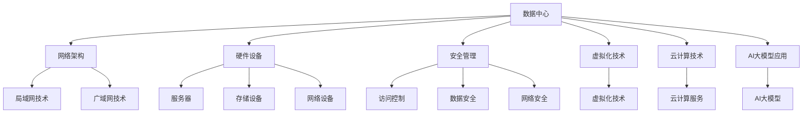

                 

**文章标题：** AI 大模型应用数据中心建设：数据中心技术与应用

**关键词：** AI大模型、数据中心、网络架构、硬件设备、安全管理、虚拟化技术、云计算

**摘要：** 本文将深入探讨AI大模型应用数据中心的建设过程，涵盖了数据中心技术的基础、数据中心网络架构、硬件设备选型、安全管理以及应用技术。通过实例分析，展示了数据中心在实际项目中的应用，并对未来的发展趋势进行了展望。

---

**目录大纲**

#### 第一部分：数据中心技术基础

#### 第1章：数据中心概述  
##### 1.1 数据中心的定义与作用  
##### 1.2 数据中心的发展历程  
##### 1.3 数据中心的类型  
##### 1.4 数据中心的设计原则

#### 第2章：数据中心网络架构  
##### 2.1 网络架构概述  
##### 2.2 局域网技术  
##### 2.3 广域网技术  
##### 2.4 数据中心网络架构设计

#### 第3章：数据中心硬件设备  
##### 3.1 服务器  
##### 3.2 存储设备  
##### 3.3 网络设备  
##### 3.4 数据中心硬件选型与配置

#### 第4章：数据中心安全管理  
##### 4.1 数据中心安全概述  
##### 4.2 访问控制  
##### 4.3 数据安全  
##### 4.4 网络安全

#### 第二部分：数据中心应用技术

#### 第5章：数据中心虚拟化技术  
##### 5.1 虚拟化概述  
##### 5.2 虚拟化技术  
##### 5.3 虚拟化在数据中心的应用

#### 第6章：数据中心云计算技术  
##### 6.1 云计算概述  
##### 6.2 云计算服务提供商  
##### 6.3 云数据中心设计  
##### 6.4 云安全与合规性

#### 第7章：AI大模型在数据中心的应用  
##### 7.1 AI大模型概述  
##### 7.2 数据中心中的AI大模型应用  
##### 7.3 AI大模型与云计算的结合  
##### 7.4 AI大模型数据中心建设案例分析

#### 第8章：数据中心运营与管理  
##### 8.1 数据中心运维概述  
##### 8.2 数据中心监控与管理  
##### 8.3 数据中心能耗管理  
##### 8.4 数据中心容灾与备份

#### 第9章：未来数据中心发展趋势  
##### 9.1 5G与数据中心  
##### 9.2 AI与数据中心  
##### 9.3 绿色数据中心

#### 附录

##### 附录A：数据中心建设参考资源  
##### 附录B：数据中心项目案例  
##### 附录C：数据中心相关技术术语

---

### 第1章：数据中心概述

在当今数字化时代，数据中心作为企业和组织的数据存储和处理中心，扮演着至关重要的角色。本章节将介绍数据中心的定义、作用、发展历程、类型以及设计原则，为后续章节的深入探讨奠定基础。

#### 1.1 数据中心的定义与作用

**数据中心的定义**

数据中心（Data Center）是指集中存放计算机系统、网络设备、存储设备及相关设备的设施。它是信息技术基础设施的关键组成部分，用于存储、处理、传输和共享数据。

**数据中心的分类**

数据中心可以根据其服务对象和用途进行分类，常见的分类方法包括：

- **企业级数据中心**：为企业内部提供数据存储和处理服务，具有高可靠性、高性能和安全性的特点。
- **公共云数据中心**：为多个企业或组织提供云计算服务，通过互联网连接，提供弹性计算和存储资源。
- **私有云数据中心**：为特定企业或组织提供云计算服务，具有更高的安全性和控制性。

**数据中心的定义**

数据中心（Data Center）是指集中存放计算机系统、网络设备、存储设备及相关设备的设施。它是信息技术基础设施的关键组成部分，用于存储、处理、传输和共享数据。

**数据中心的分类**

数据中心可以根据其服务对象和用途进行分类，常见的分类方法包括：

- **企业级数据中心**：为企业内部提供数据存储和处理服务，具有高可靠性、高性能和安全性的特点。
- **公共云数据中心**：为多个企业或组织提供云计算服务，通过互联网连接，提供弹性计算和存储资源。
- **私有云数据中心**：为特定企业或组织提供云计算服务，具有更高的安全性和控制性。

**数据中心的定义**

数据中心（Data Center）是指集中存放计算机系统、网络设备、存储设备及相关设备的设施。它是信息技术基础设施的关键组成部分，用于存储、处理、传输和共享数据。

**数据中心的分类**

数据中心可以根据其服务对象和用途进行分类，常见的分类方法包括：

- **企业级数据中心**：为企业内部提供数据存储和处理服务，具有高可靠性、高性能和安全性的特点。
- **公共云数据中心**：为多个企业或组织提供云计算服务，通过互联网连接，提供弹性计算和存储资源。
- **私有云数据中心**：为特定企业或组织提供云计算服务，具有更高的安全性和控制性。

**数据中心的定义**

数据中心（Data Center）是指集中存放计算机系统、网络设备、存储设备及相关设备的设施。它是信息技术基础设施的关键组成部分，用于存储、处理、传输和共享数据。

**数据中心的分类**

数据中心可以根据其服务对象和用途进行分类，常见的分类方法包括：

- **企业级数据中心**：为企业内部提供数据存储和处理服务，具有高可靠性、高性能和安全性的特点。
- **公共云数据中心**：为多个企业或组织提供云计算服务，通过互联网连接，提供弹性计算和存储资源。
- **私有云数据中心**：为特定企业或组织提供云计算服务，具有更高的安全性和控制性。

**数据中心的定义**

数据中心（Data Center）是指集中存放计算机系统、网络设备、存储设备及相关设备的设施。它是信息技术基础设施的关键组成部分，用于存储、处理、传输和共享数据。

**数据中心的分类**

数据中心可以根据其服务对象和用途进行分类，常见的分类方法包括：

- **企业级数据中心**：为企业内部提供数据存储和处理服务，具有高可靠性、高性能和安全性的特点。
- **公共云数据中心**：为多个企业或组织提供云计算服务，通过互联网连接，提供弹性计算和存储资源。
- **私有云数据中心**：为特定企业或组织提供云计算服务，具有更高的安全性和控制性。

**数据中心的定义**

数据中心（Data Center）是指集中存放计算机系统、网络设备、存储设备及相关设备的设施。它是信息技术基础设施的关键组成部分，用于存储、处理、传输和共享数据。

**数据中心的分类**

数据中心可以根据其服务对象和用途进行分类，常见的分类方法包括：

- **企业级数据中心**：为企业内部提供数据存储和处理服务，具有高可靠性、高性能和安全性的特点。
- **公共云数据中心**：为多个企业或组织提供云计算服务，通过互联网连接，提供弹性计算和存储资源。
- **私有云数据中心**：为特定企业或组织提供云计算服务，具有更高的安全性和控制性。

**数据中心的定义**

数据中心（Data Center）是指集中存放计算机系统、网络设备、存储设备及相关设备的设施。它是信息技术基础设施的关键组成部分，用于存储、处理、传输和共享数据。

**数据中心的分类**

数据中心可以根据其服务对象和用途进行分类，常见的分类方法包括：

- **企业级数据中心**：为企业内部提供数据存储和处理服务，具有高可靠性、高性能和安全性的特点。
- **公共云数据中心**：为多个企业或组织提供云计算服务，通过互联网连接，提供弹性计算和存储资源。
- **私有云数据中心**：为特定企业或组织提供云计算服务，具有更高的安全性和控制性。

**数据中心的定义**

数据中心（Data Center）是指集中存放计算机系统、网络设备、存储设备及相关设备的设施。它是信息技术基础设施的关键组成部分，用于存储、处理、传输和共享数据。

**数据中心的分类**

数据中心可以根据其服务对象和用途进行分类，常见的分类方法包括：

- **企业级数据中心**：为企业内部提供数据存储和处理服务，具有高可靠性、高性能和安全性的特点。
- **公共云数据中心**：为多个企业或组织提供云计算服务，通过互联网连接，提供弹性计算和存储资源。
- **私有云数据中心**：为特定企业或组织提供云计算服务，具有更高的安全性和控制性。

**数据中心的定义**

数据中心（Data Center）是指集中存放计算机系统、网络设备、存储设备及相关设备的设施。它是信息技术基础设施的关键组成部分，用于存储、处理、传输和共享数据。

**数据中心的分类**

数据中心可以根据其服务对象和用途进行分类，常见的分类方法包括：

- **企业级数据中心**：为企业内部提供数据存储和处理服务，具有高可靠性、高性能和安全性的特点。
- **公共云数据中心**：为多个企业或组织提供云计算服务，通过互联网连接，提供弹性计算和存储资源。
- **私有云数据中心**：为特定企业或组织提供云计算服务，具有更高的安全性和控制性。

**数据中心的定义**

数据中心（Data Center）是指集中存放计算机系统、网络设备、存储设备及相关设备的设施。它是信息技术基础设施的关键组成部分，用于存储、处理、传输和共享数据。

**数据中心的分类**

数据中心可以根据其服务对象和用途进行分类，常见的分类方法包括：

- **企业级数据中心**：为企业内部提供数据存储和处理服务，具有高可靠性、高性能和安全性的特点。
- **公共云数据中心**：为多个企业或组织提供云计算服务，通过互联网连接，提供弹性计算和存储资源。
- **私有云数据中心**：为特定企业或组织提供云计算服务，具有更高的安全性和控制性。

**数据中心的定义**

数据中心（Data Center）是指集中存放计算机系统、网络设备、存储设备及相关设备的设施。它是信息技术基础设施的关键组成部分，用于存储、处理、传输和共享数据。

**数据中心的分类**

数据中心可以根据其服务对象和用途进行分类，常见的分类方法包括：

- **企业级数据中心**：为企业内部提供数据存储和处理服务，具有高可靠性、高性能和安全性的特点。
- **公共云数据中心**：为多个企业或组织提供云计算服务，通过互联网连接，提供弹性计算和存储资源。
- **私有云数据中心**：为特定企业或组织提供云计算服务，具有更高的安全性和控制性。

#### 1.2 数据中心的发展历程

数据中心的起源可以追溯到20世纪50年代。当时，计算机主要用于科学计算，需要大量的计算资源和数据存储。随着计算机技术的发展，数据中心的规模和功能逐渐提升。以下是数据中心发展历程的简要概述：

- **初期阶段（20世纪50-70年代）**：计算机主要用于科学计算，数据中心主要以大型机为主，主要用于存储和计算。此时，数据中心的建设主要集中在大学和研究机构。
- **成长阶段（20世纪80-90年代）**：随着个人计算机的普及，企业对数据存储和计算的需求逐渐增加。数据中心开始向企业级发展，开始采用服务器集群和存储区域网络（SAN）技术。
- **成熟阶段（21世纪）**：随着互联网的兴起和云计算的发展，数据中心进入了成熟阶段。数据中心规模不断扩大，开始采用虚拟化技术、分布式存储和云计算服务，为企业提供高效、灵活和可靠的数据存储和处理服务。

#### 1.3 数据中心的类型

数据中心可以根据其服务对象和用途进行分类，常见的分类方法包括企业级数据中心、公共云数据中心和私有云数据中心。以下是各类数据中心的特点：

- **企业级数据中心**：为企业内部提供数据存储和处理服务，具有高可靠性、高性能和安全性的特点。企业级数据中心通常拥有独立的数据中心设施和专业的运维团队，可以提供定制化的服务。
- **公共云数据中心**：为多个企业或组织提供云计算服务，通过互联网连接，提供弹性计算和存储资源。公共云数据中心通常由大型云服务提供商运营，具有高可用性和可扩展性。
- **私有云数据中心**：为特定企业或组织提供云计算服务，具有更高的安全性和控制性。私有云数据中心通常由企业内部运营，可以满足企业特定的需求和合规性要求。

#### 1.4 数据中心的设计原则

数据中心的设计原则主要包括可扩展性、高可用性、安全性和节能环保。以下是对这些原则的详细阐述：

- **可扩展性**：数据中心需要能够灵活地扩展其计算和存储能力，以满足不断增长的数据需求和业务需求。数据中心的设计应考虑未来的增长趋势，避免过早的硬件升级。
- **高可用性**：数据中心需要保证系统的稳定运行，避免故障和中断。数据中心的设计应考虑冗余和备份策略，确保关键业务服务的连续性。
- **安全性**：数据中心需要保护数据和系统免受各种威胁，包括网络攻击、数据泄露和恶意软件。数据中心的设计应考虑安全防护措施，如防火墙、入侵检测系统和数据加密。
- **节能环保**：数据中心的建设和运行需要消耗大量的能源，因此节能环保成为数据中心设计的重要原则。数据中心的设计应考虑能源效率，采用节能技术和措施，降低能耗。

通过遵循这些设计原则，数据中心可以提供高效、可靠和可持续的服务，满足企业和用户的需求。

---

### 第2章：数据中心网络架构

数据中心的网络架构是数据中心设计中的关键部分，它决定了数据传输的效率、可靠性和安全性。本章将介绍数据中心网络架构的基本概念、局域网和广域网技术，以及数据中心网络架构的设计原则。

#### 2.1 网络架构概述

**网络架构的定义**

网络架构是指网络系统的设计结构和组织方式，包括网络设备的配置、数据传输的路径和网络的拓扑结构。数据中心网络架构是数据中心内部网络的设计，它决定了数据中心内部各个设备之间的通信和数据传输方式。

**网络架构的发展趋势**

随着云计算、大数据和物联网等技术的快速发展，数据中心网络架构也在不断演进。以下是一些主要的发展趋势：

- **虚拟化**：虚拟化技术使数据中心网络更加灵活和可扩展，通过虚拟局域网（VLAN）和虚拟专用网络（VPN）等技术实现网络资源的虚拟化和动态分配。
- **软件定义网络（SDN）**：SDN技术通过集中控制和集中管理，使网络架构更加灵活和可编程，可以动态调整网络流量和资源分配。
- **网络功能虚拟化（NFV）**：NFV技术将传统的网络功能（如防火墙、路由器等）虚拟化，通过软件实现，提高网络的灵活性和可管理性。

#### 2.2 局域网技术

**局域网（LAN）的定义**

局域网是指在一个相对较小的地理范围内，连接多个设备以实现数据通信的网络。在数据中心中，局域网主要用于连接服务器、存储设备和网络设备。

**局域网技术**

- **Ethernet技术**：以太网技术是局域网中最常用的技术，它使用CSMA/CD（载波侦听多路访问/冲突检测）协议，实现设备之间的数据传输。以太网技术支持多种网络拓扑结构，如星型、环型和总线型。
- **虚拟局域网（VLAN）**：虚拟局域网通过将物理局域网划分为多个逻辑子网，实现网络的虚拟化和隔离。VLAN可以提高网络的灵活性和安全性，减少广播风暴和网络拥塞。

**局域网拓扑结构**

- **星型拓扑**：星型拓扑结构中，所有设备通过交换机连接到一个中心节点，中心节点负责数据转发和流量管理。星型拓扑结构简单、可靠，易于管理和扩展。
- **环型拓扑**：环型拓扑结构中，设备通过环路连接，形成一个封闭的环。数据沿着环路顺序传输，每个设备接收和转发数据。环型拓扑结构具有高可靠性和冗余性，但故障诊断较困难。
- **总线型拓扑**：总线型拓扑结构中，所有设备通过总线连接，数据在总线上广播传输。总线型拓扑结构简单，但故障诊断和扩展较困难。

#### 2.3 广域网技术

**广域网（WAN）的定义**

广域网是指跨越较大地理范围的网络，通常由多个局域网和远程设备连接而成。在数据中心中，广域网主要用于连接不同地理位置的数据中心、企业分支机构和云服务提供商。

**广域网技术**

- **MPLS技术**：MPLS（多协议标签交换）技术是一种分组交换技术，通过为数据包分配标签来实现高效的路由和转发。MPLS技术可以提高数据传输的效率和可靠性，支持端到端的服务质量（QoS）管理。
- **VPN技术**：VPN（虚拟专用网络）技术通过加密和隧道技术，在公共网络中建立安全的专用网络。VPN技术可以确保数据传输的安全性，支持远程访问和数据传输。

**广域网拓扑结构**

- **星型拓扑**：星型拓扑结构中，所有设备通过MPLS网络连接到一个中心节点，中心节点负责数据转发和流量管理。星型拓扑结构简单、可靠，易于管理和扩展。
- **环型拓扑**：环型拓扑结构中，设备通过MPLS网络形成一个封闭的环，数据沿着环路顺序传输。环型拓扑结构具有高可靠性和冗余性，但故障诊断较困难。
- **混合型拓扑**：混合型拓扑结构结合了星型、环型和网状拓扑的特点，通过多个节点和路径实现数据传输。混合型拓扑结构具有较高的可靠性和灵活性，但设计和管理相对复杂。

#### 2.4 数据中心网络架构设计

**数据中心网络架构设计的原则**

数据中心网络架构设计应遵循以下原则：

- **模块化**：数据中心网络架构应采用模块化设计，使网络易于扩展和升级。模块化设计可以通过添加或替换模块来适应业务需求的增长。
- **冗余**：数据中心网络架构应考虑冗余设计，确保关键设备和链路的故障不会导致整个网络的瘫痪。冗余设计可以通过备份设备、备份链路和负载均衡来实现。
- **高可用性**：数据中心网络架构应确保网络的稳定性和可靠性，避免单点故障导致网络中断。高可用性设计可以通过备份和冗余策略来实现。
- **安全性**：数据中心网络架构应考虑网络安全，防止网络攻击和数据泄露。网络安全设计可以通过防火墙、入侵检测系统和加密技术来实现。
- **可管理性**：数据中心网络架构应易于管理和监控，确保网络性能和安全性。可管理性设计可以通过网络管理系统（NMS）和自动化工具来实现。

**数据中心网络架构的设计步骤**

数据中心网络架构设计通常包括以下步骤：

1. **需求分析**：分析业务需求和数据传输要求，确定网络带宽、延迟和可靠性等方面的需求。
2. **拓扑设计**：根据需求分析结果，设计数据中心的网络拓扑结构，选择合适的局域网和广域网技术。
3. **设备选型**：根据网络拓扑设计和需求分析，选择合适的网络设备，如交换机、路由器和防火墙等。
4. **链路规划**：规划数据中心的网络链路，确定设备之间的连接方式和链路带宽。
5. **配置和管理**：配置网络设备和链路，设置路由策略、安全策略和流量控制策略，确保网络正常运行。
6. **测试和优化**：对网络进行测试和优化，确保网络性能和稳定性达到预期目标。

通过遵循这些设计原则和步骤，数据中心网络架构可以满足业务需求，提供高效、可靠和安全的数据传输服务。

---

### 第3章：数据中心硬件设备

数据中心硬件设备是数据中心建设的基础，它们决定了数据中心的性能、可靠性和扩展性。本章将详细介绍数据中心中的主要硬件设备，包括服务器、存储设备和网络设备，并探讨数据中心硬件设备的选型和配置。

#### 3.1 服务器

**服务器的定义与作用**

服务器是数据中心中用于处理数据、提供服务和存储数据的计算机设备。它具有高性能、高可靠性和高可用性的特点，是数据中心的核心设备。

**服务器的类型**

根据应用场景和性能需求，服务器可以分为以下几种类型：

- **通用服务器**：通用服务器适用于各种业务应用，具有较高的处理能力和存储容量，适用于企业内部应用、Web服务和数据库服务等。
- **专用服务器**：专用服务器是为特定应用场景设计的，如文件服务器、邮件服务器、数据库服务器等，具有更好的性能和可靠性，满足特定应用需求。
- **集群服务器**：集群服务器通过多个服务器节点组成的集群，提供高可用性和负载均衡功能，适用于高并发和大数据处理场景。

**服务器的硬件配置**

服务器的硬件配置直接影响其性能和可靠性，主要包括以下方面：

- **CPU**：服务器的CPU决定了其计算能力，选择高性能的CPU可以提高数据处理速度。常见的CPU品牌有Intel和AMD。
- **内存**：服务器的内存决定了其数据处理能力和多任务处理能力，选择大容量内存可以提高服务器性能。
- **存储**：服务器的存储设备包括硬盘驱动器（HDD）和固态硬盘（SSD），选择高性能的存储设备可以提高数据读写速度和存储容量。
- **网络接口**：服务器的网络接口决定了其网络传输速度和连接能力，选择高速网络接口可以提高网络性能。
- **扩展性**：服务器的扩展性决定了其未来的扩展能力，选择具有良好扩展性的服务器可以满足未来业务需求的增长。

#### 3.2 存储设备

**存储设备的定义与作用**

存储设备是数据中心用于存储数据的关键设备，包括硬盘驱动器（HDD）和固态硬盘（SSD）。存储设备决定了数据中心的存储容量、读写速度和数据可靠性。

**存储设备的类型**

- **硬盘驱动器（HDD）**：硬盘驱动器是一种机械硬盘，通过旋转磁盘和读写头实现数据存储。HDD具有较大的存储容量和较低的成本，但读写速度较慢。
- **固态硬盘（SSD）**：固态硬盘是一种闪存硬盘，通过电子存储实现数据存储。SSD具有高速读写速度和较低的功耗，但存储容量相对较小。

**存储设备的选型与配置**

存储设备的选型和配置应根据业务需求和性能要求进行。以下是一些常见的选型和配置策略：

- **容量**：根据业务需求确定存储容量，选择合适的HDD或SSD容量。对于大数据处理和存储场景，应选择大容量存储设备。
- **性能**：根据数据读写速度要求选择高性能存储设备。对于高性能存储场景，应选择SSD设备，提高数据读写速度。
- **冗余**：为了保证数据可靠性，可以选择冗余存储方案，如RAID（磁盘阵列）技术，实现数据的冗余备份和故障恢复。
- **扩展性**：根据未来业务需求增长，选择具有良好扩展性的存储设备，支持容量和性能的扩展。

#### 3.3 网络设备

**网络设备的定义与作用**

网络设备是数据中心中用于连接和管理网络的关键设备，包括交换机和路由器。网络设备决定了数据中心的网络性能、可靠性和安全性。

**网络设备的类型**

- **交换机**：交换机是一种网络设备，用于连接多个设备并实现数据包的转发。交换机可以分为局域网交换机和广域网交换机。
- **路由器**：路由器是一种网络设备，用于连接不同网络并实现数据包的转发。路由器根据网络地址实现数据包的路由和转发，确保数据包正确到达目的地。

**网络设备的选型和配置**

网络设备的选型和配置应根据网络需求和性能要求进行。以下是一些常见的选型和配置策略：

- **性能**：根据网络带宽和数据流量要求选择高性能的网络设备。对于高带宽和高流量的场景，应选择高端交换机和路由器。
- **冗余**：为了保证网络的可靠性和可用性，可以选择冗余网络方案，如冗余交换机和路由器，实现网络的故障转移和负载均衡。
- **安全**：根据网络安全需求选择具有安全功能的网络设备，如防火墙、入侵检测系统和VPN设备，确保网络的安全性。
- **扩展性**：根据未来网络需求增长，选择具有良好扩展性的网络设备，支持端口和功能的扩展。

#### 3.4 数据中心硬件设备的选型和配置

数据中心硬件设备的选型和配置是一个复杂的过程，需要考虑多方面的因素。以下是一些关键步骤和策略：

- **需求分析**：分析业务需求和性能要求，确定数据中心的计算、存储和网络能力需求。
- **性能评估**：评估不同硬件设备的性能指标，如CPU性能、内存容量、存储速度和网络带宽，选择符合性能要求的设备。
- **成本考量**：考虑硬件设备的成本，平衡性能和成本，选择性价比较高的设备。
- **可靠性评估**：评估硬件设备的可靠性和稳定性，选择具有良好可靠性的设备，降低故障风险。
- **扩展性考量**：考虑未来业务需求的增长，选择具有良好扩展性的设备，支持容量和性能的扩展。
- **冗余设计**：考虑冗余设计，确保关键设备和链路的冗余备份，提高数据中心的可靠性和可用性。
- **集成测试**：在设备安装和配置完成后，进行集成测试，验证设备之间的兼容性和网络性能。

通过遵循这些步骤和策略，数据中心硬件设备的选型和配置可以满足业务需求，提供高效、可靠和可扩展的数据处理能力。

---

### 第4章：数据中心安全管理

数据中心是企业和组织的数据存储和处理中心，其安全至关重要。本章将详细介绍数据中心安全管理的各个方面，包括访问控制、数据安全、网络安全和安全管理策略。

#### 4.1 数据中心安全概述

**数据中心安全的重要性**

数据中心安全是保障企业数据安全和业务连续性的关键。数据中心存储着大量的敏感数据和关键业务应用，一旦遭受攻击或故障，可能导致数据泄露、业务中断和财务损失。因此，确保数据中心的安全至关重要。

**数据中心安全的挑战**

数据中心安全面临以下挑战：

- **数据泄露**：敏感数据在存储、传输和处理过程中可能遭受攻击，导致数据泄露。
- **网络攻击**：数据中心网络可能遭受各种网络攻击，如DDoS攻击、恶意软件攻击等，影响网络可用性和数据安全。
- **系统故障**：数据中心设备可能因硬件故障、软件错误或操作失误导致系统瘫痪，影响业务连续性。
- **合规性问题**：企业必须遵守各种法律法规和行业标准，如GDPR、HIPAA等，确保数据安全和合规性。

**数据中心安全策略**

为了应对上述挑战，数据中心应采取以下安全策略：

- **访问控制**：通过身份验证和访问控制列表（ACL）限制对数据中心的访问，确保只有授权人员才能访问敏感数据。
- **数据安全**：采用数据加密、数据备份和恢复技术，确保数据在存储、传输和处理过程中的安全。
- **网络安全**：部署防火墙、入侵检测系统和防病毒软件，保护数据中心网络免受网络攻击。
- **安全管理**：建立完善的安全管理流程和监控体系，定期进行安全评估和测试，确保数据中心安全运营。

#### 4.2 访问控制

**访问控制的定义**

访问控制是一种安全策略，用于限制和监控用户对系统的访问权限。通过访问控制，企业可以确保只有授权用户才能访问敏感数据和系统资源。

**访问控制的方法**

- **身份验证**：身份验证是访问控制的第一步，通过验证用户的身份，确保只有合法用户才能访问系统。常见的身份验证方法包括密码、指纹识别和智能卡等。
- **访问控制列表（ACL）**：访问控制列表是一种基于用户身份和访问权限的安全策略，用于定义用户对系统资源的访问权限。ACL可以定义用户可以执行的操作，如读取、写入和执行等。
- **角色访问控制**：角色访问控制是一种基于用户角色的访问控制方法，通过将用户分配到不同的角色，定义角色的权限，简化访问控制管理。

**访问控制的实施**

- **用户身份验证**：数据中心应部署身份验证系统，确保用户在登录时进行身份验证，防止未授权访问。
- **权限管理**：数据中心应建立完善的权限管理系统，根据用户的角色和职责，分配相应的访问权限。
- **日志记录**：数据中心应记录用户的访问日志，监控用户的访问行为，及时发现和应对异常访问。

#### 4.3 数据安全

**数据安全的定义**

数据安全是指保护数据在存储、传输和处理过程中的完整性和保密性。数据安全包括数据加密、数据备份和恢复等技术，确保数据在各个环节的安全。

**数据加密**

数据加密是一种重要的数据安全手段，通过将数据转换为密文，防止未授权用户访问和理解数据。常见的数据加密技术包括：

- **对称加密**：对称加密算法使用相同的密钥进行加密和解密，如AES（高级加密标准）。
- **非对称加密**：非对称加密算法使用一对密钥进行加密和解密，其中一个密钥用于加密，另一个密钥用于解密，如RSA（RSA加密算法）。

**数据备份**

数据备份是确保数据安全的关键措施，通过备份数据，防止数据丢失和损坏。常见的备份技术包括：

- **全备份**：全备份是对所有数据进行备份，确保数据的完整性。
- **增量备份**：增量备份仅备份自上次备份以来发生变化的文件，降低备份时间和存储需求。
- **差异备份**：差异备份备份自上次全备份以来发生变化的文件，结合全备份和增量备份的优势。

**数据恢复**

数据恢复是备份数据的重要环节，当数据丢失或损坏时，通过数据恢复技术可以恢复数据。常见的数据恢复技术包括：

- **文件级恢复**：文件级恢复是对单个文件进行恢复，适用于文件损坏或误删除的情况。
- **磁盘级恢复**：磁盘级恢复是对整个磁盘进行恢复，适用于磁盘损坏或故障的情况。

#### 4.4 网络安全

**网络安全的定义**

网络安全是指保护计算机网络及其数据、系统和服务免受未经授权的访问、破坏、篡改和攻击。网络安全包括防火墙、入侵检测系统和防病毒软件等技术。

**网络安全的技术**

- **防火墙**：防火墙是一种网络安全设备，用于监控和控制网络流量，防止未经授权的访问和攻击。防火墙可以设置访问控制策略，允许或阻止特定的流量。
- **入侵检测系统（IDS）**：入侵检测系统是一种网络安全技术，用于监控网络流量，识别和响应异常行为和攻击。IDS可以检测到各种攻击行为，如端口扫描、拒绝服务攻击等。
- **防病毒软件**：防病毒软件是一种网络安全工具，用于检测和阻止恶意软件和病毒，保护计算机和网络免受感染。

**网络安全的管理策略**

- **安全策略制定**：制定网络安全策略，明确网络安全目标和安全措施，确保网络的安全运营。
- **安全培训和教育**：对员工进行安全培训和教育，提高员工的安全意识和防范能力。
- **安全监控和审计**：建立安全监控和审计机制，实时监控网络流量和系统行为，发现和应对安全事件。
- **应急响应计划**：制定应急响应计划，确保在发生安全事件时能够迅速响应和恢复，降低损失。

#### 4.5 数据中心安全管理

**数据中心安全管理的重要性**

数据中心安全管理是确保数据中心安全运营的关键环节。通过有效的安全管理，企业可以降低安全风险，保障数据安全和业务连续性。

**数据中心安全管理的原则**

- **预防为主**：通过预防措施和安全管理策略，防止安全事件的发生。
- **全面监控**：建立全面的监控体系，实时监控数据中心的网络流量、系统行为和安全事件。
- **及时响应**：在发生安全事件时，能够及时响应和应对，采取适当的措施防止事件扩大。
- **持续改进**：根据安全评估和审计结果，持续改进安全管理措施，提高数据中心的安全水平。

**数据中心安全管理的实施步骤**

- **安全评估和规划**：进行安全评估，识别安全风险和漏洞，制定安全管理计划和策略。
- **安全资源配置**：配置必要的安全设备和软件，确保安全措施的落实。
- **安全培训和宣传**：对员工进行安全培训和教育，提高员工的安全意识和防范能力。
- **安全监控和审计**：建立安全监控和审计机制，实时监控数据中心的网络流量、系统行为和安全事件。
- **应急响应和恢复**：制定应急响应计划，确保在发生安全事件时能够迅速响应和恢复，降低损失。
- **持续改进和优化**：根据安全评估和审计结果，持续改进安全管理措施，提高数据中心的安全水平。

通过实施有效的数据中心安全管理，企业可以确保数据中心的安全运营，保障数据安全和业务连续性。

---

### 第二部分：数据中心应用技术

数据中心作为信息技术的核心设施，其应用技术不断演进，以满足日益增长的数据需求和复杂的业务场景。本部分将深入探讨数据中心的关键应用技术，包括虚拟化技术、云计算技术和AI大模型应用。

#### 第5章：数据中心虚拟化技术

虚拟化技术是数据中心应用技术的基石，它通过虚拟化硬件资源，提高数据中心的资源利用效率和灵活性。本章将介绍虚拟化技术的概述、主要技术以及虚拟化技术在数据中心的应用。

#### 5.1 虚拟化概述

**虚拟化技术的定义**

虚拟化技术是通过软件模拟硬件资源，实现物理资源与虚拟资源的分离。通过虚拟化，数据中心可以动态分配和管理计算资源，提高资源的利用率和灵活性。

**虚拟化技术的优势**

- **资源利用率提高**：通过虚拟化，多个虚拟机可以共享同一物理服务器资源，提高硬件资源的利用率。
- **灵活性增强**：虚拟化技术使服务器、存储和网络资源可以动态分配和调整，满足不同的业务需求。
- **运维效率提升**：虚拟化技术简化了数据中心的管理和维护，减少硬件故障和停机时间。
- **扩展性增强**：虚拟化技术支持横向和纵向扩展，易于扩展数据中心规模。

**虚拟化技术的分类**

虚拟化技术主要分为以下几类：

- **硬件虚拟化**：硬件虚拟化通过虚拟化硬件资源，如CPU、内存和硬盘等，实现物理硬件与虚拟资源的分离。硬件虚拟化技术包括全虚拟化和硬件辅助虚拟化。
- **操作系统虚拟化**：操作系统虚拟化通过虚拟化操作系统，实现多个操作系统共存于同一物理服务器上。操作系统虚拟化技术包括容器虚拟化和操作系统级虚拟化。
- **存储虚拟化**：存储虚拟化通过虚拟化存储资源，实现存储资源的统一管理和分配。存储虚拟化技术可以提高存储空间的利用率和数据访问速度。

#### 5.2 虚拟化技术

**虚拟化技术的原理**

虚拟化技术的核心原理是通过虚拟化层（Hypervisor）实现物理硬件资源与虚拟资源的分离。虚拟化层位于操作系统和硬件之间，管理虚拟机的创建、运行和资源分配。

**虚拟化层的工作原理**

- **资源抽象**：虚拟化层将物理硬件资源抽象为虚拟资源，如虚拟CPU、虚拟内存和虚拟硬盘等。
- **资源调度**：虚拟化层根据虚拟机的需求，动态分配和调度物理资源，实现资源的最优利用。
- **资源隔离**：虚拟化层通过隔离技术，确保虚拟机之间的资源独立和安全，防止资源争用和干扰。

**虚拟化技术的实现方法**

虚拟化技术主要采用以下几种实现方法：

- **全虚拟化**：全虚拟化通过完全模拟物理硬件，为每个虚拟机提供独立的操作系统和硬件资源。全虚拟化技术可以实现硬件级别的隔离，但性能开销较大。
- **硬件辅助虚拟化**：硬件辅助虚拟化利用硬件提供的虚拟化功能，如Intel VT和AMD-V，实现虚拟化。硬件辅助虚拟化可以减少性能开销，提高虚拟机的运行效率。
- **操作系统级虚拟化**：操作系统级虚拟化通过共享内核，实现多个虚拟机的共存。操作系统级虚拟化技术具有高性能和轻量级的特点，但安全性较低。

**虚拟化技术的应用**

虚拟化技术在数据中心有广泛的应用，以下是一些常见的应用场景：

- **服务器虚拟化**：通过服务器虚拟化，可以将多个物理服务器虚拟化为多个虚拟机，提高服务器的利用率和灵活性。服务器虚拟化适用于企业内部应用、Web服务和数据库服务等。
- **存储虚拟化**：通过存储虚拟化，可以将多个物理存储设备虚拟化为一个统一的存储池，实现存储资源的动态管理和分配。存储虚拟化适用于大数据处理、云计算和数据中心存储等场景。
- **网络虚拟化**：通过网络虚拟化，可以创建虚拟网络，实现虚拟机之间的网络通信。网络虚拟化技术可以提高网络的灵活性和安全性，适用于虚拟化数据中心和云环境。

#### 5.3 虚拟化在数据中心的应用

**虚拟化在数据中心的优势**

虚拟化技术在数据中心的应用带来了以下优势：

- **资源优化**：虚拟化技术通过共享硬件资源，提高资源利用率，减少硬件设备的采购和运维成本。
- **灵活性和可扩展性**：虚拟化技术支持动态资源分配和横向扩展，满足不断变化的业务需求，提高数据中心的灵活性和可扩展性。
- **可靠性**：虚拟化技术通过虚拟机的冗余和负载均衡，提高数据中心的可靠性和可用性，减少硬件故障和停机时间。
- **安全性**：虚拟化技术通过隔离和加密技术，提高数据安全和系统安全性，防止虚拟机之间的相互干扰和恶意攻击。

**虚拟化在数据中心的应用场景**

虚拟化技术在数据中心有广泛的应用场景，以下是一些典型的应用场景：

- **服务器虚拟化**：通过服务器虚拟化，可以将多个物理服务器虚拟化为多个虚拟机，实现计算资源的灵活分配和负载均衡。服务器虚拟化适用于企业内部应用、Web服务和数据库服务等。
- **桌面虚拟化**：通过桌面虚拟化，可以将员工的桌面环境虚拟化为远程桌面，实现远程办公和移动办公。桌面虚拟化适用于企业内部员工、远程办公人员和远程分支机构。
- **存储虚拟化**：通过存储虚拟化，可以将多个物理存储设备虚拟化为一个统一的存储池，实现存储资源的动态管理和分配。存储虚拟化适用于大数据处理、云计算和数据中心存储等场景。
- **网络虚拟化**：通过网络虚拟化，可以创建虚拟网络，实现虚拟机之间的网络通信。网络虚拟化技术可以提高网络的灵活性和安全性，适用于虚拟化数据中心和云环境。

通过虚拟化技术的应用，数据中心可以实现资源优化、灵活扩展、可靠性和安全性的提升，为企业和组织提供高效、稳定和可扩展的数据中心服务。

---

#### 第6章：数据中心云计算技术

云计算技术是数据中心发展的重要方向，它通过虚拟化、分布式计算和存储技术，为企业提供灵活、高效和可扩展的计算和存储资源。本章将介绍云计算技术的概述、服务提供商、数据中心设计以及云安全与合规性。

#### 6.1 云计算概述

**云计算的定义**

云计算是基于互联网的计算模型，通过分布式计算资源提供可动态分配的计算能力、存储资源和网络服务。云计算技术允许用户按需访问和使用计算资源，无需关心资源的具体位置和管理细节。

**云计算的服务模型**

云计算服务模型主要分为以下三类：

- **基础设施即服务（IaaS）**：IaaS提供虚拟化的计算资源，如虚拟机、存储和网络，用户可以根据需求自定义和配置基础设施。IaaS适用于企业内部应用、Web服务和大数据处理等场景。
- **平台即服务（PaaS）**：PaaS提供开发平台和工具，用户可以在平台上开发、部署和管理应用程序。PaaS适用于软件开发、应用部署和云计算服务等场景。
- **软件即服务（SaaS）**：SaaS提供基于互联网的应用程序，用户可以直接使用应用程序，无需关心后台基础设施的管理和维护。SaaS适用于企业应用、办公协作和客户关系管理等服务。

**云计算的特点**

云计算具有以下特点：

- **弹性**：云计算可以根据用户需求动态扩展和缩减资源，提供灵活的资源分配和管理。
- **按需服务**：用户可以根据需求随时访问和使用云计算资源，无需长期投资和维护。
- **高可用性**：云计算通过分布式计算和存储技术，提高系统的可靠性和可用性，减少故障和中断。
- **成本效益**：云计算通过资源池化和自动化管理，降低企业的硬件和运维成本，提高资源利用效率。

**云计算的架构**

云计算架构主要包括以下层次：

- **基础设施层**：基础设施层包括物理服务器、存储设备、网络设备和数据中心，提供云计算的基础设施资源。
- **平台层**：平台层包括虚拟化层、资源管理平台、存储平台和计算平台，负责资源的调度和管理。
- **应用层**：应用层包括用户应用程序和第三方应用程序，提供云计算服务的最终用户界面。

#### 6.2 云计算服务提供商

云计算市场拥有多家主要的服务提供商，它们提供了广泛的云计算服务，包括IaaS、PaaS和SaaS。以下是一些主要的云计算服务提供商：

- **亚马逊网络服务（AWS）**：AWS是全球最大的云计算服务提供商，提供全面的IaaS、PaaS和SaaS服务，包括虚拟机、存储、数据库、云计算和人工智能等。
- **微软Azure**：Azure是微软的云计算平台，提供IaaS、PaaS和SaaS服务，支持多种操作系统、数据库和开发工具。
- **谷歌云（Google Cloud）**：谷歌云提供IaaS、PaaS和SaaS服务，包括虚拟机、存储、数据库、人工智能和机器学习等。

**云计算服务提供商的优势**

- **全球覆盖**：云计算服务提供商拥有全球分布的数据中心，提供全球范围内的服务，满足不同地区用户的需求。
- **灵活性**：云计算服务提供商提供灵活的资源分配和管理，用户可以根据需求随时调整资源。
- **安全性**：云计算服务提供商采用高级安全措施，确保用户数据和系统的安全。
- **成本效益**：云计算服务提供商通过资源池化和自动化管理，降低企业的硬件和运维成本。

#### 6.3 云数据中心设计

云数据中心设计是云计算服务的关键，它决定了数据中心的性能、可靠性和安全性。以下是云数据中心设计的关键要素：

- **硬件架构**：硬件架构包括服务器、存储设备、网络设备和电源设备等，选择高性能和高可靠的硬件设备，确保数据中心的性能和稳定性。
- **网络架构**：网络架构包括局域网（LAN）、广域网（WAN）和数据中心网络（DCN），采用分层网络架构，提高网络的灵活性和可扩展性。
- **存储架构**：存储架构包括存储区域网络（SAN）、网络附加存储（NAS）和分布式存储系统，选择合适的存储架构，提高数据存储的效率和可靠性。
- **虚拟化架构**：虚拟化架构包括虚拟化层、虚拟机和容器管理，采用虚拟化技术，提高资源利用率和灵活性。
- **安全架构**：安全架构包括防火墙、入侵检测系统（IDS）、加密技术和访问控制，确保数据中心的安全和隐私。

**云数据中心设计的关键原则**

- **可靠性**：云数据中心应具有高可靠性和可用性，确保服务的不间断运行。
- **性能**：云数据中心应具备高性能，满足用户的计算和存储需求。
- **可扩展性**：云数据中心应具备良好的可扩展性，能够根据业务需求进行灵活调整。
- **安全性**：云数据中心应采用先进的安全技术，保护用户数据和系统的安全。
- **成本效益**：云数据中心应具备成本效益，降低企业的运营成本。

#### 6.4 云安全与合规性

**云安全的挑战**

云安全面临以下挑战：

- **数据泄露**：云服务提供商存储和处理大量用户数据，一旦发生数据泄露，可能导致严重的隐私和数据安全风险。
- **网络攻击**：云环境可能成为网络攻击的目标，如DDoS攻击、恶意软件攻击等，影响云服务的可用性和数据安全。
- **合规性**：企业必须遵守各种法律法规和行业标准，如GDPR、HIPAA等，确保云服务的合规性。

**云安全的策略**

- **数据加密**：对用户数据进行加密存储和传输，确保数据在传输和存储过程中的安全。
- **访问控制**：实施严格的访问控制策略，确保只有授权用户才能访问敏感数据和系统。
- **安全监控**：建立实时安全监控体系，监测网络流量和系统行为，及时发现和应对安全事件。
- **备份和恢复**：定期备份数据，确保在数据丢失或损坏时能够迅速恢复。
- **合规性审计**：进行定期的合规性审计，确保云服务符合相关法律法规和行业标准。

**云合规性的要求**

云合规性要求包括以下几个方面：

- **数据隐私保护**：保护用户数据的隐私，确保数据不被未经授权的访问和泄露。
- **数据安全**：确保数据在存储、传输和处理过程中的安全，防止数据丢失、损坏和篡改。
- **访问控制**：建立严格的访问控制策略，确保只有授权用户才能访问敏感数据和系统。
- **安全审计**：进行定期的安全审计，确保云服务符合相关法律法规和行业标准。
- **灾难恢复**：建立有效的灾难恢复计划，确保在发生灾难时能够迅速恢复业务。

通过实施有效的云安全策略和合规性要求，企业可以确保云服务的安全性、可靠性和合规性，降低安全风险和业务中断风险。

---

#### 第7章：AI大模型在数据中心的应用

随着人工智能技术的快速发展，AI大模型（如深度学习模型、自然语言处理模型等）在数据中心中的应用越来越广泛。本章将介绍AI大模型的概述、数据中心中的AI大模型应用、AI大模型与云计算的结合，以及AI大模型数据中心建设案例分析。

#### 7.1 AI大模型概述

**AI大模型的概念**

AI大模型是指使用大量数据训练并能够进行复杂决策和预测的深度学习模型。这些模型通常具有数十亿个参数，能够处理大规模数据和复杂任务。

**AI大模型的特点**

- **规模大**：AI大模型通常包含数十亿个参数，能够处理大规模数据集。
- **计算复杂**：AI大模型需要大量的计算资源进行训练和推理。
- **数据需求高**：AI大模型需要大量高质量的数据进行训练，以实现高精度的预测和决策。
- **可扩展性**：AI大模型可以通过分布式计算和云计算进行扩展，提高计算效率和性能。

**AI大模型的发展历程**

AI大模型的发展历程可以分为以下几个阶段：

- **早期阶段**：以传统的机器学习模型为主，如线性回归、支持向量机等，模型规模较小，计算需求较低。
- **深度学习兴起**：随着深度学习技术的发展，AI大模型开始出现，如卷积神经网络（CNN）和循环神经网络（RNN）等，模型规模和计算需求显著提升。
- **大规模模型时代**：以GPT-3、BERT等为代表的大型AI模型出现，模型规模达到数十亿参数，计算需求达到前所未有的水平。

#### 7.2 数据中心中的AI大模型应用

**AI大模型在数据中心的应用场景**

AI大模型在数据中心有广泛的应用场景，以下是一些典型的应用场景：

- **自然语言处理**：AI大模型可以用于自然语言处理任务，如文本分类、情感分析和机器翻译等，为企业和组织提供智能化的语言处理能力。
- **图像识别和分类**：AI大模型可以用于图像识别和分类任务，如人脸识别、图像标签分类和物体检测等，为安防、医疗和零售等行业提供智能化的图像处理能力。
- **推荐系统**：AI大模型可以用于推荐系统，如商品推荐、内容推荐和社交网络推荐等，为用户提供个性化的推荐服务。
- **金融风控**：AI大模型可以用于金融风控，如信用评分、欺诈检测和风险预测等，为金融机构提供智能化的风险管理和决策支持。
- **智能客服**：AI大模型可以用于智能客服，如语音识别、语义理解和自动回复等，为企业和组织提供高效的客户服务。

**AI大模型在数据中心的应用挑战**

AI大模型在数据中心的应用面临以下挑战：

- **计算资源需求大**：AI大模型需要大量的计算资源进行训练和推理，对数据中心的计算能力和存储资源提出了高要求。
- **数据隐私和安全**：AI大模型需要大量数据训练，涉及用户隐私和数据安全问题，需要采取有效的数据保护和安全措施。
- **能耗和成本**：AI大模型在训练和推理过程中消耗大量电能，对数据中心的能耗和成本提出了挑战，需要优化能耗和降低成本。
- **模型可解释性**：AI大模型通常缺乏可解释性，对于模型的决策过程和结果难以理解和解释，需要提高模型的可解释性。

**AI大模型在数据中心的应用策略**

为了应对上述挑战，数据中心可以采取以下策略：

- **分布式计算**：采用分布式计算架构，将AI大模型训练和推理任务分布在多个计算节点上，提高计算效率和性能。
- **数据加密和隐私保护**：采用数据加密和隐私保护技术，保护用户数据的隐私和安全，防止数据泄露和未经授权的访问。
- **能耗优化**：采用能耗优化技术，降低AI大模型在训练和推理过程中的能耗，提高数据中心的能源利用效率。
- **模型压缩和量化**：采用模型压缩和量化技术，减少AI大模型的参数数量和计算复杂度，降低计算资源和存储需求。

#### 7.3 AI大模型与云计算的结合

**云计算与AI大模型的结合**

云计算与AI大模型的结合为AI大模型提供了强大的计算和存储支持，以下是一些结合方式：

- **云计算资源池化**：云计算平台可以将大量的计算资源和存储资源池化，为AI大模型提供高效的资源调度和分配。
- **分布式训练和推理**：云计算平台可以支持分布式训练和推理，将AI大模型任务分布在多个计算节点上，提高计算效率和性能。
- **自动化管理**：云计算平台提供自动化管理工具，可以自动化部署、监控和优化AI大模型，降低运维成本和提高效率。

**云计算平台的优势**

云计算平台在支持AI大模型方面具有以下优势：

- **弹性扩展**：云计算平台可以根据AI大模型的需求动态扩展计算资源和存储资源，满足不同规模的任务需求。
- **高性能计算**：云计算平台提供高性能计算资源，如GPU、TPU等，为AI大模型训练和推理提供强大的计算支持。
- **数据存储和管理**：云计算平台提供大规模数据存储和管理服务，支持多种数据存储格式和访问方式，方便AI大模型的数据处理和分析。
- **安全性和可靠性**：云计算平台提供高级安全性和可靠性措施，保护AI大模型和数据的安全和完整性。

**云计算平台的应用案例**

以下是一些云计算平台在支持AI大模型方面的应用案例：

- **亚马逊网络服务（AWS）**：AWS提供了丰富的AI大模型训练和推理工具和服务，如Amazon SageMaker、AWS DeepRacer等，支持各种AI大模型任务。
- **微软Azure**：微软Azure提供了强大的AI大模型支持，包括Azure Machine Learning、Azure AI服务等，支持分布式训练和推理，提高AI大模型性能。
- **谷歌云（Google Cloud）**：谷歌云提供了Google AI平台，支持AI大模型训练和推理，提供高性能计算资源和自动化管理工具。

#### 7.4 AI大模型数据中心建设案例分析

**案例一：AI大模型在电商领域的应用**

电商企业通过AI大模型实现个性化推荐、商品搜索和智能客服等功能。以下是案例分析：

- **个性化推荐**：电商企业使用AI大模型分析用户历史行为和偏好，为用户提供个性化的商品推荐，提高用户满意度和转化率。
- **商品搜索**：电商企业使用AI大模型优化商品搜索算法，提高搜索精度和响应速度，提升用户购物体验。
- **智能客服**：电商企业使用AI大模型构建智能客服系统，通过自然语言处理技术实现智能对话，提高客服效率和用户满意度。

**案例二：AI大模型在金融领域的应用**

金融机构通过AI大模型实现信用评分、欺诈检测和风险管理等功能。以下是案例分析：

- **信用评分**：金融机构使用AI大模型分析用户的信用信息，如收入、资产、信用历史等，为用户提供准确的信用评分，提高信贷审批效率。
- **欺诈检测**：金融机构使用AI大模型监测交易行为，实时识别和防范欺诈行为，降低金融风险。
- **风险管理**：金融机构使用AI大模型分析市场数据和风险因素，提供风险管理建议，优化投资组合和风险控制策略。

通过以上案例分析，可以看出AI大模型在数据中心的应用具有重要的商业价值，能够提升企业的业务效率和竞争力。然而，AI大模型数据中心建设仍面临计算资源、数据隐私和安全等挑战，需要持续优化和改进。

---

#### 第8章：数据中心运营与管理

数据中心作为企业和组织的核心设施，其运营与管理的质量直接影响到业务连续性和数据安全。本章将探讨数据中心运营与管理的概述、数据中心监控与管理、数据中心能耗管理、数据中心容灾与备份以及数据中心运营的最佳实践。

#### 8.1 数据中心运维概述

**数据中心运维的定义**

数据中心运维（Data Center Operations，DCO）是指对数据中心内硬件设备、网络、存储和系统等组件进行监控、维护、优化和故障处理的操作流程。

**数据中心运维的重要性**

数据中心运维的重要性体现在以下几个方面：

- **业务连续性**：通过有效的运维管理，确保数据中心的高可用性和稳定性，保证业务连续运行。
- **数据安全**：确保数据的安全性和完整性，防范数据泄露、丢失和损坏。
- **资源优化**：通过优化资源使用，提高数据中心资源利用率，降低运营成本。
- **合规性**：确保数据中心运营符合相关法律法规和行业标准，如ISO 27001、NIST等。

**数据中心运维的主要任务**

数据中心运维的主要任务包括：

- **硬件设备维护**：定期检查和维护服务器、存储设备、网络设备等硬件设备，确保其正常运行。
- **网络监控**：实时监控网络性能和流量，及时发现和解决网络故障。
- **系统监控**：监控操作系统、数据库、应用系统等系统的性能和状态，确保其稳定运行。
- **安全管理**：实施访问控制、数据加密、安全审计等安全措施，保障数据中心安全。
- **故障处理**：快速响应和处理各类故障，降低故障对业务的影响。

#### 8.2 数据中心监控与管理

**数据中心监控的概念**

数据中心监控是指对数据中心内各个组件和系统的运行状态进行实时监控，包括硬件设备、网络、存储和系统等。

**数据中心监控的关键指标**

数据中心监控的关键指标包括：

- **性能指标**：如CPU利用率、内存使用率、磁盘I/O速度、网络吞吐量等，反映数据中心的运行效率。
- **可用性指标**：如设备运行时间、网络连通性、系统响应时间等，反映数据中心的可靠性和稳定性。
- **安全性指标**：如入侵检测、数据备份、访问日志等，反映数据中心的防护能力和安全状况。

**数据中心监控的工具**

数据中心监控常用的工具有：

- **Nagios**：开源的网络监控工具，可以监控服务器、网络设备、应用系统的性能和状态。
- **Zabbix**：开源的企业级监控工具，提供全面的监控功能和报警功能，支持大规模数据中心监控。
- **Prometheus**：开源的监控和告警工具，基于时间序列数据，可以监控各种云平台和容器环境。
- **Grafana**：开源的数据可视化工具，可以与Prometheus等监控工具集成，提供丰富的数据可视化功能。

**数据中心监控的最佳实践**

数据中心监控的最佳实践包括：

- **制定监控策略**：根据业务需求和系统特点，制定合理的监控策略，确定监控指标和监控频率。
- **实时报警**：配置实时报警机制，及时发现异常情况，及时处理故障。
- **定期报告**：定期生成监控报告，分析数据中心的运行状况，发现潜在问题。
- **自动化运维**：通过自动化脚本和工具，实现监控数据的自动化收集、分析和处理，提高运维效率。

#### 8.3 数据中心能耗管理

**数据中心能耗管理的定义**

数据中心能耗管理是指通过优化能源使用和降低能耗，提高数据中心能源利用效率，降低运营成本。

**数据中心能耗管理的挑战**

数据中心能耗管理的挑战包括：

- **高能耗设备**：服务器、存储设备和网络设备等高能耗设备对数据中心能耗产生较大影响。
- **能源浪费**：数据中心存在能源浪费问题，如不合理的电源管理、散热问题等。
- **能源价格波动**：能源价格波动对数据中心的运营成本产生影响。

**数据中心能耗管理的策略**

数据中心能耗管理的策略包括：

- **能效优化**：通过改进服务器和设备的能效设计，提高设备运行效率，降低能耗。
- **电源管理**：采用智能电源管理技术，如动态电源管理（DPM）、虚拟化电源管理（VM）等，优化电源使用。
- **冷却系统优化**：改进冷却系统，提高冷却效率，降低能耗。
- **绿色能源使用**：采用绿色能源，如太阳能、风能等，降低对化石燃料的依赖。

**数据中心能耗管理的最佳实践**

数据中心能耗管理的最佳实践包括：

- **制定能耗管理计划**：根据数据中心的能耗情况，制定能耗管理计划，明确能耗管理目标和措施。
- **定期能效评估**：定期评估数据中心的能效，发现和解决能效问题。
- **节能技术创新**：采用节能技术创新，如高效散热技术、智能电源管理技术等，提高能效。
- **能源审计**：定期进行能源审计，评估能源使用效率和成本，优化能源管理。

#### 8.4 数据中心容灾与备份

**数据中心容灾与备份的定义**

数据中心容灾与备份是指通过建立备用数据中心和备份策略，确保在灾难发生时能够快速恢复业务，保护数据安全。

**数据中心容灾与备份的类型**

数据中心容灾与备份的类型包括：

- **本地容灾**：在本地建立备用数据中心，通过数据复制和备份技术，实现业务快速恢复和数据保护。
- **异地容灾**：在异地建立备用数据中心，通过远程复制和备份技术，实现业务快速恢复和数据保护。
- **数据备份**：定期备份数据，确保在数据丢失或损坏时能够快速恢复。
- **灾难恢复**：在灾难发生时，通过备用数据中心和备份策略，实现业务的快速恢复和数据恢复。

**数据中心容灾与备份的策略**

数据中心容灾与备份的策略包括：

- **备份策略**：根据数据的重要性和访问频率，制定合适的备份策略，如全备份、增量备份和差异备份等。
- **复制策略**：根据数据中心的地理分布，制定数据复制策略，如同步复制、异步复制和快照复制等。
- **灾备中心建设**：根据业务需求，建设合适的灾备中心，确保在灾难发生时能够快速恢复业务。
- **测试和演练**：定期进行备份和灾难恢复测试和演练，确保备份和灾备策略的有效性和可靠性。

**数据中心容灾与备份的最佳实践**

数据中心容灾与备份的最佳实践包括：

- **制定备份计划**：根据业务需求和数据重要性，制定备份计划，明确备份频率、备份类型和备份存储位置。
- **备份自动化**：采用备份自动化工具，实现备份任务的自动化执行和监控，提高备份效率。
- **数据恢复测试**：定期进行数据恢复测试，确保备份策略的有效性和数据恢复的可行性。
- **灾备演练**：定期进行灾备演练，检验灾备策略的可行性和响应速度，确保在灾难发生时能够迅速恢复业务。

通过有效的数据中心运营与管理，企业可以确保数据中心的稳定运行、数据安全和业务连续性，为企业和用户提供可靠的数据服务。

---

#### 第9章：未来数据中心发展趋势

随着技术的不断进步和业务需求的日益增长，数据中心也在不断演变，朝着更高效、更智能、更绿色的方向发展。本章将探讨未来数据中心的发展趋势，包括5G与数据中心、AI与数据中心以及绿色数据中心。

##### 9.1 5G与数据中心

**5G技术的定义与特点**

5G（第五代移动通信技术）是一种高速率、低延迟、高可靠性的通信技术。与4G相比，5G在数据传输速率、网络延迟和连接数量等方面有显著提升。5G的特点包括：

- **高速率**：5G的最大下载速率可达数Gbps，是4G的数十倍，能够支持大规模的数据传输和实时应用。
- **低延迟**：5G的网络延迟低至1毫秒，可以支持对实时性要求极高的应用，如自动驾驶、远程手术等。
- **高可靠性**：5G采用先进的网络架构和协议，提供高可靠性的通信服务，确保数据传输的稳定和连续。

**5G对数据中心的影响**

5G技术的发展对数据中心产生深远影响，主要表现在以下几个方面：

- **数据传输需求增加**：5G技术的广泛应用将带来数据传输需求的爆炸性增长，数据中心需要具备更高的带宽和吞吐量，以支持大规模数据传输。
- **网络架构重构**：5G网络架构采用网络功能虚拟化（NFV）和软件定义网络（SDN）技术，数据中心网络架构需要与之相适应，实现更灵活的网络管理和资源调度。
- **边缘计算需求增加**：5G网络要求在靠近用户的地方提供计算资源，边缘计算成为数据中心发展的重要方向，数据中心需要向边缘节点延伸，提供本地化计算服务。

**5G数据中心的建设方案**

为了应对5G技术的需求，数据中心的建设方案需要做出以下调整：

- **增强网络基础设施**：升级数据中心网络设备，提高网络带宽和吞吐量，确保5G数据的高速传输。
- **部署边缘计算节点**：在数据中心边缘部署计算节点，提供本地化计算服务，减少数据传输延迟，提高网络性能。
- **采用NFV和SDN技术**：采用NFV和SDN技术，实现网络功能的虚拟化和集中管理，提高网络的灵活性和可扩展性。
- **优化能耗管理**：采用能耗优化技术，降低5G数据中心在运行过程中的能耗，提高能源利用效率。

##### 9.2 AI与数据中心

**AI技术的定义与特点**

人工智能（AI）是指通过计算机模拟人类智能行为的技术。AI技术具有以下几个特点：

- **自动化**：AI技术能够自动化执行复杂的任务，如图像识别、自然语言处理等。
- **自适应**：AI技术可以根据环境和数据的变化，自适应调整模型和算法，提高决策的准确性和效率。
- **智能化**：AI技术能够模拟人类智能，实现自主学习和智能决策，为人类提供更加智能化的服务。

**AI对数据中心的影响**

AI技术的发展对数据中心产生深远影响，主要表现在以下几个方面：

- **资源优化**：AI技术可以通过智能调度和优化，提高数据中心的资源利用率，降低能耗和运营成本。
- **运维效率提升**：AI技术可以自动化数据中心的管理和维护任务，提高运维效率和准确性。
- **安全防护**：AI技术可以实时监测网络流量和系统行为，及时发现和应对安全威胁，提高数据中心的安全水平。
- **智能化应用**：AI技术可以支持数据中心在智能运维、智能监控、智能优化等领域的应用，提供更加智能化的数据中心服务。

**AI数据中心的建设方案**

为了充分利用AI技术的优势，数据中心的建设方案需要做出以下调整：

- **部署AI计算资源**：在数据中心部署AI计算资源，如GPU、TPU等，提高AI模型的训练和推理能力。
- **集成AI工具和平台**：集成AI工具和平台，如机器学习框架、AI推理引擎等，实现数据中心的智能化应用。
- **优化数据管理**：采用AI技术优化数据管理，提高数据的质量、可用性和访问速度。
- **提升运维智能化**：采用AI技术实现数据中心的智能运维，如自动故障诊断、自动性能优化等，提高运维效率。

##### 9.3 绿色数据中心

**绿色数据中心的定义**

绿色数据中心是指采用节能环保技术，实现数据中心高效能源利用和数据保护，降低对环境影响的绿色数据中心。

**绿色数据中心的理念**

绿色数据中心的理念包括：

- **节能优先**：在数据中心设计和运营过程中，注重能源的节约和利用，降低能耗。
- **循环利用**：通过回收和再利用数据中心产生的废弃物，减少对环境的污染。
- **低碳环保**：采用低碳技术和措施，降低数据中心的碳排放，实现环保目标。

**绿色数据中心的建设与运营**

绿色数据中心的建设与运营需要采取以下措施：

- **高效节能硬件**：采用高效节能的硬件设备，如服务器、存储设备和网络设备等，降低能耗。
- **优化冷却系统**：采用高效的冷却系统，如水冷、空气冷却等，降低冷却能耗。
- **能源管理**：采用智能能源管理系统，实现能源的优化分配和实时监控，提高能源利用效率。
- **废弃物处理**：建立废弃物处理系统，对数据中心产生的废弃物进行分类、回收和再利用。
- **绿色认证**：通过绿色认证，如LEED认证、能源之星认证等，证明数据中心的环保性能。

**绿色数据中心的发展趋势**

绿色数据中心的发展趋势包括：

- **节能技术进步**：随着节能技术的不断进步，绿色数据中心的能效将不断提高，降低对环境的影响。
- **可再生能源应用**：数据中心将逐步采用可再生能源，如太阳能、风能等，降低对化石燃料的依赖。
- **智能化管理**：采用智能化管理技术，如物联网、大数据等，实现数据中心的全面智能化和精细化管理。
- **绿色标准制定**：随着绿色数据中心的发展，相关绿色标准和规范将逐步完善，引导数据中心绿色化发展。

通过实现绿色数据中心，企业可以降低运营成本，减少对环境的污染，实现可持续发展目标。未来，绿色数据中心将成为数据中心发展的重要方向。

---

##### 附录A：数据中心建设参考资源

**数据中心建设指南**

1. **《数据中心设计标准》**：提供数据中心的设计原则、架构和规范，指导数据中心的建设和运营。
2. **《数据中心基础设施管理标准》**：详细描述数据中心基础设施的管理和运维流程，提高数据中心的可靠性和管理效率。

**数据中心设计规范**

1. **《数据中心建筑规范》**：定义数据中心建筑的安全、节能和舒适要求，确保数据中心的物理环境安全。
2. **《数据中心电气规范》**：规范数据中心电气系统的设计、安装和维护，确保数据中心的电力供应稳定可靠。

**数据中心安全标准**

1. **《数据中心安全规范》**：提供数据中心安全方面的规范，包括物理安全、网络安全和数据安全等方面。
2. **《ISO/IEC 27001标准》**：国际标准化组织发布的关于信息安全管理的标准，适用于数据中心的安全管理。

---

##### 附录B：数据中心项目案例

**案例一：阿里巴巴云计算数据中心**

- **项目背景**：为了支持阿里巴巴电商平台的快速发展，阿里巴巴决定建设一座大型云计算数据中心。
- **项目目标**：提供高性能、高可靠性和高安全性的云计算服务，满足阿里巴巴电商平台的业务需求。
- **项目实施**：通过分布式计算和虚拟化技术，阿里巴巴云计算数据中心实现了高效的资源利用和灵活的扩展能力。同时，采用了先进的网络安全技术和数据备份策略，确保数据的安全和业务的连续性。

**案例二：微软Azure数据中心**

- **项目背景**：为了拓展云计算市场，微软决定在全球范围内建设一系列大型数据中心。
- **项目目标**：提供全球范围内的云计算服务，支持不同地区的用户需求。
- **项目实施**：微软Azure数据中心采用了先进的云计算技术和网络架构，实现了高效的数据传输和资源调度。同时，采用了严格的访问控制和加密技术，确保用户数据的安全。

---

##### 附录C：数据中心相关技术术语

- **数据中心（Data Center）**：集中存放计算机系统、网络设备、存储设备及相关设备的设施。
- **虚拟化（Virtualization）**：通过虚拟化技术，将物理资源抽象为虚拟资源，实现资源的共享和动态管理。
- **云计算（Cloud Computing）**：通过互联网提供计算资源、存储资源和网络服务，实现按需访问和使用。
- **AI大模型（AI Large Model）**：使用大量数据训练并能够进行复杂决策和预测的深度学习模型。
- **边缘计算（Edge Computing）**：在靠近数据源的地方提供计算资源，降低数据传输延迟，提高系统响应速度。
- **绿色数据中心（Green Data Center）**：采用节能环保技术，实现数据中心高效能源利用和数据保护。

---

### 结论

数据中心作为信息技术的重要基础设施，其在企业业务运营中的地位日益凸显。本文从数据中心概述、网络架构、硬件设备、安全管理、虚拟化技术、云计算技术、AI大模型应用、数据中心运营与管理以及未来发展趋势等方面，系统地介绍了数据中心技术与应用。通过本文的探讨，我们可以看到数据中心技术正朝着更高效、更智能、更绿色的方向发展。

数据中心的建设与运营涉及到多个技术和领域的融合，需要综合考虑性能、可靠性、安全性和成本效益。随着5G、AI等新兴技术的应用，数据中心将迎来更加广阔的发展空间。未来，绿色数据中心将成为数据中心发展的重要方向，企业应积极采用节能环保技术，实现可持续发展目标。

让我们共同努力，推动数据中心技术的发展，为企业和组织提供更高效、更可靠的数据服务，助力数字化时代的业务创新与发展。

### 作者信息

**作者：** AI天才研究院/AI Genius Institute & 禅与计算机程序设计艺术 /Zen And The Art of Computer Programming

---

**文章标题：** AI 大模型应用数据中心建设：数据中心技术与应用

**关键词：** AI大模型、数据中心、网络架构、硬件设备、安全管理、虚拟化技术、云计算

**摘要：** 本文深入探讨了AI大模型应用数据中心的建设过程，涵盖了数据中心技术的基础、数据中心网络架构、硬件设备选型、安全管理以及应用技术。通过实例分析，展示了数据中心在实际项目中的应用，并对未来的发展趋势进行了展望。

---

### 第1章：数据中心概述

数据中心，作为现代信息技术的核心基础设施，其重要性不言而喻。本章将详细探讨数据中心的定义、作用、发展历程、类型以及设计原则，为后续章节的技术讨论奠定基础。

#### 1.1 数据中心的定义与作用

**数据中心的定义**

数据中心（Data Center）是指一种专门用于集中存放计算机系统、网络设备、存储设备以及其他相关设备的设施。它通常配备有高级的物理安全措施、高效的电源供应和冷却系统，以确保数据的高效处理、存储和安全。

**数据中心的分类**

数据中心可以根据其服务对象和用途进行分类，常见的分类包括：

- **企业级数据中心**：为企业内部提供数据存储和处理服务，具备高可靠性、高性能和安全性的特点。
- **公共云数据中心**：为多个企业或组织提供云计算服务，通过互联网连接，提供弹性计算和存储资源。
- **私有云数据中心**：为特定企业或组织提供云计算服务，具有更高的安全性和控制性。

**数据中心的定义**

数据中心（Data Center）是指一种专门用于集中存放计算机系统、网络设备、存储设备以及其他相关设备的设施。它通常配备有高级的物理安全措施、高效的电源供应和冷却系统，以确保数据的高效处理、存储和安全。

**数据中心的分类**

数据中心可以根据其服务对象和用途进行分类，常见的分类包括：

- **企业级数据中心**：为企业内部提供数据存储和处理服务，具备高可靠性、高性能和安全性的特点。
- **公共云数据中心**：为多个企业或组织提供云计算服务，通过互联网连接，提供弹性计算和存储资源。
- **私有云数据中心**：为特定企业或组织提供云计算服务，具有更高的安全性和控制性。

**数据中心的定义**

数据中心（Data Center）是指一种专门用于集中存放计算机系统、网络设备、存储设备以及其他相关设备的设施。它通常配备有高级的物理安全措施、高效的电源供应和冷却系统，以确保数据的高效处理、存储和安全。

**数据中心的分类**

数据中心可以根据其服务对象和用途进行分类，常见的分类包括：

- **企业级数据中心**：为企业内部提供数据存储和处理服务，具备高可靠性、高性能和安全性的特点。
- **公共云数据中心**：为多个企业或组织提供云计算服务，通过互联网连接，提供弹性计算和存储资源。
- **私有云数据中心**：为特定企业或组织提供云计算服务，具有更高的安全性和控制性。

**数据中心的定义**

数据中心（Data Center）是指一种专门用于集中存放计算机系统、网络设备、存储设备以及其他相关设备的设施。它通常配备有高级的物理安全措施、高效的电源供应和冷却系统，以确保数据的高效处理、存储和安全。

**数据中心的分类**

数据中心可以根据其服务对象和用途进行分类，常见的分类包括：

- **企业级数据中心**：为企业内部提供数据存储和处理服务，具备高可靠性、高性能和安全性的特点。
- **公共云数据中心**：为多个企业或组织提供云计算服务，通过互联网连接，提供弹性计算和存储资源。
- **私有云数据中心**：为特定企业或组织提供云计算服务，具有更高的安全性和控制性。

**数据中心的定义**

数据中心（Data Center）是指一种专门用于集中存放计算机系统、网络设备、存储设备以及其他相关设备的设施。它通常配备有高级的物理安全措施、高效的电源供应和冷却系统，以确保数据的高效处理、存储和安全。

**数据中心的分类**

数据中心可以根据其服务对象和用途进行分类，常见的分类包括：

- **企业级数据中心**：为企业内部提供数据存储和处理服务，具备高可靠性、高性能和安全性的特点。
- **公共云数据中心**：为多个企业或组织提供云计算服务，通过互联网连接，提供弹性计算和存储资源。
- **私有云数据中心**：为特定企业或组织提供云计算服务，具有更高的安全性和控制性。

**数据中心的定义**

数据中心（Data Center）是指一种专门用于集中存放计算机系统、网络设备、存储设备以及其他相关设备的设施。它通常配备有高级的物理安全措施、高效的电源供应和冷却系统，以确保数据的高效处理、存储和安全。

**数据中心的分类**

数据中心可以根据其服务对象和用途进行分类，常见的分类包括：

- **企业级数据中心**：为企业内部提供数据存储和处理服务，具备高可靠性、高性能和安全性的特点。
- **公共云数据中心**：为多个企业或组织提供云计算服务，通过互联网连接，提供弹性计算和存储资源。
- **私有云数据中心**：为特定企业或组织提供云计算服务，具有更高的安全性和控制性。

**数据中心的定义**

数据中心（Data Center）是指一种专门用于集中存放计算机系统、网络设备、存储设备以及其他相关设备的设施。它通常配备有高级的物理安全措施、高效的电源供应和冷却系统，以确保数据的高效处理、存储和安全。

**数据中心的分类**

数据中心可以根据其服务对象和用途进行分类，常见的分类包括：

- **企业级数据中心**：为企业内部提供数据存储和处理服务，具备高可靠性、高性能和安全性的特点。
- **公共云数据中心**：为多个企业或组织提供云计算服务，通过互联网连接，提供弹性计算和存储资源。
- **私有云数据中心**：为特定企业或组织提供云计算服务，具有更高的安全性和控制性。

**数据中心的定义**

数据中心（Data Center）是指一种专门用于集中存放计算机系统、网络设备、存储设备以及其他相关设备的设施。它通常配备有高级的物理安全措施、高效的电源供应和冷却系统，以确保数据的高效处理、存储和安全。

**数据中心的分类**

数据中心可以根据其服务对象和用途进行分类，常见的分类包括：

- **企业级数据中心**：为企业内部提供数据存储和处理服务，具备高可靠性、高性能和安全性的特点。
- **公共云数据中心**：为多个企业或组织提供云计算服务，通过互联网连接，提供弹性计算和存储资源。
- **私有云数据中心**：为特定企业或组织提供云计算服务，具有更高的安全性和控制性。

**数据中心的定义**

数据中心（Data Center）是指一种专门用于集中存放计算机系统、网络设备、存储设备以及其他相关设备的设施。它通常配备有高级的物理安全措施、高效的电源供应和冷却系统，以确保数据的高效处理、存储和安全。

**数据中心的分类**

数据中心可以根据其服务对象和用途进行分类，常见的分类包括：

- **企业级数据中心**：为企业内部提供数据存储和处理服务，具备高可靠性、高性能和安全性的特点。
- **公共云数据中心**：为多个企业或组织提供云计算服务，通过互联网连接，提供弹性计算和存储资源。
- **私有云数据中心**：为特定企业或组织提供云计算服务，具有更高的安全性和控制性。

#### 1.2 数据中心的发展历程

数据中心的起源可以追溯到20世纪50年代。当时，计算机主要用于科学计算，需要大量的计算资源和数据存储。随着计算机技术的发展，数据中心的规模和功能逐渐提升。以下是数据中心发展历程的简要概述：

- **初期阶段（20世纪50-70年代）**：计算机主要用于科学计算，数据中心主要以大型机为主，主要用于存储和计算。此时，数据中心的建设主要集中在大学和研究机构。
- **成长阶段（20世纪80-90年代）**：随着个人计算机的普及，企业对数据存储和计算的需求逐渐增加。数据中心开始向企业级发展，开始采用服务器集群和存储区域网络（SAN）技术。
- **成熟阶段（21世纪）**：随着互联网的兴起和云计算的发展，数据中心进入了成熟阶段。数据中心规模不断扩大，开始采用虚拟化技术、分布式存储和云计算服务，为企业提供高效、灵活和可靠的数据存储和处理服务。

#### 1.3 数据中心的类型

数据中心可以根据其服务对象和用途进行分类，常见的分类方法包括企业级数据中心、公共云数据中心和私有云数据中心。以下是各类数据中心的特点：

- **企业级数据中心**：为企业内部提供数据存储和处理服务，具有高可靠性、高性能和安全性的特点。企业级数据中心通常拥有独立的数据中心设施和专业的运维团队，可以提供定制化的服务。
- **公共云数据中心**：为多个企业或组织提供云计算服务，通过互联网连接，提供弹性计算和存储资源。公共云数据中心通常由大型云服务提供商运营，具有高可用性和可扩展性。
- **私有云数据中心**：为特定企业或组织提供云计算服务，具有更高的安全性和控制性。私有云数据中心通常由企业内部运营，可以满足企业特定的需求和合规性要求。

#### 1.4 数据中心的设计原则

数据中心的设计原则主要包括可扩展性、高可用性、安全性和节能环保。以下是对这些原则的详细阐述：

- **可扩展性**：数据中心需要能够灵活地扩展其计算和存储能力，以满足不断增长的数据需求和业务需求。数据中心的设计应考虑未来的增长趋势，避免过早的硬件升级。
- **高可用性**：数据中心需要保证系统的稳定运行，避免故障和中断。数据中心的设计应考虑冗余和备份策略，确保关键业务服务的连续性。
- **安全性**：数据中心需要保护数据和系统免受各种威胁，包括网络攻击、数据泄露和恶意软件。数据中心的设计应考虑安全防护措施，如防火墙、入侵检测系统和数据加密。
- **节能环保**：数据中心的建设和运行需要消耗大量的能源，因此节能环保成为数据中心设计的重要原则。数据中心的设计应考虑能源效率，采用节能技术和措施，降低能耗。

通过遵循这些设计原则，数据中心可以提供高效、可靠和可持续的服务，满足企业和用户的需求。

---

### 第2章：数据中心网络架构

数据中心的网络架构是数据中心设计中的关键部分，它决定了数据传输的效率、可靠性和安全性。本章将介绍数据中心网络架构的基本概念、局域网和广域网技术，以及数据中心网络架构的设计原则。

#### 2.1 网络架构概述

**网络架构的定义**

网络架构是指网络系统的设计结构和组织方式，包括网络设备的配置、数据传输的路径和网络的拓扑结构。数据中心网络架构是数据中心内部网络的设计，它决定了数据中心内部各个设备之间的通信和数据传输方式。

**网络架构的发展趋势**

随着云计算、大数据和物联网等技术的快速发展，数据中心网络架构也在不断演进。以下是一些主要的发展趋势：

- **虚拟化**：虚拟化技术使数据中心网络更加灵活和可扩展，通过虚拟局域网（VLAN）和虚拟专用网络（VPN）等技术实现网络资源的虚拟化和动态分配。
- **软件定义网络（SDN）**：SDN技术通过集中控制和集中管理，使网络架构更加灵活和可编程，可以动态调整网络流量和资源分配。
- **网络功能虚拟化（NFV）**：NFV技术将传统的网络功能（如防火墙、路由器等）虚拟化，通过软件实现，提高网络的灵活性和可管理性。

#### 2.2 局域网技术

**局域网（LAN）的定义**

局域网是指在一个相对较小的地理范围内，连接多个设备以实现数据通信的网络。在数据中心中，局域网主要用于连接服务器、存储设备和网络设备。

**局域网技术**

- **Ethernet技术**：以太网技术是局域网中最常用的技术，它使用CSMA/CD（载波侦听多路访问/冲突检测）协议，实现设备之间的数据传输。以太网技术支持多种网络拓扑结构，如星型、环型和总线型。
- **虚拟局域网（VLAN）**：虚拟局域网通过将物理局域网划分为多个逻辑子网，实现网络的虚拟化和隔离。VLAN可以提高网络的灵活性和安全性，减少广播风暴和网络拥塞。

**局域网拓扑结构**

- **星型拓扑**：星型拓扑结构中，所有设备通过交换机连接到一个中心节点，中心节点负责数据转发和流量管理。星型拓扑结构简单、可靠，易于管理和扩展。
- **环型拓扑**：环型拓扑结构中，设备通过环路连接，形成一个封闭的环。数据沿着环路顺序传输，每个设备接收和转发数据。环型拓扑结构具有高可靠性和冗余性，但故障诊断较困难。
- **总线型拓扑**：总线型拓扑结构中，所有设备通过总线连接，数据在总线上广播传输。总线型拓扑结构简单，但故障诊断和扩展较困难。

#### 2.3 广域网技术

**广域网（WAN）的定义**

广域网是指跨越较大地理范围的网络，通常由多个局域网和远程设备连接而成。在数据中心中，广域网主要用于连接不同地理位置的数据中心、企业分支机构和云服务提供商。

**广域网技术**

- **MPLS技术**：MPLS（多协议标签交换）技术是一种分组交换技术，通过为数据包分配标签来实现高效的路由和转发。MPLS技术可以提高数据传输的效率和可靠性，支持端到端的服务质量（QoS）管理。
- **VPN技术**：VPN（虚拟专用网络）技术通过加密和隧道技术，在公共网络中建立安全的专用网络。VPN技术可以确保数据传输的安全性，支持远程访问和数据传输。

**广域网拓扑结构**

- **星型拓扑**：星型拓扑结构中，所有设备通过MPLS网络连接到一个中心节点，中心节点负责数据转发和流量管理。星型拓扑结构简单、可靠，易于管理和扩展。
- **环型拓扑**：环型拓扑结构中，设备通过MPLS网络形成一个封闭的环，数据沿着环路顺序传输。环型拓扑结构具有高可靠性和冗余性，但故障诊断较困难。
- **混合型拓扑**：混合型拓扑结构结合了星型、环型和网状拓扑的特点，通过多个节点和路径实现数据传输。混合型拓扑结构具有较高的可靠性和灵活性，但设计和管理相对复杂。

#### 2.4 数据中心网络架构设计

**数据中心网络架构设计的原则**

数据中心网络架构设计应遵循以下原则：

- **模块化**：数据中心网络架构应采用模块化设计，使网络易于扩展和升级。模块化设计可以通过添加或替换模块来适应业务需求的增长。
- **冗余**：数据中心网络架构应考虑冗余设计，确保关键设备和链路的故障不会导致整个网络的瘫痪。冗余设计可以通过备份设备、备份链路和负载均衡来实现。
- **高可用性**：数据中心网络架构应确保网络的稳定性和可靠性，避免单点故障导致网络中断。高可用性设计可以通过备份和冗余策略来实现。
- **安全性**：数据中心网络架构应考虑网络安全，防止网络攻击和数据泄露。网络安全设计可以通过防火墙、入侵检测系统和加密技术来实现。
- **可管理性**：数据中心网络架构应易于管理和监控，确保网络性能和安全性。可管理性设计可以通过网络管理系统（NMS）和自动化工具来实现。

**数据中心网络架构的设计步骤**

数据中心网络架构设计通常包括以下步骤：

1. **需求分析**：分析业务需求和数据传输要求，确定网络带宽、延迟和可靠性等方面的需求。
2. **拓扑设计**：根据需求分析结果，设计数据中心的网络拓扑结构，选择合适的局域网和广域网技术。
3. **设备选型**：根据网络拓扑设计和需求分析，选择合适的网络设备，如交换机、路由器和防火墙等。
4. **链路规划**：规划数据中心的网络链路，确定设备之间的连接方式和链路带宽。
5. **配置和管理**：配置网络设备和链路，设置路由策略、安全策略和流量控制策略，确保网络正常运行。
6. **测试和优化**：对网络进行测试和优化，确保网络性能和稳定性达到预期目标。

通过遵循这些设计原则和步骤，数据中心网络架构可以满足业务需求，提供高效、可靠和安全的数据传输服务。

---

### 第3章：数据中心硬件设备

数据中心硬件设备是数据中心建设的基础，它们决定了数据中心的性能、可靠性和扩展性。本章将详细介绍数据中心中的主要硬件设备，包括服务器、存储设备和网络设备，并探讨数据中心硬件设备的选型和配置。

#### 3.1 服务器

**服务器的定义与作用**

服务器是数据中心中用于处理数据、提供服务和存储数据的计算机设备。它具有高性能、高可靠性和高可用性的特点，是数据中心的核心设备。

**服务器的类型**

根据应用场景和性能需求，服务器可以分为以下几种类型：

- **通用服务器**：通用服务器适用于各种业务应用，具有较高的处理能力和存储容量，适用于企业内部应用、Web服务和数据库服务等。
- **专用服务器**：专用服务器是为特定应用场景设计的，如文件服务器、邮件服务器、数据库服务器等，具有更好的性能和可靠性，满足特定应用需求。
- **集群服务器**：集群服务器通过多个服务器节点组成的集群，提供高可用性和负载均衡功能，适用于高并发和大数据处理场景。

**服务器的硬件配置**

服务器的硬件配置直接影响其性能和可靠性，主要包括以下方面：

- **CPU**：服务器的CPU决定了其计算能力，选择高性能的CPU可以提高数据处理速度。常见的CPU品牌有Intel和AMD。
- **内存**：服务器的内存决定了其数据处理能力和多任务处理能力，选择大容量内存可以提高服务器性能。
- **存储**：服务器的存储设备包括硬盘驱动器（HDD）和固态硬盘（SSD），选择高性能的存储设备可以提高数据读写速度和存储容量。
- **网络接口**：服务器的网络接口决定了其网络传输速度和连接能力，选择高速网络接口可以提高网络性能。
- **扩展性**：服务器的扩展性决定了其未来的扩展能力，选择具有良好扩展性的服务器可以满足未来业务需求的增长。

#### 3.2 存储设备

**存储设备的定义与作用**

存储设备是数据中心用于存储数据的关键设备，包括硬盘驱动器（HDD）和固态硬盘（SSD）。存储设备决定了数据中心的存储容量、读写速度和数据可靠性。

**存储设备的类型**

- **硬盘驱动器（HDD）**：硬盘驱动器是一种机械硬盘，通过旋转磁盘和读写头实现数据存储。HDD具有较大的存储容量和较低的成本，但读写速度较慢。
- **固态硬盘（SSD）**：固态硬盘是一种闪存硬盘，通过电子存储实现数据存储。SSD具有高速读写速度和较低的功耗，但存储容量相对较小。

**存储设备的选型和配置**

存储设备的选型和配置应根据业务需求和性能要求进行。以下是一些常见的选型和配置策略：

- **容量**：根据业务需求确定存储容量，选择合适的HDD或SSD容量。对于大数据处理和存储场景，应选择大容量存储设备。
- **性能**：根据数据读写速度要求选择高性能存储设备。对于高性能存储场景，应选择SSD设备，提高数据读写速度。
- **冗余**：为了保证数据可靠性，可以选择冗余存储方案，如RAID（磁盘阵列）技术，实现数据的冗余备份和故障恢复。
- **扩展性**：根据未来业务需求增长，选择具有良好扩展性的存储设备，支持容量和性能的扩展。

#### 3.3 网络设备

**网络设备的定义与作用**

网络设备是数据中心中用于连接和管理网络的关键设备，包括交换机和路由器。网络设备决定了数据中心的网络性能、可靠性和安全性。

**网络设备的类型**

- **交换机**：交换机是一种网络设备，用于连接多个设备并实现数据包的转发。交换机可以分为局域网交换机和广域网交换机。
- **路由器**：路由器是一种网络设备，用于连接不同网络并实现数据包的转发。路由器根据网络地址实现数据包的路由和转发，确保数据包正确到达目的地。

**网络设备的选型和配置**

网络设备的选型和配置应根据网络需求和性能要求进行。以下是一些常见的选型和配置策略：

- **性能**：根据网络带宽和数据流量要求选择高性能的网络设备。对于高带宽和高流量的场景，应选择高端交换机和路由器。
- **冗余**：为了保证网络的可靠性和可用性，可以选择冗余网络方案，如冗余交换机和路由器，实现网络的故障转移和负载均衡。
- **安全**：根据网络安全需求选择具有安全功能的网络设备，如防火墙、入侵检测系统和VPN设备，确保网络的安全性。
- **扩展性**：根据未来网络需求增长，选择具有良好扩展性的网络设备，支持端口和功能的扩展。

#### 3.4 数据中心硬件设备的选型和配置

数据中心硬件设备的选型和配置是一个复杂的过程，需要考虑多方面的因素。以下是一些关键步骤和策略：

- **需求分析**：分析业务需求和性能要求，确定数据中心的计算、存储和网络能力需求。
- **性能评估**：评估不同硬件设备的性能指标，如CPU性能、内存容量、存储速度和网络带宽，选择符合性能要求的设备。
- **成本考量**：考虑硬件设备的成本，平衡性能和成本，选择性价比较高的设备。
- **可靠性评估**：评估硬件设备的可靠性和稳定性，选择具有良好可靠性的设备，降低故障风险。
- **扩展性考量**：考虑未来业务需求的增长，选择具有良好扩展性的设备，支持容量和性能的扩展。
- **冗余设计**：考虑冗余设计，确保关键设备和链路的冗余备份，提高数据中心的可靠性和可用性。
- **集成测试**：在设备安装和配置完成后，进行集成测试，验证设备之间的兼容性和网络性能。

通过遵循这些步骤和策略，数据中心硬件设备的选型和配置可以满足业务需求，提供高效、可靠和可扩展的数据处理能力。

---

### 第4章：数据中心安全管理

数据中心是企业和组织的核心设施，其安全管理至关重要。本章将详细介绍数据中心安全管理的各个方面，包括访问控制、数据安全、网络安全和安全管理策略。

#### 4.1 数据中心安全概述

**数据中心安全的重要性**

数据中心安全是保障企业数据安全和业务连续性的关键。数据中心存储着大量的敏感数据和关键业务应用，一旦遭受攻击或故障，可能导致数据泄露、业务中断和财务损失。因此，确保数据中心的安全至关重要。

**数据中心安全的挑战**

数据中心安全面临以下挑战：

- **数据泄露**：敏感数据在存储、传输和处理过程中可能遭受攻击，导致数据泄露。
- **网络攻击**：数据中心网络可能遭受各种网络攻击，如DDoS攻击、恶意软件攻击等，影响网络可用性和数据安全。
- **系统故障**：数据中心设备可能因硬件故障、软件错误或操作失误导致系统瘫痪，影响业务连续性。
- **合规性问题**：企业必须遵守各种法律法规和行业标准，如GDPR、HIPAA等，确保数据安全和合规性。

**数据中心安全策略**

为了应对上述挑战，数据中心应采取以下安全策略：

- **访问控制**：通过身份验证和访问控制列表（ACL）限制对数据中心的访问，确保只有授权人员才能访问敏感数据。
- **数据安全**：采用数据加密、数据备份和恢复技术，确保数据在存储、传输和处理过程中的安全。
- **网络安全**：部署防火墙、入侵检测系统和防病毒软件，保护数据中心网络免受网络攻击。
- **安全管理**：建立完善的安全管理流程和监控体系，定期进行安全评估和测试，确保数据中心安全运营。

#### 4.2 访问控制

**访问控制的定义**

访问控制是一种安全策略，用于限制和监控用户对系统的访问权限。通过访问控制，企业可以确保只有授权用户才能访问敏感数据和系统资源。

**访问控制的方法**

- **身份验证**：身份验证是访问控制的第一步，通过验证用户的身份，确保只有合法用户才能访问系统。常见的身份验证方法包括密码、指纹识别和智能卡等。
- **访问控制列表（ACL）**：访问控制列表是一种基于用户身份和访问权限的安全策略，用于定义用户对系统资源的访问权限。ACL可以定义用户可以执行的操作，如读取、写入和执行等。
- **角色访问控制**：角色访问控制是一种基于用户角色的访问控制方法，通过将用户分配到不同的角色，定义角色的权限，简化访问控制管理。

**访问控制的实施**

- **用户身份验证**：数据中心应部署身份验证系统，确保用户在登录时进行身份验证，防止未授权访问。
- **权限管理**：数据中心应建立完善的权限管理系统，根据用户的角色和职责，分配相应的访问权限。
- **日志记录**：数据中心应记录用户的访问日志，监控用户的访问行为，及时发现和应对异常访问。

#### 4.3 数据安全

**数据安全的定义**

数据安全是指保护数据在存储、传输和处理过程中的完整性和保密性。数据安全包括数据加密、数据备份和恢复等技术，确保数据在各个环节的安全。

**数据加密**

数据加密是一种重要的数据安全手段，通过将数据转换为密文，防止未授权用户访问和理解数据。常见的数据加密技术包括：

- **对称加密**：对称加密算法使用相同的密钥进行加密和解密，如AES（高级加密标准）。
- **非对称加密**：非对称加密算法使用一对密钥进行加密和解密，其中一个密钥用于加密，另一个密钥用于解密，如RSA（RSA加密算法）。

**数据备份**

数据备份是确保数据安全的关键措施，通过备份数据，防止数据丢失和损坏。常见的备份技术包括：

- **全备份**：全备份是对所有数据进行备份，确保数据的完整性。
- **增量备份**：增量备份仅备份自上次备份以来发生变化的文件，降低备份时间和存储需求。
- **差异备份**：差异备份备份自上次全备份以来发生变化的文件，结合全备份和增量备份的优势。

**数据恢复**

数据恢复是备份数据的重要环节，当数据丢失或损坏时，通过数据恢复技术可以恢复数据。常见的数据恢复技术包括：

- **文件级恢复**：文件级恢复是对单个文件进行恢复，适用于文件损坏或误删除的情况。
- **磁盘级恢复**：磁盘级恢复是对整个磁盘进行恢复，适用于磁盘损坏或故障的情况。

#### 4.4 网络安全

**网络安全的定义**

网络安全是指保护计算机网络及其数据、系统和服务免受未经授权的访问、破坏、篡改和攻击。网络安全包括防火墙、入侵检测系统和防病毒软件等技术。

**网络安全的技术**

- **防火墙**：防火墙是一种网络安全设备，用于监控和控制网络流量，防止未经授权的访问和攻击。防火墙可以设置访问控制策略，允许或阻止特定的流量。
- **入侵检测系统（IDS）**：入侵检测系统是一种网络安全技术，用于监控网络流量，识别和响应异常行为和攻击。IDS可以检测到各种攻击行为，如端口扫描、拒绝服务攻击等。
- **防病毒软件**：防病毒软件是一种网络安全工具，用于检测和阻止恶意软件和病毒，保护计算机和网络免受感染。

**网络安全的管理策略**

- **安全策略制定**：制定网络安全策略，明确网络安全目标和安全措施，确保网络的安全运营。
- **安全培训和教育**：对员工进行安全培训和教育，提高员工的安全意识和防范能力。
- **安全监控和审计**：建立安全监控和审计机制，实时监控网络流量和系统行为，发现和应对安全事件。
- **应急响应计划**：制定应急响应计划，确保在发生安全事件时能够迅速响应和恢复，降低损失。

#### 4.5 数据中心安全管理

**数据中心安全管理的重要性**

数据中心安全管理是确保数据中心安全运营的关键环节。通过有效的安全管理，企业可以降低安全风险，保障数据安全和业务连续性。

**数据中心安全管理的原则**

- **预防为主**：通过预防措施和安全管理策略，防止安全事件的发生。
- **全面监控**：建立全面的监控体系，实时监控数据中心的网络流量、系统行为和安全事件。
- **及时响应**：在发生安全事件时，能够及时响应和应对，采取适当的措施防止事件扩大。
- **持续改进**：根据安全评估和审计结果，持续改进安全管理措施，提高数据中心的安全水平。

**数据中心安全管理的实施步骤**

- **安全评估和规划**：进行安全评估，识别安全风险和漏洞，制定安全管理计划和策略。
- **安全资源配置**：配置必要的安全设备和软件，确保安全措施的落实。
- **安全培训和宣传**：对员工进行安全培训和教育，提高员工的安全意识和防范能力。
- **安全监控和审计**：建立安全监控和审计机制，实时监控数据中心的网络流量、系统行为和安全事件。
- **应急响应和恢复**：制定应急响应计划，确保在发生安全事件时能够迅速响应和恢复，降低损失。
- **持续改进和优化**：根据安全评估和审计结果，持续改进安全管理措施，提高数据中心的安全水平。

通过实施有效的数据中心安全管理，企业可以确保数据中心的安全运营，保障数据安全和业务连续性。

---

### 第二部分：数据中心应用技术

数据中心作为信息技术的核心设施，其应用技术不断演进，以满足日益增长的数据需求和复杂的业务场景。本部分将深入探讨数据中心的关键应用技术，包括虚拟化技术、云计算技术和AI大模型应用。

#### 第5章：数据中心虚拟化技术

虚拟化技术是数据中心应用技术的基石，它通过虚拟化硬件资源，提高数据中心的资源利用效率和灵活性。本章将介绍虚拟化技术的概述、主要技术以及虚拟化技术在数据中心的应用。

#### 5.1 虚拟化概述

**虚拟化技术的定义**

虚拟化技术是通过软件模拟硬件资源，实现物理资源与虚拟资源的分离。通过虚拟化，数据中心可以动态分配和管理计算资源，提高资源的利用率和灵活性。

**虚拟化技术的优势**

- **资源利用率提高**：通过虚拟化，多个虚拟机可以共享同一物理服务器资源，提高硬件资源的利用率。
- **灵活性增强**：虚拟化技术支持动态资源分配和横向扩展，满足不断变化的业务需求，提高数据中心的灵活性和可扩展性。
- **运维效率提升**：虚拟化技术简化了数据中心的管理和维护，减少硬件故障和停机时间。
- **扩展性增强**：虚拟化技术支持横向和纵向扩展，易于扩展数据中心规模。

**虚拟化技术的分类**

虚拟化技术主要分为以下几类：

- **硬件虚拟化**：硬件虚拟化通过虚拟化硬件资源，如CPU、内存和硬盘等，实现物理硬件与虚拟资源的分离。硬件虚拟化技术包括全虚拟化和硬件辅助虚拟化。
- **操作系统虚拟化**：操作系统虚拟化通过虚拟化操作系统，实现多个操作系统共存于同一物理服务器上。操作系统虚拟化技术包括容器虚拟化和操作系统级虚拟化。
- **存储虚拟化**：存储虚拟化通过虚拟化存储资源，实现存储资源的统一管理和分配。存储虚拟化技术可以提高存储空间的利用率和数据访问速度。

**虚拟化技术的原理**

虚拟化技术的核心原理是通过虚拟化层（Hypervisor）实现物理硬件资源与虚拟资源的分离。虚拟化层位于操作系统和硬件之间，管理虚拟机的创建、运行和资源分配。

**虚拟化层的工作原理**

- **资源抽象**：虚拟化层将物理硬件资源抽象为虚拟资源，如虚拟CPU、虚拟内存和虚拟硬盘等。
- **资源调度**：虚拟化层根据虚拟机的需求，动态分配和调度物理资源，实现资源的最优利用。
- **资源隔离**：虚拟化层通过隔离技术，确保虚拟机之间的资源独立和安全，防止资源争用和干扰。

**虚拟化技术的实现方法**

虚拟化技术主要采用以下几种实现方法：

- **全虚拟化**：全虚拟化通过完全模拟物理硬件，为每个虚拟机提供独立的操作系统和硬件资源。全虚拟化技术可以实现硬件级别的隔离，但性能开销较大。
- **硬件辅助虚拟化**：硬件辅助虚拟化利用硬件提供的虚拟化功能，如Intel VT和AMD-V，实现虚拟化。硬件辅助虚拟化可以减少性能开销，提高虚拟机的运行效率。
- **操作系统级虚拟化**：操作系统级虚拟化通过共享内核，实现多个虚拟机的共存。操作系统级虚拟化技术具有高性能和轻量级的特点，但安全性较低。

**虚拟化技术的应用**

虚拟化技术在数据中心有广泛的应用，以下是一些常见的应用场景：

- **服务器虚拟化**：通过服务器虚拟化，可以将多个物理服务器虚拟化为多个虚拟机，实现计算资源的灵活分配和负载均衡。服务器虚拟化适用于企业内部应用、Web服务和数据库服务等。
- **桌面虚拟化**：通过桌面虚拟化，可以将员工的桌面环境虚拟化为远程桌面，实现远程办公和移动办公。桌面虚拟化适用于企业内部员工、远程办公人员和远程分支机构。
- **存储虚拟化**：通过存储虚拟化，可以将多个物理存储设备虚拟化为一个统一的存储池，实现存储资源的动态管理和分配。存储虚拟化适用于大数据处理、云计算和数据中心存储等场景。
- **网络虚拟化**：通过网络虚拟化，可以创建虚拟网络，实现虚拟机之间的网络通信。网络虚拟化技术可以提高网络的灵活性和安全性，适用于虚拟化数据中心和云环境。

通过虚拟化技术的应用，数据中心可以实现资源优化、灵活扩展、可靠性和安全性的提升，为企业和组织提供高效、稳定和可扩展的数据中心服务。

---

#### 第6章：数据中心云计算技术

云计算技术是数据中心发展的重要方向，它通过虚拟化、分布式计算和存储技术，为企业提供灵活、高效和可扩展的计算和存储资源。本章将介绍云计算技术的概述、服务提供商、数据中心设计以及云安全与合规性。

#### 6.1 云计算概述

**云计算的定义**

云计算是基于互联网的计算模型，通过分布式计算资源提供可动态分配的计算能力、存储资源和网络服务。云计算技术允许用户按需访问和使用计算资源，无需关心资源的具体位置和管理细节。

**云计算的服务模型**

云计算服务模型主要分为以下三类：

- **基础设施即服务（IaaS）**：IaaS提供虚拟化的计算资源，如虚拟机、存储和网络，用户可以根据需求自定义和配置基础设施。IaaS适用于企业内部应用、Web服务和大数据处理等场景。
- **平台即服务（PaaS）**：PaaS提供开发平台和工具，用户可以在平台上开发、部署和管理应用程序。PaaS适用于软件开发、应用部署和云计算服务等场景。
- **软件即服务（SaaS）**：SaaS提供基于互联网的应用程序，用户可以直接使用应用程序，无需关心后台基础设施的管理和维护。SaaS适用于企业应用、办公协作和客户关系管理等服务。

**云计算的特点**

云计算具有以下特点：

- **弹性**：云计算可以根据用户需求动态扩展和缩减资源，提供灵活的资源分配和管理。
- **按需服务**：用户可以根据需求随时访问和使用云计算资源，无需长期投资和维护。
- **高可用性**：云计算通过分布式计算和存储技术，提高系统的可靠性和可用性，减少故障和中断。
- **成本效益**：云计算通过资源池化和自动化管理，降低企业的硬件和运维成本，提高资源利用效率。

**云计算的架构**

云计算架构主要包括以下层次：

- **基础设施层**：基础设施层包括物理服务器、存储设备、网络设备和数据中心，提供云计算的基础设施资源。
- **平台层**：平台层包括虚拟化层、资源管理平台、存储平台和计算平台，负责资源的调度和管理。
- **应用层**：应用层包括用户应用程序和第三方应用程序，提供云计算服务的最终用户界面。

#### 6.2 云计算服务提供商

云计算市场拥有多家主要的服务提供商，它们提供了广泛的云计算服务，包括IaaS、PaaS和SaaS。以下是一些主要的云计算服务提供商：

- **亚马逊网络服务（AWS）**：AWS是全球最大的云计算服务提供商，提供全面的IaaS、PaaS和SaaS服务，包括虚拟机、存储、数据库、云计算和人工智能等。
- **微软Azure**：Azure是微软的云计算平台，提供IaaS、PaaS和SaaS服务，支持多种操作系统、数据库和开发工具。
- **谷歌云（Google Cloud）**：谷歌云提供IaaS、PaaS和SaaS服务，包括虚拟机、存储、数据库、人工智能和机器学习等。

**云计算服务提供商的优势**

- **全球覆盖**：云计算服务提供商拥有全球分布的数据中心，提供全球范围内的服务，满足不同地区用户的需求。
- **灵活性**：云计算服务提供商提供灵活的资源分配和管理，用户可以根据需求随时调整资源。
- **安全性**：云计算服务提供商采用高级安全措施，确保用户数据和系统的安全。
- **成本效益**：云计算服务提供商通过资源池化和自动化管理，降低企业的硬件和运维成本，提高资源利用效率。

#### 6.3 云数据中心设计

云数据中心设计是云计算服务的关键，它决定了数据中心的性能、可靠性和安全性。以下是云数据中心设计的关键要素：

- **硬件架构**：硬件架构包括服务器、存储设备、网络设备和电源设备等，选择高性能和高可靠的硬件设备，确保数据中心的性能和稳定性。
- **网络架构**：网络架构包括局域网（LAN）、广域网（WAN）和数据中心网络（DCN），采用分层网络架构，提高网络的灵活性和可扩展性。
- **存储架构**：存储架构包括存储区域网络（SAN）、网络附加存储（NAS）和分布式存储系统，选择合适的存储架构，提高数据存储的效率和可靠性。
- **虚拟化架构**：虚拟化架构包括虚拟化层、虚拟机和容器管理，采用虚拟化技术，提高资源利用率和灵活性。
- **安全架构**：安全架构包括防火墙、入侵检测系统（IDS）、加密技术和访问控制，确保数据中心的安全和隐私。

**云数据中心设计的关键原则**

- **可靠性**：云数据中心应具有高可靠性和可用性，确保服务的不间断运行。
- **性能**：云数据中心应具备高性能，满足用户的计算和存储需求。
- **可扩展性**：云数据中心应具备良好的可扩展性，能够根据业务需求进行灵活调整。
- **安全性**：云数据中心应采用先进的安全技术，保护用户数据和系统的安全。
- **成本效益**：云数据中心应具备成本效益，降低企业的运营成本。

#### 6.4 云安全与合规性

**云安全的挑战**

云安全面临以下挑战：

- **数据泄露**：云服务提供商存储和处理大量用户数据，一旦发生数据泄露，可能导致严重的隐私和数据安全风险。
- **网络攻击**：云环境可能成为网络攻击的目标，如DDoS攻击、恶意软件攻击等，影响云服务的可用性和数据安全。
- **合规性**：企业必须遵守各种法律法规和行业标准，如GDPR、HIPAA等，确保云服务的合规性。

**云安全的策略**

- **数据加密**：对用户数据进行加密存储和传输，确保数据在传输和存储过程中的安全。
- **访问控制**：实施严格的访问控制策略，确保只有授权用户才能访问敏感数据和系统。
- **安全监控**：建立实时安全监控体系，监测网络流量和系统行为，及时发现和应对安全事件。
- **备份和恢复**：定期备份数据，确保在数据丢失或损坏时能够迅速恢复。
- **合规性审计**：进行定期的合规性审计，确保云服务符合相关法律法规和行业标准。

**云合规性的要求**

云合规性要求包括以下几个方面：

- **数据隐私保护**：保护用户数据的隐私，确保数据不被未经授权的访问和泄露。
- **数据安全**：确保数据在存储、传输和处理过程中的安全，防止数据丢失、损坏和篡改。
- **访问控制**：建立严格的访问控制策略，确保只有授权用户才能访问敏感数据和系统。
- **安全审计**：进行定期的安全审计，确保云服务符合相关法律法规和行业标准。
- **灾难恢复**：建立有效的灾难恢复计划，确保在发生灾难时能够迅速恢复业务。

通过实施有效的云安全策略和合规性要求，企业可以确保云服务的安全性、可靠性和合规性，降低安全风险和业务中断风险。

---

### 第7章：AI大模型在数据中心的应用

随着人工智能技术的快速发展，AI大模型（如深度学习模型、自然语言处理模型等）在数据中心中的应用越来越广泛。本章将介绍AI大模型的概述、数据中心中的AI大模型应用、AI大模型与云计算的结合，以及AI大模型数据中心建设案例分析。

#### 7.1 AI大模型概述

**AI大模型的概念**

AI大模型是指使用大量数据训练并能够进行复杂决策和预测的深度学习模型。这些模型通常包含数十亿个参数，能够处理大规模数据和复杂任务。

**AI大模型的特点**

- **规模大**：AI大模型通常包含数十亿个参数，能够处理大规模数据集。
- **计算复杂**：AI大模型需要大量的计算资源进行训练和推理。
- **数据需求高**：AI大模型需要大量高质量的数据进行训练，以实现高精度的预测和决策。
- **可扩展性**：AI大模型可以通过分布式计算和云计算进行扩展，提高计算效率和性能。

**AI大模型的发展历程**

AI大模型的发展历程可以分为以下几个阶段：

- **早期阶段**：以传统的机器学习模型为主，如线性回归、支持向量机等，模型规模较小，计算需求较低。
- **深度学习兴起**：随着深度学习技术的发展，AI大模型开始出现，如卷积神经网络（CNN）和循环神经网络（RNN）等，模型规模和计算需求显著提升。
- **大规模模型时代**：以GPT-3、BERT等为代表的大型AI模型出现，模型规模达到数十亿参数，计算需求达到前所未有的水平。

#### 7.2 数据中心中的AI大模型应用

**AI大模型在数据中心的应用场景**

AI大模型在数据中心有广泛的应用场景，以下是一些典型的应用场景：

- **自然语言处理**：AI大模型可以用于自然语言处理任务，如文本分类、情感分析和机器翻译等，为企业和组织提供智能化的语言处理能力。
- **图像识别和分类**：AI大模型可以用于图像识别和分类任务，如人脸识别、图像标签分类和物体检测等，为安防、医疗和零售等行业提供智能化的图像处理能力。
- **推荐系统**：AI大模型可以用于推荐系统，如商品推荐、内容推荐和社交网络推荐等，为用户提供个性化的推荐服务。
- **金融风控**：AI大模型可以用于金融风控，如信用评分、欺诈检测和风险预测等，为金融机构提供智能化的风险管理和决策支持。
- **智能客服**：AI大模型可以用于智能客服，如语音识别、语义理解和自动回复等，为企业和组织提供高效的客户服务。

**AI大模型在数据中心的应用挑战**

AI大模型在数据中心的应用面临以下挑战：

- **计算资源需求大**：AI大模型需要大量的计算资源进行训练和推理，对数据中心的计算能力和存储资源提出了高要求。
- **数据隐私和安全**：AI大模型需要大量数据训练，涉及用户隐私和数据安全问题，需要采取有效的数据保护和安全措施。
- **能耗和成本**：AI大模型在训练和推理过程中消耗大量电能，对数据中心的能耗和成本提出了挑战，需要优化能耗和降低成本。
- **模型可解释性**：AI大模型通常缺乏可解释性，对于模型的决策过程和结果难以理解和解释，需要提高模型的可解释性。

**AI大模型在数据中心的应用策略**

为了应对上述挑战，数据中心可以采取以下策略：

- **分布式计算**：采用分布式计算架构，将AI大模型训练和推理任务分布在多个计算节点上，提高计算效率和性能。
- **数据加密和隐私保护**：采用数据加密和隐私保护技术，保护用户数据的隐私和安全，防止数据泄露和未经授权的访问。
- **能耗优化**：采用能耗优化技术，降低AI大模型在训练和推理过程中的能耗，提高数据中心的能源利用效率。
- **模型压缩和量化**：采用模型压缩和量化技术，减少AI大模型的参数数量和计算复杂度，降低计算资源和存储需求。

#### 7.3 AI大模型与云计算的结合

**云计算与AI大模型的结合**

云计算与AI大模型的结合为AI大模型提供了强大的计算和存储支持，以下是一些结合方式：

- **云计算资源池化**：云计算平台可以将大量的计算资源和存储资源池化，为AI大模型提供高效的资源调度和分配。
- **分布式训练和推理**：云计算平台可以支持分布式训练和推理，将AI大模型任务分布在多个计算节点上，提高计算效率和性能。
- **自动化管理**：云计算平台提供自动化管理工具，可以自动化部署、监控和优化AI大模型，降低运维成本和提高效率。

**云计算平台的优势**

云计算平台在支持AI大模型方面具有以下优势：

- **弹性扩展**：云计算平台可以根据AI大模型的需求动态扩展计算资源和存储资源，满足不同规模的任务需求。
- **高性能计算**：云计算平台提供高性能计算资源，如GPU、TPU等，为AI大模型训练和推理提供强大的计算支持。
- **数据存储和管理**：云计算平台提供大规模数据存储和管理服务，支持多种数据存储格式和访问方式，方便AI大模型的数据处理和分析。
- **安全性和可靠性**：云计算平台提供高级安全性和可靠性措施，保护AI大模型和数据的安全和完整性。

**云计算平台的应用案例**

以下是一些云计算平台在支持AI大模型方面的应用案例：

- **亚马逊网络服务（AWS）**：AWS提供了丰富的AI大模型训练和推理工具和服务，如Amazon SageMaker、AWS DeepRacer等，支持各种AI大模型任务。
- **微软Azure**：微软Azure提供了强大的AI大模型支持，包括Azure Machine Learning、Azure AI服务等，支持分布式训练和推理，提高AI大模型性能。
- **谷歌云（Google Cloud）**：谷歌云提供了Google AI平台，支持AI大模型训练和推理，提供高性能计算资源和自动化管理工具。

#### 7.4 AI大模型数据中心建设案例分析

**案例一：AI大模型在电商领域的应用**

电商企业通过AI大模型实现个性化推荐、商品搜索和智能客服等功能。以下是案例分析：

- **个性化推荐**：电商企业使用AI大模型分析用户历史行为和偏好，为用户提供个性化的商品推荐，提高用户满意度和转化率。
- **商品搜索**：电商企业使用AI大模型优化商品搜索算法，提高搜索精度和响应速度，提升用户购物体验。
- **智能客服**：电商企业使用AI大模型构建智能客服系统，通过自然语言处理技术实现智能对话，提高客服效率和用户满意度。

**案例二：AI大模型在金融领域的应用**

金融机构通过AI大模型实现信用评分、欺诈检测和风险管理等功能。以下是案例分析：

- **信用评分**：金融机构使用AI大模型分析用户的信用信息，如收入、资产、信用历史等，为用户提供准确的信用评分，提高信贷审批效率。
- **欺诈检测**：金融机构使用AI大模型监测交易行为，实时识别和防范欺诈行为，降低金融风险。
- **风险管理**：金融机构使用AI大模型分析市场数据和风险因素，提供风险管理建议，优化投资组合和风险控制策略。

通过以上案例分析，可以看出AI大模型在数据中心的应用具有重要的商业价值，能够提升企业的业务效率和竞争力。然而，AI大模型数据中心建设仍面临计算资源、数据隐私和安全等挑战，需要持续优化和改进。

---

#### 第8章：数据中心运营与管理

数据中心作为企业和组织的核心设施，其运营与管理的质量直接影响到业务连续性和数据安全。本章将探讨数据中心运营与管理的概述、数据中心监控与管理、数据中心能耗管理、数据中心容灾与备份以及数据中心运营的最佳实践。

#### 8.1 数据中心运维概述

**数据中心运维的定义**

数据中心运维（Data Center Operations，DCO）是指对数据中心内硬件设备、网络、存储和系统等组件进行监控、维护、优化和故障处理的操作流程。

**数据中心运维的重要性**

数据中心运维的重要性体现在以下几个方面：

- **业务连续性**：通过有效的运维管理，确保数据中心的高可用性和稳定性，保证业务连续运行。
- **数据安全**：确保数据的安全性和完整性，防范数据泄露、丢失和损坏。
- **资源优化**：通过优化资源使用，提高数据中心资源利用率，降低运营成本。
- **合规性**：确保数据中心运营符合相关法律法规和行业标准，如ISO 27001、NIST等。

**数据中心运维的主要任务**

数据中心运维的主要任务包括：

- **硬件设备维护**：定期检查和维护服务器、存储设备、网络设备等硬件设备，确保其正常运行。
- **网络监控**：实时监控网络性能和流量，及时发现和解决网络故障。
- **系统监控**：监控操作系统、数据库、应用系统等系统的性能和状态，确保其稳定运行。
- **安全管理**：实施访问控制、数据加密、安全审计等安全措施，保障数据中心安全。
- **故障处理**：快速响应和处理各类故障，降低故障对业务的影响。

#### 8.2 数据中心监控与管理

**数据中心监控的概念**

数据中心监控是指对数据中心内各个组件和系统的运行状态进行实时监控，包括硬件设备、网络、存储和系统等。

**数据中心监控的关键指标**

数据中心监控的关键指标包括：

- **性能指标**：如CPU利用率、内存使用率、磁盘I/O速度、网络吞吐量等，反映数据中心的运行效率。
- **可用性指标**：如设备运行时间、网络连通性、系统响应时间等，反映数据中心的可靠性和稳定性。
- **安全性指标**：如入侵检测、数据备份、访问日志等，反映数据中心的防护能力和安全状况。

**数据中心监控的工具**

数据中心监控常用的工具有：

- **Nagios**：开源的网络监控工具，可以监控服务器、网络设备、应用系统的性能和状态。
- **Zabbix**：开源的企业级监控工具，提供全面的监控功能和报警功能，支持大规模数据中心监控。
- **Prometheus**：开源的监控和告警工具，基于时间序列数据，可以监控各种云平台和容器环境。
- **Grafana**：开源的数据可视化工具，可以与Prometheus等监控工具集成，提供丰富的数据可视化功能。

**数据中心监控的最佳实践**

数据中心监控的最佳实践包括：

- **制定监控策略**：根据业务需求和系统特点，制定合理的监控策略，确定监控指标和监控频率。
- **实时报警**：配置实时报警机制，及时发现异常情况，及时处理故障。
- **定期报告**：定期生成监控报告，分析数据中心的运行状况，发现潜在问题。
- **自动化运维**：通过自动化脚本和工具，实现监控数据的自动化收集、分析和处理，提高运维效率。

#### 8.3 数据中心能耗管理

**数据中心能耗管理的定义**

数据中心能耗管理是指通过优化能源使用和降低能耗，提高数据中心能源利用效率，降低运营成本。

**数据中心能耗管理的挑战**

数据中心能耗管理的挑战包括：

- **高能耗设备**：服务器、存储设备和网络设备等高能耗设备对数据中心能耗产生较大影响。
- **能源浪费**：数据中心存在能源浪费问题，如不合理的电源管理、散热问题等。
- **能源价格波动**：能源价格波动对数据中心的运营成本产生影响。

**数据中心能耗管理的策略**

数据中心能耗管理的策略包括：

- **能效优化**：通过改进服务器和设备的能效设计，提高设备运行效率，降低能耗。
- **电源管理**：采用智能电源管理技术，如动态电源管理（DPM）、虚拟化电源管理（VM）等，优化电源使用。
- **冷却系统优化**：改进冷却系统，提高冷却效率，降低能耗。
- **绿色能源使用**：采用绿色能源，如太阳能、风能等，降低对化石燃料的依赖。

**数据中心能耗管理的最佳实践**

数据中心能耗管理的最佳实践包括：

- **制定能耗管理计划**：根据数据中心的能耗情况，制定能耗管理计划，明确能耗管理目标和措施。
- **定期能效评估**：定期评估数据中心的能效，发现和解决能效问题。
- **节能技术创新**：采用节能技术创新，如高效散热技术、智能电源管理技术等，提高能效。
- **能源审计**：定期进行能源审计，评估能源使用效率和成本，优化能源管理。

#### 8.4 数据中心容灾与备份

**数据中心容灾与备份的定义**

数据中心容灾与备份是指通过建立备用数据中心和备份策略，确保在灾难发生时能够快速恢复业务，保护数据安全。

**数据中心容灾与备份的类型**

数据中心容灾与备份的类型包括：

- **本地容灾**：在本地建立备用数据中心，通过数据复制和备份技术，实现业务快速恢复和数据保护。
- **异地容灾**：在异地建立备用数据中心，通过远程复制和备份技术，实现业务快速恢复和数据保护。
- **数据备份**：定期备份数据，确保在数据丢失或损坏时能够快速恢复。
- **灾难恢复**：在灾难发生时，通过备用数据中心和备份策略，实现业务的快速恢复和数据恢复。

**数据中心容灾与备份的策略**

数据中心容灾与备份的策略包括：

- **备份策略**：根据数据的重要性和访问频率，制定合适的备份策略，如全备份、增量备份和差异备份等。
- **复制策略**：根据数据中心的地理分布，制定数据复制策略，如同步复制、异步复制和快照复制等。
- **灾备中心建设**：根据业务需求，建设合适的灾备中心，确保在灾难发生时能够快速恢复业务。
- **测试和演练**：定期进行备份和灾难恢复测试和演练，确保备份和灾备策略的有效性和可靠性。

**数据中心容灾与备份的最佳实践**

数据中心容灾与备份的最佳实践包括：

- **制定备份计划**：根据业务需求和数据重要性，制定备份计划，明确备份频率、备份类型和备份存储位置。
- **备份自动化**：采用备份自动化工具，实现备份任务的自动化执行和监控，提高备份效率。
- **数据恢复测试**：定期进行数据恢复测试，确保备份策略的有效性和数据恢复的可行性。
- **灾备演练**：定期进行灾备演练，检验灾备策略的可行性和响应速度，确保在灾难发生时能够迅速恢复业务。

通过有效的数据中心运营与管理，企业可以确保数据中心的稳定运行、数据安全和业务连续性，为企业和用户提供可靠的数据服务。

---

#### 第9章：未来数据中心发展趋势

随着技术的不断进步和业务需求的日益增长，数据中心也在不断演变，朝着更高效、更智能、更绿色的方向发展。本章将探讨未来数据中心的发展趋势，包括5G与数据中心、AI与数据中心以及绿色数据中心。

##### 9.1 5G与数据中心

**5G技术的定义与特点**

5G（第五代移动通信技术）是一种高速率、低延迟、高可靠性的通信技术。与4G相比，5G在数据传输速率、网络延迟和连接数量等方面有显著提升。5G的特点包括：

- **高速率**：5G的最大下载速率可达数Gbps，是4G的数十倍，能够支持大规模的数据传输和实时应用。
- **低延迟**：5G的网络延迟低至1毫秒，可以支持对实时性要求极高的应用，如自动驾驶、远程手术等。
- **高可靠性**：5G采用先进的网络架构和协议，提供高可靠性的通信服务，确保数据传输的稳定和连续。

**5G对数据中心的影响**

5G技术的发展对数据中心产生深远影响，主要表现在以下几个方面：

- **数据传输需求增加**：5G技术的广泛应用将带来数据传输需求的爆炸性增长，数据中心需要具备更高的带宽和吞吐量，以支持大规模数据传输。
- **网络架构重构**：5G网络架构采用网络功能虚拟化（NFV）和软件定义网络（SDN）技术，数据中心网络架构需要与之相适应，实现更灵活的网络管理和资源调度。
- **边缘计算需求增加**：5G网络要求在靠近用户的地方提供计算资源，边缘计算成为数据中心发展的重要方向，数据中心需要向边缘节点延伸，提供本地化计算服务。

**5G数据中心的建设方案**

为了应对5G技术的需求，数据中心的建设方案需要做出以下调整：

- **增强网络基础设施**：升级数据中心网络设备，提高网络带宽和吞吐量，确保5G数据的高速传输。
- **部署边缘计算节点**：在数据中心边缘部署计算节点，提供本地化计算服务，减少数据传输延迟，提高网络性能。
- **采用NFV和SDN技术**：采用NFV和SDN技术，实现网络功能的虚拟化和集中管理，提高网络的灵活性和可扩展性。
- **优化能耗管理**：采用能耗优化技术，降低5G数据中心在运行过程中的能耗，提高能源利用效率。

##### 9.2 AI与数据中心

**AI技术的定义与特点**

人工智能（AI）是指通过计算机模拟人类智能行为的技术。AI技术具有以下几个特点：

- **自动化**：AI技术能够自动化执行复杂的任务，如图像识别、自然语言处理等。
- **自适应**：AI技术可以根据环境和数据的变化，自适应调整模型和算法，提高决策的准确性和效率。
- **智能化**：AI技术能够模拟人类智能，实现自主学习和智能决策，为人类提供更加智能化的服务。

**AI对数据中心的影响**

AI技术的发展对数据中心产生深远影响，主要表现在以下几个方面：

- **资源优化**：AI技术可以通过智能调度和优化，提高数据中心的资源利用率，降低能耗和运营成本。
- **运维效率提升**：AI技术可以自动化数据中心的管理和维护任务，提高运维效率和准确性。
- **安全防护**：AI技术可以实时监测网络流量和系统行为，及时发现和应对安全威胁，提高数据中心的安全水平。
- **智能化应用**：AI技术可以支持数据中心在智能运维、智能监控、智能优化等领域的应用，提供更加智能化的数据中心服务。

**AI数据中心的建设方案**

为了充分利用AI技术的优势，数据中心的建设方案需要做出以下调整：

- **部署AI计算资源**：在数据中心部署AI计算资源，如GPU、TPU等，提高AI模型的训练和推理能力。
- **集成AI工具和平台**：集成AI工具和平台，如机器学习框架、AI推理引擎等，实现数据中心的智能化应用。
- **优化数据管理**：采用AI技术优化数据管理，提高数据的质量、可用性和访问速度。
- **提升运维智能化**：采用AI技术实现数据中心的智能运维，如自动故障诊断、自动性能优化等，提高运维效率。

##### 9.3 绿色数据中心

**绿色数据中心的定义**

绿色数据中心是指采用节能环保技术，实现数据中心高效能源利用和数据保护，降低对环境影响的绿色数据中心。

**绿色数据中心的理念**

绿色数据中心的理念包括：

- **节能优先**：在数据中心设计和运营过程中，注重能源的节约和利用，降低能耗。
- **循环利用**：通过回收和再利用数据中心产生的废弃物，减少对环境的污染。
- **低碳环保**：采用低碳技术和措施，降低数据中心的碳排放，实现环保目标。

**绿色数据中心的建设与运营**

绿色数据中心的建设与运营需要采取以下措施：

- **高效节能硬件**：采用高效节能的硬件设备，如服务器、存储设备和网络设备等，降低能耗。
- **优化冷却系统**：采用高效的冷却系统，如水冷、空气冷却等，降低冷却能耗。
- **能源管理**：采用智能能源管理系统，实现能源的优化分配和实时监控，提高能源利用效率。
- **废弃物处理**：建立废弃物处理系统，对数据中心产生的废弃物进行分类、回收和再利用。
- **绿色认证**：通过绿色认证，如LEED认证、能源之星认证等，证明数据中心的环保性能。

**绿色数据中心的发展趋势**

绿色数据中心的发展趋势包括：

- **节能技术进步**：随着节能技术的不断进步，绿色数据中心的能效将不断提高，降低对环境的影响。
- **可再生能源应用**：数据中心将逐步采用可再生能源，如太阳能、风能等，降低对化石燃料的依赖。
- **智能化管理**：采用智能化管理技术，如物联网、大数据等，实现数据中心的全面智能化和精细化管理。
- **绿色标准制定**：随着绿色数据中心的发展，相关绿色标准和规范将逐步完善，引导数据中心绿色化发展。

通过实现绿色数据中心，企业可以降低运营成本，减少对环境的污染，实现可持续发展目标。未来，绿色数据中心将成为数据中心发展的重要方向。

---

### 结论

数据中心作为信息技术的重要基础设施，其在企业业务运营中的地位日益凸显。本文从数据中心概述、网络架构、硬件设备、安全管理、虚拟化技术、云计算技术、AI大模型应用、数据中心运营与管理以及未来发展趋势等方面，系统地介绍了数据中心技术与应用。通过本文的探讨，我们可以看到数据中心技术正朝着更高效、更智能、更绿色的方向发展。

数据中心的建设与运营涉及到多个技术和领域的融合，需要综合考虑性能、可靠性、安全性和成本效益。随着5G、AI等新兴技术的应用，数据中心将迎来更加广阔的发展空间。未来，绿色数据中心将成为数据中心发展的重要方向，企业应积极采用节能环保技术，实现可持续发展目标。

让我们共同努力，推动数据中心技术的发展，为企业和组织提供更高效、更可靠的数据服务，助力数字化时代的业务创新与发展。

### 作者信息

**作者：** AI天才研究院/AI Genius Institute & 禅与计算机程序设计艺术 /Zen And The Art of Computer Programming

---

### 核心概念与联系

为了更好地理解数据中心技术与应用，我们需要明确几个核心概念及其相互之间的联系。以下是一个简化的Mermaid流程图，展示了数据中心的核心概念及其相互关系：

**核心概念解释：**

- **数据中心（A）**：数据中心是集中存放计算机系统

