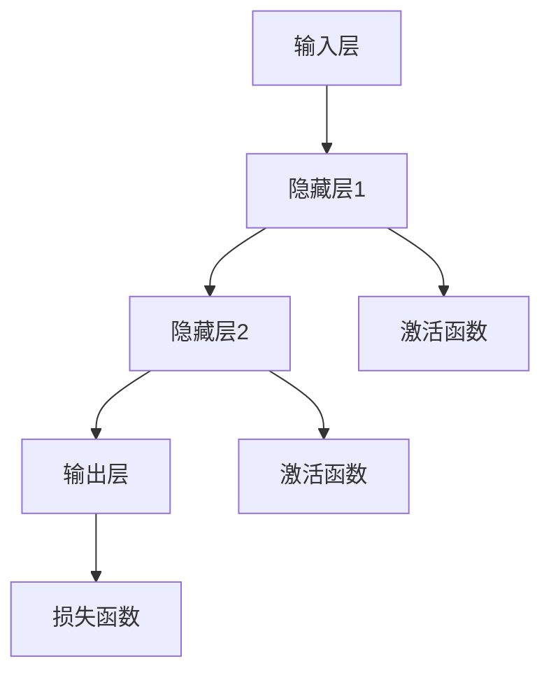
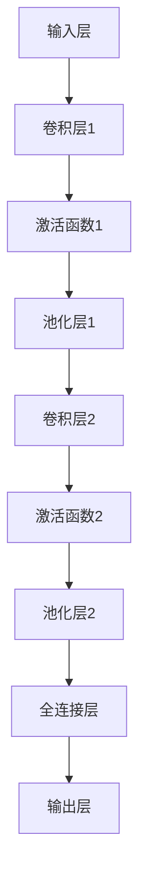
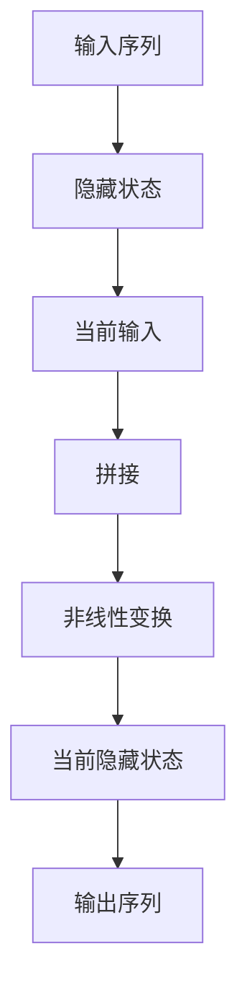
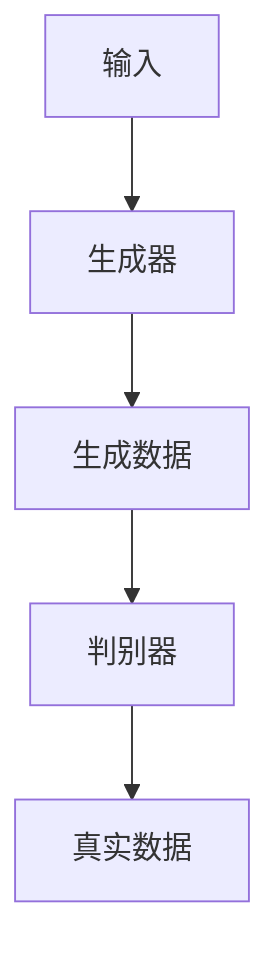
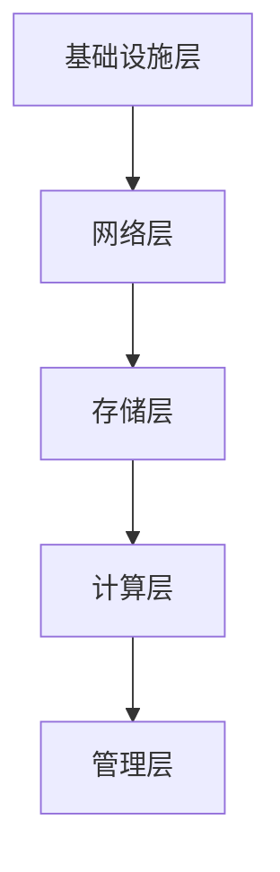
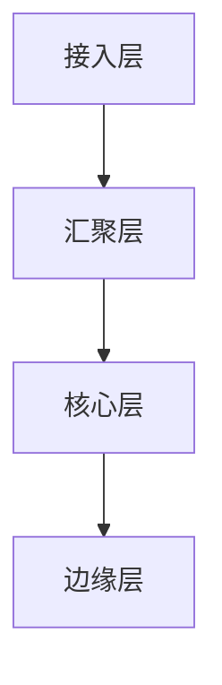

                 

# AI 大模型应用数据中心建设：数据中心技术创新

> **关键词：** AI大模型、数据中心建设、技术创新、深度学习、硬件优化、性能评估、项目实战

> **摘要：** 本文旨在深入探讨AI大模型应用数据中心建设的方方面面，包括技术架构、核心算法、数学基础、计算框架、安全性、基础设施建设、网络建设、管理维护等。通过逐步分析推理，我们将揭示数据中心技术创新的关键点，并分享实际项目案例，为AI大模型在数据中心的应用提供全面的技术指导。

## 目录大纲

1. **AI 大模型基础**
   1.1 AI 大模型概述
   1.2 AI 大模型的技术架构
   1.3 AI 大模型的发展趋势
   1.4 AI 大模型在不同行业的应用案例
2. **AI 大模型的核心算法**
   2.1 深度学习基础
   2.2 卷积神经网络(CNN)
   2.3 循环神经网络(RNN)
   2.4 生成对抗网络(GAN)
3. **AI 大模型的数学基础**
   3.1 线性代数
   3.2 微积分基础
   3.3 概率论与统计学
4. **AI 大模型的计算框架**
   4.1 TensorFlow
   4.2 PyTorch
   4.3 其他常用框架
5. **AI 大模型的安全性与隐私保护**
   5.1 模型安全性与攻击技术
   5.2 隐私保护技术
   5.3 法规与伦理问题
6. **数据中心建设**
   6.1 数据中心基础设施建设
   6.2 数据中心网络建设
   6.3 数据中心管理与维护
7. **AI 大模型在数据中心的应用**
   7.1 数据预处理
   7.2 模型训练与推理
   7.3 模型部署与运维
8. **技术创新**
   8.1 人工智能硬件技术
   8.2 大模型训练优化
   8.3 AI 大模型性能评估
9. **项目实战**
   9.1 AI 大模型应用项目案例
   9.2 数据中心建设与优化
10. **未来展望与趋势**
    10.1 AI 大模型发展展望
    10.2 数据中心技术创新趋势
    10.3 AI 与数据中心融合的未来
11. **附录**
    11.1 常用工具与资源
    11.2 学习资源与书籍推荐

## 第一部分: AI 大模型基础

### 第1章: AI 大模型概述

AI 大模型是指具有数十亿至数千亿参数的大型神经网络模型，它们能够对大量数据进行训练，以实现复杂的人工智能任务。AI 大模型的发展标志着人工智能技术的一个重要突破，使得机器学习算法在处理大规模数据、实现复杂任务方面表现出色。

#### 1.1 AI 大模型的概念与历史

AI 大模型起源于深度学习技术的进步。深度学习是一种人工智能方法，通过构建多层神经网络来模拟人脑的神经元连接，实现从数据中学习复杂模式的能力。随着计算能力的提升和海量数据资源的积累，AI 大模型的研究和应用得到了快速发展。

在早期，神经网络模型的规模较小，通常只有几百万到几千万参数。随着深度学习算法的进步，模型规模逐步扩大，出现了数亿参数的模型，如 BERT 模型。近年来，AI 大模型的研究取得了显著成果，例如 GPT-3 模型具有超过 1750 亿个参数，能够实现自然语言处理、机器翻译、文本生成等多种任务。

#### 1.2 AI 大模型的技术架构

AI 大模型的技术架构主要包括以下几个部分：

1. **数据输入层**：负责从数据源中获取输入数据，通常采用批量输入的方式，将大量数据进行预处理，如分词、标准化等。

2. **神经网络层**：由多层神经元组成，包括卷积层、全连接层、循环层等。每层神经元根据前一层的信息进行计算，并传递给下一层。

3. **激活函数层**：用于引入非线性变换，使得神经网络能够学习到更复杂的模式。

4. **输出层**：负责生成模型的预测结果，如分类结果、回归值等。

5. **损失函数层**：用于评估模型预测结果与实际结果之间的差距，指导模型调整参数。

6. **优化器**：用于更新模型参数，优化模型性能。

#### 1.3 AI 大模型的发展趋势

随着人工智能技术的不断进步，AI 大模型的发展呈现出以下几个趋势：

1. **模型规模持续扩大**：为了解决更复杂的问题，AI 大模型的规模将越来越大，参数数量可能达到千亿级甚至更高。

2. **计算效率提升**：为了降低计算成本，提高模型训练速度，硬件设备（如 GPU、TPU）和算法（如分布式训练、模型剪枝）将得到进一步优化。

3. **应用领域拓展**：AI 大模型将在各个领域得到更广泛的应用，如自动驾驶、智能医疗、金融科技等。

4. **多模态学习**：AI 大模型将能够处理多种类型的数据，如文本、图像、声音等，实现跨模态的智能处理。

5. **模型解释性与可解释性**：随着 AI 大模型在关键领域中的应用，对模型解释性和可解释性的要求越来越高，以增强模型的可靠性和可接受度。

#### 1.4 AI 大模型在不同行业的应用案例

AI 大模型在不同行业中的应用案例丰富多样，以下列举几个典型应用场景：

1. **自然语言处理**：AI 大模型在自然语言处理领域表现出色，如语言模型、文本分类、机器翻译等。例如，GPT-3 模型在文本生成、问答系统等方面取得了显著成果。

2. **计算机视觉**：AI 大模型在计算机视觉领域广泛应用于图像分类、目标检测、人脸识别等任务。例如，ImageNet 挑战赛上的 ResNet 模型实现了很高的准确率。

3. **语音识别**：AI 大模型在语音识别领域具有强大的能力，如语音合成、说话人识别等。例如，Google 的 WaveNet 模型在语音合成任务上达到了很高的自然度。

4. **推荐系统**：AI 大模型在推荐系统领域用于生成个性化推荐，如电商推荐、社交媒体推荐等。例如，TensorFlow Recommenders 是一个基于 TensorFlow 的推荐系统框架。

5. **智能医疗**：AI 大模型在智能医疗领域具有广泛的应用前景，如疾病诊断、药物研发、健康管理等。例如，深度学习技术在肺癌诊断中取得了很好的效果。

总之，AI 大模型在各个领域展现了巨大的潜力和应用价值，为推动人工智能技术的发展和产业升级提供了有力支持。

### 第2章: AI 大模型的核心算法

AI 大模型的核心算法是深度学习，深度学习是一种基于人工神经网络的学习方法，通过多层神经元的组合来实现对数据的复杂特征提取和学习。本章将介绍深度学习的基础知识，包括卷积神经网络（CNN）、循环神经网络（RNN）和生成对抗网络（GAN）。

#### 2.1 深度学习基础

深度学习（Deep Learning）是一种基于多层神经网络的学习方法，通过学习大量数据中的特征表示，从而实现从输入数据到输出结果的映射。深度学习的基础是神经网络（Neural Networks），神经网络是一种由大量神经元（Neurons）组成的计算模型。

神经元的结构如图所示：

每个神经元都接收前一层神经元的输出，通过加权求和后加上偏置，再通过激活函数（如 Sigmoid、ReLU）进行非线性变换，最终输出激活值。多层神经元的组合使得神经网络能够学习到数据的复杂特征。

#### 2.2 卷积神经网络（CNN）

卷积神经网络（Convolutional Neural Networks，CNN）是深度学习中用于处理图像数据的一种重要模型。CNN 的核心思想是通过卷积层（Convolutional Layers）来提取图像的局部特征，然后通过全连接层（Fully Connected Layers）进行分类或回归。

卷积神经网络的基本结构如图所示：

1. **卷积层**：卷积层通过卷积操作提取图像的局部特征。卷积操作的本质是对输入图像和卷积核进行点积，卷积核用于提取特定特征。

2. **激活函数**：激活函数用于引入非线性变换，常用的激活函数有 Sigmoid、ReLU 等。

3. **池化层**：池化层用于减小特征图的尺寸，降低模型参数的数量，提高计算效率。常用的池化操作有最大池化（Max Pooling）和平均池化（Average Pooling）。

4. **全连接层**：全连接层将卷积层提取的特征映射到分类或回归结果。

#### 2.3 循环神经网络（RNN）

循环神经网络（Recurrent Neural Networks，RNN）是用于处理序列数据的一种神经网络模型，如时间序列数据、自然语言序列等。RNN 的核心思想是将当前时刻的输入与前一时刻的隐藏状态进行拼接，然后通过一个非线性变换生成当前时刻的隐藏状态。

RNN 的基本结构如图所示：

1. **隐藏状态**：隐藏状态用于存储历史信息，使得 RNN 能够处理序列数据。

2. **非线性变换**：非线性变换通常使用激活函数，如 tanh 或 ReLU。

3. **输出序列**：RNN 的输出可以是分类或回归结果。

RNN 在处理序列数据时存在梯度消失或梯度爆炸的问题，为了解决这一问题，提出了长短时记忆网络（Long Short-Term Memory，LSTM）和门控循环单元（Gated Recurrent Unit，GRU）。

#### 2.4 生成对抗网络（GAN）

生成对抗网络（Generative Adversarial Networks，GAN）是一种由两个神经网络组成的框架，分别是生成器（Generator）和判别器（Discriminator）。生成器试图生成与真实数据相似的数据，判别器则用于区分真实数据和生成数据。

GAN 的基本结构如图所示：

1. **生成器**：生成器从随机噪声中生成数据，试图欺骗判别器。

2. **判别器**：判别器用于区分真实数据和生成数据，对真实数据进行标注为 1，对生成数据进行标注为 0。

3. **对抗训练**：生成器和判别器相互对抗，生成器不断优化生成的数据，使得判别器无法区分真实数据和生成数据。

GAN 在图像生成、数据增强、风格迁移等领域取得了显著的成果，如生成逼真的图像、视频等。

通过本章对深度学习基础、CNN、RNN 和 GAN 的介绍，我们可以了解到 AI 大模型的核心算法，为后续章节的深入探讨打下基础。

### 第3章: AI 大模型的数学基础

AI 大模型的训练和优化依赖于一系列数学工具和理论。本章将介绍 AI 大模型所需的数学基础，包括线性代数、微积分基础和概率论与统计学。这些数学知识对于理解 AI 大模型的工作原理和优化方法至关重要。

#### 3.1 线性代数

线性代数是 AI 大模型中的重要数学工具，涉及向量、矩阵及其运算。以下简要介绍一些关键概念：

1. **向量与矩阵**：向量是具有多个元素的数组，矩阵是具有多个行和列的二维数组。向量和矩阵的运算包括加法、减法、乘法等。

2. **矩阵乘法**：矩阵乘法是将两个矩阵相乘得到一个新的矩阵。矩阵乘法的规则是将第一个矩阵的每一行与第二个矩阵的每一列进行点积运算。

3. **矩阵求导**：在 AI 大模型的训练过程中，需要对矩阵进行求导运算。矩阵求导涉及到偏导数和雅可比矩阵等概念。

4. **线性变换**：线性变换是指将输入数据通过线性运算转换为输出数据的过程。在 AI 大模型中，线性变换通常通过矩阵乘法和激活函数实现。

5. **矩阵分解**：矩阵分解是将矩阵分解为几个简单的矩阵乘积的过程。常见的矩阵分解方法包括奇异值分解（SVD）和矩阵分解（PCA）。

6. **向量空间**：向量空间是由向量组成的集合，具有向量加法和数乘运算。AI 大模型中的数据可以视为向量空间中的点。

#### 3.2 微积分基础

微积分是数学中的基础工具，广泛应用于 AI 大模型的优化和优化算法。以下简要介绍一些关键概念：

1. **极限与导数**：极限是数学中研究函数在某一点附近取值的性质，导数是描述函数在某一点的变化率。

2. **微分与积分**：微分是研究函数在某一点附近的变化量，积分是研究函数在某个区间上的累积量。

3. **多变量微积分**：多变量微积分包括偏导数、多元积分等。偏导数是描述多变量函数在某个变量上的变化率，多元积分是研究函数在多个变量上的累积量。

4. **梯度下降**：梯度下降是一种优化算法，用于求解最优化问题。梯度下降通过计算目标函数的梯度（即导数的方向），逐步调整参数，以找到最优解。

5. **泰勒展开**：泰勒展开是将函数在某一点的邻域内用多项式来近似表示的过程。在 AI 大模型的训练中，泰勒展开用于线性化目标函数，从而简化优化问题的求解。

6. **链式法则**：链式法则是多变量微积分中的一个重要法则，用于计算复合函数的导数。链式法则使得我们在求解复杂函数的导数时能够简化计算。

#### 3.3 概率论与统计学

概率论和统计学是 AI 大模型中的基本工具，用于描述和预测数据分布。以下简要介绍一些关键概念：

1. **概率分布**：概率分布是描述随机变量取值概率的函数。常见的概率分布包括正态分布、二项分布、泊松分布等。

2. **期望与方差**：期望是描述随机变量取值的平均值，方差是描述随机变量取值离散程度的度量。

3. **条件概率与贝叶斯定理**：条件概率是描述在某个事件发生的条件下，另一个事件发生的概率。贝叶斯定理是条件概率的一个重要公式，用于计算后验概率。

4. **假设检验**：假设检验是统计学中用于判断数据是否支持某个假设的方法。常见的假设检验方法包括 t 检验、卡方检验等。

5. **线性回归**：线性回归是一种用于建立自变量和因变量之间线性关系的模型。在 AI 大模型中，线性回归用于特征提取和预测。

6. **聚类与分类**：聚类是将数据分为若干个类别的过程，分类是将数据归为特定类别的过程。常见的聚类和分类方法包括 k-均值聚类、支持向量机等。

通过本章对线性代数、微积分基础和概率论与统计学的基本概念的介绍，我们可以更好地理解 AI 大模型的工作原理和优化方法。这些数学知识为后续章节的深入探讨提供了基础。

### 第4章: AI 大模型的计算框架

AI 大模型的计算框架是指用于训练、推理和部署 AI 大模型的软件和硬件环境。本章将介绍几种常用的计算框架，包括 TensorFlow、PyTorch 和其他常用框架，并比较它们的特点和应用场景。

#### 4.1 TensorFlow

TensorFlow 是由 Google 开发的一款开源深度学习框架，广泛应用于各种 AI 项目。TensorFlow 的主要特点如下：

1. **动态计算图**：TensorFlow 使用动态计算图（Dynamic Computation Graph）来构建模型。动态计算图允许在运行时动态构建和修改计算图，提高了灵活性和可扩展性。

2. **多平台支持**：TensorFlow 支持多种平台，包括 CPU、GPU 和 TPU。这使得 TensorFlow 能够在不同硬件环境下进行高效训练和推理。

3. **丰富的生态系统**：TensorFlow 拥有丰富的生态系统，包括 TensorFlow Core、TensorFlow Addons、TensorFlow Datasets 等。这些组件提供了丰富的工具和库，方便用户进行模型训练、推理和部署。

4. **分布式训练支持**：TensorFlow 提供了分布式训练支持，使得用户能够在多台机器上进行模型训练，提高训练速度和效率。

5. **自动微分**：TensorFlow 提供了自动微分功能，使得用户能够方便地实现复杂的优化算法，如 Adam、RMSprop 等。

6. **可解释性**：TensorFlow 提供了工具和库，用于分析和解释模型的预测结果，如 TensorFlow Model Analysis、TensorFlow Explainability Toolbox 等。

#### 4.2 PyTorch

PyTorch 是由 Facebook AI Research（FAIR）开发的一款开源深度学习框架，以其灵活性和易用性而受到广泛欢迎。PyTorch 的主要特点如下：

1. **静态计算图和动态计算图**：PyTorch 支持静态计算图（Static Computation Graph）和动态计算图（Dynamic Computation Graph）。静态计算图提供了更高的性能和可扩展性，动态计算图提供了更大的灵活性和易用性。

2. **Python 生态**：PyTorch 完全基于 Python 语言开发，与 Python 生态系统紧密集成。这使得 PyTorch 在数据处理、模型训练和推理方面具有很高的灵活性和易用性。

3. **自动微分**：PyTorch 提供了自动微分功能，使得用户能够方便地实现复杂的优化算法和动态模型。

4. **GPU 加速**：PyTorch 支持 GPU 加速，使得用户能够在 GPU 上进行高效训练和推理。

5. **社区支持**：PyTorch 拥有庞大的社区支持，提供了丰富的教程、文档和开源项目，方便用户学习和使用。

6. **模块化**：PyTorch 采用模块化设计，用户可以根据需求自由组合和扩展模型，提高了代码的可维护性和可扩展性。

#### 4.3 其他常用框架

除了 TensorFlow 和 PyTorch，还有一些其他常用的深度学习框架，如 Keras、Theano、MXNet 等。以下简要介绍这些框架的特点：

1. **Keras**：Keras 是一个高层次的深度学习框架，基于 TensorFlow 和 Theano 开发。Keras 提供了简洁的 API，使得用户能够快速构建和训练模型。

2. **Theano**：Theano 是一个基于 Python 的深度学习框架，提供了自动微分和 GPU 加速功能。Theano 在 2017 年停止更新，但仍然在一些特定应用场景中使用。

3. **MXNet**：MXNet 是 Apache 软件基金会的一个开源深度学习框架，由 Apache MXNet 项目开发。MXNet 支持多种编程语言，包括 Python、R、Java 和 C++。MXNet 具有高性能和可扩展性，适用于工业级应用。

#### 比较与应用场景

TensorFlow 和 PyTorch 是目前最流行的深度学习框架，它们各自具有独特的特点和应用场景：

1. **应用场景**：TensorFlow 在工业界应用较为广泛，特别是在大型企业和科研机构中。PyTorch 在学术界和工业界都有很高的使用率，特别是在研究人员和开发人员中。

2. **性能**：在 GPU 加速方面，TensorFlow 和 PyTorch 都提供了高性能的支持。具体性能取决于硬件设备和模型架构。

3. **灵活性**：PyTorch 提供了更高的灵活性和易用性，特别是对于研究人员和开发人员。TensorFlow 在大规模生产环境中具有更好的稳定性和可维护性。

4. **生态**：TensorFlow 和 PyTorch 都拥有丰富的生态系统和社区支持，提供了大量的教程、文档和开源项目。

5. **可解释性**：TensorFlow 提供了更多的工具和库，用于分析和解释模型的预测结果。PyTorch 的可解释性相对较弱，但正在逐渐改进。

总之，选择深度学习框架时需要考虑应用场景、性能、灵活性和生态系统等因素。根据具体需求，可以选择适合的框架进行模型训练和推理。

### 第5章: AI 大模型的安全性与隐私保护

随着 AI 大模型在各个领域的广泛应用，其安全性和隐私保护问题日益引起关注。本章将讨论 AI 大模型的安全性、隐私保护技术以及相关的法规与伦理问题。

#### 5.1 模型安全性与攻击技术

AI 大模型的安全性主要面临以下几种攻击技术：

1. **模型泄漏**：模型泄漏是指攻击者通过输入特定数据，从模型中提取训练数据和参数。模型泄漏可能导致隐私泄露和知识产权侵犯。

2. **数据注入**：数据注入是指攻击者通过修改训练数据，使模型产生错误的预测。数据注入可能用于恶意攻击或欺诈行为。

3. **模型篡改**：模型篡改是指攻击者通过修改模型参数，使模型产生错误的预测。模型篡改可能用于恶意攻击或误导用户。

4. **对抗样本攻击**：对抗样本攻击是指攻击者通过添加微小扰动，使模型对特定输入产生错误的预测。对抗样本攻击可能用于恶意攻击或欺骗系统。

为了防范这些攻击，可以采取以下措施：

1. **数据加密**：对训练数据进行加密，确保数据在传输和存储过程中不被泄露。

2. **差分隐私**：在训练过程中引入差分隐私机制，保护训练数据的隐私。

3. **对抗训练**：通过对抗训练提高模型的鲁棒性，使模型能够抵御对抗样本攻击。

4. **安全模型设计**：设计安全的模型架构，降低模型泄漏和数据注入的风险。

#### 5.2 隐私保护技术

AI 大模型的隐私保护主要涉及数据隐私和计算隐私：

1. **数据隐私**：数据隐私保护旨在保护训练数据和用户数据不被泄露。常见的隐私保护技术包括：

   - **数据匿名化**：通过数据脱敏、数据加密等方式，将数据转换为不可识别的形式。
   - **差分隐私**：在模型训练过程中引入差分隐私机制，使得攻击者无法从训练数据中推断出个体信息。
   - **联邦学习**：通过联邦学习，将数据分散存储在不同的设备上，减少数据泄露的风险。

2. **计算隐私**：计算隐私保护旨在保护模型训练和推理过程中的隐私。常见的计算隐私保护技术包括：

   - **同态加密**：在模型训练和推理过程中，对数据进行加密，确保计算过程对攻击者不可见。
   - **安全多方计算**：通过安全多方计算，将训练数据分散存储在不同的设备上，减少计算过程中的隐私泄露风险。
   - **隐私保护模型训练**：在模型训练过程中引入隐私保护机制，降低模型泄漏和数据注入的风险。

#### 5.3 法规与伦理问题

随着 AI 大模型的广泛应用，相关的法规与伦理问题也日益凸显：

1. **数据保护法规**：各国政府纷纷出台数据保护法规，如欧盟的《通用数据保护条例》（GDPR）和中国的《个人信息保护法》。这些法规对数据收集、存储、处理和传输等环节提出了严格要求。

2. **隐私伦理**：在 AI 大模型的应用过程中，如何保护用户隐私、避免隐私滥用成为一个重要的伦理问题。需要制定相关伦理规范，确保 AI 大模型的应用符合社会伦理标准。

3. **算法公平性**：AI 大模型在决策过程中可能存在偏见和歧视，影响算法的公平性。需要制定相关标准和规范，确保 AI 大模型的决策过程公正、透明。

4. **责任归属**：在 AI 大模型的应用过程中，如何明确责任归属成为一个重要问题。需要制定相关法律法规，明确各方在 AI 大模型应用中的责任和义务。

总之，AI 大模型的安全性和隐私保护是一个复杂且重要的课题。通过技术手段和法规规范，可以有效地解决 AI 大模型在安全性和隐私保护方面的问题，为 AI 大模型的健康发展提供保障。

### 第6章: 数据中心基础设施建设

数据中心是存储、处理和传输大量数据的关键设施，其基础设施建设对数据中心的整体性能和可靠性至关重要。本章将详细介绍数据中心基础设施建设的各个方面，包括数据中心概述、数据中心架构和数据中心硬件设备。

#### 6.1 数据中心概述

数据中心（Data Center）是一种高度集成的设施，用于存储、处理和传输大量数据。数据中心通常包括多个子系统和设备，如服务器、存储设备、网络设备和监控系统等。数据中心的建设和管理涉及到多个方面，包括场地选择、设备采购、网络规划、安全性设计等。

数据中心的主要功能包括：

1. **数据处理**：数据中心负责处理大量的数据，包括数据存储、数据处理、数据分析等。
2. **数据存储**：数据中心提供大量的存储空间，用于存储各类数据，如企业数据、用户数据、日志数据等。
3. **数据传输**：数据中心通过高速网络连接内外部系统，实现数据的快速传输和共享。
4. **安全保障**：数据中心采用多种安全措施，保护数据的安全性和完整性。
5. **运维管理**：数据中心需要定期进行维护和监控，确保设备的正常运行。

#### 6.2 数据中心架构

数据中心架构是数据中心系统设计的核心，决定了数据中心的性能、可靠性和可扩展性。数据中心架构通常包括以下几个层次：

1. **基础设施层**：基础设施层是数据中心的基础，包括机房设施、电力系统、制冷系统、消防系统等。这一层为数据中心提供了稳定和可靠的运行环境。
2. **网络层**：网络层是数据中心的核心，负责数据在数据中心内部和外部网络中的传输。网络层通常包括核心交换机、边缘交换机、防火墙、负载均衡器等设备。
3. **存储层**：存储层负责数据存储和管理，包括磁盘阵列、存储网络（如 FC、iSCSI）和分布式存储系统（如 HDFS、Ceph）等。
4. **计算层**：计算层提供数据处理能力，包括服务器、虚拟化平台、容器化平台等。计算层可以根据业务需求进行灵活的配置和扩展。
5. **管理层**：管理层负责数据中心的管理和维护，包括监控管理系统、运维管理系统、安全管理等。

数据中心架构的典型设计如图所示：

#### 6.3 数据中心硬件设备

数据中心硬件设备是数据中心正常运行的基础，包括服务器、存储设备、网络设备和其他辅助设备。以下简要介绍几种常见的硬件设备：

1. **服务器**：服务器是数据中心的核心设备，负责运行应用程序、处理数据和存储数据。服务器可以分为计算型服务器和存储型服务器。计算型服务器主要用于计算密集型任务，如数据分析、机器学习等；存储型服务器主要用于存储和管理大量数据。

2. **存储设备**：存储设备用于存储数据，包括磁盘阵列、固态硬盘（SSD）和分布式存储系统等。磁盘阵列具有高容量、高可靠性和易扩展性，适用于存储大量数据；固态硬盘具有高速度、低延迟，适用于需要高速数据访问的场景；分布式存储系统具有高可用性和高扩展性，适用于大规模数据存储。

3. **网络设备**：网络设备包括交换机、路由器、防火墙和负载均衡器等。交换机用于数据在数据中心内部和外部网络的传输；路由器用于不同网络之间的数据传输；防火墙用于网络安全防护；负载均衡器用于均衡网络流量，提高系统的可靠性。

4. **辅助设备**：辅助设备包括不间断电源（UPS）、空调、消防设备等。UPS 用于为数据中心提供稳定的电力供应；空调用于保持数据中心的温度和湿度，保证设备的正常运行；消防设备用于数据中心的消防安全。

数据中心基础设施建设是确保数据中心正常运行的关键。通过合理规划和设计数据中心架构，选择合适的硬件设备，可以构建高效、可靠和可扩展的数据中心。

### 第7章: 数据中心网络建设

数据中心网络建设是数据中心整体架构中至关重要的一部分，其设计直接影响到数据中心的性能、可靠性和安全性。本章将详细介绍数据中心网络建设的相关内容，包括数据中心网络结构、数据传输协议和网络优化技术。

#### 7.1 数据中心网络结构

数据中心网络结构是数据中心内部各个设备之间的连接方式。数据中心网络结构通常包括以下层次：

1. **接入层**：接入层负责将终端设备（如服务器、存储设备、网络设备等）连接到数据中心网络。接入层通常采用局域网（LAN）技术，支持高速数据传输。

2. **汇聚层**：汇聚层负责将接入层的网络流量汇聚到核心层。汇聚层通常采用核心交换机，具有高带宽、高可靠性、高安全性等特点。

3. **核心层**：核心层负责数据中心网络的核心部分，连接各个汇聚层和外部网络。核心层通常采用多级交换结构，实现高效的数据传输和路由。

4. **边缘层**：边缘层位于数据中心网络的外围，负责与外部网络连接，如互联网、企业内部网络等。边缘层通常采用路由器和防火墙等设备，实现安全可靠的数据传输。

数据中心网络结构的典型设计如图所示：

#### 7.2 数据传输协议

数据中心网络的数据传输协议是数据在网络上传输的规范，确保数据能够正确、高效地传输。以下介绍几种常见的数据传输协议：

1. **TCP/IP**：TCP/IP 是互联网协议族的基础，包括传输控制协议（TCP）和互联网协议（IP）。TCP 负责确保数据包的可靠传输，IP 负责将数据包从源地址传输到目标地址。TCP/IP 协议广泛应用于计算机网络，包括数据中心网络。

2. **HTTP**：HTTP（超文本传输协议）是一种用于 Web 应用程序的数据传输协议。HTTP 协议基于 TCP 协议，用于在客户端和服务器之间传输网页、图片、视频等资源。

3. **HTTPS**：HTTPS（安全超文本传输协议）是对 HTTP 协议的扩展，通过 SSL/TLS 加密技术确保数据在传输过程中的安全性。HTTPS 广泛应用于 Web 应用程序的安全传输。

4. **FTP**：FTP（文件传输协议）是一种用于文件传输的协议，通过 TCP 协议实现文件的传输、下载和上传。FTP 协议广泛应用于文件共享和数据传输场景。

5. **SMTP**：SMTP（简单邮件传输协议）是一种用于电子邮件传输的协议，通过 TCP 协议实现邮件的发送、接收和转发。

6. **DHCP**：DHCP（动态主机配置协议）是一种用于自动分配 IP 地址的协议，通过 TCP 协议实现 IP 地址的动态分配。

#### 7.3 网络优化技术

为了提高数据中心网络的性能、可靠性和安全性，可以采用以下网络优化技术：

1. **负载均衡**：负载均衡是将网络流量分配到多个服务器或设备，以避免单个设备过载。负载均衡技术包括基于 IP 地址、URL、HTTP 请求等策略。

2. **链路冗余**：链路冗余是通过增加网络链路的冗余度，提高网络的可靠性和容错能力。常见的链路冗余技术包括链路聚合、STP（生成树协议）等。

3. **流量监控**：流量监控是实时监测网络流量，识别异常流量和攻击行为。通过流量监控，可以及时发现网络问题并采取相应措施。

4. **QoS（服务质量）**：QoS 是一种用于控制网络流量优先级的技术，确保关键业务流量的优先传输。通过 QoS 技术，可以根据业务需求调整网络流量的优先级。

5. **网络安全**：网络安全是保护网络不受恶意攻击、数据泄露和非法访问。网络安全技术包括防火墙、入侵检测系统（IDS）、入侵防御系统（IPS）等。

6. **VPN（虚拟专用网络）**：VPN 是一种通过加密技术在公共网络上建立安全隧道，实现远程访问和安全性。VPN 技术广泛应用于企业内部网络和数据中心之间的数据传输。

通过合理设计和优化数据中心网络，可以提高数据中心的性能、可靠性和安全性，为业务的发展提供坚实的基础。

### 第8章: 数据中心管理与维护

数据中心的管理与维护是确保其正常运行和高效服务的关键环节。本章将详细探讨数据中心的管理流程、故障排查与故障恢复、性能监控与优化等方面，以提供全面的操作指导。

#### 8.1 数据中心管理流程

数据中心的管理流程包括以下几个关键步骤：

1. **计划与设计**：在数据中心建设之前，需要进行详细的计划与设计，包括场地选择、设备采购、网络规划、安全性设计等。设计阶段应考虑数据中心的业务需求、性能要求、扩展性等因素。

2. **建设与实施**：根据设计文档进行数据中心的建设与实施，包括机房建设、设备安装、网络配置、系统部署等。建设过程中应确保设备的正确安装和调试，确保系统的稳定运行。

3. **运营与管理**：数据中心投入运营后，需要进行日常的运营与管理，包括设备监控、数据备份、系统更新、安全管理等。运营阶段应确保设备的正常运行，及时发现并处理故障，确保数据的安全性和完整性。

4. **监控与维护**：数据中心需要定期进行监控与维护，包括设备巡检、性能监控、故障处理、系统升级等。监控与维护阶段应确保设备的长期稳定运行，提高数据中心的可靠性和可用性。

5. **优化与升级**：根据业务需求和性能指标，对数据中心进行优化与升级，包括网络带宽升级、存储扩展、服务器升级等。优化与升级阶段应确保数据中心的性能和扩展性，满足不断增长的业务需求。

#### 8.2 故障排查与故障恢复

故障排查与故障恢复是数据中心管理与维护的重要环节。以下是一些常见的故障排查与恢复方法：

1. **故障定位**：通过日志分析、系统监控等手段，快速定位故障发生的位置和原因。常见的故障定位方法包括故障排除、性能分析、网络诊断等。

2. **故障处理**：根据故障类型和原因，采取相应的处理措施。故障处理包括硬件故障修复、软件故障修复、网络故障处理等。在处理故障时，应确保不影响其他系统的正常运行。

3. **故障恢复**：在故障处理完成后，进行故障恢复，确保系统的正常运行。故障恢复包括数据恢复、系统重启、网络恢复等。在恢复过程中，应确保数据的完整性和一致性。

4. **故障报告**：记录故障发生的时间、原因、处理过程和恢复结果，形成故障报告。故障报告有助于分析和总结故障原因，提高故障排查和处理效率。

#### 8.3 性能监控与优化

数据中心性能监控与优化是确保数据中心高效运行的关键。以下是一些常见的性能监控与优化方法：

1. **性能监控**：通过性能监控工具，实时监测数据中心的性能指标，如 CPU 利用率、内存使用率、磁盘 I/O、网络流量等。性能监控可以帮助管理员及时发现性能瓶颈和故障，采取相应的优化措施。

2. **负载均衡**：通过负载均衡技术，将网络流量和计算负载分配到不同的服务器或设备上，避免单点过载。负载均衡可以有效地提高数据中心的性能和可靠性。

3. **资源优化**：根据业务需求和性能指标，优化数据中心的资源配置，包括 CPU、内存、磁盘、网络等。资源优化可以确保数据中心的资源得到充分利用，提高系统的性能和效率。

4. **性能优化**：通过性能优化技术，提高数据中心的运行效率和稳定性。常见的性能优化方法包括缓存技术、数据库优化、网络优化等。

5. **自动化管理**：通过自动化管理工具，实现数据中心的自动化监控、故障排查、故障恢复和性能优化。自动化管理可以降低管理成本，提高数据中心的运维效率。

通过数据中心的管理与维护，可以确保数据中心的正常运行和高效服务，为业务的发展提供坚实的基础。

### 第9章: AI 大模型在数据中心的应用

随着 AI 大模型的发展，数据中心作为计算和存储的核心设施，为 AI 大模型的应用提供了强大的支持。本章将详细介绍 AI 大模型在数据中心中的应用，包括数据预处理、模型训练与推理、模型部署与运维等方面。

#### 9.1 数据预处理

数据预处理是 AI 大模型应用的重要环节，包括数据清洗、数据转换和数据增强等。在数据中心中，数据预处理可以通过分布式计算和大数据技术实现，以提高处理效率和速度。

1. **数据清洗**：数据清洗是去除数据中的噪声和错误，保证数据质量的过程。数据中心可以通过分布式计算框架（如 Hadoop、Spark）对大规模数据进行清洗，提高数据处理效率。

2. **数据转换**：数据转换是将不同格式、不同类型的数据转换为统一格式的过程。在数据中心中，数据转换可以通过数据集成工具（如 ETL 工具）实现，确保数据的一致性和可处理性。

3. **数据增强**：数据增强是通过生成新的数据样本，提高模型的泛化能力。在数据中心中，数据增强可以通过分布式计算和机器学习算法（如 GAN）实现，生成丰富多样的数据样本。

#### 9.2 模型训练与推理

模型训练与推理是 AI 大模型应用的核心环节，数据中心的计算能力和存储资源为模型训练提供了坚实的基础。

1. **模型训练**：模型训练是通过对大量数据进行学习，使模型能够识别和预测数据中的特征。在数据中心中，模型训练可以通过分布式训练框架（如 TensorFlow、PyTorch）实现，利用 GPU、TPU 等硬件加速计算，提高训练效率。

2. **模型推理**：模型推理是使用训练好的模型对新的数据进行预测。在数据中心中，模型推理可以通过部署到服务器或容器中实现，支持实时预测和批量预测。

3. **分布式训练与推理**：为了提高训练和推理的效率，数据中心可以采用分布式训练和推理技术。分布式训练可以通过将数据分布在多台服务器上，利用并行计算和负载均衡技术，提高训练速度。分布式推理可以通过将模型部署到多台服务器或容器中，提高推理的并发能力。

#### 9.3 模型部署与运维

模型部署与运维是确保 AI 大模型在数据中心稳定运行的关键环节。

1. **模型部署**：模型部署是将训练好的模型部署到生产环境中，实现实时预测和批量处理。在数据中心中，模型部署可以通过容器化技术（如 Docker、Kubernetes）实现，支持模型的快速部署和动态扩展。

2. **运维管理**：运维管理是确保模型部署的稳定性和可靠性，包括监控、日志记录、故障排查等。在数据中心中，运维管理可以通过自动化运维工具（如 Nagios、Zabbix）实现，提高运维效率。

3. **性能优化**：为了提高 AI 大模型在数据中心的应用性能，可以通过性能优化技术，如缓存技术、网络优化、计算资源分配等，确保模型的高效运行。

4. **安全与隐私保护**：在模型部署和运维过程中，需要确保数据的安全性和隐私性。数据中心可以采用加密技术、访问控制、差分隐私等技术，保护数据和模型的安全性。

通过在数据中心中应用 AI 大模型，可以实现高效的数据处理、智能预测和分析，为业务发展提供强大的支持。同时，数据中心的技术创新和优化，将不断提升 AI 大模型的应用性能和可靠性。

### 第三部分：技术创新

#### 第10章: 人工智能硬件技术

人工智能硬件技术是推动 AI 大模型发展和应用的关键因素。本章将探讨当前主流的人工智能硬件技术，包括 GPU、TPU 和 AI 芯片，以及混合计算架构。

#### 10.1 GPU 与 TPU

1. **GPU（图形处理单元）**：GPU 是专门用于图形处理的计算设备，由于其并行计算能力和大量计算单元，使其在深度学习训练和推理中表现出色。GPU 的高性能计算能力使得大规模 AI 大模型的训练和推理成为可能。

2. **TPU（张量处理单元）**：TPU 是专门为深度学习应用设计的计算设备，由 Google 开发。TPU 具有高效的矩阵乘法单元和优化的张量计算指令集，能够显著提高深度学习模型的训练速度和推理性能。

3. **GPU 与 TPU 的对比**：
   - **性能**：TPU 在某些深度学习任务上比 GPU 具有更高的性能，特别是在大规模模型训练和推理中。但 GPU 在通用计算能力方面仍然具有优势。
   - **成本**：TPU 通常比 GPU 更昂贵，但其高性能使其在处理大规模 AI 任务时具有更高的性价比。
   - **易用性**：GPU 具有更广泛的硬件生态和软件支持，适用于各种深度学习和科学计算任务。

#### 10.2 AI 芯片

AI 芯片是近年来兴起的一种专门用于人工智能计算的新兴硬件技术。以下是一些主流 AI 芯片及其特点：

1. **NVIDIA Ampere GPU**：NVIDIA 的 Ampere GPU 是一款高性能 AI 芯片，采用 NVIDIA GPU 架构，支持深度学习、计算机视觉、自然语言处理等多种 AI 应用。Ampere GPU 具有大量计算单元和优化的内存访问机制，能够实现高效 AI 计算。

2. **Google TPU**：Google TPU 是一款专门为深度学习应用设计的 AI 芯片，具有高效的张量计算单元和优化的软件栈。TPU 的设计目标是在保持高性能的同时，降低功耗和成本。

3. **英特尔 Nervana AI 芯片**：英特尔 Nervana AI 芯片是一款面向 AI 计算的高端芯片，采用英特尔 Xeon 处理器和 AI 处理单元相结合的设计。Nervana AI 芯片旨在提供高性能和低延迟的 AI 计算能力，适用于大规模 AI 任务。

4. **AMD Radeon Instinct**：AMD Radeon Instinct 是一款高性能 GPU，专门用于深度学习和科学计算。Radeon Instinct GPU 具有大量计算单元和高带宽内存，能够提供高效的 AI 计算能力。

#### 10.3 混合计算架构

混合计算架构是将不同类型硬件设备结合，以实现高效的 AI 计算和优化。以下是一些常见的混合计算架构：

1. **异构计算**：异构计算是将 GPU、TPU、FPGA、ASIC 等不同类型的计算设备结合起来，以实现高效 AI 计算。通过异构计算，可以根据不同任务的需求，选择合适的计算设备，提高计算效率和性能。

2. **分布式计算**：分布式计算是将计算任务分布在多台设备上，通过分布式计算框架（如 TensorFlow、PyTorch）实现高效计算。分布式计算能够充分利用多台设备的计算能力，提高 AI 大模型的训练速度和推理性能。

3. **云计算与边缘计算**：云计算与边缘计算结合，可以在数据中心和边缘设备上实现高效 AI 计算。通过云计算，可以利用大规模数据中心资源进行 AI 大模型的训练和推理；通过边缘计算，可以在靠近数据源的设备上进行实时 AI 推理，降低延迟和提高响应速度。

通过技术创新，人工智能硬件技术不断进步，为 AI 大模型的应用提供了强大的支持。混合计算架构的采用，能够更好地发挥不同硬件设备的优势，实现高效的 AI 计算和优化。

### 第11章: 大模型训练优化

在大模型训练过程中，优化技术至关重要，能够显著提升训练速度和降低计算资源消耗。本章将详细探讨大模型训练优化技术，包括并行计算与分布式训练、模型剪枝与量化、训练效率提升策略。

#### 11.1 并行计算与分布式训练

并行计算与分布式训练是将计算任务分布在多个计算节点上，以加快大模型训练速度的方法。以下介绍并行计算与分布式训练的关键技术：

1. **数据并行训练**：数据并行训练是将训练数据划分为多个子集，每个子集分配给不同的计算节点进行训练。每个节点独立计算梯度，然后通过同步或异步方式合并梯度。数据并行训练能够充分利用多个节点的计算能力，提高训练速度。

2. **模型并行训练**：模型并行训练是将大模型划分为多个子模型，每个子模型分配给不同的计算节点进行训练。模型并行训练适用于参数量巨大的模型，通过将模型拆分，降低单个节点的计算负载。常见的模型并行技术包括多 GPU 并行、多 TPU 并行等。

3. **流水线并行训练**：流水线并行训练是将训练过程分解为多个阶段，不同阶段在不同计算节点上并行执行。例如，前向传播、反向传播和优化步骤可以分别在不同的节点上执行，以充分利用计算资源。

4. **分布式训练框架**：分布式训练框架（如 TensorFlow、PyTorch）提供了简化的分布式训练接口和优化策略，使得开发者能够轻松实现分布式训练。分布式训练框架通常支持数据并行、模型并行和流水线并行等多种并行策略。

#### 11.2 模型剪枝与量化

模型剪枝与量化是减少模型参数数量和计算量，以提高训练效率和模型推理速度的技术。以下介绍模型剪枝与量化的关键概念和方法：

1. **模型剪枝**：模型剪枝是通过删除冗余或次要的模型参数，减少模型复杂度和计算量。剪枝方法包括权重剪枝、结构剪枝和混合剪枝。权重剪枝删除权重较小的参数；结构剪枝删除部分网络层或神经元；混合剪枝结合权重剪枝和结构剪枝的优点。

2. **模型量化**：模型量化是通过将浮点数参数转换为较低精度的整数表示，以减少模型存储和计算需求。量化方法包括整数量化、二值量化等。量化能够显著减少模型大小和计算资源消耗，提高模型推理速度。

3. **量化与剪枝的协同优化**：在模型训练过程中，量化与剪枝可以协同优化，以提高模型效率和性能。通过量化，可以降低模型的计算需求，进一步剪枝可以去除次要的参数，实现更高效的模型。

#### 11.3 训练效率提升策略

以下是一些训练效率提升策略，以加快大模型训练速度和优化资源利用：

1. **动态调整学习率**：学习率是影响模型训练速度的关键参数。动态调整学习率可以通过自适应调整学习率，加快训练速度。常用的动态调整方法包括指数衰减、余弦退火等。

2. **优化算法改进**：优化算法如 Adam、Adagrad、RMSprop 等可以加快模型训练速度。通过改进优化算法，可以更好地平衡收敛速度和模型精度。

3. **并行计算与流水线并行**：并行计算与流水线并行结合，可以在多个计算节点上同时执行计算任务，实现高效的模型训练。

4. **模型压缩与稀疏训练**：模型压缩通过降低模型精度和减少参数数量，加快模型训练速度。稀疏训练通过在训练过程中保留重要的参数，去除次要的参数，提高训练效率。

5. **异构计算与资源调度**：通过异构计算，利用不同类型硬件（如 GPU、TPU、FPGA）的优势，实现高效的模型训练。资源调度可以动态分配计算资源，确保模型训练的顺利进行。

通过并行计算与分布式训练、模型剪枝与量化以及训练效率提升策略，能够显著提高大模型训练速度和优化资源利用，为 AI 大模型的应用提供有力支持。

### 第12章: AI 大模型性能评估

AI 大模型性能评估是确保模型在实际应用中达到预期效果的关键环节。本章将详细介绍 AI 大模型性能评估的相关内容，包括评估指标、实验设计和性能优化案例分析。

#### 12.1 评估指标

评估 AI 大模型性能的常用指标包括：

1. **准确率（Accuracy）**：准确率是模型预测正确的样本数占总样本数的比例，常用于分类问题。准确率越高，模型分类效果越好。

2. **精确率（Precision）**：精确率是模型预测为正类的样本中实际为正类的比例。精确率高表示模型在预测正类时较为准确。

3. **召回率（Recall）**：召回率是模型实际为正类的样本中被预测为正类的比例。召回率高表示模型能够正确识别大部分正类样本。

4. **F1 分数（F1 Score）**：F1 分数是精确率和召回率的加权平均，用于综合评估模型的分类性能。F1 分数越高，模型分类效果越好。

5. **ROC 曲线和 AUC 值**：ROC 曲线和 AUC 值是用于评估二分类模型性能的指标。ROC 曲线是真实值与预测值之间的曲线，AUC 值是 ROC 曲线下面积，AUC 值越高，模型分类性能越好。

6. **均方误差（MSE）和均绝对误差（MAE）**：均方误差和均绝对误差是用于评估回归问题模型性能的指标，数值越小，模型预测结果越接近真实值。

7. **推断时间**：推断时间是指模型在给定输入数据上完成预测所需的时间，用于评估模型的实时性能。

#### 12.2 实验设计

AI 大模型性能评估需要通过设计合理的实验来进行。以下介绍实验设计的关键步骤：

1. **数据集选择**：选择具有代表性的数据集，包括训练集、验证集和测试集。数据集应涵盖不同场景和类型，确保模型在不同条件下的性能评估。

2. **模型选择**：根据任务需求和数据特点，选择适合的模型结构和算法。常见的模型包括卷积神经网络（CNN）、循环神经网络（RNN）、生成对抗网络（GAN）等。

3. **训练过程**：对模型进行训练，调整模型参数和超参数，优化模型性能。训练过程中可以使用交叉验证、早停法等技术，避免过拟合。

4. **评估方法**：使用评估指标对模型进行性能评估，比较不同模型的性能。可以通过比较不同指标的平均值、标准差等统计量，分析模型性能的稳定性。

5. **实验对比**：通过对比不同模型、不同参数设置、不同训练策略的性能，找出最佳模型和参数配置。

#### 12.3 性能优化案例分析

以下是一个 AI 大模型性能优化案例分析：

**案例背景**：一家电商公司希望使用 AI 大模型对用户进行个性化推荐，以提高用户满意度和销售额。

**实验设计**：
1. **数据集选择**：使用公司内部的用户行为数据，包括浏览记录、购买记录、用户评价等。

2. **模型选择**：选择基于深度学习的推荐模型，如基于 Transformer 的推荐模型。

3. **训练过程**：使用 PyTorch 框架，将用户行为数据进行预处理，构建模型输入特征。

4. **评估方法**：使用准确率、精确率、召回率和 F1 分数等指标评估模型性能。

5. **实验对比**：对比不同层深的 Transformer 模型、不同训练策略（如学习率调整、批量大小调整）的性能。

**性能优化步骤**：

1. **参数调整**：通过调整学习率、批量大小、训练 epoch 数等超参数，优化模型性能。

2. **数据增强**：通过数据增强技术，如随机裁剪、旋转、缩放等，增加数据多样性，提高模型泛化能力。

3. **模型剪枝**：通过剪枝技术，减少模型参数数量，降低计算量，提高模型推理速度。

4. **量化与剪枝**：将模型参数量化，进一步减少模型大小和计算资源消耗。

5. **并行计算与分布式训练**：通过分布式训练，利用多台 GPU 进行并行计算，加快模型训练速度。

**结果分析**：
1. **性能提升**：通过参数调整、数据增强、模型剪枝和并行计算等优化方法，模型性能得到显著提升。

2. **推理速度**：模型推理速度得到显著提升，满足实时推荐的需求。

3. **业务效果**：个性化推荐系统的推荐效果得到提升，用户满意度和销售额有所提高。

通过合理的实验设计和性能优化方法，AI 大模型在实际应用中能够达到预期效果，为企业带来实际效益。

### 第13章: AI 大模型应用项目案例

在本章节中，我们将通过具体的项目案例，详细介绍 AI 大模型在数据中心的应用。以下是一个基于一家电商平台的数据中心项目案例。

#### 13.1 项目背景与需求

一家大型电商平台在业务快速增长的过程中，面临着用户行为数据激增、个性化推荐需求增加等问题。为了提升用户满意度和销售额，该公司决定利用 AI 大模型构建一个智能推荐系统，通过精准的个性化推荐，提高用户粘性和购买转化率。

项目需求主要包括：

1. **大规模用户行为数据收集**：收集用户的浏览记录、购买记录、评价、收藏等信息。

2. **高效模型训练与推理**：构建大规模深度学习模型，对用户行为数据进行训练，实现高效的模型推理和实时推荐。

3. **数据安全性**：保护用户隐私和数据安全，确保数据在处理和传输过程中的安全。

4. **系统扩展性**：支持系统的高并发请求，确保在业务增长时能够快速扩展。

#### 13.2 技术方案设计与实现

技术方案包括以下几个方面：

1. **数据采集与预处理**：通过数据采集系统，收集电商平台用户的行为数据，包括浏览记录、购买记录、评价等。数据预处理环节包括数据清洗、去重、特征提取等，以便为模型训练提供高质量的数据。

2. **模型构建与训练**：采用深度学习框架 TensorFlow 或 PyTorch，构建大规模推荐模型。模型采用 Transformer 结构，能够有效捕捉用户行为数据中的长程依赖关系。通过分布式训练框架（如 TensorFlow 分布式训练），利用多台 GPU 进行并行训练，加快模型训练速度。

3. **模型部署与推理**：将训练好的模型部署到服务器或容器中，实现实时推荐。采用模型量化技术，降低模型大小和计算资源消耗，提高推理速度。在推理过程中，利用负载均衡器，实现高并发请求的处理。

4. **系统扩展与优化**：采用 Kubernetes 容器编排系统，实现系统的自动化部署和扩展。通过监控和日志分析，实时监控系统的性能和健康状况，及时发现并解决潜在问题。

#### 13.3 项目效果与反思

项目实施后，取得了以下效果：

1. **推荐准确率提升**：通过大规模深度学习模型的训练，推荐系统的准确率和召回率得到显著提升，用户满意度得到提高。

2. **响应速度加快**：通过模型量化技术和负载均衡器，实现了高效的模型推理和实时推荐，提高了系统的响应速度。

3. **业务转化率提高**：个性化推荐系统的应用，使得用户在浏览过程中更容易发现感兴趣的商品，业务转化率得到提升。

4. **系统稳定性增强**：通过 Kubernetes 容器编排系统和实时监控，系统的稳定性和可靠性得到增强，能够应对大规模业务高峰。

项目反思：

1. **数据隐私保护**：在项目实施过程中，应重视数据隐私保护，采用差分隐私等技术，确保用户数据的隐私安全。

2. **模型可解释性**：在推荐系统中，应提高模型的可解释性，帮助用户理解推荐结果，增强用户信任度。

3. **持续优化**：在项目运行过程中，应不断收集用户反馈和业务数据，持续优化推荐模型和系统性能，以适应不断变化的市场需求。

通过本项目案例，展示了 AI 大模型在数据中心应用中的实际效果，为其他企业提供了参考和借鉴。

### 第14章: 数据中心建设与优化

数据中心建设与优化是确保数据中心高效运行和满足业务需求的关键。本章将详细介绍数据中心建设的流程、性能优化案例以及数据中心运维管理。

#### 14.1 数据中心建设流程

数据中心建设是一个复杂的过程，包括以下几个关键步骤：

1. **需求分析**：明确数据中心的建设目标和需求，包括业务需求、性能需求、安全性需求等。

2. **设计规划**：根据需求分析结果，制定数据中心的设计规划，包括机房设计、网络设计、设备选型、能源规划等。

3. **采购设备**：根据设计规划，采购数据中心所需的设备，包括服务器、存储设备、网络设备、制冷设备、UPS 等。

4. **施工建设**：根据设计规划和设备采购情况，进行数据中心的施工建设，包括机房建设、设备安装、网络布线等。

5. **系统部署**：完成数据中心的建设后，进行系统部署，包括服务器、存储设备、网络设备的配置、安装和调试。

6. **测试验收**：对数据中心进行功能测试和性能测试，确保系统稳定可靠，符合设计要求。

7. **运维管理**：数据中心投入运行后，进行日常运维管理，包括设备监控、故障处理、数据备份、系统更新等。

#### 14.2 数据中心性能优化案例

数据中心性能优化是确保数据中心高效运行的重要环节。以下是一个数据中心性能优化案例：

**案例背景**：一家电商平台的数据中心在业务高峰期，服务器负载过高，导致系统响应缓慢，影响了用户体验。

**优化措施**：

1. **负载均衡**：通过负载均衡器，将用户请求分配到多台服务器，避免单台服务器过载。负载均衡可以基于流量、CPU 利用率等指标进行动态分配。

2. **缓存技术**：采用缓存技术，将频繁访问的数据存储在缓存中，减少数据库访问压力。常用的缓存技术包括 Redis、Memcached 等。

3. **数据库优化**：对数据库进行优化，包括索引优化、查询优化、读写分离等，提高数据库的查询和写入速度。

4. **分布式存储**：采用分布式存储系统（如 HDFS、Ceph），提高数据存储和访问的效率。分布式存储可以支持海量数据的高效存储和访问。

5. **网络优化**：优化数据中心内部和外部网络的连接，包括网络带宽优化、网络拓扑优化、网络设备性能提升等。

**效果评估**：

1. **系统响应速度提升**：通过负载均衡、缓存技术、数据库优化和网络优化等措施，系统响应速度显著提升，用户体验得到改善。

2. **资源利用率提高**：通过分布式存储和负载均衡，提高了数据中心资源的利用率，减少了资源浪费。

3. **系统稳定性增强**：通过优化措施，提高了系统的稳定性和可靠性，降低了故障率和停机时间。

#### 14.3 数据中心运维管理

数据中心运维管理是确保数据中心长期稳定运行的关键。以下介绍数据中心运维管理的关键方面：

1. **设备监控**：通过监控工具（如 Nagios、Zabbix），实时监测数据中心设备的运行状态，包括服务器、存储设备、网络设备、电力设备等。

2. **故障处理**：建立故障处理流程，快速响应和处理故障。故障处理包括故障定位、故障分析、故障恢复等步骤。

3. **数据备份**：定期进行数据备份，确保数据的完整性和可靠性。备份策略包括全量备份、增量备份、差异备份等。

4. **系统更新**：定期对数据中心系统进行更新和升级，包括操作系统、应用程序、安全软件等。

5. **安全管理**：建立安全管理制度，包括访问控制、数据加密、入侵检测等，确保数据中心的安全性和隐私性。

6. **能耗管理**：通过能耗管理系统，监控和优化数据中心的能源消耗，降低运营成本。

通过合理的数据中心建设流程、性能优化措施和运维管理，可以确保数据中心的高效运行和稳定服务，为企业的业务发展提供有力支持。

### 第15章: 未来展望与趋势

在人工智能（AI）和数据中心领域，技术发展日新月异，为未来的创新和应用带来了无限可能。本章将探讨 AI 大模型的发展趋势、数据中心技术创新以及 AI 与数据中心的融合前景。

#### 15.1 AI 大模型发展展望

1. **模型规模不断扩大**：随着计算能力的提升和大数据资源的积累，AI 大模型将继续向更大规模发展。未来可能出现拥有数十万亿参数的模型，实现更复杂的任务和更精细的预测。

2. **多模态融合**：未来 AI 大模型将能够处理多种类型的数据，如文本、图像、音频和视频等，实现跨模态的智能处理。这将为自然语言处理、计算机视觉和语音识别等领域带来革命性变化。

3. **泛化能力和可解释性提升**：随着研究的深入，AI 大模型将具备更强的泛化能力，能够处理更广泛的应用场景。同时，可解释性的提升将增强模型的可信度和透明度，使其在关键领域得到更广泛的应用。

4. **边缘计算与云计算结合**：AI 大模型将在边缘计算和云计算之间实现更紧密的结合。通过在边缘设备上进行部分计算，可以减少数据传输延迟和带宽需求，实现实时和高效的 AI 应用。

5. **量子计算辅助**：量子计算的发展将为 AI 大模型带来新的计算能力。量子计算与经典计算的结合，将推动 AI 大模型的训练和推理速度达到新的高度。

#### 15.2 数据中心技术创新趋势

1. **高效能硬件**：未来数据中心将采用更高性能的硬件，如量子计算处理器、新型存储设备和新型交换机。这些硬件将大幅提升数据中心的计算、存储和传输能力。

2. **绿色数据中心**：随着环保意识的提高，绿色数据中心将成为趋势。通过采用高效节能的硬件、优化能源管理和采用可再生能源，数据中心将实现绿色环保。

3. **网络优化**：未来数据中心网络将采用更先进的技术，如高速光纤网络、软件定义网络（SDN）和新型网络架构。这些技术将提升数据传输速度和可靠性，支持大规模数据流处理。

4. **自动化与智能化**：数据中心将越来越多地采用自动化和智能化技术，包括自动化运维管理、智能故障检测与恢复、智能负载均衡等。这些技术将提高数据中心的运营效率和服务质量。

5. **云计算与边缘计算融合**：云计算与边缘计算的融合将实现更广泛的数据处理和更高效的服务交付。通过在边缘设备上进行数据预处理和部分计算，可以降低数据中心负载，提高整体系统的响应速度。

#### 15.3 AI 与数据中心融合的未来

AI 与数据中心的融合将带来以下前景：

1. **智能数据中心**：通过引入 AI 技术，数据中心将实现智能化管理和运维。智能数据中心将能够实时监控设备状态、预测故障、优化资源配置等，提高数据中心的可靠性和效率。

2. **实时数据处理**：AI 大模型与数据中心的结合，将实现实时数据处理和分析。通过在数据中心部署 AI 模型，可以实时处理海量数据，提供精准的预测和决策支持。

3. **安全与隐私保护**：AI 技术将在数据中心的安全和隐私保护中发挥重要作用。通过智能监控和隐私保护算法，数据中心将能够更好地防范恶意攻击，保护用户数据安全。

4. **业务创新**：AI 与数据中心的融合将激发新的业务模式和应用场景。通过智能推荐、智能监控、智能优化等，企业可以在数据中心的基础上实现创新业务，提升竞争力。

5. **社会影响**：AI 与数据中心的融合将深刻改变社会生活和工作方式。从智能交通、智慧城市到医疗健康、金融科技，AI 大模型将在各个领域发挥重要作用，推动社会进步。

总之，未来 AI 大模型和数据中心的发展将紧密融合，为各个领域带来新的机遇和挑战。通过技术创新和应用实践，AI 与数据中心的融合将推动社会的数字化和智能化进程。

### 附录

#### 附录 A: 常用工具与资源

A.1 深度学习框架
- TensorFlow: https://www.tensorflow.org/
- PyTorch: https://pytorch.org/
- Keras: https://keras.io/
- MXNet: https://mxnet.apache.org/

A.2 数据中心建设工具
- OpenStack: https://www.openstack.org/
- Kubernetes: https://kubernetes.io/
- Docker: https://www.docker.com/

A.3 学习资源与书籍推荐
- 《深度学习》（Goodfellow, Bengio, Courville 著）
- 《Python 深度学习》（François Chollet 著）
- 《数据中心架构：设计、部署和管理》（Jeffrey Ollie 著）
- 《大规模分布式存储系统设计》（张宇翔 著）

通过这些工具和资源，读者可以进一步学习和掌握深度学习与数据中心建设的核心知识和技能。

