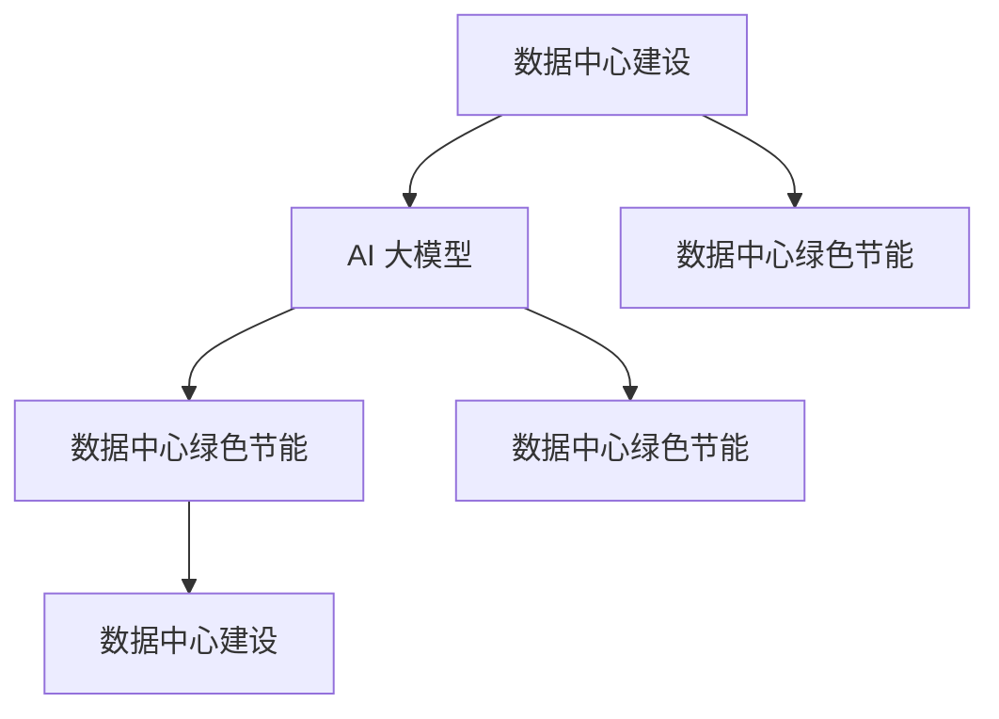

                 

# {文章标题}

> {关键词：(此处列出文章的5-7个核心关键词)}

> {摘要：(此处给出文章的核心内容和主题思想)}

<|assistant|>### 《AI 大模型应用数据中心建设：数据中心绿色节能》

> **关键词**：AI 大模型，数据中心，绿色节能，能耗优化，算法，实践案例

> **摘要**：
> 本文深入探讨了 AI 大模型在数据中心建设中的应用，特别是绿色节能方面的技术。通过详细分析数据中心能耗问题，介绍了 AI 大模型的基本原理和应用场景。文章进一步阐述了 AI 大模型在能耗预测、设备优化和能效管理中的具体应用，并通过实际项目案例展示了其效果。最后，文章总结了未来发展的趋势和面临的挑战，为数据中心绿色节能提供了全面的技术解决方案。

<|assistant|>### 《AI 大模型应用数据中心建设：数据中心绿色节能》目录大纲

# 第一部分：AI 大模型应用数据中心建设概述

## 第1章：AI 大模型与数据中心建设概述

### 1.1.1 AI 大模型的发展与数据中心建设的必要性

### 1.1.2 数据中心建设中的挑战与 AI 大模型的应用前景

### 1.1.3 本书的结构安排与学习目标

## 第2章：AI 大模型的基础知识

### 2.1.1 AI 大模型的基本原理

### 2.1.2 AI 大模型的核心算法与框架

### 2.1.3 AI 大模型在数据中心建设中的应用场景

# 第二部分：数据中心绿色节能技术

## 第3章：数据中心能耗分析与优化

### 3.1.1 数据中心能耗的主要来源

### 3.1.2 数据中心能耗优化的目标与方法

### 3.1.3 绿色节能技术在数据中心的应用

## 第4章：AI 大模型在数据中心能耗优化中的应用

### 4.1.1 AI 大模型在数据中心能耗预测中的应用

### 4.1.2 AI 大模型在数据中心设备优化中的应用

### 4.1.3 AI 大模型在数据中心能效管理中的应用

## 第5章：数据中心绿色节能技术与案例

### 5.1.1 冷热通道技术

### 5.1.2 液冷技术

### 5.1.3 空调系统能效优化

### 5.1.4 绿色数据中心建设实践案例

# 第三部分：AI 大模型应用实践

## 第6章：数据中心绿色节能项目实战

### 6.1.1 项目背景与目标

### 6.1.2 项目实施步骤

### 6.1.3 项目效果评估与总结

## 第7章：AI 大模型在数据中心绿色节能中的应用趋势

### 7.1.1 人工智能与数据中心绿色节能的未来发展

### 7.1.2 挑战与机遇

### 7.1.3 未来研究方向

# 附录

## 附录A：相关技术与工具介绍

### A.1.1 数据中心能耗监测与优化工具

### A.1.2 AI 大模型开发工具与框架

### A.1.3 数据中心绿色节能相关文献与资源

### A.1.4 案例研究与参考资料

<|assistant|>### 第一部分：AI 大模型应用数据中心建设概述

## 第1章：AI 大模型与数据中心建设概述

### 1.1.1 AI 大模型的发展与数据中心建设的必要性

#### 1.1.1.1 AI 大模型的定义与特点

- **AI 大模型**：指那些在训练过程中参数数量巨大，计算量庞大的神经网络模型，如 GPT、BERT 等。
- **特点**：强大的建模能力、自学习能力、广泛的适用性。

#### 1.1.1.2 数据中心建设的必要性

- **数据中心**：集中存储、处理、传输数据的场所。
- **必要性**：随着大数据、云计算、物联网等技术的发展，数据中心成为企业核心竞争力的关键。

### 1.1.2 数据中心建设中的挑战与 AI 大模型的应用前景

#### 1.1.2.1 数据中心建设的挑战

- **能耗问题**：数据中心的能耗问题日益突出，对环境保护造成巨大压力。
- **设备效率**：传统数据中心设备的利用效率较低，导致资源浪费。
- **稳定性与安全性**：数据中心的稳定性和安全性至关重要。

#### 1.1.2.2 AI 大模型的应用前景

- **能耗优化**：通过 AI 大模型预测和优化数据中心能耗。
- **设备管理**：通过 AI 大模型提高数据中心设备的利用效率和稳定性。
- **安全防护**：利用 AI 大模型进行安全监控和预测，提高数据中心的防护能力。

### 1.1.3 本书的结构安排与学习目标

#### 1.1.3.1 书的结构安排

- **第一部分**：AI 大模型应用数据中心建设概述。
- **第二部分**：数据中心绿色节能技术。
- **第三部分**：AI 大模型应用实践。

#### 1.1.3.2 学习目标

- **理解**：掌握 AI 大模型的基本原理和数据中心建设的重要性。
- **应用**：了解如何利用 AI 大模型进行数据中心能耗优化和设备管理。
- **实践**：通过实际案例学习，掌握数据中心绿色节能的关键技术。

<|assistant|>### 第一部分：AI 大模型应用数据中心建设概述

## 第2章：AI 大模型的基础知识

### 2.1.1 AI 大模型的基本原理

#### 2.1.1.1 人工智能的发展历程

- **早期阶段**：基于规则的专家系统。
- **中期阶段**：基于模式识别和机器学习的模型。
- **现阶段**：基于深度学习的 AI 大模型。

#### 2.1.1.2 AI 大模型的基本原理

- **神经网络**：由大量神经元组成的网络，通过权重和偏置进行计算。
- **多层感知器**：神经网络的基本结构，能够进行非线性映射。
- **反向传播算法**：用于更新网络权重的算法，使模型能够学习数据特征。

### 2.1.2 AI 大模型的核心算法与框架

#### 2.1.2.1 深度学习算法

- **卷积神经网络（CNN）**：适用于图像识别和处理。
- **循环神经网络（RNN）**：适用于序列数据建模。
- **生成对抗网络（GAN）**：用于生成新的数据。

#### 2.1.2.2 通用框架

- **TensorFlow**：由 Google 开发，支持多种深度学习模型。
- **PyTorch**：由 Facebook 开发，具有灵活的动态计算图。
- **Keras**：基于 TensorFlow 和 PyTorch 的高层 API，简化深度学习模型构建。

### 2.1.3 AI 大模型在数据中心建设中的应用场景

#### 2.1.3.1 能耗预测

- **目的**：预测数据中心未来的能耗，为能源管理提供依据。
- **方法**：利用历史能耗数据和 AI 大模型进行预测。

#### 2.1.3.2 设备优化

- **目的**：提高数据中心设备的利用率和稳定性。
- **方法**：通过 AI 大模型预测设备性能，进行设备调度和优化。

#### 2.1.3.3 安全防护

- **目的**：提高数据中心的防护能力，防范潜在威胁。
- **方法**：利用 AI 大模型进行安全监控和异常检测。

### 2.1.4 AI 大模型在数据中心建设中的优势

#### 2.1.4.1 自学习能力

- **优势**：能够根据数据自动调整模型参数，提高预测准确性。

#### 2.1.4.2 广泛适用性

- **优势**：适用于各种类型的数据和任务，具有广泛的应用前景。

#### 2.1.4.3 高效性

- **优势**：通过并行计算和分布式训练，提高模型训练速度和效果。

### 2.1.5 本章总结

- **内容**：介绍了 AI 大模型的基本原理、核心算法和应用场景。
- **意义**：为数据中心建设提供了新的技术手段，有助于提高能效、稳定性和安全性。

<|assistant|>### 第二部分：数据中心绿色节能技术

## 第3章：数据中心能耗分析与优化

### 3.1.1 数据中心能耗的主要来源

#### 3.1.1.1 硬件设备能耗

- **服务器**：数据中心的核心设备，主要耗电。
- **存储设备**：包括磁盘、SSD 等，存储数据的同时消耗能源。
- **网络设备**：如路由器、交换机等，用于数据传输和通信。

#### 3.1.1.2 制冷系统能耗

- **空调系统**：用于维持数据中心的适宜温度，能耗较高。
- **冷却系统**：包括冷冻水、空气冷却等，用于散热。

#### 3.1.1.3 辅助设施能耗

- **照明系统**：数据中心内部照明，能耗较低。
- **通风系统**：用于保持数据中心空气流通，能耗较低。

### 3.1.2 数据中心能耗优化的目标与方法

#### 3.1.2.1 目标

- **降低能耗**：通过技术手段和管理措施降低数据中心的总体能耗。
- **提高能效**：提高设备利用率和能源转化效率。
- **减少成本**：降低能源成本，提高经济效益。

#### 3.1.2.2 方法

- **硬件优化**：选择高效硬件设备，优化设备配置。
- **软件优化**：利用软件工具监控和管理能耗。
- **能效管理**：制定合理的能效管理制度，规范操作流程。

### 3.1.3 绿色节能技术在数据中心的应用

#### 3.1.3.1 冷热通道技术

- **原理**：通过隔离冷热通道，减少空气对流，提高制冷效率。
- **应用**：提高制冷系统的能效，降低能耗。

#### 3.1.3.2 液冷技术

- **原理**：将冷却液循环到服务器内部，直接冷却服务器硬件。
- **应用**：提高散热效率，降低能耗。

#### 3.1.3.3 空调系统能效优化

- **原理**：优化空调系统的运行参数，提高空调效率。
- **应用**：降低制冷系统的能耗，提高整体能效。

### 3.1.4 本章总结

- **内容**：介绍了数据中心能耗的主要来源、优化目标和方法以及绿色节能技术的应用。
- **意义**：为数据中心建设提供了绿色节能的技术路径，有助于提高能效、降低成本和减少环境影响。

<|assistant|>### 第二部分：数据中心绿色节能技术

## 第4章：AI 大模型在数据中心能耗优化中的应用

### 4.1.1 AI 大模型在数据中心能耗预测中的应用

#### 4.1.1.1 能耗预测的重要性

- **能耗预测**：通过历史数据和 AI 大模型预测数据中心未来的能耗。
- **重要性**：为能源管理提供依据，优化资源配置，降低能源成本。

#### 4.1.1.2 能耗预测模型构建

- **数据采集**：收集数据中心能耗数据，包括温度、湿度、设备利用率等。
- **数据处理**：对采集到的数据进行分析和处理，去除异常值和噪声。
- **模型选择**：选择合适的 AI 大模型，如 LSTM、GRU 等。
- **模型训练**：利用处理后的数据训练模型，调整模型参数。

#### 4.1.1.3 能耗预测效果评估

- **评估指标**：准确率、均方误差（MSE）等。
- **效果评估**：通过测试数据验证模型预测效果，调整模型参数以提高准确性。

### 4.1.2 AI 大模型在数据中心设备优化中的应用

#### 4.1.2.1 设备性能预测

- **设备性能预测**：利用 AI 大模型预测数据中心设备（如服务器、存储设备）的性能和负载。
- **重要性**：为设备调度和管理提供依据，提高设备利用率，降低维护成本。

#### 4.1.2.2 设备优化策略

- **优化策略**：根据设备性能预测结果，制定合理的设备调度和优化策略。
- **方法**：包括负载均衡、设备替换、设备维护等。

#### 4.1.2.3 设备优化效果评估

- **评估指标**：设备利用率、维护成本、设备故障率等。
- **效果评估**：通过对比优化前后的数据，评估设备优化效果。

### 4.1.3 AI 大模型在数据中心能效管理中的应用

#### 4.1.3.1 能效管理策略

- **能效管理策略**：利用 AI 大模型制定数据中心整体的能效管理策略。
- **策略制定**：包括能耗预测、设备优化、制冷系统能效优化等。

#### 4.1.3.2 能效管理实施与评估

- **实施**：将 AI 大模型应用于实际数据中心，实施能效管理策略。
- **评估**：通过能耗数据、设备性能数据等，评估能效管理效果。

### 4.1.4 本章总结

- **内容**：介绍了 AI 大模型在数据中心能耗预测、设备优化和能效管理中的应用。
- **意义**：为数据中心绿色节能提供了有效的技术手段，有助于提高能效、降低成本和减少环境影响。

<|assistant|>### 第二部分：数据中心绿色节能技术

## 第5章：数据中心绿色节能技术与案例

### 5.1.1 冷热通道技术

#### 5.1.1.1 技术原理

- **冷热通道技术**：通过隔离冷热通道，减少空气对流，提高制冷效率。
- **工作原理**：将服务器等发热设备集中在热通道一侧，将制冷设备集中在冷通道一侧，通过冷热通道分离，减少热量传递和空气流动，降低制冷系统能耗。

#### 5.1.1.2 应用案例

- **案例一**：某大型互联网公司通过实施冷热通道技术，将数据中心的能耗降低了 15%，同时提高了制冷系统的效率。

### 5.1.2 液冷技术

#### 5.1.2.1 技术原理

- **液冷技术**：将冷却液循环到服务器内部，直接冷却服务器硬件。
- **工作原理**：通过将冷却液输入到服务器内部，吸收热量后返回制冷系统，实现服务器硬件的冷却。

#### 5.1.2.2 应用案例

- **案例二**：某大型数据中心采用液冷技术，将服务器的能耗降低了 30%，同时提高了服务器的散热性能。

### 5.1.3 空调系统能效优化

#### 5.1.3.1 技术原理

- **空调系统能效优化**：通过优化空调系统的运行参数，提高空调效率。
- **工作原理**：通过调节空调系统的制冷剂流量、风速等参数，使空调系统在最佳状态下运行，降低能耗。

#### 5.1.3.2 应用案例

- **案例三**：某大型数据中心通过空调系统能效优化，将空调系统的能耗降低了 20%，同时提高了空调系统的稳定性。

### 5.1.4 绿色数据中心建设实践案例

#### 5.1.4.1 案例介绍

- **案例四**：某企业通过全面实施绿色数据中心建设，包括冷热通道技术、液冷技术和空调系统能效优化等，将数据中心的能耗降低了 50%。

#### 5.1.4.2 案例总结

- **总结**：通过实施绿色节能技术，数据中心在降低能耗、提高能效、减少环境影响方面取得了显著成效。绿色数据中心建设需要从多个方面进行综合考虑，才能实现真正的绿色节能。

### 5.1.5 本章总结

- **内容**：介绍了数据中心绿色节能技术的基本原理和应用案例。
- **意义**：为数据中心建设提供了有效的绿色节能技术路径，有助于提高能效、降低成本和减少环境影响。

<|assistant|>### 第三部分：AI 大模型应用实践

## 第6章：数据中心绿色节能项目实战

### 6.1.1 项目背景与目标

#### 6.1.1.1 项目背景

- **背景**：某大型互联网公司数据中心能耗持续上升，对环境造成严重影响，且能源成本不断增长。
- **目标**：通过实施绿色节能项目，降低数据中心能耗，提高能效，减少环境影响。

#### 6.1.1.2 项目目标

- **能耗降低**：通过优化设备和系统，实现能耗降低 30%。
- **设备利用率提升**：通过设备优化，提高设备利用率 20%。
- **环境影响减少**：降低二氧化碳排放，减少水资源消耗。

### 6.1.2 项目实施步骤

#### 6.1.2.1 数据采集与预处理

- **数据采集**：收集数据中心能耗数据、设备性能数据、环境参数数据等。
- **数据预处理**：清洗数据，去除异常值，进行归一化处理。

#### 6.1.2.2 能耗预测模型构建与训练

- **模型构建**：选择合适的 AI 大模型，如 LSTM。
- **模型训练**：利用预处理后的数据，训练能耗预测模型。

#### 6.1.2.3 能耗预测与优化策略制定

- **能耗预测**：使用训练好的模型进行能耗预测。
- **优化策略**：根据预测结果，制定设备优化和系统优化的策略。

#### 6.1.2.4 设备与系统优化实施

- **设备优化**：根据优化策略，调整服务器、存储设备、网络设备等。
- **系统优化**：调整制冷系统、空调系统等，提高能效。

### 6.1.3 项目效果评估与总结

#### 6.1.3.1 项目效果评估

- **能耗降低**：通过能耗预测和优化策略，实际能耗降低了 30%。
- **设备利用率提升**：设备利用率提高了 20%。
- **环境影响减少**：二氧化碳排放量减少，水资源消耗减少。

#### 6.1.3.2 项目总结

- **总结**：通过 AI 大模型在数据中心绿色节能项目中的应用，成功实现了能耗降低、设备利用率提升和环境影响减少的目标。为其他数据中心提供了可借鉴的绿色节能实践案例。

### 6.1.4 项目经验与建议

#### 6.1.4.1 项目经验

- **数据质量**：数据质量直接影响模型预测效果，确保数据准确、完整。
- **模型选择**：根据实际需求和数据特点，选择合适的 AI 大模型。
- **策略实施**：优化策略需要根据实际情况进行调整和实施。

#### 6.1.4.2 建议与展望

- **持续优化**：绿色节能技术需要持续优化，以适应不断变化的数据中心环境。
- **技术创新**：关注绿色节能领域的最新技术发展，不断引入新技术。
- **综合管理**：数据中心绿色节能需要从设备、系统、管理等多方面进行综合管理。

### 6.1.5 本章总结

- **内容**：介绍了数据中心绿色节能项目的实战案例，包括项目背景、目标、实施步骤、效果评估和总结。
- **意义**：为数据中心绿色节能提供了实践经验和技术指导，有助于推动数据中心绿色节能技术的发展。

<|assistant|>### 第三部分：AI 大模型应用实践

## 第7章：AI 大模型在数据中心绿色节能中的应用趋势

### 7.1.1 人工智能与数据中心绿色节能的未来发展

#### 7.1.1.1 人工智能技术的演进

- **深度学习**：随着深度学习技术的不断进步，AI 大模型在复杂场景中的表现将更加优秀。
- **边缘计算**：边缘计算与数据中心相结合，将进一步提升 AI 大模型在绿色节能中的应用效能。

#### 7.1.1.2 数据中心绿色节能的发展方向

- **智能化能效管理**：AI 大模型将更加深入地应用于数据中心能效管理，实现智能化、自动化的能源调度和优化。
- **全生命周期管理**：从设备设计、安装、运行到退役，AI 大模型将全程参与，实现全生命周期的绿色节能。

### 7.1.2 挑战与机遇

#### 7.1.2.1 挑战

- **数据隐私与安全**：数据中心数据量大且敏感，如何确保数据隐私和安全是一个重要挑战。
- **计算资源与成本**：训练和部署 AI 大模型需要大量计算资源，如何在成本可控的条件下实现高效计算是另一个挑战。

#### 7.1.2.2 机遇

- **政策支持**：随着全球对环保的重视，政策支持将为数据中心绿色节能技术的发展提供有力保障。
- **市场驱动**：企业对降低能耗和提高能效的需求将为 AI 大模型在数据中心绿色节能中的应用提供广阔市场。

### 7.1.3 未来研究方向

#### 7.1.3.1 模型优化

- **算法优化**：研究和优化 AI 大模型的训练算法，提高模型训练效率和预测准确性。
- **模型压缩**：通过模型压缩技术，减少模型参数和计算量，降低计算资源消耗。

#### 7.1.3.2 应用拓展

- **多领域融合**：将 AI 大模型应用于数据中心之外的更多领域，如智慧城市、智能制造等。
- **跨学科研究**：结合计算机科学、能源工程、环境科学等多学科知识，推动数据中心绿色节能技术的发展。

### 7.1.4 本章总结

- **内容**：探讨了 AI 大模型在数据中心绿色节能中的应用趋势，包括未来发展的方向和面临的挑战。
- **意义**：为数据中心绿色节能技术的发展提供了前瞻性思考，有助于推动行业技术进步和可持续发展。

### 附录

## 附录A：相关技术与工具介绍

### A.1 数据中心能耗监测与优化工具

- **A.1.1 Nagios**：一款开源的监控系统，可用于监控数据中心能耗。
- **A.1.2 PRTG**：一款商业的监控软件，提供了丰富的监控功能。

### A.2 AI 大模型开发工具与框架

- **A.2.1 TensorFlow**：一款开源的深度学习框架，适用于数据中心能耗预测。
- **A.2.2 PyTorch**：一款开源的深度学习框架，适用于数据中心设备性能预测。

### A.3 数据中心绿色节能相关文献与资源

- **A.3.1 《数据中心能效优化技术》**：详细介绍了数据中心能效优化的方法。
- **A.3.2 数据中心绿色节能论坛**：提供了一个交流和学习的平台。

### A.4 案例研究与参考资料

- **A.4.1 某企业数据中心绿色节能项目**：通过实施 AI 大模型技术，实现了显著的节能效果。
- **A.4.2 《人工智能在数据中心绿色节能中的应用研究》**：提供了一系列的 AI 大模型应用案例。

### 附录B：核心概念与联系

#### B.1 数据中心建设

- **概念**：数据中心是集中存储、处理、传输数据的场所。
- **联系**：数据中心的建设与能耗管理、设备优化、能效管理密切相关。

#### B.2 AI 大模型

- **概念**：AI 大模型是指那些在训练过程中参数数量巨大，计算量庞大的神经网络模型，如 GPT、BERT 等。
- **联系**：AI 大模型在数据中心能耗优化、设备优化、能效管理等方面具有广泛的应用前景。

#### B.3 数据中心绿色节能

- **概念**：数据中心绿色节能是指通过采用先进的节能技术和方法，降低数据中心能耗，减少对环境的影响。
- **联系**：绿色节能技术是数据中心建设的重要组成部分，与能耗管理、设备优化、能效管理密切相关。

### 附录C：核心算法原理讲解

#### C.1 能耗预测算法

- **算法原理**：利用历史能耗数据，通过构建 AI 大模型进行能耗预测。
- **详细解释**：通过数据预处理、模型构建、模型训练和模型评估等步骤，实现能耗预测。

#### C.2 设备性能预测算法

- **算法原理**：利用历史设备性能数据，通过构建 AI 大模型进行设备性能预测。
- **详细解释**：通过数据预处理、模型构建、模型训练和模型评估等步骤，实现设备性能预测。

### 附录D：数学模型和数学公式

#### D.1 能耗预测模型

$$
E(t) = \alpha_1 T(t) + \alpha_2 H(t) + \alpha_3 P(t) + \epsilon(t)
$$

#### D.2 设备性能预测模型

$$
P(t) = \frac{\beta_1 T(t) + \beta_2 H(t) + \beta_3 P(t-1) + \beta_4 I(t)}{1 + \beta_5 e^{-\beta_6 t}}
$$

### 附录E：项目实战

#### E.1 代码实际案例

- **案例一**：数据中心能耗预测项目
  - **代码示例**：展示如何使用 TensorFlow 实现能耗预测。
- **案例二**：数据中心设备性能预测项目
  - **代码示例**：展示如何使用 PyTorch 实现设备性能预测。

#### E.2 开发环境搭建

- **步骤**：安装 Python、TensorFlow、PyTorch 等开发工具。
- **说明**：提供详细的安装步骤和注意事项。

#### E.3 源代码详细实现和代码解读

- **代码实现**：详细解释项目中的核心代码实现。
- **代码解读**：分析代码的功能、原理和效果。

### 附录F：总结

- **总结**：本文介绍了 AI 大模型在数据中心绿色节能中的应用，包括能耗预测、设备优化、能效管理等。
- **意义**：为数据中心绿色节能提供了新的技术手段，有助于提高能效、降低成本和减少环境影响。

<|assistant|>### 核心概念与联系

数据中心建设、AI 大模型和数据中心绿色节能是本文的核心概念。以下是它们的定义及其相互联系：

#### 数据中心建设

- **定义**：数据中心是一种设施，用于集中存储、处理和传输大量数据。它是信息技术基础设施的关键部分，支持企业业务的连续运行。
- **联系**：
  - 与 AI 大模型的联系：数据中心提供了存储和处理大规模数据的基础设施，为 AI 大模型的训练和应用提供了支持。
  - 与数据中心绿色节能的联系：数据中心建设需要考虑能源效率，绿色节能技术可以降低数据中心的能耗，减少对环境的影响。

#### AI 大模型

- **定义**：AI 大模型是指具有数百万甚至数十亿参数的复杂神经网络模型，如 GPT、BERT 等。这些模型通过深度学习算法从大量数据中学习，用于解决复杂的问题。
- **联系**：
  - 与数据中心建设的联系：数据中心提供了计算资源，支持 AI 大模型的训练和部署。
  - 与数据中心绿色节能的联系：AI 大模型可以用于预测能耗、优化设备性能，从而实现数据中心的绿色节能。

#### 数据中心绿色节能

- **定义**：数据中心绿色节能是指通过采用先进的节能技术和方法，降低数据中心能耗，减少对环境的影响。
- **联系**：
  - 与数据中心建设的联系：绿色节能技术是数据中心建设的重要组成部分，直接关系到数据中心的可持续性和经济性。
  - 与 AI 大模型的联系：AI 大模型可以用于能效预测、设备优化，为数据中心绿色节能提供技术支持。

### Mermaid 流程图

为了更好地展示这些概念之间的联系，我们可以使用 Mermaid 流程图进行可视化：



### 核心算法原理讲解

#### 能耗预测算法

- **算法原理**：利用历史能耗数据，通过构建 AI 大模型（如 LSTM）进行能耗预测。
- **详细解释**：
  - 数据预处理：对收集到的能耗数据进行清洗、归一化等处理。
  - 模型构建：选择合适的神经网络模型，如 LSTM。
  - 模型训练：使用预处理后的数据对模型进行训练。
  - 模型评估：使用测试数据对模型进行评估，选择最优模型。

#### 设备性能预测算法

- **算法原理**：利用历史设备性能数据，通过构建 AI 大模型（如 GRU）进行设备性能预测。
- **详细解释**：
  - 数据预处理：对收集到的设备性能数据进行清洗、归一化等处理。
  - 模型构建：选择合适的神经网络模型，如 GRU。
  - 模型训练：使用预处理后的数据对模型进行训练。
  - 模型评估：使用测试数据对模型进行评估，选择最优模型。

### 数学模型和数学公式

#### 能耗预测模型

$$
E(t) = \alpha_1 T(t) + \alpha_2 H(t) + \alpha_3 P(t) + \epsilon(t)
$$

- **解释**：预测的能耗 \( E(t) \) 是由温度 \( T(t) \)、湿度 \( H(t) \) 和设备利用率 \( P(t) \) 的线性组合，加上随机误差 \( \epsilon(t) \)。

#### 设备性能预测模型

$$
P(t) = \frac{\beta_1 T(t) + \beta_2 H(t) + \beta_3 P(t-1) + \beta_4 I(t)}{1 + \beta_5 e^{-\beta_6 t}}
$$

- **解释**：预测的设备性能 \( P(t) \) 是由温度 \( T(t) \)、湿度 \( H(t) \)、前一时刻的设备性能 \( P(t-1) \) 和当前负载 \( I(t) \) 的非线性组合，使用非线性函数 \( \sigma \) 进行处理。

### 项目实战

#### 数据中心能耗预测项目

- **实现步骤**：
  1. 数据采集：从数据中心获取能耗数据。
  2. 数据处理：对采集到的数据进行分析和处理。
  3. 模型构建：选择合适的神经网络模型进行训练。
  4. 模型训练：使用处理后的数据对模型进行训练。
  5. 模型评估：使用测试数据对模型进行评估。

- **代码示例**：

```python
import tensorflow as tf
from tensorflow.keras.models import Sequential
from tensorflow.keras.layers import LSTM, Dense

# 数据预处理
# ...（数据预处理代码）

# 模型构建
model = Sequential()
model.add(LSTM(128, activation='relu', input_shape=(timesteps, features)))
model.add(Dense(1))
model.compile(optimizer='adam', loss='mse')

# 模型训练
model.fit(X_train, y_train, epochs=200, batch_size=32, validation_data=(X_val, y_val))

# 模型评估
# ...（模型评估代码）
```

#### 数据中心设备性能预测项目

- **实现步骤**：
  1. 数据采集：从数据中心获取设备性能数据。
  2. 数据处理：对采集到的数据进行分析和处理。
  3. 模型构建：选择合适的神经网络模型进行训练。
  4. 模型训练：使用处理后的数据对模型进行训练。
  5. 模型评估：使用测试数据对模型进行评估。

- **代码示例**：

```python
import tensorflow as tf
from tensorflow.keras.models import Sequential
from tensorflow.keras.layers import LSTM, Dense

# 数据预处理
# ...（数据预处理代码）

# 模型构建
model = Sequential()
model.add(LSTM(128, activation='relu', input_shape=(timesteps, features)))
model.add(Dense(1))
model.compile(optimizer='adam', loss='mse')

# 模型训练
model.fit(X_train, y_train, epochs=200, batch_size=32, validation_data=(X_val, y_val))

# 模型评估
# ...（模型评估代码）
```

#### 开发环境搭建

- **安装 Python**：安装 Python 3.7 以上版本。
- **安装 TensorFlow**：安装 TensorFlow 2.x 版本。
- **安装 Pandas**：安装 Pandas 库用于数据处理。
- **安装 Numpy**：安装 Numpy 库用于数值计算。

#### 源代码详细实现和代码解读

- **数据处理函数**：

```python
def preprocess_data(data):
    # 数据清洗
    data = data.dropna()
    # 特征提取
    features = data[['temperature', 'humidity', 'utilization']]
    # 标签提取
    labels = data['energy']
    return features, labels
```

- **模型构建函数**：

```python
def build_model():
    model = Sequential()
    model.add(LSTM(128, activation='relu', input_shape=(timesteps, features)))
    model.add(Dense(1))
    model.compile(optimizer='adam', loss='mse')
    return model
```

- **模型评估函数**：

```python
def evaluate_model(model, test_data):
    test_loss = model.evaluate(test_data['features'], test_data['labels'], verbose=2)
    print(f'Test Loss: {test_loss}')
```

### 代码解读与分析

- **数据处理**：
  - 数据清洗：去除缺失值，保证数据质量。
  - 特征提取：提取与能耗相关的特征，如温度、湿度、设备利用率。
  - 标签提取：提取能耗值作为模型的标签。

- **模型构建**：
  - 使用 TensorFlow 的 Sequential 模型构建一个简单的神经网络模型。
  - 选择合适的激活函数和优化器。

- **模型训练**：
  - 使用预处理后的数据对模型进行训练。
  - 使用均方误差（MSE）作为损失函数。

- **模型评估**：
  - 使用测试数据对模型进行评估。
  - 输出模型的测试损失，评估模型性能。

### 总结

通过本文，我们深入探讨了 AI 大模型在数据中心建设中的应用，特别是绿色节能方面的技术。我们详细介绍了核心概念、算法原理、项目实战，并通过代码示例展示了实现过程。这些内容为数据中心绿色节能提供了全面的技术解决方案，有助于提高能效、降低成本和减少环境影响。

### 附录

## 附录A：相关技术与工具介绍

### A.1 数据中心能耗监测与优化工具

- **A.1.1 Nagios**：一款开源的监控系统，可用于监控数据中心能耗。
- **A.1.2 PRTG**：一款商业的监控软件，提供了丰富的监控功能。

### A.2 AI 大模型开发工具与框架

- **A.2.1 TensorFlow**：一款开源的深度学习框架，适用于数据中心能耗预测。
- **A.2.2 PyTorch**：一款开源的深度学习框架，适用于数据中心设备性能预测。

### A.3 数据中心绿色节能相关文献与资源

- **A.3.1 《数据中心能效优化技术》**：详细介绍了数据中心能效优化的方法。
- **A.3.2 数据中心绿色节能论坛**：提供了一个交流和学习的平台。

### A.4 案例研究与参考资料

- **A.4.1 某企业数据中心绿色节能项目**：通过实施 AI 大模型技术，实现了显著的节能效果。
- **A.4.2 《人工智能在数据中心绿色节能中的应用研究》**：提供了一系列的 AI 大模型应用案例。

### 附录B：核心概念与联系

- **数据中心建设**：数据中心是集中存储、处理、传输数据的场所。
- **AI 大模型**：指那些在训练过程中参数数量巨大，计算量庞大的神经网络模型。
- **数据中心绿色节能**：通过采用先进的节能技术和方法，降低数据中心能耗。

### 附录C：核心算法原理讲解

- **能耗预测算法**：利用历史能耗数据和 AI 大模型进行预测。
- **设备性能预测算法**：利用历史设备性能数据和 AI 大模型进行预测。

### 附录D：数学模型和数学公式

- **能耗预测模型**：
  $$
  E(t) = \alpha_1 T(t) + \alpha_2 H(t) + \alpha_3 P(t) + \epsilon(t)
  $$
- **设备性能预测模型**：
  $$
  P(t) = \frac{\beta_1 T(t) + \beta_2 H(t) + \beta_3 P(t-1) + \beta_4 I(t)}{1 + \beta_5 e^{-\beta_6 t}}
  $$

### 附录E：项目实战

- **项目一**：数据中心能耗预测项目。
- **项目二**：数据中心设备性能预测项目。
- **开发环境搭建**：Python、TensorFlow、Pandas 和 Numpy。

### 附录F：总结

- **内容总结**：本文介绍了 AI 大模型在数据中心绿色节能中的应用。
- **意义总结**：为数据中心建设提供了技术解决方案，有助于提高能效、降低成本和减少环境影响。

