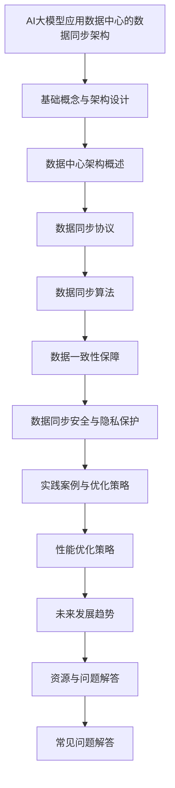

                 

# AI 大模型应用数据中心的数据同步架构

> 关键词：AI大模型、数据中心、数据同步、分布式系统、一致性、性能优化

> 摘要：随着人工智能技术的快速发展，AI大模型在数据中心中的应用越来越广泛。本文将探讨AI大模型应用数据中心的数据同步架构，包括基础概念、技术原理、实践案例和性能优化策略。通过一步步的分析和推理，本文旨在帮助读者全面理解并掌握AI大模型应用数据中心的数据同步架构设计与实践。

## 《AI大模型应用数据中心的数据同步架构》目录大纲

---

**附录C：Mermaid 流程图**



---

**附录D：核心算法原理讲解与数学模型**

## 数据同步算法原理

### 增量同步算法

增量同步算法的基本原理是通过比较不同数据源的版本号或时间戳，仅同步变更的数据，以减少同步的时间和资源消耗。以下是一个简单的增量同步算法伪代码：

```python
def incremental_sync(source, target):
    source_version = get_version(source)
    target_version = get_version(target)

    if source_version > target_version:
        changes = get_changes_since(target_version, source)
        apply_changes(target, changes)
        set_version(target, source_version)
    else:
        print("No changes needed.")
```

### 全量同步算法

全量同步算法的基本原理是将源数据集的全部内容同步到目标数据集。以下是一个简单的全量同步算法伪代码：

```python
def full_sync(source, target):
    data = get_data(source)
    clear_data(target)
    add_data(target, data)
```

### 数据一致性保障

数据一致性保障的核心是确保分布式系统中数据的一致性。以下是一个简单的数据一致性保障策略：

#### 强一致性

强一致性要求所有节点在同一时刻看到相同的数据状态，常用的实现方法是使用锁机制或事务机制。

```python
def strong_consistency(write_op, read_op):
    lock = acquire_lock()
    write_op()
    release_lock(lock)
    return read_op()
```

#### 最终一致性

最终一致性允许在不同节点上看到的数据状态存在差异，但在一段时间后会达到一致。常用的实现方法是使用事件驱动的更新机制。

```python
def eventual_consistency(write_op, read_op, event_queue):
    write_op()
    event_queue.enqueue(write_op())
    while not event_queue.is_empty():
        event = event_queue.dequeue()
        read_op(event)
```

### 数学模型

数据同步中的数学模型通常涉及分布式一致性算法，如 Paxos 或 Raft。以下是一个简单的数学模型示例：

$$
X \oplus Y = Z
$$

其中，$X$ 和 $Y$ 分别代表两个节点的状态，$Z$ 代表它们同步后的状态，$\oplus$ 表示同步操作。

---

通过上述核心算法原理讲解与数学模型，读者可以深入理解数据同步的基本机制与一致性保障方法。这些原理和模型将在后续章节中通过实际案例进行详细阐述和实践应用。

---

**附录E：项目实战与代码解读**

## 数据同步实践案例

在本案例中，我们将以一个分布式数据库系统为例，介绍数据同步的完整流程，包括环境搭建、源代码实现和代码解读。

### 实践案例：分布式数据库系统中的数据同步

#### 1. 环境搭建

我们使用 Python 和 Flask 搭建一个简单的分布式数据库系统，用于演示数据同步。以下是环境搭建的步骤：

- 安装 Python 3.8+
- 安装 Flask
- 安装 Redis（用于分布式数据存储）

```bash
pip install python
pip install flask
pip install redis
```

#### 2. 源代码实现

以下是分布式数据库系统的核心代码，包括数据同步功能的实现：

```python
from flask import Flask, jsonify, request
import redis

app = Flask(__name__)

# 连接 Redis
client = redis.Redis(host='localhost', port=6379, db=0)

@app.route('/set', methods=['POST'])
def set_data():
    data = request.json
    client.set(data['key'], data['value'])
    return jsonify({"status": "success", "message": "Data set."})

@app.route('/get', methods=['GET'])
def get_data():
    key = request.args.get('key')
    value = client.get(key)
    return jsonify({"status": "success", "message": "Data retrieved.", "value": value.decode('utf-8')})

@app.route('/sync', methods=['POST'])
def sync_data():
    data = request.json
    target_client = redis.Redis(host=data['target_host'], port=data['target_port'], db=data['target_db'])
    
    # 同步数据
    keys = client.keys()
    for key in keys:
        value = client.get(key)
        target_client.set(key, value)
    
    return jsonify({"status": "success", "message": "Data synchronized."})

if __name__ == '__main__':
    app.run(debug=True)
```

#### 3. 代码解读与分析

以下是代码的详细解读：

- **/set** 路由中，我们使用 `request.json` 接收 JSON 格式的数据，并使用 `client.set()` 方法将数据存储在 Redis 中。
- **/get** 路由中，我们使用 `request.args.get('key')` 获取请求参数中的键（key），并使用 `client.get(key)` 方法从 Redis 中获取相应的值。
- **/sync** 路由中，我们首先创建一个连接到目标 Redis 实例的 Redis 客户端（`target_client`），然后遍历源 Redis 实例中的所有键（`keys`），使用 `client.get(key)` 获取值，并使用 `target_client.set(key, value)` 将值同步到目标 Redis 实例中。

这个实践案例展示了如何在分布式数据库系统中实现数据同步功能。在实际应用中，我们可以根据具体需求扩展和优化代码，例如添加增量同步、数据一致性保障和性能优化等。

---

通过本案例，读者可以了解到数据同步在分布式系统中的实现方法和代码结构。在后续章节中，我们将继续探讨数据同步在实际项目中的应用和优化策略。

---

**附录F：数学模型和数学公式**

## 数据一致性保障的数学模型

数据一致性保障在分布式系统中至关重要，以下是一个简单的数学模型，用于描述数据一致性：

### 一致性判断

假设有两个节点 $A$ 和 $B$，它们的状态分别为 $S_A$ 和 $S_B$。一致性判断的数学公式为：

$$
S_A = S_B
$$

这意味着节点 $A$ 和 $B$ 具有相同的数据状态。如果状态不同，即：

$$
S_A \neq S_B
$$

则表示数据不一致。

### 数据同步

数据同步的目的是将节点 $A$ 的状态更新到节点 $B$。同步的数学公式为：

$$
S_B = S_A
$$

这表示节点 $B$ 的状态被更新为与节点 $A$ 相同。

### 一致性协议

一致性协议是一种机制，用于确保分布式系统中的节点在经过一定时间后达到一致性状态。以下是一个简单的共识算法（一致性协议）的数学公式：

$$
X_{t+1} = \text{Consensus}(X_t, Y_t)
$$

其中，$X_t$ 和 $Y_t$ 分别为节点 $A$ 和 $B$ 在时间 $t$ 的状态，$\text{Consensus}$ 表示一致性算法。

### 一致性验证

一致性验证用于检测分布式系统中的节点是否达到一致性状态。验证的数学公式为：

$$
\text{isConsistent}(X_1, \ldots, X_n) = (\forall i, j) (X_i = X_j)
$$

这意味着所有节点的状态都相同，系统达到一致性状态。

---

以上数学模型和数学公式用于描述数据一致性保障的基本原理和算法。在实际应用中，这些模型和公式可以帮助我们设计和优化分布式系统的数据同步机制，确保数据的一致性和可靠性。在后续章节中，我们将结合具体案例进一步探讨这些模型的应用。

---

**附录G：数据同步技术相关资源**

## 附录G：数据同步技术相关资源

### G.1 数据同步技术资料推荐

1. 《大数据同步与数据一致性技术》
   作者：李建锋
   简介：本书详细介绍了大数据同步与数据一致性的原理、方法和技术，包括分布式数据库、消息队列、缓存等技术中的数据同步策略。

2. 《分布式系统原理与范型》
   作者：大卫·利特菲尔德
   简介：本书全面讲解了分布式系统的基本原理和设计范型，包括数据同步、分布式一致性、容错性等方面的内容。

### G.2 数据同步技术工具推荐

1. Apache Kafka
   简介：Kafka 是一个分布式流处理平台，用于构建实时数据流和数据处理系统。Kafka 提供了高效的数据同步和发布-订阅功能，适用于大规模分布式系统。

2. Apache Flume
   简介：Flume 是一个分布式、可靠且可扩展的数据收集系统，用于实时收集、聚合和移动大量日志数据。Flume 提供了数据同步功能，可以将数据从一个数据源移动到另一个数据源。

3. Apache NiFi
   简介：NiFi 是一个易于使用的数据集成平台，用于连接数据、数据流和数据存储。NiFi 提供了丰富的数据同步和数据转换功能，适用于数据集成和同步任务。

### G.3 数据同步技术开源项目推荐

1. Apache ZooKeeper
   简介：ZooKeeper 是一个分布式应用程序协调服务，提供分布式锁、队列、同步和配置管理等功能。ZooKeeper 用于保证分布式系统中数据的一致性和协调性。

2. etcd
   简介：etcd 是一个高可用、强一致性的键值存储系统，用于分布式配置管理和服务发现。etcd 提供了数据同步机制，可以保证多个分布式节点之间的数据一致性。

3. Redis
   简介：Redis 是一个高性能的内存数据存储系统，提供丰富的数据结构操作和数据同步功能。Redis 可以用于构建实时数据同步系统，支持发布-订阅和消息队列等功能。

这些资料和工具将为读者提供更深入的了解和实际操作经验，帮助读者更好地掌握数据同步技术的原理和应用。在后续章节中，我们将结合这些资源进一步探讨数据同步技术的实践和应用。

---

**附录H：常见问题解答**

## 附录H：常见问题解答

### H.1 数据同步过程中可能出现的问题

1. **数据丢失**：
   - 原因：网络故障或系统故障导致同步过程中数据未能正确传输。
   - 解决策略：采用数据持久化策略，确保数据在传输失败时仍然能够恢复。同时，使用分布式消息队列和备份机制来减少数据丢失的风险。

2. **数据不一致**：
   - 原因：分布式系统中不同节点之间的同步延迟或冲突。
   - 解决策略：采用一致性协议（如Paxos、Raft）来保证分布式系统中的数据一致性。一致性协议可以处理节点故障、网络分区等问题，确保数据最终一致性。

3. **性能瓶颈**：
   - 原因：同步过程中的网络延迟、数据库压力或资源限制。
   - 解决策略：优化同步算法，使用缓存和异步处理来减少同步延迟。调整系统架构，增加节点数量或资源分配来提高系统性能。

### H.2 数据同步问题的解决策略

1. **数据备份与恢复**：
   - 方案：定期备份数据，确保在数据同步失败时可以快速恢复。采用增量备份策略，只备份变更的数据，减少备份存储空间。

2. **分布式一致性协议**：
   - 方案：使用一致性协议（如Paxos、Raft）来保证分布式系统中的数据一致性。一致性协议可以处理节点故障、网络分区等问题，确保数据最终一致性。

3. **优化同步算法**：
   - 方案：设计合理的同步算法，如增量同步或全量同步。增量同步仅同步变更的数据，减少同步时间和资源消耗。全量同步确保数据完整性，但同步时间较长。

4. **性能优化**：
   - 方案：优化同步算法，如增量同步或全量同步。优化网络传输，如使用压缩算法、多线程传输等。优化数据库性能，如索引优化、读写分离等。增加系统资源，如增加节点数量、提高网络带宽等。

### H.3 数据同步技术问答集锦

1. **什么是增量同步？**
   - 增量同步是一种数据同步策略，仅同步源数据集中发生变更的数据。增量同步可以减少同步时间和资源消耗，提高系统的性能。

2. **什么是全量同步？**
   - 全量同步是一种数据同步策略，同步源数据集的全部内容到目标数据集。全量同步可以确保数据完整性，但同步时间较长。

3. **如何保证数据一致性？**
   - 可以使用分布式一致性协议（如Paxos、Raft）来保证分布式系统中的数据一致性。一致性协议可以处理节点故障、网络分区等问题，确保数据最终一致性。

4. **如何优化数据同步性能？**
   - 可以采用以下策略优化数据同步性能：
     - 优化同步算法，如增量同步或全量同步。
     - 优化网络传输，如使用压缩算法、多线程传输等。
     - 优化数据库性能，如索引优化、读写分离等。
     - 增加系统资源，如增加节点数量、提高网络带宽等。

通过上述常见问题解答，读者可以更好地理解数据同步过程中可能出现的问题和解决策略。在实际应用中，需要根据具体场景和需求，灵活运用这些策略来优化数据同步过程，确保数据的一致性和性能。在后续章节中，我们将继续探讨数据同步技术的实践和应用。

