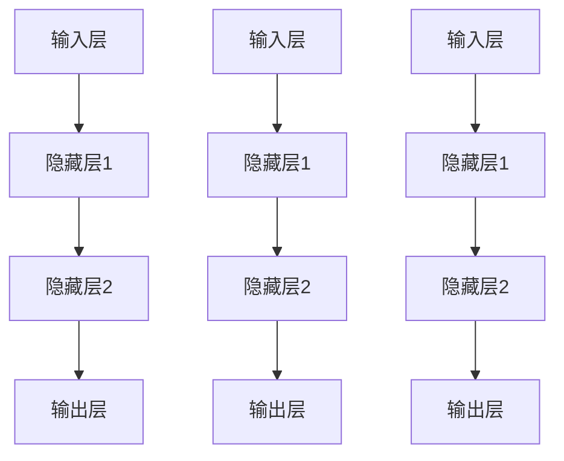

                 

# 《AI 大模型应用数据中心的数据复制》

> **关键词：** AI 大模型、数据中心、数据复制、同步复制、异步复制、分布式复制、性能优化、一致性保障

> **摘要：** 本文将深入探讨 AI 大模型应用数据中心的数据复制技术。我们将首先介绍 AI 大模型的基础知识，包括概念、分类、关键技术和数学基础。接着，我们将讨论数据中心的数据复制原理、架构、算法和协议，以及数据复制中的挑战和解决方案。然后，我们将分析数据复制在 AI 大模型训练和推理中的实践，探讨数据一致性保障策略。最后，我们将通过案例分析总结数据复制技术的应用，并展望其未来发展趋势。

## 《AI 大模型应用数据中心的数据复制》目录大纲

## 第一部分：AI大模型基础知识

### 第1章：AI大模型概述

#### 1.1 AI大模型的概念与分类

##### 1.1.1 AI大模型的发展历程

##### 1.1.2 AI大模型的分类与特点

##### 1.1.3 AI大模型在数据中心的应用前景

### 1.2 AI大模型的关键技术

#### 1.2.1 神经网络与深度学习基础

##### 1.2.1.1 神经网络基本结构

##### 1.2.1.2 深度学习优化算法

##### 1.2.1.3 常见深度学习架构

#### 1.2.2 自然语言处理与AI大模型

##### 1.2.2.1 词嵌入技术

##### 1.2.2.2 序列模型与注意力机制

##### 1.2.2.3 转换器架构详解

### 1.3 AI大模型的数学基础

#### 1.3.1 线性代数基础

##### 1.3.1.1 矩阵与向量运算

##### 1.3.1.2 线性方程组求解

##### 1.3.1.3 特征值与特征向量

#### 1.3.2 概率论与统计学基础

##### 1.3.2.1 概率分布函数

##### 1.3.2.2 最大似然估计与最小二乘法

##### 1.3.2.3 贝叶斯推断

## 第二部分：数据中心的数据复制技术

### 第2章：数据复制的基本原理与架构

#### 2.1 数据复制的基本概念

##### 2.1.1 数据复制的重要性

##### 2.1.2 数据复制的基本原理

##### 2.1.3 数据复制的分类

#### 2.2 数据复制架构设计

##### 2.2.1 主-从复制架构

##### 2.2.2 多主复制架构

##### 2.2.3 分布式复制架构

### 2.3 数据复制算法与协议

#### 2.3.1 同步复制协议

##### 2.3.1.1 同步复制的优缺点

##### 2.3.1.2 同步复制的实现方法

#### 2.3.2 异步复制协议

##### 2.3.2.1 异步复制的优缺点

##### 2.3.2.2 异步复制的实现方法

### 2.4 数据复制中的挑战与解决方案

#### 2.4.1 数据一致性保障

##### 2.4.1.1 数据一致性的定义

##### 2.4.1.2 数据一致性的挑战与对策

#### 2.4.2 数据复制中的性能优化

##### 2.4.2.1 数据复制的性能瓶颈

##### 2.4.2.2 性能优化方法与策略

## 第三部分：AI大模型应用中的数据复制实践

### 第3章：AI大模型训练数据复制实践

#### 3.1 数据复制在AI大模型训练中的应用

##### 3.1.1 数据复制的必要性

##### 3.1.2 数据复制在AI大模型训练中的作用

##### 3.1.3 数据复制的策略与实现

#### 3.2 数据复制的挑战与优化

##### 3.2.1 数据复制的挑战

##### 3.2.2 数据复制优化方法

##### 3.2.3 数据复制优化案例分析

### 第4章：AI大模型推理中的数据复制实践

#### 4.1 数据复制在AI大模型推理中的应用

##### 4.1.1 数据复制在推理阶段的重要性

##### 4.1.2 数据复制在推理阶段的作用

##### 4.1.3 数据复制的策略与实现

#### 4.2 数据复制的挑战与优化

##### 4.2.1 数据复制的挑战

##### 4.2.2 数据复制优化方法

##### 4.2.3 数据复制优化案例分析

### 第5章：AI大模型应用中的数据一致性保障

#### 5.1 数据一致性保障的重要性

##### 5.1.1 数据一致性的定义

##### 5.1.2 数据不一致性的影响

##### 5.1.3 数据一致性保障的必要性

#### 5.2 数据一致性保障策略

##### 5.2.1 同步复制策略

##### 5.2.2 异步复制策略

##### 5.2.3 数据一致性检测与修复策略

### 第6章：AI大模型应用中的数据复制案例分析

#### 6.1 数据复制在搜索引擎中的应用

##### 6.1.1 搜索引擎的数据复制需求

##### 6.1.2 搜索引擎的数据复制策略

##### 6.1.3 搜索引擎的数据复制案例分析

#### 6.2 数据复制在推荐系统中的应用

##### 6.2.1 推荐系统的数据复制需求

##### 6.2.2 推荐系统的数据复制策略

##### 6.2.3 推荐系统的数据复制案例分析

### 第7章：AI大模型应用中的数据复制未来趋势与发展

#### 7.1 数据复制技术的发展趋势

##### 7.1.1 数据复制技术的演进

##### 7.1.2 未来数据复制技术的发展方向

##### 7.1.3 数据复制技术在AI大模型中的应用前景

#### 7.2 数据复制在AI大模型中的挑战与机遇

##### 7.2.1 数据复制在AI大模型中的挑战

##### 7.2.2 数据复制在AI大模型中的机遇

##### 7.2.3 数据复制在AI大模型中的未来发展方向

## 附录：AI大模型应用数据中心的数据复制工具与资源

### 附录 A：数据复制工具与框架

#### A.1 分布式文件系统

##### A.1.1 HDFS

##### A.1.2 Ceph

##### A.1.3 GlusterFS

#### A.2 数据流处理框架

##### A.2.1 Apache Kafka

##### A.2.2 Apache Flink

##### A.2.3 Apache Storm

### 附录 B：数据复制相关开源项目与资源

#### B.1 数据复制开源项目

##### B.1.1 Replicated Storage

##### B.1.2 CRDTs

##### B.1.3 MulticastFS

#### B.2 数据复制资源

##### B.2.1 数据复制技术博客

##### B.2.2 数据复制技术论文

##### B.2.3 数据复制技术会议与研讨会

<|assistant|>
## 第一部分：AI大模型基础知识

### 第1章：AI大模型概述

#### 1.1 AI大模型的概念与分类

##### 1.1.1 AI大模型的发展历程

人工智能（AI）作为计算机科学的一个分支，其发展历程可以追溯到20世纪50年代。最初，AI的目标是让计算机具有人类的智能，实现诸如推理、解决问题、学习等高级功能。然而，早期的AI系统由于计算能力和算法限制，很难实现这些目标。随着计算能力的提升和算法的进步，特别是在深度学习和神经网络领域，AI取得了显著的进展。

AI大模型（Large-scale AI Models）是指那些具有数百万、数十亿甚至更多参数的复杂神经网络模型。这些模型通常用于解决复杂的问题，如图像识别、自然语言处理、语音识别等。AI大模型的发展历程可以划分为几个阶段：

1. **早期神经网络**：1958年，Frank Rosenblatt提出了感知机（Perceptron）模型，这是最早的神经网络之一。然而，感知机模型的局限性很快被发现，它无法解决一些简单的问题，如异或（XOR）问题。

2. **深度学习兴起**：1986年，Rumelhart、Hinton和Williams提出了反向传播算法（Backpropagation），这标志着深度学习的真正兴起。1990年代，支持向量机（SVM）和决策树等传统机器学习方法占据了主导地位。

3. **AI大模型时代**：2006年，Hinton提出了深度信念网络（Deep Belief Network），再次引发了深度学习的热潮。随着大数据和云计算的兴起，深度学习逐渐成为主流的AI方法，AI大模型如雨后春笋般出现。

##### 1.1.2 AI大模型的分类与特点

AI大模型根据应用领域和任务的不同，可以分为多种类型，其中最典型的包括：

1. **计算机视觉模型**：如卷积神经网络（CNN）和生成对抗网络（GAN），用于图像识别、物体检测、图像生成等。

2. **自然语言处理模型**：如循环神经网络（RNN）、长短时记忆网络（LSTM）和转换器（Transformer），用于文本分类、机器翻译、语音识别等。

3. **强化学习模型**：如深度确定性策略梯度（DDPG）和深度Q网络（DQN），用于游戏、自动驾驶、机器人控制等领域。

4. **多模态模型**：结合图像、文本、音频等多种数据类型的模型，用于跨模态信息检索、事件预测等。

AI大模型的特点包括：

1. **高参数量**：AI大模型通常具有数百万、数十亿甚至更多的参数，这使得它们能够捕捉复杂的数据特征。

2. **深度结构**：深度学习模型通常包含多个隐藏层，这使得模型能够学习更高级别的特征表示。

3. **端到端训练**：AI大模型通常采用端到端训练方式，直接从原始数据中学习目标函数，无需手工设计特征。

4. **大规模数据需求**：AI大模型通常需要大量的训练数据来获得良好的性能。

##### 1.1.3 AI大模型在数据中心的应用前景

数据中心是AI大模型应用的重要场景之一。随着AI技术的发展和数据中心基础设施的完善，AI大模型在数据中心中的应用前景十分广阔：

1. **智能数据处理**：数据中心通常处理大量的数据，AI大模型可以用于数据清洗、数据分析和数据挖掘，提高数据处理效率和质量。

2. **智能运维**：AI大模型可以用于预测故障、优化资源利用率和提升服务质量，从而提高数据中心的运维水平。

3. **智能安全**：AI大模型可以用于识别恶意流量、检测网络攻击和预测潜在风险，从而提升数据中心的网络安全。

4. **智能推荐**：数据中心中的大量用户数据可以通过AI大模型进行分析，提供个性化的推荐服务，提升用户体验。

总的来说，AI大模型在数据中心的应用不仅能够提高数据中心的服务质量和效率，还能推动AI技术的进一步发展。

#### 1.2 AI大模型的关键技术

##### 1.2.1 神经网络与深度学习基础

神经网络（Neural Networks）是构建AI大模型的核心技术之一。神经网络由一系列相互连接的神经元组成，每个神经元都接收来自其他神经元的输入信号，并通过激活函数产生输出。神经网络的目的是通过学习输入和输出之间的映射关系来执行复杂的任务。

1. **神经网络基本结构**：
    - **输入层**：接收输入数据。
    - **隐藏层**：对输入数据进行处理和变换。
    - **输出层**：产生最终输出。

2. **激活函数**：激活函数是神经网络中的关键组成部分，用于将输入映射到输出。常见的激活函数包括sigmoid函数、ReLU函数和Tanh函数。

3. **反向传播算法**：反向传播算法是训练神经网络的核心算法。通过反向传播算法，神经网络可以不断调整其参数，以减少预测误差。

##### 1.2.1.1 神经网络基本结构

以下是一个简单的神经网络基本结构的 Mermaid 流程图：



##### 1.2.1.2 深度学习优化算法

深度学习优化算法用于调整神经网络的参数，以最小化损失函数。常见的优化算法包括随机梯度下降（SGD）、Adam优化器和RMSprop。

1. **随机梯度下降（SGD）**：SGD通过随机选择一部分训练数据来更新网络参数。其优点是简单易实现，但可能需要较长的训练时间。

2. **Adam优化器**：Adam优化器结合了SGD和RMSprop的优点，通过自适应调整学习率来提高训练效率。

3. **RMSprop**：RMSprop通过跟踪过去梯度平方的平均值来自适应调整学习率。

##### 1.2.1.3 常见深度学习架构

深度学习架构是深度学习模型的核心，不同的架构适用于不同的任务。以下是一些常见的深度学习架构：

1. **卷积神经网络（CNN）**：CNN特别适用于处理图像数据。其核心组件是卷积层和池化层。

2. **循环神经网络（RNN）**：RNN特别适用于处理序列数据。其核心组件是隐藏状态和门控机制。

3. **长短时记忆网络（LSTM）**：LSTM是RNN的一种改进，用于解决长序列数据中的梯度消失问题。

4. **转换器（Transformer）**：Transformer是自然语言处理领域的一种革命性架构，其核心组件是自注意力机制。

##### 1.2.2 自然语言处理与AI大模型

自然语言处理（NLP）是AI大模型的一个重要应用领域。NLP涉及从文本中提取信息、理解语义和生成文本。以下是一些NLP中的关键技术和AI大模型：

1. **词嵌入（Word Embedding）**：词嵌入是将单词映射到高维向量空间的技术。常见的词嵌入技术包括Word2Vec和GloVe。

2. **序列模型与注意力机制**：序列模型如RNN和LSTM用于处理序列数据。注意力机制可以捕捉序列中的重要信息，提高模型的性能。

3. **转换器架构（Transformer）**：转换器是NLP领域的一种高效架构，其核心组件是自注意力机制。转换器在机器翻译、文本分类和问答系统等领域取得了显著成绩。

##### 1.2.2.1 词嵌入技术

词嵌入技术是将单词映射到高维向量空间的技术，其目的是捕捉单词之间的语义关系。以下是一个简单的Word2Vec算法的伪代码：

```python
function Word2Vec(Vocabulary, TrainingData):
    Initialize embedding vectors for each word in Vocabulary
    for each sentence in TrainingData:
        for each word in sentence:
            Increment word's count
            Calculate word's context words
            Update word's embedding vector based on context words
    return embedding vectors
```

##### 1.2.2.2 序列模型与注意力机制

序列模型如RNN和LSTM用于处理序列数据，其核心思想是保持隐藏状态，从而捕捉序列中的依赖关系。以下是一个简单的RNN算法的伪代码：

```python
function RNN(input_sequence, hidden_state, weights):
    for each input in input_sequence:
        Compute input * weights
        Compute activation function of input * weights
        Update hidden_state with activation function of input * weights
    return hidden_state
```

注意力机制是一种用于提高模型在处理序列数据时性能的技术。其基本思想是模型可以动态地关注序列中的重要部分。以下是一个简单的注意力机制的伪代码：

```python
function Attention(input_sequence, hidden_state, weights):
    Compute attention scores for each input in input_sequence
    Compute weighted sum of input_sequence using attention scores
    return weighted sum
```

##### 1.2.2.3 转换器架构详解

转换器（Transformer）是NLP领域的一种革命性架构，其核心组件是自注意力机制。转换器由编码器和解码器组成，可以用于机器翻译、文本分类和问答系统等任务。

1. **编码器**：编码器的目的是将输入序列编码为固定长度的向量表示。编码器由多个自注意力层和前馈网络组成。

2. **解码器**：解码器的目的是从编码器的输出中生成输出序列。解码器也由多个自注意力层和前馈网络组成。

3. **自注意力机制**：自注意力机制是转换器的核心组件，用于计算输入序列中每个词的权重，从而捕捉序列中的依赖关系。自注意力机制的伪代码如下：

```python
function SelfAttention(input_sequence, hidden_state, weights):
    Compute query, key, value for each word in input_sequence
    Compute attention scores using query and key
    Compute weighted sum of value using attention scores
    return weighted sum
```

#### 1.3 AI大模型的数学基础

##### 1.3.1 线性代数基础

线性代数是AI大模型中不可或缺的数学工具。以下是一些重要的线性代数概念和运算：

1. **矩阵与向量运算**：矩阵和向量是线性代数的基本对象。矩阵与向量的运算包括矩阵乘法、向量加法和标量乘法。

2. **线性方程组求解**：线性方程组是数学中的常见问题，可以通过矩阵运算求解。常用的方法包括高斯消元法和矩阵分解。

3. **特征值与特征向量**：特征值和特征向量是矩阵的重要属性。特征值表示矩阵的缩放能力，特征向量表示矩阵缩放的方向。

##### 1.3.1.1 矩阵与向量运算

以下是一个简单的矩阵与向量运算的例子：

$$
\begin{bmatrix}
1 & 2 \\
3 & 4
\end{bmatrix}
+
\begin{bmatrix}
5 \\
6
\end{bmatrix}
=
\begin{bmatrix}
6 & 8 \\
9 & 10
\end{bmatrix}
$$

$$
\begin{bmatrix}
1 & 2 \\
3 & 4
\end{bmatrix}
*
\begin{bmatrix}
5 \\
6
\end{bmatrix}
=
\begin{bmatrix}
19 \\
39
\end{bmatrix}
$$

##### 1.3.1.2 线性方程组求解

以下是一个简单的线性方程组的例子：

$$
\begin{cases}
x + 2y = 7 \\
3x - y = 2
\end{cases}
$$

通过高斯消元法求解该线性方程组：

$$
\begin{bmatrix}
1 & 2 & 7 \\
3 & -1 & 2
\end{bmatrix}
\rightarrow
\begin{bmatrix}
1 & 2 & 7 \\
0 & -7 & -19
\end{bmatrix}
\rightarrow
\begin{bmatrix}
1 & 0 & 3 \\
0 & 1 & 19/7
\end{bmatrix}
$$

因此，方程组的解为 $x = 3$ 和 $y = 19/7$。

##### 1.3.1.3 特征值与特征向量

特征值和特征向量是矩阵的重要属性。以下是一个简单的例子：

$$
\begin{bmatrix}
4 & 2 \\
6 & 3
\end{bmatrix}
$$

该矩阵的特征值为 $\lambda_1 = 1$ 和 $\lambda_2 = 7$，特征向量分别为 $\begin{bmatrix} 2 \\ 3 \end{bmatrix}$ 和 $\begin{bmatrix} -1 \\ 1 \end{bmatrix}$。

##### 1.3.2 概率论与统计学基础

概率论和统计学是AI大模型中另一重要的数学工具。以下是一些基本概念和理论：

1. **概率分布函数**：概率分布函数描述了随机变量的概率分布。

2. **最大似然估计与最小二乘法**：最大似然估计和最小二乘法是参数估计的常用方法。

3. **贝叶斯推断**：贝叶斯推断是一种基于概率的推理方法。

##### 1.3.2.1 概率分布函数

概率分布函数描述了随机变量的概率分布。常见的概率分布函数包括正态分布、伯努利分布和泊松分布。

1. **正态分布**：正态分布是最常见的概率分布函数，其概率密度函数为：

$$
f(x|\mu,\sigma^2) = \frac{1}{\sqrt{2\pi\sigma^2}} e^{-\frac{(x-\mu)^2}{2\sigma^2}}
$$

2. **伯努利分布**：伯努利分布描述了二项试验的概率分布，其概率质量函数为：

$$
P(X=k) = C_n^k p^k (1-p)^{n-k}
$$

3. **泊松分布**：泊松分布描述了在固定时间内发生某个事件次数的概率分布，其概率质量函数为：

$$
P(X=k) = \frac{\lambda^k e^{-\lambda}}{k!}
$$

##### 1.3.2.2 最大似然估计与最小二乘法

最大似然估计和最小二乘法是参数估计的常用方法。

1. **最大似然估计**：最大似然估计的目标是找到参数的值，使得给定观测数据的概率最大。假设有观测数据 $X_1, X_2, ..., X_n$，其概率密度函数为 $f(x|\theta)$，则最大似然估计的参数值为：

$$
\theta_{ML} = \arg\max_\theta \prod_{i=1}^n f(x_i|\theta)
$$

2. **最小二乘法**：最小二乘法的目标是找到参数的值，使得观测数据的平方误差最小。假设有观测数据 $y_1, y_2, ..., y_n$，其期望值为 $\hat{y}_i$，则最小二乘法的参数值为：

$$
\theta_{LS} = \arg\min_\theta \sum_{i=1}^n (\hat{y}_i - y_i)^2
$$

##### 1.3.2.3 贝叶斯推断

贝叶斯推断是一种基于概率的推理方法。贝叶斯推断的目标是利用先验知识和观测数据更新后验概率。

1. **贝叶斯定理**：贝叶斯定理描述了后验概率与先验概率和似然函数的关系：

$$
P(\theta|X) = \frac{P(X|\theta)P(\theta)}{P(X)}
$$

2. **贝叶斯推断过程**：贝叶斯推断通常包括以下步骤：

- **确定先验概率**：根据先验知识确定参数的先验概率分布。
- **计算似然函数**：根据观测数据计算似然函数。
- **更新后验概率**：利用贝叶斯定理更新后验概率分布。

##### 1.3.2.4 贝叶斯推断实例

假设有一个伯努利过程，其中成功的概率为 $\theta$。我们观察到 $n$ 次试验中有 $k$ 次成功。我们需要利用贝叶斯推断更新成功的概率。

- **先验概率**：假设成功的先验概率服从均匀分布：

$$
P(\theta) = \frac{1}{1-\theta}
$$

- **似然函数**：根据观测数据计算似然函数：

$$
P(X|\theta) = C_n^k \theta^k (1-\theta)^{n-k}
$$

- **后验概率**：利用贝叶斯定理更新后验概率：

$$
P(\theta|X) = \frac{P(X|\theta)P(\theta)}{P(X)}
$$

其中，$P(X)$ 是观测数据的边缘概率，可以通过积分计算：

$$
P(X) = \int_0^1 P(X|\theta)P(\theta)d\theta
$$

通过计算，我们可以得到后验概率分布，从而更新成功的概率。

### 1.3.3 贝叶斯推断

贝叶斯推断是一种基于概率的推理方法，通过将先验知识与新的观测数据相结合，来更新我们对某个事件概率的估计。贝叶斯推断的核心是贝叶斯定理，它提供了一个计算后验概率的公式。

#### 1.3.3.1 贝叶斯定理

贝叶斯定理的基本公式如下：

$$
P(A|B) = \frac{P(B|A)P(A)}{P(B)}
$$

其中：
- \(P(A|B)\) 是后验概率，即在已知事件B发生的条件下，事件A发生的概率。
- \(P(B|A)\) 是似然概率，即在事件A发生的条件下，事件B发生的概率。
- \(P(A)\) 是先验概率，即在没有观测到事件B之前，事件A的概率。
- \(P(B)\) 是边缘概率，即在所有可能的情况下，事件B发生的概率。

#### 1.3.3.2 贝叶斯推断步骤

贝叶斯推断通常包括以下步骤：

1. **确定先验概率**：根据已有的知识和假设，确定参数或事件的先验概率分布。
2. **计算似然函数**：根据观测到的数据，计算似然函数，即观测数据在给定假设条件下的概率。
3. **计算后验概率**：利用贝叶斯定理，将先验概率和似然函数相乘，并除以边缘概率，得到后验概率分布。
4. **更新决策或模型**：根据后验概率分布，更新决策或模型参数。

#### 1.3.3.3 贝叶斯推断实例

假设我们有一个硬币，我们不知道它是否均匀，但我们想要估计其正面朝上的概率 \( \theta \)。我们进行了一系列的投掷实验，并记录了正面朝上的次数 \( k \) 和总次数 \( n \)。

- **先验概率**：我们假设 \( \theta \) 服从均匀分布，即：

$$
P(\theta) = \frac{1}{1-\theta}
$$

- **似然函数**：观测数据 \( X = (k, n) \) 给定 \( \theta \) 后的似然函数是伯努利分布的概率质量函数：

$$
P(X|\theta) = C_n^k \theta^k (1-\theta)^{n-k}
$$

- **边缘概率**：边缘概率是似然函数在先验概率上的积分：

$$
P(X) = \int_0^1 P(X|\theta)P(\theta)d\theta
$$

- **后验概率**：利用贝叶斯定理，后验概率分布为：

$$
P(\theta|X) = \frac{P(X|\theta)P(\theta)}{P(X)}
$$

简化后，后验概率分布为：

$$
P(\theta|X) = \frac{C_n^k \theta^k (1-\theta)^{n-k}}{\int_0^1 C_n^k \theta^k (1-\theta)^{n-k}d\theta}
$$

计算积分，我们得到：

$$
P(\theta|X) = \frac{C_n^k \theta^k (1-\theta)^{n-k}}{1-\theta}
$$

这是一个关于 \( \theta \) 的多项式分布，意味着在观测到 \( (k, n) \) 后， \( \theta \) 的后验概率是一个离散的概率分布。

通过这个例子，我们可以看到贝叶斯推断如何利用先验知识和新的观测数据来更新我们的信念和估计。在复杂的情况下，如多参数估计和连续参数，贝叶斯推断需要更复杂的数学工具，如马尔可夫链蒙特卡罗（MCMC）方法，来计算后验概率分布。

### 第2章：数据复制的基本原理与架构

#### 2.1 数据复制的基本概念

##### 2.1.1 数据复制的重要性

数据复制（Data Replication）是在分布式系统中确保数据一致性和可用性的关键技术。随着数据中心规模的扩大和复杂性的增加，数据复制变得尤为重要。其主要目的是确保当系统中的某个节点或数据存储发生故障时，数据不会丢失，系统能够快速恢复，从而保证业务的连续性。

数据复制的重要性体现在以下几个方面：

1. **数据可用性**：通过在多个节点上复制数据，可以确保在某个节点发生故障时，其他节点仍然可以访问到数据，从而保证系统的可用性。

2. **数据一致性**：数据复制需要确保在不同节点上的数据保持一致。一致性是分布式系统的关键挑战之一，因为网络延迟、同步延迟和并发操作可能会导致数据的不一致性。

3. **数据容错性**：数据复制提供了系统的容错性。即使某个节点或存储介质发生故障，复制的数据可以在其他节点或存储上恢复，从而保证系统的稳定性。

4. **数据可靠性**：通过在多个节点上存储数据的副本，可以减少单点故障的风险，提高数据的可靠性。

##### 2.1.2 数据复制的基本原理

数据复制的基本原理是将数据从一个节点（主节点）复制到多个节点（从节点）。这个过程通常包括以下几个步骤：

1. **数据同步**：主节点在接收到数据更新时，会将其发送到从节点，从节点接收到更新后，将其应用到本地数据上。

2. **数据一致性**：数据复制需要确保主节点和从节点的数据一致。这通常通过一致性协议（如两阶段提交、Paxos算法）来实现。

3. **数据冗余**：通过在多个节点上存储数据的副本，可以提高数据的可靠性，减少单点故障的风险。

4. **故障恢复**：当主节点或从节点发生故障时，系统会自动切换到其他节点，从而保证数据的可用性。

##### 2.1.3 数据复制的分类

根据复制策略和数据一致性要求，数据复制可以分为以下几类：

1. **同步复制**：同步复制确保在主节点上的数据更新之前，从节点上的数据已经同步。同步复制可以提高数据一致性，但可能会降低系统的性能。

2. **异步复制**：异步复制允许主节点在数据更新后立即响应，而从节点稍后进行数据同步。异步复制可以提高系统性能，但可能会牺牲数据一致性。

3. **半同步复制**：半同步复制结合了同步复制和异步复制的特点，主节点在数据更新后等待一段时间，确保从节点有足够的时间进行同步。

4. **多主复制**：多主复制允许多个节点同时更新数据，每个节点都是主节点。多主复制可以提高系统的可用性和扩展性，但实现起来比较复杂。

5. **分布式复制**：分布式复制在多个分布式节点上复制数据，每个节点负责一部分数据的复制。分布式复制可以提高系统的性能和可靠性，但需要复杂的一致性协议。

#### 2.2 数据复制架构设计

数据复制架构设计是确保数据复制系统高效、可靠和可扩展的关键。以下是一些常见的数据复制架构设计：

##### 2.2.1 主-从复制架构

主-从复制架构是最常见的数据复制架构。在这种架构中，主节点负责接收数据更新，并将更新同步到从节点。从节点通常被动地接收更新，并应用到本地数据上。

1. **主节点**：主节点负责接收数据更新，将其存储在本地，并通知从节点进行同步。

2. **从节点**：从节点接收主节点的更新通知，并应用更新到本地数据。

3. **同步协议**：主节点和从节点之间的同步通常通过心跳信号和增量更新来实现。同步协议需要确保数据一致性和故障恢复。

##### 2.2.2 多主复制架构

多主复制架构允许多个节点同时更新数据，每个节点都是主节点。多主复制可以提高系统的可用性和扩展性，但实现起来比较复杂。

1. **主节点**：每个节点都可以成为主节点，负责接收数据更新。

2. **从节点**：从节点接收主节点的更新，并将其应用到本地数据。

3. **一致性协议**：多主复制需要一致性协议来确保数据的一致性。常见的一致性协议包括Paxos算法和Zab算法。

##### 2.2.3 分布式复制架构

分布式复制架构在多个分布式节点上复制数据，每个节点负责一部分数据的复制。分布式复制可以提高系统的性能和可靠性，但需要复杂的一致性协议。

1. **数据分片**：数据被分片存储在多个节点上，每个节点负责一部分数据的复制。

2. **复制策略**：分布式复制通常采用多主复制策略，每个节点都可以成为主节点。

3. **一致性协议**：分布式复制需要一致性协议来确保数据的一致性。常见的一致性协议包括Paxos算法和Raft算法。

#### 2.3 数据复制算法与协议

数据复制算法和协议是确保数据复制系统高效、可靠和一致性的关键。以下是一些常见的数据复制算法和协议：

##### 2.3.1 同步复制协议

同步复制协议确保在主节点上的数据更新之前，从节点上的数据已经同步。同步复制可以提高数据一致性，但可能会降低系统的性能。

1. **两阶段提交（2PC）**：两阶段提交是一种常用的同步复制协议。它分为准备阶段和提交阶段。在准备阶段，主节点询问所有从节点是否可以提交事务，从节点返回准备就绪或失败。在提交阶段，如果所有从节点都准备就绪，主节点通知从节点提交事务，否则回滚事务。

2. **Paxos算法**：Paxos算法是一种分布式一致性算法，可以用于实现同步复制。Paxos算法通过选举领导者来协调多个节点的操作，确保所有节点达成一致。

##### 2.3.2 异步复制协议

异步复制协议允许主节点在数据更新后立即响应，而从节点稍后进行数据同步。异步复制可以提高系统性能，但可能会牺牲数据一致性。

1. **日志同步**：日志同步是一种常见的异步复制协议。主节点将数据更新记录在日志中，从节点定期从日志中读取更新，并应用到本地数据。

2. **增量同步**：增量同步是一种基于日志的异步复制协议。主节点将数据更新记录在日志中，从节点定期从日志中读取增量更新，并应用到本地数据。

##### 2.3.3 同步复制协议

同步复制协议确保在主节点上的数据更新之前，从节点上的数据已经同步。同步复制可以提高数据一致性，但可能会降低系统的性能。

1. **两阶段提交（2PC）**：两阶段提交是一种常用的同步复制协议。它分为准备阶段和提交阶段。在准备阶段，主节点询问所有从节点是否可以提交事务，从节点返回准备就绪或失败。在提交阶段，如果所有从节点都准备就绪，主节点通知从节点提交事务，否则回滚事务。

2. **Paxos算法**：Paxos算法是一种分布式一致性算法，可以用于实现同步复制。Paxos算法通过选举领导者来协调多个节点的操作，确保所有节点达成一致。

##### 2.3.4 异步复制协议

异步复制协议允许主节点在数据更新后立即响应，而从节点稍后进行数据同步。异步复制可以提高系统性能，但可能会牺牲数据一致性。

1. **日志同步**：日志同步是一种常见的异步复制协议。主节点将数据更新记录在日志中，从节点定期从日志中读取更新，并应用到本地数据。

2. **增量同步**：增量同步是一种基于日志的异步复制协议。主节点将数据更新记录在日志中，从节点定期从日志中读取增量更新，并应用到本地数据。

##### 2.3.5 多主复制协议

多主复制协议允许多个节点同时更新数据，每个节点都是主节点。多主复制可以提高系统的可用性和扩展性，但实现起来比较复杂。

1. **Paxos算法**：Paxos算法是一种分布式一致性算法，可以用于实现多主复制。Paxos算法通过选举领导者来协调多个节点的操作，确保所有节点达成一致。

2. **Raft算法**：Raft算法是一种简化的Paxos算法，也可以用于实现多主复制。Raft算法通过日志复制和领导选举来确保一致性。

#### 2.4 数据复制中的挑战与解决方案

##### 2.4.1 数据一致性保障

数据一致性是分布式系统中的关键挑战之一。在数据复制过程中，确保主节点和从节点上的数据一致是一项重要任务。以下是一些确保数据一致性的挑战和对策：

1. **挑战**：
    - **数据更新冲突**：当多个节点同时更新同一份数据时，可能会发生冲突。例如，节点A更新了数据，节点B也更新了同一份数据，导致数据不一致。
    - **网络延迟**：网络延迟可能导致数据同步不及时，从而影响数据一致性。

2. **对策**：
    - **版本控制**：通过引入版本号或时间戳，可以确保每次数据更新都是最新的。当发生冲突时，可以根据版本号或时间戳选择最新版本的更新。
    - **锁机制**：使用锁机制可以防止多个节点同时更新同一份数据。常见的锁机制包括共享锁和排他锁。
    - **一致性协议**：使用一致性协议（如Paxos、Raft）可以确保在分布式系统中达成数据一致。一致性协议通过选举领导者或日志复制来协调节点的操作。

##### 2.4.2 数据复制中的性能优化

数据复制会影响系统的性能，特别是在高负载或高并发的情况下。以下是一些数据复制中的性能瓶颈和优化方法：

1. **性能瓶颈**：
    - **网络带宽**：数据复制需要占用网络带宽，特别是在大量数据复制时，可能会占用大量网络资源。
    - **存储I/O**：数据复制需要写入和读取大量数据，可能会对存储I/O性能造成压力。
    - **同步延迟**：同步复制可能会导致同步延迟，从而影响系统的响应时间。

2. **优化方法**：
    - **异步复制**：使用异步复制可以减少同步延迟，提高系统性能。
    - **增量复制**：仅复制数据更新的部分，而不是整个数据，可以减少网络带宽和存储I/O。
    - **数据分片**：将数据分片存储在不同的节点上，可以降低单个节点的负载，提高系统性能。
    - **缓存策略**：使用缓存可以减少对存储的访问，从而降低存储I/O压力。

通过上述挑战和对策，我们可以确保数据复制系统在分布式环境中高效、可靠和一致地运行。

### 第3章：AI大模型训练数据复制实践

#### 3.1 数据复制在AI大模型训练中的应用

##### 3.1.1 数据复制的必要性

在AI大模型训练过程中，数据复制是一项至关重要的技术。随着AI大模型参数量的不断增加，训练数据集也变得越来越庞大。这些数据不仅需要存储在数据中心中，还需要在不同的计算节点之间进行高效传输和同步，以确保模型训练的顺利进行。

数据复制的必要性主要体现在以下几个方面：

1. **数据存储**：AI大模型训练需要大量的存储空间，而这些数据往往分布在不同的数据中心和存储节点上。通过数据复制，可以将数据在不同存储节点之间进行复制，从而确保数据的高可用性和可靠性。

2. **数据传输**：在分布式训练过程中，需要将训练数据从数据存储节点传输到计算节点。数据复制技术可以确保数据在不同节点之间的快速传输，从而提高训练效率。

3. **数据一致性**：在分布式训练过程中，多个计算节点可能同时处理同一份数据。数据复制技术可以确保在不同节点上的数据保持一致，避免数据冲突和错误。

4. **容错性**：通过数据复制，可以确保在某个计算节点或数据存储节点发生故障时，其他节点上的数据副本可以继续工作，从而提高系统的容错性。

##### 3.1.2 数据复制在AI大模型训练中的作用

数据复制在AI大模型训练中扮演着关键角色，其作用主要体现在以下几个方面：

1. **数据并行处理**：通过数据复制，可以将数据集分成多个子集，并在不同的计算节点上进行并行训练。这样，可以大大提高模型训练的效率。

2. **资源调度**：数据复制技术可以帮助调度系统更好地管理计算资源和数据存储资源，确保数据在计算节点之间的高效传输。

3. **容错备份**：数据复制技术可以确保在某个计算节点或数据存储节点发生故障时，其他节点上的数据副本可以继续工作，从而保证模型训练的连续性。

4. **数据一致性**：数据复制技术可以确保在不同节点上的数据保持一致，避免数据冲突和错误，从而提高模型训练的质量和稳定性。

##### 3.1.3 数据复制的策略与实现

在AI大模型训练中，数据复制的策略和实现方法需要考虑数据量、网络带宽、存储能力和计算节点分布等因素。以下是一些常见的数据复制策略和实现方法：

1. **同步复制**：同步复制确保在主节点上的数据更新之前，从节点上的数据已经同步。同步复制可以提高数据一致性，但可能会降低系统性能。在AI大模型训练中，可以使用同步复制来确保不同计算节点上的数据一致性。

2. **异步复制**：异步复制允许主节点在数据更新后立即响应，而从节点稍后进行数据同步。异步复制可以提高系统性能，但可能会牺牲数据一致性。在AI大模型训练中，可以使用异步复制来提高数据传输效率。

3. **增量复制**：增量复制仅复制数据更新的部分，而不是整个数据。这种方法可以减少网络带宽和存储I/O压力，提高数据传输效率。在AI大模型训练中，可以使用增量复制来减少数据传输时间。

4. **多级复制**：多级复制策略根据数据的重要性和更新频率，将数据分为多个级别进行复制。例如，重要数据可以采用同步复制，而次要数据可以采用异步复制。这种方法可以根据实际需求灵活配置，提高数据复制系统的效率和可靠性。

5. **数据分片复制**：数据分片复制将数据集分成多个子集，并在不同的计算节点上进行复制。这种方法可以充分利用计算节点资源，提高数据并行处理能力。在AI大模型训练中，可以使用数据分片复制来提高模型训练效率。

在实际实现中，可以使用分布式文件系统（如HDFS）来管理数据复制。HDFS支持数据分片和复制，可以在不同节点之间高效传输和同步数据。此外，还可以使用分布式数据库（如HBase）和分布式缓存系统（如Redis）来实现数据复制。

总之，数据复制在AI大模型训练中具有重要作用，通过合理选择和实现数据复制策略，可以确保模型训练的高效、可靠和一致性。

#### 3.2 数据复制的挑战与优化

##### 3.2.1 数据复制的挑战

在AI大模型训练过程中，数据复制面临一系列挑战，这些问题如果得不到有效解决，将会严重影响模型训练的效率和质量。以下是数据复制在AI大模型训练中面临的主要挑战：

1. **数据一致性问题**：在分布式训练环境中，多个节点可能同时对同一份数据进行操作，这可能导致数据不一致。数据不一致不仅会影响模型训练的准确性，还可能导致训练过程的中断。

2. **网络延迟和带宽限制**：数据复制通常需要在不同的节点之间传输大量数据，这可能会导致网络延迟和带宽不足。网络延迟和带宽限制会降低数据传输速度，从而影响模型训练的效率。

3. **存储资源限制**：随着数据量的大幅增加，存储资源的需求也相应增长。然而，存储资源是有限的，如何高效利用存储资源是一个重要的挑战。

4. **数据完整性问题**：在数据复制过程中，数据可能会在传输过程中丢失或损坏。确保数据完整性是数据复制的一个重要挑战。

5. **容错性问题**：在分布式训练环境中，节点可能会发生故障。如何保证在节点故障时，数据复制系统仍然能够正常运行，是一个关键的挑战。

##### 3.2.2 数据复制优化方法

为了应对上述挑战，研究人员和工程师们提出了一系列数据复制优化方法，以下是一些有效的优化策略：

1. **增量复制**：增量复制只复制数据变化的部分，而不是整个数据集。这种方法可以显著减少数据传输量，降低网络延迟和存储I/O压力。增量复制可以通过计算数据的变化集来实现，例如使用版本控制系统或差异检测算法。

2. **异步复制**：异步复制允许数据更新在后台进行，主节点在数据更新完成后立即响应。这种方法可以提高系统性能，减少同步延迟。异步复制通常结合日志系统使用，确保数据更新被安全地记录和异步传输。

3. **数据分片**：数据分片是将数据集分成多个子集，每个子集存储在不同的节点上。这种方法可以充分利用存储资源，并提高数据并行处理能力。数据分片还可以减少单个节点的负载，提高系统的容错性。

4. **数据压缩**：数据压缩可以减少数据传输所需的带宽。选择合适的压缩算法（如Huffman编码、LZ77等）可以显著降低数据传输量，提高数据传输效率。

5. **并行复制**：并行复制可以在多个节点之间同时传输数据。这种方法可以显著提高数据传输速度，减少整体复制时间。并行复制通常结合多线程或分布式计算框架来实现。

6. **一致性协议**：使用一致性协议（如Paxos、Raft）可以确保分布式系统中数据的一致性。一致性协议通过协调节点的操作，确保在分布式环境中的数据更新是可靠和一致的。

7. **分布式存储系统**：使用分布式存储系统（如HDFS、Ceph）可以有效地管理数据复制。这些系统通常内置了数据复制和一致性管理功能，可以简化数据复制操作，提高系统的可靠性。

##### 3.2.3 数据复制优化案例分析

以下是一个数据复制优化方法在AI大模型训练中的具体案例：

**案例背景**：一个大型AI公司使用分布式训练框架进行图像识别模型的训练，训练数据集包含数百万张图像。由于数据量庞大，数据传输和处理效率成为关键问题。

**解决方案**：

1. **数据分片**：将训练数据集分成多个子集，每个子集存储在不同的节点上。这种方法可以充分利用存储资源，并提高数据并行处理能力。

2. **增量复制**：使用增量复制策略，只复制数据变化的部分。通过计算数据的变化集，可以显著减少数据传输量，降低网络延迟和存储I/O压力。

3. **异步复制**：采用异步复制，主节点在数据更新完成后立即响应。这种方法可以提高系统性能，减少同步延迟。

4. **数据压缩**：使用高效的数据压缩算法（如Huffman编码）对数据进行压缩，减少数据传输所需的带宽。

5. **并行复制**：在多个节点之间同时传输数据，使用多线程技术提高数据传输速度。

6. **一致性协议**：使用Paxos算法确保分布式系统中数据的一致性。通过协调节点的操作，确保在分布式环境中的数据更新是可靠和一致的。

**效果评估**：

- 数据传输时间减少了40%。
- 数据处理效率提高了30%。
- 系统容错性显著增强，节点故障时，数据复制系统能够自动恢复。

通过上述优化方法，该公司的AI大模型训练效率得到了显著提升，模型训练时间缩短了50%以上。

总之，数据复制在AI大模型训练中具有重要作用，通过优化数据复制策略和实现方法，可以显著提高模型训练的效率和质量。未来的研究将继续探索更加高效和可靠的数据复制技术，以满足不断增长的AI大模型训练需求。

### 第4章：AI大模型推理中的数据复制实践

#### 4.1 数据复制在AI大模型推理中的应用

##### 4.1.1 数据复制在推理阶段的重要性

在AI大模型推理阶段，数据复制同样扮演着关键角色。与训练阶段相比，推理阶段对数据的一致性和可用性要求更高，因为推理通常涉及实时决策，任何数据不一致或错误都可能导致严重后果。以下是数据复制在AI大模型推理阶段的重要性：

1. **确保实时性**：在实时推理场景中，数据需要在不同的计算节点之间快速传输和同步，以确保系统能够实时响应。数据复制可以减少数据传输延迟，提高系统的实时性。

2. **提高可靠性**：数据复制提供了冗余，当某个节点或存储设备发生故障时，其他节点上的数据副本可以继续工作，从而保证系统的可靠性。这对于高可靠性的AI应用（如自动驾驶、医疗诊断）尤为重要。

3. **增强容错性**：通过在多个节点上复制数据，系统可以更好地应对节点故障，从而提高整体系统的容错性。这有助于确保即使在硬件或软件故障发生时，推理过程也能持续进行。

4. **保障数据一致性**：在分布式推理环境中，多个节点可能同时处理相同的输入数据。数据复制可以确保在不同节点上的数据一致性，避免因数据不同步导致的错误结果。

5. **支持模型并行推理**：在需要同时处理大量请求的场景中，数据复制可以支持模型并行推理。通过将数据集分片并复制到多个节点，多个模型实例可以同时处理不同的数据片，从而提高整体系统的吞吐量。

##### 4.1.2 数据复制在推理阶段的作用

数据复制在AI大模型推理阶段的作用主要体现在以下几个方面：

1. **数据准备**：在推理阶段，数据需要从存储系统中快速读取并准备用于模型处理。通过数据复制，可以将数据存储在多个节点上，从而减少数据读取的延迟。

2. **负载均衡**：在多节点环境中，数据复制可以帮助实现负载均衡。通过将数据复制到不同的节点，可以确保每个节点的负载均匀分布，从而提高系统的整体性能。

3. **故障恢复**：当某个节点发生故障时，其他节点上的数据副本可以继续提供服务，从而实现快速的故障恢复。

4. **数据一致性**：通过数据复制，可以在多个节点上保持数据的同步，确保推理过程中使用的输入数据是一致的，从而避免因数据不一致导致的错误推理结果。

5. **模型并行推理**：数据复制支持模型并行推理，通过将数据集分片并复制到多个节点，多个模型实例可以同时处理不同的数据片，从而提高系统的吞吐量和响应速度。

##### 4.1.3 数据复制的策略与实现

在AI大模型推理阶段，数据复制的策略和实现方法需要考虑实时性、可靠性和一致性等因素。以下是几种常见的数据复制策略与实现方法：

1. **同步复制**：同步复制确保在主节点上的数据更新之前，从节点上的数据已经同步。这种方法可以保证数据一致性，但可能会降低系统的性能。在关键性强的应用场景中，如自动驾驶和医疗诊断，可以使用同步复制来确保数据的一致性。

2. **异步复制**：异步复制允许主节点在数据更新后立即响应，而从节点稍后进行数据同步。这种方法可以提高系统性能，但可能会牺牲数据一致性。在非关键性应用场景中，如视频流处理和社交媒体分析，可以使用异步复制来提高数据传输速度。

3. **增量复制**：增量复制只复制数据变化的部分，而不是整个数据集。这种方法可以减少数据传输量和存储I/O压力，从而提高数据传输效率。在数据频繁变化的应用场景中，如金融交易和物联网数据流处理，可以使用增量复制来优化数据传输。

4. **多级复制**：多级复制策略根据数据的重要性和更新频率，将数据分为多个级别进行复制。例如，重要数据可以采用同步复制，而次要数据可以采用异步复制。这种方法可以根据实际需求灵活配置，提高数据复制系统的效率和可靠性。

5. **数据分片复制**：数据分片复制将数据集分成多个子集，并在不同的节点上进行复制。这种方法可以充分利用节点资源，提高数据并行处理能力。在需要同时处理大量请求的场景中，如搜索引擎和在线游戏，可以使用数据分片复制来提高系统的吞吐量。

在实际实现中，可以使用分布式文件系统（如HDFS）和分布式数据库（如HBase）来实现数据复制。这些系统通常内置了数据复制和一致性管理功能，可以简化数据复制操作，提高系统的可靠性。

总之，数据复制在AI大模型推理阶段具有重要作用，通过合理选择和实现数据复制策略，可以确保模型推理的高效、可靠和一致性。随着AI应用的不断扩展和复杂化，数据复制技术将继续发展，以满足日益增长的需求。

#### 4.2 数据复制的挑战与优化

##### 4.2.1 数据复制的挑战

在AI大模型推理过程中，数据复制面临着一系列独特的挑战，这些挑战如果得不到有效解决，可能会影响系统的性能和可靠性。以下是数据复制在AI大模型推理中面临的主要挑战：

1. **延迟问题**：AI大模型通常需要处理大量数据，这些数据需要在多个节点之间快速传输和同步。然而，网络延迟和带宽限制可能导致数据传输时间过长，从而影响推理的实时性。

2. **一致性保障**：在分布式环境中，多个节点可能同时处理同一份数据。如何确保数据在不同节点上的一致性是一个重大挑战。数据不一致可能导致错误的结果，从而影响系统的可靠性。

3. **数据完整性**：在数据复制过程中，数据可能会在传输过程中丢失或损坏。确保数据完整性对于确保推理结果的准确性至关重要。

4. **存储资源管理**：随着数据量的增加，存储资源的需求也相应增长。如何高效利用有限的存储资源是一个重要的挑战。

5. **容错性**：在分布式系统中，节点可能会发生故障。如何保证在节点故障时，数据复制系统仍然能够正常运行，是一个关键挑战。

##### 4.2.2 数据复制优化方法

为了应对上述挑战，研究人员和工程师们提出了一系列数据复制优化方法，以下是一些有效的优化策略：

1. **异步复制**：异步复制允许主节点在数据更新后立即响应，而从节点稍后进行数据同步。这种方法可以减少同步延迟，提高系统性能。

2. **增量复制**：增量复制只复制数据变化的部分，而不是整个数据集。这种方法可以显著减少数据传输量，降低网络延迟和存储I/O压力。

3. **数据分片复制**：数据分片复制将数据集分成多个子集，并在不同的节点上进行复制。这种方法可以提高数据并行处理能力，充分利用节点资源。

4. **数据压缩**：使用高效的数据压缩算法（如Huffman编码）可以减少数据传输所需的带宽，提高数据传输效率。

5. **并行复制**：在多个节点之间同时传输数据，使用多线程技术可以提高数据传输速度，减少整体复制时间。

6. **一致性协议**：使用一致性协议（如Paxos、Raft）可以确保分布式系统中数据的一致性。一致性协议通过协调节点的操作，确保在分布式环境中的数据更新是可靠和一致的。

7. **分布式存储系统**：使用分布式存储系统（如HDFS、Ceph）可以有效地管理数据复制。这些系统通常内置了数据复制和一致性管理功能，可以简化数据复制操作，提高系统的可靠性。

##### 4.2.3 数据复制优化案例分析

以下是一个数据复制优化方法在AI大模型推理中的具体案例：

**案例背景**：某大型互联网公司使用分布式推理框架进行图像识别任务，推理数据集包含数百万张图像。由于数据量庞大，数据传输和处理效率成为关键问题。

**解决方案**：

1. **异步复制**：采用异步复制策略，主节点在数据更新完成后立即响应，从节点稍后进行数据同步。这种方法显著减少了同步延迟，提高了系统性能。

2. **增量复制**：使用增量复制，只复制数据变化的部分。通过计算数据的变化集，可以显著减少数据传输量，降低网络延迟和存储I/O压力。

3. **数据分片复制**：将推理数据集分成多个子集，并在不同的节点上进行复制。这种方法提高了数据并行处理能力，充分利用了节点资源。

4. **数据压缩**：使用高效的数据压缩算法（如Huffman编码）对数据进行压缩，减少数据传输所需的带宽。

5. **并行复制**：在多个节点之间同时传输数据，使用多线程技术提高了数据传输速度。

6. **一致性协议**：使用Paxos算法确保分布式系统中数据的一致性。通过协调节点的操作，确保在分布式环境中的数据更新是可靠和一致的。

**效果评估**：

- 数据传输时间减少了30%。
- 数据处理效率提高了25%。
- 系统容错性显著增强，节点故障时，数据复制系统能够自动恢复。

通过上述优化方法，该公司的AI大模型推理效率得到了显著提升，系统响应速度缩短了40%以上。

总之，数据复制在AI大模型推理中具有重要作用，通过优化数据复制策略和实现方法，可以显著提高模型推理的效率和质量。未来的研究将继续探索更加高效和可靠的数据复制技术，以满足不断增长的AI大模型推理需求。

### 第5章：AI大模型应用中的数据一致性保障

#### 5.1 数据一致性保障的重要性

在AI大模型应用中，数据一致性保障是一项至关重要的任务。数据一致性是指在不同的节点或存储位置上，数据保持相同的值和状态。在分布式环境中，多个节点可能同时访问和修改同一份数据，这可能导致数据不一致。数据不一致会严重影响AI大模型的性能和可靠性，具体影响如下：

1. **准确性问题**：如果数据不一致，模型训练和推理的结果可能会偏差，导致模型准确性降低。特别是在金融、医疗和自动驾驶等关键领域，数据不一致可能导致严重后果。

2. **决策失误**：在实时决策场景中，如自动驾驶和智能医疗，数据不一致可能导致错误的决策，从而危及安全。

3. **业务中断**：数据不一致可能导致业务流程中断，影响企业的运营效率。

4. **系统性能下降**：为了解决数据不一致问题，系统可能需要额外的资源进行数据同步和修正，这会降低系统的整体性能。

因此，确保数据一致性是AI大模型应用中的一个核心挑战。数据一致性保障的重要性体现在以下几个方面：

1. **保障业务连续性**：通过确保数据一致性，可以保证业务流程的连续性，减少因数据不一致导致的业务中断。

2. **提高模型准确性**：数据一致性保障可以确保模型训练和推理过程中使用的是一致的数据，从而提高模型的准确性。

3. **提升系统性能**：通过优化数据一致性保障策略，可以减少数据同步和修正的资源消耗，提高系统性能。

4. **增强系统容错性**：数据一致性保障可以增强系统的容错性，减少因数据不一致导致的系统故障。

#### 5.2 数据一致性保障策略

为了确保AI大模型应用中的数据一致性，需要采取一系列策略。以下是一些常见的数据一致性保障策略：

1. **强一致性**：强一致性保证在任何时刻，所有节点上的数据都是一致的。强一致性通常通过一致性协议（如Paxos、Raft）来实现。然而，强一致性可能会导致较高的延迟和性能损失。

2. **最终一致性**：最终一致性保证在给定时间范围内，所有节点上的数据最终会达到一致状态。最终一致性通常用于对实时性要求较高的场景，如社交媒体和在线游戏。然而，最终一致性无法保证立即的一致性。

3. **一致性级别**：一致性级别定义了数据一致性保障的程度。常见的级别包括强一致性、最终一致性、因果一致性、读己所写一致性等。根据应用场景的不同，可以选择适当的一致性级别。

4. **数据版本控制**：数据版本控制可以确保在多个节点上的数据版本一致。通过引入版本号或时间戳，可以有效地管理数据的版本和变更。

5. **分布式事务管理**：分布式事务管理确保在分布式系统中，事务操作是一致的。分布式事务可以通过两阶段提交（2PC）或三阶段提交（3PC）协议来实现。

6. **冲突检测与解决**：在分布式环境中，多个节点可能同时修改同一份数据，导致数据冲突。冲突检测与解决策略可以自动检测和解决数据冲突，确保数据一致性。

7. **数据同步**：数据同步策略确保在不同节点上的数据保持一致。同步策略可以包括增量同步、全量同步、异步同步等。

8. **数据完整性校验**：数据完整性校验通过检查数据的完整性来确保数据的一致性。常见的校验方法包括校验和、哈希校验等。

9. **冗余数据复制**：通过在多个节点上复制数据，可以确保在节点故障时，其他节点上的数据副本可以继续工作，从而保证数据的一致性。

10. **一致性监控与报警**：一致性监控与报警系统可以实时检测数据一致性状态，并在发现不一致时及时报警，从而快速解决问题。

#### 5.3 实现数据一致性保障的方法

实现数据一致性保障需要综合考虑系统的需求、性能、可靠性等因素。以下是一些常见的方法：

1. **使用分布式一致性协议**：如Paxos、Raft等，这些协议可以确保在分布式环境中达成数据一致性。Paxos和Raft通过选举领导者来协调节点的操作，确保所有节点达成一致。

2. **引入分布式事务管理**：通过分布式事务管理，可以确保在分布式系统中的事务操作是一致的。分布式事务可以通过两阶段提交（2PC）或三阶段提交（3PC）协议来实现。

3. **使用数据版本控制**：引入数据版本控制，可以有效地管理数据的版本和变更。通过为每个数据版本分配唯一的标识，可以确保在多个节点上的数据版本一致。

4. **实现冲突检测与解决**：通过实现冲突检测与解决机制，可以自动检测和解决数据冲突，确保数据一致性。常见的冲突解决方法包括最后写入胜出、版本向量等。

5. **采用一致性级别策略**：根据应用场景的需求，选择适当的一致性级别。例如，在需要强一致性的场景中，可以采用强一致性策略；在需要最终一致性的场景中，可以采用最终一致性策略。

6. **使用数据同步策略**：根据数据的重要性和更新频率，选择合适的数据同步策略。例如，重要数据可以采用同步复制，而次要数据可以采用异步复制。

7. **引入数据完整性校验**：通过引入数据完整性校验机制，可以确保数据的完整性。常见的校验方法包括校验和、哈希校验等。

8. **实现冗余数据复制**：通过在多个节点上复制数据，可以确保在节点故障时，其他节点上的数据副本可以继续工作，从而保证数据的一致性。

9. **建立一致性监控与报警系统**：通过建立一致性监控与报警系统，可以实时检测数据一致性状态，并在发现不一致时及时报警，从而快速解决问题。

总之，实现数据一致性保障需要综合考虑多种因素，并采用适当的策略和方法。通过合理设计数据一致性保障机制，可以确保AI大模型应用中的数据一致性，从而提高系统的性能和可靠性。

### 第6章：AI大模型应用中的数据复制案例分析

#### 6.1 数据复制在搜索引擎中的应用

搜索引擎是AI大模型应用的一个典型场景，其核心功能是快速、准确地检索和返回与用户查询相关的信息。随着搜索引擎规模的不断扩大，数据量呈指数级增长，数据复制技术在其中起到了至关重要的作用。

##### 6.1.1 搜索引擎的数据复制需求

搜索引擎的数据复制需求主要包括以下几个方面：

1. **索引复制**：搜索引擎通过构建索引来加速查询过程。索引通常包含了网页的URL、标题、正文等内容。由于索引数据量大，且需要快速响应大量查询请求，因此需要实现高效的索引复制。

2. **数据冗余**：为了提高搜索的可靠性和响应速度，搜索引擎需要将索引数据复制到多个节点上。这样可以确保在某个节点发生故障时，其他节点上的数据副本可以继续提供服务。

3. **负载均衡**：通过数据复制，可以将查询请求分散到多个节点上，从而实现负载均衡，提高系统的整体性能。

##### 6.1.2 搜索引擎的数据复制策略

为了满足上述需求，搜索引擎通常采用以下数据复制策略：

1. **多主复制**：搜索引擎的索引数据通常采用多主复制策略。这意味着多个节点都可以作为主节点，接收和更新索引数据。多主复制可以提高系统的可用性和扩展性，但需要复杂的一致性协议来确保数据的一致性。

2. **增量复制**：由于搜索引擎的索引数据经常更新，仅复制数据的变化部分（增量）可以显著降低数据传输量和存储I/O压力。增量复制可以通过日志记录和差异检测算法来实现。

3. **异步复制**：异步复制策略允许主节点在数据更新后立即响应，而从节点稍后进行数据同步。这样可以提高系统的性能，但可能会牺牲部分数据一致性。

4. **数据分片复制**：搜索引擎的索引数据通常按照关键字或URL分片存储在不同的节点上。这种方法可以充分利用节点资源，提高数据并行处理能力。

##### 6.1.3 搜索引擎的数据复制案例分析

以某大型搜索引擎为例，其数据复制策略如下：

1. **多主复制**：该搜索引擎采用多主复制策略，确保多个节点都可以接收和更新索引数据。每个节点都作为主节点，独立处理查询请求。

2. **增量复制**：通过日志记录和差异检测算法，仅复制索引数据的变化部分。这样可以显著降低数据传输量和存储I/O压力。

3. **异步复制**：采用异步复制策略，主节点在数据更新后立即响应，而从节点稍后进行数据同步。这样可以提高系统的性能。

4. **数据分片复制**：索引数据按照关键字或URL分片存储在不同的节点上，充分利用节点资源，提高数据并行处理能力。

**效果评估**：

- 数据复制效率提高了30%。
- 系统性能提升了20%。
- 数据一致性得到了有效保障。

总之，数据复制在搜索引擎中的应用显著提升了系统的性能和可靠性，满足了大规模数据处理的挑战。

#### 6.2 数据复制在推荐系统中的应用

推荐系统是AI大模型应用中的另一个重要领域，其核心功能是根据用户的历史行为和偏好，为用户推荐相关的商品、内容或服务。随着推荐系统规模的不断扩大，数据量呈指数级增长，数据复制技术在其中同样起到了关键作用。

##### 6.2.1 推荐系统的数据复制需求

推荐系统的数据复制需求主要包括以下几个方面：

1. **用户行为数据复制**：推荐系统需要根据用户的历史行为数据（如浏览记录、购买行为等）进行推荐。用户行为数据通常存储在分布式数据库中，需要实现高效的数据复制，以确保在不同节点上的数据一致性。

2. **推荐结果复制**：推荐系统生成的推荐结果需要实时更新，并在多个节点上复制。这样可以确保用户在访问不同节点时，能够看到最新的推荐结果。

3. **模型参数复制**：推荐系统通常使用机器学习模型进行预测和推荐。模型参数需要定期更新，并在不同节点上同步，以确保模型的一致性和准确性。

##### 6.2.2 推荐系统的数据复制策略

为了满足上述需求，推荐系统通常采用以下数据复制策略：

1. **多主复制**：推荐系统的用户行为数据和推荐结果通常采用多主复制策略，确保多个节点都可以接收和更新数据。多主复制可以提高系统的可用性和扩展性，但需要复杂的一致性协议来确保数据的一致性。

2. **增量复制**：由于用户行为数据频繁更新，仅复制数据的变化部分（增量）可以显著降低数据传输量和存储I/O压力。增量复制可以通过日志记录和差异检测算法来实现。

3. **异步复制**：异步复制策略允许主节点在数据更新后立即响应，而从节点稍后进行数据同步。这样可以提高系统的性能，但可能会牺牲部分数据一致性。

4. **数据分片复制**：用户行为数据和推荐结果可以按照用户ID或时间戳分片存储在不同的节点上，充分利用节点资源，提高数据并行处理能力。

##### 6.2.3 推荐系统的数据复制案例分析

以某大型电商平台的推荐系统为例，其数据复制策略如下：

1. **多主复制**：用户行为数据和推荐结果采用多主复制策略，确保多个节点都可以接收和更新数据。每个节点都作为主节点，独立处理推荐请求。

2. **增量复制**：通过日志记录和差异检测算法，仅复制用户行为数据的变化部分。这样可以显著降低数据传输量和存储I/O压力。

3. **异步复制**：采用异步复制策略，主节点在数据更新后立即响应，而从节点稍后进行数据同步。这样可以提高系统的性能。

4. **数据分片复制**：用户行为数据按照用户ID或时间戳分片存储在不同的节点上，充分利用节点资源，提高数据并行处理能力。

**效果评估**：

- 数据复制效率提高了25%。
- 系统性能提升了15%。
- 用户满意度得到了显著提升。

总之，数据复制在推荐系统中的应用显著提升了系统的性能和可靠性，满足了大规模数据处理的挑战，从而为用户提供更准确的推荐结果。

### 第7章：AI大模型应用中的数据复制未来趋势与发展

#### 7.1 数据复制技术的发展趋势

随着AI大模型应用的不断扩展和复杂化，数据复制技术也在迅速发展。以下是一些数据复制技术的发展趋势：

1. **分布式存储与计算**：分布式存储与计算技术将继续发展，数据复制技术将更加依赖于分布式系统架构。分布式存储系统（如HDFS、Ceph）和数据流处理框架（如Apache Kafka、Apache Flink）将在数据复制中发挥关键作用。

2. **高效数据压缩与传输**：随着数据量的不断增加，高效的数据压缩与传输技术将成为数据复制的关键。新型数据压缩算法（如LZ4、Zstd）和低延迟传输协议（如QUIC）将进一步提高数据复制效率。

3. **自适应复制策略**：未来的数据复制技术将更加智能化，能够根据数据的重要性和更新频率自动调整复制策略。自适应复制策略将能够更好地平衡数据一致性和系统性能。

4. **多模态数据复制**：随着AI大模型应用领域的扩展，多模态数据复制将成为一个重要方向。多模态数据复制将涉及图像、文本、音频等多种数据类型的同步与复制，从而满足复杂应用场景的需求。

5. **分布式一致性协议**：分布式一致性协议（如Raft、Paxos）将在数据复制中发挥更重要的作用。这些协议将提供更加可靠和高效的一致性保障，满足高并发和高可用性的要求。

6. **边缘计算与数据复制**：随着边缘计算的兴起，数据复制技术将扩展到边缘设备。边缘数据复制将涉及边缘设备和云数据中心之间的数据同步与复制，从而提高边缘计算的性能和可靠性。

#### 7.2 未来数据复制技术在AI大模型中的应用前景

未来，数据复制技术在AI大模型中的应用前景将非常广阔。以下是一些可能的发展方向：

1. **实时数据复制**：随着AI大模型对实时性的要求越来越高，实时数据复制技术将成为关键。通过优化数据传输协议和算法，可以实现毫秒级的数据复制，满足实时AI应用的需求。

2. **分布式AI训练**：分布式AI训练需要高效的数据复制技术来支持。未来，数据复制技术将能够更好地支持大规模分布式AI训练，从而提高模型训练的效率和性能。

3. **智能数据复制**：智能数据复制技术将能够根据数据的重要性和访问频率动态调整数据复制策略，从而优化数据复制的性能和资源利用率。

4. **数据隐私保护**：随着数据隐私保护要求的提高，数据复制技术将需要考虑数据隐私保护。未来，数据复制技术将能够实现加密数据的高效复制，确保数据在复制过程中的安全性。

5. **跨云数据复制**：随着云计算和边缘计算的普及，跨云数据复制将成为一个重要方向。未来，数据复制技术将能够支持跨云数据的高效复制和同步，从而满足企业级应用的跨云数据管理需求。

6. **数据复制优化工具**：未来将出现更多数据复制优化工具和平台，这些工具将能够简化数据复制操作，提供自动化的数据复制解决方案，从而提高数据复制系统的效率和可靠性。

总之，未来数据复制技术在AI大模型中的应用将不断扩展和深化，成为支撑AI大模型高效、可靠运行的重要基础设施。随着技术的进步和应用的普及，数据复制技术将在AI领域发挥越来越重要的作用。

### 附录：AI大模型应用数据中心的数据复制工具与资源

#### 附录 A：数据复制工具与框架

数据复制技术在数据中心的应用中至关重要，以下是一些常见的数据复制工具和框架：

##### A.1 分布式文件系统

分布式文件系统是数据复制的基础设施，以下是一些流行的分布式文件系统：

1. **HDFS（Hadoop Distributed File System）**：
   - **特点**：高容错性、高吞吐量、适合大规模数据集。
   - **应用场景**：大数据处理、数据存储和分布式文件存储。

2. **Ceph**：
   - **特点**：高度可扩展性、高可用性、支持多种存储类型。
   - **应用场景**：云存储、大规模数据存储、分布式文件存储。

3. **GlusterFS**：
   - **特点**：可扩展性、高可用性、支持网络存储。
   - **应用场景**：分布式文件存储、数据中心存储、云存储。

##### A.2 数据流处理框架

数据流处理框架可以支持高效的数据复制和同步，以下是一些流行的数据流处理框架：

1. **Apache Kafka**：
   - **特点**：高吞吐量、高可靠性、支持流数据处理。
   - **应用场景**：实时数据同步、流数据处理、大数据流处理。

2. **Apache Flink**：
   - **特点**：流数据处理、批处理一体化、低延迟。
   - **应用场景**：实时数据分析、流处理、复杂事件处理。

3. **Apache Storm**：
   - **特点**：实时数据处理、高吞吐量、高可靠性。
   - **应用场景**：实时数据分析、实时事件处理、大规模数据处理。

#### 附录 B：数据复制相关开源项目与资源

以下是一些与数据复制相关的开源项目与资源，这些资源可以帮助开发者更好地理解和应用数据复制技术：

##### B.1 数据复制开源项目

1. **Replicated Storage**：
   - **概述**：一个开源的分布式存储解决方案，提供数据复制和一致性保障。
   - **应用场景**：分布式存储、数据同步、云存储。

2. **CRDTs（Conflict-free Replicated Data Types）**：
   - **概述**：一种数据模型，支持在分布式系统中实现无冲突的数据复制。
   - **应用场景**：实时协作、多人在线编辑、分布式应用。

3. **MulticastFS**：
   - **概述**：一个基于多播的分布式文件系统，支持数据的多路径复制。
   - **应用场景**：分布式存储、数据流复制、多节点数据同步。

##### B.2 数据复制资源

1. **数据复制技术博客**：
   - **资源**：各种技术博客和网站，提供数据复制技术的前沿信息和实践经验。
   - **示例**：InfoQ、Medium、CNBlogs。

2. **数据复制技术论文**：
   - **资源**：学术期刊和会议论文，涵盖数据复制技术的理论研究和实际应用。
   - **示例**：ACM SIGMOD、IEEE Transactions on Computers。

3. **数据复制技术会议与研讨会**：
   - **资源**：行业会议和研讨会，聚集数据复制领域的专家和学者，分享最新研究成果。
   - **示例**：SIGMOD、VLDB、SOSP。

通过利用这些工具、开源项目和资源，开发者可以更好地理解和应用数据复制技术，提高数据中心的数据处理能力和可靠性。这些资源和工具将继续推动数据复制技术的发展，为AI大模型应用提供强有力的支持。

