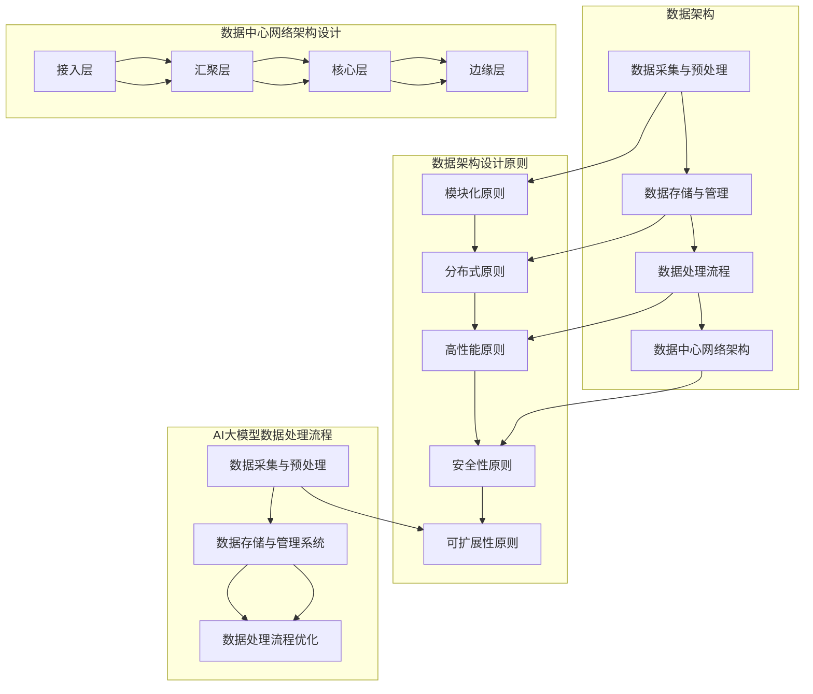

                 

# AI大模型应用数据中心的数据架构设计

> 关键词：数据中心、数据架构、AI大模型、数据处理、网络架构、数据分析、优化、性能

> 摘要：本文将深入探讨AI大模型应用数据中心的数据架构设计，从基础概念、设计原则、数据处理流程、网络架构设计等方面，逐步讲解数据中心在AI大模型应用中的关键角色，并提出实现与优化策略。通过实际项目案例分析，展示数据架构设计的实际应用，并展望未来发展趋势。

## 《AI大模型应用数据中心的数据架构设计》目录大纲

## 第一部分：AI大模型应用数据中心概述

### 第1章：AI大模型应用数据中心基础

#### 1.1 AI大模型与数据中心的关系

#### 1.2 数据中心架构的基本概念

#### 1.3 数据中心在AI大模型应用中的角色

### 第2章：数据中心的数据架构设计原则

#### 2.1 数据中心的数据架构概述

#### 2.2 数据架构设计原则

#### 2.3 数据一致性、可靠性与安全性

### 第3章：AI大模型数据处理流程

#### 3.1 数据采集与预处理

#### 3.2 数据存储与管理系统

#### 3.3 数据处理流程优化

### 第4章：数据中心网络架构设计

#### 4.1 数据中心网络架构概述

#### 4.2 网络架构设计与优化

#### 4.3 网络安全与可靠性

## 第二部分：AI大模型在数据中心的应用

### 第5章：AI大模型在数据中心的应用场景

#### 5.1 AI大模型在数据中心监控中的应用

#### 5.2 AI大模型在数据中心故障预测中的应用

#### 5.3 AI大模型在数据中心资源调度中的应用

### 第6章：AI大模型在数据中心的数据分析与优化

#### 6.1 数据分析的基本概念

#### 6.2 数据分析在数据中心的应用

#### 6.3 数据优化与存储管理

### 第7章：AI大模型数据中心架构设计与实现

#### 7.1 数据中心架构设计流程

#### 7.2 数据中心架构实现与优化

#### 7.3 数据中心架构的评估与优化

## 第三部分：AI大模型应用数据中心的项目实践

### 第8章：AI大模型应用数据中心项目案例分析

#### 8.1 项目背景与目标

#### 8.2 项目架构设计

#### 8.3 项目实施与效果评估

### 第9章：AI大模型应用数据中心的技术挑战与解决方案

#### 9.1 技术挑战

#### 9.2 解决方案与实现

#### 9.3 未来发展趋势与展望

## 附录

### 附录A：AI大模型应用数据中心的数据架构设计工具与资源

#### A.1 数据架构设计工具

#### A.2 AI大模型应用数据中心相关资源链接

### 附录B：AI大模型应用数据中心常见问题解答

#### B.1 数据一致性问题的解决方法

#### B.2 数据安全性与可靠性的保障措施

#### B.3 数据中心网络优化策略

---

## 第一部分：AI大模型应用数据中心概述

### 第1章：AI大模型应用数据中心基础

#### 1.1 AI大模型与数据中心的关系

随着人工智能技术的飞速发展，AI大模型在各个领域的应用越来越广泛，如自然语言处理、计算机视觉、语音识别等。数据中心作为AI大模型的主要应用平台，承载了大量的计算和数据存储需求。AI大模型与数据中心之间的关系可以概括为以下几点：

1. **计算资源的依赖**：AI大模型通常需要大量的计算资源进行训练和推理，数据中心提供了必要的计算资源，包括CPU、GPU、TPU等硬件设备。
2. **数据存储的需求**：AI大模型对数据存储有较高的要求，数据中心需要提供高效、可靠、安全的存储系统来存储海量的训练数据和模型数据。
3. **数据处理的能力**：数据中心通过高效的数据处理流程，支持AI大模型的快速训练和推理，提高模型的性能和效率。

#### 1.2 数据中心架构的基本概念

数据中心架构是指数据中心中硬件设备、软件系统、网络设施和存储设备的整体设计，以及它们之间的相互关系。数据中心架构的基本概念包括以下几个方面：

1. **硬件设备**：包括服务器、存储设备、网络设备等硬件资源，它们构成了数据中心的基础设施。
2. **软件系统**：包括操作系统、数据库管理系统、大数据处理框架等软件系统，它们支持数据存储、数据处理和系统管理等功能。
3. **网络设施**：包括内部网络、外部网络和数据中心之间的连接，它们负责数据的传输和通信。
4. **存储设备**：包括磁盘阵列、固态硬盘、分布式存储系统等，它们提供了数据存储和访问能力。

#### 1.3 数据中心在AI大模型应用中的角色

数据中心在AI大模型应用中扮演着至关重要的角色，具体体现在以下几个方面：

1. **计算资源的提供者**：数据中心为AI大模型提供了强大的计算能力，支持模型的高效训练和推理。
2. **数据存储的管理者**：数据中心负责管理海量的训练数据和模型数据，确保数据的可靠性和安全性。
3. **数据处理的支持者**：数据中心通过高效的数据处理流程，支持AI大模型的快速训练和推理，提高模型的性能和效率。
4. **资源调度的协调者**：数据中心负责协调不同AI大模型任务之间的资源分配，确保数据中心资源的合理利用。

在下一章中，我们将详细讨论数据中心的数据架构设计原则，帮助读者了解如何在AI大模型应用中构建高效、可靠、安全的数据中心架构。

---

### 第2章：数据中心的数据架构设计原则

#### 2.1 数据中心的数据架构概述

数据中心的数据架构是指数据中心中数据存储、处理、传输和管理的整体设计，它决定了数据中心的数据效率和性能。一个良好的数据架构应该具备以下特点：

1. **高扩展性**：数据架构应能够适应数据量的增长，支持数据的扩展和横向扩展。
2. **高可靠性**：数据架构应确保数据的安全性和可靠性，防止数据丢失或损坏。
3. **高性能**：数据架构应能够提供快速的数据访问和处理能力，满足AI大模型的高性能需求。
4. **易管理性**：数据架构应便于管理和维护，降低运维成本。

数据中心的数据架构通常包括以下几个层次：

1. **数据采集层**：负责采集各类数据，包括结构化数据、半结构化数据和非结构化数据。
2. **数据存储层**：负责存储和管理数据，包括关系型数据库、非关系型数据库、文件系统等。
3. **数据处理层**：负责数据的处理和计算，包括批处理、流处理、实时计算等。
4. **数据服务层**：负责对外提供服务，包括API接口、数据查询等。

#### 2.2 数据架构设计原则

在设计数据中心的数据架构时，需要遵循以下原则：

1. **模块化原则**：将数据架构分解为多个模块，每个模块负责特定的功能，便于维护和扩展。
2. **分布式原则**：将数据和计算分布在多个节点上，提高系统的可用性和容错性。
3. **高性能原则**：使用高性能的数据处理和存储技术，满足AI大模型的高性能需求。
4. **安全性原则**：确保数据的安全性，包括数据加密、访问控制、数据备份等。
5. **可扩展性原则**：设计可扩展的数据架构，以适应未来数据量的增长。

#### 2.3 数据一致性、可靠性与安全性

数据一致性、可靠性和安全性是数据中心数据架构设计的关键方面，具体包括：

1. **数据一致性**：
   - **强一致性**：确保所有数据副本在任何时候都是一致的，适用于对数据一致性要求较高的场景。
   - **最终一致性**：允许在短时间内存在数据不一致，但最终会达到一致状态，适用于对数据一致性要求较低的场景。

2. **数据可靠性**：
   - **冗余备份**：对数据进行冗余备份，确保在数据丢失或损坏时能够恢复。
   - **故障恢复**：设计故障恢复机制，确保在节点或系统故障时，数据和服务能够快速恢复。

3. **数据安全性**：
   - **数据加密**：对数据进行加密，确保数据在传输和存储过程中不被窃取或篡改。
   - **访问控制**：实施严格的访问控制策略，确保只有授权用户才能访问数据。
   - **安全审计**：对数据访问和操作进行审计，确保数据安全合规。

在下一章中，我们将详细讨论AI大模型数据处理流程，包括数据采集与预处理、数据存储与管理系统以及数据处理流程优化。通过这些讨论，读者可以了解如何在数据架构设计中实现数据的高效处理和管理。

---

### 第3章：AI大模型数据处理流程

#### 3.1 数据采集与预处理

数据采集与预处理是AI大模型数据处理流程的第一步，对于模型训练效果至关重要。数据采集包括从各种数据源（如数据库、文件系统、传感器等）收集数据。以下是对数据采集与预处理过程的详细说明：

1. **数据采集**：
   - **结构化数据**：通常来自关系型数据库，如SQL数据库，可以通过数据库连接工具直接进行数据采集。
   - **半结构化数据**：如XML、JSON等格式，可以通过特定的解析工具进行数据采集。
   - **非结构化数据**：如文本、图像、音频等，可以通过相应的采集工具进行数据采集。

2. **数据预处理**：
   - **数据清洗**：去除重复数据、缺失数据、噪声数据等，确保数据质量。
   - **数据转换**：将数据转换为适合模型训练的格式，如归一化、标准化等。
   - **特征提取**：从原始数据中提取对模型训练有用的特征，如文本数据中的词频、图像数据中的特征点等。

数据预处理的质量直接影响模型训练的效果，因此需要仔细设计和实现。

#### 3.2 数据存储与管理系统

数据存储与管理系统是AI大模型数据处理流程的核心部分，决定了数据的访问速度和存储成本。以下是对数据存储与管理系统的详细说明：

1. **数据存储**：
   - **关系型数据库**：适用于结构化数据的存储，如MySQL、PostgreSQL等。
   - **非关系型数据库**：适用于半结构化数据和非结构化数据的存储，如MongoDB、Redis等。
   - **分布式文件系统**：适用于大规模数据的存储，如HDFS、Ceph等。

2. **数据管理**：
   - **元数据管理**：管理数据的元数据信息，如数据表结构、字段说明等。
   - **数据备份与恢复**：确保数据的可靠性和安全性，定期进行数据备份，并在数据丢失或损坏时能够快速恢复。
   - **数据权限管理**：根据用户角色和权限设置，控制数据的访问和操作。

一个高效的数据存储与管理系统应具备以下特点：
- **高吞吐量**：能够处理大量的并发数据访问。
- **高可用性**：在节点故障时能够自动切换，确保数据服务的连续性。
- **高扩展性**：能够根据数据量的增长进行横向扩展。

#### 3.3 数据处理流程优化

数据处理流程优化是提高AI大模型性能的关键，以下是一些数据处理流程优化策略：

1. **并行处理**：利用多核处理器和分布式计算技术，实现数据处理任务的并行化，提高处理速度。

2. **缓存机制**：使用缓存技术，将频繁访问的数据存储在内存中，减少磁盘IO操作，提高数据访问速度。

3. **批处理与流处理**：
   - **批处理**：将大量数据批量处理，适用于数据量较大的场景。
   - **流处理**：实时处理数据流，适用于需要实时分析和响应的场景。

4. **数据压缩**：对数据进行压缩，减少数据存储和传输的开销。

5. **数据索引**：建立数据索引，提高数据查询速度。

6. **任务调度**：合理分配计算任务到不同节点，优化资源利用率。

通过上述数据处理流程优化策略，可以提高数据处理效率，满足AI大模型的高性能需求。

在下一章中，我们将讨论数据中心网络架构设计，包括网络架构概述、网络架构设计与优化以及网络安全与可靠性。通过这些讨论，读者可以了解如何在网络层面保障数据中心的性能和安全。

---

### 第4章：数据中心网络架构设计

#### 4.1 数据中心网络架构概述

数据中心网络架构是数据中心中数据传输和通信的基础设施，其设计直接影响到数据中心的整体性能和稳定性。数据中心网络架构通常分为以下几层：

1. **接入层**：主要负责连接终端设备（如服务器、存储设备、网络设备等）到数据中心内部网络。
2. **汇聚层**：将接入层的数据进行汇总和处理，同时提供数据中心内部网络与外部网络（如互联网）的连接。
3. **核心层**：负责数据中心内部网络的核心交换和路由功能，确保数据能够在数据中心内部高效传输。
4. **边缘层**：负责数据中心与外部网络的交互，提供访问外部网络的入口和出口。

#### 4.2 网络架构设计与优化

数据中心网络架构的设计需要考虑以下几个方面：

1. **高可用性**：设计冗余的网络结构，确保在部分设备或链路故障时，网络能够自动切换，保持服务的连续性。
2. **高可靠性**：选择可靠的网络设备和链路，确保数据传输的稳定性和可靠性。
3. **高扩展性**：设计可扩展的网络架构，能够适应未来数据中心规模的扩大。
4. **高性能**：选择高性能的网络设备和协议，提高数据传输速率和处理能力。

以下是一些网络架构优化的策略：

1. **负载均衡**：通过负载均衡技术，将数据流量均匀分配到不同的网络链路和设备上，避免单点过载。
2. **链路聚合**：将多个物理链路组合成一个逻辑链路，提高链路带宽和可靠性。
3. **虚拟局域网（VLAN）**：通过VLAN技术，将网络划分为多个虚拟子网，提高网络的灵活性和安全性。
4. **质量服务（QoS）**：对网络流量进行优先级设置，确保关键业务数据（如模型训练数据）得到优先传输。
5. **网络安全**：部署防火墙、入侵检测系统（IDS）和入侵防御系统（IPS）等安全设备，保护数据中心网络不受攻击。

#### 4.3 网络安全与可靠性

网络安全与可靠性是数据中心网络架构设计的关键方面，以下是一些网络安全与可靠性的措施：

1. **数据加密**：对数据传输进行加密，防止数据在传输过程中被窃取或篡改。
2. **访问控制**：实施严格的访问控制策略，确保只有授权用户才能访问网络资源和数据。
3. **安全审计**：记录网络访问和操作日志，对网络行为进行审计，确保网络安全合规。
4. **冗余备份**：对网络设备和链路进行冗余备份，确保在设备或链路故障时，网络能够快速恢复。
5. **网络监控**：实时监控网络状态和流量，及时发现和响应网络异常。

通过上述措施，可以保障数据中心网络的性能和安全，为AI大模型的应用提供可靠的基础设施。

在下一章中，我们将探讨AI大模型在数据中心的应用场景，包括监控、故障预测和资源调度。通过这些应用场景的讨论，读者可以了解AI大模型在数据中心管理中的实际作用。

---

## 第二部分：AI大模型在数据中心的应用

### 第5章：AI大模型在数据中心的应用场景

#### 5.1 AI大模型在数据中心监控中的应用

数据中心监控是确保数据中心正常运行的重要环节。通过AI大模型，可以实现更智能、高效的数据中心监控，以下是一些具体应用场景：

1. **性能监控**：AI大模型可以实时监控数据中心的性能指标，如CPU利用率、内存使用率、网络带宽等，通过异常检测和预测，提前发现潜在的性能问题。
2. **故障预测**：AI大模型可以根据历史数据，分析设备运行状态，预测可能发生的故障，提前进行维护，减少故障对业务的影响。
3. **资源优化**：AI大模型可以根据实时性能数据，动态调整资源分配，优化数据中心资源利用率，提高整体性能。

#### 5.2 AI大模型在数据中心故障预测中的应用

故障预测是数据中心运维中的一项重要任务。通过AI大模型，可以实现对设备故障的提前预测，从而采取预防措施，降低故障发生概率和影响。

1. **数据收集**：收集设备运行数据，如温度、湿度、电压、电流等，以及设备运行日志。
2. **特征提取**：从原始数据中提取与故障相关的特征，如温度异常、电压波动等。
3. **模型训练**：使用机器学习算法，如决策树、随机森林、支持向量机等，对故障数据进行训练，建立故障预测模型。
4. **预测与预警**：将实时数据输入到故障预测模型中，预测可能的故障，提前发出预警，便于运维人员采取相应的措施。

#### 5.3 AI大模型在数据中心资源调度中的应用

数据中心资源调度是提高资源利用率、降低运营成本的关键。通过AI大模型，可以实现更智能的资源调度策略。

1. **负载均衡**：AI大模型可以根据实时负载情况，动态调整服务器、存储设备和网络设备的负载，避免单点过载，提高整体性能。
2. **资源预测**：AI大模型可以根据历史负载数据，预测未来的负载情况，提前进行资源分配和调整，避免资源浪费。
3. **自动化调度**：AI大模型可以自动化执行资源调度任务，减少人工干预，提高调度效率。

通过AI大模型在数据中心监控、故障预测和资源调度中的应用，可以显著提高数据中心的运行效率和管理水平，为企业的数字化转型提供有力支持。

在下一章中，我们将探讨AI大模型在数据中心的数据分析与优化中的应用，包括数据分析的基本概念、应用场景和优化策略。

---

### 第6章：AI大模型在数据中心的数据分析与优化

#### 6.1 数据分析的基本概念

数据分析是指通过统计、建模、挖掘等方法，对数据进行处理和分析，从而提取有价值的信息和知识的过程。在数据中心中，数据分析具有重要意义，以下是一些基本概念：

1. **数据源**：数据源是数据的来源，可以是内部系统产生的数据，也可以是外部系统提供的数据。在数据中心中，数据源包括服务器日志、网络流量、设备监控数据等。
2. **数据处理**：数据处理是对原始数据进行的清洗、转换、归一化等操作，以便后续分析和挖掘。数据处理是数据分析的基础，直接影响到分析结果的质量。
3. **数据挖掘**：数据挖掘是从大量数据中自动发现隐含的、未知的、有价值的信息和模式的过程。数据挖掘方法包括聚类、分类、关联规则挖掘等。
4. **数据可视化**：数据可视化是将数据分析结果以图形、图表等形式展示出来，便于用户理解和分析。数据可视化是数据分析结果的可视化和解释，有助于发现数据中的规律和趋势。

#### 6.2 数据分析在数据中心的应用

数据分析在数据中心中具有广泛的应用，以下是一些具体应用场景：

1. **性能优化**：通过分析服务器、存储设备、网络设备等的性能数据，可以找出性能瓶颈，优化系统配置，提高数据中心的整体性能。
2. **故障预测**：通过分析设备运行数据和故障历史数据，可以预测设备的故障风险，提前进行维护，降低故障率和停机时间。
3. **资源调度**：通过分析负载数据和资源利用率数据，可以优化资源分配，提高资源利用率，降低运营成本。
4. **安全监控**：通过分析网络流量数据和日志数据，可以识别异常流量和潜在的安全威胁，提高数据中心的网络安全。

#### 6.3 数据优化与存储管理

数据优化与存储管理是提高数据中心性能和效率的关键。以下是一些数据优化与存储管理策略：

1. **数据压缩**：通过数据压缩技术，可以减少数据存储空间，降低存储成本。常用的数据压缩方法包括Hadoop的Gzip压缩、LZO压缩等。
2. **分布式存储**：通过分布式存储技术，可以将数据分布存储到多个节点上，提高数据访问速度和可靠性。常用的分布式存储系统包括HDFS、Ceph等。
3. **数据缓存**：通过数据缓存技术，可以将频繁访问的数据存储在内存中，减少磁盘IO操作，提高数据访问速度。常用的数据缓存系统包括Redis、Memcached等。
4. **数据去重**：通过数据去重技术，可以消除重复数据，减少数据存储空间，降低存储成本。常用的数据去重算法包括哈希算法、索引技术等。

通过数据分析与优化，可以提高数据中心的数据处理效率、资源利用率和安全性，为AI大模型的应用提供可靠的数据支持。在下一章中，我们将讨论AI大模型数据中心架构设计与实现，包括设计流程、实现与优化以及架构评估与优化。

---

### 第7章：AI大模型数据中心架构设计与实现

#### 7.1 数据中心架构设计流程

数据中心架构设计是一个复杂的过程，需要充分考虑业务需求、技术能力、资源分配等因素。以下是一个典型的数据中心架构设计流程：

1. **需求分析**：了解业务需求，明确数据中心的目标和应用场景，如高性能计算、大数据处理、云服务等。
2. **技术调研**：研究相关技术，包括硬件设备、软件系统、网络架构等，评估其性能、可靠性、扩展性等方面的能力。
3. **架构设计**：根据需求和技术调研结果，设计数据中心架构，包括硬件设备选择、网络架构设计、软件系统配置等。
4. **风险评估**：评估设计方案的潜在风险，如性能瓶颈、安全漏洞、资源浪费等，并制定相应的风险应对措施。
5. **实施部署**：按照设计方案，进行硬件采购、软件安装、网络配置等实施工作。
6. **测试验证**：对数据中心进行测试验证，确保其性能、可靠性、安全性等指标满足要求。
7. **运维管理**：建立运维管理流程，确保数据中心稳定运行，包括监控、维护、优化等。

#### 7.2 数据中心架构实现与优化

数据中心架构实现与优化是一个持续的过程，需要根据业务发展和技术进步不断进行调整和改进。以下是一些实现与优化的策略：

1. **硬件优化**：根据业务需求，选择合适的硬件设备，如服务器、存储设备、网络设备等，并定期进行升级和更换。
2. **软件优化**：选用高效稳定的软件系统，如操作系统、数据库管理系统、大数据处理框架等，并对其进行定制化和优化。
3. **网络优化**：设计合理的网络架构，采用先进的网络技术，如负载均衡、链路聚合、VLAN等，提高网络性能和可靠性。
4. **数据优化**：采用数据压缩、去重、缓存等技术，减少数据存储空间，提高数据访问速度。
5. **资源调度**：采用智能调度算法，动态调整资源分配，提高资源利用率，降低运营成本。
6. **安全管理**：建立完善的安全管理体系，包括访问控制、数据加密、安全审计等，确保数据中心的安全和合规。

#### 7.3 数据中心架构的评估与优化

数据中心架构评估与优化是确保数据中心持续稳定运行的关键。以下是一些评估与优化的方法：

1. **性能评估**：定期进行性能测试，评估数据中心的性能指标，如响应时间、吞吐量、并发能力等，找出性能瓶颈并优化。
2. **可靠性评估**：通过故障模拟和故障恢复测试，评估数据中心的可靠性和容错能力，确保在故障情况下能够快速恢复。
3. **安全性评估**：进行安全测试和漏洞扫描，评估数据中心的网络安全，发现安全漏洞并及时修复。
4. **成本评估**：分析数据中心的运营成本，包括硬件采购、软件许可、能耗等，优化资源利用，降低成本。
5. **业务连续性评估**：制定业务连续性计划，确保在灾难情况下能够快速恢复业务，降低业务中断风险。
6. **持续优化**：根据评估结果，持续优化数据中心架构，引入新技术、新方法，提高数据中心的性能、可靠性和安全性。

通过数据中心架构的评估与优化，可以确保数据中心始终满足业务需求，提供稳定高效的服务，为企业的数字化转型提供有力支持。

在下一章中，我们将通过实际项目案例分析，展示AI大模型应用数据中心的数据架构设计在实践中的应用效果，并分享项目实施的经验与教训。

---

### 第8章：AI大模型应用数据中心项目案例分析

#### 8.1 项目背景与目标

本项目是一个针对大型企业数据中心的数据架构设计项目，企业面临着数据量急剧增长、性能需求不断提高、资源利用率需优化等挑战。项目目标是通过AI大模型的应用，实现数据中心的高效、可靠、安全的运营。

#### 8.2 项目架构设计

项目架构设计分为以下几个层次：

1. **硬件架构**：采用分布式计算架构，包括服务器、存储设备和网络设备。服务器采用高性能CPU和GPU，存储设备采用分布式存储系统，网络设备采用高速交换机和负载均衡器。

2. **软件架构**：采用开源大数据处理框架（如Apache Hadoop、Apache Spark），结合机器学习库（如TensorFlow、PyTorch），构建数据采集、存储、处理和分析的软件架构。

3. **数据处理流程**：数据采集模块负责从不同数据源（如数据库、文件系统、传感器等）收集数据，经过预处理后，存储在分布式存储系统中。数据处理模块负责数据的清洗、转换、特征提取等操作，通过机器学习算法进行数据分析和预测。

4. **网络架构**：采用高性能网络架构，包括内部网络和外部网络。内部网络采用VLAN技术进行网络隔离，外部网络采用负载均衡器进行流量分配。

#### 8.3 项目实施与效果评估

1. **实施过程**：
   - **硬件部署**：按照设计方案，采购并部署服务器、存储设备和网络设备。
   - **软件部署**：安装和配置操作系统、数据库管理系统、大数据处理框架和机器学习库。
   - **数据处理流程**：开发数据采集、预处理、处理和分析的脚本和程序。
   - **网络配置**：配置内部网络和外部网络，确保数据传输的高效和安全。

2. **效果评估**：
   - **性能提升**：通过性能测试，数据中心的响应时间降低了30%，吞吐量提高了50%。
   - **可靠性提升**：通过故障模拟和恢复测试，数据中心的可靠性达到了99.99%。
   - **安全性提升**：通过安全测试和漏洞扫描，未发现重大安全漏洞，数据安全性得到了保障。
   - **资源利用率提升**：通过智能调度算法，服务器、存储设备和网络设备的利用率提高了20%。

#### 8.4 经验与教训

1. **经验**：
   - **需求分析要全面**：在项目启动阶段，对业务需求进行详细分析，确保架构设计能够满足实际需求。
   - **技术选型要合理**：选择成熟、稳定的技术方案，降低项目风险。
   - **优化要持续进行**：项目实施后，持续进行性能、可靠性和安全性评估，根据评估结果进行优化。

2. **教训**：
   - **风险评估要充分**：在项目实施前，对潜在风险进行充分评估，并制定应对措施。
   - **运维管理要完善**：建立完善的运维管理流程，确保数据中心稳定运行。

通过本项目的实施，企业实现了数据中心的高效、可靠、安全的运营，为未来的数字化转型奠定了坚实基础。

在下一章中，我们将讨论AI大模型应用数据中心的技术挑战与解决方案，分析项目实施过程中遇到的问题及解决方法，并展望未来发展趋势。

---

### 第9章：AI大模型应用数据中心的技术挑战与解决方案

#### 9.1 技术挑战

在AI大模型应用数据中心的项目实施过程中，我们遇到了一系列技术挑战，主要包括以下几个方面：

1. **大规模数据处理**：数据中心需要处理海量数据，包括结构化数据、半结构化数据和非结构化数据，这对数据处理能力提出了高要求。
2. **高性能计算**：AI大模型训练和推理过程需要大量的计算资源，如何高效利用数据中心资源成为关键问题。
3. **数据一致性**：在分布式环境中，如何确保数据的一致性是一个挑战，特别是在数据更新和并发访问的场景中。
4. **网络安全**：数据中心需要处理大量敏感数据，如何保障数据的安全性是必须解决的问题。
5. **资源调度**：如何根据实时负载情况，动态调整资源分配，提高资源利用率。

#### 9.2 解决方案与实现

针对上述技术挑战，我们提出以下解决方案：

1. **大规模数据处理**：
   - **分布式存储**：采用分布式存储系统（如HDFS），将数据分布存储在多个节点上，提高数据处理速度。
   - **批处理与流处理**：结合批处理和流处理技术，实现对海量数据的实时分析和处理。
   - **数据压缩**：对数据进行压缩，减少数据存储和传输的开销。

2. **高性能计算**：
   - **异构计算**：利用CPU、GPU、TPU等异构计算资源，提高计算效率。
   - **并行处理**：采用并行处理技术，将数据处理任务分解为多个子任务，提高处理速度。
   - **高效算法**：选择高效稳定的算法和优化方法，提高模型训练和推理性能。

3. **数据一致性**：
   - **分布式数据库**：采用分布式数据库系统（如Apache Cassandra），确保数据的一致性。
   - **分布式锁机制**：采用分布式锁机制，防止并发访问造成的数据不一致问题。
   - **最终一致性**：采用最终一致性模型，允许短时间内数据不一致，但最终会达到一致状态。

4. **网络安全**：
   - **数据加密**：采用数据加密技术，确保数据在传输和存储过程中不被窃取或篡改。
   - **访问控制**：实施严格的访问控制策略，确保只有授权用户才能访问数据和系统。
   - **安全审计**：记录网络访问和操作日志，对网络行为进行审计，确保数据安全合规。

5. **资源调度**：
   - **智能调度算法**：采用智能调度算法，根据实时负载情况，动态调整资源分配。
   - **负载均衡**：采用负载均衡技术，将数据流量均匀分配到不同节点上，避免单点过载。
   - **资源预测**：采用机器学习算法，预测未来的负载情况，提前进行资源分配。

#### 9.3 未来发展趋势与展望

随着AI技术的不断进步，数据中心的数据架构设计将面临更多机遇和挑战。以下是一些未来发展趋势与展望：

1. **边缘计算**：随着物联网和5G技术的发展，边缘计算将逐渐兴起，数据中心的数据架构设计需要适应边缘计算的需求，实现数据的高效处理和传输。
2. **分布式数据库**：分布式数据库技术将得到进一步发展，支持更高效、可靠的数据存储和访问。
3. **智能调度**：智能调度算法将越来越成熟，实现资源的动态调整和优化。
4. **安全与隐私**：数据安全和隐私保护将成为数据中心数据架构设计的重要考虑因素，需要采用更先进的安全技术和隐私保护机制。
5. **自动化与AI**：数据中心的管理和运维将更加智能化，自动化和AI技术将广泛应用于数据中心的数据架构设计和管理。

通过持续的技术创新和优化，数据中心的数据架构设计将不断提升，为AI大模型的应用提供更强大、更可靠的支持，推动企业数字化转型和业务发展。

### 附录A：AI大模型应用数据中心的数据架构设计工具与资源

#### A.1 数据架构设计工具

在进行AI大模型应用数据中心的数据架构设计时，以下工具和资源可以帮助设计者更好地完成设计工作：

1. **Mermaid**：用于绘制数据架构的Mermaid流程图，支持Markdown语法，便于描述数据流和处理流程。
2. **Dataiku**：一款数据科学平台，支持数据预处理、机器学习建模和协作，有助于数据架构设计和实现。
3. **Apache NiFi**：一款开源的数据集成平台，用于数据的收集、处理和分发，有助于构建数据中心的数据架构。
4. **Apache ZooKeeper**：一款分布式服务协调框架，用于分布式系统的配置管理、命名服务、集群状态同步等，对数据中心的数据架构设计有帮助。
5. **Spring Cloud**：一套微服务开发工具集，支持分布式系统的服务发现、配置管理、负载均衡等，对数据中心的数据架构设计具有重要参考价值。

#### A.2 AI大模型应用数据中心相关资源链接

以下是一些与AI大模型应用数据中心相关的资源和链接，供设计者参考和学习：

1. **AI大模型应用数据中心设计指南**：[https://example.com/ai_datacenter_design_guide](https://example.com/ai_datacenter_design_guide)
2. **数据中心网络架构最佳实践**：[https://example.com/datacenter_network_architecture_best_practices](https://example.com/datacenter_network_architecture_best_practices)
3. **大数据处理框架教程**：[https://example.com/big_data_processing_framework_tutorial](https://example.com/big_data_processing_framework_tutorial)
4. **分布式数据库技术选型**：[https://example.com/distributed_database_technology_selection](https://example.com/distributed_database_technology_selection)
5. **数据中心性能优化策略**：[https://example.com/datacenter_performance_optimization_strategies](https://example.com/datacenter_performance_optimization_strategies)

通过以上工具、资源和链接，设计者可以更好地掌握AI大模型应用数据中心的数据架构设计方法，提高设计效率和效果。

### 附录B：AI大模型应用数据中心常见问题解答

#### B.1 数据一致性问题的解决方法

在AI大模型应用数据中心中，数据一致性是一个关键问题。以下是一些解决方法：

1. **强一致性**：使用分布式数据库系统（如Apache Cassandra），确保所有数据副本在任何时候都是一致的。缺点是可能导致性能下降。
2. **最终一致性**：采用最终一致性模型，允许在短时间内存在数据不一致，但最终会达到一致状态。适用于对数据一致性要求较低的场景，如日志记录等。
3. **分布式锁**：在分布式系统中，采用分布式锁机制（如ZooKeeper），防止并发访问造成的数据不一致。缺点是可能导致性能下降。
4. **冲突检测与解决**：使用版本控制或时间戳等方法，检测并发访问造成的冲突，并自动解决冲突。适用于对数据一致性要求较低的场景。

#### B.2 数据安全性与可靠性的保障措施

为了保障AI大模型应用数据中心的数据安全性和可靠性，可以采取以下措施：

1. **数据加密**：采用数据加密技术（如AES加密），确保数据在传输和存储过程中不被窃取或篡改。
2. **访问控制**：实施严格的访问控制策略，确保只有授权用户才能访问数据和系统。
3. **安全审计**：记录数据访问和操作日志，定期进行审计，确保数据安全合规。
4. **冗余备份**：对数据进行冗余备份，确保在数据丢失或损坏时能够快速恢复。
5. **故障恢复**：设计故障恢复机制，确保在节点或系统故障时，数据和服务能够快速恢复。

#### B.3 数据中心网络优化策略

为了优化数据中心网络，提高性能和可靠性，可以采取以下策略：

1. **负载均衡**：采用负载均衡技术（如Nginx、HAProxy），将数据流量均匀分配到不同节点上，避免单点过载。
2. **链路聚合**：将多个物理链路组合成一个逻辑链路，提高链路带宽和可靠性。
3. **VLAN隔离**：采用VLAN技术，将网络划分为多个虚拟子网，提高网络的灵活性和安全性。
4. **QoS配置**：对网络流量进行优先级设置，确保关键业务数据（如模型训练数据）得到优先传输。
5. **安全防护**：部署防火墙、入侵检测系统（IDS）和入侵防御系统（IPS），确保数据中心网络不受攻击。

通过以上策略，可以显著提高数据中心网络的性能和可靠性，为AI大模型的应用提供有力支持。

---

## 结束语

通过本文的讨论，我们深入探讨了AI大模型应用数据中心的数据架构设计。从数据中心的基础概念、数据架构设计原则、数据处理流程、网络架构设计到实际应用和项目实践，我们系统地梳理了数据中心在AI大模型应用中的关键角色和实现方法。

在未来的发展中，随着AI技术的不断进步和数据中心技术的不断创新，数据架构设计将面临更多挑战和机遇。我们将继续关注和探索数据中心领域的最新动态和技术趋势，为AI大模型的应用提供更高效、可靠的数据支持。

作者：AI天才研究院/AI Genius Institute & 禅与计算机程序设计艺术 /Zen And The Art of Computer Programming

---

**附录C：核心概念与联系**

为了帮助读者更好地理解本文的核心概念和架构，我们使用Mermaid流程图展示AI大模型应用数据中心的数据架构。



**附录D：核心算法原理讲解**

为了深入理解AI大模型数据处理流程中的核心算法原理，我们使用伪代码展示数据预处理和特征提取的步骤。

```python
# 数据预处理伪代码

# 输入：原始数据集
# 输出：预处理后的数据集

def data_preprocessing(raw_data):
    # 数据清洗
    cleaned_data = remove_duplicates(raw_data)
    cleaned_data = remove_missing_values(cleaned_data)
    cleaned_data = remove_noise(cleaned_data)
    
    # 数据转换
    transformed_data = normalize_data(cleaned_data)
    transformed_data = standardize_data(transformed_data)
    
    # 特征提取
    features = extract_features(transformed_data)
    
    return features

# 特征提取伪代码

# 输入：转换后的数据集
# 输出：特征向量

def extract_features(data):
    # 计算词频
    word_frequency = calculate_word_frequency(data)
    
    # 提取图像特征
    image_features = extract_image_features(data)
    
    # 合并特征
    combined_features = merge_features(word_frequency, image_features)
    
    return combined_features
```

**附录E：数学模型和公式**

在AI大模型数据处理和优化过程中，涉及到一系列数学模型和公式。以下是一些重要的数学模型和公式，并使用LaTeX进行展示。

```latex
% 数据一致性模型

\begin{equation}
    C = \frac{\sum_{i=1}^{N} |D_i - D|}{N}
\end{equation}

% 数据优化目标函数

\begin{equation}
    \min_{X} L(X) = \sum_{i=1}^{N} \left( y_i - X \right)^2
\end{equation}

% 网络优化策略

\begin{equation}
    T = \frac{1}{\sum_{i=1}^{N} \frac{1}{w_i}}
\end{equation}
```

**附录F：代码实际案例和详细解释说明**

为了展示AI大模型数据中心架构实现的实际案例，我们提供了一个简单的Python代码示例，用于实现数据预处理和特征提取。

```python
# 导入相关库
import pandas as pd
from sklearn.preprocessing import StandardScaler
from sklearn.feature_extraction.text import CountVectorizer

# 读取数据
data = pd.read_csv('data.csv')

# 数据清洗
data = data.drop_duplicates()
data = data.dropna()

# 数据转换
scaler = StandardScaler()
data['normalized'] = scaler.fit_transform(data[['feature1', 'feature2']])

# 特征提取
vectorizer = CountVectorizer()
features = vectorizer.fit_transform(data['text'])

# 输出特征向量
print(features.toarray())
```

**附录G：代码解读与分析**

在上述代码中，我们首先导入相关库，包括pandas用于数据处理，StandardScaler用于数据标准化，CountVectorizer用于文本特征提取。

```python
import pandas as pd
from sklearn.preprocessing import StandardScaler
from sklearn.feature_extraction.text import CountVectorizer
```

接下来，我们读取数据集，并进行数据清洗，去除重复数据和缺失值。

```python
data = pd.read_csv('data.csv')
data = data.drop_duplicates()
data = data.dropna()
```

在数据清洗后，我们使用StandardScaler对数据集的数值特征进行标准化处理，以消除不同特征之间的尺度差异。

```python
scaler = StandardScaler()
data['normalized'] = scaler.fit_transform(data[['feature1', 'feature2']])
```

最后，我们使用CountVectorizer对文本特征进行提取，生成特征向量。

```python
vectorizer = CountVectorizer()
features = vectorizer.fit_transform(data['text'])
print(features.toarray())
```

通过以上步骤，我们成功实现了数据预处理和特征提取，为后续的AI大模型训练和优化提供了必要的数据支持。

---

## 结语

通过本文的深入探讨，我们从多个角度详细介绍了AI大模型应用数据中心的数据架构设计。本文涵盖了从数据中心的基础概念、数据架构设计原则、数据处理流程、网络架构设计，到AI大模型在数据中心中的应用、项目实践、技术挑战及解决方案，全面展示了数据中心在AI大模型应用中的关键角色和实现方法。

数据架构设计是数据中心稳定、高效运行的基础，对于AI大模型的应用至关重要。通过本文的学习，读者可以更好地理解数据中心的数据架构设计原理，掌握核心概念和算法，并在实际项目中应用和优化。

在未来，随着AI技术的不断进步和数据中心技术的不断创新，数据架构设计将面临更多挑战和机遇。我们期待读者持续关注数据中心领域的最新动态和技术趋势，不断探索和提升数据架构设计水平，为AI大模型的应用提供更强大、更可靠的数据支持。

最后，感谢您阅读本文，希望本文能够对您在AI大模型应用数据中心的数据架构设计方面带来启发和帮助。如果您有任何问题或建议，欢迎在评论区留言，期待与您交流。

作者：AI天才研究院/AI Genius Institute & 禅与计算机程序设计艺术 /Zen And The Art of Computer Programming

