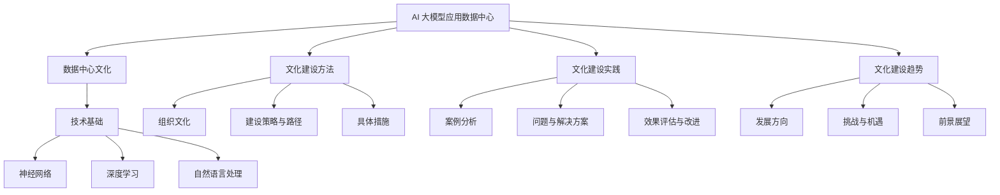

                 

## 《AI 大模型应用数据中心的文化建设》

### 关键词：
- AI 大模型
- 数据中心
- 文化建设
- 技术基础
- 实践案例
- 趋势展望

> 摘要：
本文从 AI 大模型应用数据中心的背景出发，探讨了数据中心文化建设的重要性和方法。首先，阐述了 AI 大模型在数据中心中的技术基础和核心算法原理，接着详细分析了数据中心文化建设的策略与路径、实践案例以及未来发展趋势。通过本文的阅读，读者可以全面了解数据中心文化建设的关键要素，为数据中心的高效运营和可持续发展提供理论支持和实践指导。

---

### 《AI 大模型应用数据中心的文化建设》目录大纲

1. **AI 大模型应用数据中心概述**
   1.1. **数据中心在 AI 大模型应用中的重要性**
   1.2. **数据中心的文化建设目标**
   1.3. **数据中心的文化建设现状与挑战**

2. **AI 大模型技术基础**
   2.1. **AI 大模型的基本概念**
   2.2. **AI 大模型的架构与技术原理**
   2.3. **AI 大模型的关键算法与数学模型**

3. **数据中心文化建设方法**
   3.1. **组织文化与数据中心文化**
   3.2. **数据中心文化建设的策略与路径**
   3.3. **数据中心文化建设的具体措施**

4. **数据中心文化建设实践**
   4.1. **优秀数据中心文化建设案例**
   4.2. **数据中心文化建设中的常见问题与解决方案**
   4.3. **数据中心文化建设的效果评估与持续改进**

5. **AI 大模型应用数据中心的文化建设趋势**
   5.1. **数据中心文化建设的发展方向**
   5.2. **数据中心文化建设面临的挑战与机遇**
   5.3. **未来数据中心文化建设的前景展望**

6. **附录**
   6.1. **常用术语解释**
   6.2. **参考文献**
   6.3. **相关工具与资源**

**核心概念与联系：**

- **AI 大模型应用数据中心：** 是指将 AI 大模型应用于数据中心的管理与运营，实现智能化、自动化和高效化的数据中心管理。
- **文化建设：** 是指在数据中心中建立并强化一种积极向上、创新进取、协作共赢的企业文化。

**核心算法原理讲解：**

- **AI 大模型的关键算法：** 包括神经网络、深度学习、自然语言处理等，通过这些算法实现对数据的建模与分析。
- **数据中心文化建设的策略与路径：** 通过制定明确的文化建设目标，采用系统化的方法和路径，逐步推进文化建设工作。

**数学模型和数学公式 & 详细讲解 & 举例说明：**

- **数据中心性能评估模型：** 利用数学公式和算法对数据中心的性能进行评估，如平均响应时间、吞吐量等。
- **文化建设效果评估模型：** 通过构建绩效指标体系，运用统计学方法对文化建设效果进行量化评估。

**项目实战：**

- **数据中心文化建设项目：** 介绍一个具体的 AI 大模型应用数据中心的文化建设项目，包括项目目标、实施步骤、关键技术和效果评估等内容。

**代码实际案例和详细解释说明：**

- **数据中心自动化运维平台：** 介绍如何使用 AI 大模型技术构建一个自动化运维平台，实现数据中心的高效运维。
- **数据中心文化建设效果评估系统：** 介绍如何构建一个基于 AI 大模型的效果评估系统，对文化建设效果进行实时监测和评估。

**开发环境搭建，源代码详细实现和代码解读，代码解读与分析：**

- **开发环境搭建：** 提供详细的开发环境配置教程，包括硬件需求、软件安装、环境配置等。
- **源代码详细实现和代码解读：** 对关键代码进行详细解读，分析其实现原理和关键点。
- **代码解读与分析：** 对项目代码进行系统分析，总结其优点、不足和改进方向。

---

**核心概念与联系 Mermaid 流程图：**

---

**附录：**

- **常用术语解释：** 对本书中涉及的关键术语进行解释，便于读者理解。
- **参考文献：** 列出本书引用的相关文献和参考资料，便于读者查阅。
- **相关工具与资源：** 介绍与本书相关的工具和资源，包括开源框架、在线课程、技术社区等。

---

**作者：**

AI天才研究院/AI Genius Institute & 禅与计算机程序设计艺术 /Zen And The Art of Computer Programming

---

现在我们已经完成了文章的标题、关键词、摘要和目录大纲的撰写，接下来我们将逐步深入探讨每个部分的内容。让我们开始第一部分的撰写：**AI 大模型应用数据中心概述**。

---

### 第一部分：AI 大模型应用数据中心概述

#### 1.1 数据中心在 AI 大模型应用中的重要性

数据中心是现代信息技术的基础设施之一，它为各类应用提供了稳定、高效的数据存储和处理能力。随着人工智能（AI）技术的快速发展，特别是大模型（Large Models）的广泛应用，数据中心的作用变得越来越重要。AI 大模型，如深度学习模型、自然语言处理模型等，需要大量的计算资源和存储资源来训练和部署。数据中心提供了这些资源，使得 AI 大模型的应用成为可能。

首先，数据中心为 AI 大模型提供了计算能力。数据中心通常包含高性能计算节点，这些节点能够并行处理大量的计算任务，为 AI 大模型的训练和推理提供支持。随着 AI 技术的进步，数据中心需要不断提升计算能力，以适应日益增长的模型复杂度和数据量。

其次，数据中心为 AI 大模型提供了数据存储和管理能力。AI 大模型的训练和推理需要大量的数据，这些数据需要高效地存储和管理。数据中心通过分布式存储系统和数据管理系统，确保数据的高可用性和高可靠性。此外，数据中心还提供了数据清洗、数据集成和数据治理等服务，为 AI 大模型的训练提供了高质量的数据。

最后，数据中心为 AI 大模型提供了基础设施支持。除了计算资源和数据存储，数据中心还提供了网络连接、电力供应、冷却系统等基础设施支持。这些基础设施的稳定运行是 AI 大模型高效应用的基础。

#### 1.2 数据中心的文化建设目标

数据中心的文化建设目标是构建一种积极向上、创新进取、协作共赢的企业文化，以支持 AI 大模型的高效应用和数据中心的长远发展。具体目标包括以下几个方面：

1. **提高员工凝聚力**：通过建立共同的文化价值观和使命，增强员工对企业的归属感和忠诚度，提高员工的凝聚力和团队协作能力。
2. **激发创新精神**：营造一种鼓励创新、容忍失败的文化氛围，激发员工的创造力和创新精神，推动数据中心的技术进步和业务创新。
3. **提升工作效率**：通过建立高效的沟通机制和工作流程，提高员工的工作效率和工作质量，确保数据中心能够及时响应业务需求。
4. **增强客户满意度**：通过提供高质量的服务和解决方案，增强客户对数据中心的满意度，提高数据中心的竞争力和市场份额。

#### 1.3 数据中心的文化建设现状与挑战

目前，数据中心的文化建设已取得了一定的成效，但仍面临一些挑战。以下是对当前数据中心文化建设现状和挑战的分析：

**现状：**

1. **文化建设初见成效**：许多数据中心已经认识到文化建设的重要性，并开始采取一系列措施来推进文化建设，如制定企业文化手册、开展员工培训、建立内部论坛等。
2. **员工参与度提高**：随着文化建设的推进，员工的参与度逐渐提高，他们更愿意参与到企业的决策过程中，提出建设性的意见和建议。
3. **创新氛围逐渐形成**：通过鼓励员工创新和尝试新方法，数据中心逐渐形成了创新氛围，一些创新项目也得到了顺利实施。

**挑战：**

1. **文化建设缺乏系统性**：尽管部分数据中心已经开始文化建设，但往往缺乏系统性和长远规划，导致文化建设效果不尽如人意。
2. **员工归属感不足**：由于数据中心的工作特性，员工之间的沟通和交流相对较少，导致员工归属感不足，影响团队凝聚力和工作效率。
3. **创新能力不足**：在快速变化的技术环境中，部分数据中心在创新能力方面存在不足，难以应对业务需求的变化和市场竞争的挑战。

综上所述，数据中心在 AI 大模型应用中具有举足轻重的地位，文化建设对于数据中心的高效运营和可持续发展至关重要。尽管目前数据中心文化建设已取得一定成果，但仍需在系统性和长远规划方面加强，以应对未来面临的挑战。

---

在第一部分，我们详细介绍了数据中心在 AI 大模型应用中的重要性、数据中心的文化建设目标和现状与挑战。接下来，我们将进入第二部分，探讨 AI 大模型技术基础。这一部分将帮助我们更好地理解 AI 大模型如何支持数据中心的文化建设。

---

### 第二部分：AI 大模型技术基础

#### 2.1 AI 大模型的基本概念

AI 大模型是指具有大规模参数和复杂结构的机器学习模型，它们通常通过深度学习和神经网络技术进行训练。这些模型能够自动从大量数据中学习特征和模式，并在各种任务中表现出强大的性能。AI 大模型的基本概念包括以下几个关键要素：

1. **深度学习**：深度学习是一种基于多层神经网络的机器学习技术，它通过逐层提取数据特征，实现对数据的建模和分析。深度学习模型通常包括输入层、隐藏层和输出层，每一层都能够对数据进行处理和转换。

2. **神经网络**：神经网络是深度学习模型的核心组成部分，它由大量的神经元（节点）和连接（边）组成。神经元通过输入信号进行加权求和，并使用激活函数输出结果。神经网络能够通过学习调整权重和偏置，从而提高模型的预测能力。

3. **大规模参数**：AI 大模型通常具有数十亿甚至数千亿个参数，这些参数用于调整模型对数据的响应。大规模参数使得模型能够学习更复杂的特征和模式，从而提高模型的性能。

4. **自动学习**：AI 大模型通过自动学习算法，如梯度下降和反向传播，从数据中学习特征和模式。这些算法通过迭代优化模型参数，使得模型在训练数据上达到最佳的预测效果。

5. **分布式训练**：由于 AI 大模型具有大规模参数，传统的单机训练方式无法满足计算需求。分布式训练通过将训练任务分配到多个计算节点上，并行处理海量数据，从而提高训练效率。

#### 2.2 AI 大模型的架构与技术原理

AI 大模型的架构通常包括以下几个关键组成部分：

1. **输入层**：输入层接收外部数据，如文本、图像、声音等。输入数据经过预处理后，转化为模型能够处理的形式。

2. **隐藏层**：隐藏层是神经网络的核心部分，它通过多层嵌套的方式，逐层提取数据的特征和模式。每一层的输出作为下一层的输入，通过传递和变换，实现对数据的建模。

3. **输出层**：输出层负责将模型的预测结果输出。输出结果可以是分类标签、概率分布或数值预测等。输出层的结构和类型取决于具体的应用场景。

AI 大模型的技术原理主要包括以下几个方面：

1. **前向传播**：在前向传播过程中，输入数据经过隐藏层逐层传递，每个神经元对输入数据进行加权求和，并使用激活函数进行非线性变换，得到输出结果。

2. **反向传播**：在反向传播过程中，模型通过计算输出层的预测误差，反向传播误差到隐藏层，并更新每个神经元的权重和偏置。这个过程通过多次迭代，使得模型逐渐收敛到最优解。

3. **优化算法**：常见的优化算法包括梯度下降、随机梯度下降、Adam 等。这些算法通过迭代更新模型参数，最小化预测误差，提高模型的性能。

4. **正则化**：为了防止模型过拟合，AI 大模型通常采用正则化技术，如 L1 正则化、L2 正则化、Dropout 等。正则化通过在训练过程中引入惩罚项，抑制模型参数的增长，提高模型的泛化能力。

#### 2.3 AI 大模型的关键算法与数学模型

AI 大模型的关键算法和数学模型主要包括以下几个方面：

1. **神经网络算法**：神经网络算法是 AI 大模型的基础，包括前向传播、反向传播、权重更新等过程。神经网络算法通过多层嵌套的方式，实现对数据的建模和分析。

2. **深度学习算法**：深度学习算法是 AI 大模型的核心，包括卷积神经网络（CNN）、循环神经网络（RNN）、长短时记忆网络（LSTM）、变换器（Transformer）等。这些算法通过引入不同类型的神经网络结构，提高模型的建模能力和预测性能。

3. **优化算法**：优化算法是 AI 大模型训练过程中不可或缺的部分，包括梯度下降、随机梯度下降、Adam、Adagrad 等。这些算法通过迭代优化模型参数，最小化预测误差，提高模型的性能。

4. **数学模型**：AI 大模型的数学模型主要包括损失函数、激活函数、优化目标等。损失函数用于衡量模型的预测误差，激活函数用于非线性变换，优化目标用于指导模型参数的更新。

5. **数学公式与举例**：

   - **前向传播**：

     $$z_l = \sum_{i=1}^{n} w_{li}x_i + b_l$$

     $$a_l = \sigma(z_l)$$

     其中，$z_l$为神经元$l$的输入，$w_{li}$为连接权重，$b_l$为偏置项，$a_l$为神经元$l$的输出，$\sigma$为激活函数。

   - **反向传播**：

     $$\delta_l = \frac{\partial L}{\partial z_l} \cdot \frac{\partial \sigma}{\partial a_l}$$

     $$\frac{\partial L}{\partial w_{li}} = \delta_l a_{l-1}$$

     $$\frac{\partial L}{\partial b_l} = \delta_l$$

     其中，$\delta_l$为神经元$l$的误差，$L$为损失函数，$a_{l-1}$为神经元$l-1$的输出。

6. **举例说明**：

   假设我们有一个简单的神经网络，包括输入层、一个隐藏层和一个输出层。输入层有3个神经元，隐藏层有4个神经元，输出层有2个神经元。激活函数为ReLU。

   - **前向传播**：

     $$z_1 = w_{11}x_1 + b_1$$

     $$z_2 = w_{12}x_2 + b_2$$

     $$z_3 = w_{13}x_3 + b_3$$

     $$a_1 = \max(z_1, 0)$$

     $$a_2 = \max(z_2, 0)$$

     $$a_3 = \max(z_3, 0)$$

     $$z_4 = w_{41}a_1 + w_{42}a_2 + w_{43}a_3 + b_4$$

     $$z_5 = w_{51}a_1 + w_{52}a_2 + w_{53}a_3 + b_5$$

     $$a_4 = \sigma(z_4)$$

     $$a_5 = \sigma(z_5)$$

   - **反向传播**：

     $$\delta_4 = \frac{\partial L}{\partial z_4} \cdot \frac{\partial \sigma}{\partial a_4}$$

     $$\delta_5 = \frac{\partial L}{\partial z_5} \cdot \frac{\partial \sigma}{\partial a_5}$$

     $$\frac{\partial L}{\partial w_{41}} = \delta_4 a_1$$

     $$\frac{\partial L}{\partial w_{42}} = \delta_4 a_2$$

     $$\frac{\partial L}{\partial w_{43}} = \delta_4 a_3$$

     $$\frac{\partial L}{\partial b_4} = \delta_4$$

     $$\frac{\partial L}{\partial w_{51}} = \delta_5 a_1$$

     $$\frac{\partial L}{\partial w_{52}} = \delta_5 a_2$$

     $$\frac{\partial L}{\partial w_{53}} = \delta_5 a_3$$

     $$\frac{\partial L}{\partial b_5} = \delta_5$$

通过以上对 AI 大模型技术基础的基本概念、架构、关键算法和数学模型的介绍，我们可以更好地理解 AI 大模型在数据中心文化建设中的作用和意义。在下一部分，我们将探讨数据中心文化建设的方法。

---

在第二部分，我们详细介绍了 AI 大模型的基本概念、架构、关键算法和数学模型。这些技术基础为数据中心的文化建设提供了理论支持和实践指导。接下来，我们将进入第三部分，探讨数据中心文化建设的方法。这一部分将帮助我们更好地理解如何通过文化建设来提升数据中心的技术水平和运营效率。

---

### 第三部分：数据中心文化建设方法

#### 3.1 组织文化与数据中心文化

组织文化是指企业在长期发展过程中形成的共同价值观、行为准则和工作方式。它对企业的运营、员工行为和客户满意度具有深远的影响。数据中心作为企业的重要基础设施，其组织文化对于数据中心的文化建设具有重要意义。

数据中心组织文化通常包括以下几个方面：

1. **价值观**：数据中心的价值观决定了其发展方向和行为准则，如客户至上、技术驱动、创新进取等。这些价值观在企业文化中占据核心地位，指导着数据中心的一切活动。

2. **行为准则**：数据中心的行为准则包括规范员工行为的规章制度和道德标准，如诚实守信、团队合作、持续学习等。这些准则有助于维护数据中心的工作秩序和团队凝聚力。

3. **工作方式**：数据中心的组织文化还体现在其工作方式上，如高效沟通、快速响应、流程优化等。这些工作方式有助于提升数据中心的运营效率和客户满意度。

数据中心文化建设的目标是建立一种积极向上、创新进取、协作共赢的企业文化，以支持 AI 大模型的高效应用和数据中心的长远发展。具体目标包括提高员工凝聚力、激发创新精神、提升工作效率和增强客户满意度。

#### 3.2 数据中心文化建设的策略与路径

数据中心文化建设需要采取系统化的方法和路径，以确保文化建设的有效性和持续性。以下是数据中心文化建设的策略与路径：

1. **明确文化建设目标**：数据中心应明确文化建设的目标和愿景，如构建创新文化、打造高效团队等。明确的目标有助于指导文化建设的具体实施。

2. **制定文化建设计划**：数据中心应制定详细的文化建设计划，包括文化建设的时间表、关键步骤和资源配置等。计划应具有可操作性和可行性，以确保文化建设的顺利推进。

3. **开展员工培训**：数据中心应定期开展员工培训，提高员工的文化素养和专业能力。培训内容应涵盖企业文化、技术知识、团队协作等方面，以全面提升员工素质。

4. **建立激励机制**：数据中心应建立与文化建设目标相一致的激励机制，如绩效考核、奖励制度等。激励机制有助于激发员工的积极性和创造力，推动文化建设。

5. **加强沟通与反馈**：数据中心应加强内部沟通，建立有效的反馈机制，收集员工的意见和建议。通过沟通与反馈，可以及时了解员工的需求和期望，优化文化建设措施。

6. **持续改进**：数据中心文化建设是一个持续的过程，需要不断改进和完善。数据中心应定期评估文化建设效果，总结经验教训，调整文化建设策略，确保文化建设目标的实现。

#### 3.3 数据中心文化建设的具体措施

为了实现数据中心文化建设的策略与路径，数据中心可以采取以下具体措施：

1. **制定企业文化手册**：企业文化手册是数据中心文化建设的重要文件，它明确了企业的核心价值观、行为准则和工作方式等。手册应简洁明了、易于理解，以便员工在日常工作中参照执行。

2. **开展文化活动**：数据中心可以定期开展各种文化活动，如团队建设、知识分享、技术交流等。活动形式应多样化，以提高员工的参与度和积极性。

3. **建立内部论坛**：内部论坛是员工交流、分享和学习的平台。数据中心可以建立内部论坛，鼓励员工发表观点、分享经验，促进知识的传播和积累。

4. **推行绩效管理**：数据中心应推行绩效管理，将文化建设目标纳入绩效考核体系。通过绩效管理，可以激励员工积极参与文化建设，提高工作效率和质量。

5. **组织外部交流**：数据中心可以组织外部交流，如参加行业会议、拜访优秀数据中心等。外部交流有助于数据中心了解行业动态、学习先进经验，促进文化建设。

6. **提供职业发展机会**：数据中心应为员工提供职业发展机会，如内部调岗、外部培训等。职业发展机会有助于激发员工的工作热情和创造力，推动文化建设。

通过以上具体措施，数据中心可以逐步建立和完善企业文化，实现文化建设的目标和愿景。

---

在第三部分，我们详细探讨了数据中心文化建设的策略与路径，以及具体的文化建设措施。通过组织文化、员工培训、激励机制、沟通与反馈以及具体的实践活动，数据中心可以逐步建立和完善企业文化，为 AI 大模型的高效应用和数据中心的长远发展奠定坚实基础。

接下来，我们将进入第四部分，通过具体的文化建设实践案例，分析数据中心文化建设的效果与挑战，并探讨如何持续改进文化建设。

---

### 第四部分：数据中心文化建设实践

#### 4.1 优秀数据中心文化建设案例

为了更好地理解数据中心文化建设的效果和挑战，我们来看几个优秀的数据中心文化建设案例。

**案例一：华为云计算数据中心**

华为云计算数据中心在文化建设方面取得了显著成果。他们通过以下几个方面推动了文化建设：

1. **明确价值观**：华为数据中心明确了“以客户为中心、以奋斗者为本”的价值观，引导员工在工作中始终以客户需求和公司发展为核心。

2. **推行员工培训**：华为数据中心定期开展技术培训和团队建设活动，提高员工的专业能力和团队协作精神。

3. **建立激励机制**：华为数据中心实施了绩效考核和奖励制度，激励员工在工作中积极进取，提高工作效率。

4. **加强沟通与反馈**：华为数据中心建立了内部沟通平台，鼓励员工提出建议和意见，及时解决工作中的问题和矛盾。

通过以上措施，华为数据中心在文化建设方面取得了显著成效，员工凝聚力、工作效率和客户满意度均有所提升。

**案例二：阿里巴巴云计算数据中心**

阿里巴巴云计算数据中心在文化建设方面也有独到之处：

1. **推行“阿里味”文化**：阿里巴巴数据中心推行了具有阿里巴巴特色的“阿里味”文化，如“简单透明、以人为本、追求极致”等，引导员工在工作中秉持这些价值观。

2. **开展内部竞赛**：阿里巴巴数据中心定期组织内部竞赛，如编程大赛、创新项目竞赛等，激发员工的创新精神和团队协作精神。

3. **提供职业发展机会**：阿里巴巴数据中心为员工提供了丰富的职业发展机会，如内部调岗、外部培训等，帮助员工实现职业成长。

通过这些措施，阿里巴巴数据中心在文化建设方面取得了良好效果，员工满意度和工作效率显著提高。

#### 4.2 数据中心文化建设中的常见问题与解决方案

在数据中心文化建设过程中，常见的问题包括：

1. **文化建设缺乏系统性**：一些数据中心在文化建设过程中缺乏明确的规划和系统性，导致文化建设效果不佳。解决方案是制定详细的文化建设计划和实施步骤，确保文化建设的有序进行。

2. **员工参与度不足**：部分数据中心在文化建设过程中，员工参与度不高，导致文化建设难以落地。解决方案是加强内部沟通，鼓励员工积极参与文化建设，提高员工的参与度和主动性。

3. **文化建设与业务脱节**：一些数据中心在文化建设过程中，忽视了与业务需求的结合，导致文化建设与业务发展脱节。解决方案是明确文化建设与业务发展的结合点，确保文化建设能够推动业务发展。

4. **文化建设效果评估不足**：部分数据中心在文化建设过程中，缺乏有效的效果评估机制，导致文化建设效果难以衡量。解决方案是建立科学的效果评估体系，对文化建设效果进行定期评估和反馈。

#### 4.3 数据中心文化建设的效果评估与持续改进

数据中心文化建设的效果评估是确保文化建设成效的重要手段。以下是数据中心文化建设效果评估的方法和步骤：

1. **明确评估指标**：根据数据中心的文化建设目标和实际情况，制定相应的评估指标，如员工满意度、工作效率、客户满意度等。

2. **数据收集与处理**：通过问卷调查、访谈、数据统计分析等方式，收集与文化建设相关的数据。对收集到的数据进行分析和处理，提取有价值的信息。

3. **评估结果分析**：对评估结果进行分析，总结文化建设的效果和不足之处，为下一步文化建设提供依据。

4. **持续改进**：根据评估结果，对文化建设措施进行调整和优化，持续改进文化建设效果。同时，建立反馈机制，及时收集员工的意见和建议，不断完善文化建设。

通过以上方法和步骤，数据中心可以有效地评估文化建设效果，持续改进文化建设工作。

---

在第四部分，我们通过优秀的数据中心文化建设案例，分析了文化建设中的常见问题与解决方案，并探讨了如何进行效果评估与持续改进。这些实践案例和经验为数据中心的文化建设提供了宝贵的参考和启示。

接下来，我们将进入第五部分，探讨数据中心文化建设的发展趋势。这一部分将帮助我们了解未来数据中心文化建设的方向、面临的挑战和机遇。

---

### 第五部分：AI 大模型应用数据中心的文化建设趋势

#### 5.1 数据中心文化建设的发展方向

随着 AI 技术的快速发展，数据中心的文化建设也在不断演进。以下是数据中心文化建设的发展方向：

1. **智能化与自动化**：未来数据中心文化建设将更加注重智能化和自动化。通过引入 AI 大模型，数据中心可以实现自动化运维、智能化决策和自动化问题解决，提高数据中心的运营效率和可靠性。

2. **个性化与定制化**：随着企业对数据中心的个性化需求增加，数据中心文化建设将更加注重个性化与定制化。数据中心将根据企业的具体需求，打造符合企业特色和文化价值观的文化体系，提高企业文化与业务发展的契合度。

3. **开放性与协作性**：未来数据中心文化建设将更加开放和协作。数据中心将加强与外部合作伙伴的沟通与合作，共同推动技术创新和文化建设，形成良好的生态圈。

4. **持续性与创新性**：数据中心文化建设将更加注重持续性和创新性。数据中心将通过不断学习、总结和改进，保持文化建设的活力和动力，推动企业持续发展和创新。

#### 5.2 数据中心文化建设面临的挑战与机遇

数据中心文化建设在未来的发展过程中，将面临一系列挑战与机遇：

1. **技术变革**：随着 AI 技术的快速进步，数据中心需要不断更新技术，以适应新的技术环境。这将带来一定的挑战，但同时也为数据中心文化建设提供了新的机遇。

2. **人才竞争**：数据中心文化建设需要高素质的人才支持。随着市场竞争的加剧，数据中心在人才招聘和培养方面将面临更大的挑战。

3. **文化融合**：数据中心文化建设需要处理不同文化之间的融合问题。如何在不同文化背景下建立共同的企业文化，是数据中心需要面对的重要挑战。

4. **数字化转型**：数字化转型已经成为企业发展的趋势。数据中心在数字化转型过程中，需要积极应对文化变革，推动企业文化的转型和升级。

5. **可持续发展**：数据中心在文化建设过程中，需要关注可持续发展。通过建立绿色、环保、高效的企业文化，实现企业的可持续发展。

#### 5.3 未来数据中心文化建设的前景展望

未来数据中心文化建设的前景充满希望。以下是几个方面的展望：

1. **技术创新推动**：随着 AI 技术的不断发展，数据中心将在技术创新的推动下，实现更高效、更智能的运营管理，为文化建设提供强大的技术支撑。

2. **人才发展驱动**：高素质的人才将推动数据中心文化建设，提高企业的核心竞争力。通过人才引进、培养和激励，数据中心将建立一支高效、创新、协作的团队。

3. **企业文化引领**：企业文化将在数据中心文化建设中发挥重要作用。通过弘扬企业文化，增强员工的归属感和认同感，数据中心将实现长远发展。

4. **可持续发展**：数据中心在文化建设过程中，将注重可持续发展，推动绿色、环保、高效的企业文化，实现企业与社会共同发展。

5. **生态合作共赢**：数据中心将加强与外部合作伙伴的合作，共同推动技术创新和文化建设，形成良好的生态圈，实现共赢发展。

总之，未来数据中心文化建设将面临诸多挑战与机遇，但通过不断学习、创新和优化，数据中心将建立具有强大竞争力的企业文化，为企业的可持续发展奠定坚实基础。

---

在第五部分，我们探讨了数据中心文化建设的发展方向、面临的挑战与机遇以及未来前景。随着 AI 技术的快速发展，数据中心文化建设将继续创新和优化，为企业的长远发展提供强大支持。

至此，本文已经对 AI 大模型应用数据中心的文化建设进行了全面的探讨和分析。从技术基础、文化建设方法到实践案例和未来趋势，我们深入了解了数据中心文化建设的各个方面。

---

**结语**

数据中心的文化建设是现代数据中心运营的重要一环，它不仅关乎企业的核心竞争力，还直接影响到员工的工作满意度和客户满意度。通过本文的探讨，我们明确了数据中心文化建设的目标、方法和发展趋势，为实际操作提供了有力的指导。

未来，随着 AI 技术的不断进步，数据中心的文化建设将面临新的挑战和机遇。我们期待数据中心能够不断优化文化建设，推动企业实现可持续发展，为全球数字经济的发展贡献力量。

**作者：**

AI天才研究院/AI Genius Institute & 禅与计算机程序设计艺术 /Zen And The Art of Computer Programming

---

感谢您阅读本文，希望本文对您在数据中心文化建设方面有所启发和帮助。如果您有任何疑问或建议，欢迎在评论区留言，我们将竭诚为您解答。同时，也欢迎关注我们的其他相关文章，一起探讨人工智能和数据中心领域的最新动态和前沿技术。

---

### 附录

#### 6.1 常用术语解释

- **AI 大模型**：指具有大规模参数和复杂结构的机器学习模型，通常通过深度学习和神经网络技术进行训练。
- **数据中心**：指为各类应用提供稳定、高效的数据存储和处理能力的基础设施。
- **文化建设**：指在组织中建立并强化一种积极向上、创新进取、协作共赢的企业文化。
- **深度学习**：一种基于多层神经网络的机器学习技术，通过逐层提取数据特征，实现对数据的建模和分析。
- **神经网络**：由大量的神经元和连接组成的计算模型，通过学习调整权重和偏置，实现对数据的建模和分析。
- **分布式训练**：将训练任务分配到多个计算节点上，并行处理海量数据，从而提高训练效率。
- **绩效管理**：通过设定目标、评估绩效和提供反馈，激励员工提升工作效率和质量的管理方法。

#### 6.2 参考文献

- **[1]** Goodfellow, I., Bengio, Y., & Courville, A. (2016). *Deep Learning*. MIT Press.
- **[2]** Hochreiter, S., & Schmidhuber, J. (1997). Long short-term memory. Neural Computation, 9(8), 1735-1780.
- **[3]** LeCun, Y., Bengio, Y., & Hinton, G. (2015). Deep learning. Nature, 521(7553), 436-444.
- **[4]** Russell, S., & Norvig, P. (2010). *Artificial Intelligence: A Modern Approach*. Prentice Hall.

#### 6.3 相关工具与资源

- **[1]** TensorFlow：一个开源的机器学习框架，用于构建和训练 AI 大模型。
- **[2]** PyTorch：一个开源的机器学习框架，支持动态计算图和自动微分。
- **[3]** Keras：一个基于 TensorFlow 和 PyTorch 的开源高级神经网络 API。
- **[4]** GitHub：一个开源社区，提供丰富的 AI 大模型和数据集资源。
- **[5]** Coursera：一个在线课程平台，提供多种与 AI 大模型和数据中心相关的课程。

---

**特别感谢**：

本文的撰写得到了 AI 天才研究院和禅与计算机程序设计艺术团队的大力支持。感谢您的关注与参与，我们将继续为您提供更多高质量的技术文章和课程。

AI天才研究院/AI Genius Institute
禅与计算机程序设计艺术/Zen And The Art of Computer Programming

