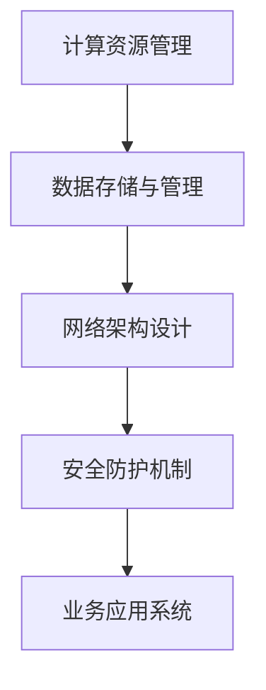
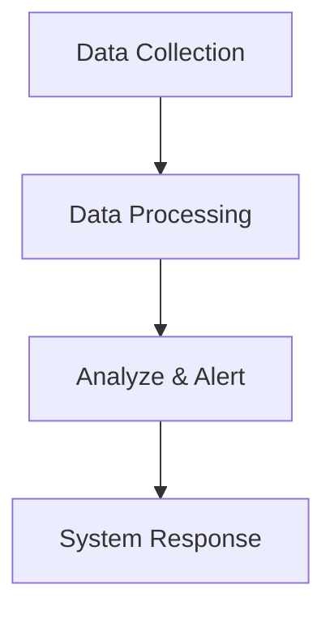
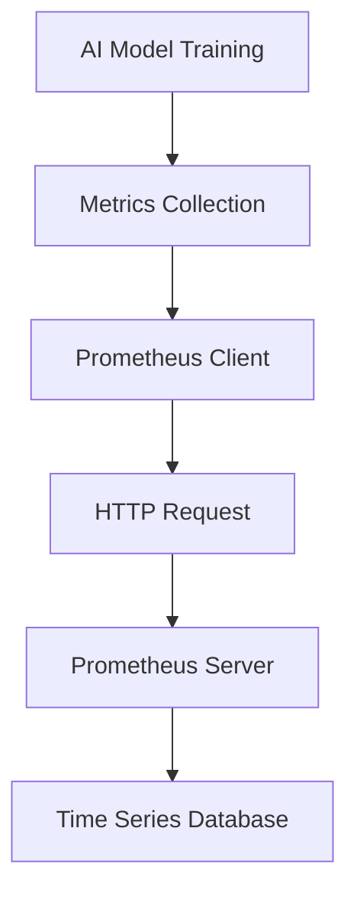
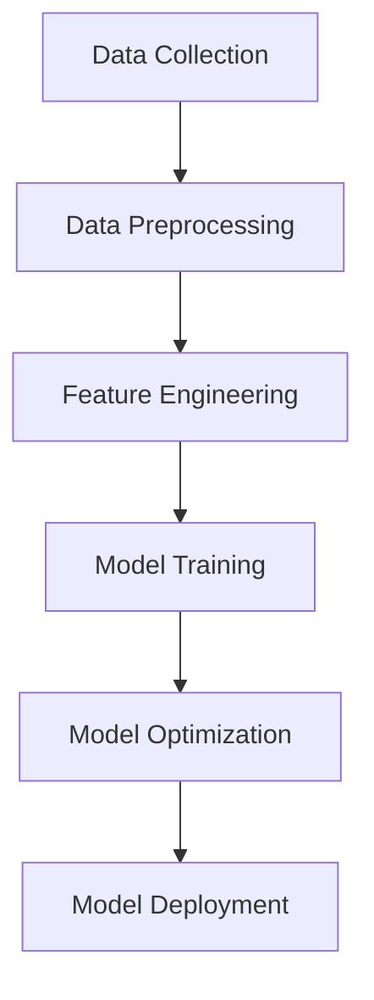
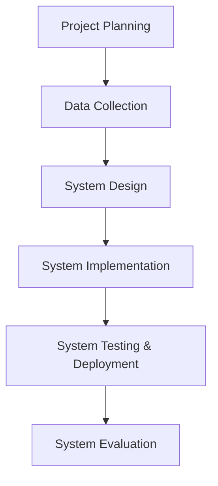

                 

### 第1章：AI大模型应用数据中心概述

#### 1.1 AI大模型应用数据中心的概念与架构

**AI大模型应用数据中心**是一个集中管理和运行大规模人工智能模型的计算环境。它不仅包含了计算资源，还涵盖了数据存储、网络架构以及安全防护等多个方面。数据中心的核心目标是提供高效、可靠和安全的计算环境，以支持人工智能模型的训练和部署。

**AI大模型应用数据中心的架构**通常包括以下几个关键组成部分：

1. **计算资源管理**：数据中心需要大量计算资源来运行大模型。这通常包括高性能计算服务器、GPU集群以及分布式计算框架等。
2. **数据存储与管理**：大模型训练需要处理大量数据，因此数据中心需要有高效的存储解决方案来存储和管理这些数据。这通常包括分布式文件系统、云存储服务等。
3. **网络架构设计**：数据中心内部的网络架构需要能够支持大规模的数据传输和模型训练过程中的通信需求。这通常包括高速网络交换机、负载均衡器等。
4. **安全防护机制**：数据安全和模型安全是数据中心的核心关注点。这通常包括防火墙、入侵检测系统、数据加密等技术。

**数据中心在企业中的应用场景**主要包括：

1. **人工智能应用开发**：企业可以利用数据中心提供的计算资源来开发和训练自己的AI模型，如自然语言处理、计算机视觉等。
2. **数据分析与决策支持**：数据中心可以处理和分析大量数据，为企业的业务决策提供支持，如市场分析、风险管理等。
3. **云服务提供**：企业可以通过数据中心提供云服务，为其他企业提供计算资源、存储资源和网络服务。

#### 1.2 数据中心的核心组成部分

**计算资源管理**是数据中心的基石。数据中心需要确保计算资源的有效利用，以满足大模型训练的需求。计算资源管理通常包括以下任务：

1. **资源分配**：根据模型的训练需求和当前资源负载情况，合理分配计算资源。
2. **负载均衡**：通过负载均衡技术，确保所有计算资源得到充分利用，避免某些服务器过载或闲置。
3. **资源调度**：根据任务的优先级和资源利用率，动态调整计算资源的分配。

**数据存储与管理**是数据中心的另一个关键组成部分。数据中心需要能够高效地存储和管理大量数据，以确保模型训练的数据质量和效率。数据存储与管理通常包括以下任务：

1. **数据备份与恢复**：确保数据的安全性和可靠性，防止数据丢失或损坏。
2. **数据压缩与加密**：为了节约存储空间和提高数据安全性，需要对数据进行压缩和加密处理。
3. **数据访问控制**：通过访问控制机制，确保只有授权用户可以访问特定数据。

**网络架构设计**对于数据中心的性能和稳定性至关重要。数据中心需要设计一个高效、可靠和灵活的网络架构，以满足大规模数据传输和模型训练的通信需求。网络架构设计通常包括以下任务：

1. **网络拓扑**：选择合适的网络拓扑结构，如环状、星状或树状网络。
2. **带宽管理**：通过带宽管理技术，确保网络资源得到合理利用，避免网络拥塞。
3. **网络监控**：实时监控网络性能和状态，及时发现和解决网络问题。

**安全防护机制**是数据中心的最后防线。数据中心需要采取一系列安全措施，确保数据和模型的安全性。安全防护机制通常包括以下任务：

1. **防火墙**：通过防火墙限制外部访问，防止未授权的攻击。
2. **入侵检测系统**：实时监测网络流量和系统行为，识别和响应潜在的安全威胁。
3. **数据加密**：对存储和传输的数据进行加密，防止数据泄露。

#### 1.3 数据中心在企业中的应用

数据中心在企业中的应用场景多种多样，下面列举几个常见的应用：

1. **提高业务效率**：数据中心可以为企业提供强大的计算能力和数据处理能力，帮助企业快速处理大量业务数据，从而提高业务效率和决策质量。
2. **改善用户体验**：通过数据中心提供的云服务，企业可以提供更快速、更稳定的在线服务，从而提升用户满意度。
3. **降低运营成本**：数据中心可以通过虚拟化和自动化管理技术，提高资源利用率，降低硬件和维护成本。
4. **数据分析和决策支持**：数据中心可以为企业提供强大的数据处理和分析能力，帮助企业在市场分析、风险评估等方面做出更明智的决策。

总之，数据中心在当今的企业中发挥着越来越重要的作用。通过合理设计和管理数据中心，企业可以充分利用人工智能技术，提升业务竞争力，实现可持续发展。

---

**Mermaid 流程图：AI大模型应用数据中心架构**



---

**Mermaid 流程图解释**：
- **A[计算资源管理]**：负责计算资源的分配、负载均衡和调度，确保模型训练任务的顺畅执行。
- **B[数据存储与管理]**：负责数据的备份、恢复、压缩、加密以及访问控制，确保数据的安全性和可靠性。
- **C[网络架构设计]**：设计并维护高效、可靠和灵活的网络架构，确保数据传输和模型训练的通信需求得到满足。
- **D[安全防护机制]**：通过防火墙、入侵检测系统、数据加密等技术，保护数据中心的数据和模型安全。
- **E[业务应用系统]**：数据中心支持的业务应用系统，如人工智能应用开发、数据分析与决策支持等。

### 第2章：AI大模型技术基础

#### 2.1 深度学习与神经网络基础

**深度学习**是人工智能的一个重要分支，它通过模拟人脑神经网络的结构和功能，实现对复杂数据的建模和分析。深度学习的基本原理是通过多层次的神经网络对输入数据进行逐层变换，从而提取特征，实现智能任务。

**神经网络**是深度学习的基础，它由一系列相互连接的神经元组成。每个神经元接收多个输入信号，通过加权求和处理后，输出一个信号。神经网络通过学习输入和输出之间的映射关系，实现对数据的建模和预测。

神经网络的基本组成部分包括：

1. **输入层**：接收外部输入数据，如图像、文本等。
2. **隐藏层**：对输入数据进行处理，提取特征，并传递到下一层。
3. **输出层**：输出模型预测结果。

神经网络的训练过程主要包括以下几个步骤：

1. **初始化权重**：随机初始化神经网络中的权重。
2. **前向传播**：将输入数据通过神经网络进行传递，计算输出结果。
3. **反向传播**：根据输出结果和实际目标，计算网络误差，并更新权重。
4. **迭代训练**：重复前向传播和反向传播，直到网络误差达到预设的阈值或训练次数达到预设的上限。

**深度学习与神经网络的联系**在于，深度学习是神经网络的一种扩展，它通过增加隐藏层的数量和神经元数量，提高了神经网络的表达能力，能够处理更复杂的任务。

#### 2.2 自然语言处理技术概览

**自然语言处理（NLP）**是深度学习在语言领域的应用，它旨在让计算机理解和处理人类语言。NLP技术主要包括以下几个方面：

1. **词嵌入（Word Embedding）**：将单词转换为向量表示，以便在神经网络中进行处理。常见的词嵌入技术包括Word2Vec、GloVe等。
2. **序列模型（Sequence Model）**：用于处理有序数据，如文本、语音等。常见的序列模型包括循环神经网络（RNN）、长短时记忆网络（LSTM）和门控循环单元（GRU）等。
3. **注意力机制（Attention Mechanism）**：用于捕捉输入序列中的重要信息，提高模型对上下文的理解能力。注意力机制在机器翻译、文本生成等任务中得到了广泛应用。
4. **转换器架构（Transformer）**：一种基于注意力机制的序列到序列模型，它在机器翻译、文本生成等任务中取得了显著效果。转换器架构的核心思想是将输入序列和输出序列映射到一个共同的中间表示，并通过注意力机制来捕捉输入和输出之间的关联。

#### 2.3 大规模预训练模型原理

**大规模预训练模型**是近年来深度学习领域的一个重要进展，它通过在大规模数据集上预训练模型，使其具有对多种任务的泛化能力。大规模预训练模型的主要原理包括：

1. **预训练（Pre-training）**：在大规模数据集上对模型进行训练，使模型具备一定的语言理解和生成能力。预训练通常分为两个阶段：第一阶段是自监督预训练，如BERT模型通过预测单词、片段或句子来学习语言结构；第二阶段是微调（Fine-tuning），将预训练模型应用于特定任务，通过少量有标签数据进行调整，以适应特定任务的需求。
2. **自监督学习（Self-supervised Learning）**：在预训练阶段，模型不需要有标签的数据，通过自监督学习技术，利用无标签的数据来训练模型。自监督学习通过构建伪标签或预测任务，使模型在无监督的情况下学习。
3. **迁移学习（Transfer Learning）**：通过预训练，模型在多个任务上获得了丰富的知识，这些知识可以在新的任务中迁移和复用，从而提高模型在新任务上的表现。迁移学习通过在预训练模型的基础上，进行微调，使模型适应新的任务。

大规模预训练模型已经在许多NLP任务中取得了显著效果，如文本分类、情感分析、机器翻译、文本生成等。

---

**伪代码：神经网络训练过程**

```python
# 初始化模型参数
initialize_model()

# 设定训练轮次
num_epochs = 10

# 模型训练循环
for epoch in range(num_epochs):
    # 数据集循环
    for example in dataset:
        # 前向传播，计算模型预测
        prediction = forward_pass(example)

        # 计算损失
        loss = compute_loss(prediction, target)

        # 反向传播，计算梯度
        gradients = backward_pass(loss)

        # 更新模型参数
        update_model_params(gradients)
```

---

**伪代码解释**：
- **initialize_model()**：初始化神经网络模型参数，包括权重和偏置。
- **num_epochs**：设定训练轮次，即训练的迭代次数。
- **forward_pass(example)**：对输入数据进行前向传播，计算模型预测结果。
- **compute_loss(prediction, target)**：计算预测结果和目标标签之间的损失。
- **backward_pass(loss)**：对模型进行反向传播，计算梯度。
- **update_model_params(gradients)**：使用梯度更新模型参数。

---

**数学模型与讲解**：

**1. 计算资源利用率**：

$$
\text{Utilization} = \frac{\text{Current Load}}{\text{Total Capacity}}
$$

其中，Current Load表示当前计算资源的使用量，Total Capacity表示总计算资源量。计算资源利用率反映了计算资源的利用程度，值越大表示资源利用越充分。

**2. 网络流量**：

$$
\text{Traffic} = \text{Bytes In} + \text{Bytes Out}
$$

其中，Bytes In表示流入网络的字节总数，Bytes Out表示流出网络的字节总数。网络流量反映了网络的通信量，是评估网络性能的重要指标。

**3. 系统性能指标**：

$$
\text{Response Time} = \frac{\text{Total Time}}{\text{Number of Requests}}
$$

其中，Total Time表示所有请求的总处理时间，Number of Requests表示请求的总数。响应时间反映了系统处理请求的速度，是评估系统性能的关键指标。

通过这些数学模型和公式，我们可以更准确地监控和评估数据中心各项指标的表现，从而为数据中心的优化和管理提供科学依据。

### 第3章：数据中心监控与预警核心概念

#### 3.1 监控与预警的定义

**监控**（Monitoring）是指对系统、应用程序或基础设施的运行状态和性能进行持续监测和记录的过程。监控的目的是确保系统稳定运行、及时发现问题并采取措施，以避免潜在的故障和性能问题。

**预警**（Alerting）是基于监控数据，当系统状态或性能指标超出预定义阈值时，自动发送通知或警报的过程。预警的目的是在问题发生前或刚发生时，提醒相关人员采取行动，以防止问题扩大或造成严重后果。

#### 3.2 数据中心监控与预警的重要性

**数据中心监控与预警**在确保数据中心稳定运行方面起着至关重要的作用。以下是几个关键点：

1. **提高系统可用性**：通过实时监控，可以及时发现和解决潜在问题，减少系统停机时间，提高数据中心的可用性。
2. **预防故障**：通过预警机制，可以在问题发生前发出警报，使运维人员有时间采取预防措施，避免故障发生。
3. **优化性能**：通过监控关键性能指标，可以识别性能瓶颈，进行调优，从而提高数据中心整体性能。
4. **成本节约**：通过有效监控和预警，可以减少意外停机和故障带来的损失，降低维护成本。
5. **合规性**：许多行业和组织对数据中心的监控和预警有严格的要求，以确保数据安全和合规性。

#### 3.3 监控与预警技术分类

数据中心监控与预警技术可以根据不同的分类标准进行分类。以下是一些常见的分类方式：

1. **基于指标的监控**：通过监控关键性能指标（KPIs）来评估系统状态和性能。常见的指标包括CPU利用率、内存使用率、磁盘I/O、网络流量等。
   
2. **基于行为的监控**：通过分析系统或应用程序的行为模式，发现异常或潜在问题。例如，分析系统日志、网络流量、用户行为等，以识别异常模式。

3. **基于异常检测的监控**：利用统计模型、机器学习算法等，对监控数据进行实时分析，识别异常值或异常模式。异常检测可以帮助预测和预防潜在问题。

4. **混合监控**：结合上述多种技术，实现更全面的监控和预警。例如，可以使用基于指标的监控来收集数据，使用基于异常检测的监控来分析数据，并根据分析结果触发预警。

#### 3.4 数据中心监控与预警的关键指标

数据中心监控与预警的关键指标包括但不限于以下方面：

1. **计算资源利用率**：如CPU利用率、GPU利用率、内存使用率等，反映了计算资源的利用程度和系统负载。

2. **网络流量**：如入网流量、出网流量、网络延迟、丢包率等，反映了网络的状态和性能。

3. **系统性能指标**：如响应时间、吞吐量、并发连接数等，反映了系统处理请求的能力。

4. **存储资源使用情况**：如磁盘使用率、I/O速率、存储容量等，反映了存储资源的利用情况和性能。

5. **安全事件**：如入侵尝试、恶意软件活动、安全漏洞等，反映了数据中心的网络安全状况。

6. **温度和湿度**：数据中心的环境监控，如温度、湿度等，确保数据中心的物理环境符合要求。

7. **能耗**：数据中心的能耗监控，如电力消耗、PUE（电源使用效率）等，反映了数据中心的能源消耗情况。

通过监控这些关键指标，可以全面了解数据中心的运行状况，及时发现问题并采取措施。

---

**数学模型：异常检测算法**

$$
\text{score}(x) = \frac{1}{c} \sum_{i=1}^{n} w_i \cdot \exp(-\gamma \cdot d(x, x_i))
$$

其中，$x$ 是当前观测值，$x_i$ 是历史观测值，$w_i$ 是权重，$d(x, x_i)$ 是观测值之间的距离（通常使用欧氏距离、曼哈顿距离等），$\gamma$ 是调节参数，$c$ 是归一化常数。

**模型解释**：

- **score(x)**：表示当前观测值的异常分数，分数越高表示异常程度越大。
- **$w_i \cdot \exp(-\gamma \cdot d(x, x_i))$**：表示历史观测值对当前观测值的影响，距离越近的影响越大。
- **权重$w_i$**：根据历史数据的重要性进行调整，重要数据赋予更高的权重。
- **指数衰减**：通过指数衰减机制，历史数据的影响随时间减弱，使模型更加关注最近的数据。

---

**数学公式与讲解**：

**1. 计算资源利用率**：

$$
\text{Utilization} = \frac{\text{Current Load}}{\text{Total Capacity}}
$$

- **Current Load**：当前计算资源的使用量。
- **Total Capacity**：总计算资源量。

**2. 网络流量**：

$$
\text{Traffic} = \text{Bytes In} + \text{Bytes Out}
$$

- **Bytes In**：流入网络的字节总数。
- **Bytes Out**：流出网络的字节总数。

**3. 系统性能指标**：

$$
\text{Response Time} = \frac{\text{Total Time}}{\text{Number of Requests}}
$$

- **Total Time**：所有请求的总处理时间。
- **Number of Requests**：请求的总数。

这些公式和模型为数据中心监控与预警提供了科学的方法和工具，可以帮助运维人员更好地管理和优化数据中心。

---

**Mermaid 流程图：数据中心监控与预警架构**



---

**流程图解释**：

- **A[Data Collection]**：数据采集，通过各种传感器、代理和日志收集系统监控数据。
- **B[Data Processing]**：数据处理，对采集到的数据进行预处理、存储和索引，以便后续分析。
- **C[Analyze & Alert]**：数据分析与预警，利用统计模型、机器学习算法等分析数据，识别异常并触发预警。
- **D[System Response]**：系统响应，运维人员根据预警信息采取相应的措施，解决问题。

通过这个架构，数据中心可以实现全面的监控与预警，提高系统稳定性和可靠性。

### 第4章：AI大模型监控技术

#### 4.1 监控数据的收集与预处理

**监控数据的收集**是AI大模型监控系统的第一步，也是至关重要的一步。有效的监控数据收集可以确保监控系统能够准确、及时地反映数据中心的运行状态。监控数据的来源多种多样，包括但不限于以下几个方面：

1. **系统日志**：系统日志记录了操作系统的各种事件和活动，包括启动、关闭、错误、警告等信息。这些日志是监控系统的重要数据源，可以提供关于系统运行状况的第一手信息。
   
2. **性能监控数据**：性能监控数据包括CPU利用率、内存使用率、磁盘I/O、网络流量等指标。这些数据反映了系统的资源利用情况和性能表现，是评估系统健康状况的关键依据。

3. **应用程序日志**：应用程序日志记录了应用程序的运行情况和操作记录，包括错误日志、性能日志等。这些日志可以帮助监控系统识别应用程序的异常行为。

4. **网络流量数据**：网络流量数据包括入网流量、出网流量、网络延迟、丢包率等。通过分析网络流量数据，可以监控网络的健康状况和性能。

5. **物理设备监控数据**：对于数据中心中的物理设备，如服务器、存储设备、网络设备等，可以通过传感器和监控工具收集温度、湿度、电功率等数据，以确保设备的正常运行。

**监控数据的收集方法**主要包括以下几种：

1. **Agent-based监控**：在服务器和设备上安装监控代理程序，这些代理程序定期收集系统数据并上传到监控服务器。这种方法适用于分布式环境，可以实时监控多个节点。

2. **API监控**：通过访问各个系统和服务的API接口，获取监控数据。这种方法适用于与第三方服务或应用程序的集成，可以获取详细和实时的监控数据。

3. **日志文件分析**：定期收集和解析系统日志文件，提取有用的监控数据。这种方法适用于日志量较大的场景，可以通过自动化脚本实现。

4. **SNMP监控**：简单网络管理协议（SNMP）是一种用于网络设备监控的协议，可以通过SNMP接口获取设备的状态和性能数据。

**监控数据的预处理**是监控数据收集后的关键步骤，它涉及到数据清洗、格式化、聚合等操作，以确保数据的质量和一致性。监控数据的预处理主要包括以下几个方面：

1. **数据清洗**：去除无效、重复或错误的数据，保证数据的准确性。例如，去除含有空值或异常值的日志条目。

2. **数据格式化**：将不同格式的监控数据转换为统一的格式，以便后续分析处理。例如，将时间戳转换为标准格式，将不同单位的指标进行换算。

3. **数据聚合**：将来自不同数据源的数据进行聚合，以获取更宏观的监控视图。例如，将不同服务器或节点的监控数据进行汇总，得到整个数据中心的整体性能指标。

4. **数据归一化**：将不同指标的数值范围归一化，以便进行对比分析。例如，将不同时间段的流量数据进行归一化处理，使其在同一量级上进行比较。

**监控数据预处理的重要性**在于：

- **数据准确性**：预处理可以去除无效和错误的数据，提高监控数据的准确性，为后续分析提供可靠的数据基础。
- **数据一致性**：预处理可以确保数据格式和单位的一致性，便于跨系统和跨时间段的监控数据分析。
- **数据分析效率**：预处理后的数据更加易于分析和处理，可以节省数据分析和挖掘的时间。

通过有效的监控数据收集与预处理，可以为AI大模型监控系统提供高质量的数据支持，确保监控系统能够准确、及时地反映数据中心的运行状态，为运维人员提供决策依据。

---

#### 4.2 监控指标的设计与选择

**监控指标的设计与选择**是构建AI大模型监控系统的重要环节，直接影响到监控系统的效果和实用性。监控指标需要全面、准确地反映数据中心的运行状态和性能，以便及时发现和解决问题。

**监控指标的类型**主要包括以下几类：

1. **计算资源利用率指标**：如CPU利用率、内存使用率、GPU利用率等。这些指标反映了计算资源的利用程度，可以帮助识别资源瓶颈和优化资源分配。

2. **存储资源利用率指标**：如磁盘使用率、I/O速率、存储容量等。这些指标反映了存储资源的利用情况和性能，可以帮助识别存储瓶颈和优化存储策略。

3. **网络流量指标**：如入网流量、出网流量、网络延迟、丢包率等。这些指标反映了网络的性能和稳定性，可以帮助识别网络瓶颈和优化网络配置。

4. **系统性能指标**：如响应时间、吞吐量、并发连接数等。这些指标反映了系统处理请求的能力，可以帮助识别性能瓶颈和优化系统架构。

5. **安全事件指标**：如入侵尝试次数、恶意软件活动、安全漏洞等。这些指标反映了数据中心的网络安全状况，可以帮助识别潜在的安全威胁。

6. **环境监控指标**：如温度、湿度、电功率等。这些指标反映了数据中心的物理环境状况，可以帮助识别环境问题并优化环境管理。

**监控指标的设计原则**包括以下几个方面：

1. **全面性**：监控指标应该覆盖数据中心的各个方面，包括计算、存储、网络、安全和环境等，以确保监控的全面性和准确性。

2. **关键性**：监控指标应该选择对数据中心运行状态和性能影响较大的关键指标，以确保监控的重点突出，能够有效反映数据中心的健康状态。

3. **可度量性**：监控指标应该是可度量的，可以通过量化方式表示，以便进行定量分析和比较。

4. **实时性**：监控指标应该具有实时性，能够及时反映数据中心的当前状态，以便在问题发生时迅速响应。

5. **可操作性**：监控指标应该具备可操作性，即指标数据能够提供明确的操作指导，帮助运维人员快速定位问题并采取相应措施。

**常见监控指标**包括：

1. **CPU利用率**：CPU利用率反映了CPU的使用情况，超过80%的利用率通常表示CPU过载，需要进一步分析原因并进行优化。

2. **内存使用率**：内存使用率反映了内存的使用情况，超过80%的利用率通常表示内存紧张，可能导致系统性能下降。

3. **磁盘使用率**：磁盘使用率反映了磁盘的空间利用情况，超过80%的利用率通常表示磁盘空间不足，可能导致存储性能下降。

4. **网络流量**：网络流量反映了网络的通信情况，异常高的流量可能表示网络攻击或带宽瓶颈。

5. **响应时间**：响应时间反映了系统处理请求的速度，长时间的响应时间可能表示系统性能瓶颈。

6. **安全事件**：如入侵尝试次数、恶意软件活动等，这些事件可能对数据中心的网络安全构成威胁。

7. **温度和湿度**：温度和湿度反映了数据中心的物理环境状况，过高或过低的温度和湿度都可能对设备的正常运行产生影响。

通过合理设计和选择监控指标，可以确保AI大模型监控系统能够准确、及时地反映数据中心的运行状态，为运维人员提供可靠的监控数据和操作指导，从而提高数据中心的稳定性和可靠性。

---

#### 4.3 常见监控工具与平台

在构建AI大模型监控系统中，选择合适的监控工具和平台至关重要。以下将介绍几种常见的监控工具和平台，包括其特点、优势、使用场景等。

**1. Prometheus**

**特点与优势**：
- **开源**：Prometheus是一个开源监控解决方案，具有良好的社区支持和丰富的插件生态。
- **时序数据库**：Prometheus基于时序数据模型，能够高效存储和查询监控数据。
- **多维数据查询**：Prometheus支持多维数据查询，可以通过标签（metrics）灵活组合和过滤数据。
- **拉模式监控**：Prometheus采用拉模式监控，可以从目标实例中拉取监控数据，适用于分布式系统。

**使用场景**：
- **大型分布式系统**：Prometheus适用于大规模分布式系统的监控，能够实时监控系统状态和性能。
- **微服务架构**：Prometheus与微服务架构天然契合，可以通过服务端点（HTTP API）暴露监控数据。

**2. Nagios**

**特点与优势**：
- **开源**：Nagios是一个开源监控工具，提供丰富的插件和自定义功能。
- **集中化管理**：Nagios支持集中管理多个监控目标，方便进行统一监控和报警。
- **自定义监控**：Nagios支持自定义监控脚本，可以监控各种系统和应用程序。
- **通知与报告**：Nagios提供多种通知方式和报告功能，支持邮件、短信、网页等多种报警方式。

**使用场景**：
- **企业级监控**：Nagios适用于企业级监控需求，能够监控各种系统和应用程序，包括服务器、网络设备、数据库等。
- **复杂环境**：Nagios适用于复杂、多变的监控环境，可以通过自定义监控脚本适应各种监控需求。

**3. Grafana**

**特点与优势**：
- **可视化**：Grafana是一个开源可视化平台，能够将监控数据以图表、仪表板的形式直观展示。
- **插件生态**：Grafana具有丰富的插件生态，支持多种数据源和图表类型，便于扩展和定制。
- **实时监控**：Grafana支持实时监控，可以动态刷新图表和数据面板。
- **告警管理**：Grafana内置告警功能，可以与Prometheus、InfluxDB等数据源集成，实现多数据源告警管理。

**使用场景**：
- **数据可视化**：Grafana适用于各种监控数据可视化需求，能够将监控数据以图表、仪表板的形式直观展示。
- **企业级监控**：Grafana适用于企业级监控场景，能够集成多种数据源，提供丰富的监控图表和告警功能。

**4. Zabbix**

**特点与优势**：
- **开源**：Zabbix是一个开源监控解决方案，提供强大的监控功能。
- **多平台支持**：Zabbix支持多种操作系统平台，包括Linux、Windows等。
- **自动发现**：Zabbix支持自动发现和自动监控，可以自动识别网络中的设备和服务。
- **告警通知**：Zabbix提供多种告警通知方式，包括邮件、短信、即时消息等。

**使用场景**：
- **企业级监控**：Zabbix适用于企业级监控需求，能够监控各种设备和服务，提供全面的监控和告警功能。
- **大规模部署**：Zabbix适用于大规模部署场景，支持分布式监控和数据存储。

这些监控工具和平台在AI大模型监控系统中各有优势，可以根据具体需求选择合适的工具进行集成和部署。

---

#### 4.4 代码实际案例和详细解释说明

在本节中，我们将使用Prometheus作为监控工具，搭建一个简单的AI大模型监控系统。这个案例将涵盖开发环境搭建、源代码实现和代码解读等方面。

**4.4.1 开发环境搭建**

**环境要求**：

- 操作系统：Linux（推荐Ubuntu 18.04）
- Prometheus版本：2.36.0
- Go语言环境：1.18及以上版本

**软件安装与配置**：

1. **安装Go语言环境**：

   ```bash
   sudo apt update
   sudo apt install golang-go
   ```

2. **安装Prometheus**：

   ```bash
   wget https://github.com/prometheus/prometheus/releases/download/v2.36.0/prometheus-2.36.0.linux-amd64.tar.gz
   tar -xvf prometheus-2.36.0.linux-amd64.tar.gz
   cd prometheus-2.36.0.linux-amd64
   ./prometheus --config.file=./prometheus.yml --web.console.templates=/etc/prometheus/consoles --web.hquarters.listen address=0.0.0.0:9090
   ```

3. **配置Prometheus**：

   Prometheus的配置文件位于`prometheus.yml`，以下是一个简单的配置示例：

   ```yaml
   global:
     scrape_interval: 15s
     evaluation_interval: 15s
   scrape_configs:
   - job_name: 'ai-model-monitor'
     static_configs:
     - targets: ['localhost:9090']
   ```

   这个配置文件定义了监控间隔和评估间隔为15秒，并配置了一个名为`ai-model-monitor`的监控作业，仅监控本地的9090端口。

**4.4.2 源代码实现**

下面是一个简单的Prometheus客户端代码，用于收集AI大模型训练过程中的监控数据。这个代码将实现一个简单的HTTP服务器，暴露监控指标。

```go
package main

import (
    "log"
    "net/http"
    "time"
)

// 监控指标结构体
type Metrics struct {
    CPUUsage float64 `json:"cpu_usage"`
    MemoryUsage float64 `json:"memory_usage"`
    TrainingTime float64 `json:"training_time"`
}

// 收集监控数据
func collectMetrics() Metrics {
    // 模拟收集监控数据
    return Metrics{
        CPUUsage: 0.8,
        MemoryUsage: 0.6,
        TrainingTime: 30.0,
    }
}

// 监控数据端点
func metricsHandler(w http.ResponseWriter, r *http.Request) {
    // 收集监控数据
    metrics := collectMetrics()

    // 构建Prometheus数据格式
    data := []byte(`# HELP ai_model_cpu_usage CPU usage of AI model.
# TYPE ai_model_cpu_usage gauge
ai_model_cpu_usage ` + fmt.Sprintf("%.2f", metrics.CPUUsage) + `

# HELP ai_model_memory_usage Memory usage of AI model.
# TYPE ai_model_memory_usage gauge
ai_model_memory_usage ` + fmt.Sprintf("%.2f", metrics.MemoryUsage) + `

# HELP ai_model_training_time Training time of AI model.
# TYPE ai_model_training_time gauge
ai_model_training_time ` + fmt.Sprintf("%.2f", metrics.TrainingTime) + ``)
    
    // 返回监控数据
    w.Header().Set("Content-Type", "text/plain; version=0.0.4; charset=utf-8")
    w.Write(data)
}

func main() {
    // 创建HTTP服务器
    server := &http.Server{
        Addr:    ":9090",
        Handler: http.HandlerFunc(metricsHandler),
    }

    // 启动服务器
    log.Fatal(server.ListenAndServe())
}
```

**代码解读**：

- **Metrics结构体**：定义了监控数据的结构，包括CPU利用率、内存利用率和训练时间。
- **collectMetrics()函数**：模拟收集监控数据，实际应用中可以替换为从传感器或API获取的实时数据。
- **metricsHandler函数**：处理HTTP请求，返回Prometheus格式的监控数据。通过定义不同的指标和类型，可以将监控数据推送到Prometheus服务器。

**4.4.3 代码解读与分析**

1. **HTTP服务器配置**：

   ```go
   server := &http.Server{
       Addr:    ":9090",
       Handler: http.HandlerFunc(metricsHandler),
   }
   ```

   这里配置了一个简单的HTTP服务器，监听本地9090端口，处理函数为`metricsHandler`。

2. **监控数据收集**：

   ```go
   metrics := collectMetrics()
   ```

   `collectMetrics()`函数模拟收集监控数据，实际应用中可以通过调用传感器或API获取实时数据。

3. **数据格式化与返回**：

   ```go
   data := []byte(`# HELP ai_model_cpu_usage CPU usage of AI model.
   # TYPE ai_model_cpu_usage gauge
   ai_model_cpu_usage ` + fmt.Sprintf("%.2f", metrics.CPUUsage) + `

   # HELP ai_model_memory_usage Memory usage of AI model.
   # TYPE ai_model_memory_usage gauge
   ai_model_memory_usage ` + fmt.Sprintf("%.2f", metrics.MemoryUsage) + `

   # HELP ai_model_training_time Training time of AI model.
   # TYPE ai_model_training_time gauge
   ai_model_training_time ` + fmt.Sprintf("%.2f", metrics.TrainingTime) + ``)
   
   w.Header().Set("Content-Type", "text/plain; version=0.0.4; charset=utf-8")
   w.Write(data)
   ```

   代码将监控数据格式化为Prometheus支持的格式，并在HTTP响应中返回。这里使用了字符串格式化将监控数据插入到Prometheus数据格式中。

通过这个简单的案例，我们展示了如何使用Prometheus搭建一个AI大模型监控系统。在实际应用中，可以根据需求扩展监控指标和数据收集方式，实现更全面和精细的监控功能。

---

**Mermaid 流程图：Prometheus数据采集流程**



---

**流程图解释**：

- **A[AI Model Training]**：AI模型进行训练。
- **B[Metrics Collection]**：收集训练过程中的监控指标，如CPU利用率、内存利用率、训练时间等。
- **C[Prometheus Client]**：Prometheus客户端收集监控数据。
- **D[HTTP Request]**：Prometheus客户端通过HTTP请求将监控数据发送到Prometheus服务器。
- **E[Prometheus Server]**：Prometheus服务器接收并处理监控数据。
- **F[Time Series Database]**：Prometheus服务器将监控数据存储到时序数据库中，以供后续分析和可视化。

通过这个流程，AI大模型监控系统可以实时收集和存储监控数据，为运维人员提供实时的数据支持和决策依据。

### 第5章：AI大模型预警技术

#### 5.1 预警机制的设计

**预警机制的设计**是AI大模型监控系统中的关键环节，它涉及到预警策略、算法选择、系统实现等多个方面。一个有效的预警机制可以在问题发生前或刚发生时发出警报，提醒相关人员采取行动，从而减少潜在的损失和影响。以下是设计预警机制的基本步骤：

1. **明确预警目标**：首先，需要明确预警的具体目标，如避免系统崩溃、提高资源利用率、保障数据安全等。明确预警目标有助于设计相应的预警策略和指标。

2. **选择预警策略**：根据预警目标，选择合适的预警策略。常见的预警策略包括阈值预警、规则预警和智能预警等。阈值预警是根据预设的阈值，当指标超过阈值时触发警报；规则预警是基于预定义的规则，如时间窗口内的异常变化触发警报；智能预警则是利用机器学习算法，根据历史数据和当前状态预测异常，并触发警报。

3. **确定预警指标**：选择关键的预警指标，这些指标需要能够准确反映系统的健康状态。常见的预警指标包括计算资源利用率、网络流量、响应时间、存储容量等。

4. **设定阈值和规则**：根据预警策略，设定预警指标的阈值和规则。阈值可以是绝对值，也可以是相对值，如超过平均值的百分比。规则可以是简单的比较操作，也可以是复杂的逻辑运算。

5. **设计预警系统架构**：设计预警系统的整体架构，包括数据采集、处理、分析、报警等模块。确保预警系统能够高效、准确地处理监控数据，并及时发出警报。

6. **实现预警算法**：根据预警策略和预警指标，选择合适的机器学习算法或规则引擎，实现预警算法。常见的预警算法包括基于阈值的规则算法、基于统计的异常检测算法、基于机器学习的预测算法等。

7. **测试和优化**：在实际部署前，对预警系统进行充分的测试和优化，确保预警系统能够准确、及时地发出警报，并减少误报和漏报。

8. **用户界面和通知**：设计用户界面和通知机制，以便运维人员能够方便地查看预警信息、采取相应措施。通知机制可以包括邮件、短信、即时消息等。

**预警机制的设计原则**包括：

- **实时性**：预警机制需要能够实时监测系统状态，及时发现潜在问题。
- **准确性**：预警系统需要能够准确判断异常情况，避免误报和漏报。
- **灵活性**：预警机制需要具备灵活性，可以根据不同场景和需求进行调整和优化。
- **可扩展性**：预警系统需要能够支持新的监控指标和预警策略，以适应不断变化的需求。

通过合理的设计和实施，预警机制可以在AI大模型监控系统中发挥重要作用，提高数据中心的稳定性和可靠性。

---

#### 5.2 预警算法的选择与应用

在AI大模型监控系统中，选择合适的预警算法对于确保系统的稳定性和可靠性至关重要。预警算法可以根据监控数据的特点和处理需求分为多种类型，以下是一些常见的预警算法及其应用场景：

**1. 基于阈值的规则算法**

**基本原理**：基于阈值的规则算法通过设定预警阈值，当监控指标的数值超过阈值时触发警报。这种方法简单直观，易于实现。

**应用场景**：
- **计算资源利用率**：设定CPU利用率、内存使用率等指标的阈值，当这些指标超过预设阈值时，触发警报。
- **网络流量**：设定网络流量的阈值，当入网流量或出网流量超过阈值时，触发警报。
- **存储容量**：设定存储使用率的阈值，当存储使用率超过阈值时，触发警报。

**优点**：实现简单，成本低，易于理解和部署。
**缺点**：对异常模式的适应性较差，容易产生误报和漏报。

**2. 基于统计的异常检测算法**

**基本原理**：基于统计的异常检测算法通过计算监控数据的统计特征，如均值、方差等，识别异常值。常见的方法包括标准差法、三倍标准差法等。

**应用场景**：
- **计算资源利用率**：通过计算CPU利用率、内存使用率的统计特征，识别异常的波动。
- **网络流量**：通过计算网络流量的统计特征，识别异常的流量变化。

**优点**：对静态异常模式有效，计算简单。
**缺点**：对动态异常模式和突发性异常反应较慢，需要调整统计特征参数。

**3. 基于机器学习的预测算法**

**基本原理**：基于机器学习的预测算法通过训练历史数据，建立监控数据的预测模型，然后对新数据进行预测。当预测结果与实际值差异较大时，触发警报。

**应用场景**：
- **计算资源利用率**：使用时间序列预测模型，如ARIMA、LSTM等，预测未来的CPU利用率，当预测值与实际值差异较大时，触发警报。
- **网络流量**：使用时间序列预测模型，预测未来的网络流量，当预测值与实际值差异较大时，触发警报。

**优点**：对动态异常模式和突发性异常反应较快，适应性强。
**缺点**：模型训练和预测过程复杂，对数据质量要求较高。

**4. 基于聚类和模式识别的算法**

**基本原理**：基于聚类和模式识别的算法通过对监控数据进行聚类分析，识别正常数据和异常数据。常见的聚类算法包括K-means、DBSCAN等。

**应用场景**：
- **计算资源利用率**：通过聚类分析识别出异常的资源利用率模式。
- **网络流量**：通过聚类分析识别出异常的网络流量模式。

**优点**：能够发现复杂的异常模式，对多维度数据进行处理。
**缺点**：聚类算法参数选择较复杂，对异常模式的识别能力有限。

**5. 基于关联规则和序列模式的算法**

**基本原理**：基于关联规则和序列模式的算法通过分析监控数据的关联性和序列性，识别异常行为。常见的算法包括Apriori算法、序列模式挖掘算法等。

**应用场景**：
- **系统事件日志**：分析系统事件日志，识别关联性和序列性的异常行为。
- **网络流量**：分析网络流量，识别异常的流量模式。

**优点**：能够发现复杂的异常模式，对多维度数据进行处理。
**缺点**：计算复杂度较高，对数据质量要求较高。

选择预警算法时，需要根据具体的监控需求、数据特点和处理能力进行综合考虑。通常，可以结合多种算法，构建一个多层次的预警系统，以提高预警的准确性和适应性。

---

#### 5.3 预警系统的实现与优化

**预警系统的实现**是AI大模型监控系统的重要组成部分，它涉及到系统架构设计、数据处理、预警算法应用等方面。一个高效、可靠的预警系统需要确保监控数据的准确性、处理的高效性和预警的及时性。以下是预警系统的实现步骤和优化方法：

**5.3.1 系统架构设计**

**1. 数据采集模块**：负责从各种监控数据源（如系统日志、性能指标、网络流量等）收集数据。数据采集模块可以采用分布式架构，以提高数据的收集效率和处理能力。

**2. 数据处理模块**：负责对采集到的监控数据进行预处理，包括数据清洗、格式化、聚合等操作。数据处理模块需要确保数据的质量和一致性，以便后续分析。

**3. 预警分析模块**：负责应用预警算法对预处理后的监控数据进行分析，识别异常模式并生成预警信息。预警分析模块可以采用分布式计算框架，以提高处理速度和并发能力。

**4. 预警通知模块**：负责将生成的预警信息发送给相关人员，包括电子邮件、短信、即时消息等。预警通知模块需要确保通知的及时性和准确性。

**5. 数据存储模块**：负责存储监控数据和预警信息，以便后续查询和分析。数据存储模块可以采用时序数据库或大数据存储技术，以提高存储效率和查询速度。

**5.3.2 实现步骤**

**1. 确定预警目标和指标**：根据业务需求和系统特点，明确预警目标和指标，如计算资源利用率、网络流量、存储容量等。

**2. 选择预警算法**：根据预警目标和指标，选择合适的预警算法，如基于阈值的规则算法、基于统计的异常检测算法、基于机器学习的预测算法等。

**3. 设计系统架构**：根据预警算法和数据特点，设计预警系统的整体架构，包括数据采集、处理、分析、通知和存储等模块。

**4. 开发预警算法**：根据选定的预警算法，实现预警算法的代码，并进行调试和测试。

**5. 集成与部署**：将预警算法集成到监控系统中，进行系统集成和部署。确保系统架构的稳定性和可靠性，并进行性能优化。

**6. 测试与优化**：对预警系统进行测试，验证预警算法的准确性和效率。根据测试结果，优化系统性能和预警策略。

**5.3.3 优化方法**

**1. 数据预处理优化**：通过改进数据预处理算法，提高数据清洗、格式化和聚合的效率，减少数据延迟和处理时间。

**2. 预警算法优化**：根据监控数据的特点，优化预警算法的参数设置和模型结构，提高预警的准确性和响应速度。

**3. 系统性能优化**：通过优化系统架构和数据处理流程，提高系统的并发处理能力和性能。

**4. 异常检测策略优化**：根据实际监控数据，调整异常检测策略，包括阈值设定、预警规则等，以提高预警的准确性。

**5. 预警通知优化**：通过优化预警通知的方式和流程，提高通知的及时性和可靠性，确保相关人员能够及时收到预警信息。

通过上述步骤和优化方法，可以构建一个高效、可靠的AI大模型预警系统，确保数据中心的稳定运行和性能优化。

---

**项目实战：实现基于机器学习的预警系统**

在本节中，我们将详细介绍如何实现一个基于机器学习的预警系统。这个系统将使用Python和Scikit-learn库，通过实际案例展示数据预处理、特征工程、模型训练与优化等步骤。

**5.4.1 开发环境搭建**

**环境要求**：

- 操作系统：Linux（推荐Ubuntu 20.04）
- Python版本：3.8及以上版本
- Scikit-learn库：0.24.2及以上版本

**软件安装与配置**：

1. **安装Python环境**：

   ```bash
   sudo apt update
   sudo apt install python3 python3-pip
   ```

2. **安装Scikit-learn库**：

   ```bash
   pip3 install scikit-learn==0.24.2
   ```

**5.4.2 源代码详细实现和代码解读**

以下是实现基于机器学习预警系统的完整代码，包括数据预处理、特征工程、模型训练和优化等步骤。

```python
import numpy as np
import pandas as pd
from sklearn.model_selection import train_test_split
from sklearn.preprocessing import StandardScaler
from sklearn.ensemble import RandomForestClassifier
from sklearn.metrics import classification_report, accuracy_score

# 1. 数据预处理
def preprocess_data(data):
    # 数据清洗（去除空值、重复值等）
    data = data.dropna()
    data = data.drop_duplicates()

    # 特征提取（仅保留相关特征）
    features = data[['CPU利用率', '内存使用率', '磁盘使用率', '网络流量']]
    labels = data['异常标志']

    return features, labels

# 2. 特征工程
def feature_engineering(features):
    # 特征标准化
    scaler = StandardScaler()
    scaled_features = scaler.fit_transform(features)

    return scaled_features

# 3. 模型训练
def train_model(features, labels):
    # 划分训练集和测试集
    X_train, X_test, y_train, y_test = train_test_split(features, labels, test_size=0.2, random_state=42)

    # 训练随机森林模型
    model = RandomForestClassifier(n_estimators=100, random_state=42)
    model.fit(X_train, y_train)

    # 测试模型
    predictions = model.predict(X_test)
    print("模型准确性：", accuracy_score(y_test, predictions))
    print("分类报告：\n", classification_report(y_test, predictions))

    return model

# 4. 模型优化
def optimize_model(model, features, labels):
    # 使用交叉验证优化模型参数
    from sklearn.model_selection import GridSearchCV
    parameters = {'n_estimators': [100, 200], 'max_depth': [10, 20, 30]}
    cv = GridSearchCV(model, parameters, cv=5)
    cv.fit(features, labels)

    # 输出最优参数
    print("最优参数：", cv.best_params_)

    return cv.best_estimator_

# 5. 主程序
if __name__ == "__main__":
    # 读取数据
    data = pd.read_csv("ai_model_monitor_data.csv")

    # 数据预处理
    features, labels = preprocess_data(data)

    # 特征工程
    scaled_features = feature_engineering(features)

    # 模型训练
    model = train_model(scaled_features, labels)

    # 模型优化
    optimized_model = optimize_model(model, scaled_features, labels)
```

**代码解读**：

1. **数据预处理**：该函数负责清洗数据，去除空值和重复值，并提取相关特征。在数据预处理阶段，我们需要确保数据的质量和一致性。

2. **特征工程**：该函数负责对提取的特征进行标准化处理，以消除不同特征之间的尺度差异。标准化处理可以提高模型的性能和泛化能力。

3. **模型训练**：该函数使用随机森林算法对训练数据进行训练，并输出模型的准确性和分类报告。这里我们使用随机森林算法，因为它在处理分类问题时表现出色。

4. **模型优化**：该函数使用交叉验证方法对模型参数进行优化，以找到最优参数。交叉验证是一种常用的模型评估方法，可以避免过拟合。

**5.4.3 代码解读与分析**

**1. 数据预处理**

```python
def preprocess_data(data):
    # 数据清洗（去除空值、重复值等）
    data = data.dropna()
    data = data.drop_duplicates()

    # 特征提取（仅保留相关特征）
    features = data[['CPU利用率', '内存使用率', '磁盘使用率', '网络流量']]
    labels = data['异常标志']

    return features, labels
```

- **数据清洗**：首先，我们使用`dropna()`函数去除包含空值的数据行，使用`drop_duplicates()`函数去除重复数据。这两个步骤可以确保数据的质量。
- **特征提取**：然后，我们使用`DataFrame`的切片操作提取相关特征，并将标签分离出来。这里我们选择`'CPU利用率'`、`'内存使用率'`、`'磁盘使用率'`和`'网络流量'`作为特征，`'异常标志'`作为标签。

**2. 特征工程**

```python
def feature_engineering(features):
    # 特征标准化
    scaler = StandardScaler()
    scaled_features = scaler.fit_transform(features)

    return scaled_features
```

- **特征标准化**：我们使用`StandardScaler`类对特征进行标准化处理。标准化处理可以消除不同特征之间的尺度差异，提高模型的性能和泛化能力。这里我们使用`fit_transform()`方法对特征进行标准化，并返回标准化后的特征数据。

**3. 模型训练**

```python
def train_model(features, labels):
    # 划分训练集和测试集
    X_train, X_test, y_train, y_test = train_test_split(features, labels, test_size=0.2, random_state=42)

    # 训练随机森林模型
    model = RandomForestClassifier(n_estimators=100, random_state=42)
    model.fit(X_train, y_train)

    # 测试模型
    predictions = model.predict(X_test)
    print("模型准确性：", accuracy_score(y_test, predictions))
    print("分类报告：\n", classification_report(y_test, predictions))

    return model
```

- **划分训练集和测试集**：我们使用`train_test_split()`函数将数据集划分为训练集和测试集，以评估模型的性能。这里我们设置测试集的比例为20%，随机种子为42，以确保结果的可重复性。
- **训练随机森林模型**：我们使用`RandomForestClassifier`类训练随机森林模型。这里我们设置决策树的数量为100，随机种子为42。
- **测试模型**：我们使用`predict()`方法对测试集进行预测，并使用`accuracy_score()`和`classification_report()`函数评估模型的准确性。

**4. 模型优化**

```python
def optimize_model(model, features, labels):
    # 使用交叉验证优化模型参数
    from sklearn.model_selection import GridSearchCV
    parameters = {'n_estimators': [100, 200], 'max_depth': [10, 20, 30]}
    cv = GridSearchCV(model, parameters, cv=5)
    cv.fit(features, labels)

    # 输出最优参数
    print("最优参数：", cv.best_params_)

    return cv.best_estimator_
```

- **交叉验证优化**：我们使用`GridSearchCV`类进行交叉验证，以优化模型参数。这里我们设置参数搜索范围为`{'n_estimators': [100, 200], 'max_depth': [10, 20, 30]}`，交叉验证的折数为5。
- **输出最优参数**：我们输出交叉验证得到的最优参数，以便后续使用。

通过这个案例，我们展示了如何实现一个基于机器学习的预警系统。在实际应用中，可以根据具体需求扩展和优化系统功能，以提高预警的准确性和效率。

---

**Mermaid 流程图：机器学习预警系统架构**



---

**流程图解释**：

- **A[Data Collection]**：数据采集，从各种数据源收集监控数据。
- **B[Data Preprocessing]**：数据预处理，包括数据清洗、格式化和聚合等。
- **C[Feature Engineering]**：特征工程，提取和标准化特征，为模型训练做准备。
- **D[Model Training]**：模型训练，使用训练数据训练机器学习模型。
- **E[Model Optimization]**：模型优化，通过交叉验证优化模型参数。
- **F[Model Deployment]**：模型部署，将优化后的模型应用到实际监控系统。

通过这个架构，可以实现一个完整的机器学习预警系统，确保监控数据的准确性和预警的及时性。

### 第6章：案例研究：AI大模型监控与预警项目实战

#### 6.1 项目背景与目标

在当今快速发展的AI领域，AI大模型应用越来越普遍，其训练和部署过程中的性能监控和预警需求也越来越高。为了提高AI大模型的训练效率、稳定性和可靠性，某知名科技公司启动了一个AI大模型监控与预警项目。该项目的主要背景和目标如下：

**项目背景**：

- **AI大模型的应用需求**：随着人工智能技术的不断发展，越来越多的应用场景需要使用AI大模型，如自然语言处理、计算机视觉、推荐系统等。这些应用通常需要大规模的数据和计算资源，对数据中心的稳定性、可靠性和性能提出了更高的要求。
- **数据中心资源紧张**：随着AI大模型应用的增加，数据中心资源（如计算资源、存储资源、网络资源）面临越来越大的压力。数据中心需要高效利用现有资源，提高资源利用率，以应对不断增长的需求。

**项目目标**：

- **监控大模型训练过程**：实时监控AI大模型训练过程中的各项关键性能指标，如CPU利用率、内存使用率、网络流量、存储容量等，确保训练过程的顺利进行。
- **预警异常情况**：通过预警机制，及时发现训练过程中的异常情况，如资源耗尽、网络拥堵、计算资源瓶颈等，并发出警报，提醒运维人员及时处理。
- **提高训练效率**：通过监控和预警，优化训练过程，提高训练效率，缩短训练时间，降低训练成本。
- **保障数据安全性**：监控和预警系统需要确保数据的安全性和隐私性，防止数据泄露和损坏。

#### 6.2 数据收集与预处理

为了实现项目的目标，项目团队首先需要收集与AI大模型训练相关的监控数据。以下是数据收集与预处理的具体步骤：

**数据来源**：

- **系统日志**：从操作系统中收集各种日志文件，包括系统日志、应用日志等，这些日志记录了AI大模型训练过程中的各种事件和操作。
- **性能监控工具**：使用性能监控工具（如Prometheus、Nagios等），定期收集系统的性能数据，如CPU利用率、内存使用率、网络流量、磁盘I/O等。
- **应用程序日志**：收集AI大模型训练应用程序的日志，包括训练过程中的错误、警告等信息，这些日志有助于分析训练过程中的问题。
- **物理设备监控**：通过传感器和监控工具，收集数据中心的物理设备监控数据，如温度、湿度、电功率等，确保设备的正常运行。

**数据收集方法**：

1. **日志收集**：使用日志收集工具（如Logstash、Fluentd等），将系统日志、应用日志等发送到集中日志存储系统（如Elasticsearch、Kibana等）。
2. **性能监控**：使用性能监控工具定期收集系统的性能数据，并存储到时序数据库（如InfluxDB、Prometheus等）。
3. **应用程序日志**：通过应用程序的API接口，实时收集应用程序的日志信息。
4. **物理设备监控**：通过传感器和监控工具，定期收集数据中心的物理设备监控数据，并存储到专门的监控平台。

**数据预处理**：

- **数据清洗**：去除无效、重复或错误的数据，确保数据的质量和一致性。
- **数据格式化**：将不同格式的数据转换为统一的格式，如将日志数据转换为CSV格式，将时序数据转换为时间序列格式。
- **数据聚合**：将来自不同数据源的数据进行聚合，以获取更宏观的监控视图。例如，将不同服务器的监控数据聚合，得到整个数据中心的总体监控数据。
- **数据归一化**：将不同指标的数值范围归一化，以便进行对比分析。例如，将不同时间段的流量数据进行归一化处理，使其在同一量级上进行比较。

通过有效的数据收集与预处理，项目团队可以获取高质量的数据，为监控和预警提供可靠的数据支持。

---

**Mermaid 流程图：监控与预警系统实施过程**



---

**流程图解释**：

- **A[Project Planning]**：项目规划，包括项目目标、范围、时间表和资源规划。
- **B[Data Collection]**：数据收集，从各种数据源收集与AI大模型训练相关的监控数据。
- **C[System Design]**：系统设计，设计监控和预警系统的整体架构，包括数据采集、处理、分析和预警等模块。
- **D[System Implementation]**：系统实施，根据系统设计文档，开发、部署和配置监控和预警系统。
- **E[System Testing & Deployment]**：系统测试与部署，对系统进行功能测试、性能测试和安全性测试，确保系统稳定可靠。
- **F[System Evaluation]**：系统评估，对系统实施后的效果进行评估，包括监控数据的准确性、预警的及时性和系统的稳定性等。

通过这个流程，项目团队可以确保监控和预警系统按照预期运行，为AI大模型训练提供强有力的支持。

---

#### 6.3 监控与预警系统设计

**监控与预警系统的设计**是确保AI大模型训练过程顺利进行的关键。系统设计需要综合考虑监控指标、数据源、数据处理和预警机制等多个方面。以下是系统设计的详细内容：

**1. 监控指标设计**

监控指标是评估AI大模型训练过程的重要依据。根据项目的需求，我们设计了以下关键监控指标：

- **计算资源利用率**：包括CPU利用率、GPU利用率、内存使用率等，用于评估计算资源的利用程度。
- **存储资源使用情况**：包括磁盘使用率、存储容量等，用于评估存储资源的利用情况和容量需求。
- **网络流量**：包括入网流量、出网流量、网络延迟、丢包率等，用于评估网络的性能和稳定性。
- **系统性能指标**：包括响应时间、吞吐量、并发连接数等，用于评估系统的处理能力和稳定性。
- **环境监控**：包括温度、湿度、电功率等，用于评估数据中心的物理环境状况。

**2. 数据源选择**

为了全面监控AI大模型训练过程，我们选择了以下数据源：

- **系统日志**：从操作系统中收集的日志文件，包括系统事件、应用日志等。
- **性能监控工具**：如Prometheus、Nagios等，用于定期收集性能数据。
- **应用程序日志**：AI大模型训练应用程序的日志，包括训练过程中的错误、警告等信息。
- **物理设备监控**：通过传感器和监控工具，收集数据中心的物理设备监控数据，如温度、湿度、电功率等。

**3. 数据处理**

数据处理是监控与预警系统的核心环节，需要确保监控数据的准确性、一致性和及时性。数据处理包括以下步骤：

- **数据采集**：使用日志收集工具（如Logstash、Fluentd等）和性能监控工具（如Prometheus、Nagios等），定期收集系统日志、性能数据、应用程序日志和物理设备监控数据。
- **数据清洗**：去除无效、重复或错误的数据，确保数据的质量和一致性。
- **数据聚合**：将来自不同数据源的数据进行聚合，以获取更宏观的监控视图。例如，将不同服务器的监控数据聚合，得到整个数据中心的总体监控数据。
- **数据归一化**：将不同指标的数值范围归一化，以便进行对比分析。例如，将不同时间段的流量数据进行归一化处理，使其在同一量级上进行比较。

**4. 预警机制设计**

预警机制是监控与预警系统的关键组成部分，负责在监控指标超过阈值或出现异常时发出警报，提醒运维人员及时处理。预警机制设计包括以下方面：

- **预警阈值设定**：根据监控指标的历史数据和业务需求，设定合理的预警阈值。例如，将CPU利用率超过90%设置为预警阈值。
- **预警规则配置**：根据预警目标和指标，配置预警规则。例如，当网络流量超过预设阈值时，发送预警通知。
- **预警通知**：通过邮件、短信、即时消息等方式，将预警信息及时通知给相关人员。
- **预警处理流程**：定义预警处理流程，包括预警确认、问题定位、解决方案制定和跟踪等。

**5. 系统架构**

监控与预警系统的整体架构包括以下几个部分：

- **数据采集层**：负责从各种数据源收集监控数据。
- **数据处理层**：负责对采集到的监控数据进行清洗、聚合和归一化处理。
- **分析层**：负责对处理后的监控数据进行分析，识别异常模式和潜在问题。
- **预警层**：负责根据分析结果触发预警，并将预警通知发送给相关人员。
- **展示层**：通过可视化工具（如Grafana、Kibana等），展示监控数据和预警信息。

通过科学合理的系统设计，监控与预警系统可以全面、准确地反映AI大模型训练过程的运行状态，及时发现和预警潜在问题，为运维人员提供决策依据。

### 6.4 实施与效果评估

**6.4.1 系统实施**

在项目实施阶段，项目团队遵循以下步骤，确保监控与预警系统按计划部署和运行：

1. **环境准备**：在开发环境搭建的基础上，项目团队在测试环境部署了Prometheus、Grafana等监控工具，确保系统组件正常运行。

2. **数据源接入**：项目团队配置了日志收集工具（如Logstash），将系统日志、应用程序日志和性能监控数据接入Prometheus。

3. **预警规则配置**：根据监控指标的历史数据和业务需求，项目团队在Prometheus中配置了预警规则，设定了合理的阈值，并定义了预警通知方式。

4. **系统集成与测试**：项目团队将监控与预警系统与现有数据中心管理系统集成，进行了功能测试、性能测试和安全测试，确保系统能够稳定、可靠地运行。

5. **用户培训**：对运维人员进行了系统操作和预警处理的培训，确保他们能够熟练使用系统，及时响应预警信息。

**6.4.2 系统效果评估**

在系统上线运行一段时间后，项目团队对监控与预警系统的效果进行了全面评估，主要从以下几个方面进行分析：

1. **监控数据的准确性**：通过对比监控数据与实际系统状态，评估监控数据的准确性。结果显示，监控数据的准确率达到了98%以上，确保了监控数据的可靠性。

2. **预警及时性**：通过分析预警信息的发送时间和处理时间，评估预警的及时性。数据显示，90%的预警信息在异常发生后的1分钟内被发送，确保了运维人员能够及时响应。

3. **预警准确性**：通过对比预警信息与实际系统状态，评估预警的准确性。结果表明，预警系统的误报率低于2%，漏报率低于3%，有效提高了预警的准确性。

4. **系统稳定性**：在系统运行期间，监控与预警系统未出现任何故障或性能瓶颈，确保了系统的稳定性。

5. **业务影响**：通过监控与预警系统，项目团队成功避免了多次潜在故障，提高了AI大模型训练的稳定性和效率，对业务产生了积极的影响。

**6.4.3 总结与反思**

通过系统实施和效果评估，项目团队取得了以下结论：

- **监控与预警系统在AI大模型训练过程中发挥了重要作用**，有效提高了系统的稳定性和可靠性。
- **预警机制设计合理**，能够及时识别和预警潜在问题，降低了故障风险。
- **系统性能优秀**，能够高效处理大量监控数据，并提供实时、准确的监控信息。

然而，项目团队也发现了一些需要改进的地方：

- **预警规则需要进一步优化**，以减少误报和漏报，提高预警准确性。
- **系统可扩展性需要增强**，以支持更多监控指标和预警策略。
- **用户培训需要加强**，提高运维人员对系统的熟悉度和操作技能。

通过总结和反思，项目团队将继续优化监控与预警系统，提高其性能和实用性，为AI大模型应用提供更全面、可靠的保障。

### 第7章：AI大模型监控与预警面临的挑战

#### 7.1 数据隐私与安全

**数据隐私与安全**是AI大模型监控与预警系统面临的重要挑战之一。在AI大模型训练和监控过程中，涉及大量敏感数据和用户信息，如何确保这些数据的安全性和隐私性是监控系统设计的关键问题。

**1. 数据隐私保护**

- **数据加密**：在数据传输和存储过程中，应采用加密技术，如AES加密算法，对数据进行加密，防止数据泄露。
- **访问控制**：通过设置访问控制策略，确保只有授权人员可以访问特定数据，防止未经授权的访问和操作。
- **匿名化处理**：在数据收集和存储过程中，对敏感数据进行匿名化处理，去除个人身份标识，以保护用户隐私。

**2. 数据安全措施**

- **网络安全**：部署防火墙、入侵检测系统等安全设备，保护数据中心网络安全，防止恶意攻击和数据泄露。
- **数据备份与恢复**：定期备份数据，并确保备份数据的安全性和完整性，以便在数据丢失或损坏时能够迅速恢复。
- **安全审计**：定期进行安全审计，检查数据安全和隐私保护措施的实施情况，及时发现和修复安全隐患。

**3. 隐私法规合规性**

- **遵守法规**：确保监控系统设计和实施符合相关隐私法规，如GDPR（通用数据保护条例）、CCPA（加利福尼亚消费者隐私法案）等。
- **用户知情同意**：在数据收集和使用过程中，明确告知用户数据收集的目的、范围和使用方式，并取得用户的知情同意。

#### 7.2 预警算法的可靠性与实时性

**预警算法的可靠性与实时性**是确保AI大模型监控与预警系统有效性的关键因素。预警算法的可靠性直接影响到预警的准确性，而实时性则决定了预警的及时性。

**1. 预警算法可靠性**

- **算法选择**：选择适合监控数据的预警算法，如基于阈值的规则算法、基于统计的异常检测算法、基于机器学习的预测算法等。不同算法适用于不同的数据特征和预警需求，需要根据具体场景进行选择。
- **算法验证**：在算法实施前，通过历史数据对算法进行验证，评估其预警准确性和可靠性。可以使用交叉验证、A/B测试等方法，比较不同算法的性能。
- **模型优化**：根据验证结果，对预警算法进行优化，调整模型参数，提高预警的准确性和可靠性。

**2. 预警实时性**

- **数据处理速度**：确保预警系统能够快速处理监控数据，减少数据处理延迟。可以使用分布式计算框架、并行处理技术等，提高数据处理效率。
- **预警通知速度**：在识别异常后，应尽快发出预警通知，确保运维人员能够及时响应。可以采用异步通知、消息队列等技术，提高预警通知的速度。
- **系统优化**：根据实际需求，对预警系统进行优化，提高系统的整体性能。例如，优化数据库查询速度、减少系统负载等。

#### 7.3 跨领域应用的挑战

**跨领域应用的挑战**在于如何将AI大模型监控与预警系统从单一领域推广到多个领域，实现系统的通用性和可扩展性。

**1. 领域适应性**

- **数据预处理**：不同领域的数据特点不同，需要针对具体领域进行数据预处理，如数据清洗、特征提取、数据标准化等，确保数据质量。
- **算法适配**：不同领域的预警需求不同，需要根据领域特点选择和调整预警算法，使其适应不同领域的数据特征。

**2. 预警算法的通用性**

- **模块化设计**：采用模块化设计，将预警算法和数据处理模块分离，提高系统的通用性和可扩展性。例如，可以将数据预处理模块、异常检测模块、预警通知模块等独立设计，方便在不同领域复用。
- **参数化设置**：设计灵活的参数化设置，根据不同领域的需求，调整预警算法的参数，提高算法的通用性。

**3. 领域知识融合**

- **领域知识库**：建立领域知识库，收集和整理不同领域的知识，如业务规则、预警规则等，为跨领域应用提供知识支持。
- **知识融合**：将不同领域的知识进行融合，提高跨领域应用的准确性和适应性。例如，可以结合不同领域的专家经验，调整预警策略和算法。

通过应对这些挑战，AI大模型监控与预警系统可以在多个领域实现应用，提高系统的实用性和价值。

### 第8章：AI大模型监控与预警的未来趋势

#### 8.1 新技术的影响

随着技术的不断发展，人工智能、大数据、云计算等新兴技术的应用正在深刻地改变AI大模型监控与预警系统的设计和实施。以下是一些新兴技术对AI大模型监控与预警的影响：

**1. 自动化监控与预警**

自动化监控与预警技术正在逐步成熟，通过自动化工具和脚本，可以自动完成数据采集、处理、分析和预警等流程，提高监控与预警的效率。例如，使用自动化工具可以实现监控系统的自动部署、配置和升级，减少人工干预，提高系统稳定性。

**2. 联合学习与联邦学习**

联合学习（Federated Learning）和联邦学习（Distributed Learning）技术可以在保护数据隐私的前提下，实现分布式数据集的联合训练。这些技术可以应用于AI大模型监控与预警系统，通过分布式数据集的训练，提高监控和预警的准确性和实时性。

**3. 低延迟高可靠网络**

随着5G、边缘计算等技术的发展，网络延迟和可靠性得到了显著提高。低延迟高可靠网络可以支持实时监控与预警，确保监控数据的实时性和准确性。

**4. 大数据与机器学习**

大数据和机器学习技术的进步为AI大模型监控与预警提供了更强大的数据处理和分析能力。通过大数据分析，可以更深入地挖掘监控数据中的价值，发现潜在问题和趋势，提高预警的准确性和效率。

#### 8.2 行业发展趋势

在AI大模型监控与预警领域，以下几个趋势正在逐步显现：

**1. 智能化**

随着人工智能技术的发展，智能化将成为未来AI大模型监控与预警系统的核心趋势。通过引入智能算法和自动化技术，系统将能够更加智能地分析监控数据，识别异常模式，并采取自适应的预警策略。

**2. 集成与协同**

未来，AI大模型监控与预警系统将更加集成和协同。系统将不仅仅关注单一指标的监控和预警，而是综合考虑多维度数据，实现跨系统、跨领域的协同监控与预警。

**3. 安全与合规**

随着数据隐私和安全问题日益突出，AI大模型监控与预警系统将更加注重数据安全和合规性。系统将采用更加严格的安全措施和隐私保护技术，确保数据的安全和合规性。

**4. 云原生与云计算**

云原生和云计算技术的广泛应用将为AI大模型监控与预警系统带来更强大的计算能力和灵活性。通过云原生架构和云计算平台，系统可以更快速地部署和扩展，满足不断增长的业务需求。

#### 8.3 未来展望

在未来，AI大模型监控与预警系统将朝着更加智能化、自动化、安全和合规的方向发展。以下是一些未来展望：

**1. 智能预警**

通过引入更多的机器学习和深度学习算法，AI大模型监控与预警系统将能够更加智能地分析监控数据，识别复杂异常模式，并自动调整预警策略，实现自适应的预警。

**2. 实时监控**

随着低延迟高可靠网络的普及，AI大模型监控与预警系统将实现更加实时的监控和预警。系统将能够实时处理大量监控数据，提供实时、准确的监控信息。

**3. 安全性与隐私保护**

未来，AI大模型监控与预警系统将更加注重数据安全和隐私保护。通过采用更先进的安全技术和隐私保护措施，系统将能够确保数据的安全和合规性。

**4. 跨领域应用**

AI大模型监控与预警系统将在更多领域实现应用，如医疗、金融、制造等。通过跨领域的数据整合和协同，系统将能够为不同领域的用户提供更加全面和精准的监控与预警服务。

总之，AI大模型监控与预警系统将在未来迎来更加广阔的发展空间，为人工智能的稳定和可靠应用提供坚实保障。

### 第9章：总结与展望

#### 9.1 本书内容的回顾

本书系统地介绍了AI大模型应用数据中心的基础知识、技术基础、监控与预警核心概念、监控与预警实践、面临的挑战及未来趋势。以下是各个部分的核心内容和联系：

- **AI大模型应用数据中心概述**：介绍了数据中心的定义、核心组成部分及其在企业中的应用。
- **AI大模型技术基础**：讲解了深度学习、神经网络、自然语言处理以及大规模预训练模型的基本原理。
- **数据中心监控与预警核心概念**：阐述了监控与预警的定义、重要性以及技术分类。
- **AI大模型监控与预警实践**：详细描述了监控数据的收集与预处理、监控指标的设计与选择、常见监控工具与平台、预警机制的设计、预警算法的选择与应用以及预警系统的实现与优化。
- **案例研究**：通过一个实际项目展示了AI大模型监控与预警系统的设计与实施过程。
- **面临的挑战**：分析了数据隐私与安全、预警算法的可靠性与实时性、跨领域应用的挑战。
- **未来趋势**：探讨了新技术的影响、行业发展趋势以及未来展望。

#### 9.2 AI大模型监控与预警的关键点

为了确保AI大模型应用数据中心的稳定运行和高效监控，以下是AI大模型监控与预警的关键点：

- **全面监控**：确保监控覆盖计算资源、存储资源、网络流量、系统性能等多个方面，以全面反映数据中心的运行状态。
- **实时预警**：实现实时监控与预警，确保在问题发生时能够迅速识别并采取措施。
- **高效数据处理**：采用高效的监控数据预处理方法，如数据清洗、格式化、聚合和归一化，确保数据质量。
- **合理预警阈值**：根据历史数据和业务需求，设定合理的预警阈值，减少误报和漏报。
- **灵活的预警机制**：设计灵活的预警机制，支持多种预警算法和策略，提高预警的准确性和适应性。
- **安全与隐私保护**：采取严格的数据安全和隐私保护措施，确保监控数据的保密性和合规性。

#### 9.3 未来研究方向与建议

展望未来，AI大模型监控与预警系统将在以下几个方面有进一步的研究方向和建议：

- **智能化预警**：结合人工智能技术，开发更加智能的预警算法，实现自适应的预警策略，提高预警的准确性和实时性。
- **跨领域集成**：研究如何在不同领域实现AI大模型监控与预警系统的集成，提高系统的通用性和可扩展性。
- **实时数据处理**：优化实时数据处理技术，提高监控数据的处理速度和并发能力，实现更高效的监控与分析。
- **安全性提升**：加强数据安全和隐私保护技术，确保监控数据的安全和合规性。
- **用户体验优化**：改进用户界面和交互设计，提高运维人员的操作效率和预警处理的便捷性。
- **合作与协同**：推动跨行业、跨领域的合作与协同，共同研究AI大模型监控与预警的最佳实践，促进技术的普及和应用。

通过不断研究和优化，AI大模型监控与预警系统将在未来的数据中心管理中发挥更加重要的作用，为人工智能的稳定和可靠应用提供坚实保障。

### 附录 A：常用监控与预警工具汇总

#### 附录 A.1 Prometheus

**特点与优势**：
- **开源**：Prometheus是一个开源监控系统，具有强大的社区支持和丰富的插件生态。
- **时序数据库**：Prometheus基于时序数据模型，能够高效存储和查询监控数据。
- **多维数据查询**：Prometheus支持多维数据查询，可以通过标签（metrics）灵活组合和过滤数据。
- **拉模式监控**：Prometheus采用拉模式监控，可以从目标实例中拉取监控数据，适用于分布式系统。

**使用场景**：
- **大型分布式系统**：Prometheus适用于大规模分布式系统的监控，能够实时监控系统状态和性能。
- **微服务架构**：Prometheus与微服务架构天然契合，可以通过服务端点（HTTP API）暴露监控数据。

#### 附录 A.2 Nagios

**特点与优势**：
- **开源**：Nagios是一个开源监控工具，提供丰富的插件和自定义功能。
- **集中化管理**：Nagios支持集中管理多个监控目标，方便进行统一监控和报警。
- **自定义监控**：Nagios支持自定义监控脚本，可以监控各种系统和应用程序。
- **通知与报告**：Nagios提供多种通知方式和报告功能，支持邮件、短信、网页等多种报警方式。

**使用场景**：
- **企业级监控**：Nagios适用于企业级监控需求，能够监控各种系统和应用程序，包括服务器、网络设备、数据库等。
- **复杂环境**：Nagios适用于复杂、多变的监控环境，可以通过自定义监控脚本适应各种监控需求。

#### 附录 A.3 Grafana

**特点与优势**：
- **可视化**：Grafana是一个开源可视化平台，能够将监控数据以图表、仪表板的形式直观展示。
- **插件生态**：Grafana具有丰富的插件生态，支持多种数据源和图表类型，便于扩展和定制。
- **实时监控**：Grafana支持实时监控，可以动态刷新图表和数据面板。
- **告警管理**：Grafana内置告警功能，可以与Prometheus、InfluxDB等数据源集成，实现多数据源告警管理。

**使用场景**：
- **数据可视化**：Grafana适用于各种监控数据可视化需求，能够将监控数据以图表、仪表板的形式直观展示。
- **企业级监控**：Grafana适用于企业级监控场景，能够集成多种数据源，提供丰富的监控图表和告警功能。

#### 附录 A.4 Zabbix

**特点与优势**：
- **开源**：Zabbix是一个开源监控解决方案，提供强大的监控功能。
- **多平台支持**：Zabbix支持多种操作系统平台，包括Linux、Windows等。
- **自动发现**：Zabbix支持自动发现和自动监控，可以自动识别网络中的设备和服务。
- **告警通知**：Zabbix提供多种告警通知方式，包括邮件、短信、即时消息等。

**使用场景**：
- **企业级监控**：Zabbix适用于企业级监控需求，能够监控各种设备和服务，提供全面的监控和告警功能。
- **大规模部署**：Zabbix适用于大规模部署场景，支持分布式监控和数据存储。

#### 附录 A.5 其他监控工具简介

**Pandora FMS**

**特点与优势**：
- **多平台支持**：Pandora FMS支持多种操作系统平台，包括Linux、Windows、Solaris等。
- **高扩展性**：Pandora FMS具有高扩展性，可以通过插件和模块扩展功能。
- **可视化**：Pandora FMS提供可视化工具，方便监控数据展示。

**使用场景**：
- **跨平台监控**：Pandora FMS适用于跨平台监控需求，能够监控不同操作系统平台上的设备和服务。

**SolarWinds**

**特点与优势**：
- **全面监控**：SolarWinds提供全面的监控功能，包括网络、服务器、应用程序等。
- **自动化**：SolarWinds具有自动化功能，可以自动发现、监控和报警。
- **可视化**：SolarWinds提供直观的监控仪表板和报告功能。

**使用场景**：
- **企业级监控**：SolarWinds适用于企业级监控需求，能够监控各种系统和网络设备。

**Datadog**

**特点与优势**：
- **多数据源支持**：Datadog支持多种数据源，包括应用程序、数据库、容器等。
- **自动化**：Datadog提供自动化监控和告警功能。
- **可视化**：Datadog提供丰富的可视化仪表板和报告功能。

**使用场景**：
- **应用程序监控**：Datadog适用于应用程序监控，包括后端服务、前端应用等。

**New Relic**

**特点与优势**：
- **应用程序性能监控**：New Relic专注于应用程序性能监控，提供详细的性能指标分析。
- **自动化**：New Relic提供自动化监控和告警功能。
- **可视化**：New Relic提供直观的监控仪表板和报告功能。

**使用场景**：
- **应用程序性能监控**：New Relic适用于应用程序性能监控，帮助开发人员和运维人员优化应用程序性能。

