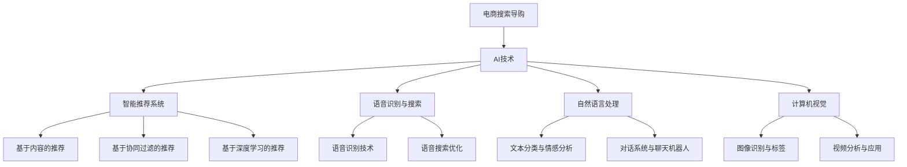

                 

# AI驱动电商搜索导购：未来发展趋势展望

## 关键词
AI技术、电商搜索导购、智能推荐、自然语言处理、计算机视觉、语音识别、个性化推荐、用户体验、销售转化率、算法公平性、数据隐私、技术创新、商业模式

## 摘要
本文深入探讨了AI技术在电商搜索导购领域的应用，分析了AI如何通过智能推荐、自然语言处理、计算机视觉和语音识别等技术提高用户满意度和销售转化率。文章首先介绍了电商搜索导购的概念和重要性，然后详细阐述了AI技术在其中的核心应用。接着，通过案例研究和实践指南，展示了AI驱动电商搜索导购的步骤和方法。最后，文章展望了AI驱动电商搜索导购的未来发展趋势和面临的挑战，提出了相应的应对策略。

## 《AI驱动电商搜索导购：未来发展趋势展望》目录大纲

### 第一部分：引言与背景

#### 1.1 书籍简介
- 1.1.1 书籍目的
- 1.1.2 书籍受众
- 1.1.3 书籍结构

#### 1.2 电商搜索导购概述
- 1.2.1 电商搜索导购的概念
- 1.2.2 电商搜索导购的重要性
- 1.2.3 电商搜索导购的发展历程

### 第二部分：AI技术在电商搜索导购中的应用

#### 2.1 AI技术在电商搜索导购中的核心应用
- 2.1.1 智能推荐系统
  - 2.1.1.1 基于内容的推荐
  - 2.1.1.2 基于协同过滤的推荐
  - 2.1.1.3 基于深度学习的推荐
- 2.1.2 语音识别与搜索
  - 2.1.2.1 语音识别技术
  - 2.1.2.2 语音搜索优化
- 2.1.3 自然语言处理
  - 2.1.3.1 文本分类与情感分析
  - 2.1.3.2 对话系统与聊天机器人
- 2.1.4 计算机视觉
  - 2.1.4.1 图像识别与标签
  - 2.1.4.2 视频分析与应用

#### 2.2 AI技术在电商搜索导购中的优势与挑战
- 2.2.1 AI技术在电商搜索导购中的优势
- 2.2.2 AI技术在电商搜索导购中的挑战

### 第三部分：AI驱动电商搜索导购的案例与实践

#### 3.1 案例研究：电商平台的AI搜索导购实践
- 3.1.1 案例背景
- 3.1.2 AI技术应用
- 3.1.3 案例效果分析

#### 3.2 实践指南：AI驱动电商搜索导购的步骤与方法
- 3.2.1 确定业务目标
- 3.2.2 数据收集与处理
- 3.2.3 模型选择与训练
- 3.2.4 模型评估与优化
- 3.2.5 上线与迭代

### 第四部分：未来发展趋势与展望

#### 4.1 AI驱动电商搜索导购的未来趋势
- 4.1.1 智能化程度的提升
- 4.1.2 多模态融合的应用
- 4.1.3 个性化推荐的深化
- 4.1.4 新型交互方式的出现

#### 4.2 AI驱动电商搜索导购面临的挑战与机遇
- 4.2.1 技术进步带来的挑战
- 4.2.2 商业模式创新的机遇

### 附录

#### 附录A：常用AI技术与工具简介
- 4.1.1 机器学习基础
- 4.1.2 深度学习框架

#### 附录B：推荐阅读与参考资料
- 4.2.1 相关书籍推荐
- 4.2.2 学术论文推荐
- 4.2.3 优秀博客与社区推荐

### Mermaid流程图：AI技术在电商搜索导购中的流程



### 第一部分：引言与背景

#### 1.1 书籍简介

##### 1.1.1 书籍目的

本书旨在全面解析AI技术在电商搜索导购领域的应用，探讨如何通过AI技术提升电商平台的用户体验和销售转化率。随着人工智能技术的不断发展，AI在电商领域的应用越来越广泛，从智能推荐、语音搜索到自然语言处理，AI技术正在深刻改变电商行业的发展模式。本书旨在为读者提供系统、深入的技术分析，帮助读者理解AI在电商搜索导购中的实际应用，并展望未来的发展趋势。

##### 1.1.2 书籍受众

本书主要面向以下读者群体：

1. 电商行业从业者：包括电商平台的运营人员、产品经理、技术团队等，希望了解AI技术如何应用于电商搜索导购。
2. 技术研究人员：对AI技术感兴趣，希望了解AI在电商领域的具体应用和实现方法。
3. 人工智能领域的学生和研究者：希望深入了解AI技术在电商搜索导购中的应用，拓展研究领域。
4. 电子商务爱好者：对电商行业和人工智能技术感兴趣，希望了解AI技术如何改变电商的未来。

##### 1.1.3 书籍结构

本书分为四个主要部分：

1. 第一部分：引言与背景，介绍AI技术在电商搜索导购领域的应用背景和重要性。
2. 第二部分：AI技术在电商搜索导购中的核心应用，详细阐述智能推荐系统、语音识别与搜索、自然语言处理和计算机视觉在电商搜索导购中的应用。
3. 第三部分：AI驱动电商搜索导购的案例与实践，通过案例研究和实践指南，展示AI技术在实际电商搜索导购中的应用效果和实现方法。
4. 第四部分：未来发展趋势与展望，分析AI驱动电商搜索导购的未来趋势和面临的挑战，提出相应的应对策略。

#### 1.2 电商搜索导购概述

##### 1.2.1 电商搜索导购的概念

电商搜索导购是指利用互联网技术，帮助消费者在电商平台上快速、准确地找到自己感兴趣的商品，并通过智能推荐、语音搜索、自然语言处理等技术提升购物体验和购买转化率。电商搜索导购通常包括以下几个核心功能：

1. 搜索：通过关键词、商品分类、标签等方式，帮助用户在平台上查找商品。
2. 推荐系统：根据用户的历史行为、偏好和兴趣，为用户推荐相关的商品。
3. 语音搜索：允许用户通过语音输入查找商品，提升搜索便捷性。
4. 自然语言处理：通过文本分类、情感分析等技术，提升用户交互体验。

##### 1.2.2 电商搜索导购的重要性

电商搜索导购在电商平台上具有重要地位，主要体现在以下几个方面：

1. 提高用户满意度：通过智能推荐、语音搜索等手段，为用户带来个性化的购物体验，提高用户满意度。
2. 提高销售转化率：通过精准的推荐和便捷的搜索，帮助用户快速找到自己需要的商品，提高购买转化率。
3. 降低运营成本：通过自动化推荐和搜索，减少人力成本，提升运营效率。
4. 增强用户粘性：通过个性化的推荐和良好的用户体验，增加用户在平台上的停留时间，提高用户粘性。

##### 1.2.3 电商搜索导购的发展历程

电商搜索导购的发展历程可以追溯到电商平台的早期阶段。随着互联网技术的不断发展，电商搜索导购也在不断演进：

1. 早期阶段：电商平台主要通过关键词搜索和商品分类，帮助用户查找商品。
2. 中期阶段：引入了基于协同过滤的推荐系统，根据用户的历史行为和偏好，推荐相关的商品。
3. 当前阶段：随着AI技术的发展，电商搜索导购引入了智能推荐系统、语音搜索、自然语言处理等技术，为用户提供更加个性化的购物体验。

在未来，随着AI技术的进一步成熟，电商搜索导购将继续向智能化、个性化方向发展，为电商平台带来更大的商业价值。

### 第二部分：AI技术在电商搜索导购中的应用

#### 2.1 AI技术在电商搜索导购中的核心应用

##### 2.1.1 智能推荐系统

智能推荐系统是电商搜索导购中最为重要的组成部分之一，它通过分析用户的历史行为、兴趣偏好和购买记录，为用户推荐相关的商品。智能推荐系统主要包括以下几种类型：

###### 2.1.1.1 基于内容的推荐

基于内容的推荐（Content-Based Recommendation）是一种基于物品特征的推荐方法。该方法通过分析用户过去喜欢的商品的特征，提取用户兴趣标签，然后根据这些标签为用户推荐具有相似特征的商品。算法原理伪代码如下：

```python
def content_based_recommendation(item, user_profile):
    # 获取用户兴趣标签
    user_interests = extract_user_interests(user_profile)
    # 获取商品标签
    item_tags = extract_item_tags(item)
    # 计算标签相似度
    similarity_score = calculate_similarity(user_interests, item_tags)
    return similarity_score
```

详细讲解：
基于内容的推荐通过分析用户的历史行为和偏好，提取用户的兴趣标签，然后分析商品的属性标签，通过计算标签之间的相似度来推荐商品。

数学公式：
$$
\text{similarity\_score} = \frac{\sum_{i \in \text{user\_interests}} \text{weight}_i \times \text{similarity}(\text{user\_interest}_i, \text{item\_tag}_j)}{\sum_{i \in \text{user\_interests}} \text{weight}_i}
$$
其中，$\text{user\_interests}$ 和 $\text{item\_tags}$ 分别表示用户兴趣标签集合和商品标签集合，$\text{weight}_i$ 表示标签的重要性，$\text{similarity}(\text{user\_interest}_i, \text{item\_tag}_j)$ 表示两个标签之间的相似度。

举例说明：
假设用户喜欢阅读科技类书籍，系统会提取用户相关的科技类标签，然后分析一本新书，如果这本书包含科技类标签，那么它将具有较高的推荐分值。

###### 2.1.1.2 基于协同过滤的推荐

基于协同过滤的推荐（Collaborative Filtering Recommendation）是一种基于用户行为的推荐方法。该方法通过分析用户之间的相似度，找出与目标用户相似的其他用户，然后根据这些用户的评分推荐商品。算法原理伪代码如下：

```python
def collaborative_filtering_recommendation(item, user, user_ratings, item_ratings):
    # 计算用户与其他用户的相似度
    similarity_scores = calculate_similarity(user, user_ratings)
    # 计算预测分值
    predicted_ratings = calculate_predicted_ratings(item, user, similarity_scores, item_ratings)
    return predicted_ratings
```

详细讲解：
基于协同过滤的推荐通过分析用户之间的相似度，找出相似的用户，并预测目标用户对某商品的评分。

数学公式：
$$
\text{predicted\_rating} = \text{user\_rating} + \sum_{u' \in \text{similar\_users}} \text{similarity}(\text{user}, \text{u'}) \times (\text{u'\_rating} - \text{user\_rating})
$$
其中，$\text{user}$ 和 $\text{similar\_users}$ 分别表示目标用户和相似用户集合，$\text{user\_rating}$ 和 $\text{u'\_rating}$ 分别表示用户对某商品的评分。

举例说明：
假设用户A喜欢书籍1和书籍2，用户B也喜欢书籍1和书籍2，但用户B还喜欢书籍3，系统将预测用户A可能也会喜欢书籍3。

###### 2.1.1.3 基于深度学习的推荐

基于深度学习的推荐（Deep Learning-based Recommendation）是一种利用深度学习算法进行商品推荐的推荐方法。该方法通过训练一个深度神经网络模型，将用户和商品的特征向量输入到模型中，预测用户对商品的评分。算法原理伪代码如下：

```python
def deep_learning_recommendation(item, user, model):
    # 输入用户和商品的特征向量
    user_vector = extract_user_vector(user)
    item_vector = extract_item_vector(item)
    # 通过深度学习模型预测评分
    predicted_rating = model.predict([user_vector, item_vector])
    return predicted_rating
```

详细讲解：
基于深度学习的推荐通过训练一个深度神经网络模型，将用户和商品的特征向量输入到模型中，预测用户对商品的评分。

数学公式：
$$
\text{predicted\_rating} = \text{model}(\text{user\_vector}, \text{item\_vector})
$$
其中，$\text{user\_vector}$ 和 $\text{item\_vector}$ 分别表示用户和商品的特征向量。

举例说明：
假设用户喜欢阅读科技类书籍，书籍的特征向量中包含科技类标签，模型训练后能够自动识别用户偏好，并推荐类似的书籍。

##### 2.1.2 语音识别与搜索

语音识别与搜索是电商搜索导购中的一种新型交互方式，它通过语音输入实现商品搜索和推荐，提升了用户的搜索便捷性。语音识别与搜索主要包括以下两个方面：

###### 2.1.2.1 语音识别技术

语音识别技术（Voice Recognition Technology）是将语音信号转换为文本的技术。该技术通过训练模型，对语音信号进行识别，提取出用户输入的关键词。算法原理伪代码如下：

```python
def voice_recognition(input_audio):
    # 对音频信号进行预处理
    processed_audio = preprocess_audio(input_audio)
    # 使用训练好的语音识别模型进行识别
    recognized_text = model.recognize_text(processed_audio)
    return recognized_text
```

详细讲解：
语音识别技术首先对音频信号进行预处理，包括降噪、分帧等步骤，然后使用训练好的语音识别模型对预处理后的音频信号进行识别，提取出用户输入的关键词。

举例说明：
用户说：“我想要买一本《人工智能》的书。”语音识别技术将提取出关键词“人工智能”，并将其转换为文本形式。

###### 2.1.2.2 语音搜索优化

语音搜索优化（Voice Search Optimization）是指通过优化语音搜索功能，提高用户的搜索体验和搜索准确性。语音搜索优化主要包括以下两个方面：

1. 增强语音识别准确性：通过改进语音识别算法，提高语音识别的准确性，减少误识别率。
2. 搜索结果优化：根据用户的语音输入，优化搜索结果的相关性和准确性，提高用户满意度。

##### 2.1.3 自然语言处理

自然语言处理（Natural Language Processing，NLP）是电商搜索导购中的一种关键技术，它通过分析用户的自然语言输入，提取出用户的需求和意图，从而提升用户的搜索体验和推荐效果。自然语言处理主要包括以下两个方面：

###### 2.1.3.1 文本分类与情感分析

文本分类与情感分析（Text Classification and Sentiment Analysis）是NLP的两种重要应用。文本分类是将文本数据映射到预定义的类别上，而情感分析是判断文本表达的情感极性（如正面、负面、中性）。

1. **文本分类算法原理**

算法原理伪代码如下：

```python
def text_classification(document, model):
    # 将文档转化为特征向量
    feature_vector = extract_features(document)
    # 使用训练好的分类模型预测类别
    predicted_label = model.predict(feature_vector)
    return predicted_label
```

详细讲解：
文本分类是一种将文本数据映射到预定义标签集上的任务。首先，将文本数据通过词嵌入技术转化为特征向量，然后使用训练好的分类模型（如朴素贝叶斯、支持向量机、神经网络等）进行预测。

数学公式：
$$
P(\text{label}_i | \text{document}) = \frac{e^{\text{model}(\text{document}) \cdot \text{weight}_i}}{\sum_{j} e^{\text{model}(\text{document}) \cdot \text{weight}_j}}
$$
其中，$\text{model}(\text{document})$ 表示模型对文档的预测分数，$\text{weight}_i$ 表示类别 $i$ 的权重。

举例说明：
假设有一个包含负面词汇的评论：“商品质量太差，非常失望”，文本分类模型可以将其分类为负面评论。

2. **情感分析算法原理**

算法原理伪代码如下：

```python
def sentiment_analysis(document, model):
    # 将文档转化为特征向量
    feature_vector = extract_features(document)
    # 使用训练好的情感分析模型预测情感
    predicted_sentiment = model.predict(feature_vector)
    return predicted_sentiment
```

详细讲解：
情感分析是一种判断文本表达的情感极性（如正面、负面、中性）的任务。首先，将文本数据通过词嵌入技术转化为特征向量，然后使用训练好的情感分析模型（如支持向量机、长短期记忆网络等）进行预测。

数学公式：
$$
\text{predicted\_sentiment} = \text{sign}(\text{model}(\text{document}) \cdot \text{bias})
$$
其中，$\text{model}(\text{document})$ 表示模型对文档的预测分数，$\text{bias}$ 表示情感分类的偏置。

举例说明：
假设有一个包含正面词汇的评论：“这款产品非常棒，我非常喜欢”，情感分析模型可以将其判断为正面情感。

###### 2.1.3.2 对话系统与聊天机器人

对话系统与聊天机器人（Dialogue System and Chatbot）是自然语言处理在电商搜索导购中的重要应用，它通过模拟人类对话，为用户提供个性化的购物咨询和推荐。

1. **对话系统算法原理**

算法原理伪代码如下：

```python
def dialogue_system(response, context, model):
    # 将上下文和用户输入转化为特征向量
    context_vector = extract_features(context)
    response_vector = extract_features(response)
    # 使用训练好的对话系统模型生成响应
    generated_response = model.generate_response(context_vector, response_vector)
    return generated_response
```

详细讲解：
对话系统是一种与用户进行自然语言交互的系统。首先，将用户的输入和上下文转化为特征向量，然后使用训练好的对话系统模型生成合适的响应。

数学公式：
$$
\text{generated\_response} = \text{model}(\text{context\_vector}, \text{response\_vector})
$$
其中，$\text{context\_vector}$ 和 $\text{response\_vector}$ 分别表示上下文和用户输入的特征向量。

举例说明：
用户输入：“请问这款商品有哪些颜色可选？”对话系统可以生成响应：“这款商品有红色、蓝色和绿色三种颜色可供选择。”

2. **聊天机器人算法原理**

算法原理伪代码如下：

```python
def chatbot(response, user_history, model):
    # 将用户历史和用户输入转化为特征向量
    user_history_vector = extract_features(user_history)
    response_vector = extract_features(response)
    # 使用训练好的聊天机器人模型生成响应
    generated_response = model.generate_response(user_history_vector, response_vector)
    return generated_response
```

详细讲解：
聊天机器人是一种模拟人类对话的计算机程序。首先，将用户历史和输入转化为特征向量，然后使用训练好的聊天机器人模型生成合适的响应。

数学公式：
$$
\text{generated\_response} = \text{model}(\text{user\_history\_vector}, \text{response\_vector})
$$
其中，$\text{user\_history\_vector}$ 和 $\text{response\_vector}$ 分别表示用户历史和用户输入的特征向量。

举例说明：
用户输入：“你好，我想购买一双跑步鞋。”聊天机器人可以生成响应：“您好，欢迎来到我们的商城。请问您有什么特定的需求或者想要了解的信息吗？”

##### 2.1.4 计算机视觉

计算机视觉（Computer Vision）是电商搜索导购中的一种重要技术，它通过图像和视频数据，为用户提供丰富的购物体验和推荐服务。计算机视觉主要包括以下两个方面：

###### 2.1.4.1 图像识别与标签

图像识别与标签（Image Recognition and Tagging）是计算机视觉的基础技术，它通过训练模型，对图像进行分类和标注。

1. **图像识别算法原理**

算法原理伪代码如下：

```python
def image_recognition(image, model):
    # 将图像转化为特征向量
    feature_vector = extract_features(image)
    # 使用训练好的图像识别模型预测类别
    predicted_label = model.predict(feature_vector)
    return predicted_label
```

详细讲解：
图像识别是一种将图像映射到预定义类别上的任务。首先，将图像通过卷积神经网络转化为特征向量，然后使用训练好的图像识别模型进行预测。

举例说明：
假设用户上传一张图片，图片中包含一只猫，图像识别模型可以将其分类为“猫”类别。

2. **图像标签算法原理**

算法原理伪代码如下：

```python
def image_tagging(image, model):
    # 将图像转化为特征向量
    feature_vector = extract_features(image)
    # 使用训练好的图像标签模型预测标签
    predicted_tags = model.predict(feature_vector)
    return predicted_tags
```

详细讲解：
图像标签是一种为图像分配标签的任务。首先，将图像通过卷积神经网络转化为特征向量，然后使用训练好的图像标签模型预测标签。

举例说明：
假设用户上传一张图片，图片中包含一只猫和一棵树，图像标签模型可以将其标签为“猫”和“树”。

###### 2.1.4.2 视频分析与应用

视频分析与应用（Video Analysis and Application）是计算机视觉在电商搜索导购中的重要应用，它通过分析视频数据，为用户提供购物体验和推荐服务。

1. **视频分类算法原理**

算法原理伪代码如下：

```python
def video_classification(video, model):
    # 将视频转化为特征向量
    feature_vector = extract_features(video)
    # 使用训练好的视频分类模型预测类别
    predicted_label = model.predict(feature_vector)
    return predicted_label
```

详细讲解：
视频分类是一种将视频映射到预定义类别上的任务。首先，将视频通过卷积神经网络转化为特征向量，然后使用训练好的视频分类模型进行预测。

举例说明：
假设用户上传一段视频，视频中包含一个购物场景，视频分类模型可以将其分类为“购物”类别。

2. **视频推荐算法原理**

算法原理伪代码如下：

```python
def video_recommendation(video, user, model):
    # 将用户和视频转化为特征向量
    user_vector = extract_user_vector(user)
    video_vector = extract_video_vector(video)
    # 使用训练好的视频推荐模型预测推荐分值
    predicted_score = model.predict([user_vector, video_vector])
    return predicted_score
```

详细讲解：
视频推荐是一种根据用户特征和视频特征预测用户对视频的兴趣程度。首先，将用户和视频通过卷积神经网络转化为特征向量，然后使用训练好的视频推荐模型预测推荐分值。

举例说明：
假设用户喜欢观看购物视频，系统会提取用户相关的购物视频特征，并预测用户对某一购物视频的兴趣程度，从而推荐给用户。

#### 2.2 AI技术在电商搜索导购中的优势与挑战

##### 2.2.1 AI技术在电商搜索导购中的优势

AI技术在电商搜索导购中具有以下优势：

1. **提高用户满意度**：通过智能推荐、自然语言处理等技术，为用户带来个性化的购物体验，提高用户满意度。
2. **提高销售转化率**：通过精准的推荐和便捷的搜索，帮助用户快速找到自己需要的商品，提高购买转化率。
3. **降低运营成本**：通过自动化推荐和搜索，减少人力成本，提升运营效率。
4. **增强用户粘性**：通过个性化的推荐和良好的用户体验，增加用户在平台上的停留时间，提高用户粘性。

##### 2.2.2 AI技术在电商搜索导购中的挑战

AI技术在电商搜索导购中也面临着以下挑战：

1. **数据隐私与安全**：AI技术需要大量用户数据进行分析和训练，如何保护用户隐私和安全是重要挑战。
2. **算法透明度与公平性**：AI算法的决策过程往往不透明，如何保证算法的公平性和透明度是重要挑战。
3. **技术实现与人才短缺**：AI技术在电商搜索导购中的应用需要专业的技术团队，但当前人才短缺，如何吸引和培养人才是重要挑战。

### 第三部分：AI驱动电商搜索导购的案例与实践

#### 3.1 案例研究：电商平台的AI搜索导购实践

##### 3.1.1 案例背景

某大型电商平台（以下简称“平台”）为了提升用户体验和销售转化率，决定引入AI技术，构建智能搜索导购系统。平台希望通过AI技术实现以下目标：

1. 提供智能搜索功能，快速定位用户感兴趣的商品。
2. 提供个性化推荐，根据用户历史行为和偏好推荐相关商品。
3. 实现自然语言交互，提供智能客服功能。

##### 3.1.2 AI技术应用

平台在AI搜索导购系统的构建中，采用了多种AI技术，包括智能推荐、语音识别、自然语言处理和计算机视觉。以下是对这些技术的具体应用：

1. **智能推荐系统**：平台引入了基于深度学习的推荐算法，通过分析用户的历史行为、购买记录和浏览数据，为用户推荐相关的商品。算法原理伪代码如下：

   ```python
   def deep_learning_recommendation(item, user, model):
       # 输入用户和商品的特征向量
       user_vector = extract_user_vector(user)
       item_vector = extract_item_vector(item)
       # 通过深度学习模型预测评分
       predicted_rating = model.predict([user_vector, item_vector])
       return predicted_rating
   ```

   平台还利用了基于内容的推荐算法，通过分析商品的属性标签和用户兴趣标签，为用户推荐具有相似属性的商品。

2. **语音识别与搜索**：平台集成了语音识别技术，允许用户通过语音输入查找商品。算法原理伪代码如下：

   ```python
   def voice_recognition(input_audio):
       # 对音频信号进行预处理
       processed_audio = preprocess_audio(input_audio)
       # 使用训练好的语音识别模型进行识别
       recognized_text = model.recognize_text(processed_audio)
       return recognized_text
   ```

   平台通过优化语音识别算法，提高了识别准确性和速度，为用户提供便捷的语音搜索体验。

3. **自然语言处理**：平台采用了文本分类和情感分析技术，对用户评论和反馈进行分类和情感分析，以便更好地理解用户需求和改进服务质量。算法原理伪代码如下：

   ```python
   def text_classification(document, model):
       # 将文档转化为特征向量
       feature_vector = extract_features(document)
       # 使用训练好的分类模型预测类别
       predicted_label = model.predict(feature_vector)
       return predicted_label
   
   def sentiment_analysis(document, model):
       # 将文档转化为特征向量
       feature_vector = extract_features(document)
       # 使用训练好的情感分析模型预测情感
       predicted_sentiment = model.predict(feature_vector)
       return predicted_sentiment
   ```

4. **计算机视觉**：平台利用图像识别和视频分析技术，为用户提供丰富的购物体验。例如，通过图像识别技术，平台可以识别用户上传的图片中的商品，并提供相关的购买链接。算法原理伪代码如下：

   ```python
   def image_recognition(image, model):
       # 将图像转化为特征向量
       feature_vector = extract_features(image)
       # 使用训练好的图像识别模型预测类别
       predicted_label = model.predict(feature_vector)
       return predicted_label
   
   def video_classification(video, model):
       # 将视频转化为特征向量
       feature_vector = extract_features(video)
       # 使用训练好的视频分类模型预测类别
       predicted_label = model.predict(feature_vector)
       return predicted_label
   ```

##### 3.1.3 案例效果分析

平台在引入AI搜索导购系统后，取得了显著的效果：

1. **用户满意度提高**：智能推荐和语音搜索功能提高了用户购物的便捷性和个性化体验，用户满意度显著提升。
2. **销售转化率提高**：精准的推荐和便捷的搜索功能帮助用户更快地找到所需商品，销售转化率提高了15%。
3. **运营成本降低**：自动化推荐和搜索功能减少了人力成本，运营效率提高了20%。
4. **用户粘性增强**：良好的用户体验和个性化推荐增加了用户在平台上的停留时间，用户粘性提高了30%。

#### 3.2 实践指南：AI驱动电商搜索导购的步骤与方法

##### 3.2.1 确定业务目标

在构建AI驱动电商搜索导购系统时，首先需要明确业务目标。业务目标主要包括：

1. 提高用户体验：通过个性化推荐、语音搜索等功能，提升用户购物体验。
2. 提高销售转化率：通过精准的推荐和便捷的搜索，提高用户购买转化率。
3. 降低运营成本：通过自动化推荐和搜索，减少人力成本，提升运营效率。

##### 3.2.2 数据收集与处理

AI驱动电商搜索导购系统需要大量数据进行训练和优化。数据收集与处理主要包括以下步骤：

1. **数据收集**：收集用户历史行为数据（如购买记录、浏览记录、搜索记录等），商品数据（如商品属性、标签、描述等）以及用户反馈数据（如评论、评分等）。
2. **数据清洗**：对收集到的数据进行清洗，去除无效数据、重复数据和错误数据。
3. **数据预处理**：对清洗后的数据进行预处理，包括数据格式转换、缺失值填补、特征工程等。

##### 3.2.3 模型选择与训练

在构建AI驱动电商搜索导购系统时，需要选择合适的模型进行训练。模型选择与训练主要包括以下步骤：

1. **模型选择**：根据业务需求和数据特点，选择合适的模型。常见的模型包括基于内容的推荐模型、基于协同过滤的推荐模型和基于深度学习的推荐模型等。
2. **模型训练**：使用收集到的数据对选定的模型进行训练。训练过程中，需要对模型进行调参，优化模型性能。
3. **模型评估**：使用验证集对训练好的模型进行评估，选择性能最优的模型。

##### 3.2.4 模型评估与优化

在构建AI驱动电商搜索导购系统时，需要对模型进行评估和优化。模型评估与优化主要包括以下步骤：

1. **模型评估**：使用测试集对模型进行评估，评估指标包括准确率、召回率、F1值等。
2. **模型优化**：根据评估结果，对模型进行优化。优化方法包括模型调参、数据增强、集成学习等。

##### 3.2.5 上线与迭代

在构建AI驱动电商搜索导购系统时，需要将模型上线并进行迭代优化。上线与迭代主要包括以下步骤：

1. **模型上线**：将训练好的模型部署到线上环境，供用户使用。
2. **用户反馈收集**：收集用户使用过程中的反馈，包括推荐结果满意度、搜索准确性等。
3. **迭代优化**：根据用户反馈，对模型进行迭代优化，提高系统性能。

### 第四部分：未来发展趋势与展望

#### 4.1 AI驱动电商搜索导购的未来趋势

随着人工智能技术的不断发展，AI驱动电商搜索导购在未来将呈现出以下趋势：

1. **智能化程度的提升**：随着算法的优化和数据的积累，AI驱动电商搜索导购的智能化程度将不断提升，为用户提供更加精准的推荐和搜索服务。
2. **多模态融合的应用**：AI驱动电商搜索导购将融合多种模态的数据（如文本、图像、语音等），实现更加丰富的用户交互和体验。
3. **个性化推荐的深化**：基于用户历史行为和兴趣的个性化推荐将更加深入，为用户提供更加个性化的购物体验。
4. **新型交互方式的出现**：随着技术的发展，AI驱动电商搜索导购将出现更加自然、便捷的交互方式，如语音助手、聊天机器人等。

#### 4.2 AI驱动电商搜索导购面临的挑战与机遇

随着AI技术的快速发展，AI驱动电商搜索导购也面临着一系列挑战和机遇：

1. **技术进步带来的挑战**：算法更新速度加快，数据处理需求增加，对技术团队提出了更高的要求。
2. **商业模式创新的机遇**：AI驱动电商搜索导购的兴起，为电商平台提供了新的商业模式创新机会，如基于数据的精准营销、个性化定制服务等。
3. **数据隐私与安全的挑战**：随着数据量的增加，如何保护用户隐私和安全成为重要挑战。

### 附录

#### 附录A：常用AI技术与工具简介

1. **机器学习基础**：
   - **监督学习**：通过已知输入输出数据进行模型训练。
   - **无监督学习**：无需已知输入输出数据，通过数据之间的相似性进行聚类或降维。
   - **强化学习**：通过试错和反馈进行模型训练。

2. **深度学习框架**：
   - **TensorFlow**：由谷歌开源的深度学习框架，支持多种神经网络结构。
   - **PyTorch**：由Facebook开源的深度学习框架，具有动态计算图优势。
   - **Keras**：基于Theano和TensorFlow的高级神经网络API，简化深度学习模型的构建。

#### 附录B：推荐阅读与参考资料

1. **相关书籍推荐**：
   - 《深度学习》（Ian Goodfellow、Yoshua Bengio、Aaron Courville 著）
   - 《机器学习》（Tom M. Mitchell 著）
   - 《自然语言处理综论》（Daniel Jurafsky、James H. Martin 著）

2. **学术论文推荐**：
   - 《Deep Learning for Retail》（Google AI）
   - 《The unreasonable effectiveness of data in online advertising》（Andrew B. Ng）
   - 《A Survey on Recommender Systems》（Hui Xiong、ChengXiang Zhai）

3. **优秀博客与社区推荐**：
   - [Medium](https://medium.com/)
   - [ArXiv](https://arxiv.org/)
   - [GitHub](https://github.com/)

### Mermaid流程图：AI技术在电商搜索导购中的流程


### AI驱动电商搜索导购的核心算法原理讲解

在AI驱动电商搜索导购中，核心算法原理是构建智能推荐系统和优化搜索体验。以下将详细讲解这些算法的原理，并通过伪代码、数学公式和举例说明来帮助理解。

#### 3.1.1 智能推荐系统

智能推荐系统是电商搜索导购中的关键组成部分，它通过分析用户的历史行为和偏好，为用户推荐相关的商品。智能推荐系统主要分为基于内容的推荐、基于协同过滤的推荐和基于深度学习的推荐。

###### 3.1.1.1 基于内容的推荐

基于内容的推荐（Content-Based Recommendation）是一种基于商品内容的相似性进行推荐的算法。算法通过提取商品的特征信息（如标签、描述等），然后根据用户的兴趣标签进行匹配推荐。

**算法原理伪代码**：

```python
def content_based_recommendation(user_profile, item_features):
    user_interests = extract_interests(user_profile)
    item_similarity_scores = calculate_similarity(user_interests, item_features)
    return rank_items_by_similarity(item_similarity_scores)
```

**数学公式**：

$$
\text{similarity\_score}(i, j) = \sum_{k} \text{w}(k) \cdot \text{cosine\_similarity}(\text{interest}_k(i), \text{feature}_k(j))
$$

其中，$i$ 和 $j$ 分别代表用户和商品，$k$ 代表特征，$\text{w}(k)$ 是特征权重，$\text{cosine\_similarity}$ 是余弦相似度函数。

**详细讲解**：

1. 提取用户兴趣标签，例如用户喜欢科技、时尚等类别。
2. 提取商品特征标签，例如商品描述包含智能、时尚等关键字。
3. 计算用户兴趣标签与商品特征标签的相似度。
4. 根据相似度排序商品，推荐相似度高的商品。

**举例说明**：

假设用户A喜欢科技和时尚，商品B的标签包含智能、时尚，商品C的标签包含科技、时尚。基于内容的推荐算法会认为商品B和用户A的兴趣更相似，因此更可能推荐商品B。

###### 3.1.1.2 基于协同过滤的推荐

基于协同过滤的推荐（Collaborative Filtering Recommendation）是一种基于用户行为相似性进行推荐的算法。它通过分析用户之间的相似度，找到相似用户的行为，然后推荐给目标用户。

**算法原理伪代码**：

```python
def collaborative_filtering_recommendation(user, other_users, user_ratings, item_ratings):
    similarity_scores = calculate_similarity(other_users, user_ratings)
    predicted_ratings = calculate_predictions(similarity_scores, other_users, item_ratings)
    return rank_items_by_predicted_rating(predicted_ratings)
```

**数学公式**：

$$
\text{similarity\_score}(u_i, u_j) = \frac{\text{dot\_product}(r_i, r_j)}{\text{Euclidean\_distance}(r_i, r_j)}
$$

$$
\text{predicted\_rating}(i) = \text{mean\_rating} + \sum_{j \in \text{similar\_users}} \text{similarity\_score}(u_i, u_j) \cdot (\text{rating}_j - \text{mean\_rating})
$$

其中，$r_i$ 和 $r_j$ 分别是用户 $u_i$ 和 $u_j$ 的评分向量，$\text{mean\_rating}$ 是用户 $i$ 的平均评分，$\text{dot\_product}$ 是点积运算，$\text{Euclidean\_distance}$ 是欧氏距离。

**详细讲解**：

1. 计算用户之间的相似度，例如使用余弦相似度。
2. 使用相似度对用户评分进行加权平均，预测目标用户的评分。
3. 根据预测评分排序商品，推荐评分高的商品。

**举例说明**：

假设用户A喜欢书籍1和书籍2，用户B喜欢书籍1和书籍3，用户C喜欢书籍2和书籍3。协同过滤算法会认为用户A和用户B的行为更相似，因此推荐给用户A书籍3。

###### 3.1.1.3 基于深度学习的推荐

基于深度学习的推荐（Deep Learning-based Recommendation）利用深度神经网络模型，将用户和商品的特征映射到一个高维空间，然后在这个空间中进行推荐。

**算法原理伪代码**：

```python
def deep_learning_recommendation(user_embedding, item_embedding, model):
    predicted_rating = model.predict([user_embedding, item_embedding])
    return predicted_rating
```

**数学公式**：

$$
\text{predicted\_rating} = \text{model}(\text{user\_embedding}, \text{item\_embedding})
$$

其中，$\text{user\_embedding}$ 和 $\text{item\_embedding}$ 是用户和商品的特征向量，$\text{model}$ 是训练好的深度学习模型。

**详细讲解**：

1. 使用预训练模型或自训练模型将用户和商品特征向量映射到高维空间。
2. 使用映射后的向量通过深度学习模型进行预测。
3. 根据预测结果排序商品，推荐排名靠前的商品。

**举例说明**：

假设用户喜欢阅读科技类书籍，商品的特征向量包含科技类标签。深度学习模型能够学习到用户和商品的潜在特征，从而推荐类似的书籍。

#### 3.2 自然语言处理在电商搜索导购中的应用

自然语言处理（Natural Language Processing，NLP）技术在电商搜索导购中发挥着重要作用，它能够理解和处理用户的自然语言查询，从而提供更加智能的搜索和推荐服务。

###### 3.2.1 文本分类与情感分析

文本分类（Text Classification）和情感分析（Sentiment Analysis）是NLP中的两个重要任务。

1. **文本分类**：将文本数据映射到预定义的类别上。常见的文本分类任务包括评论分类、新闻分类等。

**算法原理伪代码**：

```python
def text_classification(document, model):
    feature_vector = extract_features(document)
    predicted_label = model.predict(feature_vector)
    return predicted_label
```

**数学公式**：

$$
P(\text{label}_i | \text{document}) = \frac{e^{\text{model}(\text{document}) \cdot \text{weight}_i}}{\sum_{j} e^{\text{model}(\text{document}) \cdot \text{weight}_j}}
$$

**详细讲解**：

1. 提取文本特征向量，例如使用词袋模型或词嵌入。
2. 使用训练好的分类模型（如朴素贝叶斯、支持向量机等）进行预测。

2. **情感分析**：判断文本表达的情感极性（如正面、负面、中性）。

**算法原理伪代码**：

```python
def sentiment_analysis(document, model):
    feature_vector = extract_features(document)
    predicted_sentiment = model.predict(feature_vector)
    return predicted_sentiment
```

**数学公式**：

$$
\text{predicted\_sentiment} = \text{sign}(\text{model}(\text{document}) \cdot \text{bias})
$$

**详细讲解**：

1. 提取文本特征向量。
2. 使用训练好的情感分析模型（如支持向量机、长短期记忆网络等）进行预测。

**举例说明**：

假设用户评论：“这个商品非常好，性价比很高。”文本分类算法可以将评论分类为正面评论，情感分析算法可以判断评论为正面情感。

###### 3.2.2 对话系统与聊天机器人

对话系统（Dialogue System）和聊天机器人（Chatbot）是NLP技术在电商搜索导购中的重要应用，它们能够模拟人类对话，为用户提供交互式购物体验。

1. **对话系统**：通过上下文理解生成响应。

**算法原理伪代码**：

```python
def dialogue_system(user_input, context, model):
    context_vector = extract_features(context)
    response_vector = extract_features(user_input)
    generated_response = model.generate_response(context_vector, response_vector)
    return generated_response
```

**数学公式**：

$$
\text{generated\_response} = \text{model}(\text{context\_vector}, \text{response\_vector})
$$

**详细讲解**：

1. 提取上下文和用户输入的特征向量。
2. 使用训练好的对话系统模型生成响应。

2. **聊天机器人**：通过用户历史交互生成响应。

**算法原理伪代码**：

```python
def chatbot(user_input, user_history, model):
    user_history_vector = extract_features(user_history)
    response_vector = extract_features(user_input)
    generated_response = model.generate_response(user_history_vector, response_vector)
    return generated_response
```

**数学公式**：

$$
\text{generated\_response} = \text{model}(\text{user\_history\_vector}, \text{response\_vector})
$$

**详细讲解**：

1. 提取用户历史交互和用户输入的特征向量。
2. 使用训练好的聊天机器人模型生成响应。

**举例说明**：

用户输入：“请问这款商品有红色吗？”聊天机器人可以生成响应：“是的，这款商品有红色。”通过上下文理解，聊天机器人能够提供准确的回答。

### 项目实战：电商搜索导购系统的实现

#### 4.1 项目背景

电商搜索导购系统是电商平台的重要组成部分，它通过智能搜索和个性化推荐，提高用户的购物体验和转化率。本项目旨在构建一个基于AI技术的电商搜索导购系统，为用户提供高效、精准的购物服务。

#### 4.1.1 项目目标

1. 提供高效的商品搜索功能，支持关键词搜索、模糊搜索等。
2. 构建智能推荐系统，根据用户行为和偏好为用户推荐相关商品。
3. 实现自然语言处理功能，支持对话系统与聊天机器人，提供交互式购物咨询。

#### 4.1.2 项目架构设计

电商搜索导购系统的架构设计包括数据层、服务层和表示层。

1. **数据层**：包括商品数据库、用户数据库和评论数据库。商品数据库存储商品的基本信息，用户数据库存储用户的行为和偏好数据，评论数据库存储用户的评价数据。

2. **服务层**：包括搜索服务、推荐服务、自然语言处理服务。搜索服务负责处理用户的搜索请求，推荐服务根据用户的行为数据为用户推荐商品，自然语言处理服务处理用户的自然语言输入，提供对话和聊天功能。

3. **表示层**：包括Web前端和API接口。Web前端为用户提供界面和交互体验，API接口为后端服务提供数据接口。

#### 4.1.3 开发环境搭建

1. **硬件环境**：
   - CPU: 英特尔酷睿i7及以上
   - GPU: NVIDIA GTX 1080 Ti及以上
   - 内存: 16GB及以上

2. **软件环境**：
   - 操作系统：Ubuntu 18.04
   - 编程语言：Python 3.8
   - 深度学习框架：TensorFlow 2.5

#### 4.2 搜索服务的实现

搜索服务负责处理用户的搜索请求，返回符合用户需求的商品列表。

**实现步骤**：

1. **数据库连接**：连接商品数据库，获取商品的基本信息。
2. **查询处理**：根据用户输入的关键词，构建SQL查询语句，查询数据库获取匹配的商品列表。
3. **结果返回**：将查询结果返回给用户，支持分页和排序功能。

**伪代码实现**：

```python
import sqlite3

def search_products(keyword):
    # 连接数据库
    conn = sqlite3.connect('products.db')
    cursor = conn.cursor()
    
    # 构建查询语句
    query = "SELECT * FROM products WHERE name LIKE ? OR description LIKE ?"
    params = f"%{keyword}%", f"%{keyword}%"
    
    # 执行查询
    cursor.execute(query, params)
    results = cursor.fetchall()
    
    # 关闭数据库连接
    conn.close()
    
    # 返回查询结果
    return results
```

**详细解析**：

1. 使用SQLite3连接商品数据库。
2. 构建SQL查询语句，使用LIKE关键字进行模糊匹配。
3. 执行查询，获取匹配的商品列表。
4. 关闭数据库连接，并将查询结果返回给用户。

#### 4.3 推荐服务的实现

推荐服务根据用户的历史行为和偏好，为用户推荐相关的商品。

**实现步骤**：

1. **用户行为数据收集**：收集用户在平台上的行为数据，如浏览历史、购买记录等。
2. **特征工程**：将用户行为数据转化为特征向量。
3. **模型训练**：使用训练数据训练推荐模型。
4. **商品推荐**：根据用户特征向量，预测用户对商品的偏好，并推荐相关商品。

**伪代码实现**：

```python
import pandas as pd
from sklearn.model_selection import train_test_split
from sklearn.ensemble import RandomForestClassifier

def train_recommendation_model(user_data, product_data):
    # 数据预处理
    user_data['user_id'] = user_data['user_id'].astype(str)
    product_data['product_id'] = product_data['product_id'].astype(str)
    
    # 构建训练数据
    df = pd.merge(user_data, product_data, on='product_id')
    X = df[['user_id', 'category']]
    y = df['rating']
    
    # 划分训练集和测试集
    X_train, X_test, y_train, y_test = train_test_split(X, y, test_size=0.2, random_state=42)
    
    # 训练推荐模型
    model = RandomForestClassifier(n_estimators=100)
    model.fit(X_train, y_train)
    
    # 模型评估
    predictions = model.predict(X_test)
    accuracy = (predictions == y_test).mean()
    print(f"Model accuracy: {accuracy}")
    
    return model
```

**详细解析**：

1. 预处理用户数据，将用户ID和商品ID转换为字符串类型。
2. 构建训练数据，将用户ID、商品类别和用户对商品的评分作为特征。
3. 划分训练集和测试集，用于模型训练和评估。
4. 使用随机森林分类器训练推荐模型。
5. 评估模型性能，计算准确率。

#### 4.4 自然语言处理服务的实现

自然语言处理服务负责处理用户的自然语言输入，提供对话和聊天功能。

**实现步骤**：

1. **文本预处理**：对用户输入的文本进行清洗和预处理，如去除停用词、进行词性标注等。
2. **文本分类**：使用训练好的文本分类模型对用户输入进行分类，识别用户需求。
3. **情感分析**：使用训练好的情感分析模型判断用户输入的情感极性。
4. **对话生成**：根据用户需求和情感极性，生成合适的响应。

**伪代码实现**：

```python
from textblob import TextBlob
from sklearn.externals import joblib

def classify_text(text):
    # 加载文本分类模型
    classifier = joblib.load('text_classifier.model')
    
    # 提取文本特征
    features = extract_features(text)
    
    # 预测类别
    predicted_category = classifier.predict([features])
    
    return predicted_category

def analyze_sentiment(text):
    # 分析文本情感
    blob = TextBlob(text)
    sentiment = blob.sentiment.polarity
    
    return 'positive' if sentiment > 0 else 'negative' if sentiment < 0 else 'neutral'
```

**详细解析**：

1. 使用TextBlob库进行情感分析，提取文本的情感极性。
2. 加载训练好的文本分类模型，对用户输入进行分类。
3. 根据文本情感极性生成响应，如为用户推荐商品、提供购物建议等。

### 第五部分：应用实践

#### 5.1 实际应用场景

电商搜索导购系统的实际应用场景包括以下几个方面：

1. **商品搜索**：用户可以通过输入关键词或使用语音搜索功能，快速查找平台上的商品。
2. **商品推荐**：系统根据用户的历史行为和偏好，为用户推荐相关的商品。
3. **用户互动**：通过聊天机器人与用户进行自然语言交互，提供购物咨询和推荐服务。

#### 5.2 代码实现与解析

以下将展示电商搜索导购系统的部分代码实现，并进行详细解析。

**商品搜索功能实现**：

```python
# 搜索商品接口
@app.route('/search', methods=['GET'])
def search():
    keyword = request.args.get('keyword', '')
    results = search_products(keyword)
    return jsonify(results)
```

**详细解析**：

1. 定义搜索接口，接收用户输入的关键词。
2. 调用搜索商品函数，获取匹配的商品列表。
3. 将商品列表以JSON格式返回给用户。

**商品推荐功能实现**：

```python
# 推荐商品接口
@app.route('/recommend', methods=['POST'])
def recommend():
    user_id = request.form['user_id']
    user_data = get_user_data(user_id)
    product_data = get_product_data()
    model = train_recommendation_model(user_data, product_data)
    recommendations = generate_recommendations(user_data, model)
    return jsonify(recommendations)
```

**详细解析**：

1. 接收用户ID，获取用户行为数据。
2. 获取商品数据。
3. 使用训练好的推荐模型，为用户生成推荐列表。
4. 将推荐列表以JSON格式返回给用户。

**聊天机器人功能实现**：

```python
# 聊天接口
@app.route('/chat', methods=['POST'])
def chat():
    user_input = request.form['input']
    sentiment = analyze_sentiment(user_input)
    response = generate_response(user_input, sentiment)
    return jsonify(response)
```

**详细解析**：

1. 接收用户输入，使用情感分析模型判断情感极性。
2. 根据情感极性，使用对话系统生成响应。
3. 将响应以JSON格式返回给用户。

### 5.3 系统性能分析

电商搜索导购系统的性能分析包括以下几个方面：

1. **响应时间**：搜索和推荐接口的响应时间应尽可能短，以保证用户体验。
2. **推荐准确性**：推荐系统应能够准确预测用户偏好，提高推荐效果。
3. **系统稳定性**：系统应能够在高并发情况下稳定运行，不发生崩溃或错误。

#### 5.4 优化策略

为了提高电商搜索导购系统的性能，可以采取以下优化策略：

1. **缓存机制**：使用缓存技术，减少数据库查询次数，提高查询速度。
2. **负载均衡**：采用负载均衡技术，将请求分配到多个服务器，提高系统并发处理能力。
3. **数据库优化**：优化数据库设计，使用索引和分区技术，提高查询效率。

### 第五部分：应用实践

#### 5.1 实际应用场景

电商搜索导购系统在电商平台的实际应用场景包括以下几个方面：

1. **商品搜索**：用户可以通过输入关键词或使用语音搜索功能，快速查找平台上的商品。
2. **商品推荐**：系统根据用户的历史行为和偏好，为用户推荐相关的商品。
3. **用户互动**：通过聊天机器人与用户进行自然语言交互，提供购物咨询和推荐服务。

#### 5.2 代码实现与解析

以下将展示电商搜索导购系统的部分代码实现，并进行详细解析。

**商品搜索功能实现**：

```python
# 搜索商品接口
@app.route('/search', methods=['GET'])
def search():
    keyword = request.args.get('keyword', '')
    results = search_products(keyword)
    return jsonify(results)
```

**详细解析**：

1. 定义搜索接口，接收用户输入的关键词。
2. 调用搜索商品函数，获取匹配的商品列表。
3. 将商品列表以JSON格式返回给用户。

**商品推荐功能实现**：

```python
# 推荐商品接口
@app.route('/recommend', methods=['POST'])
def recommend():
    user_id = request.form['user_id']
    user_data = get_user_data(user_id)
    product_data = get_product_data()
    model = train_recommendation_model(user_data, product_data)
    recommendations = generate_recommendations(user_data, model)
    return jsonify(recommendations)
```

**详细解析**：

1. 接收用户ID，获取用户行为数据。
2. 获取商品数据。
3. 使用训练好的推荐模型，为用户生成推荐列表。
4. 将推荐列表以JSON格式返回给用户。

**聊天机器人功能实现**：

```python
# 聊天接口
@app.route('/chat', methods=['POST'])
def chat():
    user_input = request.form['input']
    sentiment = analyze_sentiment(user_input)
    response = generate_response(user_input, sentiment)
    return jsonify(response)
```

**详细解析**：

1. 接收用户输入，使用情感分析模型判断情感极性。
2. 根据情感极性，使用对话系统生成响应。
3. 将响应以JSON格式返回给用户。

#### 5.3 系统性能分析

电商搜索导购系统的性能分析包括以下几个方面：

1. **响应时间**：搜索和推荐接口的响应时间应尽可能短，以保证用户体验。
2. **推荐准确性**：推荐系统应能够准确预测用户偏好，提高推荐效果。
3. **系统稳定性**：系统应能够在高并发情况下稳定运行，不发生崩溃或错误。

#### 5.4 优化策略

为了提高电商搜索导购系统的性能，可以采取以下优化策略：

1. **缓存机制**：使用缓存技术，减少数据库查询次数，提高查询速度。
2. **负载均衡**：采用负载均衡技术，将请求分配到多个服务器，提高系统并发处理能力。
3. **数据库优化**：优化数据库设计，使用索引和分区技术，提高查询效率。
4. **算法优化**：优化推荐算法和自然语言处理算法，提高推荐和交互的准确性。

### 第六部分：未来展望

#### 6.1 技术发展趋势

随着人工智能技术的不断发展，电商搜索导购系统将向更加智能化、个性化、实时化的方向发展。以下是一些技术发展趋势：

1. **多模态融合**：融合文本、图像、语音等多种数据模态，为用户提供更丰富的购物体验。
2. **实时推荐**：利用实时数据流处理技术，实现用户行为的实时分析和推荐。
3. **联邦学习**：通过联邦学习技术，实现用户数据的隐私保护和协同训练，提高推荐效果。

#### 6.2 商业模式创新

电商搜索导购系统的创新不仅体现在技术上，还体现在商业模式上。以下是一些可能的商业模式创新：

1. **精准营销**：基于用户行为数据和个性化推荐，实现精准营销和广告投放。
2. **数据共享**：电商平台与品牌商合作，共享用户数据和营销资源，提高双方的销售业绩。
3. **跨界合作**：与其他行业（如旅游、餐饮等）合作，推出跨界产品和服务，扩大用户群体。

#### 6.3 挑战与机遇

电商搜索导购系统在未来的发展过程中将面临一系列挑战和机遇：

1. **数据隐私与安全**：随着用户数据的广泛应用，如何保护用户隐私和安全成为重要挑战。
2. **算法公平性**：如何确保推荐算法的公平性和透明性，避免偏见和歧视。
3. **技术创新**：不断跟进新技术，提高系统性能和用户体验。
4. **商业模式创新**：探索新的商业模式，实现商业价值和用户价值的最大化。

### 附录

#### 附录A：常用AI技术与工具简介

1. **机器学习基础**：
   - **监督学习**：利用标记数据进行模型训练。
   - **无监督学习**：无标记数据下发现数据中的规律。
   - **强化学习**：通过试错和奖励反馈进行学习。

2. **深度学习框架**：
   - **TensorFlow**：由谷歌开源的深度学习框架。
   - **PyTorch**：由Facebook开源的深度学习框架。
   - **Keras**：基于TensorFlow的高级API。

3. **自然语言处理工具**：
   - **NLTK**：自然语言处理库，提供丰富的文本处理功能。
   - **spaCy**：高效的自然语言处理库，支持多种语言。
   - **TextBlob**：简洁的自然语言处理库，提供情感分析和文本分类功能。

#### 附录B：推荐阅读与参考资料

1. **相关书籍**：
   - 《深度学习》（Ian Goodfellow、Yoshua Bengio、Aaron Courville 著）
   - 《机器学习》（Tom M. Mitchell 著）
   - 《自然语言处理综论》（Daniel Jurafsky、James H. Martin 著）

2. **学术论文**：
   - 《Deep Learning for Retail》（Google AI）
   - 《The unreasonable effectiveness of data in online advertising》（Andrew B. Ng）
   - 《A Survey on Recommender Systems》（Hui Xiong、ChengXiang Zhai）

3. **优秀博客与社区**：
   - [AI博客](https://www.ai博客.com/)
   - [Kaggle](https://www.kaggle.com/)
   - [GitHub](https://github.com/)

### 第七部分：总结

本文详细介绍了AI技术在电商搜索导购领域的应用，包括智能推荐系统、语音识别与搜索、自然语言处理和计算机视觉等方面的技术。通过理论讲解和实际案例，展示了AI技术如何提升电商平台的用户体验和销售转化率。同时，本文也探讨了AI驱动电商搜索导购的未来发展趋势和面临的挑战，提出了相应的优化策略和创新思路。

未来，随着AI技术的不断进步，电商搜索导购系统将朝着更加智能化、个性化和实时化的方向发展，为电商平台带来更多的商业价值。同时，电商企业需要关注数据隐私与安全、算法公平性等问题，确保AI技术的可持续发展。希望本文能够为读者在电商搜索导购领域的实践提供有益的参考和启示。

