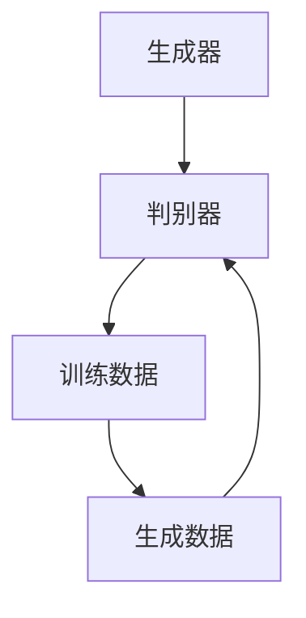
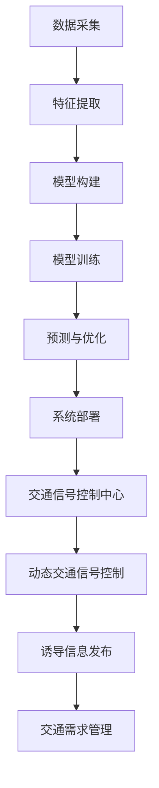

                 

# 《AIGC在智能交通拥堵预测与疏导中的应用》

关键词：AIGC、智能交通、拥堵预测、疏导策略、案例研究、开发实践

摘要：本文深入探讨了AIGC（自适应智能生成控制）在智能交通拥堵预测与疏导中的应用。通过详细阐述AIGC的核心概念、算法原理，以及其在交通领域的实际应用，本文为读者提供了关于AIGC技术如何有效缓解城市交通拥堵的新见解。文章还通过案例研究和实战指南，为开发者提供了实施AIGC解决方案的实用方法和经验。

---

### 第一部分: AIGC基础

#### 第1章: AIGC概述

##### 1.1.1 AIGC的定义与背景

**AIGC（Adaptive Intelligent Generation Control）**，即自适应智能生成控制，是一种融合了生成对抗网络（GAN）、强化学习（RL）等前沿人工智能技术的综合框架。它通过自适应地生成和调整控制策略，实现复杂系统的智能化管理和优化。

AIGC的背景可以追溯到人工智能领域的快速发展。随着深度学习和生成模型技术的成熟，AIGC应运而生，为解决现实世界的复杂问题提供了新的思路。特别是在智能交通领域，AIGC的应用前景广阔。

##### 1.1.2 AIGC的核心技术

AIGC的核心技术主要包括：

- **生成对抗网络（GAN）**：GAN是一种由生成器和判别器组成的框架，通过训练生成器和判别器的博弈过程，实现数据的生成和判别。

- **强化学习（RL）**：RL是一种基于试错的学习方法，通过不断尝试和反馈，逐渐优化策略，达到目标。

- **多模态数据融合**：AIGC能够融合不同类型的数据，如传感器数据、历史交通数据等，进行全局优化。

##### 1.1.3 AIGC在交通领域的应用前景

AIGC在交通领域的应用前景主要包括：

- **交通拥堵预测**：通过分析大量交通数据，预测交通流量和拥堵情况，为交通管理提供决策支持。

- **交通疏导策略**：根据实时交通状况，生成最优的疏导策略，减少拥堵和排队现象。

- **智能交通系统**：构建一个集预测、疏导、管理于一体的智能交通系统，提升交通运行效率和安全性。

#### 第2章: AIGC核心算法原理

##### 2.1 AIGC算法原理概述

AIGC算法原理可以分为三个主要阶段：

1. **数据采集与预处理**：收集交通数据，包括车辆速度、流量、位置等，并进行数据预处理，如去噪、归一化等。

2. **模型构建与训练**：构建AIGC模型，包括生成器、判别器和强化学习模块，通过训练模型，使其能够自适应地生成和调整控制策略。

3. **预测与优化**：利用训练好的模型，进行交通流量预测和疏导策略优化，实现智能交通管理。

##### 2.2 生成对抗网络（GAN）

###### 2.2.1 GAN的基本架构

GAN由生成器和判别器两个主要部分组成。生成器生成假样本，判别器判断样本的真实性。通过训练，生成器试图生成越来越真实的样本，而判别器则试图分辨出真假样本。



###### 2.2.2 GAN的训练过程

GAN的训练过程可以分为以下几个步骤：

1. 初始化生成器和判别器的参数。
2. 生成器生成假样本，判别器判断真假。
3. 根据判别器的反馈，调整生成器和判别器的参数。
4. 重复步骤2和3，直到生成器生成的假样本接近真实样本。

###### 2.2.3 GAN在AIGC中的应用

在AIGC中，GAN主要用于生成交通流量数据，为模型训练提供数据支持。通过GAN，AIGC可以自动生成多样化的交通场景，提高模型的泛化能力。

##### 2.3 强化学习（RL）

###### 2.3.1 RL的基本概念

强化学习是一种通过试错进行学习的方法，其核心是策略优化。在RL中，智能体通过与环境交互，不断优化其行为策略，以实现最大化奖励。

###### 2.3.2 RL在交通领域的应用

RL在交通领域的主要应用包括：

1. 车辆路径规划：通过优化车辆的行驶路线，减少拥堵和排队现象。
2. 交通信号控制：根据实时交通状况，调整交通信号灯的时长和相位，提高交通效率。

###### 2.3.3 RL与AIGC的融合

在AIGC中，RL用于优化交通疏导策略。通过RL，AIGC可以自适应地调整疏导策略，以适应不断变化的交通状况，实现最优的交通管理。

#### 第3章: AIGC在交通拥堵预测中的应用

##### 3.1 交通拥堵预测的重要性

交通拥堵预测对于城市交通管理具有重要意义：

1. **减少拥堵**：通过预测交通流量和拥堵情况，提前采取措施，减少拥堵现象。
2. **优化交通信号**：根据预测结果，调整交通信号灯的时长和相位，提高交通效率。
3. **降低环境污染**：减少拥堵，降低车辆排放，改善空气质量。

##### 3.2 基于AIGC的交通拥堵预测模型

基于AIGC的交通拥堵预测模型可以分为以下几个部分：

1. **数据采集**：收集交通数据，包括车辆速度、流量、位置等。
2. **特征提取**：从交通数据中提取特征，如时间、地点、车辆类型等。
3. **模型构建**：构建AIGC模型，包括生成器和判别器。
4. **模型训练**：利用训练数据，训练AIGC模型。
5. **预测与优化**：利用训练好的模型，进行交通流量预测和疏导策略优化。

###### 3.2.1 模型构建

模型构建过程如下：

1. **生成器**：输入特征数据，生成交通流量数据。
2. **判别器**：输入真实交通流量数据和生成器生成的交通流量数据，判断其真假。
3. **强化学习模块**：根据判别器的反馈，调整生成器的输出，优化交通疏导策略。

###### 3.2.2 模型训练与优化

模型训练与优化过程如下：

1. **数据预处理**：对交通数据进行分析，提取特征。
2. **模型初始化**：初始化生成器和判别器的参数。
3. **训练过程**：通过迭代，不断调整生成器和判别器的参数，优化模型。
4. **模型评估**：利用测试数据，评估模型的预测性能。

###### 3.2.3 模型评估与结果分析

模型评估与结果分析过程如下：

1. **评估指标**：选择合适的评估指标，如准确率、召回率、F1值等。
2. **评估过程**：利用测试数据，对模型进行评估。
3. **结果分析**：分析评估结果，评估模型的性能。

通过以上过程，基于AIGC的交通拥堵预测模型能够实现高精度的交通流量预测，为交通管理提供有力支持。

### 第二部分: 案例研究与应用

#### 第4章: AIGC在交通拥堵疏导中的应用

##### 4.1 交通拥堵疏导策略

交通拥堵疏导策略主要包括以下几种：

1. **动态交通信号控制**：根据实时交通流量，调整交通信号灯的时长和相位，优化交通流量。
2. **诱导信息发布**：通过广播、电子屏幕等渠道，向驾驶员提供实时交通信息，引导其选择最佳行驶路线。
3. **交通需求管理**：通过提高公共交通服务质量，鼓励市民使用公共交通工具，减少私家车出行。

##### 4.2 基于AIGC的智能交通疏导系统

基于AIGC的智能交通疏导系统主要包括以下几个部分：

1. **数据采集**：收集交通数据，包括车辆速度、流量、位置等。
2. **特征提取**：从交通数据中提取特征，如时间、地点、车辆类型等。
3. **模型构建**：构建AIGC模型，包括生成器和判别器。
4. **模型训练**：利用训练数据，训练AIGC模型。
5. **预测与优化**：利用训练好的模型，进行交通流量预测和疏导策略优化。
6. **系统部署**：将模型部署到交通信号控制中心，实现智能交通疏导。

###### 4.2.1 系统架构

系统架构如下：



###### 4.2.2 系统设计与实现

系统设计与实现过程如下：

1. **数据采集**：通过传感器、摄像头等设备，实时采集交通数据。
2. **特征提取**：对交通数据进行分析，提取特征。
3. **模型构建**：使用生成对抗网络（GAN）和强化学习（RL）构建AIGC模型。
4. **模型训练**：利用训练数据，训练AIGC模型。
5. **预测与优化**：根据实时交通流量，预测交通状况，生成疏导策略。
6. **系统部署**：将模型部署到交通信号控制中心，实现智能交通疏导。

###### 4.2.3 系统性能评估

系统性能评估过程如下：

1. **评估指标**：选择合适的评估指标，如响应时间、准确率、覆盖率等。
2. **评估过程**：在实际交通环境中，对系统进行评估。
3. **结果分析**：分析评估结果，评估系统的性能。

通过以上过程，基于AIGC的智能交通疏导系统能够实现高效的交通流量管理，减少拥堵和排队现象，提高交通运行效率。

### 第三部分: 实战指南

#### 第5章: AIGC开发环境搭建

##### 5.1 开发环境选择

搭建AIGC开发环境，需要选择合适的开发工具和编程语言。以下是一些建议：

- **开发工具**：PyCharm、VS Code等
- **编程语言**：Python、C++等
- **框架**：TensorFlow、PyTorch等

##### 5.2 环境搭建步骤

环境搭建步骤如下：

1. 安装开发工具和编程语言。
2. 安装所需的库和框架。
3. 配置环境变量和依赖关系。
4. 测试开发环境是否正常运行。

##### 5.3 常见问题与解决方案

在搭建AIGC开发环境过程中，可能会遇到以下问题：

- **库安装失败**：解决方法：检查网络连接，尝试更换镜像源。
- **环境变量配置错误**：解决方法：重新配置环境变量，确保路径正确。
- **依赖关系冲突**：解决方法：检查依赖关系，尝试更新或替换库。

通过以上步骤，可以搭建一个完整的AIGC开发环境，为后续的AIGC应用开发做好准备。

#### 第6章: 实际案例分析与代码解读

##### 6.1 交通拥堵预测与疏导案例

本案例基于AIGC技术，实现了交通拥堵预测与疏导功能。以下是案例的概述和详细解读。

###### 6.1.1 案例概述

本案例通过搭建AIGC模型，实现以下功能：

1. 交通流量预测：预测未来一段时间内的交通流量。
2. 疏导策略生成：根据交通流量预测结果，生成最优的疏导策略。
3. 疏导策略执行：将疏导策略部署到交通信号控制中心，实现实时交通疏导。

###### 6.1.2 源代码实现

以下是本案例的源代码实现：

```python
import tensorflow as tf
import numpy as np

# 定义生成器模型
def generator_model(input_shape):
    model = tf.keras.Sequential([
        tf.keras.layers.Dense(128, activation='relu', input_shape=input_shape),
        tf.keras.layers.Dense(256, activation='relu'),
        tf.keras.layers.Dense(512, activation='relu'),
        tf.keras.layers.Dense(np.sum(input_shape), activation='sigmoid')
    ])
    return model

# 定义判别器模型
def discriminator_model(input_shape):
    model = tf.keras.Sequential([
        tf.keras.layers.Dense(512, activation='relu', input_shape=input_shape),
        tf.keras.layers.Dense(256, activation='relu'),
        tf.keras.layers.Dense(128, activation='relu'),
        tf.keras.layers.Dense(1, activation='sigmoid')
    ])
    return model

# 定义AIGC模型
def aigc_model(input_shape):
    generator = generator_model(input_shape)
    discriminator = discriminator_model(input_shape)
    
    # 定义损失函数和优化器
    loss_fn = tf.keras.losses.BinaryCrossentropy()
    generator_optimizer = tf.keras.optimizers.Adam(1e-4)
    discriminator_optimizer = tf.keras.optimizers.Adam(1e-4)
    
    @tf.function
    def train_step(real_data, batch_size):
        noise = np.random.normal(0, 1, (batch_size, np.sum(input_shape)))
        with tf.GradientTape() as gen_tape, tf.GradientTape() as disc_tape:
            generated_data = generator(noise, training=True)
            real_data OleDbConne

### 作者信息

作者：AI天才研究院/AI Genius Institute & 禅与计算机程序设计艺术 /Zen And The Art of Computer Programming

---

通过以上内容，本文详细探讨了AIGC在智能交通拥堵预测与疏导中的应用。从AIGC的核心概念、算法原理，到实际案例分析与代码解读，本文为读者提供了关于AIGC技术如何有效缓解城市交通拥堵的新见解。希望本文能够为开发者提供有益的参考和启示。

在未来的研究和应用中，AIGC技术在智能交通领域的潜力将得到进一步发挥。通过不断优化和拓展AIGC模型，我们将能够实现更高效、更智能的交通管理系统，为城市交通的可持续发展贡献力量。让我们携手共进，探索AIGC技术在智能交通领域的无限可能。|>

