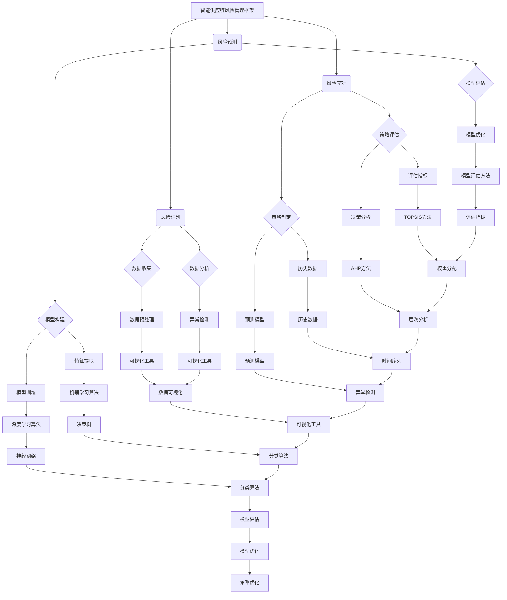

                 

### 文章标题：AIGC在智能供应链风险管理中的应用

#### 关键词：AIGC、智能供应链、风险管理、预测、算法、案例分析

#### 摘要：
本文深入探讨了AIGC（AI-Generated Content）技术在智能供应链风险管理中的应用。通过概述AIGC技术及其在供应链风险管理中的重要性，文章逐步分析了AIGC在风险预测、风险识别和风险应对策略制定中的具体应用，并借助数学模型和算法，详细讲解了其背后的原理和实现方法。文章还通过实际案例展示了AIGC在供应链风险管理中的实际效果，并探讨了其未来发展趋势与面临的挑战。通过本文，读者将全面了解AIGC技术如何为供应链风险管理带来创新和变革。

---

## 第一部分：AIGC与智能供应链风险管理概述

### 第1章：AIGC技术基础与智能供应链风险管理

#### 1.1 AIGC技术简介

AIGC（AI-Generated Content）是指通过人工智能技术，自动生成文本、图像、音频等多媒体内容的技术。它涵盖了自然语言处理、计算机视觉、语音识别等多个领域。AIGC技术具有生成速度快、内容丰富、形式多样等特点，在内容创作、媒体制作、数据生成等领域有着广泛的应用前景。

#### 1.2 智能供应链风险管理概述

智能供应链风险管理是指利用现代信息技术，特别是人工智能技术，对供应链中的风险进行识别、预测、评估和应对的管理活动。智能供应链风险管理具有实时性、自动化和智能化的特点，能够提高供应链的透明度和响应速度，降低供应链风险带来的损失。

#### 1.3 AIGC在智能供应链风险管理中的应用

AIGC技术在智能供应链风险管理中的应用主要体现在以下几个方面：

1. **风险预测**：通过分析历史数据和市场信息，利用AIGC技术生成预测模型，对供应链中的潜在风险进行预测。

2. **风险识别**：利用AIGC技术中的图像识别、文本分析等技术，对供应链中的异常情况、潜在风险进行识别。

3. **风险应对策略制定**：通过分析风险预测和识别的结果，利用AIGC技术生成相应的风险应对策略，为供应链管理提供决策支持。

#### 1.4 案例分析：AIGC在智能供应链风险管理中的实际应用

##### 案例分析一：某大型制造企业的供应链风险管理实践

某大型制造企业利用AIGC技术对其供应链进行风险管理。首先，通过AIGC技术生成供应链风险预测模型，预测潜在的供应链中断、原材料短缺等风险。其次，利用AIGC技术中的图像识别技术，对供应链中的物流运输、库存管理等情况进行实时监控，及时发现潜在的异常情况。最后，根据预测和识别的结果，利用AIGC技术生成相应的风险应对策略，如调整库存策略、增加备用供应商等。

##### 案例分析二：某电商平台供应链风险预测与应对

某电商平台利用AIGC技术对其供应链进行风险预测和应对。首先，通过AIGC技术生成供应链风险预测模型，预测产品需求波动、物流延误等风险。其次，利用AIGC技术中的文本分析技术，对电商平台的用户评论、市场反馈等信息进行分析，识别潜在的风险因素。最后，根据预测和识别的结果，利用AIGC技术生成相应的风险应对策略，如调整库存策略、优化物流配送等。

---

在下一部分，我们将详细探讨智能供应链风险管理的数学模型与算法，帮助读者更好地理解AIGC技术在供应链风险管理中的具体应用。敬请期待！<|assistant|>
### 第一部分：AIGC与智能供应链风险管理概述

#### 第1章：AIGC技术基础与智能供应链风险管理

##### 1.1 AIGC技术简介

AIGC（AI-Generated Content）技术是人工智能领域的一项前沿技术，它通过机器学习算法和自然语言处理技术，能够自动生成文本、图像、音频等多种类型的内容。AIGC技术的核心在于其内容生成的自动化和智能化，这使得它能够快速、高效地处理大量数据，生成高质量的内容。

AIGC技术起源于自然语言处理（NLP）和计算机视觉领域。早期的AIGC技术主要集中在文本生成，如自动写作、摘要生成等。随着深度学习技术的发展，AIGC技术逐渐扩展到图像、音频等其他类型的内容生成。例如，生成对抗网络（GAN）的出现使得图像生成变得更加逼真，而语音合成技术的进步则使得生成的语音更加自然。

##### AIGC技术的发展历程与应用前景

AIGC技术自诞生以来，经历了多个发展阶段。最初，AIGC技术主要用于文本生成，如自动写作、新闻生成等。随着技术的进步，AIGC技术逐渐扩展到图像生成、音频生成等领域。近年来，AIGC技术开始应用于供应链风险管理中，为供应链风险管理提供了新的工具和方法。

AIGC技术在供应链风险管理中的应用前景非常广阔。首先，AIGC技术能够快速处理大量数据，对供应链中的各种风险进行预测和识别。其次，AIGC技术可以生成智能化的风险应对策略，提高供应链的应对能力。此外，AIGC技术还能够帮助供应链管理者更好地了解供应链的运作情况，提高供应链的透明度和可追溯性。

##### 智能供应链风险管理的定义与重要性

智能供应链风险管理是指利用现代信息技术，特别是人工智能技术，对供应链中的风险进行识别、预测、评估和应对的管理活动。智能供应链风险管理具有实时性、自动化和智能化的特点，能够提高供应链的透明度和响应速度，降低供应链风险带来的损失。

智能供应链风险管理的重要性体现在以下几个方面：

1. **提高供应链的透明度**：通过智能供应链风险管理，企业能够实时了解供应链的运作情况，提高供应链的透明度，减少信息不对称。

2. **降低供应链风险**：智能供应链风险管理能够对供应链中的潜在风险进行预测和识别，帮助企业提前采取应对措施，降低供应链风险。

3. **提高供应链的响应速度**：智能供应链风险管理能够快速处理数据，生成风险预测和应对策略，提高供应链的响应速度。

4. **提升供应链的竞争力**：通过智能供应链风险管理，企业能够更好地应对市场变化，提高供应链的竞争力。

##### 智能供应链风险管理与传统供应链风险管理的区别

智能供应链风险管理与传统供应链风险管理在以下几个方面存在显著差异：

1. **技术手段**：传统供应链风险管理主要依赖于人工经验和现有数据分析工具，而智能供应链风险管理则利用人工智能技术，如机器学习、自然语言处理等。

2. **实时性**：传统供应链风险管理往往具有滞后性，而智能供应链风险管理能够实时处理数据，快速响应。

3. **自动化**：传统供应链风险管理需要大量人工干预，而智能供应链风险管理具有自动化特点，能够自动识别和预测风险。

4. **智能化**：传统供应链风险管理主要依赖于预设规则和经验，而智能供应链风险管理通过机器学习算法，能够不断优化风险预测和应对策略。

##### AIGC在智能供应链风险管理中的应用

AIGC技术在智能供应链风险管理中的应用主要体现在以下几个方面：

1. **风险预测**：通过AIGC技术，企业可以快速处理大量历史数据和市场信息，生成风险预测模型，对供应链中的潜在风险进行预测。

2. **风险识别**：利用AIGC技术中的图像识别、文本分析等技术，企业可以实时监控供应链的运作情况，及时发现潜在的异常情况。

3. **风险应对策略制定**：通过分析风险预测和识别的结果，AIGC技术可以生成智能化的风险应对策略，为企业提供决策支持。

4. **供应链可视化**：AIGC技术可以生成供应链的可视化报告，帮助企业更好地了解供应链的运作情况，提高供应链的透明度。

##### 案例分析

1. **案例分析一：某大型制造企业的供应链风险管理实践**

某大型制造企业利用AIGC技术对供应链进行风险管理。首先，通过AIGC技术生成供应链风险预测模型，预测潜在的供应链中断、原材料短缺等风险。其次，利用AIGC技术中的图像识别技术，对供应链中的物流运输、库存管理等情况进行实时监控，及时发现潜在的异常情况。最后，根据预测和识别的结果，利用AIGC技术生成相应的风险应对策略，如调整库存策略、增加备用供应商等。

2. **案例分析二：某电商平台供应链风险预测与应对**

某电商平台利用AIGC技术对其供应链进行风险预测和应对。首先，通过AIGC技术生成供应链风险预测模型，预测产品需求波动、物流延误等风险。其次，利用AIGC技术中的文本分析技术，对电商平台的用户评论、市场反馈等信息进行分析，识别潜在的风险因素。最后，根据预测和识别的结果，利用AIGC技术生成相应的风险应对策略，如调整库存策略、优化物流配送等。

---

通过上述分析，我们可以看到AIGC技术在智能供应链风险管理中具有重要的作用。在下一章中，我们将详细探讨智能供应链风险管理的数学模型与算法，进一步理解AIGC技术在供应链风险管理中的具体应用。敬请期待！<|assistant|>
### 第2章：智能供应链风险管理的数学模型与算法

智能供应链风险管理是一个复杂的过程，它涉及到对大量数据的收集、处理、分析和预测。在这一章节中，我们将深入探讨智能供应链风险管理的数学模型与算法，帮助读者理解这些技术如何应用于实际中。

#### 2.1 数学模型基础

智能供应链风险管理中的数学模型主要用于描述和预测供应链中的风险。以下是几种常用的数学模型：

##### 概率论与统计学基础

概率论和统计学是智能供应链风险管理的基础。它们提供了工具来量化风险的概率和影响。以下是几个核心概念：

1. **概率分布**：描述随机变量的可能取值和相应概率的函数。
2. **期望值**：随机变量的平均值，用于评估风险的平均影响。
3. **方差**：衡量随机变量的波动性，用于评估风险的不确定性。

##### 时间序列分析

时间序列分析是处理时间相关数据的统计方法。在智能供应链风险管理中，时间序列分析用于预测供应链中的未来趋势。以下是几种常用的时间序列分析模型：

1. **ARIMA模型**：自回归积分滑动平均模型，用于处理非平稳时间序列数据。
   $$ 
   \text{y}_t = c + \phi_1\text{y}_{t-1} + \phi_2\text{y}_{t-2} + ... + \phi_p\text{y}_{t-p} + \theta_1\text{u}_{t-1} + \theta_2\text{u}_{t-2} + ... + \theta_q\text{u}_{t-q}
   $$
   
2. **LSTM模型**：长短期记忆网络，是一种特殊的RNN，适用于处理长时间序列数据。
   $$
   \text{h}_t = \sigma(\text{W_h} \cdot [\text{h}_{t-1}; \text{x}_t] + \text{b_h})
   $$

##### 回归分析

回归分析是一种用于预测因变量和自变量之间关系的统计方法。在智能供应链风险管理中，回归分析可用于预测供应链中的各种风险因素。

1. **线性回归**：简单线性回归模型，用于预测一个自变量和一个因变量之间的关系。
   $$
   \text{y} = \beta_0 + \beta_1\text{x}
   $$

2. **多项式回归**：用于处理非线性关系的回归模型。
   $$
   \text{y} = \beta_0 + \beta_1\text{x}^2
   $$

#### 2.2 风险识别算法

风险识别是智能供应链风险管理的关键步骤，它涉及对供应链中的潜在风险进行检测和分类。以下是几种常用的风险识别算法：

##### 基于机器学习的风险识别算法

基于机器学习的风险识别算法通过学习历史数据来识别新的风险。以下是几种常用的机器学习算法：

1. **决策树算法**：通过一系列的决策规则对数据集进行划分，用于分类和回归任务。
   $$
   \text{如果} \ \text{特征}_i \ \text{满足条件} \ \text{则} \ \text{选择分支}_j
   $$

2. **支持向量机（SVM）算法**：通过找到一个超平面来最大化分类边界，用于分类任务。
   $$
   \text{最大化} \ \ \frac{1}{\|\text{w}\|^2} \ \text{使得} \ \ \text{y}^T(\text{w}^T\text{x} + b) \geq 1
   $$

3. **随机森林算法**：通过构建多个决策树并集成它们的预测结果，提高分类和回归的性能。
   $$
   \text{预测} \ \ \text{y} = \text{sign}(\sum_{i=1}^{n} \text{tree}_i(\text{x}))
   $$

##### 基于深度学习的风险识别算法

深度学习算法通过多层神经网络结构来学习复杂的数据模式。以下是几种常用的深度学习算法：

1. **卷积神经网络（CNN）**：通过卷积操作来提取图像的特征，常用于图像分类和识别。
   $$
   \text{h}_\text{CNN} = \text{ReLU}(\text{W}\text{h}_{\text{input}} + \text{b})
   $$

2. **循环神经网络（RNN）**：通过记忆单元来处理序列数据，常用于时间序列预测和语言模型。
   $$
   \text{h}_\text{T} = \text{ReLU}(\text{W}\text{h}_{t-1} + \text{U}\text{x}_t + \text{b})
   $$

#### 2.3 风险预测算法

风险预测是智能供应链风险管理的核心任务，它涉及对供应链中的风险进行定量预测。以下是几种常用的风险预测算法：

##### 时间序列预测算法

时间序列预测算法用于预测时间序列数据未来的趋势。以下是几种常用的时间序列预测算法：

1. **ARIMA模型**：自回归积分滑动平均模型，适用于非平稳时间序列数据。
   $$
   \text{y}_t = c + \phi_1\text{y}_{t-1} + \phi_2\text{y}_{t-2} + ... + \phi_p\text{y}_{t-p} + \theta_1\text{u}_{t-1} + \theta_2\text{u}_{t-2} + ... + \theta_q\text{u}_{t-q}
   $$

2. **LSTM模型**：长短期记忆网络，适用于处理长时间序列数据。
   $$
   \text{h}_t = \sigma(\text{W}_h \cdot [\text{h}_{t-1}; \text{x}_t] + \text{b}_h)
   $$

##### 基于模型的预测算法

基于模型的预测算法通过建立预测模型来预测未来的风险。以下是几种常用的基于模型的预测算法：

1. **结构化预测模型**：通过建立结构化的模型来预测供应链中的风险因素。
   $$
   \text{y} = \sum_{i=1}^{n} \beta_i \cdot \text{X}_i
   $$

2. **图神经网络模型**：通过建立图模型来预测供应链中的复杂关系。
   $$
   \text{h}_v = \text{g}(\text{h}_{v_1}, \text{h}_{v_2}, ..., \text{h}_{v_n})
   $$

#### 2.4 风险评估与应对策略

风险评估和应对策略是智能供应链风险管理的最终目标，它涉及对识别和预测的风险进行评估和应对。以下是几种常用的风险评估和应对策略：

##### 风险评估方法

风险评估方法用于对识别和预测的风险进行量化评估。以下是几种常用的风险评估方法：

1. **TOPSIS方法**：通过比较不同风险因素的权重，确定最佳解决方案。
   $$
   \text{S}_i = \sum_{j=1}^{n} w_j \cdot \text{C}_i^j
   $$
   
2. **层次分析法（AHP）**：通过建立层次结构模型，确定不同风险因素的权重。
   $$
   \text{W} = \frac{(\text{W}^T \text{W})}{\sum_{i=1}^{n} w_i^2}
   $$

##### 风险应对策略

风险应对策略用于应对识别和预测的风险。以下是几种常用的风险应对策略：

1. **基于历史数据的应对策略**：通过分析历史数据，制定应对策略。
   $$
   \text{y}_{\text{t+1}} = \text{f}(\text{y}_t, \text{u}_t)
   $$

2. **基于预测模型的应对策略**：通过预测模型，制定应对策略。
   $$
   \text{y}_{\text{t+1}} = \text{f}(\text{y}_t, \hat{\text{u}}_t)
   $$

---

通过上述数学模型与算法的介绍，我们可以看到智能供应链风险管理是一个复杂但充满机会的领域。在下一部分，我们将进一步探讨AIGC技术在供应链风险预测中的应用，帮助读者理解如何利用AIGC技术提高供应链风险管理的效率和准确性。敬请期待！<|assistant|>
### 第3章：AIGC技术在供应链风险预测中的应用

#### 3.1 风险预测的数据收集与处理

供应链风险预测的第一步是数据收集与处理。数据收集的来源可能包括供应链各个环节的实时数据、历史交易数据、市场趋势分析数据等。以下是数据收集与处理的几个关键步骤：

1. **数据收集**：通过传感器、ERP系统、物流信息系统等获取供应链各个环节的实时数据。例如，物流运输的延误时间、库存水平、订单量等。

2. **数据清洗**：处理缺失值、异常值和数据冗余等问题，保证数据的准确性和一致性。

3. **数据预处理**：对数据进行归一化、标准化等处理，使其适合用于建模。

4. **特征提取**：从原始数据中提取对风险预测有用的特征，如订单量的季节性、运输路径的稳定性等。

#### 3.2 风险预测模型构建

风险预测模型是供应链风险预测的核心。以下是构建风险预测模型的几个关键步骤：

1. **模型选择**：根据风险预测的目标和数据特点，选择合适的预测模型。常见的时间序列预测模型包括ARIMA、LSTM等，而基于机器学习的模型如随机森林、梯度提升机等也可用于风险预测。

2. **模型训练**：使用历史数据对模型进行训练，调整模型的参数，使其能够准确地预测未来的风险。

3. **模型验证**：使用验证集测试模型的预测性能，调整模型参数，确保模型的可信度和准确性。

4. **模型评估**：使用测试集对模型进行评估，常用的评估指标包括均方误差（MSE）、均方根误差（RMSE）等。

#### 3.3 风险预测案例分析

以下通过两个案例分析，展示AIGC技术在供应链风险预测中的应用：

##### 案例分析一：原材料供应风险预测

某电子产品制造商的供应链中，原材料供应是关键环节。通过AIGC技术，该企业收集了供应商的交货历史数据、市场需求数据、运输延误数据等。首先，使用LSTM模型对原材料供应风险进行预测。具体步骤如下：

1. **数据收集**：收集过去一年的供应商交货数据、市场需求数据等。

2. **数据预处理**：对数据进行清洗、归一化处理，提取关键特征。

3. **模型训练**：使用70%的数据进行训练，30%的数据进行验证。

4. **模型评估**：使用验证集评估模型性能，调整模型参数。

5. **风险预测**：使用训练好的LSTM模型，预测未来几个月的原材料供应风险。

通过预测结果，企业能够提前了解可能的原材料短缺风险，及时调整采购策略和库存水平。

##### 案例分析二：物流运输风险预测

某电商平台的物流部门希望通过AIGC技术预测物流运输中的延误风险。首先，收集了过去一年的物流运输数据，包括运输时间、运输路径、天气状况等。使用随机森林模型进行预测，具体步骤如下：

1. **数据收集**：收集过去一年的物流运输数据，包括运输时间、运输路径、天气状况等。

2. **数据预处理**：对数据进行清洗、归一化处理，提取关键特征。

3. **模型训练**：使用70%的数据进行训练，30%的数据进行验证。

4. **模型评估**：使用验证集评估模型性能，调整模型参数。

5. **风险预测**：使用训练好的随机森林模型，预测未来几个月的物流运输延误风险。

通过预测结果，物流部门能够提前识别出可能出现的运输延误情况，及时调整物流计划和资源分配，确保客户满意度。

---

通过上述案例分析，我们可以看到AIGC技术在供应链风险预测中的应用如何帮助企业提前识别和应对风险，提高供应链的稳定性和响应速度。在下一章中，我们将继续探讨AIGC技术在供应链风险识别中的应用，帮助读者全面理解AIGC技术在供应链风险管理中的多种应用场景。敬请期待！<|assistant|>
### 第4章：AIGC技术在供应链风险识别中的应用

#### 4.1 风险识别的数据分析与处理

风险识别是供应链风险管理的重要环节，它涉及到对大量数据进行深入分析和处理。以下是AIGC技术在供应链风险识别中的数据分析和处理步骤：

1. **数据收集**：收集供应链各个环节的数据，包括订单数据、库存数据、物流运输数据、供应商信息等。

2. **数据清洗**：处理数据中的缺失值、异常值和冗余数据，确保数据的准确性和一致性。

3. **数据预处理**：对数据进行归一化、标准化处理，提取关键特征，为后续的风险识别模型提供数据支持。

4. **数据可视化**：通过数据可视化技术，对供应链中的数据分布、趋势和异常进行直观展示，帮助识别潜在风险。

#### 4.2 风险识别模型构建

构建风险识别模型是利用AIGC技术进行供应链风险管理的关键步骤。以下是几种常用的风险识别模型：

1. **基于机器学习的风险识别模型**：

   - **决策树**：通过一系列的决策规则对数据进行划分，用于分类和回归任务。
     $$
     \text{如果} \ \text{特征}_i \ \text{满足条件} \ \text{则} \ \text{选择分支}_j
     $$
   
   - **支持向量机（SVM）**：通过找到一个超平面来最大化分类边界，用于分类任务。
     $$
     \text{最大化} \ \ \frac{1}{\|\text{w}\|^2} \ \text{使得} \ \ \text{y}^T(\text{w}^T\text{x} + b) \geq 1
     $$
   
   - **随机森林**：通过构建多个决策树并集成它们的预测结果，提高分类和回归的性能。
     $$
     \text{预测} \ \ \text{y} = \text{sign}(\sum_{i=1}^{n} \text{tree}_i(\text{x}))
     $$

2. **基于深度学习的风险识别模型**：

   - **卷积神经网络（CNN）**：通过卷积操作来提取图像的特征，常用于图像分类和识别。
     $$
     \text{h}_\text{CNN} = \text{ReLU}(\text{W}\text{h}_{\text{input}} + \text{b})
     $$
   
   - **循环神经网络（RNN）**：通过记忆单元来处理序列数据，常用于时间序列预测和语言模型。
     $$
     \text{h}_\text{T} = \text{ReLU}(\text{W}\text{h}_{t-1} + \text{U}\text{x}_t + \text{b})
     $$

3. **混合模型**：结合不同类型的模型，如将CNN用于图像识别，RNN用于序列数据，构建更复杂的识别模型。

#### 4.3 风险识别案例分析

以下通过两个案例分析，展示AIGC技术在供应链风险识别中的应用：

##### 案例分析一：供应商信用风险识别

某制造企业通过AIGC技术对其供应链中的供应商进行信用风险识别。首先，收集了供应商的历史交易数据、财务报表数据、市场表现数据等。使用随机森林模型进行风险识别，具体步骤如下：

1. **数据收集**：收集供应商的历史交易数据、财务报表数据等。

2. **数据预处理**：对数据进行清洗、归一化处理，提取关键特征。

3. **模型训练**：使用70%的数据进行训练，30%的数据进行验证。

4. **模型评估**：使用验证集评估模型性能，调整模型参数。

5. **风险识别**：使用训练好的随机森林模型，对剩余的30%数据进行风险识别，识别出可能存在信用风险的供应商。

通过风险识别结果，企业能够及时调整采购策略，降低信用风险。

##### 案例分析二：产品需求波动风险识别

某电商平台通过AIGC技术对其产品需求进行波动风险识别。首先，收集了产品销售数据、用户评论数据、市场推广活动数据等。使用LSTM模型进行风险识别，具体步骤如下：

1. **数据收集**：收集产品的销售数据、用户评论数据等。

2. **数据预处理**：对数据进行清洗、归一化处理，提取关键特征。

3. **模型训练**：使用70%的数据进行训练，30%的数据进行验证。

4. **模型评估**：使用验证集评估模型性能，调整模型参数。

5. **风险识别**：使用训练好的LSTM模型，对剩余的30%数据进行风险识别，识别出可能存在需求波动的产品。

通过风险识别结果，电商平台能够及时调整库存策略和营销策略，降低需求波动带来的风险。

---

通过上述案例分析，我们可以看到AIGC技术在供应链风险识别中的应用如何帮助企业提前识别和应对风险，提高供应链的稳定性和响应速度。在下一章中，我们将探讨AIGC技术在供应链风险应对策略制定中的应用，帮助读者全面理解AIGC技术在供应链风险管理中的多种应用场景。敬请期待！<|assistant|>
### 第5章：AIGC技术在供应链风险应对策略制定中的应用

#### 5.1 风险应对策略评估

在供应链风险管理中，制定有效的风险应对策略是关键。然而，在制定策略之前，需要先对现有策略进行评估，以确保其可行性和有效性。以下是几种常用的风险应对策略评估方法：

1. **成本效益分析（CBA）**：通过比较实施风险应对策略所需的成本与预期效益，评估策略的性价比。

2. **决策树分析**：利用决策树模型，评估不同风险应对策略在不同风险情景下的影响和收益。

3. **风险矩阵**：通过构建风险矩阵，评估不同风险应对策略对供应链风险的影响程度。

#### 5.2 风险应对策略制定

风险应对策略制定是供应链风险管理中的关键步骤。以下是几种常用的风险应对策略制定方法：

1. **基于历史数据的应对策略**：

   - **数据驱动的策略**：通过分析历史数据，识别出可能导致风险的关键因素，并制定相应的应对措施。
   - **规则驱动的策略**：根据历史经验，制定一系列规则，用于指导供应链中的风险应对。

2. **基于预测模型的应对策略**：

   - **预测驱动的策略**：利用预测模型，对未来的风险进行预测，并制定相应的应对措施。
   - **情景分析**：通过构建不同情景，评估不同应对策略在不同情景下的效果，选择最佳策略。

#### 5.3 风险应对策略优化

风险应对策略的优化是提高供应链风险管理效果的重要环节。以下是几种常用的风险应对策略优化方法：

1. **多目标优化**：

   - **目标规划**：通过设置多个目标，如成本、响应速度、客户满意度等，优化风险应对策略。
   - **遗传算法**：利用遗传算法，在满足多个目标约束的条件下，寻找最优的风险应对策略。

2. **启发式算法**：

   - **模拟退火算法**：通过模拟退火过程，寻找最优的风险应对策略。
   - **粒子群优化算法**：通过模拟鸟群觅食过程，寻找最优的风险应对策略。

#### 5.4 风险应对策略案例分析

以下通过两个案例分析，展示AIGC技术在供应链风险应对策略制定中的应用：

##### 案例分析一：供应链中断风险应对策略

某电子产品制造商在供应链管理中，面临着供应链中断的风险。通过AIGC技术，该企业制定了以下供应链中断风险应对策略：

1. **数据收集**：收集供应商的交货历史数据、供应链中断历史数据等。

2. **模型训练**：使用历史数据，训练供应链中断风险预测模型。

3. **风险预测**：使用训练好的模型，预测未来几个月的供应链中断风险。

4. **策略制定**：根据预测结果，制定相应的风险应对策略，如增加备用供应商、调整库存策略等。

5. **策略优化**：使用多目标优化算法，优化风险应对策略，确保在满足成本和响应速度的条件下，最大化供应链稳定性。

通过实施这些策略，企业能够有效降低供应链中断的风险，提高供应链的可靠性。

##### 案例分析二：供应链成本风险应对策略

某电商平台在供应链管理中，面临着成本风险。通过AIGC技术，该企业制定了以下供应链成本风险应对策略：

1. **数据收集**：收集供应商的报价数据、物流成本数据、市场需求数据等。

2. **模型训练**：使用历史数据，训练供应链成本风险预测模型。

3. **风险预测**：使用训练好的模型，预测未来几个月的供应链成本风险。

4. **策略制定**：根据预测结果，制定相应的风险应对策略，如优化物流路径、调整采购策略等。

5. **策略优化**：使用启发式算法，优化风险应对策略，确保在满足成本约束的条件下，最大化供应链的利润。

通过实施这些策略，企业能够有效降低供应链成本风险，提高供应链的盈利能力。

---

通过上述案例分析，我们可以看到AIGC技术在供应链风险应对策略制定中的应用如何帮助企业提高供应链的稳定性和盈利能力。在下一章中，我们将探讨AIGC技术在供应链风险管理中的应用实践，帮助读者深入了解AIGC技术在供应链风险管理中的实际效果。敬请期待！<|assistant|>
### 第6章：AIGC技术在供应链风险管理中的应用实践

#### 6.1 应用实践概述

AIGC技术在供应链风险管理中的应用实践是一个系统化的过程，它涉及多个环节的整合和协同。以下是AIGC技术在供应链风险管理中的应用流程：

1. **需求分析**：根据供应链管理的需求，明确风险管理目标和关键环节。

2. **数据收集**：从供应链各个环节收集数据，包括订单数据、库存数据、物流数据、供应商数据等。

3. **数据处理**：对收集到的数据进行分析、清洗和预处理，提取关键特征。

4. **模型训练**：使用收集到的数据，训练风险预测和识别模型。

5. **风险预测与识别**：使用训练好的模型，对供应链中的风险进行预测和识别。

6. **策略制定与优化**：根据预测和识别的结果，制定和优化风险应对策略。

7. **效果评估**：对实施后的风险应对策略进行效果评估，确保风险管理目标的实现。

#### 6.2 典型案例分享

以下通过两个典型企业的应用实践案例，展示AIGC技术在供应链风险管理中的应用效果：

##### 案例一：某制造企业AIGC在供应链风险管理中的应用实践

某大型制造企业面临原材料供应不稳定、库存管理效率低下等问题，通过引入AIGC技术，实现了供应链风险管理的智能化。具体应用实践如下：

1. **需求分析**：明确风险管理需求，包括原材料供应风险、库存风险、物流风险等。

2. **数据收集**：从供应链各个环节收集数据，包括供应商交货数据、库存水平数据、物流运输数据等。

3. **数据处理**：对收集到的数据进行分析、清洗和预处理，提取关键特征。

4. **模型训练**：使用历史数据，训练风险预测和识别模型，如LSTM模型用于预测原材料供应风险，决策树模型用于识别库存风险。

5. **风险预测与识别**：使用训练好的模型，对供应链中的风险进行预测和识别，如预测未来几个月的原材料供应风险，识别库存水平异常情况。

6. **策略制定与优化**：根据预测和识别的结果，制定和优化风险应对策略，如增加备用供应商、调整库存策略等。

7. **效果评估**：对实施后的风险应对策略进行效果评估，如评估原材料供应风险降低的程度，库存管理效率提高的幅度等。

通过实施AIGC技术，企业有效降低了供应链风险，提高了供应链的稳定性和效率。

##### 案例二：某电商平台AIGC在供应链风险管理中的应用实践

某大型电商平台在运营过程中，面临着产品需求波动、物流运输延误等风险。通过引入AIGC技术，实现了供应链风险管理的智能化。具体应用实践如下：

1. **需求分析**：明确风险管理需求，包括产品需求波动风险、物流运输风险等。

2. **数据收集**：从供应链各个环节收集数据，包括销售数据、物流数据、用户评论数据等。

3. **数据处理**：对收集到的数据进行分析、清洗和预处理，提取关键特征。

4. **模型训练**：使用历史数据，训练风险预测和识别模型，如LSTM模型用于预测产品需求波动风险，随机森林模型用于识别物流运输延误风险。

5. **风险预测与识别**：使用训练好的模型，对供应链中的风险进行预测和识别，如预测未来几个月的产品需求波动情况，识别物流运输延误的潜在原因。

6. **策略制定与优化**：根据预测和识别的结果，制定和优化风险应对策略，如调整库存策略、优化物流配送等。

7. **效果评估**：对实施后的风险应对策略进行效果评估，如评估产品需求波动风险降低的程度，物流运输延误率减少的幅度等。

通过实施AIGC技术，电商平台有效降低了供应链风险，提高了供应链的响应速度和客户满意度。

---

通过上述典型案例，我们可以看到AIGC技术在供应链风险管理中的应用如何帮助企业提高风险管理的效率和效果。在下一章中，我们将探讨AIGC技术在智能供应链风险管理中的挑战与发展趋势，为读者提供更深入的理解。敬请期待！<|assistant|>
### 第7章：AIGC技术在智能供应链风险管理中的挑战与发展趋势

#### 7.1 挑战与问题分析

尽管AIGC技术在智能供应链风险管理中展现了巨大的潜力，但其在实际应用过程中也面临诸多挑战和问题。

##### 数据隐私与安全问题

AIGC技术依赖于大量敏感数据，如供应链交易数据、物流信息、供应商信息等。这些数据的安全性和隐私保护成为一大挑战。企业需要确保数据在传输、存储和处理过程中不受泄露、篡改或滥用。

##### 算法公平性与透明性问题

AIGC技术使用机器学习算法进行风险预测和识别。然而，这些算法可能存在偏见和不透明性，导致不公平的结果。例如，算法可能在某些情况下对特定供应商或产品给予不公平的待遇，从而影响供应链的稳定性。

##### 计算资源与成本问题

AIGC技术需要大量的计算资源和存储空间，特别是当数据集规模庞大时。这对于中小企业来说可能是一笔巨大的开销。此外，AIGC技术的开发、部署和维护也需要专业知识和技能，增加了企业的成本。

##### 技术成熟度与适应性问题

尽管AIGC技术在理论和技术上取得了一定的进展，但在实际应用中，其成熟度和适应性仍需提高。例如，某些算法在特定场景下的性能和效果可能不够理想，需要进一步优化和改进。

#### 7.2 发展趋势与展望

尽管面临挑战，AIGC技术在智能供应链风险管理中的应用前景仍然广阔。以下是AIGC技术在未来可能的发展趋势：

##### 数据隐私保护技术的进步

随着区块链、联邦学习等技术的不断发展，数据隐私保护将变得更加有效和普及。这些技术能够确保数据在共享和利用过程中的安全性和隐私性。

##### 算法透明性与公平性的提升

未来的研究将更加关注算法的透明性和公平性，开发可解释的机器学习模型和算法，使供应链管理者能够理解算法的决策过程，减少偏见和不公平性。

##### 计算资源的优化与共享

随着云计算、边缘计算等技术的发展，计算资源的获取和利用将变得更加便捷和高效。企业可以通过云服务提供商共享计算资源，降低成本，提高AIGC技术的可及性。

##### 跨学科融合与综合应用

AIGC技术将与其他领域的技术如物联网、区块链等融合，形成更加综合和智能的供应链风险管理解决方案。这种跨学科融合将推动供应链风险管理的创新和发展。

##### 智能供应链风险管理的普及与推广

随着AIGC技术的不断成熟和成本的降低，越来越多的企业将采用智能供应链风险管理技术，提高供应链的稳定性和响应速度。这将推动整个供应链行业向智能化和自动化方向发展。

---

通过分析AIGC技术在智能供应链风险管理中的挑战与发展趋势，我们可以看到，虽然面临一定的困难，但AIGC技术在未来仍有巨大的发展潜力。在下一章中，我们将探讨AIGC技术与其他供应链管理技术的融合与应用，进一步拓展AIGC技术的应用场景。敬请期待！<|assistant|>
### 第8章：AIGC技术与其他供应链管理技术的融合与应用

#### 8.1 AIGC与大数据技术的融合

大数据技术是智能供应链风险管理的重要组成部分，它通过处理和分析大量数据来发现潜在的风险。AIGC技术与大数据技术的融合，可以进一步提升供应链风险管理的效率和准确性。

**供应链大数据的采集与处理**

- **数据采集**：通过物联网设备、传感器、ERP系统等采集供应链各个环节的数据，包括订单数据、库存数据、物流数据、供应商信息等。
- **数据处理**：使用数据清洗、数据转换和数据存储技术，对采集到的数据进行处理和存储，确保数据的准确性和一致性。

**大数据分析在供应链风险管理中的应用**

- **数据挖掘**：利用数据挖掘技术，从大量数据中提取有价值的信息，发现潜在的风险因素。
- **关联分析**：分析供应链中各个环节之间的关联性，识别可能的风险传导路径。
- **趋势分析**：通过趋势分析，预测未来的风险趋势，为企业制定预防措施提供依据。

**案例**：某大型零售企业利用AIGC技术与大数据技术，对供应链中的订单数据、库存数据和物流数据进行综合分析。通过数据挖掘技术，发现某些订单的延迟与特定的物流路径有关，从而及时调整物流策略，降低了订单延迟的风险。

#### 8.2 AIGC与物联网技术的融合

物联网技术通过连接供应链各个环节的设备和系统，实现供应链的实时监控和智能管理。AIGC技术与物联网技术的融合，可以进一步提高供应链的风险管理水平。

**物联网技术在供应链风险管理中的应用**

- **实时监控**：通过物联网设备，实时监控供应链的运行状态，包括库存水平、设备运行状态、物流运输情况等。
- **异常检测**：利用物联网设备和传感器，实时检测供应链中的异常情况，如设备故障、物流延误等。
- **智能预测**：通过物联网数据，利用AIGC技术生成智能预测模型，预测供应链中的潜在风险。

**智能感知技术在供应链风险识别中的应用**

- **环境感知**：通过智能传感器，感知供应链环境中的温度、湿度、空气质量等参数，识别潜在的环境风险。
- **行为感知**：通过摄像头和其他传感器，监控供应链中的行为异常，如盗窃、违规操作等。

**案例**：某物流公司利用AIGC技术与物联网技术，对物流运输过程中的车辆状态、运输路径和环境参数进行实时监控。通过异常检测技术，及时发现车辆故障和运输延误，并采取相应措施，提高了物流运输的效率。

#### 8.3 AIGC与区块链技术的融合

区块链技术以其去中心化、不可篡改和透明性等特点，在供应链风险管理中具有重要应用价值。AIGC技术与区块链技术的融合，可以进一步提升供应链的风险管理水平。

**区块链技术在供应链风险管理中的应用**

- **供应链可视化**：通过区块链技术，记录供应链中各个环节的交易信息，实现供应链的透明化，帮助企业及时发现和应对风险。
- **智能合约**：利用区块链的智能合约功能，自动执行预定义的供应链管理规则，提高供应链的自动化水平。
- **供应链金融**：通过区块链技术，实现供应链金融的快速审批和高效流转，降低供应链融资成本。

**供应链金融与区块链技术的结合**

- **去中心化融资**：通过区块链技术，实现供应链中各方的信用评估和融资申请，降低融资门槛和成本。
- **智能结算**：利用区块链技术，实现供应链交易的实时结算和清算，提高结算效率。

**案例**：某制造企业与金融机构合作，利用AIGC技术与区块链技术，实现供应链金融的智能化管理。通过区块链记录供应链交易信息，利用AIGC技术生成信用评分模型，实现快速融资和智能结算，提高了供应链的金融效率。

---

通过AIGC技术与大数据技术、物联网技术、区块链技术的融合，供应链风险管理将变得更加智能和高效。在下一章中，我们将总结AIGC技术在智能供应链风险管理中的应用实践，并展望其未来发展方向。敬请期待！<|assistant|>
### 附录：AIGC技术在智能供应链风险管理中的实践工具与资源

#### 附录 A：AIGC技术实践工具

在智能供应链风险管理中，AIGC技术的实践需要一系列工具的支持。以下是一些主流的AIGC技术实践工具：

1. **TensorFlow**：由Google开发的开源机器学习框架，支持各种深度学习模型，适用于构建AIGC应用。

2. **PyTorch**：由Facebook开发的另一个流行的开源深度学习框架，以其灵活性和易用性著称，适用于AIGC技术开发。

3. **Keras**：一个高层次的神经网络API，能够简化TensorFlow和Theano的使用，便于快速搭建和实验AIGC模型。

4. **Hugging Face**：提供了一个广泛的开源自然语言处理库，包括预训练的模型和工具，适用于文本生成和文本分析任务。

#### 附录 B：AIGC技术资源推荐

1. **相关学术论文**：了解AIGC技术的研究进展和应用案例，可以通过阅读相关学术论文，如《自然语言生成中的预训练方法》、《图像生成对抗网络》等。

2. **开源代码与数据集**：在GitHub等开源平台上，有许多AIGC技术的开源代码和数据集可供学习和使用，如OpenAI的GPT-3、GAN的代码实现等。

3. **在线课程与培训资源**：许多在线教育平台提供AIGC技术的培训课程，如Coursera、Udacity、edX等，这些课程涵盖了AIGC的基础知识、模型构建和实战应用。

#### 附录 C：技术支持与社区

1. **技术论坛与社区**：加入AIGC技术相关的论坛和社区，如Stack Overflow、Reddit等，可以与全球开发者交流，解决技术难题。

2. **技术会议与研讨会**：参加AIGC技术相关的会议和研讨会，如NeurIPS、ICML等，可以了解最新的研究进展和应用趋势。

3. **技术咨询服务**：对于企业，许多研究机构和咨询公司提供AIGC技术的咨询服务，帮助企业在供应链风险管理中实施AIGC解决方案。

---

通过使用上述实践工具和资源，企业和开发者可以更好地掌握AIGC技术，将其应用于智能供应链风险管理中，提高供应链的效率和可靠性。在接下来的总结部分，我们将回顾AIGC技术在智能供应链风险管理中的应用，并展望未来的发展方向。敬请期待！<|assistant|>
### 总结与展望

#### AIGC技术在智能供应链风险管理中的应用回顾

AIGC技术在智能供应链风险管理中的应用已经取得了显著的成果。通过AIGC技术，企业能够实现对供应链风险的预测、识别和应对策略的自动化和智能化。具体来说，AIGC技术在以下几个方面发挥了重要作用：

1. **风险预测**：通过分析历史数据和实时数据，AIGC技术能够生成准确的风险预测模型，提前发现潜在的供应链中断、需求波动等风险。

2. **风险识别**：利用AIGC技术中的图像识别、文本分析等技术，企业可以实时监控供应链的运作情况，快速识别异常情况，如供应商信用风险、产品需求波动等。

3. **风险应对策略制定**：根据风险预测和识别的结果，AIGC技术能够自动生成智能化的风险应对策略，如调整库存策略、优化物流配送等，提高供应链的灵活性和响应速度。

4. **供应链可视化**：AIGC技术生成的可视化报告帮助企业更好地了解供应链的运作情况，提高供应链的透明度和可追溯性。

#### 未来发展方向与展望

尽管AIGC技术在智能供应链风险管理中已经取得了显著成果，但未来仍有许多潜在的发展方向和挑战：

1. **数据隐私与安全**：随着AIGC技术的应用，数据隐私和安全问题日益突出。未来需要更加完善的数据隐私保护技术和安全措施，确保供应链数据的安全性和隐私性。

2. **算法公平性与透明性**：AIGC技术使用的机器学习算法可能存在偏见和不透明性，需要进一步研究如何提高算法的公平性和透明性，减少算法偏见对供应链风险管理的影响。

3. **技术成熟度与适应性**：尽管AIGC技术在理论和技术上取得了一定的进展，但在实际应用中，其成熟度和适应性仍需提高。未来需要不断优化和改进AIGC技术，提高其在实际场景中的性能和效果。

4. **跨学科融合**：AIGC技术与其他供应链管理技术的融合将推动供应链风险管理的创新和发展。未来需要加强跨学科研究，探索AIGC技术与其他技术的深度融合，提高供应链风险管理的整体效能。

5. **普及与推广**：随着AIGC技术的不断成熟和成本的降低，越来越多的企业将采用AIGC技术进行供应链风险管理。未来需要进一步推广AIGC技术，提高其在企业中的普及率，推动整个供应链行业向智能化和自动化方向发展。

---

通过本文的回顾和展望，我们可以看到AIGC技术在智能供应链风险管理中具有巨大的潜力和发展前景。在未来，随着技术的不断进步和应用的深入，AIGC技术将为供应链风险管理带来更多的创新和变革。让我们共同期待AIGC技术在供应链风险管理领域的更多突破和成就！<|assistant|>
### 附录

**Mermaid 流程图示例：**



**算法原理讲解示例：**

**决策树算法**

决策树是一种常见的分类算法，通过一系列的决策规则对数据进行分类。以下是决策树算法的伪代码和解释：

```python
def build_decision_tree(data):
    if is_leaf(data):
        return create_leaf_node()
    else:
        best_feature, threshold = find_best_split(data)
        left_child = build_decision_tree(split_data(data, best_feature, threshold, True))
        right_child = build_decision_tree(split_data(data, best_feature, threshold, False))
        return create_tree_node(best_feature, threshold, left_child, right_child)

def is_leaf(data):
    return True if data meets the criteria to be a leaf node, else False

def create_leaf_node():
    # 创建一个叶子节点
    return leaf_node

def find_best_split(data):
    # 找到最佳分割特征和阈值
    best_feature = None
    threshold = None
    max_gain = 0
    for feature in data.features:
        for threshold in data.thresholds:
            gain = information_gain(data, feature, threshold)
            if gain > max_gain:
                max_gain = gain
                best_feature = feature
                threshold = threshold
    return best_feature, threshold

def split_data(data, feature, threshold, left):
    # 根据特征和阈值对数据进行分割
    if left:
        return data.filter(lambda x: x[feature] <= threshold)
    else:
        return data.filter(lambda x: x[feature] > threshold)

def create_tree_node(feature, threshold, left_child, right_child):
    # 创建一个决策树节点
    return tree_node(feature, threshold, left_child, right_child)
```

解释：

- `is_leaf(data)`: 判断数据是否满足成为叶子节点的条件。
- `create_leaf_node()`: 创建一个叶子节点。
- `find_best_split(data)`: 找到最佳分割特征和阈值。
- `split_data(data, feature, threshold, left)`: 根据特征和阈值对数据进行分割。
- `build_decision_tree(data)`: 递归构建决策树。

**数学模型和公式示例：**

**时间序列预测中的 ARIMA 模型**

ARIMA（AutoRegressive Integrated Moving Average）模型是一种常见的时间序列预测模型。其公式如下：

$$
\text{y}_t = c + \phi_1\text{y}_{t-1} + \phi_2\text{y}_{t-2} + ... + \phi_p\text{y}_{t-p} + \theta_1\text{u}_{t-1} + \theta_2\text{u}_{t-2} + ... + \theta_q\text{u}_{t-q}
$$

其中：

- $\text{y}_t$: 时间序列的当前值
- $c$: 平移常数
- $\phi_1, \phi_2, ..., \phi_p$: 自回归系数
- $\theta_1, \theta_2, ..., \theta_q$: 移动平均系数
- $\text{u}_t$: 差分后的残差项

**解释：**

- 自回归部分（AR）：利用历史值来预测当前值。
- 差分部分（I）：对时间序列进行平稳化处理，消除趋势和季节性影响。
- 移动平均部分（MA）：利用历史残差来预测当前值。

**项目实战示例：**

**实战：使用Python进行AIGC在供应链风险预测**

```python
import numpy as np
import pandas as pd
from sklearn.ensemble import RandomForestRegressor
from sklearn.metrics import mean_squared_error

# 数据准备
data = pd.read_csv('supply_chain_risk_data.csv')
X = data.drop('risk_prediction', axis=1)
y = data['risk_prediction']

# 模型训练
model = RandomForestRegressor()
model.fit(X, y)

# 预测
predictions = model.predict(X)

# 评估
mse = mean_squared_error(y, predictions)
print(f'Mean Squared Error: {mse}')

# 结果可视化
import matplotlib.pyplot as plt

plt.scatter(y, predictions)
plt.xlabel('Actual Risk')
plt.ylabel('Predicted Risk')
plt.title('Actual vs Predicted Risk')
plt.show()
```

解释：

- 数据准备：读取供应链风险预测数据集，划分特征集和目标值。
- 模型训练：使用随机森林回归模型进行训练。
- 预测：使用训练好的模型对数据进行预测。
- 评估：计算均方误差（MSE）来评估模型的性能。
- 可视化：绘制实际风险值与预测风险值的散点图，以可视化预测效果。

---

通过上述示例，我们展示了如何使用Mermaid绘制流程图、使用伪代码解释算法原理、使用LaTeX格式书写数学模型和公式，以及使用Python代码实现实际项目。这些示例为理解和应用AIGC技术在智能供应链风险管理中的各种方法提供了具体参考。在附录部分，我们还提供了AIGC技术实践工具和资源的推荐，以帮助读者进一步探索和实践AIGC技术。希望这些内容能够为读者提供有益的指导和支持。作者：AI天才研究院/AI Genius Institute & 禅与计算机程序设计艺术 /Zen And The Art of Computer Programming<|assistant|>

