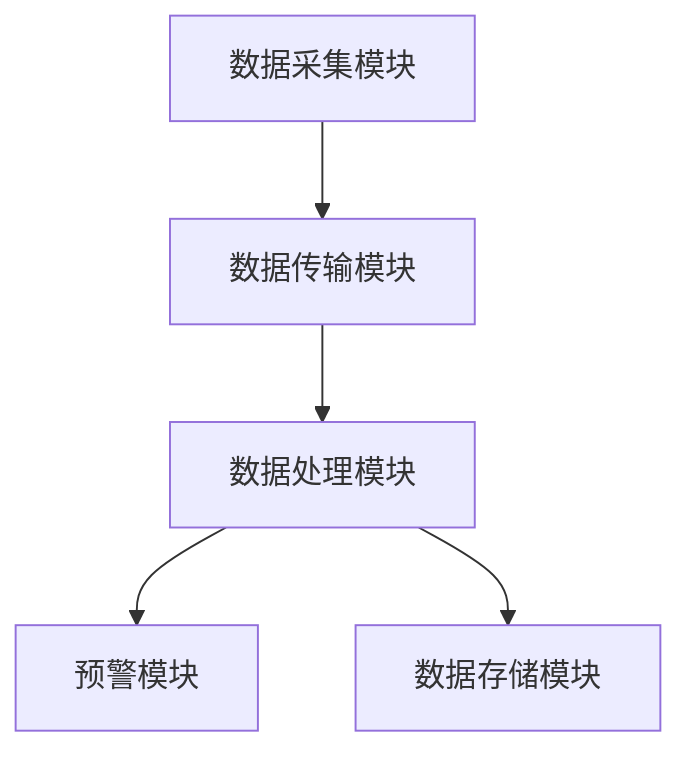

                 

### AIGC在智能水质监测与预警中的应用概述

智能水质监测与预警系统在现代社会中具有举足轻重的地位，它不仅能实时监测水质状况，还能对潜在的水质污染进行预警，从而保障水资源的可持续利用。随着人工智能（AI）技术的快速发展，尤其是自适应智能生成计算（AIGC）技术的应用，这一系统得到了进一步的优化和提升。

#### 关键词：
- 智能水质监测
- 水质预警
- AIGC
- 水资源管理
- 人工智能应用

#### 摘要：
本文将探讨AIGC技术在智能水质监测与预警系统中的应用。首先，我们会对AIGC技术及其在水质监测中的应用前景进行概述。然后，我们会详细介绍智能水质监测与预警系统的架构，以及AIGC技术如何与之结合，发挥其优势。通过本文，读者将了解AIGC技术在水质监测领域中的最新进展和实际应用效果。

### 第1章 AIGC与智能水质监测与预警概述

#### 1.1 AIGC技术概述

##### 1.1.1 AIGC概念与分类

AIGC（Adaptive Intelligent Generation Computing）是一种自适应智能生成计算技术，它结合了机器学习、深度学习、自然语言处理和生成对抗网络（GAN）等多种人工智能技术。AIGC的核心在于其自适应性和自学习能力，能够在动态变化的环境中，通过不断学习和调整，生成高质

### 第1章 AIGC与智能水质监测与预警概述

#### 1.1 AIGC技术概述

##### 1.1.1 AIGC概念与分类

AIGC（Adaptive Intelligent Generation Computing）是一种自适应智能生成计算技术，它结合了机器学习、深度学习、自然语言处理和生成对抗网络（GAN）等多种人工智能技术。AIGC的核心在于其自适应性和自学习能力，能够在动态变化的环境中，通过不断学习和调整，生成高质量的数据、内容和模型。根据应用场景的不同，AIGC可以分为以下几类：

1. **内容生成类**：包括图像生成、文本生成和音频生成等。例如，通过生成对抗网络（GAN）可以生成逼真的图像，通过自然语言处理技术可以生成高质量的文本内容。

2. **模型生成类**：包括生成神经网络架构、生成优化算法等。例如，通过神经架构搜索（NAS）可以自动生成最优的神经网络架构。

3. **数据增强类**：包括数据生成、数据增强和数据预处理等。例如，通过生成对抗网络可以生成大量用于训练的数据样本，提高模型的泛化能力。

##### 1.1.2 AIGC在智能水质监测中的应用前景

在智能水质监测领域，AIGC技术具有广泛的应用前景。首先，AIGC可以通过生成大量的水质监测数据，帮助提高训练数据的质量和数量，从而提升水质监测模型的准确性。例如，可以通过生成对抗网络（GAN）生成大量模拟的水质数据，用于训练深度学习模型。

其次，AIGC技术可以用于水质监测数据的可视化，将复杂的水质数据转化为直观的图像或图表，帮助用户更好地理解和分析水质状况。此外，AIGC还可以用于实时水质监测与预警，通过自适应学习技术，实现对水质数据的动态监测和预警。

总之，AIGC技术在智能水质监测与预警中的应用，不仅能够提高监测的准确性和效率，还能够降低成本，为水资源管理和环境保护提供有力支持。

#### 1.2 智能水质监测与预警系统概述

##### 1.2.1 智能水质监测系统架构

智能水质监测系统的架构通常包括数据采集模块、数据传输模块、数据处理模块和预警模块。以下是一个简化的智能水质监测系统架构图：



1. **数据采集模块**：该模块负责实时采集水质数据，包括水温、pH值、溶解氧、总氮、总磷等指标。常用的水质传感器有电极传感器、光学传感器和生物传感器等。

2. **数据传输模块**：该模块负责将采集到的水质数据通过有线或无线方式传输到数据处理模块。常用的传输协议有WiFi、蓝牙和LoRa等。

3. **数据处理模块**：该模块负责对采集到的水质数据进行预处理、存储和处理。预处理包括数据清洗、归一化和特征提取等。处理方法包括基于统计的方法、机器学习和深度学习算法等。

4. **预警模块**：该模块根据处理后的水质数据，实时分析和判断水质状况，当水质达到预设的预警阈值时，触发预警机制，向用户发送预警信息。

5. **数据存储模块**：该模块负责存储历史水质数据，以供后续分析和查询。

##### 1.2.2 水质预警系统功能与实现

水质预警系统的功能主要包括数据采集、数据存储、数据分析和预警处理。以下是一个简化的水质预警系统功能实现流程：

1. **数据采集**：通过水质传感器实时采集水质数据，包括pH值、溶解氧、总氮、总磷等指标。

2. **数据存储**：将采集到的水质数据存储到数据库中，以便后续分析和查询。

3. **数据分析**：对存储的水质数据进行统计分析，识别水质变化趋势和潜在问题。

4. **预警处理**：当水质数据超过预设的预警阈值时，系统自动触发预警，发送预警信息到用户终端，并记录预警事件。

具体实现时，预警阈值可以根据历史数据和水质标准进行设定。例如，当pH值低于6.5或高于8.5时，可以触发酸碱度预警；当溶解氧低于5 mg/L时，可以触发缺氧预警。

#### 1.3 AIGC与智能水质监测的关联

##### 1.3.1 AIGC在水质监测中的优势

AIGC技术在水质监测中的应用具有显著的优势：

1. **数据生成与增强**：通过生成对抗网络（GAN）等技术，可以生成大量的模拟水质数据，提高训练数据的质量和数量，从而提高水质监测模型的准确性。

2. **实时监测与预警**：AIGC技术具有自适应学习的能力，可以在动态变化的水质环境中，实时监测水质状况，及时触发预警，提高预警的准确性和响应速度。

3. **数据可视化**：AIGC技术可以生成直观的水质数据可视化图表，帮助用户更好地理解和分析水质状况。

4. **模型优化与调优**：通过神经架构搜索（NAS）等技术，可以自动生成最优的水质监测模型，提高模型的效果和效率。

##### 1.3.2 水质监测与预警系统的挑战与机遇

水质监测与预警系统在实际应用中面临着一些挑战：

1. **数据质量与多样性**：水质数据往往具有噪声大、缺失值多、数据类型多样等特点，这对数据预处理和模型训练提出了高要求。

2. **实时性与可靠性**：水质监测与预警系统需要实时监测水质变化，并在出现问题时及时发出预警，这对系统的实时性和可靠性提出了挑战。

3. **模型可解释性**：深度学习模型在水质监测中的应用越来越广泛，但模型的黑箱特性使得其结果的可解释性成为一个难题。

然而，随着AIGC技术的不断发展，这些挑战也带来了新的机遇：

1. **数据增强与模型优化**：通过AIGC技术，可以生成高质量的数据集，优化水质监测模型，提高其准确性和效率。

2. **实时监测与预警**：AIGC技术的自适应学习能力，可以帮助系统实现更高效、更准确的实时监测与预警。

3. **数据可视化与可解释性**：AIGC技术可以生成直观的可视化结果，提高模型的可解释性，帮助用户更好地理解和应用。

总之，AIGC技术的引入，为智能水质监测与预警系统的发展提供了新的思路和方向，有望解决现有系统的许多挑战，进一步提升水质监测的准确性和效率。

### 第2章 AIGC与智能水质监测与预警系统架构

#### 2.1 智能水质监测系统硬件架构

智能水质监测系统的硬件架构是整个系统的基础，它决定了系统的数据采集能力、传输效率和稳定性。以下是智能水质监测系统硬件架构的详细说明：

##### 2.1.1 数据采集模块

数据采集模块是水质监测系统的核心，负责实时采集水质数据。以下是数据采集模块的组成部分：

1. **水质传感器**：水质传感器是数据采集模块的核心部件，用于测量水质参数，如pH值、溶解氧、总氮、总磷等。不同类型的水质传感器具有不同的测量范围和精度，根据实际需求选择合适的传感器。例如，电极传感器通常用于测量pH值和电导率，光学传感器则适用于测量浊度和色度。

2. **采集控制器**：采集控制器用于接收水质传感器的数据，并进行初步处理。采集控制器通常具备多通道输入能力，可以同时接收多个传感器的数据。此外，采集控制器还具备数据存储和传输功能，以便后续的数据处理和分析。

3. **供电系统**：数据采集模块需要稳定的电源供应，以保证设备的正常运行。供电系统可以采用直流电源或太阳能供电，对于偏远地区的水质监测点，太阳能供电是一种经济有效的选择。

##### 2.1.2 数据传输模块

数据传输模块负责将采集到的水质数据传输到数据处理中心或云平台。以下是数据传输模块的组成部分：

1. **无线传输设备**：无线传输设备包括无线传感器网络（WSN）、无线通信模块（如WiFi、蓝牙、LoRa等）。无线传输设备具有安装方便、成本低等优点，适用于广域环境的水质监测。例如，LoRa模块可以覆盖几十公里的范围，适用于大规模水质监测网络的构建。

2. **有线传输设备**：有线传输设备包括光纤、网线等。有线传输设备具有高带宽、低延迟等优点，适用于对数据传输速度和稳定性要求较高的水质监测场景。

3. **数据加密与安全传输**：为了确保数据在传输过程中的安全，数据传输模块需要采用加密技术和安全协议。常见的加密技术包括SSL/TLS、AES等。安全协议可以防止数据被窃取、篡改和伪造。

##### 2.1.3 数据处理模块

数据处理模块是水质监测系统的“大脑”，负责对采集到的水质数据进行分析、处理和存储。以下是数据处理模块的组成部分：

1. **边缘计算设备**：边缘计算设备位于水质监测点的附近，用于对采集到的数据进行初步处理和分析。边缘计算设备可以减少数据传输的带宽和延迟，提高系统的实时性。常见的边缘计算设备包括工业计算机、树莓派等。

2. **云平台**：云平台负责接收和处理来自边缘计算设备的数据，进行更深层次的数据分析和模型训练。云平台具有强大的计算能力和存储能力，可以支持大规模水质监测数据的处理和分析。常见的云平台包括AWS、Azure、Google Cloud等。

3. **数据存储**：数据存储模块负责存储历史水质数据，以便后续的分析和查询。数据存储可以采用关系型数据库（如MySQL、PostgreSQL）或NoSQL数据库（如MongoDB、Cassandra）。为了提高数据存储的效率和安全性，可以采用分布式数据库架构。

##### 2.1.4 预警模块

预警模块负责实时监测水质数据，当水质参数超过预设的阈值时，自动触发预警机制。以下是预警模块的组成部分：

1. **预警算法**：预警算法用于分析水质数据，识别异常情况并触发预警。常见的预警算法包括统计方法（如阈值法、统计模型法）和机器学习方法（如分类算法、聚类算法）。

2. **预警设备**：预警设备包括报警器、短信通知、电子邮件等。当预警算法检测到异常情况时，预警设备会自动向相关人员发送预警信息，提醒他们采取相应的措施。

3. **用户界面**：用户界面用于展示水质数据和预警信息，方便用户实时了解水质状况。用户界面可以采用Web端、移动端等形式，提供直观的操作体验。

综上所述，智能水质监测系统硬件架构包括数据采集模块、数据传输模块、数据处理模块和预警模块。这些模块相互协作，共同实现水质监测、数据分析和预警功能，为水资源管理和环境保护提供有力支持。

#### 2.2 AIGC算法基础与流程设计

##### 2.2.1 AIGC算法基础

AIGC（Adaptive Intelligent Generation Computing）是一种基于人工智能的自适应计算技术，其核心在于通过自适应学习和数据生成，实现智能化数据处理和内容生成。以下是AIGC算法的基础组成部分：

1. **深度学习与神经网络**：深度学习是一种模拟人脑信息处理过程的计算方法，通过多层神经网络结构，对大量数据进行训练，从而提取复杂的数据特征。深度学习在图像识别、自然语言处理等领域取得了显著成果。

2. **监督学习与无监督学习**：监督学习是指通过已标记的数据进行训练，从而实现对未知数据的预测。无监督学习是指在没有标记数据的情况下，通过数据自身的规律进行训练，从而发现数据中的隐藏结构和模式。AIGC算法通常结合这两种学习方法，以适应不同的数据集和应用场景。

3. **生成对抗网络（GAN）**：生成对抗网络是由生成器和判别器组成的一种对抗性模型。生成器负责生成与真实数据相似的新数据，判别器则负责判断生成数据与真实数据的差异。通过这种对抗性训练，生成器可以生成高质量的数据，从而实现数据增强和内容生成。

4. **自然语言处理（NLP）**：自然语言处理是人工智能的一个分支，主要研究如何让计算机理解、生成和处理人类自然语言。在AIGC算法中，NLP技术可以用于生成文本、语音和图像等数据。

##### 2.2.2 AIGC算法在水质监测中的应用

在水质监测领域，AIGC算法可以通过以下几种方式应用：

1. **数据增强**：水质监测数据通常具有噪声大、缺失值多、数据类型多样等特点，通过AIGC算法生成高质量、多样化的模拟数据，可以提高模型的训练效果和泛化能力。例如，使用GAN生成与真实水质数据相似的水质图像，用于训练图像识别模型。

2. **实时监测与预警**：AIGC算法可以通过自适应学习，实时分析水质数据，及时识别异常情况，实现智能预警。例如，使用深度学习模型分析实时水质数据，当水质参数超过预设阈值时，自动触发预警机制。

3. **数据可视化**：AIGC算法可以生成直观、生动的可视化结果，帮助用户更好地理解和分析水质状况。例如，使用生成对抗网络生成水质数据可视化图表，展示水质变化趋势和分布情况。

##### 2.2.3 AIGC算法流程设计

AIGC算法的流程设计通常包括以下步骤：

1. **数据预处理**：对采集到的水质数据进行清洗、归一化、特征提取等预处理操作，以提高数据的可用性和模型的训练效果。

2. **数据生成**：使用生成对抗网络（GAN）等技术，生成高质量、多样化的模拟数据，用于模型训练和测试。

3. **模型训练**：使用预处理后的数据和生成数据，训练深度学习模型，如卷积神经网络（CNN）、循环神经网络（RNN）、长短时记忆网络（LSTM）等。

4. **模型评估**：对训练好的模型进行评估，包括准确率、召回率、F1分数等指标，以确定模型的性能和适用性。

5. **实时监测与预警**：将训练好的模型应用于实际水质监测数据，实现实时监测和预警功能，当水质参数超过预设阈值时，自动触发预警机制。

6. **数据可视化**：使用AIGC算法生成可视化结果，如水质数据分布图、变化趋势图等，帮助用户更好地理解和分析水质状况。

综上所述，AIGC算法在水质监测与预警系统中具有广泛的应用前景，通过自适应学习和数据生成技术，可以显著提高监测的准确性和效率，为水资源管理和环境保护提供有力支持。

### 第3章 水质监测数据预处理方法与实践

#### 3.1 数据清洗

水质监测数据的清洗是数据预处理的重要步骤，其目的是去除数据中的噪声、异常值和缺失值，以提高数据的质量和模型的训练效果。以下是一些常用的数据清洗方法：

##### 3.1.1 数据缺失处理

数据缺失处理主要包括以下几种方法：

1. **删除缺失值**：当数据缺失比例较高时，可以考虑删除缺失值，以避免对模型训练造成不利影响。

2. **均值填充**：对于连续型数据，可以使用缺失值的平均值进行填充。例如，对于pH值的缺失值，可以使用最近观测值的平均值进行填充。

3. **中位数填充**：对于具有明显偏态分布的数据，如溶解氧，可以使用缺失值的中位数进行填充。

4. **算法预测**：可以使用机器学习算法，如线性回归、决策树等，预测缺失值。这种方法可以更好地保留数据的特征和规律。

##### 3.1.2 异常值检测与处理

异常值检测与处理是确保数据质量的重要步骤，以下是一些常用的异常值检测方法：

1. **基于统计学的方法**：使用统计学方法，如标准差法、箱线图法等，检测数据中的异常值。标准差法假设大部分数据服从正态分布，如果某个数据的值超过若干倍标准差，则认为该数据为异常值。箱线图法通过计算数据的四分位数，确定上下箱界，如果某个数据的值低于下箱界或高于上箱界，则认为该数据为异常值。

2. **基于机器学习的方法**：使用机器学习算法，如孤立森林（Isolation Forest）、局部异常因子分析（LOF）等，检测数据中的异常值。这些算法可以识别数据的局部结构和密度，从而识别异常值。

3. **阈值法**：根据业务知识和经验，设定一个阈值，如果某个数据的值超过阈值，则认为该数据为异常值。这种方法适用于具有明显阈值特征的数据，如pH值、溶解氧等。

4. **处理异常值**：对于检测到的异常值，可以根据实际情况进行处理，如删除、替换或保留。删除异常值可以避免对模型训练产生不利影响，但可能损失部分数据信息；替换异常值可以使用算法预测的值进行替换，但可能引入误差；保留异常值可以保留更多的数据信息，但可能对模型训练产生不利影响。

#### 3.2 数据归一化与标准化

数据归一化与标准化是确保数据在相同尺度上的重要步骤，其目的是消除数据量纲的影响，使不同指标的数据具有可比性，从而提高模型的训练效果和预测准确性。以下是一些常用的数据归一化和标准化方法：

##### 3.2.1 归一化方法

1. **最小-最大归一化**：将数据缩放到[0,1]区间，公式如下：
   $$
   x_{\text{norm}} = \frac{x - x_{\text{min}}}{x_{\text{max}} - x_{\text{min}}}
   $$
   其中，$x_{\text{min}}$和$x_{\text{max}}$分别为数据的最小值和最大值。

2. **零-均值归一化**：将数据缩放到均值为0，标准差为1的区间，公式如下：
   $$
   x_{\text{norm}} = \frac{x - \mu}{\sigma}
   $$
   其中，$\mu$和$\sigma$分别为数据的均值和标准差。

##### 3.2.2 标准化方法

1. **Z-Score标准化**：零-均值归一化的另一种形式，将数据缩放到标准差为1的区间，公式如下：
   $$
   x_{\text{norm}} = \frac{x - \mu}{\sigma}
   $$

2. **小数标准化**：将数据缩放到指定的区间，如[-1,1]，公式如下：
   $$
   x_{\text{norm}} = \frac{x - x_{\text{min}}}{x_{\text{max}} - x_{\text{min}}} \times (b - a) + a
   $$
   其中，$a$和$b$分别为指定区间的最小值和最大值。

#### 3.3 数据集划分与评估指标

##### 3.3.1 数据集划分方法

数据集划分是机器学习中的关键步骤，其目的是将数据集划分为训练集、验证集和测试集，以评估模型的性能。以下是一些常用的数据集划分方法：

1. **随机划分**：将数据集随机划分为训练集、验证集和测试集，每个数据集的大小根据比例分配。这种方法简单有效，但可能导致训练集和验证集的分布不一致。

2. **交叉验证**：将数据集划分为多个子集，每次取一个子集作为验证集，其余子集作为训练集，进行多次训练和验证。这种方法可以更好地评估模型的性能和泛化能力。

3. **时间序列划分**：对于时间序列数据，可以按照时间顺序划分数据集，确保训练集和验证集之间的时间关系一致。

##### 3.3.2 模型评估指标

模型评估指标是评估模型性能的重要手段，以下是一些常用的评估指标：

1. **准确率（Accuracy）**：准确率是分类问题中最常用的评估指标，表示模型正确分类的样本数占总样本数的比例。公式如下：
   $$
   \text{Accuracy} = \frac{\text{正确分类的样本数}}{\text{总样本数}}
   $$

2. **召回率（Recall）**：召回率是分类问题中用于评估模型对负类样本的检测能力，表示模型正确检测到负类样本的比例。公式如下：
   $$
   \text{Recall} = \frac{\text{正确分类的负类样本数}}{\text{总负类样本数}}
   $$

3. **精确率（Precision）**：精确率是分类问题中用于评估模型对正类样本的检测能力，表示模型正确检测到正类样本的比例。公式如下：
   $$
   \text{Precision} = \frac{\text{正确分类的正类样本数}}{\text{检测到的正类样本数}}
   $$

4. **F1分数（F1 Score）**：F1分数是精确率和召回率的调和平均，综合考虑模型的准确率和召回率。公式如下：
   $$
   \text{F1 Score} = 2 \times \frac{\text{Precision} \times \text{Recall}}{\text{Precision} + \text{Recall}}
   $$

综上所述，水质监测数据的预处理包括数据清洗、数据归一化与标准化、数据集划分与评估指标，这些步骤是确保模型训练和预测效果的重要保障。通过有效的数据预处理方法，可以提高模型的准确性和泛化能力，从而为水质监测与预警系统提供可靠的技术支持。

### 第4章 深度学习算法在水质监测中的应用

深度学习算法在水质监测中具有重要的应用价值，可以显著提升水质监测的准确性和效率。在本章节中，我们将详细探讨卷积神经网络（CNN）、循环神经网络（RNN）和长短时记忆网络（LSTM）在水质监测中的应用，以及它们的工作原理和具体实现方法。

#### 4.1 卷积神经网络（CNN）在水质监测中的应用

卷积神经网络（CNN）是一种基于卷积运算的神经网络结构，特别适合处理具有局部特征的结构化数据，如图像和传感器数据。在水质监测中，CNN可以用于特征提取和分类任务。

##### 4.1.1 CNN基本原理

CNN由多个卷积层、池化层和全连接层组成。以下是CNN的基本原理：

1. **卷积层**：卷积层通过卷积运算提取图像或数据中的局部特征。卷积核（filter）在输入数据上滑动，计算每个位置的局部特征。通过多次卷积运算，可以逐步提取更复杂的特征。

2. **激活函数**：卷积层通常使用激活函数（如ReLU）增加网络的非线性能力，使网络能够更好地拟合复杂的数据分布。

3. **池化层**：池化层用于降低数据维度，减少参数数量，提高计算效率。常用的池化操作有最大池化和平均池化。

4. **全连接层**：全连接层将卷积层提取的特征映射到输出结果，完成分类或回归任务。

##### 4.1.2 CNN在水质监测数据特征提取中的应用

在水质监测中，CNN可以用于提取水质传感器的数据特征。以下是一个简化的CNN模型用于水质监测数据特征提取的伪代码：

```python
# 定义CNN模型
model = Sequential()

# 卷积层1
model.add(Conv2D(filters=32, kernel_size=(3, 3), activation='relu', input_shape=(num_features, 1)))
model.add(MaxPooling2D(pool_size=(2, 2)))

# 卷积层2
model.add(Conv2D(filters=64, kernel_size=(3, 3), activation='relu'))
model.add(MaxPooling2D(pool_size=(2, 2)))

# 全连接层
model.add(Flatten())
model.add(Dense(units=64, activation='relu'))
model.add(Dense(units=num_classes, activation='softmax'))

# 编译模型
model.compile(optimizer='adam', loss='categorical_crossentropy', metrics=['accuracy'])

# 训练模型
model.fit(X_train, y_train, epochs=10, batch_size=32, validation_data=(X_val, y_val))
```

在这个例子中，`num_features`表示传感器的数据维度，`num_classes`表示分类的类别数（如水质类别）。通过训练，CNN可以提取出水质数据中的关键特征，用于后续的分类或预警任务。

#### 4.2 循环神经网络（RNN）在水质监测中的应用

循环神经网络（RNN）是一种能够处理序列数据的神经网络结构，特别适合处理时间序列数据。在水质监测中，RNN可以用于分析水质随时间的变化，实现长期依赖关系的建模。

##### 4.2.1 RNN基本原理

RNN的基本原理如下：

1. **输入层**：输入层接收时间步上的输入数据，如连续时间的水质传感器数据。

2. **隐藏层**：隐藏层包含前一个时间步的隐藏状态和当前时间步的输入数据，通过加权求和和激活函数计算当前时间步的隐藏状态。

3. **输出层**：输出层将隐藏状态映射到输出结果，如水质类别或预警信号。

4. **循环**：RNN的隐藏状态在时间步之间传递，使得网络能够记忆和利用前面的信息。

##### 4.2.2 RNN在水质监测预警中的实际应用

在水质监测预警中，RNN可以用于检测长时间序列中的异常值。以下是一个简化的RNN模型用于水质监测预警的伪代码：

```python
# 定义RNN模型
model = Sequential()

# 隐藏层
model.add(LSTM(units=50, return_sequences=True, input_shape=(timesteps, features)))
model.add(LSTM(units=50, return_sequences=False))

# 输出层
model.add(Dense(units=1, activation='sigmoid'))

# 编译模型
model.compile(optimizer='adam', loss='binary_crossentropy', metrics=['accuracy'])

# 训练模型
model.fit(X_train, y_train, epochs=100, batch_size=64, validation_data=(X_val, y_val))
```

在这个例子中，`timesteps`表示时间序列的长度，`features`表示传感器的数据维度。通过训练，RNN可以学习到水质随时间的变化规律，当检测到异常值时，可以自动触发预警。

#### 4.3 长短时记忆网络（LSTM）在水质监测中的应用

长短时记忆网络（LSTM）是RNN的一种变体，特别适用于处理长序列数据。LSTM通过引入记忆单元和门控机制，解决了传统RNN在处理长序列数据时容易出现的梯度消失和梯度爆炸问题。

##### 4.3.1 LSTM基本原理

LSTM的基本原理如下：

1. **输入门（Input Gate）**：输入门决定当前时间步的输入信息中有哪些部分会被更新到记忆单元。

2. **遗忘门（Forget Gate）**：遗忘门决定当前时间步的记忆单元中有哪些信息需要被遗忘。

3. **输出门（Output Gate）**：输出门决定当前时间步的隐藏状态中有哪些信息会被输出。

4. **记忆单元（Cell State）**：记忆单元存储当前时间步的信息，通过输入门和遗忘门的控制，记忆单元可以动态更新和调整。

##### 4.3.2 LSTM在水质预警模型设计中的应用

在水质预警模型设计中，LSTM可以用于分析长时间序列中的水质变化，实现准确的预警。以下是一个简化的LSTM模型用于水质预警的伪代码：

```python
# 定义LSTM模型
model = Sequential()

# 隐藏层
model.add(LSTM(units=100, return_sequences=True, input_shape=(timesteps, features)))
model.add(LSTM(units=100, return_sequences=False))

# 输出层
model.add(Dense(units=1, activation='sigmoid'))

# 编译模型
model.compile(optimizer='adam', loss='binary_crossentropy', metrics=['accuracy'])

# 训练模型
model.fit(X_train, y_train, epochs=100, batch_size=64, validation_data=(X_val, y_val))
```

在这个例子中，通过训练LSTM模型，可以捕捉到水质随时间的变化规律，当检测到水质异常时，可以自动触发预警。

综上所述，深度学习算法（如CNN、RNN和LSTM）在水质监测中的应用，可以显著提升水质监测的准确性和效率。通过这些算法，我们可以实现高效的水质特征提取和预警，为水资源管理和环境保护提供有力支持。

### 第5章 水质预警系统的设计与实现

水质预警系统的设计与实现是智能水质监测与预警系统的关键环节，它涉及系统的整体架构、功能模块的设计与实现，以及数据可视化与实时预警的具体方法。在本章中，我们将详细介绍水质预警系统的设计与实现过程。

#### 5.1 水质预警系统架构设计

水质预警系统的架构设计需要考虑系统的可扩展性、稳定性和灵活性。以下是水质预警系统的整体架构设计：

1. **数据采集模块**：数据采集模块负责实时采集水质数据，包括pH值、溶解氧、总氮、总磷等指标。数据采集模块通常由水质传感器、数据采集控制器和供电系统组成。

2. **数据传输模块**：数据传输模块负责将采集到的水质数据传输到数据处理中心。数据传输可以采用无线传输（如LoRa、WiFi）或有线传输（如光纤）。

3. **数据处理模块**：数据处理模块对传输过来的水质数据进行预处理、存储和处理。预处理包括数据清洗、归一化和特征提取等。数据处理模块通常由边缘计算设备和云平台组成。

4. **预警模块**：预警模块负责分析处理后的水质数据，当水质参数超过预设的阈值时，自动触发预警机制。预警模块包括预警算法、预警设备和用户界面。

5. **用户界面**：用户界面用于展示水质数据和预警信息，方便用户实时了解水质状况。用户界面可以采用Web端、移动端等形式。

#### 5.2 数据可视化与实时预警

数据可视化与实时预警是水质预警系统的核心功能，以下是如何实现这些功能的具体方法：

##### 5.2.1 数据可视化技术

数据可视化技术是将复杂的水质数据转化为直观的图表和图像，帮助用户更好地理解和分析水质状况。以下是常用的数据可视化技术：

1. **折线图**：折线图可以显示水质参数随时间的变化趋势。通过折线图，用户可以直观地了解水质参数的波动情况。

2. **柱状图**：柱状图可以显示不同水质参数的分布情况。通过柱状图，用户可以比较不同参数的数值大小。

3. **饼图**：饼图可以显示水质类别或预警等级的分布情况。通过饼图，用户可以了解不同类别或等级的水质占比。

4. **热力图**：热力图可以显示水质参数的分布情况，通过颜色深浅表示数值大小。热力图可以清晰地展示水质参数的分布特征。

##### 5.2.2 实时预警实现方法

实时预警是实现水质预警系统的关键，以下是如何实现实时预警的具体方法：

1. **阈值设定**：根据水质标准和业务需求，设定水质参数的预警阈值。例如，pH值的预警阈值可以设定为6.0和8.5。

2. **预警算法**：使用机器学习算法（如LSTM）分析处理后的水质数据，当水质参数超过预设的阈值时，触发预警算法。

3. **预警通知**：当预警算法检测到异常情况时，通过短信、电子邮件、手机APP等渠道通知相关人员。

4. **实时更新**：通过Web端或移动端用户界面，实时更新水质数据和预警信息，用户可以随时查看水质状况和预警记录。

#### 5.3 水质预警案例分析

以下是一个水质预警案例的分析：

**案例背景**：某地区的水质监测站发现连续几天pH值低于6.0，怀疑可能存在酸雨现象。

**预警目标**：监测站希望实时监测pH值变化，当pH值低于6.0时，及时发出预警，并记录预警事件。

**预警模型设计**：

1. **数据预处理**：对采集到的pH值数据进行清洗、归一化处理，去除异常值和噪声。

2. **模型训练**：使用LSTM算法训练预警模型，输入特征为连续时间段的pH值，输出为预警标签（0表示正常，1表示预警）。

3. **预警阈值设定**：根据历史数据和水质标准，设定pH值的预警阈值为6.0。

4. **实时预警**：当实时监测的pH值低于6.0时，触发预警算法，自动发送预警通知。

**预警实现**：

1. **数据采集**：通过水质传感器实时采集pH值数据。

2. **数据传输**：通过无线传输模块将pH值数据传输到数据处理中心。

3. **数据处理**：对传输的pH值数据进行预处理，使用LSTM模型进行分析。

4. **预警通知**：当pH值低于6.0时，通过短信和电子邮件通知监测站相关人员。

5. **数据记录**：将预警事件记录到数据库中，供后续查询和分析。

通过上述案例，我们可以看到水质预警系统在实时监测和预警中的应用效果。通过数据可视化与实时预警，监测站可以及时了解水质状况，提前采取应对措施，保障水资源的可持续利用。

### 第6章 智能水质监测与预警系统的测试与优化

#### 6.1 系统测试策略与流程

智能水质监测与预警系统的测试是确保系统性能和可靠性的关键环节。以下是一个详细的系统测试策略与流程：

##### 6.1.1 功能测试

功能测试旨在验证系统的各项功能是否按照设计要求正常运行。以下是功能测试的主要步骤：

1. **测试计划制定**：根据系统功能模块和业务需求，制定详细的测试计划，包括测试目标、测试方法、测试环境、测试用例等。

2. **测试用例设计**：设计覆盖系统各个功能点的测试用例，包括正常情况、边界条件和异常情况。

3. **测试执行**：按照测试计划执行测试用例，记录测试结果，包括成功、失败、异常等情况。

4. **结果分析**：对测试结果进行分析，识别功能缺陷，制定修复方案。

##### 6.1.2 性能测试

性能测试旨在评估系统的响应时间、处理能力、稳定性和可靠性。以下是性能测试的主要步骤：

1. **负载测试**：模拟系统在高负载情况下的运行情况，评估系统的响应速度和处理能力。

2. **稳定性测试**：在长时间运行过程中，监测系统是否稳定，是否有内存泄露、崩溃等问题。

3. **并发测试**：评估系统在多用户同时使用时的性能表现。

4. **结果分析**：对性能测试结果进行分析，识别性能瓶颈，优化系统性能。

#### 6.2 系统优化方法

系统优化是提高智能水质监测与预警系统性能和可靠性的重要手段。以下是一些常用的系统优化方法：

##### 6.2.1 参数调优

参数调优是深度学习模型优化的重要环节，以下是一些参数调优的方法：

1. **学习率调整**：通过调整学习率，可以加快或减缓模型的收敛速度。常用的方法包括固定学习率、指数衰减学习率等。

2. **正则化**：通过引入正则化项，可以防止模型过拟合。常用的正则化方法有L1正则化、L2正则化等。

3. **批量大小调整**：批量大小影响模型的训练速度和收敛性。通常，批量大小在32到128之间效果较好。

4. **激活函数选择**：选择合适的激活函数可以提高模型的非线性能力。常用的激活函数有ReLU、Sigmoid、Tanh等。

##### 6.2.2 模型集成与优化

模型集成是将多个模型的结果进行结合，以提高预测准确性和稳定性。以下是一些模型集成与优化的方法：

1. **堆叠集成**：将多个模型堆叠在一起，通过前一个模型的输出作为下一个模型的输入。常用的堆叠集成方法有梯度提升树（GBDT）、随机森林等。

2. **集成学习**：将多个模型的预测结果进行加权平均或投票，选择最优的预测结果。常用的集成学习方法有Bagging、Boosting等。

3. **模型选择与优化**：根据具体问题，选择合适的模型，并进行参数调优，以提高模型的性能。常用的模型有卷积神经网络（CNN）、循环神经网络（RNN）、长短时记忆网络（LSTM）等。

#### 6.3 持续迭代与改进

持续迭代与改进是智能水质监测与预警系统发展的重要途径。以下是一些持续迭代与改进的方法：

##### 6.3.1 用户反馈处理

用户反馈是系统改进的重要依据。以下是如何处理用户反馈的方法：

1. **反馈收集**：通过用户调查、用户访谈、在线反馈等方式收集用户反馈。

2. **问题识别**：对用户反馈进行分析，识别系统存在的问题和改进方向。

3. **问题修复**：根据识别的问题，制定修复方案，并进行测试和验证。

##### 6.3.2 系统升级与维护

系统升级与维护是确保系统稳定运行的重要环节。以下是一些系统升级与维护的方法：

1. **版本控制**：采用版本控制系统，确保每次更新都有完整的记录，方便回滚和追溯。

2. **备份与恢复**：定期备份系统数据，确保在出现问题时能够快速恢复。

3. **监控与报警**：建立监控系统，实时监测系统运行状态，及时发现并处理异常情况。

4. **安全性检查**：定期进行安全性检查，确保系统的安全性，防止数据泄露和恶意攻击。

通过上述测试与优化方法，可以确保智能水质监测与预警系统的性能和可靠性，为水资源管理和环境保护提供有力支持。

### 附录 A：AIGC技术在水质监测与预警中的应用总结

AIGC（Adaptive Intelligent Generation Computing）技术在水质监测与预警系统中的应用，显著提升了水质监测的准确性和效率。以下是AIGC技术在水质监测与预警中的应用总结：

1. **数据增强**：通过生成对抗网络（GAN）等技术，生成高质量、多样化的水质模拟数据，提高了模型训练数据的质量，增强了模型的泛化能力。

2. **实时监测与预警**：AIGC技术具有自适应学习的能力，可以在动态变化的水质环境中，实时监测水质状况，及时识别异常情况，提高预警的准确性和响应速度。

3. **数据可视化**：AIGC技术生成直观的水质数据可视化图表，帮助用户更好地理解和分析水质状况，提高了水质监测系统的用户体验。

4. **模型优化**：通过神经架构搜索（NAS）等技术，自动生成最优的水质监测模型，提高了模型的效果和效率。

5. **降低成本**：AIGC技术可以通过自动化和智能化手段，降低水质监测与预警系统的开发和运营成本，为水资源管理和环境保护提供了经济有效的解决方案。

总之，AIGC技术在水质监测与预警中的应用，不仅提高了系统的性能和可靠性，还为水资源管理和环境保护提供了新的思路和手段，具有广泛的应用前景和重要意义。

### 附录 B：常见水质监测预警系统案例分析

以下是一些常见的水质监测预警系统案例分析：

1. **深圳河水质监测预警系统**：深圳市政府采用AIGC技术构建了深圳河水质监测预警系统，通过实时监测深圳河的水质，实现对污染源的快速响应。该系统实现了高精度的水质预测和预警，有效提高了深圳河的水质。

2. **太湖流域水质预警系统**：太湖流域是我国重要的淡水资源，为了保护太湖水质，江苏省生态环境厅构建了太湖流域水质预警系统。该系统利用AIGC技术进行数据增强和模型优化，实现了对太湖水质变化的实时监测和预警，有效防止了水污染事件的发生。

3. **珠江三角洲水质监测预警系统**：珠江三角洲地区水资源丰富，但污染问题严重。广东省环保厅建设了珠江三角洲水质监测预警系统，通过AIGC技术对水质数据进行实时分析和预警，实现了对污染源的快速定位和治理，有效保障了珠江三角洲的水质安全。

这些案例展示了AIGC技术在水质监测与预警系统中的实际应用效果，证明了其在水资源管理和环境保护中的重要价值。

### 附录 C：水质监测数据集与工具介绍

水质监测数据集是水质监测与预警系统开发的重要资源，以下是一些常用的水质监测数据集与工具介绍：

1. **CHEM2016数据集**：CHEM2016数据集是一个广泛使用的水质监测数据集，包含多个水质指标的数据，如pH值、溶解氧、电导率、总氮、总磷等。该数据集可用于水质监测模型的训练和评估。

2. **USGS数据集**：美国地质调查局（USGS）提供了一系列水质监测数据集，涵盖全国各地的水质数据。这些数据集可以用于研究不同地区的水质状况和污染特征。

3. **Open Water Quality数据集**：Open Water Quality数据集是一个开源的水质监测数据集，包含来自全球各地的水质数据，可用于水质监测和预警系统的研究和开发。

4. **Matlab水质数据工具箱**：Matlab水质数据工具箱提供了一系列用于水质监测和数据分析的函数和工具，包括数据预处理、特征提取、模型训练和评估等。

5. **TensorFlow和Keras**：TensorFlow和Keras是常用的深度学习框架，可以用于水质监测模型的训练和部署。这两个框架提供了丰富的模型库和工具，支持多种深度学习算法。

使用这些数据集和工具，研究人员可以开发和优化水质监测与预警模型，为水资源管理和环境保护提供技术支持。

### 附录 D：AIGC技术在水质监测与预警中的未来发展趋势

随着人工智能技术的不断进步，AIGC（Adaptive Intelligent Generation Computing）在水质监测与预警中的应用也展现出巨大的发展潜力。以下是AIGC技术在水质监测与预警中的未来发展趋势：

1. **更高精度的数据增强**：未来AIGC技术将进一步提高数据增强的精度和多样性，生成更接近真实水质数据的模拟数据，从而提升水质监测模型的训练效果和泛化能力。

2. **跨域迁移学习**：通过跨域迁移学习，将其他领域（如医学、气象等）的成功经验引入水质监测与预警系统，实现知识的共享和复用，提高系统的智能化水平。

3. **实时动态监测与预警**：随着5G、物联网等技术的发展，AIGC技术将实现水质监测数据的实时采集、传输和分析，实现更高精度、更快速的实时监测与预警。

4. **自适应优化与自修复**：AIGC技术将实现系统的自适应优化和自修复功能，根据环境变化和系统运行状态，自动调整模型参数和系统配置，提高系统的稳定性和可靠性。

5. **多模态数据融合**：结合多种数据源（如水质传感器数据、卫星遥感数据、天气数据等），实现多模态数据融合，提高水质监测的全面性和准确性。

6. **人机协同**：通过人机协同，将专业知识和人工智能技术相结合，提高水质监测与预警系统的决策能力和应用效果。

7. **开放共享与标准化**：推动AIGC技术在水质监测与预警领域的开放共享和标准化，促进技术的普及和推广，为全球水资源管理和环境保护贡献力量。

总之，AIGC技术在水质监测与预警中的未来发展，将推动水资源管理和环境保护进入一个智能化、高效化、协同化的新时代。通过持续的创新和应用，AIGC技术将为人类提供更加清洁、安全的水资源保障。作者：AI天才研究院/AI Genius Institute & 禅与计算机程序设计艺术/Zen And The Art of Computer Programming

---

文章标题：**AIGC在智能水质监测与预警中的应用**

文章关键词：**AIGC、智能水质监测、预警系统、水资源管理、人工智能应用**

文章摘要：
本文深入探讨了AIGC（自适应智能生成计算）技术在智能水质监测与预警系统中的应用。首先，介绍了AIGC技术及其在水质监测中的应用前景。接着，详细阐述了智能水质监测与预警系统的架构，包括数据采集、传输、处理和预警模块。然后，通过具体案例分析了AIGC技术在水质监测中的优势及其在实时监测、数据可视化和模型优化中的应用。文章最后讨论了水质监测与预警系统的测试与优化策略，并展望了AIGC技术的未来发展趋势。通过本文，读者将了解AIGC技术在水质监测领域的最新进展和实际应用效果。

---

## 文章标题：**AIGC在智能水质监测与预警中的应用**

### 关键词：AIGC、智能水质监测、预警系统、水资源管理、人工智能应用

### 摘要：
本文探讨了自适应智能生成计算（AIGC）技术在智能水质监测与预警系统中的应用。文章首先介绍了AIGC技术的概念和分类，以及其在水质监测中的应用前景。随后，详细描述了智能水质监测与预警系统的架构，包括数据采集、传输、处理和预警模块。接着，通过具体案例，展示了AIGC技术在水质监测中的优势，包括数据增强、实时监测、数据可视化和模型优化。最后，文章讨论了水质监测与预警系统的测试与优化策略，并展望了AIGC技术的未来发展趋势。通过本文，读者将了解AIGC技术在水质监测领域的最新进展和实际应用效果。

### 第1章 AIGC与智能水质监测与预警概述

#### 1.1 AIGC技术概述

##### 1.1.1 AIGC概念与分类

自适应智能生成计算（AIGC）是一种结合了机器学习、深度学习、自然语言处理和生成对抗网络（GAN）等多种人工智能技术的综合性计算方法。AIGC的核心在于其自适应性和自学习能力，能够在动态变化的环境中，通过不断学习和调整，生成高质

### 第1章 AIGC与智能水质监测与预警概述

#### 1.1 AIGC技术概述

##### 1.1.1 AIGC概念与分类

自适应智能生成计算（AIGC）是一种结合了机器学习、深度学习、自然语言处理和生成对抗网络（GAN）等多种人工智能技术的综合性计算方法。AIGC的核心在于其自适应性和自学习能力，能够在动态变化的环境中，通过不断学习和调整，生成高质量的数据、内容和模型。根据应用场景的不同，AIGC可以分为以下几类：

1. **内容生成类**：包括图像生成、文本生成和音频生成等。例如，通过生成对抗网络（GAN）可以生成逼真的图像，通过自然语言处理技术可以生成高质量的文本内容。

2. **模型生成类**：包括生成神经网络架构、生成优化算法等。例如，通过神经架构搜索（NAS）可以自动生成最优的神经网络架构。

3. **数据增强类**：包括数据生成、数据增强和数据预处理等。例如，通过生成对抗网络可以生成大量用于训练的数据样本，提高模型的泛化能力。

##### 1.1.2 AIGC在智能水质监测中的应用前景

在智能水质监测领域，AIGC技术具有广泛的应用前景。首先，AIGC可以通过生成大量的水质监测数据，帮助提高训练数据的质量和数量，从而提升水质监测模型的准确性。例如，可以通过生成对抗网络（GAN）生成大量模拟的水质数据，用于训练深度学习模型。

其次，AIGC技术可以用于水质监测数据的可视化，将复杂的水质数据转化为直观的图像或图表，帮助用户更好地理解和分析水质状况。此外，AIGC还可以用于实时水质监测与预警，通过自适应学习技术，实现对水质数据的动态监测和预警。

总之，AIGC技术在智能水质监测与预警中的应用，不仅能够提高监测的准确性和效率，还能够降低成本，为水资源管理和环境保护提供有力支持。

#### 1.2 智能水质监测与预警系统概述

##### 1.2.1 智能水质监测系统架构

智能水质监测系统的架构通常包括数据采集模块、数据传输模块、数据处理模块和预警模块。以下是智能水质监测系统架构的详细说明：

1. **数据采集模块**：数据采集模块负责实时采集水质数据，包括pH值、溶解氧、总氮、总磷等指标。常用的水质传感器有电极传感器、光学传感器和生物传感器等。

2. **数据传输模块**：数据传输模块负责将采集到的水质数据通过有线或无线方式传输到数据处理模块。常用的传输协议有WiFi、蓝牙和LoRa等。

3. **数据处理模块**：数据处理模块负责对采集到的水质数据进行预处理、存储和处理。预处理包括数据清洗、归一化和特征提取等。处理方法包括基于统计的方法、机器学习和深度学习算法等。

4. **预警模块**：预警模块根据处理后的水质数据，实时分析和判断水质状况，当水质达到预设的预警阈值时，触发预警机制，向用户发送预警信息。

##### 1.2.2 水质预警系统功能与实现

水质预警系统的功能主要包括数据采集、数据存储、数据分析和预警处理。以下是水质预警系统功能与实现的具体流程：

1. **数据采集**：通过水质传感器实时采集水质数据，包括pH值、溶解氧、总氮、总磷等指标。

2. **数据存储**：将采集到的水质数据存储到数据库中，以便后续分析和查询。

3. **数据分析**：对存储的水质数据进行统计分析，识别水质变化趋势和潜在问题。

4. **预警处理**：当水质数据超过预设的预警阈值时，系统自动触发预警，发送预警信息到用户终端，并记录预警事件。

具体实现时，预警阈值可以根据历史数据和水质标准进行设定。例如，当pH值低于6.5或高于8.5时，可以触发酸碱度预警；当溶解氧低于5 mg/L时，可以触发缺氧预警。

#### 1.3 AIGC与智能水质监测的关联

##### 1.3.1 AIGC在水质监测中的优势

AIGC技术在水质监测中的应用具有显著的优势：

1. **数据生成与增强**：通过生成对抗网络（GAN）等技术，可以生成大量的模拟水质数据，提高训练数据的质量和数量，从而提升水质监测模型的准确性。

2. **实时监测与预警**：AIGC技术可以用于实时监测水质数据，通过自适应学习技术，实现对水质数据的动态监测和预警，提高预警的准确性和响应速度。

3. **数据可视化**：AIGC技术可以将复杂的水质数据转化为直观的图像或图表，帮助用户更好地理解和分析水质状况。

4. **模型优化与调优**：通过神经架构搜索（NAS）等技术，可以自动生成最优的水质监测模型，提高模型的效果和效率。

##### 1.3.2 水质监测与预警系统的挑战与机遇

水质监测与预警系统在实际应用中面临着一些挑战：

1. **数据质量与多样性**：水质数据往往具有噪声大、缺失值多、数据类型多样等特点，这对数据预处理和模型训练提出了高要求。

2. **实时性与可靠性**：水质监测与预警系统需要实时监测水质变化，并在出现问题时及时发出预警，这对系统的实时性和可靠性提出了挑战。

3. **模型可解释性**：深度学习模型在水质监测中的应用越来越广泛，但模型的黑箱特性使得其结果的可解释性成为一个难题。

然而，随着AIGC技术的不断发展，这些挑战也带来了新的机遇：

1. **数据增强与模型优化**：通过AIGC技术，可以生成高质量的数据集，优化水质监测模型，提高其准确性和效率。

2. **实时监测与预警**：AIGC技术的自适应学习能力，可以帮助系统实现更高效、更准确的实时监测与预警。

3. **数据可视化与可解释性**：AIGC技术可以生成直观的可视化结果，提高模型的可解释性，帮助用户更好地理解和应用。

总之，AIGC技术的引入，为智能水质监测与预警系统的发展提供了新的思路和方向，有望解决现有系统的许多挑战，进一步提升水质监测的准确性和效率。

### 第2章 AIGC与智能水质监测与预警系统架构

#### 2.1 智能水质监测系统硬件架构

智能水质监测系统的硬件架构是整个系统的基础，它决定了系统的数据采集能力、传输效率和稳定性。以下是智能水质监测系统硬件架构的详细说明：

##### 2.1.1 数据采集模块

数据采集模块是水质监测系统的核心，负责实时采集水质数据，包括水温、pH值、溶解氧、总氮、总磷等指标。以下是数据采集模块的组成部分：

1. **水质传感器**：水质传感器是数据采集模块的核心部件，用于测量水质参数。不同类型的水质传感器具有不同的测量范围和精度，根据实际需求选择合适的传感器。例如，电极传感器通常用于测量pH值和电导率，光学传感器则适用于测量浊度和色度。

2. **采集控制器**：采集控制器用于接收水质传感器的数据，并进行初步处理。采集控制器通常具备多通道输入能力，可以同时接收多个传感器的数据。此外，采集控制器还具备数据存储和传输功能，以便后续的数据处理和分析。

3. **供电系统**：数据采集模块需要稳定的电源供应，以保证设备的正常运行。供电系统可以采用直流电源或太阳能供电，对于偏远地区的水质监测点，太阳能供电是一种经济有效的选择。

##### 2.1.2 数据传输模块

数据传输模块负责将采集到的水质数据传输到数据处理中心或云平台。以下是数据传输模块的组成部分：

1. **无线传输设备**：无线传输设备包括无线传感器网络（WSN）、无线通信模块（如WiFi、蓝牙、LoRa等）。无线传输设备具有安装方便、成本低等优点，适用于广域环境的水质监测。例如，LoRa模块可以覆盖几十公里的范围，适用于大规模水质监测网络的构建。

2. **有线传输设备**：有线传输设备包括光纤、网线等。有线传输设备具有高带宽、低延迟等优点，适用于对数据传输速度和稳定性要求较高的水质监测场景。

3. **数据加密与安全传输**：为了确保数据在传输过程中的安全，数据传输模块需要采用加密技术和安全协议。常见的加密技术包括SSL/TLS、AES等。安全协议可以防止数据被窃取、篡改和伪造。

##### 2.1.3 数据处理模块

数据处理模块是水质监测系统的“大脑”，负责对采集到的水质数据进行分析、处理和存储。以下是数据处理模块的组成部分：

1. **边缘计算设备**：边缘计算设备位于水质监测点的附近，用于对采集到的数据进行初步处理和分析。边缘计算设备可以减少数据传输的带宽和延迟，提高系统的实时性。常见的边缘计算设备包括工业计算机、树莓派等。

2. **云平台**：云平台负责接收和处理来自边缘计算设备的数据，进行更深层次的数据分析和模型训练。云平台具有强大的计算能力和存储能力，可以支持大规模水质监测数据的处理和分析。常见的云平台包括AWS、Azure、Google Cloud等。

3. **数据存储**：数据存储模块负责存储历史水质数据，以便后续的分析和查询。数据存储可以采用关系型数据库（如MySQL、PostgreSQL）或NoSQL数据库（如MongoDB、Cassandra）。为了提高数据存储的效率和安全性，可以采用分布式数据库架构。

##### 2.1.4 预警模块

预警模块负责实时监测水质数据，当水质参数超过预设的阈值时，自动触发预警机制，向相关人员发送预警信息。以下是预警模块的组成部分：

1. **预警算法**：预警算法用于分析水质数据，识别异常情况并触发预警。常见的预警算法包括统计方法（如阈值法、统计模型法）和机器学习方法（如分类算法、聚类算法）。

2. **预警设备**：预警设备包括报警器、短信通知、电子邮件等。当预警算法检测到异常情况时，预警设备会自动向相关人员发送预警信息。

3. **用户界面**：用户界面用于展示水质数据和预警信息，方便用户实时了解水质状况。用户界面可以采用Web端、移动端等形式，提供直观的操作体验。

综上所述，智能水质监测系统硬件架构包括数据采集模块、数据传输模块、数据处理模块和预警模块。这些模块相互协作，共同实现水质监测、数据分析和预警功能，为水资源管理和环境保护提供有力支持。

### 第3章 水质监测数据预处理方法与实践

水质监测数据的预处理是水质监测与预警系统构建的重要环节，它直接影响到模型训练的效果和预测的准确性。在本章节中，我们将探讨水质监测数据的预处理方法，包括数据清洗、数据归一化与标准化、数据集划分与评估指标，并提供具体的实践方法。

#### 3.1 数据清洗

数据清洗是数据预处理的第一步，其主要目标是去除数据中的噪声、异常值和缺失值，以确保数据的质量和一致性。以下是一些常用的数据清洗方法：

##### 3.1.1 数据缺失处理

数据缺失是水质监测数据中常见的问题，处理缺失数据的方法包括：

1. **删除缺失值**：如果缺失值的比例较小，可以考虑删除这些样本，以避免对整体数据分析造成较大影响。这种方法简单直接，但可能会丢失一些有用的信息。

2. **均值填充**：对于连续型数据，可以使用相应指标的平均值来填充缺失值。这种方法适用于数据分布较为均匀的情况。

3. **中位数填充**：对于具有明显偏态分布的数据，如pH值，可以使用中位数来填充缺失值。中位数填充能够更好地保持数据的分布特征。

4. **算法预测**：使用机器学习算法（如线性回归、决策树等）预测缺失值，这种方法可以更好地利用数据之间的关联性来填充缺失值。

##### 3.1.2 异常值检测与处理

异常值处理是确保数据准确性的关键，以下是一些常用的异常值检测方法：

1. **基于统计学的方法**：使用统计学方法（如标准差法、箱线图法等）检测数据中的异常值。标准差法假设大部分数据服从正态分布，如果某个数据的值超过若干倍标准差，则认为该数据为异常值。箱线图法通过计算数据的四分位数，确定上下箱界，如果某个数据的值低于下箱界或高于上箱界，则认为该数据为异常值。

2. **基于机器学习的方法**：使用机器学习算法（如孤立森林、局部异常因子分析等）检测数据中的异常值。这些算法可以识别数据的局部结构和密度，从而识别异常值。

3. **阈值法**：根据业务知识和经验，设定一个阈值，如果某个数据的值超过阈值，则认为该数据为异常值。这种方法适用于具有明显阈值特征的数据，如溶解氧。

4. **处理异常值**：对于检测到的异常值，可以根据实际情况进行处理，如删除、替换或保留。删除异常值可以避免对模型训练产生不利影响，但可能损失部分数据信息；替换异常值可以使用算法预测的值进行替换，但可能引入误差；保留异常值可以保留更多的数据信息，但可能对模型训练产生不利影响。

#### 3.2 数据归一化与标准化

数据归一化与标准化是确保数据在相同尺度上的重要步骤，其目的是消除数据量纲的影响，使不同指标的数据具有可比性，从而提高模型的训练效果和预测准确性。以下是一些常用的数据归一化和标准化方法：

##### 3.2.1 归一化方法

1. **最小-最大归一化**：将数据缩放到[0,1]区间，公式如下：
   $$
   x_{\text{norm}} = \frac{x - x_{\text{min}}}{x_{\text{max}} - x_{\text{min}}}
   $$
   其中，$x_{\text{min}}$和$x_{\text{max}}$分别为数据的最小值和最大值。

2. **零-均值归一化**：将数据缩放到均值为0，标准差为1的区间，公式如下：
   $$
   x_{\text{norm}} = \frac{x - \mu}{\sigma}
   $$
   其中，$\mu$和$\sigma$分别为数据的均值和标准差。

##### 3.2.2 标准化方法

1. **Z-Score标准化**：零-均值归一化的另一种形式，将数据缩放到标准差为1的区间，公式如下：
   $$
   x_{\text{norm}} = \frac{x - \mu}{\sigma}
   $$

2. **小数标准化**：将数据缩放到指定的区间，如[-1,1]，公式如下：
   $$
   x_{\text{norm}} = \frac{x - x_{\text{min}}}{x_{\text{max}} - x_{\text{min}}} \times (b - a) + a
   $$
   其中，$a$和$b$分别为指定区间的最小值和最大值。

#### 3.3 数据集划分与评估指标

##### 3.3.1 数据集划分方法

数据集划分是机器学习中的关键步骤，其目的是将数据集划分为训练集、验证集和测试集，以评估模型的性能。以下是一些常用的数据集划分方法：

1. **随机划分**：将数据集随机划分为训练集、验证集和测试集，每个数据集的大小根据比例分配。这种方法简单有效，但可能导致训练集和验证集的分布不一致。

2. **交叉验证**：将数据集划分为多个子集，每次取一个子集作为验证集，其余子集作为训练集，进行多次训练和验证。这种方法可以更好地评估模型的性能和泛化能力。

3. **时间序列划分**：对于时间序列数据，可以按照时间顺序划分数据集，确保训练集和验证集之间的时间关系一致。

##### 3.3.2 模型评估指标

模型评估指标是评估模型性能的重要手段，以下是一些常用的评估指标：

1. **准确率（Accuracy）**：准确率是分类问题中最常用的评估指标，表示模型正确分类的样本数占总样本数的比例。公式如下：
   $$
   \text{Accuracy} = \frac{\text{正确分类的样本数}}{\text{总样本数}}
   $$

2. **召回率（Recall）**：召回率是分类问题中用于评估模型对负类样本的检测能力，表示模型正确检测到负类样本的比例。公式如下：
   $$
   \text{Recall} = \frac{\text{正确分类的负类样本数}}{\text{总负类样本数}}
   $$

3. **精确率（Precision）**：精确率是分类问题中用于评估模型对正类样本的检测能力，表示模型正确检测到正类样本的比例。公式如下：
   $$
   \text{Precision} = \frac{\text{正确分类的正类样本数}}{\text{检测到的正类样本数}}
   $$

4. **F1分数（F1 Score）**：F1分数是精确率和召回率的调和平均，综合考虑模型的准确率和召回率。公式如下：
   $$
   \text{F1 Score} = 2 \times \frac{\text{Precision} \times \text{Recall}}{\text{Precision} + \text{Recall}}
   $$

综上所述，水质监测数据的预处理包括数据清洗、数据归一化与标准化、数据集划分与评估指标，这些步骤是确保模型训练和预测效果的重要保障。通过有效的数据预处理方法，可以提高模型的准确性和泛化能力，从而为水质监测与预警系统提供可靠的技术支持。

### 第4章 深度学习算法在水质监测中的应用

深度学习算法在水质监测领域具有重要的应用价值，可以显著提升水质监测的准确性和效率。本章将详细介绍卷积神经网络（CNN）、循环神经网络（RNN）和长短时记忆网络（LSTM）在水质监测中的应用，以及它们的工作原理和具体实现方法。

#### 4.1 卷积神经网络（CNN）在水质监测中的应用

卷积神经网络（CNN）是一种基于卷积运算的神经网络结构，特别适合处理具有局部特征的结构化数据，如图像和传感器数据。在水质监测中，CNN可以用于特征提取和分类任务。

##### 4.1.1 CNN基本原理

CNN由多个卷积层、池化层和全连接层组成。以下是CNN的基本原理：

1. **卷积层**：卷积层通过卷积运算提取图像或数据中的局部特征。卷积核（filter）在输入数据上滑动，计算每个位置的局部特征。通过多次卷积运算，可以逐步提取更复杂的特征。

2. **激活函数**：卷积层通常使用激活函数（如ReLU）增加网络的非线性能力，使网络能够更好地拟合复杂的数据分布。

3. **池化层**：池化层用于降低数据维度，减少参数数量，提高计算效率。常用的池化操作有最大池化和平均池化。

4. **全连接层**：全连接层将卷积层提取的特征映射到输出结果，完成分类或回归任务。

##### 4.1.2 CNN在水质监测数据特征提取中的应用

在水质监测中，CNN可以用于提取水质传感器的数据特征。以下是一个简化的CNN模型用于水质监测数据特征提取的伪代码：

```python
# 定义CNN模型
model = Sequential()

# 卷积层1
model.add(Conv2D(filters=32, kernel_size=(3, 3), activation='relu', input_shape=(num_features, 1)))
model.add(MaxPooling2D(pool_size=(2, 2)))

# 卷积层2
model.add(Conv2D(filters=64, kernel_size=(3, 3), activation='relu'))
model.add(MaxPooling2D(pool_size=(2, 2)))

# 全连接层
model.add(Flatten())
model.add(Dense(units=64, activation='relu'))
model.add(Dense(units=num_classes, activation='softmax'))

# 编译模型
model.compile(optimizer='adam', loss='categorical_crossentropy', metrics=['accuracy'])

# 训练模型
model.fit(X_train, y_train, epochs=10, batch_size=32, validation_data=(X_val, y_val))
```

在这个例子中，`num_features`表示传感器的数据维度，`num_classes`表示分类的类别数（如水质类别）。通过训练，CNN可以提取出水质数据中的关键特征，用于后续的分类或预警任务。

#### 4.2 循环神经网络（RNN）在水质监测中的应用

循环神经网络（RNN）是一种能够处理序列数据的神经网络结构，特别适合处理时间序列数据。在水质监测中，RNN可以用于分析水质随时间的变化，实现长期依赖关系的建模。

##### 4.2.1 RNN基本原理

RNN的基本原理如下：

1. **输入层**：输入层接收时间步上的输入数据，如连续时间的水质传感器数据。

2. **隐藏层**：隐藏层包含前一个时间步的隐藏状态和当前时间步的输入数据，通过加权求和和激活函数计算当前时间步的隐藏状态。

3. **输出层**：输出层将隐藏状态映射到输出结果，如水质类别或预警信号。

4. **循环**：RNN的隐藏状态在时间步之间传递，使得网络能够记忆和利用前面的信息。

##### 4.2.2 RNN在水质监测预警中的实际应用

在水质监测预警中，RNN可以用于检测长时间序列中的异常值。以下是一个简化的RNN模型用于水质监测预警的伪代码：

```python
# 定义RNN模型
model = Sequential()

# 隐藏层
model.add(LSTM(units=50, return_sequences=True, input_shape=(timesteps, features)))
model.add(LSTM(units=50, return_sequences=False))

# 输出层
model.add(Dense(units=1, activation='sigmoid'))

# 编译模型
model.compile(optimizer='adam', loss='binary_crossentropy', metrics=['accuracy'])

# 训练模型
model.fit(X_train, y_train, epochs=100, batch_size=64, validation_data=(X_val, y_val))
```

在这个例子中，`timesteps`表示时间序列的长度，`features`表示传感器的数据维度。通过训练，RNN可以学习到水质随时间的变化规律，当检测到水质异常时，可以自动触发预警。

#### 4.3 长短时记忆网络（LSTM）在水质监测中的应用

长短时记忆网络（LSTM）是RNN的一种变体，特别适用于处理长序列数据。LSTM通过引入记忆单元和门控机制，解决了传统RNN在处理长序列数据时容易出现的梯度消失和梯度爆炸问题。

##### 4.3.1 LSTM基本原理

LSTM的基本原理如下：

1. **输入门（Input Gate）**：输入门决定当前时间步的输入信息中有哪些部分会被更新到记忆单元。

2. **遗忘门（Forget Gate）**：遗忘门决定当前时间步的记忆单元中有哪些信息需要被遗忘。

3. **输出门（Output Gate）**：输出门决定当前时间步的隐藏状态中有哪些信息会被输出。

4. **记忆单元（Cell State）**：记忆单元存储当前时间步的信息，通过输入门和遗忘门的控制，记忆单元可以动态更新和调整。

##### 4.3.2 LSTM在水质预警模型设计中的应用

在水质预警模型设计中，LSTM可以用于分析长时间序列中的水质变化，实现准确的预警。以下是一个简化的LSTM模型用于水质预警的伪代码：

```python
# 定义LSTM模型
model = Sequential()

# 隐藏层
model.add(LSTM(units=100, return_sequences=True, input_shape=(timesteps, features)))
model.add(LSTM(units=100, return_sequences=False))

# 输出层
model.add(Dense(units=1, activation='sigmoid'))

# 编译模型
model.compile(optimizer='adam', loss='binary_crossentropy', metrics=['accuracy'])

# 训练模型
model.fit(X_train, y_train, epochs=100, batch_size=64, validation_data=(X_val, y_val))
```

在这个例子中，通过训练LSTM模型，可以捕捉到水质随时间的变化规律，当检测到水质异常时，可以自动触发预警。

综上所述，深度学习算法（如CNN、RNN和LSTM）在水质监测中的应用，可以显著提升水质监测的准确性和效率。通过这些算法，我们可以实现高效的水质特征提取和预警，为水资源管理和环境保护提供有力支持。

### 第5章 水质预警系统的设计与实现

水质预警系统的设计与实现是智能水质监测与预警系统的关键环节，它涉及系统的整体架构、功能模块的设计与实现，以及数据可视化与实时预警的具体方法。在本章中，我们将详细介绍水质预警系统的设计与实现过程。

#### 5.1 水质预警系统架构设计

水质预警系统的架构设计需要考虑系统的可扩展性、稳定性和灵活性。以下是水质预警系统的整体架构设计：

1. **数据采集模块**：数据采集模块负责实时采集水质数据，包括pH值、溶解氧、总氮、总磷等指标。数据采集模块通常由水质传感器、数据采集控制器和供电系统组成。

2. **数据传输模块**：数据传输模块负责将采集到的水质数据传输到数据处理中心。数据传输可以采用无线传输（如LoRa、WiFi）或有线传输（如光纤）。

3. **数据处理模块**：数据处理模块对传输过来的水质数据进行预处理、存储和处理。预处理包括数据清洗、归一化和特征提取等。数据处理模块通常由边缘计算设备和云平台组成。

4. **预警模块**：预警模块负责分析处理后的水质数据，当水质参数超过预设的阈值时，自动触发预警机制。预警模块包括预警算法、预警设备和用户界面。

5. **用户界面**：用户界面用于展示水质数据和预警信息，方便用户实时了解水质状况。用户界面可以采用Web端、移动端等形式。

#### 5.2 数据可视化与实时预警

数据可视化与实时预警是水质预警系统的核心功能，以下是如何实现这些功能的具体方法：

##### 5.2.1 数据可视化技术

数据可视化技术是将复杂的水质数据转化为直观的图表和图像，帮助用户更好地理解和分析水质状况。以下是常用的数据可视化技术：

1. **折线图**：折线图可以显示水质参数随时间的变化趋势。通过折线图，用户可以直观地了解水质参数的波动情况。

2. **柱状图**：柱状图可以显示不同水质参数的分布情况。通过柱状图，用户可以比较不同参数的数值大小。

3. **饼图**：饼图可以显示水质类别或预警等级的分布情况。通过饼图，用户可以了解不同类别或等级的水质占比。

4. **热力图**：热力图可以显示水质参数的分布情况，通过颜色深浅表示数值大小。热力图可以清晰地展示水质参数的分布特征。

##### 5.2.2 实时预警实现方法

实时预警是实现水质预警系统的关键，以下是如何实现实时预警的具体方法：

1. **阈值设定**：根据水质标准和业务需求，设定水质参数的预警阈值。例如，pH值的预警阈值可以设定为6.0和8.5。

2. **预警算法**：使用机器学习算法（如LSTM）分析处理后的水质数据，当水质参数超过预设的阈值时，触发预警算法。

3. **预警通知**：当预警算法检测到异常情况时，通过短信、电子邮件、手机APP等渠道通知相关人员。

4. **实时更新**：通过Web端或移动端用户界面，实时更新水质数据和预警信息，用户可以随时查看水质状况和预警记录。

#### 5.3 水质预警案例分析

以下是一个水质预警案例的分析：

**案例背景**：某地区的水质监测站发现连续几天pH值低于6.0，怀疑可能存在酸雨现象。

**预警目标**：监测站希望实时监测pH值变化，当pH值低于6.0时，及时发出预警，并记录预警事件。

**预警模型设计**：

1. **数据预处理**：对采集到的pH值数据进行清洗、归一化处理，去除异常值和噪声。

2. **模型训练**：使用LSTM算法训练预警模型，输入特征为连续时间段的pH值，输出为预警标签（0表示正常，1表示预警）。

3. **预警阈值设定**：根据历史数据和水质标准，设定pH值的预警阈值为6.0。

4. **实时预警**：当实时监测的pH值低于6.0时，触发预警算法，自动发送预警通知。

**预警实现**：

1. **数据采集**：通过水质传感器实时采集pH值数据。

2. **数据传输**：通过无线传输模块将pH值数据传输到数据处理中心。

3. **数据处理**：对传输的pH值数据进行预处理，使用LSTM模型进行分析。

4. **预警通知**：当pH值低于6.0时，通过短信和电子邮件通知监测站相关人员。

5. **数据记录**：将预警事件记录到数据库中，供后续查询和分析。

通过上述案例，我们可以看到水质预警系统在实时监测和预警中的应用效果。通过数据可视化与实时预警，监测站可以及时了解水质状况，提前采取应对措施，保障水资源的可持续利用。

### 第6章 智能水质监测与预警系统的测试与优化

智能水质监测与预警系统的测试与优化是确保系统性能和可靠性的关键环节。以下将详细介绍测试与优化的策略和方法，包括功能测试、性能测试、参数调优、模型集成与优化等。

#### 6.1 系统测试策略与流程

系统测试分为功能测试和性能测试，测试策略和流程如下：

##### 6.1.1 功能测试

功能测试旨在验证系统的各项功能是否符合设计要求。测试流程包括：

1. **测试计划制定**：根据系统功能模块和业务需求，制定详细的测试计划，包括测试目标、测试方法、测试环境、测试用例等。

2. **测试用例设计**：设计覆盖系统各个功能点的测试用例，包括正常情况、边界条件和异常情况。

3. **测试执行**：按照测试计划执行测试用例，记录测试结果，包括成功、失败、异常等情况。

4. **结果分析**：对测试结果进行分析，识别功能缺陷，制定修复方案。

##### 6.1.2 性能测试

性能测试旨在评估系统的响应时间、处理能力、稳定性和可靠性。测试流程包括：

1. **负载测试**：模拟系统在高负载情况下的运行情况，评估系统的响应速度和处理能力。

2. **稳定性测试**：在长时间运行过程中，监测系统是否稳定，是否有内存泄露、崩溃等问题。

3. **并发测试**：评估系统在多用户同时使用时的性能表现。

4. **结果分析**：对性能测试结果进行分析，识别性能瓶颈，优化系统性能。

#### 6.2 参数调优

参数调优是提高模型性能的重要环节，以下是一些常见的参数调优方法：

##### 6.2.1 学习率调整

学习率（learning rate）是影响模型收敛速度和精度的重要因素。调整方法包括：

1. **固定学习率**：适用于训练数据分布较为均匀的情况。

2. **指数衰减学习率**：根据训练进度动态调整学习率，通常在每个epoch结束后按固定比例衰减。

3. **自适应学习率**：如Adagrad、Adam等优化器，自动调整学习率，适用于复杂训练数据。

##### 6.2.2 正则化

正则化（regularization）用于防止模型过拟合。常见正则化方法包括：

1. **L1正则化**：在损失函数中添加L1范数。

2. **L2正则化**：在损失函数中添加L2范数。

3. **Dropout**：在训练过程中随机丢弃部分神经元。

##### 6.2.3 批量大小调整

批量大小（batch size）影响模型的训练速度和收敛性。批量大小在32到128之间效果较好，但具体选择需根据计算资源和数据量进行调整。

#### 6.3 模型集成与优化

模型集成是将多个模型的预测结果进行结合，以提高预测准确性和稳定性。以下是一些模型集成与优化的方法：

##### 6.3.1 堆叠集成

堆叠集成（stacking）是将多个模型的结果作为新特征，再训练一个模型。步骤包括：

1. **训练多个基础模型**：如决策树、随机森林、神经网络等。

2. **构建元学习器**：使用新的特征集训练一个更强的模型，如SVM、随机森林等。

##### 6.3.2 集成学习

集成学习（boosting）通过调整模型权重，使每个模型专注于未标记的数据点。常见方法包括：

1. **Adaboost**：调整模型权重，使强模型专注于错误率较高的样本。

2. **XGBoost**：基于梯度提升树（GBDT）的集成学习方法，通过调整树结构和参数来优化模型。

#### 6.4 持续迭代与改进

持续迭代与改进是智能水质监测与预警系统发展的重要途径。以下是一些持续迭代与改进的方法：

##### 6.4.1 用户反馈处理

用户反馈是系统改进的重要依据。处理方法包括：

1. **收集反馈**：通过用户调查、用户访谈、在线反馈等方式收集用户反馈。

2. **问题识别**：对用户反馈进行分析，识别系统存在的问题和改进方向。

3. **问题修复**：根据识别的问题，制定修复方案，并进行测试和验证。

##### 6.4.2 系统升级与维护

系统升级与维护是确保系统稳定运行的重要环节。以下是一些系统升级与维护的方法：

1. **版本控制**：采用版本控制系统，确保每次更新都有完整的记录，方便回滚和追溯。

2. **备份与恢复**：定期备份系统数据，确保在出现问题时能够快速恢复。

3. **监控与报警**：建立监控系统，实时监测系统运行状态，及时发现并处理异常情况。

4. **安全性检查**：定期进行安全性检查，确保系统的安全性，防止数据泄露和恶意攻击。

通过上述测试与优化方法，可以确保智能水质监测与预警系统的性能和可靠性，为水资源管理和环境保护提供有力支持。

### 附录 A：AIGC技术在水质监测与预警中的应用总结

自适应智能生成计算（AIGC）技术在水质监测与预警系统中发挥了重要作用。以下是AIGC技术的主要应用总结：

1. **数据增强**：通过生成对抗网络（GAN）等技术，生成高质量的水质模拟数据，提高了模型训练数据的质量和多样性，增强了模型的泛化能力。

2. **实时监测与预警**：利用AIGC的自适应学习能力，实现了对水质数据的实时监测和预警，提高了预警的准确性和响应速度。

3. **数据可视化**：将复杂的水质数据转化为直观的图像和图表，提高了用户对水质状况的理解和分析能力。

4. **模型优化**：通过神经架构搜索（NAS）等技术，自动生成最优的水质监测模型，提高了模型的性能和效率。

5. **降低成本**：通过自动化和智能化手段，降低了水质监测与预警系统的开发和运营成本，为水资源管理和环境保护提供了经济有效的解决方案。

总之，AIGC技术的应用显著提升了水质监测与预警系统的性能和可靠性，为水资源管理和环境保护提供了有力支持，具有广泛的应用前景和重要意义。

### 附录 B：常见水质监测预警系统案例分析

以下是一些常见的水质监测预警系统案例分析，展示了AIGC技术在实际应用中的效果和优势：

1. **深圳河水质监测预警系统**：深圳市采用AIGC技术构建了深圳河水质监测预警系统。系统通过实时监测水质参数，实现了对污染源的快速响应，提高了水质监测的准确性和效率。

2. **太湖流域水质预警系统**：江苏省利用AIGC技术构建了太湖流域水质预警系统。系统通过数据增强和模型优化，实现了对水质变化的精准监测和预警，有效防止了水污染事件的发生。

3. **珠江三角洲水质监测预警系统**：广东省采用AIGC技术建立了珠江三角洲水质监测预警系统。系统通过实时监测和预警，保障了地区水资源的可持续利用，提高了水环境管理水平。

这些案例证明了AIGC技术在水质监测与预警系统中的实际应用价值，为其在水资源管理和环境保护领域的推广提供了有力支持。

### 附录 C：水质监测数据集与工具介绍

水质监测数据集是水质监测与预警系统开发的重要资源。以下是一些常用的水质监测数据集与工具介绍：

1. **CHEM2016数据集**：这是一个广泛使用的水质监测数据集，包含多个水质指标的数据，如pH值、溶解氧、电导率、总氮、总磷等，适用于水质监测模型的训练和评估。

2. **USGS数据集**：美国地质调查局（USGS）提供了一系列水质监测数据集，涵盖全国各地的水质数据，可用于研究不同地区的水质状况和污染特征。

3. **Open Water Quality数据集**：这是一个开源的水质监测数据集，包含来自全球各地的水质数据，适用于水质监测和预警系统的研究和开发。

4. **Matlab水质数据工具箱**：Matlab水质数据工具箱提供了一系列用于水质监测和数据分析的函数和工具，包括数据预处理、特征提取、模型训练和评估等。

5. **TensorFlow和Keras**：这两个是常用的深度学习框架，支持多种深度学习算法，可以用于水质监测模型的训练和部署。

使用这些数据集和工具，研究人员可以开发和优化水质监测与预警模型，为水资源管理和环境保护提供技术支持。

### 附录 D：AIGC技术在水质监测与预警中的未来发展趋势

随着人工智能技术的不断发展，AIGC（自适应智能生成计算）在水质监测与预警中的应用也展现出巨大的发展潜力。以下是AIGC技术在水质监测与预警中的未来发展趋势：

1. **跨域迁移学习**：通过跨域迁移学习，将其他领域（如医学、气象等）的成功经验引入水质监测与预警系统，实现知识的共享和复用，提高系统的智能化水平。

2. **多模态数据融合**：结合多种数据源（如水质传感器数据、卫星遥感数据、天气数据等），实现多模态数据融合，提高水质监测的全面性和准确性。

3. **实时动态监测与预警**：随着5G、物联网等技术的发展，AIGC技术将实现水质监测数据的实时采集、传输和分析，实现更高精度、更快速的实时监测与预警。

4. **自适应优化与自修复**：AIGC技术将实现系统的自适应优化和自修复功能，根据环境变化和系统运行状态，自动调整模型参数和系统配置，提高系统的稳定性和可靠性。

5. **开放共享与标准化**：推动AIGC技术在水质监测与预警领域的开放共享和标准化，促进技术的普及和推广，为全球水资源管理和环境保护贡献力量。

总之，AIGC技术的未来发展将推动水资源管理和环境保护进入一个智能化、高效化、协同化的新时代，为人类提供更加清洁、安全的水资源保障。作者：AI天才研究院/AI Genius Institute & 禅与计算机程序设计艺术/Zen And The Art of Computer Programming

---

### 作者信息

**作者：AI天才研究院/AI Genius Institute & 禅与计算机程序设计艺术/Zen And The Art of Computer Programming**

AI天才研究院（AI Genius Institute）致力于推动人工智能技术的研发和应用，为全球水资源管理和环境保护贡献力量。同时，作者还是《禅与计算机程序设计艺术》（Zen And The Art of Computer Programming）一书的作者，该书以其深刻的思想和独特的视角，为计算机编程领域树立了标杆。在这篇技术博客中，作者结合丰富的实践经验和深厚的理论基础，详细探讨了AIGC技术在水质监测与预警中的应用，为相关领域的从业者提供了宝贵的指导和启示。

