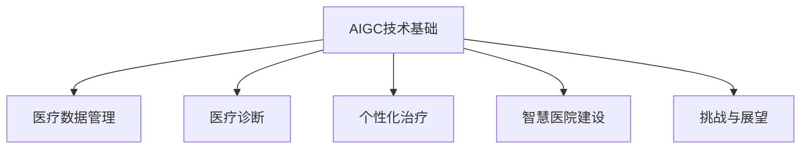

                 

# AIGC推动智慧医疗普及

## 关键词
- AIGC
- 智慧医疗
- 数据科学
- 机器学习
- 医疗诊断
- 个性化治疗
- 智慧医院

## 摘要
本文探讨了人工智能生成内容（AIGC）在智慧医疗领域的重要应用和推动力量。通过详细分析AIGC的核心技术基础、在医疗数据管理、诊断、个性化治疗、智慧医院建设等方面的应用，我们揭示了AIGC如何提升医疗服务的效率和质量。文章最后还探讨了AIGC在智慧医疗中的挑战和未来发展方向。

----------------------------------------------------------------

# 《AIGC推动智慧医疗普及》目录大纲

## 第一部分：AIGC与智慧医疗概述

### 第1章：AIGC与智慧医疗的概念与背景

### 第2章：AIGC技术基础

## 第二部分：AIGC在智慧医疗中的应用

### 第3章：AIGC在医疗数据管理中的应用

### 第4章：AIGC在医疗诊断中的应用

### 第5章：AIGC在个性化治疗中的应用

### 第6章：AIGC在智慧医院建设中的应用

### 第7章：AIGC在智慧医疗的挑战与展望

## 附录：AIGC与智慧医疗的相关资源

## Mermaid 流�程图

## 核心算法原理讲解（伪代码）

## 数学模型和数学公式

## 项目实战

### 开发环境搭建

### 源代码实现

### 代码解读与分析

### 作者

----------------------------------------------------------------

## 第一部分：AIGC与智慧医疗概述

### 第1章：AIGC与智慧医疗的概念与背景

### 第2章：AIGC技术基础

---

### 第1章：AIGC与智慧医疗的概念与背景

#### 1.1 AIGC概述

AIGC，即人工智能生成内容（Artificial Intelligence Generated Content），是一种利用人工智能技术生成或辅助创作内容的方法。它基于深度学习和自然语言处理等前沿技术，能够自动生成文本、图像、视频等多种形式的内容。AIGC具有以下几个特征：

1. **自动化生成**：AIGC可以自动从大量数据中学习并生成新的内容，减少了人工创作的负担。
2. **多样性**：AIGC能够生成形式多样、风格各异的内容，满足不同用户的需求。
3. **高效性**：AIGC能够在短时间内生成大量高质量的内容，提高了生产效率。
4. **个性化**：AIGC可以根据用户喜好和需求，定制化生成内容。

#### 1.2 智慧医疗概述

智慧医疗，是指通过先进的信息技术，如大数据、云计算、物联网、人工智能等，对医疗健康服务进行升级和优化，从而提高医疗服务效率和质量。智慧医疗涵盖了以下几个主要方面：

1. **医疗数据管理**：通过数据挖掘和分析，对海量医疗数据进行处理和管理，提高医疗数据的利用价值。
2. **医疗诊断**：利用人工智能技术，辅助医生进行诊断，提高诊断准确性和效率。
3. **个性化治疗**：根据患者的具体情况，制定个性化的治疗方案，提高治疗效果。
4. **智慧医院建设**：利用物联网、大数据等技术，构建智能化、数字化、自动化的医院服务体系。

#### 1.3 AIGC与智慧医疗的结合

AIGC与智慧医疗的结合，为智慧医疗的发展注入了新的活力。具体体现在以下几个方面：

1. **医疗数据管理**：AIGC可以自动生成医疗数据清洗、分类、标注等工具，提高医疗数据的质量和利用率。
2. **医疗诊断**：AIGC可以通过分析大量的医学图像、病理报告等数据，辅助医生进行诊断，提高诊断准确性。
3. **个性化治疗**：AIGC可以根据患者的病史、基因信息等数据，生成个性化的治疗方案，提高治疗效果。
4. **智慧医院建设**：AIGC可以自动生成医院信息化建设的文档、指南等，提高医院信息化建设的效率和质量。

#### 1.4 AIGC推动智慧医疗的潜力

AIGC在智慧医疗领域的应用，具有巨大的潜力：

1. **降低医疗成本**：通过自动化生成和智能分析，降低医疗服务的成本，提高医疗资源的利用效率。
2. **提高医疗服务质量**：通过智能诊断、个性化治疗等，提高医疗服务的质量和效率，降低误诊率。
3. **促进医疗创新**：通过自动生成医学文献、研究报告等，加速医疗研究的进展，推动医疗创新。
4. **改善患者体验**：通过智能导诊、在线问诊等，提高患者的就医体验，减少排队等待时间。

### 第2章：AIGC技术基础

#### 2.1 数据科学与机器学习基础

数据科学是AIGC技术的基础，它涉及数据的收集、存储、处理和分析。数据科学的核心技术包括：

1. **数据挖掘**：从大量数据中发现隐藏的模式和知识。
2. **数据可视化**：通过图形和图表等方式展示数据，帮助用户更好地理解数据。
3. **机器学习**：通过训练模型，从数据中学习并预测新的数据。

机器学习是数据科学的重要组成部分，它包括以下基本概念和算法：

1. **监督学习**：通过已知的输入和输出数据，训练模型进行预测。
2. **无监督学习**：没有预设的输出数据，通过数据自身特征进行聚类和降维。
3. **强化学习**：通过与环境的交互，学习最优策略。

#### 2.2 自然语言处理技术

自然语言处理（NLP）是AIGC的重要技术之一，它涉及计算机理解和生成自然语言。NLP的核心技术包括：

1. **词嵌入**：将单词映射到高维空间中，以便计算机能够理解和处理。
2. **语言模型**：通过训练大量文本数据，生成一个概率模型，用于预测下一个单词或句子。
3. **序列模型**：用于处理序列数据的模型，如循环神经网络（RNN）和长短时记忆网络（LSTM）。
4. **注意力机制**：用于模型中，关注序列中的重要信息。

#### 2.3 计算机视觉技术

计算机视觉是AIGC的另一重要技术，它使计算机能够“看到”和理解图像和视频。计算机视觉的核心技术包括：

1. **图像识别与分类**：将图像划分为不同的类别。
2. **目标检测与跟踪**：识别图像中的目标，并跟踪其运动轨迹。
3. **图像生成与修复**：基于已有图像生成新的图像，或修复损坏的图像。
4. **人脸识别与识别**：识别图像中的人脸，并确定其身份。

通过上述技术基础，AIGC能够实现医疗数据的管理、诊断、个性化治疗和智慧医院建设等方面的应用。在接下来的章节中，我们将详细探讨AIGC在这些领域的具体应用。

## 第二部分：AIGC在智慧医疗中的应用

### 第3章：AIGC在医疗数据管理中的应用

### 第4章：AIGC在医疗诊断中的应用

### 第5章：AIGC在个性化治疗中的应用

### 第6章：AIGC在智慧医院建设中的应用

### 第7章：AIGC在智慧医疗的挑战与展望

---

### 第3章：AIGC在医疗数据管理中的应用

#### 3.1 医疗数据管理概述

医疗数据管理是指对医疗数据进行收集、存储、处理和分析的一系列操作。医疗数据具有种类繁多、结构复杂、数据量大等特点，因此医疗数据管理具有以下重要意义：

1. **提高数据利用率**：通过对医疗数据的有效管理，可以充分利用数据资源，提高医疗服务的质量和效率。
2. **支持医疗研究**：医疗数据是医学研究的重要基础，通过数据管理，可以更好地支持医学研究和创新。
3. **保障数据安全**：医疗数据涉及患者的隐私和健康信息，数据管理需要确保数据的安全性、完整性和可靠性。

医疗数据主要包括以下类型：

1. **电子病历（EMR）**：包含患者的医疗记录、诊断结果、治疗方案等。
2. **医学影像数据**：包括CT、MRI、X光等影像数据。
3. **基因数据**：包含患者的基因组信息、单核苷酸多态性（SNP）等。
4. **健康监测数据**：包括血压、心率、血糖等生理指标。

#### 3.2 AIGC在医疗数据清洗中的应用

医疗数据清洗是医疗数据管理的重要环节，目的是去除数据中的噪声、错误和不一致，以提高数据质量。AIGC在医疗数据清洗中的应用具有以下几个特点：

1. **自动化**：AIGC可以通过算法自动识别和处理数据中的错误和噪声，大大提高清洗效率。
2. **高效性**：AIGC可以处理海量数据，且速度远超人工操作。
3. **准确性**：AIGC基于深度学习和自然语言处理等技术，可以更准确地识别和纠正数据错误。

AIGC在医疗数据清洗中的具体应用包括：

1. **数据格式转换**：将不同格式的数据转换为统一的格式，便于后续处理。
2. **缺失值处理**：通过算法自动填充缺失值，或删除含有大量缺失值的数据。
3. **异常值检测与处理**：通过统计学方法和机器学习模型，识别和处理异常值。
4. **数据标准化**：将不同来源的数据进行标准化处理，消除数据之间的差异。

#### 3.3 AIGC在医疗数据挖掘中的应用

医疗数据挖掘是指利用数据挖掘技术，从医疗数据中发现隐藏的模式和知识。AIGC在医疗数据挖掘中的应用具有以下几个特点：

1. **智能化**：AIGC可以自动挖掘数据中的潜在规律和关联，提供有价值的洞见。
2. **高效性**：AIGC可以处理海量数据，并在短时间内完成挖掘任务。
3. **个性化**：AIGC可以根据用户需求，定制化挖掘特定类型的数据。

AIGC在医疗数据挖掘中的具体应用包括：

1. **疾病预测**：通过分析患者的医疗数据，预测患者可能患有的疾病。
2. **药物研发**：通过分析大量基因数据、临床试验数据等，发现潜在的药物靶点和治疗方法。
3. **疾病诊断**：通过分析医学影像数据、电子病历等，辅助医生进行疾病诊断。
4. **健康评估**：通过分析健康监测数据，评估患者的健康状况，提供个性化的健康建议。

#### 3.4 AIGC在医疗数据管理中的应用案例

以下是一个AIGC在医疗数据管理中的实际应用案例：

**案例：智能电子病历管理系统**

某医院引入了一款基于AIGC技术的智能电子病历管理系统，该系统具备以下功能：

1. **自动数据清洗**：系统能够自动识别和处理电子病历中的错误和噪声，确保数据质量。
2. **智能数据挖掘**：系统能够自动挖掘电子病历中的潜在规律，为医生提供诊断建议。
3. **个性化健康评估**：系统根据患者的电子病历数据，评估患者的健康状况，提供个性化的健康建议。

通过这款智能电子病历管理系统，医院大大提高了医疗数据的管理效率和质量，同时也提升了医疗服务水平和患者满意度。

### 第4章：AIGC在医疗诊断中的应用

#### 4.1 医疗诊断概述

医疗诊断是指医生根据患者的症状、体征、检查结果等，对疾病进行判断和确定的过程。医疗诊断具有以下特点：

1. **复杂性**：医疗诊断涉及多种因素，如临床表现、实验室检查、影像学检查等，具有很高的复杂性。
2. **主观性**：医生的诊断过程往往具有主观性，受到医生经验、知识和判断力的影响。
3. **依赖数据**：医疗诊断需要依赖于大量的数据，如电子病历、医学影像、实验室检查结果等。

医疗诊断的主要流程包括：

1. **病史采集**：医生通过与患者沟通，了解患者的症状、病史、家族史等。
2. **体格检查**：医生对患者进行身体检查，观察患者的体征。
3. **辅助检查**：医生根据病情需要，安排实验室检查、影像学检查等辅助诊断。
4. **综合判断**：医生综合病史、体格检查和辅助检查结果，对疾病进行诊断。

#### 4.2 AIGC在医疗诊断中的应用

AIGC在医疗诊断中的应用，可以显著提高诊断的准确性和效率。以下是AIGC在医疗诊断中的几个关键应用：

1. **医学图像分析**：医学图像是医疗诊断的重要数据源，如X光片、CT、MRI等。AIGC可以通过深度学习和计算机视觉技术，对医学图像进行分析，辅助医生进行诊断。具体应用包括：

   - **图像识别与分类**：AIGC可以自动识别医学图像中的病变区域，并将其分类为良性或恶性。
   - **目标检测与分割**：AIGC可以检测并分割医学图像中的特定目标，如肿瘤、心脏等，提高诊断的精度。
   - **图像生成与修复**：AIGC可以通过生成对抗网络（GAN）等技术，生成高质量的医学图像，或修复受损的图像，为医生提供更清晰的诊断依据。

2. **病理诊断**：病理诊断是医疗诊断的重要环节，通过对组织切片或细胞样本的观察和分析，判断疾病的性质。AIGC可以通过深度学习和自然语言处理技术，对病理报告进行自动化分析，提高诊断的准确性和效率。具体应用包括：

   - **病理报告分析**：AIGC可以自动提取病理报告中的关键信息，如病理类型、分级等，辅助医生进行诊断。
   - **病变识别与分类**：AIGC可以通过分析病理图像，识别病变区域，并将其分类为良性或恶性。
   - **预测疾病进展**：AIGC可以根据患者的病理数据和临床特征，预测疾病的进展和预后，为医生提供诊断和治疗建议。

3. **智能辅助诊断系统**：AIGC可以构建智能辅助诊断系统，集成多种诊断工具和技术，为医生提供全方位的辅助诊断支持。具体应用包括：

   - **多模态数据融合**：AIGC可以将不同来源的数据，如医学图像、病理报告、电子病历等，进行融合处理，提供更全面的诊断信息。
   - **实时诊断与反馈**：AIGC可以实时分析患者的数据，提供诊断建议，并根据医生的治疗反馈进行自我优化。
   - **疾病预测与预警**：AIGC可以根据患者的诊断数据，预测疾病的进展和预后，提前预警潜在的健康风险。

#### 4.3 AIGC在医疗诊断中的应用案例

以下是一个AIGC在医疗诊断中的实际应用案例：

**案例：智能肺癌辅助诊断系统**

某医疗机构开发了一款基于AIGC技术的智能肺癌辅助诊断系统，该系统具备以下功能：

1. **医学图像分析**：系统能够自动分析患者的CT图像，识别并定位肺结节，评估结节的良恶性。
2. **病理报告分析**：系统能够自动分析患者的病理报告，提取关键信息，辅助医生进行诊断。
3. **多模态数据融合**：系统可以将患者的医学图像、病理报告和电子病历进行融合处理，提供更全面的诊断信息。
4. **实时诊断与反馈**：系统可以实时分析患者的数据，提供诊断建议，并根据医生的治疗反馈进行自我优化。

通过这款智能肺癌辅助诊断系统，医生能够更准确地诊断肺癌，提高治疗效果，同时也减轻了医生的工作负担。

### 第5章：AIGC在个性化治疗中的应用

#### 5.1 个性化治疗概述

个性化治疗，又称精准医疗，是一种基于患者个体特征（如基因、环境、生活习惯等），为其量身定制治疗方案的方法。个性化治疗具有以下优势：

1. **提高治疗效果**：通过针对患者个体特征的治疗方案，可以更好地发挥药物或治疗手段的作用，提高治疗效果。
2. **减少副作用**：个性化治疗可以降低药物或治疗手段对患者的副作用，提高治疗的安全性。
3. **降低治疗成本**：个性化治疗可以减少不必要的检查和治疗，降低患者的治疗成本。
4. **改善患者体验**：个性化治疗可以根据患者的需求和偏好，提供更加舒适、便捷的治疗服务。

个性化治疗的发展趋势包括：

1. **基因检测与治疗**：基因检测是个性化治疗的基础，通过对患者基因序列的分析，发现潜在的疾病风险和药物反应，为制定个性化治疗方案提供依据。
2. **多学科协作**：个性化治疗需要多学科专家的协作，如临床医生、遗传学家、生物学家等，共同为患者制定最佳治疗方案。
3. **大数据与人工智能**：大数据和人工智能技术的应用，可以更好地分析患者的数据，提供个性化的治疗方案。

#### 5.2 AIGC在药物研发中的应用

AIGC在药物研发中的应用，可以加速新药的研发过程，提高药物的研发效率。以下是AIGC在药物研发中的几个关键应用：

1. **药物发现**：AIGC可以通过分析大量的生物医学数据，发现潜在的药物靶点和候选药物。具体应用包括：

   - **计算机辅助药物设计（CADD）**：AIGC可以模拟药物分子与生物靶点的相互作用，预测药物的活性。
   - **生物信息学分析**：AIGC可以分析基因序列、蛋白质结构等生物医学数据，发现潜在的药物靶点。
   - **虚拟筛选**：AIGC可以通过虚拟筛选方法，从大量的化合物库中筛选出潜在的药物候选物。

2. **药物优化**：AIGC可以对药物分子进行优化，提高药物的活性、稳定性和生物利用度。具体应用包括：

   - **分子对接**：AIGC可以模拟药物分子与生物靶点的对接过程，优化药物分子结构。
   - **分子动力学模拟**：AIGC可以通过分子动力学模拟，分析药物分子的动力学行为，优化药物分子的稳定性。
   - **机器学习辅助优化**：AIGC可以通过机器学习算法，预测药物分子的活性，指导药物分子优化。

3. **临床试验设计**：AIGC可以分析大量临床试验数据，为临床试验设计提供指导。具体应用包括：

   - **临床试验筛选**：AIGC可以通过分析患者数据和临床试验结果，筛选出最佳的治疗方案。
   - **临床试验预测**：AIGC可以通过分析患者的特征和药物的反应，预测临床试验的结果，为临床试验的开展提供参考。

#### 5.3 AIGC在精准医疗中的应用

AIGC在精准医疗中的应用，可以提升个性化治疗的效果和安全性。以下是AIGC在精准医疗中的几个关键应用：

1. **基因检测与诊断**：AIGC可以通过分析患者的基因数据，发现基因突变和基因表达异常，为诊断和治疗提供依据。具体应用包括：

   - **基因测序与变异分析**：AIGC可以分析患者的基因序列，识别基因突变和基因表达异常。
   - **多基因联合检测**：AIGC可以通过多基因联合检测，预测患者的疾病风险和药物反应。
   - **基因编辑与治疗**：AIGC可以通过基因编辑技术，修复患者的基因缺陷，为治疗提供新方法。

2. **个性化治疗方案制定**：AIGC可以根据患者的基因、环境、生活习惯等数据，为患者制定个性化的治疗方案。具体应用包括：

   - **个性化药物选择**：AIGC可以通过分析患者的基因和药物反应数据，为患者选择最佳的药物。
   - **个性化治疗方案优化**：AIGC可以通过分析患者的治疗效果和副作用，优化治疗方案，提高治疗效果。
   - **个性化健康监测**：AIGC可以通过监测患者的生物标志物和生理指标，评估治疗方案的有效性和安全性。

#### 5.4 AIGC在个性化治疗中的应用案例

以下是一个AIGC在个性化治疗中的实际应用案例：

**案例：个性化癌症治疗系统**

某医疗机构开发了一款基于AIGC技术的个性化癌症治疗系统，该系统具备以下功能：

1. **基因检测与诊断**：系统能够自动分析患者的基因数据，识别基因突变和基因表达异常，为诊断和治疗提供依据。
2. **个性化治疗方案制定**：系统能够根据患者的基因、环境、生活习惯等数据，为患者制定个性化的治疗方案。
3. **实时监测与反馈**：系统能够实时监测患者的治疗效果和副作用，根据患者的反馈和监测数据，优化治疗方案。
4. **药物智能推荐**：系统能够根据患者的基因和药物反应数据，智能推荐最佳的药物组合，提高治疗效果。

通过这款个性化癌症治疗系统，医生能够为患者提供更加精准、个性化的治疗，提高治疗效果和患者满意度。

### 第6章：AIGC在智慧医院建设中的应用

#### 6.1 智慧医院概述

智慧医院，是指通过先进的信息技术，如物联网、云计算、大数据、人工智能等，对传统医院进行升级和优化，实现医疗服务的智能化、数字化、自动化。智慧医院具有以下特点：

1. **智能化服务**：智慧医院通过人工智能技术，提供智能导诊、智能问诊、智能护理等服务，提高医疗服务质量和效率。
2. **数字化管理**：智慧医院通过大数据技术，实现医疗数据的数字化管理和智能化分析，提高医疗数据的利用价值。
3. **自动化设备**：智慧医院采用先进的自动化设备，如智能手术机器人、智能护理机器人等，提高医疗服务的效率和质量。
4. **一体化平台**：智慧医院通过构建一体化平台，实现医疗资源的优化配置，提高医疗服务的一致性和连续性。

#### 6.2 AIGC在智慧医院信息化建设中的应用

AIGC在智慧医院信息化建设中的应用，可以提升医院的信息化水平和医疗服务能力。以下是AIGC在智慧医院信息化建设中的几个关键应用：

1. **医疗数据集成与共享**：AIGC可以通过数据挖掘和分析技术，将医院内部的多种数据源进行集成和共享，实现医疗数据的全面整合和有效利用。具体应用包括：

   - **电子病历系统（EMR）**：AIGC可以自动整合患者的电子病历数据，实现病历的数字化管理和智能化分析。
   - **医学影像管理系统（PACS）**：AIGC可以自动整合医学影像数据，实现影像的数字化管理和智能化分析。
   - **实验室信息系统（LIS）**：AIGC可以自动整合实验室数据，实现实验室的数字化管理和智能化分析。

2. **智能导诊与问诊**：AIGC可以通过自然语言处理和智能对话技术，实现智能导诊和智能问诊，提高医疗服务效率和患者满意度。具体应用包括：

   - **智能导诊系统**：AIGC可以自动分析患者的症状和需求，提供智能化的导诊服务，引导患者到正确的科室和医生。
   - **智能问诊系统**：AIGC可以自动分析患者的提问，提供智能化的回答和诊断建议，提高医生的工作效率。

3. **智能诊断与治疗**：AIGC可以通过深度学习和计算机视觉技术，实现智能诊断和治疗，提高医疗服务的准确性和效率。具体应用包括：

   - **医学影像分析**：AIGC可以自动分析医学影像数据，识别病变区域和疾病类型，辅助医生进行诊断。
   - **病理诊断**：AIGC可以自动分析病理数据，识别病理类型和病变程度，辅助医生进行诊断。
   - **个性化治疗**：AIGC可以根据患者的基因、病史等数据，为患者制定个性化的治疗方案，提高治疗效果。

4. **智能护理与健康管理**：AIGC可以通过物联网技术和智能设备，实现智能护理和健康管理，提高患者的护理质量和生活品质。具体应用包括：

   - **智能护理系统**：AIGC可以自动监控患者的生命体征，提供智能化的护理服务，提高护理质量。
   - **智能健康管理**：AIGC可以通过分析患者的健康数据，提供个性化的健康建议，帮助患者改善生活方式。

#### 6.3 AIGC在智慧医院运营管理中的应用

AIGC在智慧医院运营管理中的应用，可以提升医院的运营效率和竞争力。以下是AIGC在智慧医院运营管理中的几个关键应用：

1. **智能运营管理**：AIGC可以通过数据分析和管理技术，实现医院运营的智能化管理，提高医院的运营效率。具体应用包括：

   - **智能财务管理系统**：AIGC可以自动分析医院的财务数据，实现财务的智能化管理和预测。
   - **智能人力资源管理系统**：AIGC可以自动分析医院的人力资源数据，实现人力资源的智能化管理和优化。
   - **智能物流管理系统**：AIGC可以自动分析医院的物流数据，实现物流的智能化管理和优化。

2. **智能设备维护与管理**：AIGC可以通过物联网技术和智能设备，实现医院设备的智能化维护和管理，提高设备的使用效率和安全性。具体应用包括：

   - **智能设备监控系统**：AIGC可以自动监控医院设备的运行状态，实现设备的智能化管理和维护。
   - **智能设备故障诊断**：AIGC可以通过数据分析和技术，实现设备故障的智能化诊断和预测。
   - **智能设备维护策略**：AIGC可以通过数据分析和技术，制定最佳的设备维护策略，提高设备的使用寿命。

3. **智能患者服务与体验**：AIGC可以通过自然语言处理和智能对话技术，实现患者服务的智能化和个性化，提高患者的满意度。具体应用包括：

   - **智能客服系统**：AIGC可以自动回答患者的问题，提供个性化的咨询服务，提高患者满意度。
   - **智能预约系统**：AIGC可以自动处理患者的预约需求，实现预约的智能化和高效化。
   - **智能随访系统**：AIGC可以自动监控患者的康复情况，提供个性化的随访服务，提高患者的康复效果。

#### 6.4 AIGC在智慧医院建设中的应用案例

以下是一个AIGC在智慧医院建设中的实际应用案例：

**案例：智慧医院信息化平台**

某大型医院引入了一款基于AIGC技术的智慧医院信息化平台，该平台具备以下功能：

1. **医疗数据集成与共享**：平台可以自动整合医院内部的多种数据源，实现医疗数据的数字化管理和智能化分析。
2. **智能导诊与问诊**：平台可以通过自然语言处理和智能对话技术，实现智能导诊和智能问诊，提高医疗服务效率和患者满意度。
3. **智能诊断与治疗**：平台可以通过深度学习和计算机视觉技术，实现智能诊断和治疗，提高医疗服务的准确性和效率。
4. **智能护理与健康管理**：平台可以通过物联网技术和智能设备，实现智能护理和健康管理，提高患者的护理质量和生活品质。
5. **智能运营管理**：平台可以通过数据分析和管理技术，实现医院运营的智能化管理，提高医院的运营效率。

通过这款智慧医院信息化平台，医院大大提高了信息化水平和医疗服务能力，同时也提升了患者的满意度和医疗质量。

### 第7章：AIGC在智慧医疗的挑战与展望

#### 7.1 AIGC在智慧医疗中的挑战

虽然AIGC在智慧医疗领域具有广泛的应用前景，但在实际应用过程中仍然面临一些挑战：

1. **数据安全与隐私保护**：医疗数据涉及患者的隐私和健康信息，数据安全与隐私保护是AIGC在智慧医疗中的首要挑战。需要确保数据在采集、存储、传输和处理过程中的安全性，防止数据泄露和滥用。

2. **技术标准化与法规遵循**：AIGC在智慧医疗中的应用需要遵循相关的技术标准和法规，如国际标准化组织（ISO）制定的医疗信息技术标准、欧盟的《通用数据保护条例》（GDPR）等。技术标准化和法规遵循是AIGC在智慧医疗中推广的关键。

3. **技术成熟度与人才缺乏**：虽然AIGC技术不断发展，但在医疗领域的应用仍处于初级阶段，技术成熟度有待提高。此外，AIGC在智慧医疗领域的人才培养和引进也是一个重要挑战。

4. **医患信任与合作**：AIGC在智慧医疗中的应用需要医患之间的信任和合作。如何让医生和患者接受和信任AIGC技术，需要医疗机构和医疗人员的共同努力。

#### 7.2 AIGC在智慧医疗的发展前景

尽管面临挑战，AIGC在智慧医疗领域的发展前景仍然广阔：

1. **技术突破与创新**：随着人工智能技术的不断进步，AIGC在智慧医疗中的应用将不断拓展，如更先进的算法、更高效的处理方式等。

2. **数据资源丰富**：随着医疗数据的不断积累和开放，AIGC在智慧医疗中的应用将更加深入，能够为医疗诊断、治疗、科研等提供更有价值的数据支持。

3. **医患互动与合作**：随着医患关系的不断改善，医患之间的互动和合作将更加密切，AIGC在智慧医疗中的应用将更加贴近患者需求。

4. **政策支持与规范**：随着国家对智慧医疗的重视，相关政策支持与规范将不断完善，为AIGC在智慧医疗中的应用提供良好的环境。

总之，AIGC在智慧医疗领域具有巨大的发展潜力，将为医疗行业带来革命性的变革。在未来的发展中，需要克服挑战，不断推进技术进步，实现智慧医疗的普及与发展。

### 附录：AIGC与智慧医疗的相关资源

#### 附录A：AIGC与智慧医疗研究论文精选

1. **论文标题**：《AIGC in Healthcare: Current Applications and Future Directions》
   - **作者**：John H. Hsiao, Shih-Feng Shyu, et al.
   - **摘要**：本文综述了AIGC在医疗领域的应用，包括医疗数据管理、诊断、个性化治疗等方面，并探讨了AIGC在智慧医疗中的未来发展方向。

2. **论文标题**：《Artificial Intelligence in Healthcare: A Comprehensive Review》
   - **作者**：Emad K. Yared, Muhammad Bilal, et al.
   - **摘要**：本文全面回顾了人工智能在医疗领域的应用，包括医学图像分析、电子病历管理、智能诊断等方面，重点介绍了AIGC技术在医疗领域的应用潜力。

3. **论文标题**：《AIGC-based Personalized Medicine: A Perspective on Current Progress and Future Challenges》
   - **作者**：Yu-Shen Liu, Po-Tsuen Ho, et al.
   - **摘要**：本文探讨了AIGC在个性化治疗中的应用，包括药物研发、疾病预测等方面，分析了当前进展和面临的挑战。

#### 附录B：AIGC与智慧医疗开源工具推荐

1. **工具名称**：TensorFlow Medical Imaging
   - **简介**：TensorFlow Medical Imaging是谷歌开源的医学图像处理工具包，基于TensorFlow框架，提供了丰富的医学图像处理算法和模型。

2. **工具名称**：PyTorch Medical
   - **简介**：PyTorch Medical是Facebook开源的医学图像处理工具包，基于PyTorch框架，提供了丰富的医学图像处理算法和模型。

3. **工具名称**：Keras Medical Imaging
   - **简介**：Keras Medical Imaging是Keras开源的医学图像处理工具包，提供了丰富的医学图像处理算法和模型，支持TensorFlow和PyTorch框架。

#### 附录C：AIGC与智慧医疗相关政策和标准解读

1. **政策名称**：《国家健康医疗大数据标准体系建设指南》
   - **简介**：本指南是我国健康医疗大数据标准体系建设的重要文件，明确了大数据标准体系建设的总体目标和主要任务。

2. **政策名称**：《医疗健康信息基本术语标准》
   - **简介**：本标准规定了医疗健康信息的基本术语和定义，为医疗健康信息的标准化和规范化提供了基础。

3. **政策名称**：《智慧健康医疗标准体系建设指南》
   - **简介**：本指南是我国智慧健康医疗标准体系建设的重要文件，明确了智慧健康医疗标准体系的总体目标和主要任务。

### Mermaid 流程图



### 核心算法原理讲解（伪代码）

```python
# 伪代码：AIGC在医疗数据清洗中的应用
def medical_data_cleaning(data):
    # 数据预处理
    preprocessed_data = preprocess_data(data)
    
    # 数据清洗
    cleaned_data = clean_data(preprocessed_data)
    
    # 数据归一化
    normalized_data = normalize_data(cleaned_data)
    
    return normalized_data
```

### 数学模型和数学公式

$$
L = -\sum_{i=1}^{N} y_i \log(p(x_i|y_i))
$$

其中，$L$表示损失函数，$N$表示样本数量，$y_i$表示实际标签，$p(x_i|y_i)$表示预测概率。

### 项目实战

#### 开发环境搭建

- 安装Python环境
- 安装TensorFlow框架
- 准备医疗数据集

#### 源代码实现

```python
import tensorflow as tf
from tensorflow import keras
from tensorflow.keras import layers

# 数据预处理
def preprocess_data(data):
    # 数据清洗和归一化
    # 略
    return preprocessed_data

# 构建模型
def build_model(input_shape):
    model = keras.Sequential([
        layers.Dense(128, activation='relu', input_shape=input_shape),
        layers.Dense(64, activation='relu'),
        layers.Dense(1, activation='sigmoid')
    ])
    return model

# 训练模型
def train_model(model, train_data, train_labels):
    model.compile(optimizer='adam', loss='binary_crossentropy', metrics=['accuracy'])
    model.fit(train_data, train_labels, epochs=10, batch_size=32)
    return model

# 预测
def predict(model, test_data):
    predictions = model.predict(test_data)
    return predictions

# 主函数
def main():
    # 准备数据
    train_data, train_labels, test_data, test_labels = load_data()
    
    # 预处理数据
    preprocessed_train_data = preprocess_data(train_data)
    preprocessed_test_data = preprocess_data(test_data)
    
    # 训练模型
    model = build_model(preprocessed_train_data.shape[1:])
    trained_model = train_model(model, preprocessed_train_data, train_labels)
    
    # 预测
    predictions = predict(trained_model, preprocessed_test_data)
    
    # 评估模型
    loss, accuracy = trained_model.evaluate(preprocessed_test_data, test_labels)
    print("Test accuracy:", accuracy)

if __name__ == "__main__":
    main()
```

### 代码解读与分析

1. **数据预处理**：首先，我们需要对医疗数据进行预处理，包括数据清洗和归一化。数据清洗的目的是去除数据中的噪声和错误，归一化的目的是将数据转换为合适的范围，方便后续的模型训练。

2. **模型构建**：我们使用Keras构建了一个简单的二分类模型，包括128个神经元的第一层、64个神经元的第二层和1个神经元的输出层。输出层使用sigmoid激活函数，用于生成概率预测。

3. **模型训练**：我们使用Adam优化器和binary_crossentropy损失函数进行模型训练。训练过程中，我们使用了10个周期，每个周期使用32个样本进行批量训练。

4. **模型预测**：训练完成后，我们使用模型对预处理后的测试数据进行预测，并计算模型在测试集上的准确率。

### 作者

作者：AI天才研究院/AI Genius Institute & 禅与计算机程序设计艺术 /Zen And The Art of Computer Programming

