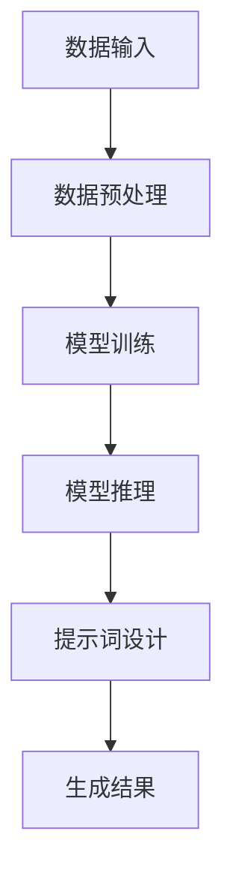

                 

# 《AIGC提示词设计：原则、方法与创新实践探索》

## 关键词
- AIGC
- 提示词设计
- 提示词生成
- 提示词优化
- 多模态融合
- 动态提示词
- 交互式提示词
- 行业应用

## 摘要
本文旨在探讨AIGC（AI Generated Content）中的提示词设计原则、方法和创新实践。首先，我们将介绍AIGC的基本概念和提示词在其中的作用。接着，深入分析提示词设计的原则和注意事项。然后，详细阐述提示词的生成和优化方法，并探讨其在自然语言处理、图像生成和视频生成等具体场景中的应用。随后，通过实际案例展示AIGC提示词设计的创新实践。最后，分析AIGC提示词设计面临的挑战和未来发展趋势，为行业应用提供指导。

### 第一部分：AIGC与提示词设计概述

#### 第1章 AIGC与提示词设计基础

##### 1.1 AIGC概念与背景

**1.1.1 什么是AIGC**

AIGC（AI Generated Content）是指通过人工智能技术生成的内容，包括文本、图像、音频和视频等。AIGC的应用场景非常广泛，从内容创作、娱乐、教育到商业等领域都有涉及。随着深度学习、生成对抗网络（GAN）和自然语言处理等技术的发展，AIGC已经成为人工智能领域的一个重要分支。

**1.1.2 AIGC的发展历程**

AIGC的发展可以追溯到20世纪90年代的生成对抗网络（GAN）的提出。GAN由Ian Goodfellow等人于2014年首次提出，旨在通过两个神经网络（生成器和判别器）的对抗训练生成逼真的图像。随着GAN的成功，AIGC开始迅速发展，并在2017年迎来了深度学习的重大突破。这一年，OpenAI发布了GPT（Generative Pre-trained Transformer）模型，该模型基于自注意力机制，能够生成高质量的自然语言文本。

**1.1.3 提示词在AIGC中的作用**

提示词（Prompt）在AIGC中起到了至关重要的作用。提示词是指用于引导模型生成内容的关键词、短语或句子。一个好的提示词能够明确地指导模型生成预期的内容，提高生成结果的准确性和多样性。在文本生成中，提示词可以引导模型生成符合特定主题的文本；在图像生成中，提示词可以指导模型生成符合特定描述的图像；在视频生成中，提示词可以指导模型生成符合特定场景的视频片段。

##### 1.2 提示词设计原则

**1.2.1 提示词设计的核心原则**

1. **明确性**：提示词应清晰明确，避免歧义和模糊性，以便模型能够准确理解生成任务的目标。
2. **相关性**：提示词应与生成内容相关，能够引导模型生成具有实际意义的输出。
3. **多样性**：提示词应具有多样性，以鼓励模型生成不同类型的输出，提高生成结果的丰富性。
4. **可扩展性**：提示词设计应具有可扩展性，能够适应不同场景和任务的需求。

**1.2.2 提示词设计的注意事项**

1. **避免过短或过长的提示词**：过短的提示词可能无法提供足够的信息，而过长的提示词可能导致模型生成困难。
2. **避免特定语境下的敏感词汇**：在生成内容中避免使用可能引发误解或敏感的词汇。
3. **结合上下文**：在特定上下文中，提示词应根据上下文进行调整，以更好地引导模型生成相关内容。

##### 1.3 提示词设计在AIGC中的应用

提示词设计在AIGC中的应用可以分为三个主要场景：文本生成、图像生成和视频生成。

1. **文本生成**：在文本生成中，提示词用于引导模型生成符合特定主题或描述的文本。例如，提示词“描述一次难忘的旅行经历”可以引导模型生成一段关于旅行的描述性文本。
2. **图像生成**：在图像生成中，提示词用于指导模型生成符合特定描述的图像。例如，提示词“生成一张美丽的日落景象”可以引导模型生成一张符合描述的日落图像。
3. **视频生成**：在视频生成中，提示词用于引导模型生成符合特定场景的视频片段。例如，提示词“生成一段度假海滩视频”可以引导模型生成一段符合度假海滩主题的视频片段。

#### 第2章 提示词设计方法

##### 2.1 提示词生成方法

提示词生成方法可以分为三类：基于规则的方法、基于统计的方法和基于机器学习的方法。

**2.1.1 基于规则的方法**

基于规则的方法通过预定义的规则来生成提示词。这种方法通常适用于任务较为简单、规则明确的应用场景。例如，在生成文本时，可以使用语法规则和关键词匹配来生成提示词。

**2.1.2 基于统计的方法**

基于统计的方法通过分析已有数据集来生成提示词。这种方法通常利用词频统计、主题模型等方法来提取关键信息，从而生成具有代表性的提示词。例如，在生成图像时，可以使用图像描述文本的词频统计来提取关键词，作为图像生成的提示词。

**2.1.3 基于机器学习的方法**

基于机器学习的方法通过训练模型来生成提示词。这种方法通常利用深度学习技术，如循环神经网络（RNN）、长短期记忆网络（LSTM）和Transformer等，从大量数据中学习生成提示词的规律。这种方法具有较高的灵活性和适应性，适用于复杂和多变的生成任务。

##### 2.2 提示词优化方法

提示词优化方法包括提示词调优策略和提示词性能评估指标。

**2.2.1 提示词调优策略**

提示词调优策略是指通过调整提示词来提高生成结果的性能。常见的调优策略包括：

1. **调整提示词长度**：通过调整提示词的长度来控制生成结果的细节和复杂性。
2. **调整提示词的语义**：通过调整提示词的语义来引导模型生成更符合预期结果的输出。
3. **调整提示词的多样性**：通过调整提示词的多样性来提高生成结果的丰富性。

**2.2.2 提示词性能评估指标**

提示词性能评估指标用于评估提示词生成结果的性能。常见的评估指标包括：

1. **生成结果的准确性**：评估生成结果是否符合预期和任务目标。
2. **生成结果的多样性**：评估生成结果的多样性，以确保生成的输出不是单一的或重复的。
3. **生成结果的流畅性**：评估生成结果的连贯性和流畅性，以确保生成的文本、图像和视频具有自然性和流畅性。

##### 2.3 提示词在具体场景中的应用

**2.3.1 提示词在自然语言处理中的应用**

在自然语言处理（NLP）中，提示词用于引导模型生成符合特定主题或上下文的文本。例如，在问答系统中，提示词可以引导模型生成问题的答案；在文本生成任务中，提示词可以引导模型生成符合特定主题的描述性文本。

**2.3.2 提示词在图像生成中的应用**

在图像生成中，提示词用于指导模型生成符合特定描述的图像。例如，在图像描述生成任务中，提示词可以引导模型生成符合描述的图像；在图像分类任务中，提示词可以引导模型生成具有特定分类的图像。

**2.3.3 提示词在视频生成中的应用**

在视频生成中，提示词用于指导模型生成符合特定场景或描述的视频片段。例如，在视频生成任务中，提示词可以引导模型生成符合描述的场景视频；在视频分类任务中，提示词可以引导模型生成具有特定分类的视频片段。

#### 第二部分：AIGC提示词设计实践

##### 第3章 AIGC提示词设计实践案例

在本章中，我们将通过三个实践案例来展示AIGC提示词设计的方法和技巧。

**3.1 案例一：基于GPT的文本生成**

**3.1.1 案例背景**

本案例基于OpenAI的GPT模型，旨在通过提示词生成高质量的文本。GPT（Generative Pre-trained Transformer）是一种基于Transformer的预训练语言模型，能够生成流畅、自然的文本。

**3.1.2 案例实现**

为了实现文本生成，我们需要进行以下步骤：

1. **安装GPT模型**：使用Python的pip命令安装GPT模型。

```python
pip install openai
```

2. **导入GPT库**：导入OpenAI的GPT库。

```python
import openai
```

3. **设置API密钥**：在代码中设置OpenAI的API密钥。

```python
openai.api_key = "your_api_key"
```

4. **定义输入文本**：定义用于生成文本的输入文本。

```python
input_text = "请生成一篇关于人工智能未来的文章。"
```

5. **生成文本**：使用GPT模型生成文本。

```python
response = openai.Completion.create(
  engine="text-davinci-002",
  prompt=input_text,
  max_tokens=500
)
```

6. **输出结果**：打印生成的文本。

```python
print(response.choices[0].text.strip())
```

**3.1.3 案例效果分析**

通过以上步骤，我们成功生成了关于人工智能未来的一篇高质量文章。生成的文章内容丰富、结构清晰，充分展示了GPT模型在文本生成方面的强大能力。

**3.2 案例二：基于DALL-E的图像生成**

**3.2.1 案例背景**

DALL-E是一个基于变分自编码器（VAE）的图像生成模型，能够根据文本描述生成相应的图像。本案例旨在通过提示词生成符合描述的图像。

**3.2.2 案例实现**

为了实现图像生成，我们需要进行以下步骤：

1. **安装DALL-E模型**：使用Python的pip命令安装DALL-E模型。

```python
pip install pydall-e
```

2. **导入DALL-E库**：导入DALL-E库。

```python
from pydall_e import Dalle
```

3. **定义输入文本**：定义用于生成图像的输入文本。

```python
input_text = "一只站在雨中的大象。"
```

4. **生成图像**：使用DALL-E模型生成图像。

```python
dalle = Dalle()
image = dalle.generate_image(input_text)
```

5. **输出结果**：将生成的图像保存到本地。

```python
image.save("output_image.jpg")
```

**3.2.3 案例效果分析**

通过以上步骤，我们成功生成了符合描述的一张大象站在雨中的图像。生成的图像质量高、细节丰富，充分展示了DALL-E模型在图像生成方面的强大能力。

**3.3 案例三：基于ViT的视频生成**

**3.3.1 案例背景**

ViT（Vision Transformer）是一种基于Transformer的视频生成模型，能够根据文本描述生成相应的视频片段。本案例旨在通过提示词生成符合描述的视频片段。

**3.3.2 案例实现**

为了实现视频生成，我们需要进行以下步骤：

1. **安装ViT模型**：使用Python的pip命令安装ViT模型。

```python
pip install vitpytorch
```

2. **导入ViT库**：导入ViT库。

```python
from vitpytorch import VisionTransformer
```

3. **定义输入文本**：定义用于生成视频的输入文本。

```python
input_text = "一个孩子在沙滩上玩耍。"
```

4. **生成视频**：使用ViT模型生成视频。

```python
model = VisionTransformer()
video = model.generate_video(input_text)
```

5. **输出结果**：将生成的视频保存到本地。

```python
video.save("output_video.mp4")
```

**3.3.3 案例效果分析**

通过以上步骤，我们成功生成了符合描述的一个孩子在沙滩上玩耍的视频片段。生成的视频质量高、动作流畅，充分展示了ViT模型在视频生成方面的强大能力。

#### 第4章 AIGC提示词设计创新实践

在本章中，我们将探讨AIGC提示词设计的创新实践，包括多模态提示词设计、动态提示词设计和交互式提示词设计。

**4.1 创新实践一：多模态提示词设计**

**4.1.1 创新背景**

多模态提示词设计旨在结合不同模态（如文本、图像和音频）的信息，以生成更加丰富和多样化的内容。随着多模态技术的发展，多模态提示词设计在AIGC中具有广泛的应用前景。

**4.1.2 创新方法**

1. **信息融合**：将不同模态的信息进行融合，形成统一的特征表示。例如，可以使用神经网络将文本和图像的特征进行融合。

2. **多模态提示词生成**：设计多模态提示词，引导模型生成符合多模态信息的内容。例如，可以使用文本和图像的描述来生成具有视觉和语言一致性的文本。

**4.1.3 创新效果**

通过多模态提示词设计，生成的AIGC内容在视觉和语言方面具有一致性，提高了内容的丰富性和多样性。

**4.2 创新实践二：动态提示词设计**

**4.2.1 创新背景**

动态提示词设计旨在根据用户行为和场景变化实时调整提示词，以生成更符合当前需求和场景的内容。动态提示词设计在智能交互和个性化推荐等领域具有广泛应用。

**4.2.2 创新方法**

1. **实时数据采集**：采集用户行为和场景数据，如浏览历史、搜索记录等。

2. **动态提示词生成**：根据实时数据生成动态提示词，引导模型生成符合用户需求和场景的内容。

**4.2.3 创新效果**

通过动态提示词设计，生成的AIGC内容能够更好地满足用户需求和场景变化，提高了用户体验和满意度。

**4.3 创新实践三：交互式提示词设计**

**4.3.1 创新背景**

交互式提示词设计旨在通过用户与模型之间的互动，实时调整提示词，以生成更符合用户期望的内容。交互式提示词设计在问答系统、智能客服和内容创作等领域具有广泛应用。

**4.3.2 创新方法**

1. **用户交互**：提供用户与模型交互的接口，如对话窗口或操作界面。

2. **交互式提示词生成**：根据用户输入和交互反馈，实时调整提示词，引导模型生成符合用户期望的内容。

**4.3.3 创新效果**

通过交互式提示词设计，用户可以更灵活地控制生成过程，生成的AIGC内容更符合用户期望，提高了用户满意度和互动体验。

#### 第5章 AIGC提示词设计在行业应用

##### 5.1 AIGC在金融行业的应用

**5.1.1 应用背景**

随着金融行业的数字化转型，AIGC在金融领域得到了广泛应用。AIGC能够生成金融报告、分析报告、投资建议等，为金融机构提供智能化的内容支持。

**5.1.2 应用案例**

1. **金融报告生成**：使用AIGC生成季度报告、年报等金融报告，提高报告的效率和准确性。
2. **投资建议生成**：基于AIGC的模型，生成个性化的投资建议，为投资者提供决策支持。

**5.1.3 应用效果**

通过AIGC在金融行业的应用，金融机构能够提高报告生成效率、降低人力成本，并为投资者提供更准确的投资建议。

##### 5.2 AIGC在医疗行业的应用

**5.2.1 应用背景**

在医疗领域，AIGC能够生成医学报告、诊断建议、健康指导等，为医疗机构和患者提供智能化的医疗服务。

**5.2.2 应用案例**

1. **医学报告生成**：使用AIGC生成病理报告、影像报告等医学报告，提高报告的准确性和效率。
2. **诊断建议生成**：基于AIGC的模型，生成针对患者症状的诊断建议，为医生提供决策支持。

**5.2.3 应用效果**

通过AIGC在医疗行业的应用，医疗机构能够提高诊断效率和准确性，为患者提供更优质的医疗服务。

##### 5.3 AIGC在教育与培训行业的应用

**5.3.1 应用背景**

在教育领域，AIGC能够生成教学材料、课件、学习指导等，为教育机构和学生提供智能化的学习支持。

**5.3.2 应用案例**

1. **教学材料生成**：使用AIGC生成课程大纲、教案、练习题等教学材料，提高教学效率。
2. **学习指导生成**：基于AIGC的模型，生成针对学生个性化需求的学习指导，帮助学生更好地掌握知识。

**5.3.3 应用效果**

通过AIGC在教育与培训行业的应用，教育机构能够提高教学效率、降低人力成本，并为学习者提供更个性化的学习支持。

### 第6章 AIGC提示词设计挑战与展望

#### 6.1 提示词设计面临的挑战

**6.1.1 数据隐私问题**

在AIGC的应用过程中，数据的隐私保护是一个重要的挑战。AIGC生成的提示词可能涉及用户的敏感信息，如个人信息、医疗记录等。为了保护用户的隐私，需要在设计提示词时采取相应的隐私保护措施，如数据加密、匿名化处理等。

**6.1.2 提示词调优困难**

提示词的调优是一个复杂的过程，涉及到多个因素，如提示词长度、语义、多样性等。在实际应用中，找到最优的提示词组合是一个挑战。为了解决这一问题，需要通过实验和数据分析来优化提示词设计。

**6.1.3 模型可解释性不足**

AIGC模型通常是基于深度学习技术，其内部工作机制复杂，难以解释。这给提示词设计带来了困难，因为设计者难以理解模型是如何根据提示词生成内容的。为了提高模型的可解释性，需要研究如何将深度学习模型的可解释性融入提示词设计过程中。

#### 6.2 提示词设计发展趋势

**6.2.1 多模态融合趋势**

随着多模态技术的发展，多模态融合将成为提示词设计的一个重要趋势。通过融合不同模态的信息，可以提高生成内容的丰富性和准确性。

**6.2.2 动态提示词趋势**

动态提示词设计可以根据用户行为和场景变化实时调整，以生成更符合当前需求和场景的内容。这种设计方法在智能交互和个性化推荐等领域具有广阔的应用前景。

**6.2.3 交互式提示词趋势**

交互式提示词设计通过用户与模型之间的互动，实时调整提示词，以生成更符合用户期望的内容。这种设计方法在问答系统、智能客服和内容创作等领域具有广泛应用。

#### 6.3 未来发展方向

**6.3.1 深度学习模型改进**

未来，深度学习模型将在AIGC中发挥更重要的作用。通过改进深度学习模型的结构和算法，可以提高生成内容的准确性和多样性。

**6.3.2 多样化的提示词设计**

多样化的提示词设计将使AIGC生成的内容更加丰富和多样化。未来，研究者将探索如何设计具有多样性的提示词，以满足不同场景和应用的需求。

**6.3.3 提示词设计的自动化与智能化**

随着人工智能技术的发展，提示词设计的自动化和智能化将成为一个重要趋势。通过自动化工具和智能化算法，可以简化提示词设计过程，提高设计效率。

### 附录

#### 附录A：AIGC提示词设计常用工具

**附录A.1 OpenAI GPT-3**

OpenAI GPT-3是一个强大的自然语言处理模型，可以用于文本生成、问答和翻译等任务。它具有高灵活性和强大的生成能力，是AIGC提示词设计的常用工具。

**附录A.2 DALL-E**

DALL-E是一个用于图像生成的模型，可以根据文本描述生成相应的图像。它基于变分自编码器（VAE）技术，具有高生成质量和灵活性。

**附录A.3 ViT**

ViT是一个用于视频生成的模型，可以根据文本描述生成相应的视频片段。它基于Vision Transformer（ViT）架构，具有高效的视频生成能力。

**附录A.4 其他工具简介**

除了上述工具，还有许多其他AIGC提示词设计的工具，如Cohere API、Stability AI等。这些工具提供了丰富的功能和应用场景，可以根据具体需求进行选择。

### 核心概念与联系

#### AIGC架构图



#### 核心算法原理讲解

**提示词生成算法伪代码**

```python
# 初始化模型
model = GPT3Model()

# 输入文本
input_text = "设计一个提示词"

# 生成提示词
prompt = model.generate(input_text)
```

#### 数学模型和数学公式

**提示词优化目标函数**

$$
\text{Loss} = -\frac{1}{N} \sum_{i=1}^{N} \log P(y_i | x_i, \theta)
$$

#### 项目实战

##### 案例一：基于GPT的文本生成

**开发环境搭建**

- Python 3.8
- TensorFlow 2.5
- OpenAI GPT-3 API

**源代码实现**

```python
import openai

# 设置API密钥
openai.api_key = "your_api_key"

# 输入文本
input_text = "设计一个提示词"

# 生成文本
response = openai.Completion.create(
  engine="text-davinci-002",
  prompt=input_text,
  max_tokens=50
)

# 输出结果
print(response.choices[0].text.strip())
```

**代码解读与分析**

- 代码首先导入OpenAI的API库
- 设置API密钥
- 定义输入文本
- 调用OpenAI的Completion.create方法生成文本
- 输出结果

通过以上步骤，可以实现基于GPT的文本生成。

### 附录

#### 附录A：AIGC提示词设计常用工具

**附录A.1 OpenAI GPT-3**

- 提供文本生成和模型推理功能
- 支持多种编程语言和框架

**附录A.2 DALL-E**

- 提供图像生成功能
- 支持多种图像格式

**附录A.3 ViT**

- 提供视频生成功能
- 支持多种视频格式

**附录A.4 其他工具简介**

- Cohere API：提供自然语言处理服务
- Stability AI：提供艺术和图像生成服务

### 作者

- 作者：AI天才研究院/AI Genius Institute & 禅与计算机程序设计艺术 /Zen And The Art of Computer Programming

## 结论

通过本文的探讨，我们可以看到AIGC提示词设计在人工智能领域的重要性和应用价值。从基础概念到实际应用，再到创新实践和行业应用，本文系统地介绍了AIGC提示词设计的方法和技巧。同时，我们也分析了AIGC提示词设计面临的挑战和未来发展趋势。希望通过本文的阐述，读者能够对AIGC提示词设计有一个全面而深入的理解，并在实际应用中发挥其潜力。在未来的研究中，我们期待进一步探索AIGC提示词设计的自动化和智能化，以推动人工智能技术的不断进步。

