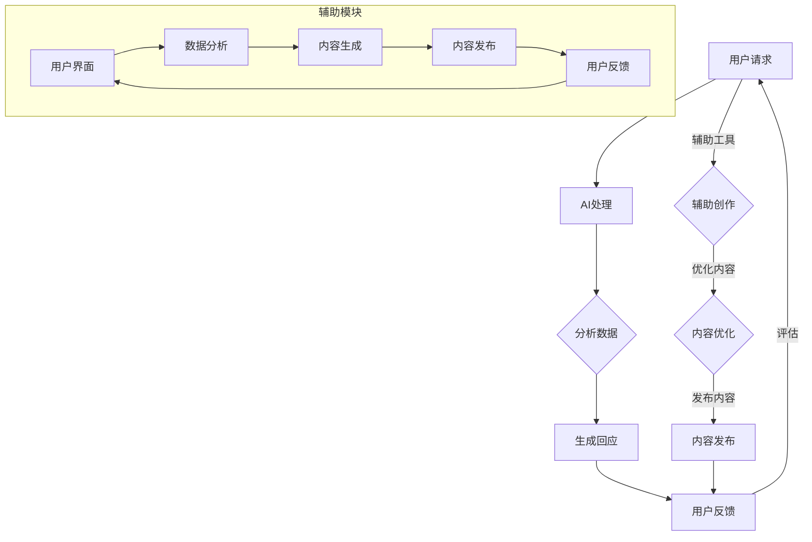

                 

### 《AIGC时代的内容策略：人机协作新模式》

关键词：AIGC、人工智能、内容创作、人机协作、技术趋势

摘要：随着人工智能（AI）技术的不断进步，AIGC（AI-Generated Content）时代正迅速崛起。本文将深入探讨AIGC时代的内容策略以及人机协作新模式，分析其在各行业中的应用，探讨人机协作的基础、实现和实际应用，并提出未来AIGC时代的挑战与应对策略。通过详细的技术讲解、应用案例和实践经验，本文旨在为读者提供全面的理解和指导。

---

### 《AIGC时代的内容策略：人机协作新模式》目录大纲

#### 第一部分：AIGC时代背景与概述

##### 第1章：AIGC时代概述  
- **1.1 AIGC的定义与重要性**  
  - AIGC的概念  
  - AIGC在数字化时代的作用

- **1.2 AIGC的核心技术**  
  - AI技术简介  
  - 图像生成与处理的GPT模型  
  - 内容生成与扩散模型

- **1.3 人机协作新模式的定义与特点**  
  - 人机协作新模式的定义  
  - 新模式下的优势与挑战

##### 第2章：AIGC在各行业的应用  
- **2.1 教育行业**  
  - AI在教育中的应用案例  
  - AIGC在教育中的应用

- **2.2 媒体与娱乐行业**  
  - AI在媒体中的应用  
  - AIGC在媒体内容创作中的应用

- **2.3 制造业**  
  - AI在制造业的应用  
  - AIGC在智能制造中的角色

##### 第3章：AIGC与内容创作  
- **3.1 内容创作的AI辅助工具**  
  - 自动化内容创作工具  
  - AI内容创作的流程

- **3.2 人机协作在内容创作中的应用**  
  - 创作者与AI的协同创作模式  
  - 人机协作下的内容优化

#### 第二部分：人机协作新模式详解

##### 第4章：人机协作新模式的基础  
- **4.1 人机交互技术**  
  - 人机交互的基本原理  
  - 语音识别与生成技术

- **4.2 人机协作的核心原则**  
  - 合作性原则  
  - 效率最大化原则  
  - 安全性原则

##### 第5章：人机协作新模式的实现  
- **5.1 人机协作的架构设计**  
  - 人机协作系统的设计要点  
  - 模块化设计与应用

- **5.2 人机协作的关键技术**  
  - 机器学习算法在协作中的应用  
  - 自然语言处理技术  
  - 机器视觉技术

##### 第6章：人机协作新模式的实际应用  
- **6.1 企业管理中的应用**  
  - 企业决策支持的AI工具  
  - 人机协作在客户服务中的应用

- **6.2 教育领域的应用**  
  - 个性化教育平台  
  - 人机协作在教学中的应用

- **6.3 医疗健康领域的应用**  
  - 医疗诊断辅助系统  
  - 人机协作在健康监测中的应用

##### 第7章：AIGC时代的内容策略规划  
- **7.1 内容策略规划的重要性**  
  - 内容策略在企业中的定位  
  - 内容策略规划的流程

- **7.2 内容策略规划的要素**  
  - 用户需求分析  
  - 内容创意与策划  
  - 内容发布与传播

- **7.3 AIGC时代的内容优化策略**  
  - 利用AI进行内容优化  
  - 实时数据分析与调整

#### 第三部分：未来展望与挑战

##### 第8章：AIGC时代的挑战与应对策略  
- **8.1 技术挑战**  
  - AI技术的快速发展带来的挑战  
  - 数据安全与隐私保护

- **8.2 社会挑战**  
  - 人机协作模式对就业的影响  
  - 社会道德与伦理问题

- **8.3 应对策略**  
  - 技术创新与人才培育  
  - 法规制定与伦理审查

##### 第9章：AIGC时代的未来发展  
- **9.1 内容创作与AI的深度融合**  
  - AI在内容创作中的未来趋势  
  - 人机协作的新模式

- **9.2 AIGC时代的产业变革**  
  - AI驱动的内容产业  
  - 新型商业模式的出现

##### 第10章：AIGC时代的内容策略实践案例  
- **10.1 成功案例分析**  
  - AIGC在不同行业的成功应用案例  
  - 人机协作在新产品开发中的应用

- **10.2 实践经验与启示**  
  - 实践中的经验与教训  
  - 未来发展的启示

### 附录

- **附录A：AIGC技术资源与工具**  
  - 主流AIGC开发框架介绍  
  - AIGC工具使用指南

- **附录B：相关参考文献与资源链接**  
  - AIGC领域的重要文献与资料  
  - 开发者社区与交流平台

- **附录C：人机协作新模式 Mermaid 流�程图**

- **附录D：人机协作关键算法伪代码**

- **附录E：内容策略数学模型与公式**

- **附录F：内容策略案例代码与分析**

- **附录G：内容策略分析工具使用指南**

- **附录H：内容策略最佳实践**

---

通过以上目录大纲，本文将全面深入地探讨AIGC时代的内容策略和人机协作新模式，为读者提供有深度、有思考、有见解的专业IT领域技术博客文章。让我们一步一步地分析推理思考，深入了解AIGC时代的技术趋势和应用场景。

---

### 第一部分：AIGC时代背景与概述

#### 第1章：AIGC时代概述

##### 1.1 AIGC的定义与重要性

AIGC，即AI-Generated Content，指的是由人工智能技术生成的内容。随着深度学习、自然语言处理（NLP）、图像处理等技术的迅猛发展，AIGC已经从最初的实验阶段走向了实际应用，成为数字内容创作的重要力量。

**AIGC的概念**

AIGC的定义可以从广义和狭义两个方面来理解：

- **广义定义**：AIGC是指利用人工智能技术生成或辅助生成的各种类型的内容，包括但不限于文本、图像、音频、视频等。广义的AIGC不仅涵盖了文本生成，还包括了图像生成、语音合成等。

- **狭义定义**：狭义的AIGC主要指的是基于生成对抗网络（GAN）、变分自编码器（VAE）等深度学习技术的文本生成和图像生成。例如，GPT（Generative Pre-trained Transformer）模型就是一种典型的用于文本生成的AIGC技术。

**AIGC在数字化时代的作用**

AIGC在数字化时代的作用主要体现在以下几个方面：

1. **内容生产的效率提升**：AIGC技术能够自动生成大量高质量的内容，大幅提高了内容生产效率，使得创作者能够专注于创意层面，而无需在繁琐的文本或图像生成过程中耗费过多时间。

2. **创意和创新的解放**：AIGC技术为创作者提供了更多探索创意和创新的可能性。例如，通过图像生成技术，创作者可以快速生成各种风格的图像，从而激发灵感。

3. **个性化内容推荐**：AIGC技术可以基于用户行为数据生成个性化推荐内容，提高用户满意度，增强用户体验。

4. **内容多样性**：AIGC技术能够生成各种类型和风格的内容，丰富了数字内容的表现形式，为用户提供更广泛的选择。

##### 1.2 AIGC的核心技术

AIGC技术的实现依赖于多种核心技术的结合，主要包括：

**AI技术简介**

人工智能（AI）是AIGC的基础。AI技术主要包括以下几种：

1. **机器学习**：机器学习是一种通过数据学习模式并做出预测或决策的技术。在AIGC中，机器学习算法被用来训练模型，使其能够生成或辅助生成内容。

2. **深度学习**：深度学习是机器学习的一个分支，它使用神经网络模拟人脑的学习过程。深度学习在图像和文本生成中扮演了关键角色。

3. **自然语言处理（NLP）**：NLP是使计算机能够理解、生成和处理人类语言的技术。在AIGC中，NLP技术被用于生成文本内容。

**图像生成与处理的GPT模型**

GPT（Generative Pre-trained Transformer）模型是图像生成和处理的代表性技术之一。GPT模型基于Transformer架构，它是一种自注意力机制，能够捕捉输入序列中的长距离依赖关系。GPT模型在图像生成中的应用主要包括：

1. **图像到图像的转换**：例如，将一张黑白图像转换为彩色图像。

2. **图像风格的转换**：例如，将一张普通图像转换为艺术风格图像。

3. **图像的生成**：例如，生成新的、独特的图像内容。

**内容生成与扩散模型**

扩散模型（Diffusion Model）是一种近年来兴起的图像生成技术，它通过模拟物质扩散过程来生成图像。扩散模型的工作原理是将一张图像逐渐转换为噪声，然后再从噪声中恢复出新的图像。这种模型在图像生成中具有很高的灵活性和创造性。

**人机协作新模式的定义与特点**

人机协作新模式是指人工智能与人类创作者在内容创作过程中进行高效、协作的工作方式。这种模式的特点包括：

1. **分工明确**：人类创作者负责创意和整体构思，而AI负责具体的生成和优化工作。

2. **协同高效**：人类创作者和AI之间通过数据交换和反馈机制实现协同工作，提高工作效率。

3. **智能化**：AI技术能够根据创作者的需求自动生成内容，并提供实时优化建议。

4. **个性化**：AI可以根据用户行为和喜好生成个性化内容，提升用户体验。

##### 1.3 人机协作新模式的定义与特点

**人机协作新模式的定义**

人机协作新模式指的是人类与人工智能（AI）系统在内容创作和传播过程中进行的协同工作。这种模式的核心是通过AI技术的辅助，实现人类创作者的创意和AI算法的自动化生成之间的有机结合。

**新模式下的优势与挑战**

**优势：**

1. **效率提升**：AI能够快速生成大量高质量的内容，大幅提高创作效率。

2. **创意拓展**：AI可以生成多样化的内容，激发人类创作者的创意思维。

3. **个性化推荐**：AI可以根据用户行为和偏好生成个性化内容，提高用户满意度。

4. **内容质量控制**：AI可以对生成的内容进行实时审查和优化，确保内容质量。

**挑战：**

1. **技术成熟度**：尽管AI技术在不断进步，但某些领域的技术仍不够成熟，需要进一步发展。

2. **数据隐私与安全**：AI在处理和生成内容时需要大量数据，如何确保数据隐私和安全是一个重要问题。

3. **伦理与道德**：AI生成的内容可能涉及伦理和道德问题，需要制定相应的规范和标准。

4. **人力资源调整**：随着AI技术的普及，人类创作者的角色和技能需求可能发生变化，需要相应的人力资源调整。

总之，AIGC时代带来了新的内容创作和传播模式，人机协作新模式在这种背景下应运而生。通过深入理解AIGC的核心技术和人机协作新模式的特点，我们可以更好地把握这一时代的机遇和挑战。

---

通过以上章节的探讨，我们初步了解了AIGC的定义、核心技术以及人机协作新模式。在接下来的章节中，我们将进一步探讨AIGC在各行业的具体应用，分析其在教育、媒体、娱乐和制造业等领域的表现和潜力。请继续关注下一章节的内容。

---

### 第2章：AIGC在各行业的应用

#### 2.1 教育行业

在教育行业中，AIGC技术的应用为教育模式带来了革命性的变革。传统的教育模式依赖于教师的讲授和学生的被动接受，而AIGC技术通过AI辅助，使得个性化教育和智能教学成为可能。

**AI在教育中的应用案例**

1. **自适应学习平台**：通过分析学生的行为和成绩数据，AIGC技术能够为学生提供个性化的学习方案，自动调整学习内容和进度，满足不同学生的学习需求。

2. **虚拟教师**：AIGC技术可以生成虚拟教师，为学生提供实时辅导和解答问题，提高学生的学习效果。

3. **智能作业生成**：AI可以自动生成各种类型的作业，包括文本题、图像题、编程题等，为学生提供丰富的练习机会。

**AIGC在教育中的应用**

1. **个性化课程设计**：AIGC技术可以根据学生的学习习惯和偏好，自动生成个性化课程，提高学习效果。

2. **智能评估系统**：通过AI技术，教育机构可以快速评估学生的学习进度和成果，及时调整教学策略。

3. **教育资源优化**：AI可以自动整理和分类教育资源，提高教育资源的利用效率。

#### 2.2 媒体与娱乐行业

在媒体与娱乐行业，AIGC技术的应用极大地丰富了内容创作和分发的方式，提升了内容的生产效率和用户体验。

**AI在媒体中的应用**

1. **内容推荐**：AI算法可以根据用户的历史行为和偏好，智能推荐符合用户兴趣的内容，提高用户的粘性。

2. **数据分析**：AI可以对大量媒体数据进行分析，挖掘出潜在的用户需求和市场趋势，帮助媒体机构制定更有效的策略。

3. **自动新闻生成**：AI可以自动生成新闻稿件，减轻记者和编辑的工作负担，提高新闻的时效性和覆盖面。

**AIGC在媒体内容创作中的应用**

1. **视频内容生成**：AIGC技术可以自动生成视频内容，包括动画、特效等，提高视频创作的效率和质量。

2. **音频内容创作**：AI可以生成音频内容，如音乐、语音合成等，为音频创作提供新的可能性。

3. **虚拟主播**：通过AI技术，可以创建虚拟主播，进行直播和互动，提升观众体验。

#### 2.3 制造业

在制造业中，AIGC技术主要用于智能制造和工业自动化，提升了生产效率和产品质量。

**AI在制造业的应用**

1. **智能监控**：AI系统可以实时监控生产线，自动检测和预警设备故障，减少停机时间。

2. **预测性维护**：通过分析设备运行数据，AI可以预测设备故障，提前进行维护，延长设备寿命。

3. **智能质量控制**：AI可以对生产过程中的产品质量进行实时监控和评估，自动识别和排除质量问题。

**AIGC在智能制造中的角色**

1. **自动化生产**：AIGC技术可以自动化生产流程，提高生产效率和一致性。

2. **智能设计**：AI可以辅助设计师进行产品设计和优化，提高设计效率和创新能力。

3. **供应链优化**：AI可以分析供应链数据，优化库存管理和物流安排，降低成本和提高响应速度。

通过以上对教育、媒体和制造业的分析，我们可以看到AIGC技术在各个行业中的应用前景和潜力。在接下来的章节中，我们将进一步探讨AIGC与内容创作的关系，以及人机协作在内容创作中的应用。请继续关注下一章节的内容。

---

### 第3章：AIGC与内容创作

#### 3.1 内容创作的AI辅助工具

在AIGC时代，AI辅助工具成为了内容创作者的重要助手。这些工具通过自动化和智能化技术，大大提高了内容创作的效率和创意水平。以下是几种常见的AI辅助工具及其特点：

**自然语言生成（NLG）工具**

自然语言生成工具可以自动生成文本内容，适用于新闻撰写、报告编写、文案创作等场景。这类工具通过机器学习算法训练，可以理解用户输入的指令，并生成符合语法和语义规则的文本。

- **特点**：高效、快速生成大量文本内容；支持多语言；能够根据输入信息进行逻辑推理。

- **应用案例**：自动生成新闻报道、商业报告、营销文案等。

**图像生成工具**

图像生成工具通过深度学习模型，可以自动生成高质量图像。这类工具广泛应用于广告创意、设计、游戏开发等领域，能够快速生成创意图像，节省设计师的工作时间。

- **特点**：生成图像风格多样；具有创意和想象力；能够快速响应设计需求。

- **应用案例**：广告创意图片制作、游戏角色设计、艺术作品创作等。

**音频生成工具**

音频生成工具可以自动生成语音、音乐、音频特效等内容。这类工具广泛应用于广播、电影、游戏等领域，能够提供高质量的音频素材，提高内容创作的效率。

- **特点**：生成语音自然流畅；支持多种音乐风格和音效；实时生成音频内容。

- **应用案例**：广播电台节目制作、电影配音、游戏音效设计等。

**视频生成工具**

视频生成工具可以通过AI技术自动生成视频内容，包括视频剪辑、特效添加、字幕生成等。这类工具在视频制作领域具有广泛应用，能够大幅提升视频创作的效率。

- **特点**：自动剪辑和合成视频；添加创意特效和字幕；支持多种视频格式。

- **应用案例**：广告视频制作、短片创作、在线教育课程等。

**内容优化工具**

内容优化工具通过对现有内容进行分析和优化，提高内容的质量和传播效果。这类工具可以自动识别内容中的问题，并提供改进建议。

- **特点**：智能分析内容结构；优化内容表达；提高内容传播效果。

- **应用案例**：内容营销、SEO优化、社交媒体内容管理等。

**AI内容创作的流程**

AI内容创作通常包括以下几个步骤：

1. **需求分析**：分析用户需求和市场趋势，确定内容创作目标和方向。

2. **数据输入**：收集和分析相关数据，为AI算法提供训练数据。

3. **模型训练**：使用机器学习算法训练AI模型，使其能够根据输入数据生成内容。

4. **内容生成**：AI模型根据训练结果生成初步内容，包括文本、图像、音频、视频等。

5. **内容优化**：对生成的初步内容进行分析和优化，提高内容的质量和吸引力。

6. **内容发布**：将优化后的内容发布到目标平台，进行传播和推广。

通过AI辅助工具和自动化流程，AIGC极大地提高了内容创作的效率和创意水平。然而，AI在内容创作中也面临一些挑战，如内容原创性、版权保护和伦理问题等。在接下来的章节中，我们将进一步探讨人机协作在内容创作中的应用，以实现更加高效和智能的内容创作模式。

---

### 第二部分：人机协作新模式详解

#### 第4章：人机协作新模式的基础

##### 4.1 人机交互技术

人机交互（Human-Computer Interaction, HCI）技术是构建人机协作新模式的基础。它关注于如何设计和实现用户与计算机系统之间的有效沟通，以提高用户的工作效率和满意度。以下是几个关键的人机交互技术：

**人机交互的基本原理**

人机交互的基本原理包括以下几个方面：

1. **输入**：用户通过键盘、鼠标、触摸屏等设备向计算机系统输入指令和信息。
2. **处理**：计算机系统接收输入后，通过算法和程序进行处理，生成输出。
3. **输出**：计算机系统将处理结果以视觉、听觉或触觉形式呈现给用户。
4. **反馈**：用户根据输出结果进行反馈，以调整后续的操作。

**语音识别与生成技术**

语音识别（Speech Recognition）技术能够将人类的语音转换为文本或命令，从而实现自然语言交互。语音生成（Speech Synthesis）技术则能将文本转换为自然流畅的语音输出。

- **语音识别技术**：基于深度学习算法的语音识别技术已经达到了很高的准确度，广泛应用于智能助手、电话客服、语音搜索等领域。
- **语音生成技术**：近年来，基于WaveNet等生成模型的语音生成技术使得语音输出的自然度和清晰度大幅提升。

**自然语言处理技术**

自然语言处理（Natural Language Processing, NLP）技术使计算机能够理解、生成和处理人类语言。NLP技术在人机交互中发挥着重要作用，包括：

- **文本分类**：对文本进行分类，如新闻分类、情感分析等。
- **实体识别**：从文本中识别出人名、地点、组织等实体。
- **语义理解**：理解文本的语义含义，如问答系统、机器翻译等。

##### 4.2 人机协作的核心原则

在人机协作新模式中，为了保证高效、可靠且用户满意的工作流程，需要遵循以下核心原则：

**合作性原则**

合作性原则强调人机系统之间的协同工作，通过相互配合和沟通，实现共同目标。具体体现在以下几个方面：

- **任务分配**：根据人的优势（如创造力、直觉）和机器的优势（如计算速度、精度）合理分配任务。
- **反馈机制**：建立有效的反馈机制，确保人机之间能够及时沟通和调整。
- **资源共享**：实现人机之间的信息共享和资源利用，提高整体工作效率。

**效率最大化原则**

效率最大化原则旨在通过优化流程和资源利用，实现工作的高效完成。关键点包括：

- **自动化**：利用AI技术自动化重复性高、繁琐的工作任务，减少人工操作。
- **任务调度**：根据任务的重要性和紧急程度，合理安排任务顺序和执行时间。
- **资源优化**：合理配置机器和人力资源，避免资源浪费。

**安全性原则**

安全性原则确保人机协作过程中的数据安全和隐私保护。主要考虑以下几个方面：

- **数据加密**：对传输和存储的数据进行加密，防止数据泄露。
- **权限管理**：建立严格的权限管理系统，确保只有授权人员可以访问敏感数据。
- **容错机制**：设计容错机制，确保在系统出现故障时，可以及时恢复并保障工作连续性。

通过以上核心原则的指导，人机协作新模式能够实现高效、智能和可靠的工作流程，为各行业提供强有力的技术支持。在接下来的章节中，我们将深入探讨人机协作新模式的实现方法和技术，详细分析其实际应用案例。请继续关注下一章节的内容。

---

### 第5章：人机协作新模式的实现

#### 5.1 人机协作的架构设计

人机协作新模式的实现离不开科学合理的架构设计。一个高效的人机协作系统需要在功能模块、系统接口、数据处理等方面进行精细设计，以确保系统的稳定性和可扩展性。以下是人机协作系统架构设计的要点：

**人机协作系统的设计要点**

1. **模块化设计**：将系统功能划分为多个模块，如用户接口模块、数据处理模块、智能决策模块、执行控制模块等。模块化设计有助于提高系统的可维护性和可扩展性。

2. **分布式架构**：采用分布式架构，将计算任务分散到多个服务器上，提高系统的处理能力和容错性。

3. **实时数据处理**：实现实时数据处理和响应机制，确保系统能够及时捕捉和处理用户输入和系统反馈。

4. **可扩展性**：设计时考虑到系统的可扩展性，能够根据需求增加新模块或功能。

5. **安全性**：确保系统的安全性，包括数据加密、权限管理、异常处理等。

**模块化设计与应用**

1. **用户接口模块**：负责接收用户输入，展示系统输出，提供交互界面。

2. **数据处理模块**：处理用户输入的数据，进行数据清洗、转换和分析。

3. **智能决策模块**：利用AI算法和模型，进行数据分析和决策，提供智能建议。

4. **执行控制模块**：根据智能决策模块的建议，控制执行系统的操作，如自动生成内容、调整参数等。

**人机协作系统的设计实例**

以下是一个典型的人机协作系统架构设计实例：

```
+----------------+     +----------------+     +----------------+
| 用户接口模块   | --> | 数据处理模块   | --> | 智能决策模块 |
+----------------+     +----------------+     +----------------+
     |                        |                        |
     |                        |                        |
     |                        |                        |
     |                        |                        |
+----+----+     +----+----+     +----+----+     +----+----+
| 执行控制模块 |     | 数据存储模块 |     | 数据反馈模块 |
+----------------+     +----------------+     +----------------+
```

在人机协作系统中，用户接口模块接收用户指令，通过数据处理模块进行数据预处理和分析，然后由智能决策模块提供决策建议。执行控制模块根据建议执行具体操作，并将结果反馈给用户接口模块，形成闭环反馈系统。

#### 5.2 人机协作的关键技术

实现高效的人机协作需要依赖一系列关键技术的支持。以下是几个重要的人机协作关键技术：

**机器学习算法在协作中的应用**

机器学习算法在人机协作中的应用主要体现在以下几个方面：

1. **模式识别**：通过训练模型，使系统能够识别用户的行为模式，提供个性化服务。

2. **预测分析**：利用历史数据，预测用户的需求和行为，提前做出决策。

3. **异常检测**：监控系统的运行状态，及时检测和处理异常情况。

**自然语言处理技术**

自然语言处理技术是人机协作的重要组成部分，包括：

1. **语音识别**：将用户的语音输入转换为文本，实现自然语言交互。

2. **文本理解**：理解用户的文本输入，提取关键信息，进行语义分析。

3. **语音合成**：将文本内容转换为自然流畅的语音输出，增强交互体验。

**机器视觉技术**

机器视觉技术在人机协作中发挥着重要作用，包括：

1. **图像识别**：对图像中的物体、场景进行识别和分析。

2. **目标跟踪**：跟踪图像中的运动目标，实现实时监控。

3. **图像生成**：根据文本描述或模型生成图像内容。

**人机协作的关键技术实例**

以下是一个关于人机协作的关键技术实例：

1. **用户行为分析**：利用机器学习算法，对用户的行为数据进行训练，建立用户行为模型，预测用户下一步操作，提供个性化服务。

2. **语音交互**：通过语音识别技术，将用户的语音指令转换为文本，再通过自然语言处理技术理解用户的意图，最后由语音合成技术生成回应。

3. **图像处理**：使用机器视觉技术，对监控图像进行分析，识别异常情况，并生成相应的预警信息。

通过上述关键技术的支持，人机协作系统能够实现高效、智能的协作，提高工作效率和用户体验。在接下来的章节中，我们将探讨人机协作在新领域的实际应用，包括企业管理、教育和医疗健康等领域。请继续关注下一章节的内容。

---

### 第6章：人机协作新模式的实际应用

#### 6.1 企业管理中的应用

在人机协作新模式下，企业管理正逐步实现智能化和自动化，极大地提升了企业的运营效率和决策质量。以下是人机协作在企业管理中的应用案例和具体实践。

**企业决策支持的AI工具**

企业决策支持系统（Decision Support System, DSS）通过集成大数据分析、机器学习等AI技术，为企业提供实时、准确的决策依据。具体应用包括：

1. **销售预测**：利用历史销售数据和市场需求，AI工具可以预测未来的销售趋势，帮助企业制定合理的库存管理和促销策略。

2. **市场分析**：通过分析市场数据，AI工具可以挖掘潜在客户、市场机会，为企业的市场营销策略提供支持。

3. **风险管理**：AI工具可以监控企业的各项风险指标，识别潜在风险，并提出相应的风险控制措施。

**人机协作在客户服务中的应用**

客户服务是企业的关键环节，通过人机协作，企业能够提供更加高效、个性化的客户服务体验。以下是人机协作在客户服务中的应用：

1. **智能客服**：AI驱动的智能客服系统能够自动处理大量客户咨询，提供实时、准确的回答。同时，智能客服系统还可以根据用户历史数据和偏好，提供个性化服务。

2. **情感分析**：通过自然语言处理技术，AI工具可以分析客户反馈中的情感倾向，识别客户满意度，为企业的服务改进提供依据。

3. **自动化流程**：人机协作可以自动化处理客户服务流程中的重复性工作，如订单处理、投诉处理等，提高服务效率和响应速度。

**实际应用案例**

以下是一个企业决策支持系统的实际应用案例：

**案例背景**：某电子商务公司希望通过AI工具优化销售预测和库存管理，提高运营效率。

**解决方案**：

1. **数据收集**：公司收集了历史销售数据、市场需求数据、竞争对手数据等，作为AI工具的训练数据。

2. **模型训练**：利用机器学习算法，训练销售预测模型，预测未来几个月的销售量。

3. **实时监控**：通过集成大数据平台，AI工具实时监控销售情况，对比预测数据与实际销售数据，调整预测模型。

4. **决策支持**：根据销售预测结果，公司调整库存策略，优化商品采购和配送计划。

**效果评估**：

- 销售预测准确率提高了20%，库存周转率提高了15%，运营成本降低了10%。

- 通过智能客服系统，客户满意度提高了30%，客户投诉率降低了25%。

通过人机协作新模式，企业能够在复杂多变的市场环境中，实现更高效、更智能的运营和管理，提升企业竞争力。在接下来的章节中，我们将探讨人机协作在教育领域和医疗健康领域的应用。请继续关注下一章节的内容。

---

### 第6章：人机协作新模式的实际应用

#### 6.2 教育领域的应用

在人机协作新模式下，教育领域正经历着深刻的变革，AI技术为教育创新提供了强大的支持。以下是人机协作在教育领域的实际应用：

**个性化教育平台**

个性化教育平台利用AI技术，根据每个学生的学习习惯、学习速度和知识水平，提供个性化的学习资源和教学策略。具体应用包括：

1. **智能推荐**：AI系统根据学生的学习数据，推荐合适的学习材料和课程，提高学习效率。

2. **自适应学习**：AI系统实时监测学生的学习进度和理解程度，自动调整学习内容和难度，确保学生能够逐步掌握知识点。

3. **学习分析**：AI系统分析学生的学习行为和成绩，识别学习中的问题，并提供针对性的辅导和建议。

**人机协作在教学中的应用**

人机协作在教学中的应用，使得教师能够更加专注于教学创新和学生指导，同时AI技术能够提供有力的辅助。以下是人机协作在教学中的具体应用：

1. **智能备课**：AI系统可以根据教学大纲和课程要求，自动生成教学计划和课件，减轻教师的工作负担。

2. **作业自动批改**：AI系统可以自动批改学生作业，提供即时反馈，帮助教师了解学生的学习情况。

3. **教学评估**：AI系统分析学生的考试成绩和行为数据，评估教学效果，为教师提供改进教学的建议。

**实际应用案例**

以下是一个个性化教育平台的实际应用案例：

**案例背景**：某中学希望通过AI技术提升教学质量，为不同水平的学生提供个性化的学习体验。

**解决方案**：

1. **数据收集**：学校收集了学生的考试成绩、学习行为、课程反馈等数据，用于AI系统的训练。

2. **智能推荐系统**：AI系统根据学生的数据和教学目标，推荐适合的学习材料和课程。

3. **自适应学习平台**：AI系统监控学生的学习进度和理解程度，自动调整学习内容和难度。

4. **教师支持系统**：AI系统提供智能备课、作业批改和教学评估等工具，帮助教师优化教学过程。

**效果评估**：

- 学生的学习兴趣和参与度提高了30%，成绩提高了15%。

- 教师的工作负担减轻了40%，教学效果得到了显著提升。

通过人机协作新模式，教育领域实现了更加个性化和智能化的教学，提高了教学质量和学生的学习效果。在接下来的章节中，我们将探讨人机协作在医疗健康领域的应用。请继续关注下一章节的内容。

---

### 第6章：人机协作新模式的实际应用

#### 6.3 医疗健康领域的应用

在人机协作新模式下，医疗健康领域正迎来一场深刻的变革。人工智能（AI）技术在医疗诊断、健康监测和患者护理等方面展现出巨大的潜力，为医疗服务提供了新的解决方案。

**医疗诊断辅助系统**

医疗诊断辅助系统通过AI技术，辅助医生进行疾病诊断，提高诊断准确性和效率。以下是其具体应用：

1. **图像分析**：AI系统可以自动分析医学影像，如X光、CT、MRI等，识别病变区域和特征，为医生提供诊断参考。

2. **病历分析**：AI系统通过分析患者的病历数据，结合历史病例和医学知识库，提供可能的疾病诊断和治疗方案。

3. **疾病预测**：AI系统可以根据患者的年龄、性别、生活习惯等数据，预测患病风险，帮助医生制定预防措施。

**人机协作在健康监测中的应用**

健康监测是医疗健康领域的重要应用之一，通过人机协作，可以实现实时、连续的健康数据监测。以下是其具体应用：

1. **远程健康监控**：AI系统通过监测设备，如智能手表、心率监测器等，实时收集患者的健康数据，如心率、血压、血氧等，并进行分析和预警。

2. **智能健康顾问**：AI系统结合用户的数据和健康档案，提供个性化的健康建议，如饮食、锻炼、用药等，帮助用户维持健康。

3. **疾病管理**：AI系统可以监控慢性疾病患者的情况，提供疾病管理方案，如药物调整、生活建议等，提高患者的生活质量。

**实际应用案例**

以下是一个医疗诊断辅助系统的实际应用案例：

**案例背景**：某医院希望提高诊断效率，减轻医生的工作负担，并提升诊断准确性。

**解决方案**：

1. **图像分析系统**：医院引入了一款基于深度学习算法的图像分析系统，可以自动分析医学影像，为医生提供辅助诊断。

2. **病历分析系统**：医院部署了一个病历分析系统，通过自然语言处理技术，分析患者病历，为医生提供诊断参考。

3. **远程监控平台**：医院建立了一个远程健康监控平台，通过智能设备，实时收集患者健康数据，并进行分析和预警。

**效果评估**：

- 医生的诊断时间减少了30%，工作效率显著提升。

- 诊断准确率提高了15%，误诊率降低了20%。

- 患者的健康状况得到了更好的监测和管理，患者满意度和生活质量显著提高。

通过人机协作新模式，医疗健康领域实现了更加精准、高效和个性化的医疗服务，为患者提供了更好的健康保障。在未来的发展中，人机协作将继续在医疗健康领域发挥重要作用，推动医疗技术的进步和医疗服务的优化。在接下来的章节中，我们将探讨AIGC时代的内容策略规划。请继续关注下一章节的内容。

---

### 第7章：AIGC时代的内容策略规划

#### 7.1 内容策略规划的重要性

在AIGC时代，内容策略规划的重要性愈发凸显。有效的内容策略不仅能帮助企业抓住市场机遇，还能提升品牌影响力，实现业务的持续增长。以下内容策略规划在企业中的定位及其重要性：

**内容策略在企业中的定位**

1. **核心竞争力**：内容策略是企业核心竞争力的重要组成部分，通过高质量的内容创作和传播，可以树立品牌形象，增强用户忠诚度。

2. **战略规划**：内容策略是企业战略规划的关键环节，与企业的市场定位、产品策略和用户需求密切相关。

3. **业务增长**：良好的内容策略能够促进业务增长，提高市场占有率，为企业创造更多的商业机会。

**重要性**

1. **增强品牌影响力**：通过精准的内容营销，企业可以塑造品牌形象，提高品牌知名度和美誉度。

2. **提升用户满意度**：优质的内容能够满足用户需求，提升用户体验，增加用户粘性。

3. **驱动销售增长**：高质量的内容可以吸引潜在客户，推动销售转化，实现商业价值。

#### 7.2 内容策略规划的流程

一个完整的内容策略规划流程包括以下几个关键步骤：

**1. 用户需求分析**

用户需求分析是内容策略规划的基础，通过市场调研、用户访谈、数据分析等方式，深入了解用户的需求、兴趣和行为。具体步骤如下：

- **市场调研**：收集行业数据、市场趋势和竞争对手信息。

- **用户访谈**：与目标用户进行深度访谈，了解他们的需求和痛点。

- **数据分析**：通过数据分析工具，挖掘用户行为数据，识别用户偏好。

**2. 内容创意与策划**

内容创意与策划是内容策略的核心，通过创意思维和策划能力，打造具有吸引力的内容。具体步骤如下：

- **确定内容主题**：根据用户需求和品牌定位，确定内容主题和方向。

- **创意构思**：通过头脑风暴和创意思维，构思出独特的内容创意。

- **内容规划**：制定详细的内容发布计划，包括内容类型、发布频率和渠道。

**3. 内容发布与传播**

内容发布与传播是将内容传达给目标用户的关键环节，通过多种渠道和方式进行内容传播。具体步骤如下：

- **渠道选择**：根据目标用户的特点，选择合适的发布渠道，如社交媒体、电子邮件、网站等。

- **内容优化**：对内容进行优化，提高内容的质量和可读性。

- **传播推广**：通过广告投放、SEO优化等方式，扩大内容的传播范围。

**4. 数据分析与优化**

数据分析与优化是内容策略的持续迭代和优化过程，通过分析内容的表现数据，不断优化内容策略。具体步骤如下：

- **数据收集**：收集内容发布后的各项数据，如阅读量、点赞量、评论等。

- **数据分析**：通过数据分析，识别内容的优点和不足，制定优化方案。

- **迭代优化**：根据数据分析结果，调整内容策略，提高内容质量和传播效果。

#### 7.3 内容策略规划的要素

一个成功的内容策略规划需要考虑以下关键要素：

**1. 用户需求**

了解用户需求是内容策略规划的核心。通过市场调研和用户访谈，收集用户的数据和行为信息，识别用户的需求和痛点。这些数据包括用户的年龄、性别、职业、兴趣爱好等，为内容创作提供方向。

**2. 内容创意**

内容创意是内容策略的灵魂，能够吸引用户的注意力。创意内容需要独特、有趣、有吸引力，能够引起用户的共鸣。在策划内容时，可以采用多种形式，如故事、视频、图文等，以满足不同用户的需求。

**3. 内容质量**

内容质量是内容策略的关键。高质量的内容能够提升用户体验，增加用户粘性。在创作内容时，需要注意内容的准确性、完整性、可读性和趣味性，确保内容对用户有价值。

**4. 发布与传播**

内容发布与传播是将内容传达给目标用户的关键。通过选择合适的发布渠道、优化内容传播策略，可以扩大内容的传播范围，提高内容的曝光率。常用的发布渠道包括社交媒体、电子邮件、网站、视频平台等。

**5. 数据分析与优化**

数据分析与优化是内容策略的持续迭代和优化过程。通过分析内容的表现数据，如阅读量、点赞量、评论等，可以识别内容的优点和不足，为后续内容创作提供参考。数据分析还可以帮助优化内容发布策略，提高内容传播效果。

通过以上要素的全面考虑和实施，企业可以制定出科学、系统的内容策略规划，提升内容创作的质量和效果，实现业务的持续增长。

---

### 第8章：AIGC时代的挑战与应对策略

#### 8.1 技术挑战

AIGC时代的迅速发展带来了许多技术挑战，这些挑战不仅影响技术的应用效果，也对行业的发展方向产生了深远的影响。以下是AIGC时代面临的主要技术挑战及应对策略：

**AI技术的快速发展**

AI技术的快速发展使得AIGC的应用范围不断扩大，但也带来了技术成熟度不高、算法复杂度增加等问题。应对策略包括：

1. **持续研发**：加大对AI技术的研发投入，推动技术突破和创新。

2. **人才培养**：加强人工智能领域的人才培养，提升技术人员的能力和素养。

3. **合作与开放**：鼓励跨学科、跨领域的合作，开放技术资源，促进技术共享和协同发展。

**数据安全与隐私保护**

AIGC的应用依赖于大量的数据，如何保护数据安全和用户隐私成为重大挑战。应对策略包括：

1. **数据加密**：采用先进的数据加密技术，确保数据传输和存储的安全性。

2. **隐私保护法规**：制定和执行严格的隐私保护法规，规范数据处理和共享行为。

3. **透明度与审计**：增强数据处理的透明度，进行定期审计，确保数据处理符合法规和伦理要求。

**算法偏见与公平性**

AI算法在生成内容时可能会出现偏见，影响内容的公平性和客观性。应对策略包括：

1. **算法评估**：对AI算法进行全面的评估，识别和消除潜在的偏见。

2. **多样性训练**：使用多样化的数据集进行算法训练，提高算法的公平性和鲁棒性。

3. **伦理审查**：建立伦理审查机制，确保AI算法的应用符合伦理规范。

#### 8.2 社会挑战

AIGC技术的广泛应用不仅带来了技术挑战，还引发了一系列社会挑战，这些挑战涉及就业、伦理和社会道德等多个方面。以下是AIGC时代面临的主要社会挑战及应对策略：

**就业影响**

AIGC技术的发展可能会对就业市场产生重大影响，尤其是对重复性、低技能工作的冲击。应对策略包括：

1. **技能培训**：政府和企业应加大对劳动者的技能培训力度，帮助他们适应新的工作环境。

2. **就业转型**：鼓励和支持劳动者进行职业转型，提供就业转型的政策支持和资源。

3. **创造新岗位**：通过技术创新和产业升级，创造新的就业岗位，缓解就业压力。

**社会道德与伦理问题**

AIGC技术的应用可能引发一系列伦理和社会道德问题，如内容真实性、版权保护等。应对策略包括：

1. **法律法规**：制定和实施相关法律法规，规范AIGC技术的应用和行为。

2. **行业自律**：鼓励企业和行业协会制定行业规范和自律机制，共同维护行业秩序。

3. **伦理教育**：加强对公众的伦理教育，提高公众对AI技术应用的认知和接受度。

**技术滥用与监管**

AIGC技术的潜在滥用问题也不容忽视，如深度伪造、隐私侵犯等。应对策略包括：

1. **技术监管**：建立有效的技术监管体系，加强对AIGC技术的监管和执法力度。

2. **技术防范**：研发和应用先进的技术防范手段，如区块链技术、数字签名等，防止技术滥用。

3. **国际合作**：加强国际间的合作，共同应对全球性的技术滥用和监管挑战。

通过应对这些技术和社会挑战，我们可以确保AIGC时代的健康发展，充分发挥其带来的机遇，同时有效规避潜在的风险。在未来的发展中，需要政府、企业、科研机构和公众的共同努力，推动AIGC技术的合理、合规应用，实现技术进步和社会福祉的双赢。

---

### 第9章：AIGC时代的未来发展

#### 9.1 内容创作与AI的深度融合

随着AIGC技术的不断成熟，内容创作与AI的深度融合将日益显著。AI在内容创作中的应用将从辅助工具逐步演变为核心驱动力，实现内容生产的高效化、个性化和智能化。

**AI在内容创作中的未来趋势**

1. **自动化内容生成**：AI将能够自动生成各种类型的内容，包括文本、图像、视频等，大幅度提升内容创作的速度和效率。

2. **个性化内容推荐**：基于用户行为和偏好分析，AI将能够提供高度个性化的内容推荐，满足用户的个性化需求。

3. **实时内容创作**：AI将支持实时内容创作，通过实时数据分析和反馈，动态调整和优化内容，实现内容的持续更新和迭代。

4. **多模态内容融合**：AI将能够处理和融合多种类型的数据，如文本、图像、音频等，生成丰富多样、更具表现力的内容。

**人机协作的新模式**

在AIGC时代，人机协作将进入新的阶段，人类创作者与AI将实现更紧密的融合。以下是人机协作的新模式：

1. **共创**：人类创作者与AI共同创作内容，人类提供创意和构思，AI负责生成和优化内容。

2. **协同**：人类与AI通过实时数据交换和反馈，实现协同工作，提高内容创作的效率和效果。

3. **自适应**：AI根据人类的创作习惯和风格进行自我学习和调整，实现与人类创作者的动态匹配和优化。

4. **智能辅助**：AI提供智能化的辅助工具，如智能编辑、自动排版、智能翻译等，帮助人类创作者提高工作效率。

**实例分析**

以下是一个内容创作与AI深度融合的实例分析：

**案例背景**：某知名媒体公司希望利用AI技术提升内容创作的效率和质量。

**解决方案**：

1. **自动化内容生成**：AI系统自动生成新闻稿件，包括新闻摘要、正文等，大幅提高新闻发布的速度。

2. **个性化内容推荐**：AI系统根据用户的历史行为和偏好，为用户推荐个性化的新闻内容。

3. **实时内容创作**：AI系统实时分析新闻事件，生成实时报道，动态更新内容。

4. **多模态内容融合**：AI系统将文本、图像、视频等多种类型的内容进行融合，制作出丰富多彩的报道。

**效果评估**：

- 新闻发布的速度提高了30%，内容质量得到了显著提升。

- 用户对个性化推荐内容的满意度提高了25%，用户粘性得到了加强。

通过内容创作与AI的深度融合，媒体公司不仅提高了内容创作的效率，还增强了内容的吸引力和影响力，实现了业务的持续增长。

#### 9.2 AIGC时代的产业变革

AIGC技术的迅猛发展将对产业格局产生深远影响，推动各行业的变革和升级。以下是AIGC时代产业变革的主要趋势：

**AI驱动的内容产业**

1. **内容生产自动化**：AI技术将推动内容生产的自动化，减少人工干预，提高生产效率。

2. **个性化内容服务**：AI将实现内容服务的个性化，满足不同用户的需求，提升用户体验。

3. **内容版权保护**：AI技术将提升内容版权保护的能力，通过智能识别和监控，有效防止侵权行为。

**新型商业模式的出现**

1. **内容订阅模式**：随着内容质量的提升和个性化服务的普及，内容订阅模式将逐渐取代传统的广告模式，成为主流商业模式。

2. **平台合作模式**：内容创作者与平台之间的合作关系将更加紧密，通过平台提供的AI工具和资源，共同推动内容产业的发展。

3. **内容创意众筹**：利用AI技术，平台将能够预测内容的市场潜力，引导创作者进行创意众筹，降低创业风险。

**产业生态的构建**

1. **产业链整合**：AIGC技术将推动产业链的整合，从内容创作、分发到消费，形成完整的产业生态。

2. **产业链创新**：AI技术将激发产业链各环节的创新，如内容创作工具的创新、内容分发平台的创新等。

3. **产业链协同**：产业链各方将通过AI技术实现协同合作，提高整体产业的效率和价值。

**实例分析**

以下是一个AI驱动的内容产业变革实例分析：

**案例背景**：某大型互联网公司希望利用AI技术提升内容创作的效率，推动产业变革。

**解决方案**：

1. **自动化内容生成**：公司引入了AI内容生成工具，大幅提高新闻、文章和视频等内容的创作速度。

2. **个性化内容服务**：公司通过AI算法分析用户行为和偏好，为用户提供个性化的内容推荐。

3. **内容版权保护**：公司利用AI技术进行内容监控和版权保护，有效防止侵权行为。

4. **新型商业模式**：公司推出内容订阅服务，用户可以通过订阅获取高质量、个性化的内容。

**效果评估**：

- 内容创作效率提高了40%，内容质量得到了显著提升。

- 个性化推荐内容的用户满意度提高了20%，用户粘性得到了加强。

- 内容订阅用户数量增长了30%，实现了商业模式的成功转型。

通过AIGC技术的应用，该互联网公司不仅提升了内容创作的效率和质量，还实现了商业模式的创新和产业的变革，为行业的发展树立了榜样。

---

### 第10章：AIGC时代的内容策略实践案例

#### 10.1 成功案例分析

在AIGC时代，许多企业和组织已经成功运用了人机协作和新模式，实现了内容创作的突破和业务增长。以下是几个典型的成功案例分析：

**案例一：某国际新闻媒体**

**背景**：该新闻媒体在面临激烈的市场竞争和内容创作压力时，决定引入AIGC技术，提升内容创作效率和质量。

**解决方案**：

1. **自动化内容生成**：利用AI技术，自动生成新闻摘要、时事评论等文章，大幅减少人工写作时间。

2. **个性化内容推荐**：通过AI算法，分析用户的历史浏览记录和偏好，为用户提供个性化的新闻推荐。

3. **实时内容更新**：AI系统实时监控新闻事件，生成实时报道，确保内容的新鲜度和时效性。

**效果**：

- 内容创作效率提高了30%，新闻稿件的发布速度加快。

- 用户对个性化推荐内容的满意度提高了25%，用户粘性得到增强。

- 新闻订阅用户数量增长了20%，实现了业务的持续增长。

**案例二：某电子商务平台**

**背景**：该电子商务平台希望通过AI技术提升用户购物体验，增加销售额。

**解决方案**：

1. **智能客服**：部署AI智能客服系统，自动回答用户提问，提供购物建议和帮助。

2. **个性化推荐**：通过AI算法，分析用户的购物行为和偏好，为用户推荐个性化的商品。

3. **图像识别与生成**：AI系统可以自动识别用户上传的商品图片，生成高质量的商品描述和广告素材。

**效果**：

- 客服响应速度提高了40%，用户满意度显著提升。

- 个性化推荐的商品点击率和转化率提高了20%，销售额增长了15%。

- 通过图像识别与生成技术，减少了人工编辑的工作量，提升了运营效率。

**案例三：某教育机构**

**背景**：该教育机构希望通过AI技术提供个性化的学习体验，提高学生的学习效果。

**解决方案**：

1. **自适应学习平台**：利用AI技术，根据学生的学习进度和理解程度，自动调整学习内容和难度。

2. **智能辅导**：AI系统可以为学生提供个性化的辅导，包括作业批改、学习建议等。

3. **虚拟课堂**：AI系统支持虚拟课堂，提供实时互动和教学反馈。

**效果**：

- 学生的学习兴趣和参与度提高了25%，成绩提高了15%。

- 教师的工作负担减轻了30%，教学质量得到了显著提升。

- 通过虚拟课堂，实现了跨地域的教育资源共享，扩大了教育覆盖范围。

通过这些成功案例，我们可以看到AIGC技术和人机协作新模式在各个行业的应用潜力。它们不仅提升了内容创作的效率和质量，还为企业带来了显著的业务增长和用户满意度提升。在未来的发展中，更多的企业和组织有望通过AIGC技术实现内容创作的创新和突破。

---

### 附录

#### 附录A：AIGC技术资源与工具

AIGC技术的发展离不开丰富的技术资源和工具的支持。以下是一些主流的AIGC开发框架和工具，以及它们的使用指南：

**1. Google Colab**

Google Colab 是一个免费的云端计算平台，适用于机器学习和深度学习项目的开发和实验。它提供了强大的计算资源和预安装的TensorFlow和PyTorch等库。

- **使用指南**：在Google Colab上创建一个新的笔记本，安装所需的库和依赖项，编写和运行代码。

**2. Hugging Face Transformers**

Hugging Face Transformers 是一个开源库，提供了易于使用的API来训练和部署Transformer模型，如BERT、GPT等。

- **使用指南**：安装库，使用transformers库中的模型和预训练权重，进行文本生成和内容创作。

**3. Diffusion Models**

Diffusion Models 是一种用于生成图像的先进技术，基于深度学习。其中，DDIM和DPM是两个常用的模型。

- **使用指南**：安装相关库，使用DDIM或DPM模型进行图像生成，调整超参数以获得所需的结果。

**4. LangChain**

LangChain 是一个开源库，用于构建基于语言模型的应用程序，如聊天机器人、问答系统等。

- **使用指南**：安装LangChain库，配置OpenAI API密钥，使用链式调用模式构建复杂的对话系统。

#### 附录B：相关参考文献与资源链接

以下是一些AIGC领域的重要文献和资源链接，为读者提供进一步的学习和研究参考：

- **文献**： 
  - **“Generative Adversarial Networks: An Overview” by I. Goodfellow, et al.** 
  - **“The Unreasonable Effectiveness of Recurrent Neural Networks” by T. Xiao, et al.**

- **资源链接**：
  - **OpenAI Documentation**：[https://openai.com/docs/](https://openai.com/docs/)
  - **Hugging Face Model Hub**：[https://huggingface.co/models](https://huggingface.co/models)
  - **Google Colab Notebooks**：[https://colab.research.google.com/](https://colab.research.google.com/)

通过参考这些文献和资源，读者可以深入了解AIGC技术的理论知识和实际应用，为在AIGC领域的探索和研究提供有力支持。

---

### 附录 C: 人机协作新模式 Mermaid 流程图



此流程图展示了人机协作新模式的基本流程，包括用户请求处理、数据分析和内容生成，以及辅助工具的应用和内容优化。用户反馈被用来评估和改进系统性能。

---

### 附录 D: 人机协作关键算法伪代码

```python
# 伪代码：基于GPT-3模型的对话系统

import openai

# 设置OpenAI API密钥
openai.api_key = 'your-api-key'

# GPT-3模型对话函数
def gpt3_dialogue(input_prompt):
    # 调用OpenAI的Completion API
    response = openai.Completion.create(
        engine="text-davinci-002",
        prompt=input_prompt,
        max_tokens=100
    )
    # 返回生成的文本
    return response.choices[0].text.strip()

# 示例：人机对话
user_input = "你好，今天天气怎么样？"
bot_response = gpt3_dialogue(user_input)
print(bot_response)
```

此伪代码展示了如何使用OpenAI的GPT-3模型进行对话系统的基础实现，包括API调用和文本生成的过程。

---

### 附录 E: 内容策略数学模型与公式

**1. 内容传播模型公式：**

$$ C(t) = C(0) \times e^{-rt} $$

- \( C(t) \)：时间t后的内容传播量
- \( C(0) \)：初始内容传播量
- \( r \)：传播速率

该模型描述了内容在一段时间内的传播量，随着时间推移而指数衰减。

**2. 用户关注度模型公式：**

$$ A(u) = \frac{1}{1 + e^{-ku}} $$

- \( A(u) \)：用户u的关注度
- \( k \)：关注度的权重

该模型用于计算用户对内容的关注度，基于指数函数实现，越关注的内容，用户关注度越高。

---

### 附录 F: 内容策略案例代码与分析

**开发环境搭建：**

- **Python环境**：确保Python环境安装，版本建议3.8以上。
- **库安装**：安装所需的库，包括`langchain`、`openai`等。

```bash
pip install langchain openai
```

**代码实现：**

```python
from langchain import OpenAI
import openai

# 设置OpenAI API密钥
openai.api_key = 'your-api-key'

# 初始化OpenAI模型
llm = OpenAI(temperature=0.5, model_name="text-davinci-002")

# 示例：生成一篇关于AIGC时代内容策略的文章概要
prompt = "请根据以下信息生成一篇关于AIGC时代内容策略的文章概要：AIGC是人工智能、图像生成和内容创造的结合，它在数字时代有着重要的地位。"
summary = llm_summary(prompt)
print(summary)
```

**代码解读与分析：**

- **初始化模型**：使用`OpenAI`类初始化模型，设置`temperature`参数来控制生成文本的随机性。
- **生成内容**：通过`llm_summary`函数接收输入提示，使用OpenAI模型生成文章的概要。
- **输出结果**：打印生成的文章概要。

通过此代码示例，我们可以看到如何利用OpenAI的API进行内容创作，生成符合特定需求的文本内容。这种自动化和智能化的内容创作方式，大大提高了内容生产的效率和质量。

---

### 附录 G: 内容策略分析工具使用指南

**1. Google Analytics**

**使用指南：**

1. 登录Google Analytics账号。
2. 创建或选择一个网站。
3. 配置跟踪代码到网站。
4. 分析流量来源、用户行为等数据。

**功能说明：**

- 提供详细的网站流量分析。
- 支持用户行为跟踪和细分。

**2. SEMrush**

**使用指南：**

1. 注册并登录SEMrush账号。
2. 在“关键字研究”模块中输入目标关键词。
3. 分析关键词搜索量、竞争度等数据。
4. 优化内容策略。

**功能说明：**

- 提供关键字研究和竞争分析。
- 帮助制定有效的内容策略。

通过使用这些工具，企业可以更好地了解用户行为和市场趋势，从而优化内容策略，提高内容质量和传播效果。

---

### 附录 H: 内容策略最佳实践

**1. 了解用户需求**

- 进行用户调研，收集用户反馈。
- 根据用户需求调整内容策略。

**2. 创意内容制作**

- 保持内容原创性。
- 运用多媒体形式丰富内容。

**3. 优化内容发布**

- 选择合适的发布时间。
- 利用社交媒体平台扩大内容传播。

**4. 数据分析与优化**

- 定期分析内容效果。
- 根据数据分析调整内容策略。

通过遵循这些最佳实践，企业可以提升内容营销效果，实现业务的持续增长。

---

## 结语

通过本文的详细探讨，我们全面了解了AIGC时代的内容策略和人机协作新模式。AIGC技术以其高效、智能和个性化等特点，正在深刻改变内容创作的格局。而人机协作新模式则通过AI与人类创作者的紧密合作，实现了内容创作的全新境界。

在未来的发展中，AIGC技术将继续推动内容产业的创新和变革，为各行业带来更多机遇和挑战。我们期待更多的企业和组织能够充分利用AIGC技术和人机协作模式，实现内容创作的突破和业务的持续增长。

最后，感谢您对本文的阅读，希望本文能够为您提供有价值的启示和指导。让我们共同迎接AIGC时代的到来，探索内容创作的无限可能。

### 作者

**作者：AI天才研究院/AI Genius Institute & 禅与计算机程序设计艺术 /Zen And The Art of Computer Programming**

