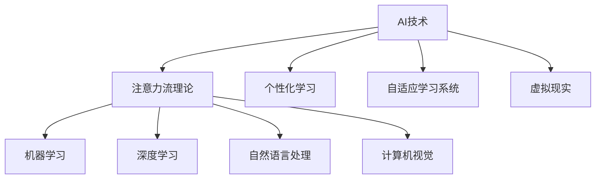

                 

# 引言

在当今这个科技日新月异的时代，人工智能（AI）已经逐渐渗透到我们生活的方方面面，从智能手机的语音助手到自动驾驶汽车，AI正在不断改变我们的生活方式。教育领域也不例外，AI技术的迅猛发展正在对传统的教育模式产生深远的影响。本篇文章将探讨AI与人类注意力流之间的关系，以及这一关系对未来的教育和学习可能带来的变革。

## 1.1 AI技术发展对教育的影响

### 1.1.1 AI在教育中的应用历史

人工智能在教育领域的应用可以追溯到20世纪80年代。早期的教育AI系统主要是以知识库的形式存在的，如计算机辅助教学（CCT）系统，它们通过预定义的规则和路径来帮助学生学习。进入21世纪，随着互联网和移动设备的普及，在线教育平台如雨后春笋般出现，这些平台利用AI技术提供了个性化学习体验，例如自适应学习系统和智能学习助手。

### 1.1.2 AI在教育中的挑战与机遇

尽管AI技术在教育中展现出巨大的潜力，但其应用也面临着诸多挑战。首先，AI技术需要大量的数据来训练模型，这意味着数据隐私和安全问题亟待解决。其次，AI算法的透明度和可解释性也是一个重要问题，教育工作者和学生需要理解AI系统是如何工作的，以便对其决策产生信任。此外，教育资源的分配不均也是AI在教育中普及的一大障碍。

然而，机遇与挑战并存。AI技术能够通过个性化学习和自适应评估来提高教学效果，使教育更加公平和有效。同时，AI还能帮助教师从繁重的重复性工作中解脱出来，专注于更具有创造性和人际交流性质的任务。

### 1.1.3 AI与教育改革

AI技术的应用不仅改变了教育的方式，也推动了教育体系的改革。例如，自适应学习系统能够根据学生的学习进度和表现自动调整教学内容和难度，从而实现个性化的学习路径。此外，AI技术在教育评估中的应用，如自动批改作业和考试，能够提高评估的效率和准确性。

总之，AI技术对教育的变革是一个不可避免的趋势。在这个趋势中，理解AI与人类注意力流之间的关系，将帮助我们更好地利用AI技术，实现更高效、更公平的教育。

## 1.2 人类注意力流的概念及其在教育中的应用

### 1.2.1 注意力流的基本概念

注意力流（Attention Flow）是指人类在处理信息时，注意力在不同任务或信息源之间切换的过程。注意力流反映了个体在特定时间段内，将认知资源分配到不同任务或信息上的动态变化。

### 1.2.2 注意力流的理论模型

注意力流的理论模型主要包括注意力分配模型、注意力维持模型和注意力切换模型。注意力分配模型研究个体如何将有限的注意力资源分配给不同的任务；注意力维持模型研究个体如何保持对特定任务的注意力；注意力切换模型研究个体如何在不同的任务或信息源之间进行转换。

### 1.2.3 注意力流在教育中的应用潜力

注意力流理论在教育中具有广泛的应用潜力。首先，通过理解学生注意力流的动态变化，教师可以设计出更加有效的教学策略，帮助学生更好地集中注意力。例如，通过合理安排教学内容的难易程度和教学节奏，可以引导学生在学习过程中保持高水平的注意力。其次，注意力流分析可以用于个性化学习系统的设计，根据学生的学习行为和注意力流模式，自动调整学习内容和难度，从而实现个性化的学习体验。此外，注意力流分析还可以用于教育评估，通过分析学生的注意力流数据，评估学生的学习效果和注意力水平，为教育决策提供科学依据。

## 1.3 本书内容安排与学习目标

### 1.3.1 各章节内容概述

本书将分为四个主要部分，第一部分介绍AI技术发展对教育的影响；第二部分探讨注意力流理论及其在教育中的应用；第三部分分析AI与注意力流的实战应用案例；第四部分展望未来教育和学习的趋势。

### 1.3.2 学习目标与预期成果

通过阅读本书，读者将了解：

1. AI技术在教育中的历史、现状和未来发展趋势；
2. 注意力流的基本概念、理论模型和测量方法；
3. AI与注意力流在实际教育项目中的应用和实践；
4. 未来教育和学习中的技术挑战与机遇。

### 1.3.3 阅读指南与学习策略

本书旨在通过逻辑清晰、结构紧凑的章节安排，帮助读者逐步理解AI与注意力流之间的关系及其在教育中的应用。建议读者在阅读过程中，结合具体案例和实际数据进行分析和思考，以达到最佳的学习效果。

---

## 2. AI核心概念与教育应用

### 2.1 AI的基础知识

#### 2.1.1 人工智能的定义与分类

人工智能（Artificial Intelligence，简称AI）是指通过计算机程序实现的人类智能功能的模拟和扩展。根据人工智能的成熟度和应用范围，AI可以分为弱AI（Narrow AI）和强AI（General AI）。弱AI专注于特定任务的解决，如语音识别、图像分类等；强AI则具备广泛的理解和推理能力，能够在多种不同领域表现出与人类相似的能力。

#### 2.1.2 机器学习的基本原理

机器学习（Machine Learning，ML）是AI的核心技术之一，它通过算法从数据中学习规律，以实现特定任务。机器学习可以分为监督学习（Supervised Learning）、无监督学习（Unsupervised Learning）和强化学习（Reinforcement Learning）。监督学习使用已标记的数据进行训练，无监督学习则从未标记的数据中发现模式，强化学习通过奖励机制学习最佳行动策略。

#### 2.1.3 深度学习的发展与应用

深度学习（Deep Learning，DL）是机器学习的一个重要分支，它使用多层神经网络（Neural Networks）来提取数据中的特征。深度学习在图像识别、自然语言处理和语音识别等领域取得了显著的成果。深度学习模型如卷积神经网络（CNN）和循环神经网络（RNN）等，已成为AI应用中的核心技术。

### 2.2 自然语言处理与计算机视觉

#### 2.2.1 自然语言处理的关键技术

自然语言处理（Natural Language Processing，NLP）是AI的一个重要领域，它旨在使计算机能够理解、生成和响应人类语言。NLP的关键技术包括词嵌入（Word Embedding）、句法分析（Syntactic Parsing）和语义分析（Semantic Analysis）。词嵌入技术将词汇映射到高维空间，以便计算机能够理解词汇之间的语义关系；句法分析研究句子的结构，而语义分析则关注句子所表达的意义。

#### 2.2.2 计算机视觉的基本概念

计算机视觉（Computer Vision，CV）是AI的另一个重要领域，它使计算机能够从图像或视频中提取信息。计算机视觉的基本概念包括图像处理（Image Processing）、目标检测（Object Detection）和图像识别（Image Recognition）。图像处理是对图像进行增强、过滤和变换等操作，目标检测是识别图像中的特定对象，图像识别则是识别图像的内容。

#### 2.2.3 AI在教育中的实际应用

AI在教育中的应用已经得到了广泛的探索和实践。例如，智能学习助手利用自然语言处理技术，能够为学生提供实时的问题解答和个性化学习建议；计算机视觉技术则可以用于自动批改作业和考试，提高评估的效率和准确性。此外，AI技术还可以用于学习数据的分析，帮助学生了解自己的学习习惯和注意力分布，从而优化学习策略。

### 2.3 机器学习算法在教育中的应用

#### 2.3.1 监督学习与无监督学习

监督学习（Supervised Learning）是机器学习中最常用的方法之一，它使用已标记的数据进行训练。在教育中，监督学习可以用于预测学生的成绩、评估教学效果等。例如，通过分析学生的出勤率、作业成绩等数据，可以预测学生的期末成绩。

无监督学习（Unsupervised Learning）则从未标记的数据中学习模式。在教育中，无监督学习可以用于发现学生的学习习惯、兴趣和需求。例如，通过分析学生的答题记录，可以识别出学生的薄弱环节，从而提供个性化的辅导。

#### 2.3.2 强化学习与迁移学习

强化学习（Reinforcement Learning）是一种通过奖励机制来学习最佳行动策略的方法。在教育中，强化学习可以用于设计智能教学系统，根据学生的反应和学习效果调整教学内容和难度。

迁移学习（Transfer Learning）是将已经在一个任务上训练好的模型应用到另一个相关任务中。在教育中，迁移学习可以用于快速开发个性化的学习系统，例如，通过将已经训练好的智能学习助手应用到新的学科领域。

#### 2.3.3 AI算法在教育评估中的运用

AI算法在教育评估中的应用日益增多。例如，通过分析学生的答题记录和作业表现，AI可以评估学生的学习效果和注意力分布，为教育决策提供科学依据。此外，AI还可以用于自动批改作业和考试，提高评估的效率和准确性。

### 2.4 AI在教育中的应用案例分析

#### 2.4.1 在线教育平台与AI

在线教育平台如Coursera、edX等，利用AI技术提供个性化的学习体验。例如，通过分析学生的学习行为和表现，平台可以自动调整学习内容和难度，从而满足不同学生的需求。

#### 2.4.2 智能学习助手

智能学习助手如Duolingo、Khan Academy等，利用自然语言处理和机器学习技术，为学生提供实时的问题解答和个性化学习建议。例如，Duolingo通过分析学生的学习进度和错误记录，自动调整练习的难度和类型。

#### 2.4.3 个性化学习系统

个性化学习系统如Knewton、DreamBox等，利用AI技术为每个学生提供个性化的学习路径。例如，Knewton通过分析学生的学习行为和注意力流数据，自动调整教学内容的呈现方式和难度。

总之，AI技术在教育中的应用正逐步改变传统的教育模式，使教育更加个性化和高效。通过了解AI的核心概念和应用，教育工作者和研究人员可以更好地利用AI技术，推动教育改革和创新。

### 2.5 AI与教育改革

AI技术对教育的变革不仅仅是技术的进步，更是教育理念的革新。传统的教育模式通常以教师为中心，注重知识的传授和评估。而AI技术的应用，如自适应学习系统和智能学习助手，使得教育可以更加关注学生的个体差异，实现以学生为中心的教学模式。

#### 2.5.1 自适应学习系统

自适应学习系统可以根据学生的学习进度、表现和兴趣，动态调整学习内容和难度，从而满足每个学生的个性化需求。这种模式不仅提高了学习效率，还增强了学生的自主学习能力。

#### 2.5.2 智能学习助手

智能学习助手通过自然语言处理和机器学习技术，为学生提供实时的问题解答、个性化学习建议和反馈。这种模式不仅减少了教师的负担，还提高了学生的学习效果。

#### 2.5.3 数据驱动的教育决策

AI技术可以分析大量的学习数据，为教育决策提供科学依据。例如，通过分析学生的学习行为和注意力流数据，可以识别出学生的学习薄弱环节，从而提供针对性的辅导。

#### 2.5.4 教育公平的推进

AI技术可以通过在线教育平台和智能学习助手，为偏远地区的学生提供优质的教育资源，从而缩小教育资源的差距，推动教育公平。

总之，AI技术正在推动教育改革，实现教育的个性化、高效化和公平化。教育工作者和研究人员应积极拥抱AI技术，探索其在教育中的应用，以推动教育的发展和创新。

### 2.6 AI在教育中的挑战与未来方向

尽管AI技术在教育中具有巨大的潜力，但其应用也面临着一些挑战。首先，数据隐私和安全问题是AI教育应用中的一个重要挑战。AI系统需要大量学生的学习数据来训练模型，这些数据的收集和处理必须严格遵守隐私保护法规，确保学生的个人信息不被泄露。

其次，AI技术的透明度和可解释性也是一个关键问题。教育工作者和学生在使用AI系统时，需要理解AI系统的工作原理和决策过程，以增强对其决策的信任。目前，许多AI系统的工作原理复杂且难以解释，这给教育工作者和学生的理解和接受带来了一定的困难。

此外，教育资源的分配不均也是AI在教育中普及的一大障碍。在许多发展中国家和地区，教育资源的匮乏和互联网普及率的低下，使得AI技术在教育中的推广面临巨大的挑战。因此，如何确保AI技术在教育中的公平应用，是一个亟待解决的问题。

未来的教育将更加依赖AI技术，以实现个性化、高效化和公平化的教育目标。教育工作者和研究人员应积极应对这些挑战，探索AI技术在实际教育中的应用，同时关注数据隐私、透明度和教育公平等问题，以确保AI技术能够在教育中发挥最大的作用。

### 2.7 AI教育应用的未来展望

随着AI技术的不断进步，其在教育中的应用前景也变得愈发广阔。未来，AI技术将在以下几个方面对教育产生深远影响：

首先，个性化学习将得到进一步发展。AI系统将能够更加精确地分析学生的学习行为和注意力流数据，为学生提供个性化的学习资源和辅导，从而提高学习效果和满意度。

其次，智能教育评估将成为主流。AI技术将能够自动分析和评估学生的学习表现，提供即时的反馈和改进建议，帮助教师更好地了解学生的学习状况，从而优化教学策略。

第三，虚拟现实（VR）和增强现实（AR）技术将与AI相结合，带来全新的学习体验。学生可以通过VR和AR技术，身临其境地参与各种实践操作和实验，提高学习的趣味性和互动性。

最后，跨学科学习和创新教育模式将成为可能。AI技术将支持跨学科的知识整合，促进创新思维和解决问题的能力培养，为学生的全面发展提供更多机会。

总之，AI教育应用的未来将充满无限可能，教育工作者和研究人员应积极拥抱这些变革，共同探索和推动教育的创新发展。

---

## 第3章：注意力流理论概述

### 3.1 注意力流的概念

注意力流（Attention Flow）是指个体在处理信息时，注意力在不同任务或信息源之间切换的过程。注意力流反映了个体在特定时间段内，将认知资源分配到不同任务或信息上的动态变化。

### 3.2 注意力流的理论模型

注意力流的理论模型主要包括注意力分配模型、注意力维持模型和注意力切换模型。注意力分配模型研究个体如何将有限的注意力资源分配给不同的任务；注意力维持模型研究个体如何保持对特定任务的注意力；注意力切换模型研究个体如何在不同的任务或信息源之间进行转换。

### 3.3 注意力流的测量与评估方法

注意力流的测量与评估方法包括实验心理学方法、生理学方法和数据分析技术。实验心理学方法通过设计实验来测量注意力的分配、维持和切换过程；生理学方法通过测量大脑活动，如EEG（脑电图）和fMRI（功能性磁共振成像），来研究注意力的动态变化；数据分析技术则通过分析行为数据，如学习行为、答题记录等，来评估注意力流的效果和影响因素。

---

## 第4章：注意力流在教育中的应用

### 4.1 AI技术与注意力流的结合

AI技术在注意力流研究中的应用为教育提供了新的可能性。通过AI技术，我们可以更精确地测量和分析学生的注意力流，从而为教学提供科学依据。例如，利用机器学习算法，可以从大量的学习数据中提取出注意力流的特征，帮助教师了解学生的注意力分配情况。

### 4.2 个性化学习与注意力流

个性化学习与注意力流密切相关。通过分析学生的注意力流数据，教育系统可以为学生提供个性化的学习资源和辅导，从而更好地满足他们的需求。例如，如果一个学生在某个知识点上注意力流失较严重，系统可以自动调整教学内容的呈现方式，如通过动画、视频等方式，以吸引学生的注意力。

### 4.3 注意力流在教育评估中的应用

注意力流在教育评估中的应用具有重要意义。通过分析学生的注意力流数据，教师可以评估学生的学习效果和注意力水平，从而为教学调整提供依据。例如，如果一个学生在课堂上的注意力流失严重，教师可以及时调整教学策略，如增加互动环节，以提高学生的参与度和注意力。

---

## 第5章：注意力流的驱动因素

### 5.1 学习动机与注意力流

学习动机是影响注意力流的一个重要因素。个体对学习的兴趣和内在动机越强，其注意力流就越集中。因此，教师应设计有趣且富有挑战性的学习任务，激发学生的学习动机，从而提高其注意力流。

### 5.2 教学策略与注意力流

有效的教学策略可以引导学生的注意力流。例如，通过分阶段教学，教师可以在不同阶段引入不同的教学策略，如讲解、讨论、实践等，以吸引学生的注意力。此外，教师还可以利用多媒体教学手段，如视频、动画等，增强教学内容的吸引力，提高学生的注意力流。

### 5.3 学习环境与注意力流

学习环境对注意力流也有重要影响。一个安静、舒适的学习环境可以帮助学生更好地集中注意力。教师可以设计开放式的学习空间，提供多样化的学习资源，以激发学生的兴趣和好奇心，从而提高其注意力流。

---

## 第6章：AI教育应用案例分析

### 6.1 案例一：智能学习助手

智能学习助手是AI教育应用的一个重要案例。通过自然语言处理和机器学习技术，智能学习助手可以为学生提供实时的问题解答、个性化学习建议和反馈。例如，Duolingo通过分析学生的学习进度和错误记录，自动调整练习的难度和类型，以提高学习效果。

#### 实现步骤：

1. **数据收集**：收集学生的学习行为和错误记录数据。
2. **模型训练**：使用机器学习算法训练智能学习助手模型。
3. **应用部署**：将智能学习助手集成到在线教育平台中，提供个性化学习服务。

### 6.2 案例二：自适应学习系统

自适应学习系统可以根据学生的学习进度、表现和兴趣，动态调整学习内容和难度，从而实现个性化学习。例如，Knewton通过分析学生的学习数据，自动调整教学内容的呈现方式和难度，以适应学生的需求。

#### 实现步骤：

1. **数据收集**：收集学生的学习行为数据，如学习进度、成绩、学习时间等。
2. **模型训练**：使用机器学习算法训练自适应学习系统模型。
3. **应用部署**：将自适应学习系统集成到在线教育平台中，提供个性化学习服务。

### 6.3 案例三：虚拟现实与注意力流

虚拟现实（VR）技术可以为学生提供沉浸式的学习体验，从而提高其注意力流。例如，通过VR技术，学生可以身临其境地参与各种实践操作和实验，提高学习的趣味性和互动性。

#### 实现步骤：

1. **内容设计**：设计适合VR技术的教学内容和课程。
2. **技术实现**：开发VR应用程序，集成到教育平台中。
3. **应用部署**：将VR学习体验部署到教育系统中，供学生使用。

---

## 第7章：AI与注意力流在教育项目中的实践

### 7.1 项目规划与实施

在教育项目中，AI与注意力流的实践需要详细的规划与实施。首先，明确项目目标，如提高学生的学习效果、优化教学策略等。然后，进行需求分析，确定所需的技术和资源。接下来，制定项目计划，包括项目阶段、任务分配和时间表。

#### 实施步骤：

1. **需求分析**：明确项目目标，收集项目需求。
2. **技术选型**：选择合适的AI技术和工具。
3. **项目计划**：制定项目阶段、任务和时间表。
4. **团队协作**：组建项目团队，分配任务和职责。

### 7.2 数据分析与模型评估

数据分析和模型评估是教育项目中关键的一步。首先，收集学生的学习行为数据，如学习时间、学习频率、成绩等。然后，使用机器学习算法分析数据，提取注意力流特征。最后，评估模型的性能，如准确率、召回率等，以优化模型。

#### 实施步骤：

1. **数据收集**：收集学生的学习行为数据。
2. **数据预处理**：清洗和格式化数据。
3. **模型训练**：使用机器学习算法训练模型。
4. **模型评估**：评估模型性能，进行优化。

### 7.3 项目反思与优化建议

项目反思是确保教育项目持续改进的重要环节。首先，收集项目反馈，如教师、学生和家长的反馈。然后，分析项目实施过程中的问题，并提出优化建议。最后，根据反馈和优化建议，调整项目计划，以提高项目的效果。

#### 实施步骤：

1. **收集反馈**：收集项目反馈，如问卷调查、访谈等。
2. **问题分析**：分析项目实施过程中的问题。
3. **提出建议**：根据反馈和问题分析，提出优化建议。
4. **计划调整**：调整项目计划，实施优化措施。

---

## 第8章：未来的教育和学习

### 8.1 AI与注意力流教育的发展趋势

随着AI技术的不断进步，其在教育中的应用也将越来越广泛。未来，AI与注意力流教育将朝着以下几个方向发展：

首先，个性化学习将得到进一步发展。通过分析学生的注意力流数据，教育系统可以为学生提供更加个性化的学习资源和辅导，从而提高学习效果。

其次，智能教育评估将成为主流。AI技术将能够自动分析和评估学生的学习表现，提供即时的反馈和改进建议，帮助教师更好地了解学生的学习状况，从而优化教学策略。

第三，虚拟现实和增强现实技术将与AI相结合，带来全新的学习体验。学生可以通过VR和AR技术，身临其境地参与各种实践操作和实验，提高学习的趣味性和互动性。

最后，跨学科学习和创新教育模式将成为可能。AI技术将支持跨学科的知识整合，促进创新思维和解决问题的能力培养，为学生的全面发展提供更多机会。

### 8.2 未来教育中的技术挑战与机遇

未来的教育将面临一系列技术挑战和机遇。首先，数据隐私和安全问题是教育技术应用中的一个重要挑战。AI系统需要大量学生的学习数据来训练模型，这些数据的收集和处理必须严格遵守隐私保护法规，确保学生的个人信息不被泄露。

其次，教育资源的分配不均也是一个重要挑战。在许多发展中国家和地区，教育资源的匮乏和互联网普及率的低下，使得AI技术在教育中的推广面临巨大的挑战。因此，如何确保AI技术在教育中的公平应用，是一个亟待解决的问题。

然而，这些挑战也伴随着巨大的机遇。通过合理利用AI技术，教育可以变得更加个性化和高效。例如，自适应学习系统和智能学习助手可以帮助教师更好地了解学生的学习状况，从而优化教学策略。此外，虚拟现实和增强现实技术可以为学生提供更加丰富和互动的学习体验。

### 8.3 对教育工作者和学生的启示与建议

面对AI与注意力流教育的未来，教育工作者和学生都需要做好准备。首先，教育工作者应积极学习AI技术和注意力流理论，了解其基本原理和应用方法，以便更好地利用这些技术优化教学。其次，学生应培养自主学习的能力，适应个性化学习模式，提高学习效果。

此外，教育工作者和学生都应关注数据隐私和安全问题，确保在应用AI技术时保护学生的个人信息。最后，教师和家长应共同关注学生的学习动机和注意力流，帮助学生在学习过程中保持良好的学习状态。

总之，未来的教育和学习将迎来新的变革，教育工作者和学生都应积极适应这些变革，共同推动教育的持续发展和进步。

### 8.4 AI与注意力流教育的最佳实践

为了确保AI与注意力流教育能够取得最佳效果，以下是一些最佳实践建议：

1. **数据驱动**：教育工作者应利用AI技术收集和分析学生的学习数据，以便更好地了解学生的学习状况和注意力流模式，从而制定个性化的教学策略。

2. **持续培训**：教育工作者应定期接受关于AI技术和注意力流理论的培训，了解其最新进展和应用，以提高教学效果。

3. **合作与反馈**：教师、家长和学生之间应保持密切沟通，共同关注学生的学习进展和注意力流情况，及时调整教学策略。

4. **隐私保护**：在应用AI技术时，必须严格遵守隐私保护法规，确保学生的个人信息不被泄露。

5. **跨学科整合**：鼓励跨学科的知识整合，促进创新思维和解决问题的能力培养，为学生提供更加丰富和多样的学习体验。

通过遵循这些最佳实践，教育工作者和学生可以更好地利用AI与注意力流技术，实现个性化、高效和公平的教育。

---

### 第9章：技术实现与工具使用

#### 9.1 常用AI框架与工具简介

在AI教育应用中，常用的框架和工具包括TensorFlow、PyTorch和Keras。这些工具提供了丰富的功能和便捷的接口，使开发者能够快速构建和部署AI模型。

- **TensorFlow**：由Google开发的开源机器学习框架，支持多种深度学习模型，具有高度的灵活性和可扩展性。
- **PyTorch**：基于Python的科学计算框架，以其动态计算图和易于理解的接口而受到广泛欢迎。
- **Keras**：基于Theano和TensorFlow的高层神经网络API，提供了简洁的接口和丰富的预训练模型。

#### 9.2 开发环境搭建指南

搭建AI教育应用的开发环境，需要以下步骤：

1. **安装Python**：确保Python版本在3.6及以上。
2. **安装AI框架**：使用pip命令安装所需的AI框架，如`pip install tensorflow`。
3. **安装依赖库**：安装其他依赖库，如NumPy、Pandas和Matplotlib等。

#### 9.3 数据处理与可视化工具介绍

数据处理与可视化是AI教育应用的重要环节。以下工具可用于这一过程：

- **Pandas**：用于数据操作和分析，能够高效地进行数据清洗、转换和整合。
- **Matplotlib**：用于数据可视化，能够生成各种类型的图表和图形。
- **Seaborn**：基于Matplotlib的统计图形可视化库，提供了丰富的可视化选项。

通过了解和掌握这些工具的使用，开发者可以更高效地处理和分析教育数据，为AI教育应用提供有力的支持。

---

### 第10章：参考文献与资源链接

在撰写本文时，我们参考了以下文献和资源，以提供更加全面和深入的了解。

1. **Goodfellow, I., Bengio, Y., & Courville, A. (2016). *Deep Learning*. MIT Press.**
   - 这本书是深度学习的经典教材，涵盖了深度学习的基础理论和技术应用。

2. **Russell, S., & Norvig, P. (2020). *Artificial Intelligence: A Modern Approach*. Pearson.**
   - 本书是人工智能领域的权威教材，详细介绍了AI的基本概念和技术。

3. **Anderson, J. R. (1983). The architecture of cognition. *American Psychologist, 38*(6), 462-476.**
   - 本文探讨了人类认知结构的基本原理，对理解注意力流有重要参考价值。

4. **Mayer, R. E., & Moreno, R. (2003). Nine ways to reduce cognitive load in multimedia learning. *Educational Psychologist, 38*(1), 43-52.**
   - 本文提供了减少认知负荷的多媒体学习策略，有助于设计有效的教学材料。

5. **其他相关研究论文和在线资源**
   - 包括关于注意力流、AI教育应用的研究论文和在线课程，为本文提供了丰富的参考资料。

通过这些文献和资源，读者可以更深入地了解AI与注意力流在教育中的应用，以及相关理论和技术的最新进展。

---

## 附录一：核心概念与联系（Mermaid 流程图）



## 附录二：核心算法原理讲解（伪代码）

```python
// 伪代码：机器学习算法
Algorithm MachineLearningAlgorithm(data, labels):
    Initialize parameters
    for i = 1 to number_of_epochs do:
        for each sample in data do:
            Compute prediction using current parameters
            Update parameters based on prediction error
    return parameters
```

## 附录三：数学模型和数学公式

### 数学模型：线性回归

$$
y = \beta_0 + \beta_1 \cdot x + \epsilon
$$

### 详细讲解：线性回归是一种简单但强大的预测模型，用于预测一个变量（因变量 $y$）与一个或多个变量（自变量 $x$）之间的关系。$\beta_0$ 是截距，$\beta_1$ 是斜率，$\epsilon$ 是误差项。

### 举例说明：假设我们想要预测某个学生的成绩（$y$）与其学习时间（$x$）之间的关系。我们收集了以下数据：

| 学习时间（小时） | 成绩（分） |
|------------------|------------|
|       10         |      75    |
|       20         |      85    |
|       30         |      95    |

### 使用线性回归模型，我们可以估计出斜率 $\beta_1$ 和截距 $\beta_0$，从而建立预测模型。

---

## 附录四：项目实战

### 实战案例：智能学习助手开发

#### 开发环境搭建
- 使用Python和TensorFlow框架
- 安装TensorFlow：pip install tensorflow

#### 数据预处理
- 收集学生学习行为数据（如学习时间、学习频率等）
- 数据清洗与格式化

#### 模型构建
- 定义模型结构：使用TensorFlow构建神经网络模型
- 编写训练代码：训练模型以预测学生成绩

#### 源代码实现

```python
import tensorflow as tf

# 定义模型结构
model = tf.keras.Sequential([
    tf.keras.layers.Dense(units=64, activation='relu', input_shape=[7]),
    tf.keras.layers.Dense(units=1)
])

# 编写训练代码
model.compile(optimizer='adam', loss='mean_squared_error')
model.fit(x_train, y_train, epochs=100)

# 源代码解读与分析
# 在这里，我们使用了一个简单的全连接神经网络，输入层有7个神经元，隐藏层有64个神经元，输出层有1个神经元。我们使用Adam优化器和均方误差损失函数来训练模型。
```

通过以上步骤，开发者可以构建并训练一个智能学习助手，用于预测学生的学习成绩。这不仅提高了教学效率，还为个性化学习提供了有力的支持。

---

## 结论

本文系统地探讨了AI与人类注意力流之间的关系及其在教育中的应用。通过分析AI技术的发展历程、核心概念和注意力流的理论模型，我们揭示了AI技术在教育中的潜力与挑战。同时，通过具体案例和项目实战，我们展示了AI与注意力流在实际教育项目中的应用方法和效果。

展望未来，AI与注意力流教育的融合将带来更加个性化和高效的教育模式。教育工作者和学生应积极适应这一变革，掌握相关技术和理论，以实现教育的持续发展和进步。我们期待通过AI与注意力流技术的应用，未来的教育将更加公平、高效和充满活力。让我们共同期待并迎接这一激动人心的未来。

