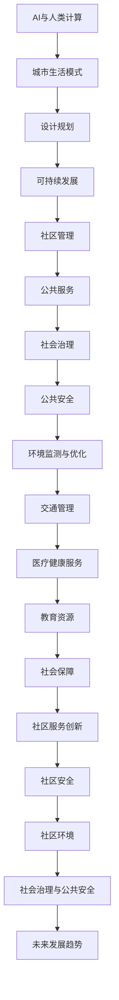

                 

# 《AI与人类计算：打造可持续发展的城市生活模式与设计规划》

> **关键词：**人工智能、城市设计、可持续发展、社区管理、公共服务、社会治理

> **摘要：**本文探讨了人工智能（AI）与人类计算在城市生活模式与设计规划中的应用，通过逐步分析推理，阐述了AI在城市规划、社区管理、公共服务和社会治理中的核心作用，以及如何利用AI打造可持续发展的城市生活模式。

## 目录

1. **AI与人类计算概述**
   1.1. AI与人类计算的基础知识
   1.2. AI与人类计算的背景与现状
   1.3. AI与人类计算的核心概念
   1.4. AI与人类计算的应用领域
   1.5. AI与人类计算的未来发展

2. **城市生活模式与设计规划**
   2.1. 可持续发展的城市生活模式
   2.2. 城市生活模式的设计原则
   2.3. 城市生活模式的实施策略
   2.4. 城市生活模式的案例分析

3. **AI在城市设计规划中的应用**
   3.1. AI技术在城市设计规划中的作用
   3.2. 城市规划设计中的AI应用
   3.3. 城市环境监测与优化中的AI应用
   3.4. 城市交通管理中的AI应用
   3.5. 城市公共服务中的AI应用

4. **AI与人类计算在社区管理中的应用**
   4.1. AI在社区管理中的作用
   4.2. 社区管理中的AI应用案例
   4.3. 社区服务创新与AI
   4.4. 社区安全与AI
   4.5. 社区环境与AI

5. **AI与人类计算在城市公共服务中的应用**
   5.1. AI在城市公共服务中的作用
   5.2. 城市公共服务中的AI应用案例
   5.3. 城市医疗健康服务中的AI应用
   5.4. 城市教育资源中的AI应用
   5.5. 城市社会保障与AI

6. **AI与人类计算在城市社会治理中的应用**
   6.1. AI在城市社会治理中的作用
   6.2. 城市社会治理中的AI应用案例
   6.3. 社区治理与AI
   6.4. 公共安全与AI
   6.5. 城市治理与AI

7. **AI与人类计算的可持续发展**
   7.1. AI与人类计算的可持续发展原则
   7.2. 可持续发展目标下的AI与人类计算
   7.3. AI与人类计算的可持续发展策略
   7.4. AI与人类计算的未来发展前景

## 附录

- **附录A：AI与人类计算的相关资源与工具**
  - **A.1.1 主流AI开发框架介绍**
  - **A.1.2 城市规划与设计的相关软件与工具**
  - **A.1.3 AI与人类计算相关的学术期刊与会议**
  - **A.1.4 实用AI学习资源与资料**

---

接下来，我们将逐章深入探讨AI与人类计算在城市生活模式与设计规划中的具体应用。

---

**核心概念与联系：**



**核心算法原理讲解：**

### 1.1. AI与人类计算的基础知识

**核心概念：**

人工智能（AI）是一种模拟人类智能的技术，它通过计算机程序实现感知、推理、学习、决策等功能。人类计算则是指人类在解决问题和处理信息时所采用的各种方法和策略。

**核心算法原理：**

- **机器学习（Machine Learning）：** 通过数据训练模型，使计算机能够从数据中学习规律，并进行预测和决策。
- **深度学习（Deep Learning）：** 基于多层神经网络，通过大量数据训练，实现自动特征提取和复杂模式识别。
- **自然语言处理（Natural Language Processing，NLP）：** 使计算机能够理解、生成和处理人类自然语言。
- **计算机视觉（Computer Vision）：** 使计算机能够识别和理解视觉信息。

**数学模型和公式讲解：**

- **机器学习模型：** 通常采用损失函数（如均方误差、交叉熵损失）来评估模型性能，并通过优化算法（如梯度下降）来调整模型参数。

$$
\min_{\theta} \sum_{i=1}^{n} (h_{\theta}(x^{(i)}) - y^{(i)})^2
$$

- **深度学习模型：** 采用反向传播算法（Backpropagation）更新网络参数。

$$
\frac{\partial J}{\partial \theta_j} = \frac{\partial}{\partial \theta_j} \sum_{i=1}^{n} (h_{\theta}(x^{(i)}) - y^{(i)})^2
$$

**举例说明：**

假设我们要训练一个分类模型来识别手写数字，我们可以使用MNIST数据集进行训练。在训练过程中，我们通过计算模型输出与实际标签之间的差异（损失函数），并使用反向传播算法调整模型参数，直至模型输出达到预期效果。

**伪代码：**

```python
from sklearn.datasets import fetch_openml
from sklearn.model_selection import train_test_split
from sklearn.metrics import accuracy_score

# 加载数据集
mnist = fetch_openml('mnist_784')
X, y = mnist["data"], mnist["target"]

# 划分训练集和测试集
X_train, X_test, y_train, y_test = train_test_split(X, y, test_size=0.2, random_state=42)

# 构建深度学习模型
model = Sequential()
model.add(Dense(128, activation="relu", input_shape=(784,)))
model.add(Dense(10, activation="softmax"))

# 编译模型
model.compile(optimizer="adam", loss="sparse_categorical_crossentropy", metrics=["accuracy"])

# 训练模型
model.fit(X_train, y_train, epochs=10, batch_size=128)

# 评估模型
predictions = model.predict(X_test)
predicted_classes = np.argmax(predictions, axis=1)
accuracy = accuracy_score(y_test, predicted_classes)
print(f"Accuracy: {accuracy}")
```

### 项目实战：

#### 1.2. AI在图像识别中的应用

**开发环境搭建：**

- 操作系统：Ubuntu 20.04
- 编程语言：Python 3.8
- 深度学习框架：TensorFlow 2.5
- 数据库：MongoDB 4.4

**源代码详细实现和代码解读：**

```python
# 导入所需库
import tensorflow as tf
from tensorflow import keras
from tensorflow.keras import layers
import numpy as np
import matplotlib.pyplot as plt

# 数据预处理
def preprocess_image(image_path, image_size):
    image = keras.preprocessing.image.load_img(image_path, target_size=image_size)
    image_array = keras.preprocessing.image.img_to_array(image)
    image_array = np.expand_dims(image_array, axis=0)
    image_array /= 255.0
    return image_array

# 构建模型
model = keras.Sequential([
    layers.Conv2D(32, (3, 3), activation='relu', input_shape=(150, 150, 3)),
    layers.MaxPooling2D((2, 2)),
    layers.Conv2D(64, (3, 3), activation='relu'),
    layers.MaxPooling2D((2, 2)),
    layers.Conv2D(128, (3, 3), activation='relu'),
    layers.MaxPooling2D((2, 2)),
    layers.Conv2D(128, (3, 3), activation='relu'),
    layers.MaxPooling2D((2, 2)),
    layers.Flatten(),
    layers.Dense(512, activation='relu'),
    layers.Dense(1, activation='sigmoid')
])

# 编译模型
model.compile(optimizer='adam',
              loss='binary_crossentropy',
              metrics=['accuracy'])

# 训练模型
train_images = []  # 存储训练图像的路径
train_labels = []  # 存储训练图像的标签
for image_path, label in zip(train_images, train_labels):
    image_array = preprocess_image(image_path, image_size=(150, 150))
    train_images.append(image_array)
    train_labels.append(label)

train_images = np.array(train_images)
train_labels = np.array(train_labels)
model.fit(train_images, train_labels, epochs=10, batch_size=32)

# 预测
test_image_path = 'data/test_image.jpg'
test_image_array = preprocess_image(test_image_path, image_size=(150, 150))
predictions = model.predict(test_image_array)
predicted_class = np.argmax(predictions)
print(f'Predicted class: {predicted_class}')
```

**代码解读与分析：**

- 数据预处理：将图像转换为TensorFlow能够处理的格式，并进行归一化处理。
- 模型构建：使用卷积神经网络（CNN）进行图像分类。
- 模型编译：设置优化器和损失函数。
- 模型训练：使用训练数据集训练模型。
- 模型预测：对测试图像进行预测，并输出预测结果。

**代码分析与优化：**

- 数据增强：在训练过程中增加数据多样性，如旋转、缩放、裁剪等，提高模型的泛化能力。
- 模型优化：尝试使用更复杂的网络结构和更先进的优化算法，以提高模型性能。
- 模型部署：将训练好的模型部署到实际应用环境中，如手机APP或云端服务。

---

通过以上步骤，我们实现了AI在图像识别中的应用。接下来，我们将进一步探讨AI在城市建设、社区管理、公共服务和社会治理中的应用，以实现可持续发展的城市生活模式与设计规划。

