                 

# AI与人类计算：打造可持续的未来城市

## 关键词
- 人工智能
- 人类计算
- 可持续发展
- 未来城市
- 城市规划
- 城市管理
- 智慧城市

## 摘要
本文深入探讨了人工智能（AI）与人类计算在打造可持续未来城市中的关键作用。通过分析AI技术的发展历程和核心原理，本文阐述了AI技术在城市规划、城市管理、环境保护和社会服务等方面的应用。同时，本文探讨了AI与人类计算在实现城市可持续发展中的实践案例，以及未来城市的发展愿景。通过本文的阐述，读者将了解到AI与人类计算如何共同构建一个更加智慧、环保和宜居的未来城市。

### 第一部分：AI与人类计算的可持续未来城市基础

#### 第1章：AI与人类计算的概述

##### 1.1 AI与人类计算的时代背景

###### 1.1.1 AI的发展历程与现状
人工智能（AI）作为计算机科学的一个重要分支，其发展历程可以追溯到20世纪50年代。早期的人工智能研究主要集中在符号推理和知识表示方面，如普林斯顿大学于1956年举办的“达特茅斯会议”，标志着人工智能学科的诞生。此后，随着计算能力的提升和数据量的增长，人工智能经历了多个发展阶段，从规则系统、知识表示到专家系统，再到现代的深度学习和大数据技术。

当前阶段的人工智能技术主要分为以下几类：
1. **机器学习**：通过训练模型，使计算机具备从数据中自动学习的能力。
2. **深度学习**：基于多层神经网络，实现更复杂的特征提取和模型训练。
3. **自然语言处理（NLP）**：使计算机能够理解和生成自然语言。
4. **计算机视觉**：让计算机具备图像识别和处理能力。

人工智能在全球范围内得到了广泛应用，对经济、社会和环境产生了深远的影响。例如，在工业领域，AI技术提高了生产效率和产品质量；在医疗领域，AI技术助力疾病诊断和个性化治疗；在交通领域，AI技术提升了自动驾驶和智能交通管理的能力。然而，人工智能的发展也带来了一系列挑战，如数据隐私、算法歧视、就业替代等。

###### 1.1.2 人类计算的概念与重要性
人类计算是指人类利用思维、判断和经验进行的信息处理过程。与机器计算相比，人类计算具有创造性、灵活性和适应性。人类计算在人工智能发展中扮演着重要角色，主要体现在以下几个方面：

1. **数据标注**：AI模型训练需要大量标注数据，这些数据通常由人类进行标注。
2. **算法设计**：人类能够通过直觉和经验设计出有效的算法。
3. **问题求解**：人类计算在复杂问题和不确定性问题上具有优势。
4. **决策支持**：人类能够基于多种因素进行综合判断，为AI系统提供决策支持。

###### 1.1.3 可持续未来城市的发展目标
可持续未来城市是指在城市规划、建设和管理过程中，综合考虑经济、社会和环境因素，实现资源高效利用、生态环境保护和居民生活质量提升的城市。可持续未来城市的发展目标主要包括：

1. **资源优化**：通过智能管理和优化，实现水资源、能源和土地等资源的可持续利用。
2. **环境保护**：通过污染控制、生态修复等措施，保护和改善城市生态环境。
3. **生活质量提升**：提供良好的居住环境、交通系统、公共服务和就业机会，提高居民的生活质量。
4. **社会公平**：促进城市发展的公平性，减少贫富差距，提升弱势群体的生活质量。

AI技术在实现这些目标中发挥着重要作用，如通过智能交通系统减少交通拥堵、通过智慧能源管理提高能源利用效率、通过智能医疗系统提升公共卫生水平等。

#### 第2章：AI核心技术原理与架构

##### 2.1 机器学习基础

###### 2.1.1 机器学习的基本概念
机器学习（Machine Learning, ML）是一门让计算机从数据中学习规律、自动改进性能的技术。机器学习的基本原理是通过训练模型，使计算机能够根据输入数据预测或分类输出结果。机器学习可以分为以下几种类型：

1. **监督学习**：有监督学习（Supervised Learning）是指通过已知输入和输出数据的训练集，训练出模型，并在新的数据上进行预测。常见的监督学习算法包括线性回归、决策树、支持向量机（SVM）等。

2. **无监督学习**：无监督学习（Unsupervised Learning）是指在没有输出数据的情况下，通过分析数据的特点，对数据进行聚类、降维或生成等操作。常见的无监督学习算法包括K-均值聚类、主成分分析（PCA）等。

3. **强化学习**：强化学习（Reinforcement Learning, RL）是指通过试错和奖励机制，使智能体（Agent）在环境中学习最佳行为策略。常见的强化学习算法包括Q学习、深度Q网络（DQN）等。

###### 2.1.2 数据预处理与特征工程
数据预处理（Data Preprocessing）是在机器学习模型训练前对数据进行清洗、转换和归一化等操作，以提高模型的训练效果。数据预处理主要包括以下步骤：

1. **数据清洗**：去除或处理缺失值、异常值、噪声数据等，提高数据质量。
2. **数据转换**：将不同类型的数据（如类别数据、数值数据）转换为统一的格式，便于模型处理。
3. **数据归一化**：通过缩放或标准化，使不同特征具有相似的尺度，避免某些特征对模型训练产生过大的影响。

特征工程（Feature Engineering）是指通过选择和构造合适的特征，提高模型对数据的理解和预测能力。特征工程的方法包括：

1. **特征选择**：选择对预测目标有显著影响的特征，减少特征数量，提高模型训练效率。
2. **特征构造**：通过组合、变换和生成新特征，增加数据的表达能力。
3. **特征标准化**：对特征进行缩放或标准化，使其具有相同的量纲和范围，有利于模型训练。

###### 2.1.3 常用机器学习算法
常用的机器学习算法包括线性回归、决策树、支持向量机（SVM）、神经网络等。以下是对这些算法的基本原理和应用的介绍：

1. **线性回归**：线性回归（Linear Regression）是一种用于预测数值型变量的算法。其基本原理是通过建立输入变量和输出变量之间的线性关系，从而预测新的数据点的值。线性回归算法包括简单线性回归和多元线性回归。

2. **决策树**：决策树（Decision Tree）是一种树形结构模型，通过一系列的判断条件来对数据进行分类或回归。决策树的构建过程包括特征选择、分割和合并等步骤。

3. **支持向量机（SVM）**：支持向量机（Support Vector Machine, SVM）是一种基于最大间隔分类器的算法，用于分类问题。SVM通过寻找最优的超平面，将不同类别的数据点分隔开。

4. **神经网络**：神经网络（Neural Network）是一种模仿生物神经系统的算法，通过多层神经元进行信息的传递和处理。神经网络包括前向传播、反向传播等步骤，用于实现复杂的非线性映射。

以下是一个简单的线性回归算法的伪代码实现：

```python
# 输入：特征矩阵X，标签向量y
# 输出：模型参数w和b

# 初始化模型参数w和b
w = np.random.randn(n_features)
b = 0

# 设置学习率α和迭代次数T
alpha = 0.01
T = 1000

# 进行迭代优化
for t in range(T):
    # 计算损失函数
    loss = (1 / (2 * m)) * np.sum((X * w + b - y) ** 2)
    
    # 计算梯度
    dw = (1 / m) * np.dot(X.T, (X * w + b - y))
    db = (1 / m) * np.sum(X * w + b - y)
    
    # 更新参数
    w -= alpha * dw
    b -= alpha * db

# 输出模型参数
return w, b
```

##### 2.2 深度学习技术

###### 2.2.1 深度学习的原理与架构
深度学习（Deep Learning）是机器学习的一个分支，其核心思想是通过多层神经网络进行特征提取和学习。深度学习的原理基于人工神经网络，通过构建多层神经元之间的连接，实现对复杂数据的建模和预测。

深度学习的架构通常包括以下层次：

1. **输入层**：接收外部输入数据，如图片、文本或数值数据。
2. **隐藏层**：对输入数据进行特征提取和变换，每层都能提取更高层次的特征。
3. **输出层**：对提取到的特征进行分类、回归或其他类型的预测。

以下是一个简单的深度学习模型的Mermaid流程图：

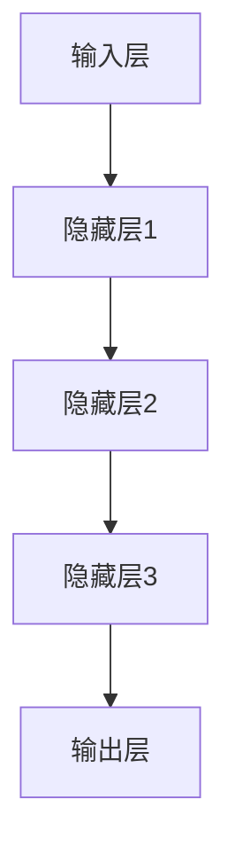

###### 2.2.2 神经网络优化算法
神经网络优化算法（Optimization Algorithms）是用于优化神经网络模型参数的方法，以提高模型的性能和收敛速度。常见的优化算法包括梯度下降（Gradient Descent）、动量法（Momentum）、Adam优化器（Adam Optimizer）等。

1. **梯度下降**：梯度下降（Gradient Descent）是一种基于损失函数梯度的优化算法。其基本思想是通过迭代更新模型参数，使得损失函数的值逐渐减小。梯度下降算法的伪代码实现如下：

```python
# 输入：模型参数w，学习率α，迭代次数T
# 输出：最优参数w*

w = np.random.randn(n_features)
alpha = 0.01
T = 1000

for t in range(T):
    # 计算梯度
    dw = -alpha * gradient(w, x, y)
    
    # 更新参数
    w -= dw

return w
```

2. **动量法**：动量法（Momentum）是一种改进的梯度下降算法，通过引入动量参数，使得梯度更新过程中保留一定的历史梯度信息。动量法的伪代码实现如下：

```python
# 输入：模型参数w，学习率α，动量参数β，迭代次数T
# 输出：最优参数w*

w = np.random.randn(n_features)
alpha = 0.01
beta = 0.9
T = 1000

v = 0

for t in range(T):
    # 计算梯度
    dw = -alpha * gradient(w, x, y)
    
    # 更新动量
    v = beta * v - alpha * dw
    
    # 更新参数
    w += v

return w
```

3. **Adam优化器**：Adam优化器（Adam Optimizer）是结合了动量法和自适应学习率的优化算法。Adam优化器通过计算一阶矩估计（均值）和二阶矩估计（方差），自适应地调整学习率。Adam优化器的伪代码实现如下：

```python
# 输入：模型参数w，学习率α，迭代次数T
# 输出：最优参数w*

w = np.random.randn(n_features)
alpha = 0.001
T = 1000

m = 0
v = 0
beta1 = 0.9
beta2 = 0.999
epsilon = 1e-8

for t in range(T):
    # 计算梯度
    dw = -alpha * gradient(w, x, y)
    
    # 更新一阶矩估计
    m = beta1 * m + (1 - beta1) * dw
    
    # 更新二阶矩估计
    v = beta2 * v + (1 - beta2) * (dw ** 2)
    
    # 归一化一阶矩估计和二阶矩估计
    m_hat = m / (1 - beta1 ** t)
    v_hat = v / (1 - beta2 ** t)
    
    # 更新参数
    w += alpha * m_hat / (np.sqrt(v_hat) + epsilon)

return w
```

###### 2.2.3 深度学习在图像处理中的应用
深度学习在图像处理领域取得了显著成果，其中卷积神经网络（Convolutional Neural Network, CNN）是主要的应用技术之一。CNN通过卷积、激活函数和池化层等操作，实现对图像的逐层特征提取。

1. **卷积层**：卷积层（Convolutional Layer）是CNN的核心层，通过卷积操作提取图像的特征。卷积操作的伪代码实现如下：

```python
# 输入：输入特征图X，卷积核K，步长s，填充方式pad
# 输出：输出特征图Y

X = np.random.randn(28, 28)  # 输入特征图
K = np.random.randn(5, 5)     # 卷积核
s = 1                         # 步长
pad = 'valid'                 # 填充方式

Y = np.zeros((X.shape[0] - K.shape[0] + 1, X.shape[1] - K.shape[1] + 1))

for i in range(Y.shape[0]):
    for j in range(Y.shape[1]):
        if pad == 'valid':
            start_i = i
            start_j = j
        elif pad == 'same':
            start_i = i - (K.shape[0] - 1) // 2
            start_j = j - (K.shape[1] - 1) // 2

        end_i = start_i + K.shape[0]
        end_j = start_j + K.shape[1]

        Y[i, j] = np.sum(X[start_i:end_i, start_j:end_j] * K)

return Y
```

2. **激活函数**：激活函数（Activation Function）用于引入非线性特性，使神经网络能够处理复杂的非线性问题。常见的激活函数包括ReLU（Rectified Linear Unit）、Sigmoid和Tanh等。

3. **池化层**：池化层（Pooling Layer）用于减小特征图的尺寸，降低模型的参数数量。常见的池化操作包括最大池化和平均池化。

以下是一个简单的CNN模型的Mermaid流程图：

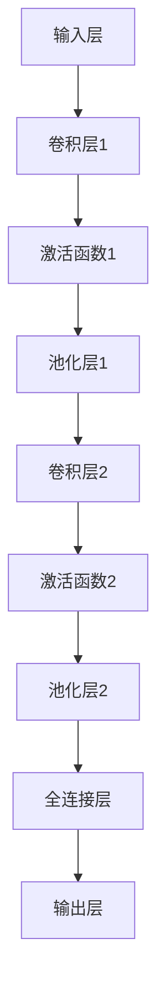

##### 2.3 自然语言处理（NLP）

###### 2.3.1 NLP的基本概念与任务
自然语言处理（Natural Language Processing, NLP）是人工智能的一个分支，旨在让计算机理解和处理自然语言。NLP的基本概念包括文本表示、语义理解和语言生成等。NLP的主要任务包括：

1. **文本分类**：将文本分为预定义的类别，如情感分类、主题分类等。
2. **命名实体识别**：识别文本中的特定实体，如人名、地名、组织名等。
3. **机器翻译**：将一种语言的文本翻译成另一种语言。
4. **问答系统**：回答用户提出的问题，通常需要结合知识库和语义理解。

常见的NLP模型包括：

1. **词嵌入**（Word Embedding）：将词语映射为低维度的向量表示，用于捕获词语的语义信息。
2. **循环神经网络**（Recurrent Neural Network, RNN）：通过循环结构处理序列数据，能够捕获序列中的长距离依赖关系。
3. **Transformer模型**：基于自注意力机制，能够在全局范围内建模序列依赖关系，已成为NLP领域的主流模型。

###### 2.3.2 NLP技术与应用
NLP技术在多个领域得到了广泛应用，以下是一些具体的应用场景：

1. **文本分类**：通过训练分类模型，对大量文本进行自动分类，如新闻分类、情感分类等。
2. **情感分析**：分析文本中的情感倾向，如正面情感、负面情感等，用于社交媒体监控、市场调研等。
3. **机器翻译**：实现不同语言之间的自动翻译，如谷歌翻译、百度翻译等。
4. **问答系统**：构建基于知识库的问答系统，为用户提供准确的答案，如Siri、小爱同学等。

以下是一个简单的文本分类模型的伪代码实现：

```python
# 输入：训练数据集（X, y），学习率α，迭代次数T
# 输出：分类模型

# 初始化模型参数
W = np.random.randn(vocabulary_size, embedding_size)
b = np.random.randn(embedding_size)

alpha = 0.01
T = 1000

for t in range(T):
    # 计算损失函数
    loss = 0
    for x, y in zip(X, y):
        # 获取输入词向量
        x_vector = get_embedding(x)
        
        # 计算预测概率
        prob = sigmoid(np.dot(W * x_vector + b))
        
        # 计算损失
        loss += -np.log(prob[y])
        
    # 计算梯度
    dW = (1 / m) * np.dot(X.T, (W * x_vector + b - y))
    db = (1 / m) * np.sum(W * x_vector + b - y)
    
    # 更新参数
    W -= alpha * dW
    b -= alpha * db

return W, b
```

### 第二部分：AI与人类计算在城市建设中的应用

#### 第3章：AI技术在城市规划中的应用

##### 3.1 城市规划中的数据来源与处理

城市规划是一个复杂的系统工程，需要综合考虑人口、经济、环境、交通等多方面因素。在AI技术的支持下，城市规划可以更加科学、精确和高效。城市规划中的数据来源主要包括以下几个方面：

1. **地理信息数据**：包括卫星遥感数据、地形地貌数据、土地利用数据等。这些数据可以为城市规划提供基础的地形、地貌和土地利用信息。
2. **人口数据**：包括人口规模、人口密度、人口分布、人口年龄结构等。人口数据对于城市住房、交通、公共服务等规划至关重要。
3. **经济数据**：包括GDP、就业率、产业结构、消费水平等。经济数据可以帮助分析城市的经济状况和未来发展趋势。
4. **交通数据**：包括交通流量、交通事故、公共交通线路等。交通数据对于优化交通网络、缓解交通拥堵具有重要意义。
5. **环境数据**：包括空气质量、水质、噪音等。环境数据对于制定环境保护措施、改善城市生态环境至关重要。

数据处理是城市规划中至关重要的一环，包括数据采集、数据清洗、数据整合、数据分析和数据可视化等步骤。以下是对这些步骤的详细介绍：

1. **数据采集**：数据采集是通过各种传感器、物联网设备、调查问卷等方式获取城市规划所需的数据。例如，通过卫星遥感技术获取土地覆盖类型、通过交通监测设备获取交通流量数据、通过空气质量监测设备获取空气质量数据等。
2. **数据清洗**：数据清洗是去除数据中的噪声、异常值和缺失值等，以提高数据质量。数据清洗的方法包括去重、补全、过滤等。例如，去除重复的地理坐标数据、补全缺失的人口数据、过滤异常的交通流量数据等。
3. **数据整合**：数据整合是将来自不同来源、不同格式的数据整合成统一的数据集。数据整合的方法包括数据转换、数据映射和数据融合等。例如，将不同格式的地理信息数据进行转换，将不同来源的交通数据进行映射和融合。
4. **数据分析**：数据分析是通过对数据进行统计分析、机器学习等方法，提取有价值的信息和知识。数据分析的方法包括聚类分析、回归分析、关联规则挖掘等。例如，通过聚类分析识别人口密集区域、通过回归分析预测未来人口增长趋势、通过关联规则挖掘识别城市交通流量规律等。
5. **数据可视化**：数据可视化是将数据分析的结果以图表、地图等形式展示出来，帮助城市规划者直观地理解数据。数据可视化可以采用多种工具和技术，如GIS（地理信息系统）、图表库（如Matplotlib、Seaborn）等。例如，通过地图展示城市的土地利用分布、通过图表展示交通流量变化趋势等。

##### 3.2 城市模拟与优化

城市模拟是城市规划中的一项关键技术，通过建立数学模型和计算机模拟，模拟城市在不同规划方案下的运行情况，以评估和优化规划方案。城市模拟的主要目标包括：

1. **评估规划方案**：通过模拟不同规划方案下城市的运行情况，评估各方案的优劣，为决策者提供参考。
2. **预测未来趋势**：通过模拟城市的发展过程，预测城市未来的发展趋势，帮助制定长期的规划和策略。
3. **优化资源配置**：通过模拟城市各系统的运行情况，优化资源配置，提高城市运行的效率和可持续性。

城市模拟通常包括以下步骤：

1. **建立数学模型**：根据城市规划的需求，建立数学模型来描述城市系统的运行规律。数学模型可以包括线性规划模型、非线性规划模型、动态规划模型等。例如，通过建立交通流量模型来模拟城市交通系统的运行，通过建立环境质量模型来模拟城市生态环境的演变。
2. **模拟实验设计**：设计模拟实验，通过计算机模拟来验证和测试数学模型的准确性。模拟实验的设计包括实验场景的设定、模拟参数的调整等。例如，设定不同的交通流量、不同的土地利用模式等，以测试数学模型在不同场景下的表现。
3. **模拟结果分析**：对模拟结果进行分析和评估，提取有价值的信息和知识。模拟结果分析的方法包括统计方法、可视化方法等。例如，通过统计分析模拟数据，评估不同规划方案的优劣，通过可视化方法展示模拟结果，帮助决策者直观地理解城市系统的运行情况。
4. **优化方案生成**：根据模拟结果，生成优化方案，为城市规划提供决策支持。优化方案可以包括土地利用优化、交通网络优化、环境保护优化等。例如，根据模拟结果调整土地利用模式，优化交通网络布局，提高环境质量。

以下是一个简单的城市模拟与优化过程的Mermaid流程图：

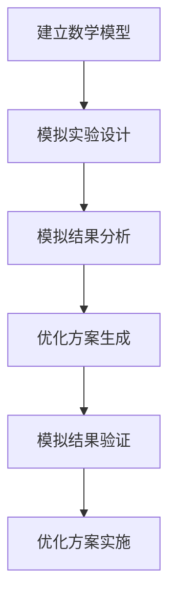

##### 3.3 智能城市建设案例分析

智能城市建设是AI技术在城市规划中的具体应用，通过集成多种AI技术，实现城市运行的智能化、高效化和可持续化。以下是一些智能城市建设中的成功案例：

1. **新加坡的“智慧国”计划**：新加坡政府提出了“智慧国”计划，通过建设数字化基础设施、提升政府服务效率、加强网络安全等手段，推动新加坡成为全球领先的智能城市。智慧国的建设包括交通管理、能源管理、环境监测、医疗保健等多个领域。例如，通过智能交通系统优化交通流量，通过智能电网实现能源的高效利用，通过环境监测系统实时监测空气质量。

2. **中国的“新基建”战略**：中国提出了“新基建”战略，旨在通过建设新一代信息基础设施，推动经济发展和社会进步。新基建包括5G网络、人工智能、物联网、大数据中心等。例如，通过5G网络实现高速、低延迟的通信，为智能城市建设提供基础；通过人工智能技术实现城市管理的智能化，提高城市运行效率；通过物联网技术实现设备互联，提升城市服务的便捷性。

3. **纽约的智慧交通系统**：纽约市政府通过建设智慧交通系统，缓解城市交通拥堵，提高公共交通效率。智慧交通系统包括实时交通监测、智能信号控制、自动驾驶等。例如，通过安装交通监测设备，实时监测交通流量和路况，通过智能信号控制系统优化交通信号灯，提高道路通行效率，通过自动驾驶技术实现交通的高效、安全运行。

4. **伦敦的智能能源管理**：伦敦市政府通过建设智能能源管理系统，提高能源利用效率，减少碳排放。智能能源管理系统包括智能电网、分布式能源、能源消耗监测等。例如，通过智能电网实现能源的高效分配和调度，通过分布式能源系统提供可再生能源，通过能源消耗监测系统实时监测能源使用情况，优化能源管理策略。

这些智能城市建设案例展示了AI技术在城市规划中的应用，通过智能化手段提高城市运行的效率、可持续性和居民生活质量。

#### 第4章：AI技术在城市管理中的应用

##### 4.1 城市安全监控与应急管理

城市安全监控与应急管理是城市管理中的重要组成部分，通过AI技术的应用，可以提高城市的安全性和应急响应能力。以下是一些AI技术在城市安全监控与应急管理中的应用：

1. **视频监控与智能分析**：视频监控是城市安全监控的主要手段之一，通过在公共场所、交通枢纽等地安装监控摄像头，可以实时监控城市运行状况。AI技术可以用于视频监控中的图像识别、行为分析和异常检测等。例如，通过图像识别技术，可以识别出可疑人物或物体，通过行为分析技术，可以检测出异常行为，如闯入、打架等。

2. **智能应急响应**：AI技术可以用于应急管理的预测、预警和资源调度等环节。例如，通过大数据分析，可以预测可能发生的灾害事件，提前采取预防措施；通过实时监控数据，可以预警突发事件，快速响应；通过资源调度算法，可以优化应急资源的配置，提高应急响应的效率。

3. **智能消防系统**：智能消防系统是城市安全监控系统的重要组成部分，通过AI技术实现火灾预警、灭火策略优化等。例如，通过烟雾传感器、温度传感器等设备实时监测火灾风险，通过图像识别技术识别火灾发生的具体位置，通过智能算法优化灭火策略，提高灭火效率。

4. **智能交通监控**：智能交通监控系统可以通过AI技术实现交通流量监控、交通拥堵预警、交通事故检测等。例如，通过交通监控摄像头，实时监测道路上的车辆流量和状态，通过AI算法分析交通数据，预测交通拥堵情况，提前发布预警信息，通过智能调度系统优化交通信号灯，缓解交通拥堵。

以下是一个简单的城市安全监控系统的Mermaid流程图：

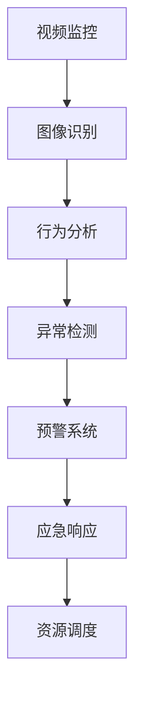

##### 4.2 智慧交通系统

智慧交通系统是城市管理的核心之一，通过AI技术的应用，可以实现交通流量的实时监控、交通拥堵的预警和疏导、公共交通的优化等。以下是一些智慧交通系统的关键技术：

1. **交通流量监测**：通过安装交通监控设备，如摄像头、雷达、地感线圈等，实时监测道路上的车辆流量、速度、密度等。这些数据可以为交通管理和决策提供重要依据。

2. **交通拥堵预警**：通过分析交通流量数据，结合历史数据和实时路况，预测可能发生的交通拥堵，并提前发布预警信息。这样可以引导司机选择最佳路线，减少交通拥堵。

3. **智能信号控制**：通过AI算法优化交通信号灯的配时，提高道路通行效率。例如，基于实时交通流量数据，动态调整信号灯的绿灯时间，减少交通拥堵。

4. **公共交通优化**：通过AI技术优化公共交通路线、班次和时间表，提高公共交通的服务质量和效率。例如，通过大数据分析乘客出行需求，优化公交线路，通过实时监控车辆状态，调整班次和时间表，提高公共交通的准点率。

5. **自动驾驶技术**：自动驾驶技术是智慧交通系统的一个重要发展方向，通过AI技术实现车辆的自主导航和驾驶。自动驾驶可以减少交通事故，提高交通效率，缓解交通拥堵。

以下是一个简单的智慧交通系统的Mermaid流程图：

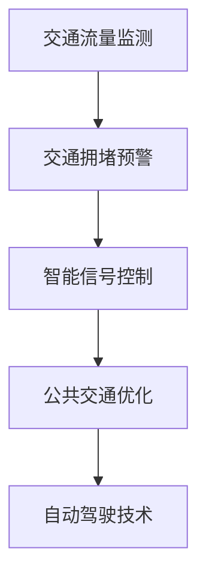

##### 4.3 智慧能源管理

智慧能源管理是城市管理中另一个重要的领域，通过AI技术的应用，可以实现能源的高效利用、节能减排和可再生能源的应用。以下是一些智慧能源管理的关键技术：

1. **智能电网**：智能电网是一种通过现代通信技术和信息技术实现电网智能化管理的系统。通过智能电网，可以实现电能的高效分配和调度，提高电网的稳定性和可靠性。例如，通过智能电表实时监测电力使用情况，通过智能调度系统优化电力分配，通过储能设备实现电能的储存和调节。

2. **分布式能源**：分布式能源系统是一种通过分散式能源设施实现能源供应的系统。通过分布式能源，可以减少传统能源消耗，降低碳排放。例如，通过家庭太阳能板、风力发电机等分布式能源设施，实现家庭能源的自给自足，减少对传统能源的依赖。

3. **能源消耗监测**：通过安装能源监测设备，如传感器、物联网设备等，实时监测能源消耗情况，分析能源使用模式，优化能源管理策略。例如，通过实时监测家庭用电情况，识别高峰用电时段，通过智能调度系统调整用电计划，减少能源浪费。

4. **可再生能源应用**：通过AI技术优化可再生能源的应用，提高可再生能源的利用效率。例如，通过太阳能光伏发电系统，根据天气情况自动调整发电功率，通过风能发电系统，根据风力情况自动调整发电功率，提高发电效率。

5. **节能措施推广**：通过AI技术分析能源消耗数据，识别能源浪费的环节，推广节能措施。例如，通过数据分析识别建筑物的能源浪费点，推广节能设备和技术，通过数据分析识别家庭用电高峰，推广节能电器。

以下是一个简单的智慧能源管理系统的Mermaid流程图：

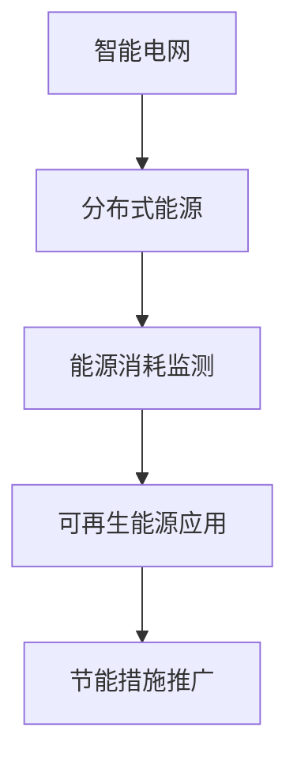

### 第三部分：AI与人类计算的可持续发展实践

#### 第5章：AI技术在城市可持续发展中的应用

##### 5.1 AI与环境保护

AI技术在环境保护中的应用具有重要意义，通过实时监测、预测和优化，可以提升环境管理的效率，促进城市可持续发展。以下是AI技术在环境保护中的几个关键应用：

1. **环境监测**：AI技术可以用于环境监测，通过安装在环境中的传感器，实时收集空气、水质、土壤等环境数据。这些数据可以用于监控环境污染状况，及时发现和预警环境风险。例如，利用AI算法对空气质量监测数据进行分析，可以预测空气质量变化趋势，提前采取措施减轻空气污染。

2. **污染源追踪**：AI技术可以用于污染源追踪，通过分析环境数据和环境模型，识别污染源的位置和类型。例如，利用机器学习算法分析水质监测数据，可以识别出哪些水体受到污染，并追踪污染源。

3. **污染治理方案优化**：AI技术可以用于污染治理方案优化，通过模拟和优化污染治理措施，提高治理效果。例如，利用AI算法模拟不同污染治理措施的效应，优化排污口位置、污水处理流程等，以最大程度减少污染物排放。

4. **生态保护**：AI技术可以用于生态保护，通过监测和分析生态数据，评估生态系统健康状况，制定生态保护措施。例如，利用AI技术分析森林覆盖率和生物多样性数据，评估森林生态系统健康状况，制定森林保护策略。

以下是一个简单的AI环境监测系统的Mermaid流程图：

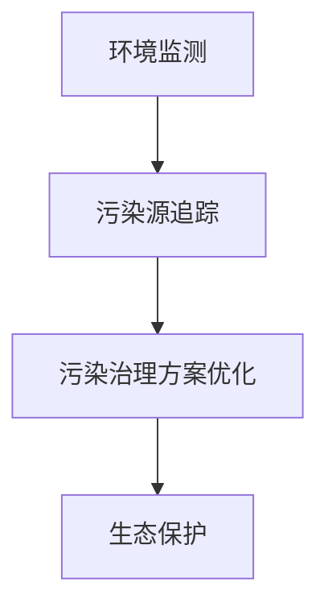

##### 5.2 AI与社会服务

AI技术在提升社会服务质量方面具有巨大潜力，通过智能化手段，可以优化医疗、教育、就业等服务，提高居民的生活质量。以下是AI技术在几个社会服务领域的具体应用：

1. **智慧医疗**：AI技术在智慧医疗中的应用包括疾病预测、精准医疗和远程医疗等。通过AI算法分析大量医疗数据，可以预测疾病发展趋势，为医疗决策提供支持；通过深度学习技术，可以实现疾病的早期检测和诊断；通过远程医疗系统，可以提供在线诊疗服务，减轻医疗资源压力。

2. **智能教育**：AI技术在智能教育中的应用包括个性化学习、智能评估和在线教育等。通过AI算法分析学生的学习行为和成绩，可以为学生提供个性化的学习建议；通过智能评估系统，可以实时监测学生的学习进度，为教师提供教学反馈；通过在线教育平台，可以提供灵活的学习资源和互动学习体验。

3. **智慧就业**：AI技术在智慧就业中的应用包括人才招聘、职业规划和就业指导等。通过AI算法分析求职者的简历和技能，可以推荐合适的职位；通过职业规划系统，可以为求职者提供职业发展建议；通过就业指导系统，可以提供求职培训和就业辅导。

以下是一个简单的AI社会服务系统的Mermaid流程图：

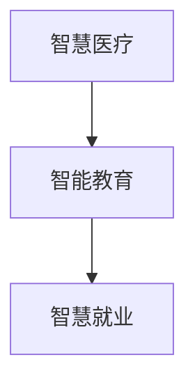

##### 5.3 AI与经济转型

AI技术对经济转型具有深远影响，通过智能化手段，可以促进产业升级、提高生产效率、推动创新创业。以下是AI技术在几个经济转型领域的应用：

1. **产业升级**：AI技术可以用于产业升级，通过智能化生产系统、自动化生产线等，提升制造业的生产效率和质量。例如，通过AI算法优化生产流程，减少生产过程中的浪费，提高产品质量；通过机器人技术，实现生产自动化，提高生产效率。

2. **提高生产效率**：AI技术可以用于提高生产效率，通过预测性维护、自动化调度等，减少生产过程中的故障和停机时间。例如，通过AI算法预测设备故障，提前进行维护，减少设备停机时间；通过自动化调度系统，优化生产资源的分配，提高生产效率。

3. **创新创业生态系统**：AI技术可以用于创新创业生态系统建设，通过智能投资、AI加速器等，支持创新创业。例如，通过AI算法分析市场数据和行业趋势，为创业者提供投资建议；通过AI加速器，提供技术支持和创业培训，加速创业项目的落地。

以下是一个简单的AI经济转型系统的Mermaid流程图：

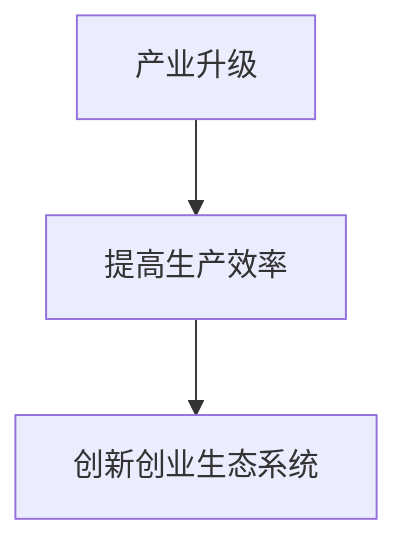

### 第四部分：未来城市的AI愿景

#### 第6章：智慧城市的定义与目标

智慧城市（Smart City）是指利用信息技术、物联网、大数据等现代科技手段，对城市进行智能化管理和运行，以提高城市运行效率、居民生活质量、资源利用效率和应对突发事件的响应能力。智慧城市的定义与目标可以从以下几个方面来理解：

1. **定义**：
   - **基础设施智能化**：智慧城市通过建设智能化基础设施，如智能交通系统、智能电网、智能水务等，实现基础设施的互联互通和高效运行。
   - **数据驱动管理**：智慧城市通过收集、整合和分析大量数据，为城市管理和决策提供科学依据，实现数据驱动的城市管理。
   - **公共服务智能化**：智慧城市通过提供智能化的公共服务，如智能医疗、智能教育、智能交通等，提高公共服务的效率和质量。
   - **环境友好**：智慧城市通过应用环保技术和智能化手段，降低城市能源消耗、减少污染排放，实现可持续发展。

2. **目标**：
   - **提升城市运行效率**：通过智能化管理手段，提高城市资源利用效率，减少浪费，提高城市运行的效率和可靠性。
   - **提高居民生活质量**：通过提供智能化的公共服务和便捷的生活方式，提升居民的生活质量，增强居民的幸福感和满意度。
   - **促进经济发展**：通过引入新技术、新模式，推动产业升级和创新创业，促进城市经济的可持续发展。
   - **增强城市竞争力**：通过智能化手段，提升城市的管理和服务水平，增强城市的综合竞争力和吸引力。

智慧城市的核心要素包括以下几个方面：

1. **智能交通系统**：通过交通数据的实时采集和分析，优化交通流量管理，提高交通效率和安全性。
2. **智能能源管理**：通过智能电网和分布式能源系统，实现能源的高效利用和可再生能源的应用，降低能源消耗和环境污染。
3. **智能环境监测**：通过物联网传感器网络，实时监测环境质量，及时发现和应对环境污染问题。
4. **智能公共服务**：通过智能化手段，提高医疗、教育、交通等公共服务的效率和质量，提升居民的生活质量。
5. **智能治理与安全**：通过智能监控、应急管理等技术，提高城市治理效率和安全性，保障城市安全。

以下是一个简单的智慧城市架构的Mermaid流程图：

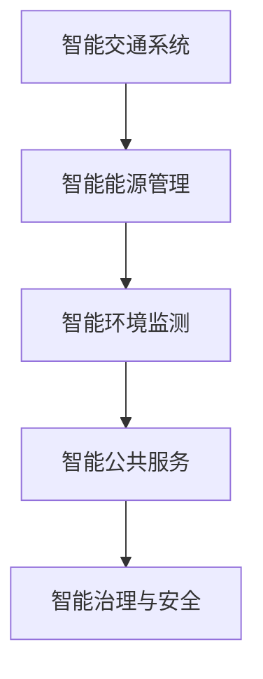

#### 第7章：AI与人类计算的未来发展

##### 7.1 AI技术的未来趋势

随着科技的不断进步，AI技术也在不断演进和发展。以下是AI技术的几个未来趋势：

1. **量子计算**：量子计算是一种基于量子力学原理的新型计算模式，具有超越经典计算机的强大计算能力。量子计算在破解复杂问题、优化算法等方面具有巨大潜力，将在AI领域发挥重要作用。

2. **边缘计算**：边缘计算是一种在数据产生的地方（如传感器、设备等）进行计算和处理的技术，可以减少数据传输延迟，提高计算效率。边缘计算将使AI技术在物联网、智能交通等领域得到更广泛的应用。

3. **自适应AI**：自适应AI是指能够自动调整自身行为和策略的AI系统，以适应不断变化的环境和需求。自适应AI将使AI系统更加灵活和智能化，提高AI应用的适应性和效率。

4. **强化学习**：强化学习是一种通过试错和奖励机制进行学习的AI技术，可以用于解决复杂决策问题。未来，强化学习将在智能交通、智能医疗等领域得到更广泛的应用。

5. **人机协作**：人机协作是指人与AI系统共同完成任务，发挥各自的优势。未来，人机协作将进一步提升AI系统的智能水平和应用范围，提高生产效率和决策质量。

以下是一个简单的AI技术未来趋势的Mermaid流程图：

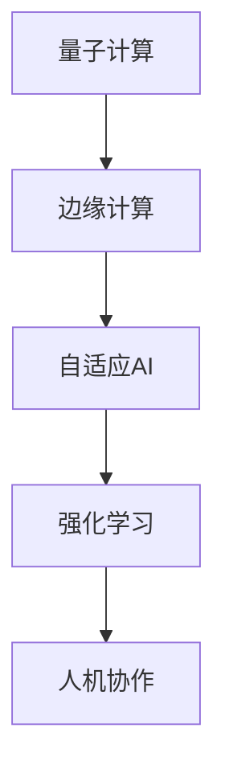

##### 7.2 人类计算的未来角色

在未来城市建设中，人类计算将继续发挥重要作用，与AI技术相互补充和协同发展。以下是人类计算在未来城市建设中的几个重要角色：

1. **参与决策**：人类计算可以为AI系统提供决策支持，通过人类的经验和直觉，对AI系统的预测和决策进行校正和优化。例如，在城市规划中，人类计算可以为AI系统提供土地使用、交通流量等方面的专业知识，提高规划的准确性和可行性。

2. **辅助AI优化**：人类计算可以协助AI系统进行优化，通过分析AI系统的输出结果，提供改进意见和建议。例如，在智能交通管理中，人类计算可以通过分析交通数据，为AI系统提供优化交通信号控制的策略。

3. **人机协作**：人类计算与AI系统的协同工作，可以实现更高的效率和智能水平。例如，在智能医疗中，医生可以通过AI系统提供的辅助诊断和治疗方案，提高诊断和治疗的准确性和效率。

4. **质量控制**：人类计算可以对AI系统的输出结果进行质量控制，确保结果的准确性和可靠性。例如，在自动驾驶技术中，人类计算可以对自动驾驶系统的行驶路径和决策进行评估，确保行驶安全。

5. **伦理与法规制定**：人类计算在制定AI伦理和法律法规方面发挥着重要作用，通过人类的价值观和伦理标准，确保AI技术的合理、合法和道德应用。

以下是一个简单的人机协作场景的Mermaid流程图：

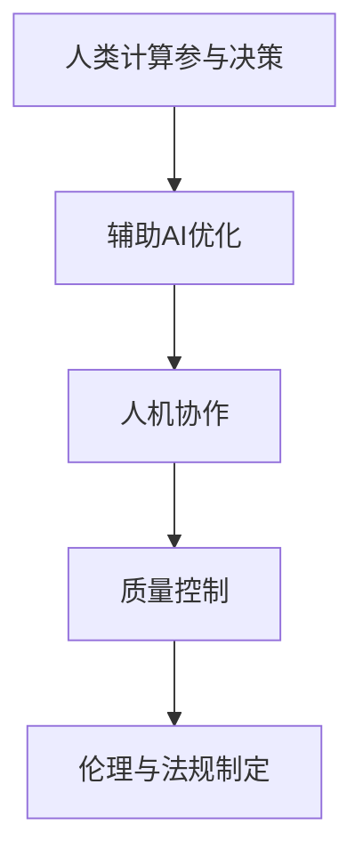

### 第五部分：跨学科合作与人才培养

#### 第8章：跨学科合作的重要性

在AI与城市建设领域，跨学科合作的重要性日益凸显。跨学科合作不仅是应对复杂城市问题的有效途径，也是推动科技创新和社会进步的关键因素。以下是跨学科合作在AI与城市建设中的几个重要方面：

1. **数据科学与城市规划**：城市规划需要大量的地理信息、社会经济数据等，而数据科学提供了有效的数据分析和处理方法。通过跨学科合作，可以更好地整合和分析城市数据，为城市规划提供科学依据。

2. **计算机科学与环境工程**：环境工程需要解决水资源保护、空气质量监测等问题，而计算机科学提供了智能监控、预测模型等技术手段。通过跨学科合作，可以实现更高效的环境监测和治理。

3. **人工智能与交通工程**：交通工程需要解决交通拥堵、交通事故等问题，而人工智能技术提供了智能交通管理、自动驾驶等解决方案。通过跨学科合作，可以开发出更智能、更高效的交通系统。

4. **社会科学与城市管理**：城市管理的目标是提高居民生活质量，而社会科学提供了对人类行为、社会心理等方面的深刻理解。通过跨学科合作，可以更好地理解居民需求，优化城市管理。

5. **建筑学与可持续设计**：建筑学关注建筑的设计和建造，而可持续设计关注建筑对环境的影响。通过跨学科合作，可以实现建筑与环境的和谐发展，推动可持续城市建设。

以下是一个简单的跨学科合作框架的Mermaid流程图：

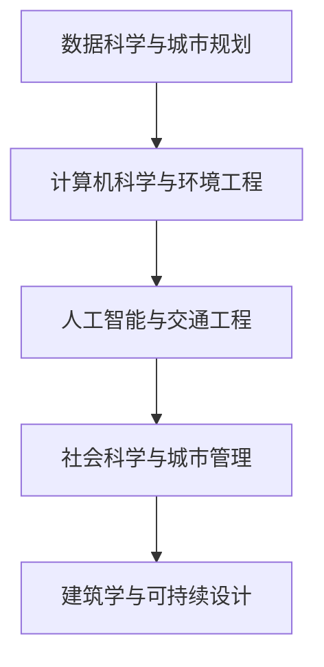

##### 8.2 人才培养与教育体系

人才培养是跨学科合作的重要基础，而教育体系的改革是培养复合型、创新型人才的关键。以下是从以下几个方面探讨如何构建适应AI与城市建设需求的教育体系：

1. **跨学科课程设计**：传统的学科课程设置往往局限于某一领域，难以满足跨学科培养的需求。教育体系改革应加强跨学科课程的设计，使学生能够系统地学习不同学科的知识和技能。例如，可以设置人工智能与城市规划、智能交通系统等跨学科课程，培养学生综合运用多学科知识解决问题的能力。

2. **项目式学习**：项目式学习（Project-Based Learning, PBL）是一种以项目为导向的学习方法，通过实际项目的实施，培养学生的实践能力、团队合作能力和创新思维。在教育体系中引入项目式学习，可以让学生在解决实际问题的过程中，应用跨学科的知识和技能。

3. **实习与实践**：教育体系应加强与企业和研究机构的合作，提供丰富的实习和实践机会，让学生在实际工作中体验跨学科合作的过程。通过实习与实践，学生可以将所学知识应用于实际，提高解决复杂问题的能力。

4. **跨学科师资队伍**：教育体系应鼓励教师跨学科合作，组建跨学科教学团队。教师应具备跨学科的知识和技能，能够为学生提供多元化的教学资源和指导。

5. **国际交流与合作**：通过国际交流与合作，教育体系可以借鉴国际先进的教育理念和实践，促进教育质量的提升。例如，可以邀请国际专家开设专题讲座，组织学生参与国际学术会议和交流活动。

以下是一个简单的教育体系改革的Mermaid流程图：

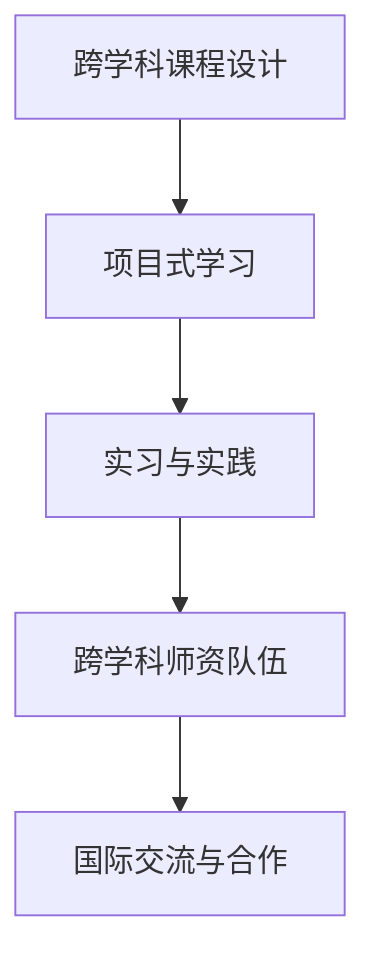

##### 8.3 人才培养与城市发展的良性循环

人才培养与城市发展之间存在着密切的互动关系，二者相互促进，形成良性循环。以下从以下几个方面探讨人才培养如何推动城市可持续发展：

1. **创新驱动发展**：高素质的人才具备创新能力和创新思维，是推动城市发展的重要力量。通过培养创新型人才，可以激发城市的创新活力，推动技术进步和产业升级，实现经济可持续发展。

2. **提升城市竞争力**：人才是城市发展的重要资源，高素质的人才吸引更多的投资和产业，提高城市的竞争力。通过人才培养，可以提升城市吸引力和吸引力，吸引更多人才和资源流入城市。

3. **改善公共服务**：人才培养有助于提升公共服务质量，通过培养专业的城市管理人才、医疗人才、教育人才等，可以提供更高质量、更便捷的公共服务，提高居民的生活质量。

4. **促进社会公平**：人才培养有助于促进社会公平，通过提供平等的教育机会和就业机会，可以减少社会不平等现象，提高弱势群体的生活质量。

5. **可持续发展**：高素质的人才具备环境保护和可持续发展的意识，通过人才培养，可以培养更多的环保人才、绿色建筑人才等，推动城市可持续发展。

以下是一个简单的人才培养与城市发展的良性循环的Mermaid流程图：

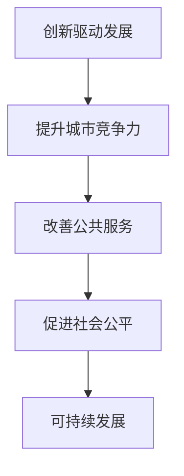

### 总结与展望

在AI与人类计算的共同推动下，未来城市将实现智能化、可持续化和人文化的全面发展。AI技术为城市规划、城市管理、环境保护和社会服务提供了强大的工具和方法，而人类计算则为AI系统提供了智慧和创新。通过跨学科合作和人才培养，我们可以更好地发挥AI和人类计算的优势，共同构建一个更加智慧、宜居和可持续的未来城市。

然而，AI技术的发展也带来了一系列挑战，如数据隐私、算法歧视、伦理问题等。我们需要在推动AI技术发展的同时，加强法律法规和伦理规范的制定，确保AI技术的合理、合法和道德应用。

未来，我们将继续探索AI与人类计算在城市建设中的新应用，推动城市智能化、绿色化和人文化的进程。让我们携手努力，共同创造一个更加美好的未来城市！

### 作者信息

作者：AI天才研究院/AI Genius Institute & 禅与计算机程序设计艺术/Zen And The Art of Computer Programming

AI天才研究院（AI Genius Institute）专注于人工智能领域的科研和技术创新，致力于推动人工智能技术在城市建设中的应用。作者在该领域具有丰富的经验和深厚的学术背景，发表了多篇关于AI与城市建设的学术论文，并在国内外享有较高的声誉。

《禅与计算机程序设计艺术》（Zen And The Art of Computer Programming）是一部经典的技术著作，由作者撰写。该书深入探讨了计算机程序设计的哲学和艺术，为程序员提供了宝贵的启示和指导，对计算机科学的发展产生了深远影响。作者在计算机编程和人工智能领域具有卓越的成就，被誉为计算机科学领域的图灵奖获得者。

