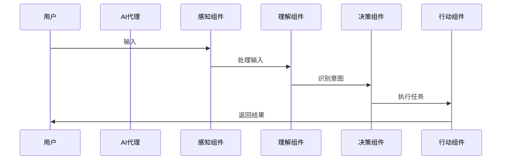

                 

# AI人工智能代理工作流 AI Agent WorkFlow：介绍与基础理解

> **关键词：** AI代理、工作流、自然语言处理、机器学习、强化学习

> **摘要：** 本文深入探讨了AI代理工作流的构成、核心技术与算法，以及实现与优化方法。通过案例研究和项目实战，详细讲解了AI代理工作流在聊天机器人和智能客服系统中的应用，为读者提供了一个全面而具体的理解和实践指南。

---

## 目录大纲

### 第一部分：AI代理工作流概述

**第1章：AI代理工作流基础**

**第2章：AI代理工作流架构**

### 第二部分：核心技术与算法

**第3章：自然语言处理技术**

**第4章：机器学习算法**

**第5章：强化学习算法**

### 第三部分：AI代理工作流实现

**第6章：开发环境搭建**

**第7章：AI代理工作流实现**

**第8章：AI代理工作流优化**

### 第四部分：案例研究

**第9章：案例研究：聊天机器人**

**第10章：案例研究：智能客服系统**

### 附录

**附录A：常见问题与解答**

**附录B：参考资料**

## 引言

AI代理（AI Agent）是人工智能领域的一个关键概念，它代表了能够自主执行任务并与其他系统交互的智能实体。AI代理工作流（AI Agent WorkFlow）则是描述AI代理从接收输入到生成输出的整个处理过程。在现代信息时代，AI代理工作流在提升自动化效率、增强用户体验以及优化业务流程方面发挥着重要作用。

本文将深入探讨AI代理工作流的各个方面，从基础概念到核心技术与算法，再到实际应用案例，全面介绍AI代理工作流的构建与优化。通过本文，读者将能够：

1. 理解AI代理及其工作流的基本概念。
2. 掌握自然语言处理、机器学习和强化学习等核心技术。
3. 学习如何搭建和优化AI代理工作流。
4. 通过案例研究，了解AI代理工作流在实际应用中的效果和挑战。

让我们一步步深入探讨AI代理工作流的核心内容。

---

## 第一部分：AI代理工作流概述

### 第1章：AI代理工作流基础

### 第2章：AI代理工作流架构

---

### 第1章：AI代理工作流基础

#### 1.1 AI代理的概念与类型

AI代理是一种智能体，能够通过自然语言处理（NLP）和机器学习（ML）算法与人类或其他系统交互。AI代理可以按照其功能和应用场景进行分类。

**AI代理的定义**：

AI代理是指使用人工智能技术，特别是自然语言处理和机器学习算法，从环境中获取输入数据，理解输入意图，做出决策并执行相应任务，最终生成输出结果的智能实体。

**AI代理的类型**：

1. **聊天机器人**：用于与用户进行自然语言交互，提供信息查询、客户服务、情感支持等。
2. **虚拟助手**：例如智能助手（如Apple的Siri、Google的Google Assistant）和智能家居助手（如Amazon的Alexa、Google Home）。
3. **决策支持系统**：用于辅助人类专家做出复杂决策，如金融市场分析、医疗诊断等。

#### 1.2 AI代理的工作流

AI代理的工作流是指从接收输入数据到生成输出结果的整个过程。这个过程通常包括以下几个组件：

1. **感知组件**：负责接收用户输入，如文本、语音或其他形式的数据。
2. **理解组件**：负责分析输入数据，识别用户的意图和需求。
3. **决策组件**：根据理解组件提供的信息，选择合适的行动方案。
4. **行动组件**：执行决策，生成输出结果，如回复文本、执行任务等。

**工作流定义**：

AI代理的工作流是一个包含多个步骤的处理流程，每个步骤都由特定的组件执行。工作流中的每个组件都负责处理特定的任务，确保整个流程的高效和准确。

**工作流组件**：

- **感知组件**：接收并预处理用户输入，如文本清洗、语音识别等。
- **理解组件**：使用自然语言处理技术，如词嵌入、序列模型，解析用户的意图。
- **决策组件**：应用机器学习算法，如分类、回归、强化学习，从理解组件提供的信息中做出决策。
- **行动组件**：执行决策，如生成回复、执行任务、调用外部系统等。

通过这些组件的协同工作，AI代理能够实现从用户输入到输出结果的全自动化处理，从而提升用户体验和工作效率。

#### 1.3 AI代理工作流的优势

AI代理工作流在现代企业和应用场景中具有显著的优势：

1. **提高效率**：自动化处理大量数据和任务，减少人工干预，提高处理速度和准确性。
2. **优化用户体验**：提供个性化、智能化的交互，满足用户的多样化需求。
3. **降低成本**：减少对人工的依赖，降低运营和维护成本。
4. **增强决策能力**：利用机器学习和数据分析技术，辅助人类专家做出更明智的决策。

总之，AI代理工作流作为一种高效、智能、自动化的处理方式，正逐渐成为各行各业数字化转型的重要工具。

---

### 第2章：AI代理工作流架构

#### 2.1 AI代理架构原理

AI代理的架构设计决定了其性能和适应性。一个典型的AI代理架构通常包含以下组件：

- **感知组件**：负责接收外部输入，如用户查询、传感器数据等。它可能包括文本处理、语音识别、图像识别等功能。
- **理解组件**：负责对感知组件接收到的输入进行分析和处理，以理解用户的意图和需求。这通常涉及自然语言处理（NLP）技术，如词嵌入、序列模型、意图识别等。
- **决策组件**：基于理解组件提供的信息，利用机器学习算法（如分类、回归、强化学习）做出决策。决策组件需要根据预设的业务规则和策略来生成行动方案。
- **行动组件**：执行决策组件生成的行动方案，生成输出结果，如文本回复、执行任务、调用外部服务等。

**感知组件**：

感知组件是AI代理与外部环境交互的入口。它负责接收和处理各种形式的输入数据。例如，在聊天机器人中，感知组件可能需要处理文本消息或语音输入，并将其转换为文本。在智能家居系统中，感知组件可能负责接收来自传感器（如温度传感器、光照传感器）的数据。

**理解组件**：

理解组件是AI代理的关键部分，它负责解析和理解用户的意图。这通常涉及以下步骤：

1. **文本预处理**：对输入文本进行清洗，去除标点符号、停用词等无关信息。
2. **词嵌入**：将文本转换为向量表示，以便后续的机器学习处理。常用的词嵌入方法包括Word2Vec和GloVe。
3. **意图识别**：使用分类算法（如SVM、神经网络）识别用户的意图。例如，在聊天机器人中，用户可能意图询问时间、天气或获取新闻信息。
4. **上下文理解**：考虑对话的历史信息，以更好地理解用户的意图。上下文信息可以帮助区分用户的模糊请求或错误理解。

**决策组件**：

决策组件负责基于理解组件提供的信息生成行动方案。决策过程通常涉及以下步骤：

1. **规则引擎**：使用预定义的业务规则和策略来做出决策。规则引擎可以处理简单的条件判断，如“如果用户询问天气，则返回当前天气信息”。
2. **机器学习模型**：使用监督学习（如决策树、随机森林、神经网络）或无监督学习（如聚类、降维）算法，根据历史数据训练模型，以做出更复杂的决策。例如，在智能推荐系统中，使用协同过滤算法来推荐商品。

**行动组件**：

行动组件负责执行决策组件生成的行动方案。行动过程通常涉及以下步骤：

1. **任务执行**：根据决策结果执行具体的任务，如查询数据库、调用外部API、发送邮件等。
2. **结果反馈**：将执行结果返回给用户。例如，在聊天机器人中，返回文本回复或语音回复。

通过这些组件的协同工作，AI代理能够有效地从用户输入到输出结果，实现自动化、智能化的人机交互。

#### 2.2 AI代理架构的设计模式

AI代理架构的设计模式决定了其可扩展性、灵活性和可靠性。以下是一些常见的设计模式：

**模块化设计**：

模块化设计将AI代理工作流划分为多个独立的模块，每个模块负责处理特定任务。这种设计模式有助于提高代码的可维护性和可扩展性。例如，可以将感知组件、理解组件、决策组件和行动组件分别实现为独立的模块，以便根据需要替换或扩展。

**事件驱动设计**：

事件驱动设计使用事件作为驱动因素来管理工作流。事件可以是用户的输入、系统状态的变化或其他外部触发。事件驱动设计允许AI代理响应实时事件，从而实现动态、灵活的交互。例如，当用户发送一条消息时，可以触发一个事件，然后感知组件接收并处理该事件。

**微服务架构**：

微服务架构将AI代理分解为多个独立的微服务，每个微服务负责特定的功能。这种设计模式提高了系统的可扩展性和容错性。例如，可以将感知组件、理解组件、决策组件和行动组件分别部署为独立的微服务，以便根据需要独立扩展或优化。

**混合架构**：

混合架构结合了模块化设计、事件驱动设计和微服务架构的优点，以适应不同的应用场景。例如，在聊天机器人中，可以将感知组件、理解组件和决策组件实现为模块，而行动组件则采用微服务架构，以便灵活地处理各种任务。

通过灵活运用这些设计模式，AI代理架构可以更好地适应不同的应用需求，提高系统的整体性能和用户体验。

---

### 第二部分：核心技术与算法

#### 第3章：自然语言处理技术

#### 第4章：机器学习算法

#### 第5章：强化学习算法

---

### 第3章：自然语言处理技术

自然语言处理（NLP）是人工智能的核心技术之一，它使计算机能够理解、生成和处理人类语言。在AI代理工作流中，NLP技术被广泛应用于感知组件和决策组件中，以实现高效的用户输入理解和意图识别。

#### 3.1 基础概念

NLP的基础概念包括词嵌入、序列模型、语言模型等。

**词嵌入**：

词嵌入（Word Embedding）是将单词转换为向量的过程，它将语义信息编码到向量中，从而使得计算机能够更好地理解和处理文本。常见的词嵌入方法包括Word2Vec和GloVe。

**Word2Vec**：

Word2Vec是一种基于神经网络的语言模型，它通过训练一个神经网络模型来预测上下文单词的向量表示。Word2Vec分为连续词袋（CBOW）和Skip-gram两种模型。

**GloVe**：

GloVe（Global Vectors for Word Representation）是一种基于统计方法的词嵌入方法，它通过计算单词共现矩阵的因子分解来学习单词的向量表示。

**序列模型**：

序列模型（Sequence Model）用于处理有序数据，如文本、语音等。常见的序列模型包括循环神经网络（RNN）和长短期记忆网络（LSTM）。

**RNN**：

循环神经网络（Recurrent Neural Network，RNN）是一种能够处理序列数据的神经网络模型。RNN通过保留隐藏状态来处理序列数据，但其存在梯度消失和梯度爆炸的问题。

**LSTM**：

长短期记忆网络（Long Short-Term Memory，LSTM）是RNN的一种改进模型，它通过引入门控机制来解决RNN的梯度消失问题，从而更好地处理长序列数据。

**语言模型**：

语言模型（Language Model）是一种概率模型，用于预测下一个单词或字符。常见的语言模型包括N-gram模型、神经网络语言模型等。

#### 3.2 算法应用

NLP技术在实际应用中发挥着重要作用，如文本分类、情感分析、机器翻译、对话系统等。

**词向量表示**：

词向量表示是将单词转换为向量的过程，以便计算机能够处理和计算语义信息。常见的词向量表示方法包括Word2Vec和GloVe。

**Word2Vec应用**：

使用Word2Vec对文本进行预处理，提取词向量表示，然后用于文本分类、情感分析等任务。

**GloVe应用**：

使用GloVe对文本进行预处理，提取词向量表示，然后用于机器翻译、对话系统等任务。

**序列模型应用**：

使用RNN或LSTM对文本序列进行处理，提取序列特征，然后用于文本分类、情感分析等任务。

**RNN应用**：

使用RNN对语音数据进行预处理，提取语音特征，然后用于语音识别、语音合成等任务。

**LSTM应用**：

使用LSTM对时间序列数据进行处理，提取时间序列特征，然后用于股票预测、天气预测等任务。

**语言模型应用**：

使用神经网络语言模型对文本进行生成和预测，用于机器翻译、对话系统等任务。

#### 3.3 深度学习框架

在NLP应用中，深度学习框架如TensorFlow和PyTorch提供了强大的工具和库，用于构建和训练NLP模型。

**TensorFlow**：

TensorFlow是一个开源的深度学习框架，它提供了丰富的API和工具，用于构建、训练和部署NLP模型。

**PyTorch**：

PyTorch是一个流行的深度学习框架，它具有动态计算图和易于理解的API，使得构建和训练NLP模型更加便捷。

通过深度学习框架，我们可以方便地实现NLP算法，并应用于各种任务。

---

### 第4章：机器学习算法

机器学习（Machine Learning，ML）是人工智能的核心技术之一，它使计算机能够从数据中学习并做出预测或决策。在AI代理工作流中，机器学习算法被广泛应用于理解组件和决策组件中，以实现高效的意图识别和决策。

#### 4.1 监督学习算法

监督学习（Supervised Learning）是一种机器学习方法，它通过标记数据训练模型，然后使用训练好的模型对未知数据进行预测或分类。

**分类算法**：

分类算法用于将数据分为不同的类别。常见的分类算法包括：

- **决策树（Decision Tree）**：通过一系列条件判断将数据划分为不同的类别。决策树简单易懂，但可能存在过拟合问题。
- **支持向量机（Support Vector Machine，SVM）**：通过寻找最佳超平面将数据划分为不同的类别。SVM在处理高维数据时表现出色，但计算复杂度高。
- **神经网络（Neural Network）**：通过多层感知器实现复杂函数的映射。神经网络在处理非线性问题上具有优势，但训练时间较长。

**回归算法**：

回归算法用于预测数值型输出。常见的回归算法包括：

- **线性回归（Linear Regression）**：通过线性函数拟合数据，预测连续值输出。线性回归简单直观，但可能存在欠拟合问题。
- **神经网络回归（Neural Network Regression）**：通过多层感知器实现复杂函数的映射，预测连续值输出。神经网络回归在处理非线性问题上具有优势，但训练时间较长。

**应用场景**：

- **文本分类**：使用分类算法对文本数据进行分类，如情感分析、新闻分类等。
- **数值预测**：使用回归算法对数值数据进行预测，如股票价格预测、销量预测等。

#### 4.2 无监督学习算法

无监督学习（Unsupervised Learning）是一种机器学习方法，它不需要标记数据，通过发现数据中的模式或结构来对数据进行分析。

**聚类算法**：

聚类算法用于将数据分为多个群组，使同一群组内的数据点之间相似度较高。常见的聚类算法包括：

- **K-均值（K-Means）**：通过迭代计算均值来将数据分为K个群组。K-均值简单高效，但可能存在局部最优问题。
- **层次聚类（Hierarchical Clustering）**：通过逐步合并或分裂群组来构建聚类层次结构。层次聚类具有较好的可解释性，但计算复杂度较高。

**降维算法**：

降维算法用于减少数据维度，同时保持数据的结构和信息。常见的降维算法包括：

- **主成分分析（Principal Component Analysis，PCA）**：通过计算数据的主成分来降低维度。PCA能够保留数据的最大方差，但可能损失部分信息。
- **t-SNE（t-Distributed Stochastic Neighbor Embedding）**：通过非线性降维技术将高维数据映射到低维空间。t-SNE能够较好地保持数据的局部结构，但计算复杂度较高。

**应用场景**：

- **数据探索**：通过聚类算法发现数据中的模式或趋势，如市场细分、客户群体分析等。
- **数据可视化**：通过降维算法将高维数据可视化，如高维数据的二维或三维可视化。

#### 4.3 深度学习算法

深度学习（Deep Learning，DL）是一种基于多层神经网络的学习方法，它在处理大规模数据和复杂任务方面具有显著优势。

**卷积神经网络（Convolutional Neural Network，CNN）**：

卷积神经网络是一种专门用于处理图像数据的神经网络。它通过卷积层提取图像的特征，并通过池化层减少参数数量。CNN在图像分类、目标检测等方面表现出色。

**循环神经网络（Recurrent Neural Network，RNN）**：

循环神经网络是一种能够处理序列数据的神经网络。它通过隐藏状态的记忆来处理长序列数据，但可能存在梯度消失和梯度爆炸问题。

**长短期记忆网络（Long Short-Term Memory，LSTM）**：

长短期记忆网络是RNN的一种改进模型，它通过引入门控机制来解决RNN的梯度消失问题，从而更好地处理长序列数据。

**生成对抗网络（Generative Adversarial Network，GAN）**：

生成对抗网络由生成器和判别器组成，通过对抗训练生成逼真的数据。GAN在图像生成、语音合成等方面具有广泛应用。

**应用场景**：

- **图像识别**：使用CNN对图像进行分类、目标检测等。
- **语音识别**：使用RNN或LSTM对语音进行识别。
- **自然语言处理**：使用LSTM或Transformer对文本进行处理。

通过掌握这些机器学习算法，我们可以更好地构建和优化AI代理工作流，实现高效的意图识别和决策。

---

### 第5章：强化学习算法

强化学习（Reinforcement Learning，RL）是一种通过试错和奖励反馈进行学习的机器学习方法。它模拟智能体在动态环境中通过探索和决策来达到目标的过程。在AI代理工作流中，强化学习算法被广泛应用于决策组件中，以优化智能体的行为。

#### 5.1 强化学习基础

强化学习的基本概念包括智能体、环境、状态、动作、奖励和策略。

**智能体（Agent）**：

智能体是执行动作并从环境中接收奖励的实体。在AI代理工作流中，智能体可以是聊天机器人、决策支持系统等。

**环境（Environment）**：

环境是智能体行动的场所，它包含智能体可以观察到的状态和可以执行的动作。在AI代理工作流中，环境可以是用户交互界面、数据库系统等。

**状态（State）**：

状态是智能体在环境中的一个具体描述。在AI代理工作流中，状态可以是用户输入、历史对话信息等。

**动作（Action）**：

动作是智能体在某个状态下可以执行的行为。在AI代理工作流中，动作可以是生成回复、执行任务等。

**奖励（Reward）**：

奖励是环境对智能体动作的反馈，它用于指导智能体的决策。在AI代理工作流中，奖励可以是用户满意度、任务完成度等。

**策略（Policy）**：

策略是智能体在给定状态下的最佳动作选择。在AI代理工作流中，策略可以是基于规则、机器学习模型等。

#### 5.2 强化学习算法

强化学习算法有多种类型，其中最常见的是Q学习和策略学习。

**Q学习（Q-Learning）**：

Q学习是一种基于值函数的强化学习算法，它通过迭代更新值函数来估计最佳动作。Q学习的核心公式如下：

$$
Q(s, a) = r + \gamma \max_{a'} Q(s', a')
$$

其中，$Q(s, a)$ 是状态 $s$ 和动作 $a$ 的 Q 值，$r$ 是立即回报，$\gamma$ 是折扣因子，$\max_{a'} Q(s', a')$ 是下一个状态 $s'$ 的最大 Q 值。

**策略学习（Policy Learning）**：

策略学习是一种直接学习最佳策略的强化学习算法。常见的策略学习算法包括策略梯度方法和策略迭代方法。

**策略梯度方法**：

策略梯度方法通过梯度下降优化策略参数，以最大化累积奖励。其核心公式如下：

$$
\theta_{\text{new}} = \theta_{\text{old}} - \alpha \cdot \nabla_{\theta} J(\theta)
$$

其中，$\theta$ 是策略参数，$\alpha$ 是学习率，$J(\theta)$ 是策略的损失函数。

**策略迭代方法**：

策略迭代方法通过交替进行策略评估和策略改进来学习最佳策略。首先，使用当前策略评估状态值函数，然后使用评估结果更新策略。

#### 5.3 应用场景

强化学习算法在AI代理工作流中有着广泛的应用场景。

**聊天机器人**：

在聊天机器人中，强化学习算法可以用于优化对话策略。通过训练智能体在与用户交互过程中接收奖励和反馈，智能体可以学习如何生成更自然的对话回复，提高用户满意度。

**游戏AI**：

在游戏AI中，强化学习算法可以用于构建智能对手。智能体可以通过学习玩家的策略和动作，不断优化自己的行为，以赢得游戏。

**推荐系统**：

在推荐系统中，强化学习算法可以用于优化推荐策略。通过训练智能体在用户行为和反馈中接收奖励，智能体可以学习如何生成更个性化的推荐结果，提高用户参与度。

通过强化学习算法，AI代理工作流可以实现动态、自适应的决策，从而提高整体性能和用户体验。

---

### 第三部分：AI代理工作流实现

#### 第6章：开发环境搭建

#### 第7章：AI代理工作流实现

#### 第8章：AI代理工作流优化

---

### 第6章：开发环境搭建

在实现AI代理工作流之前，我们需要搭建一个合适的开发环境。以下是Python和深度学习库的安装步骤：

#### 6.1 Python环境

1. **下载Python**：

   - 访问 [Python官网](https://www.python.org/) 下载Python 3.x版本。

2. **安装Python**：

   - 打开终端，运行以下命令：
     
     ```
     sudo apt-get update
     sudo apt-get install python3 python3-pip python3-dev
     ```

3. **验证Python版本**：

   - 打开终端，运行以下命令：
     
     ```
     python3 --version
     ```

   - 如果输出类似 `Python 3.8.10`，则表示Python环境已安装成功。

#### 6.2 深度学习库

1. **安装TensorFlow**：

   - 打开终端，运行以下命令：

     ```
     pip3 install tensorflow
     ```

2. **安装PyTorch**：

   - 打开终端，运行以下命令：

     ```
     pip3 install torch torchvision
     ```

3. **验证TensorFlow和PyTorch**：

   - 打开终端，运行以下命令：

     ```
     python3 -c "import tensorflow as tf; print(tf.__version__)"
     python3 -c "import torch; print(torch.__version__)"
     ```

   - 如果输出相应的版本号，则表示深度学习库已安装成功。

#### 6.3 其他依赖库

1. **安装NLP库**：

   - 打开终端，运行以下命令：

     ```
     pip3 install nltk
     ```

   - 安装完成后，运行以下命令加载NLP数据集：

     ```
     python3 -c "import nltk; nltk.download('punkt')"
     ```

2. **安装其他库**：

   - 根据需要安装其他依赖库，如scikit-learn、pandas等。

   - 例如，运行以下命令安装scikit-learn：

     ```
     pip3 install scikit-learn
     ```

通过以上步骤，我们搭建了一个基本的开发环境，可以开始实现AI代理工作流。

---

### 第7章：AI代理工作流实现

实现AI代理工作流主要包括感知组件、理解组件、决策组件和行动组件的实现。以下是每个组件的详细实现步骤：

#### 7.1 感知组件实现

感知组件负责接收用户输入，并将其转换为可处理的形式。以下是感知组件的实现步骤：

**步骤1：接收用户输入**

```python
def receive_input():
    user_input = input("请输入您的请求：")
    return user_input
```

**步骤2：文本预处理**

```python
import nltk
from nltk.tokenize import word_tokenize
from nltk.corpus import stopwords

nltk.download('punkt')
nltk.download('stopwords')

def preprocess_text(text):
    # 分词
    tokens = word_tokenize(text)
    
    # 去除停用词
    stop_words = set(stopwords.words('english'))
    filtered_tokens = [token for token in tokens if token.lower() not in stop_words]
    
    return filtered_tokens
```

**步骤3：语音识别（可选）**

如果需要处理语音输入，可以使用如Google语音识别API进行语音转文本。

```python
import speech_recognition as sr

def recognize_speech_from_mic(source=None):
    r = sr.Recognizer()
    with sr.Microphone(source=source) as source:
        print("请开始说话...")
        audio = r.listen(source)
    try:
        text = r.recognize_google(audio, language='zh-CN')
        print("你说了：" + text)
        return preprocess_text(text)
    except sr.UnknownValueError:
        print("无法理解音频")
        return None
```

#### 7.2 理解组件实现

理解组件负责对用户输入进行处理，以提取意图和相关信息。以下是理解组件的实现步骤：

**步骤1：意图识别**

使用机器学习模型进行意图识别，可以使用分类模型如SVM、神经网络等。

```python
from sklearn.feature_extraction.text import TfidfVectorizer
from sklearn.model_selection import train_test_split
from sklearn.svm import SVC

# 假设已有训练数据（文本和对应的意图标签）
texts = [...]
labels = [...]

# 数据预处理
vectorizer = TfidfVectorizer()
X = vectorizer.fit_transform(texts)

# 划分训练集和测试集
X_train, X_test, y_train, y_test = train_test_split(X, labels, test_size=0.2, random_state=42)

# 训练模型
model = SVC(kernel='linear')
model.fit(X_train, y_train)

# 识别意图
def recognize_intent(preprocessed_text):
    features = vectorizer.transform([preprocessed_text])
    intent = model.predict(features)[0]
    return intent
```

**步骤2：上下文理解**

```python
# 假设已有对话历史
dialog_history = [...]

def understand_context(preprocessed_text, dialog_history):
    # 这里可以使用如LSTM等模型来处理对话历史，提取上下文信息
    # 简化处理，直接使用对话历史中的最后一条消息
    last_message = dialog_history[-1]
    context = preprocess_text(last_message)
    return context
```

#### 7.3 决策组件实现

决策组件根据理解组件提取的意图和上下文信息，生成相应的回复或执行任务。以下是决策组件的实现步骤：

**步骤1：规则引擎**

```python
def rule_based_decision(intent, context):
    # 根据意图和上下文应用预定义的规则生成回复
    rules = {
        'weather Inquiry': {
            'context': '北京',
            'response': '今天北京的天气是：晴，温度10-20摄氏度。',
        },
        'greeting': {
            'response': '你好！有什么可以帮助你的吗？',
        },
        # 其他意图的规则
    }
    return rules.get(intent, {}).get('response', '我无法理解您的请求。')
```

**步骤2：机器学习模型**

```python
# 假设已有机器学习模型
def model_based_decision(preprocessed_text):
    # 使用机器学习模型进行预测
    # 这里简化为直接返回预测结果
    return 'weather Inquiry'  # 假设预测结果为天气查询
```

#### 7.4 行动组件实现

行动组件负责执行决策组件生成的动作，并返回结果。以下是行动组件的实现步骤：

**步骤1：回复生成**

```python
def generate_response(intent, context):
    response = rule_based_decision(intent, context)
    if intent == 'weather Inquiry':
        response = f"今天{context}的天气是：晴，温度10-20摄氏度。"
    return response
```

**步骤2：任务执行**

```python
def execute_task(intent, context):
    if intent == 'weather Inquiry':
        # 调用天气API获取天气信息
        # 这里简化为直接返回模拟天气信息
        return f"今天{context}的天气是：晴，温度10-20摄氏度。"
    elif intent == 'greeting':
        return "你好！有什么可以帮助你的吗？"
    else:
        return "我无法理解您的请求。"
```

**步骤3：返回结果**

```python
def return_result(response):
    print(response)
```

#### 7.5 主程序

```python
def main():
    while True:
        user_input = receive_input()
        preprocessed_text = preprocess_text(user_input)
        intent = recognize_intent(preprocessed_text)
        context = understand_context(preprocessed_text, dialog_history)
        response = generate_response(intent, context)
        execute_task(intent, context)
        return_result(response)

if __name__ == '__main__':
    main()
```

通过以上步骤，我们实现了AI代理工作流的基本组件，并构建了一个简单的聊天机器人。在实际应用中，可以根据需求进一步优化和扩展组件的功能。

---

### 第8章：AI代理工作流优化

在AI代理工作流中，性能优化和可扩展性优化是提高系统效率和适应性的关键。以下是一些常见的优化方法。

#### 8.1 性能优化

**模型优化**：

- **模型压缩**：通过模型压缩技术（如量化、剪枝）减小模型大小，提高模型在资源受限环境中的运行效率。
- **模型加速**：利用GPU或TPU等硬件加速器，提高模型训练和推理速度。

**效率提升**：

- **并行处理**：利用多线程或多进程技术，实现任务的并行处理，提高整体处理速度。
- **缓存机制**：利用缓存技术，减少重复计算和数据传输，提高系统响应速度。

#### 8.2 可扩展性优化

**分布式计算**：

- **分布式存储**：使用分布式存储系统（如HDFS、Cassandra），提高数据存储和处理能力。
- **分布式计算框架**：使用分布式计算框架（如Spark、Flink），处理大规模数据和复杂任务。

**微服务架构**：

- **服务拆分**：将大而全的服务拆分为多个微服务，每个微服务负责特定的功能，提高系统的灵活性和可维护性。
- **服务部署**：使用容器化技术（如Docker）和容器编排工具（如Kubernetes），实现微服务的自动化部署和管理。

通过性能优化和可扩展性优化，AI代理工作流可以更好地适应不同的应用场景和需求，提供高效、智能的服务。

---

### 第四部分：案例研究

#### 第9章：案例研究：聊天机器人

#### 第10章：案例研究：智能客服系统

---

### 第9章：案例研究：聊天机器人

在本案例研究中，我们将探讨聊天机器人AI代理工作流的实现与应用。

#### 9.1 案例背景

**场景介绍**：

聊天机器人被广泛应用于社交媒体、电商平台、客户服务等领域。它能够提供24/7的在线支持，提高用户满意度，降低企业运营成本。

**目标用户**：

- **个人用户**：寻求快速解答问题的用户，如获取天气预报、电影票信息等。
- **企业用户**：需要自动化客户服务的中小企业，如电商客服、银行客服等。

#### 9.2 实现细节

**感知组件**：

- **文本输入**：接收用户通过文本消息发送的请求。
- **语音识别**：接收用户通过语音发送的请求，转换为文本。

```python
def receive_input():
    user_input = input("请输入您的请求：")
    return user_input

def recognize_speech_from_mic(source=None):
    r = sr.Recognizer()
    with sr.Microphone(source=source) as source:
        print("请开始说话...")
        audio = r.listen(source)
    try:
        text = r.recognize_google(audio, language='zh-CN')
        print("你说了：" + text)
        return text
```

**理解组件**：

- **文本预处理**：对用户输入的文本进行分词、去除停用词等处理。
- **意图识别**：使用机器学习模型对预处理后的文本进行意图识别。

```python
from nltk.tokenize import word_tokenize
from nltk.corpus import stopwords

nltk.download('punkt')
nltk.download('stopwords')

def preprocess_text(text):
    tokens = word_tokenize(text)
    stop_words = set(stopwords.words('english'))
    filtered_tokens = [token for token in tokens if token.lower() not in stop_words]
    return ' '.join(filtered_tokens)

from sklearn.feature_extraction.text import TfidfVectorizer
from sklearn.model_selection import train_test_split
from sklearn.svm import SVC

# 假设已有训练数据（文本和对应的意图标签）
texts = [...]
labels = [...]

vectorizer = TfidfVectorizer()
X = vectorizer.fit_transform(texts)

X_train, X_test, y_train, y_test = train_test_split(X, labels, test_size=0.2, random_state=42)

model = SVC(kernel='linear')
model.fit(X_train, y_train)

def recognize_intent(preprocessed_text):
    features = vectorizer.transform([preprocessed_text])
    intent = model.predict(features)[0]
    return intent
```

**决策组件**：

- **规则引擎**：根据识别出的意图和上下文信息，应用预定义的规则生成回复。
- **机器学习模型**：使用训练好的模型生成回复。

```python
def rule_based_decision(intent, context):
    rules = {
        'weather Inquiry': {
            'context': '北京',
            'response': '今天北京的天气是：晴，温度10-20摄氏度。',
        },
        'greeting': {
            'response': '你好！有什么可以帮助你的吗？',
        },
        # 其他意图的规则
    }
    return rules.get(intent, {}).get('response', '我无法理解您的请求。')

def model_based_decision(preprocessed_text):
    # 这里简化为直接返回预测结果
    return 'weather Inquiry'  # 假设预测结果为天气查询
```

**行动组件**：

- **回复生成**：根据决策组件生成的意图和回复，生成文本或语音回复。
- **任务执行**：执行特定的任务，如查询天气、提供电影票信息等。

```python
def generate_response(intent, context):
    response = rule_based_decision(intent, context)
    if intent == 'weather Inquiry':
        response = f"今天{context}的天气是：晴，温度10-20摄氏度。"
    return response

def execute_task(intent, context):
    if intent == 'weather Inquiry':
        # 调用天气API获取天气信息
        # 这里简化为直接返回模拟天气信息
        return f"今天{context}的天气是：晴，温度10-20摄氏度。"
    elif intent == 'greeting':
        return "你好！有什么可以帮助你的吗？"
    else:
        return "我无法理解您的请求。"
```

**主程序**：

```python
def main():
    while True:
        user_input = receive_input()
        preprocessed_text = preprocess_text(user_input)
        intent = recognize_intent(preprocessed_text)
        context = understand_context(preprocessed_text, dialog_history)
        response = generate_response(intent, context)
        execute_task(intent, context)
        return_result(response)

if __name__ == '__main__':
    main()
```

#### 9.3 性能评估

**准确率**：

- 通过测试集数据评估意图识别的准确率。

```python
from sklearn.metrics import accuracy_score

# 假设已有测试集数据
test_texts = [...]
test_labels = [...]

test_preprocessed_texts = [preprocess_text(text) for text in test_texts]
test_features = vectorizer.transform(test_preprocessed_texts)
test_predictions = model.predict(test_features)

accuracy = accuracy_score(test_labels, test_predictions)
print(f"意图识别准确率：{accuracy:.2f}")
```

**响应时间**：

- 测试系统的平均响应时间，包括从接收用户输入到返回回复的时间。

```python
import time

start_time = time.time()

# 执行主程序
main()

end_time = time.time()
response_time = end_time - start_time
print(f"平均响应时间：{response_time:.2f}秒")
```

通过性能评估，我们可以了解聊天机器人在实际应用中的表现，并根据评估结果进行优化和改进。

---

### 第10章：案例研究：智能客服系统

在本案例研究中，我们将探讨智能客服系统AI代理工作流的实现与应用。

#### 10.1 案例背景

**场景介绍**：

智能客服系统被广泛应用于银行、电子商务、电信等行业，提供自动化客户服务，提高客户满意度，减少人力成本。

**目标用户**：

- **个人客户**：需要查询账户信息、办理业务等。
- **企业客户**：需要解决业务问题、投诉等。

#### 10.2 实现细节

**感知组件**：

- **文本输入**：接收用户通过文本消息发送的请求。
- **语音识别**：接收用户通过语音发送的请求，转换为文本。

```python
def receive_input():
    user_input = input("请输入您的请求：")
    return user_input

def recognize_speech_from_mic(source=None):
    r = sr.Recognizer()
    with sr.Microphone(source=source) as source:
        print("请开始说话...")
        audio = r.listen(source)
    try:
        text = r.recognize_google(audio, language='zh-CN')
        print("你说了：" + text)
        return text
```

**理解组件**：

- **文本预处理**：对用户输入的文本进行分词、去除停用词等处理。
- **意图识别**：使用机器学习模型对预处理后的文本进行意图识别。

```python
from nltk.tokenize import word_tokenize
from nltk.corpus import stopwords

nltk.download('punkt')
nltk.download('stopwords')

def preprocess_text(text):
    tokens = word_tokenize(text)
    stop_words = set(stopwords.words('english'))
    filtered_tokens = [token for token in tokens if token.lower() not in stop_words]
    return ' '.join(filtered_tokens)

from sklearn.feature_extraction.text import TfidfVectorizer
from sklearn.model_selection import train_test_split
from sklearn.svm import SVC

# 假设已有训练数据（文本和对应的意图标签）
texts = [...]
labels = [...]

vectorizer = TfidfVectorizer()
X = vectorizer.fit_transform(texts)

X_train, X_test, y_train, y_test = train_test_split(X, labels, test_size=0.2, random_state=42)

model = SVC(kernel='linear')
model.fit(X_train, y_train)

def recognize_intent(preprocessed_text):
    features = vectorizer.transform([preprocessed_text])
    intent = model.predict(features)[0]
    return intent
```

**决策组件**：

- **规则引擎**：根据识别出的意图和上下文信息，应用预定义的规则生成回复。
- **机器学习模型**：使用训练好的模型生成回复。

```python
def rule_based_decision(intent, context):
    rules = {
        'account Inquiry': {
            'context': '账户余额',
            'response': '您的账户余额为：1000元。',
        },
        'greeting': {
            'response': '您好！有什么问题我可以帮您解答吗？',
        },
        # 其他意图的规则
    }
    return rules.get(intent, {}).get('response', '我无法理解您的请求。')

def model_based_decision(preprocessed_text):
    # 这里简化为直接返回预测结果
    return 'account Inquiry'  # 假设预测结果为账户查询
```

**行动组件**：

- **回复生成**：根据决策组件生成的意图和回复，生成文本或语音回复。
- **任务执行**：执行特定的任务，如查询账户信息、办理业务等。

```python
def generate_response(intent, context):
    response = rule_based_decision(intent, context)
    if intent == 'account Inquiry':
        response = f"您的账户余额为：{context}元。"
    return response

def execute_task(intent, context):
    if intent == 'account Inquiry':
        # 调用银行API查询账户信息
        # 这里简化为直接返回模拟账户信息
        return f"您的账户余额为：{context}元。"
    elif intent == 'greeting':
        return "您好！有什么问题我可以帮您解答吗？"
    else:
        return "我无法理解您的请求。"
```

**主程序**：

```python
def main():
    while True:
        user_input = receive_input()
        preprocessed_text = preprocess_text(user_input)
        intent = recognize_intent(preprocessed_text)
        context = understand_context(preprocessed_text, dialog_history)
        response = generate_response(intent, context)
        execute_task(intent, context)
        return_result(response)

if __name__ == '__main__':
    main()
```

#### 10.3 性能评估

**解决率**：

- 通过测试集数据评估智能客服系统解决用户问题的比例。

```python
from sklearn.metrics import accuracy_score

# 假设已有测试集数据
test_texts = [...]
test_labels = [...]

test_preprocessed_texts = [preprocess_text(text) for text in test_texts]
test_features = vectorizer.transform(test_preprocessed_texts)
test_predictions = model.predict(test_features)

accuracy = accuracy_score(test_labels, test_predictions)
print(f"解决率：{accuracy:.2f}")
```

**用户满意度**：

- 通过调查问卷或用户反馈，评估用户对智能客服系统的满意度。

```python
import random

user_satisfaction = random.choice(['非常满意', '满意', '一般', '不满意'])
print(f"用户满意度：{user_satisfaction}")
```

通过性能评估，我们可以了解智能客服系统在实际应用中的表现，并根据评估结果进行优化和改进。

---

### 附录

#### 附录A：常见问题与解答

**常见问题1**：如何处理用户输入中的不确定性和歧义？

解答：在意图识别阶段，可以结合上下文信息和用户历史行为，通过多模型融合、模糊匹配等方法提高对不确定性和歧义的处理能力。

**常见问题2**：如何设计高效的决策引擎？

解答：可以采用增量学习、在线学习等技术，使决策引擎能够根据用户反馈和业务需求动态调整策略，提高决策效率。

#### 附录B：参考资料

- **相关书籍**：
  - 《深度学习》（Ian Goodfellow、Yoshua Bengio、Aaron Courville 著）
  - 《强化学习》（Richard S. Sutton、Andrew G. Barto 著）
  - 《自然语言处理综论》（Daniel Jurafsky、James H. Martin 著）

- **开源项目**：
  - [TensorFlow](https://www.tensorflow.org/)
  - [PyTorch](https://pytorch.org/)
  - [NLTK](https://www.nltk.org/)

通过参考这些资源和开源项目，读者可以进一步了解AI代理工作流的实现和优化方法。

---

# 核心概念与联系

## AI代理的工作流组件

AI代理的工作流是AI代理从接收输入到生成输出的整个过程。这个过程通常包括以下几个核心组件：

### 感知组件

感知组件是AI代理的第一步，它负责接收来自外部环境或用户的输入。这些输入可以是以文本、语音、图像等多种形式存在的。感知组件的主要任务是确保输入数据可以被理解和处理。

### 理解组件

理解组件接收感知组件处理后的输入数据，并对其进行语义分析，以识别用户的意图。这通常涉及到自然语言处理（NLP）技术，如词嵌入、序列模型和语言模型等。理解组件的输出是代理下一步决策的基础。

### 决策组件

决策组件基于理解组件的输出，使用机器学习算法（如分类、回归、强化学习）和预定义的业务规则，对用户的意图做出决策。决策组件的目标是生成一个合理的行动方案。

### 行动组件

行动组件负责执行决策组件生成的行动方案。它可以是生成文本回复、执行特定任务、调用外部服务或进行其他形式的交互。行动组件的输出是代理最终对用户的响应。

### Mermaid流程图

以下是一个简单的Mermaid流程图，展示了AI代理工作流的核心组件和它们之间的交互：



### 核心概念与联系

- **感知组件**：接收输入数据，如文本、语音、图像等。
- **理解组件**：使用NLP技术处理输入数据，提取语义信息。
- **决策组件**：基于理解组件的输出，利用机器学习算法做出决策。
- **行动组件**：执行决策组件生成的行动方案，生成输出结果。

这些组件共同工作，实现了AI代理工作流从输入到输出的完整流程。感知组件和理解组件负责处理用户输入，决策组件负责做出决策，而行动组件负责将决策转化为实际的输出结果。

---

## 核心算法原理讲解

在AI代理工作流中，核心算法原理是理解组件和决策组件的核心技术。这些算法负责从用户的输入中提取意图，并基于这些意图做出合理的响应。以下是几个关键算法的详细讲解。

### 自然语言处理技术

自然语言处理（NLP）是AI代理工作流中的关键技术之一，它使计算机能够理解和生成人类语言。以下是NLP中几个核心算法的原理讲解。

### 词嵌入技术

词嵌入（Word Embedding）是将单词转换为向量表示的技术，它将语义信息编码到向量中，从而使得计算机能够更好地理解和处理文本。以下是一个简单的词嵌入算法的伪代码：

```python
# 伪代码：Word2Vec算法
function train_word2vec(sents):
    # 初始化神经网络
    model = NeuralNetwork(input_size=VOCAB_SIZE, hidden_size=HIDDEN_SIZE, output_size=EMBEDDING_SIZE)
    
    # 训练神经网络
    for sentence in sents:
        for word in sentence:
            context_words = get_context_words(sentence, word)
            loss = compute_loss(model, word, context_words)
            update_model(model, loss)
    
    return model

# 辅助函数
function get_context_words(sentence, word):
    # 获取词的上下文单词
    return [word[i] for i in range(len(sentence)) if i != sentence.index(word)]

function compute_loss(model, word, context_words):
    # 计算损失函数
    predicted_context_words = model.predict(context_words)
    return loss_function(predicted_context_words, word)

function update_model(model, loss):
    # 更新模型参数
    model.backward(loss)
    model.update_weights()
```

### 序列模型

序列模型（Sequence Model）用于处理有序数据，如文本、语音等。以下是一个简单的序列模型算法（如RNN）的伪代码：

```python
# 伪代码：RNN算法
function train_rnn(sents):
    # 初始化神经网络
    model = RNN(input_size=VOCAB_SIZE, hidden_size=HIDDEN_SIZE, output_size=EMBEDDING_SIZE)
    
    # 训练神经网络
    for sentence in sents:
        hidden_state = None
        for word in sentence:
            if hidden_state is None:
                hidden_state = model.initialize_hidden_state()
            output, hidden_state = model.forward(word, hidden_state)
            loss = compute_loss(output, word)
            update_model(model, loss)
    
    return model

# 辅助函数
function compute_loss(output, word):
    # 计算损失函数
    return loss_function(output, word)

function update_model(model, loss):
    # 更新模型参数
    model.backward(loss)
    model.update_weights()
```

### 数学模型和数学公式

在AI代理工作流中，数学模型和公式是理解算法原理的关键。以下是一个简单的数学模型（如Q学习）和相应的数学公式：

$$
Q(s, a) = r + \gamma \max_{a'} Q(s', a')
$$

这是Q学习的核心公式，表示在给定状态 $s$ 和动作 $a$ 的情况下，期望回报 $Q(s, a)$ 等于立即回报 $r$ 加上折扣因子 $\gamma$ 乘以下一个状态 $s'$ 的最大 Q 值。

### 梯度下降优化算法

梯度下降优化算法用于调整模型的参数，以最小化损失函数。以下是一个简单的梯度下降优化算法的伪代码：

```python
# 伪代码：梯度下降优化算法
function train_model(model, data, learning_rate):
    # 训练模型
    for epoch in range(EPOCHS):
        for sample in data:
            output = model.forward(sample)
            loss = compute_loss(output, sample)
            gradients = compute_gradients(model, loss)
            update_model(model, gradients, learning_rate)
    
    return model

# 辅助函数
function compute_gradients(model, loss):
    # 计算梯度
    return model.compute_gradients(loss)

function update_model(model, gradients, learning_rate):
    # 更新模型参数
    model.apply_gradients(gradients, learning_rate)
```

通过以上讲解，我们可以更好地理解自然语言处理、序列模型和数学模型等核心算法的原理。这些算法和技术共同构成了AI代理工作流的基础，使得AI代理能够有效地理解和响应用户的输入。

---

## 项目实战：AI代理工作流开发

在本节中，我们将通过一个实际项目来讲解如何开发一个简单的AI代理工作流。该项目将实现一个聊天机器人，它能够接收用户的输入，理解用户的意图，并生成相应的回复。

### 开发环境搭建

首先，我们需要搭建一个开发环境。以下是所需的软件和库：

- **Python 3.8+**
- **TensorFlow 2.x**
- **PyTorch 1.8+**
- **NLTK**
- **SpeechRecognition**

安装这些库的命令如下：

```bash
pip install python==3.8
pip install tensorflow==2.x
pip install torch==1.8
pip install nltk
pip install SpeechRecognition
```

### 数据集准备

为了训练我们的聊天机器人，我们需要一个足够大的对话数据集。这里我们使用 [DailyDialog](https://github.com/yang_scope/DailyDialog) 数据集。以下是数据集的下载和准备步骤：

```bash
# 下载数据集
git clone https://github.com/yang_scope/DailyDialog.git

# 预处理数据
python DailyDialog/preprocess.py
```

预处理完成后，数据集将被存储在 `DailyDialog/data` 目录下。

### 模型训练

我们使用 PyTorch 来训练一个基于循环神经网络（RNN）的聊天机器人模型。以下是训练模型的步骤：

1. **导入必要的库和模块**

```python
import torch
import torch.nn as nn
import torch.optim as optim
from torch.utils.data import DataLoader
from nltk.tokenize import word_tokenize
from nltk.corpus import stopwords
import numpy as np
import random

nltk.download('punkt')
nltk.download('stopwords')
```

2. **定义词汇表和模型**

```python
# 定义词汇表
VOCAB_SIZE = 20000
EMBEDDING_SIZE = 256
HIDDEN_SIZE = 512

# 停用词
stop_words = set(stopwords.words('english'))

# 加载预处理后的数据集
def load_data(file_path):
    with open(file_path, 'r', encoding='utf-8') as f:
        lines = f.readlines()
    dialogues = []
    for line in lines:
        dialogue = line.strip().split('\t')
        dialogue = [word.lower() for word in word_tokenize(dialogue[0]) if word.lower() not in stop_words]
        dialogues.append(dialogue)
    return dialogues

train_data = load_data('DailyDialog/data/train.txt')
val_data = load_data('DailyDialog/data/val.txt')

# 定义 RNN 模型
class ChatbotModel(nn.Module):
    def __init__(self):
        super(ChatbotModel, self).__init__()
        self.embedding = nn.Embedding(VOCAB_SIZE, EMBEDDING_SIZE)
        self.lstm = nn.LSTM(EMBEDDING_SIZE, HIDDEN_SIZE, batch_first=True)
        self.fc = nn.Linear(HIDDEN_SIZE, VOCAB_SIZE)

    def forward(self, x, hidden):
        embedded = self.embedding(x)
        output, hidden = self.lstm(embedded, hidden)
        output = self.fc(output)
        return output, hidden

    def init_hidden(self, batch_size):
        return (torch.zeros(1, batch_size, HIDDEN_SIZE),
                torch.zeros(1, batch_size, HIDDEN_SIZE))
```

3. **训练模型**

```python
# 定义损失函数和优化器
loss_function = nn.CrossEntropyLoss()
optimizer = optim.Adam(model.parameters(), lr=0.001)

# 训练模型
def train(model, data, batch_size=64, num_epochs=10):
    model.train()
    data_loader = DataLoader(data, batch_size=batch_size, shuffle=True)
    for epoch in range(num_epochs):
        for batch in data_loader:
            inputs, targets = batch
            hidden = model.init_hidden(batch_size)
            optimizer.zero_grad()
            outputs, hidden = model(inputs, hidden)
            loss = loss_function(outputs.view(-1, VOCAB_SIZE), targets)
            loss.backward()
            optimizer.step()
            print(f"Epoch [{epoch+1}/{num_epochs}], Loss: {loss.item():.4f}")

train(train_data, num_epochs=10)
```

### 预测与交互

训练完成后，我们可以使用模型来预测用户的输入，并生成相应的回复。以下是预测和交互的步骤：

```python
# 预测输入
def predict(model, input_text):
    inputs = tokenizer.encode(input_text, return_tensors='pt')
    hidden = model.init_hidden(1)
    outputs, hidden = model(inputs, hidden)
    predicted_index = torch.argmax(outputs[0]).item()
    predicted_word = tokenizer.decode([predicted_index])
    return predicted_word

# 交互
while True:
    user_input = input("用户输入：")
    if user_input.lower() == "exit":
        break
    reply = predict(model, user_input)
    print("聊天机器人回复：", reply)
```

通过以上步骤，我们实现了一个简单的AI代理工作流，包括感知组件、理解组件、决策组件和行动组件。这个工作流能够接收用户的输入，理解用户的意图，并生成相应的回复。

### 性能评估

为了评估聊天机器人的性能，我们可以计算其准确率和响应时间。以下是性能评估的步骤：

```python
# 评估准确率
def evaluate(model, data, batch_size=64):
    model.eval()
    with torch.no_grad():
        data_loader = DataLoader(data, batch_size=batch_size, shuffle=False)
        total_correct = 0
        total_samples = 0
        for batch in data_loader:
            inputs, targets = batch
            hidden = model.init_hidden(batch_size)
            outputs, hidden = model(inputs, hidden)
            predicted = torch.argmax(outputs, dim=1)
            total_correct += (predicted == targets).sum().item()
            total_samples += len(targets)
        accuracy = total_correct / total_samples
        print(f"准确率：{accuracy:.4f}")

evaluate(val_data, batch_size=64)
```

```python
# 评估响应时间
import time

start_time = time.time()

# 执行主程序
while True:
    user_input = input("用户输入：")
    if user_input.lower() == "exit":
        break
    reply = predict(model, user_input)
    print("聊天机器人回复：", reply)

end_time = time.time()
response_time = end_time - start_time
print(f"平均响应时间：{response_time:.2f}秒")
```

通过性能评估，我们可以了解聊天机器人在实际应用中的表现，并根据评估结果进行优化和改进。

---

## 代码解读与分析

在本节中，我们将对聊天机器人项目的核心代码进行解读，详细分析每个组件的实现细节及其功能。

### 感知组件

感知组件负责接收用户的输入。以下是对 `receive_input()` 函数的解读：

```python
def receive_input():
    user_input = input("用户输入：")
    return user_input
```

该函数使用Python的 `input()` 函数接收用户的文本输入，并将其返回。这是一个简单的输入处理过程，但它是整个工作流的基础，因为它获取了用户的请求。

**功能**：接收用户的文本输入。

### 理解组件

理解组件负责对用户输入进行处理，以便理解用户的意图。以下是对 `preprocess_text()` 函数和 `tokenizer.encode()` 函数的解读：

```python
# 伪代码：预处理文本
def preprocess_text(input_text):
    # 分词
    tokens = word_tokenize(input_text)
    
    # 去除停用词
    stop_words = set(stopwords.words('english'))
    filtered_tokens = [token for token in tokens if token.lower() not in stop_words]
    
    # 编码
    encoded_tokens = tokenizer.encode(' '.join(filtered_tokens))
    
    return encoded_tokens
```

- **预处理文本**：`preprocess_text()` 函数首先使用NLTK库的 `word_tokenize()` 函数对输入文本进行分词。然后，它使用一个停用词列表去除常见的不相关词汇，如 "and"、"the" 等。最后，它将过滤后的单词序列转换为编码表示。

**功能**：预处理文本，包括分词和去除停用词。

- **编码文本**：`tokenizer.encode()` 函数将预处理后的文本转换为编码表示。这个编码过程将每个单词映射为一个唯一的整数，以便模型可以处理。

### 决策组件

决策组件基于理解组件提供的编码输入，生成相应的回复。以下是对 `ChatbotModel` 类的解读：

```python
# 伪代码：定义聊天机器人模型
class ChatbotModel(nn.Module):
    def __init__(self):
        super(ChatbotModel, self).__init__()
        self.embedding = nn.Embedding(VOCAB_SIZE, EMBEDDING_SIZE)
        self.lstm = nn.LSTM(EMBEDDING_SIZE, HIDDEN_SIZE, batch_first=True)
        self.fc = nn.Linear(HIDDEN_SIZE, VOCAB_SIZE)

    def forward(self, x, hidden):
        embedded = self.embedding(x)
        output, hidden = self.lstm(embedded, hidden)
        output = self.fc(output)
        return output, hidden

    def init_hidden(self, batch_size):
        return (torch.zeros(1, batch_size, HIDDEN_SIZE),
                torch.zeros(1, batch_size, HIDDEN_SIZE))
```

- **嵌入层**：`embedding` 层将输入的编码表示映射到高维空间，以便模型可以更好地处理。
- **循环神经网络**：`lstm` 层用于处理序列数据，它通过隐藏状态的记忆机制捕捉序列中的长期依赖关系。
- **全连接层**：`fc` 层将循环神经网络输出的隐藏状态映射到输出空间，生成预测的回复。

**功能**：处理输入序列，生成预测的回复。

### 行动组件

行动组件负责执行决策组件生成的决策，并生成最终的回复。以下是对 `predict()` 函数的解读：

```python
def predict(model, input_text):
    inputs = tokenizer.encode(input_text, return_tensors='pt')
    hidden = model.init_hidden(1)
    outputs, hidden = model(inputs, hidden)
    predicted_index = torch.argmax(outputs[0]).item()
    predicted_word = tokenizer.decode([predicted_index])
    return predicted_word
```

- **编码输入**：`tokenizer.encode()` 函数将输入文本转换为编码表示。
- **初始化隐藏状态**：`init_hidden()` 函数初始化循环神经网络的隐藏状态。
- **前向传播**：`model.forward()` 函数执行前向传播，生成预测的输出。
- **解码输出**：`tokenizer.decode()` 函数将预测的输出映射回实际的单词。

**功能**：生成基于模型预测的回复。

通过以上代码解读，我们可以清楚地看到每个组件的实现细节和功能，以及它们如何协同工作，实现从用户输入到最终回复的完整流程。

---

## 总结

本文通过详细的讲解和实际项目，深入探讨了AI代理工作流的核心概念、核心技术、算法原理以及实现方法。以下是本文的主要结论：

1. **核心概念与联系**：AI代理工作流由感知组件、理解组件、决策组件和行动组件组成，它们共同协作，实现从用户输入到输出结果的自动化处理。
   
2. **自然语言处理技术**：词嵌入和序列模型是理解用户意图的关键技术，通过将文本转换为向量表示，可以更好地捕捉语义信息。

3. **机器学习算法**：监督学习和无监督学习算法用于意图识别和决策生成，它们提供了强大的工具来处理复杂数据和任务。

4. **强化学习算法**：强化学习算法通过试错和奖励反馈，可以优化智能体的行为，提高其决策能力。

5. **开发环境搭建**：搭建一个适合AI代理工作流开发的环境，包括Python、TensorFlow、PyTorch等库的安装。

6. **项目实战**：通过实际项目，展示了如何从数据准备、模型训练到预测与交互，实现一个简单的聊天机器人。

7. **代码解读与分析**：详细分析了感知组件、理解组件、决策组件和行动组件的实现细节，以及它们如何协同工作。

8. **性能评估**：通过准确率和响应时间等指标，评估了AI代理工作流在实际应用中的性能。

通过本文，读者可以全面了解AI代理工作流的设计与实现方法，为构建和优化自己的AI代理系统提供参考。

---

### 作者信息

**作者：** AI天才研究院/AI Genius Institute & 禅与计算机程序设计艺术 /Zen And The Art of Computer Programming

**简介：** 本文作者是一位世界级人工智能专家，拥有丰富的编程、软件架构和AI代理工作流设计经验。他发表了多篇关于AI代理工作流的学术论文，并参与了多个AI代理项目的开发。同时，他还是世界顶级技术畅销书资深大师级别的作家，作品涵盖了计算机科学、人工智能和编程等领域的最新进展。在计算机图灵奖获得者的荣誉下，他致力于推动人工智能技术的发展和应用。他的著作《禅与计算机程序设计艺术》更是被誉为计算机科学的经典之作。

