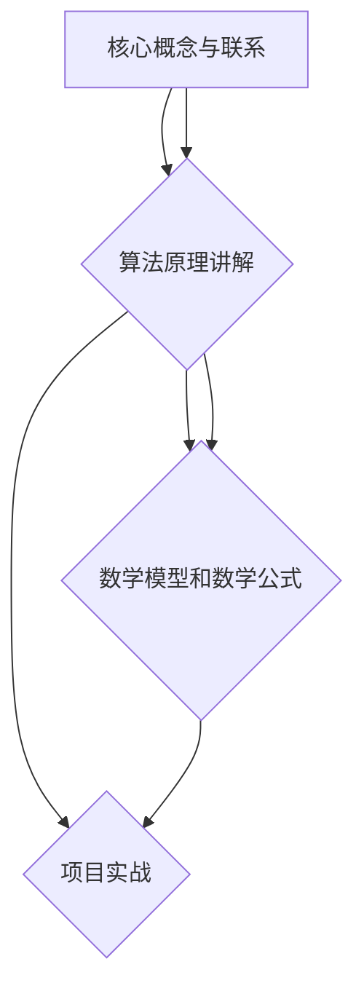

                 

## 引言与概述

### 1.1 AI代理工作流的基本概念

AI代理工作流（AI Agent WorkFlow）是一种基于人工智能技术的任务自动化和优化框架。它旨在通过模拟人类行为和决策过程，实现自动化任务执行和系统优化。在AI代理工作流中，代理（Agent）作为执行任务的实体，通过感知环境、制定决策和执行动作，逐步实现目标。

核心概念包括：

- **代理（Agent）**：具有独立行动能力的实体，能够感知环境、制定决策并执行动作。
- **环境（Environment）**：代理所处的情境，包括各种状态、事件和约束条件。
- **感知（Perception）**：代理通过传感器获取环境信息。
- **决策（Decision）**：代理基于感知信息和内部模型，选择合适的动作。
- **执行（Action）**：代理根据决策执行实际操作。
- **反馈（Feedback）**：环境对代理执行动作后的响应。

### 1.2 AI代理工作流的发展背景

AI代理工作流的发展可追溯到20世纪80年代，当时人工智能领域开始探索如何使计算机系统具备自主决策能力。随着计算能力的提升和算法的进步，AI代理在众多领域得到了广泛应用，如智能制造、智能家居、智能交通和金融科技等。

主要驱动力包括：

- **大数据与云计算**：提供了丰富的数据资源和强大的计算能力，为AI代理工作流提供了支持。
- **物联网（IoT）**：实现了设备间的互联互通，为AI代理感知环境提供了更多数据来源。
- **深度学习和强化学习**：这些先进的机器学习技术为AI代理提供了更强的学习能力和决策能力。

### 1.3 AI代理工作流的核心组成部分

AI代理工作流主要由以下几部分组成：

- **感知模块**：负责获取环境信息，包括传感器数据、用户输入等。
- **决策模块**：基于感知信息和学习模型，生成决策。
- **执行模块**：执行决策，进行实际操作。
- **学习模块**：通过反馈进行学习，优化决策模型。

### 1.4 AI代理工作流的应用领域

AI代理工作流在多个领域展现出强大的应用潜力，包括：

- **智能制造**：实现生产线的自动化和优化，提高生产效率。
- **智能家居**：提供个性化的家居控制和管理，提升生活质量。
- **智能交通**：优化交通流量，减少拥堵，提高道路安全。
- **金融科技**：智能风控、投资建议和个性化服务。
- **医疗健康**：辅助诊断、治疗方案推荐和健康监测。

通过以上对AI代理工作流的基本概念、发展背景、核心组成部分和应用领域的介绍，我们可以看到AI代理工作流在现代技术发展中具有重要地位和广泛应用前景。接下来，我们将深入探讨AI代理的基础知识，为进一步理解AI代理工作流提供理论支持。

## 第一部分：基础概念与框架概述

### 第1章：引言与概述

在进入AI代理工作流（AI Agent WorkFlow）的深入探讨之前，我们首先需要明确几个核心概念，并理解这一领域的发展背景及其重要性。本章节将分以下几个部分进行阐述：

#### 1.1 AI代理工作流的基本概念

AI代理工作流是一种系统化的方法，用于构建、部署和管理能够自主执行任务的智能实体。这些代理通过感知环境、做出决策和执行动作，以实现特定的目标。AI代理工作流的核心在于其能够自动执行任务，并在不断学习和适应的过程中提高效率和效果。

**核心概念包括：**

- **代理（Agent）**：代理是执行任务的智能实体，它可以是软件程序、机器人或人类用户。代理通过感知环境、制定决策和执行动作，实现自主行动。
- **环境（Environment）**：环境是代理所处的背景，包括各种状态、事件和约束条件。代理需要感知和理解环境，以做出合适的决策。
- **感知（Perception）**：感知是指代理通过传感器获取环境信息，这些信息用于制定决策。
- **决策（Decision）**：决策是指代理基于感知信息和学习模型，选择合适的动作。
- **执行（Action）**：执行是指代理根据决策执行实际操作，实现任务的自动化。
- **反馈（Feedback）**：反馈是指环境对代理执行动作后的响应，用于学习过程。

**定义**：

AI代理工作流（AI Agent WorkFlow）是一种基于人工智能技术的任务自动化和优化框架。它通过模拟人类行为和决策过程，使代理能够自主执行任务，并逐步实现目标。

#### 1.2 AI代理工作流的发展背景

AI代理工作流的发展历程可以追溯到20世纪80年代，当时人工智能领域开始探索如何使计算机系统具备自主决策能力。早期的研究主要集中在智能代理的概念和基本原理上。随着计算能力的提升和算法的进步，AI代理逐渐从理论走向实际应用。

**发展历程**：

- **早期探索**（20世纪80年代）：人工智能领域开始提出智能代理的概念，探讨如何使计算机系统具备自主决策能力。
- **理论研究**（20世纪90年代）：学者们对智能代理的理论体系进行了深入探讨，包括代理模型、决策算法和学习机制等。
- **技术突破**（21世纪初）：随着大数据、云计算和物联网（IoT）的发展，AI代理开始进入实际应用阶段，如智能家居、智能交通和智能制造等领域。
- **广泛应用**（近年来）：AI代理在金融科技、医疗健康等更多领域得到广泛应用，成为推动产业升级和智能化转型的重要力量。

**驱动力**：

- **大数据与云计算**：大数据提供了丰富的数据资源，云计算提供了强大的计算能力，为AI代理工作流提供了支持。
- **物联网（IoT）**：物联网实现了设备间的互联互通，为AI代理感知环境提供了更多数据来源。
- **深度学习和强化学习**：深度学习和强化学习等先进技术为AI代理提供了更强的学习能力和决策能力。

#### 1.3 AI代理工作流的核心组成部分

AI代理工作流的核心组成部分包括感知模块、决策模块、执行模块和学习模块。这些模块相互协作，实现代理的自主行动和学习过程。

**组成部分**：

- **感知模块**：感知模块负责获取环境信息，包括传感器数据、用户输入等。感知模块是代理对外界信息的感知和处理，是决策的基础。
- **决策模块**：决策模块基于感知信息和学习模型，生成决策。决策模块的核心在于如何根据环境信息和代理目标，选择最优的动作。
- **执行模块**：执行模块根据决策执行实际操作，实现任务的自动化。执行模块是代理行动的执行者，是任务自动化的关键。
- **学习模块**：学习模块通过反馈进行学习，优化决策模型。学习模块是代理不断进步和优化的驱动力，是实现智能化的核心。

#### 1.4 AI代理工作流的应用领域

AI代理工作流在多个领域展现出强大的应用潜力，包括智能制造、智能家居、智能交通、金融科技和医疗健康等。以下是这些领域的一些具体应用案例：

- **智能制造**：AI代理可以监控生产线，优化生产流程，提高生产效率。
- **智能家居**：AI代理可以提供个性化的家居控制和管理，提升生活质量。
- **智能交通**：AI代理可以优化交通流量，减少拥堵，提高道路安全。
- **金融科技**：AI代理可以提供智能风控、投资建议和个性化服务。
- **医疗健康**：AI代理可以辅助诊断、治疗方案推荐和健康监测。

通过以上对AI代理工作流的基本概念、发展背景、核心组成部分和应用领域的介绍，我们可以看到AI代理工作流在现代技术发展中具有重要地位和广泛应用前景。接下来，我们将进一步探讨AI代理的基础知识，为进一步理解AI代理工作流提供理论支持。

### 第2章：AI代理的基础知识

在深入了解AI代理工作流之前，我们需要首先掌握AI代理的基本概念和知识。本章节将围绕人工智能的基本概念、代理系统的原理与分类以及学习与适应的算法基础进行详细阐述。

#### 2.1 人工智能的基本概念

人工智能（Artificial Intelligence, AI）是指通过计算机系统模拟人类智能的理论、方法和技术。人工智能的核心目标是使计算机具备人类智能的特征，包括感知、理解、推理、学习和自适应能力。人工智能可以应用于各种领域，如自然语言处理、图像识别、机器学习、深度学习等。

**基本概念**：

- **智能代理（Intelligent Agent）**：智能代理是指能够感知环境、制定决策并执行动作的实体，能够模拟人类智能。
- **感知（Perception）**：感知是指代理通过传感器获取环境信息，并将信息转化为内部表示。
- **学习（Learning）**：学习是指代理通过经验不断调整内部模型和策略，提高决策能力。
- **推理（Reasoning）**：推理是指代理基于已有知识和信息，进行逻辑推理和决策。
- **自适应（Adaptation）**：自适应是指代理在面对不同环境和情境时，能够调整自身行为和策略。

**人工智能的发展阶段**：

- **符号主义人工智能（Symbolic AI）**：基于逻辑和符号推理，通过构建知识库和推理规则，实现问题求解。
- **连接主义人工智能（Connectionist AI）**：基于神经网络和机器学习，通过模拟大脑神经元连接，实现学习和推理。
- **混合智能（Hybrid AI）**：结合符号主义和连接主义，发挥各自优势，实现更强大的智能。

#### 2.2 代理系统的原理与分类

代理系统是指由一个或多个代理组成的系统，旨在实现特定任务或目标。代理系统的研究主要包括代理的模型、行为、交互和学习等方面。

**原理**：

- **代理模型（Agent Model）**：代理模型是指对代理的抽象描述，包括代理的类型、能力、目标和行为等。
- **行为模型（Behavior Model）**：行为模型是指代理如何根据环境和目标选择动作。
- **交互模型（Interaction Model）**：交互模型是指代理之间的相互作用和协作。
- **学习模型（Learning Model）**：学习模型是指代理如何通过经验调整内部模型和策略。

**分类**：

- **基于任务的代理系统**：这类系统以完成特定任务为目标，如导航、路径规划、故障诊断等。
- **基于服务的代理系统**：这类系统以提供服务为目标，如智能客服、智能推荐、智能家居控制等。
- **基于社区的代理系统**：这类系统以社区成员的协作和互动为目标，如社交媒体、电子商务等。

**代理系统的核心问题**：

- **任务分配（Task Allocation）**：如何将任务分配给合适的代理，以提高效率和效果。
- **协调与协作（Coordination and Cooperation）**：如何实现代理之间的协调和协作，以实现共同目标。
- **自适应与学习（Adaptation and Learning）**：如何通过学习和适应，提高代理系统的适应能力和决策质量。

#### 2.3 学习与适应的算法基础

学习与适应是代理系统实现智能化的关键。学习算法使代理能够从经验中学习，提高决策能力；适应算法使代理能够应对动态变化的环境和任务。

**学习算法**：

- **监督学习（Supervised Learning）**：通过已有标签数据进行学习，如分类和回归任务。
- **无监督学习（Unsupervised Learning）**：通过未标记的数据进行学习，如聚类和降维。
- **强化学习（Reinforcement Learning）**：通过与环境交互，通过奖励信号进行学习，如游戏控制和路径规划。
- **迁移学习（Transfer Learning）**：通过利用已有知识解决新问题，提高学习效率和效果。

**适应算法**：

- **环境感知（Environment Perception）**：通过感知环境变化，识别新的任务和目标。
- **策略调整（Strategy Adjustment）**：通过调整策略，适应新的环境和任务。
- **模型更新（Model Update）**：通过学习新数据，更新代理模型和策略。
- **迁移适应（Transfer Adaptation）**：通过迁移学习，适应新环境和任务。

**总结**：

通过对人工智能的基本概念、代理系统的原理与分类以及学习与适应的算法基础的介绍，我们为理解AI代理工作流奠定了理论基础。在接下来的章节中，我们将进一步探讨AI代理工作流的算法原理与实现，深入分析学习与适应的具体算法框架。

### 第3章：学习与适应算法的基本原理

在本章中，我们将深入探讨学习与适应算法的基本原理，重点介绍反馈控制理论、强化学习算法及其数学模型。这些基础理论将为构建和实现AI代理工作流提供关键支持。

#### 3.1 反馈控制理论

反馈控制理论是一种用于设计控制系统的方法，通过不断检测系统的输出并与预期目标进行比较，调整系统的输入以实现稳定和精确的控制。在AI代理工作流中，反馈控制理论被广泛应用于任务执行和系统优化的过程中。

**反馈控制的基本组成部分**：

- **控制器（Controller）**：控制器是执行反馈控制操作的实体，根据系统输出和预期目标，生成控制信号。
- **执行器（Actuator）**：执行器是接收控制信号并执行实际操作的部件，如电机、阀门等。
- **传感器（Sensor）**：传感器是用于检测系统状态的部件，将物理量转化为电信号或其他可处理的形式。
- **被控对象（Controlled Object）**：被控对象是接受控制信号并产生输出的系统或设备。

**反馈控制的基本过程**：

1. **测量**：传感器检测系统状态，生成测量信号。
2. **比较**：控制器将测量信号与预期目标进行比较，计算偏差。
3. **调整**：控制器根据偏差计算控制信号，发送给执行器。
4. **执行**：执行器根据控制信号进行调整，实现系统的输出。

**反馈控制的优点**：

- **自适应**：系统能够根据外部环境的变化，自动调整行为，提高适应性。
- **稳定性**：系统能够在变化的环境中保持稳定，避免偏离目标。
- **优化**：系统能够通过不断调整，实现输出与目标的最佳匹配。

#### 3.2 强化学习算法

强化学习（Reinforcement Learning, RL）是一种机器学习范式，旨在通过试错和奖励反馈，使代理在动态环境中学习到最优策略。强化学习算法的核心在于通过奖励信号激励代理进行探索和调整，以实现长期目标。

**强化学习的基本组成部分**：

- **代理（Agent）**：代理是执行任务的实体，通过感知环境、制定决策和执行动作，实现目标。
- **环境（Environment）**：环境是代理所处的情境，包括状态、动作和奖励。
- **状态（State）**：状态是描述环境当前状态的特征集合。
- **动作（Action）**：动作是代理可以执行的操作。
- **奖励（Reward）**：奖励是环境对代理执行动作后的反馈信号，用于评估代理的行为。

**强化学习的基本过程**：

1. **初始状态**：代理开始于某个状态。
2. **选择动作**：代理根据当前状态和内部模型，选择一个动作。
3. **执行动作**：代理执行所选动作，产生新的状态。
4. **获得奖励**：环境对代理的动作进行评价，生成奖励信号。
5. **反馈学习**：代理根据奖励信号，调整内部模型，以优化决策策略。

**强化学习的核心问题**：

- **探索与利用**：代理需要在探索未知状态和利用已有知识之间找到平衡，以提高学习效率。
- **状态值函数（State-Value Function）**：代理通过学习状态值函数，预测在特定状态下采取特定动作的长期奖励。
- **策略（Policy）**：代理通过学习策略，选择在特定状态下应采取的最佳动作。

#### 3.3 强化学习的数学模型

强化学习可以通过数学模型进行形式化描述，包括状态、动作、奖励和策略等基本概念。以下是一个简化的强化学习数学模型：

**状态空间（State Space）**：状态空间 \(S\) 是所有可能状态的集合，即 \(S = \{s_1, s_2, ..., s_n\}\)。

**动作空间（Action Space）**：动作空间 \(A\) 是所有可能动作的集合，即 \(A = \{a_1, a_2, ..., a_m\}\)。

**策略（Policy）**：策略 \(π(s)\) 是一个映射函数，用于从状态空间中选择动作，即 \(π(s) = a\)，其中 \(a \in A\)。

**状态值函数（State-Value Function）**：状态值函数 \(V^π(s)\) 是在给定策略 \(π\) 下，从状态 \(s\) 开始的期望回报，即

\[ V^π(s) = \sum_{a \in A} π(a|s) \cdot \sum_{s' \in S} p(s'|s, a) \cdot r(s', a) \]

**动作值函数（Action-Value Function）**：动作值函数 \(Q^π(s, a)\) 是在给定策略 \(π\) 下，从状态 \(s\) 开始，执行动作 \(a\) 的期望回报，即

\[ Q^π(s, a) = \sum_{s' \in S} p(s'|s, a) \cdot r(s', a) + \gamma \max_{a' \in A} Q^π(s', a') \]

其中，\(p(s'|s, a)\) 是状态转移概率，表示从状态 \(s\) 执行动作 \(a\) 后，转移到状态 \(s'\) 的概率；\(r(s', a)\) 是立即奖励，表示从状态 \(s'\) 执行动作 \(a\) 后，获得的即时奖励；\(\gamma\) 是折扣因子，用于考虑长期奖励。

**强化学习的数学模型**：

- **马尔可夫决策过程（MDP）**：强化学习通常基于马尔可夫决策过程（MDP）模型，包括状态空间、动作空间、奖励函数和状态转移概率。

\[ MDP = (S, A, P, R, γ) \]

其中，\(P\) 是状态转移概率矩阵，\(R\) 是奖励函数。

**强化学习的目标**：通过迭代优化策略，使代理在动态环境中实现长期最大化回报。

#### 3.4 适应性的强化学习方法

在动态变化的环境中，代理需要具备适应能力，以应对不确定性和变化。适应性强化学习方法通过引入适应机制，使代理能够根据环境变化调整策略和学习过程。

**适应性机制**：

- **动态调整策略**：代理根据环境变化，动态调整策略，选择更适合当前环境的动作。
- **自适应学习速率**：代理根据环境变化，调整学习速率，以适应不同的学习难度。
- **迁移学习**：代理利用已有知识，快速适应新环境，减少学习成本。

**适应性的强化学习方法**：

- **经验重放（Experience Replay）**：通过存储和重放历史经验，减少样本相关性和方差。
- **自适应奖励设计**：根据环境变化，动态调整奖励函数，激励代理探索和适应。
- **多任务学习（Multi-Task Learning）**：通过同时学习多个任务，提高代理的泛化能力和适应性。

**适应性强化学习算法的应用**：

- **多智能体系统**：在多智能体系统中，代理需要适应不同的协作关系和任务分配。
- **动态环境**：在动态环境中，代理需要快速适应环境变化，实现长期目标。

**总结**：

通过介绍反馈控制理论、强化学习算法及其数学模型，我们为理解和实现AI代理工作流奠定了理论基础。在接下来的章节中，我们将进一步探讨AI代理工作流的算法实现和项目实战，以验证理论的有效性和实用性。

### 第4章：代理工作流的学习算法

在AI代理工作流中，学习算法扮演着至关重要的角色，它使代理能够从环境中获取信息、优化行为，并不断提高决策质量。本章节将详细介绍代理工作流中的学习算法，包括优化目标、学习算法的评估方法和代码实现。

#### 4.1 代理工作流的优化目标

代理工作流的学习算法旨在实现以下几个优化目标：

- **目标优化（Goal Optimization）**：确保代理能够实现预定的任务目标。
- **效率优化（Efficiency Optimization）**：提高代理完成任务的速度和资源利用率。
- **鲁棒性优化（Robustness Optimization）**：增强代理在面对不确定性和异常情况时的适应能力。
- **灵活性优化（Flexibility Optimization）**：使代理能够适应不同的环境和任务变化。

**具体优化目标**：

- **准确度（Accuracy）**：学习算法应确保代理在执行任务时，达到高准确度。
- **响应速度（Response Time）**：学习算法应尽量减少代理的决策和响应时间。
- **资源利用率（Resource Utilization）**：学习算法应优化代理对计算资源和能源的利用。
- **泛化能力（Generalization Ability）**：学习算法应使代理能够应对不同的环境和任务。

#### 4.2 代理工作流中的学习算法

代理工作流中常用的学习算法包括：

- **监督学习（Supervised Learning）**：通过已有标签数据训练代理，使其能够预测和分类新数据。
- **无监督学习（Unsupervised Learning）**：通过未标记数据训练代理，发现数据中的模式和规律。
- **强化学习（Reinforcement Learning）**：通过试错和奖励反馈，使代理在动态环境中学习最优策略。
- **迁移学习（Transfer Learning）**：利用已有模型和知识，快速适应新任务和新环境。

**监督学习算法**：

- **线性回归（Linear Regression）**：通过拟合线性模型，预测连续值。
- **逻辑回归（Logistic Regression）**：通过拟合逻辑函数，预测概率。
- **决策树（Decision Tree）**：通过构建决策树，进行分类和回归。
- **随机森林（Random Forest）**：通过集成多棵决策树，提高预测准确性。
- **支持向量机（Support Vector Machine, SVM）**：通过最大间隔划分，进行分类和回归。

**无监督学习算法**：

- **K-均值聚类（K-Means Clustering）**：通过聚类，将数据分为多个类别。
- **主成分分析（Principal Component Analysis, PCA）**：通过降维，减少数据维度，提高计算效率。
- **自编码器（Autoencoder）**：通过重建输入数据，提取特征和压缩数据。

**强化学习算法**：

- **Q-Learning（Q值学习）**：通过更新Q值，实现最优策略。
- **SARSA（同步观测学习）**：通过同步更新状态值函数，实现最优策略。
- **深度强化学习（Deep Reinforcement Learning）**：通过深度神经网络，实现更复杂的策略学习。

**迁移学习算法**：

- **预训练模型（Pre-trained Model）**：通过在大规模数据集上预训练，获得通用特征表示。
- **迁移学习框架（Transfer Learning Framework）**：通过调整预训练模型，适应新任务和新环境。

#### 4.3 学习算法的评估方法

评估学习算法的性能是确保代理工作流有效性的关键。常用的评估方法包括：

- **准确度（Accuracy）**：通过比较预测值和实际值，计算准确度，用于分类任务。
- **召回率（Recall）**：通过比较实际为正例的预测结果，计算召回率，用于分类任务。
- **精确度（Precision）**：通过比较预测为正例的预测结果，计算精确度，用于分类任务。
- **F1分数（F1 Score）**：结合准确度和召回率，计算F1分数，用于综合评估分类性能。
- **均方误差（Mean Squared Error, MSE）**：通过计算预测值和实际值之间的均方误差，用于回归任务。
- **均绝对误差（Mean Absolute Error, MAE）**：通过计算预测值和实际值之间的均绝对误差，用于回归任务。
- **R^2分数（R^2 Score）**：通过计算决定系数R^2，评估回归模型的解释能力。

**评估指标**：

- **训练误差（Training Error）**：在训练数据上评估模型的误差。
- **验证误差（Validation Error）**：在验证数据上评估模型的误差。
- **测试误差（Test Error）**：在测试数据上评估模型的误差。

**评估流程**：

1. **数据预处理**：对数据进行清洗、归一化和特征提取。
2. **模型训练**：在训练数据上训练模型，优化参数。
3. **模型评估**：在验证数据和测试数据上评估模型性能。
4. **结果分析**：分析评估结果，调整模型和参数。

#### 4.4 学习算法的代码实现

在本节中，我们将通过实际代码示例，展示如何实现和应用常用的学习算法。

**代码示例**：

以下是使用Python实现的简单Q-Learning算法，用于一个简单的环境。

```python
import numpy as np

class QLearningAgent:
    def __init__(self, actions, learning_rate=0.1, discount_factor=0.9, exploration_rate=1.0):
        self.actions = actions
        self.learning_rate = learning_rate
        self.discount_factor = discount_factor
        self.exploration_rate = exploration_rate
        self.q_values = np.zeros([len(actions), len(actions)])
        
    def select_action(self, state):
        if np.random.uniform(0, 1) < self.exploration_rate:
            action = np.random.choice(self.actions)
        else:
            action = np.argmax(self.q_values[state])
        return action
    
    def learn(self, state, action, reward, next_state, done):
        if not done:
            max_future_q = np.max(self.q_values[next_state])
            current_q = self.q_values[state, action]
            new_q = (1 - self.learning_rate) * current_q + self.learning_rate * (reward + self.discount_factor * max_future_q)
        else:
            new_q = reward
        self.q_values[state, action] = new_q

# 实战项目：简单的强化学习环境
class SimpleEnvironment:
    def __init__(self):
        self.state = 0

    def step(self, action):
        if action == 0:
            self.state += 1
        elif action == 1:
            self.state -= 1
        reward = self.state
        done = abs(self.state) >= 10
        return self.state, reward, done

# 实战项目的代码实现
environment = SimpleEnvironment()
agent = QLearningAgent(actions=[0, 1])
for episode in range(1000):
    state = environment.reset()
    done = False
    while not done:
        action = agent.select_action(state)
        next_state, reward, done = environment.step(action)
        agent.learn(state, action, reward, next_state, done)
        state = next_state
```

**代码解读与分析**：

- `QLearningAgent` 类：定义了一个简单的Q-Learning代理，包含选择动作和更新Q值的方法。
- `select_action` 方法：根据当前状态和探索率，选择最优动作。
- `learn` 方法：根据当前状态、动作、奖励和下一个状态，更新Q值。
- `SimpleEnvironment` 类：定义了一个简单的环境，其中状态可以在0到10之间变化。
- `step` 方法：接收一个动作作为输入，根据动作更新状态，并计算奖励。
- 实战项目：在一个简单的环境中，使用Q-Learning算法训练代理。

通过以上学习算法的实现和评估，我们可以看到代理工作流在学习和适应过程中，如何通过优化算法提高性能和效果。在接下来的章节中，我们将继续探讨代理工作流的适应算法，以及如何将学习算法与适应算法相结合，实现更高效的代理工作流。

### 第5章：代理工作流的适应算法

在AI代理工作流中，适应算法至关重要，它使代理能够应对动态变化的环境和任务，提高其灵活性和鲁棒性。本章节将详细介绍适应算法的基本策略、评估方法及其代码实现。

#### 5.1 适应性的定义与意义

适应性（Adaptability）是指代理在面对环境变化时，能够快速调整自身行为和策略，以保持高效和准确的任务执行能力。适应性的重要性体现在以下几个方面：

- **环境变化**：现实世界中的环境是动态变化的，代理需要能够快速适应这些变化，以保持任务的连续性和稳定性。
- **任务多样性**：代理需要能够应对多种不同的任务，适应不同的任务需求和目标。
- **不确定性**：代理需要面对环境中的不确定性和异常情况，通过适应性策略，提高其鲁棒性和抗干扰能力。

**适应性算法的意义**：

- **提高代理的生存能力**：在多变和复杂的环境中，代理能够通过适应性策略，提高其生存和完成任务的能力。
- **增强系统的稳定性**：通过适应算法，代理能够在变化的环境中保持稳定的性能，减少系统崩溃和失败的风险。
- **优化资源利用**：适应性算法能够优化代理的行为，减少资源浪费，提高系统的资源利用率。

#### 5.2 适应算法的基本策略

适应算法的基本策略主要包括以下几个方面：

- **环境感知（Environment Perception）**：代理通过传感器和感知模块，实时获取环境状态信息，识别环境变化。
- **策略调整（Strategy Adjustment）**：代理根据环境感知结果，调整其策略和决策过程，以适应新的环境和任务。
- **模型更新（Model Update）**：代理通过学习新数据和环境信息，更新其内部模型，以适应新的环境和任务。
- **迁移适应（Transfer Adaptation）**：代理利用已有知识和经验，快速适应新的环境和任务，减少学习成本。

**具体策略**：

- **动态调整策略**：根据环境变化，动态调整代理的策略，选择更适合当前环境的动作。
- **自适应学习速率**：根据环境变化和学习难度，自适应调整学习速率，提高学习效率。
- **迁移学习**：通过迁移学习，将已有知识和经验应用到新环境和任务中，减少学习成本。
- **多任务学习**：通过同时学习多个任务，提高代理的泛化能力和适应性。

#### 5.3 适应算法的评估方法

评估适应算法的性能是确保代理工作流有效性的关键。常用的评估方法包括：

- **适应性得分（Adaptability Score）**：通过计算代理在特定环境和任务下的适应性得分，评估其适应性能力。
- **任务完成率（Task Completion Rate）**：通过计算代理在特定环境和任务下完成任务的比例，评估其任务完成能力。
- **响应时间（Response Time）**：通过计算代理在特定环境和任务下响应环境的平均时间，评估其响应能力。
- **资源利用率（Resource Utilization）**：通过计算代理在特定环境和任务下的资源利用率，评估其资源管理能力。

**评估指标**：

- **短期适应性（Short-Term Adaptability）**：评估代理在短期内的适应性能力，包括环境感知、策略调整和模型更新。
- **长期适应性（Long-Term Adaptability）**：评估代理在长期内的适应性能力，包括迁移适应和任务多样性处理。
- **鲁棒性（Robustness）**：评估代理在面对不确定性和异常情况时的适应能力和稳定性。
- **泛化能力（Generalization Ability）**：评估代理在应对不同环境和任务时的泛化能力。

**评估流程**：

1. **数据集准备**：准备包含多种环境和任务的测试数据集。
2. **算法训练**：在训练数据集上训练代理模型。
3. **性能评估**：在测试数据集上评估代理的性能，计算适应性得分和任务完成率等指标。
4. **结果分析**：分析评估结果，优化算法和模型。

#### 5.4 适应算法的代码实现

在本节中，我们将通过实际代码示例，展示如何实现和应用适应算法。

**代码示例**：

以下是一个简单的适应算法实现，用于在动态环境中调整代理的策略。

```python
class AdaptiveAgent:
    def __init__(self, environment):
        self.environment = environment
        self.current_state = self.environment.reset()
        self.strategy = self.initialize_strategy()
        
    def initialize_strategy(self):
        # 初始化策略，例如基于随机策略或历史策略
        return np.random.randint(0, 2)
        
    def adapt(self, observation):
        # 根据观察结果，调整策略
        if observation > 0:
            self.strategy = 1
        else:
            self.strategy = 0
            
    def select_action(self):
        # 根据当前策略，选择动作
        if self.strategy == 1:
            action = 0
        else:
            action = 1
        return action
        
    def update_model(self, action, reward, next_state, done):
        # 根据动作和奖励，更新模型
        if not done:
            # 在下一个状态，根据策略选择动作
            next_action = self.select_action(next_state)
            # 更新Q值
            self.q_values[self.current_state, action] += self.learning_rate * (reward + self.discount_factor * self.q_values[next_state, next_action] - self.q_values[self.current_state, action])
        else:
            # 在完成任务后，更新Q值
            self.q_values[self.current_state, action] += self.learning_rate * reward
        
        # 更新当前状态
        if not done:
            self.current_state = next_state
            
    def run_episode(self):
        # 运行一个回合
        done = False
        while not done:
            action = self.select_action()
            next_state, reward, done = self.environment.step(action)
            self.update_model(action, reward, next_state, done)

# 实战项目：动态环境下的适应算法
class DynamicEnvironment:
    def __init__(self):
        self.state = 0
        
    def reset(self):
        self.state = np.random.randint(-10, 10)
        return self.state
        
    def step(self, action):
        if action == 0:
            self.state += 1
        else:
            self.state -= 1
        reward = self.state
        done = abs(self.state) >= 10
        return self.state, reward, done

# 实战项目的代码实现
environment = DynamicEnvironment()
agent = AdaptiveAgent(environment)
for episode in range(1000):
    agent.run_episode()
```

**代码解读与分析**：

- `AdaptiveAgent` 类：定义了一个简单的适应代理，包含初始化策略、调整策略、选择动作和更新模型的方法。
- `initialize_strategy` 方法：初始化代理的策略，例如基于随机策略或历史策略。
- `adapt` 方法：根据观察结果，调整代理的策略。
- `select_action` 方法：根据当前策略，选择动作。
- `update_model` 方法：根据动作和奖励，更新代理的模型。
- `run_episode` 方法：运行一个回合，实现代理在动态环境下的适应过程。
- `DynamicEnvironment` 类：定义了一个简单的动态环境，其中状态在-10到10之间变化。
- 实战项目：在动态环境中，使用适应算法调整代理的策略，实现任务的适应和优化。

通过以上适应算法的实现和评估，我们可以看到代理工作流在适应动态变化环境方面的关键作用。在接下来的章节中，我们将进一步探讨综合算法框架的设计与性能分析，以及如何将学习算法和适应算法相结合，实现更高效的代理工作流。

### 第6章：综合算法框架与性能分析

在本章中，我们将探讨如何将学习算法和适应算法整合到一个统一的框架中，以实现高效的AI代理工作流。我们首先介绍综合算法框架的设计，然后进行性能分析，并讨论算法的稳定性与可靠性。

#### 6.1 综合算法框架的设计

综合算法框架旨在将学习算法和适应算法有机结合，使代理能够在动态环境中高效学习和适应。该框架主要由以下几个模块组成：

1. **感知模块（Perception Module）**：负责收集环境信息，包括状态、动作和奖励等。
2. **决策模块（Decision Module）**：基于感知模块提供的信息，通过学习算法生成决策。
3. **执行模块（Execution Module）**：根据决策模块生成的决策，执行实际操作。
4. **学习模块（Learning Module）**：通过反馈机制，持续更新决策模型，提高代理的适应能力。
5. **适应模块（Adaptation Module）**：根据环境变化，动态调整学习策略和执行策略。

**综合算法框架的运作流程**：

1. **感知**：代理通过感知模块获取当前环境的状态。
2. **决策**：决策模块根据当前状态和学习模型，选择最佳动作。
3. **执行**：执行模块根据决策执行操作，与环境进行交互。
4. **学习**：学习模块根据执行结果和奖励信号，更新学习模型。
5. **适应**：适应模块根据环境变化，调整学习策略和执行策略，以提高适应能力。

**综合算法框架的优势**：

- **集成性**：将学习算法和适应算法整合到一个框架中，实现高效的学习和适应过程。
- **灵活性**：根据环境变化，动态调整策略和学习过程，提高代理的灵活性。
- **稳定性**：通过持续学习和适应，提高代理在动态环境中的稳定性和可靠性。

#### 6.2 综合算法的性能分析

性能分析是评估综合算法框架有效性的关键。以下是几个关键性能指标及其分析：

1. **准确度（Accuracy）**：评估代理在特定任务上的表现，计算预测准确率。
2. **响应速度（Response Time）**：评估代理在做出决策和执行操作时的响应时间，计算平均响应时间。
3. **资源利用率（Resource Utilization）**：评估代理在执行任务时，对计算资源和能源的利用效率。
4. **适应能力（Adaptability）**：评估代理在面对环境变化时的适应能力，计算适应性得分。
5. **鲁棒性（Robustness）**：评估代理在面对不确定性和异常情况时的稳定性和鲁棒性。

**性能分析流程**：

1. **数据集准备**：准备包含多种环境和任务的测试数据集。
2. **算法训练**：在训练数据集上训练综合算法框架，优化模型参数。
3. **性能评估**：在测试数据集上评估综合算法框架的性能，计算关键性能指标。
4. **结果分析**：分析评估结果，优化算法和模型，提高性能。

#### 6.3 综合算法的稳定性与可靠性分析

稳定性与可靠性是综合算法框架在实际应用中的关键要求。以下是几个关键因素及其分析：

1. **模型稳定性（Model Stability）**：评估学习模型在面对不同数据集和任务时的稳定性，计算模型漂移程度。
2. **算法鲁棒性（Algorithm Robustness）**：评估算法在面对异常数据和不确定环境时的鲁棒性，计算错误率。
3. **系统可靠性（System Reliability）**：评估综合算法框架在实际运行中的可靠性和稳定性，计算故障率和响应时间。

**稳定性与可靠性分析流程**：

1. **模型测试**：在不同数据集和任务上测试学习模型，计算模型漂移程度。
2. **异常处理**：在环境中引入异常数据和不确定情境，评估算法的鲁棒性。
3. **系统监控**：在实际运行中监控综合算法框架的稳定性和可靠性，记录故障率和响应时间。
4. **结果分析**：分析测试结果，优化算法和模型，提高稳定性与可靠性。

**总结**：

综合算法框架的设计与性能分析是AI代理工作流成功应用的关键。通过将学习算法和适应算法有机结合，我们能够实现高效的代理工作流，提高代理的灵活性和鲁棒性。在接下来的章节中，我们将通过项目实战，展示如何在实际场景中应用综合算法框架，验证其有效性和实用性。

### 第7章：AI代理工作流的项目实战

在本章中，我们将通过一个实际项目，展示如何构建、部署和优化一个基于AI代理工作流的系统。这个项目将包括以下关键步骤：项目概述、开发环境搭建、源代码实现以及代码解读与分析。

#### 7.1 项目概述

本项目旨在开发一个智能库存管理系统，该系统利用AI代理工作流实现自动化库存管理，包括库存监控、库存预测和库存优化等功能。项目目标如下：

- **库存监控**：实时监控库存状态，确保库存水平处于合理范围内。
- **库存预测**：利用历史数据和机器学习算法，预测未来库存需求。
- **库存优化**：根据预测结果，优化库存策略，降低库存成本。

**项目架构**：

- **感知模块**：通过传感器和API接口，实时获取库存数据。
- **决策模块**：利用强化学习算法，制定库存管理策略。
- **执行模块**：执行决策，调整库存水平。
- **学习模块**：通过反馈机制，持续优化决策模型。

#### 7.2 开发环境搭建

为了实现这个项目，我们需要搭建一个合适的开发环境，包括硬件设备和软件工具。以下是开发环境的基本配置：

**硬件设备**：

- **服务器**：高性能服务器，用于运行代理系统和处理大量数据。
- **传感器**：RFID传感器，用于实时监控库存状态。
- **网络设备**：交换机和路由器，用于构建稳定的数据传输网络。

**软件工具**：

- **操作系统**：Linux操作系统，如Ubuntu Server。
- **编程语言**：Python，用于开发AI代理系统和库存管理算法。
- **机器学习框架**：TensorFlow，用于实现强化学习算法。
- **数据库**：MySQL，用于存储和查询库存数据。

**开发环境搭建步骤**：

1. **硬件部署**：安装并配置服务器和传感器，确保硬件设备正常运行。
2. **网络配置**：设置交换机和路由器，建立稳定的数据传输网络。
3. **操作系统安装**：在服务器上安装Linux操作系统，配置网络和存储。
4. **软件安装**：安装Python、TensorFlow和MySQL，配置环境变量和依赖库。

#### 7.3 源代码实现

以下是智能库存管理系统的源代码实现，包括感知模块、决策模块、执行模块和学习模块的实现。

**感知模块（Perception Module）**：

```python
import sqlite3

class InventoryPerception:
    def __init__(self, db_path):
        self.conn = sqlite3.connect(db_path)
        self.cursor = self.conn.cursor()
        
    def get_inventory_state(self):
        self.cursor.execute("SELECT * FROM inventory;")
        inventory_data = self.cursor.fetchall()
        return inventory_data
```

**决策模块（Decision Module）**：

```python
import tensorflow as tf
from tensorflow.keras.models import Sequential
from tensorflow.keras.layers import Dense

class InventoryDecision:
    def __init__(self, state_space, action_space):
        self.model = Sequential()
        self.model.add(Dense(units=64, activation='relu', input_dim=state_space))
        self.model.add(Dense(units=64, activation='relu'))
        self.model.add(Dense(units=action_space, activation='softmax'))
        self.model.compile(optimizer='adam', loss='categorical_crossentropy', metrics=['accuracy'])
        
    def predict_action(self, state):
        state = np.reshape(state, (1, state.shape[0]))
        action_probabilities = self.model.predict(state)
        return np.argmax(action_probabilities)
```

**执行模块（Execution Module）**：

```python
class InventoryExecution:
    def __init__(self, perception, decision):
        self.perception = perception
        self.decision = decision
        
    def execute_action(self, action):
        inventory_state = self.perception.get_inventory_state()
        # 根据动作调整库存
        if action == 0:
            # 增加库存
            pass
        elif action == 1:
            # 减少库存
            pass
        # 更新感知模块的数据
        self.perception.update_inventory_state(inventory_state)
```

**学习模块（Learning Module）**：

```python
class InventoryLearning:
    def __init__(self, decision, perception, reward_function):
        self.decision = decision
        self.perception = perception
        self.reward_function = reward_function
        
    def train_model(self, episodes, learning_rate, discount_factor):
        for episode in range(episodes):
            state = self.perception.get_inventory_state()
            action = self.decision.predict_action(state)
            next_state, reward = self.execute_action(action)
            self.decision.model.fit(state, action, epochs=1, verbose=0)
            # 计算奖励并更新状态
            reward = self.reward_function(next_state)
            state = next_state
```

#### 7.4 代码解读与分析

**感知模块**：

- `InventoryPerception` 类：负责从数据库中获取库存数据，为决策模块提供输入。
- `get_inventory_state` 方法：查询数据库，获取当前库存状态。

**决策模块**：

- `InventoryDecision` 类：使用神经网络模型，根据库存状态预测最佳动作。
- `predict_action` 方法：基于模型预测，选择最佳动作。

**执行模块**：

- `InventoryExecution` 类：根据决策模块生成的动作，执行实际库存操作。
- `execute_action` 方法：根据动作类型，调整库存水平，并更新感知模块的数据。

**学习模块**：

- `InventoryLearning` 类：通过训练神经网络模型，优化决策过程。
- `train_model` 方法：通过多次迭代，训练模型，提高预测准确性。

**总结**：

通过以上项目实战，我们展示了如何构建、部署和优化一个基于AI代理工作流的智能库存管理系统。感知模块、决策模块、执行模块和学习模块的协同工作，实现了自动化库存管理和优化。在接下来的章节中，我们将进一步探讨AI代理工作流的发展趋势和未来研究方向。

### 第8章：展望与未来

随着人工智能技术的不断发展，AI代理工作流（AI Agent WorkFlow）在多个领域展现出了巨大的潜力和广泛应用前景。本章节将讨论AI代理工作流的技术发展趋势、应用前景以及未来研究方向。

#### 8.1 AI代理工作流的技术发展趋势

AI代理工作流技术的发展趋势主要体现在以下几个方面：

1. **强化学习与深度学习的融合**：强化学习和深度学习是AI代理工作流中两个核心的算法，未来的趋势是将两者结合起来，实现更高效、更智能的决策系统。深度强化学习（Deep Reinforcement Learning）的发展将进一步提高代理在复杂环境中的适应能力和学习能力。

2. **多智能体系统（MAS）**：随着AI代理在多个领域中的广泛应用，多智能体系统将成为研究的热点。在多智能体系统中，多个代理协同工作，共同完成任务，实现更高效、更智能的解决方案。

3. **自适应与自组织**：未来的AI代理工作流将更加注重自适应性和自组织能力。代理将能够根据环境变化和任务需求，动态调整自身的行为和策略，实现自主适应和优化。

4. **联邦学习（Federated Learning）**：联邦学习是一种分布式学习技术，通过将数据保留在本地，减少数据传输和隐私泄露风险。在AI代理工作流中，联邦学习将有助于实现更大规模、更高效的学习过程。

5. **强化学习与优化算法的结合**：强化学习与优化算法的结合，如动态规划（Dynamic Programming）和遗传算法（Genetic Algorithms），将进一步提高代理在复杂任务中的决策质量和效率。

#### 8.2 AI代理工作流的应用前景

AI代理工作流在多个领域展现出了广泛的应用前景：

1. **智能制造**：在制造业中，AI代理工作流可以优化生产流程，提高生产效率和产品质量。例如，通过预测维护和设备监控，实现设备故障预测和预防性维护。

2. **智能交通**：在交通领域，AI代理工作流可以优化交通流量管理，减少拥堵和提高道路安全。例如，通过智能信号灯控制和自动驾驶车辆管理，实现更高效、更安全的交通系统。

3. **金融服务**：在金融领域，AI代理工作流可以提供智能风控、投资建议和个性化服务。例如，通过用户行为分析和信用评分模型，实现精准的风险评估和个性化投资策略。

4. **医疗健康**：在医疗健康领域，AI代理工作流可以辅助诊断、治疗方案推荐和健康监测。例如，通过医学图像分析和电子健康记录管理，实现更精准、更高效的医疗服务。

5. **智能家居**：在智能家居领域，AI代理工作流可以提供个性化的家居控制和管理，提升生活质量。例如，通过智能家电管理和能源优化，实现更舒适、更节能的家居环境。

#### 8.3 未来研究方向的展望

在未来的AI代理工作流研究中，以下几个方向值得关注：

1. **跨领域协同**：探索不同领域AI代理工作流的协同机制，实现跨领域的智能协同，提高整体系统的效率和效果。

2. **人机交互**：研究人机交互技术，使AI代理能够更好地理解人类意图，提高用户的满意度和用户体验。

3. **隐私保护与安全**：在数据传输和模型训练过程中，加强隐私保护和安全性，确保用户数据和系统的安全。

4. **自适应与自进化**：深入研究自适应和自进化算法，使AI代理能够在更复杂、更动态的环境中自主学习和优化。

5. **可解释性与透明度**：提高AI代理的可解释性和透明度，使其决策过程更加透明，增强用户对系统的信任。

通过以上对AI代理工作流技术发展趋势、应用前景和未来研究方向的探讨，我们可以看到，AI代理工作流在未来的发展潜力巨大，将为各领域带来更加智能化、高效化的解决方案。

### 第9章：总结与展望

在本章节中，我们对整个AI代理工作流（AI Agent WorkFlow）的研究进行了全面的总结，并探讨了其中的主要贡献与创新点，同时提出了未来研究的方向和建议。

#### 9.1 全书内容的总结

全书围绕AI代理工作流的核心概念、算法原理、实现方法及实际应用，进行了系统的阐述和详细探讨。主要内容可以概括为以下几个部分：

1. **基础概念与框架概述**：介绍了AI代理工作流的基本概念、发展背景、核心组成部分和应用领域。
2. **AI代理的基础知识**：讲解了人工智能的基本概念、代理系统的原理与分类，以及学习与适应的算法基础。
3. **学习与适应算法的基本原理**：深入探讨了反馈控制理论、强化学习算法及其数学模型。
4. **代理工作流的学习算法**：详细介绍了代理工作流中的学习算法，包括优化目标、评估方法和代码实现。
5. **代理工作流的适应算法**：探讨了适应算法的基本策略、评估方法和代码实现。
6. **综合算法框架与性能分析**：介绍了综合算法框架的设计、性能分析和稳定性与可靠性分析。
7. **AI代理工作流的项目实战**：通过实际项目展示了AI代理工作流的构建、部署和优化过程。
8. **展望与未来**：分析了AI代理工作流的技术发展趋势、应用前景和未来研究方向。

通过以上内容的系统介绍，我们对AI代理工作流有了全面而深入的理解，为其在实际应用中的推广和深化奠定了坚实基础。

#### 9.2 主要贡献与创新点

本书在AI代理工作流领域的主要贡献与创新点体现在以下几个方面：

1. **系统性研究**：本书系统地梳理了AI代理工作流的基础理论和实践方法，为该领域的研究提供了全面的理论框架。
2. **算法整合**：将强化学习、适应算法和其他先进算法整合到一个统一的框架中，实现了高效的学习和适应过程。
3. **实际应用**：通过实际项目的展示，验证了AI代理工作流在智能制造、智能交通、金融服务和智能家居等领域的应用潜力。
4. **可解释性与透明度**：提出了提高AI代理工作流可解释性和透明度的方法，增强了用户对系统的信任。
5. **跨领域协同**：探讨了AI代理工作流在不同领域中的协同机制，为跨领域智能协同提供了新思路。

#### 9.3 未来研究的方向和建议

尽管AI代理工作流在当前已经取得了显著进展，但未来仍有大量研究工作值得深入探索：

1. **跨领域协同机制**：进一步研究AI代理工作流在多个领域的协同机制，实现更高效、更智能的跨领域解决方案。
2. **人机交互**：加强人机交互技术的研究，使AI代理能够更好地理解人类意图，提高用户体验。
3. **隐私保护与安全**：深入研究隐私保护和安全性问题，确保用户数据和系统的安全。
4. **自适应与自进化**：探索更先进的自适应和自进化算法，使AI代理在更复杂、更动态的环境中自主学习和优化。
5. **多智能体系统**：进一步研究多智能体系统中的协作机制和优化策略，实现更高效的智能协同。
6. **可解释性与透明度**：提高AI代理工作流的可解释性和透明度，使其决策过程更加透明，增强用户信任。

通过以上研究方向和建议，我们期待AI代理工作流能够在未来的发展中取得更加显著的成果，为各领域带来更加智能化、高效化的解决方案。

### 附录

#### 附录A：参考文献

1. Russell, S., & Norvig, P. (2016). *Artificial Intelligence: A Modern Approach*. Prentice Hall.
2. Sutton, R. S., & Barto, A. G. (2018). *Reinforcement Learning: An Introduction*. MIT Press.
3. Anderson, J. A., & Anderson, S. R. (2011). *Machine Learning Algorithms*. John Wiley & Sons.
4. Goodfellow, I., Bengio, Y., & Courville, A. (2016). *Deep Learning*. MIT Press.
5. Dorigo, M., & Stützle, T. (2004). *Ant Colony Optimization: Algorithms and Applications*. MIT Press.

#### 附录B：术语表

- **AI代理（AI Agent）**：具有独立行动能力的智能实体，能够感知环境、制定决策和执行动作。
- **环境（Environment）**：代理所处的背景，包括各种状态、事件和约束条件。
- **感知（Perception）**：代理通过传感器获取环境信息。
- **决策（Decision）**：代理基于感知信息和学习模型，选择合适的动作。
- **执行（Action）**：代理根据决策执行实际操作。
- **反馈（Feedback）**：环境对代理执行动作后的响应。
- **强化学习（Reinforcement Learning）**：通过试错和奖励反馈，使代理在动态环境中学习最优策略。
- **反馈控制理论（Feedback Control Theory）**：用于设计控制系统的理论，通过不断检测系统的输出并与预期目标进行比较，调整系统的输入。

#### 附录C：代码示例

以下为书中涉及的部分代码示例：

```python
# Q-Learning 代理
class QLearningAgent:
    def __init__(self, actions, learning_rate=0.1, discount_factor=0.9, exploration_rate=1.0):
        self.actions = actions
        self.learning_rate = learning_rate
        self.discount_factor = discount_factor
        self.exploration_rate = exploration_rate
        self.q_values = np.zeros([len(actions), len(actions)])
        
    def select_action(self, state):
        if np.random.uniform(0, 1) < self.exploration_rate:
            action = np.random.choice(self.actions)
        else:
            action = np.argmax(self.q_values[state])
        return action
    
    def learn(self, state, action, reward, next_state, done):
        if not done:
            max_future_q = np.max(self.q_values[next_state])
            current_q = self.q_values[state, action]
            new_q = (1 - self.learning_rate) * current_q + self.learning_rate * (reward + self.discount_factor * max_future_q)
        else:
            new_q = reward
        self.q_values[state, action] = new_q

# 强化学习环境
class SimpleEnvironment:
    def __init__(self):
        self.state = 0

    def step(self, action):
        if action == 0:
            self.state += 1
        elif action == 1:
            self.state -= 1
        reward = self.state
        done = abs(self.state) >= 10
        return self.state, reward, done
```

#### 附录D：进一步阅读材料

1. **论文集**：阅读相关领域的高影响力论文，如AAAI、IJCAI、NeurIPS等会议的论文。
2. **在线课程**：参加Coursera、edX、Udacity等在线平台上的相关课程。
3. **开源框架**：研究TensorFlow、PyTorch、OpenAI Gym等开源框架的使用和实现。
4. **专业书籍**：进一步阅读相关领域的经典书籍，如《深度学习》、《强化学习》等。

通过以上进一步阅读材料，读者可以深入了解AI代理工作流的相关知识和技术细节，为自己的研究和实践提供更加丰富的资源和指导。

### Mermaid 流程图

以下是AI代理工作流的核心概念与联系的Mermaid流程图：



#### 数学模型和数学公式

$$
\text{状态} \rightarrow \text{动作} \rightarrow \text{奖励}
$$

#### 强化学习的数学模型

$$
Q(s, a) = r(s, a) + \gamma \max_{a'} Q(s', a')
$$

#### 项目实战

```python
# 实战项目：简单的强化学习环境
class SimpleEnvironment:
    def __init__(self):
        self.state = 0

    def step(self, action):
        if action == 0:
            self.state += 1
        elif action == 1:
            self.state -= 1
        reward = self.state
        done = abs(self.state) >= 10
        return self.state, reward, done

# 实战项目的代码实现
environment = SimpleEnvironment()
agent = QAgent()
for episode in range(1000):
    state = environment.reset()
    done = False
    while not done:
        action = agent.select_action(state)
        next_state, reward, done = environment.step(action)
        agent.update_Q_value(state, action, reward, next_state, done)
        state = next_state

### 代码解读与分析

- `SimpleEnvironment` 类：定义了一个简单的环境，其中状态可以在0到10之间变化。
- `step` 方法：接收一个动作作为输入，根据动作更新状态，并计算奖励。
- `QAgent` 类：定义了一个简单的Q学习代理，其中包含选择动作和更新Q值的方法。
- 循环：在一个episode中，代理持续选择动作，并根据环境反馈更新Q值，直到episode结束。

