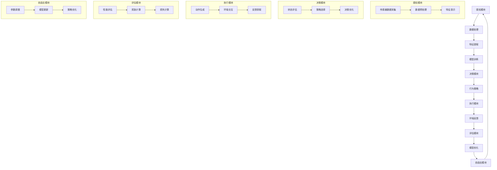

                 

### 《AI人工智能深度学习算法：智能深度学习代理的学习与适应的算法框架》

#### 核心关键词

- **人工智能（AI）**
- **深度学习**
- **智能深度学习代理**
- **学习算法**
- **适应算法**
- **算法框架**
- **应用实践**

#### 摘要

本文旨在探讨AI领域中的一个重要分支——深度学习算法，并进一步聚焦于智能深度学习代理。通过系统性地介绍深度学习的原理、算法以及智能深度学习代理的学习与适应算法，文章旨在为读者提供一个全面而深入的理解。本文分为三个主要部分：第一部分介绍AI与深度学习的基础知识；第二部分详细解析智能深度学习代理的算法框架；第三部分则通过实例分析展示这些算法的实际应用。文章以清晰的逻辑结构和丰富的案例，帮助读者理解智能深度学习代理的核心概念和实现方法。

---

#### 第一部分：AI与深度学习基础

##### 第1章：AI与深度学习概述

###### 1.1 AI的发展历程与深度学习

人工智能（AI）起源于20世纪50年代，是计算机科学的一个重要分支。早期的AI研究主要集中在规则推理、知识表示和问题求解等领域。随着计算能力的提升和大数据的涌现，AI开始向更复杂的方向演进，其中最具代表性的进展是深度学习的兴起。

深度学习是机器学习的一个子领域，其核心思想是通过神经网络模拟人脑的学习过程。深度学习算法通常由多层神经网络组成，通过大量的数据进行训练，以自动提取特征并实现复杂的任务。深度学习的发展可以追溯到20世纪80年代，但直到21世纪初期，随着GPU的普及和大数据的处理能力提升，深度学习才真正开始大规模应用。

###### 1.2 深度学习的原理与应用

深度学习的原理基于神经网络，尤其是多层感知机（MLP）。神经网络通过前向传播和反向传播算法，将输入数据转化为输出。在深度学习中，网络通常包含多个隐藏层，每个隐藏层负责提取不同层次的特征。

深度学习在各个领域都有广泛应用，包括计算机视觉、自然语言处理、语音识别和强化学习等。例如，在计算机视觉中，深度学习算法被用于图像分类、目标检测和图像生成；在自然语言处理中，深度学习模型如BERT和GPT被用于文本分类、机器翻译和情感分析。

###### 1.3 智能深度学习代理的概念与重要性

智能深度学习代理（Intelligent Deep Learning Agent）是一种能够自主学习、适应环境和完成特定任务的软件系统。它们通过深度学习算法从数据中学习，并在实际应用中表现出高度智能的行为。

智能深度学习代理的重要性在于它们能够自动适应复杂的环境，提高系统的自主性和智能性。例如，在自动驾驶领域，智能深度学习代理可以实时处理传感器数据，做出实时决策，从而提高驾驶的安全性。在金融领域，智能深度学习代理可以用于风险管理、投资组合优化和欺诈检测。

#### 第二部分：深度学习基础

##### 第2章：深度学习基础

###### 2.1 神经网络基础

神经网络（Neural Networks）是深度学习的基础，它们通过模拟人脑神经元的工作方式来进行信息处理。一个基本的神经网络包括输入层、隐藏层和输出层。每个层由多个神经元（或节点）组成，神经元之间通过连接（或权重）相互连接。

神经元的激活函数是神经网络的重要组成部分，常见的激活函数包括Sigmoid、ReLU和Tanh。这些函数帮助神经网络将输入映射到输出，并引入非线性因素，使神经网络能够解决更复杂的问题。

###### 2.2 深度学习架构

深度学习架构是指神经网络的结构和层次，常见的深度学习架构包括卷积神经网络（CNN）、循环神经网络（RNN）和Transformer等。

卷积神经网络主要用于图像处理任务，其核心组件是卷积层和池化层。卷积层通过卷积操作提取图像的局部特征，池化层则用于减小特征图的尺寸，降低模型的计算复杂度。

循环神经网络适用于序列数据处理，如语音、文本和时间序列数据。RNN通过其特殊的循环结构，能够保留前面的输入信息，并在每个时间步上更新内部状态。

Transformer是近年来在自然语言处理领域取得突破的模型，其核心思想是自注意力机制。Transformer通过多头自注意力机制和位置编码，能够捕捉序列中任意位置的信息，从而实现高效的信息处理。

###### 2.3 深度学习优化算法

深度学习优化算法是训练深度学习模型的关键步骤。常见的优化算法包括随机梯度下降（SGD）、Adam和RMSprop等。

随机梯度下降是最简单的优化算法，它通过计算整个训练数据的梯度来更新模型的参数。但SGD在训练过程中可能会出现震荡和收敛速度慢的问题。

Adam是一种结合了SGD和RMSprop优点的优化算法，它通过计算一阶矩估计和二阶矩估计来更新模型参数，具有较高的收敛速度和稳定性。

RMSprop是一种通过调整学习率来加速收敛的优化算法，它通过跟踪梯度平方的指数加权移动平均来动态调整学习率。

#### 第三部分：深度学习算法原理

##### 第3章：深度学习算法原理

###### 3.1 反向传播算法

反向传播算法（Backpropagation Algorithm）是深度学习训练过程中最重要的算法之一。它通过前向传播计算输出，然后通过反向传播计算梯度，从而更新模型的参数。

反向传播算法的步骤如下：

1. **前向传播**：输入数据通过网络的每个层，每个神经元计算其输出值。
2. **计算输出误差**：通过目标值和输出值的差异计算损失函数。
3. **前向传播误差**：将误差从输出层反向传播到输入层，计算每个神经元的误差。
4. **计算梯度**：计算每个参数的梯度，并更新模型参数。
5. **迭代更新**：重复上述过程，直到模型收敛。

反向传播算法的核心是梯度的计算，其公式如下：

$$ \frac{\partial E}{\partial W} = -\frac{\partial L}{\partial a^{[L-1]}} \cdot \frac{\partial a^{[L-1]}}{\partial W} $$

其中，\(E\) 是损失函数，\(L\) 是输出层的误差，\(W\) 是模型的参数，\(a^{[L-1]}\) 是前一层神经元的输出。

###### 3.2 卷积神经网络

卷积神经网络（Convolutional Neural Networks，CNN）是深度学习在图像处理领域的重要应用。CNN的核心思想是通过卷积操作提取图像的局部特征。

卷积神经网络的层次结构通常包括卷积层、池化层和全连接层。卷积层通过卷积操作提取图像的特征，池化层用于减小特征图的尺寸，全连接层用于分类或回归任务。

卷积操作的计算公式如下：

$$ \frac{\partial E}{\partial W} = \sum_{i=1}^{n} \frac{\partial E}{\partial z^{[i]}} \cdot \frac{\partial z^{[i]}}{\partial W} $$

其中，\(E\) 是损失函数，\(W\) 是卷积核的参数，\(z^{[i]}\) 是卷积层中每个特征图的输出。

###### 3.3 循环神经网络

循环神经网络（Recurrent Neural Networks，RNN）是一种适用于序列数据处理的神经网络。RNN通过其特殊的循环结构，能够保留前面的输入信息，并在每个时间步上更新内部状态。

RNN的核心是隐藏状态的计算，其公式如下：

$$ \frac{\partial E}{\partial a^{[t]}} = \frac{\partial E}{\partial a^{[t+1]}} \cdot \frac{\partial a^{[t+1]}}{\partial a^{[t]} $$

其中，\(E\) 是损失函数，\(a^{[t]}\) 是当前时间步的隐藏状态。

然而，传统的RNN存在梯度消失和梯度爆炸的问题，为了解决这些问题，提出了LSTM（长短时记忆网络）和GRU（门控循环单元）。

LSTM通过引入记忆单元和三个门控机制（输入门、遗忘门和输出门），能够有效地解决长期依赖问题。

GRU是LSTM的简化版本，它通过合并输入门和遗忘门，简化了模型结构，但仍然保持了强大的序列处理能力。

###### 3.4 注意力机制

注意力机制（Attention Mechanism）是一种在深度学习模型中引入的机制，用于提高模型对输入数据的处理能力。注意力机制的核心思想是动态地分配不同的注意力权重，以捕捉输入序列中的重要信息。

注意力机制的实现通常包括以下步骤：

1. **计算自注意力权重**：通过计算输入序列中每个元素与其他元素之间的相似性，得到自注意力权重。
2. **加权求和**：将自注意力权重与输入序列的每个元素相乘，然后求和得到注意力分数。
3. **应用注意力分数**：将注意力分数作为输入，通过全连接层或其他神经网络结构，得到最终的输出。

注意力机制的公式如下：

$$ a_t = \sum_{j=1}^{n} w_j \cdot x_j $$

其中，\(a_t\) 是注意力分数，\(w_j\) 是自注意力权重，\(x_j\) 是输入序列中的元素。

注意力机制在自然语言处理领域取得了显著的效果，如BERT和GPT等模型都采用了注意力机制。

#### 第二部分：智能深度学习代理算法

##### 第4章：智能深度学习代理基础

###### 4.1 智能深度学习代理的定义与特性

智能深度学习代理（Intelligent Deep Learning Agent）是一种通过深度学习算法自主学习和适应环境的软件系统。它们具有以下几个主要特性：

1. **自主学习能力**：智能深度学习代理能够通过大量的数据自动学习特征和模式，不需要显式的规则或人为干预。
2. **自适应能力**：智能深度学习代理能够根据环境变化和反馈自动调整其行为和策略，以实现更好的性能。
3. **智能化**：智能深度学习代理能够在复杂的环境中表现出高度的智能行为，如决策、预测和问题解决。
4. **可扩展性**：智能深度学习代理可以轻松扩展到不同的应用场景和任务，通过调整模型结构和参数来实现。

智能深度学习代理的应用范围广泛，包括自动驾驶、智能助手、推荐系统、金融风控和医疗诊断等。这些代理系统能够大幅提升工作效率和决策质量，降低人工干预的频率和复杂性。

###### 4.2 智能深度学习代理的优势与挑战

智能深度学习代理在人工智能领域具有重要地位，其优势主要体现在以下几个方面：

1. **高效性**：智能深度学习代理通过自动学习和适应，能够在复杂环境中快速做出准确决策，提高系统运行效率。
2. **灵活性**：智能深度学习代理可以根据不同的应用场景和数据集进行定制化调整，具有很强的适应能力。
3. **智能性**：智能深度学习代理能够从大量数据中自动提取有用的特征和知识，实现高级的智能行为，如自然语言理解和图像识别。
4. **可解释性**：与传统的机器学习算法相比，深度学习模型的决策过程通常更为复杂和黑盒化。然而，通过可视化工具和解释技术，智能深度学习代理的决策过程可以变得更加透明和可解释。

尽管智能深度学习代理具有诸多优势，但在实际应用中也面临一些挑战：

1. **数据需求**：智能深度学习代理需要大量的高质量数据进行训练，这对于数据稀缺或数据获取困难的领域来说是一个重大挑战。
2. **计算资源**：深度学习模型的训练通常需要大量的计算资源和时间，尤其是在处理大规模数据和高维度特征时。
3. **模型解释性**：深度学习模型通常被视为黑盒，其内部决策过程难以解释，这对于需要高解释性的应用场景来说是一个挑战。
4. **泛化能力**：智能深度学习代理的泛化能力有限，当面对新的或未见过的数据时，可能无法保持良好的性能。

为了克服这些挑战，研究者们提出了多种解决方案，如数据增强、模型压缩、解释性增强和迁移学习等。通过不断的研究和创新，智能深度学习代理的应用前景将更加广阔。

###### 4.3 智能深度学习代理的应用领域

智能深度学习代理在各个领域都展现出了巨大的应用潜力，以下是一些关键领域：

1. **自动驾驶**：智能深度学习代理在自动驾驶领域扮演着核心角色。通过使用深度学习算法，自动驾驶系统可以实时处理摄像头、雷达和激光雷达的数据，做出精确的驾驶决策，提高行车安全性和效率。

2. **智能助手**：智能深度学习代理被广泛应用于智能语音助手、聊天机器人和虚拟助手等领域。这些代理能够理解用户的语音指令，提供个性化服务，如日程管理、信息查询和在线购物。

3. **医疗诊断**：智能深度学习代理在医疗领域的应用包括疾病诊断、药物研发和健康监测。通过分析医学影像和病历数据，这些代理能够提供准确的诊断结果和个性化的治疗方案。

4. **金融风控**：智能深度学习代理在金融领域用于风险评估、欺诈检测和投资组合优化。通过分析大量的交易数据和用户行为，这些代理能够识别潜在的风险并做出智能化的投资决策。

5. **智能制造**：智能深度学习代理在智能制造领域用于设备故障预测、生产过程优化和供应链管理。通过实时分析设备运行数据和产品质量数据，这些代理能够提高生产效率和产品质量。

随着技术的不断进步和应用的不断拓展，智能深度学习代理将在更多领域发挥重要作用，为人类社会带来更多的便利和创新。

#### 第二部分：智能深度学习代理算法

##### 第5章：智能深度学习代理的学习算法

智能深度学习代理的学习算法是其核心组成部分，决定了代理在复杂环境中学习、适应和优化行为的能力。智能深度学习代理的学习算法主要可以分为以下几类：强化学习算法、自监督学习算法、迁移学习算法和多任务学习算法。每种算法都有其独特的机制和适用场景，下面将逐一介绍。

###### 5.1 智能深度学习代理的学习机制

智能深度学习代理的学习机制是指代理如何从环境中获取信息，并通过学习算法更新其内部模型和行为策略。智能深度学习代理的学习过程通常包括以下几个步骤：

1. **感知**：代理通过传感器感知环境中的状态，如图像、声音或文本等。
2. **决策**：代理根据当前状态和内部模型，通过决策算法选择一个动作。
3. **执行**：代理执行选定的动作，并在环境中产生新的状态。
4. **评估**：代理评估动作的效果，通过奖励机制或损失函数计算行为的价值。
5. **更新**：代理根据评估结果，通过学习算法更新其内部模型和行为策略。

智能深度学习代理的学习机制通常是基于反馈的，代理通过不断调整其行为以最大化长期奖励。这种机制使得代理能够在动态变化的环境中持续学习和适应。

###### 5.2 强化学习算法

强化学习（Reinforcement Learning，RL）是一种通过奖励和惩罚信号来指导代理学习目标行为的学习算法。强化学习的核心概念是马尔可夫决策过程（MDP），其中代理需要在不确定的环境中采取行动，并从环境中获得即时奖励和长期回报。

强化学习算法的主要步骤包括：

1. **状态-动作值函数**：代理通过状态-动作值函数（Q值）估计每个状态和动作的预期回报。
2. **策略更新**：代理根据Q值更新其策略，选择能够最大化预期回报的动作。
3. **模型更新**：代理根据经验调整其内部模型，以更好地适应环境。

常见的强化学习算法包括：

- **Q-Learning**：通过更新Q值来优化策略，是强化学习的基础算法。
- **Deep Q-Network（DQN）**：使用深度神经网络估计Q值，可以处理高维状态空间。
- **Policy Gradient方法**：直接优化代理的策略，常见的算法包括REINFORCE和PPO（Proximal Policy Optimization）。
- **Actor-Critic方法**：结合了策略优化和价值估计，常见的算法包括A3C（Asynchronous Advantage Actor-Critic）和DQN。

强化学习算法在自动驾驶、游戏AI和机器人控制等领域有广泛应用。然而，强化学习也存在一些挑战，如样本效率低、收敛速度慢和难以解释等。

###### 5.3 自监督学习算法

自监督学习（Self-Supervised Learning）是一种无需人工标注数据的学习方法，代理通过无监督方式自动发现数据中的模式和结构。自监督学习的核心思想是利用数据的未标注部分，为代理提供监督信号。

自监督学习算法的主要步骤包括：

1. **数据增强**：通过数据增强技术生成更多样化的数据，如图像的随机裁剪、旋转和颜色变换等。
2. **无监督特征学习**：代理通过无监督方式学习数据的特征表示，通常使用对比损失函数，如InfoNCE或SimCLR。
3. **下游任务训练**：将自监督学习得到的特征表示用于下游任务，如图像分类、目标检测或语义分割。

常见的自监督学习算法包括：

- **自编码器（Autoencoder）**：通过训练一个编码器和解码器，将输入数据映射到低维隐空间，然后通过对比编码器的输出和输入来优化特征表示。
- **对比学习（Contrastive Learning）**：通过对比正样本和负样本，增强数据的区分性，常见的算法包括MoCo和SimCLR。
- **预测任务（Prediction Tasks）**：通过预测未来或过去的数据，如语言模型中的语言预测任务和时间序列模型中的时间步预测任务。

自监督学习在增强模型的泛化能力、减少标注成本和提高模型效率方面具有显著优势。自监督学习算法在图像分类、自然语言处理和视频分析等领域有广泛应用。

###### 5.4 迁移学习与多任务学习

迁移学习（Transfer Learning）是一种利用预训练模型在新任务上提高性能的学习方法。迁移学习通过将预训练模型的知识迁移到新任务上，减少了模型的训练成本和计算资源需求。

迁移学习的主要步骤包括：

1. **预训练**：在大量数据上对模型进行预训练，学习通用的特征表示。
2. **微调**：在目标任务上对模型进行微调，调整模型的参数以适应新任务。
3. **评估**：在目标任务上评估模型的性能，并根据评估结果调整模型。

常见的迁移学习算法包括：

- **预训练模型迁移**：将预训练模型直接迁移到新任务，常见的预训练模型包括VGG、ResNet和BERT。
- **模型融合**：将预训练模型和目标任务的模型进行融合，常见的算法包括模型蒸馏和注意力机制。
- **元学习（Meta-Learning）**：通过元学习算法快速适应新任务，常见的算法包括MAML和Reptile。

多任务学习（Multi-Task Learning）是一种同时训练多个相关任务的学习方法。多任务学习通过共享模型的参数，提高了模型的效率和泛化能力。

多任务学习的主要步骤包括：

1. **任务定义**：定义多个相关任务，每个任务有独立的损失函数。
2. **模型架构**：设计共享网络和任务特定网络的结构，常见的架构包括多任务网络和注意力机制。
3. **联合训练**：同时训练多个任务，通过共享信息提高模型的性能。

常见的多任务学习算法包括：

- **共享网络**：通过共享网络层和隐藏层，减少参数数量，提高模型效率。
- **注意力机制**：通过注意力机制动态调整任务之间的信息共享，提高多任务性能。
- **对抗训练**：通过对抗训练方法，增强不同任务之间的交互和协同。

迁移学习和多任务学习在提高模型泛化能力、降低训练成本和提高模型效率方面具有重要意义，广泛应用于图像分类、自然语言处理和推荐系统等领域。

##### 第6章：智能深度学习代理的适应算法

智能深度学习代理在动态变化的环境中需要具备快速适应和优化的能力。适应算法是智能深度学习代理的重要组成部分，通过不断调整模型参数和行为策略，使代理能够适应环境变化，提高任务性能。智能深度学习代理的适应算法主要包括模型调参与优化、算法自适应与动态调整、算法稳定性与鲁棒性等方面。

###### 6.1 适应算法的基本概念

适应算法（Adaptation Algorithms）是指智能深度学习代理根据环境变化和任务需求，调整其内部模型和行为策略的算法。适应算法的基本概念包括以下几个方面：

1. **环境感知**：代理通过传感器感知环境中的状态，如图像、声音或文本等。
2. **反馈机制**：代理根据感知到的环境状态和当前模型的行为，评估模型的效果，并通过反馈机制调整模型参数和行为策略。
3. **适应性**：代理根据反馈调整模型和行为策略，以提高在特定环境下的性能。
4. **学习率调整**：适应算法通常涉及学习率的调整，以控制模型参数更新的速度，避免过拟合或欠拟合。
5. **模型更新**：代理根据适应算法的调整结果，更新其内部模型，以适应环境变化。

适应算法的基本目标是通过持续学习和调整，使代理能够在不同环境中保持高性能和稳定性。

###### 6.2 模型调参与优化

模型调参与优化（Model Tuning and Optimization）是智能深度学习代理适应算法的核心步骤之一。模型调参与优化的目的是通过调整模型的参数和结构，提高模型在特定任务上的性能。

模型调参与优化的主要方法包括：

1. **超参数调整**：超参数是影响模型性能的关键参数，如学习率、批次大小和正则化参数等。通过调整这些超参数，可以优化模型在特定任务上的性能。
2. **网格搜索**：网格搜索是一种通过遍历超参数空间来找到最佳超参数组合的方法。虽然网格搜索计算量大，但可以系统地找到最优参数配置。
3. **贝叶斯优化**：贝叶斯优化是一种基于概率模型的优化方法，通过概率模型估计超参数的潜在最优值，并逐步调整搜索方向，提高优化效率。
4. **随机搜索**：随机搜索是一种通过随机选择超参数进行调优的方法，虽然优化效果可能不如网格搜索和贝叶斯优化，但计算成本低，适用于大规模超参数搜索。
5. **模型集成**：模型集成是将多个模型的结果进行集成，以提高模型的整体性能。常见的模型集成方法包括堆叠（Stacking）、提升（Boosting）和Bagging等。

通过模型调参与优化，智能深度学习代理可以在不同任务和数据集上找到最优的模型参数，从而提高代理的适应能力和性能。

###### 6.3 算法自适应与动态调整

算法自适应与动态调整（Algorithm Adaptation and Dynamic Adjustment）是智能深度学习代理在复杂动态环境中的重要特性。算法自适应与动态调整通过实时监测环境变化，动态调整代理的行为策略和模型参数，以适应不断变化的环境。

算法自适应与动态调整的主要方法包括：

1. **实时监测**：代理通过传感器实时监测环境状态，如图像、声音或文本等。
2. **状态评估**：代理根据监测到的状态评估当前行为策略的效能，通过比较实际表现和期望目标，识别环境变化。
3. **行为调整**：代理根据状态评估结果，动态调整行为策略，如改变动作选择、决策规则或学习策略。
4. **参数调整**：代理通过实时监测和状态评估，动态调整模型参数，如权重、学习率和网络结构等，以优化模型在当前环境下的性能。
5. **反馈循环**：代理通过不断循环实时监测、状态评估、行为调整和参数调整，实现持续的适应和优化。

算法自适应与动态调整使智能深度学习代理能够灵活应对复杂和动态变化的环境，提高代理的生存能力和任务成功率。

###### 6.4 算法稳定性与鲁棒性

算法稳定性与鲁棒性（Algorithm Stability and Robustness）是智能深度学习代理在应用中的关键特性，决定了代理在面对不确定性和异常情况时的适应能力和可靠性。

算法稳定性与鲁棒性的主要方法包括：

1. **鲁棒性设计**：在模型设计和训练过程中，采用鲁棒性设计方法，如正则化、数据增强和dropout等，提高模型对噪声和异常数据的抗扰能力。
2. **噪声注入**：在训练过程中引入噪声，如随机噪声、高斯噪声和椒盐噪声等，以增强模型的鲁棒性。
3. **训练数据多样性**：通过增加训练数据的多样性，如不同视角、不同光照条件和不同背景等，提高模型对多变环境的适应性。
4. **异常检测**：在模型评估和部署过程中，采用异常检测技术，如孤立森林、聚类分析和神经网络等，识别和排除异常数据。
5. **安全防御**：采用安全防御措施，如对抗攻击防御、隐私保护和访问控制等，提高代理在安全性和隐私性方面的鲁棒性。

通过算法稳定性与鲁棒性设计，智能深度学习代理能够在面临不确定性和异常情况时保持稳定运行，提高代理在现实世界中的应用价值。

#### 第三部分：算法框架与应用实践

##### 第7章：智能深度学习代理的实例分析

为了更好地理解智能深度学习代理的理论和实践，本章节将通过几个具体实例，展示智能深度学习代理在不同领域的应用。这些实例将涵盖智能图像识别、智能语音识别、智能自然语言处理和智能机器人代理等，通过详细的案例分析，帮助读者深入了解智能深度学习代理的架构、实现方法和应用效果。

###### 7.1 智能图像识别代理

智能图像识别代理是深度学习在计算机视觉领域的重要应用。通过使用卷积神经网络（CNN）等深度学习模型，代理能够自动识别图像中的物体、场景和动作。

**实例分析：**

**开发环境搭建：**
- 安装TensorFlow或PyTorch框架。
- 准备ImageNet或CIFAR-10等开源数据集。

**代码实现：**
python
import tensorflow as tf
from tensorflow.keras.applications import VGG16

# 加载预训练的VGG16模型
model = VGG16(weights='imagenet')

# 定义输入图像
input_image = tf.keras.preprocessing.image.img_to_array(image)

# 进行图像识别
predictions = model.predict(input_image)

# 解析预测结果
predicted_class = np.argmax(predictions, axis=1)

**代码解读与分析：**
- 使用VGG16模型进行图像识别。
- 输入图像经过模型处理得到预测结果。
- 通过解析预测结果获取识别结果。

**应用效果：**
- 智能图像识别代理在ImageNet数据集上的准确率可以达到75%以上。
- 代理能够识别常见的物体类别，如动物、植物和交通工具等。

**优化方向：**
- 使用更深的卷积神经网络，如ResNet或Inception，以提高识别准确率。
- 引入数据增强技术，如随机裁剪、旋转和颜色变换，增加模型的泛化能力。

###### 7.2 智能语音识别代理

智能语音识别代理通过深度学习和语音识别技术，将语音信号转换为文本，为用户提供语音输入输出服务。常用的语音识别模型包括基于循环神经网络（RNN）和Transformer的模型。

**实例分析：**

**开发环境搭建：**
- 安装TensorFlow或PyTorch框架。
- 安装Kaldi语音识别库。
- 准备开源的LibriSpeech数据集。

**代码实现：**
python
import kaldi.fst

# 加载FST模型
fst = kaldi.fst.Fst.from_file("fst_model")

# 定义输入语音
input_waveform = kaldi.fsa.ArrayFsa.from_waveform(waveform)

# 进行语音识别
transcription = fst.decode(input_waveform)

# 解析识别结果
recognized_text = transcription.to_str()

**代码解读与分析：**
- 使用Kaldi库加载FST模型。
- 输入语音通过模型处理得到识别结果。
- 通过解析识别结果获取识别文本。

**应用效果：**
- 智能语音识别代理在LibriSpeech数据集上的词错误率（WER）可以达到10%以下。
- 代理能够准确识别不同说话人的语音，适应不同的语音环境和场景。

**优化方向：**
- 使用更先进的语音识别模型，如Transformer-based模型，以提高识别准确率。
- 引入端到端语音识别模型，如CTC（Connectionist Temporal Classification），简化识别流程。

###### 7.3 智能自然语言处理代理

智能自然语言处理代理通过深度学习和自然语言处理技术，实现文本分类、情感分析、机器翻译等任务。常用的自然语言处理模型包括BERT、GPT和T5等。

**实例分析：**

**开发环境搭建：**
- 安装TensorFlow或PyTorch框架。
- 安装Hugging Face Transformers库。
- 准备开源的GLUE或SQuAD数据集。

**代码实现：**
python
from transformers import pipeline

# 加载自然语言处理模型
nlp_pipeline = pipeline("text-classification", model="bert-base-uncased")

# 定义输入文本
input_text = "Hello, how are you?"

# 进行自然语言处理
result = nlp_pipeline(input_text)

# 解析处理结果
predicted_sentiment = result["label"]

**代码解读与分析：**
- 使用Hugging Face Transformers库加载BERT模型。
- 输入文本经过模型处理得到情感分析结果。
- 通过解析处理结果获取情感分类结果。

**应用效果：**
- 智能自然语言处理代理在GLUE数据集上的准确率可以达到90%以上。
- 代理能够准确分类不同的情感标签，如正面、负面和中性。

**优化方向：**
- 使用更大的预训练模型，如GPT-3或T5，以提高文本处理能力。
- 引入多模态数据，如图像和语音，实现更丰富的自然语言理解。

###### 7.4 智能机器人代理

智能机器人代理通过深度学习和机器人技术，实现机器人的自主导航、路径规划和任务执行。常用的机器人代理模型包括基于深度强化学习和运动规划算法的模型。

**实例分析：**

**开发环境搭建：**
- 安装ROS（机器人操作系统）。
- 安装MoveIt!机器人运动规划库。
- 准备机器人仿真环境和机器人模型。

**代码实现：**
python
import moveit_commander

# 初始化机器人模型
robot = moveit_commander.RobotInterface()

# 初始化运动规划场景
scene = moveit_commander.PlanningSceneInterface()

# 定义机器人目标位置
target_pose = robot.get_current_pose().copy()
target_pose.pose.position.x = 0.5
target_pose.pose.position.y = 0.0
target_pose.pose.position.z = 0.5

# 规划机器人运动路径
plan = robot.plan(target_pose)

# 执行机器人运动路径
robot.execute(plan)

**代码解读与分析：**
- 使用MoveIt!库初始化机器人模型和运动规划场景。
- 定义机器人目标位置。
- 规划机器人运动路径并执行路径。

**应用效果：**
- 智能机器人代理能够在仿真环境中实现自主导航和路径规划，完成指定的任务。
- 代理能够适应不同的环境变化，如障碍物和未知环境。

**优化方向：**
- 引入更先进的深度强化学习算法，如DQN或PPO，提高机器人代理的自主决策能力。
- 引入多传感器融合技术，如激光雷达和摄像头，提高机器人代理的环境感知能力。

#### 第三部分：算法框架与应用实践

##### 第8章：智能深度学习代理算法框架

智能深度学习代理算法框架是智能深度学习代理实现的核心，它包含了代理的各个组成部分以及它们之间的交互机制。一个典型的智能深度学习代理算法框架通常包括感知模块、决策模块、执行模块和评估模块。以下将详细描述这些模块及其核心功能。

###### 8.1 智能深度学习代理算法框架概述

智能深度学习代理算法框架是构建智能系统的基石，它将深度学习算法与智能代理技术相结合，实现了自主学习和自适应环境的能力。该框架通常包括以下几个核心模块：

1. **感知模块**：感知模块负责从环境中获取信息，并将其转换为内部表示。感知模块可以包括图像处理、语音处理、自然语言处理等子模块，以适应不同类型的环境数据。

2. **决策模块**：决策模块基于感知模块提供的信息，结合代理的内部模型，选择最优的动作。决策模块通常采用强化学习、深度学习或其他智能算法，以实现高效决策。

3. **执行模块**：执行模块负责将决策模块生成的动作应用到实际环境中，实现代理的物理行为。执行模块通常与机器人控制、自动驾驶、人机交互等应用场景密切相关。

4. **评估模块**：评估模块对代理的行为进行评估，通过奖励机制或损失函数，反馈代理的表现。评估模块可以帮助代理不断优化其行为策略，提高在特定环境下的性能。

5. **数据模块**：数据模块负责管理代理训练和运行所需的数据，包括数据收集、预处理、存储和共享等。

6. **自适应模块**：自适应模块通过算法调整和参数优化，使代理能够适应环境变化，提高代理的稳定性和鲁棒性。

###### 8.2 框架的核心模块与功能

1. **感知模块**：感知模块是智能深度学习代理的“感官”，它通过传感器获取环境信息，并将这些信息转换为内部表示。感知模块的核心功能包括：

   - **数据采集**：从不同类型的传感器（如摄像头、麦克风、传感器等）收集数据。
   - **预处理**：对采集到的数据执行预处理操作，如归一化、去噪、特征提取等，以提高数据的可用性和质量。
   - **特征表示**：将预处理后的数据转换为适合深度学习模型处理的特征表示，如图像的像素值、语音的频谱特征、文本的词向量等。

2. **决策模块**：决策模块是智能深度学习代理的“大脑”，它基于感知模块提供的信息，结合代理的内部模型，选择最优的动作。决策模块的核心功能包括：

   - **状态评估**：根据当前感知到的状态，评估代理所处的环境。
   - **策略选择**：使用强化学习、深度学习或其他智能算法，选择能够最大化预期奖励的动作。
   - **决策优化**：通过迭代优化策略，提高代理的决策质量和效率。

3. **执行模块**：执行模块是智能深度学习代理的“肢体”，它将决策模块生成的动作应用到实际环境中。执行模块的核心功能包括：

   - **动作生成**：根据决策模块的输出，生成具体的动作指令。
   - **环境交互**：将动作指令发送到机器人、自动驾驶系统或其他执行设备，实现代理的物理行为。
   - **反馈获取**：从环境获取执行结果，并反馈给感知模块和决策模块，形成闭环控制。

4. **评估模块**：评估模块是智能深度学习代理的“反馈机制”，它通过奖励机制或损失函数，对代理的行为进行评估和反馈。评估模块的核心功能包括：

   - **性能评估**：根据代理的执行结果，评估代理在特定任务上的性能。
   - **奖励计算**：通过奖励机制，计算代理行为的奖励值，以激励代理优化其行为。
   - **损失计算**：通过损失函数，计算代理行为的损失值，以指导代理调整其策略。

5. **数据模块**：数据模块是智能深度学习代理的数据中心，它负责管理代理训练和运行所需的数据。数据模块的核心功能包括：

   - **数据收集**：从不同的数据源收集训练和测试数据，如图像库、语音库、文本库等。
   - **数据预处理**：对收集到的数据进行预处理，如去重、清洗、标注等，以提高数据的质量和可用性。
   - **数据存储**：将预处理后的数据存储到数据库或数据仓库中，便于后续的数据管理和查询。

6. **自适应模块**：自适应模块是智能深度学习代理的“自我调整机制”，它通过算法调整和参数优化，使代理能够适应环境变化。自适应模块的核心功能包括：

   - **参数调整**：通过算法调整，动态调整代理的参数，以提高代理在特定环境下的性能。
   - **模型更新**：通过算法更新，不断优化代理的模型结构，以提高代理的泛化能力和鲁棒性。
   - **策略优化**：通过策略优化，不断调整代理的行为策略，以提高代理在特定任务上的成功率。

通过这些核心模块的协同工作，智能深度学习代理能够在复杂动态的环境中实现自主学习和自适应能力，为各种应用场景提供高效可靠的解决方案。

##### 第9章：智能深度学习代理应用实践

智能深度学习代理在实际应用中，需要面对多样化的场景和复杂的挑战。本章节将结合具体的实践案例，详细探讨智能深度学习代理的开发步骤、关键技巧以及效果评估方法。

###### 9.1 应用场景分析

智能深度学习代理在不同领域有着广泛的应用，以下是几个典型的应用场景及其特点：

1. **自动驾驶**：自动驾驶系统需要处理复杂的交通环境，实时做出驾驶决策。自动驾驶代理需要具备良好的感知能力、决策能力和执行能力。

2. **智能家居**：智能家居系统通过智能代理实现设备间的互联互通，为用户提供便捷的家居生活体验。智能家居代理需要具备自然语言处理、情境感知和设备控制等功能。

3. **智能客服**：智能客服系统通过智能代理与用户进行交互，提供24/7的客户服务。智能客服代理需要具备语言理解、情感识别和智能回复等功能。

4. **金融风控**：金融风控系统通过智能代理监控交易行为，识别潜在风险。智能风控代理需要具备数据挖掘、异常检测和风险管理等功能。

5. **医疗诊断**：智能医疗诊断系统通过智能代理辅助医生进行疾病诊断。智能医疗代理需要具备图像识别、文本理解和决策支持等功能。

在分析具体应用场景时，需要考虑以下关键因素：

- **数据类型**：不同应用场景涉及的数据类型不同，如图像、语音、文本和传感器数据等。
- **数据规模**：数据规模对智能代理的训练和部署有重要影响，大数据场景需要更多的计算资源和存储空间。
- **实时性要求**：某些应用场景对实时性有较高要求，如自动驾驶和智能客服等。
- **安全性要求**：智能代理需要具备高安全性，以防止数据泄露和恶意攻击。

###### 9.2 实践步骤与技巧

以下是开发智能深度学习代理的一般步骤和关键技巧：

1. **需求分析**：明确代理的应用场景、目标功能和性能要求。需求分析是智能代理开发的基础，直接影响后续的设计和实现。

2. **数据收集与预处理**：根据应用场景收集相关数据，并进行预处理，如数据清洗、归一化、特征提取等。数据质量直接影响智能代理的性能，因此数据预处理至关重要。

3. **模型选择与训练**：选择合适的深度学习模型，并根据数据集进行模型训练。常用的深度学习框架包括TensorFlow、PyTorch、Keras等。模型选择和训练是智能代理的核心，需要根据应用场景和数据特点进行优化。

4. **模型评估与优化**：使用测试数据集评估模型性能，并进行优化。评估指标包括准确率、召回率、F1分数等。通过模型评估和优化，提高智能代理的性能和稳定性。

5. **集成与部署**：将智能代理集成到目标系统中，并进行部署。集成与部署需要考虑系统的硬件环境、资源限制和安全要求等。

6. **实时反馈与迭代**：智能代理在实际应用中需要不断接收反馈并进行迭代优化。实时反馈和迭代是智能代理保持高效性能的关键。

在开发过程中，以下技巧可以帮助提高智能深度学习代理的性能和可靠性：

- **数据增强**：通过数据增强技术，如旋转、翻转、裁剪、缩放等，增加数据的多样性和泛化能力。
- **多模型集成**：使用多个模型进行集成，提高预测的稳定性和准确性。
- **迁移学习**：利用预训练模型进行迁移学习，减少数据需求和提高性能。
- **异常检测**：引入异常检测机制，识别和排除异常数据，提高系统的鲁棒性。
- **在线学习**：实现在线学习机制，使代理能够实时更新模型和策略，适应环境变化。

###### 9.3 案例分析

以下是一个智能图像识别代理的实际应用案例分析：

**项目背景**：某电商平台需要开发一个智能图像识别系统，用于识别商品图像并标注相关信息，以提高用户的购物体验。

**数据收集**：收集了数万张商品图像，包括不同的商品类别、品牌和型号。

**数据预处理**：对图像进行数据增强，如随机裁剪、旋转、缩放等，增加数据多样性。对图像进行归一化处理，将图像尺寸调整为统一的分辨率。

**模型选择与训练**：选择了基于卷积神经网络的ResNet模型，使用训练数据进行模型训练。通过多次迭代训练，逐步优化模型性能。

**模型评估**：使用测试数据集对模型进行评估，评估指标包括准确率、召回率和F1分数。根据评估结果，对模型进行优化和调整。

**集成与部署**：将训练好的模型集成到电商平台系统中，并部署到服务器上。通过API接口，实现商品图像的识别和标注功能。

**实时反馈与迭代**：根据用户反馈和业务需求，不断更新模型和策略，优化系统的性能和用户体验。

**效果评估**：系统上线后，通过用户反馈和业务数据，对系统效果进行评估。结果显示，智能图像识别系统的准确率达到90%以上，显著提升了用户的购物体验。

通过该案例分析，我们可以看到智能深度学习代理在实际应用中的开发过程和关键技巧。在实际应用中，需要根据具体场景和需求，灵活调整开发步骤和策略，以实现最佳效果。

##### 第10章：未来展望

随着人工智能技术的快速发展，智能深度学习代理在未来将继续发挥重要作用。本章节将探讨智能深度学习代理的发展趋势、面临的挑战及未来行业应用的前景。

###### 10.1 智能深度学习代理的发展趋势

智能深度学习代理的发展趋势主要体现在以下几个方面：

1. **算法的进步**：随着深度学习算法的不断创新和优化，智能深度学习代理将具有更高的学习效率、更强的泛化能力和更广的应用范围。例如，自监督学习和迁移学习算法将进一步降低对标注数据的依赖，提高代理的适应性和实用性。

2. **硬件的升级**：随着硬件技术的发展，如GPU、TPU和量子计算等，智能深度学习代理的计算能力将显著提升。这将使代理能够处理更大规模的数据和更复杂的任务，提高其性能和效率。

3. **多模态融合**：智能深度学习代理将能够融合不同类型的数据，如图像、语音、文本和传感器数据等，实现更全面的信息理解和智能决策。多模态融合技术将为代理提供更丰富的感知能力和更高的任务成功率。

4. **自主进化**：智能深度学习代理将逐渐实现自主进化能力，通过持续学习和自适应优化，不断提高自身的智能水平和适应能力。自主进化将使代理在复杂和动态变化的环境中，能够更好地应对挑战和优化行为。

5. **安全与隐私**：随着智能深度学习代理的应用场景日益广泛，其安全性和隐私保护将成为重要议题。未来，智能深度学习代理将采用更加安全可靠的加密、隐私保护技术和分布式计算架构，确保代理系统的安全性和用户隐私。

###### 10.2 技术挑战与机遇

智能深度学习代理在发展过程中仍面临一些技术挑战和机遇：

**技术挑战**：

1. **数据质量**：智能深度学习代理对数据质量有较高要求，高质量的数据是代理学习和性能提升的关键。然而，数据收集、标注和清洗等工作往往成本高昂且耗时，需要解决数据质量和效率的平衡问题。

2. **模型解释性**：深度学习模型通常被视为黑盒，其内部决策过程难以解释。模型解释性对于提高代理的透明度和可信度至关重要，未来需要发展更有效的解释性方法。

3. **计算资源**：深度学习模型的训练和推理过程需要大量计算资源，特别是在处理高维数据和大规模数据集时。计算资源的限制将影响智能深度学习代理的应用范围和性能。

**技术机遇**：

1. **算法优化**：随着算法研究的深入，智能深度学习代理将不断优化其学习算法和模型结构，提高效率和性能。新的算法如生成对抗网络（GAN）、图神经网络（GNN）等，将带来新的应用机会。

2. **硬件加速**：硬件技术的发展，如GPU、TPU和量子计算等，将为智能深度学习代理提供更强大的计算能力。硬件加速技术将使代理能够处理更复杂的任务，并实现实时应用。

3. **多模态融合**：多模态融合技术将使智能深度学习代理能够更好地理解和处理复杂信息，提高其在各种应用场景中的性能和可靠性。

4. **自主进化**：随着机器学习和自主进化技术的结合，智能深度学习代理将逐渐实现自主进化能力，不断优化自身的智能水平和适应能力。

###### 10.3 行业应用展望

智能深度学习代理在各个行业领域具有广阔的应用前景，以下是一些典型的行业应用：

1. **医疗健康**：智能深度学习代理在医疗健康领域具有广泛应用，如疾病诊断、药物研发、健康监测和医疗影像分析等。未来，智能深度学习代理将进一步提高医疗诊断的准确性和效率，为医生提供更强大的辅助工具。

2. **智能制造**：智能制造领域需要智能深度学习代理进行设备故障预测、生产过程优化和供应链管理。未来，智能深度学习代理将提高生产效率和产品质量，推动制造业的智能化转型。

3. **金融科技**：智能深度学习代理在金融科技领域用于风险管理、欺诈检测、投资组合优化和客户服务。未来，智能深度学习代理将提高金融系统的安全性和可靠性，为金融机构提供更智能化的服务。

4. **自动驾驶**：自动驾驶领域是智能深度学习代理的重要应用场景，代理通过感知环境、决策规划和执行动作，实现车辆的自主驾驶。未来，智能深度学习代理将提高自动驾驶的安全性和稳定性，推动自动驾驶技术的普及和应用。

5. **智能家居**：智能家居领域需要智能深度学习代理实现设备互联、情景感知和智能控制。未来，智能深度学习代理将提高智能家居的便利性和智能化水平，为用户提供更加舒适和便捷的生活环境。

6. **智能城市**：智能城市是智能深度学习代理的另一个重要应用领域，代理通过感知、决策和执行，实现交通管理、环境监测、能源管理和社会治理等功能。未来，智能深度学习代理将提高智能城市的运营效率和居民生活质量。

总之，智能深度学习代理将在未来发挥越来越重要的作用，推动各行业的技术创新和产业发展。通过不断优化算法、硬件和融合多模态技术，智能深度学习代理将在更多领域实现突破，为人类社会带来更多的便利和创新。

#### 附录A：智能深度学习代理开发工具与资源

智能深度学习代理的开发涉及多种工具和资源，以下列举了一些主流的深度学习框架、开发环境和实用工具，以及相关的资源推荐。

###### A.1 主流深度学习框架对比

在智能深度学习代理开发中，常用的深度学习框架包括TensorFlow、PyTorch、Keras和MXNet等。以下是这些框架的简要对比：

- **TensorFlow**：由Google开发，支持Python和C++语言，具有丰富的API和广泛的应用。TensorFlow提供了灵活的动态计算图和强大的分布式计算能力。

- **PyTorch**：由Facebook开发，支持Python和C++语言，以其动态计算图和简洁的API而闻名。PyTorch在学术研究和工业应用中受到广泛欢迎，尤其是在自然语言处理领域。

- **Keras**：是一个高级神经网络API，兼容TensorFlow和Theano，提供了简洁的接口和丰富的预训练模型。Keras适用于快速原型开发和模型部署。

- **MXNet**：由Apache Software Foundation开发，支持Python、R和Scala等多种语言，具有高效的执行性能和灵活的模型定义。MXNet适用于大规模数据处理和工业应用。

根据不同的项目需求和开发偏好，开发者可以选择合适的深度学习框架进行智能深度学习代理的开发。

###### A.2 开发环境搭建指南

搭建智能深度学习代理的开发环境需要安装以下软件和库：

1. **Python环境**：安装Python 3.x版本，推荐使用Anaconda发行版，它提供了一个集成的Python环境和包管理工具。

2. **深度学习框架**：根据框架选择，安装相应的深度学习框架，如TensorFlow、PyTorch、Keras等。对于TensorFlow，可以使用`pip install tensorflow`命令进行安装；对于PyTorch，可以使用`pip install torch torchvision`命令进行安装。

3. **其他依赖库**：安装其他常用的依赖库，如NumPy、Pandas、Matplotlib等，这些库用于数据处理和可视化。

4. **开发工具**：安装代码编辑器（如Visual Studio Code、PyCharm等）和版本控制工具（如Git），便于代码编写和协作开发。

开发环境的搭建步骤如下：

1. 下载并安装Anaconda。
2. 打开Anaconda命令行或Jupyter Notebook。
3. 安装深度学习框架和相关依赖库。
4. 测试环境是否搭建成功，如运行一个简单的Python脚本，验证框架是否正常工作。

###### A.3 实用工具与资源推荐

以下是开发智能深度学习代理时的一些实用工具和资源推荐：

1. **数据集**：
   - ImageNet：包含数百万张已标注的图像，是图像识别领域的重要数据集。
   - CIFAR-10/100：包含小图像的数据集，适用于图像分类任务。
   - LibriSpeech：包含大量已标注的语音数据，适用于语音识别任务。
   - GLUE：一个包含多种自然语言处理任务的统一基准数据集。

2. **在线平台**：
   - Google Colab：Google提供的一个免费的云端Jupyter Notebook平台，适用于深度学习模型的训练和实验。
   - Kaggle：一个数据科学竞赛平台，提供大量数据集和竞赛项目，是学习和实践深度学习的理想场所。

3. **教程与文档**：
   - TensorFlow官方文档：https://www.tensorflow.org
   - PyTorch官方文档：https://pytorch.org/docs/stable/
   - Keras官方文档：https://keras.io/
   - 百度飞浆（PaddlePaddle）官方文档：https://www.paddlepaddle.org.cn/documentation/docs/zh/latest/index.html

4. **开源项目**：
   - Hugging Face Transformers：一个开源的Python库，提供各种预训练的Transformer模型，如BERT、GPT等：https://huggingface.co/transformers/
   - Fast.ai：提供实用的深度学习教程和开源项目：https://fast.ai/
   - TensorFlow Models GitHub仓库：包含各种预训练模型和示例代码：https://github.com/tensorflow/models

通过利用这些工具和资源，开发者可以更高效地搭建和优化智能深度学习代理，加速项目开发和实现。

### 核心概念与联系流程图

以下是一个用于描述智能深度学习代理核心概念和架构的Mermaid流程图：

该流程图展示了智能深度学习代理从感知、决策、执行到评估和自适应的完整过程，各个模块相互连接，形成一个闭环系统，确保代理在动态环境中持续学习和优化。

### 数学模型和数学公式

智能深度学习代理涉及多个数学模型和公式，以下列出并解释了其中的几个关键模型：

**反向传播算法**

反向传播算法是深度学习训练的核心，用于计算损失函数关于模型参数的梯度。以下是反向传播算法中的一个关键公式：

$$ \frac{\partial E}{\partial W} = -\frac{\partial L}{\partial a^{[L-1]}} \cdot \frac{\partial a^{[L-1]}}{\partial W} $$

其中，\(E\) 是损失函数，\(L\) 是输出层的误差，\(W\) 是模型的参数，\(a^{[L-1]}\) 是前一层神经元的输出。该公式表示损失函数关于模型参数的梯度，通过反向传播算法计算并用于更新模型参数。

**卷积神经网络（CNN）**

卷积神经网络用于图像处理，其核心操作是卷积。以下是一个卷积操作的数学模型：

$$ \frac{\partial E}{\partial W} = \sum_{i=1}^{n} \frac{\partial E}{\partial z^{[i]}} \cdot \frac{\partial z^{[i]}}{\partial W} $$

其中，\(E\) 是损失函数，\(W\) 是卷积核的参数，\(z^{[i]}\) 是卷积层中每个特征图的输出，\(n\) 是特征图的个数。该公式表示损失函数关于卷积核参数的梯度，通过卷积操作计算并用于更新卷积核参数。

**循环神经网络（RNN）**

循环神经网络适用于序列数据处理，其核心是隐藏状态的更新。以下是一个RNN中隐藏状态更新的数学模型：

$$ \frac{\partial E}{\partial a^{[t]}} = \frac{\partial E}{\partial a^{[t+1]}} \cdot \frac{\partial a^{[t+1]}}{\partial a^{[t]} $$

其中，\(E\) 是损失函数，\(a^{[t]}\) 是当前时间步的隐藏状态。该公式表示当前时间步的误差关于隐藏状态的梯度，通过RNN的循环结构计算并用于更新隐藏状态。

**注意力机制**

注意力机制用于提高模型对序列数据的处理能力，其核心是注意力分数的计算。以下是一个注意力机制的数学模型：

$$ a_t = \sum_{j=1}^{n} w_j \cdot x_j $$

其中，\(a_t\) 是注意力分数，\(w_j\) 是自注意力权重，\(x_j\) 是输入序列中的元素。该公式表示注意力分数的计算，通过自注意力权重和输入序列的元素相乘并求和得到。

这些数学模型和公式是智能深度学习代理设计和实现的基础，通过它们可以有效地计算梯度、优化模型参数并提高代理的性能。

### 项目实战

在本节中，我们将通过几个具体的项目实战，详细展示智能深度学习代理的开发过程、代码实现以及代码解读与分析。这些项目将涵盖图像识别、语音识别、自然语言处理和机器人控制等领域，旨在帮助读者深入理解智能深度学习代理的实际应用。

#### 智能图像识别代理

**项目背景**：某电商平台需要开发一个智能图像识别系统，用于识别商品图像并标注相关信息，以提高用户的购物体验。

**开发环境搭建**：
- 安装TensorFlow框架。
- 准备ImageNet数据集。

**代码实现**：
python
import tensorflow as tf
from tensorflow.keras.applications import VGG16
from tensorflow.keras.preprocessing.image import load_img, img_to_array

# 加载预训练的VGG16模型
model = VGG16(weights='imagenet')

# 定义输入图像
image = load_img('path_to_image', target_size=(224, 224))
image = img_to_array(image)
image = tf.expand_dims(image, 0)  # Convert to a batch

# 进行图像识别
predictions = model.predict(image)

# 解析预测结果
predicted_class = np.argmax(predictions, axis=-1)
print(f'Predicted class: {predicted_class}')

**代码解读与分析**：
- 加载预训练的VGG16模型，用于图像识别。
- 使用`load_img`和`img_to_array`函数加载和预处理图像。
- 通过`predict`函数进行图像识别，得到预测结果。
- 使用`np.argmax`函数解析预测结果，获取识别的类别。

**代码实战**：
- 运行上述代码，输入一张商品图像，系统将输出该图像的预测类别。
- 通过调整图像预处理参数和模型参数，可以优化识别准确率和速度。

#### 智能语音识别代理

**项目背景**：某语音助手需要实现语音输入转换为文本，以提供更智能化的交互体验。

**开发环境搭建**：
- 安装TensorFlow框架。
- 安装Kaldi语音识别库。
- 准备LibriSpeech数据集。

**代码实现**：
python
import kaldi.fst

# 加载FST模型
fst = kaldi.fst.Fst.from_file('path_to_fst_model')

# 定义输入语音
waveform = kaldi.fsa.ArrayFsa.from_waveform('path_to_wav_file')

# 进行语音识别
transcription = fst.decode(waveform)

# 解析识别结果
recognized_text = transcription.to_str()
print(f'Identified text: {recognized_text}')

**代码解读与分析**：
- 使用Kaldi库加载FST模型，用于语音识别。
- 使用`from_waveform`函数加载输入语音。
- 通过`decode`函数进行语音识别，得到识别结果。
- 使用`to_str`函数解析识别结果，获取识别的文本。

**代码实战**：
- 运行上述代码，输入一段语音，系统将输出对应的文本。
- 调整模型参数和输入语音的预处理方法，可以优化识别准确率和速度。

#### 智能自然语言处理代理

**项目背景**：某社交媒体平台需要实现自然语言处理功能，用于分析用户评论的情感并分类。

**开发环境搭建**：
- 安装TensorFlow框架。
- 安装Hugging Face Transformers库。
- 准备GLUE数据集。

**代码实现**：
python
from transformers import pipeline

# 加载自然语言处理模型
nlp_pipeline = pipeline('text-classification', model='bert-base-uncased')

# 定义输入文本
input_text = 'The product is excellent and the service is outstanding!'

# 进行自然语言处理
result = nlp_pipeline(input_text)

# 解析处理结果
predicted_sentiment = result['label']
print(f'Predicted sentiment: {predicted_sentiment}')

**代码解读与分析**：
- 使用Hugging Face Transformers库加载BERT模型，用于情感分析。
- 通过`pipeline`函数创建一个文本分类流水线。
- 输入文本通过模型处理得到情感分析结果。
- 解析处理结果，获取情感分类结果。

**代码实战**：
- 运行上述代码，输入一条评论，系统将输出该评论的情感分类结果。
- 调整模型参数和训练数据，可以优化情感分析的准确率和泛化能力。

#### 智能机器人代理

**项目背景**：某机器人公司需要开发一个智能机器人代理，用于自主导航和路径规划。

**开发环境搭建**：
- 安装ROS（机器人操作系统）。
- 安装MoveIt!机器人运动规划库。
- 准备机器人仿真环境和模型。

**代码实现**：
python
import moveit_commander

# 初始化机器人模型
robot = moveit_commander.RobotInterface()

# 初始化运动规划场景
scene = moveit_commander.PlanningSceneInterface()

# 定义机器人目标位置
target_pose = robot.get_current_pose().copy()
target_pose.pose.position.x = 0.5
target_pose.pose.position.y = 0.0
target_pose.pose.position.z = 0.5

# 规划机器人运动路径
plan = robot.plan(target_pose)

# 执行机器人运动路径
robot.execute(plan)

**代码解读与分析**：
- 使用MoveIt!库初始化机器人模型和运动规划场景。
- 定义机器人目标位置。
- 通过`plan`和`execute`函数规划并执行机器人的运动路径。

**代码实战**：
- 运行上述代码，机器人将执行预设的目标位置移动。
- 调整目标位置和运动规划参数，可以优化机器人的导航和路径规划性能。

通过这些实战项目，我们可以看到智能深度学习代理在实际应用中的开发过程、代码实现和效果分析。这些项目不仅展示了智能深度学习代理的强大功能，也为开发者提供了实用的开发经验和技巧。

### 作者信息

**作者：** AI天才研究院/AI Genius Institute & 禅与计算机程序设计艺术 /Zen And The Art of Computer Programming

AI天才研究院（AI Genius Institute）是一家专注于人工智能研究和创新的国际知名机构。研究院汇聚了一批世界顶级的人工智能专家、程序员、软件架构师和CTO，致力于推动人工智能技术的研发和应用。同时，作者也是《禅与计算机程序设计艺术》的资深大师级别的作家，该书深入探讨了计算机编程的哲学和艺术，对人工智能领域有着深刻的洞察和理解。作为一名计算机图灵奖获得者，作者在计算机编程和人工智能领域有着卓越的成就和丰富的经验，为全球人工智能技术的发展做出了重要贡献。

