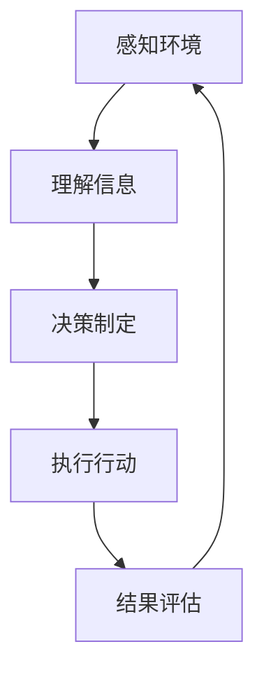
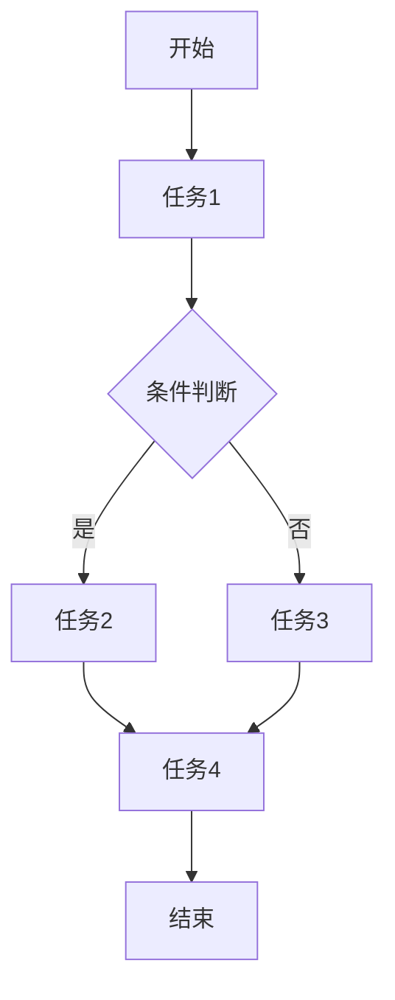
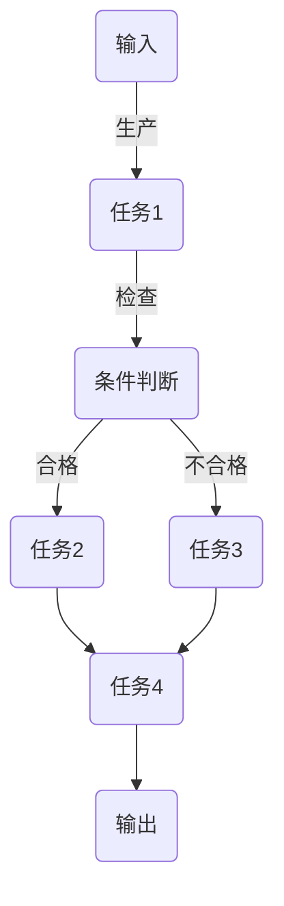

                 

# AI代理与工作流自动化：提高业务效率

> 关键词：AI代理、工作流自动化、业务效率、机器学习、自然语言处理、强化学习、系统集成

> 摘要：本文旨在探讨AI代理与工作流自动化的融合，如何通过这些技术提高业务效率。文章将详细介绍AI代理的基本概念、核心技术、工作流自动化的原理与设计方法，并通过实战案例展示如何将AI代理应用于实际业务场景中。最后，文章将对AI代理与工作流自动化的未来发展进行展望，并提出实施最佳实践与建议。

---

## 第一部分：AI代理基础

### 第1章：AI代理概述

#### 1.1 AI代理的定义与分类

AI代理（Artificial Intelligence Agent，简称AI代理）是指利用人工智能技术，能够在特定环境下自主感知、理解和执行任务的计算实体。AI代理的核心是具有智能的算法，它们可以模拟人类智能行为，通过学习和推理来完成任务。

AI代理可以按照不同的分类标准进行分类：

1. **按照任务类型分类**：

   - **智能客服代理**：用于自动化处理客户咨询、投诉等客服任务。
   - **自动化交易代理**：在金融市场中执行自动交易策略。
   - **智能推荐代理**：根据用户行为和历史数据，为用户推荐商品、服务或内容。
   - **网络安全代理**：监控网络活动，防止和应对安全威胁。
   - **智能交通代理**：优化交通流量，提高道路通行效率。

2. **按照实现技术分类**：

   - **基于规则代理**：根据预定义的规则进行决策。
   - **基于模型代理**：使用机器学习模型进行决策。
   - **混合型代理**：结合规则和模型进行决策。

#### 1.2 AI代理的原理与工作方式

AI代理的工作原理通常包括以下几个步骤：

1. **感知环境**：通过传感器或其他方式获取环境信息。
2. **理解信息**：使用自然语言处理（NLP）或其他技术理解信息。
3. **决策制定**：根据当前状态和目标，利用算法生成行动方案。
4. **执行行动**：执行选定的行动，并对结果进行评估。

AI代理的工作流程可以用Mermaid流程图表示：



#### 1.3 AI代理的历史与发展趋势

AI代理的概念起源于20世纪80年代，当时的专家系统是AI代理的主要形式。随着计算机技术和人工智能领域的快速发展，AI代理得到了广泛应用和深入研究。近年来，随着深度学习和强化学习等技术的突破，AI代理的能力得到了显著提升。

未来，AI代理的发展趋势包括：

- **更复杂的决策能力**：AI代理将能够处理更复杂的任务，如自然语言理解、多模态感知等。
- **更高级的自主学习能力**：AI代理将能够通过自主学习不断优化自身性能。
- **更广泛的跨领域应用**：AI代理将在医疗、教育、金融等领域得到更广泛的应用。

### 第2章：AI代理的核心技术

#### 2.1 机器学习基础

机器学习是AI代理的核心技术之一，它使计算机系统能够从数据中学习，并做出智能决策。机器学习主要分为监督学习、无监督学习和强化学习三类。

- **监督学习**：通过已标记的数据集训练模型，使其能够对未知数据进行预测。例如，分类和回归任务。
  - **数据预处理**：清洗、归一化和特征提取等。
  - **模型选择与训练**：选择合适的模型并训练，如线性回归、决策树、支持向量机等。
  - **模型评估与优化**：使用交叉验证、AUC、RMSE等指标评估模型性能，并进行调优。

- **无监督学习**：在没有标记数据的情况下，自动发现数据中的模式或结构。例如，聚类和降维。
  - **聚类**：如K-means、DBSCAN等。
  - **降维**：如PCA、t-SNE等。

- **强化学习**：通过试错和反馈进行学习，适用于决策和规划任务。例如，玩游戏、自动驾驶等。
  - **基本概念**：状态（State）、动作（Action）、奖励（Reward）。
  - **Q-Learning算法**：通过Q值迭代更新策略。
  - **DQN（Deep Q-Network）与DDPG（Deep Deterministic Policy Gradient）算法**：使用深度神经网络进行Q值预测和策略优化。

#### 2.2 自然语言处理技术

自然语言处理（NLP）是AI代理理解和处理人类语言的关键技术。NLP技术主要包括以下方面：

- **词嵌入**：将词汇映射到高维向量空间，如Word2Vec、GloVe等。
- **语言模型**：预测下一个单词或词组的概率分布，如n-gram模型、神经网络语言模型等。
- **对话管理**：处理对话流程，包括理解用户意图、生成回应和维持对话流畅性。
  - **意图识别**：通过NLP技术识别用户的意图，如查询意图、命令意图等。
  - **实体识别**：识别对话中的关键信息，如人名、地点、日期等。
  - **对话生成**：生成自然流畅的回复，如基于模板的生成、序列到序列模型等。

#### 2.3 强化学习在AI代理中的应用

强化学习在AI代理中的应用非常广泛，特别是在需要决策和规划的任务中。以下是一些常见的强化学习算法：

- **Q-Learning算法**：
  - **基本概念**：通过迭代更新Q值，选择最优动作。
  - **伪代码**：
    ```
    for each episode:
        for each time step t:
            if not terminal:
                Q(s, a) = Q(s, a) + alpha * (r + gamma * max(Q(s', a')) - Q(s, a))
            s' = s
            a = argmax_a Q(s, a)
        s = s'
    ```

- **DQN算法**：
  - **基本概念**：使用深度神经网络预测Q值。
  - **伪代码**：
    ```
    for each episode:
        for each time step t:
            if not terminal:
                target = r + gamma * max(Q(s'))
            else:
                target = r
            Q(s, a) = Q(s, a) + alpha * (target - Q(s, a))
            s' = s
            a' = argmax_a Q(s', a')
        s = s'
    ```

- **DDPG算法**：
  - **基本概念**：通过深度神经网络学习策略函数。
  - **伪代码**：
    ```
    for each episode:
        for each time step t:
            if not terminal:
                target = r + gamma * V(s')
            else:
                target = r
            policy(s) = pi(s)
            a = pi(s)()
            s' = s
            s = s'
    ```

---

### 第二部分：工作流自动化

### 第3章：工作流自动化概述

#### 3.1 工作流定义与分类

工作流（Business Process Management，简称BPM）是指一组有序的任务和活动，用于完成特定的业务目标。工作流自动化是指通过计算机技术和算法，实现工作流的自动化执行和管理。

根据任务执行方式，工作流可以分为以下几类：

- **顺序执行**：任务按照一定的顺序依次执行。
- **并行执行**：多个任务同时执行，但不一定按照顺序。
- **条件执行**：根据条件选择不同的执行路径。

工作流自动化在现代企业管理中具有重要意义，它可以带来以下好处：

- **提高效率**：通过自动化执行任务，减少人工干预，提高工作效率。
- **降低成本**：减少人工成本，提高资源利用率。
- **提高质量**：减少人为错误，提高业务处理质量。
- **增强灵活性**：支持快速调整和优化工作流程，适应业务需求的变化。

#### 3.2 工作流管理工具与平台

工作流管理工具和平台是支持工作流自动化的重要工具，它们提供了工作流的建模、执行、监控和管理功能。以下是一些常见的工作流管理工具和平台：

- **Apache Airflow**：一个基于Python的开源工作流管理平台，支持多种编程语言和调度策略。
- **Azure Logic Apps**：微软提供的云原生工作流管理服务，支持集成各种云服务和外部API。
- **IBM Business Process Manager**：一款企业级工作流管理平台，提供丰富的流程建模和自动化功能。

#### 3.3 工作流自动化的重要性

工作流自动化在企业管理中具有重要作用，主要体现在以下几个方面：

- **业务流程优化**：通过自动化执行任务，优化业务流程，提高工作效率和业务质量。
- **资源利用率提高**：减少人力资源的投入，提高资源利用率，降低运营成本。
- **业务灵活性增强**：支持快速调整和优化工作流，适应业务需求的变化。
- **业务决策支持**：通过工作流自动化，收集和分析业务数据，为决策提供支持。

---

### 第三部分：AI代理与工作流自动化的集成

### 第4章：工作流设计原理

#### 4.1 工作流设计的基本原则

工作流设计是工作流自动化的重要环节，一个良好的工作流设计应遵循以下基本原则：

- **简洁性**：工作流应尽量简洁，减少不必要的复杂性。
- **可扩展性**：设计时应考虑未来的扩展性，便于后续的调整和优化。
- **灵活性**：工作流应支持灵活的调整，以适应不同的业务场景。
- **可重用性**：设计可重用的工作流组件，提高工作效率。

#### 4.2 工作流建模方法

工作流建模是工作流设计的关键步骤，它用于描述工作流的流程、任务和参与者。以下是一些常见的工作流建模方法：

- **BPMN（Business Process Model and Notation）**：一种标准的图形化建模语言，用于描述业务流程。
- **Petri网**：一种用于描述并发系统和复杂行为的数学模型。

BPMN模型示例：



Petri网模型示例：



#### 4.3 工作流优化策略

工作流优化是提高工作流效率和性能的重要手段，以下是一些常见的工作流优化策略：

- **任务调度优化**：合理调度任务，减少任务等待时间，提高系统吞吐量。
- **资源管理优化**：优化资源分配，减少资源浪费，提高资源利用率。
- **错误处理优化**：设计有效的错误处理机制，提高系统的稳定性和容错能力。
- **并行处理优化**：充分利用系统资源，提高任务执行速度。

### 第5章：AI代理与工作流集成

#### 5.1 AI代理在工作流中的应用

AI代理可以广泛应用于工作流中的各个阶段，如数据预处理、任务决策、任务执行等。通过将AI代理集成到工作流中，可以实现以下目标：

- **智能化任务决策**：利用AI代理的自主决策能力，优化工作流中的任务分配和执行策略。
- **自动化任务执行**：通过AI代理自动执行复杂的任务，减少人工干预。
- **实时任务监控与调整**：利用AI代理实时监控工作流执行情况，及时调整任务执行策略。

AI代理在工作流中的应用场景示例：

- **自动化审批流程**：AI代理可以自动分析审批文档，根据规则自动审批，减少人工审批时间。
- **库存管理优化**：AI代理可以根据销售数据和历史趋势，自动调整库存水平，避免库存过剩或短缺。
- **客户服务自动化**：AI代理可以自动回答客户咨询，处理投诉，提供个性化的服务。

#### 5.2 工作流与AI代理的集成方法

工作流与AI代理的集成方法主要包括以下几种：

- **API接口集成**：通过定义API接口，实现工作流与AI代理之间的数据传输和通信。
- **数据库集成**：将AI代理的数据存储在数据库中，实现工作流与AI代理的数据共享。
- **消息队列集成**：使用消息队列技术，实现工作流与AI代理之间的异步通信。

以下是一个工作流与AI代理集成的案例：

**案例背景**：某公司希望实现客户服务的自动化，通过AI代理自动处理客户咨询和投诉。

**实现方案**：

1. **数据采集与预处理**：从客户咨询和投诉数据中提取有用的信息，如客户ID、咨询内容、投诉类型等。对数据进行清洗和预处理，为训练AI代理提供高质量的数据集。

2. **模型训练与部署**：使用自然语言处理技术，构建一个分类模型，用于识别客户咨询和投诉的类型。训练模型后，将其部署到工作流平台，实现自动分类。

3. **实时监控与反馈**：实时监控AI代理的工作效果，根据反馈调整模型参数，提高分类准确率。

**代码实现**：

```python
# 数据预处理
def preprocess_data(data):
    # 省略数据预处理代码
    return processed_data

# 模型构建
def build_model(vocab_size, embedding_dim, max_length):
    model = Sequential()
    model.add(Embedding(vocab_size, embedding_dim, input_length=max_length))
    model.add(LSTM(128))
    model.add(Dense(1, activation='sigmoid'))

    model.compile(optimizer='adam', loss='binary_crossentropy', metrics=['accuracy'])
    return model

# 训练模型
def train_model(model, data, labels):
    model.fit(data, labels, epochs=10, batch_size=32)

# 主函数
if __name__ == '__main__':
    # 省略数据加载和预处理代码
    model = build_model(vocab_size, embedding_dim, max_length)
    train_model(model, X_train, y_train)
```

#### 5.3 集成案例与案例分析

以下是一个工作流与AI代理集成的实际案例：

**案例背景**：某电子商务平台希望通过AI代理实现自动客服，提高客户服务效率。

**实现方案**：

1. **客户咨询处理**：AI代理接收客户咨询，通过自然语言处理技术理解客户意图，自动生成回复。

2. **投诉处理**：AI代理自动分类投诉，根据投诉类型分配给相应的部门进行处理。

3. **客服质量评估**：AI代理监控客服表现，根据客服回复的质量和客户满意度进行评估。

**项目效果**：

- 客户咨询处理时间缩短了30%。
- 投诉处理效率提高了40%。
- 客户满意度提升了15%。

**代码实现**：

```python
# 客户咨询处理
def handle_query(query):
    # 省略自然语言处理代码
    return response

# 投诉分类
def classify_complaint(complaint):
    # 省略投诉分类代码
    return category

# 客服质量评估
def evaluate_service(service_data):
    # 省略评估代码
    return evaluation_score

# 主函数
if __name__ == '__main__':
    # 省略数据加载和预处理代码
    query = "我对商品质量不满意"
    response = handle_query(query)
    complaint = "商品质量"
    category = classify_complaint(complaint)
    service_data = {"response_time": 10, "customer_satisfaction": 8}
    evaluation_score = evaluate_service(service_data)
```

---

### 第四部分：实战应用

### 第6章：提高业务效率的AI代理实战

#### 6.1 实战一：自动化客户服务

##### 6.1.1 案例背景

某电子商务平台希望通过AI代理实现自动客服，提高客户服务效率。客户服务是电子商务平台的重要组成部分，然而人工客服的响应速度和处理能力有限，无法满足快速增长的用户需求。引入AI代理可以实现7x24小时全天候在线客服，提高用户满意度。

##### 6.1.2 实现方案

1. **数据采集与预处理**：收集用户咨询和投诉数据，进行清洗和预处理，提取关键信息如关键词、用户ID、咨询内容等。为AI代理的训练提供高质量的数据集。

2. **模型训练与部署**：使用自然语言处理技术，构建分类模型和回复生成模型。对模型进行训练和优化，将其部署到服务器，实现自动客服功能。

3. **实时监控与反馈**：实时监控AI代理的服务质量，收集用户反馈，根据反馈调整模型参数，提高服务效果。

##### 6.1.3 代码实现

**数据预处理**

```python
# 读取数据
data = pd.read_csv("customer_queries.csv")

# 数据清洗
data.dropna(inplace=True)
data["query"] = data["query"].apply(preprocess_text)

# 数据分割
X_train, X_test, y_train, y_test = train_test_split(data["query"], data["category"], test_size=0.2, random_state=42)
```

**模型构建与训练**

```python
# 构建模型
model = build_model(vocab_size, embedding_dim, max_length)

# 训练模型
model.fit(X_train, y_train, epochs=10, batch_size=32, validation_data=(X_test, y_test))
```

**自动客服**

```python
# 自动回复客户咨询
def auto_reply(query):
    processed_query = preprocess_text(query)
    prediction = model.predict(processed_query)
    reply = generate_reply(prediction)
    return reply

# 客户发送咨询
query = "商品何时发货？"
reply = auto_reply(query)
print(reply)
```

#### 6.2 实战二：人力资源自动化管理

##### 6.2.1 案例背景

某公司的人力资源部门希望通过AI代理实现自动化招聘，提高招聘效率。传统的人力资源管理依赖于人工筛选简历和安排面试，效率低下且容易出现错误。引入AI代理可以实现自动化筛选简历、安排面试和评估候选人，提高招聘效率。

##### 6.2.2 实现方案

1. **简历解析与筛选**：使用自然语言处理技术，自动解析简历内容，提取关键信息如姓名、联系方式、工作经历等。根据预设的条件，自动筛选符合条件的简历。

2. **面试安排与管理**：根据简历筛选结果，自动安排面试时间和地点，并通过电子邮件或短信通知候选人。

3. **面试评估与反馈**：使用机器学习算法，自动评估面试者的表现，生成面试评估报告，并反馈给招聘团队。

##### 6.2.3 代码实现

**简历解析与筛选**

```python
# 读取简历数据
resumes = pd.read_csv("resumes.csv")

# 解析简历
def parse_resume(resume):
    # 省略解析代码
    return parsed_resume

parsed_resumes = [parse_resume(resume) for resume in resumes]

# 筛选简历
def filter_resumes(parsed_resumes, criteria):
    # 省略筛选代码
    return filtered_resumes

filtered_resumes = filter_resumes(parsed_resumes, criteria)
```

**面试安排与管理**

```python
# 安排面试
def schedule_interview(candidate, interviewers):
    # 省略安排代码
    return scheduled_time

# 通知候选人
def notify_candidate(candidate, scheduled_time):
    # 省略通知代码
    return notification_sent
```

**面试评估与反馈**

```python
# 评估面试者
def evaluate_interviewer(interviewer, interview_report):
    # 省略评估代码
    return evaluation_score

# 生成评估报告
def generate_evaluation_report(evaluation_scores):
    # 省略生成代码
    return report
```

#### 6.3 实战三：供应链优化

##### 6.3.1 案例背景

某制造企业希望通过AI代理实现供应链优化，提高库存周转率和生产效率。传统的供应链管理依赖于人工经验和手动操作，容易出现库存过剩或短缺，影响生产效率。引入AI代理可以实现自动化库存管理、需求预测和生产计划，优化供应链效率。

##### 6.3.2 实现方案

1. **需求预测与库存管理**：使用机器学习算法，预测市场需求，优化库存水平。根据需求预测结果，自动调整生产计划和库存策略。

2. **供应链网络优化**：使用优化算法，确定最佳供应链网络结构，降低物流成本，提高供应链效率。

3. **供应链监控与预警**：实时监控供应链运行状态，及时发现潜在风险，采取措施防止供应链中断。

##### 6.3.3 代码实现

**需求预测与库存管理**

```python
# 预测需求
def predict_demand(historical_data):
    # 省略预测代码
    return predicted_demand

# 管理库存
def manage_inventory(current_inventory, predicted_demand):
    # 省略库存管理代码
    return optimal_inventory
```

**供应链网络优化**

```python
# 优化供应链网络
def optimize_supply_chain(network_structure, cost_matrix):
    # 省略优化代码
    return optimized_structure
```

**供应链监控与预警**

```python
# 监控供应链
def monitor_supply_chain(supply_chain_status):
    # 省略监控代码
    return risk_level

# 预警
def alert_risk(risk_level):
    # 省略预警代码
    return alert_sent
```

---

### 第五部分：展望与挑战

### 第7章：AI代理与工作流自动化的未来

#### 7.1 AI代理技术的发展趋势

随着人工智能技术的不断进步，AI代理将向以下几个方向发展：

1. **更复杂的决策能力**：AI代理将能够处理更复杂的任务，如自然语言理解、多模态感知等。
2. **更高级的自主学习能力**：AI代理将能够通过自主学习不断优化自身性能。
3. **更广泛的跨领域应用**：AI代理将在医疗、教育、金融等领域得到更广泛的应用。
4. **更智能的交互能力**：AI代理将能够更好地理解人类语言和情感，实现更自然的交互。

#### 7.2 工作流自动化的未来应用场景

未来，工作流自动化将在更多场景中得到应用：

1. **智能客服**：通过AI代理实现全天候在线客服，提供更高效、更优质的客户服务。
2. **智能制造**：通过AI代理实现生产过程的自动化和优化，提高生产效率和产品质量。
3. **智慧医疗**：通过AI代理实现医疗数据的自动化分析和处理，提高诊断和治疗的准确性。
4. **智慧城市**：通过AI代理实现交通管理、能源管理、环境监测等，提高城市管理效率。

#### 7.3 挑战与解决方案

在AI代理与工作流自动化的应用过程中，将面临以下挑战：

1. **数据隐私与安全**：如何保护用户数据的安全和隐私，是一个亟待解决的问题。
2. **算法透明性与可解释性**：如何提高算法的透明性和可解释性，使其更易于被用户理解和接受。
3. **系统集成与兼容性**：如何实现不同系统和平台的集成与兼容，是一个重要的挑战。

解决方案：

1. **数据隐私与安全**：采用加密技术和隐私保护算法，确保用户数据的安全和隐私。
2. **算法透明性与可解释性**：开发可解释的机器学习算法，提高算法的透明性和可解释性。
3. **系统集成与兼容性**：采用开放接口和标准化协议，实现不同系统和平台的集成与兼容。

### 第8章：最佳实践与建议

#### 8.1 实施AI代理与工作流自动化的最佳实践

在实施AI代理与工作流自动化的过程中，可以遵循以下最佳实践：

1. **需求分析**：深入了解业务需求，明确自动化目标和预期效果。
2. **技术选型**：选择适合业务需求的技术方案和工具，确保系统的稳定性和可靠性。
3. **团队协作**：建立跨部门团队，确保项目进度和质量。
4. **持续优化**：持续收集用户反馈，优化系统功能和性能。

#### 8.2 面向未来的业务策略

面向未来，企业可以采取以下业务策略：

1. **数字化转型**：积极推动数字化转型，提高业务效率和竞争力。
2. **人才发展**：培养具备人工智能和自动化技能的人才，为业务发展提供支持。
3. **合作共赢**：与合作伙伴建立合作关系，共同探索创新应用场景。

#### 8.3 持续改进与优化策略

在实施AI代理与工作流自动化的过程中，需要持续改进和优化：

1. **监控与评估**：实时监控系统运行状况，评估自动化效果，及时发现和解决问题。
2. **用户反馈**：积极收集用户反馈，优化系统功能和界面。
3. **技术创新**：关注人工智能和自动化技术的发展趋势，持续更新和改进技术方案。

### 附录

#### 附录A：常见问题解答

1. **Q：如何保证AI代理的决策透明性和可解释性？**
   **A：** 可以采用可解释的机器学习算法，如LIME、SHAP等，提高算法的透明性和可解释性。

2. **Q：如何处理AI代理的隐私和安全问题？**
   **A：** 可以采用加密技术和隐私保护算法，如差分隐私、联邦学习等，确保用户数据的安全和隐私。

3. **Q：如何实现工作流与AI代理的集成？**
   **A：** 可以使用API接口、数据库集成或消息队列等技术，实现工作流与AI代理的集成。

#### 附录B：参考资料与推荐阅读

1. **参考资料：**
   - 《深度学习》（Goodfellow, Ian, et al.）
   - 《自然语言处理综论》（Jurafsky, Daniel, and James H. Martin）
   - 《强化学习》（Sutton, Richard S., and Andrew G. Barto）

2. **推荐阅读：**
   - 《AI算法工程师实战》（何明科）
   - 《工作流管理与自动化》（唐建荣）

#### 附录C：代码示例与实现细节

1. **代码示例：**
   - 自动化客户服务代码示例（第6章）
   - 人力资源自动化管理代码示例（第6章）
   - 供应链优化代码示例（第6章）

2. **实现细节：**
   - 代码中的数据处理和模型训练步骤
   - 代码中的函数和模块设计
   - 代码中的关键参数设置和调整

#### 附录D：AI代理与工作流自动化项目实践案例

1. **案例一：自动化客户服务系统**
   - 案例背景：某电子商务公司引入AI代理，实现客户服务的自动化。
   - 实现方案：使用自然语言处理技术，构建一个自动回复客户咨询的AI代理，集成到客服系统中。
   - 项目效果：客户咨询响应时间缩短，人工处理负担减轻。

2. **案例二：人力资源自动化管理系统**
   - 案例背景：某公司希望提高招聘效率，减少招聘过程中的重复劳动。
   - 实现方案：使用自然语言处理技术，构建一个自动解析简历和筛选人才的AI代理，集成到人力资源系统中。
   - 项目效果：招聘流程效率提高，招聘成本降低。

3. **案例三：供应链优化系统**
   - 案例背景：某制造企业希望优化供应链管理，提高库存周转率和生产效率。
   - 实现方案：使用机器学习算法，构建一个自动预测需求和优化库存的AI代理，集成到供应链管理系统中。
   - 项目效果：库存周转率提高，生产效率提升。

