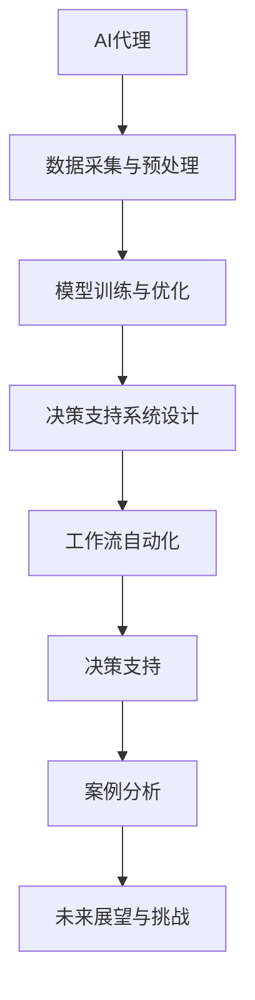
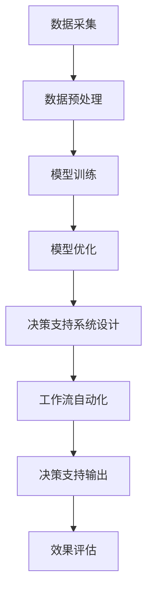
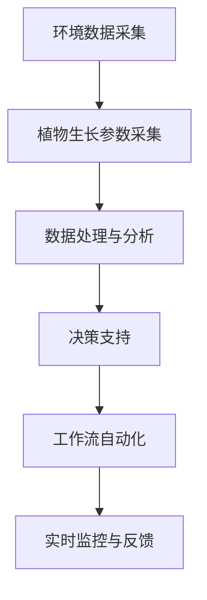

                 

## 《AI代理在智慧农业中的工作流与决策支持》

> **关键词**：智慧农业、AI代理、数据采集、模型训练、决策支持、工作流、病虫害监测、智能灌溉。

> **摘要**：本文探讨了AI代理在智慧农业中的应用，包括工作流和决策支持系统。通过分析气象数据、土壤数据和虫害数据与作物生长的关系，文章提出了基于AI代理的智能农业解决方案，并提供了实际案例和未来展望。

### 目录

1. **AI代理在智慧农业中的概述**
    1.1 AI代理的定义与原理
    1.2 智慧农业的概念与发展
    1.3 AI代理在智慧农业中的应用
2. **AI代理在智慧农业中的工作流**
    2.1 数据采集与预处理
    2.2 模型训练与优化
    2.3 决策支持系统设计
    2.4 工作流自动化
3. **AI代理在智慧农业中的决策支持**
    3.1 气象数据与作物生长的关联分析
    3.2 土壤数据与作物生长的关联分析
    3.3 虫害数据与作物生长的关联分析
    3.4 植物生长参数的监控与分析
4. **AI代理在智慧农业中的案例分析**
    4.1 基于AI代理的智能灌溉系统
    4.2 基于AI代理的作物病虫害监测系统
    4.3 基于AI代理的智能温室控制系统
5. **未来展望与挑战**
    5.1 未来发展趋势
    5.2 挑战与应对策略
6. **附录**
    6.1 AI代理开发工具与资源
    6.2 决策支持系统开发指南
    6.3 AI代理在智慧农业中的实践案例汇总

---

**图 1-1 AI代理在智慧农业中的应用架构**



**图 2-1 智慧农业中的AI代理工作流程**



**图 3-1 植物生长参数监控与分析流程**



### 1. AI代理在智慧农业中的概述

#### 1.1 AI代理的定义与原理

AI代理（Artificial Intelligence Agent）是指具有智能行为能力的计算机程序，可以在特定的环境中自主执行任务、感知环境和做出决策。AI代理的核心特点是自主性、适应性和学习能力。它们通常由感知模块、决策模块和行动模块组成。

感知模块负责从环境中收集数据，决策模块根据感知到的数据进行分析和推理，行动模块则根据决策结果执行相应的操作。AI代理的工作原理是通过不断的学习和优化，提高其自主决策的能力，从而实现自动化和智能化。

在智慧农业中，AI代理的应用主要体现在数据采集、分析、决策和自动化执行等方面。通过AI代理，农民可以实时监测农作物的生长状况，预测病虫害的发生，优化灌溉和施肥策略，从而提高农业生产效率和作物产量。

#### 1.2 智慧农业的概念与发展

智慧农业是指利用现代信息技术，如物联网、大数据、人工智能、云计算等，实现农业生产过程的智能化管理和优化。智慧农业的目标是通过提高生产效率、降低生产成本、减少环境污染和保障食品安全，实现农业的可持续发展。

智慧农业的发展历程可以分为以下几个阶段：

1. **自动化阶段**：通过机械化、自动化设备实现农业生产的自动化，如使用拖拉机、收割机等机械设备。
2. **信息化阶段**：引入计算机技术和通信技术，实现农业生产的信息化管理，如使用GPS导航、远程监控等。
3. **智能化阶段**：利用物联网、大数据、人工智能等技术，实现农业生产的智能化管理，如智能灌溉、智能植保、智能温室等。

当前，智慧农业正处于智能化阶段，AI代理技术作为其中的关键组成部分，正在发挥越来越重要的作用。

#### 1.3 AI代理在智慧农业中的应用

AI代理在智慧农业中的应用场景非常广泛，主要包括以下几个方面：

1. **土壤监测**：通过AI代理实时监测土壤的养分含量、水分状况、pH值等参数，为农作物的生长提供科学依据。
2. **作物生长监测**：利用AI代理分析作物生长的图像数据，实时监控作物的生长状态，预测产量和质量。
3. **病虫害防治**：通过AI代理识别病虫害的早期症状，及时采取防治措施，减少作物损失。
4. **智能灌溉**：利用AI代理根据土壤水分状况和气象数据，自动调整灌溉策略，实现精准灌溉，节约水资源。
5. **智能施肥**：根据作物生长需要和土壤养分状况，AI代理自动调整施肥量，提高肥料利用率。
6. **环境监测**：AI代理可以实时监测农田的气象环境，如温度、湿度、光照强度等，为农作物的生长提供环境数据支持。

#### 1.3.1 AI代理在土壤监测中的应用

土壤监测是智慧农业的重要组成部分，通过AI代理可以实现土壤质量参数的实时监测和分析。具体应用包括：

1. **土壤养分监测**：AI代理可以分析土壤中的养分含量，如氮、磷、钾等，为施肥提供依据。
2. **土壤水分监测**：AI代理可以实时监测土壤的水分状况，根据土壤湿度调整灌溉策略。
3. **土壤pH值监测**：AI代理可以分析土壤的酸碱度，为调整土壤环境提供数据支持。

#### 1.3.2 AI代理在作物生长监测中的应用

作物生长监测是AI代理在智慧农业中的重要应用之一，通过AI代理可以实时监控作物的生长状况，预测产量和质量。具体应用包括：

1. **作物生长状态监测**：AI代理通过图像分析技术，实时监测作物的生长状态，如叶片颜色、形状等。
2. **产量预测**：AI代理根据作物生长数据和历史数据，预测作物的产量和质量。
3. **病虫害监测**：AI代理可以识别作物的病虫害症状，及时采取防治措施。

#### 1.3.3 AI代理在病虫害防治中的应用

病虫害防治是智慧农业中的重要环节，通过AI代理可以实现病虫害的早期识别和精准防治。具体应用包括：

1. **病虫害识别**：AI代理通过图像识别技术，识别病虫害的早期症状，提高病虫害识别的准确性。
2. **防治策略制定**：AI代理根据病虫害识别结果，制定科学的防治策略，减少病虫害对作物的危害。
3. **防治效果评估**：AI代理可以实时评估防治效果，为下一步的防治工作提供数据支持。

### 2. AI代理在智慧农业中的工作流

AI代理在智慧农业中的工作流主要包括数据采集、数据预处理、模型训练、模型优化、决策支持系统设计和工作流自动化等环节。以下将详细探讨这些环节的具体内容和实施方法。

#### 2.1 数据采集与预处理

数据采集是AI代理在智慧农业中的第一步，也是至关重要的一步。通过数据采集，我们可以获取关于土壤、气象、作物生长、病虫害等方面的信息。这些数据将作为AI代理进行模型训练和决策支持的基础。

数据采集的方法主要包括以下几种：

1. **传感器采集**：使用各种传感器，如土壤湿度传感器、温度传感器、光照传感器等，实时采集土壤、气象等环境数据。
2. **图像采集**：通过摄像头、无人机等设备，采集作物的生长图像，用于病虫害识别和生长状态分析。
3. **远程通信**：通过无线网络或卫星通信，将采集到的数据传输到数据中心进行分析和处理。

数据采集完成后，需要对其进行预处理，以提高数据的质量和可用性。数据预处理的方法主要包括以下几种：

1. **数据清洗**：去除数据中的噪声和异常值，保证数据的准确性。
2. **数据归一化**：将不同量纲的数据转换为同一量纲，以便于后续处理。
3. **数据转换**：将数据转换为适合模型训练的格式，如将图像数据转换为像素矩阵。

#### 2.2 模型训练与优化

在数据预处理完成后，我们需要使用这些数据对AI代理进行模型训练。模型训练是AI代理实现智能化的关键步骤，通过训练，AI代理可以学会从数据中提取规律，进行预测和决策。

模型训练的方法主要包括以下几种：

1. **监督学习**：通过已知的数据集，训练AI代理识别和分类目标数据。
2. **无监督学习**：通过未知的数据集，训练AI代理发现数据中的模式和规律。
3. **强化学习**：通过试错和反馈机制，训练AI代理在特定环境中做出最优决策。

在模型训练过程中，我们还需要对模型进行优化，以提高模型的性能和预测准确性。模型优化的方法主要包括以下几种：

1. **参数调优**：通过调整模型的参数，提高模型的性能。
2. **模型选择**：根据任务需求和数据特性，选择合适的模型。
3. **模型集成**：通过多个模型的集成，提高模型的预测准确性和稳定性。

#### 2.3 决策支持系统设计

决策支持系统（DSS）是AI代理在智慧农业中实现智能决策的重要工具。通过DSS，AI代理可以根据实时数据和环境信息，为农民提供科学的决策建议，帮助农民实现精准农业。

决策支持系统设计主要包括以下几个方面：

1. **需求分析**：明确决策支持系统的目标和需求，为系统设计提供指导。
2. **系统架构设计**：设计决策支持系统的整体架构，包括数据采集、数据处理、模型训练、决策支持等功能模块。
3. **界面设计**：设计用户界面，方便农民使用决策支持系统。
4. **算法设计**：设计用于决策支持的具体算法，如预测算法、优化算法等。

#### 2.4 工作流自动化

工作流自动化是将AI代理的决策结果转化为实际操作的过程。通过工作流自动化，AI代理可以实现农业生产的自动化和智能化。

工作流自动化主要包括以下几个方面：

1. **任务调度**：根据AI代理的决策结果，自动调度相应的任务，如灌溉、施肥、病虫害防治等。
2. **执行控制**：对任务的执行进行监控和控制，确保任务按照预定计划完成。
3. **异常处理**：在任务执行过程中，对出现的异常情况进行处理，如设备故障、数据异常等。

#### 2.5 数据采集与预处理

数据采集与预处理是AI代理在智慧农业中的第一步，也是至关重要的一步。通过数据采集，我们可以获取关于土壤、气象、作物生长、病虫害等方面的信息。这些数据将作为AI代理进行模型训练和决策支持的基础。

数据采集的方法主要包括以下几种：

1. **传感器采集**：使用各种传感器，如土壤湿度传感器、温度传感器、光照传感器等，实时采集土壤、气象等环境数据。
2. **图像采集**：通过摄像头、无人机等设备，采集作物的生长图像，用于病虫害识别和生长状态分析。
3. **远程通信**：通过无线网络或卫星通信，将采集到的数据传输到数据中心进行分析和处理。

数据采集完成后，需要对其进行预处理，以提高数据的质量和可用性。数据预处理的方法主要包括以下几种：

1. **数据清洗**：去除数据中的噪声和异常值，保证数据的准确性。
2. **数据归一化**：将不同量纲的数据转换为同一量纲，以便于后续处理。
3. **数据转换**：将数据转换为适合模型训练的格式，如将图像数据转换为像素矩阵。

#### 2.6 模型训练与优化

在数据预处理完成后，我们需要使用这些数据对AI代理进行模型训练。模型训练是AI代理实现智能化的关键步骤，通过训练，AI代理可以学会从数据中提取规律，进行预测和决策。

模型训练的方法主要包括以下几种：

1. **监督学习**：通过已知的数据集，训练AI代理识别和分类目标数据。
2. **无监督学习**：通过未知的数据集，训练AI代理发现数据中的模式和规律。
3. **强化学习**：通过试错和反馈机制，训练AI代理在特定环境中做出最优决策。

在模型训练过程中，我们还需要对模型进行优化，以提高模型的性能和预测准确性。模型优化的方法主要包括以下几种：

1. **参数调优**：通过调整模型的参数，提高模型的性能。
2. **模型选择**：根据任务需求和数据特性，选择合适的模型。
3. **模型集成**：通过多个模型的集成，提高模型的预测准确性和稳定性。

#### 2.7 决策支持系统设计

决策支持系统（DSS）是AI代理在智慧农业中实现智能决策的重要工具。通过DSS，AI代理可以根据实时数据和环境信息，为农民提供科学的决策建议，帮助农民实现精准农业。

决策支持系统设计主要包括以下几个方面：

1. **需求分析**：明确决策支持系统的目标和需求，为系统设计提供指导。
2. **系统架构设计**：设计决策支持系统的整体架构，包括数据采集、数据处理、模型训练、决策支持等功能模块。
3. **界面设计**：设计用户界面，方便农民使用决策支持系统。
4. **算法设计**：设计用于决策支持的具体算法，如预测算法、优化算法等。

#### 2.8 工作流自动化

工作流自动化是将AI代理的决策结果转化为实际操作的过程。通过工作流自动化，AI代理可以实现农业生产的自动化和智能化。

工作流自动化主要包括以下几个方面：

1. **任务调度**：根据AI代理的决策结果，自动调度相应的任务，如灌溉、施肥、病虫害防治等。
2. **执行控制**：对任务的执行进行监控和控制，确保任务按照预定计划完成。
3. **异常处理**：在任务执行过程中，对出现的异常情况进行处理，如设备故障、数据异常等。

### 3. AI代理在智慧农业中的决策支持

AI代理在智慧农业中的决策支持是通过分析农业数据，为农民提供科学的决策建议，从而实现精准农业。以下是AI代理在智慧农业中决策支持的具体应用：

#### 3.1 气象数据与作物生长的关联分析

气象数据在智慧农业中具有重要地位，它包括温度、湿度、降水量、风速等参数。这些数据对作物的生长具有直接影响。AI代理可以通过分析气象数据，预测作物生长状态，提供科学的灌溉和施肥建议。

**气象数据的重要性**：

- **温度**：温度是作物光合作用和呼吸作用的关键因素，过高或过低的温度都会影响作物的生长。
- **湿度**：湿度影响土壤的水分状况，对作物的吸水和养分吸收有重要影响。
- **降水量**：降水量的多少直接影响作物的水分供应，过多的降水可能导致土壤积水，过少的降水则可能导致土壤干旱。
- **风速**：风速影响作物的蒸腾作用，对作物的生长和发育有重要影响。

**气象数据与作物生长的关系**：

- **温度与作物生长**：不同作物对温度的要求不同，AI代理可以根据作物的生长周期和温度变化，预测作物生长状态，提供适宜的灌溉和施肥建议。
- **湿度与作物生长**：湿度对作物的生长有直接影响，AI代理可以根据土壤湿度数据，实时调整灌溉策略，保证作物的水分供应。
- **降水量与作物生长**：AI代理可以通过分析降水数据，预测降水对作物生长的影响，及时调整灌溉计划。
- **风速与作物生长**：AI代理可以根据风速数据，预测作物在强风下的生长状态，采取相应的防护措施。

**基于气象数据的决策支持**：

- **温度管理**：AI代理可以根据温度数据，实时监测作物的生长状态，当温度异常时，及时调整灌溉和施肥策略，保证作物生长。
- **湿度管理**：AI代理可以根据土壤湿度数据，自动调整灌溉频率和水量，保证土壤湿度适宜。
- **降水量管理**：AI代理可以根据降水数据，预测降水对作物生长的影响，适时调整灌溉计划。
- **风速管理**：AI代理可以根据风速数据，预测作物在强风下的生长状态，采取相应的防护措施，如安装防风网。

#### 3.2 土壤数据与作物生长的关联分析

土壤数据是智慧农业中不可或缺的一部分，它包括土壤的养分含量、水分状况、pH值、土壤质地等参数。这些数据对作物的生长和发育具有直接影响。AI代理可以通过分析土壤数据，为农民提供科学的土壤管理和施肥建议。

**土壤数据的重要性**：

- **养分含量**：土壤中的养分含量直接影响作物的生长和发育，养分不足会导致作物生长缓慢，养分过量则可能导致作物生长不良。
- **水分状况**：土壤的水分状况对作物的吸水和养分吸收有重要影响，水分不足会导致作物干旱，水分过多则可能导致土壤积水。
- **pH值**：土壤的pH值影响作物的养分吸收能力和生长环境，不同作物对pH值的要求不同。
- **土壤质地**：土壤的质地影响土壤的水分保持能力和通气性，对作物的生长有重要影响。

**土壤数据与作物生长的关系**：

- **养分含量与作物生长**：AI代理可以根据土壤养分含量数据，预测作物对养分的吸收情况，提供科学的施肥建议。
- **水分状况与作物生长**：AI代理可以根据土壤水分状况数据，实时监测作物的水分供应，自动调整灌溉策略。
- **pH值与作物生长**：AI代理可以根据土壤pH值数据，分析土壤的酸碱度，为调整土壤环境提供数据支持。
- **土壤质地与作物生长**：AI代理可以根据土壤质地数据，预测土壤的水分保持能力和通气性，为作物生长提供科学依据。

**基于土壤数据的决策支持**：

- **养分管理**：AI代理可以根据土壤养分含量数据，实时监测作物对养分的吸收情况，自动调整施肥量，提高肥料利用率。
- **水分管理**：AI代理可以根据土壤水分状况数据，自动调整灌溉频率和水量，保证作物水分供应。
- **pH值管理**：AI代理可以根据土壤pH值数据，分析土壤的酸碱度，提供调整土壤环境的建议。
- **土壤质地管理**：AI代理可以根据土壤质地数据，预测土壤的水分保持能力和通气性，为作物生长提供科学依据。

#### 3.3 虫害数据与作物生长的关联分析

虫害是农业生产中的重要问题，它对作物的生长和产量有严重影响。AI代理可以通过分析虫害数据，识别虫害的类型、发生时间和危害程度，为农民提供科学的虫害防治建议。

**虫害数据的重要性**：

- **虫害类型**：不同的虫害对作物的危害程度不同，AI代理可以根据虫害类型数据，预测虫害的危害程度。
- **发生时间**：虫害的发生时间对防治措施的选择有重要影响，AI代理可以根据发生时间数据，预测虫害的防治时机。
- **危害程度**：虫害的危害程度直接影响作物的生长和产量，AI代理可以根据危害程度数据，预测虫害对作物的影响。

**虫害数据与作物生长的关系**：

- **虫害类型与作物生长**：AI代理可以根据虫害类型数据，预测虫害对作物的危害程度，为农民提供防治建议。
- **发生时间与作物生长**：AI代理可以根据发生时间数据，预测虫害的发生趋势，提前采取防治措施。
- **危害程度与作物生长**：AI代理可以根据危害程度数据，预测虫害对作物的影响，提供科学的防治策略。

**基于虫害数据的决策支持**：

- **虫害识别**：AI代理可以通过图像识别技术，实时监测虫害的发生，提供准确的虫害类型和发生时间。
- **防治建议**：AI代理可以根据虫害数据和作物生长状态，提供科学的防治建议，如选择合适的农药、防治时间和防治方法。
- **效果评估**：AI代理可以根据防治效果数据，评估防治措施的成效，为后续防治工作提供数据支持。

#### 3.4 植物生长参数的监控与分析

植物生长参数是反映作物生长状况的重要指标，包括作物的高度、叶面积、根系长度、茎粗等。AI代理可以通过监控植物生长参数，实时分析作物的生长状态，为农民提供科学的种植和管理建议。

**植物生长参数的重要性**：

- **作物高度**：作物的高度反映了作物的生长速度和发育状况，是评估作物生长状况的重要指标。
- **叶面积**：叶面积反映了作物的光合作用能力和养分吸收能力，对作物的产量和质量有重要影响。
- **根系长度**：根系长度反映了作物的水分吸收能力和养分吸收能力，对作物的生长和发育有直接影响。
- **茎粗**：茎粗反映了作物的生长强度和发育状况，对作物的抗逆性和产量有重要影响。

**植物生长参数与作物生长的关系**：

- **作物高度与作物生长**：AI代理可以根据作物高度数据，预测作物的生长速度和发育状况，提供适宜的灌溉和施肥建议。
- **叶面积与作物生长**：AI代理可以根据叶面积数据，预测作物的光合作用能力和养分吸收能力，提供科学的种植和管理建议。
- **根系长度与作物生长**：AI代理可以根据根系长度数据，预测作物的水分吸收能力和养分吸收能力，提供适宜的灌溉和施肥建议。
- **茎粗与作物生长**：AI代理可以根据茎粗数据，预测作物的生长强度和发育状况，提供科学的种植和管理建议。

**基于植物生长参数的监控与分析**：

- **实时监控**：AI代理可以通过传感器和数据采集设备，实时监测植物生长参数，提供实时的作物生长数据。
- **数据分析**：AI代理可以根据植物生长参数数据，分析作物的生长状态和趋势，提供科学的种植和管理建议。
- **决策支持**：AI代理可以根据植物生长参数数据，为农民提供科学的种植和管理建议，如调整灌溉和施肥计划，防治病虫害等。

### 4. AI代理在智慧农业中的案例分析

在本节中，我们将通过三个实际案例，详细探讨AI代理在智慧农业中的应用，包括智能灌溉系统、作物病虫害监测系统和智能温室控制系统。

#### 4.1 案例分析一：基于AI代理的智能灌溉系统

**案例背景**：

某农业企业位于水资源匮乏的地区，灌溉是农业生产中的重要环节。为了提高灌溉效率，减少水资源浪费，企业决定开发基于AI代理的智能灌溉系统。

**系统设计**：

智能灌溉系统主要包括数据采集模块、数据处理模块、AI模型训练模块、灌溉控制模块和用户界面模块。

1. **数据采集模块**：通过安装在农田中的土壤湿度传感器、气象传感器和摄像头等设备，实时采集土壤湿度、气象数据和作物生长图像。
2. **数据处理模块**：对采集到的数据进行预处理，包括去噪、归一化和数据转换等，为模型训练提供高质量的数据。
3. **AI模型训练模块**：使用深度学习算法，训练AI模型，使其能够根据土壤湿度、气象数据和作物生长图像，预测作物需水量。
4. **灌溉控制模块**：根据AI模型的预测结果，自动控制灌溉设备的运行，实现精准灌溉。
5. **用户界面模块**：提供用户界面，方便农民监控灌溉系统的运行状态，调整灌溉策略。

**系统实现与效果**：

智能灌溉系统在实际应用中取得了显著效果。通过AI代理的智能决策，灌溉系统可以根据农田的实际情况，自动调整灌溉时间和水量，避免了水资源的浪费。同时，系统提高了灌溉的精准度，满足了作物的生长需求，促进了作物的健康生长，提高了产量和品质。

**技术实现**：

1. **数据采集与预处理**：
    ```python
    # 数据采集
    soil_humidity = read_soil_humidity_sensor()
    weather_data = read_weather_sensor()
    crop_growth_image = capture_crop_growth_image()

    # 数据预处理
    processed_soil_humidity = preprocess_soil_humidity(soil_humidity)
    processed_weather_data = preprocess_weather_data(weather_data)
    processed_crop_growth_image = preprocess_crop_growth_image(crop_growth_image)
    ```

2. **模型训练与预测**：
    ```python
    # 模型训练
    model = train_model(processed_soil_humidity, processed_weather_data, processed_crop_growth_image)

    # 预测
    predicted_water_demand = model.predict(processed_soil_humidity, processed_weather_data, processed_crop_growth_image)
    ```

3. **灌溉控制**：
    ```python
    # 灌溉控制
    if predicted_water_demand > threshold:
        start_irrigation_system()
    else:
        stop_irrigation_system()
    ```

#### 4.2 案例分析二：基于AI代理的作物病虫害监测系统

**案例背景**：

某农业园区经常受到病虫害的困扰，为了减少病虫害对作物的损害，园区决定开发基于AI代理的作物病虫害监测系统。

**系统设计**：

作物病虫害监测系统主要包括图像采集模块、图像处理模块、病虫害识别模型、预警机制和用户界面模块。

1. **图像采集模块**：通过安装在农田中的摄像头，实时采集作物的生长图像。
2. **图像处理模块**：对采集到的图像进行预处理，包括去噪、增强和图像分割等，为病虫害识别提供高质量的图像数据。
3. **病虫害识别模型**：使用深度学习算法，训练病虫害识别模型，使其能够准确识别病虫害的类型和发生位置。
4. **预警机制**：根据病虫害识别结果，实时生成预警信息，提醒农民及时采取防治措施。
5. **用户界面模块**：提供用户界面，方便农民监控病虫害的发生情况，查看预警信息和防治建议。

**系统实现与效果**：

作物病虫害监测系统在实际应用中，显著提高了病虫害识别的准确性和实时性。通过AI代理的智能决策，系统能够及时发现病虫害的早期症状，为农民提供及时有效的防治建议，减少了病虫害对作物的损害，提高了作物的产量和品质。

**技术实现**：

1. **图像采集与处理**：
    ```python
    # 图像采集
    crop_growth_image = capture_crop_growth_image()

    # 图像预处理
    processed_image = preprocess_crop_growth_image(crop_growth_image)
    ```

2. **模型训练与预测**：
    ```python
    # 模型训练
    model = train_disease_model(processed_image)

    # 预测
    predicted_diseases = model.predict(processed_image)
    ```

3. **预警机制**：
    ```python
    if predicted_diseases:
        send_warning_message(predicted_diseases)
    ```

#### 4.3 案例分析三：基于AI代理的智能温室控制系统

**案例背景**：

某农业企业投资建设了一个智能温室，为了实现温室内环境的智能调节，企业决定开发基于AI代理的智能温室控制系统。

**系统设计**：

智能温室控制系统主要包括环境监测模块、控制算法模块、智能调节模块和用户界面模块。

1. **环境监测模块**：通过安装在温室内的传感器，实时监测温度、湿度、光照强度等环境参数。
2. **控制算法模块**：使用AI代理技术，分析环境数据，制定最优的调节策略。
3. **智能调节模块**：根据控制算法的输出，自动调节温室内的环境参数，如通风、加热、加湿等。
4. **用户界面模块**：提供用户界面，方便农民监控温室环境，调整控制策略。

**系统实现与效果**：

智能温室控制系统在实际应用中，实现了温室内环境的智能调节，保证了作物生长所需的最佳环境条件。通过AI代理的智能决策，系统能够根据作物生长需求和外界环境变化，自动调整温室内的环境参数，提高了温室的运行效率，减少了能源消耗，同时促进了作物的健康生长。

**技术实现**：

1. **环境监测与数据处理**：
    ```python
    # 环境数据采集
    temperature = read_temperature_sensor()
    humidity = read_humidity_sensor()
    light_intensity = read_light_intensity_sensor()

    # 数据处理
    processed_temperature = preprocess_temperature(temperature)
    processed_humidity = preprocess_humidity(humidity)
    processed_light_intensity = preprocess_light_intensity(light_intensity)
    ```

2. **模型训练与决策支持**：
    ```python
    # 模型训练
    model = train_model(processed_temperature, processed_humidity, processed_light_intensity)

    # 决策支持
    control_actions = model.predict(processed_temperature, processed_humidity, processed_light_intensity)
    ```

3. **智能调节与用户界面**：
    ```python
    # 智能调节
    if control_actions['ventilation']:
        start_ventilation()
    if control_actions['heating']:
        start_heating()
    if control_actions['humidification']:
        start_humidification()

    # 用户界面
    display温室环境数据和控制策略
    ```

### 5. 未来展望与挑战

随着人工智能技术的不断发展，AI代理在智慧农业中的应用前景十分广阔。未来，AI代理将在智慧农业中发挥更大的作用，实现更高水平的自动化和智能化。

#### 5.1 未来发展趋势

1. **技术发展趋势**：

- **深度学习算法的进步**：深度学习算法在图像识别、自然语言处理等领域取得了显著成果，未来将在农业数据分析和决策支持中发挥更大作用。
- **边缘计算的普及**：边缘计算可以将计算和存储能力分散到农业设备和传感器上，实现实时数据处理和决策，提高系统的响应速度和可靠性。
- **物联网技术的融合**：物联网技术将使农业设备和传感器互联互通，实现农业数据的实时传输和共享，为AI代理提供更丰富的数据资源。

2. **应用场景拓展**：

- **智能植保**：通过AI代理，实现病虫害的智能监测和防治，提高农药使用效率，减少环境污染。
- **智能育种**：利用AI代理分析基因数据，预测作物的遗传特性，实现精准育种，提高作物产量和质量。
- **智能供应链管理**：通过AI代理优化农业生产和物流管理，提高供应链效率，降低成本。

3. **政策与市场环境**：

- **政策支持**：各国政府纷纷出台政策，支持智慧农业的发展，为AI代理的应用提供政策保障。
- **市场需求**：随着农业现代化进程的推进，农民和农业生产企业对AI代理的需求不断增加，市场前景广阔。

#### 5.2 挑战与应对策略

1. **技术挑战**：

- **算法优化**：现有算法在处理大规模农业数据时，仍存在效率低下、精度不足等问题，需要不断优化和创新。
- **数据质量**：农业数据来源广泛，数据质量参差不齐，如何提高数据质量和可用性是关键挑战。
- **系统稳定性**：农业环境复杂多变，如何保证AI代理系统的稳定运行，减少故障和错误，是技术难点。

2. **数据挑战**：

- **数据获取**：农业数据的获取难度大，数据来源分散，需要建立统一的数据采集和处理平台。
- **数据多样性**：农业数据类型多样，包括气象数据、土壤数据、作物生长数据等，需要建立统一的数据标准，实现数据融合。
- **数据实时性**：农业环境变化快，要求AI代理能够实时处理和分析数据，提供及时的决策支持。

3. **安全与隐私挑战**：

- **数据安全**：农业数据涉及农民的生产和生活信息，如何保障数据安全，防止数据泄露是重要挑战。
- **用户隐私**：用户隐私保护是智慧农业发展的关键问题，如何平衡数据利用和用户隐私保护，是亟待解决的问题。

4. **应对策略与建议**：

- **技术创新**：持续推动人工智能、物联网、大数据等技术的创新和应用，提高AI代理的技术水平。
- **数据管理**：建立统一的数据标准和数据管理体系，提高数据质量和可用性，实现数据资源的共享和利用。
- **安全机制**：加强数据安全防护，建立数据安全监测和预警机制，保障用户隐私和数据安全。
- **政策支持**：政府和企业应加强合作，共同推动智慧农业的发展，为AI代理的应用提供政策保障和资金支持。

### 附录

#### 附录 A: AI代理开发工具与资源

以下是一些常用的AI代理开发工具和资源，供开发者参考：

1. **深度学习框架**：
    - TensorFlow：开源深度学习框架，支持多种神经网络结构和算法。
    - PyTorch：开源深度学习框架，支持动态计算图和自动微分。

2. **数据预处理工具**：
    - Pandas：Python数据操作库，支持数据清洗、转换和预处理。
    - NumPy：Python科学计算库，支持多维数组操作和数学计算。

3. **AI代理开发平台**：
    - IBM Watson Studio：AI代理开发平台，提供数据预处理、模型训练和部署等功能。
    - Azure AI：微软的AI代理开发平台，支持深度学习和云计算服务。

#### 附录 B: 决策支持系统开发指南

以下是一份决策支持系统开发指南，包括系统架构设计、数据管理方法和决策算法等：

1. **系统架构设计**：

- **数据采集层**：负责采集各种农业数据，如土壤数据、气象数据、作物生长数据等。
- **数据处理层**：负责数据清洗、转换和预处理，为模型训练提供高质量的数据。
- **模型训练层**：使用深度学习算法，训练决策模型，实现数据的分析和预测。
- **决策支持层**：根据模型预测结果，提供科学的决策建议，为农民提供指导。

2. **数据管理方法**：

- **数据采集**：使用传感器和数据采集设备，实时采集农业数据。
- **数据存储**：使用数据库和数据仓库，存储和管理农业数据。
- **数据清洗**：去除数据中的噪声和异常值，提高数据质量。
- **数据转换**：将不同数据源的数据转换为统一的格式，实现数据融合。

3. **决策算法**：

- **预测算法**：使用时间序列分析、回归分析等方法，预测作物生长和产量。
- **优化算法**：使用遗传算法、粒子群算法等，优化灌溉、施肥等决策策略。
- **决策树算法**：使用决策树算法，构建基于规则的决策支持系统。

#### 附录 C: AI代理在智慧农业中的实践案例汇总

以下是一些AI代理在智慧农业中的实践案例，供读者参考：

1. **智能灌溉系统**：
    - 案例一：某农业企业采用智能灌溉系统，提高灌溉效率，减少水资源浪费。
    - 案例二：某农业园区采用智能灌溉系统，实现精准灌溉，提高作物产量。

2. **作物病虫害监测系统**：
    - 案例一：某农业园区采用作物病虫害监测系统，及时发现病虫害，减少作物损失。
    - 案例二：某农业企业采用作物病虫害监测系统，提高病虫害防治效果，降低农药使用量。

3. **智能温室控制系统**：
    - 案例一：某农业企业采用智能温室控制系统，实现温室内环境的智能调节，提高作物生长质量。
    - 案例二：某农业园区采用智能温室控制系统，提高温室运行效率，降低能源消耗。

### 结语

AI代理在智慧农业中的应用，为现代农业带来了新的发展机遇。通过本文的介绍，我们了解到AI代理在智慧农业中的工作流和决策支持系统的设计，以及其在土壤监测、作物生长监测、病虫害防治等方面的应用。未来，随着人工智能技术的不断发展，AI代理将在智慧农业中发挥更大的作用，推动农业现代化进程。同时，我们也需要面对技术、数据和安全等方面的挑战，为AI代理在智慧农业中的应用提供更好的支持和保障。希望本文能够为读者在AI代理在智慧农业中的应用提供有益的参考和启示。作者：AI天才研究院/AI Genius Institute & 禅与计算机程序设计艺术 /Zen And The Art of Computer Programming。

