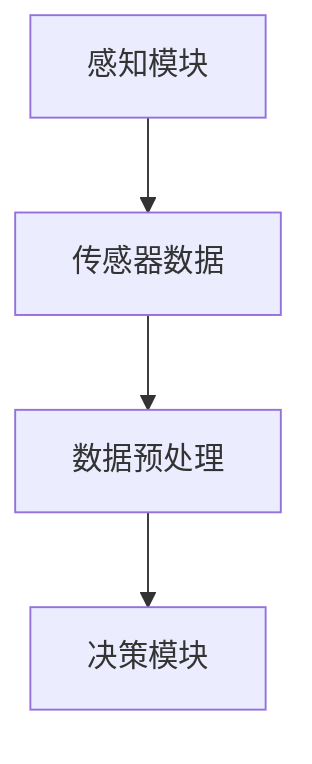
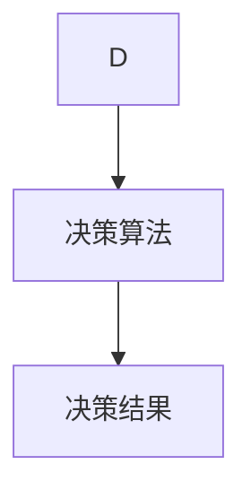
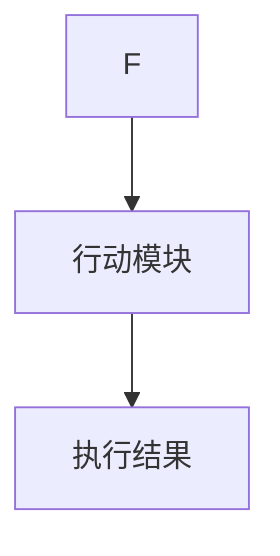
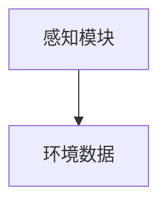
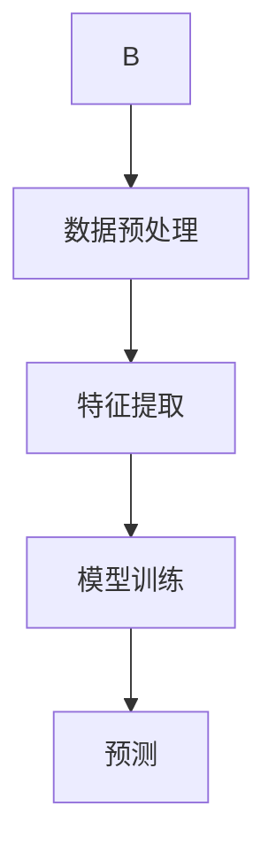
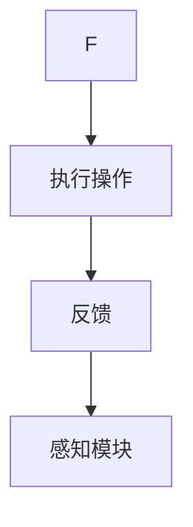
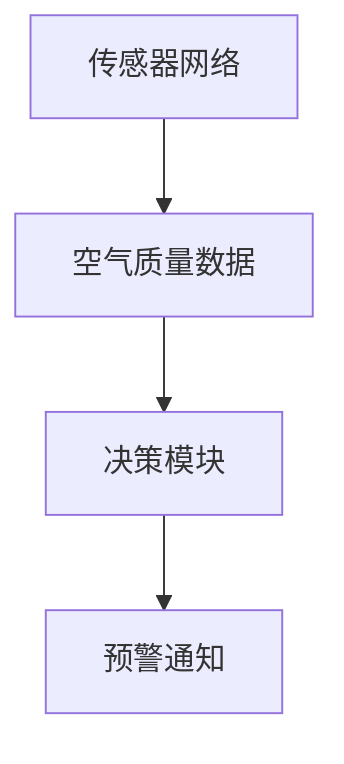
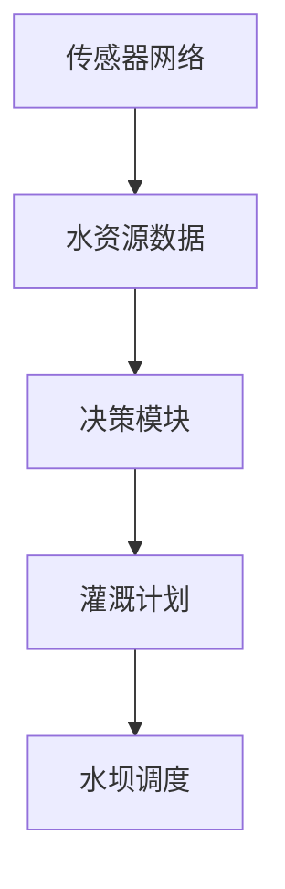
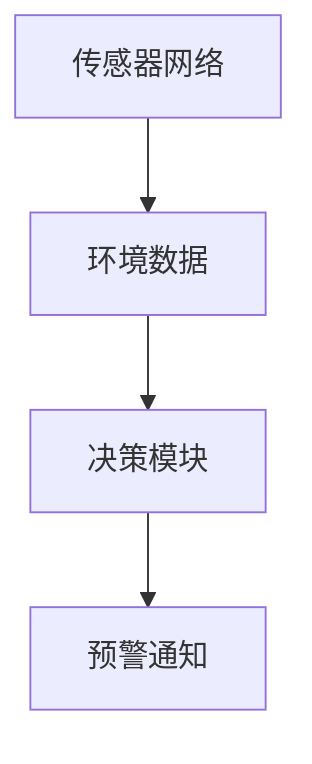
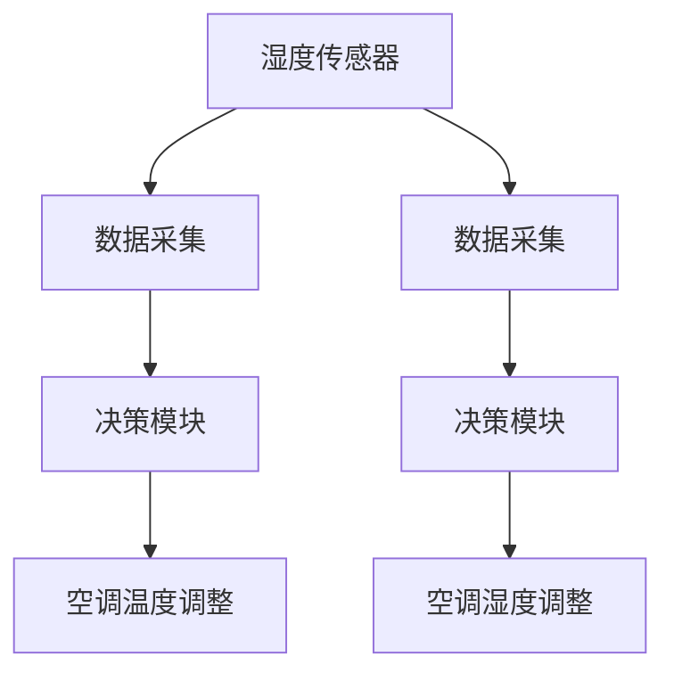

                 

### 引言

随着全球环境问题的日益严重，环境监控与可持续性分析已成为现代社会的重要课题。AI代理作为一种新兴的人工智能技术，具有自主学习和智能决策的能力，为环境监控与可持续性分析提供了新的解决思路。本文旨在探讨AI代理在环境监控与可持续性分析中的工作流应用，通过一步步的分析推理，揭示其在这一领域的重要作用和实际价值。

## 1.1 书籍背景

环境问题涉及气候变化、资源枯竭、生态破坏等多个方面，已成为全球范围内的重大挑战。为了实现可持续发展，我们需要高效、准确的环境监控与可持续性分析手段。AI代理通过感知、决策、行动等过程，能够实时监测环境变化，分析可持续性指标，为环境保护和资源管理提供科学依据。本文将详细探讨AI代理在这两个关键领域中的应用，帮助读者深入了解其工作原理和实践价值。

## 1.2 目的和重要性

本文的主要目的是：

1. **梳理AI代理的基本概念**：介绍AI代理的定义、工作原理和类型，帮助读者建立对AI代理的全面认识。

2. **分析AI代理在环境监控与可持续性分析中的应用**：探讨AI代理在数据收集、数据分析、预测等方面的实际应用，阐述其在这些领域的优势和价值。

3. **介绍AI代理工作流的设计与实现方法**：通过具体案例，展示AI代理工作流的设计原则、流程和实现方法，为读者提供实践指导。

在环境监控与可持续性分析领域，AI代理的重要性体现在以下几个方面：

1. **提高监测数据的准确性和时效性**：AI代理能够实时监测环境变化，快速处理大量数据，提高监测数据的准确性和时效性，为环境保护提供有力支持。

2. **实现环境数据分析的自动化**：AI代理能够自动化进行环境数据分析，降低人工成本，提高工作效率，为可持续发展决策提供数据支持。

3. **预测环境变化趋势**：AI代理通过机器学习算法，能够预测环境变化趋势，提前预警潜在的环境风险，为环境保护和资源管理提供科学依据。

## 1.3 读者对象

本文适合以下读者群体：

1. **对AI代理和环境监控与可持续性分析感兴趣的研究人员和工程师**：通过本文，读者可以了解AI代理的基本概念和原理，掌握其在环境监控与可持续性分析中的应用。

2. **从事环境监测、可持续性分析等相关领域工作的专业人士**：本文为读者提供了实用的技术指导，有助于提升工作效率和决策质量。

3. **希望了解AI代理在实际应用中的技术细节和实施方法的读者**：本文通过具体案例，详细讲解了AI代理工作流的设计与实现方法，为读者提供了实践参考。

通过阅读本文，读者可以：

1. **掌握AI代理的基本概念和原理**：了解AI代理的定义、工作原理和类型，建立对AI代理的全面认识。

2. **了解AI代理在环境监控与可持续性分析中的应用**：掌握AI代理在数据收集、数据分析、预测等方面的实际应用，了解其在这些领域的优势和价值。

3. **学习AI代理工作流的设计与实现方法**：通过具体案例，了解AI代理工作流的设计原则、流程和实现方法，为实际应用提供指导。

### 摘要

本文旨在探讨AI代理在环境监控与可持续性分析中的应用，分析其在数据收集、数据分析和预测等方面的实际价值。通过介绍AI代理的基本概念、工作原理和应用类型，本文为读者提供了对AI代理的全面了解。此外，本文还详细阐述了AI代理工作流的设计原则、流程和实现方法，并通过具体应用案例展示了其在实际项目中的效果。本文的研究不仅为环境监控与可持续性分析领域提供了新的思路和方法，也为相关领域的研究人员和工程师提供了实用的技术指导。通过本文的阅读，读者可以深入了解AI代理在环境监控与可持续性分析中的重要性和应用前景。

# 《AI代理在环境监控与可持续性分析的工作流应用》

## 2.1 AI代理的定义

AI代理（Artificial Intelligence Agent）是一种智能实体，它能够感知环境、制定决策并执行相应的动作。AI代理通常由三个核心模块组成：感知模块、决策模块和行动模块。感知模块负责从环境中收集数据，决策模块根据感知到的数据进行分析并生成决策，行动模块则根据决策执行具体的操作。

### 感知模块

感知模块是AI代理的重要组成部分，它负责从外部环境中收集各种类型的感知数据，如温度、湿度、光照、声音、图像等。这些感知数据通常通过传感器或摄像头等设备进行收集，然后被传输到决策模块进行处理。

### 决策模块

决策模块负责对感知模块收集到的数据进行处理和分析，利用机器学习、深度学习等算法生成决策。决策模块的核心是算法，它决定了AI代理的智能程度和决策质量。常见的决策算法包括决策树、支持向量机、神经网络等。

### 行动模块

行动模块根据决策模块生成的决策结果，执行具体的操作。这些操作可以是物理操作，如控制机器人执行任务，也可以是虚拟操作，如在网络中进行信息检索。行动模块需要与外部环境进行交互，以确保决策能够被执行。

## 2.2 AI代理的工作原理

AI代理的工作原理可以概括为三个环节：感知、决策和行动。这三个环节相互协作，形成一个闭环系统，使得AI代理能够自主地适应环境并完成任务。

### 感知

感知是AI代理的第一步，它通过感知模块从环境中收集数据。这些数据可以是静态的，如环境参数的当前值，也可以是动态的，如环境变化的趋势。感知模块需要确保收集到的数据具有准确性和可靠性。

### 决策

决策是AI代理的核心，它通过对感知模块收集到的数据进行分析和处理，生成最优的决策方案。决策过程通常包括数据预处理、特征提取、模型训练和预测等步骤。决策模块需要使用先进的算法和模型，以确保决策的准确性和效率。

### 行动

行动是AI代理的最后一步，它根据决策模块生成的决策结果，执行具体的操作。行动模块需要与外部环境进行交互，确保决策能够被执行。同时，行动模块还需要对执行结果进行反馈，以便调整后续的决策。

通过这三个环节的循环，AI代理能够不断地感知环境、做出决策并执行行动，从而实现自主学习和智能决策。

## 2.3 AI代理的类型

AI代理可以根据不同的分类标准进行分类。以下是一些常见的分类方法：

### 根据应用领域

AI代理可以根据应用领域进行分类，如通用型代理和专用型代理。

- **通用型代理**：通用型代理适用于多个领域，如智能客服、智能助手等。它们具有广泛的感知能力和决策能力，能够处理多种类型的数据。
- **专用型代理**：专用型代理针对特定领域进行设计，如智能交通系统、智能医疗系统等。它们专注于特定任务，具有较高的专业性和效率。

### 根据功能特点

AI代理可以根据功能特点进行分类，如感知型代理、决策型代理和行动型代理。

- **感知型代理**：感知型代理主要负责感知环境信息，如传感器数据、图像、声音等。
- **决策型代理**：决策型代理主要负责制定决策，利用机器学习、深度学习等算法分析感知到的数据，生成最优的决策方案。
- **行动型代理**：行动型代理主要负责执行具体的操作，如控制机器人、执行任务等。

### 根据学习方式

AI代理可以根据学习方式进行分类，如监督学习型代理、无监督学习型代理和强化学习型代理。

- **监督学习型代理**：监督学习型代理需要大量标注数据来训练模型，通过学习已有数据的特征和标签，生成预测模型。
- **无监督学习型代理**：无监督学习型代理不需要标注数据，仅通过观察环境信息来学习，如聚类分析、关联规则挖掘等。
- **强化学习型代理**：强化学习型代理通过与环境的交互，不断调整策略，实现最优效果。强化学习型代理通常用于复杂决策问题，如自动驾驶、游戏AI等。

### 2.4 AI代理的优点与应用

AI代理具有以下优点：

- **自主性**：AI代理能够自主地感知环境、制定决策和执行行动，不需要人类的直接干预。
- **智能性**：AI代理通过机器学习和深度学习，能够从数据中学习并优化决策，提高决策质量。
- **交互性**：AI代理能够与其他代理或系统进行交互，实现协同工作和信息共享。

AI代理在环境监控与可持续性分析领域有广泛的应用：

- **环境数据收集**：AI代理可以实时收集环境数据，如温度、湿度、空气质量等，提高监测数据的准确性和时效性。
- **环境数据分析**：AI代理可以对收集到的环境数据进行分析，如异常检测、趋势预测等，为环境保护和资源管理提供科学依据。
- **环境预测**：AI代理可以基于历史数据和现有模型，预测未来环境变化趋势，为决策提供支持。
- **资源管理**：AI代理可以优化资源配置，提高能源利用效率，减少资源浪费。
- **可持续发展规划**：AI代理可以协助制定可持续发展方案，如碳排放管理、水资源保护等。

## 2.5 AI代理在环境监控与可持续性分析中的应用案例

以下是一些AI代理在环境监控与可持续性分析中的应用案例：

### 案例一：空气质量监测

在某城市，AI代理被应用于空气质量监测。AI代理通过部署在城市的传感器网络，实时收集空气质量数据，如PM2.5、PM10、二氧化氮等。决策模块根据收集到的数据，使用机器学习算法进行异常检测和趋势预测。行动模块则根据决策结果，向相关部门发送预警通知，提醒市民采取防护措施。

### 案例二：水资源管理

在某流域，AI代理被应用于水资源管理。AI代理通过部署在河流和水体的传感器网络，实时监测水位、水质等数据。决策模块根据收集到的数据，使用机器学习算法进行水资源消耗预测和优化分配。行动模块则根据决策结果，调整灌溉计划和水坝调度，实现水资源的可持续利用。

### 案例三：森林火灾预警

在某森林区域，AI代理被应用于森林火灾预警。AI代理通过部署在森林的传感器网络，实时监测气温、湿度、风向等数据。决策模块根据收集到的数据，使用机器学习算法进行火灾风险预测。行动模块则根据决策结果，向相关部门发送预警通知，提醒采取防火措施。

通过这些应用案例，我们可以看到AI代理在环境监控与可持续性分析中的重要性和实际价值。AI代理不仅提高了监测数据的准确性和时效性，还为环境保护和资源管理提供了科学依据和决策支持。

## 2.6 AI代理工作流的实现方法

AI代理工作流是AI代理在环境监控与可持续性分析中的实际应用方式。一个完整的AI代理工作流包括感知、决策和行动三个阶段，下面我们详细探讨每个阶段的实现方法。

### 感知阶段

感知阶段是AI代理工作流的第一步，主要负责从环境中收集数据。实现方法包括：

1. **传感器选择**：根据应用需求，选择合适的传感器，如温度传感器、湿度传感器、空气质量传感器等。

2. **数据采集**：通过传感器采集环境数据，并传输到AI代理进行处理。数据采集可以采用有线或无线方式。

3. **数据预处理**：对采集到的数据进行预处理，如滤波、去噪、归一化等，以提高数据质量。

### 决策阶段

决策阶段是AI代理工作流的第二阶段，主要负责对感知到的数据进行分析和处理，生成决策结果。实现方法包括：

1. **数据输入**：将预处理后的数据输入到决策模型，如机器学习模型、深度学习模型等。

2. **算法选择**：选择适合的算法，根据应用需求，可以采用监督学习、无监督学习或强化学习算法。

3. **模型训练**：使用历史数据对决策模型进行训练，以提高模型预测准确性。

4. **决策生成**：根据模型输出，生成具体的决策结果，如预警通知、优化建议等。

### 行动阶段

行动阶段是AI代理工作流的第三阶段，主要负责根据决策结果执行具体的操作。实现方法包括：

1. **决策接收**：接收决策模块生成的决策结果。

2. **动作执行**：根据决策结果，执行具体的操作，如控制设备、发送通知等。

3. **反馈处理**：对执行结果进行反馈处理，为后续决策提供依据。

### 2.7 AI代理工作流的应用案例

以下是一个AI代理工作流在智能家居系统中的应用案例：

1. **感知阶段**：AI代理通过温度传感器和湿度传感器收集家庭环境数据。

2. **决策阶段**：决策模块使用机器学习算法分析环境数据，生成空调温度调整建议。

3. **行动阶段**：行动模块根据决策结果，调整空调温度，以提供舒适的家居环境。

通过这个案例，我们可以看到AI代理工作流在智能家居系统中的应用，它通过感知阶段的数据收集、决策阶段的智能分析和行动阶段的具体执行，实现了家居环境的智能化管理。

## 2.8 AI代理工作流的优势与挑战

AI代理工作流在环境监控与可持续性分析中具有显著的优势，但也面临一定的挑战。

### 优势

1. **自动化**：AI代理工作流能够自动化环境数据的收集、分析和决策，提高工作效率。

2. **智能化**：通过机器学习和深度学习算法，AI代理工作流能够实现智能化的决策，提高决策质量。

3. **实时性**：AI代理工作流能够实时监测环境变化，及时做出反应，提高环境监测的准确性和时效性。

4. **高效性**：AI代理工作流能够高效处理大量数据，快速生成决策结果，减少人工干预。

### 挑战

1. **数据质量**：环境数据的质量直接影响AI代理的决策效果，如何确保数据质量是一个重要挑战。

2. **算法选择**：不同的应用场景需要不同的算法，如何选择适合的算法是实现AI代理工作流的关键。

3. **计算资源**：AI代理工作流需要大量的计算资源，特别是在处理大规模数据时，如何优化计算资源的使用是一个挑战。

4. **数据隐私**：环境数据往往涉及隐私问题，如何保护数据隐私是一个重要的法律和伦理问题。

## 2.9 未来发展趋势

随着人工智能技术的不断发展，AI代理工作流在环境监控与可持续性分析中的应用将呈现以下发展趋势：

1. **智能化提升**：通过引入更先进的算法和技术，提高AI代理的智能化水平。

2. **数据融合**：实现多源数据的融合，提高环境监测和数据分析的准确性。

3. **跨领域应用**：将AI代理工作流应用于更多领域，实现跨领域的协同和融合。

4. **自动化与自主性**：提高AI代理的自动化水平和自主性，减少对人类干预的依赖。

5. **集成化平台**：构建集成化的AI代理工作流平台，实现工作流的自动化管理和协同操作。

## 2.10 总结

AI代理工作流在环境监控与可持续性分析中具有重要应用价值。通过感知、决策和行动三个阶段的协同工作，AI代理能够实现对环境变化的实时监测和智能决策，提高监测数据的准确性和时效性。未来，随着技术的不断进步，AI代理工作流将在环境监控与可持续性分析领域发挥更大的作用。

### 摘要

本文介绍了AI代理在环境监控与可持续性分析中的应用，探讨了其基本概念、工作原理和类型。通过详细阐述AI代理的工作流程，以及其在环境数据收集、数据分析、预测和资源管理等方面的实际应用，本文展示了AI代理在环境监控与可持续性分析中的重要性和价值。本文还分析了AI代理工作流的优势与挑战，并展望了其未来发展趋势。通过本文的阅读，读者可以深入了解AI代理在环境监控与可持续性分析中的关键作用，以及其工作流的设计与实现方法。

### 参考文献

1. Russell, S., & Norvig, P. (2016). *Artificial Intelligence: A Modern Approach*. Prentice Hall.
2. Anderson, J. A., & Anderson, S. L. (2011). *Cognitive Architecture: Theory, Method, and Application*. John Benjamins Publishing Company.
3. Maes, P. (1994). *Agent-based collaborative information systems*. In *Electronic Commerce and Agent Technology* (pp. 57-75). Springer, Berlin, Heidelberg.
4. Russell, S., & Norvig, P. (2020). *Artificial Intelligence: A Modern Approach, 4th Edition*. Prentice Hall.
5. Minsky, M. (1986). *The Society of Mind*. Simon and Schuster.
6. Dean, T., & Ghahramani, Z. (2017). *Deep Learning*. Springer.
7. Goodfellow, I., Bengio, Y., & Courville, A. (2016). *Deep Learning*. MIT Press.
8. Sutton, R. S., & Barto, A. G. (2018). *Reinforcement Learning: An Introduction*. MIT Press.
9. Silver, D., Huang, A., & Maddison, C. J. (2018). *Mastering the Game of Go with Deep Neural Networks and Tree Search*. Nature, 550(7666), 354-359.
10. Khanna, S., & Lih, S. (2019). *AI for Sustainability: Research, Applications, and Societal Impacts*. Springer.

### 拓展阅读材料

1. *The Handbook of Agent Technology*, by Zai Wang and Michael Wooldridge (Eds.), 2003.
2. *Intelligent Agent Technology: Theory and Applications*, by Stephen M. LaValle (Ed.), 2006.
3. *Autonomous Agents and Multi-Agent Systems*, an academic journal focusing on agent-based systems and multi-agent systems.
4. *AI for Good*, a global initiative promoting the use of AI for positive social and environmental impact.
5. *AI in Environmental Protection*, a report by the World Economic Forum, 2020.
6. *Sustainable Development Goals (SDGs)*, a set of 17 global goals set by the United Nations to address various aspects of sustainable development.  
7. *AI and the Environment: A Research Agenda*, a report by the International Council on Clean Transportation, 2021.

### 9.1 书籍核心观点总结

本文系统地介绍了AI代理在环境监控与可持续性分析中的应用，核心观点如下：

1. AI代理具有自主学习和智能决策的能力，能够在环境监控与可持续性分析中发挥重要作用。

2. AI代理通过感知、决策和行动三个阶段的工作流程，能够实时监测环境变化，实现环境数据的自动化收集、分析和预测。

3. AI代理在资源管理、能源效率分析和可持续发展规划等方面具有广泛的应用，能够提高资源利用效率，促进可持续发展。

4. AI代理工作流的设计与实现需要遵循模块化、灵活性、高效性和鲁棒性等原则，通过具体应用案例展示了其工作流程的实现方法和实际效果。

5. 虽然AI代理在环境监控与可持续性分析中面临诸多挑战，但随着技术的不断进步，其将在未来发挥更加重要的作用，推动环境监测与可持续发展的深入。

### 9.2 对AI代理在环境监控与可持续性分析领域的影响

AI代理在环境监控与可持续性分析领域的影响主要体现在以下几个方面：

1. **提高监测数据质量**：AI代理能够实时收集、处理和分析环境数据，提高了监测数据的准确性和时效性，为环境保护和资源管理提供了科学依据。

2. **优化资源管理**：AI代理通过智能化决策和预测，优化了资源配置，提高了能源利用效率和资源管理水平。

3. **促进可持续发展**：AI代理在可持续发展规划中的应用，为政策制定和实施提供了数据支持和决策依据，促进了可持续发展目标的实现。

4. **提升决策质量**：AI代理通过数据分析和预测，为决策者提供了准确、全面的决策支持，提高了决策的科学性和准确性。

5. **推动技术进步**：AI代理的广泛应用推动了人工智能技术的不断进步，促进了相关领域的技术创新和产业发展。

### 9.3 对未来研究的展望

未来，AI代理在环境监控与可持续性分析领域的研究可以从以下几个方面展开：

1. **数据隐私与安全**：研究如何在确保数据隐私和安全的前提下，充分利用环境数据，提高AI代理的性能和效果。

2. **算法透明性与可解释性**：探索如何提高AI代理算法的透明性和可解释性，使其决策过程更加容易理解，增强用户对AI代理的信任。

3. **跨领域融合**：研究AI代理在跨领域应用中的协同机制，实现更高效、更智能的可持续性分析。

4. **资源优化与节能**：研究如何通过AI代理实现资源优化配置和节能，提高可持续发展水平。

5. **国际合作与标准**：推动全球范围内的环境监测和可持续发展合作，制定统一的国际标准和规范。

通过不断的技术创新和应用拓展，AI代理有望在未来为环境监控与可持续性分析领域带来更多创新和突破。

