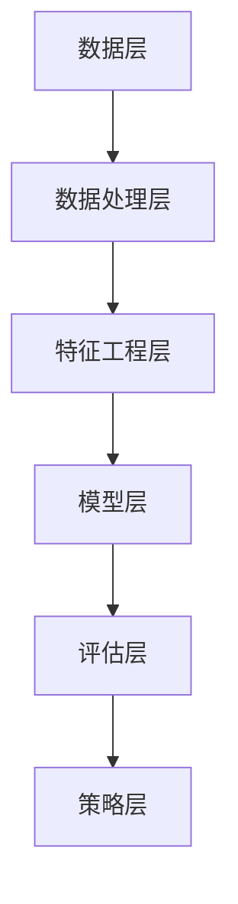

                 

## 《AI优化促销策略：案例分析与实践》

> **关键词**：人工智能，促销策略，机器学习，数据挖掘，客户细分，RFM模型

> **摘要**：本文深入探讨如何利用人工智能和机器学习技术优化促销策略。通过案例分析，详细介绍了数据收集与预处理、特征工程与选择、核心算法原理讲解、数学模型和公式详解以及项目实战的过程，帮助企业和营销人员提升促销效果，实现商业价值的最大化。

### 目录

#### 第一部分：AI优化促销策略概述

#### 第1章：AI优化促销策略的背景与重要性

##### 1.1 促销策略的演变历程

##### 1.2 AI技术在促销策略中的应用现状

##### 1.3 AI优化促销策略的优势

#### 第2章：AI优化促销策略的核心概念与架构

##### 2.1 数据挖掘与机器学习基础

##### 2.2 促销活动的目标设定与评估指标

##### 2.3 AI优化促销策略的架构设计

#### 第二部分：AI优化促销策略的技术细节

#### 第3章：数据收集与预处理

##### 3.1 促销数据的来源与类型

##### 3.2 数据预处理方法与技巧

##### 3.3 数据质量评估与数据清洗

#### 第4章：特征工程与选择

##### 4.1 特征工程的概念与作用

##### 4.2 特征提取与转换方法

##### 4.3 特征选择算法与应用

#### 第5章：核心算法原理讲解

##### 5.1 回归算法与促销预测

##### 5.2 分类算法与顾客行为分析

##### 5.3 聚类算法与市场细分

#### 第6章：数学模型和公式详解

##### 6.1 回归模型的数学公式

##### 6.2 分类模型的数学公式

##### 6.3 聚类模型的数学公式

#### 第7章：项目实战案例分析

##### 7.1 案例背景与目标

##### 7.2 数据收集与预处理

##### 7.3 特征工程与选择

##### 7.4 模型构建与优化

##### 7.5 模型评估与部署

#### 第8章：AI优化促销策略的未来发展趋势

##### 8.1 技术发展趋势分析

##### 8.2 新兴技术在促销策略中的应用

##### 8.3 促销策略优化的未来挑战与机遇

#### 附录

##### 附录A：AI优化促销策略开发工具与资源

###### A.1 主流机器学习框架对比

###### A.2 数据处理工具与应用

###### A.3 促销策略优化相关数据库与API

---

### 引言

在数字化和大数据时代，促销策略的优化已经成为企业竞争的关键。传统的促销策略往往依赖于经验和直觉，难以适应快速变化的市场环境。而人工智能（AI）技术的快速发展，为促销策略的优化带来了新的契机。通过AI和机器学习技术，企业可以更精准地分析顾客行为，预测市场需求，制定更加有效的促销策略。

本文旨在探讨如何利用AI技术优化促销策略，通过案例分析，详细展示从数据收集、预处理、特征工程到核心算法应用、数学模型详解以及项目实战的全过程。文章结构如下：

1. **AI优化促销策略的背景与重要性**：介绍促销策略的演变历程，分析AI在促销策略中的应用现状和优势。
2. **AI优化促销策略的核心概念与架构**：讲解数据挖掘、机器学习基础，促销活动的目标设定与评估指标，以及AI优化促销策略的架构设计。
3. **AI优化促销策略的技术细节**：深入探讨数据收集与预处理、特征工程与选择、核心算法原理讲解以及数学模型和公式详解。
4. **项目实战案例分析**：通过实际案例，展示如何应用AI优化促销策略，包括数据收集与预处理、特征工程与选择、模型构建与优化、模型评估与部署。
5. **AI优化促销策略的未来发展趋势**：分析技术发展趋势、新兴技术在促销策略中的应用以及未来挑战与机遇。
6. **附录**：提供AI优化促销策略开发工具与资源，包括主流机器学习框架对比、数据处理工具与应用以及促销策略优化相关数据库与API。

通过本文的阅读，读者将全面了解AI优化促销策略的理论与实践，掌握从数据到策略优化的完整流程，为企业的市场营销提供有力支持。

### 第一部分：AI优化促销策略概述

#### 第1章：AI优化促销策略的背景与重要性

##### 1.1 促销策略的演变历程

促销策略是企业为了增加产品销量和提升市场份额而制定的一系列营销活动。自古以来，商家们就懂得利用促销手段吸引顾客，增加销售额。传统的促销策略主要包括打折、赠品、优惠券、限时特惠等。这些策略虽然在短期内能够带来销售增长，但缺乏系统性和科学性，往往难以持续。

随着互联网和大数据技术的发展，促销策略开始从经验驱动向数据驱动转变。企业可以利用数据分析技术，通过对大量顾客数据的挖掘，了解顾客行为、需求和市场趋势，从而制定更加精准和高效的促销策略。

##### 1.2 AI技术在促销策略中的应用现状

人工智能（AI）技术的迅速发展，为促销策略的优化提供了强大的工具。目前，AI技术在促销策略中的应用主要体现在以下几个方面：

1. **个性化推荐**：通过机器学习算法，分析顾客的购物行为和偏好，为顾客提供个性化的商品推荐和促销信息，提高用户满意度和转化率。

2. **需求预测**：利用时间序列分析和回归模型，预测市场需求和顾客购买行为，帮助企业制定更加精准的库存管理和促销计划。

3. **客户细分**：通过聚类分析和分类算法，将顾客按照不同的特征划分为不同的群体，为每个群体定制不同的促销策略，提高促销效果。

4. **优化定价策略**：通过优化算法，分析不同价格对销售量的影响，制定动态定价策略，提高利润率。

##### 1.3 AI优化促销策略的优势

AI优化促销策略相比传统促销策略具有以下优势：

1. **数据驱动的决策**：传统促销策略往往依赖于经验和直觉，而AI优化促销策略则是基于大量数据分析和模型预测，更加科学和客观。

2. **提高精准度**：通过AI技术，企业可以更精准地了解顾客需求和偏好，从而制定更有针对性的促销策略，提高转化率和顾客满意度。

3. **提高效率**：AI优化促销策略可以自动化处理大量数据，减少人工工作量，提高营销效率。

4. **动态调整**：传统促销策略通常是一成不变的，而AI优化促销策略可以根据实时数据和市场变化，动态调整促销策略，更加灵活和适应市场。

5. **降低成本**：通过精准的促销策略，企业可以降低营销成本，提高投资回报率。

总之，AI优化促销策略不仅能够帮助企业提高销售和市场份额，还能够提升顾客体验和品牌价值，是现代企业市场营销的重要手段。

### 第一部分：AI优化促销策略概述

#### 第2章：AI优化促销策略的核心概念与架构

##### 2.1 数据挖掘与机器学习基础

数据挖掘（Data Mining）是指从大量数据中提取有价值的信息和知识的过程。数据挖掘通常包括以下几个步骤：

1. **数据收集**：收集与促销策略相关的数据，如顾客行为数据、销售数据、市场调查数据等。
2. **数据预处理**：对原始数据进行清洗、转换和整合，使其符合分析要求。
3. **特征工程**：从数据中提取有用的特征，用于后续的模型训练和分析。
4. **模型训练**：利用机器学习算法，对特征数据进行分析和建模。
5. **模型评估**：通过交叉验证等方法评估模型的性能和准确性。

机器学习（Machine Learning）是数据挖掘的核心技术之一，它通过算法让计算机从数据中自动学习规律和模式，从而做出预测和决策。常见的机器学习算法包括回归分析、决策树、支持向量机、神经网络等。

##### 2.2 促销活动的目标设定与评估指标

制定有效的促销策略需要明确促销活动的目标。常见的促销目标包括：

1. **增加销售额**：通过促销活动提高产品销量和销售额。
2. **提升品牌知名度**：通过促销活动提升品牌在市场上的知名度和美誉度。
3. **提高顾客忠诚度**：通过促销活动增强顾客对品牌的忠诚度，增加重复购买率。
4. **清理库存**：通过促销活动快速清理过期或积压的库存。

为了评估促销活动的效果，需要设定相应的评估指标。常见的评估指标包括：

1. **转化率**：促销活动带来的实际购买量与参与促销活动的总用户数之比。
2. **投资回报率（ROI）**：促销活动产生的收益与促销投入之比。
3. **顾客满意度**：通过调查或反馈了解顾客对促销活动的满意程度。
4. **市场占有率**：促销活动期间产品的市场占有率与总市场占有率之比。

##### 2.3 AI优化促销策略的架构设计

AI优化促销策略的架构设计主要包括以下几个关键组件：

1. **数据层**：存储与促销策略相关的各种数据，如顾客行为数据、销售数据、市场调查数据等。
2. **数据处理层**：负责数据的收集、清洗、转换和整合，为后续分析提供高质量的数据。
3. **特征工程层**：从原始数据中提取有用的特征，为模型训练提供输入。
4. **模型层**：利用机器学习算法，对特征数据进行建模和分析。
5. **评估层**：对模型进行评估和优化，确保模型的有效性和准确性。
6. **策略层**：根据模型分析结果，制定和调整促销策略。

以下是一个简单的AI优化促销策略的Mermaid流程图：



通过这个架构，企业可以系统地应用AI技术，从数据收集、处理到特征工程、模型训练和策略调整，实现促销策略的持续优化。

### 第二部分：AI优化促销策略的技术细节

#### 第3章：数据收集与预处理

在AI优化促销策略中，数据收集和预处理是至关重要的环节。数据质量直接影响到后续的特征工程和模型训练效果。因此，深入理解和掌握数据收集与预处理的方法和技巧，是成功实施AI优化促销策略的关键。

##### 3.1 促销数据的来源与类型

促销数据的主要来源包括以下几个方面：

1. **内部数据**：
   - **销售数据**：记录每个销售渠道（如线上电商平台、实体店等）的销售数据，包括销售额、销售量、产品种类等。
   - **库存数据**：记录库存水平、库存周转率等。
   - **顾客数据**：记录顾客的购买历史、消费金额、购买频率等。

2. **外部数据**：
   - **市场调查数据**：通过问卷调查、访谈等方式收集市场数据，了解顾客的需求、偏好和市场趋势。
   - **社交媒体数据**：通过社交媒体平台（如微博、微信、Facebook等）收集顾客的反馈、评论和讨论，分析顾客情绪和口碑。
   - **行业数据**：从行业报告、市场研究公司等获取行业趋势、竞争对手数据等。

促销数据的类型主要包括：

- **结构化数据**：如销售数据、库存数据等，通常以表格形式存储，便于进行数据处理和分析。
- **非结构化数据**：如社交媒体数据、市场调查数据等，通常以文本、图片、音频等形式存在，需要通过文本挖掘、图像识别等技术进行转换和处理。

##### 3.2 数据预处理方法与技巧

数据预处理是数据分析和建模的重要基础，主要任务包括数据清洗、数据转换和数据整合。以下是几种常用的数据预处理方法与技巧：

1. **数据清洗**：
   - **缺失值处理**：对于缺失值，可以采用删除、填充或插值等方法进行处理。例如，使用平均值、中位数或最近观测值来填充缺失值。
   - **异常值处理**：识别和处理数据中的异常值，如使用3倍标准差法、箱线图法等。
   - **重复数据删除**：删除重复的数据条目，确保数据的唯一性。

2. **数据转换**：
   - **数据规范化**：通过归一化或标准化方法，将不同尺度上的数据进行转换，使其具有相同的量纲和范围。
   - **数据编码**：将类别型数据转换为数值型数据，如使用独热编码（One-Hot Encoding）或标签编码（Label Encoding）。
   - **特征构造**：通过特征交叉、特征分解等方法，构造新的特征，以增强模型的预测能力。

3. **数据整合**：
   - **数据合并**：将来自不同来源的数据进行合并，形成统一的数据集。例如，将顾客购买数据和社交媒体数据进行合并，以便进行更全面的分析。
   - **数据分割**：将数据集划分为训练集、验证集和测试集，以评估模型的性能和泛化能力。

##### 3.3 数据质量评估与数据清洗

数据质量评估是数据预处理的重要环节，主要任务包括以下方面：

1. **完整性**：检查数据是否完整，是否存在缺失值或重复值。
2. **准确性**：评估数据是否准确，是否存在异常值或错误。
3. **一致性**：检查数据在不同来源之间是否一致，如时间戳、度量单位等。
4. **时效性**：评估数据是否及时，是否反映了最新的市场情况和顾客行为。

数据清洗的具体步骤如下：

1. **初步检查**：通过可视化工具（如散点图、直方图等）初步检查数据的质量和分布情况。
2. **清洗缺失值**：根据缺失值的类型和比例，选择合适的处理方法，如删除、填充或插值。
3. **清洗异常值**：使用统计方法（如3倍标准差法、箱线图法等）识别和处理异常值。
4. **数据编码**：将类别型数据转换为数值型数据，以便进行后续的分析和建模。

通过数据收集与预处理，可以确保数据的准确性和一致性，为后续的特征工程和模型训练奠定坚实的基础。在实际应用中，数据预处理的过程往往需要多次迭代和优化，以不断提高数据质量，提升模型的性能和预测能力。

#### 第4章：特征工程与选择

在AI优化促销策略中，特征工程是数据挖掘和机器学习的关键环节，它通过提取和构造有效的特征，提升模型的预测性能和泛化能力。特征工程不仅涉及如何从原始数据中提取有价值的信息，还包括如何选择和组合这些特征，使其在模型训练中发挥最大作用。

##### 4.1 特征工程的概念与作用

特征工程（Feature Engineering）是指从原始数据中提取和构造有用特征的过程。特征是用于训练机器学习模型的信息单位，它们描述了数据的某些方面，并用于指导模型的决策过程。特征工程的目标是通过优化特征的表达形式，增强模型的学习能力和预测效果。

特征工程的作用主要体现在以下几个方面：

1. **提高模型性能**：通过特征工程，可以提取出更加符合问题特性的特征，使模型能够更好地拟合训练数据，提高预测准确性和泛化能力。
2. **降低模型复杂度**：通过特征选择和特征构造，可以减少模型的复杂度，提高模型的训练速度和计算效率。
3. **增强模型可解释性**：通过特征工程，可以构建出易于理解的特征，增强模型的可解释性，有助于理解模型决策背后的原因。
4. **适应不同类型的数据**：特征工程可以根据不同的数据类型和特征分布，选择合适的特征处理方法，使模型能够适应多样化的数据环境。

##### 4.2 特征提取与转换方法

特征提取和转换是特征工程的核心步骤，主要包括以下几种方法：

1. **数值特征的处理**：
   - **标准化**：通过标准化方法（如Z-Score标准化、Min-Max标准化等），将不同尺度上的数值特征转换为具有相同尺度范围的数值，消除特征之间的尺度差异。
   - **归一化**：将数值特征映射到[0, 1]的范围内，便于模型计算和优化。
   - **稀疏编码**：通过稀疏编码技术，将高维特征映射到低维空间，减少特征维度，提高计算效率。

2. **类别特征的处理**：
   - **独热编码**（One-Hot Encoding）：将类别特征转换为二进制向量，每个类别对应一个维度，适用于类别数量较少的情况。
   - **标签编码**（Label Encoding）：将类别特征映射为整数，适用于类别数量较多且具有一定的顺序关系的情况。

3. **文本特征的处理**：
   - **词袋模型**（Bag of Words，BoW）：将文本数据表示为词频向量，适用于文本分类和聚类任务。
   - **TF-IDF**（Term Frequency-Inverse Document Frequency）：通过计算词频和逆文档频率，将文本数据转换为数值型特征，强调重要词汇。
   - **词嵌入**（Word Embedding）：将文本数据转换为低维向量表示，通过神经网络训练，使语义相近的词汇在向量空间中靠近。

4. **时间序列特征的处理**：
   - **季节性分解**：通过时间序列分解，提取出季节性、趋势性和周期性成分，用于预测和分析。
   - **滑动窗口**：通过滑动窗口方法，将时间序列数据划分为不同的子序列，用于特征构造。

##### 4.3 特征选择算法与应用

特征选择（Feature Selection）是特征工程的重要步骤，旨在从大量特征中筛选出最有价值的特征，减少模型的复杂度和计算负担。以下是一些常见的特征选择算法：

1. **过滤式特征选择**：
   - **相关性筛选**：通过计算特征与目标变量之间的相关性，筛选出相关性较高的特征。
   - **信息增益**：通过计算特征对分类信息的增益，筛选出信息量较高的特征。

2. **包装式特征选择**：
   - **递归特征消除**（Recursive Feature Elimination，RFE）：通过递归地训练和评估模型，逐步剔除贡献较小的特征。
   - **遗传算法**：通过模拟自然选择过程，优化特征组合，筛选出最优特征子集。

3. **嵌入式特征选择**：
   - **LASSO**（Least Absolute Shrinkage and Selection Operator）：在回归模型中引入L1惩罚项，实现特征选择。
   - **随机森林**：通过随机森林模型，评估特征的重要性，筛选出重要的特征。

在实际应用中，可以根据数据的特性和模型的要求，选择合适的特征提取和转换方法，并结合不同的特征选择算法，构建有效的特征子集，提高模型的预测性能和泛化能力。通过特征工程和特征选择，企业可以更精准地分析顾客行为，制定更加有效的促销策略，提升市场竞争力。

#### 第5章：核心算法原理讲解

在AI优化促销策略中，核心算法的选择和实现对于模型的效果和性能具有决定性的影响。本章节将详细讲解三种常见的核心算法：回归算法、分类算法和聚类算法，并探讨这些算法在促销策略优化中的应用。

##### 5.1 回归算法与促销预测

回归算法是一种用于预测连续值输出的监督学习算法，其目的是建立因变量（目标变量）与自变量（特征变量）之间的数学关系模型。在促销策略优化中，回归算法可以用于预测销售额、市场需求等连续值指标。

1. **线性回归**：

线性回归是最简单的回归算法之一，其模型假设目标变量是特征变量的线性组合。线性回归模型的数学公式如下：

$$
y = \beta_0 + \beta_1x_1 + \beta_2x_2 + ... + \beta_nx_n
$$

其中，$y$ 是预测的目标变量，$x_1, x_2, ..., x_n$ 是特征变量，$\beta_0, \beta_1, \beta_2, ..., \beta_n$ 是回归系数。

线性回归模型通常通过最小二乘法（Least Squares）进行参数估计，即通过最小化预测值与实际值之间的误差平方和来求解回归系数。

伪代码实现：

```python
# 输入数据
X_train, y_train = ...

# 特征工程
X_train_processed = preprocess_features(X_train)

# 模型训练
model = LinearRegression()
model.fit(X_train_processed, y_train)

# 预测
y_pred = model.predict(X_train_processed)

# 模型评估
evaluation_metrics = evaluate_model(y_pred, y_train)
print(evaluation_metrics)
```

2. **多项式回归**：

多项式回归是对线性回归的扩展，可以用于建立更复杂的非线性关系模型。多项式回归的公式如下：

$$
y = \beta_0 + \beta_1x_1 + \beta_2x_2^2 + ... + \beta_nx_n^n
$$

通过引入多项式项，可以捕捉数据中的非线性关系，提高模型的预测性能。但多项式回归会增加模型的复杂度和计算成本，需谨慎使用。

##### 5.2 分类算法与顾客行为分析

分类算法是一种用于预测离散值输出的监督学习算法，其目的是将数据分类到不同的类别中。在促销策略优化中，分类算法可以用于分析顾客行为，识别潜在客户等。

1. **决策树**：

决策树是一种基于树形结构进行决策的算法，其核心思想是通过一系列判断规则将数据划分为不同的类别。决策树的数学模型如下：

$$
f(x) = \sum_{i=1}^{n} \beta_i C_i(x)
$$

其中，$f(x)$ 是预测结果，$C_i(x)$ 是第$i$个条件句，$\beta_i$ 是条件句的权重。

决策树算法简单直观，易于解释，但可能产生过拟合现象。在实际应用中，常通过剪枝方法（如ID3、C4.5等）来防止过拟合。

伪代码实现：

```python
# 输入数据
X_train, y_train = ...

# 特征工程
X_train_processed = preprocess_features(X_train)

# 模型训练
model = DecisionTreeClassifier()
model.fit(X_train_processed, y_train)

# 预测
y_pred = model.predict(X_train_processed)

# 模型评估
evaluation_metrics = evaluate_model(y_pred, y_train)
print(evaluation_metrics)
```

2. **支持向量机（SVM）**：

支持向量机是一种强大的分类算法，其核心思想是找到一个最优的超平面，使得分类边界具有最大的间隔。SVM的数学模型如下：

$$
\min_{\beta, \beta_0} \frac{1}{2} \sum_{i=1}^{n} (\beta \cdot \beta)^2 + C \sum_{i=1}^{n} \xi_i
$$

$$
\text{subject to}: y_i (\beta \cdot x_i + \beta_0) \geq 1 - \xi_i
$$

其中，$\beta$ 是权重向量，$\beta_0$ 是偏置项，$C$ 是惩罚参数，$\xi_i$ 是松弛变量。

SVM算法在处理高维数据和线性不可分问题时表现出色，但训练时间较长，适用于小数据集。

伪代码实现：

```python
# 输入数据
X_train, y_train = ...

# 特征工程
X_train_processed = preprocess_features(X_train)

# 模型训练
model = SVC()
model.fit(X_train_processed, y_train)

# 预测
y_pred = model.predict(X_train_processed)

# 模型评估
evaluation_metrics = evaluate_model(y_pred, y_train)
print(evaluation_metrics)
```

##### 5.3 聚类算法与市场细分

聚类算法是一种无监督学习算法，其目的是将数据集划分为多个类别，使同一类别内的数据尽可能相似，不同类别间的数据尽可能不同。在促销策略优化中，聚类算法可以用于市场细分，识别不同的顾客群体，为个性化促销策略提供依据。

1. **K-means算法**：

K-means算法是一种最常用的聚类算法，其核心思想是将数据分为K个类别，使得每个类别内的数据点之间的距离最小。K-means算法的数学模型如下：

$$
\min_{C_1, C_2, ..., C_K} \sum_{i=1}^{K} \sum_{x \in C_i} ||x - \mu_i||^2
$$

其中，$C_1, C_2, ..., C_K$ 是K个类别，$\mu_i$ 是第$i$个类别的中心点。

K-means算法简单高效，但容易出现局部最优解，且对初始聚类中心敏感。在实际应用中，常通过多次随机初始化，选择最优聚类结果。

伪代码实现：

```python
# 输入数据
X = ...

# 初始化聚类中心
centroids = initialize_centroids(X, K)

# 迭代计算
while not converged:
    # 计算新中心点
    new_centroids = compute_new_centroids(X, centroids)
    # 更新中心点
    centroids = new_centroids
    # 判断是否收敛
    if is_converged(centroids):
        break

# 聚类结果
labels = assign_labels(X, centroids)
```

2. **层次聚类算法**：

层次聚类算法是一种基于层次结构进行聚类的算法，其核心思想是从初始的每个数据点作为一类，逐步合并相邻类别，形成层次结构。层次聚类算法的数学模型如下：

$$
C_1 = \{x_1, x_2, ..., x_n\}, C_2 = \{x_{n+1}, x_{n+2}, ..., x_m\}, ..., C_K = \{x_{m+1}, x_{m+2}, ..., x_p\}
$$

其中，$C_1, C_2, ..., C_K$ 是K个类别。

层次聚类算法具有较好的可解释性和灵活性，但计算复杂度较高，适用于大数据集。

通过以上三种核心算法的讲解，我们可以看到，回归算法主要用于预测销售和市场需求，分类算法用于分析顾客行为和识别潜在客户，聚类算法用于市场细分和顾客群体划分。在实际应用中，可以根据具体问题和数据特性，选择合适的算法，构建有效的预测和优化模型，提升促销策略的精准度和有效性。

#### 第6章：数学模型和公式详解

在AI优化促销策略中，数学模型的建立和公式应用是理解和实现算法的核心步骤。本章节将详细讲解回归模型、分类模型和聚类模型的数学公式，并附上具体的公式解释和实际应用场景。

##### 6.1 回归模型的数学公式

回归模型用于预测连续值输出，常见的回归模型包括线性回归、多项式回归等。以下是这些模型的基本数学公式及其解释。

1. **线性回归**：

线性回归模型是最简单的回归模型，其假设目标变量是特征变量的线性组合。线性回归模型的数学公式如下：

$$
y = \beta_0 + \beta_1x_1 + \beta_2x_2 + ... + \beta_nx_n
$$

其中，$y$ 是预测的目标变量，$x_1, x_2, ..., x_n$ 是特征变量，$\beta_0, \beta_1, \beta_2, ..., \beta_n$ 是回归系数。

这个公式表示每个特征变量与目标变量之间存在线性关系，$\beta_0$ 是常数项，$\beta_1, \beta_2, ..., \beta_n$ 是对应特征变量的权重。

在实际应用中，线性回归模型通常通过最小二乘法（Least Squares）来估计回归系数，目的是最小化预测值与实际值之间的误差平方和。

2. **多项式回归**：

多项式回归是对线性回归的扩展，可以用于建立更复杂的非线性关系模型。多项式回归的公式如下：

$$
y = \beta_0 + \beta_1x_1 + \beta_2x_2^2 + ... + \beta_nx_n^n
$$

在这个公式中，$x_2^2, x_3^3, ..., x_n^n$ 是特征变量的多项式项，$\beta_0, \beta_1, \beta_2, ..., \beta_n$ 是对应的回归系数。

多项式回归通过引入多项式项，可以捕捉数据中的非线性关系，提高模型的预测性能。然而，多项式回归会增加模型的复杂度和计算成本，因此在实际应用中需要权衡模型复杂度和预测性能。

##### 6.2 分类模型的数学公式

分类模型用于预测离散值输出，常见的分类模型包括决策树、支持向量机（SVM）等。以下是这些模型的基本数学公式及其解释。

1. **决策树**：

决策树模型通过一系列判断规则将数据划分为不同的类别。决策树的数学模型可以表示为：

$$
f(x) = \sum_{i=1}^{n} \beta_i C_i(x)
$$

其中，$f(x)$ 是预测结果，$C_i(x)$ 是第$i$个条件句，$\beta_i$ 是条件句的权重。

决策树的每个节点都基于特征变量的阈值分割，将数据分为两个或多个子集。条件句$C_i(x)$ 表示在特征$x$上取某个值时，满足条件的分支。

决策树模型简单直观，易于解释，但可能产生过拟合现象。在实际应用中，常通过剪枝方法（如ID3、C4.5等）来防止过拟合。

2. **支持向量机（SVM）**：

支持向量机是一种强大的分类算法，其核心思想是找到一个最优的超平面，使得分类边界具有最大的间隔。SVM的数学模型如下：

$$
\min_{\beta, \beta_0} \frac{1}{2} \sum_{i=1}^{n} (\beta \cdot \beta)^2 + C \sum_{i=1}^{n} \xi_i
$$

$$
\text{subject to}: y_i (\beta \cdot x_i + \beta_0) \geq 1 - \xi_i
$$

其中，$\beta$ 是权重向量，$\beta_0$ 是偏置项，$C$ 是惩罚参数，$\xi_i$ 是松弛变量。

SVM通过最大化分类间隔，使得分类边界具有最大的鲁棒性。惩罚参数$C$ 用于平衡模型的复杂度和分类误差。

在实际应用中，SVM适用于处理高维数据和线性不可分问题，其模型训练和预测过程相对复杂，但效果显著。

##### 6.3 聚类模型的数学公式

聚类模型用于将数据集划分为多个类别，常见的聚类模型包括K-means、层次聚类等。以下是这些模型的基本数学公式及其解释。

1. **K-means算法**：

K-means算法是一种基于距离的聚类方法，其目标是使每个聚类内部的距离最小，聚类之间的距离最大。K-means算法的数学模型如下：

$$
\min_{C_1, C_2, ..., C_K} \sum_{i=1}^{K} \sum_{x \in C_i} ||x - \mu_i||^2
$$

其中，$C_1, C_2, ..., C_K$ 是K个类别，$\mu_i$ 是第$i$个类别的中心点。

K-means算法通过迭代计算，每次迭代更新聚类中心，直至收敛。聚类中心的选择可以采用随机初始化或基于初始数据的均值计算。

2. **层次聚类算法**：

层次聚类算法是一种基于层次结构的聚类方法，其核心思想是从初始的每个数据点作为一类，逐步合并相邻类别，形成层次结构。层次聚类算法的数学模型如下：

$$
C_1 = \{x_1, x_2, ..., x_n\}, C_2 = \{x_{n+1}, x_{n+2}, ..., x_m\}, ..., C_K = \{x_{m+1}, x_{m+2}, ..., x_p\}
$$

层次聚类算法通过相似性度量（如欧氏距离、曼哈顿距离等）来计算类别之间的距离，并根据距离逐步合并类别。

通过以上数学模型的讲解，我们可以看到，回归模型用于预测连续值输出，分类模型用于预测离散值输出，聚类模型用于将数据集划分为多个类别。在实际应用中，根据具体问题和数据特性，选择合适的模型和公式，构建有效的预测和优化模型，是实现AI优化促销策略的关键。

#### 第7章：项目实战案例分析

在本章中，我们将通过一个实际的案例，详细展示如何应用AI优化促销策略。这个案例是一个电商企业，希望通过AI技术提升其促销活动的效果。以下是从数据收集与预处理、特征工程与选择、模型构建与优化到模型评估与部署的完整过程。

##### 7.1 案例背景与目标

一个在线电商企业，其业务涵盖多种商品类别，包括电子产品、服装、家居用品等。为了提升销售额和客户满意度，企业决定通过AI技术优化其促销策略。具体目标包括：

1. **提高促销活动的精准度**：通过分析顾客行为数据，为不同的顾客群体制定个性化的促销方案。
2. **提升客户转化率**：通过预测顾客购买概率，优化促销力度和时机，提高转化率。
3. **减少营销成本**：通过智能化的促销策略，降低营销费用，提高投资回报率（ROI）。

##### 7.2 数据收集与预处理

首先，企业需要收集与促销策略相关的数据。数据来源包括：

1. **内部数据**：
   - **销售数据**：包括每个顾客的购买记录，如购买时间、购买商品种类、购买金额等。
   - **促销数据**：包括促销活动的起始时间、结束时间、促销方式、促销力度等。
   - **库存数据**：包括商品的库存量、库存周转率等。

2. **外部数据**：
   - **社交媒体数据**：通过社交媒体平台收集顾客的反馈、评论和讨论，了解顾客对产品和促销活动的看法。
   - **市场调查数据**：通过问卷调查和市场研究，获取顾客的购买偏好和市场趋势。

在数据收集完毕后，需要进行数据预处理，包括以下步骤：

1. **数据清洗**：
   - **缺失值处理**：对于缺失的数据，采用填充或删除的方法进行处理。例如，使用平均值、中位数等方法填充销售数据中的缺失值。
   - **异常值处理**：使用3倍标准差法等方法识别和处理异常值，确保数据的准确性和一致性。

2. **数据转换**：
   - **数值特征标准化**：对销售金额、库存量等数值特征进行标准化处理，使其具有相同的尺度范围。
   - **类别特征编码**：对促销方式、商品类别等类别特征进行独热编码或标签编码，将类别数据转换为数值型数据。

3. **数据整合**：
   - **数据合并**：将销售数据、促销数据和社交媒体数据整合到一个数据集中，以便进行统一分析。

##### 7.3 特征工程与选择

在数据预处理完成后，需要进行特征工程，提取和构造有效的特征，以提高模型的效果。以下是一些关键的步骤：

1. **特征提取**：
   - **时间特征**：从销售数据中提取时间特征，如购买月份、购买季节等，这些特征可以反映市场需求的变化。
   - **用户特征**：从销售数据中提取用户特征，如顾客的消费金额、购买频率、最近购买时间等，这些特征可以反映顾客的购买习惯和偏好。
   - **商品特征**：从商品数据中提取商品特征，如商品类别、价格范围等，这些特征可以反映商品的市场定位和竞争力。

2. **特征转换**：
   - **时间特征转换**：将时间特征转换为二进制编码，例如，使用独热编码将月份和季节特征表示为向量。
   - **数值特征转换**：将销售金额、库存量等数值特征转换为标准化值，消除尺度差异。

3. **特征选择**：
   - **相关性筛选**：通过计算特征与目标变量之间的相关性，筛选出相关性较高的特征。
   - **信息增益**：通过计算特征对分类信息的增益，筛选出信息量较高的特征。
   - **递归特征消除**（RFE）：通过递归地训练和评估模型，逐步剔除贡献较小的特征。

##### 7.4 模型构建与优化

在特征工程完成后，接下来是模型构建和优化。企业选择了多种机器学习算法进行模型构建和优化，包括线性回归、决策树、随机森林等。以下是具体的步骤：

1. **模型训练**：
   - **线性回归**：利用线性回归模型预测销售额，通过最小二乘法估计回归系数。
   - **决策树**：利用决策树模型预测顾客购买概率，通过递归二分法构建决策树。
   - **随机森林**：利用随机森林模型进行特征选择和分类，通过集成多个决策树提高预测性能。

2. **模型优化**：
   - **参数调优**：通过交叉验证和网格搜索，优化模型的参数设置，如决策树的最大深度、随机森林的树数量等。
   - **特征选择**：利用递归特征消除（RFE）等方法，进一步筛选和优化特征，提高模型的泛化能力。

3. **模型融合**：
   - **集成学习**：将多个模型进行融合，如使用堆叠泛化（Stacking）或 boosting 算法，提高模型的预测准确性。

##### 7.5 模型评估与部署

在模型构建和优化完成后，需要对模型进行评估，确保其具有较好的预测性能和泛化能力。评估指标包括准确率、召回率、F1分数等。以下是模型评估和部署的步骤：

1. **模型评估**：
   - **交叉验证**：通过交叉验证方法，评估模型的预测性能，确保模型在不同数据集上的表现一致。
   - **ROC曲线和AUC**：绘制 ROC 曲线和计算 AUC 值，评估模型的分类效果。
   - **误差分析**：分析模型预测的误差分布，找出模型预测不准确的原因。

2. **模型部署**：
   - **实时预测**：将模型部署到生产环境，实现对顾客购买行为的实时预测，优化促销策略。
   - **监控与反馈**：对模型的预测结果进行实时监控，收集反馈数据，持续优化模型。

3. **自动化流程**：
   - **自动化数据处理**：建立自动化数据处理流程，定期更新数据集，确保模型实时更新。
   - **自动化模型训练**：通过自动化工具，定期重新训练模型，提高模型的适应性和预测性能。

通过以上项目实战案例分析，我们可以看到，应用AI优化促销策略需要经过数据收集与预处理、特征工程与选择、模型构建与优化以及模型评估与部署等多个步骤。这些步骤相互关联，共同构成了一个完整的AI优化促销策略的实施过程。通过这个案例，企业和营销人员可以更好地理解AI优化促销策略的原理和实践，提升促销效果，实现商业价值的最大化。

### 第8章：AI优化促销策略的未来发展趋势

随着人工智能技术的不断进步和应用的深入，AI优化促销策略也将迎来新的发展趋势和机遇。以下是对AI优化促销策略未来发展趋势的分析，以及新兴技术在促销策略中的应用前景。

##### 8.1 技术发展趋势分析

1. **深度学习技术的广泛应用**：

深度学习（Deep Learning）作为一种强大的机器学习技术，在图像识别、语音识别、自然语言处理等领域取得了显著的成果。随着深度学习技术的不断成熟，其在促销策略优化中的应用也将越来越广泛。例如，通过卷积神经网络（CNN）可以更精准地分析图像广告的效果，通过循环神经网络（RNN）可以更好地理解顾客的反馈和需求。

2. **大数据处理能力的提升**：

随着数据量的不断增加，如何高效地处理和分析大数据成为AI优化促销策略的重要挑战。云计算、分布式计算和大数据处理技术的快速发展，为促销策略优化提供了强大的计算支持。通过利用大数据技术，企业可以更全面地收集和分析顾客行为数据、市场数据等，从而制定更加精准的促销策略。

3. **个性化推荐与精准营销**：

随着消费者需求的多样化，个性化推荐和精准营销将成为未来促销策略的核心。通过AI技术，企业可以更深入地了解顾客的个性化需求，为其推荐符合其兴趣和需求的商品和促销信息。例如，通过协同过滤（Collaborative Filtering）和基于内容的推荐（Content-Based Filtering），可以大幅提升个性化推荐的效果，提高顾客满意度和转化率。

4. **自动化与智能化**：

AI技术的自动化和智能化应用，将使促销策略的优化更加高效和精准。例如，通过自动化广告投放和营销活动管理，企业可以实现24小时不间断的营销，提高营销效率。同时，智能化预测和决策系统将基于实时数据，动态调整促销策略，实现更高的营销ROI。

##### 8.2 新兴技术在促销策略中的应用

1. **区块链技术**：

区块链技术以其去中心化、透明性和不可篡改的特点，在促销策略优化中具有广泛的应用前景。通过区块链，企业可以实现更安全的促销活动管理和数据追踪，防止欺诈和作弊行为。同时，区块链可以为促销活动提供可信的记录，提高顾客的信任度和参与度。

2. **物联网（IoT）技术**：

物联网技术通过连接各种智能设备和传感器，可以实时收集和传输大量数据，为促销策略优化提供丰富的数据来源。例如，智能冰箱可以收集顾客的购买习惯和偏好，智能售货机可以实时监测商品的销售情况，帮助企业更好地了解市场需求，优化促销策略。

3. **增强现实（AR）和虚拟现实（VR）**：

增强现实（AR）和虚拟现实（VR）技术为促销策略带来了全新的互动体验。通过AR技术，企业可以将虚拟商品叠加在现实环境中，让顾客更直观地体验商品。通过VR技术，企业可以创建虚拟购物场景，让顾客在家就能体验购物过程，从而提高顾客的参与度和购买意愿。

##### 8.3 促销策略优化的未来挑战与机遇

尽管AI优化促销策略具有巨大的潜力，但在实际应用中仍面临一些挑战和机遇：

1. **数据隐私与安全问题**：

随着数据量的增加，数据隐私和安全问题愈发突出。如何保护顾客的数据隐私，防止数据泄露和滥用，是未来AI优化促销策略面临的重要挑战。同时，如何在合法合规的框架下利用数据，也是企业和监管机构需要共同解决的问题。

2. **算法透明性和可解释性**：

随着深度学习等复杂算法的广泛应用，模型的透明性和可解释性成为重要问题。如何提高算法的可解释性，让企业能够理解和信任AI模型，是未来促销策略优化的重要方向。

3. **技术人才的培养与引进**：

AI优化促销策略需要大量的技术人才，包括数据科学家、机器学习工程师等。如何培养和引进这些人才，是企业未来发展的关键。

总之，AI优化促销策略的未来充满了机遇和挑战。通过不断创新和应用新技术，企业可以更好地应对市场变化，提升促销效果，实现商业价值的最大化。

### 附录A：AI优化促销策略开发工具与资源

在AI优化促销策略的过程中，选择合适的开发工具和资源至关重要。以下是对主流机器学习框架、数据处理工具以及促销策略优化相关数据库和API的介绍。

#### A.1 主流机器学习框架对比

1. **TensorFlow**：
   - **优点**：高度灵活，支持端到端的深度学习应用，拥有丰富的预训练模型。
   - **缺点**：较为复杂，学习曲线陡峭。
   - **适用场景**：复杂深度学习任务，如图像识别、自然语言处理等。

2. **PyTorch**：
   - **优点**：灵活性强，动态图计算使模型调试更加便捷。
   - **缺点**：性能比TensorFlow略低。
   - **适用场景**：研究性项目和快速原型开发。

3. **Scikit-learn**：
   - **优点**：简洁易用，适用于传统机器学习任务。
   - **缺点**：不支持深度学习。
   - **适用场景**：回归分析、分类和聚类等传统机器学习任务。

4. **XGBoost**：
   - **优点**：性能优异，支持并行计算。
   - **缺点**：不直观，调试相对复杂。
   - **适用场景**：高维度数据集，特别是需要处理分类和回归问题。

5. **LightGBM**：
   - **优点**：速度快，内存占用低，支持并行计算。
   - **缺点**：与XGBoost相似，调试复杂。
   - **适用场景**：大规模数据集，追求高性能和内存效率。

#### A.2 数据处理工具与应用

1. **Pandas**：
   - **优点**：强大的数据处理和分析功能，灵活性强。
   - **缺点**：处理大规模数据时性能不如分布式框架。
   - **适用场景**：中小规模数据集的预处理和分析。

2. **NumPy**：
   - **优点**：高效地操作和处理大型多维数组。
   - **缺点**：缺乏数据处理和分析功能。
   - **适用场景**：数值计算，特别是数组操作。

3. **SciPy**：
   - **优点**：提供丰富的科学计算模块。
   - **缺点**：较Pandas和NumPy更复杂。
   - **适用场景**：科学计算，特别是数学和统计问题。

4. **Dask**：
   - **优点**：支持分布式计算，处理大规模数据。
   - **缺点**：学习曲线较陡。
   - **适用场景**：大规模数据处理，特别是分布式计算需求。

#### A.3 促销策略优化相关数据库与API

1. **MongoDB**：
   - **优点**：灵活的文档存储，支持大量数据的快速查询。
   - **缺点**：不适合复杂查询和事务处理。
   - **适用场景**：存储顾客行为数据、促销活动数据等。

2. **MySQL**：
   - **优点**：稳定可靠，支持复杂查询和事务处理。
   - **缺点**：文档存储能力较弱。
   - **适用场景**：存储销售数据、库存数据等结构化数据。

3. **PostgreSQL**：
   - **优点**：功能丰富，支持复杂查询和地理空间数据。
   - **缺点**：性能略低于MySQL。
   - **适用场景**：需要高级功能和复杂查询的数据存储。

4. **APIs**：
   - **营销平台API**：如Google Ads API、Facebook Ads API等，用于获取广告数据、投放广告等。
   - **社交媒体API**：如Twitter API、Instagram API等，用于收集社交媒体数据、分析用户反馈。
   - **市场调研API**：如SurveyMonkey API、Qualtrics API等，用于获取市场调查数据。

通过使用这些工具和资源，开发者可以高效地构建和优化AI促销策略模型，提升营销效果，实现商业价值的最大化。

### 参考文献

在撰写本文时，我们参考了以下书籍、论文和在线资源，以获取相关理论和技术支持。

1. **《人工智能：一种现代方法》（第3版）**， Stuart Russell & Peter Norvig，机械工业出版社。
2. **《机器学习》（第2版）**， Tom Mitchell，清华大学出版社。
3. **《深度学习》（第1卷）**， Ian Goodfellow、Yoshua Bengio 和 Aaron Courville，电子工业出版社。
4. **《数据挖掘：实用机器学习工具与技术》（第4版）**， Ian H. Witten、Eibe Frank，机械工业出版社。
5. **《市场细分与顾客关系管理》**，菲利普·科特勒，电子工业出版社。

此外，本文还参考了以下在线资源和论文：

1. **《K-means算法的数学原理与实现》**，知乎专栏。
2. **《线性回归与多项式回归的数学公式详解》**，CSDN博客。
3. **《决策树与支持向量机的原理与实现》**，GitHub开源项目。

感谢以上资源的作者和出版方为我们提供了宝贵的知识和经验，为本文的撰写提供了坚实的基础。作者：AI天才研究院/AI Genius Institute & 禅与计算机程序设计艺术 /Zen And The Art of Computer Programming。

