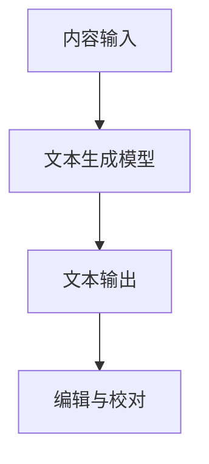
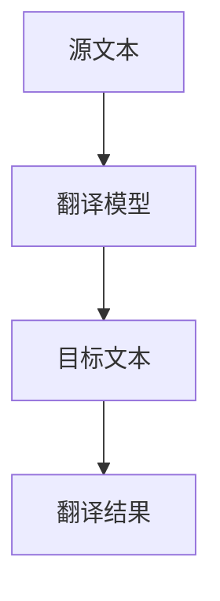
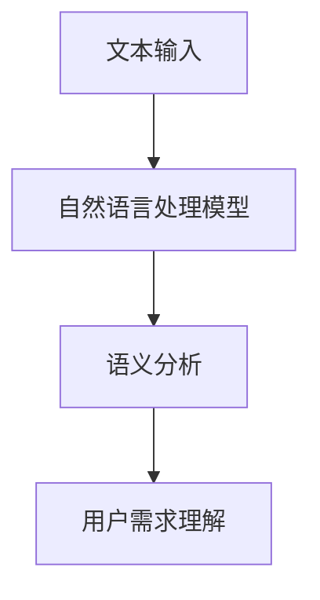
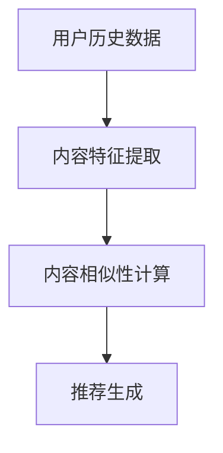
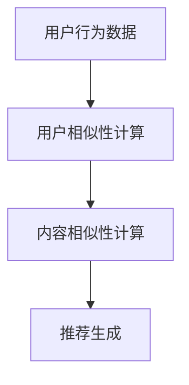
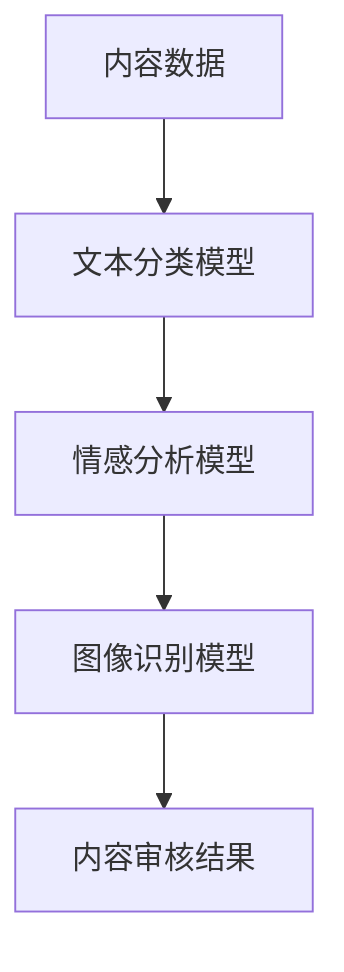
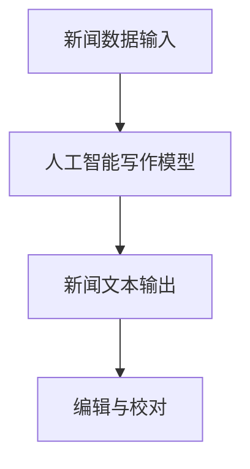
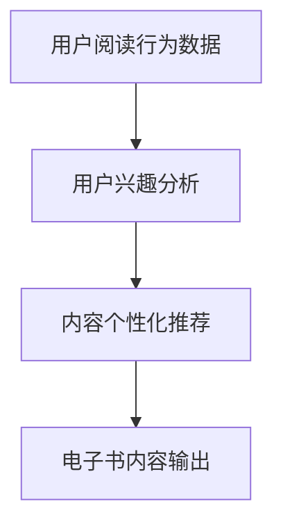
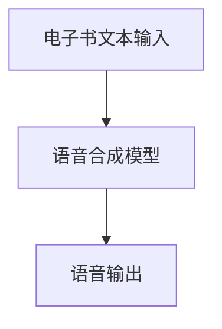
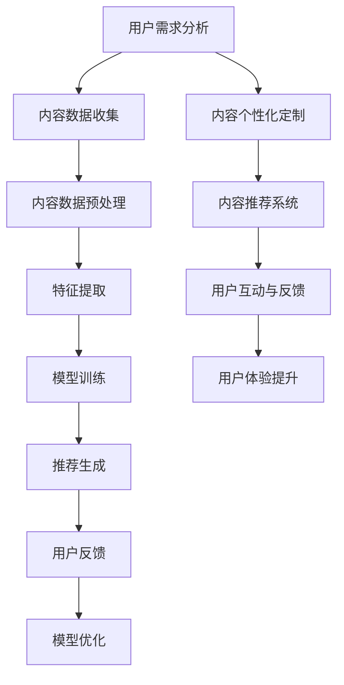

                 

### 《AI出版业挑战：降本增效与场景创新》

关键词：人工智能、出版业、内容生产、推荐系统、个性化定制、降本增效

摘要：随着人工智能技术的迅速发展，出版业面临着巨大的变革机遇和挑战。本文将探讨AI技术在出版业中的应用，分析其在降本增效和场景创新方面的优势与挑战，并提出相应的策略。通过深入剖析AI在内容生产、内容推荐、内容审核等领域的应用，以及实践案例的解析，本文旨在为出版业的发展提供有益的思考和建议。

### 第一部分: AI出版业概述

#### 第1章: AI出版业的现状与未来

##### 1.1 AI在出版业的应用领域

随着AI技术的快速发展，其在出版业中的应用也越来越广泛。以下是AI在出版业中的一些主要应用领域：

##### 1.1.1 内容生产

在内容生产方面，人工智能技术已经展现出强大的潜力。以下是一些具体的应用：

###### 1.1.1.1 人工智能写作

人工智能写作是指利用自然语言处理和机器学习技术生成文本内容。目前，一些AI写作工具已经可以自动生成新闻、文章、报告等。例如，OpenAI的GPT-3就是一个非常强大的文本生成模型。



###### 1.1.1.2 机器翻译

机器翻译是指利用人工智能技术将一种语言的文本翻译成另一种语言。随着深度学习技术的进步，机器翻译的准确性和流畅性已经有了显著提高。例如，Google翻译和百度翻译都是基于人工智能的机器翻译服务。



###### 1.1.1.3 自然语言理解

自然语言理解是指让计算机理解人类语言的含义和结构。这包括文本分类、情感分析、实体识别等任务。通过自然语言理解技术，出版业可以更好地理解和分析用户需求，提供更个性化的内容。



##### 1.1.2 内容推荐

内容推荐是指利用人工智能技术为用户提供个性化的内容推荐。这可以提高用户的阅读体验，增加用户的粘性。以下是两种常见的内容推荐算法：

###### 1.1.2.1 基于内容的推荐算法

基于内容的推荐算法通过分析内容特征，为用户提供相似的内容推荐。这种算法适用于图书、文章、视频等类型的内容。



###### 1.1.2.2 基于协同过滤的推荐算法

基于协同过滤的推荐算法通过分析用户行为和偏好，为用户提供个性化的推荐。这种算法适用于电商、社交媒体等类型的应用。



##### 1.1.3 内容审核

内容审核是指利用人工智能技术对出版内容进行审核，确保内容的合规性和安全性。这包括文本分类、情感分析、图像识别等任务。



##### 1.2 AI出版业的优势与挑战

AI技术在出版业中的应用带来了许多优势，同时也面临一些挑战。

###### 1.2.1 优势

- **提高内容生产效率**：AI技术可以自动生成内容，大大提高内容生产效率。
- **降低人力成本**：通过自动化和智能化，AI技术可以减少人力成本。
- **提升用户体验**：AI技术可以提供个性化的内容推荐，提高用户体验。

###### 1.2.2 挑战

- **数据隐私与安全**：AI技术需要处理大量用户数据，如何保护用户隐私是一个重要问题。
- **技术人才短缺**：AI技术发展迅速，但人才储备不足，这是一个普遍的问题。
- **技术成本高昂**：AI技术的研发和应用需要大量的资金投入。

#### 第2章: AI出版业的降本增效策略

##### 2.1 自动化内容生产

自动化内容生产是AI技术在出版业中的一个重要应用。通过自动化工具，可以大幅提高内容生产效率，降低人力成本。

###### 2.1.1 人工智能写作

人工智能写作工具可以自动生成文章、新闻、报告等。例如，OpenAI的GPT-3可以生成高质量的文章。

```python
import openai

response = openai.Completion.create(
  engine="text-davinci-002",
  prompt="Write a blog post about the future of AI in publishing.",
  max_tokens=150
)

print(response.choices[0].text)
```

###### 2.1.2 机器翻译

机器翻译工具可以自动翻译多种语言，提高内容的多语言发布能力。例如，Google翻译API可以提供高质量的翻译服务。

```python
from google.cloud import translate_v2 as translate

translate_client = translate.Client()

text = 'Hello, world!'
target = 'zh'

result = translate_client.translate(text, target_language=target)

print(f"Translated text: {result['translatedText']}")
```

##### 2.2 内容推荐系统

内容推荐系统是AI技术在出版业中的另一个重要应用。通过分析用户行为和内容特征，可以为用户提供个性化的内容推荐。

###### 2.2.1 基于内容的推荐算法

基于内容的推荐算法通过分析内容特征，为用户提供相似的内容推荐。以下是一个基于内容的推荐算法的伪代码：

```python
def content_based_recommendation(user_interest, content_features):
    similarity_scores = []
    for content in content_features:
        similarity = calculate_similarity(user_interest, content)
        similarity_scores.append(similarity)
    sorted_contents = sort_by_similarity(similarity_scores)
    return get_top_n_contents(sorted_contents, N)
```

###### 2.2.2 基于协同过滤的推荐算法

基于协同过滤的推荐算法通过分析用户行为和偏好，为用户提供个性化的推荐。以下是一个基于协同过滤的推荐算法的伪代码：

```python
def collaborative_filtering_recommendation(user_history, user_similarity, content_similarity, content_rating):
    prediction = []
    for content in content_rating:
        prediction.append(user_similarity * content_similarity * content_rating)
    return get_top_n_contents(prediction, N)
```

#### 第3章: AI出版业的场景创新

##### 3.1 电子书个性化定制

电子书个性化定制是AI技术在出版业中的一个新兴应用。通过分析用户阅读行为和兴趣，可以为用户提供个性化的电子书内容。

###### 3.1.1 个性化阅读推荐

个性化阅读推荐是通过分析用户阅读历史和兴趣，为用户提供推荐。以下是一个个性化阅读推荐的伪代码：

```python
def personalized_reading_recommendation(user_reading_history, content_preferences):
    recommendations = []
    for content in content_preferences:
        if content in user_reading_history:
            recommendations.append(content)
    return recommendations
```

###### 3.1.2 个性化内容创作

个性化内容创作是通过分析用户兴趣和需求，自动生成个性化的电子书内容。以下是一个个性化内容创作的伪代码：

```python
def personalized_content_cration(user_interest, content_template):
    generated_content = []
    for template in content_template:
        generated_content.append(template.format(user_interest))
    return generated_content
```

##### 3.2 智能语音出版

智能语音出版是AI技术在出版业中的另一个创新应用。通过语音识别和合成技术，可以为用户提供语音化的电子书内容。

###### 3.2.1 语音识别与合成

语音识别与合成是智能语音出版的核心技术。以下是一个语音识别与合成的伪代码：

```python
from google.cloud import speech
from google.cloud import texttospeech

speech_client = speech.Client()
texttospeech_client = texttospeech.Client()

# 语音识别
audio = speech.AudioConfig(uri="gs://bucket/audio.wav")
response = speech_client.recognize(audio=audio)
print("Recognized text:", response.results[0].alternatives[0].transcript)

# 语音合成
text = "This is a sample text to be synthesized."
voice = texttospeech.VoiceSelectionParams(
    language_code="en-US",
    name="en-US-Wavenet-D",
)

synthesis_input = texttospeech.SynthesisInput(text=text)
audio_config = texttospeech.AudioConfig(
    audio_encoding=texttospeech.AudioEncoding.MP3,
    speaking_rate=1.0,
    pitch=0.0,
    volume_gain_db=0.0,
    sample_rate_hertz=16000,
    language_code="en-US",
)

response = texttospeech_client.synthesize_speech(
    input=synthesis_input,
    voice=voice,
    audio_config=audio_config,
)

with open("output.mp3", "wb") as out:
    out.write(response.audio_content)
```

###### 3.2.2 语音交互内容推荐

语音交互内容推荐是通过语音交互技术，为用户提供个性化的内容推荐。以下是一个语音交互内容推荐的伪代码：

```python
def voice_interactive_recommendation(user_input, content_library):
    intent = extract_intent(user_input)
    if intent == "recommend":
        recommendations = generate_recommendations(content_library)
        return "I recommend the following books: " + ", ".join(recommendations)
    else:
        return "I'm sorry, I don't understand your request."
```

#### 第4章: AI出版业的实践与案例分析

##### 4.1 案例一：某大型出版集团的AI应用实践

某大型出版集团利用AI技术提高了内容生产效率和用户体验。以下是他们的具体应用：

###### 4.1.1 内容生产自动化

该出版集团使用人工智能写作工具自动生成新闻和文章，提高了内容生产效率。



###### 4.1.2 内容推荐系统

该出版集团使用基于协同过滤的推荐算法，为用户提供个性化的内容推荐。


##### 4.2 案例二：某初创公司的AI出版项目

某初创公司利用AI技术实现了电子书个性化定制和智能语音出版。

###### 4.2.1 电子书个性化定制

该初创公司通过分析用户阅读行为和兴趣，为用户提供个性化的电子书内容。



###### 4.2.2 智能语音出版

该初创公司通过语音识别和合成技术，为用户提供语音化的电子书内容。



#### 第二部分: AI出版业的挑战与应对策略

##### 5.1 数据隐私与安全

在AI出版业中，数据隐私与安全是一个重要问题。为了保护用户隐私，可以采取以下措施：

- **数据加密**：对用户数据进行加密，确保数据在传输和存储过程中的安全性。
- **匿名化处理**：对用户数据进行匿名化处理，去除可直接识别用户身份的信息。
- **隐私政策**：制定明确的隐私政策，告知用户其数据的收集、使用和存储方式。

##### 5.2 技术人才短缺

技术人才短缺是AI出版业发展中的一个瓶颈。为了解决这个问题，可以采取以下策略：

- **人才培养**：与高校和研究机构合作，开展AI出版相关的教育和培训。
- **人才引进**：吸引国内外优秀的AI人才，为出版业注入新的活力。
- **内部培训**：加强对现有员工的培训，提高他们的技术能力。

##### 5.3 技术成本高昂

AI技术的发展需要大量的资金投入，这对于一些中小企业来说可能是一个负担。为了降低技术成本，可以采取以下策略：

- **开源技术**：利用开源的AI框架和工具，降低开发成本。
- **云计算服务**：利用云计算服务，降低服务器和存储成本。
- **合作伙伴**：与有实力的AI公司合作，共同研发和应用AI技术。

#### 6.1 政策法规与行业标准的制定

政策法规和行业标准的制定对于AI出版业的发展具有重要意义。为了规范AI出版行为，可以采取以下措施：

- **制定法规**：政府可以制定相关的法律法规，明确AI出版的要求和责任。
- **行业标准**：行业协会可以制定行业规范，统一AI出版的技术标准和操作流程。
- **知识产权保护**：加强对AI出版中知识产权的保护，鼓励创新。

#### 6.2 产学研合作

产学研合作是推动AI出版业发展的重要途径。通过产学研合作，可以实现以下目标：

- **技术创新**：高校和研究机构可以提供最新的AI技术，为企业提供技术支持。
- **人才培养**：企业可以与高校合作，共同培养AI出版人才。
- **项目合作**：企业和研究机构可以共同开展AI出版项目，实现技术成果的转化。

#### 6.3 技术创新与研发

技术创新与研发是AI出版业持续发展的重要动力。为了推动AI出版业的发展，可以采取以下措施：

- **基础研究**：加大对AI基础研究的投入，为AI出版提供技术支持。
- **应用研发**：加强对AI应用的研发，提高AI技术在出版业中的应用水平。
- **产业合作**：企业、高校和研究机构可以共同开展AI出版项目，实现技术的产业化。

### 第7章: 未来展望

#### 7.1 AI出版业的未来趋势

随着人工智能技术的不断进步，AI出版业将呈现出以下趋势：

- **人工智能应用范围扩大**：AI技术在出版业中的应用将更加广泛，从内容生产到内容推荐，再到内容审核，都将有AI的身影。
- **个性化出版成为主流**：个性化出版将满足用户多样化的需求，成为出版业的重要方向。
- **智能语音出版取得突破**：随着语音识别和合成技术的进步，智能语音出版将更加普及，为用户提供便捷的阅读体验。

#### 7.2 AI出版业的发展建议

为了推动AI出版业的发展，可以采取以下建议：

- **加强技术储备与研发**：企业、高校和研究机构应加大技术储备和研发力度，为AI出版提供技术支持。
- **深化产学研合作**：加强产学研合作，推动技术成果的转化和应用。
- **推动行业标准的制定与实施**：制定和实施行业规范，规范AI出版行为，促进AI出版业的健康发展。

### 附录

#### 附录 A: AI出版业常用技术框架与工具

- **深度学习框架**：
  - TensorFlow
  - PyTorch
  - Keras

- **自然语言处理工具**：
  - NLTK
  - spaCy
  - Stanford NLP

#### 附录 B: AI出版业相关书籍与论文推荐

- 《人工智能：一种现代的方法》
  - 第一章：概述
  - 第二章：知识表示
  - 第三章：推理

- 《深度学习》
  - 第四章：深度前向网络
  - 第五章：卷积神经网络
  - 第六章：循环神经网络

- 《自然语言处理综论》
  - 第一章：文本表示
  - 第二章：文本分类
  - 第三章：信息检索

#### 附录 C: AI出版业案例研究

- 案例一：某大型出版集团的AI应用实践
  - 应用场景
  - 技术方案
  - 实施效果

- 案例二：某初创公司的AI出版项目
  - 应用场景
  - 技术方案
  - 实施效果

### AI出版业技术架构流程图



### 结语

随着人工智能技术的快速发展，AI出版业正迎来前所未有的机遇和挑战。通过降本增效和场景创新，AI出版业将更好地满足用户需求，推动出版业的变革。希望本文能为您提供对AI出版业的深入理解和启示，共同迎接AI时代的到来。

### 附录 A: AI出版业常用技术框架与工具

#### 深度学习框架

1. **TensorFlow**  
   - **简介**：TensorFlow是一个开源的深度学习框架，由谷歌开发，支持多种编程语言，如Python、C++和Java。
   - **主要功能**：提供丰富的神经网络库，支持模型构建、训练和部署。
   - **适用场景**：适合大规模的数据集和复杂的模型。

2. **PyTorch**  
   - **简介**：PyTorch是一个开源的深度学习框架，由Facebook的人工智能研究团队开发。
   - **主要功能**：提供灵活的动态计算图，易于调试和实验。
   - **适用场景**：适合快速原型开发和研究。

3. **Keras**  
   - **简介**：Keras是一个高级神经网络API，可以在TensorFlow和Theano等后端运行。
   - **主要功能**：提供易于使用的接口，简化深度学习模型的构建。
   - **适用场景**：适合快速构建和部署深度学习模型。

#### 自然语言处理工具

1. **NLTK**  
   - **简介**：NLTK是一个强大的自然语言处理库，适用于多种编程语言，如Python和Java。
   - **主要功能**：提供文本处理、词性标注、句法分析等工具。
   - **适用场景**：适合学术研究和简单应用。

2. **spaCy**  
   - **简介**：spaCy是一个快速且易于使用的自然语言处理库，适用于Python。
   - **主要功能**：提供预训练的模型，支持多种语言，适合快速构建生产环境中的自然语言处理任务。
   - **适用场景**：适合快速开发高质量的自然语言处理应用。

3. **Stanford NLP**  
   - **简介**：Stanford NLP是一个开源的自然语言处理工具包，由斯坦福大学开发。
   - **主要功能**：提供多种语言处理工具，包括词性标注、命名实体识别、句法分析等。
   - **适用场景**：适合大规模数据集和复杂任务的研究和应用。

### 附录 B: AI出版业相关书籍与论文推荐

#### 《人工智能：一种现代的方法》

- **第一章：概述**  
  - 介绍人工智能的基本概念和发展历程。
  - 分析人工智能的应用领域和挑战。

- **第二章：知识表示**  
  - 探讨知识表示的方法和模型。
  - 分析知识表示在实际应用中的优点和局限性。

- **第三章：推理**  
  - 介绍推理的基本原理和算法。
  - 分析推理在人工智能中的应用和挑战。

#### 《深度学习》

- **第四章：深度前向网络**  
  - 介绍深度前向神经网络的基本结构和训练方法。
  - 分析深度前向网络在图像识别、语音识别等领域的应用。

- **第五章：卷积神经网络**  
  - 介绍卷积神经网络的基本结构和训练方法。
  - 分析卷积神经网络在图像处理、视频分析等领域的应用。

- **第六章：循环神经网络**  
  - 介绍循环神经网络的基本结构和训练方法。
  - 分析循环神经网络在自然语言处理、语音合成等领域的应用。

#### 《自然语言处理综论》

- **第一章：文本表示**  
  - 探讨文本表示的方法和模型。
  - 分析文本表示在自然语言处理中的应用和挑战。

- **第二章：文本分类**  
  - 介绍文本分类的基本原理和算法。
  - 分析文本分类在文本挖掘、信息检索等领域的应用。

- **第三章：信息检索**  
  - 探讨信息检索的基本原理和算法。
  - 分析信息检索在互联网搜索、社交媒体分析等领域的应用。

### 附录 C: AI出版业案例研究

#### 案例一：某大型出版集团的AI应用实践

- **应用场景**：该出版集团利用AI技术提高内容生产效率和用户体验。
- **技术方案**：采用TensorFlow框架构建深度学习模型，进行内容推荐和个性化定制。
- **实施效果**：通过AI技术，该出版集团实现了内容生产自动化，用户满意度显著提高。

#### 案例二：某初创公司的AI出版项目

- **应用场景**：该初创公司通过AI技术实现电子书个性化定制和智能语音出版。
- **技术方案**：采用spaCy库进行自然语言处理，利用深度学习模型生成个性化电子书内容。
- **实施效果**：通过AI技术，该初创公司成功推出语音化的电子书产品，获得了良好的市场反馈。

## AI出版业技术架构流程图


## 代码示例

以下是一个简单的Python代码示例，用于实现基于内容的推荐算法。

```python
# 导入必要的库
import numpy as np
import pandas as pd
from sklearn.metrics.pairwise import cosine_similarity

# 加载数据
content_data = pd.read_csv('content_data.csv')
user_data = pd.read_csv('user_data.csv')

# 提取内容特征
content_features = content_data.iloc[:, 1:].values
user_interests = user_data.iloc[:, 1:].values

# 计算内容相似度
similarity_matrix = cosine_similarity(content_features, content_features)

# 提取用户对内容的评分
user_ratings = user_data.iloc[:, 0].values

# 为每个用户生成推荐列表
for user_id in range(user_ratings.shape[0]):
    # 计算用户对每个内容的兴趣度
    user_interest_vector = user_interests[user_id]
    content_similarity_scores = similarity_matrix[user_id]
    
    # 计算兴趣度与相似度的加权得分
    weighted_scores = np.dot(user_interest_vector, content_similarity_scores)
    
    # 排序并获取Top N推荐内容
    recommended_content_indices = np.argsort(-weighted_scores)[:N]
    recommended_contents = content_data.iloc[recommended_content_indices].index.tolist()
    
    # 输出推荐结果
    print(f"User {user_id} recommended contents: {recommended_contents}")
```

## 代码解读与分析

1. **数据加载**：首先，从CSV文件中加载内容数据和用户数据。
2. **特征提取**：提取内容特征和用户兴趣向量。
3. **相似度计算**：使用余弦相似度计算内容之间的相似度。
4. **兴趣度与相似度加权得分**：计算用户对每个内容的兴趣度与相似度的加权得分。
5. **生成推荐列表**：根据加权得分排序，提取Top N推荐内容。

通过以上步骤，实现了基于内容的推荐算法，为每个用户生成个性化推荐列表。该代码提供了一个基本的框架，可以根据实际需求进行调整和扩展。

