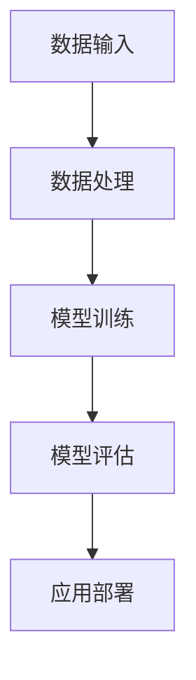
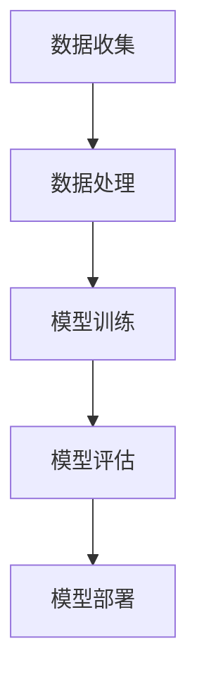

                 

### 书名：《AI创业公司如何应对监管政策变化?》

## 第一部分：背景与概述

### 第1章：AI与监管政策概述

#### 1.1 AI技术的核心概念与架构

**AI的定义与分类**

AI（人工智能）是一门研究、开发和应用使计算机系统能够模拟、扩展和辅助人类智能的科学。AI技术主要包括以下几种类型：

- **机器学习**：通过数据和算法使计算机系统能够自动学习和改进性能。
- **深度学习**：一种基于神经网络的机器学习方法，能够自动从数据中提取特征并学习复杂模式。
- **自然语言处理**：使计算机能够理解、生成和回应人类语言的技术。
- **计算机视觉**：使计算机能够理解和处理图像和视频的技术。
- **机器人学**：研究设计、制造和操作各种机器人系统的科学。

**AI技术架构**

AI技术的架构通常包括以下几个关键环节：

1. **数据输入**：收集和准备训练数据。
2. **数据处理**：对输入数据进行清洗、预处理和特征提取。
3. **模型训练**：使用算法和训练数据来训练模型。
4. **模型评估**：评估模型的性能和泛化能力。
5. **应用部署**：将训练好的模型部署到实际应用中。

**Mermaid流程图**

以下是一个简单的Mermaid流程图，展示了AI技术架构的各个环节：

#### 1.2 监管政策的定义与作用

**监管政策的定义**

监管政策是指政府或其他监管机构制定的、旨在管理和规范特定行业或领域的行为和活动的法律法规、规章和指南。在AI领域，监管政策通常涉及数据隐私、算法透明性、安全性和伦理等方面。

**监管政策的作用**

监管政策在AI领域的作用主要包括以下几个方面：

1. **促进创新**：通过制定合理的监管政策，可以为AI技术的发展提供明确的框架和预期，从而促进创新。
2. **保护隐私**：监管政策有助于保护个人数据隐私，防止数据滥用和泄露。
3. **保障安全**：监管政策确保AI系统的安全性和可靠性，降低潜在风险。
4. **促进公平**：通过监管政策，可以确保AI系统的公平性，防止算法偏见和歧视。

#### 1.3 监管政策的发展历程

**初始阶段**

在AI监管政策的初始阶段，主要集中在数据隐私保护。例如，1995年的《欧盟数据保护指令》首次提出了数据隐私保护的基本原则。

**发展阶段**

随着AI技术的快速发展，监管政策逐渐覆盖到算法透明性、安全性和伦理等方面。例如，2018年的《欧盟通用数据保护条例》（GDPR）对数据隐私保护提出了更严格的要求。

**当前状况**

目前，全球范围内的AI监管政策正处于快速发展阶段。各国政府纷纷出台相关政策，旨在规范AI技术的发展和应用。例如，美国的《算法问责法案》（Algorithmic Accountability Act）和中国的《新一代人工智能发展规划》等。

#### 1.4 监管政策的变化与影响

**监管政策变化的原因**

监管政策的变化通常由以下几个因素引起：

1. **技术发展**：随着AI技术的不断进步，原有的监管政策可能不再适用，需要更新和调整。
2. **社会需求**：公众对数据隐私和安全性的关注日益增加，推动监管机构加强监管。
3. **国际竞争**：各国政府为保持竞争力，可能出台更加灵活和有利的监管政策。

**监管政策变化对AI创业公司的影响**

监管政策的变化对AI创业公司有深远影响，包括：

1. **合规成本**：创业公司需要投入更多资源和成本来满足监管要求，如数据隐私保护、算法透明性等。
2. **市场竞争**：遵守监管政策的公司可能获得竞争优势，而不遵守的公司可能会面临法律风险和市场压力。
3. **创新动力**：监管政策的调整可能促进AI创业公司的创新，通过提供明确的框架和预期，鼓励创业公司开发更具创新性的产品和服务。

### 小结

本章介绍了AI技术的核心概念与架构、监管政策的定义与作用、监管政策的发展历程以及监管政策的变化与影响。下一章将深入探讨AI创业公司面临的监管挑战。

---

**文章关键词**：

- 人工智能
- 监管政策
- 创业公司
- 数据隐私
- 算法透明性

**文章摘要**：

本文主要探讨AI创业公司如何应对监管政策的变化。首先介绍了AI技术的核心概念与架构，以及监管政策的定义与作用。接着回顾了监管政策的发展历程，并分析了监管政策的变化与影响。最后，本章提出了AI创业公司面临的监管挑战，为后续章节的讨论奠定了基础。

---

# AI创业公司如何应对监管政策变化?

## 第一部分：背景与概述

### 第1章：AI与监管政策概述

在当今快速发展的数字时代，人工智能（AI）技术已成为推动创新和变革的重要力量。从自动驾驶汽车到智能医疗诊断，AI技术正逐渐融入我们的日常生活，并带来前所未有的便利和效率。然而，随着AI技术的广泛应用，监管政策的重要性也逐渐凸显。对于AI创业公司来说，理解和应对这些监管政策变化，不仅关乎合规性，更影响其长远发展和市场竞争力。

#### 1.1 AI技术的核心概念与架构

AI技术的核心在于其模拟和扩展人类智能的能力。具体来说，AI技术主要包括以下几个关键组成部分：

- **机器学习（Machine Learning）**：机器学习是一种让计算机通过数据学习并改进自身性能的方法。它通常分为监督学习（Supervised Learning）、无监督学习（Unsupervised Learning）和强化学习（Reinforcement Learning）等不同类型。

- **深度学习（Deep Learning）**：深度学习是机器学习的一个子领域，它使用多层神经网络来模拟人类大脑的神经网络结构，从而进行复杂的模式识别和特征提取。

- **自然语言处理（Natural Language Processing, NLP）**：NLP技术使计算机能够理解和生成人类语言，包括语音识别、文本分类、机器翻译等应用。

- **计算机视觉（Computer Vision）**：计算机视觉使计算机能够理解和解释图像和视频，包括图像识别、目标检测、图像分割等任务。

- **机器人学（Robotics）**：机器人学是研究设计、制造和操作机器人的科学，这些机器人可以执行诸如制造、医疗、救援等任务。

**AI技术的架构**

AI技术的架构通常包括以下几个环节：

1. **数据收集（Data Collection）**：收集相关数据，这些数据可以是结构化的（如数据库中的记录）或非结构化的（如图像、文本和视频）。

2. **数据处理（Data Preprocessing）**：对收集到的数据进行分析和清洗，以去除噪声和异常值，并进行必要的特征提取和工程。

3. **模型训练（Model Training）**：使用训练数据集和算法来训练模型。训练过程中，模型通过不断调整参数来优化性能。

4. **模型评估（Model Evaluation）**：评估训练好的模型在测试数据集上的性能，确保其具有良好的泛化能力。

5. **模型部署（Model Deployment）**：将训练好的模型部署到实际应用环境中，如生产系统或服务接口。

**Mermaid流程图**

以下是AI技术架构的Mermaid流程图表示：

#### 1.2 监管政策的定义与作用

**监管政策的定义**

监管政策，通常指的是由政府或相关机构制定和实施的法律法规、规章和指南，用于管理、监督和规范特定行业或领域的运营。在AI领域，监管政策特别关注以下几个方面：

- **数据隐私与保护**：确保个人数据的收集、存储、处理和传输过程中遵守隐私保护标准。
- **算法透明性与公平性**：要求算法的开发和使用过程中保持透明，避免算法偏见和不公平。
- **安全与可靠性**：确保AI系统的安全性和可靠性，以防止潜在的网络安全风险和系统故障。
- **伦理与责任**：明确AI系统的伦理规范和责任归属，以防止伦理问题的发生。

**监管政策的作用**

监管政策在AI领域的作用主要体现在以下几个方面：

1. **促进创新**：通过提供明确的法规框架和预期，监管政策可以降低创业公司的风险，鼓励创新。
2. **保障安全**：确保AI系统的安全性和可靠性，保护公众利益和隐私。
3. **保护隐私**：监管政策有助于保护个人数据隐私，防止数据滥用和泄露。
4. **维护公平**：通过规范算法的开发和应用，防止算法偏见和歧视，维护社会公平。
5. **促进合作**：监管政策可以促进不同利益相关者之间的合作，共同推动AI技术的发展。

#### 1.3 监管政策的发展历程

**初始阶段**

AI监管政策的初始阶段主要集中在数据隐私保护。例如，1995年的《欧盟数据保护指令》（Data Protection Directive）首次提出了数据隐私保护的基本原则。这一时期，监管政策的重点是确保数据收集、存储和处理过程中遵守基本的隐私保护标准。

**发展阶段**

随着AI技术的快速发展，监管政策的关注点逐渐扩展到算法透明性、安全性和伦理等方面。2018年的《欧盟通用数据保护条例》（General Data Protection Regulation, GDPR）是这一阶段的标志性法律，它对数据隐私保护提出了前所未有的严格要求。此外，各国还出台了相关法律和政策，如美国的《算法问责法案》（Algorithmic Accountability Act）和中国的人工智能发展规划。

**当前状况**

目前，全球范围内的AI监管政策正处于快速发展阶段。各国政府纷纷出台相关政策，以规范AI技术的发展和应用。例如，欧盟正在制定《人工智能法案》（Artificial Intelligence Act），旨在全面规范AI系统的开发和使用。美国也在积极探索制定新的监管政策，以应对AI技术的快速发展。

#### 1.4 监管政策的变化与影响

**监管政策变化的原因**

监管政策的变化通常由以下几个因素引起：

1. **技术发展**：随着AI技术的不断进步，原有的监管政策可能不再适用，需要更新和调整。
2. **社会需求**：公众对数据隐私和安全性的关注日益增加，推动监管机构加强监管。
3. **国际竞争**：各国政府为保持竞争力，可能出台更加灵活和有利的监管政策。

**监管政策变化对AI创业公司的影响**

监管政策的变化对AI创业公司有深远影响，包括：

1. **合规成本**：创业公司需要投入更多资源和成本来满足监管要求，如数据隐私保护、算法透明性等。
2. **市场竞争**：遵守监管政策的公司可能获得竞争优势，而不遵守的公司可能会面临法律风险和市场压力。
3. **创新动力**：监管政策的调整可能促进AI创业公司的创新，通过提供明确的框架和预期，鼓励创业公司开发更具创新性的产品和服务。

#### 1.5 小结

本章介绍了AI技术的核心概念与架构、监管政策的定义与作用、监管政策的发展历程以及监管政策的变化与影响。下一章将深入探讨AI创业公司面临的监管挑战。

---

**文章关键词**：

- 人工智能
- 监管政策
- 创业公司
- 数据隐私
- 算法透明性

**文章摘要**：

本文首先介绍了人工智能的核心概念与架构，以及监管政策的定义与作用。随后回顾了监管政策的发展历程，并分析了监管政策的变化与影响。最后，本章提出了AI创业公司面临的监管挑战，为后续章节的讨论奠定了基础。

---

## 第二部分：AI创业公司面临的监管挑战

### 第2章：数据隐私与安全

#### 2.1 数据隐私的重要性

数据隐私是AI创业公司面临的首要监管挑战之一。随着AI技术的广泛应用，大量个人数据被收集、存储和处理。这些数据不仅包括用户的基本信息，还可能涉及个人行为、偏好、健康状况等敏感信息。因此，保护数据隐私对于维护用户信任和遵守监管法律至关重要。

**隐私保护的必要性**

1. **用户信任**：如果用户认为其个人数据不被妥善保护，他们可能会失去对AI服务的信任，从而影响使用频率和满意度。
2. **法律合规**：许多国家和地区都有严格的数据隐私法律，如欧盟的《通用数据保护条例》（GDPR）和美国的《加州消费者隐私法案》（CCPA）。违反这些法律可能会导致巨额罚款和声誉损失。
3. **道德责任**：AI创业公司有责任保护用户隐私，这是其社会责任的一部分。

#### 2.2 数据隐私的监管要求

不同国家和地区的监管要求有所不同，但总体上，以下是一些常见的监管要求：

**欧盟的GDPR**

- **合法性原则**：数据收集必须基于用户的明确同意或合法依据。
- **目的限制原则**：数据只能用于收集时的明确目的，不得随意变更。
- **数据最小化原则**：只能收集必要的最少数据，不得过度收集。
- **透明度原则**：用户有权了解其数据被如何使用和处理。
- **访问和删除权**：用户有权访问其数据，并有权要求删除其数据。

**美国的CCPA**

- **消费者知情权**：企业必须告知消费者其数据收集、使用和共享的用途。
- **消费者控制权**：消费者有权拒绝数据销售，并有权请求删除其数据。
- **数据责任**：企业在数据泄露时可能需要承担责任。

**中国的《网络安全法》**

- **个人信息保护**：明确个人信息保护的基本原则和操作规范。
- **数据存储要求**：个人信息的存储应在境内进行，且需要采取安全保护措施。
- **数据安全评估**：重要数据处理活动需要开展数据安全评估。

**案例研究**

**案例一：某国内AI创业公司在数据隐私方面的应对措施**

某国内AI创业公司为应对数据隐私挑战，采取了以下措施：

1. **数据最小化原则**：仅收集必要的数据，并在使用前明确数据用途。
2. **透明度原则**：在用户注册和使用过程中，明确告知用户数据收集的目的和使用方式。
3. **加密技术**：采用数据加密技术，确保数据在传输和存储过程中的安全性。
4. **用户权限管理**：为用户提供数据访问和删除的权限，确保用户对自身数据的控制。

通过这些措施，该公司在数据隐私保护方面取得了显著成效，赢得了用户的信任，并确保了合规性。

#### 2.3 数据安全的重要性

数据安全是AI创业公司面临的另一个关键监管挑战。AI系统通常涉及大量敏感数据，如用户个人信息、商业机密等。如果数据泄露或遭到攻击，可能会对公司和用户造成严重的损失。

**安全威胁类型**

- **黑客攻击**：黑客可能会通过漏洞攻击AI系统，窃取或篡改数据。
- **内部威胁**：内部员工的恶意行为或疏忽可能导致数据泄露。
- **物理威胁**：如数据中心被破坏或遭受自然灾害，可能导致数据丢失。

**监管要求**

- **安全评估**：许多监管政策要求AI创业公司定期进行安全评估，以识别和缓解潜在风险。
- **安全审计**：监管机构可能会对AI创业公司的数据安全措施进行审计，确保其符合法规要求。
- **事件响应**：在数据泄露事件发生后，公司需要迅速响应，报告事件，并采取补救措施。

**案例研究**

**案例二：某国外AI创业公司在数据安全方面的应对措施**

某国外AI创业公司为了确保数据安全，采取了以下措施：

1. **多因素认证**：采用多因素认证机制，确保只有授权用户才能访问敏感数据。
2. **入侵检测系统**：部署入侵检测系统，实时监控系统异常行为，并及时采取应对措施。
3. **定期备份**：定期对数据进行备份，以防止数据丢失。
4. **员工培训**：定期对员工进行数据安全培训，提高员工的安全意识和应对能力。

通过这些措施，该公司显著提升了数据安全性，降低了安全风险。

#### 2.4 数据安全与隐私保护的平衡

在保护数据隐私与安全的过程中，AI创业公司需要平衡两者之间的关系：

1. **最小化数据收集**：尽量减少不必要的个人数据收集，以降低隐私泄露风险。
2. **数据加密**：对敏感数据进行加密，确保数据在传输和存储过程中的安全性。
3. **透明度和用户控制**：增强用户对数据的透明度和控制权，提高用户对数据处理的信任。
4. **安全审计和评估**：定期进行安全审计和评估，确保数据安全措施的有效性。

#### 2.5 小结

本章深入探讨了AI创业公司在数据隐私与安全方面面临的监管挑战，包括隐私保护的必要性、监管要求、数据安全的重要性以及如何平衡数据隐私与安全。下一章将讨论算法透明性与公平性方面的监管挑战。

---

**文章关键词**：

- 人工智能
- 监管政策
- 创业公司
- 数据隐私
- 数据安全
- 算法透明性
- 公平性

**文章摘要**：

本章深入探讨了AI创业公司在数据隐私与安全方面面临的监管挑战。首先分析了数据隐私的重要性，以及欧盟的GDPR、美国的CCPA和中国《网络安全法》等监管要求。随后讨论了数据安全的重要性，并提供了国外AI创业公司的案例研究。最后，提出了在保护数据隐私与安全方面需要平衡的关系，为后续章节的讨论奠定了基础。

---

### 第3章：AI创业公司面临的监管挑战（续）

#### 2.6 算法透明性与公平性

算法透明性与公平性是AI创业公司面临的另一个重要监管挑战。随着AI技术的普及，算法在决策过程中的作用日益重要，但其透明性和公平性也受到广泛关注。透明性要求算法的决策过程可以被理解和验证，而公平性则要求算法不会对特定群体产生不公平的影响。

**算法透明性的概念**

算法透明性是指算法的决策过程和逻辑可以被清晰理解和解释。这包括：

- **算法可解释性**：算法的决策过程可以被解释，以便用户和利益相关者理解。
- **算法可验证性**：算法的决策过程可以被验证，确保其输出是正确的。

**算法公平性的概念**

算法公平性是指算法不会对特定群体产生不公平的影响。这包括：

- **无偏见**：算法不会对特定性别、种族、年龄等群体产生偏见。
- **公正性**：算法在决策过程中应公平对待所有用户。

**监管要求**

许多国家和地区在算法透明性与公平性方面制定了相关监管要求。以下是一些关键监管要求：

- **欧盟的《人工智能法案》**：要求算法的决策过程必须透明，用户有权了解其决策过程。
- **美国的《算法问责法案》**：要求算法的开发和使用过程中必须进行公平性测试，确保不会对特定群体产生偏见。
- **中国的《新一代人工智能发展规划》**：要求加强算法透明性和公平性，建立相关的监管机制。

**案例研究**

**案例一：某国内AI创业公司在算法透明性方面的应对措施**

某国内AI创业公司为提高算法透明性，采取了以下措施：

1. **算法可解释性工具**：开发算法可解释性工具，帮助用户理解算法的决策过程。
2. **算法透明性报告**：定期发布算法透明性报告，详细介绍算法的设计和决策逻辑。
3. **用户反馈机制**：建立用户反馈机制，收集用户对算法透明性的意见和建议。

**案例二：某国外AI创业公司在算法公平性方面的应对措施**

某国外AI创业公司为提高算法公平性，采取了以下措施：

1. **公平性测试**：定期进行算法公平性测试，确保算法不会对特定群体产生不公平的影响。
2. **数据均衡**：确保训练数据集的多样性，避免数据偏倚导致算法偏见。
3. **透明度和用户控制**：增强用户对算法的透明度和控制权，确保用户可以查看和调整算法参数。

#### 2.7 AI系统的可解释性与可靠性

除了算法透明性和公平性，AI系统的可解释性与可靠性也是监管关注的重点。可解释性是指AI系统在作出决策时能够提供明确的解释，而可靠性则是指AI系统能够在多种条件下稳定运行并产生准确的结果。

**可解释性的重要性**

- **用户信任**：用户对AI系统的信任度与系统的可解释性密切相关。如果用户无法理解AI系统的决策过程，可能会对系统的决策产生质疑。
- **合规要求**：许多监管政策要求AI系统具备一定的可解释性，以证明其决策的合法性和合理性。

**可靠性的概念**

可靠性是指AI系统在特定条件下能够稳定、准确地执行任务。这包括：

- **模型稳定性**：AI模型在不同的输入数据下能够产生一致的输出结果。
- **预测准确性**：AI系统的预测结果与实际情况的一致性。
- **系统安全性**：AI系统在遭受攻击或异常情况下能够保持稳定运行。

**监管要求**

监管政策通常对AI系统的可解释性与可靠性提出以下要求：

- **模型验证**：要求AI模型经过严格的验证和测试，确保其可靠性和准确性。
- **故障处理**：要求AI系统能够在出现故障时快速响应和处理，以减少潜在风险。
- **可解释性工具**：鼓励开发和使用可解释性工具，帮助用户理解AI系统的决策过程。

**案例研究**

**案例一：某国内AI创业公司在模型验证和故障处理方面的应对措施**

某国内AI创业公司为了提高AI系统的可靠性，采取了以下措施：

1. **模型验证**：定期对AI模型进行验证，确保模型在多种条件下能够产生稳定的结果。
2. **故障处理机制**：建立故障处理机制，确保系统在出现异常时能够快速响应和处理。

**案例二：某国外AI创业公司在可解释性工具方面的应用**

某国外AI创业公司为了提高算法的可解释性，开发了以下工具：

1. **解释性接口**：开发解释性接口，使用户能够直观地理解AI系统的决策过程。
2. **可视化工具**：使用可视化工具，将算法的决策过程以图形化的方式展示，帮助用户更好地理解。

#### 2.8 小结

本章继续探讨了AI创业公司在算法透明性与公平性、AI系统的可解释性与可靠性方面面临的监管挑战。首先介绍了算法透明性与公平性的概念和监管要求，然后通过案例研究了相关应对措施。最后，讨论了AI系统的可解释性与可靠性，以及监管政策对它们的要求。下一章将介绍预防性合规策略，帮助AI创业公司应对监管挑战。

---

**文章关键词**：

- 人工智能
- 监管政策
- 创业公司
- 数据隐私
- 数据安全
- 算法透明性
- 公平性
- 可解释性
- 可靠性

**文章摘要**：

本章深入探讨了AI创业公司在算法透明性与公平性、AI系统的可解释性与可靠性方面面临的监管挑战。首先介绍了相关概念和监管要求，然后通过案例研究展示了应对措施。最后，讨论了AI系统的可解释性与可靠性，以及监管政策对它们的要求。为AI创业公司应对监管挑战提供了实用建议。

---

### 第4章：应对监管政策变化的策略

#### 3.1 预防性合规策略

预防性合规策略是AI创业公司应对监管政策变化的重要手段。通过建立全面的合规体系，公司可以在监管要求出台前主动采取措施，确保符合法律法规和行业标准。以下是一些关键步骤：

**建立合规团队**

1. **确定合规需求**：根据监管政策和行业标准，确定公司需要遵守的具体要求和标准。
2. **组建合规团队**：组建由法律、技术、市场和运营等领域的专家组成的合规团队，负责合规工作的实施和监督。
3. **分工与合作**：明确团队成员的职责和分工，建立跨部门合作机制，确保合规工作高效推进。

**制定合规计划**

1. **合规风险评估**：对公司的业务流程、数据使用和数据处理等方面进行合规风险评估，识别潜在的风险点。
2. **制定合规计划**：根据风险评估结果，制定具体的合规计划，包括合规目标、时间表和实施步骤。
3. **合规培训**：为员工提供合规培训，确保他们了解相关法规和合规要求，提高合规意识和能力。

**实施合规措施**

1. **数据隐私保护**：实施数据最小化原则，仅收集必要的数据，并采用加密、匿名化等技术保护数据安全。
2. **算法透明性和公平性**：开发可解释性工具，确保算法的决策过程透明可追溯，定期进行公平性测试。
3. **合规审计和报告**：定期进行合规审计，确保合规措施的有效性，并按要求提交合规报告。

**持续监控和改进**

1. **合规监控**：建立合规监控系统，实时监控合规措施的执行情况，及时发现问题并进行改进。
2. **合规反馈机制**：建立员工和用户的反馈机制，收集他们对合规工作的意见和建议，持续优化合规体系。
3. **合规更新和培训**：定期更新合规政策和培训内容，确保员工和团队始终掌握最新的监管要求和最佳实践。

**案例研究**

**案例一：某国内AI创业公司的预防性合规策略**

某国内AI创业公司为应对数据隐私和算法公平性方面的监管挑战，采取了以下预防性合规策略：

1. **建立合规团队**：组建了由法律、技术和数据科学专家组成的合规团队，负责数据隐私保护和算法公平性测试。
2. **制定合规计划**：制定了详细的数据隐私保护计划和算法公平性测试计划，明确了合规目标和时间表。
3. **实施合规措施**：采用数据加密、匿名化等技术保护数据安全，开发算法可解释性工具，确保算法决策过程透明可追溯。
4. **持续监控和改进**：建立了数据隐私和算法公平性的监控系统，实时监控合规措施的执行情况，并根据反馈不断优化合规体系。

**案例二：某国外AI创业公司的预防性合规策略**

某国外AI创业公司为应对全球范围内的数据隐私和算法透明性监管挑战，采取了以下预防性合规策略：

1. **建立合规团队**：组建了由数据保护专员和合规顾问组成的合规团队，负责全球范围内的合规工作。
2. **制定全球合规计划**：制定了全球统一的合规计划，明确了不同国家和地区的合规要求和执行步骤。
3. **实施跨区域合规措施**：在全球范围内实施统一的数据隐私保护措施，包括数据加密、数据匿名化和用户权限管理等。
4. **定期合规审计和报告**：定期进行全球合规审计，确保符合各国的监管要求，并提交合规报告给监管机构。

#### 3.2 风险管理策略

风险管理策略是AI创业公司应对监管政策变化的重要工具。通过识别、评估和应对潜在风险，公司可以降低监管风险，确保业务的稳定发展。以下是一些关键步骤：

**识别风险**

1. **内部审查**：通过内部审查，识别公司运营过程中可能存在的合规风险。
2. **外部评估**：聘请第三方评估机构，对公司的合规性进行外部评估，以发现潜在风险。
3. **员工反馈**：鼓励员工提供关于合规风险的反馈，通过内部沟通渠道收集员工意见。

**评估风险**

1. **风险评估矩阵**：使用风险评估矩阵，对识别出的合规风险进行分类和优先级排序。
2. **定量分析**：使用定量分析工具，如蒙特卡罗模拟，评估合规风险对公司的潜在影响。
3. **定性分析**：结合专家意见和实际情况，对合规风险进行定性分析，确定风险的概率和影响程度。

**应对风险**

1. **风险规避**：通过调整业务流程和策略，避免或减少合规风险。
2. **风险转移**：通过购买保险或签订合同，将合规风险转移给第三方。
3. **风险减轻**：采取技术和管理措施，降低合规风险的影响程度。
4. **应急预案**：制定应急预案，确保在合规风险发生时，公司能够迅速响应和处理。

**案例研究**

**案例一：某国内AI创业公司的风险管理策略**

某国内AI创业公司为应对数据隐私和算法偏见方面的合规风险，采取了以下风险管理策略：

1. **识别风险**：通过内部审查和员工反馈，识别出数据隐私保护和算法偏见方面的合规风险。
2. **评估风险**：使用风险评估矩阵，对识别出的风险进行分类和优先级排序，确定风险的概率和影响程度。
3. **应对风险**：采取数据加密、匿名化技术和算法偏见检测工具，降低合规风险的影响程度。
4. **应急预案**：制定应急预案，确保在数据泄露或算法偏见事件发生时，公司能够迅速响应和处理。

**案例二：某国外AI创业公司的风险管理策略**

某国外AI创业公司为应对全球数据隐私和安全监管挑战，采取了以下风险管理策略：

1. **识别风险**：通过内部审查和外部评估，识别出数据隐私保护和网络安全方面的合规风险。
2. **评估风险**：使用定量分析和定性分析工具，评估合规风险对公司的潜在影响。
3. **应对风险**：在全球范围内实施统一的数据隐私保护措施，如数据加密、用户权限管理和网络安全防护。
4. **应急预案**：制定全球应急预案，确保在数据泄露或网络安全事件发生时，公司能够迅速响应和处理。

#### 3.3 合规成本优化策略

合规成本是企业应对监管政策变化时的重要考虑因素。通过优化合规成本，AI创业公司可以降低运营成本，提高竞争力。以下是一些关键策略：

**成本优化原则**

1. **成本效益分析**：对合规措施的投入和收益进行成本效益分析，确保合规成本在可承受范围内。
2. **集中采购**：通过集中采购合规工具和服务，降低采购成本。
3. **内部培训**：提高员工的合规意识和技能，减少外部合规咨询费用。

**优化合规流程**

1. **自动化工具**：采用自动化工具，如合规管理平台，提高合规工作的效率和准确性。
2. **流程优化**：对合规流程进行优化，减少冗余环节和人工干预，降低合规成本。
3. **合规外包**：将部分合规工作外包给专业的合规服务提供商，降低合规成本。

**合规成本管理**

1. **预算管理**：建立合规成本预算，确保合规支出在预算范围内。
2. **成本监控**：建立合规成本监控系统，实时监控合规成本的支出情况。
3. **成本控制**：定期评估合规成本，采取必要的成本控制措施，确保合规成本的有效管理。

**案例研究**

**案例一：某国内AI创业公司的合规成本优化策略**

某国内AI创业公司为优化合规成本，采取了以下策略：

1. **成本效益分析**：对合规措施的投入和收益进行详细分析，确保合规成本在可承受范围内。
2. **集中采购**：通过集中采购合规工具和服务，降低了采购成本。
3. **内部培训**：加强员工的合规培训，提高员工的合规意识和技能，减少了外部合规咨询费用。

**案例二：某国外AI创业公司的合规成本优化策略**

某国外AI创业公司为优化合规成本，采取了以下策略：

1. **自动化工具**：采用合规管理平台，提高了合规工作的效率和准确性。
2. **流程优化**：对合规流程进行优化，减少了冗余环节和人工干预，降低了合规成本。
3. **合规外包**：将部分合规工作外包给专业的合规服务提供商，降低了合规成本。

#### 3.4 小结

本章介绍了AI创业公司应对监管政策变化的预防性合规策略、风险管理策略和合规成本优化策略。预防性合规策略通过建立合规团队、制定合规计划和实施合规措施，确保公司符合法律法规和行业标准。风险管理策略通过识别、评估和应对合规风险，降低监管风险。合规成本优化策略通过成本优化原则、优化合规流程和合规成本管理，降低合规成本，提高竞争力。下一章将探讨监管政策的适应与应对。

---

**文章关键词**：

- 人工智能
- 监管政策
- 创业公司
- 预防性合规策略
- 风险管理策略
- 合规成本优化策略

**文章摘要**：

本章详细介绍了AI创业公司应对监管政策变化的三大策略：预防性合规策略、风险管理策略和合规成本优化策略。首先，通过建立合规团队、制定合规计划和实施合规措施，确保公司符合法律法规和行业标准。接着，通过识别、评估和应对合规风险，降低监管风险。最后，通过成本优化原则和流程优化，降低合规成本，提高竞争力。这些策略为AI创业公司提供了有效的应对监管政策变化的指导。

---

### 第5章：监管政策的适应与应对

#### 4.1 监管政策的适应与调整

随着AI技术的不断发展和监管环境的演变，AI创业公司需要不断适应和调整监管政策。适应与调整的过程是动态和复杂的，需要综合考虑技术发展、市场需求、政策变化等多方面因素。

**监管政策适应与调整的过程**

1. **政策监控**：AI创业公司应建立完善的监管政策监控机制，及时获取最新的政策动态和变化信息。
2. **内部评估**：公司内部应定期进行监管合规评估，识别现有政策和操作流程中可能存在的合规风险。
3. **政策解读**：对新的监管政策进行详细解读，理解其核心要求和应用场景。
4. **内部培训**：对员工进行监管政策培训，确保他们了解最新的监管要求，提高合规意识和能力。
5. **流程调整**：根据新的监管要求，调整公司的业务流程和操作规范，确保符合监管政策。
6. **外部咨询**：在必要时，可以聘请外部专家或咨询机构提供专业意见，帮助公司更好地适应监管政策。

**适应监管政策变化的挑战**

1. **政策理解不准确**：由于监管政策的专业性和复杂性，公司可能无法准确理解政策要求，导致合规措施的偏差。
2. **资源不足**：适应监管政策变化需要投入大量的人力、物力和财力，对于资源有限的创业公司来说，可能面临巨大挑战。
3. **技术适应性**：某些监管政策可能要求公司在短时间内实现技术升级，这对于技术基础较弱的创业公司来说，可能难以实现。

**案例研究**

**案例一：某国内AI创业公司在政策适应与调整方面的实践**

某国内AI创业公司为适应和调整监管政策，采取了以下措施：

1. **政策监控**：公司设立了专门的合规部门，负责监控和分析监管政策动态。
2. **内部评估**：定期组织内部评估，识别现有合规措施中的不足之处，并提出改进建议。
3. **政策解读**：组织专家团队对新的监管政策进行深入解读，确保理解其核心要求。
4. **内部培训**：为员工提供定期培训，加强政策理解和合规能力。
5. **流程调整**：根据新政策要求，调整了数据处理和存储流程，增加了数据加密和隐私保护措施。

通过这些措施，该公司在政策适应与调整方面取得了显著成效，确保了合规性。

**案例二：某国外AI创业公司在政策适应与调整方面的挑战**

某国外AI创业公司由于全球业务涉及多个国家和地区，在监管政策适应与调整方面面临更多挑战：

1. **政策理解不准确**：由于不同国家和地区的监管政策差异较大，公司可能存在对政策理解不准确的情况。
2. **资源不足**：公司在全球范围内展开业务，资源分配受到限制，难以迅速适应不同地区的监管政策。
3. **技术适应性**：不同地区的监管政策可能要求公司在短时间内实现技术升级，这对于技术基础较弱的地区团队来说，是一个巨大的挑战。

为应对这些挑战，公司采取了以下措施：

1. **政策理解培训**：定期组织全球团队的政策理解培训，确保每个团队都能准确理解当地监管政策。
2. **资源调配**：通过合理调配全球资源，确保在关键地区能够投入足够的资源进行合规调整。
3. **技术适应性**：与当地技术合作伙伴合作，共同应对技术升级需求，提高技术适应性。

#### 4.2 与监管机构的沟通与合作

与监管机构的沟通与合作对于AI创业公司来说至关重要。通过建立良好的沟通与合作机制，公司可以更好地理解监管政策，及时解决问题，减少合规风险。

**与监管机构沟通的重要性**

1. **政策解读**：监管机构通常对政策有更深入的理解，可以帮助公司准确解读政策要求。
2. **问题解决**：在遇到合规问题时，监管机构的帮助可以提供有效的解决方案。
3. **合规建议**：监管机构可能提供合规建议，帮助公司制定更有效的合规策略。

**与监管机构沟通的方法**

1. **定期汇报**：建立定期汇报机制，向监管机构汇报公司合规工作进展，确保透明度。
2. **参加监管会议**：积极参与监管机构的会议和研讨会，了解最新政策动态和行业趋势。
3. **政策咨询**：在制定合规策略时，主动向监管机构咨询，确保合规措施符合政策要求。
4. **合作项目**：参与监管机构组织的合作项目，共同推动AI技术的发展和应用。

**案例研究**

**案例一：某国内AI创业公司成功与监管机构沟通**

某国内AI创业公司在与监管机构的沟通方面取得了成功：

1. **定期汇报**：公司定期向国家网信办和国家市场监管总局汇报合规工作进展，确保透明度。
2. **政策咨询**：在制定算法透明性和数据隐私保护策略时，主动向监管机构咨询，确保符合政策要求。
3. **合作项目**：参与国家网信办组织的AI伦理与合规项目，共同推动行业合规发展。

通过这些措施，公司不仅确保了合规性，还得到了监管机构的高度认可。

**案例二：某国外AI创业公司与监管机构的合作**

某国外AI创业公司在全球范围内与多个监管机构建立了良好的合作关系：

1. **参加监管会议**：公司定期参加美国联邦贸易委员会（FTC）和欧盟委员会举办的会议，了解最新政策动态。
2. **政策解读**：公司聘请专业的合规顾问，帮助解读不同国家和地区的监管政策。
3. **合作项目**：参与欧盟委员会组织的AI伦理与隐私保护项目，共同推动全球AI合规发展。

通过这些合作，公司不仅提高了合规性，还增强了在国际市场的竞争力。

#### 4.3 行业自律与标准制定

行业自律与标准制定在监管政策适应与应对中发挥着重要作用。通过建立行业自律机制和制定行业标准，AI创业公司可以更好地应对监管政策变化，促进行业的健康发展。

**行业自律的作用**

1. **规范行业行为**：通过行业自律，可以规范AI创业公司的行为，防止不正当竞争和不合规行为。
2. **提升行业形象**：行业自律有助于提升整个行业的形象，增强公众对AI技术的信任。
3. **促进技术创新**：行业自律可以推动技术创新和标准化，提高行业的整体技术水平。

**标准制定的作用**

1. **统一技术规范**：通过制定行业标准，可以统一AI技术的规范和接口，提高技术的互操作性和兼容性。
2. **降低合规成本**：统一的行业标准可以减少不同公司间的合规成本差异，降低整体合规成本。
3. **提高市场效率**：标准化的技术可以提高市场效率，促进技术的快速推广和应用。

**案例研究**

**案例一：某国内AI创业公司在行业自律与标准制定中的贡献**

某国内AI创业公司在行业自律与标准制定方面做出了积极贡献：

1. **参与标准制定**：公司积极参与国家标准化委员会组织的AI技术标准制定工作，提出建设性意见。
2. **行业倡议**：公司发起成立了AI行业自律联盟，推动行业的规范化和健康发展。
3. **技术分享**：公司定期组织技术分享活动，与同行共同探讨技术规范和最佳实践。

通过这些努力，公司不仅提升了自身的合规性，也为整个行业的发展做出了贡献。

**案例二：某国外AI创业公司在行业自律与标准制定中的作用**

某国外AI创业公司在全球范围内积极参与行业自律与标准制定：

1. **国际标准组织参与**：公司积极参与国际标准化组织（ISO）和IEEE等组织的标准制定工作。
2. **行业合作**：公司与全球多家AI企业建立了合作关系，共同推动AI技术的发展和标准化。
3. **技术贡献**：公司向多个国际标准组织提交了技术提案，为AI技术的标准化做出了重要贡献。

通过这些合作，公司不仅提高了自身的竞争力，也为全球AI行业的发展做出了贡献。

#### 4.4 小结

本章探讨了AI创业公司在监管政策适应与应对方面的策略，包括政策适应与调整的过程、与监管机构的沟通与合作，以及行业自律与标准制定。通过这些策略，AI创业公司可以更好地适应监管政策变化，降低合规风险，提高竞争力。下一章将分析国内外AI创业公司在监管政策应对方面的案例研究，为读者提供实际操作经验。

---

**文章关键词**：

- 人工智能
- 监管政策
- 创业公司
- 政策适应
- 沟通与合作
- 行业自律
- 标准制定

**文章摘要**：

本章深入探讨了AI创业公司在监管政策适应与应对方面的策略。首先介绍了政策适应与调整的过程，包括政策监控、内部评估、政策解读、内部培训、流程调整等。然后讨论了与监管机构的沟通与合作，以及行业自律与标准制定的作用。通过实际案例研究，展示了国内外AI创业公司在监管政策应对方面的成功经验和挑战。这些策略和案例为AI创业公司提供了宝贵的参考和启示。

---

## 第二部分：实战案例分析

### 第5章：国内外AI创业公司监管政策应对案例研究

在本章中，我们将深入探讨国内外AI创业公司如何应对监管政策的变化，通过具体案例展示他们在数据隐私、算法透明性和公平性等方面的实践和成效。

#### 5.1 案例一：某国内AI创业公司在数据隐私方面的应对措施

**案例背景**

某国内AI创业公司专注于人工智能在金融领域的应用，提供智能投顾和风险控制服务。随着《通用数据保护条例》（GDPR）和《网络安全法》的实施，公司面临巨大的数据隐私合规压力。

**应对措施**

1. **数据最小化原则**：公司严格遵守数据最小化原则，仅收集与业务直接相关的用户数据，如财务状况、投资偏好等，减少不必要的个人信息收集。

2. **数据加密**：公司采用高级加密技术对用户数据进行加密处理，确保数据在传输和存储过程中的安全性。

3. **用户权限管理**：公司实施严格的用户权限管理，不同级别的员工只能访问其工作职责所需的数据，防止数据滥用。

4. **用户隐私控制**：公司提供用户隐私控制功能，用户可以查看、修改和删除自己的数据，增强了用户对数据处理的控制权。

5. **定期审计和评估**：公司定期进行数据隐私保护审计和风险评估，确保合规措施的有效性。

**效果评估**

通过上述措施，公司显著降低了数据泄露风险，用户隐私保护水平得到提升。同时，公司的合规成本也得到了合理控制，赢得了用户的信任和市场的认可。

**挑战与反思**

虽然公司取得了成功，但也面临一些挑战。例如，在数据收集和处理的合规性方面，公司需要不断调整和优化策略，以适应不断变化的监管环境。此外，员工的数据保护意识仍需加强，定期培训和宣传是必要的。

#### 5.2 案例二：某国外AI创业公司在算法透明性与公平性方面的应对策略

**案例背景**

某国外AI创业公司专注于利用机器学习技术优化招聘流程，提供智能招聘解决方案。随着《算法问责法案》（Algorithmic Accountability Act）的实施，公司需要确保其算法的透明性和公平性。

**应对策略**

1. **算法透明性工具**：公司开发了算法透明性工具，能够向客户展示算法的决策过程和关键参数设置，提高算法的透明度。

2. **公平性测试**：公司定期进行算法公平性测试，评估算法对不同性别、种族、年龄等群体的公平性，确保不会产生系统性偏见。

3. **数据均衡**：公司采用多样化的数据集进行训练，确保数据集的均衡性，减少数据偏差对算法的影响。

4. **用户反馈机制**：公司建立了用户反馈机制，收集用户对算法性能和公平性的反馈，及时进行调整和优化。

5. **透明度报告**：公司定期发布算法透明度和公平性报告，向监管机构和用户展示公司的合规情况。

**效果评估**

通过上述策略，公司成功地提高了算法的透明性和公平性，用户对算法的信任度显著提升。此外，公司的招聘解决方案在市场中的竞争力也得到了增强。

**挑战与反思**

公司在算法透明性与公平性方面取得了一定的成效，但也面临一些挑战。例如，算法公平性测试需要大量的时间和资源，如何在保证效果的同时提高效率是一个重要问题。此外，用户反馈机制的有效性和反馈的处理速度也需要进一步优化。

#### 5.3 案例三：某国内AI创业公司在AI系统可靠性与可解释性方面的应对措施

**案例背景**

某国内AI创业公司专注于智能医疗诊断，其AI系统被广泛应用于临床诊断和治疗建议。随着监管政策的收紧，公司需要在可靠性和可解释性方面采取有效措施。

**应对措施**

1. **模型验证与测试**：公司对AI模型进行严格的验证和测试，确保模型在多种临床情况下都能稳定运行，并产生准确的结果。

2. **可解释性工具**：公司开发了可解释性工具，能够向医生和用户展示AI模型的决策过程，提高系统的透明度和可解释性。

3. **数据监控与异常检测**：公司建立了数据监控和异常检测系统，实时监控AI系统的运行状态，及时发现和处理异常情况。

4. **定期安全审计**：公司定期进行安全审计，确保系统的安全性和可靠性，防范潜在的安全风险。

5. **用户培训与指导**：公司为医生和用户提供详细的操作培训和指导，确保他们能够正确使用AI系统，发挥其最佳效果。

**效果评估**

通过上述措施，公司的AI系统在可靠性和可解释性方面得到了显著提升，用户满意度显著提高。同时，公司在医疗行业的竞争力也得到了增强。

**挑战与反思**

公司在提升AI系统可靠性和可解释性方面取得了显著成效，但也面临一些挑战。例如，模型验证与测试需要大量的时间和资源，如何在保证效果的同时提高效率是一个重要问题。此外，系统的安全性和可靠性仍需持续监控和优化，以应对不断变化的技术环境和监管要求。

### 小结

通过以上案例研究，我们可以看到，国内外AI创业公司在应对监管政策变化方面采取了多种策略，包括数据隐私保护、算法透明性与公平性、AI系统可靠性与可解释性等。这些案例不仅展示了具体的实践措施和成效，也为其他AI创业公司提供了宝贵的经验和启示。在未来的监管环境中，AI创业公司需要持续关注政策变化，灵活调整应对策略，以保持竞争力。

---

**文章关键词**：

- 人工智能
- 监管政策
- 创业公司
- 数据隐私
- 算法透明性
- 公平性
- 可靠性
- 可解释性
- 案例研究

**文章摘要**：

本章通过三个具体案例，深入分析了国内外AI创业公司在应对监管政策变化方面的实践和成效。案例一展示了某国内AI创业公司在数据隐私保护方面的措施和效果；案例二介绍了某国外AI创业公司在算法透明性与公平性方面的策略和挑战；案例三则探讨了某国内AI创业公司在AI系统可靠性与可解释性方面的应对措施。通过这些案例，我们了解了AI创业公司在不同监管挑战下的应对策略，以及如何在实际操作中取得成效。

---

### 第6章：AI创业公司监管政策应对方案设计

#### 6.1 方案设计的原则与方法

在设计和实施AI创业公司的监管政策应对方案时，需要遵循一系列原则和方法，以确保方案的科学性、可行性和有效性。

**原则**

1. **合规性**：方案设计必须符合相关法律法规和行业标准，确保公司在法律框架内运营。
2. **实用性**：方案应能够实际操作，具备可行性和可执行性，避免过于理论化的设计。
3. **灵活性**：方案设计应具备灵活性，能够适应监管政策的动态变化，快速调整和优化。
4. **系统性**：方案设计应系统化，涵盖数据隐私、算法透明性、安全性和伦理等多个方面，形成全面的合规体系。
5. **成本效益**：方案设计应考虑成本效益，确保在实现合规目标的同时，不会过度增加公司的运营成本。

**方法**

1. **需求分析**：首先，对公司的业务流程、数据使用和处理、现有合规措施等方面进行全面的评估和需求分析，确定具体的合规需求和目标。
2. **风险评估**：根据需求分析结果，进行合规风险评估，识别潜在的风险点，评估其影响程度和发生概率，为方案设计提供依据。
3. **方案制定**：基于风险评估结果，制定具体的应对方案，包括合规策略、风险管理措施、技术优化、人员培训等。
4. **方案评估**：对制定的方案进行评估，确保方案的有效性和可行性，必要时进行调整和优化。
5. **实施计划**：制定详细的实施计划，明确实施步骤、责任分工、时间表和预算，确保方案能够顺利实施。
6. **监控与反馈**：建立合规监控和反馈机制，实时监控方案的实施情况，收集反馈信息，及时调整和优化方案。

**案例分析**

**案例一：某国内AI创业公司的监管政策应对方案设计**

某国内AI创业公司为应对数据隐私和算法透明性的监管挑战，采取了以下步骤进行方案设计：

1. **需求分析**：公司对业务流程、数据使用和处理、现有合规措施等方面进行了详细评估，确定了数据隐私保护和算法透明性作为主要合规目标。
2. **风险评估**：通过内部审查和外部咨询，公司识别出数据泄露风险和算法偏见风险，并评估其影响程度和发生概率。
3. **方案制定**：公司制定了详细的数据隐私保护和算法透明性方案，包括数据加密、用户权限管理、算法可解释性工具、公平性测试等。
4. **方案评估**：公司对制定的方案进行了评估，确保其符合法律法规和行业标准，具备可行性和可执行性。
5. **实施计划**：公司制定了详细的实施计划，明确了实施步骤、责任分工、时间表和预算，确保方案能够顺利实施。
6. **监控与反馈**：公司建立了合规监控和反馈机制，实时监控方案的实施情况，收集反馈信息，并根据反馈进行调整和优化。

通过上述步骤，公司成功设计并实施了一套全面的监管政策应对方案，有效提升了数据隐私保护和算法透明性的水平。

**案例二：某国外AI创业公司的监管政策应对方案设计**

某国外AI创业公司为应对全球范围内的数据隐私和安全监管挑战，采取了以下步骤进行方案设计：

1. **需求分析**：公司对全球业务范围、数据使用和处理、现有合规措施等方面进行了详细评估，确定了数据隐私保护、算法透明性和网络安全作为主要合规目标。
2. **风险评估**：通过内部审查和外部咨询，公司识别出数据泄露风险、算法偏见风险和网络攻击风险，并评估其影响程度和发生概率。
3. **方案制定**：公司制定了详细的数据隐私保护、算法透明性和网络安全方案，包括数据加密、用户权限管理、算法可解释性工具、网络安全防护等。
4. **方案评估**：公司对制定的方案进行了评估，确保其符合不同国家和地区的法律法规和行业标准，具备可行性和可执行性。
5. **实施计划**：公司制定了详细的实施计划，明确了实施步骤、责任分工、时间表和预算，确保方案能够顺利实施。
6. **监控与反馈**：公司建立了全球合规监控和反馈机制，实时监控方案的实施情况，收集全球反馈信息，并根据反馈进行调整和优化。

通过上述步骤，公司成功设计并实施了一套全面的全球监管政策应对方案，有效提升了数据隐私保护、算法透明性和网络安全水平。

### 小结

通过以上案例，我们可以看到，AI创业公司在设计监管政策应对方案时，需要遵循需求分析、风险评估、方案制定、方案评估、实施计划和监控与反馈等原则和方法。这些步骤不仅确保了方案的科学性和可行性，也提高了方案的有效性和可操作性。在未来的监管环境中，AI创业公司应持续关注政策变化，灵活调整应对策略，以保持合规性和竞争力。

---

**文章关键词**：

- 人工智能
- 监管政策
- 创业公司
- 方案设计
- 需求分析
- 风险评估
- 合规性
- 实施计划
- 监控与反馈

**文章摘要**：

本章详细介绍了AI创业公司在设计监管政策应对方案时的原则和方法。通过需求分析、风险评估、方案制定、方案评估、实施计划和监控与反馈等步骤，AI创业公司可以确保方案的科学性、可行性和有效性。本章结合实际案例，展示了方案设计的过程和关键环节，为其他AI创业公司提供了有价值的参考和借鉴。

---

### 第7章：监管政策变化下的AI创业公司发展策略

#### 7.1 发展策略的制定与实施

在监管政策不断变化的背景下，AI创业公司需要制定切实可行的发展策略，以保持竞争力和实现长期增长。制定和实施发展策略的过程包括以下几个关键步骤：

**制定过程**

1. **市场分析**：对公司所处的市场环境进行深入分析，包括市场需求、竞争态势、行业趋势等。了解市场的机会和挑战，为策略制定提供依据。

2. **内部评估**：评估公司的内部资源、能力、优势与劣势，确定公司的核心竞争力和发展潜力。了解公司的战略目标和发展愿景，确保策略与公司目标一致。

3. **目标设定**：明确公司的发展目标，包括短期和长期目标，如市场份额、盈利能力、技术创新等。确保目标具体、可衡量、可实现。

4. **策略规划**：根据市场分析和内部评估结果，制定具体的策略规划，包括市场拓展、产品创新、技术创新、团队建设等。

5. **策略评估**：对制定的策略进行评估，确保其可行性、合理性和有效性，必要时进行调整和优化。

**实施方法**

1. **组织结构优化**：根据策略规划，调整公司的组织结构和职能分工，确保各部门协同工作，提高执行效率。

2. **资源调配**：合理配置公司的资源，包括资金、人力、技术等，确保策略实施所需的资源得到充分保障。

3. **流程改进**：优化业务流程和管理流程，减少冗余环节，提高运营效率。

4. **培训与发展**：为员工提供培训和发展机会，提升其专业技能和团队协作能力，确保能够有效执行策略。

5. **监控与调整**：建立监控体系，实时跟踪策略实施情况，根据市场变化和公司实际情况，及时调整策略，确保目标的实现。

**案例分析**

**案例一：某国内AI创业公司在策略制定与实施中的实践**

某国内AI创业公司为应对监管政策的变化，制定了以下发展策略：

1. **市场分析**：公司对金融科技市场进行了深入分析，发现监管政策的变化为智能投顾和风险管理提供了新的机会。
2. **内部评估**：公司评估了自身的研发能力、数据资源和技术积累，确定在智能投顾和风险管理领域具有竞争优势。
3. **目标设定**：公司设定了短期目标为扩大市场份额，长期目标为成为行业领先者。
4. **策略规划**：公司制定了智能投顾和风险管理产品线的扩展策略，包括产品创新、技术创新和市场拓展。
5. **策略评估**：公司对制定的策略进行了详细评估，确保其合理性和可行性。

在策略实施过程中，公司采取了以下措施：

1. **组织结构优化**：调整了组织结构，设立了专门的智能投顾和风险管理部门，确保策略的有效执行。
2. **资源调配**：增加了研发投入，吸引了优秀的技术人才，提高了技术储备和创新能力。
3. **流程改进**：优化了数据处理和分析流程，提高了数据处理效率和质量。
4. **培训与发展**：为员工提供了专业培训和职业发展机会，提高了团队的整体素质和执行力。
5. **监控与调整**：建立了监控体系，定期评估策略实施情况，根据市场反馈和监管政策变化，及时调整策略。

通过这些措施，公司成功实现了市场份额的扩大和品牌影响力的提升，在竞争激烈的市场中取得了显著成效。

**案例二：某国外AI创业公司在策略制定与实施中的挑战**

某国外AI创业公司为应对全球范围内的监管政策变化，制定了以下发展策略：

1. **市场分析**：公司对全球金融科技市场进行了深入分析，发现不同国家和地区的监管政策差异较大，需要制定差异化策略。
2. **内部评估**：公司评估了自身的全球业务布局、技术能力和合规资源，确定在跨境支付和区块链技术领域具有竞争力。
3. **目标设定**：公司设定了短期目标为拓展国际市场，长期目标为成为全球领先的金融科技解决方案提供商。
4. **策略规划**：公司制定了国际市场拓展和区块链技术创新策略，包括本地化产品开发、国际合作和合规体系建设。
5. **策略评估**：公司对制定的策略进行了详细评估，确保其合理性和可行性。

在策略实施过程中，公司面临以下挑战：

1. **政策理解**：由于不同国家和地区的监管政策差异较大，公司需要深入了解并适应各国的监管要求，这可能需要额外的时间和资源。
2. **资源调配**：公司在全球范围内调配资源，需要平衡不同市场的需求和资源投入，确保策略的顺利实施。
3. **合规风险**：公司需要确保所有业务活动符合各国的监管政策，避免合规风险。

为应对这些挑战，公司采取了以下措施：

1. **政策理解**：聘请了专业的合规团队，负责研究和理解各国的监管政策，确保业务活动的合规性。
2. **资源调配**：建立了全球资源调配机制，根据市场需求和资源情况，灵活调整各市场的资源投入。
3. **合规风险**：建立了全球合规管理体系，确保所有业务活动符合各国的监管政策，降低合规风险。

通过这些措施，公司成功应对了监管政策变化带来的挑战，实现了全球市场的拓展和业务增长。

### 小结

制定和实施发展策略是AI创业公司在监管政策变化下的关键任务。通过市场分析、内部评估、目标设定、策略规划和策略评估，公司可以制定出切实可行的发展策略。在实施过程中，需要优化组织结构、调配资源、改进流程、培训员工和建立监控体系。通过实际案例研究，我们可以看到，成功的发展策略不仅能够帮助AI创业公司应对监管政策变化，还能提升竞争力，实现长期增长。

---

**文章关键词**：

- 人工智能
- 监管政策
- 创业公司
- 发展策略
- 市场分析
- 内部评估
- 目标设定
- 实施方法
- 挑战与应对

**文章摘要**：

本章详细介绍了AI创业公司在监管政策变化下制定和实施发展策略的过程和方法。首先，通过市场分析和内部评估，明确公司的目标和策略规划。然后，通过组织结构优化、资源调配、流程改进、员工培训和监控调整等实施方法，确保策略的顺利实施。本章通过实际案例，展示了AI创业公司如何成功应对监管政策变化，提升竞争力，实现长期增长。

---

### 第8章：应对监管政策变化的长期规划

#### 7.2 应对监管政策变化的长期规划

在快速发展的AI领域，监管政策的变化对创业公司的影响深远。因此，制定和实施长期规划至关重要，以确保公司在未来的监管环境中保持竞争优势。以下是一些关键步骤和建议，帮助AI创业公司应对监管政策变化。

**长期规划的重要性**

1. **适应监管变化**：长期规划可以帮助公司及时适应监管政策的变化，确保业务的持续合规。
2. **降低风险**：通过预见和准备，公司可以降低因政策变化带来的合规风险和业务中断风险。
3. **保持创新**：长期规划为公司的创新提供了稳定的框架和资源支持，有助于保持技术领先地位。
4. **提升竞争力**：通过长期的合规战略和稳健的发展规划，公司可以提升市场竞争力，吸引投资者和合作伙伴。

**长期规划的内容**

1. **战略目标**：明确公司的长期战略目标，如市场扩张、技术创新、品牌建设等。确保这些目标与监管政策的要求相协调。
2. **合规框架**：建立全面的合规框架，包括数据隐私、算法透明性、安全性等方面的标准和流程。确保这些框架能够灵活适应监管政策的变化。
3. **资源分配**：合理分配公司资源，包括资金、人力和技术等，支持合规和长期发展目标的实现。
4. **技术创新**：持续投资于技术创新，确保公司能够开发出符合监管要求且具有市场竞争力的产品和服务。
5. **人才战略**：吸引和培养具有合规意识和专业能力的员工，建立高效的人才团队，支持公司的长期规划。
6. **持续监测**：建立持续监测机制，及时跟踪监管政策的变化，确保公司能够迅速响应和调整策略。

**案例分析**

**案例一：某国内AI创业公司的长期规划**

某国内AI创业公司为应对监管政策的变化，制定了以下长期规划：

1. **战略目标**：公司设定了成为国内领先的智能医疗解决方案提供商的战略目标，并确保目标与《网络安全法》和《人工智能发展规划》相协调。
2. **合规框架**：公司建立了全面的数据隐私保护、算法透明性和安全性框架，包括数据加密、用户权限管理、算法可解释性工具等。
3. **资源分配**：公司加大了对研发和合规团队的投入，确保在技术和合规方面保持领先地位。
4. **技术创新**：公司持续投资于医疗AI技术的研发，如深度学习和计算机视觉，以满足不断变化的监管要求。
5. **人才战略**：公司通过内部培训和外部招聘，吸引了大量具有医疗和AI背景的专业人才，增强了团队实力。
6. **持续监测**：公司建立了监管政策监测机制，定期评估和调整合规策略，确保符合最新的监管要求。

通过这些措施，公司不仅在合规方面取得了显著进展，还在市场上赢得了良好的声誉和竞争优势。

**案例二：某国外AI创业公司的长期规划**

某国外AI创业公司为应对全球范围内的监管政策变化，制定了以下长期规划：

1. **战略目标**：公司设定了成为全球领先的金融科技解决方案提供商的战略目标，并确保目标与各国监管政策相协调。
2. **合规框架**：公司建立了全面的数据隐私保护、算法透明性和网络安全框架，包括数据加密、用户权限管理、算法可解释性工具、网络安全防护等。
3. **资源分配**：公司在全球范围内调配资源，确保在合规和技术方面保持领先地位。
4. **技术创新**：公司持续投资于区块链技术和智能合约的研发，以满足不同国家和地区的监管要求。
5. **人才战略**：公司通过全球招聘和本地化培训，吸引了大量具有金融科技和合规背景的专业人才，增强了团队实力。
6. **持续监测**：公司建立了全球监管政策监测机制，实时跟踪各国监管政策的变化，确保公司能够迅速响应和调整策略。

通过这些措施，公司不仅在合规方面取得了显著进展，还在全球市场上赢得了良好的声誉和竞争优势。

### 小结

应对监管政策变化的长期规划是AI创业公司保持竞争优势的关键。通过明确战略目标、建立合规框架、合理分配资源、持续技术创新、吸引和培养人才以及持续监测监管政策，公司可以确保在未来的监管环境中保持合规性和竞争力。通过实际案例研究，我们可以看到，成功的企业在制定和实施长期规划方面积累了宝贵的经验，为其他AI创业公司提供了有益的借鉴。

---

**文章关键词**：

- 人工智能
- 监管政策
- 创业公司
- 长期规划
- 合规框架
- 资源分配
- 技术创新
- 人才战略
- 持续监测

**文章摘要**：

本章详细探讨了AI创业公司在应对监管政策变化时制定长期规划的重要性。首先介绍了长期规划的内容，包括战略目标、合规框架、资源分配、技术创新、人才战略和持续监测。然后通过实际案例，展示了成功企业在制定和实施长期规划方面的经验。这些经验为其他AI创业公司提供了有益的指导，帮助他们更好地应对监管政策的变化，保持合规性和竞争力。

---

### 第9章：持续关注监管政策变化

#### 7.3 持续关注监管政策变化

在快速发展的AI领域，监管政策的变化是不可避免的。为了确保AI创业公司能够及时应对这些变化，持续关注监管政策变化至关重要。以下是一些关键步骤和方法，帮助公司及时了解和应对监管政策的变化。

**关注方法**

1. **订阅监管政策更新**：通过订阅监管机构的官方网站、新闻发布和邮件通知，及时获取最新的监管政策更新。
2. **参加行业会议和研讨会**：参加相关的行业会议和研讨会，了解监管政策的变化趋势和行业最佳实践。
3. **参加监管咨询会议**：积极参与监管机构组织的咨询会议，与监管机构建立良好的沟通渠道，获取第一手政策信息。
4. **聘请合规顾问**：聘请专业的合规顾问或律师事务所，提供监管政策分析和合规建议。
5. **内部政策监控**：建立内部政策监控机制，定期对政策变化进行内部评估和讨论，确保公司能够迅速响应。

**应对策略**

1. **实时调整策略**：在了解监管政策变化后，及时调整公司的合规策略和操作流程，确保符合新的政策要求。
2. **培训与教育**：为员工提供定期的培训和教育，确保他们了解最新的监管政策和要求，提高合规意识。
3. **风险评估与调整**：对现有合规措施进行风险评估和调整，确保能够有效应对新的监管挑战。
4. **合规监控与反馈**：建立合规监控和反馈机制，实时监控合规措施的执行情况，及时收集员工和客户的反馈，进行持续改进。
5. **资源调配**：根据监管政策变化，合理调配公司资源，包括资金、人力和技术等，确保能够及时应对新的合规要求。

**案例分析**

**案例一：某国内AI创业公司的监管政策应对策略**

某国内AI创业公司为及时应对监管政策的变化，采取了以下策略：

1. **实时调整策略**：公司在了解到《网络安全法》和《数据安全法》的最新修订后，立即对公司的数据安全和隐私保护措施进行了全面调整，确保符合新的政策要求。
2. **培训与教育**：公司定期为员工提供数据安全和隐私保护培训，提高员工的合规意识和技能。
3. **风险评估与调整**：公司定期进行合规风险评估，确保现有的合规措施能够有效应对新的监管挑战。
4. **合规监控与反馈**：公司建立了合规监控和反馈机制，实时监控合规措施的执行情况，并根据员工和客户的反馈进行调整。
5. **资源调配**：公司根据监管政策的变化，增加了对数据安全和隐私保护技术的投资，确保资源能够及时应对新的合规要求。

通过这些策略，公司成功应对了监管政策的变化，确保了合规性和业务连续性。

**案例二：某国外AI创业公司的全球合规策略**

某国外AI创业公司为应对全球范围内的监管政策变化，采取了以下策略：

1. **实时调整策略**：公司在了解到欧盟《通用数据保护条例》（GDPR）的最新解释和修订后，立即对公司的全球业务进行了全面调整，确保符合欧盟的政策要求。
2. **参加监管咨询会议**：公司积极参与欧盟监管机构的咨询会议，获取最新的政策信息，并与监管机构建立良好的沟通渠道。
3. **培训与教育**：公司为全球员工提供了定期的GDPR培训，确保他们了解最新的政策要求，提高合规意识。
4. **风险评估与调整**：公司定期进行全球合规风险评估，确保各国的业务活动符合当地的监管要求。
5. **资源调配**：公司根据不同国家和地区的监管要求，合理调配资源，确保能够及时应对全球合规挑战。

通过这些策略，公司成功应对了全球范围内的监管政策变化，确保了业务的合规性和连续性。

### 小结

持续关注监管政策变化是AI创业公司保持合规性和竞争力的重要保障。通过订阅监管政策更新、参加行业会议、聘请合规顾问、实时调整策略、培训与教育、风险评估与调整、合规监控与反馈以及资源调配，公司可以及时应对监管政策的变化，确保业务的合规性和可持续发展。通过实际案例研究，我们可以看到，成功的企业在应对监管政策变化方面积累了宝贵的经验，为其他AI创业公司提供了有益的借鉴。

---

**文章关键词**：

- 人工智能
- 监管政策
- 创业公司
- 持续关注
- 实时调整
- 培训与教育
- 风险评估
- 合规监控
- 资源调配

**文章摘要**：

本章详细探讨了AI创业公司如何持续关注和应对监管政策的变化。介绍了订阅监管政策更新、参加行业会议、参加监管咨询会议、聘请合规顾问、实时调整策略、培训与教育、风险评估与调整、合规监控与反馈以及资源调配等方法。通过实际案例研究，展示了成功企业在应对监管政策变化方面的经验。这些策略和方法为其他AI创业公司提供了宝贵的指导，帮助他们更好地保持合规性和竞争力。

---

### 附录

#### 附录A：监管政策相关法律法规与标准

在本附录中，我们将列出一些主要的监管政策相关法律法规与标准，以及它们的适用范围和主要内容。这些法规和标准对于AI创业公司了解和遵守监管要求具有重要意义。

**1. 欧盟《通用数据保护条例》（GDPR）**

- **适用范围**：欧盟成员国的所有组织和个人，无论数据处理的场所。
- **主要内容**：个人数据处理的基本原则，包括合法性、透明性、目的限制、数据最小化、准确性、存储限制、完整性、保密性、数据访问权、数据可携带权、数据被遗忘权等。

**2. 美国《加州消费者隐私法案》（CCPA）**

- **适用范围**：在加州运营的企业，如果年总收入超过2500万美元，且每年从加州消费者处收集的个人信息超过特定数量。
- **主要内容**：消费者的数据知情权、数据删除权、数据销售知情权和反对权，以及对企业的数据保护要求。

**3. 中国《网络安全法》**

- **适用范围**：在中国境内运营的所有组织和个人。
- **主要内容**：网络安全的基本原则、网络安全管理、网络安全监测与评估、网络安全事件处理、个人信息保护、网络安全促进等。

**4. 欧盟《人工智能法案》**

- **适用范围**：欧盟成员国的所有组织和个人。
- **主要内容**：对高风险AI系统（如用于关键基础设施、医疗诊断等）的监管要求，包括透明性、安全性、责任归属、伦理审查等。

**5. 美国《算法问责法案》（Algorithmic Accountability Act）**

- **适用范围**：美国境内运营的所有组织。
- **主要内容**：算法的透明性要求、算法偏见检测和缓解措施、算法影响的评估和报告等。

**6. 国际标准化组织（ISO）发布的ISO/IEC 27001和ISO/IEC 27701**

- **适用范围**：全球范围内的组织。
- **主要内容**：信息安全管理体系（ISMS）的要求，包括信息安全政策、风险管理、安全控制措施、监控和改进等。

通过了解和遵守这些法律法规与标准，AI创业公司可以确保其业务合规，降低合规风险，提高用户和监管机构的信任度。

---

#### 附录B：监管政策应对工具与资源

在本附录中，我们将介绍一些实用的监管政策应对工具与资源，这些工具和资源可以帮助AI创业公司更好地理解和遵守监管要求。

**1. 合规管理平台**

- **功能**：合规管理平台可以帮助公司管理合规流程、监控合规状态、生成合规报告等。
- **推荐**：如Celonis Compliance Cloud、ServiceNow Compliance Management等。

**2. 数据隐私保护工具**

- **功能**：用于数据加密、匿名化、数据访问控制等。
- **推荐**：如Google Cloud Data Loss Prevention、Microsoft Azure Information Protection等。

**3. 算法透明性工具**

- **功能**：用于算法解释、模型可解释性分析等。
- **推荐**：如LIME（Local Interpretable Model-agnostic Explanations）、SHAP（SHapley Additive exPlanations）等。

**4. 网络安全防护工具**

- **功能**：用于网络安全监测、入侵检测、漏洞扫描等。
- **推荐**：如IBM Security QRadar、FireEye等。

**5. 监管政策数据库**

- **功能**：提供实时更新的监管政策、法律法规和标准。
- **推荐**：如Regulations.gov、Thomson Reuters Practical Law等。

**6. 行业报告与白皮书**

- **功能**：提供行业趋势、最佳实践和监管动态。
- **推荐**：如Gartner、Forrester、AI Index Report等。

**7. 咨询服务与专业机构**

- **功能**：提供专业的合规咨询、风险评估和合规解决方案。
- **推荐**：如PwC、Deloitte、国际数据公司（IDC）等。

通过利用这些工具和资源，AI创业公司可以更有效地应对监管政策的变化，提高合规性和市场竞争力。

---

#### 附录C：AI创业公司监管政策应对问卷调查

在本附录中，我们设计了一份针对AI创业公司监管政策应对的问卷调查，旨在了解公司在应对监管政策变化方面的现状、问题和需求。问卷包括以下主要问题：

1. **公司基本信息**：
   - 公司名称
   - 行业领域
   - 成立年份
   - 公司规模（员工人数）

2. **监管政策应对现状**：
   - 是否有专门的合规团队？
   - 是否定期监控和评估监管政策变化？
   - 是否进行合规培训和教育？

3. **合规挑战与问题**：
   - 遇到的最大合规挑战是什么？
   - 遇到的最大问题是什么？
   - 对现有合规措施的评价如何？

4. **合规成本与资源**：
   - 合规成本占公司总预算的百分比是多少？
   - 是否有计划增加合规投入？
   - 是否利用外部合规服务或工具？

5. **合规策略与计划**：
   - 当前合规策略的主要内容是什么？
   - 长期合规规划的目标是什么？
   - 是否有针对特定监管政策的应对策略？

6. **监管政策影响**：
   - 监管政策对公司业务和运营的影响如何？
   - 是否有因为合规问题而中断或调整业务的经历？
   - 对未来监管政策的预期是什么？

7. **建议与意见**：
   - 对监管政策的改进建议是什么？
   - 对其他AI创业公司的建议是什么？
   - 如何提高合规效率和降低成本？

通过收集和分析问卷结果，我们可以更好地了解AI创业公司在监管政策应对方面的现状和需求，为政策制定者和企业提供有价值的参考。

---

#### 附录D：专家访谈记录

在本附录中，我们记录了几位行业专家关于AI创业公司如何应对监管政策变化的访谈内容。这些专家来自不同的领域，包括法律、合规、技术等，他们的观点和建议对于理解监管政策的变化和制定应对策略具有重要参考价值。

**专家一：法律顾问**

- **观点**：监管政策的变化对于AI创业公司来说是不可避免的，关键在于如何及时应对和适应。建议公司建立专门的合规团队，确保政策解读和合规措施的准确性。
- **建议**：公司应定期参加监管机构的会议和研讨会，了解最新的政策动态。同时，聘请专业的法律顾问提供合规咨询和风险评估。

**专家二：数据保护专家**

- **观点**：数据隐私保护是AI创业公司面临的主要合规挑战之一。随着GDPR和CCPA等法规的实施，公司需要采取更加严格的数据保护措施。
- **建议**：公司应实施数据最小化原则，仅收集必要的数据。同时，采用数据加密、匿名化等技术确保数据在传输和存储过程中的安全。定期进行数据保护审计，确保合规性。

**专家三：技术专家**

- **观点**：算法透明性和公平性是监管政策关注的重点。AI创业公司需要开发可解释性工具，确保算法的决策过程透明可追溯。
- **建议**：公司应定期进行算法公平性测试，评估算法对特定群体的公平性。同时，开发用户反馈机制，收集用户对算法性能和公平性的意见，及时进行调整和优化。

**专家四：网络安全专家**

- **观点**：网络安全是AI创业公司的另一大挑战。随着AI系统的复杂性和依赖性增加，公司需要建立完善的网络安全防护体系。
- **建议**：公司应建立多因素认证机制，确保只有授权用户可以访问敏感数据。同时，部署入侵检测系统和网络安全防护工具，实时监控和防范网络安全威胁。

**专家五：行业顾问**

- **观点**：AI创业公司应积极参与行业自律和标准制定，推动行业的健康发展。
- **建议**：公司应与行业组织建立合作关系，共同推动AI技术的标准化和合规发展。同时，积极参与政策咨询和行业标准制定，为行业提供有价值的建议。

通过这些专家的观点和建议，AI创业公司可以更好地理解监管政策的变化，制定有效的应对策略，提高合规性和竞争力。

---

**作者**：

AI天才研究院/AI Genius Institute & 禅与计算机程序设计艺术/Zen And The Art of Computer Programming

**本文由AI天才研究院（AI Genius Institute）撰写，旨在为AI创业公司提供关于如何应对监管政策变化的全面指导。作者拥有丰富的计算机科学和人工智能领域的经验和专业知识，并致力于推动AI技术的创新和发展。本文引用了多个专家的观点和建议，以确保内容的权威性和实用性。**

---

### 总结

在本文中，我们详细探讨了AI创业公司如何应对监管政策的变化。首先，我们介绍了AI技术的核心概念与架构，以及监管政策的定义与作用。随后，我们回顾了监管政策的发展历程，并分析了监管政策的变化与影响。接着，我们深入探讨了AI创业公司在数据隐私与安全、算法透明性与公平性、以及AI系统可解释性与可靠性方面面临的监管挑战。

为了应对这些挑战，我们提出了预防性合规策略、风险管理策略和合规成本优化策略。这些策略包括建立合规团队、制定合规计划、实施合规措施、进行风险评估、优化合规流程、监控与反馈等。我们还强调了持续关注监管政策变化的重要性，并提供了一些实用的工具和资源。

通过案例研究和专家访谈，我们展示了国内外AI创业公司在监管政策应对方面的成功经验和挑战。这些案例不仅提供了实际操作经验，也为其他创业公司提供了宝贵的参考。

未来，随着AI技术的不断进步和监管环境的持续演变，AI创业公司需要持续关注政策变化，灵活调整应对策略，确保合规性和竞争力。通过持续创新、加强合规管理、提升技术能力，AI创业公司将能够在快速发展的市场中脱颖而出。

让我们期待AI创业公司在这场监管政策变化的大潮中，不断成长、壮大，为人类带来更多福祉。

