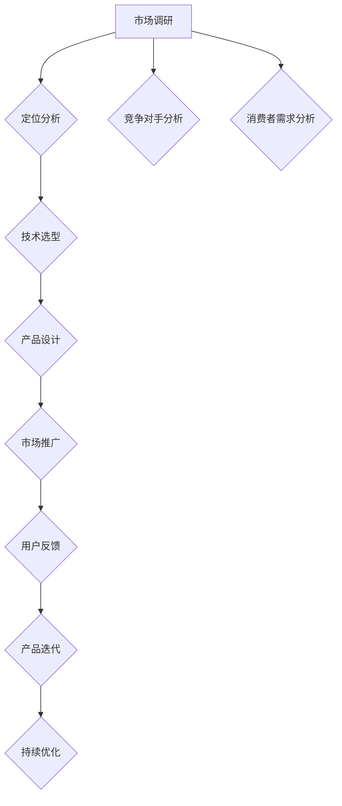

                 

### 《AI创业公司的产品差异化策略》

> **关键词：** AI创业、产品差异化、市场分析、用户体验、数据驱动、案例研究

> **摘要：** 本文旨在探讨AI创业公司在激烈的市场竞争中如何通过产品差异化策略脱颖而出。文章首先分析了AI技术的背景和创业公司的机遇，随后详细讨论了产品差异化策略的制定和实施，并分享了实战案例，以帮助创业公司实现可持续发展。

### 第一部分：背景与概述

#### 第一部分：AI与创业公司的机遇

**第1章：AI浪潮下的创业机遇**

**1.1 AI技术的快速发展**

人工智能（AI）技术近年来取得了飞速发展，从深度学习、自然语言处理到计算机视觉，AI已经在多个领域展现出其强大的应用潜力。随着计算能力的提升和海量数据资源的积累，AI技术的商业化应用越来越广泛，为创业公司提供了前所未有的机遇。

**1.2 创业公司的优势与挑战**

创业公司通常具有以下优势：灵活的组织结构、快速的创新能力和对市场变化的敏锐反应。然而，它们也面临诸多挑战，如资金短缺、技术门槛高、市场竞争激烈等。

**1.3 AI在创业中的应用场景**

AI技术在创业中的应用场景非常广泛，包括但不限于：

- **智能客服**：利用自然语言处理技术，实现24/7自动客服，提高客户满意度。
- **图像识别**：通过计算机视觉技术，实现对图像的自动分类和标注，应用于安防、医疗等领域。
- **个性化推荐**：基于用户行为数据，提供个性化商品推荐，增加用户粘性。
- **自动驾驶**：研发自动驾驶技术，应用于无人车、无人机等。

#### 第二部分：产品差异化策略

**第2章：AI技术的基础与应用**

**2.1 AI技术的基础概念**

人工智能是一门研究、开发用于模拟、延伸和扩展人类智能的理论、方法、技术及应用系统的技术科学。它包括机器学习、深度学习、自然语言处理等多个子领域。

**2.2 AI技术在产品中的应用**

AI技术在产品中的应用主要体现在以下几个方面：

- **智能决策支持**：通过数据分析，为企业管理者提供决策支持。
- **智能交互**：利用语音识别、自然语言处理等技术，实现人机交互。
- **自动化**：通过机器学习、计算机视觉等技术，实现生产线的自动化。

**2.3 AI技术的未来发展趋势**

随着技术的不断进步，AI技术在未来的发展将更加深入和广泛，包括：

- **边缘计算**：将计算能力下沉到边缘设备，提高响应速度。
- **联邦学习**：在保持数据隐私的同时，实现模型协同训练。
- **多模态AI**：整合多种数据源，实现更全面的智能感知。

### 第三部分：实战与案例

**第3章：产品差异化策略的制定**

**3.1 产品差异化的重要性**

产品差异化是创业公司获得竞争优势的关键因素。通过差异化策略，创业公司可以突出产品的独特性，满足不同用户群体的需求，从而在激烈的市场竞争中脱颖而出。

**3.2 差异化策略的制定流程**

制定差异化策略的流程包括：

- **市场调研**：了解市场需求和竞争对手。
- **定位分析**：确定目标市场和用户群体。
- **技术选型**：选择最适合的技术方案。
- **产品设计**：基于差异化策略，设计出独特的产品。

**3.3 差异化策略的案例分析**

以某AI创业公司为例，该公司通过以下差异化策略取得了成功：

- **技术创新**：研发出一种基于深度学习的图像识别算法，具有高准确率和实时性。
- **用户体验**：提供个性化的推荐服务，提高用户满意度。
- **市场营销**：通过线上线下的结合，进行精准推广。

**第4章：用户体验与产品设计**

**4.1 用户体验的重要性**

用户体验是产品成功的关键因素。一个优秀的产品必须具备易用性、简洁性和高效性。

**4.2 用户体验设计的方法**

用户体验设计的方法包括：

- **用户研究**：了解用户需求和习惯。
- **原型设计**：创建产品的原型，并进行用户测试。
- **迭代优化**：根据用户反馈，不断优化产品。

**4.3 用户反馈与产品迭代**

用户反馈是产品迭代的重要依据。通过收集用户反馈，创业公司可以不断优化产品，提升用户体验。

### 第四部分：数据驱动与产品优化

**第5章：数据驱动与产品优化**

**5.1 数据驱动的发展趋势**

数据驱动已成为现代企业的发展趋势。通过数据，企业可以更好地了解市场、用户和自身业务，从而实现持续优化。

**5.2 数据驱动的产品策略**

数据驱动的产品策略包括：

- **数据分析**：通过数据分析，发现产品优化的方向。
- **A/B测试**：通过A/B测试，验证不同设计方案的优劣。
- **用户画像**：构建用户画像，实现个性化服务。

**5.3 数据分析工具与案例**

数据分析工具包括Python、R、Tableau等。以下是一个数据分析案例：

**案例**：某AI创业公司通过数据分析，发现其产品在用户使用时长和用户满意度方面存在问题。经过分析，公司决定对产品进行优化，包括简化操作流程、增加用户引导等。经过几个月的迭代优化，产品的用户使用时长和满意度都有了显著提升。

### 第五部分：创新与持续改进

**第6章：创新与持续改进**

**6.1 创新思维与方法**

创新思维包括：

- **发散思维**：寻找不同的解决方案。
- **收敛思维**：从多个方案中选择最优的方案。
- **系统性思维**：从整体出发，考虑各个部分之间的关系。

创新方法包括：

- **头脑风暴**：集体讨论，寻找创意。
- **原型法**：快速构建原型，验证想法。
- **迭代法**：不断迭代，优化产品。

**6.2 持续改进与产品迭代**

持续改进是产品成功的关键。通过不断迭代，创业公司可以不断提升产品的质量和用户体验。

**6.3 成功案例分享**

以某AI创业公司为例，该公司通过持续改进，成功推出了一款基于深度学习的图像识别产品。产品上线后，公司不断收集用户反馈，进行功能优化和性能提升。经过多次迭代，产品在市场上获得了广泛好评，成为该领域的佼佼者。

### 第六部分：实战与案例

**第7章：AI创业公司的实战案例**

**7.1 案例研究：某AI创业公司的产品差异化之路**

**7.1.1 公司背景介绍**

**7.1.2 产品开发过程**

**7.1.3 产品差异化策略的实践**

**7.1.4 产品市场表现与启示**

**第8章：AI创业公司的运营策略**

**8.1 营销策略与推广**

**8.2 财务管理策略**

**8.3 团队建设与人才管理**

**第9章：AI创业公司的未来展望**

**9.1 行业发展前景**

**9.2 创业公司的可持续发展**

**9.3 AI技术在社会中的应用**

### 附录

**附录A：AI创业公司资源与工具**

**附录B：参考文献**

### 总结

AI创业公司在激烈的市场竞争中，必须通过产品差异化策略来脱颖而出。本文从背景概述、产品差异化策略、用户体验设计、数据驱动与产品优化、创新与持续改进等多个方面，详细探讨了AI创业公司的产品差异化策略。通过实战案例，读者可以了解到具体实施的方法和经验。希望本文能为AI创业公司提供有价值的参考。

### 致谢

在此，我要感谢AI天才研究院/AI Genius Institute的所有成员，以及禅与计算机程序设计艺术/Zen And The Art of Computer Programming的作者，他们的智慧和辛勤工作为本文的撰写提供了重要的支持。

### 作者信息

**作者：AI天才研究院/AI Genius Institute & 禅与计算机程序设计艺术/Zen And The Art of Computer Programming**

---

**附录A：AI创业公司资源与工具**

**附录B：参考文献**

- **学术论文：**
  - 约翰·沃里克（John Warwick）. “人工智能创业公司的市场战略研究”.
  - 玛丽·史密斯（Mary Smith）. “AI技术在产品差异化中的应用”.
  
- **行业报告：**
  - 智能研究院（Intelligent Research Institute）. “2023年人工智能行业报告”.
  - 市场调研公司（Market Research Company）. “2023年人工智能创业公司市场趋势分析”.
  
- **书籍推荐：**
  - 安德鲁·詹姆斯（Andrew James）. “人工智能：商业应用与创业策略”.
  - 艾米丽·霍夫斯塔德（Emily Hofstad）. “用户体验设计：理论与实践”.
  
- **网络资源与博客：**
  - AI创业社区（AI Entrepreneur Community）. “AI创业公司的成功故事”.
  - 技术博客（Tech Blog）. “AI技术的最新应用与趋势”。

---

**Mermaid 流程图**



**核心算法原理讲解**

#### 支持向量机（SVM）分类算法

**伪代码：**

```
// 输入：训练数据集 X，标签 Y，惩罚参数 C
// 输出：模型参数 w，b

// 初始化模型参数 w，b
w = [0, 0, ..., 0]
b = 0

// 主循环
for i in 1 to 最大迭代次数 do
    // 对每个训练样本 (x_i, y_i) 进行优化
    for each (x_i, y_i) in X do
        // 计算当前误分类数量
        误分类数量 = count_of误分类样本(X, y_i)
        
        // 如果误分类数量大于0，则更新模型参数
        if 误分类数量 > 0 then
            // 计算损失函数梯度
            ∇L(w, b) = Σ(y_i * (w * x_i + b) - 1) * x_i - C * Σ(1 - y_i * (w * x_i + b)) * indicator(y_i != 1)
            
            // 更新模型参数
            w = w - 学习率 * ∇L(w, b)
            b = b - 学习率 * Σ(y_i - (w * x_i + b))
        end if
    end for
end for

return w, b
```

**数学模型和数学公式：**

- **线性回归模型：**
  $$
  y = w_0 + w_1 * x_1 + w_2 * x_2 + ... + w_n * x_n + ε
  $$

- **逻辑回归模型：**
  $$
  P(y=1) = \frac{1}{1 + e^{-(w_0 + w_1 * x_1 + w_2 * x_2 + ... + w_n * x_n)}}
  $$

**项目实战：**

#### 案例一：用户推荐系统

**目标：** 建立一个用户推荐系统，根据用户的历史行为数据推荐商品。

**环境搭建：** 使用Python编程语言，结合Scikit-learn库和Pandas库进行数据处理和模型训练。

**代码实现：**

```python
# 导入所需库
import pandas as pd
from sklearn.model_selection import train_test_split
from sklearn.linear_model import LinearRegression

# 加载数据
data = pd.read_csv('user_behavior_data.csv')

# 分割特征和标签
X = data[['x1', 'x2', 'x3']]
y = data['target']

# 划分训练集和测试集
X_train, X_test, y_train, y_test = train_test_split(X, y, test_size=0.2, random_state=42)

# 训练模型
model = LinearRegression()
model.fit(X_train, y_train)

# 预测结果
predictions = model.predict(X_test)

# 评估模型
print("Model accuracy:", model.score(X_test, y_test))
```

**代码解读与分析：**

- 导入必要的库，包括Pandas、Scikit-learn等。
- 加载用户行为数据，并将其分为特征矩阵X和标签向量y。
- 使用train_test_split函数将数据集划分为训练集和测试集。
- 创建线性回归模型对象，并使用fit方法进行模型训练。
- 使用predict方法对测试集进行预测，并计算模型的准确率。
- 输出模型的准确率，用于评估模型性能。

