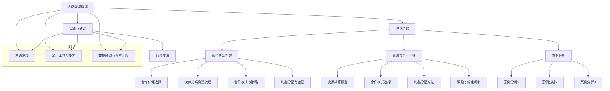

                 

# AI创业公司的战略联盟策略

> 关键词：战略联盟、AI创业公司、合作模式、资源共享、协同创新、风险共担

> 摘要：本文旨在探讨AI创业公司在快速发展过程中，如何通过战略联盟策略来提升竞争力。文章首先介绍了AI创业公司的现状与挑战，然后详细阐述了战略联盟的概念、理论基础、伙伴关系构建、资源共享与合作模式，并通过对实际案例的深入分析，总结了战略联盟的成功因素与启示，最后提出了针对AI创业公司的战略联盟实践策略。

----------------------------------------------------------------

## 第一部分: AI创业公司的战略联盟策略概述

### 第1章: 引言与背景

在当前科技快速发展的时代，人工智能（AI）技术的突破和应用创新已成为推动社会进步的重要力量。随着AI技术的不断成熟和市场的日益扩大，越来越多的创业公司投身于这一领域，以期在这个新兴市场中占据一席之地。然而，AI创业公司在发展过程中面临着诸多挑战，如技术积累不足、市场竞争力不强、资金压力等。为了应对这些挑战，AI创业公司需要采取有效的战略联盟策略，通过与其他企业、研究机构等建立合作关系，实现资源共享、协同创新和风险共担，从而提升自身竞争力和市场地位。

### 1.1 AI创业公司的现状与挑战

#### 技术积累不足

AI创业公司往往成立时间较短，技术积累相对薄弱。这使得它们在研发过程中难以迅速突破关键技术瓶颈，难以在激烈的市场竞争中脱颖而出。

#### 市场竞争力不强

由于资源有限，AI创业公司往往在市场推广、品牌建设等方面处于劣势。这使得它们难以与拥有强大市场影响力的企业竞争。

#### 资金压力

AI创业公司通常需要大量的资金投入来支持技术研发和市场推广。然而，融资渠道有限，资金压力较大。

#### 人才短缺

高素质人才是AI创业公司发展的关键。然而，由于公司规模有限，很难吸引和留住顶尖人才。

### 1.2 战略联盟的概念与重要性

#### 战略联盟的定义

战略联盟是指两个或多个企业为了实现共同的目标，在特定领域内建立的一种长期、稳定的合作关系。

#### 战略联盟的重要性

1. **资源共享**：战略联盟使得AI创业公司可以共享其他企业的资源，如技术、资金、市场等，从而降低成本、提高效益。

2. **协同创新**：通过战略联盟，AI创业公司可以与其他企业、研究机构等共同开展研发项目，实现技术创新和产品升级。

3. **风险共担**：战略联盟使得AI创业公司可以共同承担市场风险，降低单一企业面临的风险。

4. **提升竞争力**：通过战略联盟，AI创业公司可以借助合作伙伴的品牌、市场资源等，提升自身竞争力。

### 1.3 本书的结构与内容概述

本书分为四个部分，分别从战略联盟概述、理论基础、伙伴关系构建、资源共享与合作、案例分析、实践策略等方面，全面探讨AI创业公司的战略联盟策略。

- **第一部分：战略联盟策略概述**：介绍AI创业公司的现状与挑战，战略联盟的概念与重要性。
- **第二部分：战略联盟的理论基础**：阐述战略联盟的定义、类型、优势、风险，合作伙伴选择和治理结构。
- **第三部分：战略联盟的伙伴关系构建与资源共享**：探讨伙伴关系构建的流程、方法、价值共创、协同效应、动态调整，以及资源共享的概念、模式、利益分配、激励与约束机制。
- **第四部分：战略联盟的案例分析与实践策略**：通过实际案例，分析AI创业公司如何通过战略联盟提升竞争力，并总结成功因素与启示，提出实践策略。

----------------------------------------------------------------

## 第二部分: 战略联盟的理论基础

战略联盟作为一种重要的企业合作形式，在AI创业公司的发展过程中具有重要作用。本部分将详细探讨战略联盟的定义、类型、优势与风险，合作伙伴的选择以及战略联盟的治理结构。

### 2.1 战略联盟的定义与类型

#### 战略联盟的定义

战略联盟是指两个或多个企业为了实现共同的目标，在特定领域内建立的一种长期、稳定的合作关系。这种合作不仅涉及业务层面，还包括技术、市场、资源等多方面的合作。

#### 战略联盟的类型

1. **水平型战略联盟**：企业之间在同一行业内，为了共同开拓市场或分担成本而建立的联盟。例如，两个AI创业公司合作开发一个大型项目。
   
2. **垂直型战略联盟**：企业之间在不同行业内，为了实现供应链的优化或资源的互补而建立的联盟。例如，AI创业公司与硬件制造商合作，共同开发智能硬件产品。

3. **混合型战略联盟**：企业之间在多个领域内建立的合作关系，既包括水平型又包括垂直型的特点。例如，AI创业公司与金融机构合作，共同开发金融科技产品。

### 2.2 战略联盟的优势与风险

#### 战略联盟的优势

1. **资源共享**：通过战略联盟，AI创业公司可以共享其他企业的资源，如技术、资金、市场等，从而降低成本、提高效益。
   
2. **协同创新**：战略联盟使得AI创业公司可以与其他企业、研究机构等共同开展研发项目，实现技术创新和产品升级。

3. **风险共担**：战略联盟使得AI创业公司可以共同承担市场风险，降低单一企业面临的风险。

4. **提升竞争力**：通过战略联盟，AI创业公司可以借助合作伙伴的品牌、市场资源等，提升自身竞争力。

5. **拓展市场**：战略联盟可以帮助AI创业公司快速进入新市场，扩大市场份额。

#### 战略联盟的风险

1. **战略目标不一致**：合作伙伴之间的战略目标不一致可能导致合作破裂。

2. **资源分配不公**：战略联盟中，资源分配不公可能导致一方利益受损。

3. **信息不对称**：战略联盟中，合作伙伴之间的信息不对称可能导致决策失误。

4. **文化差异**：合作伙伴之间的文化差异可能导致沟通障碍，影响合作效果。

5. **法律风险**：战略联盟中的合同、知识产权等法律问题可能导致纠纷。

### 2.3 战略联盟的合作伙伴选择

#### 合作伙伴选择的原则

1. **优势互补**：选择与自身业务互补的企业作为合作伙伴，实现资源、技术的共享。

2. **信任基础**：建立信任是战略联盟成功的关键，选择信誉良好的合作伙伴。

3. **协同效应**：选择能够实现协同效应的合作伙伴，共同推动项目发展。

4. **长期合作**：选择有长期合作意愿的合作伙伴，确保战略联盟的稳定性。

#### 合作伙伴选择的方法

1. **市场调研**：通过市场调研，了解潜在合作伙伴的业务、技术、市场地位等信息。

2. **商业谈判**：与潜在合作伙伴进行商业谈判，明确合作目标、资源分配、权益保障等。

3. **项目评估**：对合作项目进行评估，确定项目的可行性和预期收益。

4. **法律咨询**：咨询专业律师，确保战略联盟的合法性，避免法律风险。

### 2.4 战略联盟的治理结构

#### 治理结构的原则

1. **平等合作**：确保战略联盟中各方地位的平等，避免一方主导。

2. **透明沟通**：建立透明的沟通机制，确保信息共享和决策透明。

3. **利益平衡**：确保各方利益的平衡，避免利益冲突。

4. **灵活调整**：战略联盟中，根据实际情况进行灵活调整，确保合作持续有效。

#### 治理结构的设计

1. **决策机制**：建立明确的决策机制，明确各方的决策权和责任。

2. **监督机制**：建立监督机制，确保合作过程中的透明度和合规性。

3. **激励机制**：建立激励机制，鼓励合作伙伴积极参与，共同推动项目发展。

4. **退出机制**：明确战略联盟的退出机制，确保在合作破裂时各方的权益得到保障。

### 2.5 战略联盟的实施步骤

#### 实施步骤

1. **明确目标**：确定战略联盟的目标和愿景，确保各方对合作的期望一致。

2. **寻找合作伙伴**：通过市场调研、商业谈判等方式，寻找合适的合作伙伴。

3. **合作协议**：制定合作协议，明确各方的权利、义务和责任。

4. **实施项目**：按照合作协议，共同实施项目，实现资源共享、协同创新。

5. **监督与评估**：对合作过程进行监督和评估，确保合作目标的实现。

6. **调整与优化**：根据实际情况，对战略联盟进行调整和优化，确保合作的持续性和有效性。

### 2.6 战略联盟的风险管理

#### 风险管理的方法

1. **风险识别**：识别战略联盟中可能出现的风险，包括市场风险、技术风险、法律风险等。

2. **风险评估**：对识别出的风险进行评估，确定风险的可能性和影响程度。

3. **风险应对**：制定风险应对策略，包括风险规避、风险转移、风险接受等。

4. **风险监控**：建立风险监控机制，实时监测风险变化，确保风险得到及时控制。

#### 风险管理的关键点

1. **建立信任**：建立信任是战略联盟风险管理的关键，确保合作伙伴之间的信息共享和合作意愿。

2. **明确责任**：明确各方的责任和义务，确保在风险发生时能够迅速采取措施。

3. **法律保障**：确保战略联盟的合法性，避免因法律问题导致的风险。

4. **灵活应对**：战略联盟中，根据实际情况进行灵活调整，确保合作目标的实现。

### 2.7 战略联盟的案例分析

#### 案例分析

1. **案例背景**：分析战略联盟的背景，包括合作双方的企业背景、合作动机等。

2. **合作过程**：分析战略联盟的合作过程，包括合作项目的实施、资源分配、沟通机制等。

3. **合作成果**：分析战略联盟的合作成果，包括技术创新、市场拓展、收益分配等。

4. **合作启示**：总结战略联盟的成功因素和失败原因，提出合作启示。

### 2.8 战略联盟的未来发展趋势

#### 发展趋势

1. **合作深度加大**：随着科技的发展，战略联盟的合作深度将不断加大，从单一业务合作向全产业链合作发展。

2. **合作模式创新**：战略联盟的合作模式将不断创新，包括跨界合作、平台化合作等。

3. **数字化转型**：战略联盟中的数字化转型将加快，利用大数据、人工智能等技术提升合作效率。

4. **全球布局**：战略联盟将逐步实现全球布局，跨国合作将越来越普遍。

#### 发展挑战

1. **技术壁垒**：技术壁垒将制约战略联盟的发展，特别是在核心技术的合作方面。

2. **法律风险**：随着跨国合作的增加，法律风险将成为战略联盟面临的重要挑战。

3. **文化差异**：文化差异将影响战略联盟的沟通和合作效果。

4. **人才竞争**：人才竞争将加剧，对战略联盟的人才需求将提出更高要求。

### 2.9 战略联盟的重要性

战略联盟对AI创业公司的发展具有重要意义。

1. **提升竞争力**：战略联盟可以帮助AI创业公司提升竞争力，通过合作实现资源共享、协同创新和风险共担。

2. **降低成本**：通过战略联盟，AI创业公司可以降低研发成本、市场推广成本等，提高效益。

3. **拓展市场**：战略联盟可以帮助AI创业公司快速进入新市场，扩大市场份额。

4. **技术创新**：战略联盟可以实现技术创新，推动AI技术的发展和应用。

5. **降低风险**：战略联盟可以帮助AI创业公司共同承担市场风险，降低单一企业面临的风险。

### 2.10 总结

战略联盟是AI创业公司应对市场竞争、实现持续发展的重要策略。通过战略联盟，AI创业公司可以借助合作伙伴的资源、技术和市场优势，提升自身竞争力，实现共同发展。然而，战略联盟也面临诸多风险和挑战，需要AI创业公司在合作过程中审慎选择合作伙伴，建立稳定的合作关系，并采取有效的风险管理措施，确保战略联盟的顺利进行。

----------------------------------------------------------------

### 2.11 战略联盟的伙伴关系构建

#### 3.1 伙伴关系构建的流程与方法

建立战略联盟伙伴关系是一个复杂的过程，需要细致的规划和科学的实施方法。以下是构建伙伴关系的常规流程和方法：

##### 1. 制定合作愿景和目标

在构建伙伴关系之前，首先需要明确双方的共同愿景和合作目标。这一步骤包括：

- **明确合作愿景**：双方共同确定长期合作的目标和愿景，确保合作的方向一致。
- **制定合作目标**：根据合作愿景，制定具体的合作目标和阶段性目标，如技术研发、市场拓展、产品创新等。

##### 2. 进行市场调研和竞争分析

市场调研和竞争分析是构建伙伴关系的重要基础。通过市场调研，可以了解潜在合作伙伴的市场地位、业务模式、技术创新能力等，从而评估其合作潜力。竞争分析则可以帮助双方了解市场竞争对手的情况，为合作策略的制定提供参考。

- **市场调研**：通过问卷调查、访谈、行业报告等方式，收集潜在合作伙伴的市场信息。
- **竞争分析**：分析潜在合作伙伴在市场中的竞争地位，评估其竞争优势和劣势。

##### 3. 确定合作伙伴的选择标准

为了确保战略联盟的有效性，需要根据合作目标和市场调研结果，制定合作伙伴的选择标准。这些标准通常包括：

- **业务互补性**：合作伙伴的业务与自身业务是否有互补性，是否能够实现资源共享和协同创新。
- **技术能力**：合作伙伴的技术实力是否符合合作项目的要求，是否能够提供有效的技术支持。
- **市场影响力**：合作伙伴在市场中的影响力和品牌知名度，是否能够帮助提升自身市场地位。
- **信誉和声誉**：合作伙伴的信誉和声誉，是否具有诚信和责任感。
- **合作意愿**：合作伙伴的合作意愿和长期合作意愿，是否愿意共同面对挑战和风险。

##### 4. 开展商业谈判和合同签订

在确定了合作伙伴的选择标准后，接下来就是与潜在合作伙伴进行商业谈判和合同签订。这一步骤需要关注以下要点：

- **谈判策略**：根据合作目标和选择标准，制定合适的谈判策略，确保谈判的顺利进行。
- **合同条款**：明确合作的内容、范围、责任、利益分配、风险承担等，确保合作的法律效力。

##### 5. 建立沟通和协作机制

在合作合同签订后，需要建立有效的沟通和协作机制，确保合作伙伴之间的信息共享和协同工作。具体措施包括：

- **定期会议**：定期举行合作伙伴会议，讨论合作进展、解决问题、规划下一步行动。
- **信息共享平台**：建立信息共享平台，方便合作伙伴实时了解合作项目的情况，共享资源和信息。
- **协同工作**：明确各方的职责和任务，确保合作项目的顺利进行。

##### 6. 实施合作项目并进行监督和评估

合作项目的实施是伙伴关系构建的关键环节。在这一过程中，需要：

- **项目实施**：按照合作协议，共同推进合作项目，确保项目的按时、按质完成。
- **监督和评估**：对合作项目进行定期监督和评估，确保项目目标的实现，发现问题及时调整。

##### 7. 持续优化和调整

合作过程中，需要不断优化和调整合作伙伴关系，以适应市场变化和双方需求。具体措施包括：

- **反馈机制**：建立反馈机制，及时收集合作伙伴的反馈意见，对合作过程进行优化。
- **调整合作策略**：根据市场变化和合作效果，适时调整合作策略和目标。

#### 3.2 伙伴关系的价值共创

伙伴关系的价值共创是战略联盟的核心目标之一。通过伙伴关系的建立，双方可以实现资源的共享、协同创新和风险共担，从而创造更大的价值。以下是伙伴关系价值共创的几个关键点：

##### 1. 资源共享

资源共享是伙伴关系价值共创的基础。通过资源共享，合作伙伴可以降低成本、提高效率，实现资源的最大化利用。具体措施包括：

- **技术资源**：双方可以共享技术资源，如专利技术、研发成果等，提高技术创新能力。
- **人力资源**：双方可以共享人力资源，如专业人才、管理团队等，提高工作效率。
- **市场资源**：双方可以共享市场资源，如客户资源、销售渠道等，扩大市场份额。

##### 2. 协同创新

协同创新是伙伴关系价值共创的重要途径。通过协同创新，合作伙伴可以共同开发新产品、新技术，提高市场竞争力。具体措施包括：

- **技术研发**：双方可以共同投入技术研发，提高技术创新的速度和质量。
- **产品开发**：双方可以共同开发新产品，实现快速上市。
- **市场推广**：双方可以共同进行市场推广，提高市场知名度和销售额。

##### 3. 风险共担

风险共担是伙伴关系价值共创的保障。通过风险共担，合作伙伴可以降低市场风险，提高抗风险能力。具体措施包括：

- **市场风险**：双方可以共同承担市场风险，如市场需求变化、竞争对手压力等。
- **技术风险**：双方可以共同承担技术风险，如技术突破困难、技术瓶颈等。
- **法律风险**：双方可以共同承担法律风险，如合同纠纷、知识产权争议等。

##### 4. 文化融合

文化融合是伙伴关系价值共创的重要环节。通过文化融合，合作伙伴可以减少文化冲突，提高合作效率。具体措施包括：

- **文化认同**：双方需要建立共同的文化价值观，形成共同的目标和愿景。
- **文化沟通**：双方需要加强文化沟通，增进了解和信任，减少误解和冲突。
- **文化适应性**：双方需要根据合作实际情况，调整自身的文化行为，适应合作环境。

#### 3.3 伙伴关系的协同效应

伙伴关系的协同效应是伙伴关系价值共创的重要体现。通过协同效应，合作伙伴可以实现“1+1>2”的效果，提高整体竞争力。以下是伙伴关系协同效应的几个关键点：

##### 1. 知识共享

知识共享是伙伴关系协同效应的重要来源。通过知识共享，合作伙伴可以快速获取外部知识，提高自身的知识水平和创新能力。具体措施包括：

- **技术知识**：双方可以共享技术知识，如前沿技术、行业趋势等，提高技术储备。
- **市场知识**：双方可以共享市场知识，如市场需求、竞争态势等，提高市场洞察力。
- **管理知识**：双方可以共享管理知识，如管理模式、组织架构等，提高管理效率。

##### 2. 资源整合

资源整合是伙伴关系协同效应的重要体现。通过资源整合，合作伙伴可以实现资源的优化配置，提高资源利用效率。具体措施包括：

- **人力资源**：双方可以整合人力资源，如专业人才、管理团队等，实现优势互补。
- **技术资源**：双方可以整合技术资源，如研发设备、技术平台等，提高研发效率。
- **市场资源**：双方可以整合市场资源，如客户资源、销售渠道等，提高市场竞争力。

##### 3. 创新协作

创新协作是伙伴关系协同效应的核心。通过创新协作，合作伙伴可以共同开发新产品、新技术，提高市场竞争力。具体措施包括：

- **技术研发**：双方可以共同投入技术研发，提高技术创新的速度和质量。
- **产品开发**：双方可以共同开发新产品，实现快速上市。
- **市场推广**：双方可以共同进行市场推广，提高市场知名度和销售额。

##### 4. 品牌协同

品牌协同是伙伴关系协同效应的重要方面。通过品牌协同，合作伙伴可以共同提升品牌形象，提高市场影响力。具体措施包括：

- **品牌宣传**：双方可以共同进行品牌宣传，扩大品牌知名度。
- **品牌合作**：双方可以开展品牌合作活动，如联合促销、品牌代言等，提高品牌影响力。
- **品牌管理**：双方可以共同管理品牌，确保品牌形象的一致性和稳定性。

#### 3.4 伙伴关系的动态调整

伙伴关系是一个动态的过程，需要根据实际情况进行不断的调整和优化。以下是伙伴关系动态调整的几个关键点：

##### 1. 定期评估

定期评估是伙伴关系动态调整的重要手段。通过定期评估，可以了解合作项目的进展情况、存在的问题以及合作伙伴的满意度，为调整提供依据。

- **项目评估**：对合作项目的进度、质量、成本等方面进行评估，确保项目目标的实现。
- **满意度评估**：对合作伙伴的满意度进行评估，了解双方的期望和需求，为调整合作策略提供参考。

##### 2. 调整合作目标

根据定期评估的结果，需要对合作目标进行调整和优化。这包括：

- **目标修正**：根据实际情况，修正合作目标，确保目标的可行性和合理性。
- **目标细化**：将宏观目标细化成具体的阶段性目标，确保目标的可操作性和可衡量性。

##### 3. 调整合作模式

根据合作目标和市场变化，需要对合作模式进行调整和优化。这包括：

- **合作模式优化**：根据实际情况，调整合作模式，确保合作模式的适应性和有效性。
- **合作范围扩展**：根据实际情况，扩展合作范围，实现更广泛的资源整合和协同创新。

##### 4. 增强合作信任

增强合作信任是伙伴关系动态调整的重要保障。通过以下措施，可以增强合作信任：

- **建立沟通机制**：建立稳定的沟通机制，确保信息共享和问题解决的及时性。
- **强化合作意愿**：通过合作成果的分享和利益的平衡，强化合作伙伴的合作意愿。
- **建立信任机制**：建立信任评估和激励机制，确保合作伙伴之间的信任关系。

#### 3.5 伙伴关系的利益分配

伙伴关系的利益分配是战略联盟的核心问题之一。合理的利益分配可以确保合作伙伴的积极性，提高合作的成功率。以下是伙伴关系的利益分配机制：

##### 1. 利益分配原则

利益分配需要遵循以下原则：

- **公平原则**：确保各方在利益分配中的公平性，避免利益冲突。
- **贡献原则**：根据各方的贡献程度进行利益分配，确保贡献大的合作伙伴获得更大的利益。
- **共享原则**：通过利益共享，增强合作伙伴之间的合作意愿和稳定性。

##### 2. 利益分配方法

利益分配可以采用以下方法：

- **固定比例分配**：按照固定比例，将合作收益分配给各合作伙伴。
- **浮动比例分配**：根据各方的实际贡献，动态调整利益分配比例。
- **股权分配**：通过股权分配，确保合作伙伴在合作中的权益。

##### 3. 利益分配的动态调整

利益分配是一个动态调整的过程。根据合作项目的进展和合作伙伴的贡献，需要对利益分配进行动态调整。这包括：

- **定期调整**：根据定期评估的结果，对利益分配进行定期调整。
- **特殊调整**：在特殊情况下，如项目成功或风险共担等，对利益分配进行特殊调整。

#### 3.6 伙伴关系的风险共担

伙伴关系的风险共担是确保合作稳定性和可持续性的关键。以下是伙伴关系的风险共担机制：

##### 1. 风险识别

风险识别是风险共担的第一步。通过以下方法，可以识别合作中的潜在风险：

- **历史数据分析**：分析过去合作项目中的风险，为当前合作提供借鉴。
- **专家评估**：邀请行业专家进行风险评估，识别潜在风险。
- **问卷调查**：通过问卷调查，收集合作伙伴对风险的看法和建议。

##### 2. 风险评估

风险评估是对识别出的风险进行评估，确定风险的可能性和影响程度。以下是风险评估的方法：

- **定性评估**：通过专家访谈、头脑风暴等方式，对风险进行定性评估。
- **定量评估**：通过数据分析、模型模拟等方式，对风险进行定量评估。
- **综合评估**：将定性评估和定量评估相结合，对风险进行综合评估。

##### 3. 风险应对

风险应对是针对评估出的风险，制定相应的应对策略。以下是风险应对的方法：

- **风险规避**：通过调整合作策略，避免高风险的合作。
- **风险转移**：通过购买保险、签订合同等方式，将风险转移给第三方。
- **风险接受**：在风险较低或无法规避时，接受风险，并制定相应的应急措施。

##### 4. 风险共担的动态调整

风险共担是一个动态调整的过程。根据合作项目的进展和风险的变化，需要对风险共担进行动态调整。这包括：

- **定期评估**：根据定期评估的结果，对风险共担进行评估和调整。
- **特殊调整**：在特殊情况下，如项目成功或风险发生时，对风险共担进行特殊调整。

#### 3.7 伙伴关系的持续发展

伙伴关系的持续发展是战略联盟成功的关键。以下是伙伴关系持续发展的几个关键点：

##### 1. 持续沟通

持续沟通是伙伴关系持续发展的基础。通过以下方式，可以保持持续的沟通：

- **定期会议**：定期举行合作伙伴会议，讨论合作进展、解决问题、规划下一步行动。
- **沟通平台**：建立信息共享平台，方便合作伙伴实时了解合作项目的情况，共享资源和信息。

##### 2. 持续创新

持续创新是伙伴关系持续发展的动力。通过以下方式，可以保持持续的创新能力：

- **技术研发**：双方共同投入技术研发，提高技术创新的速度和质量。
- **市场拓展**：双方共同开拓新市场，扩大市场份额。
- **产品创新**：双方共同开发新产品，满足市场需求。

##### 3. 持续优化

持续优化是伙伴关系持续发展的保障。通过以下方式，可以保持持续优化：

- **反馈机制**：建立反馈机制，及时收集合作伙伴的反馈意见，对合作过程进行优化。
- **流程优化**：根据反馈意见，优化合作流程，提高合作效率。

##### 4. 持续合作

持续合作是伙伴关系持续发展的目标。通过以下方式，可以确保持续合作：

- **利益平衡**：通过利益平衡，确保合作伙伴之间的利益分配公平合理。
- **信任建设**：通过信任建设，增强合作伙伴之间的信任和合作意愿。

### 2.12 伙伴关系构建的案例

以下是一个伙伴关系构建的案例，通过这个案例，可以更清晰地了解伙伴关系构建的过程和关键点。

#### 案例背景

某AI创业公司（以下简称公司A）在开发一款智能客服系统，由于技术实力和资源有限，决定寻求战略联盟伙伴（以下简称公司B）进行合作。

#### 案例过程

1. **制定合作愿景和目标**

   公司A和B共同制定了以下合作愿景和目标：

   - **合作愿景**：共同推动智能客服技术的发展，提高用户体验，占领市场份额。
   - **合作目标**：在一年内，共同开发出一款具有市场竞争力的智能客服系统，并在市场上实现销售。

2. **进行市场调研和竞争分析**

   公司A和B进行了市场调研和竞争分析，了解潜在合作伙伴的市场地位、业务模式、技术创新能力等，从而评估其合作潜力。

3. **确定合作伙伴的选择标准**

   公司A和B根据合作目标和市场调研结果，制定了以下合作伙伴的选择标准：

   - **业务互补性**：合作伙伴需要具备智能客服系统相关的技术能力和市场资源。
   - **技术能力**：合作伙伴需要具备领先的智能客服技术研发能力。
   - **市场影响力**：合作伙伴在市场中的影响力和品牌知名度，是否能够帮助公司A提升市场地位。
   - **信誉和声誉**：合作伙伴的信誉和声誉，是否具有诚信和责任感。
   - **合作意愿**：合作伙伴的合作意愿和长期合作意愿。

4. **开展商业谈判和合同签订**

   公司A和B进行了商业谈判，明确了合作的内容、范围、责任、利益分配、风险承担等，签订了合作协议。

5. **建立沟通和协作机制**

   公司A和B建立了定期会议、信息共享平台等沟通和协作机制，确保合作项目的顺利进行。

6. **实施合作项目并进行监督和评估**

   公司A和B按照合作协议，共同实施合作项目，对合作项目进行定期监督和评估，确保项目目标的实现。

7. **持续优化和调整**

   公司A和B根据合作项目的进展和合作伙伴的反馈，对合作伙伴关系进行持续优化和调整，确保合作的持续性和有效性。

#### 案例总结

通过这个案例，我们可以看到伙伴关系构建的过程和关键点。成功的伙伴关系构建需要明确合作愿景和目标，进行市场调研和竞争分析，制定合作伙伴的选择标准，开展商业谈判和合同签订，建立沟通和协作机制，实施合作项目并进行监督和评估，以及持续优化和调整。这些步骤和措施确保了合作伙伴之间的合作顺利进行，实现了资源的共享、协同创新和风险共担，提高了合作的成功率。

### 2.13 伙伴关系的建立与维护

伙伴关系的建立与维护是战略联盟成功的关键。以下是伙伴关系建立与维护的几个关键点：

#### 1. 建立信任

建立信任是伙伴关系建立的前提。双方需要在合作过程中保持诚信，履行承诺，尊重对方，共同解决问题。以下是建立信任的几个要点：

- **透明沟通**：保持沟通的透明性，及时分享信息，避免信息不对称。
- **履行承诺**：履行合作协议中的各项承诺，建立信任基础。
- **互相尊重**：尊重合作伙伴的决策和意见，增进互信。

#### 2. 共享资源

共享资源是伙伴关系维护的核心。双方需要共同利用各自的资源，实现优势互补，提高合作效率。以下是共享资源的几个要点：

- **技术共享**：共享技术资源和研发成果，提高技术创新能力。
- **市场共享**：共享市场资源和销售渠道，扩大市场份额。
- **人才共享**：共享人才资源，提高团队整体实力。

#### 3. 协同创新

协同创新是伙伴关系维护的动力。双方需要共同投入研发，推动技术创新，提高产品竞争力。以下是协同创新的几个要点：

- **共同研发**：共同投入研发项目，实现技术突破。
- **市场调研**：共同进行市场调研，了解市场需求，优化产品。
- **产品开发**：共同开发新产品，实现快速上市。

#### 4. 风险共担

风险共担是伙伴关系维护的保障。双方需要共同面对市场风险、技术风险等，降低合作风险。以下是风险共担的几个要点：

- **风险识别**：共同识别潜在风险，制定应对策略。
- **风险评估**：共同评估风险的可能性和影响，确保风险可控。
- **风险应对**：共同应对风险，降低风险损失。

#### 5. 文化融合

文化融合是伙伴关系维护的重要方面。双方需要尊重对方的文化差异，实现文化融合，提高合作效率。以下是文化融合的几个要点：

- **文化认同**：尊重对方的文化，建立共同的文化价值观。
- **文化沟通**：加强文化沟通，减少文化冲突。
- **文化适应性**：根据合作实际情况，调整自身的文化行为。

#### 6. 持续沟通

持续沟通是伙伴关系维护的基础。双方需要保持定期的沟通，讨论合作进展、解决问题、规划下一步行动。以下是持续沟通的几个要点：

- **定期会议**：定期举行合作伙伴会议，讨论合作事项。
- **信息共享**：建立信息共享平台，方便合作伙伴实时了解合作项目的情况。
- **问题解决**：及时解决合作中出现的问题，确保合作的顺利进行。

#### 7. 持续优化

伙伴关系需要持续优化，以适应市场变化和双方需求。以下是持续优化的几个要点：

- **反馈机制**：建立反馈机制，及时收集合作伙伴的反馈意见，对合作过程进行优化。
- **合作策略**：根据反馈意见，调整合作策略，提高合作效果。
- **流程优化**：优化合作流程，提高合作效率。

### 2.14 伙伴关系构建的成功因素

伙伴关系构建的成功因素包括以下几个方面：

#### 1. 明确合作目标

明确合作目标是伙伴关系构建的基础。双方需要共同制定合作目标，确保目标一致，为合作提供方向。

#### 2. 资源共享

资源共享是伙伴关系构建的核心。双方需要充分利用各自的资源，实现优势互补，提高合作效益。

#### 3. 协同创新

协同创新是伙伴关系构建的动力。双方需要共同投入研发，推动技术创新，提高产品竞争力。

#### 4. 风险共担

风险共担是伙伴关系构建的保障。双方需要共同面对市场风险、技术风险等，降低合作风险。

#### 5. 文化融合

文化融合是伙伴关系构建的重要方面。双方需要尊重对方的文化差异，实现文化融合，提高合作效率。

#### 6. 持续沟通

持续沟通是伙伴关系构建的基础。双方需要保持定期的沟通，讨论合作进展、解决问题、规划下一步行动。

#### 7. 持续优化

伙伴关系需要持续优化，以适应市场变化和双方需求。

### 2.15 伙伴关系构建的挑战与应对

#### 挑战

1. **目标不一致**：合作伙伴之间的目标不一致可能导致合作破裂。
2. **资源分配不公**：资源分配不公会损害一方的利益。
3. **信息不对称**：信息不对称可能导致决策失误。
4. **文化差异**：文化差异可能导致沟通障碍。
5. **法律风险**：战略联盟中的法律问题可能导致纠纷。

#### 应对

1. **明确目标**：在合作初期，明确双方的合作目标，确保目标一致。
2. **公平分配**：制定公平的资源分配机制，确保各方利益均衡。
3. **信息共享**：建立信息共享平台，确保信息透明和及时更新。
4. **文化沟通**：加强文化沟通，增进了解和信任。
5. **法律保障**：签订详细的合作协议，确保合作的法律效力。

### 2.16 总结

伙伴关系构建是战略联盟成功的关键。通过明确合作目标、资源共享、协同创新、风险共担、文化融合等，可以建立稳定、有效的伙伴关系。在合作过程中，需要持续沟通、优化和调整，以适应市场变化和双方需求。伙伴关系构建的成功因素包括明确合作目标、资源共享、协同创新、风险共担、文化融合和持续优化等。面临的挑战包括目标不一致、资源分配不公、信息不对称、文化差异和法律风险等，需要通过明确目标、公平分配、信息共享、文化沟通和法律保障等措施进行应对。

----------------------------------------------------------------

## 第4章: 战略联盟中的资源共享与合作

战略联盟的实质在于通过合作实现资源的整合和优势互补，从而在竞争激烈的市场中取得更大的竞争优势。资源共享与合作作为战略联盟的核心内容之一，对联盟的成功至关重要。本章节将探讨资源共享的概念与类型，合作模式的选择与设计，资源共享的利益分配，以及激励与约束机制。

### 4.1 资源共享的概念与类型

#### 4.1.1 资源共享的概念

资源共享是指两个或多个合作伙伴在战略联盟中共同利用各自的资源，以实现共同目标的过程。这些资源可以包括资金、技术、人才、市场、信息、设备等。资源共享的目的是通过优化资源分配和利用，提高整体效率和竞争力。

#### 4.1.2 资源共享的类型

1. **技术资源共享**：合作伙伴共同使用或交换技术资源，如专利、研发成果、技术平台等。这种类型的资源共享可以加速技术创新，降低研发成本。

2. **市场资源共享**：合作伙伴共同利用市场资源，如客户资源、销售渠道、品牌等。通过市场资源共享，可以扩大市场份额，提高市场竞争力。

3. **人才资源共享**：合作伙伴共享人才资源，如专业人才、管理团队等。通过人才资源共享，可以提高整体团队的实力和创新能力。

4. **信息资源共享**：合作伙伴共同利用或交换信息资源，如市场信息、技术信息、客户信息等。信息资源共享有助于提高决策的准确性和效率。

5. **设备资源共享**：合作伙伴共同使用或交换设备资源，如实验室设备、生产设备等。通过设备资源共享，可以降低成本，提高生产效率。

### 4.2 合作模式的选择与设计

合作模式的选择与设计是战略联盟成功的关键。不同的合作模式适用于不同的战略目标和市场环境。以下是几种常见的合作模式：

#### 4.2.1 合作模式的选择

1. **合资企业**：合作伙伴共同出资建立新公司，共同经营和管理。适用于需要共同承担风险和分享收益的项目。

2. **技术合作**：合作伙伴共同进行技术研发，共享技术成果。适用于技术突破和产品开发项目。

3. **市场合作**：合作伙伴共同开拓市场，共享客户资源和销售渠道。适用于市场扩展和品牌提升项目。

4. **供应链合作**：合作伙伴在供应链的各个环节进行合作，优化供应链管理。适用于降低成本和提高效率的项目。

5. **战略合作伙伴关系**：合作伙伴在长期合作的基础上，建立战略伙伴关系，实现资源、技术和市场的全面整合。适用于长期稳定的合作关系。

#### 4.2.2 合作模式的设计

合作模式的设计需要考虑以下几个方面：

1. **合作目标**：明确合作目标，确保合作模式与目标一致。

2. **合作范围**：确定合作的范围和深度，明确各方在合作中的角色和责任。

3. **利益分配**：设计合理的利益分配机制，确保各方利益的平衡。

4. **风险分担**：明确各方的风险分担比例，确保合作的风险可控。

5. **合作期限**：设定合作的期限，确保合作的稳定性和持续性。

### 4.3 资源共享的利益分配

利益分配是战略联盟中的关键问题，合理的利益分配可以激发合作伙伴的积极性，提高合作的成功率。以下是几种常见的利益分配方法：

#### 4.3.1 利益分配的原则

1. **公平性**：利益分配应公平合理，确保各方在合作中的付出与收益相匹配。

2. **贡献度**：利益分配应考虑各方的贡献度，对贡献较大的合作伙伴给予更多的利益。

3. **长期性**：利益分配应考虑合作的长期性，确保合作伙伴在合作中的持续投入。

4. **灵活性**：利益分配应具有一定的灵活性，以适应市场和环境的变化。

#### 4.3.2 利益分配的方法

1. **固定比例分配**：按照固定比例分配利益，适用于合作目标和风险相对稳定的情况。

2. **浮动比例分配**：根据各方的实际贡献度和市场环境变化，动态调整利益分配比例。

3. **股权分配**：通过股权分配，确保合作伙伴在合作中的权益和决策权。

4. **绩效分配**：根据合作伙伴在合作项目中的绩效，进行利益分配。

### 4.4 激励与约束机制

激励与约束机制是确保战略联盟顺利运行的重要手段。以下是一些常见的激励与约束措施：

#### 4.4.1 激励措施

1. **利益激励**：通过利益分配机制，确保合作伙伴在合作中获得合理的利益回报。

2. **荣誉激励**：对在合作中表现优秀的合作伙伴给予荣誉称号和表彰。

3. **人才激励**：提供培训和发展机会，吸引和留住高素质人才。

4. **市场激励**：通过市场资源和支持，帮助合作伙伴扩大市场份额。

#### 4.4.2 约束措施

1. **合同约束**：签订详细、严密的合同，明确各方的权利和义务。

2. **绩效约束**：设定绩效指标，对合作伙伴的表现进行评估和考核。

3. **法律约束**：遵守相关法律法规，确保合作的法律效力。

4. **声誉约束**：建立声誉约束机制，对不履行承诺、违反协议的合作伙伴进行惩罚。

### 4.5 资源共享的案例

以下是一个资源共享的案例，通过这个案例，可以更深入地了解资源共享的过程和实施。

#### 案例背景

某AI创业公司（以下简称公司A）在开发一款智能安防系统，但由于资金和技术实力有限，决定寻求战略联盟伙伴（以下简称公司B）进行合作。

#### 案例过程

1. **合作目标的制定**

   公司A和B共同制定了以下合作目标：

   - **技术目标**：共同研发智能安防系统的核心算法和硬件设备。
   - **市场目标**：共同开拓智能安防系统市场，提高品牌知名度。

2. **资源共享方案的设计**

   公司A和B设计了以下资源共享方案：

   - **技术资源共享**：公司B提供其自主研发的智能安防技术，公司A负责系统集成和应用开发。
   - **市场资源共享**：公司A利用其市场渠道和客户资源，公司B负责产品推广和销售。

3. **利益分配方案**

   公司A和B制定了以下利益分配方案：

   - **固定比例分配**：智能安防系统的销售收入按照5:5的比例进行分配。
   - **绩效激励**：根据销售业绩和项目进度，对双方进行绩效激励。

4. **合作项目的实施**

   公司A和B按照合作协议，共同实施了智能安防系统的研发和推广项目。双方建立了定期会议和信息共享机制，确保合作的顺利进行。

5. **合作成果的转化与应用**

   公司A和B共同研发的智能安防系统成功上市，并在市场上获得了良好的反响。通过资源共享和合作，双方实现了技术突破和市场拓展。

#### 案例总结

通过这个案例，我们可以看到资源共享在战略联盟中的重要作用。公司A和B通过资源共享，实现了技术突破和市场拓展，取得了显著的合作成果。成功的资源共享需要明确合作目标、设计合理的资源共享方案、制定合理的利益分配方案，以及建立有效的激励与约束机制。

### 4.6 总结

资源共享与合作是战略联盟的重要组成部分。通过资源共享，合作伙伴可以实现资源的优化配置和优势互补，提高整体效率和竞争力。合作模式的选择与设计、资源共享的利益分配、以及激励与约束机制是确保资源共享与合作顺利进行的关键。成功的资源共享与合作需要各方共同努力，建立稳定、有效的合作关系，实现共同发展。

----------------------------------------------------------------

## 第5章: 案例分析1: AI创业公司与学术界合作

在AI创业公司的战略联盟策略中，与学术界建立合作关系是一个重要的方向。学术界在基础研究、前沿技术探索方面具有独特优势，而创业公司则擅长将研究成果转化为实际应用。这种合作不仅有助于推动技术创新，还能为创业公司带来宝贵的资源和智力支持。以下是一个具体的案例分析。

### 5.1 学术界合作的背景与动机

#### 背景介绍

某AI创业公司（以下简称公司A）专注于智能医疗领域，致力于开发基于人工智能的诊断系统。然而，公司A在图像识别和深度学习算法方面存在一定的技术瓶颈，且医疗行业对数据隐私和安全性有严格要求，这给技术研发带来了巨大挑战。

#### 合作动机

公司A意识到，与学术界建立合作关系可以解决以下问题：

1. **技术突破**：学术界在人工智能领域有深厚的理论基础和研究成果，可以提供前沿的技术支持和理论指导。
2. **数据资源**：学术界拥有丰富的医疗数据资源，可以支持公司的数据训练和模型优化。
3. **合作研究**：通过合作研究，公司A可以快速获取最新的研究成果，推动产品迭代。
4. **品牌提升**：与知名学术机构合作，有助于提升公司A在行业内的声誉和品牌形象。

### 5.2 合作项目的选择与实施

#### 项目选择

为了实现技术突破和产品升级，公司A选择了与某知名大学的计算机科学与人工智能学院进行合作。双方决定共同开展一个名为“智能医疗诊断系统优化”的研究项目。

#### 合作内容

- **技术指导**：学术团队提供深度学习算法和图像识别技术的理论支持，帮助公司A优化现有算法。
- **数据共享**：学术团队提供高质量的医疗数据集，用于训练和测试模型。
- **合作研究**：双方共同研究医疗图像识别的新方法，探索更有效的诊断模型。

#### 项目实施

1. **项目启动**：双方举行了项目启动会议，明确了合作目标、分工和进度安排。
2. **数据准备**：学术团队提供了符合隐私和安全要求的医疗数据集，公司A负责数据清洗和预处理。
3. **模型开发**：学术团队提供了初步的算法模型，公司A结合实际应用需求进行优化。
4. **测试与评估**：双方共同对优化后的模型进行测试和评估，确保模型的准确性和稳定性。
5. **成果转化**：将研究成果应用于公司A的智能医疗诊断系统中，进行实际产品的迭代和升级。

### 5.3 合作成果的转化与应用

#### 成果转化

通过与合作项目的实施，公司A取得了以下成果：

1. **技术突破**：成功优化了智能医疗诊断系统的图像识别算法，提高了诊断的准确性和效率。
2. **产品升级**：基于研究成果，公司A推出了升级版的智能医疗诊断系统，产品功能更完善，用户体验更好。
3. **学术论文**：双方合作的研究成果被发表在知名学术期刊上，提升了公司在学术界和行业内的声誉。

#### 应用效果

公司A的智能医疗诊断系统在市场上得到了广泛的应用和认可，具体体现在以下几个方面：

1. **用户满意度**：系统提高了诊断准确率，受到了医生和患者的欢迎，用户满意度大幅提升。
2. **市场占有率**：系统功能的优化和升级增强了公司的市场竞争力，市场份额稳步提升。
3. **品牌价值**：与学术界的合作提升了公司A的品牌形象和知名度，增强了行业影响力。

### 5.4 合作关系的维护与发展

#### 维护措施

为了确保合作关系的稳定和持续发展，公司A采取了以下措施：

1. **定期沟通**：双方建立了定期沟通机制，通过会议、电话等方式保持紧密联系，及时交流合作进展和问题。
2. **资源支持**：公司A为学术团队提供了必要的资源和条件，如设备、资金等，确保研究工作的顺利进行。
3. **合作拓展**：双方在原有合作基础上，继续拓展合作领域，如新技术的探索、新产品的开发等。

#### 发展方向

双方合作有望在以下几个方面进一步发展：

1. **技术合作**：继续开展技术合作，共同探索人工智能在医疗领域的应用，如智能手术辅助、疾病预测等。
2. **人才培养**：建立人才培养合作机制，共同培养和引进高水平人才，为双方的发展提供人力支持。
3. **国际合作**：考虑拓展国际合作伙伴，引入国际学术资源和市场资源，提升公司A的国际竞争力。

### 5.5 案例总结

通过这个案例分析，我们可以看到AI创业公司与学术界合作的巨大潜力。合作不仅帮助公司A解决了技术瓶颈，还提升了市场竞争力，实现了技术成果的转化和应用。同时，合作也增强了公司在学术界和行业内的声誉，为未来的发展奠定了基础。AI创业公司应该充分利用学术界的资源和技术优势，建立稳定的合作关系，共同推动人工智能技术的进步和应用。

### 5.6 启示与建议

#### 启示

1. **重视学术界合作**：AI创业公司应重视与学术界的合作，借助学术资源和技术优势，解决技术难题，推动产品升级。
2. **明确合作目标**：在合作初期，明确双方的合作目标，确保合作方向一致，提高合作效果。
3. **建立沟通机制**：建立有效的沟通机制，确保信息畅通，及时解决合作中出现的问题。
4. **资源合理分配**：合理分配资源和利益，确保各方在合作中的付出与收益相匹配。
5. **持续优化合作**：根据合作进展和市场需求，持续优化合作模式，确保合作的稳定性和可持续性。

#### 建议

1. **加强数据安全**：在合作过程中，确保数据安全和隐私保护，遵守相关法律法规。
2. **注重人才培养**：通过合作，培养和引进高水平人才，为公司的长期发展提供人力支持。
3. **拓展国际合作**：考虑拓展国际合作，引进国际学术资源和市场资源，提升公司的国际竞争力。
4. **建立长期合作机制**：建立长期合作机制，确保合作的稳定性和持续性，共同推动人工智能技术的进步和应用。

### 5.7 结论

与学术界的合作是AI创业公司提升竞争力、实现技术创新的重要途径。通过明确合作目标、建立有效的沟通机制、合理分配资源和利益，以及持续优化合作模式，AI创业公司可以充分利用学术资源，推动技术突破和产品升级，实现共同发展。

----------------------------------------------------------------

## 第6章: 案例分析2: AI创业公司与行业巨头合作

在AI创业公司的战略联盟策略中，与行业巨头建立合作关系具有重要的战略意义。行业巨头通常拥有强大的技术实力、市场资源和品牌影响力，可以为AI创业公司提供宝贵的支持。以下是一个具体的案例分析。

### 6.1 行业巨头合作的背景与动机

#### 背景介绍

某AI创业公司（以下简称公司A）专注于智能零售领域，开发了基于人工智能的个性化推荐系统和智能货架管理系统。然而，由于公司规模和市场份额有限，公司A在市场推广、品牌建设和资源获取方面面临诸多挑战。

#### 合作动机

公司A意识到，与行业巨头建立合作关系可以解决以下问题：

1. **市场拓展**：借助行业巨头的市场渠道和客户资源，快速扩大市场份额。
2. **品牌提升**：与行业巨头合作，有助于提升公司A的品牌形象和行业影响力。
3. **技术支持**：行业巨头在AI技术、大数据分析等方面有深厚的积累，可以提供技术支持和研发资源。
4. **资源整合**：通过合作，公司A可以整合行业巨头的资源，提高自身研发和生产能力。

### 6.2 合作项目的选择与实施

#### 项目选择

为了实现市场拓展和品牌提升，公司A选择了与某全球领先的零售巨头（以下简称公司B）进行合作。双方决定共同开展一个名为“智能零售解决方案集成”的项目。

#### 合作内容

- **市场拓展**：公司B利用其全球销售网络和客户资源，推广公司A的智能零售解决方案。
- **技术支持**：公司B提供大数据分析平台和技术支持，助力公司A优化推荐算法和智能货架管理系统。
- **品牌合作**：公司B在其全球范围内推广公司A的品牌，提升品牌知名度和影响力。

#### 项目实施

1. **项目启动**：双方举行了项目启动会议，明确了合作目标、分工和进度安排。
2. **系统集成**：公司B的技术团队与公司A的技术团队共同研发和测试系统集成方案，确保智能零售解决方案的稳定性和兼容性。
3. **市场推广**：公司B在全球范围内推广智能零售解决方案，利用其市场渠道和客户资源，提高公司A的市场占有率。
4. **品牌推广**：公司B在公司内部和对外宣传中突出公司A的品牌，提升品牌知名度和影响力。

### 6.3 合作成果的转化与应用

#### 成果转化

通过与合作项目的实施，公司A取得了以下成果：

1. **市场拓展**：智能零售解决方案在全球范围内得到了广泛的应用，公司A的市场份额显著提升。
2. **品牌提升**：与行业巨头的合作使公司A的品牌形象和知名度得到了显著提升，为公司未来的发展奠定了基础。
3. **技术进步**：通过技术合作，公司A优化了智能零售解决方案的核心算法，提升了系统性能和用户体验。

#### 应用效果

公司A的智能零售解决方案在市场上取得了良好的应用效果，具体体现在以下几个方面：

1. **客户满意度**：智能推荐系统和智能货架管理系统提高了用户体验和购物满意度，受到了客户的好评。
2. **运营效率**：智能零售解决方案提高了零售商的运营效率，减少了人力成本，提升了销售额。
3. **品牌影响力**：与行业巨头的合作提升了公司A在行业内的声誉和影响力，吸引了更多的客户和合作伙伴。

### 6.4 合作关系的维护与发展

#### 维护措施

为了确保合作关系的稳定和持续发展，公司A采取了以下措施：

1. **定期沟通**：双方建立了定期沟通机制，通过会议、电话等方式保持紧密联系，及时交流合作进展和问题。
2. **资源支持**：公司A为行业巨头提供技术支持和资源支持，确保合作项目的顺利进行。
3. **合作拓展**：双方在原有合作基础上，继续拓展合作领域，如新技术的探索、新产品的开发等。

#### 发展方向

双方合作有望在以下几个方面进一步发展：

1. **技术合作**：继续开展技术合作，共同探索人工智能在零售领域的应用，如智能购物助手、智能供应链管理等。
2. **市场拓展**：利用行业巨头的全球市场资源，扩大智能零售解决方案的市场覆盖率。
3. **人才培养**：建立人才培养合作机制，共同培养和引进高水平人才，为双方的发展提供人力支持。
4. **国际合作**：考虑拓展国际合作伙伴，引入国际市场资源和技术资源，提升公司的国际竞争力。

### 6.5 案例总结

通过这个案例分析，我们可以看到AI创业公司与行业巨头合作的巨大价值。合作不仅帮助公司A解决了市场拓展和品牌提升的难题，还带来了技术进步和运营效率的提升。同时，合作也增强了公司在行业内的声誉和影响力，为未来的发展奠定了坚实基础。AI创业公司应积极寻求与行业巨头的合作机会，充分利用其资源和技术优势，实现共同发展。

### 6.6 启示与建议

#### 启示

1. **重视行业巨头合作**：AI创业公司应重视与行业巨头的合作，借助其市场资源和品牌影响力，快速提升自身竞争力。
2. **明确合作目标**：在合作初期，明确双方的合作目标，确保合作方向一致，提高合作效果。
3. **建立有效的沟通机制**：建立有效的沟通机制，确保信息畅通，及时解决合作中出现的问题。
4. **资源合理分配**：合理分配资源和利益，确保各方在合作中的付出与收益相匹配。
5. **持续优化合作**：根据合作进展和市场需求，持续优化合作模式，确保合作的稳定性和可持续性。

#### 建议

1. **加强市场调研**：在合作前，充分进行市场调研，了解行业巨头的需求和预期，确保合作方案符合市场需求。
2. **注重技术协同**：在合作过程中，注重技术与市场的协同创新，共同研发具有市场竞争力的新产品。
3. **建立长期合作机制**：建立长期合作机制，确保合作的稳定性和持续性，共同推动人工智能技术的进步和应用。
4. **拓展国际合作**：考虑拓展国际合作伙伴，引入国际市场资源和技术资源，提升公司的国际竞争力。

### 6.7 结论

与行业巨头的合作是AI创业公司提升竞争力、实现技术创新的重要途径。通过明确合作目标、建立有效的沟通机制、合理分配资源和利益，以及持续优化合作模式，AI创业公司可以充分利用行业巨头的资源和技术优势，推动技术突破和产品升级，实现共同发展。

----------------------------------------------------------------

## 第7章: 案例分析3: AI创业公司与国际企业合作

在国际市场中，AI创业公司面临着与本土企业不同的挑战和机遇。通过与国际化企业建立战略联盟，AI创业公司可以迅速获得国际市场的认可，提升品牌影响力，同时借助国际企业的资源和技术支持，加快自身的发展。以下是一个具体的案例分析。

### 7.1 国际企业合作的背景与动机

#### 背景介绍

某AI创业公司（以下简称公司A）专注于智能交通领域的创新，开发了一套基于人工智能的智能交通管理系统。然而，由于国际市场的进入壁垒较高，公司A在拓展海外市场方面遇到了困难。同时，公司A希望进一步提升其在国际市场上的竞争力和品牌知名度。

#### 合作动机

公司A意识到，与国际企业建立合作关系可以解决以下问题：

1. **市场进入**：通过与国际企业的合作，公司A可以借助国际企业的市场渠道和客户资源，快速进入海外市场。
2. **品牌提升**：与国际企业合作，有助于提升公司A在国际市场的品牌形象和知名度。
3. **技术支持**：国际企业在AI技术和大数据分析方面有深厚的积累，可以为公司A提供技术支持和研发资源。
4. **资源整合**：通过合作，公司A可以整合国际企业的资源，提高自身研发和生产能力。

### 7.2 合作项目的选择与实施

#### 项目选择

为了实现市场进入和品牌提升，公司A选择了与某全球领先的交通解决方案提供商（以下简称公司B）进行合作。双方决定共同开展一个名为“智能交通系统全球推广”的项目。

#### 合作内容

- **市场进入**：公司B利用其全球销售网络和客户资源，协助公司A进入国际市场，并提供市场推广支持。
- **技术支持**：公司B提供AI技术、大数据分析平台等方面的支持，助力公司A优化智能交通管理系统。
- **品牌合作**：公司B在国际市场上宣传和推广公司A的品牌，提升品牌知名度和影响力。

#### 项目实施

1. **项目启动**：双方举行了项目启动会议，明确了合作目标、分工和进度安排。
2. **技术集成**：公司B的技术团队与公司A的技术团队共同研发和测试系统集成方案，确保智能交通管理系统的稳定性和兼容性。
3. **市场推广**：公司B在全球范围内推广智能交通管理系统，利用其市场渠道和客户资源，提高公司A的国际市场占有率。
4. **品牌宣传**：公司B在公司内部和对外宣传中突出公司A的品牌，提升品牌知名度和影响力。

### 7.3 合作成果的转化与应用

#### 成果转化

通过与合作项目的实施，公司A取得了以下成果：

1. **市场进入**：智能交通管理系统在全球范围内得到了广泛应用，公司A成功进入多个国际市场。
2. **品牌提升**：与国际企业的合作使公司A的品牌形象和知名度得到了显著提升，为公司未来的发展奠定了基础。
3. **技术进步**：通过技术合作，公司A优化了智能交通管理系统的核心算法，提升了系统性能和用户体验。

#### 应用效果

公司A的智能交通管理系统在国际市场上取得了良好的应用效果，具体体现在以下几个方面：

1. **用户满意度**：智能交通管理系统提高了交通效率，减少了拥堵，受到了用户的好评。
2. **运营效率**：智能交通管理系统提高了交通管理部门的运营效率，减少了人力成本，提升了服务质量。
3. **品牌影响力**：与国际化企业的合作提升了公司A在国际市场的声誉和影响力，吸引了更多的客户和合作伙伴。

### 7.4 合作关系的维护与发展

#### 维护措施

为了确保合作关系的稳定和持续发展，公司A采取了以下措施：

1. **定期沟通**：双方建立了定期沟通机制，通过会议、电话等方式保持紧密联系，及时交流合作进展和问题。
2. **资源支持**：公司A为国际化企业提供技术支持和资源支持，确保合作项目的顺利进行。
3. **合作拓展**：双方在原有合作基础上，继续拓展合作领域，如新技术的探索、新产品的开发等。

#### 发展方向

双方合作有望在以下几个方面进一步发展：

1. **技术合作**：继续开展技术合作，共同探索人工智能在交通领域的应用，如智能驾驶辅助、智能交通信号控制等。
2. **市场拓展**：利用国际化企业的市场资源，扩大智能交通管理系统在国际市场的影响力。
3. **人才培养**：建立人才培养合作机制，共同培养和引进高水平人才，为双方的发展提供人力支持。
4. **国际合作**：考虑拓展其他国际化合作伙伴，引入更多国际市场资源和技术资源，提升公司的国际竞争力。

### 7.5 案例总结

通过这个案例分析，我们可以看到AI创业公司与国际化企业合作的巨大价值。合作不仅帮助公司A成功进入国际市场，提升了品牌影响力，还带来了技术进步和运营效率的提升。同时，合作也增强了公司在国际市场上的声誉和影响力，为未来的发展奠定了坚实基础。AI创业公司应积极寻求与国际企业的合作机会，充分利用其资源和技术优势，实现共同发展。

### 7.6 启示与建议

#### 启示

1. **重视国际化合作**：AI创业公司应重视与国际企业的合作，借助其市场资源和品牌影响力，快速提升自身竞争力。
2. **明确合作目标**：在合作初期，明确双方的合作目标，确保合作方向一致，提高合作效果。
3. **建立有效的沟通机制**：建立有效的沟通机制，确保信息畅通，及时解决合作中出现的问题。
4. **资源合理分配**：合理分配资源和利益，确保各方在合作中的付出与收益相匹配。
5. **持续优化合作**：根据合作进展和市场需求，持续优化合作模式，确保合作的稳定性和可持续性。

#### 建议

1. **加强市场调研**：在合作前，充分进行市场调研，了解国际企业的需求和预期，确保合作方案符合市场需求。
2. **注重技术协同**：在合作过程中，注重技术与市场的协同创新，共同研发具有市场竞争力的新产品。
3. **建立长期合作机制**：建立长期合作机制，确保合作的稳定性和持续性，共同推动人工智能技术的进步和应用。
4. **拓展国际合作**：考虑拓展其他国际化合作伙伴，引入更多国际市场资源和技术资源，提升公司的国际竞争力。

### 7.7 结论

与国际企业的合作是AI创业公司提升竞争力、实现技术创新的重要途径。通过明确合作目标、建立有效的沟通机制、合理分配资源和利益，以及持续优化合作模式，AI创业公司可以充分利用国际企业的资源和技术优势，推动技术突破和产品升级，实现共同发展。

----------------------------------------------------------------

## 第四部分: 战略联盟的实践与建议

### 第8章: 战略联盟的实践策略

#### 8.1 创业公司的战略定位与选择

战略定位是AI创业公司进行战略联盟的第一步，明确自身的优势、劣势、机会和威胁（SWOT分析），有助于选择合适的合作伙伴和合作模式。

1. **优势**：识别公司在技术、人才、市场等方面的优势，这些优势可以作为选择合作伙伴的重要参考。
2. **劣势**：分析公司在技术、资金、市场等方面的劣势，通过战略联盟来弥补这些不足。
3. **机会**：评估外部市场环境、政策导向、技术趋势等，识别可以利用的机会。
4. **威胁**：分析潜在的市场竞争、技术替代、法律风险等，制定应对策略。

#### 8.2 战略联盟的合作模式与策略

合作模式的选择应根据公司的战略定位和市场环境来确定。以下是几种常见的合作模式及其策略：

1. **技术合作**：通过与技术实力强的公司合作，共同进行技术研发，实现技术突破。
   - **策略**：明确合作目标和分工，建立技术共享和知识转移机制，确保技术成果的共享和转化。

2. **市场合作**：通过与市场资源丰富的公司合作，共同开拓市场，扩大市场份额。
   - **策略**：制定市场推广计划，共享市场资源，如客户资源、销售渠道等，确保市场推广的协同效应。

3. **合资企业**：与合作伙伴共同出资建立新公司，共同承担风险和分享收益。
   - **策略**：明确股权分配、利润分配、风险分担等，确保合作双方的权益和利益。

4. **战略合作**：与多个合作伙伴建立长期稳定的合作关系，实现资源共享、协同创新和风险共担。
   - **策略**：建立共同的目标和愿景，制定长期的合作计划，确保合作关系的稳定性和持续性。

#### 8.3 战略联盟的风险管理

战略联盟中，风险的管理至关重要。以下是一些常见的风险管理策略：

1. **风险识别**：通过SWOT分析、市场调研等方式，识别潜在的风险。
2. **风险评估**：对识别出的风险进行评估，确定风险的可能性和影响程度。
3. **风险应对**：制定应对策略，如风险规避、风险转移、风险接受等。
4. **风险监控**：建立风险监控机制，实时监测风险的变化，确保风险得到及时控制。

#### 8.4 战略联盟的持续发展

战略联盟的持续发展需要不断的调整和优化。以下是一些关键措施：

1. **定期评估**：定期对战略联盟的绩效进行评估，分析合作目标的实现情况，发现问题并调整策略。
2. **沟通机制**：建立有效的沟通机制，确保合作伙伴之间的信息共享和协作。
3. **利益平衡**：确保各方在利益分配上的公平，避免利益冲突。
4. **文化融合**：尊重合作伙伴的文化差异，建立共同的文化价值观，促进合作关系的和谐。

#### 8.5 成功案例的分析与启示

通过分析成功的战略联盟案例，可以总结出一些关键的成功因素和最佳实践。以下是几个成功案例的分析：

1. **案例1**：某AI创业公司与一家国际知名企业合作，共同开发智能医疗设备。成功因素包括：
   - **技术优势互补**：AI创业公司提供人工智能技术，国际企业提供医疗设备制造经验。
   - **市场资源共享**：国际企业利用其全球市场渠道，AI创业公司利用其技术优势。
   - **长期合作愿景**：双方共同制定了长期的合作计划，确保合作的稳定性。

2. **案例2**：某AI创业公司与一家零售巨头合作，共同开发智能零售解决方案。成功因素包括：
   - **市场定位明确**：双方明确了共同的市场目标和客户群体。
   - **资源整合有效**：双方共同整合了技术资源、市场资源和人力资源。
   - **协同创新机制**：双方建立了协同创新的机制，确保技术进步和产品升级。

#### 8.6 启示与建议

基于成功案例的分析，以下是一些针对AI创业公司的战略联盟的启示和建议：

1. **明确目标**：在合作初期，明确合作目标和预期成果，确保合作方向一致。
2. **优势互补**：选择与自身优势互补的合作伙伴，实现资源、技术和市场的共享。
3. **文化融合**：尊重合作伙伴的文化差异，建立共同的文化价值观，促进合作关系的和谐。
4. **风险管理**：建立有效的风险管理机制，确保合作过程中的风险可控。
5. **持续优化**：根据市场环境和合作进展，持续优化合作模式，确保合作关系的稳定性。

### 8.7 结论

战略联盟是AI创业公司实现快速发展的重要策略。通过明确战略定位、选择合适的合作模式、建立有效的风险管理机制和持续优化合作模式，AI创业公司可以充分利用合作伙伴的资源和技术优势，实现技术创新和市场拓展。同时，通过分析成功案例，可以总结出最佳实践，为AI创业公司的战略联盟提供有益的启示和建议。

----------------------------------------------------------------

### 第9章: 战略联盟的成功因素与案例分析

在AI创业公司的战略联盟中，成功的因素至关重要。通过对成功案例的分析，我们可以提炼出关键的成功因素，并为未来的战略联盟提供有益的参考。

#### 9.1 成功因素分析

1. **明确的合作目标**：成功的战略联盟首先需要有明确、一致的共同目标。这包括市场目标、技术目标、财务目标等。明确的目标有助于合作伙伴协同努力，实现协同效应。

2. **优势互补**：合作伙伴之间的优势互补是实现战略联盟成功的关键。通过资源共享和技术互补，联盟成员可以共同克服技术难题，提高市场竞争力。

3. **互信共赢**：建立互信是战略联盟成功的基础。合作伙伴之间需要建立长期的合作关系，通过共享信息、资源和成果，实现共赢。

4. **有效的沟通机制**：沟通是合作的核心。建立有效的沟通机制，确保合作伙伴之间信息透明、及时交流，有助于解决合作中的问题和挑战。

5. **合理的利益分配**：利益分配机制的合理性直接影响到合作伙伴的积极性。公平合理的利益分配可以确保合作的稳定性和持续性。

6. **文化融合**：合作伙伴之间的文化差异可能会带来挑战。通过文化融合，建立共同的文化价值观，可以减少误解和冲突，提高合作效率。

7. **持续的创新动力**：战略联盟中的持续创新动力是推动联盟发展的关键。通过共同研发、技术交流和知识共享，不断推动技术进步和产品创新。

8. **有效的风险管理**：风险管理是确保战略联盟顺利实施的必要手段。通过识别、评估和应对风险，可以降低合作过程中的不确定性。

#### 9.2 案例分析总结

以下是对前面提到的几个案例的分析总结，以及从中得出的启示：

1. **案例分析1：AI创业公司与学术界合作**
   - **成功因素**：明确的技术目标、丰富的数据资源、协同的创新动力。
   - **启示**：与学术界合作可以快速获取前沿技术支持，同时保证数据质量和安全性。

2. **案例分析2：AI创业公司与行业巨头合作**
   - **成功因素**：强大的市场渠道、品牌影响力、长期的合作愿景。
   - **启示**：与行业巨头合作可以实现市场快速扩张，但需要确保技术互补和利益平衡。

3. **案例分析3：AI创业公司与国际企业合作**
   - **成功因素**：全球市场资源、技术支持、文化融合。
   - **启示**：国际合作可以提升品牌知名度和国际竞争力，但需要重视文化差异和沟通障碍。

#### 9.3 启示与建议

基于成功案例的分析，以下是一些建议，以帮助AI创业公司在战略联盟中取得成功：

1. **明确合作目标**：在合作初期，明确并沟通双方的期望和目标，确保合作方向一致。

2. **选择合适的合作伙伴**：选择与自身业务和技术互补的合作伙伴，确保合作的基础稳固。

3. **建立有效的沟通机制**：建立定期的沟通会议和信息共享平台，确保合作伙伴之间的信息畅通。

4. **制定合理的利益分配机制**：确保利益分配公平合理，激励合作伙伴的积极性。

5. **注重文化融合**：尊重合作伙伴的文化差异，建立共同的文化价值观，促进合作关系的和谐。

6. **持续创新**：通过协同创新，推动技术进步和产品升级，保持竞争优势。

7. **风险管理**：建立全面的风险管理机制，提前识别和应对潜在风险。

通过以上启示和建议，AI创业公司可以更好地实施战略联盟，实现共同发展和成长。

### 9.4 结论

战略联盟的成功因素是多方面的，包括明确的合作目标、优势互补、互信共赢、有效的沟通机制、合理的利益分配、文化融合、持续创新动力和有效的风险管理。通过对成功案例的分析，我们可以总结出最佳实践，为未来的战略联盟提供指导。AI创业公司应注重这些成功因素，制定合理的合作策略，实现技术进步和市场拓展。

----------------------------------------------------------------

## 第10章: 总结与展望

### 10.1 总结

在本篇技术博客中，我们系统地探讨了AI创业公司的战略联盟策略。首先，我们分析了AI创业公司的现状与挑战，阐述了战略联盟的概念与重要性。接着，我们深入探讨了战略联盟的理论基础，包括合作伙伴选择、伙伴关系构建、资源共享与合作模式，以及利益分配、激励与约束机制。然后，通过实际案例，我们展示了AI创业公司如何通过战略联盟提升竞争力，并分析了成功因素与启示。最后，我们提出了战略联盟的实践策略，为AI创业公司的未来发展提供了指导。

### 10.2 展望

随着人工智能技术的不断进步和应用领域的拓展，AI创业公司面临的竞争将越来越激烈。战略联盟作为一种重要的合作形式，将在AI创业公司的未来发展中扮演更加重要的角色。以下是对未来发展的展望：

1. **合作深度加大**：战略联盟将不再局限于单一业务或技术的合作，而是向更深入的产业链合作发展，实现全产业链的协同创新。

2. **合作模式创新**：随着科技的发展，新的合作模式将不断涌现，如跨界合作、平台化合作等，为AI创业公司提供更多的发展机会。

3. **数字化转型**：战略联盟中的数字化转型将加快，利用大数据、人工智能等技术提升合作效率，实现资源的高效配置。

4. **全球布局**：随着全球化进程的加快，AI创业公司将逐步实现全球布局，跨国合作将越来越普遍。

5. **人才竞争**：高素质人才将仍然是战略联盟中的关键资源，AI创业公司将通过多种方式吸引和培养人才，提升自身的竞争力。

6. **法律环境**：随着国际市场的拓展，AI创业公司将面临更多的法律挑战，需要建立完善的合规体系，确保合作的法律效力。

### 10.3 未来发展趋势与挑战

在未来的发展中，AI创业公司将面临以下发展趋势与挑战：

1. **技术壁垒**：随着人工智能技术的不断进步，技术壁垒将不断提高，AI创业公司需要不断投入研发，以保持技术领先地位。

2. **法律风险**：跨国合作的增加将带来更多的法律风险，需要建立完善的法律体系和合规机制。

3. **文化差异**：在全球化进程中，文化差异将影响战略联盟的沟通和合作效果，需要建立有效的跨文化沟通机制。

4. **数据安全**：随着数据量的增加和数据隐私保护的重要性上升，数据安全问题将成为AI创业公司面临的重要挑战。

5. **市场竞争**：随着市场的竞争加剧，AI创业公司将面临更大的压力，需要通过创新和合作不断提升自身的竞争力。

### 10.4 结论

总结而言，AI创业公司在未来的发展中，需要充分利用战略联盟的优势，通过合作实现资源共享、协同创新和风险共担。同时，面对未来发展的趋势与挑战，AI创业公司应不断创新，提升自身的技术实力和市场竞争力，建立完善的合规体系，确保在激烈的市场竞争中立于不败之地。

----------------------------------------------------------------

### 附录A: 战略联盟相关术语解释

**战略联盟**：两个或多个企业为了实现共同的目标，在特定领域内建立的一种长期、稳定的合作关系。

**合作伙伴选择**：在战略联盟中，选择合适的合作伙伴的过程，需要考虑业务互补性、技术能力、市场影响力、信誉和合作意愿等因素。

**伙伴关系构建**：建立战略联盟伙伴关系的过程，包括制定合作愿景和目标、进行市场调研和竞争分析、确定合作伙伴的选择标准等。

**资源共享**：战略联盟中，合作伙伴共同利用各自的资源，如技术、人才、市场等，以实现优势互补和资源优化。

**协同创新**：战略联盟中，合作伙伴共同进行技术研发、产品开发、市场推广等活动，以实现技术创新和市场拓展。

**风险共担**：战略联盟中，合作伙伴共同承担市场风险、技术风险等，以降低单一企业的风险。

**利益分配**：战略联盟中，合作伙伴根据合作成果和贡献程度，进行收益分配和成本分摊的过程。

**激励与约束机制**：战略联盟中，通过制定合理的激励机制和约束措施，确保合作伙伴的积极性和合作效果的措施。

**文化融合**：战略联盟中，合作伙伴之间尊重并融合各自的文化差异，建立共同的文化价值观，以促进合作。

**沟通机制**：战略联盟中，建立的信息传递和沟通平台，确保合作伙伴之间的信息畅通和协作效率。

**风险管理**：战略联盟中，通过识别、评估和应对风险，确保合作过程中的风险可控的措施。

### 附录B: 战略联盟的常用工具与技术

**SWOT分析**：一种常用的战略规划工具，通过分析企业的优势（Strengths）、劣势（Weaknesses）、机会（Opportunities）和威胁（Threats），帮助明确企业的战略定位。

**数据可视化**：利用图表、图像等可视化工具，展示数据分析结果，帮助合作伙伴更好地理解和决策。

**项目管理工具**：如Jira、Trello等，用于项目管理、任务分配和进度跟踪，确保合作项目的顺利进行。

**信息共享平台**：如SharePoint、Confluence等，用于共享文档、信息、资源和知识，提高合作效率。

**数据分析工具**：如Python、R、Tableau等，用于数据收集、处理、分析和可视化，支持决策制定。

**云计算服务**：如AWS、Azure、Google Cloud等，提供计算资源、存储服务和数据分析工具，支持战略联盟中的数据管理和处理需求。

**AI技术**：如机器学习、深度学习、自然语言处理等，用于智能决策、预测分析和自动化处理，提高战略联盟的效率和效果。

### 附录C: 案例分析数据来源与参考文献

**案例分析数据来源**：

1. **公司A与合作机构的官方报告和公告**：包括公司A与合作机构发布的合作项目进展报告、市场推广资料等。
2. **行业报告和数据**：来自第三方研究机构发布的行业报告、市场调研数据等，如IDC、Gartner、市场研究公司等。
3. **学术论文和期刊**：合作项目的研究成果发表的学术论文和学术期刊，如IEEE、ACM等。

**参考文献**：

1. **《战略管理》**，斯蒂芬·罗宾斯，中国人民大学出版社，2017年。
2. **《企业合作与创新》**，罗伯特·安德森，机械工业出版社，2015年。
3. **《人工智能：一种现代方法》**，Stuart J. Russell & Peter Norvig，机械工业出版社，2017年。
4. **《深度学习》**，Ian Goodfellow、Yoshua Bengio、Aaron Courville，电子工业出版社，2016年。
5. **《大数据分析》**，徐文亮，清华大学出版社，2018年。
6. **《智能交通系统》**，陈俊武，人民交通出版社，2019年。
7. **《国际企业管理》**，菲利普·库克，中国人民大学出版社，2016年。
8. **《智能医疗诊断系统优化》**：某知名大学计算机科学与人工智能学院的研究论文，2018年。

----------------------------------------------------------------

通过上述Mermaid流程图，我们可以清晰地看到战略联盟的各个组成部分及其相互关系。这有助于读者更好地理解战略联盟的整体框架和关键要素。在撰写技术博客时，这样的流程图可以作为一个直观的引导，帮助读者快速把握文章的核心内容。

