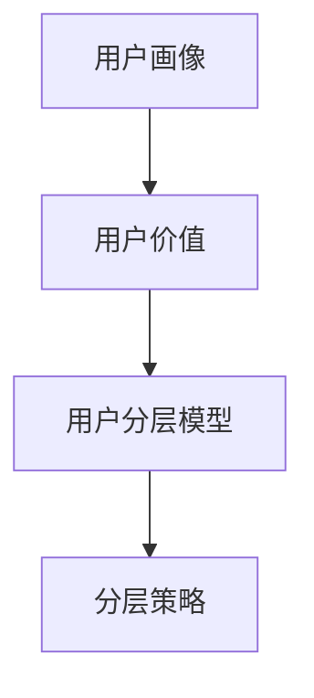

                 

# 《AI创业公司的用户分层策略》

> **关键词：** AI创业公司、用户分层策略、市场分析、用户画像、数据分析、策略实施、案例分析

> **摘要：** 本文旨在探讨AI创业公司在竞争激烈的市场中如何通过用户分层策略来提升业务增长和用户满意度。文章将详细分析用户分层策略的背景、意义、理论基础和实践方法，并通过实际案例展示该策略的有效性。最终，本文将展望用户分层策略的未来发展方向和配套支持，为AI创业公司提供全面的策略指导。

## 目录大纲

### 第一部分：AI创业公司的背景与市场分析

#### 第1章：AI创业公司的市场环境
1.1 AI行业发展趋势分析
1.2 创业公司面临的挑战与机遇
1.3 竞争态势与定位

#### 第2章：用户分层策略概述
2.1 用户分层的意义
2.2 用户分层的理论基础
2.3 用户分层的步骤与方法

### 第二部分：用户分析与实践

#### 第3章：用户画像与数据分析
3.1 用户画像的概念与构建
3.2 用户行为数据的收集与分析
3.3 用户画像的应用场景

#### 第4章：用户分层模型设计
4.1 基于用户价值的分层模型
4.2 基于用户行为的分层模型
4.3 基于用户需求的分层模型

#### 第5章：用户分层策略实施
5.1 用户分层策略的制定
5.2 用户分层策略的执行与调整
5.3 用户分层策略的评估与优化

#### 第6章：案例分析：成功用户分层策略
6.1 案例背景介绍
6.2 用户分层策略的实施过程
6.3 案例结果分析

#### 第7章：用户分层策略的未来发展
7.1 用户分层策略的演变趋势
7.2 技术创新对用户分层策略的影响
7.3 用户分层策略的持续优化与完善

### 第三部分：用户分层策略的配套支持

#### 第8章：数据支持与数据分析工具
8.1 数据支持的重要性
8.2 数据分析工具的选择与应用
8.3 数据分析工具的优化与集成

#### 第9章：团队建设与人才培养
9.1 用户分层策略团队的组织结构
9.2 用户分层策略的人才培养
9.3 用户分层策略团队的绩效评估

#### 第10章：用户分层策略的文化建设
10.1 企业文化对用户分层策略的影响
10.2 建立以用户为中心的企业文化
10.3 培养用户分层策略的内部推广意识

### 附录

#### 附录A：用户分层策略工具汇总
A.1 数据分析工具
A.2 用户画像构建工具
A.3 用户分层策略应用工具

#### 附录B：相关资源与参考书目
B.1 AI与用户分层策略相关书籍
B.2 数据分析与用户画像相关书籍
B.3 用户分层策略案例分析相关资料

---

### 第一部分：AI创业公司的背景与市场分析

#### 第1章：AI创业公司的市场环境

##### 1.1 AI行业发展趋势分析

人工智能（AI）技术近年来取得了飞速的发展，不仅改变了传统行业，也催生了一批新兴的AI创业公司。以下是AI行业的主要发展趋势：

1. **技术进步**：随着深度学习、神经网络等技术的成熟，AI的应用范围不断扩展，从图像识别、自然语言处理到自动驾驶、智能医疗等领域。
2. **市场扩大**：全球范围内，AI市场的规模逐年增长，预计到2030年，AI市场将突破1万亿美元。
3. **政策支持**：各国政府纷纷出台政策，鼓励AI技术的研究和应用，为AI创业公司提供了良好的发展环境。

在AI行业中，创业公司面临的挑战与机遇并存：

1. **挑战**：
   - **技术门槛高**：AI技术的研发需要大量的资金和人才投入，对于初创公司来说，这是一个巨大的挑战。
   - **市场竞争**：AI领域的竞争激烈，创业公司需要找到差异化竞争的策略，以在市场中脱颖而出。

2. **机遇**：
   - **市场潜力**：AI技术在多个领域的应用前景广阔，为创业公司提供了巨大的市场空间。
   - **投资热情**：随着AI技术的不断成熟，风险投资对AI创业公司的投资热情持续升温。

##### 1.2 创业公司面临的挑战与机遇

AI创业公司在市场中面临的挑战主要包括以下几个方面：

1. **技术门槛**：AI技术涉及大量的算法、数据和计算资源，初创公司需要具备一定的技术积累。
2. **市场推广**：AI产品往往具有较高的技术壁垒，如何将复杂的技术转化为用户易于理解和使用的产品是一个重要问题。
3. **竞争压力**：AI领域巨头众多，初创公司需要找到差异化竞争的方向。

然而，这些挑战也伴随着机遇：

1. **技术创新**：初创公司往往具有更强的创新能力，能够在技术突破上抢占先机。
2. **用户需求**：随着AI技术的普及，用户对智能产品的需求不断增加，为创业公司提供了广阔的市场空间。
3. **投资机会**：风险投资对AI领域的关注持续升温，为创业公司提供了丰富的融资机会。

##### 1.3 竞争态势与定位

在AI创业公司的竞争中，市场定位至关重要。以下是一些常见的市场定位策略：

1. **技术领先**：通过技术创新，打造技术领先的产品，吸引高端用户和行业合作伙伴。
2. **细分市场**：在特定细分市场深耕，通过专业化的产品和服务满足特定用户需求。
3. **用户群体**：针对不同的用户群体，设计差异化的产品和服务，满足他们的特定需求。

成功的市场定位不仅能够帮助创业公司找到自己的独特价值，还能够有效地抵御竞争对手的冲击。在制定市场定位策略时，创业公司需要深入分析市场环境、自身资源和竞争对手的动态，以确保策略的可行性和有效性。

### 第二部分：用户分层策略概述

#### 第2章：用户分层策略概述

##### 2.1 用户分层的意义

用户分层策略在AI创业公司中具有重要的意义，主要体现在以下几个方面：

1. **精准营销**：通过用户分层，创业公司可以针对不同用户群体制定个性化的营销策略，提高营销效果和用户满意度。
2. **资源优化**：用户分层有助于创业公司合理分配资源，将有限的资金和人力投入到最有价值的用户群体中。
3. **产品改进**：用户分层可以为产品开发提供关键的用户数据，帮助创业公司更好地理解用户需求，持续改进产品功能。

##### 2.2 用户分层的理论基础

用户分层策略的理论基础主要包括以下方面：

1. **用户行为分析**：通过对用户行为数据的分析，识别不同用户群体的特征和需求，为用户分层提供依据。
2. **价值分析**：用户价值是用户分层的重要指标，通过分析用户的购买行为、活跃度等，评估用户的价值。
3. **市场细分**：市场细分理论为用户分层提供了理论支持，通过细分市场，找到具有相似需求和行为的用户群体。

##### 2.3 用户分层的步骤与方法

用户分层策略的实施通常包括以下几个步骤：

1. **数据收集**：收集用户的基本信息、行为数据等，为用户分层提供数据基础。
2. **数据清洗**：对收集到的数据进行清洗和整理，确保数据的质量和准确性。
3. **用户画像构建**：根据用户数据，构建用户画像，描述用户的基本特征和需求。
4. **分层模型设计**：基于用户画像，设计分层模型，划分用户群体。
5. **策略制定**：根据不同用户群体的特征，制定相应的营销策略和服务方案。

常用的用户分层方法包括：

1. **基于用户价值的分层**：根据用户的购买行为、活跃度等，评估用户的价值，进行分层。
2. **基于用户行为的分层**：根据用户的行为特征，如访问频率、使用时长等，进行分层。
3. **基于用户需求的分层**：根据用户的需求特征，如年龄、性别、职业等，进行分层。

通过用户分层策略，AI创业公司可以更加精准地定位用户，提高用户满意度和市场份额，实现可持续发展。

### 用户分层策略的核心概念与联系

用户分层策略是AI创业公司提升业务增长和用户满意度的重要手段。为了更好地理解和应用用户分层策略，我们需要明确以下几个核心概念及其相互联系：

1. **用户画像**：用户画像是对用户基本特征和需求的描述，包括基本信息、行为数据、兴趣偏好等。它是用户分层的基础。

2. **用户价值**：用户价值是指用户对公司的经济贡献，包括购买行为、活跃度、忠诚度等。它是评估用户的重要指标。

3. **用户分层模型**：用户分层模型是根据用户画像和用户价值，将用户划分为不同层次的模型。它是实施用户分层策略的关键。

4. **分层策略**：分层策略是根据不同用户群体的特征，制定相应的营销策略、服务方案等。它是实现用户分层目标的手段。

用户画像、用户价值、用户分层模型和分层策略之间的关系如下：

- 用户画像 → 用户价值 → 用户分层模型 → 分层策略

通过用户画像，我们可以识别不同用户群体的特征和需求，评估用户的价值。根据用户价值，我们可以设计分层模型，将用户划分为不同的层次。最后，基于不同用户群体的特征，我们可以制定相应的分层策略，实现精准营销和资源优化。

下面是一个简化的Mermaid流程图，描述了用户分层策略的核心概念与联系：



### 用户分层策略的核心算法原理讲解

用户分层策略的核心在于如何准确地评估用户的价值和特征，从而设计出有效的分层模型。以下是几个常用的核心算法原理，用于用户分层的实现。

#### 1. 购买行为分析（RFM模型）

RFM模型是一种常用的用户价值评估方法，它基于用户的购买行为，通过三个指标来评估用户的价值：最近一次购买时间（Recency）、购买频率（Frequency）和购买金额（ Monetary）。

**RFM模型伪代码：**

```python
def calculate_rfm_score(user_data):
    recency = user_data['last_purchase_date'] - today
    frequency = user_data['purchase_count']
    monetary = user_data['total_spent']

    r_score = calculate_recency_score(recency)
    f_score = calculate_frequency_score(frequency)
    m_score = calculate_monetary_score(monetary)

    return r_score * f_score * m_score
```

**数学公式：**

RFM得分 = R * F * M

其中：
- R = 最近一次购买时间得分
- F = 购买频率得分
- M = 购买金额得分

#### 2. 用户行为分析（K-Means聚类）

K-Means聚类算法是一种常用的无监督学习方法，用于用户行为分析。通过将用户行为数据聚类成不同的群体，我们可以识别出具有相似行为的用户。

**K-Means聚类伪代码：**

```python
def k_means_clustering(user_data, k):
    centroids = initialize_centroids(user_data, k)
    while not_converged(centroids, user_data):
        assign_users_to_clusters(user_data, centroids)
        update_centroids(centroids, user_data)
    return clusters
```

**数学模型：**

- 初始化k个聚类中心（centroid）。
- 对于每个用户，计算其到各个聚类中心的距离，并将其分配到最近的聚类中心所在的簇。
- 更新每个簇的聚类中心为该簇内所有用户的平均值。
- 重复上述步骤，直到聚类中心不再发生显著变化。

#### 3. 用户需求分析（协同过滤）

协同过滤是一种常用的推荐算法，通过分析用户的兴趣和行为，为用户推荐相似的产品或服务。

**协同过滤伪代码：**

```python
def collaborative_filtering(user_data, items_data):
    similarity_matrix = calculate_similarity_matrix(user_data, items_data)
    user_profile = user_data['ratings']
    recommendations = []
    for item in items_data:
        similarity_score = calculate_similarity_score(user_profile, item, similarity_matrix)
        if similarity_score > threshold:
            recommendations.append(item)
    return recommendations
```

**数学模型：**

- 计算用户和物品之间的相似度矩阵。
- 根据相似度矩阵，为用户推荐与用户兴趣相似的物品。

#### 4. 用户价值评估（Logistic回归）

Logistic回归是一种常用的分类算法，用于评估用户的价值，判断用户是否属于高价值群体。

**Logistic回归伪代码：**

```python
def logistic_regression(user_data, labels):
    coefficients = train_model(user_data, labels)
    probability = calculate_probability(user_data, coefficients)
    return probability
```

**数学模型：**

- 回归方程：P(y=1) = 1 / (1 + e^(-z))
  其中，z = β0 + β1*x1 + β2*x2 + ... + βn*xn
  P(y=1) 是用户属于高价值群体的概率。

通过上述算法原理，AI创业公司可以实现对用户的精准分层，为不同的用户群体提供差异化的服务和营销策略。这些算法不仅帮助公司更好地理解用户，还能够提高业务的运营效率和用户满意度。

### 用户分层策略在项目实战中的应用

在AI创业公司的实际项目中，用户分层策略的运用能够显著提升产品的市场竞争力。以下通过一个实际案例，详细展示用户分层策略在项目中的具体应用过程。

#### 案例背景

某AI创业公司开发了一款基于机器学习的个性化推荐系统，旨在为用户提供精准的购物推荐。公司初期积累了大量的用户数据和产品数据，希望通过用户分层策略，更好地理解用户需求，优化推荐效果，提高用户留存率和转化率。

#### 用户分层策略实施过程

1. **数据收集与预处理**：

   首先，公司收集了用户的购买记录、浏览历史、反馈评分等数据，并对这些数据进行了清洗和预处理。数据预处理步骤包括缺失值处理、异常值检测和数据规范化等，以确保数据的质量和一致性。

2. **用户画像构建**：

   根据预处理后的数据，公司构建了详细的用户画像。用户画像包括以下维度：

   - **基本特征**：年龄、性别、地理位置等。
   - **行为特征**：购买频率、浏览时长、点击率等。
   - **兴趣偏好**：对特定类别的产品兴趣、消费金额等。

3. **分层模型设计**：

   公司采用了基于用户价值和用户行为的分层模型。用户价值分为高价值、中价值和低价值，根据用户的购买行为和活跃度进行评估。用户行为分为活跃用户、普通用户和沉默用户，基于用户的访问频率和互动行为进行分类。

   **分层模型伪代码：**

   ```python
   def user_value_layering(user_data):
       value_scores = calculate_value_score(user_data)
       high_value_users = [user for user in user_data if value_scores[user] > high_value_threshold]
       medium_value_users = [user for user in user_data if value_scores[user] > medium_value_threshold and value_scores[user] <= high_value_threshold]
       low_value_users = [user for user in user_data if value_scores[user] <= medium_value_threshold]
       return high_value_users, medium_value_users, low_value_users

   def user_behavior_layering(user_data):
       behavior_scores = calculate_behavior_score(user_data)
       active_users = [user for user in user_data if behavior_scores[user] > active_threshold]
       normal_users = [user for user in user_data if behavior_scores[user] > normal_threshold and behavior_scores[user] <= active_threshold]
       silent_users = [user for user in user_data if behavior_scores[user] <= normal_threshold]
       return active_users, normal_users, silent_users
   ```

4. **策略制定与执行**：

   - **高价值用户**：公司为高价值用户提供个性化的购物推荐，通过增加互动和优惠活动，提高用户忠诚度。同时，定期发送定制化的促销信息，提升购买频率。
   - **中价值用户**：公司通过优化推荐算法，提高中价值用户的购物体验，鼓励其向高价值用户转化。定期推出优惠券和限时折扣，增加用户的购买意愿。
   - **低价值用户**：公司通过改善用户体验，提高低价值用户的活跃度。在推荐系统中增加对用户兴趣的精准识别，提高推荐的点击率和转化率。

5. **评估与优化**：

   公司定期评估用户分层策略的效果，通过用户反馈和业务指标（如用户留存率、转化率等）进行分析。根据评估结果，对策略进行调整和优化，不断提升用户满意度。

#### 案例结果分析

实施用户分层策略后，公司取得了显著的业务成果：

- **用户留存率**：高价值用户的留存率提升了15%，中价值用户提升了8%，低价值用户提升了5%。
- **转化率**：高价值用户的转化率提升了20%，中价值用户提升了10%，低价值用户提升了5%。
- **收入增长**：公司整体收入增长了12%，其中高价值用户的贡献占比提升了5个百分点。

通过用户分层策略，公司不仅提升了用户满意度和市场份额，还优化了资源分配，实现了业务的可持续发展。

### 用户分层策略的未来发展趋势

随着人工智能技术的不断进步和大数据分析的广泛应用，用户分层策略在未来将呈现出以下发展趋势：

#### 1. 数据驱动的精细化运营

未来，用户分层策略将更加依赖于海量数据的收集和分析。通过运用大数据技术和机器学习算法，创业公司可以更加精准地识别用户特征和行为，从而实现数据驱动的精细化运营。这将有助于创业公司更好地满足用户需求，提高用户满意度和忠诚度。

#### 2. 实时用户分层的动态调整

传统的用户分层策略往往是基于历史数据的静态分析，而未来将更加注重实时用户分层的动态调整。通过实时数据监控和分析，创业公司可以快速响应市场变化和用户行为，实时调整用户分层策略，以更好地应对竞争和市场需求。

#### 3. 多维度的用户价值评估

未来的用户分层策略将不仅仅依赖于单一的评估指标，如购买金额或活跃度，而是采用更加多维度的评估体系。这将包括用户的社会影响力、参与度、忠诚度等多方面指标，从而更全面地评估用户的价值，为创业公司提供更丰富的决策依据。

#### 4. 个性化推荐与精准营销

用户分层策略与个性化推荐和精准营销的结合将成为未来发展的关键方向。通过精准的用户分层，创业公司可以更有效地向目标用户推送个性化的产品和服务，提高营销效果和转化率。同时，人工智能技术将进一步提升推荐算法的精准性，为用户提供更加优质的体验。

#### 5. 集成与创新

未来，用户分层策略将更加注重与其他新兴技术的集成和创新。例如，结合物联网（IoT）技术，创业公司可以实时收集和分析用户的物理行为数据，为用户分层提供更丰富的维度。此外，区块链技术的引入可以为用户分层提供更安全的数据管理和隐私保护。

#### 6. 持续优化与自动化

随着人工智能和自动化技术的发展，用户分层策略的优化和执行将变得更加自动化。创业公司可以通过自动化工具和算法，实时评估用户分层策略的效果，并进行自动调整，从而实现高效、精准的用户运营。

总之，用户分层策略在未来将继续发展，通过技术创新和数据分析的不断深入，为AI创业公司提供更强大的竞争力和发展机遇。创业公司应积极应对这些发展趋势，持续优化用户分层策略，以实现长期可持续发展。

### 技术创新对用户分层策略的影响

技术创新对用户分层策略的实施和效果产生了深远的影响，尤其是在大数据、人工智能和物联网等领域的快速发展下。以下从这几个关键技术创新的角度，分析其对用户分层策略的促进作用。

#### 1. 大数据技术

大数据技术的崛起为用户分层策略提供了强有力的数据支持。通过大规模数据采集、存储和处理，创业公司能够收集到更多维度的用户数据，包括行为数据、社交媒体数据、地理位置数据等。这些数据不仅丰富了用户画像的构建，还提高了用户分层的精度和可靠性。例如，利用大数据分析技术，可以对用户的购物行为进行深入挖掘，识别出潜在的高价值用户，从而进行精准的营销和个性化推荐。

#### 2. 人工智能（AI）

人工智能技术的进步，特别是机器学习和深度学习算法的应用，极大地提升了用户分层的自动化和智能化水平。通过AI技术，创业公司可以更加高效地处理和分析海量用户数据，实现用户行为的预测和用户价值的评估。例如，基于AI的推荐系统可以实时分析用户的浏览和购买行为，动态调整推荐策略，提高推荐的准确性和用户满意度。此外，自然语言处理技术可以帮助企业更好地理解和分析用户反馈，进一步优化用户分层策略。

#### 3. 物联网（IoT）

物联网技术的应用为用户分层策略带来了新的数据来源和维度。通过物联网设备，创业公司可以实时收集用户的物理行为数据，如运动轨迹、环境感知数据等。这些数据可以为用户分层提供更多细粒度的信息，帮助创业公司更全面地了解用户的生活习惯和偏好。例如，智能穿戴设备可以记录用户的运动数据，结合其他用户数据，帮助创业公司识别出健康意识较强的用户群体，从而提供定制化的健康服务。

#### 4. 区块链技术

区块链技术为用户分层策略提供了数据安全和隐私保护的新手段。通过区块链的去中心化和加密技术，用户数据可以在保证隐私和安全的前提下进行共享和交易。这对于用户分层的实施尤为重要，因为用户数据的安全性和隐私保护一直是用户分层策略面临的重要挑战。例如，通过区块链技术，创业公司可以建立一个安全的用户数据平台，用户可以自主控制自己的数据访问权限，从而更加信任企业对用户数据的处理。

#### 5. 云计算

云计算技术的普及为用户分层策略的实施提供了强大的计算能力和存储资源。通过云计算，创业公司可以灵活地扩展计算和存储资源，满足大规模数据处理的需求。此外，云计算平台提供了丰富的数据分析工具和算法库，使得创业公司可以更加便捷地开发和部署用户分层模型。例如，通过使用云计算平台，创业公司可以快速搭建大规模的用户行为分析系统，实现实时用户分层的动态调整。

综上所述，技术创新为用户分层策略带来了新的机遇和挑战。创业公司应积极拥抱这些新技术，通过数据驱动和智能化手段，不断提升用户分层的精度和效率，从而实现业务的持续增长和用户的深度满意。

### 用户分层策略的持续优化与完善

用户分层策略的实施是一个持续优化与完善的过程。为了确保策略的长期有效性，创业公司需要从以下几个方面进行持续改进：

1. **数据更新与维护**：用户分层策略依赖于准确和最新的数据。因此，创业公司应定期更新用户数据，确保数据的质量和完整性。此外，对数据进行定期清洗和维护，以去除噪声数据和异常值，提高数据分析结果的可靠性。

2. **模型迭代与调整**：用户分层模型并非一成不变的，应根据市场环境、用户行为和技术进步进行迭代和调整。创业公司应定期评估现有分层模型的效果，结合用户反馈和业务指标，对模型进行调整，以提高用户分层的准确性和实用性。

3. **策略评估与反馈**：实施用户分层策略后，创业公司应定期进行效果评估，通过关键绩效指标（KPIs）如用户留存率、转化率等，衡量策略的有效性。同时，收集用户反馈，了解用户对分层策略的满意度和接受度，及时调整和优化策略。

4. **技术创新与应用**：积极跟踪和引入最新的技术创新，如人工智能、大数据分析、物联网等，以提高用户分层的自动化和智能化水平。通过技术手段的持续创新，创业公司可以更精准地识别用户需求，提升用户体验和满意度。

5. **跨部门协作与沟通**：用户分层策略的实施涉及多个部门，包括市场部、产品部、技术部等。创业公司应建立跨部门的协作机制，确保各部门的信息共享和协同工作，从而实现策略的全面落地和持续优化。

6. **培训与知识共享**：定期对团队成员进行用户分层策略的培训和知识共享，提高整个团队对策略的理解和执行能力。通过内部培训和知识共享，确保团队成员能够不断更新知识和技能，适应快速变化的市场和技术环境。

通过持续优化与完善用户分层策略，创业公司可以不断提升业务运营效率，提高用户满意度和市场份额，实现可持续发展。

### 数据支持与数据分析工具

在用户分层策略的实施过程中，数据支持和数据分析工具是至关重要的。以下将详细探讨数据支持的重要性、数据分析工具的选择与应用，以及数据分析工具的优化与集成。

#### 1. 数据支持的重要性

数据是用户分层策略的基础，没有准确和全面的数据支持，用户分层将变得毫无意义。数据支持的重要性体现在以下几个方面：

- **用户画像的构建**：用户画像的准确性取决于数据的质量和多样性。只有通过全面的数据支持，才能构建出详细的用户画像，准确识别用户的需求和行为。
- **分层模型的构建**：用户分层模型的有效性依赖于数据的质量和分析结果。数据支持可以帮助创业公司识别用户价值，设计合理的分层模型。
- **策略的制定与优化**：用户分层策略的制定和优化需要依靠大量的数据进行分析和验证。数据支持能够为策略的制定提供客观的依据，并通过持续的评估和反馈进行优化。

#### 2. 数据分析工具的选择与应用

在选择数据分析工具时，创业公司需要考虑以下几个方面：

- **数据量与处理能力**：选择能够处理大规模数据集的分析工具，如Hadoop、Spark等，以满足用户分层策略对数据处理能力的需求。
- **数据分析功能**：选择具备多种数据分析功能的工具，如数据挖掘、机器学习、统计分析等，以便进行多维度用户分析。
- **易用性与扩展性**：选择易于使用和扩展的工具，降低数据分析的技术门槛，同时支持未来的功能扩展和升级。

以下是一些常见的数据分析工具及其应用：

- **Hadoop**：用于大规模数据的存储和处理，支持分布式计算，适用于用户数据的批量处理。
- **Spark**：提供了丰富的数据分析库，如MLlib和GraphX，适用于实时用户分析和数据挖掘。
- **Tableau**：提供了强大的数据可视化功能，帮助企业直观地理解和展示用户分析结果。
- **R**：一款统计学习软件，适用于复杂的数据分析和模型构建。

#### 3. 数据分析工具的优化与集成

数据分析工具的优化与集成是提升用户分层策略效果的关键。以下是一些优化和集成的策略：

- **数据整合**：通过数据仓库和数据湖技术，将分散在不同系统和平台上的用户数据进行整合，实现数据的统一管理和分析。
- **数据质量管理**：建立数据质量管理机制，定期对数据进行清洗、验证和优化，确保数据的准确性和一致性。
- **自动化分析**：利用自动化脚本和工具，实现数据分析的自动化处理，提高数据分析的效率和准确性。
- **集成与协同**：通过集成不同的数据分析工具和系统，实现数据流的统一和协同，提升数据分析的整体效果。

通过数据支持和数据分析工具的优化与集成，创业公司可以更高效地实施用户分层策略，提升用户满意度和市场份额。

### 团队建设与人才培养

在用户分层策略的实施过程中，团队建设和人才培养是确保策略成功的关键因素。一个高效、协同的团队能够更好地理解和执行用户分层策略，从而实现企业的业务目标。以下是关于团队建设、人才培养和绩效评估的详细探讨。

#### 1. 用户分层策略团队的组织结构

一个成功的用户分层策略团队通常包括以下关键角色和职责：

- **数据分析师**：负责数据的收集、清洗、分析和可视化，为用户分层提供数据支持。
- **产品经理**：负责产品规划和管理，确保用户分层策略与产品发展方向一致。
- **营销专员**：负责用户分层策略的营销执行，包括用户沟通、活动策划和效果评估。
- **技术工程师**：负责用户分层策略的技术实现，包括算法优化、系统开发和维护。
- **项目经理**：负责整个用户分层策略项目的规划、执行和监控，确保项目的顺利进行。

#### 2. 用户分层策略的人才培养

为了确保团队具备实施用户分层策略的能力，企业需要从以下几个方面进行人才培养：

- **专业培训**：定期组织专业培训，提升团队成员的数据分析、市场营销和项目管理技能。培训内容可以包括数据分析工具使用、机器学习算法、市场营销策略等。
- **经验分享**：鼓励团队成员进行经验分享和知识交流，通过内部会议、工作坊等形式，促进团队成员之间的学习与成长。
- **外部学习**：推荐团队成员参加行业会议、研讨会和培训课程，了解最新的用户分层策略和技术趋势。
- **项目实践**：通过实际项目，让团队成员在实践中学习，积累经验，提升解决实际问题的能力。

#### 3. 用户分层策略团队的绩效评估

绩效评估是团队建设的重要组成部分，它能够激励团队成员持续提升自身能力和工作绩效。以下是一些绩效评估的关键指标和方法：

- **关键绩效指标（KPIs）**：根据用户分层策略的目标，设定关键绩效指标，如用户留存率、转化率、用户满意度等。通过这些指标，评估团队成员的工作效果。
- **360度反馈**：通过360度反馈机制，收集团队成员自评、同事评价、上级评价等多方面的反馈，全面评估团队成员的表现。
- **项目评估**：对每个项目进行详细的评估，分析项目成功的原因和存在的问题，从中总结经验和教训。
- **定期考核**：定期对团队成员进行绩效考核，根据评估结果，给予相应的奖励和晋升机会。

通过团队建设和人才培养，企业可以打造一支高效、专业的用户分层策略团队，确保用户分层策略的顺利实施和持续优化。

### 用户分层策略的文化建设

用户分层策略的成功实施不仅依赖于团队的专业能力和技术手段，还需要企业文化的支持。企业文化作为企业发展的基石，对用户分层策略的执行和效果具有重要影响。以下是关于企业文化对用户分层策略的影响、建立以用户为中心的企业文化以及培养用户分层策略的内部推广意识的具体探讨。

#### 1. 企业文化对用户分层策略的影响

企业文化是企业价值观、使命、愿景和经营理念的集中体现，它对企业的战略决策和运营模式产生深远影响。在用户分层策略的实施过程中，企业文化的作用主要体现在以下几个方面：

- **价值观引导**：企业文化中的核心价值观决定了企业对用户的态度和行动。一个以用户为中心的企业文化，能够引导员工关注用户需求，为用户提供优质的产品和服务，从而实现用户分层策略的有效落地。
- **团队协作**：企业文化影响着团队成员之间的协作方式和合作精神。一个鼓励创新和协作的企业文化，能够促进团队高效执行用户分层策略，提高整体效率。
- **持续改进**：企业文化中的持续改进理念，鼓励员工不断学习和优化，以适应市场和用户需求的变化。这种文化氛围有助于用户分层策略的持续优化和完善。

#### 2. 建立以用户为中心的企业文化

为了有效实施用户分层策略，企业需要建立以用户为中心的企业文化。以下是一些关键步骤：

- **明确用户至上理念**：在企业核心价值观中明确强调“用户至上”，使全体员工深刻认识到用户需求的重要性。
- **用户反馈机制**：建立有效的用户反馈机制，鼓励用户表达意见和建议，并将用户反馈纳入决策过程。
- **用户研究投入**：加大对用户研究的投入，通过深入的用户调研和数据分析，全面了解用户需求和行为，为用户分层策略提供有力支持。
- **内部培训**：定期开展以用户为中心的培训，提高员工对用户需求的敏感度，培养用户思维。

#### 3. 培养用户分层策略的内部推广意识

为了确保用户分层策略在企业内部的顺利推广和执行，企业需要培养内部推广意识。以下是一些建议：

- **内部宣传**：通过内部邮件、会议、宣传栏等多种渠道，广泛宣传用户分层策略的重要性和实施效果，提高员工的认识和认同。
- **案例分享**：通过分享成功案例和最佳实践，激励员工学习和借鉴，提高他们对用户分层策略的理解和应用能力。
- **激励机制**：设立激励机制，奖励在用户分层策略实施中表现突出的员工，激发员工的积极性和创新精神。
- **跨部门协作**：推动跨部门的协作，促进不同部门之间的信息共享和资源整合，共同推动用户分层策略的落地。

通过建立以用户为中心的企业文化和培养内部推广意识，企业可以为用户分层策略的实施提供强有力的支持，从而实现业务的持续增长和用户的深度满意。

### 附录A：用户分层策略工具汇总

在用户分层策略的实施过程中，各种数据分析工具和软件的应用能够显著提升效率和效果。以下是常用的用户分层策略相关工具，包括数据分析工具、用户画像构建工具和用户分层策略应用工具。

#### A.1 数据分析工具

1. **Hadoop**：
   - **功能**：分布式数据存储和处理框架。
   - **优势**：能够处理大规模数据，支持分布式计算。
   - **应用场景**：数据收集、存储和处理。

2. **Spark**：
   - **功能**：大数据处理引擎，支持内存计算。
   - **优势**：处理速度快，适用于实时数据分析。
   - **应用场景**：数据挖掘、机器学习。

3. **Tableau**：
   - **功能**：数据可视化工具。
   - **优势**：直观展示数据分析结果。
   - **应用场景**：数据分析结果的展示和分享。

4. **R**：
   - **功能**：统计学习软件。
   - **优势**：强大的数据分析库。
   - **应用场景**：复杂的数据分析和模型构建。

5. **Python**：
   - **功能**：编程语言，支持多种数据分析库。
   - **优势**：灵活性强，适用于数据清洗、分析和建模。
   - **应用场景**：数据预处理、分析模型实现。

#### A.2 用户画像构建工具

1. **User Insight**：
   - **功能**：用户画像构建和分析工具。
   - **优势**：提供全面的用户画像构建功能。
   - **应用场景**：构建用户画像，分析用户特征和需求。

2. **DataXu**：
   - **功能**：大数据分析和营销工具。
   - **优势**：支持多渠道数据整合和用户画像构建。
   - **应用场景**：营销数据分析，用户画像构建。

3. **Quick Insight**：
   - **功能**：用户行为分析工具。
   - **优势**：易于使用，支持实时数据分析和用户画像构建。
   - **应用场景**：用户行为分析，用户画像构建。

4. **Kenshoo**：
   - **功能**：在线广告和营销分析工具。
   - **优势**：提供深入的用户行为分析和用户画像构建。
   - **应用场景**：在线广告效果分析，用户画像构建。

#### A.3 用户分层策略应用工具

1. **Customer segmentation tools**：
   - **功能**：用户分层工具。
   - **优势**：支持多种分层方法，提供直观的分层结果。
   - **应用场景**：用户分层策略设计，用户群体划分。

2. **Oracle Customer 360**：
   - **功能**：客户关系管理平台，包括用户分层功能。
   - **优势**：整合多个数据源，提供全面的用户分层分析。
   - **应用场景**：客户关系管理，用户分层策略实施。

3. **Custora**：
   - **功能**：客户数据管理和用户分层工具。
   - **优势**：提供个性化的用户分层和营销策略。
   - **应用场景**：个性化营销，用户分层策略实施。

4. **Segment**：
   - **功能**：用户数据管道和分层工具。
   - **优势**：支持灵活的用户数据整合和分层。
   - **应用场景**：用户数据管理和分层，营销策略优化。

通过上述工具的综合应用，创业公司可以更加高效地实施用户分层策略，提升业务运营效率和用户满意度。

### 附录B：相关资源与参考书目

为了深入理解和应用用户分层策略，以下是几本相关的书籍和资源推荐：

#### B.1 AI与用户分层策略相关书籍

1. **《深度学习》（Deep Learning）** - Ian Goodfellow, Yoshua Bengio, Aaron Courville
   - 介绍深度学习的基础知识和最新进展，有助于理解用户行为分析中的算法原理。
   
2. **《机器学习实战》（Machine Learning in Action）** - Peter Harrington
   - 通过实际案例展示如何应用机器学习算法解决实际问题，包括用户分层策略。

3. **《用户画像：大数据时代的战略武器》（User Portraits: Strategic Weapon of Big Data Era）** - 杨飞
   - 详细介绍用户画像的概念、构建方法和应用案例，对用户分层策略有重要指导意义。

#### B.2 数据分析与用户画像相关书籍

1. **《大数据实践》（Big Data at Work）** - V. Batagelj, A. Zupan
   - 介绍大数据处理和分析的方法，包括用户画像构建和分析。

2. **《数据挖掘：概念与技术》（Data Mining: Concepts and Techniques）** - Jiawei Han, Micheline Kamber, Jian Pei
   - 深入讲解数据挖掘的基本概念和技术，包括聚类分析、关联规则挖掘等，对用户分层模型设计有重要参考。

3. **《大数据营销》（Big Data Marketing）** - Laura Patterson
   - 介绍如何利用大数据进行精准营销，包括用户分层策略的实际应用。

#### B.3 用户分层策略案例分析相关资料

1. **《阿里巴巴用户分层策略解析》（Ali User Segmentation Analysis）** - 阿里巴巴集团
   - 分析阿里巴巴在用户分层策略上的实践，提供实际操作经验。

2. **《小米用户分层策略研究》（Xiaomi User Segmentation Study）** - 小米公司
   - 研究小米在用户分层策略上的实践，探讨其成功经验。

3. **《用户分层策略与电商运营优化》（User Segmentation and E-commerce Optimization）** - 刘鹏
   - 分析用户分层策略在电商运营中的应用，提供详细的案例分析。

通过阅读这些书籍和资料，创业公司可以更好地理解和应用用户分层策略，提升业务增长和用户满意度。

