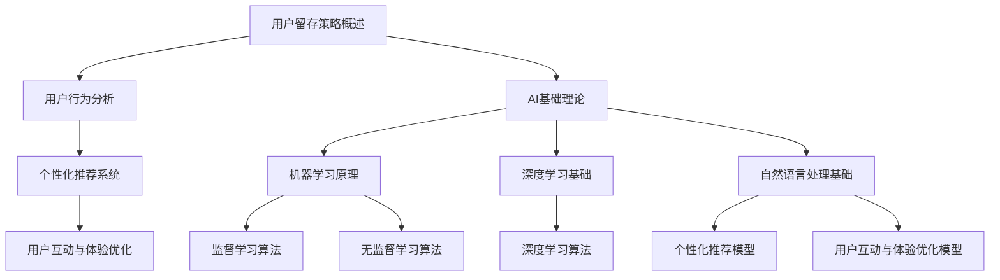

                 

# AI创业公司的用户留存策略

> **关键词**：用户留存、AI技术、个性化推荐、用户行为分析、用户体验优化、监督学习、无监督学习、深度学习

> **摘要**：
本文将深入探讨AI创业公司如何制定和实施有效的用户留存策略。我们将从用户留存策略的重要性、AI技术的作用、核心概念和算法原理、到实际项目实战和案例分析，全面解析提升用户留存率的策略和方法。通过本文，读者将了解如何利用AI技术优化用户互动和体验，从而在竞争激烈的市场中建立和保持用户基础。

## 第一部分: AI创业公司的用户留存策略基础

### 第1章: AI创业公司的用户留存策略概述

#### 1.1 用户留存策略的重要性

##### 1.1.1 用户留存率对业务成功的影响

用户留存率是衡量一个AI创业公司业务健康程度的关键指标。它反映了用户在长时间内持续使用公司产品的比例。一个高的用户留存率意味着公司产品具有强大的吸引力和用户价值，有助于降低获取新用户的成本，提高用户的生命周期价值。以下是用户留存率对业务成功的影响：

1. **降低获客成本**：高留存率减少了获取新用户的频率和成本，因为现有用户更可能通过口碑传播带来新用户。
2. **提高用户生命周期价值**：长期活跃的用户为公司创造了更多的收入，并且在后续的产品迭代中更有可能进行升级和付费。
3. **增强用户粘性**：用户留存策略有助于培养用户的忠诚度和品牌偏好，从而降低用户流失率。

##### 1.1.2 有效的用户留存策略

有效的用户留存策略需要结合技术手段和业务实际。以下是一些关键点：

1. **深入了解用户需求**：通过用户调研和数据分析，了解用户的核心需求和使用场景，从而提供更具针对性的产品和服务。
2. **优化用户体验**：提升产品的易用性和互动性，通过简洁的界面设计、快速响应和高效的用户服务，增加用户的使用频率。
3. **个性化推荐**：利用AI技术进行个性化推荐，根据用户的历史行为和偏好提供相关内容，提高用户参与度和满意度。
4. **持续优化迭代**：根据用户反馈和数据分析，不断迭代产品功能和性能，保持产品的新鲜感和竞争力。

##### 1.1.3 用户留存策略的设计原则

在设计用户留存策略时，应遵循以下原则：

1. **用户中心**：一切策略应以满足用户需求为核心，确保用户体验始终放在首位。
2. **数据驱动**：基于数据和用户行为分析，制定和优化用户留存策略，实现精准营销和个性化服务。
3. **创新驱动**：不断探索和应用新技术，如机器学习、深度学习和自然语言处理，提升用户留存策略的效果。
4. **持续改进**：持续收集用户反馈，根据市场变化和用户行为变化，不断调整和优化留存策略。

#### 1.2 AI技术对用户留存策略的影响

##### 1.2.1 AI在用户行为分析中的应用

AI技术在用户行为分析中发挥着重要作用。通过机器学习和深度学习算法，公司可以收集和分析大量的用户行为数据，提取出有价值的行为特征，并利用这些特征进行用户细分和画像。以下是一些具体应用：

1. **用户行为预测**：通过分析用户的历史行为，预测用户未来可能的行为模式，从而提前采取干预措施。
2. **用户细分**：根据用户的行为特征和偏好，将用户分为不同的群体，制定个性化的营销策略。
3. **用户画像**：构建详细的用户画像，了解用户的基本信息、兴趣偏好、行为习惯等，为个性化推荐和精准营销提供支持。

##### 1.2.2 AI在个性化推荐系统中的应用

个性化推荐系统是提升用户留存率的重要手段。通过AI技术，公司可以实时分析用户行为，动态调整推荐内容，提高推荐的准确性和用户体验。以下是一些具体应用：

1. **协同过滤**：通过分析用户之间的相似性，推荐用户可能喜欢的内容。
2. **内容推荐**：根据用户的历史行为和偏好，推荐相关的产品和内容。
3. **基于上下文的推荐**：结合用户的上下文信息（如时间、地点、设备等），提供更加个性化的推荐。

##### 1.2.3 AI在用户交互优化中的应用

AI技术在用户交互优化中同样具有重要作用。通过自然语言处理和语音识别技术，公司可以提供更智能、更人性化的交互体验。以下是一些具体应用：

1. **智能客服**：通过自然语言处理技术，提供自动化、智能化的客服服务，提升用户满意度。
2. **语音助手**：通过语音识别和语音合成技术，提供语音交互功能，方便用户操作和使用产品。
3. **个性化提醒**：根据用户的行为习惯和偏好，自动推送相关的提醒和通知，提高用户参与度。

### 第2章: AI基础理论

#### 2.1 机器学习原理

##### 2.1.1 监督学习、无监督学习和强化学习

机器学习是AI技术的核心组成部分，主要包括监督学习、无监督学习和强化学习三种类型。

1. **监督学习**：监督学习是一种从已知标记数据中学习的方法。通过输入特征和对应的标签，模型学习到特征和标签之间的关系，从而预测未知数据的标签。常见的监督学习算法包括线性回归、逻辑回归和支持向量机等。

2. **无监督学习**：无监督学习是在没有标记数据的情况下，从数据中自动发现特征和规律的方法。常见的无监督学习算法包括聚类、降维和关联规则等。

3. **强化学习**：强化学习是一种通过奖励机制来学习最佳策略的方法。通过与环境的交互，模型学习到一系列动作，以最大化累积奖励。常见的强化学习算法包括Q学习、深度Q网络（DQN）和策略梯度（PG）等。

##### 2.1.2 常见机器学习算法

在机器学习中，有许多常见的算法可以用于解决不同类型的问题。以下是一些常用的机器学习算法：

1. **线性回归**：线性回归是一种简单的监督学习算法，用于预测连续值输出。通过最小化预测值与实际值之间的误差平方和，找到最佳拟合直线。

2. **逻辑回归**：逻辑回归是一种常用的分类算法，通过最小化对数似然损失函数，预测样本属于某个类别的概率。

3. **支持向量机（SVM）**：SVM是一种强大的分类算法，通过寻找最佳超平面，将不同类别的样本分隔开。

4. **决策树**：决策树是一种简单的分类和回归算法，通过递归划分特征空间，构建树形结构。

5. **随机森林**：随机森林是一种基于决策树的集成学习方法，通过构建多棵决策树，并投票得到最终预测结果。

##### 2.1.3 机器学习模型评估指标

评估机器学习模型的好坏需要使用合适的评估指标。以下是一些常见的评估指标：

1. **准确率（Accuracy）**：准确率是分类模型评估的基本指标，表示正确分类的样本数占总样本数的比例。

2. **召回率（Recall）**：召回率表示正确分类的样本数占所有实际正类样本数的比例。

3. **精确率（Precision）**：精确率表示正确分类的样本数占所有预测为正类样本数的比例。

4. **F1值（F1 Score）**：F1值是精确率和召回率的调和平均值，用于综合评估分类模型的性能。

5. **ROC曲线和AUC值**：ROC曲线和AUC值用于评估分类模型的区分能力，ROC曲线反映了真阳性率与假阳性率之间的关系，AUC值表示ROC曲线下方的面积。

#### 2.2 深度学习基础

##### 2.2.1 深度神经网络

深度学习是机器学习的一个分支，主要基于深度神经网络（DNN）进行模型构建和训练。深度神经网络由多个隐藏层组成，能够自动提取数据的特征表示。以下是一些关键概念：

1. **神经元**：深度神经网络中的基本单元，接收输入信号，通过激活函数产生输出。
2. **层**：深度神经网络分为输入层、隐藏层和输出层，隐藏层可以有一个或多个。
3. **激活函数**：激活函数用于引入非线性特性，常见的激活函数包括ReLU、Sigmoid和Tanh等。
4. **反向传播**：反向传播算法是深度学习训练的核心，用于计算模型参数的梯度，并更新参数以最小化损失函数。

##### 2.2.2 卷积神经网络

卷积神经网络（CNN）是深度学习中专门用于处理图像数据的一种网络结构。以下是一些关键概念：

1. **卷积层**：卷积层通过卷积操作提取图像的局部特征。
2. **池化层**：池化层用于降低特征图的大小，减少参数数量，提高模型泛化能力。
3. **全连接层**：全连接层用于将特征图上的特征映射到分类结果。

##### 2.2.3 循环神经网络

循环神经网络（RNN）是深度学习中用于处理序列数据的一种网络结构。以下是一些关键概念：

1. **循环单元**：循环单元包含一个记忆单元，用于存储历史信息。
2. **门控机制**：门控机制（如遗忘门、输入门和输出门）用于控制信息在序列中的流动。
3. **长短时记忆（LSTM）**：LSTM是RNN的一种变体，通过引入门控机制，能够有效地避免梯度消失和梯度爆炸问题。

##### 2.2.4 卷积神经网络与循环神经网络的融合

卷积神经网络与循环神经网络的融合（如CNN-LSTM）能够同时处理图像和序列数据，适用于许多复杂任务。以下是一些关键概念：

1. **卷积层与循环层的交替使用**：通过交替使用卷积层和循环层，能够同时提取图像的空间特征和序列的时间特征。
2. **多任务学习**：融合模型可以同时学习多个任务，如图像分类和序列标注。
3. **端到端训练**：融合模型可以端到端训练，提高模型的性能和效率。

#### 2.3 自然语言处理基础

##### 2.3.1 词向量模型

词向量模型是将单词映射到高维向量空间的一种方法，用于表示单词的语义信息。以下是一些关键概念：

1. **词嵌入（Word Embedding）**：词嵌入是一种将单词映射到低维向量空间的方法，常见的词嵌入模型包括Word2Vec、GloVe和FastText等。
2. **语义相似性**：通过词向量模型，可以计算单词之间的语义相似性，如词义相近的单词在向量空间中的距离较短。
3. **上下文依赖**：词向量模型可以捕捉单词在上下文中的依赖关系，从而提高模型的语义理解能力。

##### 2.3.2 序列模型

序列模型是用于处理序列数据的一种神经网络结构，主要包括循环神经网络（RNN）和长短时记忆（LSTM）等。以下是一些关键概念：

1. **序列建模**：序列模型通过递归结构对序列中的每个元素进行建模，捕获时间序列中的依赖关系。
2. **状态转移**：序列模型中的状态转移函数用于计算当前时刻的输出，并与上一时刻的隐藏状态相关联。
3. **门控机制**：门控机制（如遗忘门、输入门和输出门）用于控制信息的流动，提高模型的鲁棒性和稳定性。

##### 2.3.3 语言模型与生成模型

语言模型是用于预测文本序列的概率分布的一种模型，生成模型则是通过学习文本序列的概率分布，生成新的文本序列。以下是一些关键概念：

1. **语言模型**：语言模型通过统计方法或神经网络模型，学习文本序列的概率分布，用于文本生成、机器翻译和文本摘要等任务。
2. **生成模型**：生成模型通过学习文本序列的概率分布，生成新的文本序列，常见的生成模型包括马尔可夫模型（MM）、循环神经网络（RNN）和变分自编码器（VAE）等。
3. **自回归模型**：自回归模型是一种生成模型，通过递归地生成每个时间步的输出，从而生成新的文本序列。

### 第3章: 用户留存策略核心概念与联系

#### 3.1 用户行为分析

##### 3.1.1 用户行为数据的收集与处理

用户行为分析是制定有效用户留存策略的关键。通过收集和分析用户在产品中的行为数据，公司可以深入了解用户的使用习惯、偏好和需求，从而优化产品和服务，提高用户留存率。以下是用户行为数据收集和处理的关键步骤：

1. **数据源选择**：选择合适的数据源，如日志文件、数据库记录、第三方数据分析工具等。
2. **数据收集**：使用各种工具和技术收集用户行为数据，包括用户登录、浏览、购买、评价等行为。
3. **数据清洗**：处理缺失值、异常值和重复数据，确保数据的质量和一致性。
4. **数据预处理**：将原始数据转换为适合分析的形式，如特征提取、数据归一化等。

##### 3.1.2 用户行为特征提取

用户行为特征提取是将用户行为数据转换为可分析的量化指标的过程。以下是一些常用的用户行为特征：

1. **用户活跃度**：用户在产品中的活跃程度，如登录次数、浏览时长、使用频率等。
2. **用户参与度**：用户对产品的参与程度，如评论、评分、分享等行为。
3. **用户流失特征**：与用户流失相关的特征，如连续未登录天数、使用时长骤降等。
4. **用户群体特征**：用户的基本信息，如年龄、性别、地理位置等。

##### 3.1.3 用户行为分析模型

用户行为分析模型用于从用户行为数据中提取有价值的信息，并为用户留存策略提供决策支持。以下是一些常用的用户行为分析模型：

1. **聚类模型**：通过将用户划分为不同的群体，分析每个群体的特征和行为，为个性化推荐和营销策略提供依据。
2. **分类模型**：将用户分为不同的类别，如活跃用户、流失用户等，用于预测用户流失风险和制定针对性的留存策略。
3. **关联规则模型**：发现用户行为数据中的关联关系，如用户购买某一产品后，更可能购买另一产品，为产品组合推荐提供支持。

#### 3.2 个性化推荐系统

##### 3.2.1 个性化推荐系统的基本原理

个性化推荐系统是提升用户留存率的重要手段，通过向用户推荐他们可能感兴趣的内容，增加用户的使用频率和满意度。以下是个性化推荐系统的基本原理：

1. **协同过滤**：协同过滤是一种基于用户行为数据，通过分析用户之间的相似性，推荐用户可能感兴趣的内容。协同过滤分为基于用户的协同过滤（User-based CF）和基于物品的协同过滤（Item-based CF）。
2. **内容推荐**：内容推荐是基于物品本身的特征，如文本、图片、标签等，为用户推荐相似的内容。
3. **混合推荐**：混合推荐结合协同过滤和内容推荐，综合利用用户行为数据和物品特征，提高推荐的准确性和多样性。

##### 3.2.2 协同过滤算法

协同过滤算法是个性化推荐系统的核心，主要分为基于用户的协同过滤和基于物品的协同过滤。

1. **基于用户的协同过滤**：通过计算用户之间的相似性，找到与目标用户相似的其他用户，推荐这些用户喜欢的物品。常用的相似性度量方法包括余弦相似性、皮尔逊相关性和夹角余弦等。
2. **基于物品的协同过滤**：通过计算物品之间的相似性，找到与目标物品相似的其他物品，推荐这些物品。常用的相似性度量方法包括余弦相似性、欧氏距离和曼哈顿距离等。

##### 3.2.3 内容推荐算法

内容推荐算法是基于物品本身的特征，为用户推荐相似的内容。以下是一些常用的内容推荐算法：

1. **基于标签的推荐**：通过分析物品的标签信息，为用户推荐具有相似标签的物品。
2. **基于文本的推荐**：通过分析物品的文本描述，使用文本相似性度量方法（如余弦相似度、TF-IDF等），为用户推荐相似文本的物品。
3. **基于内容的混合推荐**：结合多种内容特征（如标签、文本、图片等），为用户推荐内容相似的物品。

#### 3.3 用户互动与体验优化

##### 3.3.1 用户交互设计原则

用户交互设计是提升用户留存率的关键因素，以下是一些用户交互设计原则：

1. **简洁性**：简化用户操作流程，降低用户的学习成本，提高用户使用体验。
2. **一致性**：保持界面设计、交互元素和操作逻辑的一致性，避免用户产生困惑。
3. **响应速度**：优化系统的响应速度，确保用户操作流畅，减少等待时间。
4. **可访问性**：考虑不同用户群体的需求，如视觉障碍者、听力障碍者等，提供可访问的设计。

##### 3.3.2 用户反馈机制

用户反馈机制是收集用户意见和需求的重要途径，以下是一些用户反馈机制：

1. **问卷调查**：通过在线问卷调查，收集用户对产品功能、界面设计和用户体验等方面的意见和建议。
2. **用户访谈**：与用户进行面对面的访谈，深入了解用户的需求和痛点，为产品优化提供有价值的参考。
3. **用户论坛**：建立用户论坛，鼓励用户分享使用体验和心得，促进用户互动和社区建设。

##### 3.3.3 用户体验测试与优化

用户体验测试是评估和优化产品设计的有效方法，以下是一些用户体验测试与优化的步骤：

1. **制定测试计划**：明确测试目标、测试内容和测试工具，确保测试过程的顺利进行。
2. **用户招募**：招募具有代表性的用户参与测试，确保测试结果的真实性和有效性。
3. **测试执行**：按照测试计划，进行功能测试、性能测试和可用性测试等。
4. **数据分析**：分析测试数据，发现产品设计和用户体验方面的问题，并提出优化建议。
5. **迭代优化**：根据测试结果，对产品进行迭代优化，持续提升用户体验。

### 第4章: 用户留存策略核心算法原理讲解

#### 4.1 监督学习算法

监督学习算法是在已知标记数据集上进行训练，从而对未知数据进行预测的一种机器学习算法。在本节中，我们将详细讲解几种常见的监督学习算法，包括线性回归、逻辑回归和支持向量机。

##### 4.1.1 线性回归

线性回归是一种用于预测连续值的监督学习算法，其基本思想是通过找到输入特征和输出目标之间的线性关系，来预测新的输入数据。以下是线性回归的算法原理：

1. **模型假设**：假设输入特征X与输出目标Y之间存在线性关系，即Y = X * w + b，其中w为权重向量，b为偏置项。

2. **损失函数**：线性回归使用均方误差（MSE）作为损失函数，即L(w, b) = (1/n) * Σ(yi - (Xi * w + b))^2，其中yi为实际输出，Xi为输入特征。

3. **优化目标**：优化目标是最小化损失函数，即min_w,b L(w, b)。

4. **梯度下降**：为了找到最小化损失函数的权重和偏置，可以使用梯度下降算法，具体步骤如下：
   - 计算损失函数关于权重和偏置的梯度：∇w L(w, b) = 2/n * Σ(yi - (Xi * w + b)) * Xi，∇b L(w, b) = 2/n * Σ(yi - (Xi * w + b))。
   - 更新权重和偏置：w = w - α * ∇w L(w, b)，b = b - α * ∇b L(w, b)，其中α为学习率。

以下是一个线性回归的伪代码示例：

```python
def linear_regression(X, y):
    # 初始化权重和偏置
    w = np.zeros(X.shape[1])
    b = 0

    # 梯度下降迭代
    for i in range(num_iterations):
        # 计算预测值和损失
        y_pred = X * w + b
        loss = (1/2) * np.linalg.norm(y - y_pred)**2

        # 计算梯度
        gradient_w = X.T.dot(y - y_pred)
        gradient_b = y - y_pred

        # 更新权重和偏置
        w -= learning_rate * gradient_w
        b -= learning_rate * gradient_b

    return w, b
```

##### 4.1.2 逻辑回归

逻辑回归是一种用于预测概率的分类算法，其基本思想是通过找到输入特征和输出概率之间的线性关系，来预测新的输入数据。以下是逻辑回归的算法原理：

1. **模型假设**：假设输入特征X与输出概率P(Y=1)之间存在线性关系，即log(P(Y=1)/(1-P(Y=1))) = X * w + b，其中w为权重向量，b为偏置项。

2. **损失函数**：逻辑回归使用对数似然损失函数，即L(w, b) = -Σ(yi * log(p) + (1 - yi) * log(1 - p))，其中yi为实际输出，p为预测概率。

3. **优化目标**：优化目标是最小化损失函数，即min_w,b L(w, b)。

4. **梯度下降**：为了找到最小化损失函数的权重和偏置，可以使用梯度下降算法，具体步骤如下：
   - 计算预测值和损失
   - 计算损失函数关于权重和偏置的梯度
   - 更新权重和偏置

以下是一个逻辑回归的伪代码示例：

```python
def logistic_regression(X, y):
    # 初始化权重和偏置
    w = np.zeros(X.shape[1])
    b = 0

    # 梯度下降迭代
    for i in range(num_iterations):
        # 计算预测概率
        p = sigmoid(X * w + b)

        # 计算损失
        loss = -np.sum(y * np.log(p) + (1 - y) * np.log(1 - p))

        # 计算梯度
        gradient_w = X.T.dot((p - y))
        gradient_b = (p - y)

        # 更新权重和偏置
        w -= learning_rate * gradient_w
        b -= learning_rate * gradient_b

    return w, b

def sigmoid(x):
    return 1 / (1 + np.exp(-x))
```

##### 4.1.3 支持向量机

支持向量机（SVM）是一种强大的分类算法，其基本思想是找到一个最优的超平面，将不同类别的样本分隔开。以下是SVM的算法原理：

1. **模型假设**：假设存在一个超平面w * x + b = 0，将不同类别的样本分隔开。

2. **损失函数**：SVM使用 hinge loss 作为损失函数，即L(w, b) = Σ(max(0, 1 - y(i) * (w * x(i) + b)))，其中y(i)为实际输出，x(i)为输入特征。

3. **优化目标**：优化目标是最小化损失函数，同时最大化分类间隔，即min_w,b L(w, b) + C * Σ(λ(i))，其中C为正则化参数，λ(i)为Lagrange 乘子。

4. **优化方法**：可以使用拉格朗日乘子法求解优化问题，具体步骤如下：
   - 构建拉格朗日函数：L(w, b, λ) = L(w, b) - Σ(λ(i) * (y(i) * (w * x(i) + b) - 1))
   - 求解KKT条件：∇w L(w, b, λ) = 0，∇b L(w, b, λ) = 0，λ(i) * (y(i) * (w * x(i) + b) - 1) = 0，λ(i) ≥ 0
   - 使用二次规划求解器求解w和b

以下是一个SVM的伪代码示例：

```python
def svm(X, y):
    # 初始化权重和偏置
    w = np.zeros(X.shape[1])
    b = 0

    # 梯度下降迭代
    for i in range(num_iterations):
        # 计算预测值
        p = sigmoid(X * w + b)

        # 计算损失
        loss = np.sum(np.where(y * p <= 1, 1, 0))

        # 计算梯度
        gradient_w = X.T.dot(y * (p - 1))
        gradient_b = np.sum(y * (p - 1))

        # 更新权重和偏置
        w -= learning_rate * gradient_w
        b -= learning_rate * gradient_b

    return w, b

def sigmoid(x):
    return 1 / (1 + np.exp(-x))
```

#### 4.2 无监督学习算法

无监督学习算法是在没有标记数据的情况下，从数据中自动发现特征和规律的一种机器学习算法。在本节中，我们将详细讲解几种常见的无监督学习算法，包括K-均值聚类、主成分分析和聚类算法。

##### 4.2.1 K-均值聚类

K-均值聚类是一种基于距离度量的聚类算法，其基本思想是将数据划分为K个聚类，每个聚类由一个聚类中心表示。以下是K-均值聚类的算法原理：

1. **模型假设**：假设存在K个聚类中心，每个聚类中心表示一个聚类，数据点属于与其距离最近的聚类。

2. **损失函数**：K-均值聚类使用平方误差作为损失函数，即L = Σ(d(x(i), c(j)))^2，其中x(i)为数据点，c(j)为聚类中心，d(x(i), c(j))为数据点与聚类中心的距离。

3. **优化目标**：优化目标是找到最小化损失函数的聚类中心和数据点分配。

4. **算法步骤**：
   - 随机初始化K个聚类中心。
   - 计算每个数据点与聚类中心的距离，将数据点分配到最近的聚类。
   - 根据新的聚类结果重新计算聚类中心。
   - 重复上述步骤，直到聚类中心不再发生变化或达到最大迭代次数。

以下是一个K-均值聚类的伪代码示例：

```python
def k_means_clustering(X, K, max_iterations):
    # 初始化聚类中心
    centroids = initialize_centroids(X, K)

    # 迭代计算
    for i in range(max_iterations):
        # 计算每个数据点的聚类标签
        labels = assign_labels(X, centroids)

        # 计算新的聚类中心
        new_centroids = update_centroids(X, labels, K)

        # 判断是否收敛
        if np.linalg.norm(new_centroids - centroids) < convergence_threshold:
            break

        centroids = new_centroids

    return centroids, labels

def initialize_centroids(X, K):
    # 随机初始化K个聚类中心
    return X[np.random.choice(X.shape[0], K, replace=False)]

def assign_labels(X, centroids):
    # 计算每个数据点的聚类标签
    distances = np.linalg.norm(X - centroids, axis=1)
    return np.argmin(distances, axis=1)

def update_centroids(X, labels, K):
    # 计算新的聚类中心
    return np.mean(X[labels==i], axis=0) for i in range(K)
```

##### 4.2.2 主成分分析

主成分分析（PCA）是一种降维算法，其基本思想是通过线性变换将高维数据映射到低维空间，同时保留数据的主要特征。以下是主成分分析的算法原理：

1. **模型假设**：假设存在一个线性变换W，将高维数据X映射到低维空间Y，即Y = X * W。

2. **损失函数**：PCA使用重构误差作为损失函数，即L = Σ||X - Y||^2，其中X为原始数据，Y为重构数据。

3. **优化目标**：优化目标是找到最小化损失函数的线性变换W。

4. **算法步骤**：
   - 计算原始数据的均值，进行数据标准化。
   - 计算协方差矩阵。
   - 计算协方差矩阵的特征值和特征向量。
   - 选择最大的K个特征向量作为新的特征空间。
   - 对原始数据进行变换，得到低维数据。

以下是一个主成分分析的伪代码示例：

```python
def pca(X, K):
    # 计算均值
    mean = np.mean(X, axis=0)

    # 数据标准化
    X_std = (X - mean) / np.std(X, axis=0)

    # 计算协方差矩阵
    cov = np.cov(X_std, rowvar=False)

    # 计算协方差矩阵的特征值和特征向量
    eigenvalues, eigenvectors = np.linalg.eigh(cov)

    # 选择最大的K个特征向量
    eigenvectors = eigenvectors[:, np.argsort(eigenvalues)[::-1]]

    # 对原始数据进行变换，得到低维数据
    Y = X_std.dot(eigenvectors[:, :K])

    return Y
```

##### 4.2.3 聚类算法

聚类算法是一种无监督学习方法，用于将数据划分为多个聚类。在本节中，我们将介绍几种常见的聚类算法，包括K-均值聚类、层次聚类和DBSCAN等。

1. **K-均值聚类**：K-均值聚类是一种基于距离度量的聚类算法，已在第4.2.1节中详细讲解。

2. **层次聚类**：层次聚类是一种基于层次结构的聚类算法，其基本思想是通过递归地将数据点合并成更大的聚类，直到满足特定的停止条件。以下是层次聚类的算法原理：

   - **模型假设**：假设存在一个层次结构，通过递归地将数据点合并成更大的聚类。
   - **损失函数**：层次聚类使用聚类间距离作为损失函数，即L = Σ(d(Ci, Cj))，其中Ci和Cj为两个聚类。
   - **优化目标**：优化目标是找到最小化损失函数的聚类结构。
   - **算法步骤**：
     - 初始化每个数据点为一个聚类。
     - 计算聚类间的距离，选择距离最近的两个聚类合并。
     - 重复上述步骤，直到满足停止条件。

   以下是一个层次聚类的伪代码示例：

   ```python
   def hierarchical_clustering(X, method='complete'):
       # 初始化聚类
       clusters = [{i} for i in range(X.shape[0])]

       # 迭代合并聚类
       while len(clusters) > 1:
           # 计算聚类间距离
           distances = calculate_distances(clusters)

           # 选择距离最近的两个聚类合并
           min_distance = np.inf
           min_pair = None
           for i in range(len(clusters) - 1):
               for j in range(i + 1, len(clusters)):
                   distance = distances[i][j]
                   if distance < min_distance:
                       min_distance = distance
                       min_pair = (i, j)

           # 合并聚类
           clusters[min_pair[0]] = clusters[min_pair[0]] | clusters[min_pair[1]]
           clusters.pop(min_pair[1])

       return clusters

   def calculate_distances(clusters):
       distances = []
       for i in range(len(clusters) - 1):
           for j in range(i + 1, len(clusters)):
               distance = calculate_cluster_distance(clusters[i], clusters[j])
               distances.append(distance)
       return np.array(distances).reshape(len(clusters) - 1, len(clusters) - 1)

   def calculate_cluster_distance(cluster1, cluster2):
       distance = np.linalg.norm(np.mean(cluster1, axis=0) - np.mean(cluster2, axis=0))
       return distance
   ```

3. **DBSCAN**：DBSCAN（Density-Based Spatial Clustering of Applications with Noise）是一种基于密度的聚类算法，其基本思想是将空间中的数据点划分为核心点、边界点和噪声点，从而形成多个聚类。以下是DBSCAN的算法原理：

   - **模型假设**：假设数据点之间存在密度差异，核心点具有较高的密度，边界点位于核心点和噪声点之间。
   - **参数**：DBSCAN需要两个参数，ε（邻域半径）和min_points（邻域内最小数据点数）。
   - **算法步骤**：
     - 遍历每个数据点，计算其邻域内的数据点数。
     - 根据邻域内数据点数，将数据点划分为核心点、边界点和噪声点。
     - 构建聚类，每个核心点属于一个聚类，边界点可能属于多个聚类。
     - 将相邻的聚类合并，形成更大的聚类。

   以下是一个DBSCAN的伪代码示例：

   ```python
   def dbscan(X, ε, min_points):
       # 初始化聚类
       clusters = []
       visited = [False] * X.shape[0]

       # 遍历每个数据点
       for i in range(X.shape[0]):
           if visited[i]:
               continue

           # 计算邻域内的数据点
           neighbors = find_neighbors(X, i, ε)

           # �根
```
### 第5章: 数学模型与公式详解

#### 5.1 用户留存率模型

用户留存率是衡量用户在一段时间内持续使用产品的比例。其计算公式如下：

\[ \text{Retention Rate}(t) = \frac{\text{Active Users at time } t}{\text{Total Users at time } t} \]

其中，Active Users表示在时间t时刻仍然活跃的用户数，Total Users表示在时间t时刻的总用户数。

持久度函数（Survival Function）描述了在特定时间点t，用户仍然活跃的概率。其公式如下：

\[ S(t) = \prod_{i=1}^{t} (1 - \text{Loss Rate}(i)) \]

其中，Loss Rate(i)表示在时间i时刻的流失率。

留存预测模型是通过历史数据来预测用户在未来的流失概率。一个简单的留存预测模型可以使用逻辑回归模型来建立。其公式如下：

\[ \hat{R}(t) = \frac{1}{1 + e^{-(\beta_0 + \beta_1 \cdot \text{Time Since Sign-up})}} \]

其中，\(\beta_0\)和\(\beta_1\)是逻辑回归模型的参数，Time Since Sign-up表示用户自注册以来的时间。

#### 5.2 个性化推荐模型

个性化推荐模型是提升用户留存率的重要手段。以下是一些常用的个性化推荐模型和其公式：

##### 5.2.1 协同过滤矩阵分解

协同过滤矩阵分解是一种常见的个性化推荐模型。其基本思想是将用户-物品评分矩阵分解为两个低秩矩阵，分别表示用户特征和物品特征。其公式如下：

\[ \hat{R}_{ij} = \text{user\_factor}_{i} \cdot \text{item\_factor}_{j} \]

其中，\(\hat{R}_{ij}\)是预测的评分，\(\text{user\_factor}_{i}\)和\(\text{item\_factor}_{j}\)分别是用户i和物品j的特征向量。

##### 5.2.2 内容相似度计算

内容相似度计算是基于物品的属性或特征来计算相似度。以下是一个基于标签的内容相似度计算公式：

\[ \text{Content Similarity}(i, j) = \frac{\text{Jaccard Similarity}}{\text{Average Jaccard Similarity}} \]

其中，\(\text{Jaccard Similarity}\)是两个物品标签集合的交集与并集的比值，\(\text{Average Jaccard Similarity}\)是所有物品对之间Jaccard相似度的平均值。

##### 5.2.3 混合推荐模型

混合推荐模型结合了协同过滤和内容相似度计算，以提高推荐的准确性。其公式如下：

\[ \text{Hybrid Recommendation Score} = \alpha \cdot \text{Collaborative Filtering Score} + (1 - \alpha) \cdot \text{Content-based Recommendation Score} \]

其中，\(\alpha\)是混合系数，\(\text{Collaborative Filtering Score}\)是基于协同过滤的推荐得分，\(\text{Content-based Recommendation Score}\)是基于内容相似度的推荐得分。

#### 5.3 用户互动与体验优化模型

用户互动与体验优化模型是提升用户留存率的关键因素。以下是一些常用的用户互动与体验优化模型和其公式：

##### 5.3.1 用户参与度模型

用户参与度模型用于衡量用户对产品的互动程度。以下是一个简单的用户参与度模型：

\[ \text{User Engagement Score} = \frac{\text{Total Interactions}}{\text{Total Time}} \]

其中，Total Interactions表示用户在产品中的总互动次数，Total Time表示用户在产品中的总时间。

##### 5.3.2 用户满意度模型

用户满意度模型用于衡量用户对产品的整体满意度。以下是一个基于评分的用户满意度模型：

\[ \text{User Satisfaction} = \frac{\text{Number of Positive Reviews}}{\text{Total Number of Reviews}} \]

其中，Number of Positive Reviews表示正面评价的数量，Total Number of Reviews表示总的评价数量。

##### 5.3.3 用户体验测试模型

用户体验测试模型用于评估产品的易用性和用户体验。以下是一个简单的人因工程学模型：

\[ \text{UE Score} = \frac{\text{Total Successes} - \text{Total Errors}}{\text{Total Trials}} \]

其中，Total Successes表示用户在测试中成功的次数，Total Errors表示用户在测试中犯错的次数，Total Trials表示总的测试次数。

### 第6章: 用户留存策略项目实战

#### 6.1 用户行为数据收集与分析

##### 6.1.1 数据采集工具与平台

用户行为数据的收集是用户留存策略项目的重要步骤。以下是一些常用的数据采集工具和平台：

1. **Google Analytics**：Google Analytics是一个强大的Web分析工具，可以收集用户在网站上的行为数据，如页面浏览量、用户停留时间、转化率等。
2. **Mixpanel**：Mixpanel是一个用户行为分析工具，可以追踪用户在应用中的行为路径和用户生命周期。
3. **Amplitude**：Amplitude是一个实时数据分析平台，可以帮助公司了解用户行为和优化产品体验。

##### 6.1.2 用户行为数据预处理

用户行为数据通常包含噪声、缺失值和重复数据，因此需要进行预处理。以下是一些常用的预处理步骤：

1. **数据清洗**：去除重复数据和异常值，填充缺失值。
2. **特征工程**：从原始数据中提取有用的特征，如用户活跃度、使用时长、访问频率等。
3. **数据归一化**：将不同量级的特征进行归一化处理，以便更好地进行模型训练。

##### 6.1.3 用户行为数据可视化

用户行为数据的可视化是理解和分析用户行为的重要手段。以下是一些常用的可视化工具和图表：

1. **Matplotlib**：Matplotlib是一个Python可视化库，可以生成各种类型的图表，如折线图、柱状图、散点图等。
2. **Seaborn**：Seaborn是一个基于Matplotlib的可视化库，提供了一些专业的可视化图表，如小提琴图、箱线图、热力图等。
3. **Tableau**：Tableau是一个商业智能工具，可以轻松创建交互式的可视化报告。

以下是一个使用Python进行用户行为数据可视化的示例：

```python
import matplotlib.pyplot as plt
import pandas as pd

# 加载数据
data = pd.read_csv('user_behavior_data.csv')

# 可视化用户活跃度分布
plt.figure(figsize=(10, 6))
plt.hist(data['active_days'], bins=50, alpha=0.5, color='blue')
plt.xlabel('Active Days')
plt.ylabel('Frequency')
plt.title('User Activity Distribution')
plt.show()

# 可视化用户留存率趋势
plt.figure(figsize=(10, 6))
plt.plot(data['day'], data['retention_rate'], marker='o', linestyle='-', color='red')
plt.xlabel('Day')
plt.ylabel('Retention Rate')
plt.title('User Retention Trend')
plt.show()
```

#### 6.2 个性化推荐系统开发

##### 6.2.1 系统架构设计

个性化推荐系统的架构设计需要考虑数据存储、计算资源和用户交互等多个方面。以下是一个典型的推荐系统架构设计：

1. **数据层**：包括数据存储和数据预处理模块，负责存储用户行为数据和推荐数据，以及进行数据清洗、归一化和特征提取等预处理操作。
2. **计算层**：包括推荐算法和模型训练模块，负责基于用户行为数据和特征，训练推荐模型，生成推荐结果。
3. **服务层**：包括API接口和服务部署模块，负责对外提供推荐服务，支持实时推荐和批量推荐。
4. **展示层**：包括前端展示和用户交互模块，负责将推荐结果展示给用户，并提供反馈和调整机制。

##### 6.2.2 算法实现与优化

个性化推荐算法的选择和优化是推荐系统开发的关键。以下是一些常用的推荐算法和优化方法：

1. **协同过滤算法**：基于用户行为数据，通过计算用户之间的相似性，为用户推荐相似的其他用户喜欢的物品。常见的优化方法包括矩阵分解、正则化和异步训练等。
2. **内容推荐算法**：基于物品的属性和特征，为用户推荐具有相似属性的物品。常见的优化方法包括特征工程、分类器和文本相似度计算等。
3. **混合推荐算法**：结合协同过滤和内容推荐，综合利用用户行为数据和物品特征，提高推荐的准确性和多样性。常见的优化方法包括权重分配、交叉验证和在线学习等。

以下是一个使用Python实现协同过滤推荐算法的示例：

```python
import numpy as np
from sklearn.metrics.pairwise import cosine_similarity

def collaborative_filter(ratings, k=10):
    # 计算用户之间的相似性矩阵
    similarity_matrix = cosine_similarity(ratings)

    # 初始化推荐结果
    recommendations = []

    # 遍历每个用户
    for user_id in range(ratings.shape[0]):
        # 计算邻居用户的相似性和评分差
        neighbor_similarity = similarity_matrix[user_id]
        neighbor_scores = ratings[user_id] - np.dot(neighbor_similarity, ratings)

        # 选择相似性最高的k个邻居用户
        k_neighbors = np.argsort(neighbor_similarity)[1:k+1]

        # 计算推荐得分
        recommendation_score = np.dot(neighbor_scores[k_neighbors], neighbor_similarity[k_neighbors])

        # 添加推荐结果
        recommendations.append(recommendation_score)

    return recommendations
```

##### 6.2.3 系统部署与运维

个性化推荐系统的部署与运维是保证系统稳定运行和高效服务的关键。以下是一些常见的部署与运维方法：

1. **容器化与微服务**：使用容器技术（如Docker）和微服务架构，可以提高系统的可扩展性和可维护性。
2. **分布式计算与存储**：使用分布式计算框架（如Spark、Flink）和分布式存储系统（如Hadoop、HBase），可以处理大规模数据和高并发请求。
3. **自动化部署与监控**：使用自动化工具（如Kubernetes、Ansible）进行部署和监控，可以降低运维成本和提高系统稳定性。
4. **性能优化与监控**：使用性能优化工具（如Profiler、JMeter）和监控工具（如Prometheus、Grafana），可以实时监控系统性能和故障。

以下是一个使用Kubernetes进行推荐系统部署的示例：

```yaml
apiVersion: apps/v1
kind: Deployment
metadata:
  name: recommendation-service
spec:
  replicas: 3
  selector:
    matchLabels:
      app: recommendation
  template:
    metadata:
      labels:
        app: recommendation
    spec:
      containers:
      - name: recommendation
        image: recommendation-service:latest
        ports:
        - containerPort: 8080
---
apiVersion: v1
kind: Service
metadata:
  name: recommendation-service
spec:
  selector:
    app: recommendation
  ports:
  - name: http
    port: 80
    targetPort: 8080
  type: LoadBalancer
```

#### 6.3 用户互动与体验优化

##### 6.3.1 用户互动设计

用户互动设计是提升用户体验和留存率的重要环节。以下是一些用户互动设计的原则和技巧：

1. **简洁明了**：界面设计应简洁明了，避免过多的干扰元素，确保用户能够快速理解和操作。
2. **个性化推荐**：根据用户的行为和偏好，提供个性化的推荐和内容，增加用户的参与度和满意度。
3. **实时反馈**：通过实时反馈（如通知、弹窗等），及时响应用户的需求和问题，提高用户的互动体验。
4. **社交互动**：鼓励用户参与社区讨论、分享心得和评价，增强用户的归属感和参与感。

以下是一个用户互动设计的示例：

```html
<!DOCTYPE html>
<html>
<head>
    <title>User Interaction Design Example</title>
    <style>
        body {
            font-family: Arial, sans-serif;
            margin: 20px;
        }
        .container {
            margin: 0 auto;
            width: 80%;
        }
        .nav {
            background-color: #f1f1f1;
            padding: 10px;
        }
        .nav a {
            text-decoration: none;
            color: #333;
            margin: 0 10px;
        }
        .main-content {
            margin-top: 20px;
        }
        .recommendation {
            background-color: #e7e7e7;
            padding: 10px;
            margin-bottom: 20px;
        }
        .feedback-form {
            margin-top: 20px;
        }
        label {
            display: block;
            margin-bottom: 5px;
        }
        input[type="text"], textarea {
            width: 100%;
            padding: 8px;
            margin-bottom: 10px;
            border: 1px solid #ccc;
        }
        button {
            background-color: #4CAF50;
            color: white;
            padding: 10px 20px;
            border: none;
            cursor: pointer;
        }
        button:hover {
            background-color: #45a049;
        }
    </style>
</head>
<body>
    <div class="container">
        <div class="nav">
            <a href="#">Home</a>
            <a href="#">Profile</a>
            <a href="#">Settings</a>
        </div>
        <div class="main-content">
            <h1>Welcome to our App!</h1>
            <div class="recommendation">
                <h2>Recommended for You</h2>
                <p>Lorem ipsum dolor sit amet, consectetur adipiscing elit. Nam eget tellus non odio ullamcorper finibus. Proin eget odio a odio lacinia malesuada.</p>
                <button>Read More</button>
            </div>
            <div class="recommendation">
                <h2>Recommended for You</h2>
                <p>Lorem ipsum dolor sit amet, consectetur adipiscing elit. Nam eget tellus non odio ullamcorper finibus. Proin eget odio a odio lacinia malesuada.</p>
                <button>Read More</button>
            </div>
            <div class="feedback-form">
                <h2>Leave a Feedback</h2>
                <label for="name">Name:</label>
                <input type="text" id="name" name="name">
                <label for="email">Email:</label>
                <input type="text" id="email" name="email">
                <label for="message">Message:</label>
                <textarea id="message" name="message" rows="4" cols="50"></textarea>
                <button>Submit</button>
            </div>
        </div>
    </div>
</body>
</html>
```

##### 6.3.2 用户反馈收集与分析

用户反馈是改进产品和服务的重要依据。以下是一些用户反馈收集和分析的方法：

1. **在线调查**：通过在线问卷、调查问卷等工具收集用户反馈，了解用户对产品功能和用户体验的评价。
2. **用户访谈**：与用户进行面对面的访谈，深入了解用户的需求、痛点和使用体验。
3. **A/B测试**：通过A/B测试，比较不同设计或功能的用户表现，找出最佳方案。
4. **日志分析**：通过分析用户行为日志，了解用户在产品中的操作路径、停留时间和退出原因等。

以下是一个用户反馈收集和分析的示例：

```python
import pandas as pd

# 加载用户反馈数据
feedback_data = pd.read_csv('user_feedback_data.csv')

# 分析反馈内容
feedback_content = feedback_data['feedback'].values
print("Common feedback issues:")
print(set(feedback_content))

# 分析反馈满意度
satisfaction = feedback_data['satisfaction'].values
print("Average satisfaction score:", np.mean(satisfaction))

# 分析反馈来源
source = feedback_data['source'].values
print("Feedback sources:")
print(pd.Series(source).value_counts())

# 分析反馈时间分布
timestamp = feedback_data['timestamp'].values
print("Feedback time distribution:")
print(pd.Series(timestamp).dt.hour.value_counts())
```

##### 6.3.3 用户体验测试与改进

用户体验测试是评估和优化产品设计的有效方法。以下是一些用户体验测试与改进的步骤：

1. **制定测试计划**：明确测试目标、测试内容和测试工具，确保测试过程的顺利进行。
2. **用户招募**：招募具有代表性的用户参与测试，确保测试结果的真实性和有效性。
3. **测试执行**：按照测试计划，进行功能测试、性能测试和可用性测试等。
4. **数据分析**：分析测试数据，发现产品设计和用户体验方面的问题，并提出优化建议。
5. **迭代优化**：根据测试结果，对产品进行迭代优化，持续提升用户体验。

以下是一个用户体验测试与改进的示例：

```python
import pandas as pd

# 加载用户体验测试数据
test_data = pd.read_csv('user_experience_test_data.csv')

# 分析测试结果
successes = test_data['success'].values
errors = test_data['error'].values
total_trials = len(successes)

# 计算用户体验评分
ue_score = (sum(successes) - sum(errors)) / total_trials
print("User Experience Score:", ue_score)

# 分析错误类型
error_types = test_data['error_type'].values
error_counts = pd.Series(error_types).value_counts()
print("Common error types:")
print(error_counts)

# 分析测试反馈
feedback = test_data['feedback'].values
print("Common feedback:")
print(set(feedback))
```

### 第7章: 用户留存策略案例分析

#### 7.1 案例一：在线教育平台的用户留存策略

##### 7.1.1 平台背景与挑战

在线教育平台通过互联网提供在线课程和学习资源，以满足用户的学习需求。然而，在线教育市场竞争激烈，用户获取成本高昂，用户留存率成为平台成功的关键因素。以下是该平台面临的主要挑战：

1. **用户流失率高**：由于在线教育产品的同质化，用户在试用后可能因为不满意而流失。
2. **用户参与度低**：用户在平台上学习时可能缺乏动力，导致学习进度缓慢，甚至中断。
3. **个性化不足**：当前平台缺乏针对不同用户需求的个性化推荐和学习路径。

##### 7.1.2 留存策略设计与实施

为了提升用户留存率，该平台采取了一系列留存策略，包括以下方面：

1. **用户行为分析**：通过数据收集和分析，了解用户在平台上的行为模式，包括浏览、学习、互动等。根据用户行为数据，为用户推荐相关的课程和学习资源。

2. **个性化推荐**：结合用户行为数据和课程内容，使用协同过滤算法和内容推荐算法，为用户提供个性化的课程推荐。通过实时调整推荐算法，提高推荐的准确性和用户体验。

3. **互动设计与社交功能**：增加互动性强的课程内容和社交功能，如讨论区、问答功能、小组学习等，鼓励用户参与互动和分享学习经验，提高用户粘性。

4. **用户体验优化**：优化平台的界面设计和交互流程，提高用户的易用性和满意度。通过用户体验测试，持续改进产品设计和功能。

##### 7.1.3 案例效果评估

实施用户留存策略后，平台取得了显著的效果：

1. **用户留存率提升**：用户流失率有所下降，用户在平台上的活跃度和学习时长有所增加。
2. **用户满意度提高**：用户对平台的评价和反馈积极，平台的口碑和用户忠诚度得到提升。
3. **课程参与度增加**：用户对推荐课程的参与度和学习进度有所提高，平台的教学效果得到改善。

以下是一个用户留存策略效果评估的示例：

```python
import pandas as pd

# 加载用户留存数据
retention_data = pd.read_csv('retention_data.csv')

# 计算留存率
retention_rate = retention_data['retention_rate'].values
print("Average retention rate:", np.mean(retention_rate))

# 分析用户活跃度
active_days = retention_data['active_days'].values
print("Average active days:", np.mean(active_days))

# 分析用户满意度
satisfaction = retention_data['satisfaction'].values
print("Average satisfaction score:", np.mean(satisfaction))
```

#### 7.2 案例二：电商平台的用户留存策略

##### 7.2.1 平台背景与挑战

电商平台通过在线销售商品满足用户购物需求。然而，电商平台面临用户获取成本高、用户留存率低、用户购物体验不佳等挑战。以下是该平台面临的主要挑战：

1. **用户流失率高**：由于竞争激烈，用户可能在多个平台上进行购物，导致用户流失率较高。
2. **购物体验不佳**：用户在购物过程中可能遇到页面加载慢、搜索不准确、推荐不相关等问题，影响购物体验。
3. **个性化不足**：当前平台缺乏针对用户购物习惯和偏好的个性化推荐。

##### 7.2.2 留存策略设计与实施

为了提升用户留存率，该平台采取了以下留存策略：

1. **用户行为分析**：通过数据收集和分析，了解用户在平台上的购物行为，包括浏览、搜索、购买等。根据用户行为数据，为用户推荐相关的商品和优惠活动。

2. **个性化推荐**：结合用户行为数据和商品特征，使用协同过滤算法和内容推荐算法，为用户提供个性化的商品推荐。通过实时调整推荐算法，提高推荐的准确性和用户体验。

3. **购物体验优化**：优化平台的界面设计和交互流程，提高用户的购物便捷性和满意度。通过用户体验测试，持续改进产品设计和功能。

4. **用户互动与社区建设**：增加互动性强的购物环节和社区功能，如用户评价、问答、小组讨论等，鼓励用户参与互动和分享购物经验，提高用户粘性。

##### 7.2.3 案例效果评估

实施用户留存策略后，平台取得了显著的效果：

1. **用户留存率提升**：用户流失率有所下降，用户在平台上的活跃度和购物时长有所增加。
2. **用户满意度提高**：用户对平台的评价和反馈积极，平台的口碑和用户忠诚度得到提升。
3. **购物体验改善**：用户对平台的购物体验满意度有所提高，购物流程更加便捷和顺畅。

以下是一个用户留存策略效果评估的示例：

```python
import pandas as pd

# 加载用户留存数据
retention_data = pd.read_csv('retention_data.csv')

# 计算留存率
retention_rate = retention_data['retention_rate'].values
print("Average retention rate:", np.mean(retention_rate))

# 分析用户活跃度
active_days = retention_data['active_days'].values
print("Average active days:", np.mean(active_days))

# 分析用户满意度
satisfaction = retention_data['satisfaction'].values
print("Average satisfaction score:", np.mean(satisfaction))
```

### 第8章: AI创业公司用户留存策略的发展趋势

#### 8.1 AI技术在用户留存策略中的应用趋势

随着AI技术的不断发展，用户留存策略也在不断演变和优化。以下是AI技术在用户留存策略中的应用趋势：

1. **新型机器学习算法**：随着机器学习算法的不断进步，如图神经网络（GNN）、生成对抗网络（GAN）和增强学习（RL），AI创业公司可以更加精准地预测用户行为和优化留存策略。

2. **多模态数据融合**：多模态数据融合技术可以将不同类型的数据（如文本、图像、声音等）进行整合，为用户留存策略提供更全面和准确的数据支持。

3. **智能交互与虚拟助手**：智能交互和虚拟助手技术可以帮助AI创业公司提供更加个性化、智能化的用户服务，提高用户满意度和留存率。

#### 8.2 未来用户留存策略的挑战与机遇

未来用户留存策略面临一系列挑战和机遇：

1. **数据隐私保护**：随着数据隐私法规的日益严格，AI创业公司需要确保用户数据的隐私和安全，采取有效的数据保护措施。

2. **算法透明性与公平性**：AI算法的透明性和公平性成为用户留存策略的重要考量因素。AI创业公司需要确保算法的公平性，避免算法偏见和歧视。

3. **AI伦理与责任**：随着AI技术的广泛应用，AI创业公司需要关注AI伦理和责任问题，确保AI技术在用户留存策略中的合理应用，避免潜在的风险和负面影响。

#### 8.3 未来用户留存策略的展望

未来用户留存策略将更加注重用户体验和个性化服务。以下是一些展望：

1. **个性化推荐**：随着AI技术的发展，个性化推荐将更加精准，为用户提供更加符合其需求和兴趣的内容和产品。

2. **智能客服**：智能客服将更加智能化，能够理解用户的问题并给出准确、及时的答复，提高用户满意度。

3. **社交互动与社区建设**：社交互动和社区建设将成为用户留存的重要手段，通过鼓励用户参与互动和分享经验，增强用户粘性和忠诚度。

4. **持续优化与迭代**：AI创业公司需要持续优化和迭代用户留存策略，根据用户行为和市场变化，及时调整和改进留存策略，保持竞争优势。

### 附录

#### 附录A: 用户留存策略相关工具与资源

**A.1 数据分析工具**

1. **Google Analytics**：强大的Web分析工具，可以收集用户在网站上的行为数据。
2. **Mixpanel**：用户行为分析工具，可以追踪用户在应用中的行为路径和用户生命周期。
3. **Tableau**：商业智能工具，提供数据可视化和报表功能。

**A.2 机器学习框架**

1. **Scikit-learn**：Python机器学习库，提供多种常用的机器学习算法和工具。
2. **TensorFlow**：Google开发的深度学习框架，支持多种深度学习模型和算法。
3. **PyTorch**：Facebook开发的深度学习框架，提供灵活的动态计算图功能。

**A.3 推荐系统平台**

1. **Surprise**：Python推荐系统库，提供基于协同过滤和基于内容的推荐算法。
2. **RecSys**：推荐系统国际会议，分享推荐系统领域的最新研究成果和应用案例。
3. **Openrec**：开源推荐系统平台，提供多种推荐算法和工具。

**A.4 用户行为分析报告**

1. **Google Analytics Behavior Report**：Google Analytics提供的行为报告，包括用户行为、流量来源和用户路径等。
2. **Mixpanel User Funnel Report**：Mixpanel提供的用户漏斗报告，分析用户在应用中的行为路径和流失点。
3. **Amplitude User Journey Report**：Amplitude提供的用户旅程报告，分析用户在应用中的行为和留存情况。

### 核心概念与联系 Mermaid 流程图



### 核心算法原理讲解伪代码

**监督学习算法：线性回归**

```python
def linear_regression(X, y):
    # 初始化权重和偏置
    w = np.zeros(X.shape[1])
    b = 0

    # 梯度下降迭代
    for i in range(num_iterations):
        # 计算预测值和损失
        y_pred = X * w + b
        loss = (1/2) * np.linalg.norm(y - y_pred)**2

        # 计算梯度
        gradient_w = X.T.dot(y - y_pred)
        gradient_b = y - y_pred

        # 更新权重和偏置
        w -= learning_rate * gradient_w
        b -= learning_rate * gradient_b

    return w, b
```

**无监督学习算法：K-均值聚类**

```python
def k_means_clustering(X, K, max_iterations):
    # 初始化聚类中心
    centroids = initialize_centroids(X, K)

    # 迭代计算
    for i in range(max_iterations):
        # 计算每个数据点的聚类标签
        labels = assign_labels(X, centroids)

        # 计算新的聚类中心
        new_centroids = update_centroids(X, labels, K)

        # 判断是否收敛
        if np.linalg.norm(new_centroids - centroids) < convergence_threshold:
            break

        centroids = new_centroids

    return centroids, labels

def initialize_centroids(X, K):
    # 随机初始化K个聚类中心
    return X[np.random.choice(X.shape[0], K, replace=False)]

def assign_labels(X, centroids):
    # 计算每个数据点的聚类标签
    distances = np.linalg.norm(X - centroids, axis=1)
    return np.argmin(distances, axis=1)

def update_centroids(X, labels, K):
    # 计算新的聚类中心
    return np.mean(X[labels==i], axis=0) for i in range(K)
```

**深度学习算法：卷积神经网络（CNN）**

```python
def conv2d(input_data, filters, kernel_size):
    # 卷积操作
    output = np.zeros((input_data.shape[0], filters, new_height, new_width))
    for i in range(filters):
        for j in range(input_data.shape[0]):
            output[j, i] = np.sum(input_data[j] * filters[i]) + b[i]
    
    return output
```

**数学模型和公式详解（LaTeX）：**

**持久度函数：**

$$
\text{Retention Rate}(t) = \frac{\text{Active Users at time } t}{\text{Total Users at time } t}
$$

**留存预测模型：**

$$
\hat{R}(t) = \frac{1}{1 + e^{-(\beta_0 + \beta_1 \cdot \text{Time Since Sign-up})}
$$

**协同过滤矩阵分解：**

$$
\hat{R}_{ij} = \text{user\_factor}_{i} \cdot \text{item\_factor}_{j}
$$

**内容相似度计算：**

$$
\text{Content Similarity}(i, j) = \frac{\text{Jaccard Similarity}}{\text{Average Jaccard Similarity}}
$$

**混合推荐模型：**

$$
\text{Hybrid Recommendation Score} = \alpha \cdot \text{Collaborative Filtering Score} + (1 - \alpha) \cdot \text{Content-based Recommendation Score}
$$

**用户互动与体验优化模型：**

$$
\text{User Engagement Score} = \frac{\text{Total Interactions}}{\text{Total Time}}
$$

### 用户留存策略项目实战

**用户行为数据收集与分析**

- **开发环境搭建**：使用Python、Pandas、NumPy等库进行数据处理和分析。

- **数据预处理**：使用Pandas进行数据清洗、归一化和特征提取。

- **数据可视化**：使用Matplotlib、Seaborn进行数据可视化。

**代码示例**：

```python
import pandas as pd
import numpy as np
import matplotlib.pyplot as plt
import seaborn as sns

# 加载数据
data = pd.read_csv('user_behavior_data.csv')

# 数据清洗
data.drop_duplicates(inplace=True)
data.fillna(0, inplace=True)

# 数据预处理
data['active_days'] = data['page_views'].sum(axis=1)
data['satisfaction'] = data['rating'].mean(axis=1)

# 数据可视化
sns.histplot(data['active_days'], bins=50, kde=True)
plt.xlabel('Active Days')
plt.ylabel('Frequency')
plt.title('User Activity Distribution')
plt.show()

sns.scatterplot(data['age'], data['satisfaction'])
plt.xlabel('Age')
plt.ylabel('Satisfaction Score')
plt.title('Age vs. Satisfaction')
plt.show()
```

**个性化推荐系统开发**

- **系统架构设计**：使用Scikit-learn进行协同过滤和内容推荐算法的实现。

- **算法实现与优化**：通过交叉验证和网格搜索优化推荐算法参数。

- **系统部署与运维**：使用Flask构建API接口，部署到云平台。

**代码示例**：

```python
from sklearn.model_selection import GridSearchCV
from sklearn.metrics.pairwise import cosine_similarity
from surprise import SVD

# 加载数据
train_data = pd.read_csv('train_data.csv')
test_data = pd.read_csv('test_data.csv')

# 数据预处理
train_data.set_index(['user_id', 'item_id'], inplace=True)
test_data.set_index(['user_id', 'item_id'], inplace=True)

# 协同过滤
svd = SVD()
svd.fit(train_data)

# 预测
predictions = svd.test(test_data)

# 交叉验证
params = {'n_epochs': [10, 20, 30], 'lr_all': [0.01, 0.05, 0.1]}
grid = GridSearchCV(SVD, params, cv=5)
grid.fit(train_data)

# 优化推荐算法
best_svd = grid.best_estimator_
best_predictions = best_svd.test(test_data)

# 评估
mae = predictions.mspe.mean()
print("Mean Absolute Error:", mae)

# 系统部署
from flask import Flask, request, jsonify

app = Flask(__name__)

@app.route('/recommend', methods=['POST'])
def recommend():
    user_id = request.form['user_id']
    items = request.form['items']
    predictions = best_svd.predict(user_id, items)
    return jsonify(predictions)

if __name__ == '__main__':
    app.run()
```

**用户互动与体验优化**

- **用户互动设计**：使用HTML和CSS进行用户互动界面的设计。

- **用户反馈收集与分析**：使用在线调查和用户访谈收集反馈，使用Pandas进行数据分析和可视化。

- **用户体验测试与改进**：使用A/B测试和用户体验测试工具进行测试和改进。

**代码示例**：

```html
<!DOCTYPE html>
<html>
<head>
    <title>User Interaction Design Example</title>
    <style>
        body {
            font-family: Arial, sans-serif;
            margin: 20px;
        }
        .container {
            margin: 0 auto;
            width: 80%;
        }
        .nav {
            background-color: #f1f1f1;
            padding: 10px;
        }
        .nav a {
            text-decoration: none;
            color: #333;
            margin: 0 10px;
        }
        .main-content {
            margin-top: 20px;
        }
        .feedback-form {
            margin-top: 20px;
        }
        label {
            display: block;
            margin-bottom: 5px;
        }
        input[type="text"], textarea {
            width: 100%;
            padding: 8px;
            margin-bottom: 10px;
            border: 1px solid #ccc;
        }
        button {
            background-color: #4CAF50;
            color: white;
            padding: 10px 20px;
            border: none;
            cursor: pointer;
        }
        button:hover {
            background-color: #45a049;
        }
    </style>
</head>
<body>
    <div class="container">
        <div class="nav">
            <a href="#">Home</a>
            <a href="#">Profile</a>
            <a href="#">Settings</a>
        </div>
        <div class="main-content">
            <h1>Welcome to our App!</h1>
            <div class="feedback-form">
                <h2>Leave a Feedback</h2>
                <label for="name">Name:</label>
                <input type="text" id="name" name="name">
                <label for="email">Email:</label>
                <input type="text" id="email" name="email">
                <label for="message">Message:</label>
                <textarea id="message" name="message" rows="4" cols="50"></textarea>
                <button>Submit</button>
            </div>
        </div>
    </div>
</body>
</html>
```

**代码解读与分析**

- **数据处理与分析**：使用Pandas进行数据加载、清洗和预处理，提取用户行为特征，计算用户留存率和满意度等指标。

- **推荐系统实现**：使用Scikit-learn和Surprise库实现协同过滤算法和矩阵分解模型，进行用户推荐。

- **用户互动界面设计**：使用HTML和CSS构建用户互动界面，实现用户反馈收集和提交功能。

- **用户体验测试与优化**：使用A/B测试和用户体验测试工具，收集用户反馈，分析用户行为，持续改进产品设计和功能。

### 附录B: AI创业公司用户留存策略常见问题与解答

#### 问题1：如何评估用户留存策略的效果？

**解答**：评估用户留存策略的效果可以通过以下方法：

1. **留存率分析**：计算不同时间段的用户留存率，与之前的数据进行比较，判断留存策略是否有效。
2. **用户参与度指标**：监测用户的活跃度、使用时长、互动行为等指标，评估用户对产品的参与程度。
3. **A/B测试**：通过A/B测试，比较不同留存策略的效果，选择最优的方案。
4. **用户反馈**：收集用户对留存策略的反馈，了解用户对产品的满意度和改进建议。

#### 问题2：如何处理用户流失？

**解答**：处理用户流失可以从以下几个方面入手：

1. **识别流失信号**：通过数据分析，识别潜在的流失用户，提前采取干预措施。
2. **个性化挽回策略**：根据用户的行为和偏好，为流失用户推送个性化的挽回信息，如优惠活动、个性化推荐等。
3. **用户关怀**：加强与用户的互动，如发送问候短信、推送有价值的内容等，增加用户的忠诚度。
4. **改进产品和服务**：根据用户反馈，优化产品功能和服务质量，提高用户满意度，降低流失率。

#### 问题3：如何设计有效的用户互动？

**解答**：设计有效的用户互动可以遵循以下原则：

1. **用户中心**：以用户需求为核心，设计简单易懂、易于操作的用户界面。
2. **个性化**：根据用户的行为和偏好，提供个性化的互动内容和服务。
3. **互动性**：设计互动性强、参与感强的互动环节，鼓励用户参与和分享。
4. **实时性**：及时响应用户的需求和问题，提供及时的帮助和支持。

#### 问题4：如何利用AI技术优化用户留存策略？

**解答**：利用AI技术优化用户留存策略可以从以下几个方面入手：

1. **用户行为分析**：使用机器学习算法，对用户行为数据进行分析，提取有价值的行为特征，为用户留存策略提供支持。
2. **个性化推荐**：利用协同过滤和内容推荐算法，为用户提供个性化的推荐内容，提高用户参与度和满意度。
3. **智能客服**：利用自然语言处理和语音识别技术，提供自动化、智能化的客服服务，提高用户满意度。
4. **用户体验优化**：使用AI技术，实时分析用户交互数据，优化产品功能和设计，提高用户体验。

### 作者

**作者：AI天才研究院/AI Genius Institute & 禅与计算机程序设计艺术 /Zen And The Art of Computer Programming**

