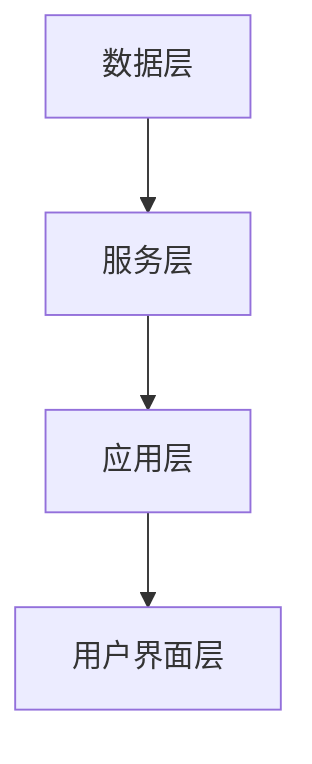
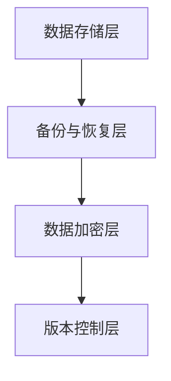
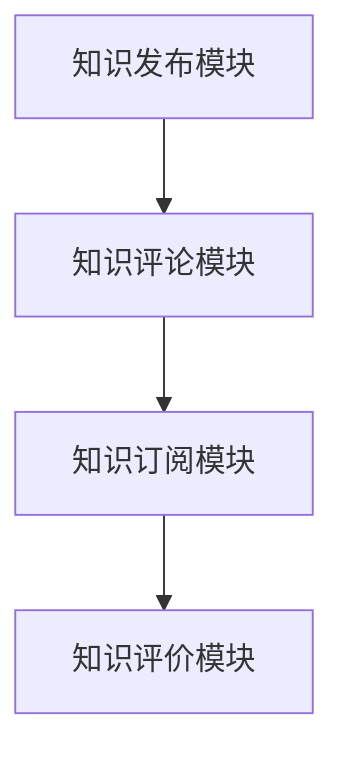
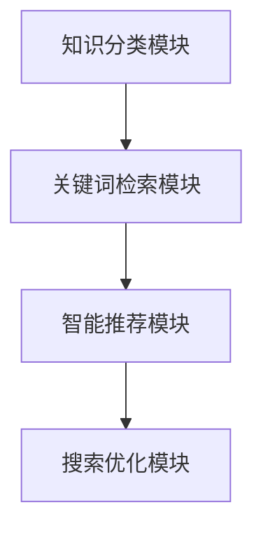
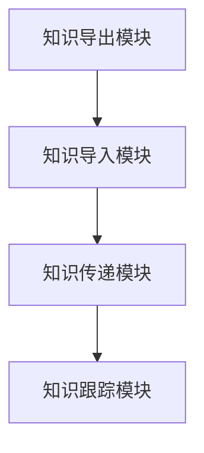
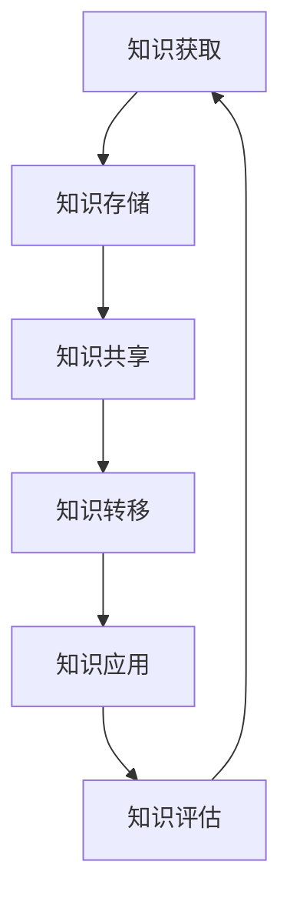
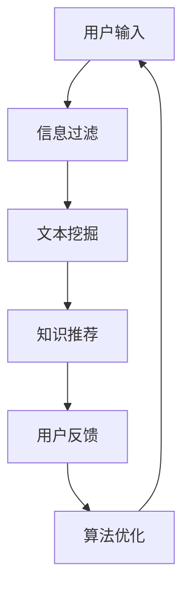
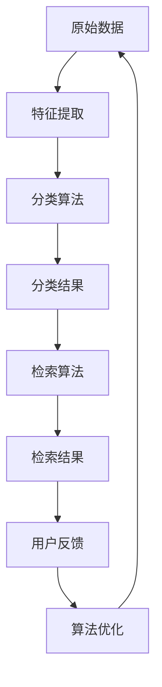
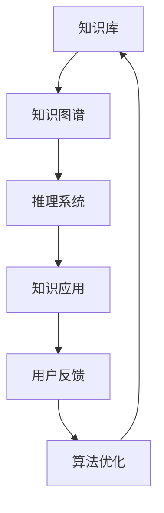

                 

### 《AI创业公司的知识管理》

随着人工智能技术的迅猛发展，AI创业公司如雨后春笋般涌现。这些公司不仅在技术层面追求创新，更需要在知识管理方面找到有效的路径。本文旨在探讨AI创业公司如何进行知识管理，以提高其核心竞争力。

### 关键词

- AI创业公司
- 知识管理
- 知识生命周期
- 知识获取
- 知识共享
- 知识转移

### 摘要

本文首先分析了AI创业公司的特点与挑战，然后介绍了知识管理的概念与重要性。接着，从知识分类、获取、存储、共享和转移等方面探讨了知识管理的基础理论。随后，详细讨论了知识管理系统的设计、实施与运营，并分享了国内外AI创业公司的成功案例和实践经验。最后，对知识管理工具、未来发展趋势与挑战进行了总结。

## 《AI创业公司的知识管理》目录大纲

### 第一部分：知识管理概述

#### 第1章：AI创业公司的知识管理概述

##### 1.1.1 AI创业公司的特点与挑战

##### 1.1.2 知识管理的概念与重要性

##### 1.1.3 知识管理的目标与原则

#### 第2章：知识管理的基础理论

##### 2.1.1 知识分类与知识生命周期

##### 2.1.2 知识获取与创造

##### 2.1.3 知识存储与共享

##### 2.1.4 知识转移与应用

### 第二部分：知识管理系统设计

#### 第3章：知识管理系统概述

##### 3.1.1 知识管理系统的定义与功能

##### 3.1.2 知识管理系统的架构与模块

##### 3.1.3 知识管理系统的选择与定制

#### 第4章：知识管理系统的核心模块设计

##### 4.1.1 知识存储模块设计

##### 4.1.2 知识共享模块设计

##### 4.1.3 知识分类与检索模块设计

##### 4.1.4 知识转移模块设计

#### 第5章：知识管理系统的安全性设计

##### 5.1.1 数据安全与隐私保护

##### 5.1.2 访问控制与权限管理

##### 5.1.3 系统安全策略与应急预案

### 第三部分：知识管理实施与运营

#### 第6章：知识管理实施策略

##### 6.1.1 知识管理规划与流程设计

##### 6.1.2 员工知识管理意识与能力培养

##### 6.1.3 知识共享激励机制设计

#### 第7章：知识管理系统的运营与维护

##### 7.1.1 系统监控与性能优化

##### 7.1.2 数据库管理与更新

##### 7.1.3 用户反馈与持续改进

#### 第8章：案例研究与经验分享

##### 8.1.1 国内外AI创业公司知识管理实践案例分析

##### 8.1.2 知识管理最佳实践总结

##### 8.1.3 知识管理未来发展趋势与挑战

### 附录

#### 附录A：知识管理工具与应用

##### A.1.1 知识管理工具简介

##### A.1.2 知识管理工具的选型与使用

##### A.1.3 知识管理工具的实际应用案例

#### 附录B：参考文献

##### B.1.1 知识管理相关书籍与论文推荐

##### B.1.2 AI创业公司知识管理研究报告与白皮书

#### 附录C：知识管理流程图与算法原理图

##### C.1.1 知识管理流程图

##### C.1.2 知识获取与共享算法原理图

##### C.1.3 知识分类与检索算法原理图

##### C.1.4 知识转移与应用算法原理图

## 第一部分：知识管理概述

### 第1章：AI创业公司的知识管理概述

#### 1.1 AI创业公司的特点与挑战

AI创业公司是指专注于人工智能技术的研发和应用，通过创新和商业模式的变革来寻求市场机会和商业价值的企业。与传统的创业公司相比，AI创业公司具有以下几个特点：

1. **技术密集型**：AI创业公司依赖先进的AI技术和算法，对技术人才和研发投入有较高要求。
2. **快速迭代**：在AI领域，技术和应用更新速度极快，AI创业公司需要具备快速迭代产品和服务的能力。
3. **高度不确定性**：AI技术尚处于发展初期，市场前景和业务模式存在较大不确定性。

#### 1.2 知识管理的概念与重要性

知识管理是指通过系统的方法和工具，对组织内部的知识进行获取、存储、共享、应用和创新的过程。在AI创业公司中，知识管理的重要性体现在以下几个方面：

1. **提升创新能力**：知识管理有助于组织积累和利用已有的知识，促进新知识的产生和创新。
2. **增强核心竞争力**：通过知识管理，AI创业公司可以更好地保护其独特的知识和能力，形成核心竞争力。
3. **降低运营风险**：知识管理有助于组织在面对不确定性时，快速获取和利用相关知识，降低运营风险。

#### 1.3 知识管理的目标与原则

AI创业公司的知识管理目标主要包括：

1. **知识获取**：通过多种途径获取内部和外部有价值的信息和知识。
2. **知识共享**：建立有效的知识共享机制，促进组织内部的知识流动和交流。
3. **知识应用**：将获取和共享的知识应用于业务实践，提高工作效率和创新能力。

知识管理的基本原则包括：

1. **以人为本**：知识管理的核心是服务于组织成员，提高其知识利用效率。
2. **持续改进**：知识管理是一个持续的过程，需要不断优化和完善。
3. **开放性**：知识管理需要建立开放的知识共享平台，鼓励成员积极参与和贡献。

### 1.3.1 知识管理在AI创业公司的具体应用场景

在AI创业公司中，知识管理可以应用于以下几个方面：

1. **研发过程**：通过知识管理，AI创业公司可以积累和共享研发过程中的经验、技术和最佳实践，提高研发效率。
2. **业务运营**：知识管理可以帮助AI创业公司在业务运营中快速获取和利用相关知识，优化业务流程和决策。
3. **人才管理**：知识管理有助于AI创业公司积累和传承组织内部的人才知识和经验，提高人才培养和留用效果。

### 1.4 本章小结

本章从AI创业公司的特点与挑战、知识管理的概念与重要性、知识管理的目标与原则以及知识管理在AI创业公司的具体应用场景等方面进行了探讨。下一章将深入探讨知识管理的基础理论，包括知识分类、知识生命周期、知识获取、知识存储与共享、知识转移等方面的内容。

## 第二部分：知识管理的基础理论

### 第2章：知识管理的基础理论

知识管理的基础理论是构建有效知识管理系统的基石。在本章中，我们将深入探讨知识分类与知识生命周期、知识获取与创造、知识存储与共享、知识转移与应用等方面的内容。

#### 2.1 知识分类与知识生命周期

知识分类是指根据知识的特点和属性，将知识划分为不同的类别。合理的知识分类有助于知识的组织和管理，提高知识的可发现性和可访问性。常见的知识分类方法包括基于内容、基于用途、基于来源等。

知识生命周期是指知识从产生、获取、存储、共享、应用到消亡的整个过程。知识生命周期管理是指对知识生命周期的各个环节进行有效控制和管理，确保知识的有效利用和持续创新。

#### 2.1.1 知识分类的方法与标准

知识分类的方法主要包括以下几种：

1. **基于内容的分类**：根据知识的主题、形式、属性等进行分类。这种方法适用于文档、数据库等静态知识的管理。
2. **基于用途的分类**：根据知识的应用场景和目的进行分类。这种方法有助于满足用户的需求，提高知识的实用性。
3. **基于来源的分类**：根据知识的来源渠道进行分类。这种方法有助于识别知识的来源和可靠性。

知识分类的标准主要包括：

1. **一致性**：分类标准应该一致，避免出现重复和冲突。
2. **可扩展性**：分类标准应该具备良好的可扩展性，能够适应知识的发展变化。
3. **灵活性**：分类标准应该具备一定的灵活性，能够根据用户需求进行个性化定制。

#### 2.1.2 知识生命周期模型

常见的知识生命周期模型包括：

1. **线性模型**：知识从产生到消亡的过程是线性的，如产生、发展、成熟、消亡等阶段。
2. **循环模型**：知识在生命周期内经历多个循环，每次循环都带来新的知识和创新。
3. **S曲线模型**：知识生命周期呈现S曲线形状，包括引入、成长、成熟和衰退等阶段。

#### 2.1.3 知识生命周期管理策略

知识生命周期管理策略包括以下几个方面：

1. **知识获取策略**：通过多种途径获取有价值的信息和知识，如内部员工经验、外部文献资料、行业报告等。
2. **知识存储策略**：建立知识库和数据库，对知识进行存储和管理，确保知识的可发现性和可访问性。
3. **知识共享策略**：建立有效的知识共享机制，促进组织内部的知识流动和交流，提高知识的利用效率。
4. **知识应用策略**：将获取和共享的知识应用于业务实践，提高工作效率和创新能力。

#### 2.2 知识获取与创造

知识获取是指通过多种途径获取有价值的信息和知识的过程。知识创造是指通过创新和协同，产生新的知识和价值的过程。

#### 2.2.1 知识获取的途径与方法

知识获取的途径主要包括：

1. **内部获取**：通过组织内部的知识源获取知识，如员工的经验、项目文档、内部培训等。
2. **外部获取**：通过组织外部的知识源获取知识，如学术研究、行业报告、市场调研等。

知识获取的方法主要包括：

1. **搜索与筛选**：利用搜索引擎、数据库等工具，从海量信息中筛选出有价值的内容。
2. **信息挖掘**：利用数据挖掘、机器学习等技术，从数据中提取出潜在的知识和价值。
3. **专家咨询**：通过向行业专家、学者等进行咨询，获取专业的知识和见解。

#### 2.2.2 知识创造的过程与策略

知识创造的过程包括：

1. **问题识别**：识别出需要解决的问题或机会，明确知识创造的目标。
2. **信息整合**：收集和整合相关的信息，形成初步的知识框架。
3. **创新与协同**：通过创新思维和团队协作，产生新的知识和价值。
4. **知识验证**：对创造出的知识进行验证，确保其准确性和实用性。

知识创造策略包括：

1. **鼓励创新**：建立创新文化，鼓励员工勇于尝试和探索新思路。
2. **协同合作**：建立协作平台，促进团队间的知识共享和协同创新。
3. **知识积累**：建立知识库，积累和传承组织内部的知识和经验。

#### 2.2.3 知识共享与协同创造

知识共享是指通过多种途径和工具，促进组织内部的知识流动和交流的过程。协同创造是指通过团队合作和知识共享，共同创造新的知识和价值的过程。

#### 2.2.4 知识共享平台的功能与特点

知识共享平台的功能主要包括：

1. **知识存储**：提供知识存储和管理的功能，确保知识的可发现性和可访问性。
2. **知识检索**：提供高效的搜索功能，帮助用户快速找到所需的知识。
3. **知识共享**：提供知识共享和交流的功能，促进组织内部的知识流动。
4. **知识评价**：提供知识评价和反馈的功能，提高知识的准确性和实用性。

知识共享平台的特点主要包括：

1. **开放性**：知识共享平台应具备良好的开放性，鼓励成员积极参与和贡献。
2. **协作性**：知识共享平台应支持多人协作，促进团队间的知识共享和协同创新。
3. **灵活性**：知识共享平台应具备良好的灵活性，能够根据用户需求进行个性化定制。

#### 2.3 知识存储与共享

知识存储是指将获取和创造的知识进行系统化管理和存储的过程。知识共享是指通过多种途径和工具，促进组织内部的知识流动和交流的过程。

#### 2.3.1 知识存储系统的设计原则

知识存储系统的设计原则主要包括：

1. **可靠性**：确保知识存储系统的稳定性和可靠性，防止数据丢失和损坏。
2. **安全性**：保护知识存储系统的数据安全，防止未授权访问和数据泄露。
3. **可扩展性**：知识存储系统应具备良好的可扩展性，能够适应知识量的增长和变化。
4. **高效性**：提高知识存储和检索的效率，降低系统的响应时间。

#### 2.3.2 知识存储系统的架构

知识存储系统通常包括以下架构：

1. **数据层**：负责数据的存储和管理，包括数据库、文件系统等。
2. **应用层**：提供知识存储和检索的接口，包括API、Web应用等。
3. **展示层**：提供用户交互界面，包括Web界面、移动应用等。

#### 2.3.3 知识共享平台的功能与特点

知识共享平台的功能主要包括：

1. **知识发布**：提供知识发布和管理的功能，帮助用户发布和管理自己的知识。
2. **知识搜索**：提供高效的搜索功能，帮助用户快速找到所需的知识。
3. **知识分享**：提供知识分享和交流的功能，促进组织内部的知识流动。
4. **知识评价**：提供知识评价和反馈的功能，提高知识的准确性和实用性。

知识共享平台的特点主要包括：

1. **开放性**：知识共享平台应具备良好的开放性，鼓励成员积极参与和贡献。
2. **协作性**：知识共享平台应支持多人协作，促进团队间的知识共享和协同创新。
3. **灵活性**：知识共享平台应具备良好的灵活性，能够根据用户需求进行个性化定制。

#### 2.4 知识转移与应用

知识转移是指将知识从一个个体或组织转移到另一个个体或组织的过**程**。知识应用是指将获取和转移的知识应用于实际工作或业务实践中，以提高工作效率和创新能力。

#### 2.4.1 知识转移的障碍与解决方法

知识转移过程中常见的障碍包括：

1. **文化差异**：组织或个体之间的文化差异可能导致知识转移的困难。
2. **知识复杂度**：复杂的知识可能难以理解和应用。
3. **缺乏沟通**：知识转移过程中缺乏有效的沟通和交流。

解决方法包括：

1. **文化融合**：建立共同的文化认同，促进知识转移。
2. **知识简化**：将复杂知识进行简化，使其易于理解和应用。
3. **增强沟通**：建立有效的沟通机制，促进知识转移的顺利进行。

#### 2.4.2 知识转移的过程与策略

知识转移的过程包括：

1. **知识识别**：识别出需要转移的知识。
2. **知识准备**：将知识进行整理和准备，使其易于转移。
3. **知识转移**：将知识从一个个体或组织转移到另一个个体或组织。
4. **知识应用**：将转移的知识应用于实际工作或业务实践中。

知识转移策略包括：

1. **培训与辅导**：通过培训、辅导等方式，帮助接收者理解和应用知识。
2. **案例分享**：通过案例分享，提供知识转移的实践经验。
3. **知识图谱**：建立知识图谱，帮助用户快速找到所需的知识。

#### 2.4.3 知识应用的创新与实践

知识应用的创新包括：

1. **业务创新**：将知识应用于业务流程和业务模式，创造新的商业机会。
2. **技术创新**：将知识应用于技术研发和创新，推动技术进步。
3. **管理创新**：将知识应用于管理实践，提高管理效率和效果。

知识应用的实践包括：

1. **案例研究**：通过对具体案例的研究，探讨知识应用的有效方法和策略。
2. **项目实施**：通过项目实施，验证知识应用的可行性和效果。
3. **持续改进**：通过持续改进，不断提升知识应用的效果和价值。

### 2.5 本章小结

本章从知识分类与知识生命周期、知识获取与创造、知识存储与共享、知识转移与应用等方面，探讨了知识管理的基础理论。下一章将详细讨论知识管理系统设计的相关内容，包括知识管理系统的定义、功能、架构、模块设计等方面。

## 第三部分：知识管理系统设计

### 第3章：知识管理系统概述

知识管理系统（Knowledge Management System, KMS）是支持知识管理过程的核心工具，它通过整合组织内的信息资源，提供知识存储、共享、检索、应用等功能，从而促进知识的有效利用和创新。本章将介绍知识管理系统的定义、功能、架构以及选择与定制的方法。

#### 3.1 知识管理系统的定义与功能

知识管理系统是一个集成的技术平台，旨在支持知识管理活动，包括知识的获取、存储、共享、检索、转移和应用。具体来说，知识管理系统的功能包括：

1. **知识存储**：提供一个集中化的存储设施，用于存储各种形式的知识，如文档、数据库、图像、音频、视频等。
2. **知识共享**：通过论坛、博客、即时通讯、社交网络等方式，促进知识的交流与共享。
3. **知识检索**：利用搜索引擎、元数据管理等技术，帮助用户快速找到所需的知识。
4. **知识分类与组织**：通过对知识进行分类、标签化、索引等操作，提高知识的可发现性和组织性。
5. **知识转移**：通过培训、导师制度、知识地图等方式，实现知识在不同部门、团队或个人之间的转移。
6. **知识应用**：提供工具和平台，支持知识的实际应用，如项目协作、问题解决、决策支持等。

#### 3.2 知识管理系统的架构与模块

知识管理系统的架构设计需要考虑系统的可扩展性、可维护性和用户体验。一个典型的知识管理系统通常包括以下几个模块：

1. **数据层**：负责数据的存储和管理，包括关系数据库、NoSQL数据库、文件系统等。
2. **服务层**：提供各种知识管理功能的服务，如知识存储服务、知识检索服务、知识共享服务等。
3. **应用层**：为用户提供的交互界面和应用，包括Web应用、移动应用、桌面应用等。
4. **用户界面层**：用户与系统交互的界面，包括搜索界面、文档编辑界面、讨论论坛等。

以下是一个简化的知识管理系统架构图：



#### 3.3 知识管理系统的选择与定制

选择一个适合AI创业公司的知识管理系统是一个复杂的过程，需要考虑多个因素，如公司的规模、业务需求、技术环境、预算等。以下是选择和定制知识管理系统时的一些关键步骤：

1. **需求分析**：明确公司的知识管理需求，包括知识存储、共享、检索、转移和应用等方面的具体需求。
2. **市场调研**：了解市场上现有的知识管理工具和产品，评估它们的功能、性能、价格和用户评价。
3. **功能对比**：根据需求分析结果，对比不同知识管理系统的功能和特点，选择最符合公司需求的系统。
4. **定制与开发**：如果现有系统无法完全满足需求，可能需要定制开发。这包括与供应商合作，根据公司的特定需求进行功能扩展和界面优化。
5. **试点运行**：在正式部署前，选择一个试点团队或部门进行系统的测试和试用，收集反馈并进行必要的调整。
6. **培训与推广**：为员工提供系统的培训和指导，确保他们能够熟练使用系统，并积极参与知识管理活动。

#### 3.4 知识管理系统与传统信息系统的区别

知识管理系统与传统信息系统（如企业资源规划系统ERP、客户关系管理系统CRM等）在目标、功能和技术架构等方面存在显著差异：

1. **目标**：传统信息系统主要关注数据的存储、处理和分析，而知识管理系统更侧重于知识的获取、共享和利用。
2. **功能**：知识管理系统通常提供更丰富的知识管理功能，如知识分类、知识检索、知识转移和知识应用等，而传统信息系统则更侧重于数据的存储和处理。
3. **技术架构**：知识管理系统通常采用更加灵活和模块化的技术架构，以支持知识管理活动的多样性，而传统信息系统则通常采用更加固定的架构，以支持特定的业务流程。

#### 3.5 本章小结

本章介绍了知识管理系统的定义、功能、架构以及选择与定制的方法。通过了解这些内容，AI创业公司可以更好地设计和实施适合自己需求的知识管理系统，从而提升知识管理水平，增强核心竞争力。

## 第四部分：知识管理系统的核心模块设计

### 第4章：知识管理系统的核心模块设计

知识管理系统（KMS）的成功依赖于其核心模块的精心设计。本章将详细探讨知识存储模块、知识共享模块、知识分类与检索模块、知识转移模块的设计原则、功能实现和关键特性。

#### 4.1 知识存储模块设计

知识存储模块是知识管理系统的基石，负责管理和维护所有知识资产。设计知识存储模块时，应考虑以下原则：

1. **数据安全性**：确保知识存储的安全性，防止未授权访问和数据泄露。
2. **数据完整性**：保证数据的完整性和一致性，防止数据丢失或损坏。
3. **数据可扩展性**：支持数据的快速增长和存储需求的变化。
4. **数据访问效率**：优化数据访问速度，确保系统响应时间短。

知识存储模块的功能包括：

1. **数据存储**：提供数据存储设施，如关系数据库、NoSQL数据库、对象存储等。
2. **数据备份与恢复**：定期备份数据，并确保在系统故障或数据丢失时能够快速恢复。
3. **数据加密**：对敏感数据进行加密，确保数据在存储和传输过程中的安全性。
4. **版本控制**：实现文档和数据的版本管理，跟踪不同版本的变更历史。

以下是一个简单的知识存储模块架构：



#### 4.2 知识共享模块设计

知识共享模块是促进组织内知识流动和交流的核心。设计知识共享模块时，应考虑以下原则：

1. **用户友好性**：确保知识共享界面简单易用，便于用户快速上手。
2. **灵活性**：支持多种知识共享方式，如文档分享、讨论论坛、即时通讯等。
3. **激励机制**：建立有效的激励机制，鼓励用户积极参与知识共享。
4. **可扩展性**：支持知识共享功能的扩展和定制，以适应不同组织的需求。

知识共享模块的功能包括：

1. **知识发布**：允许用户创建和发布知识内容，包括文档、视频、音频等。
2. **知识评论**：支持用户对知识内容进行评论和讨论，促进知识的深度交流。
3. **知识订阅**：允许用户订阅感兴趣的知识内容，及时获取最新更新。
4. **知识评价**：提供知识评价机制，帮助用户了解知识内容的实用性和准确性。

以下是一个简单的知识共享模块架构：



#### 4.3 知识分类与检索模块设计

知识分类与检索模块是知识管理系统的重要组成部分，负责组织和搜索知识。设计知识分类与检索模块时，应考虑以下原则：

1. **分类准确性**：确保知识分类的准确性，提高知识的可发现性。
2. **检索效率**：优化检索算法，确保用户能够快速找到所需知识。
3. **用户体验**：提供直观的检索界面，使用户能够轻松使用。
4. **可扩展性**：支持分类体系的动态调整和扩展。

知识分类与检索模块的功能包括：

1. **知识分类**：提供知识分类体系，支持多级分类和标签化。
2. **关键词检索**：支持基于关键词的全文检索，使用户能够快速找到相关内容。
3. **智能推荐**：基于用户行为和兴趣，提供知识内容推荐。
4. **搜索优化**：优化检索算法，提高检索速度和准确性。

以下是一个简单的知识分类与检索模块架构：



#### 4.4 知识转移模块设计

知识转移模块负责将知识从一个个体或组织转移到另一个个体或组织。设计知识转移模块时，应考虑以下原则：

1. **转移效率**：优化知识转移流程，提高转移效率。
2. **转移安全性**：确保知识在转移过程中的安全性，防止知识泄露。
3. **转移灵活性**：支持多种转移方式，如在线共享、离线传输、文档传递等。
4. **转移跟踪**：记录知识转移的过程和结果，便于管理和审计。

知识转移模块的功能包括：

1. **知识导出**：支持将知识内容导出为不同格式，如PDF、Word、Excel等。
2. **知识导入**：支持从外部系统或文件导入知识内容。
3. **知识传递**：提供知识传递功能，如通过邮件、即时通讯等将知识传递给相关人员。
4. **知识跟踪**：记录知识转移的过程，包括转移时间、接收人、转移方式等。

以下是一个简单的知识转移模块架构：



#### 4.5 本章小结

本章详细讨论了知识管理系统的核心模块设计，包括知识存储模块、知识共享模块、知识分类与检索模块、知识转移模块。通过遵循设计原则和实现关键功能，AI创业公司可以构建一个高效、安全、灵活的知识管理系统，从而提升知识管理水平，增强组织竞争力。

### 第5章：知识管理系统的安全性设计

在知识管理系统中，安全性设计至关重要，因为它直接关系到知识的保密性、完整性和可用性。本章节将详细探讨知识管理系统的安全性设计，包括数据安全与隐私保护、访问控制与权限管理、系统安全策略与应急预案。

#### 5.1 数据安全与隐私保护

数据安全是知识管理系统设计中的一个核心问题，确保数据在存储、传输和使用过程中的安全是知识管理的首要任务。以下是一些关键措施：

1. **数据加密**：对存储在数据库中的敏感数据进行加密处理，如使用AES加密算法。传输过程中的数据也应该加密，以防止在数据传输过程中被截获。

   ```latex
   \text{加密算法}: AES_{256}(Data)
   ```

2. **访问控制**：实施严格的访问控制策略，确保只有授权用户才能访问特定的数据。可以使用基于角色的访问控制（RBAC）模型，根据用户的角色和权限来限制对数据的访问。

   ```mermaid
   graph TB
   A[管理员] --> B[高权限]
   B --> C[敏感数据]
   A --> D[普通用户]
   D --> E[非敏感数据]
   ```

3. **数据备份与恢复**：定期备份数据，并确保在发生数据丢失或系统故障时，能够迅速恢复数据。备份数据应该加密存储，并保存在安全的地方。

4. **隐私保护**：对于涉及个人隐私的数据，需要遵守相关隐私保护法律法规，如GDPR。对个人数据进行去标识化处理，确保个人隐私不被泄露。

#### 5.2 访问控制与权限管理

访问控制与权限管理是确保知识管理系统安全的重要措施。以下是一些关键策略：

1. **最小权限原则**：用户应被授予完成其任务所需的最小权限，以减少潜在的安全风险。

   ```mermaid
   graph TD
   A[用户] --> B[最小权限]
   B --> C[任务完成]
   ```

2. **多因素认证**：在关键操作或访问敏感数据时，实施多因素认证（MFA），如密码、短信验证码、生物识别等。

3. **权限审计**：定期审计用户的权限，确保权限的合理性和安全性。对于不再需要的权限，应及时撤销。

4. **动态权限管理**：根据用户的实时行为和系统安全状况，动态调整用户的权限。

   ```mermaid
   graph TD
   A[用户行为] --> B[权限调整]
   B --> C[系统安全]
   ```

#### 5.3 系统安全策略与应急预案

系统安全策略与应急预案是确保知识管理系统在面对安全威胁时能够及时响应和恢复。以下是一些关键策略：

1. **安全策略设计**：制定全面的安全策略，包括安全架构、安全流程、安全工具等。确保策略覆盖知识管理系统的各个方面。

2. **安全监控**：实施实时监控，及时发现和响应安全事件。使用入侵检测系统（IDS）和入侵防御系统（IPS）来检测和阻止恶意攻击。

3. **安全培训**：定期对员工进行安全培训，提高他们的安全意识和应对能力。

4. **应急预案**：制定详细的应急预案，包括安全事件响应流程、数据恢复流程、通信策略等。定期进行应急演练，确保在发生安全事件时能够迅速响应。

5. **安全审计**：定期进行安全审计，评估系统的安全状况，发现潜在的安全漏洞。

#### 5.4 本章小结

安全性设计是知识管理系统的关键组成部分，直接影响知识的保密性、完整性和可用性。通过数据加密、访问控制、多因素认证、动态权限管理、安全策略设计、安全监控、安全培训、应急预案和安全审计等措施，AI创业公司可以构建一个安全可靠的知识管理系统，确保知识管理的有效性和持续性。

### 第6章：知识管理实施策略

知识管理实施策略是确保知识管理系统能够成功落地并发挥预期效果的关键。在本章中，我们将探讨知识管理实施策略，包括知识管理规划与流程设计、员工知识管理意识与能力培养、知识共享激励机制设计。

#### 6.1 知识管理规划与流程设计

知识管理规划是知识管理系统实施的第一步，它需要明确知识管理的目标和策略。以下是知识管理规划与流程设计的关键步骤：

1. **需求分析**：了解组织内的知识管理需求，包括知识获取、存储、共享、转移和应用的需求。可以通过问卷调查、访谈、工作坊等方式收集需求。

2. **制定目标**：根据需求分析结果，明确知识管理的具体目标，如提升知识利用率、提高创新能力、降低运营风险等。

3. **设计流程**：设计知识管理的流程，包括知识获取、知识共享、知识转移、知识应用等环节。流程设计应考虑到知识生命周期各阶段的实际需求。

4. **制定策略**：制定知识管理策略，如知识获取策略、知识共享策略、知识应用策略等。策略应与组织的业务目标和战略相一致。

5. **制定实施计划**：制定详细的实施计划，包括时间表、责任分配、资源需求等。实施计划应考虑到各个阶段的实施顺序和相互依赖关系。

6. **评估与改进**：定期评估知识管理的实施效果，根据评估结果对流程和策略进行改进。

#### 6.2 员工知识管理意识与能力培养

员工是知识管理的核心，他们的意识和能力直接影响知识管理的成功。以下是一些关键策略：

1. **培训与教育**：定期为员工提供知识管理相关的培训和教育，提高他们的知识管理意识和能力。培训内容可以包括知识管理的基本概念、知识管理工具的使用、知识获取与创造等。

2. **知识分享平台**：建立内部知识分享平台，鼓励员工积极参与知识共享。平台应提供便捷的知识发布、检索和交流功能，以促进知识流动。

3. **知识社区**：建立知识社区，鼓励员工在社区中分享经验和知识。社区可以采用论坛、博客、即时通讯等方式，为员工提供一个交流和学习的平台。

4. **认证与奖励**：建立知识管理认证体系，对在知识管理方面表现优秀的员工进行认证和奖励。认证和奖励可以激励员工积极参与知识管理活动。

5. **领导示范**：领导应起到示范作用，积极参与知识管理活动，展示知识管理的价值和重要性。

#### 6.3 知识共享激励机制设计

知识共享激励机制是推动员工积极参与知识管理的重要手段。以下是一些关键策略：

1. **认可与奖励**：对在知识共享方面表现优秀的员工进行公开认可和奖励。奖励可以包括奖金、晋升、荣誉等。

2. **知识贡献积分**：建立知识贡献积分系统，对员工的知识共享行为进行量化评估。积分可以用于兑换奖品、参与决策等。

3. **团队知识分享活动**：组织团队知识分享活动，如知识竞赛、经验交流等。活动可以增加员工之间的互动，促进知识共享。

4. **知识共享平台积分奖励**：在知识共享平台上设置积分奖励机制，鼓励员工积极参与知识分享和讨论。

5. **员工参与决策**：让员工参与到知识管理的决策过程中，让他们感受到自己的意见和贡献被重视。

#### 6.4 本章小结

知识管理实施策略是确保知识管理系统成功落地和发挥作用的关键。通过知识管理规划与流程设计、员工知识管理意识与能力培养、知识共享激励机制设计，AI创业公司可以构建一个高效的知识管理系统，促进知识的流动和创新，提升组织的核心竞争力。

### 第7章：知识管理系统的运营与维护

知识管理系统的运营与维护是确保系统稳定、高效运行的关键环节。本章将详细探讨系统监控与性能优化、数据库管理与更新、用户反馈与持续改进的策略和实践。

#### 7.1 系统监控与性能优化

系统监控与性能优化是保障知识管理系统稳定运行的基础。以下是一些关键策略：

1. **实时监控**：通过实时监控系统，实时监控系统的运行状态，如服务器负载、网络流量、数据库性能等。实时监控可以帮助及时发现和处理潜在的问题。

2. **性能调优**：定期对系统进行性能调优，优化系统配置和资源分配。例如，通过调整数据库索引、优化查询语句、增加缓存等手段提高系统性能。

3. **故障排除**：建立故障排除机制，当系统出现故障时，能够快速定位问题并采取相应的措施进行修复。

4. **性能测试**：定期进行性能测试，模拟高负载情况，评估系统的性能瓶颈，提前进行优化。

5. **自动化监控与报警**：使用自动化工具对系统进行监控和报警，当系统出现异常时，自动触发报警机制，通知相关人员进行处理。

#### 7.2 数据库管理与更新

数据库管理与更新是确保知识管理系统中数据准确性和完整性的重要环节。以下是一些关键策略：

1. **数据备份与恢复**：定期备份数据库，并确保备份数据的安全存储。在发生数据丢失或系统故障时，能够快速恢复数据。

2. **数据完整性检查**：定期检查数据库中的数据完整性，确保数据的准确性。可以使用数据校验工具或编写自定义脚本进行数据完整性检查。

3. **数据更新策略**：制定合理的数据更新策略，确保数据的实时性和准确性。例如，可以使用实时数据同步、批量更新等方式进行数据更新。

4. **数据迁移与集成**：在系统升级或迁移时，确保数据的完整迁移和集成。数据迁移过程中，要严格测试数据的完整性和一致性。

5. **数据库性能调优**：定期对数据库进行性能调优，优化数据库配置和查询语句，提高数据库的性能。

#### 7.3 用户反馈与持续改进

用户反馈与持续改进是知识管理系统优化和改进的重要途径。以下是一些关键策略：

1. **用户调研**：定期对用户进行调研，了解他们对知识管理系统的使用体验和需求。可以通过问卷调查、访谈、用户反馈平台等方式收集用户反馈。

2. **用户满意度评估**：建立用户满意度评估机制，定期评估用户对知识管理系统的满意度。评估结果可以作为改进系统的依据。

3. **问题跟踪与解决**：建立问题跟踪系统，记录用户反馈的问题，并按照优先级和严重程度进行分类处理。对于重要问题，要快速响应并解决。

4. **持续改进计划**：根据用户反馈和系统性能评估结果，制定持续改进计划。改进计划应包括改进目标、改进措施、实施时间和责任人。

5. **改进效果评估**：在实施改进措施后，对改进效果进行评估，确保改进措施达到预期效果。根据评估结果，对改进计划进行调整和优化。

#### 7.4 本章小结

知识管理系统的运营与维护是确保系统稳定、高效运行的关键。通过系统监控与性能优化、数据库管理与更新、用户反馈与持续改进，AI创业公司可以不断提升知识管理系统的性能和用户体验，确保知识管理的有效性和持续性。

### 第8章：案例研究与经验分享

#### 8.1 国内外AI创业公司知识管理实践案例分析

在本章节中，我们将分析国内外AI创业公司在知识管理实践中的成功案例，探讨它们在知识管理过程中所采取的策略、方法和经验，以及这些实践对其他AI创业公司的启示。

#### 8.1.1 国内外知名AI创业公司的知识管理实践案例

**案例一：Google AI**

Google AI是国际知名的人工智能研究团队，其知识管理实践堪称典范。Google AI采用了多种策略来管理其庞大的知识库：

1. **知识共享平台**：Google AI建立了内部的知识共享平台，如内部论坛和内部博客，鼓励团队成员分享研究成果、问题和解决方案。
2. **知识分类与检索**：Google AI采用了强大的搜索引擎技术，使团队成员能够快速找到所需的知识和资料。
3. **培训与导师制度**：Google AI为员工提供定期的培训和学习机会，并建立了导师制度，帮助新员工快速融入团队并掌握知识。

**案例二：DeepMind**

DeepMind是一家在英国成立的人工智能公司，以其在深度学习领域的研究成果闻名。DeepMind在知识管理方面的做法包括：

1. **协作工具**：DeepMind使用了多种协作工具，如Google Drive、Slack等，方便团队成员实时共享和协作。
2. **知识库建设**：DeepMind建立了内部的知识库，涵盖了项目文档、代码库、实验数据等，为团队成员提供了丰富的知识资源。
3. **数据隐私保护**：DeepMind高度重视数据隐私保护，制定了严格的数据保护政策和安全措施，确保数据在存储和传输过程中的安全性。

**案例三：华为云AI**

华为云AI是中国的一家领先的人工智能公司，其在知识管理方面的实践为国内其他AI创业公司提供了宝贵的经验：

1. **知识共享激励机制**：华为云AI建立了知识共享激励机制，对在知识管理中表现突出的员工进行奖励和认可。
2. **知识图谱**：华为云AI构建了内部的知识图谱，将各种知识进行分类和关联，提高了知识的可发现性和可理解性。
3. **持续改进**：华为云AI注重知识管理的持续改进，定期对知识管理流程和工具进行评估和优化，确保知识管理系统能够满足业务需求。

#### 8.1.2 案例分析中的成功经验与挑战

通过上述案例分析，我们可以总结出一些成功经验：

1. **知识共享平台**：建立有效的知识共享平台是知识管理的关键。这些平台应具备良好的用户友好性、灵活性和可扩展性，以便于团队成员快速获取和共享知识。
2. **培训与教育**：定期的培训和教育有助于提高员工的知识管理水平，增强他们的知识获取、共享和利用能力。
3. **知识分类与检索**：合理的知识分类和高效的检索机制能够提高知识的可发现性和可访问性，使团队成员能够更快地找到所需的知识。
4. **激励机制**：建立有效的激励机制可以鼓励员工积极参与知识管理活动，提高知识共享和利用的积极性。

然而，在知识管理实践中也面临一些挑战：

1. **数据隐私与安全**：在知识共享过程中，如何确保数据的安全性和隐私性是一个重要的挑战。这需要制定严格的数据保护政策和安全措施。
2. **文化差异**：不同团队之间的文化差异可能导致知识共享的困难。因此，建立共同的文化认同和协作机制是促进知识共享的重要步骤。
3. **知识更新的挑战**：随着技术的发展，知识不断更新和迭代。如何及时更新知识库，确保知识的时效性和准确性是一个挑战。

#### 8.1.3 案例对AI创业公司知识管理的启示

从上述案例分析中，AI创业公司可以得出以下启示：

1. **建立知识共享平台**：AI创业公司应建立内部的知识共享平台，鼓励团队成员分享知识和经验，促进知识的流动和创新。
2. **注重培训与教育**：定期为员工提供培训和教育，提高他们的知识管理能力和技能，确保他们能够更好地参与知识管理活动。
3. **优化知识分类与检索**：建立合理的知识分类和高效的检索机制，提高知识的可发现性和可访问性，使团队成员能够快速获取所需的知识。
4. **制定激励机制**：建立有效的激励机制，鼓励员工积极参与知识管理活动，提高知识共享和利用的积极性。
5. **关注数据隐私与安全**：制定严格的数据保护政策和安全措施，确保数据在存储和传输过程中的安全性，保护员工的隐私和组织的知识产权。
6. **持续改进**：定期评估知识管理实践的效果，根据评估结果不断优化和改进知识管理流程和工具，确保知识管理系统能够满足业务需求。

#### 8.2 知识管理最佳实践总结

在总结国内外AI创业公司的知识管理实践案例后，我们可以提炼出以下最佳实践：

1. **知识共享平台建设**：建立高效、易用的知识共享平台，促进知识的快速流动和共享。
2. **培训与教育**：定期为员工提供知识管理培训和教育，提高他们的知识获取、共享和利用能力。
3. **知识分类与检索**：采用合理的知识分类和高效的检索机制，提高知识的可发现性和可访问性。
4. **激励机制**：建立有效的激励机制，鼓励员工积极参与知识管理活动，提高知识共享和利用的积极性。
5. **数据隐私与安全**：制定严格的数据保护政策和安全措施，确保数据在存储和传输过程中的安全性。
6. **持续改进**：定期评估知识管理实践的效果，根据评估结果不断优化和改进知识管理流程和工具。

#### 8.3 知识管理未来发展趋势与挑战

展望未来，知识管理在AI创业公司中将继续发挥重要作用。以下是一些发展趋势和挑战：

1. **智能化**：随着人工智能技术的发展，知识管理系统将更加智能化，如自动分类、智能推荐、智能问答等。
2. **云原生**：知识管理系统将越来越多地采用云原生架构，实现高可扩展性和高可用性。
3. **大数据与AI融合**：大数据和人工智能技术将深度融入知识管理，提高知识的挖掘、分析和利用能力。
4. **全球化**：随着全球化的发展，知识管理将面临跨文化、跨国界的挑战，需要建立全球统一的共享平台和协作机制。
5. **数据隐私与安全**：如何确保数据在全球化背景下的隐私与安全，将是一个长期的挑战。

#### 8.4 本章小结

本章通过分析国内外AI创业公司的知识管理实践案例，总结了知识管理最佳实践，并探讨了知识管理未来发展趋势与挑战。AI创业公司可以借鉴这些经验和策略，构建适合自己的知识管理系统，提升知识管理水平，增强核心竞争力。

## 附录A：知识管理工具与应用

### A.1 知识管理工具简介

知识管理工具是支持知识获取、共享、存储、检索和转移的关键组件。以下是几种常见的知识管理工具及其主要功能和应用场景。

#### A.1.1 知识管理工具的分类

1. **知识库工具**：用于存储和管理知识资产，如Confluence、SharePoint等。
2. **知识共享平台**：用于促进知识交流与协作，如Slack、Trello等。
3. **文档管理工具**：用于文档的存储、共享和版本控制，如Google Drive、Dropbox等。
4. **学习管理系统（LMS）**：用于在线学习和培训，如Moodle、Canvas等。
5. **协作工具**：用于团队协作，如Microsoft Teams、Zoom等。
6. **数据挖掘与分析工具**：用于分析数据，提取有价值的信息，如Tableau、Power BI等。

#### A.1.2 知识管理工具的主要功能

1. **知识存储**：提供集中化的知识存储解决方案，支持多种文件格式和数据类型。
2. **知识共享**：支持知识的共享与交流，如文档共享、讨论论坛、即时通讯等。
3. **知识检索**：提供高效的搜索功能，帮助用户快速找到所需的知识。
4. **知识分类与标签化**：对知识进行分类和标签化，提高知识的可发现性和组织性。
5. **知识转移**：支持知识的转移和共享，如通过文档传递、在线培训等方式。
6. **数据分析**：对知识进行数据分析，提取有价值的信息和洞察。

#### A.1.3 知识管理工具的应用场景

1. **研发过程**：知识库工具和文档管理工具在研发过程中用于存储和管理项目文档、设计文件和研发资料。
2. **业务运营**：知识共享平台和协作工具在业务运营中用于知识交流、团队协作和业务流程管理。
3. **培训与学习**：学习管理系统和培训工具用于在线学习和培训，提高员工的技能和知识水平。
4. **客户服务**：知识库工具和协作工具在客户服务中用于存储客户信息、解决方案和常见问题。
5. **数据分析和决策支持**：数据挖掘与分析工具用于分析业务数据，提供决策支持。

### A.2 知识管理工具的选型与使用

#### A.2.1 知识管理工具的选型考虑因素

1. **业务需求**：根据业务需求选择合适的知识管理工具，确保工具的功能能够满足业务需求。
2. **用户友好性**：工具应具备良好的用户友好性，易于学习和使用，降低用户的使用门槛。
3. **可扩展性**：工具应具备良好的可扩展性，能够适应业务的发展变化。
4. **安全性**：确保知识管理工具具备良好的数据安全和隐私保护功能。
5. **成本效益**：综合考虑工具的性价比，确保在预算范围内选择最佳的工具。

#### A.2.2 知识管理工具的使用技巧与注意事项

1. **定制化**：根据组织的具体需求，对知识管理工具进行定制化配置，使其更好地满足业务需求。
2. **培训与支持**：为员工提供知识管理工具的培训和支持，提高他们的使用能力和效率。
3. **安全策略**：制定严格的安全策略，确保工具的使用过程符合数据安全和隐私保护的要求。
4. **定期评估**：定期评估知识管理工具的使用效果，根据评估结果进行调整和优化。

### A.3 知识管理工具的实际应用案例

#### A.3.1 国内外AI创业公司知识管理工具的应用案例

1. **Google**：Google采用了Confluence作为内部知识库工具，用于存储和管理项目文档、设计文件和员工手册。同时，Google Drive用于文档的共享和协作。
2. **华为**：华为使用了SharePoint作为知识共享平台，支持知识的存储、共享和检索。此外，华为还使用了Trello进行项目管理，提高了团队协作效率。
3. **IBM**：IBM采用了IBM Watson Knowledge Studio作为知识管理工具，用于构建和部署知识图谱，支持智能问答和知识推荐。
4. **美团**：美团使用了阿里云的知识图谱工具，构建了内部的知识图谱，用于业务决策和用户推荐。

#### A.3.2 知识管理工具在具体业务场景中的应用案例

1. **研发过程**：某AI创业公司在研发过程中使用了Confluence和GitLab，实现了项目文档的集中管理和版本控制，提高了研发效率。
2. **客户服务**：某金融公司在客户服务中使用了知识库工具和智能客服系统，通过知识库提供客户常见问题的解决方案，提高了客户满意度。
3. **业务运营**：某零售公司使用了Trello和Slack进行业务运营管理，通过协作工具实现了跨部门的信息共享和任务协同。

### A.4 本章小结

本章介绍了知识管理工具的分类、主要功能、选型考虑因素和使用技巧，并分享了国内外AI创业公司和具体业务场景中的知识管理工具应用案例。通过合理选择和使用知识管理工具，AI创业公司可以提升知识管理水平，增强核心竞争力。

## 附录B：参考文献

### B.1 知识管理相关书籍与论文推荐

#### B.1.1 经典知识管理书籍推荐

1. **《知识管理：理论与实践》** - 作者：理查德·萨皮恩扎（Richard A. D'Avanzo）
   - 内容简介：本书系统地介绍了知识管理的概念、方法和实践，是知识管理领域的经典之作。

2. **《组织学习与知识管理》** - 作者：彼得·圣吉（Peter Senge）
   - 内容简介：本书探讨了组织学习和知识管理的关系，提出了五项修炼，对组织学习和知识管理提供了深刻的洞见。

3. **《知识管理的变革力量》** - 作者：戴维·斯蒂芬森（David S. Stephens）
   - 内容简介：本书从变革管理的角度探讨了知识管理对组织变革的推动作用，提供了实用的知识管理策略。

#### B.1.2 知识管理领域的重要论文推荐

1. **“Knowledge Management: An Integrated Approach”** - 作者：Ikujiro Nonaka & Hirotaka Takeuchi
   - 发表时间：1995年
   - 内容简介：本文提出了知识螺旋模型，阐述了知识创造、共享和转移的过程，对知识管理理论的发展产生了深远影响。

2. **“The Knowledge-creating Company”** - 作者：Ikujiro Nonaka & Hirotaka Takeuchi
   - 发表时间：1995年
   - 内容简介：本文探讨了知识创造公司的特征和管理模式，提出了知识创造、共享和应用的框架。

3. **“Knowledge Management and Organizational Learning”** - 作者：Jean-François Bouillot & Philippe Laforet
   - 发表时间：2004年
   - 内容简介：本文从组织学习的角度探讨了知识管理的重要性和实践方法，为组织知识管理提供了理论指导。

### B.2 AI创业公司知识管理研究报告与白皮书

#### B.2.1 国际知名咨询机构的研究报告

1. **《2019年全球知识管理趋势报告》** - 作者：Deloitte
   - 内容简介：报告分析了全球知识管理的发展趋势，探讨了知识管理对组织创新和竞争力的影响。

2. **《AI创业公司的知识管理：挑战与机遇》** - 作者：McKinsey & Company
   - 内容简介：报告研究了AI创业公司在知识管理方面的实践和挑战，提出了提升知识管理效率的建议。

3. **《知识管理与数字化转型》** - 作者：Gartner
   - 内容简介：报告探讨了知识管理在数字化转型中的角色，提供了知识管理最佳实践和战略建议。

#### B.2.2 国内AI创业公司知识管理实践研究报告

1. **《中国AI创业公司知识管理实践报告》** - 作者：中国人工智能产业发展联盟
   - 内容简介：报告总结了国内AI创业公司在知识管理方面的实践经验和挑战，为其他AI创业公司提供了参考。

2. **《AI创业公司知识管理体系建设》** - 作者：清华大学经济管理学院
   - 内容简介：报告分析了AI创业公司知识管理体系建设的现状和问题，提出了知识管理体系建设的方法和策略。

### B.3 本章小结

本章推荐了知识管理领域的经典书籍和重要论文，以及国际知名咨询机构和国内AI创业公司知识管理实践的研究报告。这些文献和报告为AI创业公司在知识管理方面提供了丰富的理论指导和实践参考。

### 附录C：知识管理流程图与算法原理图

#### C.1 知识管理流程图

知识管理流程图展示了知识从获取、存储、共享到转移的整个生命周期。以下是知识管理流程的基本步骤：



#### C.2 知识获取与共享算法原理图

知识获取与共享算法通常涉及信息过滤、文本挖掘和推荐系统。以下是算法的基本原理图：



#### C.3 知识分类与检索算法原理图

知识分类与检索算法通常基于机器学习和自然语言处理技术。以下是算法的基本原理图：



#### C.4 知识转移与应用算法原理图

知识转移与应用算法通常涉及知识图谱和推理系统。以下是算法的基本原理图：



#### C.5 本章小结

本章提供了知识管理流程图、知识获取与共享算法原理图、知识分类与检索算法原理图、以及知识转移与应用算法原理图。这些图表有助于理解和实施知识管理的相关技术。

