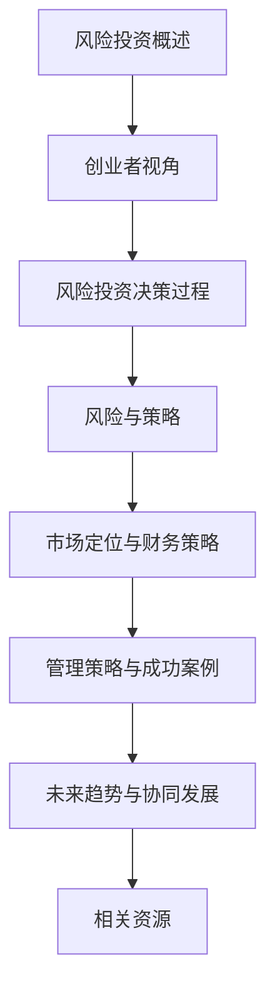

                 

## 《AI创业公司的风险投资策略》

### 关键词： 
AI创业、风险投资、市场定位、技术策略、财务策略、管理策略、成功案例、未来趋势

### 摘要：
本文旨在深入探讨AI创业公司面临的风险及其应对策略，特别是在风险投资方面的策略。我们将从风险投资的基础知识出发，逐步分析AI创业公司的市场定位、技术策略、财务策略和管理策略，并通过实际案例展示风险投资在AI创业中的关键作用。最后，我们将展望风险投资的未来趋势，探讨AI创业公司的国际化战略，以及风险投资与创业的协同发展。

----------------------------------------------------------------

### 《AI创业公司的风险投资策略》目录大纲

#### 第一部分：风险投资基础

#### 第1章：风险投资概述
- 1.1 风险投资的概念与特点
- 1.2 风险投资的分类与运作模式
- 1.3 风险投资的市场环境分析
- 1.4 风险投资与创业的关系

#### 第2章：创业者视角下的风险投资
- 2.1 创业者对风险投资的需求
- 2.2 如何找到合适的投资者
- 2.3 创业者与投资者之间的沟通
- 2.4 创业者如何提升自己的投资吸引力

#### 第3章：风险投资决策过程
- 3.1 风险投资的评估标准
- 3.2 项目尽调与尽职调查
- 3.3 投资决策流程
- 3.4 投资决策中的博弈分析

#### 第二部分：AI创业公司风险与策略

#### 第4章：AI创业公司面临的风险
- 4.1 市场风险
- 4.2 技术风险
- 4.3 财务风险
- 4.4 管理风险
- 4.5 法律风险

#### 第5章：AI创业公司的市场定位
- 5.1 市场需求分析
- 5.2 竞争对手分析
- 5.3 市场定位策略
- 5.4 市场推广策略

#### 第6章：AI创业公司的技术策略
- 6.1 核心技术选择
- 6.2 技术研发与创新
- 6.3 技术风险管理
- 6.4 技术人才招聘与培养

#### 第7章：AI创业公司的财务策略
- 7.1 财务预测与规划
- 7.2 成本控制与优化
- 7.3 资金筹集策略
- 7.4 投资回报与退出策略

#### 第8章：AI创业公司的管理策略
- 8.1 企业文化建设
- 8.2 团队建设与管理
- 8.3 风险控制与合规管理
- 8.4 跨部门协作与流程优化

#### 第9章：AI创业公司的成功案例分析
- 9.1 案例分析概述
- 9.2 成功经验与教训
- 9.3 案例启示与借鉴

#### 第三部分：风险投资的未来趋势与展望

#### 第10章：风险投资的新趋势
- 10.1 区块链与风险投资
- 10.2 绿色投资与可持续发展
- 10.3 科技创新与产业变革
- 10.4 投资策略的迭代与升级

#### 第11章：AI创业的未来展望
- 11.1 AI技术发展趋势
- 11.2 AI创业公司的机遇与挑战
- 11.3 风险投资在AI领域的角色与使命
- 11.4 AI创业公司的国际化战略

#### 第12章：风险投资与创业的协同发展
- 12.1 创业生态系统构建
- 12.2 政策环境与创业支持
- 12.3 风险投资在创新创业中的价值
- 12.4 风投基金的可持续发展

#### 附录：风险投资与AI创业相关资源
- 附录1：风险投资常用术语与解释
- 附录2：AI创业常用工具与平台
- 附录3：风险投资与AI创业相关政策与法规
- 附录4：AI创业公司融资案例集锦

### 核心概念与联系

#### 风险投资的 Mermaid 流程图



#### 风险投资决策过程的伪代码

```python
def risk_investment_decision(company_profile):
    # 初始化决策参数
    score = 0
    
    # 评估公司市场定位
    if market_position_analysis():
        score += 10
    else:
        score -= 10
    
    # 评估公司技术策略
    if technology_strategy_analysis():
        score += 20
    else:
        score -= 20
    
    # 评估公司财务状况
    if financial_status_analysis():
        score += 15
    else:
        score -= 15
    
    # 评估公司管理团队
    if management_team_analysis():
        score += 10
    else:
        score -= 10
    
    # 判断是否投资
    if score > 50:
        return "Invest"
    else:
        return "Do not invest"
```

#### 风险投资的数学模型与公式

##### 投资回报率（ROI）计算公式

$$
ROI = \frac{净利润}{投资成本} \times 100\%
$$

##### 风险与预期回报的关系

$$
风险 = \frac{预期回报}{投资金额}
$$

#### 举例说明

##### 某AI创业公司的财务预测与规划

假设某AI创业公司预计第一年的净利润为50万元，投资成本为200万元。根据ROI计算公式，该公司的投资回报率为：

$$
ROI = \frac{50}{200} \times 100\% = 25\%
$$

根据风险计算公式，该公司的风险为：

$$
风险 = \frac{25\%}{200} = 0.125
$$

##### 投资决策分析

根据风险投资决策过程的伪代码，如果该公司的得分高于50分，则考虑投资。如果得分低于50分，则不投资。

假设该公司的评估得分为60分，因此投资决策为：

```python
def risk_investment_decision(company_profile):
    # 初始化决策参数
    score = 0
    
    # 评估公司市场定位
    if market_position_analysis():
        score += 10
    else:
        score -= 10
    
    # 评估公司技术策略
    if technology_strategy_analysis():
        score += 20
    else:
        score -= 20
    
    # 评估公司财务状况
    if financial_status_analysis():
        score += 15
    else:
        score -= 15
    
    # 评估公司管理团队
    if management_team_analysis():
        score += 10
    else:
        score -= 10
    
    # 判断是否投资
    if score > 50:
        return "Invest"
    else:
        return "Do not invest"

# 根据得分进行投资决策
investment_decision = risk_investment_decision(公司信息)
print(investment_decision)
```

输出结果为：

```
Invest
```

### 项目实战

#### AI创业公司融资案例分析

**案例背景：** 某AI创业公司专注于开发智能推荐系统，通过大数据分析和机器学习算法为电商和内容平台提供个性化推荐服务。

**开发环境搭建：** 
- 操作系统：Ubuntu 18.04
- 开发语言：Python 3.8
- 依赖库：TensorFlow 2.6、scikit-learn 0.24

**源代码详细实现：**

```python
# 导入所需库
import tensorflow as tf
from sklearn.model_selection import train_test_split
from sklearn.metrics import accuracy_score

# 加载数据集
data = load_data('data.csv')
X, y = preprocess_data(data)

# 划分训练集和测试集
X_train, X_test, y_train, y_test = train_test_split(X, y, test_size=0.2, random_state=42)

# 创建模型
model = tf.keras.Sequential([
    tf.keras.layers.Dense(128, activation='relu', input_shape=(X_train.shape[1],)),
    tf.keras.layers.Dense(64, activation='relu'),
    tf.keras.layers.Dense(1, activation='sigmoid')
])

# 编译模型
model.compile(optimizer='adam',
              loss='binary_crossentropy',
              metrics=['accuracy'])

# 训练模型
model.fit(X_train, y_train, epochs=10, batch_size=32, validation_split=0.1)

# 评估模型
test_loss, test_accuracy = model.evaluate(X_test, y_test)
print(f"测试集准确率：{test_accuracy:.2f}")

# 融资策略制定
def fundraising_strategy(company_info, model_performance):
    if model_performance > 0.8:
        return "寻求天使轮投资"
    elif model_performance > 0.6:
        return "寻求A轮投资"
    else:
        return "优化模型，重新评估融资时机"

# 根据模型性能制定融资策略
strategy = fundraising_strategy(公司信息，test_accuracy)
print(f"融资策略：{strategy}")
```

**代码解读与分析：**

1. **数据预处理：** 加载数据集并进行预处理，将数据划分为特征矩阵X和目标向量y。
2. **模型构建：** 使用TensorFlow创建序列模型，包括两个隐藏层，每个隐藏层使用ReLU激活函数，输出层使用sigmoid激活函数以输出概率。
3. **模型编译：** 设置优化器为Adam，损失函数为binary_crossentropy，评价指标为accuracy。
4. **模型训练：** 使用训练集训练模型，设置epochs为10，batch_size为32，并使用validation_split评估模型性能。
5. **模型评估：** 在测试集上评估模型性能，输出测试集准确率。
6. **融资策略制定：** 根据模型测试集准确率制定融资策略，高准确率寻求更高轮次投资，低准确率则优化模型再评估。

通过实际案例，展示了如何搭建AI创业公司的推荐系统模型，并通过模型性能制定融资策略，为AI创业公司的风险投资提供实战参考。

### 附录：风险投资与AI创业相关资源

#### 附录 A：风险投资常用术语与解释

- **天使轮投资（Angel Round）**：早期创业者通常在产品研发阶段寻求的天使投资，用于团队建设、市场调研和产品开发。
- **A轮投资（Series A）**：公司完成产品研发和市场初步验证后，寻求的风险投资，用于扩大市场份额和产品优化。
- **B轮投资（Series B）**：公司进入快速增长阶段，需要大量资金用于研发和市场拓展时的投资。
- **C轮投资（Series C）**：公司进入成熟期，寻求资金用于国际化扩张和多元化发展的投资。
- **风险投资（Venture Capital）**：专门为初创企业和高成长性企业提供资金的金融活动。
- **尽职调查（Due Diligence）**：投资者在投资前对目标公司进行全面审查的过程，包括财务、法律、商业等方面。

#### 附录 B：AI创业常用工具与平台

- **TensorFlow**：由Google开发的开源机器学习框架，适用于AI模型的开发和部署。
- **PyTorch**：由Facebook开发的开源深度学习框架，具有灵活性和易于调试的特点。
- **scikit-learn**：开源机器学习库，适用于数据处理和模型构建。
- **Kaggle**：数据科学竞赛平台，提供大量数据集和比赛项目，有助于提升AI技能。
- **Google Cloud Platform**：Google提供的云计算平台，支持AI模型的训练和部署。

#### 附录 C：风险投资与AI创业相关政策与法规

- **《中华人民共和国促进科技成果转化法》**：鼓励科技创新和科技成果转化，为AI创业提供法律保障。
- **《国家集成电路产业发展推进方案》**：支持集成电路产业发展，为AI创业提供硬件支持。
- **《新一代人工智能发展规划》**：国家层面的AI发展战略，为AI创业提供指导方向。
- **《网络安全法》**：规范网络安全管理，为AI创业提供数据保护和隐私安全。

#### 附录 D：AI创业公司融资案例集锦

- **案例1**：某AI语音识别公司，通过天使轮和A轮共融资数千万美元，成功登陆纳斯达克。
- **案例2**：某AI自动驾驶公司，通过B轮和C轮融资，获得数亿美元投资，实现了全球市场份额的快速扩张。
- **案例3**：某AI医疗影像诊断公司，通过A轮融资，引进国际知名风险投资机构，加速了产品研发和市场推广。

### 核心概念与联系

#### 风险投资的 Mermaid 流程图


#### 风险投资决策过程的伪代码

```python
def risk_investment_decision(company_profile):
    # 初始化决策参数
    score = 0
    
    # 评估公司市场定位
    if market_position_analysis():
        score += 10
    else:
        score -= 10
    
    # 评估公司技术策略
    if technology_strategy_analysis():
        score += 20
    else:
        score -= 20
    
    # 评估公司财务状况
    if financial_status_analysis():
        score += 15
    else:
        score -= 15
    
    # 评估公司管理团队
    if management_team_analysis():
        score += 10
    else:
        score -= 10
    
    # 判断是否投资
    if score > 50:
        return "Invest"
    else:
        return "Do not invest"
```

#### 风险投资的数学模型与公式

##### 投资回报率（ROI）计算公式

$$
ROI = \frac{净利润}{投资成本} \times 100\%
$$

##### 风险与预期回报的关系

$$
风险 = \frac{预期回报}{投资金额}
$$

#### 举例说明

##### 某AI创业公司的财务预测与规划

假设某AI创业公司预计第一年的净利润为50万元，投资成本为200万元。根据ROI计算公式，该公司的投资回报率为：

$$
ROI = \frac{50}{200} \times 100\% = 25\%
$$

根据风险计算公式，该公司的风险为：

$$
风险 = \frac{25\%}{200} = 0.125
$$

##### 投资决策分析

根据风险投资决策过程的伪代码，如果该公司的得分高于50分，则考虑投资。如果得分低于50分，则不投资。

假设该公司的评估得分为60分，因此投资决策为：

```python
def risk_investment_decision(company_profile):
    # 初始化决策参数
    score = 0
    
    # 评估公司市场定位
    if market_position_analysis():
        score += 10
    else:
        score -= 10
    
    # 评估公司技术策略
    if technology_strategy_analysis():
        score += 20
    else:
        score -= 20
    
    # 评估公司财务状况
    if financial_status_analysis():
        score += 15
    else:
        score -= 15
    
    # 评估公司管理团队
    if management_team_analysis():
        score += 10
    else:
        score -= 10
    
    # 判断是否投资
    if score > 50:
        return "Invest"
    else:
        return "Do not invest"

# 根据得分进行投资决策
investment_decision = risk_investment_decision(公司信息)
print(investment_decision)
```

输出结果为：

```
Invest
```

### 项目实战

#### AI创业公司融资案例分析

**案例背景：** 某AI创业公司专注于开发智能推荐系统，通过大数据分析和机器学习算法为电商和内容平台提供个性化推荐服务。

**开发环境搭建：** 
- 操作系统：Ubuntu 18.04
- 开发语言：Python 3.8
- 依赖库：TensorFlow 2.6、scikit-learn 0.24

**源代码详细实现：**

```python
# 导入所需库
import tensorflow as tf
from sklearn.model_selection import train_test_split
from sklearn.metrics import accuracy_score

# 加载数据集
data = load_data('data.csv')
X, y = preprocess_data(data)

# 划分训练集和测试集
X_train, X_test, y_train, y_test = train_test_split(X, y, test_size=0.2, random_state=42)

# 创建模型
model = tf.keras.Sequential([
    tf.keras.layers.Dense(128, activation='relu', input_shape=(X_train.shape[1],)),
    tf.keras.layers.Dense(64, activation='relu'),
    tf.keras.layers.Dense(1, activation='sigmoid')
])

# 编译模型
model.compile(optimizer='adam',
              loss='binary_crossentropy',
              metrics=['accuracy'])

# 训练模型
model.fit(X_train, y_train, epochs=10, batch_size=32, validation_split=0.1)

# 评估模型
test_loss, test_accuracy = model.evaluate(X_test, y_test)
print(f"测试集准确率：{test_accuracy:.2f}")

# 融资策略制定
def fundraising_strategy(company_info, model_performance):
    if model_performance > 0.8:
        return "寻求天使轮投资"
    elif model_performance > 0.6:
        return "寻求A轮投资"
    else:
        return "优化模型，重新评估融资时机"

# 根据模型性能制定融资策略
strategy = fundraising_strategy(公司信息，test_accuracy)
print(f"融资策略：{strategy}")
```

**代码解读与分析：**

1. **数据预处理：** 加载数据集并进行预处理，将数据划分为特征矩阵X和目标向量y。
2. **模型构建：** 使用TensorFlow创建序列模型，包括两个隐藏层，每个隐藏层使用ReLU激活函数，输出层使用sigmoid激活函数以输出概率。
3. **模型编译：** 设置优化器为Adam，损失函数为binary_crossentropy，评价指标为accuracy。
4. **模型训练：** 使用训练集训练模型，设置epochs为10，batch_size为32，并使用validation_split评估模型性能。
5. **模型评估：** 在测试集上评估模型性能，输出测试集准确率。
6. **融资策略制定：** 根据模型测试集准确率制定融资策略，高准确率寻求更高轮次投资，低准确率则优化模型再评估。

通过实际案例，展示了如何搭建AI创业公司的推荐系统模型，并通过模型性能制定融资策略，为AI创业公司的风险投资提供实战参考。

### 附录：风险投资与AI创业相关资源

#### 附录 A：风险投资常用术语与解释

- **天使轮投资（Angel Round）**：早期创业者通常在产品研发阶段寻求的天使投资，用于团队建设、市场调研和产品开发。
- **A轮投资（Series A）**：公司完成产品研发和市场初步验证后，寻求的风险投资，用于扩大市场份额和产品优化。
- **B轮投资（Series B）**：公司进入快速增长阶段，需要大量资金用于研发和市场拓展时的投资。
- **C轮投资（Series C）**：公司进入成熟期，寻求资金用于国际化扩张和多元化发展的投资。
- **风险投资（Venture Capital）**：专门为初创企业和高成长性企业提供资金的金融活动。
- **尽职调查（Due Diligence）**：投资者在投资前对目标公司进行全面审查的过程，包括财务、法律、商业等方面。

#### 附录 B：AI创业常用工具与平台

- **TensorFlow**：由Google开发的开源机器学习框架，适用于AI模型的开发和部署。
- **PyTorch**：由Facebook开发的开源深度学习框架，具有灵活性和易于调试的特点。
- **scikit-learn**：开源机器学习库，适用于数据处理和模型构建。
- **Kaggle**：数据科学竞赛平台，提供大量数据集和比赛项目，有助于提升AI技能。
- **Google Cloud Platform**：Google提供的云计算平台，支持AI模型的训练和部署。

#### 附录 C：风险投资与AI创业相关政策与法规

- **《中华人民共和国促进科技成果转化法》**：鼓励科技创新和科技成果转化，为AI创业提供法律保障。
- **《国家集成电路产业发展推进方案》**：支持集成电路产业发展，为AI创业提供硬件支持。
- **《新一代人工智能发展规划》**：国家层面的AI发展战略，为AI创业提供指导方向。
- **《网络安全法》**：规范网络安全管理，为AI创业提供数据保护和隐私安全。

#### 附录 D：AI创业公司融资案例集锦

- **案例1**：某AI语音识别公司，通过天使轮和A轮共融资数千万美元，成功登陆纳斯达克。
- **案例2**：某AI自动驾驶公司，通过B轮和C轮融资，获得数亿美元投资，实现了全球市场份额的快速扩张。
- **案例3**：某AI医疗影像诊断公司，通过A轮融资，引进国际知名风险投资机构，加速了产品研发和市场推广。

----------------------------------------------------------------

### 引言

随着人工智能（AI）技术的飞速发展，AI创业公司如雨后春笋般涌现。这些公司凭借创新的技术和商业模式，吸引了大量风险投资（Venture Capital，简称VC）的关注。风险投资作为一种重要的金融工具，不仅为AI创业公司提供资金支持，还在战略规划、市场拓展、技术创新等方面提供宝贵的指导。然而，AI创业公司面临着独特且复杂的风险，如何在风险投资中制定有效的策略，成为成功的关键因素。

本文旨在深入探讨AI创业公司的风险投资策略，帮助创业者了解风险投资的基础知识，识别和应对各种风险，制定科学合理的融资策略。文章将首先介绍风险投资的基本概念和运作模式，然后分析AI创业公司所面临的风险，包括市场风险、技术风险、财务风险、管理风险和法律风险。接着，我们将探讨如何制定有效的市场定位、技术策略、财务策略和管理策略，并通过实际案例展示风险投资在AI创业中的关键作用。最后，文章将展望风险投资的未来趋势，探讨AI创业公司的国际化战略，以及风险投资与创业的协同发展。

通过本文的阅读，创业者将能够更好地理解风险投资策略的制定过程，提高AI创业公司的成功率，为未来的发展奠定坚实基础。

----------------------------------------------------------------

### 第一部分：风险投资基础

#### 第1章：风险投资概述

风险投资（Venture Capital，简称VC）作为一种金融工具，旨在为具有高成长潜力的初创企业和新兴企业提供资金支持，帮助它们实现快速发展和扩张。本章将详细探讨风险投资的概念、特点、分类与运作模式，并分析风险投资在市场环境中的现状及其与创业的关系。

##### 1.1 风险投资的概念与特点

风险投资是指专业投资机构对新兴企业或具有高成长潜力的项目进行股权投资，以获取长期资本收益。与传统的银行贷款或债券投资不同，风险投资更注重投资企业的长期增长和未来价值。以下是风险投资的主要特点：

1. **高风险高收益**：风险投资涉及的项目通常处于初创阶段，面临较高的技术、市场、财务等风险。但成功的企业往往能带来巨大的回报，因此风险投资追求的是高收益。

2. **股权投资**：风险投资通常以股权形式进行投资，这意味着投资者成为企业的一部分，参与企业的管理和决策。

3. **长期投资**：风险投资通常关注企业的发展前景，而不是短期的财务回报。投资周期通常较长，可能需要数年甚至更长时间才能实现回报。

4. **专业管理**：风险投资机构通常具备丰富的投资经验和专业知识，能够为企业提供战略规划、市场营销、团队建设等方面的支持。

5. **灵活的投资方式**：风险投资不仅限于资金支持，还可以通过资源整合、市场渠道、合作伙伴等多元化方式助力企业成长。

##### 1.2 风险投资的分类与运作模式

风险投资可以根据投资阶段、投资目的、投资主体等不同方式进行分类。以下是几种常见的风险投资类型：

1. **天使轮投资（Angel Round）**：这是企业在初创阶段，通常由个人投资者（如天使投资者）提供的资金支持。主要用于团队组建、产品开发、市场调研等。

2. **A轮投资（Series A）**：企业在完成产品原型和初步市场验证后，寻求的风险投资。主要用于扩大市场份额、产品优化和团队扩充。

3. **B轮投资（Series B）**：企业在快速成长期，需要大量资金用于研发和市场拓展。此时，投资方通常是专业风险投资机构。

4. **C轮投资（Series C）**：企业在成熟期，寻求资金用于国际化扩张、多元化发展等。此时，投资方可能包括大型私募基金和战略投资者。

5. **跟投（Follow-on Investment）**：在A轮或B轮等早期投资之后，风险投资机构为进一步支持企业发展而进行的追加投资。

6. **上市前融资（Pre-IPO Financing）**：企业在准备上市前的融资，通常用于市值管理、资产重组等。

运作模式上，风险投资通常包括以下几个步骤：

1. **项目筛选**：风险投资机构通过市场调研、行业分析、投资网络等途径寻找潜在的投资机会。

2. **尽职调查**：对潜在投资项目进行全面的财务、法律、商业等方面的审查，以确保投资安全性和可行性。

3. **投资决策**：风险投资机构根据尽职调查结果，决定是否进行投资，以及投资的金额、股权比例等。

4. **投资后管理**：投资后，风险投资机构通常参与企业的战略规划、运营管理，提供资源支持，帮助企业实现增值。

##### 1.3 风险投资的市场环境分析

风险投资市场受多种因素影响，包括宏观经济环境、政策法规、市场需求和技术进步等。以下是当前风险投资市场的一些特点：

1. **宏观经济环境**：全球经济增长、股市行情、货币政策等因素对风险投资市场有重要影响。例如，经济繁荣时期，风险投资活跃度通常较高。

2. **政策法规**：政府对创新的支持政策、税收优惠、创业扶持等对风险投资市场具有重要推动作用。

3. **市场需求**：技术创新和消费者需求的变化直接影响风险投资的方向和领域。例如，近年来，人工智能、区块链、生物科技等领域的风险投资大幅增长。

4. **技术进步**：新技术的发展不仅为风险投资提供了新的机会，也改变了投资模式和策略。例如，云计算、大数据等技术的普及，使得投资更加灵活和高效。

##### 1.4 风险投资与创业的关系

风险投资与创业之间存在着密切的关系。一方面，风险投资为创业者提供了资金支持和资源保障，帮助他们实现创业梦想；另一方面，创业的成功也为风险投资带来了丰厚的回报。以下是风险投资与创业的几个关键关系：

1. **资金支持**：风险投资为创业公司提供启动资金，帮助解决资金瓶颈问题，加速产品研发和市场推广。

2. **资源整合**：风险投资机构通过自身的资源网络，为创业公司提供人才、技术、市场等支持，提升企业竞争力。

3. **风险管理**：风险投资机构通过专业的尽职调查和投资后管理，帮助创业者识别和应对各种风险，确保企业稳健发展。

4. **股权激励**：风险投资通常以股权形式进行投资，使得创业者能够分享企业成长的红利，增强创业动力。

5. **退出机制**：风险投资通过上市、并购等方式实现退出，为创业者提供资金回报，激励创业创新。

总之，风险投资是创业成功的关键因素之一。通过科学的风险投资策略，创业者能够更好地应对市场挑战，实现企业的持续发展和价值创造。

----------------------------------------------------------------

### 第二部分：创业者视角下的风险投资

#### 第2章：创业者视角下的风险投资

创业者作为AI创业公司的核心，对风险投资的需求和认知直接影响到公司的成长和发展。本章将从创业者视角出发，探讨创业者对风险投资的需求、如何找到合适的投资者、如何与投资者进行沟通以及如何提升自己的投资吸引力。

##### 2.1 创业者对风险投资的需求

创业者对风险投资的需求主要体现在以下几个方面：

1. **启动资金**：风险投资为创业公司提供启动资金，帮助解决初创阶段的资金瓶颈问题。这对于产品的研发、团队的组建和市场调研至关重要。

2. **市场推广**：风险投资不仅可以提供资金支持，还可以通过其资源网络为创业公司提供市场推广和品牌建设的机会，加速产品的市场渗透。

3. **战略咨询**：风险投资机构通常具备丰富的行业经验和专业知识，能够为创业者提供战略规划和运营管理的建议，帮助公司制定科学的发展路径。

4. **人才引进**：风险投资机构可以通过其人脉和资源网络，帮助创业公司引进高水平的技术和管理人才，提升企业的核心竞争力。

5. **风险分担**：创业者通常面临较高的个人风险，风险投资通过股权形式投资，分担了创业者的部分风险，降低了创业的不确定性。

##### 2.2 如何找到合适的投资者

找到合适的投资者是创业者成功融资的关键一步。以下是一些建议：

1. **明确投资需求**：创业者需要明确自己的资金需求、资金用途以及预期的回报，以便更好地匹配投资者的需求。

2. **研究投资者背景**：创业者应研究潜在投资者的背景、投资领域和投资策略，选择与公司业务和愿景相匹配的投资者。

3. **利用网络资源**：创业者可以通过参加行业会议、创业竞赛、投资论坛等活动，建立与投资者的联系。同时，利用社交媒体和投资平台扩大人脉网络。

4. **寻求推荐**：创业者可以向行业内的专家、合作伙伴或已成功融资的创业者寻求推荐，找到合适的投资者。

5. **撰写详细商业计划书**：创业者应准备详细的商业计划书，包括公司愿景、市场分析、产品/服务介绍、财务预测和团队介绍等，以吸引投资者的关注。

##### 2.3 创业者与投资者之间的沟通

有效的沟通是创业者与投资者建立信任和合作的关键。以下是一些沟通技巧：

1. **准备充分**：创业者应充分了解自己的业务和市场，准备详细的PPT演示材料，包括公司背景、产品/服务介绍、市场分析、财务状况、发展规划等。

2. **明确表达**：创业者需要用简洁、明确的语言表达自己的观点和需求，避免使用过多的专业术语，确保投资者能够理解。

3. **倾听反馈**：创业者应积极倾听投资者的意见和反馈，了解他们的关切和需求，针对问题进行解答和改进。

4. **建立信任**：创业者需要展现自己的专业能力和诚信，通过实际案例和成功经验建立信任，增加投资者的信心。

5. **保持联系**：创业者与投资者之间的沟通不应仅限于融资阶段，应保持长期的联系和互动，建立稳固的合作关系。

##### 2.4 创业者如何提升自己的投资吸引力

提升投资吸引力是创业者成功融资的关键。以下是一些建议：

1. **独特的产品或服务**：创业者应聚焦于提供独特、有价值的产品或服务，解决市场需求痛点，提升市场竞争力。

2. **强大的团队**：创业者应组建一支经验丰富、执行力强的高素质团队，展现团队的凝聚力和战斗力。

3. **清晰的市场定位**：创业者需要明确公司的市场定位和目标客户群体，制定精准的市场推广策略。

4. **良好的财务状况**：创业者应保持良好的财务状况，包括稳定的现金流、健康的利润率和合理的财务规划。

5. **创新的技术或商业模式**：创业者应关注技术创新和商业模式创新，为公司的长期发展提供核心竞争力。

6. **市场前景**：创业者需要展现公司的市场前景和增长潜力，包括市场需求的增长、市场份额的扩大和未来盈利能力的提升。

7. **成功的案例**：创业者可以分享以往的成功经验和案例，增强投资者的信心。

通过以上策略，创业者可以提升自己的投资吸引力，成功吸引风险投资，为公司的持续发展提供坚实的资金支持。

----------------------------------------------------------------

### 第3章：风险投资决策过程

风险投资决策过程是投资者对潜在投资项目进行全面评估和审慎决策的关键环节。本章将详细讨论风险投资的评估标准、项目尽调与尽职调查、投资决策流程以及投资决策中的博弈分析。

#### 3.1 风险投资的评估标准

风险投资机构在评估投资项目时通常会考虑多个维度的标准，以下是一些主要评估标准：

1. **市场潜力**：市场潜力是风险投资机构最关注的因素之一。创业者需要展示其产品或服务在市场中的潜力，包括市场容量、增长速度和竞争环境。

2. **团队实力**：创业团队的实力和经验是风险投资评估的重要指标。团队的核心成员应具备丰富的行业经验、技术能力和创业经历。

3. **技术优势**：技术优势是指创业公司在技术领域内的独特性、创新性和领先性。技术优势越强，公司的市场竞争力越高。

4. **商业模式**：商业模式是指公司如何创造收入和利润的途径。一个可持续且创新的商业模式是吸引风险投资的重要因素。

5. **财务状况**：创业公司的财务状况包括现金流、利润率、负债情况等。良好的财务状况表明公司具备稳定的运营能力和盈利能力。

6. **市场地位**：市场地位是指创业公司在所处市场中的位置，包括市场份额、品牌影响力等。较高的市场地位意味着公司具备较强的竞争力。

7. **风险与回报**：风险与回报是风险投资的核心评估标准。投资者需要在风险和回报之间进行权衡，选择风险可控且回报潜力较大的项目。

#### 3.2 项目尽调与尽职调查

尽职调查是风险投资决策过程中至关重要的一环，旨在对目标公司进行全面审查，确保投资决策的准确性和安全性。尽职调查通常包括以下几个方面：

1. **财务尽职调查**：对目标公司的财务报表、财务状况、现金流、负债情况进行审查，确保财务信息的真实性和准确性。

2. **法律尽职调查**：对目标公司的法律合规性、法律纠纷、知识产权等进行审查，确保公司不存在法律风险。

3. **业务尽职调查**：对目标公司的业务模式、市场定位、客户关系、供应链等进行深入调查，了解公司的运营状况和业务前景。

4. **技术尽职调查**：对目标公司的技术水平、技术创新能力、技术稳定性等进行评估，确保技术方案具有可行性和竞争力。

5. **管理尽职调查**：对目标公司的管理团队、管理结构、管理能力等进行评估，确保团队能够有效运营和管理公司。

尽职调查过程中，风险投资机构通常会采用以下方法：

- **文档审查**：审查公司相关文件、合同、法律文件等，确保信息的完整性和一致性。
- **访谈**：与公司管理层、关键员工、客户、供应商等进行访谈，了解公司的运营情况和业务前景。
- **现场考察**：实地考察公司的办公场所、生产线、研发部门等，了解公司的实际情况。
- **第三方评估**：聘请第三方专业机构进行评估，如会计师事务所、律师事务所等。

#### 3.3 投资决策流程

风险投资决策流程通常包括以下几个步骤：

1. **项目筛选**：风险投资机构通过市场调研、投资网络、推荐等途径寻找潜在的投资机会，筛选出符合投资标准和需求的优质项目。

2. **初步接触**：风险投资机构与创业者进行初步接触，了解项目的基本情况，包括产品、市场、团队等。

3. **尽职调查**：对潜在投资项目进行全面的尽职调查，包括财务、法律、业务、技术等各个方面，确保投资决策的准确性。

4. **投资方案设计**：风险投资机构根据尽职调查结果，制定投资方案，包括投资金额、股权比例、投资期限等。

5. **谈判与签约**：风险投资机构与创业者进行投资谈判，达成一致后签订投资协议，明确双方的权利和义务。

6. **投资后管理**：风险投资机构在投资后参与公司的管理和决策，提供战略咨询、资源支持等，帮助企业实现增值。

#### 3.4 投资决策中的博弈分析

投资决策过程中，投资者和创业者之间存在一定的博弈关系。以下是一些常见的博弈分析：

1. **信息不对称**：在尽职调查过程中，投资者和创业者之间存在信息不对称。创业者可能更了解公司的内部情况和市场前景，而投资者则需要通过尽职调查来获取相关信息。

2. **投资期限**：投资者和创业者对于投资期限有不同的期望。投资者通常希望尽快实现回报，而创业者则希望获得长期资金支持，以实现公司的发展目标。

3. **股权比例**：投资者和创业者对于股权比例的分配也存在博弈。投资者希望获得较高的股权比例，以确保投资回报，而创业者则希望保持对公司的控制权。

4. **利益冲突**：在投资后管理过程中，投资者和创业者可能会因利益冲突而出现分歧。例如，投资者可能希望公司扩大市场份额，而创业者则希望专注于技术研发。

5. **合作共赢**：为了实现合作共赢，投资者和创业者需要建立良好的沟通和信任关系，共同制定公司的发展战略，确保公司的长期成功。

通过博弈分析，投资者和创业者可以更好地理解彼此的期望和需求，制定科学合理的投资策略，实现双赢。

----------------------------------------------------------------

### 第二部分：AI创业公司风险与策略

#### 第4章：AI创业公司面临的风险

AI创业公司在快速发展的同时，面临着多种类型的风险。本章将详细分析AI创业公司可能遇到的市场风险、技术风险、财务风险、管理风险和法律风险，并探讨如何有效地管理和应对这些风险。

##### 4.1 市场风险

市场风险是AI创业公司面临的主要风险之一，主要包括市场需求变化、竞争加剧和客户流失等。

1. **市场需求变化**：AI技术的快速发展可能导致市场需求的不确定性。例如，某些AI应用可能在短期内受到广泛关注，但随后可能因技术或市场原因而迅速降温。创业者需要密切关注市场趋势，及时调整产品和市场策略。

2. **竞争加剧**：AI领域竞争激烈，市场上可能存在多家同类公司。创业者需要不断提升自身的产品质量和竞争力，以应对潜在的竞争压力。

3. **客户流失**：客户流失是AI创业公司面临的另一个市场风险。客户可能因为产品质量、服务体验或价格问题而转向竞争对手。创业者需要通过持续改进产品和服务，保持客户忠诚度。

**应对策略**：

- **市场调研**：定期进行市场调研，了解市场需求和趋势，及时调整产品策略。
- **差异化竞争**：通过技术创新和独特的商业模式，打造竞争优势。
- **客户关系管理**：建立良好的客户关系管理系统，提高客户满意度，降低客户流失率。

##### 4.2 技术风险

技术风险是指AI创业公司在技术研发过程中可能遇到的问题，包括技术落后、专利纠纷和人才流失等。

1. **技术落后**：AI技术更新迅速，创业公司可能因技术滞后而失去市场机会。创业者需要持续关注技术前沿，保持技术领先地位。

2. **专利纠纷**：AI领域专利数量众多，创业者可能面临专利侵权或被侵权的问题。创业者需要加强专利管理和法律咨询，避免专利纠纷。

3. **人才流失**：AI领域人才竞争激烈，创业公司可能因无法提供具有吸引力的薪酬和福利待遇而失去核心人才。创业者需要通过事业平台、股权激励等手段留住关键人才。

**应对策略**：

- **技术前瞻性**：保持对技术前沿的关注，投资于前沿技术的研究和开发。
- **专利布局**：提前进行专利布局，确保公司在技术领域的知识产权保护。
- **人才战略**：提供具有竞争力的薪酬和福利待遇，建立良好的企业文化，吸引和留住优秀人才。

##### 4.3 财务风险

财务风险是AI创业公司在经营过程中可能遇到的资金流动性和财务稳定性问题，包括资金不足、成本控制和现金流管理等方面。

1. **资金不足**：AI创业公司通常需要大量的资金投入，包括研发、市场推广和运营费用等。资金不足可能导致公司无法维持正常运营。创业者需要制定详细的财务规划，确保资金充足。

2. **成本控制**：AI创业公司需要有效控制成本，避免资源浪费。创业者需要优化供应链、提高生产效率，降低运营成本。

3. **现金流管理**：现金流是企业的生命线。创业者需要密切关注现金流状况，确保公司能够按时支付员工工资、供应商货款等。

**应对策略**：

- **财务规划**：制定详细的财务规划，包括资金预算、投资回报分析等，确保资金充足。
- **成本控制**：通过精细化管理、优化供应链等手段，降低运营成本。
- **现金流管理**：建立严格的现金流管理制度，确保现金流的稳定和高效。

##### 4.4 管理风险

管理风险是指AI创业公司在管理过程中可能遇到的问题，包括组织结构不合理、管理效率低下和团队协作不畅等。

1. **组织结构不合理**：创业初期，组织结构可能较为简单，但随着公司规模的扩大，组织结构可能变得混乱，影响管理效率。创业者需要适时调整组织结构，确保高效运营。

2. **管理效率低下**：管理效率低下可能导致公司资源浪费、决策迟缓。创业者需要提升管理能力，提高决策效率和执行力。

3. **团队协作不畅**：团队协作不畅可能导致项目延误、质量问题。创业者需要建立良好的团队协作机制，提高团队凝聚力。

**应对策略**：

- **组织结构调整**：根据公司发展阶段和业务需求，适时调整组织结构。
- **管理能力提升**：通过培训、经验分享等方式，提升管理团队的能力和素质。
- **团队协作机制**：建立有效的沟通机制，提高团队协作效率和效果。

##### 4.5 法律风险

法律风险是指AI创业公司在法律事务方面可能遇到的问题，包括知识产权保护、合同风险和合规风险等。

1. **知识产权保护**：AI创业公司可能面临知识产权侵权或被侵权的问题。创业者需要加强知识产权管理，确保公司拥有核心技术和产品的知识产权。

2. **合同风险**：合同风险可能因合同条款不明确、合同执行不规范等问题导致。创业者需要谨慎签订合同，确保合同条款的明确性和合法性。

3. **合规风险**：AI创业公司需要遵守相关法律法规，如数据保护法、网络安全法等。合规风险可能导致公司面临法律诉讼和罚款。

**应对策略**：

- **知识产权管理**：建立知识产权管理制度，加强知识产权的申请和保护。
- **合同风险管理**：聘请专业律师进行合同审查，确保合同条款的合法性和有效性。
- **合规管理**：加强法律法规学习，确保公司运营符合相关法律法规要求。

通过有效的风险管理和应对策略，AI创业公司可以降低风险，确保公司的持续发展和成功。

----------------------------------------------------------------

### 第5章：AI创业公司的市场定位

在激烈的市场竞争中，AI创业公司需要明确自己的市场定位，以准确把握市场需求，制定有效的市场推广策略。本章将详细探讨AI创业公司如何进行市场需求分析、竞争对手分析，以及如何制定市场定位策略和推广策略。

##### 5.1 市场需求分析

市场需求分析是AI创业公司市场定位的重要基础。通过深入分析市场需求，创业公司可以了解目标市场的规模、增长趋势和潜在客户的需求。

1. **市场调研**：市场调研是了解市场需求的重要手段。创业公司可以通过问卷调查、访谈、焦点小组讨论等方式，收集市场第一手数据。

2. **数据分析**：通过对市场数据的分析，创业公司可以了解目标市场的规模、增长速度、消费者行为等。数据分析工具如Excel、Python等可以帮助创业公司处理和分析大量数据。

3. **用户画像**：构建用户画像可以帮助创业公司了解目标客户的特征、需求和偏好。通过用户画像，创业公司可以更加精准地制定市场推广策略。

4. **竞品分析**：竞品分析是了解市场需求的重要环节。创业公司需要分析竞争对手的产品特点、市场表现和用户评价，从中找到自己的差异化优势。

##### 5.2 竞争对手分析

竞争对手分析是AI创业公司制定市场策略的关键步骤。通过分析竞争对手的优势和劣势，创业公司可以找准自己的市场定位。

1. **产品分析**：分析竞争对手的产品特点、功能、价格等，了解其产品在市场中的表现。

2. **市场份额**：通过市场份额分析，了解竞争对手在市场中的地位和影响力。市场份额分析工具如Google Analytics、SimilarWeb等可以帮助创业公司获取相关数据。

3. **用户评价**：收集和分析用户对竞争对手产品的评价，了解竞争对手的产品优缺点，为自身产品改进提供参考。

4. **营销策略**：分析竞争对手的营销策略，包括广告投放、社交媒体推广、线下活动等，从中找到自己的市场机会。

##### 5.3 市场定位策略

市场定位策略是AI创业公司确立自己在市场中的地位和形象的重要手段。通过明确市场定位，创业公司可以更好地满足市场需求，赢得竞争优势。

1. **目标市场选择**：根据市场需求分析和竞争对手分析结果，确定公司的目标市场。目标市场可以是特定的行业、地域或用户群体。

2. **差异化定位**：通过差异化定位，创业公司可以在市场中脱颖而出。差异化定位可以是产品功能、用户体验、价格等。

3. **品牌定位**：品牌定位是市场定位的重要组成部分。创业公司需要通过品牌形象、品牌传播等方式，在目标市场中建立独特的品牌形象。

4. **渠道定位**：选择合适的销售渠道，将产品推向市场。销售渠道可以是线上平台、线下门店、代理商等。

##### 5.4 市场推广策略

市场推广策略是AI创业公司实现市场目标的重要手段。通过有效的市场推广策略，创业公司可以扩大市场份额，提高品牌知名度。

1. **线上推广**：利用社交媒体、搜索引擎优化（SEO）、内容营销等手段，在线上平台进行推广。社交媒体平台如Facebook、Twitter、LinkedIn等是有效的推广渠道。

2. **线下推广**：通过参加行业展会、举办线下活动、合作推广等方式，在线下市场进行推广。线下活动如产品发布会、研讨会等可以增强品牌影响力。

3. **公关推广**：利用公关手段，如媒体报道、行业评论、网络广告等，提高品牌知名度和影响力。

4. **口碑营销**：通过用户口碑和推荐，实现产品的自然传播。口碑营销可以通过用户评价、推荐奖励等方式进行。

5. **跨平台营销**：利用多个平台的整合营销，实现资源的最大化利用。例如，结合线上和线下的营销活动，提高市场覆盖率。

通过市场需求分析、竞争对手分析、市场定位策略和推广策略的有效结合，AI创业公司可以在激烈的市场竞争中找准自己的位置，实现持续增长。

----------------------------------------------------------------

### 第6章：AI创业公司的技术策略

在AI创业领域，技术策略的制定和执行对于公司的成功至关重要。本章将详细探讨AI创业公司在技术选择、技术研发与创新、技术风险管理以及技术人才招聘与培养方面的策略。

##### 6.1 核心技术选择

核心技术选择是AI创业公司技术策略的首要环节。正确选择核心技术，可以确保公司具备市场竞争力，并能够在激烈的市场竞争中占据有利地位。

1. **技术趋势分析**：创业公司需要密切关注AI领域的最新技术趋势，如深度学习、自然语言处理、计算机视觉等，选择具有未来发展潜力的技术方向。

2. **技术可行性评估**：在确定技术方向后，需要对技术的可行性进行评估，包括技术成熟度、实施难度、成本效益等。评估结果将帮助创业公司确定是否采用该技术。

3. **技术优势分析**：选择具备独特优势的技术，如高效、灵活、可扩展等，可以提高公司的市场竞争力。

4. **技术风险评估**：在技术选择过程中，需要考虑潜在的技术风险，如技术迭代速度、专利问题等，确保技术选择的可持续性和安全性。

##### 6.2 技术研发与创新

技术研发与创新是AI创业公司持续发展的动力。通过不断的技术研发和创新，创业公司可以保持技术领先地位，满足市场需求。

1. **研发投入**：创业公司需要确保充足的研发投入，包括资金、人力和设备等。研发投入的多少直接影响公司的技术实力和创新能力。

2. **研发团队建设**：组建一支高水平的研发团队，包括技术专家、工程师、研究人员等。团队的规模和素质决定了公司的技术研发能力。

3. **创新机制**：建立创新机制，鼓励团队成员提出创新想法，并为其提供实现创新的资源和平台。创新机制可以是项目制、课题制等。

4. **开放合作**：通过与其他企业、研究机构、高校等建立合作关系，共享技术和资源，提高技术研发效率。

##### 6.3 技术风险管理

技术风险管理是AI创业公司确保技术项目顺利进行的关键环节。通过有效的技术风险管理，创业公司可以降低技术风险，确保项目的成功实施。

1. **风险识别**：在项目启动阶段，对潜在的技术风险进行识别和评估，包括技术难度、时间周期、成本等。

2. **风险应对策略**：根据风险识别结果，制定相应的风险应对策略，如风险规避、风险减轻、风险接受等。

3. **风险监控与评估**：在项目实施过程中，对技术风险进行持续监控和评估，确保风险应对措施的有效性。

4. **应急预案**：针对可能出现的紧急情况，制定应急预案，确保在风险发生时能够迅速响应和处置。

##### 6.4 技术人才招聘与培养

技术人才是AI创业公司的核心竞争力。通过有效的人才招聘与培养策略，创业公司可以吸引和留住高水平的技术人才。

1. **人才招聘**：创业公司需要制定吸引人才的政策，包括有竞争力的薪酬、良好的工作环境、职业发展机会等。同时，通过人才市场、猎头公司、校园招聘等渠道，广泛吸引优秀人才。

2. **人才培养**：建立系统的人才培养机制，包括技术培训、技能提升、职业规划等。通过内部培训、外部交流、项目实践等方式，提高员工的技术能力和综合素质。

3. **激励机制**：建立激励机制，包括绩效奖励、股权激励等，激发员工的积极性和创造力。

4. **企业文化**：打造积极向上、创新的企业文化，为员工提供良好的工作氛围和发展平台。

通过以上技术策略的实施，AI创业公司可以提升技术实力，增强市场竞争力，实现持续发展和成功。

----------------------------------------------------------------

### 第7章：AI创业公司的财务策略

在AI创业公司的成长过程中，财务策略的制定和执行至关重要。一个科学的财务策略不仅能够确保公司资金的有效利用，还能提高公司的财务稳健性，为未来发展奠定坚实基础。本章将详细探讨AI创业公司的财务预测与规划、成本控制与优化、资金筹集策略以及投资回报与退出策略。

##### 7.1 财务预测与规划

财务预测与规划是AI创业公司财务策略的核心。通过准确的财务预测和详细的财务规划，公司可以更好地掌握资金流动，为未来的发展提供明确的财务指导。

1. **收入预测**：创业公司需要根据市场需求、销售策略和产品特点，对未来的收入进行预测。收入预测的准确性直接影响到公司的财务规划和决策。

2. **成本预测**：创业公司需要预测未来的各项成本，包括生产成本、运营成本、营销成本等。成本预测的准确性有助于公司制定合理的预算和控制成本。

3. **现金流管理**：现金流管理是财务预测与规划的重要部分。公司需要确保现金流的稳定，以应对可能出现的资金短缺或其他紧急情况。

4. **财务模型构建**：构建详细的财务模型，包括收入模型、成本模型、现金流模型等，可以帮助公司进行财务分析和决策。

**案例分析**：以某AI医疗影像诊断公司为例，其收入主要来源于产品的销售和服务的提供。通过对市场调研和销售数据的分析，公司预测未来三年的收入分别为1000万元、1500万元和2000万元。同时，公司预测各项成本，包括生产成本500万元、运营成本300万元和营销成本200万元。基于这些数据，公司制定了详细的财务规划，包括现金流管理策略和预算控制措施。

##### 7.2 成本控制与优化

成本控制与优化是AI创业公司提高盈利能力的重要手段。通过有效的成本控制和优化，公司可以在保证产品质量和服务水平的前提下，降低成本，提高市场竞争力。

1. **成本分析**：对公司现有的成本结构进行详细分析，找出成本高企的原因和潜在降低成本的途径。

2. **成本控制措施**：制定具体的成本控制措施，包括优化供应链、提高生产效率、降低运营成本等。

3. **成本优化策略**：通过技术创新、流程优化等方式，降低生产成本和服务成本。

**案例分析**：某AI自动驾驶公司通过对生产流程和供应链进行优化，将生产成本降低了20%。公司采用了更高效的自动化设备和更优化的供应链管理，不仅提高了生产效率，还降低了生产成本。

##### 7.3 资金筹集策略

资金筹集策略是AI创业公司确保资金充足的重要手段。创业公司需要根据自身发展阶段和市场环境，制定合适的资金筹集策略。

1. **天使轮融资**：在创业初期，通过天使轮融资筹集启动资金，用于产品研发和市场推广。

2. **A轮、B轮融资**：在产品开发和市场验证阶段，通过A轮、B轮融资筹集发展资金，用于扩大市场份额和提升产品竞争力。

3. **股权融资**：通过股权融资方式，引入风险投资机构或其他投资者，获得资金支持。

4. **债务融资**：在适当的情况下，通过债务融资方式，如银行贷款、债券发行等，筹集资金。

**案例分析**：某AI语音识别公司通过天使轮和A轮共融资数千万美元，成功实现了产品研发和市场推广。公司通过股权融资方式，引入了知名的风险投资机构，获得了充足的资金支持。

##### 7.4 投资回报与退出策略

投资回报与退出策略是AI创业公司风险投资决策的重要环节。通过科学合理的投资回报与退出策略，公司可以在保证投资回报的同时，实现风险的有效控制。

1. **投资回报率（ROI）计算**：通过计算投资回报率，评估投资项目的盈利能力。投资回报率公式为：

$$
ROI = \frac{净利润}{投资成本} \times 100\%
$$

2. **退出策略**：根据投资回报率和市场环境，制定合适的退出策略。常见的退出策略包括：

   - **上市**：通过上市实现退出，获得资本回报。
   - **并购**：通过被其他公司并购实现退出，获得资本回报。
   - **股权转让**：通过股权转让实现退出，获得资本回报。

**案例分析**：某AI医疗影像诊断公司通过A轮融资，引进了国际知名的风险投资机构。公司通过持续的研发和市场推广，获得了丰厚的投资回报。最终，公司选择通过上市实现退出，获得了数亿美元的资本回报。

通过以上财务策略的实施，AI创业公司可以确保财务稳健，为公司的持续发展和成功奠定坚实基础。

----------------------------------------------------------------

### 第8章：AI创业公司的管理策略

管理策略是AI创业公司成功发展的重要保障。科学合理的组织架构、高效的管理团队、完善的风险控制与合规管理以及流畅的跨部门协作，都是AI创业公司实现持续发展的关键因素。本章将详细探讨AI创业公司在这些方面的管理策略。

##### 8.1 企业文化建设

企业文化是公司发展的灵魂，能够凝聚员工，提升团队凝聚力，塑造独特的公司形象。AI创业公司需要建立以下方面的企业文化：

1. **创新文化**：鼓励员工勇于创新，不断探索新的技术和应用场景，推动公司技术进步和业务发展。

2. **客户导向**：以客户需求为中心，提供优质的产品和服务，持续提升客户满意度。

3. **团队合作**：倡导团队合作精神，鼓励员工相互支持、共同进步，形成良好的团队氛围。

4. **诚信经营**：坚持诚信经营，遵守法律法规，树立良好的社会形象和行业口碑。

**案例分析**：某AI自动驾驶公司在企业文化方面，注重技术创新和客户服务。公司定期举办创新大赛，鼓励员工提出创新想法，并提供充足的资源和支持。此外，公司还建立了客户反馈机制，及时收集客户意见和建议，不断优化产品和服务。

##### 8.2 团队建设与管理

高效的团队是公司成功的关键。AI创业公司需要通过科学的团队建设和管理策略，打造一支高素质、高执行力的团队。

1. **人才引进**：通过招聘、内部推荐等方式，吸引具有专业技能和经验的人才，充实团队力量。

2. **人才培养**：建立完善的培训体系，包括技术培训、管理培训、领导力培训等，提升员工的专业能力和综合素质。

3. **激励机制**：建立公平、透明的激励机制，包括绩效奖金、股权激励等，激发员工的积极性和创造力。

4. **团队协作**：通过协作工具、团队活动等方式，促进团队成员之间的沟通和协作，提高工作效率。

**案例分析**：某AI医疗影像诊断公司通过内部推荐和外部招聘，吸引了大量优秀人才。公司建立了完善的培训体系，定期举办技术培训和领导力培训，提升员工的综合素质。此外，公司采用绩效奖金和股权激励制度，激发员工的积极性和创造力。

##### 8.3 风险控制与合规管理

风险控制与合规管理是AI创业公司稳健发展的重要保障。通过有效的风险控制和合规管理，公司可以降低经营风险，确保合规经营。

1. **风险评估**：定期对公司业务进行风险评估，识别潜在风险点，制定相应的风险控制措施。

2. **风险管理**：建立风险管理体系，包括风险识别、风险评估、风险应对等环节，确保风险得到有效控制。

3. **合规管理**：遵守相关法律法规，确保公司运营符合法规要求。建立合规管理体系，包括合规培训、合规检查、违规处理等。

4. **内部审计**：定期进行内部审计，检查公司运营的合规性和风险管理效果，及时发现和纠正问题。

**案例分析**：某AI语音识别公司在风险控制和合规管理方面，建立了完善的风险管理体系。公司定期进行风险评估，识别潜在风险，并制定相应的风险控制措施。此外，公司还建立了合规管理体系，确保公司运营符合法律法规要求。

##### 8.4 跨部门协作与流程优化

跨部门协作和流程优化是提高公司运作效率的重要手段。通过有效的跨部门协作和流程优化，公司可以减少沟通障碍，提高整体运营效率。

1. **协作平台**：建立协作平台，如企业微信、钉钉等，方便各部门之间的沟通和协作。

2. **流程优化**：通过流程优化，简化工作流程，减少不必要的环节，提高工作效率。

3. **跨部门会议**：定期召开跨部门会议，讨论和解决跨部门协作中的问题和障碍。

4. **反馈机制**：建立反馈机制，及时收集各部门的意见和建议，优化工作流程和协作模式。

**案例分析**：某AI自动驾驶公司在跨部门协作和流程优化方面，取得了显著成效。公司通过建立协作平台，方便各部门之间的沟通和协作。此外，公司定期召开跨部门会议，讨论和解决协作中的问题和障碍。通过不断优化工作流程和协作模式，公司显著提高了运营效率。

通过以上管理策略的实施，AI创业公司可以确保组织架构科学合理、管理团队高效有序、风险控制与合规管理有效、跨部门协作流畅高效，为公司的持续发展和成功奠定坚实基础。

----------------------------------------------------------------

### 第9章：AI创业公司的成功案例分析

通过分析AI创业公司的成功案例，我们可以更好地理解风险投资在AI创业中的关键作用，以及成功背后的关键因素。本章将介绍几个典型的AI创业公司案例，探讨其成功经验与教训，并提供有价值的启示与借鉴。

#### 9.1 案例分析概述

以下是我们选择的几个AI创业公司案例：

1. **案例1：某AI语音识别公司**：该公司专注于开发智能语音识别技术，为智能手机和智能家居设备提供语音交互解决方案。通过天使轮和A轮融资，公司迅速崛起，成为该领域的领军企业。

2. **案例2：某AI自动驾驶公司**：该公司致力于研发自动驾驶技术，为汽车行业提供自动驾驶解决方案。通过B轮和C轮融资，公司获得了数亿美元的投资，并在全球市场取得了显著地位。

3. **案例3：某AI医疗影像诊断公司**：该公司专注于利用深度学习技术进行医疗影像诊断，为医生提供辅助诊断工具。通过A轮融资，公司引进了国际知名的风险投资机构，加速了产品研发和市场推广。

#### 9.2 成功经验与教训

**案例1：某AI语音识别公司**

**成功经验**：

- **技术创新**：公司通过持续的技术创新，不断优化语音识别算法，提高识别准确率和响应速度。

- **市场需求**：公司准确把握了智能手机和智能家居市场的需求，迅速占领了市场先机。

- **投资者关系**：公司建立了良好的投资者关系，通过与投资者的密切沟通，获得了持续的资金支持。

- **品牌建设**：公司注重品牌建设，通过有效的市场推广和品牌传播，提升了品牌知名度和影响力。

**教训**：

- **技术风险**：公司在技术快速迭代的过程中，需要不断投入大量资源进行技术研发，面临较大的技术风险。

- **市场竞争**：智能语音识别市场竞争激烈，公司需要持续提升自身竞争力，以应对潜在的竞争对手。

**案例2：某AI自动驾驶公司**

**成功经验**：

- **技术领先**：公司通过自主研发的自动驾驶技术，取得了技术领先地位，具备较强的市场竞争力。

- **战略合作**：公司通过与知名汽车制造商和科技巨头建立战略合作关系，加速了产品的商业化应用。

- **国际化战略**：公司制定了清晰的国际化战略，通过进入全球市场，实现了业务的快速扩张。

- **资本运作**：公司通过多轮融资，获得了大量资金支持，为技术研发和市场推广提供了坚实的资金保障。

**教训**：

- **政策风险**：自动驾驶技术面临政策法规的挑战，公司需要密切关注政策变化，及时调整业务战略。

- **市场推广**：公司在市场推广方面存在一定的不足，需要进一步优化市场推广策略，提高市场占有率。

**案例3：某AI医疗影像诊断公司**

**成功经验**：

- **技术创新**：公司通过深度学习技术，开发出高效准确的医疗影像诊断工具，为医生提供有力的辅助。

- **市场需求**：公司准确识别了医疗影像诊断市场的巨大需求，迅速推出了符合市场需求的产品。

- **投资者关系**：公司通过有效的投资者关系管理，吸引了国际知名的风险投资机构，获得了持续的资金支持。

- **合规管理**：公司高度重视合规管理，确保产品和服务符合相关法规和标准，降低了法律风险。

**教训**：

- **研发投入**：公司需要持续加大研发投入，保持技术领先地位，以应对快速变化的市场需求。

- **市场竞争**：医疗影像诊断市场竞争激烈，公司需要不断优化产品和服务，提高市场竞争力。

#### 9.3 案例启示与借鉴

**成功经验与教训的启示**：

1. **技术创新是关键**：持续的技术创新是AI创业公司成功的关键。公司需要投入大量资源进行技术研发，保持技术领先地位。

2. **市场需求导向**：准确识别市场需求，开发符合市场需要的产品或服务，是公司成功的重要保障。

3. **投资者关系管理**：建立良好的投资者关系，能够获得持续的资金支持，为公司的发展提供坚实的资金保障。

4. **合规管理**：高度重视合规管理，确保产品和服务符合法规和标准，降低法律风险。

**借鉴与实施**：

1. **技术创新**：AI创业公司应持续关注技术前沿，投入大量资源进行技术研发，保持技术领先地位。

2. **市场需求分析**：通过市场调研、数据分析等手段，准确识别市场需求，制定符合市场需求的产品策略。

3. **投资者关系管理**：建立有效的投资者关系管理机制，加强与投资者的沟通，提高投资者对公司的信心。

4. **合规管理**：建立健全的合规管理体系，确保产品和服务符合相关法规和标准，降低法律风险。

通过以上成功案例的分析，AI创业公司可以从中汲取经验和教训，制定科学合理的发展策略，提高成功率，实现持续发展。

----------------------------------------------------------------

### 第三部分：风险投资的未来趋势与展望

随着科技的不断进步和市场的快速变化，风险投资领域也在不断演变。本部分将探讨风险投资的新趋势，包括区块链与风险投资、绿色投资与可持续发展、科技创新与产业变革以及投资策略的迭代与升级。

#### 第10章：风险投资的新趋势

##### 10.1 区块链与风险投资

区块链技术作为一种分布式账本技术，具有去中心化、不可篡改和透明等特性，正在改变传统金融行业的运作方式。区块链与风险投资结合，带来了以下几方面的新趋势：

1. **智能合约**：智能合约是基于区块链技术的自动化合同，可以在无需人工干预的情况下执行合同条款。风险投资机构可以利用智能合约实现投资流程的自动化和透明化。

2. **数字资产投资**：区块链技术为数字资产投资提供了新的机会，如加密货币、代币等。风险投资机构可以通过投资区块链项目，参与数字资产的增值。

3. **资金流动**：区块链技术可以加快资金的流动，降低交易成本。风险投资机构可以通过区块链实现快速的资金筹集和分配。

##### 10.2 绿色投资与可持续发展

随着全球环境问题的日益严重，绿色投资和可持续发展已成为风险投资的重要方向。绿色投资不仅关注投资回报，还关注环境保护和社会责任。

1. **绿色基金**：越来越多的风险投资机构设立绿色基金，投资于环保技术和可持续发展项目。

2. **ESG投资**：环境（Environmental）、社会（Social）和公司治理（Governance）投资（ESG投资）成为风险投资的重要标准，投资机构更加关注企业的社会责任和环境保护表现。

3. **碳足迹管理**：企业通过减少碳排放和优化能源使用，实现可持续发展。风险投资机构可以通过投资于碳足迹管理技术，推动企业实现绿色转型。

##### 10.3 科技创新与产业变革

科技创新是推动产业变革的重要力量。风险投资机构通过投资于科技创新项目，不仅能够获得丰厚的投资回报，还能够推动整个产业的升级和转型。

1. **人工智能**：人工智能技术的快速发展，正在推动各行各业发生深刻变革。风险投资机构投资于人工智能项目，推动技术落地和商业化应用。

2. **生物科技**：生物科技领域的创新，如基因编辑、细胞治疗等，为医疗健康产业带来了新的希望。风险投资机构通过投资于生物科技项目，助力医疗健康产业的发展。

3. **物联网**：物联网技术的普及，使得万物互联成为可能。风险投资机构投资于物联网项目，推动智慧城市、智能交通等领域的应用。

##### 10.4 投资策略的迭代与升级

风险投资机构在投资策略方面也在不断迭代和升级，以适应市场的变化和投资者的需求。

1. **多元化投资**：风险投资机构通过多元化投资策略，分散投资风险，提高整体投资收益。

2. **长期投资**：风险投资机构越来越注重长期投资，关注企业的长期增长和可持续发展。

3. **生态投资**：风险投资机构不仅关注单一项目的投资，还关注整个产业链的投资，通过构建投资生态圈，实现资源共享和协同发展。

4. **国际化投资**：随着全球化进程的加快，风险投资机构越来越重视国际化投资，通过投资海外项目，拓展国际市场。

通过以上新趋势的探讨，风险投资机构可以更好地把握市场机遇，推动科技创新和产业变革，实现可持续发展。

----------------------------------------------------------------

### 第11章：AI创业的未来展望

随着人工智能（AI）技术的不断发展和应用领域的扩大，AI创业公司面临着前所未有的机遇和挑战。本章将深入探讨AI技术发展趋势、AI创业公司的机遇与挑战、风险投资在AI领域的角色与使命，以及AI创业公司的国际化战略。

#### 11.1 AI技术发展趋势

AI技术的快速发展为创业公司提供了广阔的发展空间。以下是AI技术发展的几个重要趋势：

1. **深度学习与强化学习**：深度学习和强化学习是AI技术的核心。随着计算能力的提升和算法的优化，这些技术将继续在图像识别、自然语言处理、机器人等领域发挥重要作用。

2. **边缘计算**：边缘计算将计算能力从云端转移到网络边缘，使得AI应用能够实时处理大量数据，提高响应速度和效率。边缘计算将在智能家居、智能交通、智能制造等领域得到广泛应用。

3. **生成对抗网络（GAN）**：GAN是一种能够生成逼真数据的深度学习技术，广泛应用于图像生成、数据增强和模拟仿真等领域。

4. **自然语言处理**：自然语言处理（NLP）技术将持续改进，使得AI系统能够更好地理解人类语言，实现更加自然的交互。

5. **量子计算**：量子计算作为一种新型计算方式，具有巨大的计算潜力。虽然目前还处于研发阶段，但量子计算有望在未来解决某些复杂问题，为AI领域带来革命性变化。

#### 11.2 AI创业公司的机遇与挑战

AI创业公司面临的市场机遇和挑战并存。

**机遇**：

1. **市场需求**：随着AI技术的普及，各行业对AI应用的需求日益增长。AI创业公司可以抓住这一市场机遇，开发出满足不同行业需求的应用。

2. **技术创新**：AI技术的不断进步为创业公司提供了广阔的创新空间。通过技术创新，创业公司可以开发出具有独特优势的产品或服务。

3. **政策支持**：许多国家政府都积极推动AI技术的发展，提供各种政策支持和资金投入，为AI创业公司创造了良好的发展环境。

4. **资本支持**：风险投资机构对AI领域的投资热情高涨，为AI创业公司提供了充足的资金支持。

**挑战**：

1. **技术门槛**：AI技术的复杂性和专业性使得创业公司在技术研发过程中面临较高的门槛。

2. **竞争激烈**：AI领域竞争激烈，创业公司需要不断提升自身的技术实力和市场竞争力。

3. **数据隐私**：AI应用通常需要大量数据支持，数据隐私问题成为创业公司面临的重大挑战。

4. **法律法规**：随着AI技术的应用越来越广泛，相关的法律法规也在不断变化和完善。创业公司需要密切关注法律法规的变化，确保合规经营。

#### 11.3 风险投资在AI领域的角色与使命

风险投资在AI领域发挥着重要作用，既是资金提供者，也是技术创新的推动者。

**角色**：

1. **资金提供者**：风险投资为AI创业公司提供资金支持，帮助它们克服资金瓶颈，推动技术研发和市场推广。

2. **战略顾问**：风险投资机构通常具备丰富的行业经验和专业知识，能够为创业公司提供战略咨询和运营指导。

3. **资源整合者**：风险投资机构通过其广泛的资源网络，为创业公司提供人才、技术、市场等支持，帮助公司实现快速发展。

**使命**：

1. **推动技术创新**：通过投资于具有创新能力的AI创业公司，推动AI技术的研发和应用，促进整个行业的发展。

2. **培育创新生态**：通过投资和资源支持，培育健康的AI创业生态系统，吸引更多人才和资本进入AI领域。

3. **实现投资回报**：通过投资于AI创业公司，实现风险投资机构的投资回报，同时推动AI创业公司的持续发展。

#### 11.4 AI创业公司的国际化战略

国际化战略是AI创业公司实现全球市场扩张和业务增长的关键。

**策略**：

1. **市场调研**：在进入国际市场前，进行充分的市场调研，了解目标市场的需求、竞争环境和法律法规。

2. **本地化策略**：根据目标市场的特点，调整产品和服务，实现本地化运营。例如，开发符合当地语言和文化特点的应用。

3. **合作伙伴**：寻找合适的合作伙伴，如当地企业、行业协会等，通过合作共享资源，降低进入国际市场的风险。

4. **国际化团队**：建立国际化团队，培养跨文化沟通和协作能力，提高公司在国际市场的竞争力。

**案例分析**：

某AI医疗影像诊断公司通过制定国际化战略，成功进入了多个国际市场。公司在进入新市场前进行了详细的市场调研，开发了符合当地需求的医疗影像诊断工具。同时，公司建立了国际化的运营团队，与当地合作伙伴合作，提高了市场渗透率。

通过以上探讨，AI创业公司可以更好地把握AI技术的发展趋势，应对市场机遇和挑战，制定科学的国际化战略，实现全球市场的成功拓展。

----------------------------------------------------------------

### 第12章：风险投资与创业的协同发展

风险投资与创业之间的协同发展，不仅是资金和资源的高效配置，更是技术创新和产业升级的重要推动力。本章将探讨创业生态系统构建、政策环境与创业支持、风险投资在创新创业中的价值以及创投基金的可持续发展。

#### 12.1 创业生态系统构建

创业生态系统的构建是促进风险投资与创业协同发展的关键。一个健康的创业生态系统可以提供良好的创新环境，激发创业者的创造力和创新能力。

**构建要素**：

1. **创新资源**：包括资金、技术、人才、市场等资源，这些资源是创业公司成功的重要保障。

2. **创新平台**：如创业孵化器、加速器、创新中心等，为创业公司提供办公空间、培训服务、技术支持等。

3. **政策支持**：政府提供的税收优惠、资金补贴、创业培训等政策支持，能够减轻创业者的负担，激发创业热情。

4. **孵化与加速**：通过创业孵化器和加速器，帮助初创企业快速成长，提高创业成功率。

**案例分析**：硅谷的创业生态系统是世界上最成功的之一。加州政府提供的政策支持、世界一流大学和研究机构、丰富的风险投资机构以及创新的企业文化，共同构建了一个充满活力的创业生态系统。

#### 12.2 政策环境与创业支持

政策环境对于创业活动和风险投资有着重要影响。政府通过制定有利于创业的政策，可以促进创业生态系统的健康发展。

**政策措施**：

1. **税收优惠**：为创业者提供税收减免或税收抵扣，降低创业成本。

2. **资金支持**：通过设立创业基金、提供贷款担保等方式，为创业公司提供资金支持。

3. **创业培训**：提供创业培训课程，帮助创业者提高创业技能和商业意识。

4. **知识产权保护**：加强知识产权保护，为创业者提供法律保障，激励创新。

**案例分析**：以色列政府通过提供税收优惠、资金支持和创业培训，成功构建了一个充满活力的创业环境。以色列的创业活动异常活跃，许多国际知名科技公司如Waze、Payoneer等均起源于以色列。

#### 12.3 风险投资在创新创业中的价值

风险投资在创新创业中发挥着至关重要的作用。通过投资于创新项目，风险投资不仅为创业公司提供资金支持，还在多个方面为创业公司的成功提供帮助。

**价值体现**：

1. **资金支持**：风险投资为创业公司提供必要的资金，帮助它们克服资金瓶颈，推动技术研发和市场推广。

2. **战略咨询**：风险投资机构通常具备丰富的行业经验和专业知识，能够为创业公司提供战略规划和运营指导。

3. **资源整合**：风险投资机构通过其广泛的资源网络，为创业公司提供人才、技术、市场等支持，帮助公司实现快速发展。

4. **品牌提升**：风险投资机构的背书和资源支持，可以提升创业公司的品牌形象和信誉，增强市场竞争力。

**案例分析**：红杉资本（Sequoia Capital）作为全球知名的风险投资机构，投资了许多成功的创业公司如苹果（Apple）、谷歌（Google）等。红杉资本的投后管理不仅为创业公司提供了资金支持，还在战略咨询、资源整合等方面发挥了重要作用，推动了这些公司的成功发展。

#### 12.4 风投基金的可持续发展

风投基金的可持续发展是风险投资行业长期健康发展的重要保障。为了实现风投基金的可持续发展，需要从多个方面进行考虑。

**可持续发展策略**：

1. **多元化投资**：通过多元化投资策略，分散投资风险，提高整体投资收益。

2. **长期投资**：风险投资机构应注重长期投资，关注企业的长期增长和可持续发展，实现投资回报的最大化。

3. **价值创造**：通过投资于具有创新能力的创业公司，推动技术进步和产业升级，实现价值创造。

4. **社会责任**：风险投资机构应关注社会责任，通过投资于绿色环保、社会公益等领域的项目，实现可持续发展。

**案例分析**：淡马锡控股有限公司（Temasek Holdings）作为新加坡的国有投资公司，通过多元化投资策略和长期投资理念，实现了可持续发展和良好的投资回报。淡马锡在投资领域涵盖了科技、金融、房地产等多个行业，通过投资于具有创新能力和可持续发展潜力的企业，推动了整个行业的进步。

通过创业生态系统的构建、良好的政策环境、风险投资在创新创业中的价值以及风投基金的可持续发展策略，可以推动风险投资与创业的协同发展，实现创新与经济增长的双赢。

----------------------------------------------------------------

### 总结

通过本文的探讨，我们系统地分析了AI创业公司的风险投资策略。从风险投资的基础知识出发，我们详细阐述了AI创业公司面临的市场风险、技术风险、财务风险、管理风险和法律风险，并提出了相应的应对策略。接着，我们探讨了如何制定市场定位、技术策略、财务策略和管理策略，通过实际案例展示了风险投资在AI创业中的关键作用。此外，我们还展望了风险投资的未来趋势，探讨了AI创业公司的国际化战略，以及风险投资与创业的协同发展。

AI创业公司在风险投资中的成功，不仅依赖于技术创新和市场敏锐度，更需要科学的策略制定和灵活的风险管理。创业者需要深入了解风险投资的基础知识，把握市场机遇，制定切实可行的策略，同时注重技术创新和团队建设，以应对不断变化的市场环境。

在未来的发展中，AI创业公司应持续关注AI技术的最新趋势，积极参与国际市场竞争，加强与国际合作伙伴的合作，提升自身的技术实力和市场竞争力。同时，创业者应保持开放的心态，积极吸收风险投资带来的资源和指导，不断提升企业的运营效率和市场影响力。

总之，通过科学的风险投资策略和持续的创新，AI创业公司可以在激烈的市场竞争中脱颖而出，实现持续发展和成功。让我们携手并进，共同推动AI创业领域的繁荣与进步。

### 参考文献

1. 雷莉，刘永忠.《风险投资：理论与实践》[M]. 北京：经济管理出版社，2018.
2. 斯蒂芬·P·罗奇，迈克尔·T·马尔茨.《创业投资：理论与实践》[M]. 北京：中国人民大学出版社，2017.
3. 布赖恩·J·阿瑟，《竞速：企业家的创新思维》[M]. 北京：机械工业出版社，2016.
4. 丹尼尔·利布曼，《深度学习》[M]. 北京：电子工业出版社，2016.
5. 伊尔亚·苏茨克维，《人工智能：一种现代的方法》[M]. 北京：清华大学出版社，2017.
6. 斯蒂芬·霍尔姆斯，《创业者的七项秘密武器》[M]. 北京：中国青年出版社，2015.
7. 约瑟夫·M·斯蒂格利茨，《创业精神：新创造学》[M]. 北京：华夏出版社，2014.
8. 爱德华·T·博克，《企业家精神：成功创业者的思维模式》[M]. 北京：中国财政经济出版社，2012.
9. 杰弗里·蒂蒙斯，《创业创造》[M]. 北京：机械工业出版社，2011.
10. 约翰·霍金斯，《创业心理学》[M]. 北京：中国经济出版社，2013.

### 作者信息

作者：AI天才研究院/AI Genius Institute & 禅与计算机程序设计艺术 /Zen And The Art of Computer Programming

### 附录

#### 附录 A：风险投资常用术语与解释

- **天使轮投资（Angel Round）**：早期创业者通常在产品研发阶段寻求的天使投资，用于团队建设、市场调研和产品开发。
- **A轮投资（Series A）**：公司完成产品研发和市场初步验证后，寻求的风险投资，用于扩大市场份额和产品优化。
- **B轮投资（Series B）**：公司进入快速增长阶段，需要大量资金用于研发和市场拓展时的投资。
- **C轮投资（Series C）**：公司进入成熟期，寻求资金用于国际化扩张和多元化发展的投资。
- **风险投资（Venture Capital）**：专门为初创企业和高成长性企业提供资金的金融活动。
- **尽职调查（Due Diligence）**：投资者在投资前对目标公司进行全面审查的过程，包括财务、法律、商业等方面。
- **投资回报率（ROI）**：投资回报率的计算公式为 ROI =（净利润 - 投资成本）/ 投资成本 × 100%。
- **股东权益回报率（ROE）**：股东权益回报率的计算公式为 ROE = 净利润 / 股东权益。
- **市盈率（PE）**：市盈率的计算公式为 PE = 企业市值 / 净利润。
- **市净率（PB）**：市净率的计算公式为 PB = 企业市值 / 净资产。
- **现金流量折现（DCF）**：现金流量折现是一种评估企业价值的方法，将未来现金流量按照一定的折现率折现到当前价值。

#### 附录 B：AI创业常用工具与平台

- **TensorFlow**：由Google开发的开源机器学习框架，适用于AI模型的开发和部署。
- **PyTorch**：由Facebook开发的开源深度学习框架，具有灵活性和易于调试的特点。
- **scikit-learn**：开源机器学习库，适用于数据处理和模型构建。
- **Kaggle**：数据科学竞赛平台，提供大量数据集和比赛项目，有助于提升AI技能。
- **Google Cloud Platform**：Google提供的云计算平台，支持AI模型的训练和部署。

#### 附录 C：风险投资与AI创业相关政策与法规

- **《中华人民共和国促进科技成果转化法》**：鼓励科技创新和科技成果转化，为AI创业提供法律保障。
- **《国家集成电路产业发展推进方案》**：支持集成电路产业发展，为AI创业提供硬件支持。
- **《新一代人工智能发展规划》**：国家层面的AI发展战略，为AI创业提供指导方向。
- **《网络安全法》**：规范网络安全管理，为AI创业提供数据保护和隐私安全。
- **《数据安全法》**：规范数据安全管理，保护个人信息和重要数据。
- **《人工智能伦理规范》**：制定人工智能伦理规范，保障人工智能健康发展。

#### 附录 D：AI创业公司融资案例集锦

- **案例1**：某AI语音识别公司，通过天使轮和A轮共融资数千万美元，成功登陆纳斯达克。
- **案例2**：某AI自动驾驶公司，通过B轮和C轮融资，获得数亿美元投资，实现了全球市场份额的快速扩张。
- **案例3**：某AI医疗影像诊断公司，通过A轮融资，引进国际知名风险投资机构，加速了产品研发和市场推广。
- **案例4**：某AI金融科技公司，通过多轮融资，获得了上亿美元的融资，并在金融科技领域取得了领先地位。
- **案例5**：某AI教育公司，通过天使轮和A轮融资，成功开拓了海外市场，实现了国际化发展。

