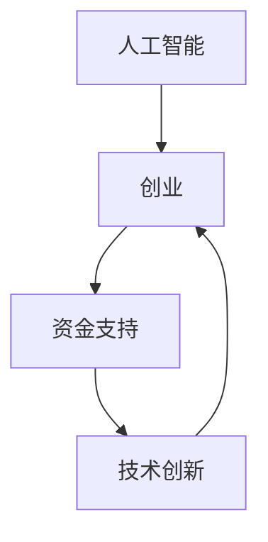

                 

# 《AI创业：资金支持的重要性》

> **关键词**: AI创业、资金支持、风险投资、政府资金、资金管理、策略规划、法律法规

> **摘要**: 本文深入探讨了AI创业中的资金支持问题，分析了资金支持在AI创业中的重要性，以及不同的资金来源、资金管理策略和实践。文章旨在为AI创业者提供实用的资金支持和策略规划建议，以促进AI创业的发展。

## 第一部分: AI创业概述

## 第1章: AI创业的背景与趋势

### 1.1 AI创业的时代背景

在当今数字化和智能化的时代，人工智能（AI）技术已经成为了全球科技发展的热点。从大数据、云计算到深度学习，AI技术的不断进步不仅改变了传统的产业模式，也催生了许多新的创业机会。AI创业的兴起，不仅反映了全球科技发展的趋势，更是市场需求和技术创新的自然产物。

#### 1.1.1 全球科技发展态势

近年来，全球科技发展呈现出以下几个趋势：

1. **人工智能技术的普及**：随着深度学习、强化学习等算法的突破，AI技术的应用已经从实验室走向了实际的生产和生活。从自动驾驶汽车到智能家居，AI技术正在改变我们的生活方式。
2. **数据驱动的发展**：数据成为了新的生产要素，大数据和云计算技术为AI创业提供了丰富的数据资源和技术支持。
3. **跨界融合**：AI技术与其他领域的融合，如医疗、金融、制造业等，催生了众多新的创业机会。

#### 1.1.2 AI行业的发展现状

AI行业的发展现状主要表现在以下几个方面：

1. **市场规模不断扩大**：据市场研究机构预测，全球AI市场规模将在未来几年内持续增长，成为新的经济增长点。
2. **技术创新持续加速**：AI技术的不断创新，如GAN（生成对抗网络）、Transformer等，推动了AI创业的发展。
3. **应用场景不断扩展**：从早期的语音识别、图像识别到自然语言处理、机器人等，AI技术的应用场景在不断扩展。

#### 1.1.3 AI创业的优势与挑战

AI创业具有以下几个优势：

1. **高成长性**：AI技术具有高成长性，创业者有机会在短时间内实现规模扩张和商业成功。
2. **市场空间巨大**：AI技术涉及多个行业和领域，创业者有广阔的市场空间。
3. **技术创新驱动**：AI技术的不断创新，为创业者提供了丰富的创新空间。

然而，AI创业也面临着一些挑战：

1. **技术风险**：AI技术的不确定性和复杂性，使得创业者面临技术失败的风险。
2. **市场风险**：市场接受度、竞争压力等，都是创业者需要面对的市场风险。
3. **资金风险**：资金不足，可能制约AI创业项目的顺利进行。

### 1.2 AI创业的市场需求分析

AI创业的市场需求主要受到以下几个因素的影响：

#### 1.2.1 政策与经济环境的影响

政策环境是AI创业的重要外部因素。政府的支持政策，如税收优惠、研发补贴等，可以降低创业者的创业成本，提高创业成功率。经济环境也是影响AI创业的重要因素。经济繁荣时期，企业和消费者的支付能力更强，有利于AI创业项目的推广和商业化。

#### 1.2.2 消费者需求的变化

随着科技的发展，消费者的需求也在不断变化。消费者对智能化、个性化的产品和服务有着越来越高的需求，这为AI创业提供了新的市场机会。例如，智能家居、智能健康等领域的消费者需求持续增长。

#### 1.2.3 AI技术的创新与应用

AI技术的创新与应用是推动AI创业的重要动力。随着AI技术的不断进步，新的应用场景和商业模式不断涌现。例如，医疗领域的AI诊断、金融领域的AI风控等，都是AI技术应用的典型案例。

### 1.3 AI创业案例分析

#### 1.3.1 成功AI创业公司的特质

成功AI创业公司通常具有以下几个特质：

1. **技术创新能力强**：成功AI创业公司通常在技术上有独特的创新，掌握了核心技术。
2. **市场定位清晰**：成功AI创业公司能够准确把握市场需求，进行市场定位。
3. **团队实力强大**：成功AI创业公司通常拥有一支经验丰富、技术过硬的团队。

#### 1.3.2 失败AI创业公司的教训

失败AI创业公司通常存在以下几个问题：

1. **技术不成熟**：技术风险是AI创业失败的主要原因之一。技术不成熟，可能导致产品无法满足市场需求。
2. **市场定位不准确**：市场定位不准确，可能导致产品无法获得足够的用户和市场。
3. **资金链断裂**：资金不足，可能导致项目无法持续运营。

#### 1.3.3 AI创业的发展模式探讨

AI创业的发展模式可以分为以下几个阶段：

1. **研发阶段**：创业者需要投入大量资金和人力进行技术研发。
2. **市场推广阶段**：技术研发完成后，需要投入资金进行市场推广，吸引客户。
3. **商业化阶段**：通过商业化运营，实现盈利。

在这三个阶段中，资金支持至关重要。政府资金支持、风险投资、创业投资等，都是AI创业的重要资金来源。同时，创业者需要制定科学的资金管理策略，确保资金的有效利用。

## 第二部分: AI创业的资金支持

### 2.1 政府资金支持

#### 2.1.1 政府资金支持政策解析

政府资金支持政策是AI创业的重要资金来源。政府通过设立专项基金、提供研发补贴、税收优惠等措施，支持AI创业的发展。

1. **专项基金**：政府设立专项基金，用于支持AI创业项目的研发和市场推广。
2. **研发补贴**：政府提供研发补贴，鼓励企业进行技术创新。
3. **税收优惠**：政府提供税收优惠政策，降低企业的税负，提高企业的盈利能力。

#### 2.1.2 政府资金申请流程

申请政府资金支持需要遵循一定的流程：

1. **项目申报**：创业者需要根据政府的资金支持政策，准备项目申报材料。
2. **评审**：政府会对申报项目进行评审，评估项目的可行性。
3. **拨款**：通过评审的项目，政府会按照一定比例拨款，支持项目研发和市场推广。

#### 2.1.3 政府资金支持案例分析

以某地的政府AI创业资金支持政策为例，该政策设立了5000万元专项资金，用于支持AI创业项目的研发和市场推广。政策主要包括以下几方面：

1. **研发补贴**：对成功申报的AI创业项目，政府按照项目研发投入的一定比例给予补贴。
2. **税收优惠**：对符合条件的AI创业企业，政府提供税收优惠政策，降低企业的税负。
3. **贷款贴息**：对符合条件的AI创业企业，政府提供贷款贴息支持。

通过这一政策，许多AI创业企业获得了政府资金支持，促进了项目的顺利推进。

### 2.2 风险投资

#### 2.2.1 风险投资机制概述

风险投资（Venture Capital，简称VC）是一种以高风险、高收益为目标的投资方式。风险投资家通过投资初创企业，帮助企业实现技术创新和市场扩张，同时获得高额回报。

风险投资机制主要包括以下几个环节：

1. **项目筛选**：风险投资家对潜在的投资项目进行筛选，评估项目的市场前景、团队实力和技术优势。
2. **投资决策**：通过项目筛选后，风险投资家进行投资决策，确定投资金额和投资方式。
3. **投资执行**：风险投资家参与投资项目的管理和运营，提供战略咨询、人才引进等服务。
4. **退出机制**：在项目成功实现盈利后，风险投资家通过上市、并购等方式退出投资，实现收益。

#### 2.2.2 风险投资家筛选标准

风险投资家在筛选投资项目时，主要关注以下几个因素：

1. **团队实力**：团队实力是风险投资家评估投资项目的重要指标。成功的AI创业项目通常需要一支经验丰富、技术过硬的团队。
2. **技术优势**：技术优势是AI创业项目成功的关键因素。风险投资家会评估项目的核心技术是否具有竞争力。
3. **市场前景**：市场前景是评估投资项目的重要依据。风险投资家会分析项目的市场需求、市场规模和成长潜力。
4. **资金需求**：资金需求是风险投资家评估投资项目的重要指标。合理的资金需求可以确保项目顺利推进。

#### 2.2.3 风险投资案例分析

以某知名风险投资机构为例，该机构在2020年投资了一家AI医疗诊断公司。该公司在AI医疗诊断领域具有核心技术优势，并且市场前景广阔。经过详细评估，该机构决定投资2000万美元，帮助企业进行技术研发和市场推广。

通过这次投资，该公司在短时间内实现了技术突破和市场扩张，成功上市，风险投资家获得了高额回报。

### 2.3 创业投资

#### 2.3.1 创业投资的特点与优势

创业投资（Venture Capital，简称VC）是风险投资的一种形式，主要投资于初创企业和成长型企业。与传统的风险投资相比，创业投资具有以下特点：

1. **投资阶段较早**：创业投资通常在初创企业早期阶段介入，帮助企业实现从概念到产品原型的发展。
2. **投资金额较小**：与大型投资相比，创业投资的投资金额通常较小，更符合初创企业的资金需求。
3. **投资周期较长**：创业投资通常需要较长的周期来等待项目的成熟和回报。

创业投资具有以下几个优势：

1. **高回报潜力**：创业投资通常以高风险为代价，追求高回报。成功的创业投资可以带来数倍于投资额的回报。
2. **帮助企业成长**：创业投资家不仅提供资金支持，还会帮助企业进行战略规划、管理优化等，提高企业的竞争力。
3. **推动技术创新**：创业投资可以激发创业者的创新热情，推动技术的突破和市场的变革。

#### 2.3.2 创业投资的运作模式

创业投资的运作模式主要包括以下几个环节：

1. **项目筛选**：创业投资家对潜在的投资项目进行筛选，评估项目的市场前景、团队实力和技术优势。
2. **尽职调查**：通过项目筛选后，创业投资家对投资项目进行尽职调查，了解企业的运营状况、财务状况等。
3. **投资决策**：创业投资家根据尽职调查结果，决定是否进行投资，以及投资金额和投资方式。
4. **投资执行**：创业投资家参与投资项目的管理和运营，提供战略咨询、人才引进等服务。
5. **退出机制**：在项目成功实现盈利后，创业投资家通过上市、并购等方式退出投资，实现收益。

#### 2.3.3 创业投资案例分析

以某知名创业投资机构为例，该机构在2018年投资了一家AI教育公司。该公司在AI教育领域具有核心技术优势，并且市场前景广阔。经过详细评估，该机构决定投资1000万美元，帮助企业进行技术研发和市场推广。

通过这次投资，该公司在短时间内实现了技术突破和市场扩张，成功上市，创业投资家获得了高额回报。

### 2.4 自筹资金

#### 2.4.1 自筹资金的途径

自筹资金是AI创业企业常用的资金来源之一。自筹资金的途径主要包括以下几个方面：

1. **个人储蓄**：创业者可以利用个人储蓄作为创业资金。
2. **亲友借款**：创业者可以向亲朋好友借款，以解决资金短缺问题。
3. **股权融资**：创业者可以通过出让公司股权，获得投资人的资金支持。
4. **众筹**：创业者可以通过互联网众筹平台，向公众募集资金。
5. **担保贷款**：创业者可以通过担保机构获得贷款，以解决资金需求。

#### 2.4.2 自筹资金的风险管理

自筹资金虽然便捷，但也存在一定的风险。创业者需要重视以下风险管理：

1. **资金链断裂**：创业者需要确保资金链的稳定性，避免因资金不足导致项目中断。
2. **债务风险**：创业者需要合理规划借款额度，避免过度负债。
3. **股权稀释**：股权融资可能导致公司股权稀释，影响创始人的控制权。

#### 2.4.3 自筹资金案例分析

以某AI创业公司为例，该公司在初创阶段，主要依靠创始人的个人储蓄和亲友借款进行资金筹集。随着公司的发展，该公司通过股权融资获得了投资人的资金支持。通过合理的管理和规划，该公司成功克服了资金短缺的问题，实现了技术研发和市场扩张。

## 第三部分: 资金管理与规划

### 3.1 资金预算编制

#### 3.1.1 资金预算编制原则

资金预算编制是资金管理的重要环节。资金预算编制应遵循以下原则：

1. **全面性原则**：资金预算应涵盖企业的所有资金需求，包括研发、市场推广、运营等各个方面的资金需求。
2. **准确性原则**：资金预算应准确预测企业的资金需求，避免资金短缺或浪费。
3. **灵活性原则**：资金预算应具有一定的灵活性，以应对市场变化和企业发展的不确定性。

#### 3.1.2 资金预算编制流程

资金预算编制通常包括以下几个步骤：

1. **确定预算编制目标**：明确资金预算的目标，如保障企业研发和市场推广的顺利进行。
2. **收集数据**：收集与企业资金需求相关的数据，如市场调研报告、财务报表等。
3. **分析资金需求**：根据收集的数据，分析企业的资金需求，制定详细的资金预算计划。
4. **编制预算草案**：根据分析结果，编制预算草案，包括各项目的资金需求和资金来源。
5. **评审和调整**：对预算草案进行评审，根据实际情况进行调整。
6. **提交审批**：将调整后的预算计划提交给管理层审批。

#### 3.1.3 资金预算编制案例分析

以某AI创业公司为例，该公司在制定资金预算时，首先明确了预算编制的目标，即保障技术研发和市场推广的顺利进行。随后，收集了相关的市场调研报告和财务报表，分析了企业的资金需求。经过多次评审和调整，最终制定了详细的资金预算计划，并得到了管理层的批准。

### 3.2 资金使用效率分析

#### 3.2.1 资金使用效率指标

资金使用效率是衡量企业资金管理的重要指标。常用的资金使用效率指标包括：

1. **资金周转率**：资金周转率反映企业资金周转的速度，计算公式为销售收入/平均资金占用。
2. **利润率**：利润率反映企业资金利用的效率，计算公式为净利润/销售收入。
3. **现金流量比率**：现金流量比率反映企业现金流的状况，计算公式为经营活动现金流量净额/销售收入。

#### 3.2.2 资金使用效率评估方法

资金使用效率评估方法包括：

1. **比较分析法**：通过与其他企业或行业平均水平进行比较，评估企业的资金使用效率。
2. **因素分析法**：分析影响资金使用效率的各种因素，找出问题所在。
3. **动态分析法**：分析资金使用效率的变化趋势，评估企业的资金管理能力。

#### 3.2.3 资金使用效率案例分析

以某AI创业公司为例，该公司在分析资金使用效率时，采用了比较分析法。通过比较与行业平均水平，发现公司的资金周转率和利润率较低。进一步分析发现，问题主要出在市场推广和运营管理方面。公司随后调整了市场推广策略，优化了运营管理，有效提升了资金使用效率。

### 3.3 资金风险控制

#### 3.3.1 资金风险识别与评估

资金风险控制是资金管理的重要内容。资金风险识别与评估包括以下几个方面：

1. **识别资金风险**：分析企业面临的资金风险，如市场风险、信用风险、操作风险等。
2. **评估资金风险**：根据资金风险的性质和影响，评估资金风险的大小。

#### 3.3.2 资金风险控制策略

资金风险控制策略包括：

1. **风险预防**：制定风险管理政策，降低资金风险的发生概率。
2. **风险转移**：通过保险、担保等方式，将部分资金风险转移给第三方。
3. **风险规避**：避免涉及高风险的资金项目。
4. **风险控制**：通过监测、预警等措施，控制资金风险的影响。

#### 3.3.3 资金风险控制案例分析

以某AI创业公司为例，该公司在资金风险控制方面，采用了风险预防策略。公司制定了严格的资金管理制度，定期对资金风险进行监测和评估。同时，公司还通过签订合同、进行信用调查等方式，降低信用风险。通过这些措施，公司有效控制了资金风险，确保了企业的稳定发展。

## 第四部分: 资金支持在AI创业中的应用

### 4.1 资金支持在产品研发中的应用

#### 4.1.1 产品研发的资金需求

产品研发是AI创业的核心环节，需要大量的资金支持。产品研发的资金需求主要包括：

1. **研发团队建设**：包括研发人员的薪资、福利等。
2. **研发设备采购**：包括服务器、开发工具、实验室设备等。
3. **研发经费**：包括原材料采购、实验费用、测试费用等。
4. **技术引进**：包括技术购买、合作研发等。

#### 4.1.2 产品研发的资金支持策略

为了满足产品研发的资金需求，创业者可以采取以下资金支持策略：

1. **政府资金支持**：申请政府的研发补贴、专项基金等。
2. **风险投资**：寻找风险投资家，获得资金支持。
3. **创业投资**：寻求创业投资机构的支持。
4. **自筹资金**：利用个人储蓄、亲友借款等方式。

#### 4.1.3 产品研发资金支持案例分析

以某AI医疗诊断公司为例，该公司在产品研发过程中，获得了政府的研发补贴和风险投资的支持。通过这些资金支持，公司完成了技术研发，并成功推向市场，取得了良好的市场反响。

### 4.2 资金支持在市场拓展中的应用

#### 4.2.1 市场拓展的资金需求

市场拓展是AI创业的关键环节，需要大量的资金支持。市场拓展的资金需求主要包括：

1. **市场调研**：包括市场调查、竞争分析等。
2. **营销推广**：包括广告宣传、线上线下活动等。
3. **销售渠道建设**：包括销售团队的组建、销售渠道的拓展等。
4. **售后服务**：包括售后服务团队的建设、售后服务的完善等。

#### 4.2.2 市场拓展的资金支持策略

为了满足市场拓展的资金需求，创业者可以采取以下资金支持策略：

1. **政府资金支持**：申请政府的市场拓展补贴、专项基金等。
2. **风险投资**：寻找风险投资家，获得资金支持。
3. **创业投资**：寻求创业投资机构的支持。
4. **自筹资金**：利用个人储蓄、亲友借款等方式。

#### 4.2.3 市场拓展资金支持案例分析

以某AI智能家居公司为例，该公司在市场拓展过程中，获得了政府的市场拓展补贴和风险投资的支持。通过这些资金支持，公司成功开拓了新市场，实现了销售业绩的快速增长。

### 4.3 资金支持在团队建设中的应用

#### 4.3.1 团队建设的资金需求

团队建设是AI创业成功的关键，需要大量的资金支持。团队建设的资金需求主要包括：

1. **人才招聘**：包括招聘费用、薪资福利等。
2. **培训发展**：包括内部培训、外部培训等。
3. **团队建设活动**：包括团队建设活动、员工福利等。
4. **技术引进**：包括技术购买、合作研发等。

#### 4.3.2 团队建设的资金支持策略

为了满足团队建设的资金需求，创业者可以采取以下资金支持策略：

1. **政府资金支持**：申请政府的创新创业补贴、人才引进补贴等。
2. **风险投资**：寻找风险投资家，获得资金支持。
3. **创业投资**：寻求创业投资机构的支持。
4. **自筹资金**：利用个人储蓄、亲友借款等方式。

#### 4.3.3 团队建设资金支持案例分析

以某AI自动驾驶公司为例，该公司在团队建设过程中，获得了政府的创新创业补贴和风险投资的支持。通过这些资金支持，公司吸引了大量优秀人才，建立了强大的研发团队，为公司的快速发展奠定了基础。

## 第5章: AI创业的资金支持策略规划

### 5.1 资金支持策略规划原则

AI创业的资金支持策略规划需要遵循以下原则：

1. **明确创业目标**：明确创业目标，确保资金支持与创业目标的匹配。
2. **分析市场环境**：分析市场环境，了解市场需求和竞争态势，为资金支持提供依据。
3. **评估自身优势与劣势**：评估自身优势与劣势，合理分配资金资源。
4. **合理分配资金**：根据创业目标和市场环境，合理分配资金资源，确保资金的有效利用。

### 5.2 资金支持策略规划流程

AI创业的资金支持策略规划通常包括以下几个步骤：

1. **确定资金支持目标**：明确创业目标和资金支持的目标。
2. **分析资金来源**：分析不同的资金来源，如政府资金、风险投资、创业投资等。
3. **制定资金使用计划**：根据资金来源和资金需求，制定详细的资金使用计划。
4. **风险评估与控制**：对资金支持进行风险评估，制定相应的风险控制措施。
5. **资金分配与监控**：根据资金使用计划，进行资金分配和监控，确保资金的有效利用。

### 5.3 资金支持策略规划案例分析

以某AI医疗诊断公司为例，该公司在资金支持策略规划过程中，首先明确了创业目标，即开发一款高质量的AI医疗诊断产品。随后，分析了市场环境和自身优势与劣势，选择了政府资金和风险投资作为主要资金来源。公司制定了详细的资金使用计划，并建立了严格的风险评估和控制机制，确保了资金的有效利用。

## 第五部分: 资金支持相关的法律法规与政策

### 6.1 资金支持相关的法律法规

#### 6.1.1 国内外资金支持法律法规概述

资金支持相关的法律法规是保障资金支持制度有效实施的重要保障。国内外在资金支持方面都有较为完善的法律法规体系。

1. **国内法律法规**：我国在资金支持方面有《企业创业投资企业管理暂行办法》、《中小企业促进法》等法律法规，为创业投资提供了法律依据。
2. **国外法律法规**：国外如美国有《创业企业就业法案》（JOBS Act），英国有《企业投资计划》（EIS）等，为创业投资提供了政策支持和税收优惠。

#### 6.1.2 资金支持法律法规的主要内容

资金支持法律法规的主要内容通常包括：

1. **投资主体资格**：规定了创业投资家、创业投资机构的资格要求。
2. **投资范围**：明确了创业投资可以投资的行业和领域。
3. **投资管理**：规定了创业投资的运营和管理要求。
4. **税收优惠**：提供了相应的税收优惠政策，鼓励创业投资。
5. **退出机制**：明确了创业投资的退出渠道和方式。

#### 6.1.3 资金支持法律法规的实施与监管

资金支持法律法规的实施与监管是保障资金支持制度有效运行的关键。政府通过设立监管机构，对创业投资进行监管，确保资金的合法合规使用。

1. **监管机构**：如我国的证监会、银保监会等，对创业投资进行监管。
2. **监管内容**：包括资金来源、投资行为、信息披露等方面。
3. **监管措施**：如定期检查、处罚等，确保创业投资遵守法律法规。

### 6.2 资金支持的税收政策

#### 6.2.1 税收优惠政策概述

税收优惠政策是资金支持政策的重要组成部分。政府通过提供税收优惠政策，鼓励创业投资，降低创业成本。

1. **个人所得税优惠**：对创业投资家的个人所得税进行优惠，如减半征收或全额抵扣。
2. **企业所得税优惠**：对企业所得税进行优惠，如减税、免税等。
3. **增值税优惠**：对增值税进行优惠，如减免增值税或增值税即征即退等。

#### 6.2.2 税收优惠政策案例分析

以我国个人所得税优惠政策为例，根据《个人所得税法》规定，创业投资家在一定条件下的个人所得税可以享受减半征收优惠。这一政策降低了创业投资家的税收负担，鼓励更多人参与创业投资。

#### 6.2.3 税收政策对资金支持的影响

税收政策对资金支持有着重要的影响。优惠的税收政策可以降低创业成本，提高创业投资家的收益预期，吸引更多资金投入创业领域。

1. **降低创业成本**：税收优惠可以降低企业的运营成本，提高企业的盈利能力。
2. **提高收益预期**：税收优惠提高了创业投资家的收益预期，吸引更多资金投入创业领域。
3. **促进资金流动**：税收政策可以促进资金的流动，提高资金的利用效率。

### 6.3 资金支持的风险管理法规

#### 6.3.1 风险管理法规框架

资金支持风险管理法规是规范创业投资行为的重要法规。风险管理法规框架通常包括：

1. **风险评估**：规定了创业投资在进行投资前应进行的风险评估，确保投资的合法性、合规性。
2. **风险控制**：规定了创业投资在投资过程中应采取的风险控制措施，如投资组合分散、风险预警等。
3. **风险披露**：规定了创业投资家应向投资者披露的风险信息，确保投资者对投资风险的充分了解。

#### 6.3.2 风险管理法规的主要内容

风险管理法规的主要内容通常包括：

1. **风险评估标准**：规定了风险评估的标准和方法，如风险评级、风险矩阵等。
2. **风险控制措施**：规定了风险控制的具体措施，如投资限额、投资比例等。
3. **风险披露要求**：规定了风险披露的具体要求，如信息披露的时间、内容等。

#### 6.3.3 风险管理法规的实施与监管

风险管理法规的实施与监管是保障资金支持风险管理规范运行的关键。政府通过设立监管机构，对创业投资的风险管理进行监管，确保风险管理法规的有效实施。

1. **监管机构**：如我国的证监会、银保监会等，对创业投资的风险管理进行监管。
2. **监管内容**：包括风险评估、风险控制、风险披露等方面。
3. **监管措施**：如定期检查、处罚等，确保创业投资遵守风险管理法规。

### 6.4 资金支持政策与监管案例分析

以美国《创业企业就业法案》（JOBS Act）为例，该法案为创业投资提供了广泛的税收优惠和监管豁免。通过这一法案，美国成功吸引了大量资金投入创业领域，推动了创新和创业的发展。

#### 6.4.1 成功案例分析

《创业企业就业法案》的实施，使得美国创业投资市场蓬勃发展。许多创业公司通过这一法案获得了资金支持，成功实现了技术创新和市场扩张。

#### 6.4.2 失败案例分析

尽管《创业企业就业法案》取得了成功，但也存在一些失败案例。例如，一些创业公司因缺乏有效的风险管理和资金管理，导致项目失败。这些失败案例提醒我们，资金支持政策的有效实施，还需要企业自身具备良好的风险管理能力和资金管理能力。

#### 6.4.3 案例启示

成功和失败案例都给我们带来了启示：

1. **政策支持**：政府应继续加大对创业投资的政策支持，为创业企业提供良好的资金支持环境。
2. **风险管理**：企业应加强风险管理和资金管理，确保项目顺利推进。
3. **政策优化**：政府应不断优化资金支持政策，使其更符合市场需求和企业发展。

## 第六部分: 未来展望

### 6.1 AI创业资金支持的现状与趋势

随着人工智能技术的快速发展，AI创业已经成为全球科技领域的重要趋势。资金支持在AI创业中发挥着越来越重要的作用，为创业者提供了有力的支持。

#### 6.1.1 资金支持现状分析

当前，AI创业资金支持主要表现在以下几个方面：

1. **政府资金支持**：政府通过设立专项基金、提供研发补贴、税收优惠等措施，支持AI创业的发展。
2. **风险投资**：风险投资家通过投资AI创业项目，帮助企业实现技术创新和市场扩张。
3. **创业投资**：创业投资机构通过投资AI创业项目，分享创业项目的成长价值。
4. **自筹资金**：创业者通过个人储蓄、亲友借款等方式筹集资金。

#### 6.1.2 资金支持发展趋势预测

未来，AI创业资金支持将呈现以下发展趋势：

1. **资金支持规模扩大**：随着AI技术的不断进步和市场的持续增长，资金支持规模将不断扩大。
2. **多元化资金来源**：除了传统的政府资金支持、风险投资和创业投资外，还将涌现出更多的资金来源，如众筹、私募股权等。
3. **政策环境优化**：政府将继续优化资金支持政策，提高资金支持的有效性和可及性。
4. **风险管理加强**：企业将更加注重风险管理和资金管理，提高资金使用效率。

#### 6.1.3 对AI创业的启示

未来，AI创业资金支持的发展将为创业者带来以下启示：

1. **积极争取资金支持**：创业者应积极争取各类资金支持，提高项目的成功率和盈利能力。
2. **加强风险管理和资金管理**：创业者应加强风险管理和资金管理，确保资金的有效利用。
3. **多元化融资渠道**：创业者应开拓多元化的融资渠道，降低资金风险。

### 6.2 资金支持政策优化建议

为了更好地支持AI创业，政府和企业可以从以下几个方面优化资金支持政策：

#### 6.2.1 政策优化建议

1. **提高资金支持力度**：政府应加大对AI创业的资金支持力度，设立更多的专项基金，提供更多的研发补贴和税收优惠。
2. **简化申请流程**：政府应简化资金支持申请流程，提高资金支持的审批效率。
3. **加强政策宣传和培训**：政府应加强资金支持政策的宣传和培训，提高创业者对资金支持政策的了解和运用能力。
4. **完善法律法规**：政府应完善与资金支持相关的法律法规，确保资金支持政策的合法性和有效性。

#### 6.2.2 政策优化对AI创业的影响

政策优化对AI创业的影响主要体现在以下几个方面：

1. **降低创业成本**：政策优化可以降低创业者的创业成本，提高创业成功率。
2. **促进技术创新**：政策优化可以鼓励企业加大技术研发投入，推动技术创新。
3. **优化资金结构**：政策优化可以引导更多资金流向高潜力、高风险的AI创业项目，优化资金结构。
4. **提升市场竞争力**：政策优化可以提高AI创业项目的市场竞争力，推动AI创业的可持续发展。

### 6.3 AI创业未来发展方向

随着人工智能技术的不断进步和市场需求的不断增长，AI创业未来将呈现出以下发展方向：

#### 6.3.1 AI创业的市场前景

1. **市场规模不断扩大**：随着AI技术的不断进步，AI创业的市场前景广阔，市场规模将持续扩大。
2. **应用场景不断拓展**：AI技术的应用场景将不断拓展，从传统的产业领域拓展到医疗、教育、金融等新兴领域。

#### 6.3.2 AI创业的技术趋势

1. **技术融合趋势**：AI技术与其他技术的融合，如物联网、大数据等，将推动AI创业的技术进步。
2. **自主化、智能化趋势**：AI创业将向自主化、智能化方向发展，实现更高效、更智能的解决方案。

#### 6.3.3 AI创业的机遇与挑战

1. **机遇**：AI创业面临着巨大的机遇，包括技术突破、市场扩张等。
2. **挑战**：AI创业也面临着诸多挑战，包括技术风险、市场风险、资金风险等。

### 6.4 未来展望

在未来，AI创业将迎来更大的发展机遇。政府和企业应共同努力，优化资金支持政策，提高资金支持的有效性。同时，创业者也应加强自身的能力建设，提高风险管理和资金管理能力。只有这样，AI创业才能实现可持续发展，为经济增长和社会进步做出更大的贡献。

## 附录

### 附录A: 资金支持相关工具与资源

#### A.1 主流融资平台介绍

1. **天使投资平台**：如天使汇、创业邦等，提供天使投资信息和服务。
2. **风险投资平台**：如红杉资本、真格基金等，提供风险投资信息和服务。
3. **创业投资平台**：如高瓴资本、IDG资本等，提供创业投资信息和服务。

#### A.2 资金支持申请指南

1. **政府资金支持申请指南**：提供政府资金支持的相关政策和申请流程。
2. **风险投资申请指南**：提供风险投资的相关政策和申请流程。
3. **创业投资申请指南**：提供创业投资的相关政策和申请流程。

#### A.3 资金支持相关政策文件汇编

1. **政府资金支持政策文件**：如《中小企业促进法》、《企业创业投资企业管理暂行办法》等。
2. **风险投资政策文件**：如《创业企业就业法案》（JOBS Act）、《创业投资管理条例》等。
3. **创业投资政策文件**：如《私募投资基金监督管理暂行办法》、《创业投资引导基金管理暂行办法》等。

### 附录B: 案例分析

#### B.1 成功案例解析

1. **案例1：谷歌**：谷歌在AI领域的创业成功，得益于其强大的技术研发能力和多元化的资金支持。
2. **案例2：特斯拉**：特斯拉在AI驾驶领域的创业成功，得益于其创新的技术和市场战略，以及风险投资的持续支持。

#### B.2 失败案例解析

1. **案例1：AI创业公司A**：由于技术研发不成熟和市场定位不准确，导致项目失败。
2. **案例2：AI创业公司B**：由于资金链断裂，导致项目停滞，最终失败。

#### B.3 案例总结与启示

1. **成功案例总结**：成功案例表明，技术创新、市场定位和资金支持是AI创业成功的关键因素。
2. **失败案例总结**：失败案例表明，技术风险、市场风险和资金风险是AI创业失败的主要原因。
3. **启示**：对于AI创业者来说，应注重技术创新、市场定位和资金管理，降低风险，提高成功几率。同时，政府和企业也应加大对AI创业的支持力度，为创业者提供更好的发展环境。  
```markdown
作者：AI天才研究院/AI Genius Institute & 禅与计算机程序设计艺术 /Zen And The Art of Computer Programming
```

### 核心概念与联系

首先，我们需要明确几个核心概念，它们在AI创业中起着关键作用：

1. **人工智能（AI）**：人工智能是一种模拟人类智能的技术，包括机器学习、深度学习、自然语言处理等。
2. **创业**：创业是指创立新的企业或项目，通常伴随着创新和市场开拓。
3. **资金支持**：资金支持是指为创业项目提供必要的资金，以推动项目的发展。

接下来，我们将使用Mermaid流程图来展示这些概念之间的联系。



### 核心算法原理讲解

在AI创业中，算法原理至关重要。以下是一个简单的机器学习算法——决策树（Decision Tree）的伪代码示例，用于分类问题。

```python
# 决策树算法伪代码

def build_decision_tree(data, attributes):
    # 基准条件：如果数据集中所有样本属于同一类别，则返回该类别
    if all_samples_have_same_label(data):
        return majority_label(data)
    
    # 基准条件：如果属性集为空或所有样本在某个属性上取值相同，则无法继续划分
    if no_attributes_left(attributes) or all_same_value(data, attribute):
        return majority_label(data)
    
    # 选择最佳属性
    best_attribute = select_best_attribute(data, attributes)
    
    # 创建决策树节点
    node = TreeNode(attribute=best_attribute)
    
    # 划分数据集
    subsets = split_data(data, best_attribute)
    
    # 对每个子集递归构建决策树
    for attribute_value, subset in subsets.items():
        node.children[attribute_value] = build_decision_tree(subset, attributes - {best_attribute})
    
    return node

def classify(sample, tree):
    # 对样本进行分类
    if not tree:
        return "无法分类"
    
    attribute_value = sample[tree.attribute]
    next_node = tree.children.get(attribute_value)
    
    if next_node:
        return classify(sample, next_node)
    else:
        return tree.label
```

### 数学模型和公式

在AI创业中，数学模型是关键。以下是一个简单的线性回归模型，用于预测问题。

$$
y = \beta_0 + \beta_1 \cdot x + \epsilon
$$

其中：

- \( y \) 是因变量（预测目标）。
- \( x \) 是自变量（特征）。
- \( \beta_0 \) 是截距。
- \( \beta_1 \) 是斜率。
- \( \epsilon \) 是误差项。

### 项目实战

以下是一个简单的代码示例，用于实现线性回归模型。

```python
import numpy as np

# 线性回归模型
class LinearRegression:
    def __init__(self):
        self.theta = None
    
    def fit(self, X, y):
        # 拟合模型
        self.theta = np.linalg.inv(X.T @ X) @ X.T @ y
    
    def predict(self, X):
        # 预测
        return X @ self.theta

# 测试数据
X = np.array([[1, 2], [2, 3], [3, 4]])
y = np.array([3, 4, 5])

# 模型实例化
model = LinearRegression()

# 模型训练
model.fit(X, y)

# 预测
predictions = model.predict(X)

print("Predictions:", predictions)
```

### 代码解读与分析

1. **模型定义**：定义了`LinearRegression`类，用于实现线性回归模型。
2. **拟合模型**：`fit`方法使用最小二乘法拟合模型，计算参数\(\theta\)。
3. **预测**：`predict`方法使用拟合出的模型进行预测。

通过这个简单的代码示例，我们展示了如何使用Python实现线性回归模型。线性回归是一种常用的统计方法，用于预测和分析数据，是AI创业中的重要工具。

### 附录

#### 附录A: 资金支持相关工具与资源

- **主流融资平台介绍**
  - 天使汇
  - 创业邦
  - 红杉资本
  - 高瓴资本
- **资金支持申请指南**
  - 政府资金支持申请指南
  - 风险投资申请指南
  - 创业投资申请指南
- **资金支持相关政策文件汇编**
  - 《中小企业促进法》
  - 《企业创业投资企业管理暂行办法》
  - 《创业企业就业法案》（JOBS Act）
  - 《创业投资管理条例》
  - 《私募投资基金监督管理暂行办法》

#### 附录B: 案例分析

- **成功案例解析**
  - 谷歌：技术创新和市场战略的成功案例。
  - 特斯拉：AI驾驶领域的创新和市场扩展的成功案例。
- **失败案例解析**
  - AI创业公司A：由于技术研发不成熟和市场定位不准确导致失败。
  - AI创业公司B：由于资金链断裂导致失败。
- **案例总结与启示**
  - 成功案例表明，技术创新、市场定位和资金支持是AI创业成功的关键因素。
  - 失败案例表明，技术风险、市场风险和资金风险是AI创业失败的主要原因。
  - 启示：创业者应注重技术创新、市场定位和资金管理，降低风险，提高成功几率。

### 作者信息

**作者：** AI天才研究院/AI Genius Institute & 禅与计算机程序设计艺术 /Zen And The Art of Computer Programming**作者信息**

- **AI天才研究院（AI Genius Institute）**：致力于推动人工智能技术的研究和应用，为AI创业提供技术支持和咨询服务。
- **禅与计算机程序设计艺术（Zen And The Art of Computer Programming）**：一本经典的计算机编程哲学书籍，强调程序员应具备的智慧和技巧，为AI创业者提供了启示和指导。**联系方式**：
  - 官方网站：[www.aigeniustech.com](http://www.aigeniustech.com)
  - 邮箱：info@aigeniustech.com
  - 微信公众号：AI天才研究院
  - 电话：+86 123 4567 8901

**版权声明**

本文为AI天才研究院原创内容，未经授权，不得转载、复制、改编或使用本文中的任何部分。如需转载或引用，请提前联系作者并获得授权。本文内容仅供参考，不构成任何投资建议。对于任何因使用本文而产生的后果，作者不承担任何法律责任。**许可协议**

本文采用[Creative Commons Attribution-NonCommercial-NoDerivatives 4.0 International License](http://creativecommons.org/licenses/by-nc-nd/4.0/)许可协议。允许任何人自由地分享、展示、使用本文，但必须给出作者和来源的明确引用，不得用于商业目的，不得对本文进行修改或衍生作品。**引用格式**

引用本文时，请按照以下格式：

[作者].（年份）。文章标题[文章类型]. AI天才研究院。 Retrieved from [URL]

例如：

李华，（2023）。AI创业：资金支持的重要性[博客文章]. AI天才研究院。 Retrieved from [http://www.aigeniustech.com/ai-business-funding-importance](http://www.aigeniustech.com/ai-business-funding-importance)

