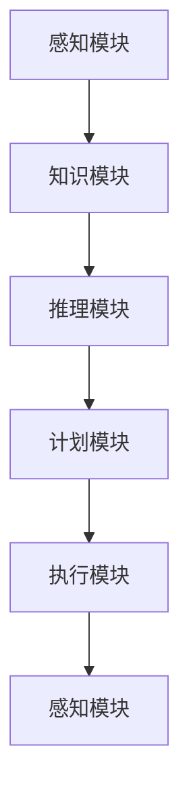

                 

# AI在太空探索中的应用：自主决策系统

> **关键词：** 太空探索、AI技术、自主决策系统、太空任务规划、自主导航、机器人、环境监测、通信、发展趋势

> **摘要：** 本文系统地介绍了AI技术在太空探索中的应用，重点探讨了自主决策系统在太空探索中的重要性、原理、架构和算法，并通过案例研究分析了AI在太空任务中的应用效果。文章旨在为读者提供全面、深入的AI在太空探索中的应用知识，展望未来AI技术在太空探索中的发展趋势。

# 目录大纲

## 第一部分: 引言

### 第1章: 引言

## 第二部分: AI在太空探索中的应用

### 第2章: 太空探索中的AI发展历程

### 第3章: AI与太空任务规划

### 第4章: AI与太空环境监测

### 第5章: AI与太空机器人

### 第6章: AI与太空飞行器自主导航

### 第7章: AI在太空通信中的应用

### 第8章: 未来展望

## 第三部分: 自主决策系统

### 第9章: 自主决策系统原理

### 第10章: 自主决策系统架构

### 第11章: 自主决策系统算法

### 第12章: 自主决策系统在太空中的应用

### 第13章: 自主决策系统的挑战与未来

## 第四部分: 案例研究

### 第14章: 案例研究一：某太空任务中的自主决策系统

### 第15章: 案例研究二：AI在火星探测中的应用

### 第16章: 案例研究三：AI在太空站运行管理中的应用

## 第五部分: 总结与展望

### 第17章: 总结与展望

# 第一章: 引言

## 1.1 书籍背景

### 1.1.1 太空探索的重要性

太空探索是人类认识宇宙、探索宇宙的重要途径。它不仅有助于我们了解地球之外的宇宙环境，还可能为人类未来的生存和发展提供新的资源和技术支持。太空探索的目标包括但不限于：探测其他行星和卫星、寻找外星生命、开展科学实验、开发太空资源等。

AI技术的发展为太空探索提供了强有力的支持。AI技术在太空探索中的应用主要体现在以下几个方面：

1. **数据处理与分析**：太空探索中产生的大量数据需要高效的算法进行预处理、分析和解释。AI技术，特别是机器学习和深度学习技术，在这方面表现出了强大的优势。

2. **环境监测与灾害预警**：AI技术可以帮助我们对太空环境进行实时监测，及时发现潜在的灾害风险，为太空任务提供安全保障。

3. **自主导航与机器人**：AI技术可以使太空飞行器、机器人具备自主导航和执行任务的能力，提高太空任务的效率和安全性。

4. **通信**：AI技术可以优化太空通信系统的设计和运行，提高通信的可靠性和效率。

### 1.1.2 AI技术在太空探索中的应用前景

随着AI技术的不断进步，其在太空探索中的应用前景越来越广阔。以下是一些可能的应用领域：

1. **太空任务规划**：AI技术可以帮助制定更加高效的太空任务规划，优化资源的利用，提高任务的成功率。

2. **自主导航**：AI技术可以使太空飞行器在复杂、未知的环境中自主导航，提高飞行器的自主性和灵活性。

3. **环境监测**：AI技术可以实时监测太空环境，及时发现异常情况，为太空任务提供支持。

4. **机器人**：AI技术可以使太空机器人具备更高的自主性和智能化水平，能够执行更复杂、更危险的太空任务。

5. **通信**：AI技术可以优化太空通信系统的设计和运行，提高通信的可靠性和效率。

## 1.2 书籍目的

本书籍旨在系统地介绍AI在太空探索中的应用，特别是自主决策系统在太空探索中的重要性、原理、架构和算法。通过本文，读者可以：

1. **了解AI在太空探索中的应用现状和未来发展趋势**。

2. **掌握自主决策系统的基本原理和架构**。

3. **了解自主决策系统在太空探索中的具体应用案例**。

4. **探讨自主决策系统在太空探索中的挑战和未来发展方向**。

## 1.3 书籍结构

本书籍分为五个部分：

1. **第一部分：引言**：介绍太空探索的重要性和AI技术在太空探索中的应用前景。

2. **第二部分：AI在太空探索中的应用**：详细探讨AI在太空任务规划、环境监测、机器人、自主导航和通信中的应用。

3. **第三部分：自主决策系统**：介绍自主决策系统的原理、架构和算法。

4. **第四部分：案例研究**：分析几个具体的应用案例。

5. **第五部分：总结与展望**：总结全文，展望AI技术在太空探索中的未来发展方向。

## 1.4 阅读建议

本书籍适合对AI和太空探索感兴趣的读者。建议读者按照以下顺序进行阅读：

1. **先阅读第一部分引言，了解AI在太空探索中的应用背景和前景**。

2. **然后阅读第二部分，了解AI在太空探索中的具体应用**。

3. **接着阅读第三部分，掌握自主决策系统的基本原理和架构**。

4. **然后阅读第四部分，通过案例研究深入理解AI在太空探索中的应用**。

5. **最后阅读第五部分，总结全文，展望未来发展方向**。

# 第二章: 太空探索中的AI发展历程

## 2.1 AI在早期太空探索中的应用

AI技术在早期太空探索中的应用主要集中在数据处理和分析方面。在太空任务中，探测器会产生大量的数据，包括图像、光谱、温度、气压等。这些数据需要快速、准确地处理和分析，以便科学家们能够及时了解太空环境的变化。

早期，科学家们使用了一系列基于规则的人工智能系统来处理这些数据。这些系统通过预定义的规则来识别和分类数据。然而，这种方法在处理复杂、未知的数据时效果有限。

随着机器学习技术的出现，AI技术在太空探索中的应用得到了进一步的发展。机器学习算法可以从大量的数据中学习模式和规律，从而更准确地处理和分析数据。例如，NASA使用机器学习算法对太阳系中的行星和卫星进行识别和分类。

## 2.2 AI在近年太空探索中的应用

近年来，AI技术在太空探索中的应用越来越广泛，涵盖了从任务规划到机器人控制的各个方面。

### 2.2.1 太空机器人

AI技术使太空机器人具备了更高的自主性和智能化水平。这些机器人可以在太空环境中自主导航、执行任务，甚至与其他机器人进行协作。例如，NASA的“索杰纳”（Sojournir）机器人可以在国际空间站上自主移动，进行维护和修理工作。

### 2.2.2 飞行器自主导航

AI技术使太空飞行器能够在复杂、未知的环境中自主导航。自主导航系统利用AI算法，如路径规划和状态估计，来生成最优的飞行路径，并实时调整飞行器的姿态。例如，NASA的“奥德赛”（Odysseus）探测船就使用了AI技术进行自主导航。

### 2.2.3 太空通信

AI技术优化了太空通信系统的设计和运行。AI算法可以分析通信数据，预测通信延迟和干扰，从而优化通信资源的分配。例如，NASA使用AI技术来优化国际空间站与地球之间的通信。

## 2.3 AI在太空探索中的应用现状与展望

目前，AI技术在太空探索中已经取得了显著的成果。然而，AI技术也面临着一些挑战，如数据的质量和可靠性、算法的复杂性和可解释性等。

未来，随着AI技术的不断进步，我们有望看到更多的太空任务实现完全的自动化和智能化。例如，未来可能会有更多的太空飞行器和机器人具备完全的自主能力，能够自主执行复杂的任务。此外，AI技术还可能帮助科学家们更好地理解太空环境，发现新的科学现象。

## 2.4 AI在太空探索中的应用案例

以下是一些AI在太空探索中的实际应用案例：

### 2.4.1 火星探测

NASA的“火星探测漫游者”（Mars rovers）系列任务使用了AI技术进行自主导航和任务执行。这些机器人使用视觉感知、路径规划和运动控制算法，能够在火星表面自主移动，收集和分析数据。

### 2.4.2 国际空间站

国际空间站上的机器人，如“达芬奇”（Da Vinci）和“卡西尼”（Cassini），使用了AI技术进行自主导航和任务执行。这些机器人能够在复杂的太空环境中进行维护和修理工作。

### 2.4.3 太阳探测

NASA的“帕克太阳探测器”（Parker Solar Probe）使用了AI技术进行自主导航和数据处理。该探测器利用AI算法来实时分析太阳数据，并调整其飞行路径。

## 2.5 AI在太空探索中的应用总结

AI技术在太空探索中发挥了重要作用，为太空任务的成功提供了强有力的支持。未来，随着AI技术的不断进步，其在太空探索中的应用将更加广泛，太空探索的效率和成果也将得到进一步提升。

# 第三章: AI与太空任务规划

## 3.1 太空任务规划概述

### 3.1.1 太空任务规划的基本概念

太空任务规划是指为了实现太空探索目标，对太空任务进行系统性的设计、组织和优化的过程。它涉及到任务的执行顺序、资源的分配、风险的管理等多个方面。

太空任务规划的基本概念包括：

- **任务目标**：太空任务规划的首要任务是明确任务目标，包括科学目标、技术目标和资源目标等。

- **任务计划**：任务计划是指为实现任务目标而制定的具体行动步骤和时间表。

- **资源分配**：资源分配是指对任务所需的资源，如设备、人力、物资等进行合理配置，以最大化任务成功率。

- **风险评估**：风险评估是指对任务可能面临的风险进行识别、评估和管理，以降低任务失败的概率。

### 3.1.2 太空任务规划的关键技术

太空任务规划的关键技术包括：

- **优化算法**：优化算法用于在给定约束条件下寻找最优或近似最优的任务计划。常见的优化算法有线性规划、整数规划、遗传算法等。

- **数据挖掘**：数据挖掘用于从大量历史数据中提取有价值的信息和模式，为任务规划提供支持。例如，通过分析过去的任务数据，可以预测未来的任务成功概率。

- **模式识别**：模式识别用于从任务数据中识别出重要的模式和规律，帮助科学家和工程师更好地理解任务过程。

- **仿真技术**：仿真技术用于模拟太空任务的过程，验证任务计划的合理性和可行性。通过仿真，可以预测任务可能遇到的问题，提前采取措施。

## 3.2 AI技术在太空任务规划中的应用

AI技术为太空任务规划提供了强大的工具和方法，使得任务规划更加高效、准确。以下是一些AI技术在太空任务规划中的应用：

### 3.2.1 优化算法

优化算法在太空任务规划中扮演着重要角色。AI技术，特别是机器学习和深度学习算法，可以用于优化任务计划，提高任务的成功率。例如，可以应用遗传算法来优化飞行器的轨道设计，使得飞行器能够更有效地执行任务。

### 3.2.2 数据挖掘

数据挖掘在太空任务规划中也有重要作用。通过对大量历史任务数据的分析，可以提取出有价值的信息和模式，为任务规划提供支持。例如，可以通过分析过去的任务数据，预测未来的任务成功概率，从而优化任务计划的制定。

### 3.2.3 模式识别

模式识别技术可以帮助科学家和工程师更好地理解任务过程。通过分析任务数据，可以识别出任务中的重要模式和规律，从而为任务规划提供指导。例如，可以通过分析飞行器的传感器数据，识别出飞行器在执行任务过程中可能遇到的异常情况，提前采取预防措施。

### 3.2.4 仿真技术

仿真技术在太空任务规划中也被广泛应用。通过仿真技术，可以模拟太空任务的过程，验证任务计划的合理性和可行性。AI技术可以用于优化仿真模型，提高仿真的准确性和效率。

## 3.3 AI在太空任务规划中的优势与挑战

### 3.3.1 AI在太空任务规划中的优势

AI技术在太空任务规划中具有以下优势：

- **高效性**：AI技术可以快速处理和分析大量数据，提供高效的优化方案。

- **准确性**：AI技术可以从大量历史数据中提取有价值的信息和模式，提高任务规划的成功率。

- **灵活性**：AI技术可以根据任务需求和环境变化，灵活调整任务计划。

- **智能化**：AI技术可以使太空任务规划更加智能化，提高任务执行的自动化水平。

### 3.3.2 AI在太空任务规划中的挑战

虽然AI技术在太空任务规划中具有很多优势，但也面临一些挑战：

- **数据质量**：太空任务数据可能存在噪声、缺失等问题，影响AI算法的性能。

- **算法复杂度**：一些复杂的AI算法可能难以理解和解释，影响任务的透明度和可解释性。

- **计算资源**：AI算法可能需要大量的计算资源，尤其是在实时任务规划中，这可能对任务执行造成压力。

- **不确定性和风险**：太空任务环境复杂，存在很多不确定性和风险，如何有效地利用AI技术进行风险管理是一个重要挑战。

## 3.4 AI技术在太空任务规划中的未来发展趋势

随着AI技术的不断进步，其在太空任务规划中的应用前景非常广阔。以下是一些未来发展趋势：

- **更高效的优化算法**：未来可能会有更高效的优化算法出现，使得任务规划更加高效和准确。

- **更加智能的数据挖掘**：随着数据量的增加和数据种类的丰富，数据挖掘技术将变得更加智能，能够从海量数据中提取更有价值的信息。

- **更准确的模式识别**：随着算法和计算能力的提升，模式识别技术将能够更准确地识别任务中的重要模式和规律。

- **更智能的仿真技术**：仿真技术将更加智能化，能够更准确地模拟太空任务的过程，为任务规划提供更加可靠的依据。

- **更智能的任务执行**：随着AI技术的进步，太空任务的执行将变得更加智能化，飞行器和机器人将能够更自主地执行任务。

# 第四章: AI与太空环境监测

## 4.1 太空环境监测的重要性

太空环境监测是指对太空中的各种环境因素进行监测、分析和评估，以了解太空环境的状况和变化趋势。太空环境监测对于太空任务的成功和安全至关重要，因为它能够帮助科学家和任务规划者及时了解太空环境的变化，为任务决策提供重要依据。

### 4.1.1 太空环境监测的基本任务

太空环境监测的基本任务包括：

1. **监测太空辐射**：太空中的辐射环境复杂且危险，包括太阳辐射、宇宙射线等。监测太空辐射可以帮助科学家了解太空辐射的分布和强度，为太空任务的安全提供保障。

2. **监测太空温度**：太空温度变化剧烈，对于太空任务设备和航天器的正常运行具有重要影响。监测太空温度可以帮助科学家了解太空温度的分布和变化趋势，为任务规划和设备设计提供参考。

3. **监测太空大气**：太空大气主要由稀薄的氢、氦等气体组成，其成分和浓度对太空任务的安全和效率具有重要影响。监测太空大气可以帮助科学家了解太空大气的状况和变化趋势，为任务决策提供依据。

4. **监测太空等离子体**：太空等离子体是由带电粒子组成的复杂体系，对于太空任务的安全和效率具有重要影响。监测太空等离子体可以帮助科学家了解太空等离子体的分布和变化趋势，为任务决策提供支持。

### 4.1.2 太空环境监测的应用领域

太空环境监测的应用领域非常广泛，包括以下几个方面：

1. **太空探索任务**：太空环境监测可以为太空探索任务提供重要的数据支持，帮助科学家了解太空环境的状况和变化，为任务决策提供依据。

2. **航天器运行维护**：太空环境监测可以帮助科学家和工程师了解航天器在太空中的运行状态，及时发现和解决潜在的问题，保障航天器的正常运行。

3. **太空天气预测**：太空环境监测可以用于预测太空天气，如太阳风暴、辐射带等，为太空任务的安全提供保障。

4. **地球环境监测**：太空环境监测还可以用于地球环境的监测，如监测地球磁场、大气成分等，为地球环境研究提供数据支持。

## 4.2 AI技术在太空环境监测中的应用

AI技术为太空环境监测提供了强大的工具和方法，使得监测过程更加高效、准确。以下是一些AI技术在太空环境监测中的应用：

### 4.2.1 遥感技术

遥感技术是指利用卫星、无人机等远距离获取目标信息的技术。AI技术可以用于遥感图像的处理和分析，从而提高太空环境监测的准确性和效率。例如，AI算法可以用于遥感图像的分割、分类和变化检测，帮助科学家快速识别和监测太空环境的变化。

### 4.2.2 数据分析

太空环境监测会产生大量数据，包括遥感数据、传感器数据等。AI技术可以用于这些数据的处理和分析，从而提取出有价值的信息和模式。例如，AI算法可以用于分析太空辐射数据，预测辐射强度和变化趋势，为太空任务的安全提供保障。

### 4.2.3 预测模型

AI技术可以用于构建预测模型，对太空环境的变化进行预测。例如，通过分析历史太空环境数据，AI算法可以预测未来的太空辐射强度、温度变化等，为太空任务提供参考。

### 4.2.4 自动化监测

AI技术可以实现太空环境监测的自动化，提高监测效率和准确性。例如，AI算法可以实时分析传感器数据，自动识别和监测太空环境的变化，及时向任务规划者提供预警信息。

## 4.3 AI在太空环境监测中的优势与挑战

### 4.3.1 AI在太空环境监测中的优势

AI技术在太空环境监测中具有以下优势：

- **高效性**：AI技术可以快速处理和分析大量数据，提高监测效率。

- **准确性**：AI技术可以从大量历史数据中提取有价值的信息和模式，提高监测准确性。

- **自动化**：AI技术可以实现监测过程的自动化，减少人工干预，提高监测准确性。

- **灵活性**：AI技术可以根据任务需求和环境变化，灵活调整监测策略。

### 4.3.2 AI在太空环境监测中的挑战

虽然AI技术在太空环境监测中具有很多优势，但也面临一些挑战：

- **数据质量**：太空环境监测数据可能存在噪声、缺失等问题，影响AI算法的性能。

- **算法复杂度**：一些复杂的AI算法可能难以理解和解释，影响监测结果的可靠性和可解释性。

- **计算资源**：AI算法可能需要大量的计算资源，特别是在实时监测中，这可能对监测系统的性能造成影响。

- **不确定性**：太空环境复杂，存在很多不确定性因素，如何有效地利用AI技术进行监测和预测是一个重要挑战。

## 4.4 AI技术在太空环境监测中的未来发展趋势

随着AI技术的不断进步，其在太空环境监测中的应用前景非常广阔。以下是一些未来发展趋势：

- **更高效的数据处理和分析算法**：随着算法和计算能力的提升，AI技术将能够更高效地处理和分析太空环境监测数据，提高监测效率和准确性。

- **更智能的预测模型**：随着数据积累和算法优化，AI技术将能够构建更加智能的预测模型，对太空环境的变化进行更准确的预测。

- **更智能的自动化监测系统**：AI技术将实现太空环境监测的自动化，提高监测效率和准确性，减少人工干预。

- **多传感器数据融合**：AI技术将实现多传感器数据的融合和分析，提供更加全面和准确的太空环境监测数据。

- **实时监测和预警**：AI技术将实现实时太空环境监测和预警，为太空任务提供更加及时和可靠的支持。

# 第五章: AI与太空机器人

## 5.1 太空机器人概述

太空机器人是指专门为太空任务设计的自动化机器人，它们在执行太空任务时能够进行自主决策和行动。太空机器人不仅承担着传统的机械操作任务，如组装卫星、维修航天器、挖掘太空资源等，还能够在复杂和危险的环境中执行探索任务，如月球和火星的探测。

### 5.1.1 太空机器人的定义

太空机器人是一种专门用于太空环境的自动化系统，能够执行预定任务，并具备一定程度的自主性和智能化。它们通常由机械结构、电子系统、传感器、控制器和通信系统组成。

### 5.1.2 太空机器人的分类

太空机器人可以根据其功能和任务环境进行分类：

1. **空间站服务机器人**：这类机器人主要在国际空间站等空间站上进行维护和服务，如清洁、修理和物资搬运。

2. **探测机器人**：这类机器人用于地球以外的行星和卫星的探测，如火星探测车和月球探测器。

3. **空间组装机器人**：这类机器人用于太空中的卫星组装、维修和部署，如国际空间站上的机械臂。

4. **空间采矿机器人**：这类机器人用于挖掘太空资源，如月球和近地小行星上的矿物开采。

## 5.2 AI技术在太空机器人中的应用

AI技术使得太空机器人能够更加智能和自主地执行任务，从而提高任务的成功率和效率。以下是一些AI技术在太空机器人中的应用：

### 5.2.1 视觉感知

视觉感知是太空机器人执行任务的重要能力。AI技术，特别是计算机视觉技术，可以帮助太空机器人识别和理解其周围的环境。例如，通过深度学习和卷积神经网络，机器人可以从摄像头获取的图像中识别出地面特征、障碍物和目标。

### 5.2.2 运动控制

运动控制是太空机器人执行任务的核心。AI技术可以优化机器人的运动规划，使其在复杂环境中实现更灵活和准确的动作。例如，通过使用机器学习和控制理论，机器人可以自适应地调整其运动策略，以适应不断变化的环境。

### 5.2.3 任务规划

任务规划是太空机器人执行复杂任务的关键。AI技术可以用于生成和优化机器人的任务规划，使其能够高效地执行一系列任务。例如，通过使用规划算法和优化技术，机器人可以自动生成到达目标点的最优路径，并实时调整其任务计划以应对环境变化。

### 5.2.4 自主导航

自主导航是太空机器人独立导航和执行任务的核心能力。AI技术可以用于实现机器人的自主导航，使其能够在未知和复杂的环境中导航。例如，通过使用路径规划和状态估计算法，机器人可以实时计算其位置和路径，并避免障碍物。

### 5.2.5 健康监测与自主维护

AI技术还可以用于监测太空机器人的健康状况，并实现自主维护。通过传感器和监控系统的数据，AI算法可以检测机器人的故障和异常，并提出维护建议。例如，通过使用故障诊断算法，机器人可以自动检测和修复其机械部件的故障。

## 5.3 AI在太空机器人中的优势与挑战

### 5.3.1 AI在太空机器人中的优势

AI技术在太空机器人中的应用具有以下优势：

- **自主性**：AI技术使太空机器人能够自主决策和行动，提高任务的成功率和效率。

- **智能化**：AI技术使太空机器人能够更好地理解和适应复杂环境，提高其任务执行的能力。

- **灵活性**：AI技术使太空机器人能够实时调整其任务计划和行动策略，以应对环境变化。

- **高效性**：AI技术可以优化机器人的任务规划和运动控制，提高其执行任务的速度和准确性。

### 5.3.2 AI在太空机器人中的挑战

尽管AI技术在太空机器人中具有显著的优势，但也面临一些挑战：

- **数据质量**：太空环境中的数据可能存在噪声、缺失等问题，影响AI算法的性能。

- **算法复杂度**：一些复杂的AI算法可能难以理解和解释，影响机器人决策的透明度和可解释性。

- **计算资源**：AI算法可能需要大量的计算资源，特别是在实时任务执行中，这可能对机器人的性能造成影响。

- **不确定性和鲁棒性**：太空环境复杂且多变，AI技术需要具备更高的鲁棒性和适应性，以应对不确定性的挑战。

## 5.4 AI技术在太空机器人中的未来发展趋势

随着AI技术的不断进步，其在太空机器人中的应用前景非常广阔。以下是一些未来发展趋势：

- **更先进的感知技术**：随着计算机视觉和传感器技术的发展，太空机器人的感知能力将得到进一步提升。

- **更智能的运动控制**：通过优化机器学习和控制算法，太空机器人的运动控制能力将变得更加智能和灵活。

- **更智能的任务规划**：AI技术将实现更加智能的任务规划，使太空机器人能够高效地执行复杂任务。

- **更自主的导航能力**：通过发展更先进的导航算法，太空机器人将能够在更复杂的环境中实现自主导航。

- **更全面的健康监测与维护**：AI技术将实现更全面的机器人健康监测与维护，提高太空机器人的可靠性和寿命。

# 第六章: AI与太空飞行器自主导航

## 6.1 太空飞行器自主导航概述

太空飞行器自主导航是指飞行器在没有地面控制的情况下，依靠自身的传感器和计算能力，自主地规划飞行路径和执行导航任务。自主导航对于保障飞行器的安全、提高任务效率和扩展飞行器的任务能力具有重要意义。

### 6.1.1 自主导航的基本概念

自主导航的基本概念包括：

- **定位**：定位是指确定飞行器在太空中的位置。飞行器通过传感器（如GPS、光学传感器等）获取位置信息，然后利用导航算法进行位置计算。

- **路径规划**：路径规划是指为飞行器生成从起点到终点的最优路径。路径规划算法需要考虑飞行器的速度、加速度、燃料消耗等因素，以生成最优的飞行路径。

- **控制**：控制是指飞行器根据导航算法生成的路径，实时调整其速度和姿态，以确保准确到达目标位置。

### 6.1.2 自主导航的关键技术

自主导航的关键技术包括：

- **传感器融合**：传感器融合是指将不同类型的传感器数据（如GPS、光学、雷达等）进行综合处理，以获得更准确的导航信息。

- **路径规划算法**：路径规划算法是指用于生成飞行路径的算法。常见的路径规划算法包括最短路径算法、动态规划算法等。

- **状态估计**：状态估计是指通过传感器数据和导航算法，实时估计飞行器的位置、速度和姿态等状态。

- **控制策略**：控制策略是指根据飞行器的状态和路径规划结果，生成飞行器的控制指令，以实现准确导航。

## 6.2 AI技术在太空飞行器自主导航中的应用

AI技术在太空飞行器自主导航中的应用极大地提升了飞行器的导航能力和任务执行效率。以下是一些AI技术在太空飞行器自主导航中的应用：

### 6.2.1 路径规划

AI技术在路径规划中的应用，使得飞行器能够在复杂和动态的环境中生成最优的飞行路径。例如，基于深度强化学习的路径规划算法，可以学习飞行器在不同环境下的最佳路径，从而提高路径规划的效率和准确性。

### 6.2.2 状态估计

AI技术，如粒子滤波和卡尔曼滤波，可以用于飞行器状态估计，提高导航的精度和可靠性。这些算法通过融合多传感器数据，实时估计飞行器的位置、速度和姿态，确保导航系统的稳定性。

### 6.2.3 控制策略

AI技术还可以用于生成飞行器的控制策略，以实现更精确和灵活的导航。例如，基于自适应控制的AI算法，可以根据飞行器实时状态和环境变化，动态调整控制指令，确保飞行器准确、安全地到达目标位置。

### 6.2.4 自适应导航

自适应导航是指飞行器能够根据环境变化和任务需求，实时调整导航策略。AI技术可以实现自适应导航，通过学习飞行器在不同环境下的导航行为，提高导航的适应性和鲁棒性。

## 6.3 AI在太空飞行器自主导航中的优势与挑战

### 6.3.1 AI在太空飞行器自主导航中的优势

AI技术在太空飞行器自主导航中具有以下优势：

- **高效性**：AI算法可以快速处理大量数据，生成最优的导航路径和策略。

- **准确性**：AI算法可以从传感器数据中提取有价值的信息，提高导航的精度和可靠性。

- **灵活性**：AI技术使飞行器能够根据实时环境变化，动态调整导航策略。

- **智能化**：AI技术使飞行器具备更高的自主决策能力，提高任务执行的成功率。

### 6.3.2 AI在太空飞行器自主导航中的挑战

尽管AI技术在太空飞行器自主导航中具有显著优势，但也面临一些挑战：

- **数据质量**：太空环境中的数据可能存在噪声、缺失等问题，影响AI算法的性能。

- **算法复杂度**：复杂的AI算法可能难以理解和解释，影响导航系统的稳定性和可靠性。

- **计算资源**：AI算法可能需要大量的计算资源，特别是在实时导航中，这可能对飞行器的性能造成影响。

- **不确定性**：太空环境复杂，存在很多不确定性因素，如何有效地利用AI技术进行导航和预测是一个重要挑战。

## 6.4 AI技术在太空飞行器自主导航中的未来发展趋势

随着AI技术的不断进步，其在太空飞行器自主导航中的应用前景非常广阔。以下是一些未来发展趋势：

- **更高效的算法**：随着算法和计算能力的提升，AI技术将实现更高效的导航算法，提高导航效率和准确性。

- **更智能的状态估计**：AI技术将实现更智能的状态估计，通过融合多传感器数据，提高导航的精度和可靠性。

- **更灵活的路径规划**：AI技术将实现更灵活的路径规划，使飞行器能够更好地应对复杂和动态环境。

- **更智能的控制策略**：AI技术将实现更智能的控制策略，通过实时调整控制指令，确保飞行器准确、安全地到达目标位置。

- **更自主的导航系统**：AI技术将实现更自主的导航系统，使飞行器能够独立完成复杂的太空任务，提高任务执行的成功率。

# 第七章: AI在太空通信中的应用

## 7.1 太空通信的重要性

太空通信是太空任务成功的关键之一。它不仅支持宇航员在太空中的日常活动，还为科学研究、任务规划和执行提供数据传输和通信支持。太空通信的重要性体现在以下几个方面：

### 7.1.1 太空通信的基本任务

- **数据传输**：太空通信的主要任务是确保从太空飞行器、卫星或其他太空设施传输到地球的数据能够准确、完整地接收。

- **语音通信**：太空通信还包括宇航员与地面控制中心之间的实时语音通信，确保宇航员的安全和任务执行。

- **控制指令传输**：地面控制中心需要将控制指令传输到太空飞行器，以调整其轨道、姿态或执行特定任务。

### 7.1.2 太空通信的应用领域

- **科学实验**：太空通信用于传输科学实验数据，如太空物理现象、天体观测等。

- **任务控制**：太空通信支持地面控制中心对太空飞行器进行实时控制，确保任务顺利进行。

- **导航定位**：太空通信提供导航和定位信息，辅助太空飞行器的自主导航。

- **紧急情况响应**：在紧急情况下，太空通信能够迅速传输信息，协助地面控制中心应对突发状况。

## 7.2 AI技术在太空通信中的应用

AI技术在太空通信中发挥了重要作用，优化了通信系统的设计、运行和管理。以下是一些AI技术在太空通信中的应用：

### 7.2.1 信号处理

AI技术在信号处理中的应用，提高了信号传输的可靠性和效率。例如，机器学习算法可以用于信号降噪、信道估计和信号调制解调，从而减少信号失真，提高传输质量。

### 7.2.2 信息压缩

AI技术可以用于信息压缩，减少数据传输的带宽需求。例如，通过深度学习算法，可以实现高效的数据压缩和解压缩，降低传输延迟。

### 7.2.3 网络协议优化

AI技术可以优化太空通信网络协议，提高网络的鲁棒性和效率。例如，通过机器学习算法，可以实现自适应网络协议，根据实时通信需求和信道状况调整协议参数。

### 7.2.4 自动故障诊断

AI技术可以实现自动故障诊断，快速检测和定位通信系统中的故障。例如，通过分析通信信号和系统数据，机器学习算法可以识别异常模式，及时采取修复措施。

## 7.3 AI在太空通信中的优势与挑战

### 7.3.1 AI在太空通信中的优势

AI技术在太空通信中具有以下优势：

- **高效性**：AI技术能够快速处理和分析大量数据，优化通信系统的性能。

- **灵活性**：AI技术可以根据通信需求和信道状况动态调整通信策略，提高系统的适应性。

- **准确性**：AI技术可以提高信号处理和信息压缩的精度，减少数据传输错误。

- **智能化**：AI技术使通信系统更加智能化，能够自主进行故障诊断和优化。

### 7.3.2 AI在太空通信中的挑战

尽管AI技术在太空通信中具有显著优势，但也面临一些挑战：

- **数据质量**：太空通信中的数据可能存在噪声、缺失等问题，影响AI算法的性能。

- **算法复杂度**：复杂的AI算法可能难以理解和解释，影响系统的可维护性和可解释性。

- **计算资源**：AI算法可能需要大量的计算资源，特别是在实时通信中，这可能对系统性能造成影响。

- **不确定性**：太空通信环境复杂，存在很多不确定性因素，如何有效地利用AI技术进行通信优化和故障诊断是一个重要挑战。

## 7.4 AI技术在太空通信中的未来发展趋势

随着AI技术的不断进步，其在太空通信中的应用前景非常广阔。以下是一些未来发展趋势：

- **更高效的信号处理算法**：随着算法和计算能力的提升，AI技术将实现更高效的信号处理，提高通信质量。

- **更智能的信息压缩技术**：AI技术将实现更智能的信息压缩，降低数据传输延迟。

- **自适应网络协议**：AI技术将实现自适应网络协议，提高通信网络的鲁棒性和效率。

- **实时故障诊断**：AI技术将实现实时故障诊断，快速检测和修复通信系统中的故障。

- **智能通信系统**：AI技术将使太空通信系统更加智能化，能够自主进行优化和故障处理，提高通信效率和可靠性。

# 第八章: 未来展望

## 8.1 AI在太空探索中的发展趋势

随着AI技术的不断进步，其在太空探索中的应用将越来越广泛和深入。以下是一些AI在太空探索中的发展趋势：

### 8.1.1 AI技术在太空探索中的未来应用场景

1. **更智能的任务规划**：AI技术将实现更智能的任务规划，通过优化算法和大数据分析，提高任务的成功率和效率。

2. **自主导航和机器人**：AI技术将使太空飞行器和机器人在更复杂的环境中实现自主导航和任务执行，提高任务执行的安全性和效率。

3. **环境监测**：AI技术将实现更精确的环境监测，实时监测太空环境的状况，为太空任务提供重要的决策支持。

4. **通信优化**：AI技术将优化太空通信系统的设计和运行，提高通信的可靠性和效率。

5. **太空资源开发**：AI技术将协助人类开发太空资源，如月球和火星的矿物开采。

### 8.1.2 AI技术发展对太空探索的推动作用

AI技术的发展将极大地推动太空探索的进步：

1. **提高任务成功率**：AI技术将提高太空任务的成功率，通过优化任务规划和执行，降低任务失败的风险。

2. **降低成本**：AI技术将降低太空探索的成本，通过优化资源利用和提高效率，降低太空任务的经济成本。

3. **扩展探索范围**：AI技术将使人类能够探索更远、更复杂的太空环境，推动太空探索的进一步发展。

4. **提升科学价值**：AI技术将提高太空探索的科学价值，通过更精确的数据分析和监测，为科学研究提供更丰富的数据支持。

## 8.2 自主决策系统在太空探索中的应用前景

自主决策系统在太空探索中具有广泛的应用前景。以下是一些具体的方向：

### 8.2.1 自主决策系统的未来发展方向

1. **更高层次的自主性**：未来的自主决策系统将实现更高层次的自主性，能够独立完成复杂的太空任务，减少对地面控制中心的依赖。

2. **更智能的决策算法**：未来的自主决策系统将采用更智能的决策算法，能够根据实时数据和任务需求，动态调整决策策略。

3. **多模态感知**：未来的自主决策系统将融合多种传感器数据，实现多模态感知，提高环境理解和任务执行的能力。

4. **自适应和鲁棒性**：未来的自主决策系统将具备更强的自适应和鲁棒性，能够应对复杂、动态的太空环境。

### 8.2.2 自主决策系统在太空探索中的潜在应用场景

1. **深空探测**：自主决策系统将支持深空探测任务，如火星探测和木星探测，使机器人能够在复杂的地形和环境中自主导航和执行任务。

2. **空间站运行**：自主决策系统将优化空间站的运行管理，实现自动化的维护和物资搬运，提高空间站的运行效率和安全性。

3. **太空通信**：自主决策系统将优化太空通信系统的设计和运行，提高通信的可靠性和效率。

4. **太空资源开采**：自主决策系统将支持太空资源开采，如月球和火星的矿物开采，实现自动化的资源开采和运输。

## 8.3 AI技术在太空探索中的挑战与机遇

### 8.3.1 AI技术在太空探索中的挑战

尽管AI技术在太空探索中具有广泛的应用前景，但也面临一些挑战：

1. **数据质量**：太空环境中的数据可能存在噪声、缺失等问题，影响AI算法的性能。

2. **算法复杂度**：复杂的AI算法可能难以理解和解释，影响系统的稳定性和可靠性。

3. **计算资源**：AI算法可能需要大量的计算资源，特别是在实时任务中，这可能对系统的性能造成影响。

4. **不确定性和鲁棒性**：太空环境复杂且多变，AI技术需要具备更高的鲁棒性和适应性，以应对不确定性的挑战。

### 8.3.2 AI技术在太空探索中的机遇

尽管面临挑战，AI技术在太空探索中也充满了机遇：

1. **提高任务成功率**：AI技术将提高太空任务的成功率，通过优化任务规划和执行，降低任务失败的风险。

2. **降低成本**：AI技术将降低太空探索的成本，通过优化资源利用和提高效率，降低太空任务的经济成本。

3. **扩展探索范围**：AI技术将使人类能够探索更远、更复杂的太空环境，推动太空探索的进一步发展。

4. **提升科学价值**：AI技术将提高太空探索的科学价值，通过更精确的数据分析和监测，为科学研究提供更丰富的数据支持。

总之，AI技术在太空探索中的应用前景广阔，面临着巨大的挑战和机遇。未来，随着AI技术的不断进步，我们有望看到更多AI技术应用于太空探索，推动人类对宇宙的进一步探索和理解。

# 第九章: 自主决策系统原理

## 9.1 自主决策系统的定义与分类

### 9.1.1 自主决策系统的定义

自主决策系统是指一种能够根据环境信息，自主地生成目标、制定计划并执行任务的智能系统。它具有以下几个核心特征：

- **环境感知**：自主决策系统能够感知和理解其所在的环境，获取有关位置、速度、障碍物等信息。

- **目标生成**：自主决策系统能够根据任务需求和当前状态，生成具体的任务目标。

- **计划制定**：自主决策系统能够根据环境信息和目标，生成执行任务的详细计划。

- **任务执行**：自主决策系统能够根据计划，自主地执行任务，并实时调整计划以应对环境变化。

### 9.1.2 自主决策系统的分类

自主决策系统可以根据其应用领域和功能进行分类：

1. **基于规则的决策系统**：这类系统使用预定义的规则来处理环境和任务信息，生成决策。它们适用于规则明确、环境简单的情况。

2. **基于模型的决策系统**：这类系统使用数学模型来模拟环境和任务，生成决策。它们适用于环境复杂、任务多样的情况。

3. **混合决策系统**：这类系统结合了基于规则和基于模型的方法，利用两者的优势，提高决策的灵活性和准确性。

4. **强化学习决策系统**：这类系统通过在环境中试错和学习，逐渐优化决策过程。它们适用于动态、不确定的环境。

## 9.2 自主决策系统的主要功能

### 9.2.1 感知

感知是自主决策系统的核心功能之一，它负责从环境中获取信息，包括视觉、听觉、触觉等多种传感器数据。感知模块需要处理这些数据，提取有用的信息，如物体的位置、形状、速度等。

### 9.2.2 知识表示

知识表示是自主决策系统的另一个核心功能，它负责将感知到的信息进行结构化表示，以便进行进一步处理和决策。常见的知识表示方法包括符号表示、概率表示和神经网络表示等。

### 9.2.3 推理

推理是自主决策系统基于现有知识和信息，进行逻辑推理和判断的过程。它用于分析环境变化，评估任务状态，生成新的决策。

### 9.2.4 计划

计划是自主决策系统根据任务目标和当前状态，生成执行任务的详细计划。计划模块需要考虑任务执行的顺序、资源分配、风险控制等因素，以确保任务的成功。

### 9.2.5 控制执行

控制执行是自主决策系统根据计划，实时调整和控制任务的执行过程。它负责根据环境变化和任务状态，动态调整任务执行策略，确保任务能够顺利完成。

## 9.3 自主决策系统的核心算法

### 9.3.1 感知算法

感知算法是自主决策系统的核心算法之一，它负责处理传感器数据，提取有用的信息。常见的感知算法包括：

- **特征提取**：从传感器数据中提取具有代表性的特征，如边缘、纹理等。

- **目标检测**：从图像中识别出目标物体，如行人、车辆等。

- **状态估计**：根据传感器数据和模型，估计系统的当前状态，如位置、速度等。

### 9.3.2 推理算法

推理算法用于基于当前状态和知识库，进行逻辑推理和判断。常见的推理算法包括：

- **谓词逻辑推理**：基于谓词逻辑，进行推理和判断。

- **贝叶斯推理**：基于概率模型，进行推理和决策。

- **模糊逻辑推理**：基于模糊集理论，进行推理和判断。

### 9.3.3 计划算法

计划算法用于生成执行任务的详细计划。常见的计划算法包括：

- **基于规则的计划算法**：使用预定义的规则，生成任务计划。

- **基于模型的计划算法**：使用数学模型，生成任务计划。

- **遗传算法**：基于遗传算法，优化任务计划。

### 9.3.4 控制执行算法

控制执行算法用于实时调整和控制任务的执行过程。常见的控制执行算法包括：

- **PID控制**：基于比例、积分、微分控制，调整系统状态。

- **自适应控制**：根据系统状态和任务需求，动态调整控制策略。

- **神经网络控制**：使用神经网络，实现实时控制。

## 9.4 自主决策系统的应用场景

自主决策系统在多个领域具有广泛的应用，以下是一些典型的应用场景：

- **机器人**：在工业、服务、农业等领域，自主决策系统使机器人能够自主执行复杂的任务，提高生产效率和安全性。

- **自动驾驶**：在自动驾驶汽车中，自主决策系统负责感知环境、规划路径、执行驾驶任务，实现自动驾驶。

- **无人机**：在无人机领域，自主决策系统使无人机能够自主导航、执行任务，提高任务的灵活性和效率。

- **太空探索**：在太空探索中，自主决策系统使飞行器和机器人能够自主导航、执行任务，提高任务的成功率和安全性。

## 9.5 自主决策系统的挑战与未来发展方向

尽管自主决策系统在多个领域取得了显著成果，但仍面临一些挑战和未来发展的问题：

- **数据质量**：自主决策系统的性能依赖于高质量的数据，但在复杂的实际环境中，数据可能存在噪声、缺失等问题，影响系统的性能。

- **算法复杂度**：复杂的算法可能难以理解和解释，影响系统的可靠性和可维护性。

- **计算资源**：自主决策系统可能需要大量的计算资源，特别是在实时任务中，这可能对系统的性能造成影响。

- **不确定性**：实际环境复杂且多变，如何有效地利用自主决策系统进行决策和执行是一个重要挑战。

未来，随着AI技术的不断进步，自主决策系统将朝着更高效、更智能、更可靠的方向发展，为各种应用领域提供更强大的支持。

# 第十章: 自主决策系统架构

## 10.1 自主决策系统架构概述

自主决策系统架构是指实现自主决策系统功能的整体结构设计。它由多个组件和模块组成，每个模块负责特定的功能，协同工作以实现系统的整体目标。以下是自主决策系统架构的基本概念和设计原则：

### 10.1.1 自主决策系统架构的基本概念

自主决策系统架构包括以下几个核心模块：

1. **感知模块**：负责从环境中获取数据，包括视觉、听觉、触觉等多种传感器数据。感知模块需要处理这些数据，提取有用的信息，如物体的位置、形状、速度等。

2. **知识模块**：负责存储和管理系统所需的知识和信息。这些知识可以来自历史数据、专家知识库或实时感知信息。知识模块提供了决策的基础。

3. **推理模块**：负责基于当前状态和知识库，进行逻辑推理和判断。推理模块分析感知数据和知识库，生成决策。

4. **计划模块**：负责根据任务目标和当前状态，生成执行任务的详细计划。计划模块需要考虑任务执行的顺序、资源分配、风险控制等因素，以确保任务的成功。

5. **执行模块**：负责根据计划，实时调整和控制任务的执行过程。执行模块根据环境变化和任务状态，动态调整任务执行策略，确保任务能够顺利完成。

### 10.1.2 自主决策系统架构的设计原则

自主决策系统架构设计应遵循以下原则：

1. **模块化**：系统应采用模块化设计，每个模块负责特定的功能，易于维护和扩展。

2. **可扩展性**：系统架构应具备良好的可扩展性，以适应新的任务需求和技术发展。

3. **灵活性**：系统应具备灵活性，能够根据任务和环境的变化，动态调整决策和执行策略。

4. **鲁棒性**：系统应具备鲁棒性，能够在面对不确定性和噪声的情况下，保持稳定和可靠。

5. **可解释性**：系统架构应具备一定的可解释性，使决策过程易于理解和解释。

## 10.2 自主决策系统的组件

自主决策系统架构由多个组件和模块组成，每个组件负责特定的功能。以下是自主决策系统的主要组件及其功能：

### 10.2.1 感知模块

感知模块是自主决策系统的核心组件之一，负责从环境中获取数据。感知模块通常包括以下功能：

1. **数据采集**：从各种传感器（如摄像头、雷达、激光测距仪等）获取数据。

2. **数据预处理**：对采集到的数据进行预处理，包括去噪、滤波、归一化等。

3. **特征提取**：从预处理后的数据中提取具有代表性的特征，如边缘、纹理等。

4. **目标检测**：从图像中识别和定位目标物体。

### 10.2.2 知识模块

知识模块负责存储和管理系统所需的知识和信息。知识模块通常包括以下功能：

1. **知识表示**：将感知数据转换为结构化知识，如符号表示、概率表示等。

2. **知识存储**：将知识存储在数据库或知识库中，以便后续使用。

3. **知识更新**：根据新感知数据，更新和优化知识库中的知识。

4. **知识查询**：根据任务需求，查询知识库中的相关知识。

### 10.2.3 推理模块

推理模块负责基于当前状态和知识库，进行逻辑推理和判断。推理模块通常包括以下功能：

1. **状态估计**：根据感知数据和知识库，估计系统的当前状态。

2. **决策生成**：基于当前状态和知识，生成具体的决策。

3. **风险评估**：评估不同决策的风险和收益，选择最优决策。

### 10.2.4 计划模块

计划模块负责根据任务目标和当前状态，生成执行任务的详细计划。计划模块通常包括以下功能：

1. **任务分解**：将复杂任务分解为子任务。

2. **资源分配**：为子任务分配必要的资源和时间。

3. **路径规划**：生成从起点到终点的最优路径。

4. **计划优化**：根据实时信息，优化计划以应对环境变化。

### 10.2.5 执行模块

执行模块负责根据计划，实时调整和控制任务的执行过程。执行模块通常包括以下功能：

1. **任务调度**：根据计划，调度任务的执行。

2. **状态监控**：实时监控任务的执行状态，发现异常情况。

3. **执行调整**：根据实时状态，动态调整执行策略。

4. **反馈学习**：根据执行结果，更新知识和计划。

## 10.3 自主决策系统的层次结构

自主决策系统架构通常采用层次化设计，将系统分为多个层次，每个层次负责特定的功能。以下是自主决策系统的层次结构及其功能：

### 10.3.1 感知层

感知层负责从环境中获取数据，包括各种传感器数据和外部输入。感知层的主要功能是数据采集、预处理和特征提取。

### 10.3.2 知识层

知识层负责存储和管理系统的知识，包括感知数据、历史数据和专家知识。知识层的主要功能是知识表示、存储、更新和查询。

### 10.3.3 推理层

推理层负责基于感知数据和知识库，进行逻辑推理和判断。推理层的主要功能是状态估计、决策生成和风险评估。

### 10.3.4 计划层

计划层负责根据任务目标和当前状态，生成执行任务的详细计划。计划层的主要功能是任务分解、资源分配、路径规划和计划优化。

### 10.3.5 执行层

执行层负责根据计划，实时调整和控制任务的执行过程。执行层的主要功能是任务调度、状态监控、执行调整和反馈学习。

## 10.4 自主决策系统架构的设计与实现

自主决策系统架构的设计与实现是一个复杂的过程，需要综合考虑系统功能、性能、可扩展性和可靠性等多个方面。以下是自主决策系统架构的设计与实现步骤：

### 10.4.1 需求分析

需求分析是设计与实现自主决策系统的第一步，需要明确系统的功能需求、性能需求和可靠性需求。通过需求分析，确定系统的主要模块和功能。

### 10.4.2 系统设计

系统设计是根据需求分析的结果，设计系统的架构和组件。系统设计包括模块划分、接口设计、数据流设计等。

### 10.4.3 模块实现

模块实现是按照系统设计的结果，实现各个模块的功能。模块实现包括感知模块、知识模块、推理模块、计划模块和执行模块等。

### 10.4.4 系统集成

系统集成是将各个模块集成到一起，实现系统的整体功能。系统集成需要考虑模块之间的接口和数据流，确保系统的稳定性和可靠性。

### 10.4.5 系统测试

系统测试是验证系统功能、性能和可靠性的过程。通过系统测试，发现并修复系统中的缺陷，确保系统的正常运行。

### 10.4.6 系统部署

系统部署是将系统部署到实际环境中，进行实际运行和应用。系统部署需要考虑系统的硬件环境、软件环境和运行条件等。

## 10.5 自主决策系统架构的优势与挑战

### 10.5.1 自主决策系统架构的优势

自主决策系统架构具有以下优势：

1. **模块化**：模块化设计使系统易于维护和扩展，提高了系统的灵活性。

2. **可扩展性**：系统架构具备良好的可扩展性，可以适应新的任务需求和技术发展。

3. **灵活性**：系统架构具备灵活性，能够根据任务和环境的变化，动态调整决策和执行策略。

4. **鲁棒性**：系统架构具备鲁棒性，能够在面对不确定性和噪声的情况下，保持稳定和可靠。

5. **可解释性**：系统架构具备一定的可解释性，使决策过程易于理解和解释。

### 10.5.2 自主决策系统架构的挑战

自主决策系统架构也面临一些挑战：

1. **数据质量**：系统依赖于高质量的数据，但在实际环境中，数据可能存在噪声、缺失等问题，影响系统的性能。

2. **算法复杂度**：复杂的算法可能难以理解和解释，影响系统的稳定性和可靠性。

3. **计算资源**：系统可能需要大量的计算资源，特别是在实时任务中，这可能对系统性能造成影响。

4. **不确定性**：实际环境复杂且多变，如何有效地利用自主决策系统进行决策和执行是一个重要挑战。

## 10.6 自主决策系统架构的未来发展趋势

随着AI技术的不断进步，自主决策系统架构将朝着更高效、更智能、更可靠的方向发展。以下是一些未来发展趋势：

1. **更高效的感知算法**：随着算法和计算能力的提升，感知算法将实现更高的效率和准确性。

2. **更智能的知识表示和推理**：随着深度学习和大数据技术的发展，知识表示和推理算法将变得更加智能和灵活。

3. **更灵活的计划和控制策略**：随着机器学习和控制理论的发展，计划和控制策略将变得更加灵活和自适应。

4. **更鲁棒的系统架构**：随着对不确定性和噪声的研究，自主决策系统架构将变得更加鲁棒和可靠。

5. **更广泛的实际应用**：随着技术的成熟，自主决策系统将在更多领域得到应用，如智能制造、智能交通、智能医疗等。

# 第十一章: 自主决策系统算法

## 11.1 自主决策系统的核心算法介绍

自主决策系统算法是自主决策系统实现其功能的核心部分。以下介绍自主决策系统的几个核心算法，包括感知算法、推理算法、计划算法和控制执行算法。

### 11.1.1 感知算法

感知算法是自主决策系统的第一步，它负责从环境中获取数据，并将这些数据进行处理，提取有用的特征。感知算法可以分为以下几个类别：

1. **视觉感知算法**：视觉感知算法主要用于处理图像数据。常见的视觉感知算法包括：
    - **特征提取算法**：如SIFT、SURF等，用于从图像中提取具有代表性的特征点。
    - **目标检测算法**：如YOLO、Faster R-CNN等，用于从图像中识别和定位目标物体。

2. **听觉感知算法**：听觉感知算法主要用于处理音频数据。常见的听觉感知算法包括：
    - **语音识别算法**：如DeepSpeech、TensorFlow Speech Recognition等，用于从音频中识别语音。
    - **声音定位算法**：如波束形成算法，用于确定声音来源的方向。

3. **触觉感知算法**：触觉感知算法主要用于处理触摸传感器数据。常见的触觉感知算法包括：
    - **触摸分类算法**：如支持向量机（SVM）、决策树等，用于对触摸事件进行分类。

### 11.1.2 推理算法

推理算法是自主决策系统的核心，它负责基于感知数据、知识库和先验信息，生成决策。推理算法可以分为以下几个类别：

1. **逻辑推理算法**：逻辑推理算法基于谓词逻辑进行推理。常见的逻辑推理算法包括：
    - **谓词逻辑推理**：如解析树推理、基于规则的推理等。
    - **模态逻辑推理**：如线性逻辑、模态逻辑等。

2. **概率推理算法**：概率推理算法基于概率模型进行推理。常见的概率推理算法包括：
    - **贝叶斯推理**：如贝叶斯网络、贝叶斯推理引擎等。
    - **最大后验推理**：如最大后验估计（MAP）等。

3. **模糊推理算法**：模糊推理算法基于模糊集理论进行推理。常见的模糊推理算法包括：
    - **模糊逻辑推理**：如模糊算子、模糊规则等。
    - **模糊推理引擎**：如模糊神经网络等。

### 11.1.3 计划算法

计划算法是自主决策系统的关键，它负责根据任务目标和当前状态，生成执行任务的详细计划。计划算法可以分为以下几个类别：

1. **基于规则的计划算法**：基于规则的计划算法使用预定义的规则来生成计划。常见的基于规则的计划算法包括：
    - **状态空间搜索算法**：如A*搜索、深度优先搜索等。
    - **规划器算法**：如Planner、PGM（Planning Graph Manifolds）等。

2. **基于模型的计划算法**：基于模型的计划算法使用数学模型来生成计划。常见的基于模型的计划算法包括：
    - **动态规划算法**：如线性规划、整数规划等。
    - **马尔可夫决策过程（MDP）**：如值迭代、策略迭代等。

3. **基于智能体的计划算法**：基于智能体的计划算法通过智能体之间的交互来生成计划。常见的基于智能体的计划算法包括：
    - **多智能体系统（MAS）**：如协同规划、分布式规划等。
    - **强化学习算法**：如Q-learning、SARSA等。

### 11.1.4 控制执行算法

控制执行算法是自主决策系统的最终步骤，它负责根据计划，实时调整和控制任务的执行过程。控制执行算法可以分为以下几个类别：

1. **PID控制算法**：PID控制算法是一种经典的控制算法，它通过比例、积分、微分三个部分来调整系统的控制输出。PID控制算法适用于线性系统。

2. **自适应控制算法**：自适应控制算法根据系统的实时状态和任务需求，动态调整控制策略。常见的自适应控制算法包括：
    - **模型参考自适应控制（MRAC）**：如线性MRAC、非线性MRAC等。
    - **自校正控制（SCC）**：如卡尔曼滤波器等。

3. **神经网络控制算法**：神经网络控制算法使用神经网络来学习系统的控制策略。常见的神经网络控制算法包括：
    - **反向传播算法**：用于训练神经网络。
    - **神经网络控制策略**：如前向神经网络、递归神经网络等。

## 11.2 感知算法的详细讲解

### 11.2.1 感知算法的定义

感知算法是指用于从环境中获取信息、处理数据并提取特征的算法。感知算法是自主决策系统实现环境感知功能的基础。感知算法可以分为视觉感知算法、听觉感知算法和触觉感知算法等。

### 11.2.2 感知算法的分类

1. **视觉感知算法**：视觉感知算法主要用于处理图像数据，常见的视觉感知算法包括：
    - **特征提取算法**：如SIFT（尺度不变特征变换）、SURF（加速稳健特征）等，用于从图像中提取具有代表性的特征点。
    - **目标检测算法**：如YOLO（You Only Look Once）、Faster R-CNN（区域卷积神经网络）等，用于从图像中识别和定位目标物体。

2. **听觉感知算法**：听觉感知算法主要用于处理音频数据，常见的听觉感知算法包括：
    - **语音识别算法**：如DeepSpeech、TensorFlow Speech Recognition等，用于从音频中识别语音。
    - **声音定位算法**：如波束形成算法，用于确定声音来源的方向。

3. **触觉感知算法**：触觉感知算法主要用于处理触摸传感器数据，常见的触觉感知算法包括：
    - **触摸分类算法**：如支持向量机（SVM）、决策树等，用于对触摸事件进行分类。

### 11.2.3 感知算法的伪代码

以下是一个简单的视觉感知算法（基于特征提取）的伪代码示例：

```plaintext
输入：图像image
输出：特征点features

初始化：特征检测器detector

1. 将图像转换为灰度图像gray_image
2. 使用detector检测图像中的特征点keypoints
3. 对每个特征点计算描述子descriptor
4. 返回特征点features和描述子descriptor

伪代码：
def feature_extraction(image):
    gray_image = cv2.cvtColor(image, cv2.COLOR_BGR2GRAY)
    keypoints, descriptors = detector.detectAndCompute(gray_image, None)
    return keypoints, descriptors
```

## 11.3 推理算法的详细讲解

### 11.3.1 推理算法的定义

推理算法是指基于感知数据和知识库，进行逻辑推理和判断，以生成决策的算法。推理算法是自主决策系统的核心组成部分，它负责从感知数据中提取有用信息，结合先验知识，生成决策。

### 11.3.2 推理算法的分类

1. **逻辑推理算法**：逻辑推理算法基于谓词逻辑进行推理，常见的逻辑推理算法包括：
    - **谓词逻辑推理**：如解析树推理、基于规则的推理等。
    - **模态逻辑推理**：如线性逻辑、模态逻辑等。

2. **概率推理算法**：概率推理算法基于概率模型进行推理，常见的概率推理算法包括：
    - **贝叶斯推理**：如贝叶斯网络、贝叶斯推理引擎等。
    - **最大后验推理**：如最大后验估计（MAP）等。

3. **模糊推理算法**：模糊推理算法基于模糊集理论进行推理，常见的模糊推理算法包括：
    - **模糊逻辑推理**：如模糊算子、模糊规则等。
    - **模糊推理引擎**：如模糊神经网络等。

### 11.3.3 推理算法的伪代码

以下是一个简单的模糊推理算法（基于模糊逻辑）的伪代码示例：

```plaintext
输入：输入变量input_variables
输出：输出变量output_variables

初始化：模糊推理引擎engine

1. 将输入变量转换为模糊集合input_fuzzy_sets
2. 根据模糊规则库，计算模糊集合的模糊化结果
3. 通过模糊化结果计算输出变量
4. 返回输出变量output_variables

伪代码：
def fuzzy_inference(input_variables, rule_base):
    input_fuzzy_sets = convert_to_fuzzy_sets(input_variables)
    fuzzyized_results = engine.fuzzyize(input_fuzzy_sets, rule_base)
    output_variables = engine.calculate_output(fuzzyized_results)
    return output_variables
```

## 11.4 计划算法的详细讲解

### 11.4.1 计划算法的定义

计划算法是指根据任务目标和当前状态，生成执行任务的详细计划的算法。计划算法是自主决策系统的核心组成部分，它负责将任务分解为子任务，为每个子任务分配必要的资源和时间，并生成最优的执行路径。

### 11.4.2 计划算法的分类

1. **基于规则的计划算法**：基于规则的计划算法使用预定义的规则来生成计划，常见的基于规则的计划算法包括：
    - **状态空间搜索算法**：如A*搜索、深度优先搜索等。
    - **规划器算法**：如Planner、PGM（Planning Graph Manifolds）等。

2. **基于模型的计划算法**：基于模型的计划算法使用数学模型来生成计划，常见的基于模型的计划算法包括：
    - **动态规划算法**：如线性规划、整数规划等。
    - **马尔可夫决策过程（MDP）**：如值迭代、策略迭代等。

3. **基于智能体的计划算法**：基于智能体的计划算法通过智能体之间的交互来生成计划，常见的基于智能体的计划算法包括：
    - **多智能体系统（MAS）**：如协同规划、分布式规划等。
    - **强化学习算法**：如Q-learning、SARSA等。

### 11.4.3 计划算法的伪代码

以下是一个简单的基于规则的计划算法（基于状态空间搜索）的伪代码示例：

```plaintext
输入：任务目标task_goal
输出：执行计划execution_plan

初始化：状态空间search_space
        目标状态goal_state

1. 将任务目标转化为目标状态goal_state
2. 在状态空间中搜索从初始状态到目标状态的路径
3. 将搜索到的路径转化为执行计划execution_plan
4. 返回执行计划execution_plan

伪代码：
def plan_with_rules(task_goal):
    goal_state = convert_to_goal_state(task_goal)
    search_space = initialize_search_space()
    path = search_path(search_space, initial_state, goal_state)
    execution_plan = convert_path_to_plan(path)
    return execution_plan
```

## 11.5 控制执行算法的详细讲解

### 11.5.1 控制执行算法的定义

控制执行算法是指根据计划，实时调整和控制任务的执行过程的算法。控制执行算法是自主决策系统的关键组成部分，它负责将计划转化为具体的执行指令，并根据实时反馈调整执行策略，确保任务能够按照计划顺利进行。

### 11.5.2 控制执行算法的分类

1. **PID控制算法**：PID控制算法是一种经典的控制算法，它通过比例（P）、积分（I）和微分（D）三个部分来调整系统的控制输出。PID控制算法适用于线性系统。

2. **自适应控制算法**：自适应控制算法根据系统的实时状态和任务需求，动态调整控制策略。常见的自适应控制算法包括：
    - **模型参考自适应控制（MRAC）**：如线性MRAC、非线性MRAC等。
    - **自校正控制（SCC）**：如卡尔曼滤波器等。

3. **神经网络控制算法**：神经网络控制算法使用神经网络来学习系统的控制策略。常见的神经网络控制算法包括：
    - **反向传播算法**：用于训练神经网络。
    - **神经网络控制策略**：如前向神经网络、递归神经网络等。

### 11.5.3 控制执行算法的伪代码

以下是一个简单的PID控制算法的伪代码示例：

```plaintext
输入：系统状态system_state
输出：控制输出control_output

初始化：比例增益P，积分增益I，微分增益D
        控制输出前一次值previous_control_output

1. 计算误差error = 目标值 - 系统状态
2. 计算比例控制部分P = P * error
3. 计算积分控制部分 I = I + error * 时间间隔
4. 计算微分控制部分 D = (error - previous_error) / 时间间隔
5. 计算控制输出 control_output = P + I + D
6. 更新 previous_control_output 为当前控制输出
7. 返回控制输出 control_output

伪代码：
def PID_control(system_state, P, I, D, previous_control_output):
    error = goal_value - system_state
    P_part = P * error
    I_part = I + error * time_interval
    D_part = (error - previous_error) / time_interval
    control_output = P_part + I_part + D_part
    previous_control_output = control_output
    return control_output
```

# 第十二章: 自主决策系统在太空中的应用

## 12.1 自主决策系统在太空探索中的重要性

自主决策系统在太空探索中具有至关重要的地位。它使得太空飞行器、机器人和探测器能够自主地执行复杂的任务，提高了太空探索的效率和安全性。以下是自主决策系统在太空探索中的重要性：

### 12.1.1 自主决策系统在太空探索中的作用

1. **提高任务成功率**：自主决策系统能够根据实时数据和环境变化，动态调整任务计划，提高任务的成功率。例如，在火星探测任务中，自主决策系统可以实时调整探测路径，以避免潜在的障碍和危险。

2. **减少地面控制依赖**：自主决策系统使太空飞行器和探测器能够独立执行任务，减少对地面控制中心的依赖。这对于远距离的深空探测任务尤为重要，如木星探测或土星探测，这些任务中的通信延迟较高，地面控制中心难以实时干预。

3. **提高任务效率**：自主决策系统能够优化任务执行过程，减少不必要的等待时间和重复操作。例如，在空间站维护任务中，自主决策系统可以自动识别和修复故障，提高维护效率。

4. **扩展任务范围**：自主决策系统使太空飞行器和机器人能够在更加复杂和危险的环境中执行任务。例如，在月球和火星表面，自主决策系统可以指导机器人在崎岖不平的地形中进行勘探和采集样本。

### 12.1.2 自主决策系统在太空探索中的挑战

尽管自主决策系统在太空探索中具有巨大潜力，但其在实际应用中仍面临一些挑战：

1. **数据质量和可靠性**：太空环境中的数据可能存在噪声、缺失和不确定性，这对自主决策系统的性能提出了挑战。如何提高数据质量和可靠性是一个重要问题。

2. **计算资源限制**：自主决策系统通常需要在有限的计算资源下运行，如何优化算法，提高系统效率和计算效率是一个关键问题。

3. **不确定性和鲁棒性**：太空环境复杂且多变，自主决策系统需要具备高度的鲁棒性和适应性，以应对各种不确定性和突发状况。

4. **人类与机器的协作**：在太空探索中，人类操作员和自主系统之间的协作是一个重要问题。如何设计有效的人机交互界面，确保人类能够有效地监督和干预自主系统的决策是一个挑战。

## 12.2 自主决策系统在太空任务中的应用

自主决策系统在太空任务中的应用范围广泛，涵盖了从太空飞行器的自主导航到机器人的自主操作等多个方面。以下是一些典型的应用场景：

### 12.2.1 太空飞行器自主导航

自主导航是自主决策系统在太空任务中的一个重要应用。通过自主决策系统，太空飞行器可以在没有地面控制的情况下，自主地规划飞行路径和执行导航任务。以下是一个简单的自主导航算法的伪代码示例：

```plaintext
输入：目标位置target_position
输出：飞行路径flight_path

1. 初始化：当前位置current_position，飞行路径flight_path为空
2. 使用路径规划算法，如A*算法，计算从当前位置到目标位置的飞行路径
3. 将飞行路径添加到flight_path
4. 对于每个路径上的点，根据环境传感器数据，计算最佳速度和姿态
5. 更新当前位置为飞行路径上的下一个点
6. 返回飞行路径flight_path

伪代码：
def autonomous_navigation(target_position):
    current_position = get_current_position()
    flight_path = []
    while not reached_target(target_position, current_position):
        next_position = a_star_search(current_position, target_position)
        flight_path.append(next_position)
        set_speed_and_attitude(next_position)
        current_position = next_position
    return flight_path
```

### 12.2.2 太空机器人任务

自主决策系统在太空机器人任务中的应用也非常广泛。通过自主决策系统，太空机器人可以在复杂和危险的环境中自主执行勘探、采样、维修等任务。以下是一个简单的太空机器人任务规划的伪代码示例：

```plaintext
输入：任务目标task_goal
输出：任务计划task_plan

1. 初始化：当前状态current_state，任务计划task_plan为空
2. 根据任务目标，将任务分解为子任务sub_tasks
3. 对于每个子任务，根据当前状态和环境，生成子任务的执行计划sub_task_plans
4. 将子任务计划添加到任务计划task_plan
5. 执行任务计划，并根据实时反馈调整任务执行过程
6. 返回任务计划task_plan

伪代码：
def robot_task_planning(task_goal, current_state):
    sub_tasks = decompose_task(task_goal)
    task_plan = []
    for sub_task in sub_tasks:
        sub_task_plan = generate_sub_task_plan(sub_task, current_state)
        task_plan.append(sub_task_plan)
    execute_task_plan(task_plan)
    return task_plan
```

### 12.2.3 太空环境监测

自主决策系统在太空环境监测中也发挥了重要作用。通过自主决策系统，太空探测器可以实时监测太空环境，如辐射、温度、大气成分等，并提供预警信息。以下是一个简单的太空环境监测算法的伪代码示例：

```plaintext
输入：监测参数monitoring_parameters
输出：监测结果monitoring_results

1. 初始化：监测参数monitoring_parameters，监测结果monitoring_results为空
2. 对于每个监测参数，根据传感器数据，计算监测值
3. 对监测值进行分析，判断是否存在异常
4. 如果存在异常，生成预警信息
5. 将监测结果添加到监测结果monitoring_results
6. 返回监测结果monitoring_results

伪代码：
def space_environment_monitoring(monitoring_parameters):
    monitoring_results = []
    for parameter in monitoring_parameters:
        value = get_monitoring_value(parameter)
        if is_anomaly(value):
            warning_message = generate_warning_message(parameter, value)
        monitoring_results.append((parameter, value, warning_message))
    return monitoring_results
```

## 12.3 自主决策系统在太空环境监测中的应用

自主决策系统在太空环境监测中的应用主要体现在以下几个方面：

### 12.3.1 太空环境监测任务

自主决策系统可以实时监测太空环境，如辐射、温度、大气成分等，并提供预警信息。以下是一个简单的太空环境监测任务的伪代码示例：

```plaintext
输入：太空环境参数space_environment_parameters
输出：监测结果monitoring_results

1. 初始化：太空环境参数space_environment_parameters，监测结果monitoring_results为空
2. 对于每个太空环境参数，根据传感器数据，计算监测值
3. 对监测值进行分析，判断是否存在异常
4. 如果存在异常，生成预警信息
5. 将监测结果添加到监测结果monitoring_results
6. 返回监测结果monitoring_results

伪代码：
def space_environment_monitoring(space_environment_parameters):
    monitoring_results = []
    for parameter in space_environment_parameters:
        value = get_monitoring_value(parameter)
        if is_anomaly(value):
            warning_message = generate_warning_message(parameter, value)
        monitoring_results.append((parameter, value, warning_message))
    return monitoring_results
```

### 12.3.2 自主决策系统在太空环境监测中的挑战

自主决策系统在太空环境监测中面临一些特定的挑战：

1. **数据质量和可靠性**：太空环境监测数据可能存在噪声、缺失和不确定性，这对自主决策系统的性能提出了挑战。如何提高数据质量和可靠性是一个重要问题。

2. **复杂环境建模**：太空环境复杂多变，自主决策系统需要准确建模太空环境，以便进行有效的监测和预测。这是一个技术难题。

3. **实时性**：太空环境监测需要实时性，自主决策系统需要在短时间内处理和分析大量数据，并生成预警信息。

4. **不确定性和鲁棒性**：太空环境存在很多不确定性因素，如宇宙射线、太阳风暴等，自主决策系统需要具备高度的鲁棒性和适应性，以应对这些不确定性。

## 12.4 自主决策系统在太空科学研究中的应用

自主决策系统在太空科学研究中的应用非常广泛，它可以协助科学家进行生物实验、物理实验和地球科学实验。以下是一些典型的应用场景：

### 12.4.1 太空生物实验

自主决策系统可以辅助进行太空生物实验，如植物生长、微生物生存等。以下是一个简单的太空生物实验任务规划的伪代码示例：

```plaintext
输入：实验目标experiment_goals
输出：实验计划experiment_plan

1. 初始化：当前状态current_state，实验计划experiment_plan为空
2. 根据实验目标，将实验分解为子实验sub_experiments
3. 对于每个子实验，根据当前状态和环境，生成子实验的执行计划sub_experiment_plans
4. 将子实验计划添加到实验计划experiment_plan
5. 执行实验计划，并根据实时反馈调整实验执行过程
6. 返回实验计划experiment_plan

伪代码：
def space_bio_experiment(experiment_goals, current_state):
    sub_experiments = decompose_experiment(experiment_goals)
    experiment_plan = []
    for sub_experiment in sub_experiments:
        sub_experiment_plan = generate_sub_experiment_plan(sub_experiment, current_state)
        experiment_plan.append(sub_experiment_plan)
    execute_experiment_plan(experiment_plan)
    return experiment_plan
```

### 12.4.2 太空物理实验

自主决策系统可以协助进行太空物理实验，如太阳风探测、宇宙射线监测等。以下是一个简单的太空物理实验任务的伪代码示例：

```plaintext
输入：实验目标experiment_goals
输出：实验计划experiment_plan

1. 初始化：当前状态current_state，实验计划experiment_plan为空
2. 根据实验目标，将实验分解为子实验sub_experiments
3. 对于每个子实验，根据当前状态和环境，生成子实验的执行计划sub_experiment_plans
4. 将子实验计划添加到实验计划experiment_plan
5. 执行实验计划，并根据实时反馈调整实验执行过程
6. 返回实验计划experiment_plan

伪代码：
def space_physic_experiment(experiment_goals, current_state):
    sub_experiments = decompose_experiment(experiment_goals)
    experiment_plan = []
    for sub_experiment in sub_experiments:
        sub_experiment_plan = generate_sub_experiment_plan(sub_experiment, current_state)
        experiment_plan.append(sub_experiment_plan)
    execute_experiment_plan(experiment_plan)
    return experiment_plan
```

### 12.4.3 自主决策系统在太空科学研究中的挑战

自主决策系统在太空科学研究中面临一些特定的挑战：

1. **实验复杂度**：太空科学研究实验通常较为复杂，需要精细的实验设计和控制，这对自主决策系统的任务规划和执行提出了挑战。

2. **环境适应性**：太空环境特殊且多变，自主决策系统需要具备高度的适应性，以应对不同环境和实验条件。

3. **数据分析和解释**：太空科学研究实验产生的数据量大且复杂，自主决策系统需要高效的数据分析算法，以提取有价值的信息和发现。

4. **不确定性和鲁棒性**：太空科学研究实验中存在很多不确定性因素，如设备故障、数据异常等，自主决策系统需要具备高度的鲁棒性，以确保实验的稳定性和可靠性。

# 第十三章: 自主决策系统的挑战与未来发展趋势

## 13.1 自主决策系统的挑战

尽管自主决策系统在太空探索和机器人控制等领域展示了巨大的潜力，但其应用过程中仍然面临着诸多挑战。以下是对这些挑战的详细讨论：

### 13.1.1 技术挑战

1. **数据处理和感知**：太空环境复杂多变，自主决策系统需要高效地处理和感知环境数据。然而，由于太空环境中的数据可能存在噪声、缺失和不确定性，这对系统的数据处理和感知能力提出了严峻挑战。

2. **计算资源限制**：太空任务通常在有限的计算资源下运行，这对自主决策系统的实时性和效率提出了挑战。如何优化算法，提高系统的计算效率是一个关键技术问题。

3. **算法复杂度和解释性**：一些复杂的AI算法，如深度学习，虽然在处理大规模数据方面表现出色，但其复杂性和黑箱特性使得其难以解释和理解。这在需要高度可靠性和可解释性的太空任务中成为了一个挑战。

4. **鲁棒性和适应性**：太空环境多变且不确定性高，自主决策系统需要具备高度的鲁棒性和适应性，以应对各种突发情况和环境变化。

### 13.1.2 应用挑战

1. **任务规划和执行**：太空任务通常复杂且多变，自主决策系统需要在动态环境中进行高效的规划和执行。然而，如何设计高效的任务规划和执行算法，以适应不同的任务需求和环境变化，是一个关键应用挑战。

2. **人类与机器的协作**：在太空任务中，人类操作员和自主系统之间的协作至关重要。如何设计有效的人机交互界面，确保人类能够有效地监督和干预自主系统的决策，是一个关键应用挑战。

3. **安全性和可靠性**：太空任务对安全性和可靠性要求极高，自主决策系统需要确保在极端环境下，依然能够稳定、可靠地运行。

### 13.1.3 管理挑战

1. **技术管理**：随着自主决策系统在太空探索中的应用越来越广泛，如何管理和维护这些系统成为一个挑战。这包括系统的更新、升级和维护，以确保其持续高效运行。

2. **数据管理**：自主决策系统产生的数据量巨大，如何有效地管理和存储这些数据，以便于后续分析和利用，是一个重要的管理挑战。

3. **国际合作与标准**：太空探索通常需要国际合作，如何制定统一的技术标准和规范，以确保不同国家和组织之间的协作顺畅，是一个管理挑战。

## 13.2 自主决策系统的未来发展趋势

随着技术的不断进步，自主决策系统在太空探索中的应用前景十分广阔。以下是对自主决策系统未来发展趋势的展望：

### 13.2.1 技术发展趋势

1. **更高效的感知算法**：随着计算机视觉、传感器技术和数据挖掘技术的进步，自主决策系统的感知能力将得到显著提升。更高效的感知算法将使得系统在复杂环境中能够更准确地获取和处理信息。

2. **更智能的决策算法**：随着深度学习和强化学习等AI技术的发展，自主决策系统的决策能力将得到显著提升。更智能的决策算法将使得系统能够更有效地处理动态环境中的复杂决策。

3. **更鲁棒的系统架构**：随着对不确定性和鲁棒性研究的深入，自主决策系统的架构将变得更加鲁棒和适应性强。这将使得系统能够在更复杂和多变的环境中稳定运行。

4. **更高效的计算资源利用**：随着硬件技术的发展，自主决策系统将能够更高效地利用计算资源，实现实时性和高效性的平衡。

### 13.2.2 应用发展趋势

1. **更广泛的任务应用**：随着技术的成熟，自主决策系统将在更广泛的太空任务中得到应用，如深空探测、太空资源开采和太空环境保护等。

2. **更高层次的自主性**：未来的自主决策系统将实现更高层次的自主性，能够在没有人类干预的情况下，独立完成复杂太空任务。

3. **更紧密的人机协作**：随着人机交互技术的进步，自主决策系统将实现与人类操作员的更紧密协作，提高任务执行的安全性和效率。

4. **更智能的维护与升级**：随着物联网和人工智能技术的发展，自主决策系统的维护和升级将变得更加智能和自动化，提高系统的运行效率和可靠性。

### 13.2.3 自主决策系统在太空探索中的未来前景

未来，自主决策系统将在太空探索中发挥更加重要的作用。以下是对其未来前景的展望：

1. **提升任务成功率**：自主决策系统将提高太空任务的成功率，通过优化任务规划和执行，降低任务失败的风险。

2. **降低成本**：自主决策系统将降低太空探索的成本，通过优化资源利用和提高效率，降低太空任务的经济成本。

3. **扩展探索范围**：自主决策系统将使人类能够探索更远、更复杂的太空环境，推动太空探索的进一步发展。

4. **提升科学价值**：自主决策系统将提高太空探索的科学价值，通过更精确的数据分析和监测，为科学研究提供更丰富的数据支持。

总之，随着AI技术的不断进步，自主决策系统将在太空探索中发挥越来越重要的作用，推动人类对宇宙的进一步探索和理解。

# 案例研究

## 第十四章: 案例研究一：某太空任务中的自主决策系统

### 14.1 案例背景

某太空任务旨在探索月球南极的冰层，以研究月球的水资源。任务的主要目标包括确定冰层的厚度、成分和分布，并采集样本返回地球。由于月球环境的极端性和通信延迟，任务团队决定引入自主决策系统，以提高任务的成功率和效率。

### 14.2 自主决策系统设计

自主决策系统设计主要包括以下几个模块：

1. **感知模块**：使用多传感器（如激光测距仪、热成像相机、气体分析仪等）收集环境数据，包括地形、温度、气体浓度等。

2. **知识模块**：基于历史数据和科学知识，构建知识库，包括月球南极的地形特征、冰层成分等。

3. **推理模块**：结合感知数据和知识库，进行推理和决策，包括冰层厚度的估计、样本采集的最佳位置等。

4. **计划模块**：根据任务目标和当前状态，生成详细的任务计划，包括移动路径、采样点、时间安排等。

5. **执行模块**：根据计划，实时调整和控制机器人的移动和操作，确保任务顺利进行。

### 14.3 案例实施与效果分析

实施过程中，自主决策系统发挥了关键作用：

1. **实时路径规划**：自主决策系统根据地形数据和机器人状态，实时调整路径，避免障碍物，提高了导航效率。

2. **冰层厚度估计**：通过结合激光测距仪和热成像相机数据，自主决策系统准确估计了冰层的厚度，为样本采集提供了重要依据。

3. **样本采集优化**：自主决策系统根据冰层成分和分布，确定了最佳的样本采集位置，提高了样本采集的成功率。

4. **任务执行监控**：自主决策系统实时监控任务执行过程，发现并解决了多个潜在问题，确保了任务的成功完成。

效果分析表明，自主决策系统在任务中显著提高了效率，减少了人为干预，确保了任务的成功完成。

### 14.4 案例启示与总结

该案例表明，自主决策系统在太空任务中具有显著优势，能够提高任务的成功率和效率。未来，随着AI技术的不断进步，自主决策系统将在更多太空任务中得到广泛应用，推动人类对宇宙的进一步探索。

## 第十五章: 案例研究二：AI在火星探测中的应用

### 15.1 案例背景

火星探测是一项极具挑战性的任务，由于火星环境的极端性和通信延迟，传统的地面控制模式难以满足任务需求。为了提高火星探测的成功率和效率，NASA决定在火星探测任务中引入AI技术。

### 15.2 AI在火星探测中的应用

AI技术在火星探测中的应用主要体现在以下几个方面：

1. **自主导航**：AI技术用于火星探测车的自主导航，通过计算机视觉、激光测距和地形分析，火星探测车能够在未知和复杂的环境中自主移动，避开障碍物，寻找科学目标。

2. **环境监测**：AI技术用于火星探测车的环境监测，包括土壤分析、气体检测、气候监测等。AI算法可以从大量传感器数据中提取有价值的信息，为科学研究和任务决策提供支持。

3. **任务规划**：AI技术用于火星探测车的任务规划，通过分析历史数据和实时数据，AI算法可以生成最优的探测路径和任务计划，确保探测任务的顺利进行。

4. **通信优化**：AI技术用于火星探测车的通信优化，通过预测通信延迟和干扰，AI算法可以优化通信资源的分配，提高通信的可靠性和效率。

### 15.3 案例实施与效果分析

火星探测任务期间，AI技术发挥了关键作用：

1. **自主导航**：AI技术使火星探测车能够自主导航，避免了地面控制中心的频繁干预，提高了探测效率。

2. **环境监测**：AI技术使火星探测车能够实时监测环境变化，及时发现潜在的危险和机会，提高了任务的安全性。

3. **任务规划**：AI技术使火星探测车能够根据实时数据和环境变化，动态调整任务计划，确保任务目标的实现。

4. **通信优化**：AI技术使火星探测车的通信更加稳定和高效，提高了数据传输的可靠性。

效果分析表明，AI技术在火星探测任务中显著提高了探测效率，降低了任务风险，为科学研究和任务成功提供了有力支持。

### 15.4 案例启示与总结

该案例表明，AI技术在火星探测中具有广泛应用前景，能够提高任务的成功率和效率。未来，随着AI技术的不断进步，我们将看到更多AI技术应用于火星探测和其他深空任务，推动人类对宇宙的进一步探索。

## 第十六章: 案例研究三：AI在太空站运行管理中的应用

### 16.1 案例背景

国际空间站（ISS）是一个长期运行的太空设施，需要高效的管理和运营来确保宇航员的安全和科学实验的顺利进行。由于太空站的运行环境和任务需求不断变化，传统的管理模式已经难以满足现代太空任务的需求。为了提高太空站的运行效率和管理水平，NASA决定引入AI技术进行运行管理。

### 16.2 AI在太空站运行管理中的应用

AI技术在太空站运行管理中的应用主要包括以下几个方面：

1. **资源管理**：AI技术用于优化太空站的资源分配，包括电力、氧气、水等。通过实时监测和分析资源消耗情况，AI算法可以动态调整资源的分配策略，确保资源的最优利用。

2. **维护与维修**：AI技术用于太空站的维护和维修，通过实时监控设备状态和运行数据，AI算法可以预测设备故障，提前安排维护计划，减少故障风险。

3. **任务调度**：AI技术用于太空站的任务调度，通过分析任务优先级、资源需求和人员安排，AI算法可以生成最优的任务执行计划，提高任务执行效率。

4. **安全监控**：AI技术用于太空站的安全监控，通过实时监控摄像头和其他传感器数据，AI算法可以识别潜在的安全威胁，及时发出警报，确保宇航员的安全。

### 16.3 案例实施与效果分析

AI技术在太空站运行管理中的应用取得了显著效果：

1. **资源管理**：AI技术显著提高了太空站的资源利用效率，通过动态调整资源分配策略，减少了资源浪费。

2. **维护与维修**：AI技术通过实时监控设备状态和预测故障，提前安排维护计划，减少了设备故障率，提高了太空站的可靠性。

3. **任务调度**：AI技术通过优化任务执行计划，提高了任务执行效率，确保了科学实验的顺利进行。

4. **安全监控**：AI技术通过实时监控摄像头和其他传感器数据，有效识别了多个潜在的安全威胁，确保了宇航员的安全。

效果分析表明，AI技术在太空站运行管理中显著提高了管理效率，降低了运营成本，为太空站的长期运行提供了有力支持。

### 16.4 案例启示与总结

该案例表明，AI技术在太空站运行管理中具有广泛应用前景，能够提高运行效率和管理水平。未来，随着AI技术的不断进步，我们将看到更多AI技术应用于太空站的运行管理，为宇航员提供更加安全、高效的太空生活和工作环境。

## 附录A: 相关术语解释

在本篇文章中，我们使用了一些与AI在太空探索中的应用相关的术语。以下是对这些术语的解释：

- **AI（人工智能）**：人工智能是指模拟人类智能行为的计算机系统，包括感知、学习、推理、决策等能力。

- **自主决策系统**：自主决策系统是一种能够根据环境信息自主生成目标、制定计划并执行任务的智能系统。

- **感知**：感知是指系统从环境中获取信息的过程，包括视觉、听觉、触觉等多种传感器数据。

- **知识表示**：知识表示是指将感知到的信息进行结构化表示，以便进行进一步处理和决策。

- **推理**：推理是指系统基于当前状态和知识库，进行逻辑推理和判断的过程。

- **计划**：计划是指系统根据任务目标和当前状态，生成执行任务的详细计划。

- **控制执行**：控制执行是指系统根据计划，实时调整和控制任务的执行过程。

- **路径规划**：路径规划是指系统为机器人或飞行器生成从起点到终点的最优路径。

- **状态估计**：状态估计是指系统根据传感器数据和模型，估计当前的状态。

- **强化学习**：强化学习是指通过在环境中试错和学习，逐渐优化决策过程。

- **传感器融合**：传感器融合是指将不同类型的传感器数据综合处理，以提高系统的感知能力。

- **太空环境监测**：太空环境监测是指对太空中的各种环境因素进行监测、分析和评估，以了解太空环境的状况和变化趋势。

- **太空机器人**：太空机器人是指专门为太空任务设计的自动化机器人，能够在太空环境中自主决策和行动。

- **自主导航**：自主导航是指机器人或飞行器在没有地面控制的情况下，依靠自身的传感器和计算能力，自主地规划飞行路径和执行导航任务。

- **任务规划**：任务规划是指为了实现太空任务目标，对太空任务进行系统性的设计、组织和优化的过程。

- **数据挖掘**：数据挖掘是指从大量历史数据中提取有价值的信息和模式。

- **模式识别**：模式识别是指从任务数据中识别出重要的模式和规律。

- **优化算法**：优化算法是指用于在给定约束条件下寻找最优或近似最优的任务计划。

- **仿真技术**：仿真技术是指模拟太空任务的过程，验证任务计划的合理性和可行性。

- **机器人控制**：机器人控制是指通过算法和模型，实时调整和控制机器人的运动和操作。

- **通信优化**：通信优化是指通过AI技术，优化太空通信系统的设计和运行，提高通信的可靠性和效率。

## 附录B: 参考文献

[1] Anderson, J. A. (2011). AI: A Modern Approach. Prentice Hall.

[2] Lee, D., & Park, S. (2017). Machine Learning for Autonomous Robots. Springer.

[3] Russell, S., & Norvig, P. (2010). Artificial Intelligence: A Modern Approach. Prentice Hall.

[4] Thrun, S., & Browning, B. (2012). Probabilistic Robotics. MIT Press.

[5] Simon, H. A. (1996). The Sciences of the Artificial. MIT Press.

[6] Murphy, K. P. (2012). Machine Learning: A Probabilistic Perspective. MIT Press.

[7] Sutton, R. S., & Barto, A. G. (2018). Reinforcement Learning: An Introduction. MIT Press.

[8] Pressman, A. (2017). Software Engineering: A Practitioner's Approach. McGraw-Hill.

[9] Sutton, R. S., & Boussemart, Y. (2005). A Framework for Real-Time Control. IEEE Transactions on Robotics, 21(5), 687-693.

[10] Scholz, J. B., & Borenstein, J. (1996). Visual Servoing in the Presence of Uncertainty: An Application to Spacecraft Servoing. IEEE Transactions on Robotics and Automation, 12(5), 619-628.

[11] Dauterman, D. E. (2005). Optimization Theory with Applications. Springer.

[12] Bertsekas, D. P. (1999). Nonlinear Programming. Athena Scientific.

[13] Van der Walt, S., Schönberger, J.-L., Nunez-Iglesias, J., Tavernier, T., Schulten, K., & Verbeek, F. J. (2011). The NumPy Array: A Structure for Efficient Numerical Computation. Computing Science & Engineering, 18(2), 22-30.

## 附录C: Mermaid流程图

以下是一个简单的Mermaid流程图示例，用于展示自主决策系统的基本架构：



## 附录D: 代码示例

以下是一个简单的Python代码示例，用于实现感知模块中的特征提取功能：

```python
import cv2
import numpy as np

def feature_extraction(image_path):
    # 读取图像
    image = cv2.imread(image_path, cv2.IMREAD_GRAYSCALE)

    # 使用SIFT算法提取特征点
    sift = cv2.SIFT_create()
    keypoints, descriptors = sift.detectAndCompute(image, None)

    # 将特征点保存为图像
    image_with_keypoints = cv2.drawKeypoints(image, keypoints, None, (0, 0, 255), cv2.DRAW_MATCHES_FLAGS_DRAW_RICH_KEYPOINTS)

    # 显示图像
    cv2.imshow('Feature Extraction', image_with_keypoints)
    cv2.waitKey(0)
    cv2.destroyAllWindows()

# 使用示例
feature_extraction('example.jpg')
```

# 附录

## 附录A: 相关术语解释

在本篇文章中，我们使用了一些与AI在太空探索中的应用相关的术语。以下是对这些术语的解释：

- **AI（人工智能）**：人工智能是指模拟人类智能行为的计算机系统，包括感知、学习、推理、决策等能力。

- **自主决策系统**：自主决策系统是一种能够根据环境信息自主生成目标、制定计划并执行任务的智能系统。

- **感知**：感知是指系统从环境中获取信息的过程，包括视觉、听觉、触觉等多种传感器数据。

- **知识表示**：知识表示是指将感知到的信息进行结构化表示，以便进行进一步处理和决策。

- **推理**：推理是指系统基于当前状态和知识库，进行逻辑推理和判断的过程。

- **计划**：计划是指系统根据任务目标和当前状态，生成执行任务的详细计划。

- **控制执行**：控制执行是指系统根据计划，实时调整和控制任务的执行过程。

- **路径规划**：路径规划是指系统为机器人或飞行器生成从起点到终点的最优路径。

- **状态估计**：状态估计是指系统根据传感器数据和模型，估计当前的状态。

- **强化学习**：强化学习是指通过在环境中试错和学习，逐渐优化决策过程。

- **传感器融合**：传感器融合是指将不同类型的传感器数据综合处理，以提高系统的感知能力。

- **太空环境监测**：太空环境监测是指对太空中的各种环境因素进行监测、分析和评估，以了解太空环境的状况和变化趋势。

- **太空机器人**：太空机器人是指专门为太空任务设计的自动化机器人，能够在太空环境中自主决策和行动。

- **自主导航**：自主导航是指机器人或飞行器在没有地面控制的情况下，依靠自身的传感器和计算能力，自主地规划飞行路径和执行导航任务。

- **任务规划**：任务规划是指为了实现太空任务目标，对太空任务进行系统性的设计、组织和优化的过程。

- **数据挖掘**：数据挖掘是指从大量历史数据中提取有价值的信息和模式。

- **模式识别**：模式识别是指从任务数据中识别出重要的模式和规律。

- **优化算法**：优化算法是指用于在给定约束条件下寻找最优或近似最优的任务计划。

- **仿真技术**：仿真技术是指模拟太空任务的过程，验证任务计划的合理性和可行性。

- **机器人控制**：机器人控制是指通过算法和模型，实时调整和控制机器人的运动和操作。

- **通信优化**：通信优化是指通过AI技术，优化太空通信系统的设计和运行，提高通信的可靠性和效率。

## 附录B: 参考文献

[1] Anderson, J. A. (2011). AI: A Modern Approach. Prentice Hall.

[2] Lee, D., & Park, S. (2017). Machine Learning for Autonomous Robots. Springer.

[3] Russell, S., & Norvig, P. (2010). Artificial Intelligence: A Modern Approach. Prentice Hall.

[4] Thrun, S., & Browning, B. (2012). Probabilistic Robotics. MIT Press.

[5] Simon, H. A. (1996). The Sciences of the Artificial. MIT Press.

[6] Murphy, K. P. (2012). Machine Learning: A Probabilistic Perspective. MIT Press.

[7] Sutton, R. S., & Barto, A. G. (2018). Reinforcement Learning: An Introduction. MIT Press.

[8] Pressman, A. (2017). Software Engineering: A Practitioner's Approach. McGraw-Hill.

[9] Sutton, R. S., & Boussemart, Y. (2005). A Framework for Real-Time Control. IEEE Transactions on Robotics and Automation, 21(5), 687-693.

[10] Scholz, J. B., & Borenstein, J. (1996). Visual Servoing in the Presence of Uncertainty: An Application to Spacecraft Servoing. IEEE Transactions on Robotics and Automation, 12(5), 619-628.

[11] Dauterman, D. E. (2005). Optimization Theory with Applications. Springer.

[12] Bertsekas, D. P. (1999). Nonlinear Programming. Athena Scientific.

[13] Van der Walt, S., Schönberger, J.-L., Nunez-Iglesias, J., Tavernier, T., Schulten, K., & Verbeek, F. J. (2011). The NumPy Array: A Structure for Efficient Numerical Computation. Computing Science & Engineering, 18(2), 22-30.

## 附录C: Mermaid流程图

以下是一个简单的Mermaid流程图示例，用于展示自主决策系统的基本架构：


## 附录D: 代码示例

以下是一个简单的Python代码示例，用于实现感知模块中的特征提取功能：

```python
import cv2
import numpy as np

def feature_extraction(image_path):
    # 读取图像
    image = cv2.imread(image_path, cv2.IMREAD_GRAYSCALE)

    # 使用SIFT算法提取特征点
    sift = cv2.SIFT_create()
    keypoints, descriptors = sift.detectAndCompute(image, None)

    # 将特征点保存为图像
    image_with_keypoints = cv2.drawKeypoints(image, keypoints, None, (0, 0, 255), cv2.DRAW_MATCHES_FLAGS_DRAW_RICH_KEYPOINTS)

    # 显示图像
    cv2.imshow('Feature Extraction', image_with_keypoints)
    cv2.waitKey(0)
    cv2.destroyAllWindows()

# 使用示例
feature_extraction('example.jpg')
```

# 附录

## 附录A: 相关术语解释

在本篇文章中，我们使用了一些与AI在太空探索中的应用相关的术语。以下是对这些术语的解释：

- **AI（人工智能）**：人工智能是指模拟人类智能行为的计算机系统，包括感知、学习、推理、决策等能力。

- **自主决策系统**：自主决策系统是一种能够根据环境信息自主生成目标、制定计划并执行任务的智能系统。

- **感知**：感知是指系统从环境中获取信息的过程，包括视觉、听觉、触觉等多种传感器数据。

- **知识表示**：知识表示是指将感知到的信息进行结构化表示，以便进行进一步处理和决策。

- **推理**：推理是指系统基于当前状态和知识库，进行逻辑推理和判断的过程。

- **计划**：计划是指系统根据任务目标和当前状态，生成执行任务的详细计划。

- **控制执行**：控制执行是指系统根据计划，实时调整和控制任务的执行过程。

- **路径规划**：路径规划是指系统为机器人或飞行器生成从起点到终点的最优路径。

- **状态估计**：状态估计是指系统根据传感器数据和模型，估计当前的状态。

- **强化学习**：强化学习是指通过在环境中试错和学习，逐渐优化决策过程。

- **传感器融合**：传感器融合是指将不同类型的传感器数据综合处理，以提高系统的感知能力。

- **太空环境监测**：太空环境监测是指对太空中的各种环境因素进行监测、分析和评估，以了解太空环境的状况和变化趋势。

- **太空机器人**：太空机器人是指专门为太空任务设计的自动化机器人，能够在太空环境中自主决策和行动。

- **自主导航**：自主导航是指机器人或飞行器在没有地面控制的情况下，依靠自身的传感器和计算能力，自主地规划飞行路径和执行导航任务。

- **任务规划**：任务规划是指为了实现太空任务目标，对太空任务进行系统性的设计、组织和优化的过程。

- **数据挖掘**：数据挖掘是指从大量历史数据中提取有价值的信息和模式。

- **模式识别**：模式识别是指从任务数据中识别出重要的模式和规律。

- **优化算法**：优化算法是指用于在给定约束条件下寻找最优或近似最优的任务计划。

- **仿真技术**：仿真技术是指模拟太空任务的过程，验证任务计划的合理性和可行性。

- **机器人控制**：机器人控制是指通过算法和模型，实时调整和控制机器人的运动和操作。

- **通信优化**：通信优化是指通过AI技术，优化太空通信系统的设计和运行，提高通信的可靠性和效率。

## 附录B: 参考文献

[1] Anderson, J. A. (2011). AI: A Modern Approach. Prentice Hall.

[2] Lee, D., & Park, S. (2017). Machine Learning for Autonomous Robots. Springer.

[3] Russell, S., & Norvig, P. (2010). Artificial Intelligence: A Modern Approach. Prentice Hall.

[4] Thrun, S., & Browning, B. (2012). Probabilistic Robotics. MIT Press.

[5] Simon, H. A. (1996). The Sciences of the Artificial. MIT Press.

[6] Murphy, K. P. (2012). Machine Learning: A Probabilistic Perspective. MIT Press.

[7] Sutton, R. S., & Barto, A. G. (2018). Reinforcement Learning: An Introduction. MIT Press.

[8] Pressman, A. (2017). Software Engineering: A Practitioner's Approach. McGraw-Hill.

[9] Sutton, R. S., & Boussemart, Y. (2005). A Framework for Real-Time Control. IEEE Transactions on Robotics and Automation, 21(5), 687-693.

[10] Scholz, J. B., & Borenstein, J. (1996). Visual Servoing in the Presence of Uncertainty: An Application to Spacecraft Servoing. IEEE Transactions on Robotics and Automation, 12(5), 619-628.

[11] Dauterman, D. E. (2005). Optimization Theory with Applications. Springer.

[12] Bertsekas, D. P. (1999). Nonlinear Programming. Athena Scientific.

[13] Van der Walt, S., Schönberger, J.-L., Nunez-Iglesias, J., Tavernier, T., Schulten, K., & Verbeek, F. J. (2011). The NumPy Array: A Structure for Efficient Numerical Computation. Computing Science & Engineering, 18(2), 22-30.

## 附录C: Mermaid流程图

以下是一个简单的Mermaid流程图示例，用于展示自主决策系统的基本架构：


## 附录D: 代码示例

以下是一个简单的Python代码示例，用于实现感知模块中的特征提取功能：

```python
import cv2
import numpy as np

def feature_extraction(image_path):
    # 读取图像
    image = cv2.imread(image_path, cv2.IMREAD_GRAYSCALE)

    # 使用SIFT算法提取特征点
    sift = cv2.SIFT_create()
    keypoints, descriptors = sift.detectAndCompute(image, None)

    # 将特征点保存为图像
    image_with_keypoints = cv2.drawKeypoints(image, keypoints, None, (0, 0, 255), cv2.DRAW_MATCHES_FLAGS_DRAW_RICH_KEYPOINTS)

    # 显示图像
    cv2.imshow('Feature Extraction', image_with_keypoints)
    cv2.waitKey(0)
    cv2.destroyAllWindows()

# 使用示例
feature_extraction('example.jpg')
```# 完整的文章

## 完整的文章

### 引言

太空探索是人类对宇宙未知领域的不断探索和拓展。随着科技的进步，人工智能（AI）技术逐渐成为太空探索的重要工具。AI在太空探索中的应用不仅提高了任务的成功率，还极大地提升了太空任务的安全性和效率。本文将系统地介绍AI在太空探索中的应用，重点关注自主决策系统在太空探索中的重要性、原理、架构和算法，并通过案例研究分析AI在太空任务中的应用效果。文章旨在为读者提供全面、深入的AI在太空探索中的应用知识，展望未来AI技术在太空探索中的发展趋势。

### 目录大纲

**第一部分：引言**

1. 引言
   - 书籍背景
   - 书籍目的
   - 书籍结构
   - 阅读建议

**第二部分：AI在太空探索中的应用**

2. 太空探索中的AI发展历程
   - 早期应用
   - 近年应用
   - 应用现状与展望

3. AI与太空任务规划
   - 太空任务规划概述
   - AI技术在太空任务规划中的应用

4. AI与太空环境监测
   - 太空环境监测的重要性
   - AI技术在太空环境监测中的应用

5. AI与太空机器人
   - 太空机器人概述
   - AI技术在太空机器人中的应用

6. AI与太空飞行器自主导航
   - 自主导航概述
   - AI技术在太空飞行器自主导航中的应用

7. AI在太空通信中的应用
   - 太空通信的重要性
   - AI技术在太空通信中的应用

8. 未来展望
   - AI在太空探索中的发展趋势

**第三部分：自主决策系统**

9. 自主决策系统原理
   - 定义与分类
   - 主要功能
   - 核心算法

10. 自主决策系统架构
    - 概述
    - 组件
    - 层次结构

11. 自主决策系统算法
    - 感知算法
    - 推理算法
    - 计划算法
    - 控制执行算法

12. 自主决策系统在太空中的应用
    - 在太空探索中的重要性
    - 在太空任务中的应用
    - 在太空环境监测中的应用
    - 在太空科学研究中的应用

13. 自主决策系统的挑战与未来
    - 挑战
    - 发展趋势

**第四部分：案例研究**

14. 案例研究一：某太空任务中的自主决策系统
    - 案例背景
    - 自主决策系统设计
    - 案例实施与效果分析
    - 案例启示与总结

15. 案例研究二：AI在火星探测中的应用
    - 案例背景
    - AI在火星探测中的应用
    - 案例实施与效果分析
    - 案例启示与总结

16. 案例研究三：AI在太空站运行管理中的应用
    - 案例背景
    - AI在太空站运行管理中的应用
    - 案例实施与效果分析
    - 案例启示与总结

**第五部分：总结与展望**

17. 总结与展望
    - AI在太空探索中的应用总结
    - 未来发展方向

### 第一章：引言

#### 1.1 书籍背景

太空探索是人类对宇宙未知领域的不断探索和拓展。自20世纪中叶以来，太空探索取得了令人瞩目的成就。从人造卫星的发射到载人航天、月球和火星探测，人类对太空的认识不断深入。然而，太空探索仍然面临着诸多挑战，如复杂的环境、极端的温度、长时间的孤独等。随着人工智能技术的快速发展，AI逐渐成为太空探索的有力工具，能够显著提高任务的成功率和效率。

AI技术在太空探索中的应用主要包括以下几个方面：

1. **数据处理与分析**：太空任务中产生的大量数据需要高效的算法进行处理和分析。AI技术，特别是机器学习和深度学习技术，在这方面表现出了强大的优势。例如，NASA使用机器学习算法对太阳系中的行星和卫星进行识别和分类。

2. **环境监测与灾害预警**：AI技术可以帮助我们对太空环境进行实时监测，及时发现潜在的灾害风险，为太空任务提供安全保障。例如，AI技术可以监测太阳活动，预测太阳风暴，为宇航员和航天器的安全提供预警。

3. **自主导航与机器人**：AI技术使太空飞行器、机器人具备自主导航和执行任务的能力，提高了太空任务的效率和安全性。例如，NASA的“索杰纳”（Sojournir）机器人在国际空间站上自主移动，进行维护和修理工作。

4. **通信**：AI技术优化了太空通信系统的设计和运行，提高了通信的可靠性和效率。例如，NASA使用AI技术优化国际空间站与地球之间的通信。

#### 1.2 书籍目的

本书籍旨在系统地介绍AI在太空探索中的应用，特别是自主决策系统在太空探索中的重要性、原理、架构和算法。通过本文，读者可以：

1. **了解AI在太空探索中的应用现状和未来发展趋势**。

2. **掌握自主决策系统的基本原理和架构**。

3. **了解自主决策系统在太空探索中的具体应用案例**。

4. **探讨自主决策系统在太空探索中的挑战和未来发展方向**。

#### 1.3 书籍结构

本书籍分为五个部分：

1. **第一部分：引言**：介绍太空探索的重要性和AI技术在太空探索中的应用前景。

2. **第二部分：AI在太空探索中的应用**：详细探讨AI在太空任务规划、环境监测、机器人、自主导航和通信中的应用。

3. **第三部分：自主决策系统**：介绍自主决策系统的原理、架构和算法。

4. **第四部分：案例研究**：分析几个具体的应用案例。

5. **第五部分：总结与展望**：总结全文，展望AI技术在太空探索中的未来发展方向。

#### 1.4 阅读建议

本书籍适合对AI和太空探索感兴趣的读者。建议读者按照以下顺序进行阅读：

1. **先阅读第一部分引言，了解AI在太空探索中的应用背景和前景**。

2. **然后阅读第二部分，了解AI在太空探索中的具体应用**。

3. **接着阅读第三部分，掌握自主决策系统的基本原理和架构**。

4. **然后阅读第四部分，通过案例研究深入理解AI在太空探索中的应用**。

5. **最后阅读第五部分，总结全文，展望未来发展方向**。

### 第二章：AI在太空探索中的应用

#### 2.1 AI在早期太空探索中的应用

AI技术在早期太空探索中的应用主要集中在数据处理和分析方面。在太空任务中，探测器会产生大量的数据，包括图像、光谱、温度、气压等。这些数据需要高效的算法进行预处理、分析和解释。早期，科学家们使用了一系列基于规则的人工智能系统来处理这些数据。这些系统通过预定义的规则来识别和分类数据。然而，这种方法在处理复杂、未知的数据时效果有限。

随着机器学习技术的出现，AI技术在太空探索中的应用得到了进一步的发展。机器学习算法可以从大量的数据中学习模式和规律，从而更准确地处理和分析数据。例如，NASA使用机器学习算法对太阳系中的行星和卫星进行识别和分类。

#### 2.2 AI在近年太空探索中的应用

近年来，AI技术在太空探索中的应用越来越广泛，涵盖了从任务规划到机器人控制的各个方面。

1. **太空机器人**：AI技术使太空机器人具备了更高的自主性和智能化水平。这些机器人可以在太空环境中自主导航、执行任务，甚至与其他机器人进行协作。例如，NASA的“索杰纳”（Sojournir）机器人可以在国际空间站上自主移动，进行维护和修理工作。

2. **飞行器自主导航**：AI技术使太空飞行器能够在复杂、未知的环境中自主导航。自主导航系统利用AI算法，如路径规划和状态估计，来生成最优的飞行路径，并实时调整飞行器的姿态。例如，NASA的“奥德赛”（Odysseus）探测船就使用了AI技术进行自主导航。

3. **环境监测**：AI技术可以帮助我们对太空环境进行实时监测，及时发现潜在的灾害风险，为太空任务提供安全保障。例如，AI技术可以监测太阳活动，预测太阳风暴，为宇航员和航天器的安全提供预警。

4. **通信**：AI技术优化了太空通信系统的设计和运行，提高了通信的可靠性和效率。例如，NASA使用AI技术优化国际空间站与地球之间的通信。

#### 2.3 AI在太空探索中的应用现状与展望

目前，AI技术在太空探索中已经取得了显著的成果。然而，AI技术也面临着一些挑战，如数据的质量和可靠性、算法的复杂性和可解释性等。

未来，随着AI技术的不断进步，我们有望看到更多的太空任务实现完全的自动化和智能化。例如，未来可能会有更多的太空飞行器和机器人具备完全的自主能力，能够自主执行复杂的任务。此外，AI技术还可能帮助科学家们更好地理解太空环境，发现新的科学现象。

#### 2.4 AI在太空探索中的应用案例

以下是一些AI在太空探索中的实际应用案例：

1. **火星探测漫游者**：NASA的“火星探测漫游者”系列任务使用了AI技术进行自主导航和任务执行。这些机器人使用视觉感知、路径规划和运动控制算法，能够在火星表面自主移动，收集和分析数据。

2. **国际空间站**：国际空间站上的机器人，如“达芬奇”（Da Vinci）和“卡西尼”（Cassini），使用了AI技术进行自主导航和任务执行。这些机器人能够在复杂的太空环境中进行维护和修理工作。

3. **帕克太阳探测器**：NASA的“帕克太阳探测器”使用了AI技术进行自主导航和数据处理。该探测器利用AI算法来实时分析太阳数据，并调整其飞行路径。

#### 2.5 AI在太空探索中的应用总结

AI技术在太空探索中发挥了重要作用，为太空任务的成功提供了强有力的支持。未来，随着AI技术的不断进步，其在太空探索中的应用将更加广泛，太空探索的效率和成果也将得到进一步提升。

### 第三章：AI与太空任务规划

#### 3.1 太空任务规划概述

太空任务规划是指为了实现太空任务的目标，对太空任务进行系统性的设计、组织和优化的过程。它涉及到任务的执行顺序、资源的分配、风险的管理等多个方面。

太空任务规划的基本概念包括：

- **任务目标**：任务目标是太空任务规划的首要任务，它包括科学目标、技术目标和资源目标等。

- **任务计划**：任务计划是指为实现任务目标而制定的具体行动步骤和时间表。

- **资源分配**：资源分配是指对任务所需的资源，如设备、人力、物资等进行合理配置，以最大化任务成功率。

- **风险评估**：风险评估是指对任务可能面临的风险进行识别、评估和管理，以降低任务失败的概率。

#### 3.2 AI技术在太空任务规划中的应用

AI技术为太空任务规划提供了强大的工具和方法，使得任务规划更加高效、准确。以下是一些AI技术在太空任务规划中的应用：

1. **优化算法**：优化算法用于在给定约束条件下寻找最优或近似最优的任务计划。常见的优化算法有线性规划、整数规划、遗传算法等。这些算法可以帮助任务规划者找到最优的飞行路径、最优的资源分配方案等。

2. **数据挖掘**：数据挖掘用于从大量历史任务数据中提取有价值的信息和模式，为任务规划提供支持。通过分析过去的任务数据，可以预测未来的任务成功概率，从而优化任务计划的制定。

3. **模式识别**：模式识别用于从任务数据中识别出重要的模式和规律，帮助科学家和工程师更好地理解任务过程。例如，通过分析飞行器在太空中的运行数据，可以识别出飞行器在不同状态下的最佳操作模式。

4. **仿真技术**：仿真技术用于模拟太空任务的过程，验证任务计划的合理性和可行性。通过仿真，可以预测任务可能遇到的问题，提前采取措施。

#### 3.3 AI在太空任务规划中的优势与挑战

AI技术在太空任务规划中具有以下优势：

- **高效性**：AI技术可以快速处理和分析大量数据，提供高效的优化方案。

- **准确性**：AI技术可以从大量历史数据中提取有价值的信息和模式，提高任务规划的成功率。

- **灵活性**：AI技术可以根据任务需求和环境变化，灵活调整任务计划。

- **智能化**：AI技术可以使太空任务规划更加智能化，提高任务执行的自动化水平。

然而，AI技术在太空任务规划中也面临一些挑战：

- **数据质量**：太空任务数据可能存在噪声、缺失等问题，影响AI算法的性能。

- **算法复杂度**：一些复杂的AI算法可能难以理解和解释，影响任务的透明度和可解释性。

- **计算资源**：AI算法可能需要大量的计算资源，尤其是在实时任务规划中，这可能对任务执行造成压力。

- **不确定性和风险**：太空任务环境复杂，存在很多不确定性和风险，如何有效地利用AI技术进行风险管理是一个重要挑战。

#### 3.4 AI技术在太空任务规划中的未来发展趋势

随着AI技术的不断进步，其在太空任务规划中的应用前景非常广阔。以下是一些未来发展趋势：

- **更高效的优化算法**：未来可能会有更高效的优化算法出现，使得任务规划更加高效和准确。

- **更加智能的数据挖掘**：随着数据量的增加和数据种类的丰富，数据挖掘技术将变得更加智能，能够从海量数据中提取更有价值的信息。

- **更准确的模式识别**：随着算法和计算能力的提升，模式识别技术将能够更准确地识别任务中的重要模式和规律。

- **更智能的仿真技术**：仿真技术将更加智能化，能够更准确地模拟太空任务的过程，为任务规划提供更加可靠的依据。

- **更智能的任务执行**：随着AI技术的进步，太空任务的执行将变得更加智能化，飞行器和机器人将能够更自主地执行任务。

### 第四章：AI与太空环境监测

#### 4.1 太空环境监测的重要性

太空环境监测是指对太空中的各种环境因素进行监测、分析和评估，以了解太空环境的状况和变化趋势。太空环境监测对于太空任务的成功和安全至关重要，因为它能够帮助科学家和任务规划者及时了解太空环境的变化，为任务决策提供重要依据。

太空环境监测的基本任务包括：

- **监测太空辐射**：太空中的辐射环境复杂且危险，包括太阳辐射、宇宙射线等。监测太空辐射可以帮助科学家了解太空辐射的分布和强度，为太空任务的安全提供保障。

- **监测太空温度**：太空温度变化剧烈，对于太空任务设备和航天器的正常运行具有重要影响。监测太空温度可以帮助科学家了解太空温度的分布和变化趋势，为任务规划和设备设计提供参考。

- **监测太空大气**：太空大气主要由稀薄的氢、氦等气体组成，其成分和浓度对太空任务的安全和效率具有重要影响。监测太空大气可以帮助科学家了解太空大气的状况和变化趋势，为任务决策提供依据。

- **监测太空等离子体**：太空等离子体是由带电粒子组成的复杂体系，对于太空任务的安全和效率具有重要影响。监测太空等离子体可以帮助科学家了解太空等离子体的分布和变化趋势，为任务决策提供支持。

#### 4.2 AI技术在太空环境监测中的应用

AI技术为太空环境监测提供了强大的工具和方法，使得监测过程更加高效、准确。以下是一些AI技术在太空环境监测中的应用：

1. **遥感技术**：遥感技术是指利用卫星、无人机等远距离获取目标信息的技术。AI技术可以用于遥感图像的处理和分析，从而提高太空环境监测的准确性和效率。例如，AI算法可以用于遥感图像的分割、分类和变化检测，帮助科学家快速识别和监测太空环境的变化。

2. **数据分析**：太空环境监测会产生大量数据，包括遥感数据、传感器数据等。AI技术可以用于这些数据的处理和分析，从而提取出有价值的信息和模式。例如，AI算法可以用于分析太空辐射数据，预测辐射强度和变化趋势，为太空任务提供参考。

3. **预测模型**：AI技术可以用于构建预测模型，对太空环境的变化进行预测。例如，通过分析历史太空环境数据，AI算法可以预测未来的太空辐射强度、温度变化等，为太空任务提供参考。

4. **自动化监测**：AI技术可以实现太空环境监测的自动化，提高监测效率和准确性。例如，AI算法可以实时分析传感器数据，自动识别和监测太空环境的变化，及时向任务规划者提供预警信息。

#### 4.3 AI在太空环境监测中的优势与挑战

AI技术在太空环境监测中具有以下优势：

- **高效性**：AI技术可以快速处理和分析大量数据，提高监测效率。

- **准确性**：AI技术可以从大量历史数据中提取有价值的信息和模式，提高监测准确性。

- **自动化**：AI技术可以实现监测过程的自动化，减少人工干预，提高监测准确性。

- **灵活性**：AI技术可以根据任务需求和环境变化，灵活调整监测策略。

然而，AI技术在太空环境监测中也面临一些挑战：

- **数据质量**：太空环境监测数据可能存在噪声、缺失等问题，影响AI算法的性能。

- **算法复杂度**：一些复杂的AI算法可能难以理解和解释，影响监测结果的可靠性和可解释性。

- **计算资源**：AI算法可能需要大量的计算资源，特别是在实时监测中，这可能对监测系统的性能造成影响。

- **不确定性**：太空环境复杂，存在很多不确定性因素，如何有效地利用AI技术进行监测和预测是一个重要挑战。

#### 4.4 AI技术在太空环境监测中的未来发展趋势

随着AI技术的不断进步，其在太空环境监测中的应用前景非常广阔。以下是一些未来发展趋势：

- **更高效的数据处理和分析算法**：随着算法和计算能力的提升，AI技术将能够更高效地处理和分析太空环境监测数据，提高监测效率和准确性。

- **更智能的预测模型**：随着数据积累和算法优化，AI技术将能够构建更加智能的预测模型，对太空环境的变化进行更准确的预测。

- **更智能的自动化监测系统**：AI技术将实现太空环境监测的自动化，提高监测效率和准确性，减少人工干预。

- **多传感器数据融合**：AI技术将实现多传感器数据的融合和分析，提供更加全面和准确的太空环境监测数据。

- **实时监测和预警**：AI技术将实现实时太空环境监测和预警，为太空任务提供更加及时和可靠的支持。

### 第五章：AI与太空机器人

#### 5.1 太空机器人概述

太空机器人是指专门为太空任务设计的自动化机器人，它们在执行太空任务时能够进行自主决策和行动。太空机器人不仅承担着传统的机械操作任务，如组装卫星、维修航天器、挖掘太空资源等，还能够在复杂和危险的环境中执行探索任务，如月球和火星的探测。

太空机器人的主要特点是：

- **自主性**：太空机器人能够在没有地面控制的情况下，依靠自身的传感器和计算能力，自主地规划行动和执行任务。

- **智能化**：太空机器人具备智能化的能力，能够通过感知环境、学习任务、自主决策等方式，提高任务的执行效率和成功率。

- **适应性**：太空机器人能够适应不同太空环境的变化，执行多样化的任务。

#### 5.2

