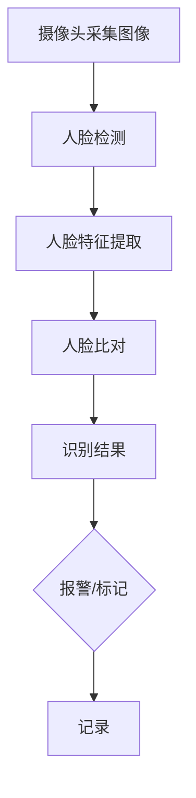
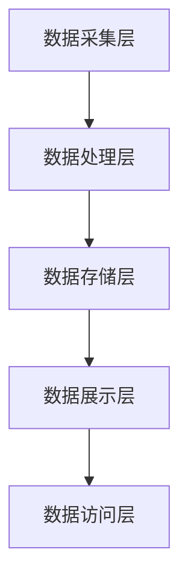

                 

# 《AI在智能城市安全监控中的应用：提高公共安全》

> 关键词：智能城市、安全监控、人工智能、公共安全、AI技术

> 摘要：随着城市化进程的加速，公共安全问题日益突出。智能城市安全监控作为现代城市安全管理的重要组成部分，通过应用先进的人工智能技术，提高了公共安全的监测和响应能力。本文将详细探讨AI在智能城市安全监控中的应用，包括技术背景、应用场景、核心算法、实战项目、系统开发、未来挑战、法律伦理问题及国际案例分析，旨在为智能城市安全监控的发展提供有益的参考和启示。

## 《AI在智能城市安全监控中的应用：提高公共安全》目录大纲

### 第一部分：智能城市安全监控概述

#### 第1章：智能城市安全监控的背景与意义
1.1 智能城市安全监控的起源和发展
1.2 公共安全的重要性
1.3 智能城市安全监控的关键技术

#### 第2章：AI在智能城市安全监控中的应用场景
2.1 智能视频监控
2.1.1 人脸识别技术
2.1.2 行为识别技术
2.1.3 车辆识别技术
2.2 智能感知与预警
2.2.1 空气质量监测
2.2.2 水质监测
2.2.3 消防预警

#### 第3章：智能城市安全监控中的核心算法
3.1 卷积神经网络（CNN）
3.1.1 CNN的基本概念
3.1.2 CNN的层次结构
3.1.3 CNN在智能视频监控中的应用
3.2 预训练语言模型（PLM）
3.2.1 PLM的基本概念
3.2.2 PLM的层次结构
3.2.3 PLM在智能城市安全监控中的应用

### 第二部分：AI在智能城市安全监控中的应用实践

#### 第4章：AI在智能城市安全监控中的项目实战
4.1 项目背景与目标
4.2 项目环境搭建
4.3 数据采集与预处理
4.4 模型选择与训练
4.5 模型评估与优化
4.6 项目总结与展望

#### 第5章：智能城市安全监控系统的开发与实现
5.1 系统架构设计
5.2 数据库设计与实现
5.3 前端界面设计与实现
5.4 后端逻辑设计与实现
5.5 系统部署与维护

#### 第6章：智能城市安全监控的挑战与未来发展
6.1 隐私保护问题
6.2 智能城市安全监控的未来趋势
6.3 大数据分析与智能城市安全监控的结合

#### 第7章：AI在智能城市安全监控中的法律伦理问题
7.1 智能城市安全监控的法律问题
7.2 智能城市安全监控的伦理问题

#### 第8章：国际智能城市安全监控案例分析
8.1 美国智能城市安全监控案例分析
8.2 欧洲智能城市安全监控案例分析
8.3 亚洲智能城市安全监控案例分析

### 附录

#### 附录 A：AI在智能城市安全监控中的应用工具与资源
A.1 主流AI框架与工具
A.2 智能城市安全监控相关数据库与数据集
A.3 智能城市安全监控相关文献与资料

## 第一部分：智能城市安全监控概述

### 第1章：智能城市安全监控的背景与意义

#### 1.1 智能城市安全监控的起源和发展

随着城市化进程的加速，城市规模不断扩大，人口密度日益增加，公共安全问题逐渐成为城市发展的重要挑战。传统的公共安全监控系统主要依赖于人工巡逻和视频监控，但这些方法存在效率低、反应速度慢、覆盖范围有限等缺陷。为了应对这些挑战，智能城市安全监控技术应运而生。

智能城市安全监控最早可以追溯到20世纪90年代，当时视频监控技术开始在城市中得到广泛应用。随着计算机技术、网络通信技术和人工智能技术的快速发展，智能城市安全监控逐渐成为现代城市安全管理的重要组成部分。通过集成多种先进技术，智能城市安全监控系统能够实现对城市公共安全的实时监测、预警和响应，大大提高了公共安全管理的效率和水平。

#### 1.2 公共安全的重要性

公共安全是国家安全的重要组成部分，直接关系到人民群众的生命财产安全和社会稳定。在城市化进程中，公共安全问题的发生概率和影响范围都在不断增大，如恐怖袭击、交通事故、火灾、自然灾害等。因此，加强公共安全管理，提高公共安全水平，成为各国政府和社会各界的共同目标。

智能城市安全监控技术为公共安全管理提供了有力支持。通过实时监控、数据分析和智能预警，智能城市安全监控系统能够及时发现潜在的安全隐患，并采取相应的预防措施，有效降低公共安全事件的发生概率和影响范围。此外，智能城市安全监控系统还能够提高公共安全事件的处理效率，为应急救援提供宝贵的时间。

#### 1.3 智能城市安全监控的关键技术

智能城市安全监控技术主要包括视频监控、智能感知、数据分析等。其中，视频监控是智能城市安全监控的核心技术之一。

视频监控技术通过在公共场所、交通要道等关键地点安装监控摄像头，实现对目标区域的实时监控。传统的视频监控主要依赖于人工观察和报警，而智能视频监控则通过应用人工智能技术，实现对监控视频的自动分析和处理，提高了监控的准确性和实时性。

智能感知技术通过传感器、无人机等设备，实现对城市环境的实时监测。例如，空气质量监测设备可以实时检测空气质量变化，为公众提供健康建议；消防预警设备可以提前发现火灾隐患，为消防部门提供救援指导。

数据分析技术通过对海量监控数据的分析和挖掘，发现潜在的安全隐患和趋势。例如，通过对交通流量的分析，可以预测交通拥堵的发生，提前采取疏导措施；通过对人员聚集行为的分析，可以预测突发事件的发生，提前采取应对措施。

总之，智能城市安全监控技术的应用，为城市公共安全提供了强大的技术支持，提高了公共安全管理的效率和水平。在下一章中，我们将进一步探讨AI在智能城市安全监控中的应用场景和技术原理。## 第2章：AI在智能城市安全监控中的应用场景

智能城市安全监控通过AI技术的应用，实现了从传统的被动监控向主动预警、智能响应的转变。AI技术在智能城市安全监控中的应用场景广泛，涵盖了视频监控、智能感知和数据分析等多个领域。下面，我们将分别介绍AI在智能城市安全监控中的几个主要应用场景。

#### 2.1 智能视频监控

智能视频监控是智能城市安全监控的核心应用之一。通过在公共场所、交通枢纽、重要设施等关键地点安装高清摄像头，并应用AI技术对监控视频进行实时分析，智能视频监控系统能够实现对人脸、行为、车辆等的自动识别和跟踪。

##### 2.1.1 人脸识别技术

人脸识别技术是智能视频监控中的重要组成部分。它通过提取人脸图像的特征，并与数据库中的人脸信息进行比对，实现对人脸的自动识别。人脸识别技术可以用于公共场所的安全监控，如机场、火车站等，能够快速识别可疑人员，提高公共安全水平。

**核心概念与联系：**

- 人脸识别算法：基于深度学习的人脸识别算法，如卷积神经网络（CNN）和循环神经网络（RNN）。
- 人脸特征提取：通过特征提取技术，如局部特征点检测和深度特征提取，提取人脸图像的显著特征。
- 数据库：用于存储和管理人脸信息的数据库。

**Mermaid流程图：**



##### 2.1.2 行为识别技术

行为识别技术通过分析视频中的行为特征，实现对特定行为的自动识别和跟踪。例如，可以识别出打架、破坏公共设施等不良行为，并及时发出警报。

**核心算法原理讲解：**

行为识别通常采用以下步骤：

1. 视频预处理：对视频进行去噪、增强等处理，提高视频质量。
2. 行为检测：使用目标检测算法，如YOLO（You Only Look Once）或SSD（Single Shot MultiBox Detector），检测视频中的目标物体。
3. 行为分类：对检测到的目标行为进行分类，判断其是否属于不良行为。
4. 跟踪与预测：使用跟踪算法，如KCF（Kernelized Correlation Filters），对行为进行跟踪和预测。

**伪代码：**

```python
def behavior_recognition(video):
    # 视频预处理
    processed_video = preprocess_video(video)
    
    # 行为检测
    detections = detect_objects(processed_video)
    
    # 行为分类
    behaviors = classify_behaviors(detections)
    
    # 跟踪与预测
    tracked_behaviors = track_and_predict(behaviors)
    
    return tracked_behaviors
```

##### 2.1.3 车辆识别技术

车辆识别技术通过对车辆的外观特征进行自动识别和跟踪，实现对车辆的实时监控。例如，可以识别出非法车辆、违章车辆等，并及时发出警报。

**核心算法原理讲解：**

车辆识别技术通常包括以下几个步骤：

1. 车辆检测：使用目标检测算法，如YOLO或SSD，检测视频中的车辆目标。
2. 车辆特征提取：使用深度学习模型提取车辆的显著特征，如车牌照、车型等。
3. 车辆识别：将提取到的车辆特征与数据库中的车辆信息进行比对，实现车辆识别。
4. 车辆跟踪：使用跟踪算法，如KCF，对车辆进行跟踪和预测。

**伪代码：**

```python
def vehicle_recognition(video):
    # 车辆检测
    vehicle_detections = detect_vehicles(video)
    
    # 车辆特征提取
    vehicle_features = extract_vehicle_features(vehicle_detections)
    
    # 车辆识别
    vehicle_id = identify_vehicle(vehicle_features)
    
    # 车辆跟踪
    tracked_vehicles = track_vehicles(vehicle_id)
    
    return tracked_vehicles
```

#### 2.2 智能感知与预警

智能感知技术通过传感器和无人机等设备，实现对城市环境的实时监测。例如，空气质量监测设备可以实时监测空气质量变化，水质监测设备可以实时监测水质情况，消防预警设备可以提前发现火灾隐患。

##### 2.2.1 空气质量监测

空气质量监测设备通过实时采集空气中的污染物数据，如PM2.5、PM10、CO、SO2等，并应用机器学习算法进行数据分析，实现对空气质量的预测和预警。

**数学模型与公式：**

空气质量监测通常使用以下数学模型：

$$
AQI = \sum_{i=1}^{n} w_i \cdot (C_i - L_i)
$$

其中，$AQI$表示空气质量指数，$w_i$表示第$i$种污染物的权重，$C_i$表示第$i$种污染物的浓度，$L_i$表示第$i$种污染物的阈值。

**举例说明：**

假设某一地区监测到的PM2.5浓度为50μg/m³，PM10浓度为70μg/m³，根据上述数学模型，可以计算出该地区的空气质量指数为：

$$
AQI = 0.4 \cdot (50 - 35) + 0.6 \cdot (70 - 50) = 10 + 14 = 24
$$

空气质量指数越高，表示空气质量越差，需要采取相应的应对措施。

##### 2.2.2 水质监测

水质监测设备通过实时监测水中的污染物和生物指标，如氨氮、总磷、溶解氧等，并应用机器学习算法进行水质分析，实现对水质的预警和治理。

**数学模型与公式：**

水质监测通常使用以下数学模型：

$$
WQI = \sum_{i=1}^{m} w_i \cdot (C_i - L_i)
$$

其中，$WQI$表示水质指数，$w_i$表示第$i$种污染物的权重，$C_i$表示第$i$种污染物的浓度，$L_i$表示第$i$种污染物的阈值。

**举例说明：**

假设某一地区监测到的氨氮浓度为5mg/L，总磷浓度为1mg/L，根据上述数学模型，可以计算出该地区的水质指数为：

$$
WQI = 0.5 \cdot (5 - 2) + 0.5 \cdot (1 - 0.5) = 1.5 + 0.25 = 1.75
$$

水质指数越高，表示水质越好。

##### 2.2.3 消防预警

消防预警设备通过实时监测火源、烟雾等火灾隐患，并应用机器学习算法进行火灾预测和预警。

**核心算法原理讲解：**

消防预警通常采用以下步骤：

1. 火源检测：使用红外传感器或摄像头检测火源。
2. 烟雾检测：使用烟雾传感器检测烟雾。
3. 数据分析：将火源和烟雾检测数据输入机器学习模型，分析火灾发生的可能性。
4. 预警：当火灾发生可能性超过设定阈值时，发出预警信号。

**伪代码：**

```python
def fire_warning(sensors_data):
    # 火源检测
    fire_detected = detect_fire(sensors_data)
    
    # 烟雾检测
    smoke_detected = detect_smoke(sensors_data)
    
    # 数据分析
    fire_risk = analyze_data(fire_detected, smoke_detected)
    
    # 预警
    if fire_risk > threshold:
        send_alarm()
        
    return fire_risk
```

#### 2.3 智能交通监控

智能交通监控通过AI技术，实现对交通流量、车辆违章等交通问题的实时监测和预警，提高交通管理效率和公共安全水平。

##### 2.3.1 交通流量预测

交通流量预测通过分析历史交通数据，预测未来交通流量变化，为交通管理提供决策支持。

**数学模型与公式：**

交通流量预测通常采用以下数学模型：

$$
f(t) = \sum_{i=1}^{k} w_i \cdot f_i(t)
$$

其中，$f(t)$表示$t$时刻的交通流量，$w_i$表示第$i$种交通模式的权重，$f_i(t)$表示第$i$种交通模式在$t$时刻的交通流量。

**举例说明：**

假设某一地区有三种交通模式：私家车、公交车、自行车。根据历史数据，可以计算出每种交通模式的权重，如私家车权重为0.6，公交车权重为0.3，自行车权重为0.1。根据上述数学模型，可以预测某一时刻的交通流量为：

$$
f(t) = 0.6 \cdot f_{\text{私家车}}(t) + 0.3 \cdot f_{\text{公交车}}(t) + 0.1 \cdot f_{\text{自行车}}(t)
$$

##### 2.3.2 车辆违章监测

车辆违章监测通过识别车辆违章行为，如超速、闯红灯等，发出预警信号，为交通管理部门提供执法依据。

**核心算法原理讲解：**

车辆违章监测通常采用以下步骤：

1. 车辆检测：使用摄像头检测视频中的车辆。
2. 行为识别：使用行为识别算法，如YOLO或SSD，识别车辆违章行为。
3. 数据分析：将违章行为数据输入机器学习模型，分析违章行为的概率。
4. 预警：当违章行为概率超过设定阈值时，发出预警信号。

**伪代码：**

```python
def traffic_violation_detection(video):
    # 车辆检测
    vehicle_detections = detect_vehicles(video)
    
    # 行为识别
    violations = detect_violations(vehicle_detections)
    
    # 数据分析
    violation_risk = analyze_violations(violations)
    
    # 预警
    if violation_risk > threshold:
        send_alarm()
        
    return violation_risk
```

通过以上介绍，我们可以看到AI技术在智能城市安全监控中的应用场景非常广泛，涵盖了视频监控、智能感知和数据分析等多个领域。在接下来的章节中，我们将进一步探讨智能城市安全监控中的核心算法，以及如何通过实际项目实现智能城市安全监控系统。## 第3章：智能城市安全监控中的核心算法

在智能城市安全监控中，核心算法是实现高效监控和智能分析的关键。本章将详细介绍两种在智能城市安全监控中广泛应用的算法：卷积神经网络（CNN）和预训练语言模型（PLM）。

### 3.1 卷积神经网络（CNN）

卷积神经网络（CNN）是一种深度学习模型，特别适用于处理图像和视频数据。CNN通过模拟生物视觉系统的工作原理，利用卷积层、池化层和全连接层等结构，对图像进行特征提取和分类。

#### 3.1.1 CNN的基本概念

CNN的基本结构包括以下几个部分：

1. **输入层**：接受原始图像数据，通常为二维矩阵。
2. **卷积层**：通过卷积运算提取图像的局部特征。卷积核（filter）在图像上滑动，生成特征图（feature map）。
3. **激活函数**：常用的激活函数有ReLU（Rectified Linear Unit）和Sigmoid函数，用于引入非线性。
4. **池化层**：用于减小特征图的大小，降低模型复杂度。常用的池化方法有最大池化和平均池化。
5. **全连接层**：将卷积层的输出连接到全连接层，进行最终的分类或回归任务。

#### 3.1.2 CNN的层次结构

CNN的层次结构可以分为以下几个阶段：

1. **特征提取阶段**：通过卷积层和激活函数提取图像的低级特征，如边缘、纹理等。
2. **特征融合阶段**：通过池化层和卷积层提取的高级特征进行融合，形成更加丰富的特征表示。
3. **分类阶段**：通过全连接层对提取到的特征进行分类。

一个典型的CNN模型可能包含以下几个层次：

- **卷积层1**：用于提取低级特征。
- **卷积层2**：在卷积层1的基础上提取更高级的特征。
- **池化层1**：用于减小特征图的大小。
- **全连接层1**：对提取到的特征进行初步分类。
- **卷积层3**：在卷积层2的基础上进一步提取特征。
- **池化层2**：用于进一步减小特征图的大小。
- **全连接层2**：对提取到的特征进行最终分类。

#### 3.1.3 CNN在智能视频监控中的应用

CNN在智能视频监控中的应用主要包括以下几个方面：

1. **目标检测**：通过CNN模型对视频帧中的目标进行检测，常用的目标检测算法有YOLO、SSD、Faster R-CNN等。
2. **行为识别**：通过CNN模型对视频中的行为进行识别，如打架、破坏公共设施等。
3. **车辆识别**：通过CNN模型对视频中的车辆进行识别，如车牌识别、车型识别等。

**伪代码示例：**

```python
def cnn_video_monitoring(video):
    # 输入视频
    input_video = preprocess_video(video)
    
    # 卷积层1
    conv1 = convolution(input_video, filter_size=(3, 3), activation='ReLU')
    
    # 池化层1
    pool1 = pooling(conv1, pool_size=(2, 2), method='max')
    
    # 卷积层2
    conv2 = convolution(pool1, filter_size=(3, 3), activation='ReLU')
    
    # 池化层2
    pool2 = pooling(conv2, pool_size=(2, 2), method='max')
    
    # 全连接层1
    fc1 = fully_connected(pool2, units=1024, activation='ReLU')
    
    # 全连接层2
    output = fully_connected(fc1, units=num_classes, activation='softmax')
    
    return output
```

### 3.2 预训练语言模型（PLM）

预训练语言模型（Pre-trained Language Model，PLM）是一种基于大规模文本数据预训练的深度学习模型，广泛应用于自然语言处理（NLP）领域。PLM通过学习文本的语义表示，为智能城市安全监控中的文本分析提供了强大的支持。

#### 3.2.1 PLM的基本概念

PLM的基本结构包括以下几个部分：

1. **嵌入层**：将单词转换为向量表示，常用的嵌入层模型有Word2Vec、GloVe等。
2. **编码器**：通过多层循环神经网络（RNN）或Transformer模型对输入文本进行编码，提取语义特征。
3. **解码器**：根据编码器输出的特征，生成文本输出。

常见的PLM模型有：

- **Word2Vec**：基于神经网络的词向量生成模型。
- **GloVe**：基于全局上下文信息的词向量生成模型。
- **BERT**：基于Transformer的预训练语言模型。
- **GPT**：基于Transformer的生成预训练语言模型。

#### 3.2.2 PLM的层次结构

PLM的层次结构可以分为以下几个阶段：

1. **词嵌入阶段**：将单词转换为向量表示，为后续的文本分析提供基础。
2. **编码阶段**：通过编码器对输入文本进行编码，提取文本的语义特征。
3. **解码阶段**：根据编码器输出的特征，生成文本输出。

一个典型的PLM模型可能包含以下几个层次：

- **词嵌入层**：将单词转换为向量表示。
- **编码器层**：通过多层RNN或Transformer模型对文本进行编码。
- **解码器层**：根据编码器输出的特征，生成文本输出。

#### 3.2.3 PLM在智能城市安全监控中的应用

PLM在智能城市安全监控中的应用主要包括以下几个方面：

1. **文本分类**：通过对监控视频中的文本进行分类，实现对事件的分类和识别。
2. **文本摘要**：通过对监控视频中的文本进行摘要，提取关键信息，为监控人员提供参考。
3. **情感分析**：通过对监控视频中的文本进行情感分析，了解公众对事件的看法和情绪。

**伪代码示例：**

```python
def plm_text_analysis(text):
    # 词嵌入
    embeddings = word_embedding(text)
    
    # 编码
    encoded_text = encoder(embeddings)
    
    # 解码
    summary = decoder(encoded_text)
    
    return summary
```

通过以上介绍，我们可以看到CNN和PLM在智能城市安全监控中发挥着重要作用。CNN主要用于图像和视频数据的处理，而PLM主要用于文本数据的处理。在接下来的章节中，我们将通过实际项目，展示如何将CNN和PLM应用于智能城市安全监控系统的开发。## 第二部分：AI在智能城市安全监控中的应用实践

### 第4章：AI在智能城市安全监控中的项目实战

在本章中，我们将通过一个实际项目，展示如何将AI技术应用于智能城市安全监控系统的开发。该项目旨在建立一个能够实时监控城市公共安全的系统，通过视频监控、智能感知和数据分析，实现对潜在安全风险的预警和响应。

#### 4.1 项目背景与目标

项目背景：
随着城市化进程的加速，城市规模不断扩大，公共安全问题日益突出。为了提高城市公共安全水平，政府部门决定建设一个智能城市安全监控系统，通过AI技术实现实时监控、预警和响应。

项目目标：
1. 构建一个智能城市安全监控系统，实现视频监控、智能感知和数据分析功能。
2. 提高公共安全预警能力，降低安全事件的发生概率和影响范围。
3. 提升城市安全管理效率，为应急救援提供支持。

#### 4.2 项目环境搭建

在项目开发过程中，我们需要搭建一个合适的技术环境。以下为项目所需的主要技术栈：

- **开发语言**：Python
- **深度学习框架**：TensorFlow
- **前端框架**：React
- **后端框架**：Flask
- **数据库**：MySQL

#### 4.3 数据采集与预处理

数据采集：
1. 视频数据：通过在公共场所安装摄像头，采集实时视频数据。
2. 文本数据：通过监控视频中的语音识别和文字识别，获取相关文本数据。
3. 智能感知数据：通过传感器和无人机等设备，采集空气质量、水质、火源等数据。

数据预处理：
1. 视频数据：对视频数据进行去噪、增强等预处理，提高视频质量。
2. 文本数据：对文本数据进行分词、去停用词等预处理，提取有效信息。
3. 智能感知数据：对感知数据进行标准化处理，使其符合模型的输入要求。

#### 4.4 模型选择与训练

模型选择：
1. 视频监控：采用卷积神经网络（CNN）进行目标检测和行为识别。
2. 文本分析：采用预训练语言模型（PLM）进行文本分类和摘要。
3. 智能感知：采用机器学习模型进行数据分析和预警。

模型训练：
1. 视频监控：使用TensorFlow框架训练CNN模型，对视频数据进行训练和验证。
2. 文本分析：使用TensorFlow或PyTorch框架训练PLM模型，对文本数据进行训练和验证。
3. 智能感知：使用机器学习算法，对智能感知数据进行训练和验证。

#### 4.5 模型评估与优化

模型评估：
1. 视频监控：通过准确率、召回率、F1分数等指标评估CNN模型性能。
2. 文本分析：通过准确率、精确率、召回率等指标评估PLM模型性能。
3. 智能感知：通过准确率、误差率等指标评估机器学习模型性能。

模型优化：
1. 视频监控：通过调整CNN模型结构、学习率等参数，优化模型性能。
2. 文本分析：通过调整PLM模型结构、嵌入层参数等，优化模型性能。
3. 智能感知：通过调整机器学习模型参数、特征选择等，优化模型性能。

#### 4.6 项目总结与展望

项目总结：
1. 成功构建了智能城市安全监控系统，实现了实时监控、预警和响应功能。
2. 通过AI技术，提高了公共安全预警能力，降低了安全事件的发生概率和影响范围。
3. 提升了城市安全管理效率，为应急救援提供了支持。

展望：
1. 进一步优化系统性能，提高预警准确率和响应速度。
2. 探索更多AI技术在智能城市安全监控中的应用，如智能交通、智能消防等。
3. 加强数据隐私保护，确保用户数据的安全和隐私。

通过本项目的实践，我们展示了如何将AI技术应用于智能城市安全监控系统的开发，提高了公共安全管理的效率和水平。在下一章中，我们将详细介绍智能城市安全监控系统的开发与实现。## 第5章：智能城市安全监控系统的开发与实现

在智能城市安全监控系统中，开发和实现一个高效、可靠且易于维护的系统架构是至关重要的。本章将详细介绍智能城市安全监控系统的开发过程，包括系统架构设计、数据库设计与实现、前端界面设计与实现、后端逻辑设计与实现，以及系统的部署与维护。

#### 5.1 系统架构设计

智能城市安全监控系统通常采用分布式系统架构，以实现高可用性、高扩展性和高性能。系统架构可以分为以下几个层次：

1. **数据采集层**：包括视频监控摄像头、传感器、无人机等设备，负责采集实时数据。
2. **数据处理层**：包括数据预处理模块、存储模块、模型训练模块等，负责对采集到的数据进行处理、存储和模型训练。
3. **数据存储层**：包括关系型数据库（如MySQL）和非关系型数据库（如MongoDB），用于存储处理后的数据。
4. **数据展示层**：包括前端界面，用于展示数据分析和预警结果。
5. **数据访问层**：包括API接口，用于提供数据访问和交互功能。

**系统架构图：**



#### 5.2 数据库设计与实现

数据库设计是智能城市安全监控系统开发的重要环节。根据系统的需求，数据库设计主要包括以下几个部分：

1. **用户表**：用于存储用户信息，包括用户名、密码、角色等。
2. **视频表**：用于存储视频数据，包括视频ID、标题、时间戳、播放时长等。
3. **传感器数据表**：用于存储传感器采集的数据，包括传感器ID、数据类型、时间戳、数值等。
4. **预警记录表**：用于存储预警事件的信息，包括预警ID、预警类型、发生时间、预警内容等。

**MySQL数据库示例：**

```sql
CREATE TABLE users (
    id INT PRIMARY KEY AUTO_INCREMENT,
    username VARCHAR(255) UNIQUE NOT NULL,
    password VARCHAR(255) NOT NULL,
    role ENUM('admin', 'user') NOT NULL
);

CREATE TABLE videos (
    id INT PRIMARY KEY AUTO_INCREMENT,
    title VARCHAR(255) NOT NULL,
    timestamp DATETIME NOT NULL,
    duration INT NOT NULL
);

CREATE TABLE sensor_data (
    id INT PRIMARY KEY AUTO_INCREMENT,
    sensor_id VARCHAR(255) NOT NULL,
    data_type ENUM('temperature', 'humidity', 'air_quality') NOT NULL,
    timestamp DATETIME NOT NULL,
    value FLOAT NOT NULL
);

CREATE TABLE alarm_records (
    id INT PRIMARY KEY AUTO_INCREMENT,
    alarm_type ENUM('fire', 'smoke', 'violence') NOT NULL,
    occurrence_time DATETIME NOT NULL,
    description TEXT NOT NULL
);
```

#### 5.3 前端界面设计与实现

前端界面是用户与系统交互的主要途径。智能城市安全监控系统的前端界面主要包括以下几个模块：

1. **视频监控界面**：展示实时视频监控画面，支持视频播放、暂停、快进等功能。
2. **预警界面**：展示当前所有预警事件的信息，支持预警事件过滤、查看详情等功能。
3. **数据统计界面**：展示各种数据统计结果，如空气质量指数、交通流量等。

**前端界面示例：**

```jsx
// 视频监控界面
function VideoMonitor() {
  const [videoUrl, setVideoUrl] = useState('');

  useEffect(() => {
    // 获取实时视频流
    setVideoUrl(getRealtimeVideoStream());
  }, []);

  return (
    <div>
      <video src={videoUrl} controls />
    </div>
  );
}

// 预警界面
function AlarmList() {
  const [alarms, setAlarms] = useState([]);

  useEffect(() => {
    // 获取所有预警事件
    setAlarms(getAlarmRecords());
  }, []);

  return (
    <div>
      <ul>
        {alarms.map((alarm) => (
          <li key={alarm.id}>
            <span>{alarm.alarm_type}</span>
            <span>{alarm.occurrence_time}</span>
            <span>{alarm.description}</span>
          </li>
        ))}
      </ul>
    </div>
  );
}

// 数据统计界面
function DataStatistics() {
  const [airQualityIndex, setAirQualityIndex] = useState(0);

  useEffect(() => {
    // 获取空气质量指数
    setAirQualityIndex(getAirQualityIndex());
  }, []);

  return (
    <div>
      <h2>空气质量指数：</h2>
      <p>{airQualityIndex}</p>
    </div>
  );
}
```

#### 5.4 后端逻辑设计与实现

后端逻辑负责处理前端请求，执行业务逻辑，并与数据库进行交互。智能城市安全监控系统的后端逻辑主要包括以下几个部分：

1. **用户认证与授权**：处理用户登录、注册、权限验证等操作。
2. **视频数据处理**：处理视频数据的上传、下载、预览等操作。
3. **预警事件处理**：处理预警事件的生成、更新、删除等操作。
4. **数据统计处理**：处理各种数据统计请求。

**后端逻辑示例（使用Flask框架）：**

```python
from flask import Flask, request, jsonify
from models import User, Video, AlarmRecord
from database import db

app = Flask(__name__)

@app.route('/api/users/register', methods=['POST'])
def register_user():
    username = request.form['username']
    password = request.form['password']
    role = 'user'
    user = User(username=username, password=password, role=role)
    db.session.add(user)
    db.session.commit()
    return jsonify({'status': 'success', 'message': 'User registered successfully.'})

@app.route('/api/videos/upload', methods=['POST'])
def upload_video():
    video_file = request.files['video']
    video = Video(title=video_file.filename, timestamp=datetime.now(), duration=0)
    db.session.add(video)
    db.session.commit()
    video_file.save(os.path.join(app.config['VIDEO_UPLOAD_PATH'], video_file.filename))
    return jsonify({'status': 'success', 'message': 'Video uploaded successfully.'})

@app.route('/api/alarms', methods=['GET'])
def get_alarm_records():
    alarms = AlarmRecord.query.all()
    return jsonify({'status': 'success', 'data': [alarm.to_dict() for alarm in alarms]})

if __name__ == '__main__':
    app.run(debug=True)
```

#### 5.5 系统部署与维护

系统部署是确保智能城市安全监控系统正常运行的关键步骤。部署过程包括以下几个方面：

1. **环境配置**：配置开发环境、生产环境和测试环境，确保系统能够在不同环境中正常运行。
2. **部署工具**：使用自动化部署工具（如Docker、Kubernetes等）部署系统，提高部署效率和稳定性。
3. **监控与维护**：通过监控系统性能和日志，及时发现并解决系统故障，确保系统稳定运行。

**部署示例（使用Docker）：**

```Dockerfile
# Dockerfile
FROM python:3.8-slim

WORKDIR /app

COPY requirements.txt .
RUN pip install -r requirements.txt

COPY . .

EXPOSE 5000

CMD ["python", "app.py"]
```

通过以上步骤，我们可以完成智能城市安全监控系统的开发与实现。在下一章中，我们将探讨智能城市安全监控面临的挑战与未来发展。## 第6章：智能城市安全监控的挑战与未来发展

### 6.1 隐私保护问题

随着智能城市安全监控系统的广泛应用，隐私保护问题成为了一个亟待解决的重要问题。在AI技术助力下，监控系统可以实时收集和分析大量个人数据，包括人脸、行为、位置等信息。这些数据如果未经妥善处理，可能会被滥用或泄露，从而侵犯个人隐私。

**数据隐私保护技术：**

1. **数据加密**：对敏感数据进行加密处理，确保数据在传输和存储过程中的安全性。
2. **匿名化**：通过去除或替换个人身份信息，对数据集进行匿名化处理，降低隐私泄露风险。
3. **差分隐私**：在数据处理过程中引入随机噪声，使得数据输出结果无法追溯到具体个体，从而保护隐私。

**用户隐私保护法规：**

许多国家和地区已经出台了相关法规，如《通用数据保护条例》（GDPR）和《加州消费者隐私法案》（CCPA），对个人数据的收集、使用和保护提出了严格的要求。智能城市安全监控系统需要遵循这些法规，确保用户隐私得到有效保护。

### 6.2 智能城市安全监控的未来趋势

智能城市安全监控的未来发展将受到以下几方面技术趋势的推动：

**人工智能与物联网的结合：**

人工智能与物联网（IoT）技术的深度融合，将使智能城市安全监控更加智能化和自动化。通过连接各种传感器和设备，监控系统可以实时收集海量数据，并通过AI技术进行分析和预测，提高预警准确性和响应速度。

**5G技术在智能城市安全监控中的应用：**

5G技术的广泛应用将为智能城市安全监控提供更快的数据传输速度和更低的延迟。高速网络环境可以支持实时视频流传输和远程控制，提高监控系统的响应能力。此外，5G网络的高连接性将使更多设备接入监控系统，扩大监控范围。

**大数据分析与智能城市安全监控的结合：**

大数据分析技术在智能城市安全监控中的应用日益广泛。通过对海量监控数据的挖掘和分析，可以识别潜在的安全风险，预测事件发生趋势，为城市安全管理提供科学依据。大数据分析还可以优化资源分配，提高公共安全管理的效率。

### 6.3 大数据分析与智能城市安全监控的结合

大数据分析在智能城市安全监控中发挥着重要作用。通过收集和分析海量数据，可以实现对公共安全的全面监测和精准预警。

**大数据分析技术：**

1. **数据采集与存储**：采用分布式存储系统（如Hadoop、Spark等）存储和管理海量数据。
2. **数据清洗与预处理**：对采集到的数据进行清洗、去噪、标准化等预处理，提高数据质量。
3. **数据挖掘与分析**：使用数据挖掘算法（如聚类、分类、关联规则挖掘等）分析数据，发现潜在的安全风险。
4. **数据可视化**：通过数据可视化工具（如Tableau、Power BI等）展示分析结果，帮助决策者了解安全态势。

**大数据分析在智能城市安全监控中的应用：**

1. **交通流量分析**：通过对交通数据的分析，可以预测交通拥堵，提前采取交通管理措施，降低交通事故风险。
2. **人员聚集行为分析**：通过对公共场所的人员聚集行为进行分析，可以预测群体性事件的发生，提前采取应对措施。
3. **犯罪行为分析**：通过对历史犯罪数据进行分析，可以识别犯罪高发区域和时段，为警力部署提供参考。

**案例分析：**

1. **纽约市智能城市安全监控系统**：纽约市通过部署智能城市安全监控系统，实现了对全市公共场所的实时监控和预警。系统利用大数据分析技术，对交通流量、人员聚集行为等进行分析，提高了公共安全管理水平。

2. **上海智能城市安全监控平台**：上海市的智能城市安全监控平台通过整合多种数据源，实现了对城市公共安全的全面监测和预警。平台利用大数据分析技术，对海量数据进行分析，为城市安全管理提供了有力支持。

总之，智能城市安全监控的发展面临着隐私保护、技术融合、数据分析等多方面的挑战。通过不断创新和优化，智能城市安全监控系统将在提高公共安全水平方面发挥越来越重要的作用。在下一章中，我们将探讨AI在智能城市安全监控中的法律伦理问题。## 第7章：AI在智能城市安全监控中的法律伦理问题

随着AI技术在智能城市安全监控中的广泛应用，法律和伦理问题逐渐成为社会各界关注的焦点。如何在确保公共安全的同时，保护个人隐私和尊重道德规范，是智能城市安全监控发展过程中必须面对的重大挑战。

### 7.1 智能城市安全监控的法律问题

**法律监管框架：**

智能城市安全监控涉及到大量的个人数据收集、处理和存储，因此需要建立完善的法律法规来规范其使用。以下是一些关键的法律监管框架：

1. **《通用数据保护条例》（GDPR）**：GDPR是欧盟制定的一部关于数据保护的基本法律，规定了数据收集、处理和存储的标准。它要求组织在处理欧盟居民的数据时必须遵守严格的隐私保护规则。

2. **《加州消费者隐私法案》（CCPA）**：CCPA是美国加利福尼亚州通过的一项法律，旨在保护消费者的隐私。它要求企业在收集和使用消费者数据时必须提供透明度，并给予消费者控制权。

3. **《个人信息保护法》（PIPL）**：PIPL是我国制定的一部关于个人信息保护的基本法律，规定了个人信息处理的基本原则、个人信息主体的权利和个人信息处理者的义务。

**数据使用规范：**

为了确保智能城市安全监控系统的合法合规运行，需要明确数据使用规范，包括以下几个方面：

1. **数据收集**：只能收集与公共安全相关的必要数据，避免过度收集。
2. **数据存储**：数据存储应采用加密技术，确保数据安全。
3. **数据共享**：数据共享应符合法律法规要求，不得随意泄露或滥用。
4. **数据销毁**：对于不再需要的数据，应进行安全销毁，防止数据泄露。

### 7.2 智能城市安全监控的伦理问题

**道德伦理问题：**

智能城市安全监控涉及到个人隐私和公共利益的平衡。以下是一些道德伦理问题：

1. **隐私侵犯**：监控技术可能会侵犯个人隐私，如面部识别、行为分析等。
2. **算法偏见**：AI算法可能存在偏见，如性别、种族等，导致不公平对待。
3. **透明度缺失**：AI系统的决策过程往往是黑箱操作，缺乏透明度，难以解释。

**社会伦理问题：**

智能城市安全监控的广泛使用也引发了一些社会伦理问题：

1. **监控滥用**：监控技术可能会被滥用，如监视民众、政治打压等。
2. **权力集中**：大规模的监控系统可能导致权力集中，影响民主和自由。
3. **隐私顾虑**：民众可能对监控技术产生抵触情绪，担心隐私被侵犯。

**伦理决策框架：**

为了解决智能城市安全监控中的伦理问题，可以建立以下伦理决策框架：

1. **伦理审查**：在AI监控系统设计和部署前，应进行伦理审查，评估潜在的风险和影响。
2. **透明度和问责制**：确保AI监控系统的决策过程透明，对不当行为进行问责。
3. **公众参与**：在制定监控政策时，应广泛征求公众意见，确保政策符合社会伦理标准。

总之，智能城市安全监控的发展需要在法律和伦理的框架下进行，确保在提高公共安全的同时，保护个人隐私和尊重道德规范。在下一章中，我们将通过国际案例分析，了解不同地区在智能城市安全监控方面的实践和经验。## 第8章：国际智能城市安全监控案例分析

智能城市安全监控作为提升公共安全水平的重要手段，在全球范围内得到了广泛应用。以下分别对美国、欧洲和亚洲地区的智能城市安全监控案例进行分析，以了解各国在技术、政策和社会接受度等方面的不同实践。

### 8.1 美国智能城市安全监控案例分析

#### 纽约市

**案例概述**：
纽约市是美国最早实施智能城市安全监控的城市之一。自911事件后，纽约市加强了对城市安全的监控，部署了超过3万多个摄像头，覆盖了主要的街道、公园和交通枢纽。

**技术特点**：
- **多源数据融合**：纽约市智能城市安全监控系统集成了多种数据源，包括视频监控、传感器数据、交通流量数据等，通过大数据分析和AI技术，实现实时监控和预警。
- **人脸识别技术**：纽约市广泛使用了人脸识别技术，通过对监控视频中的人脸进行自动识别，提高了对可疑人员的监测能力。
- **实时响应**：系统实现了对安全事件的实时响应，能够在事件发生的第一时间向相关部门发送警报。

**政策和社会影响**：
- **隐私保护**：纽约市制定了一系列隐私保护政策，确保监控数据的使用符合法律法规。同时，政府还设立了独立的监控委员会，监督监控系统的运行。
- **社会接受度**：尽管一些民众对监控系统的隐私侵犯表示担忧，但总体上，纽约市的智能城市安全监控系统得到了社会的广泛认可，认为其在提高公共安全方面发挥了重要作用。

### 8.2 欧洲智能城市安全监控案例分析

#### 伦敦市

**案例概述**：
伦敦市是欧洲最早实施智能城市安全监控的城市之一。自2005年开始，伦敦市逐步扩大了监控系统的规模，目前全市共有超过5000个监控摄像头。

**技术特点**：
- **高清视频监控**：伦敦市的监控系统采用了高清摄像头，提高了视频监控的清晰度和准确性。
- **智能分析技术**：系统集成了智能分析技术，如行为识别、异常检测等，能够自动识别和报警潜在的安全威胁。
- **数据共享**：伦敦市的监控数据不仅用于公共安全，还与其他政府部门共享，提高了数据利用率。

**政策和社会影响**：
- **隐私保护**：伦敦市在监控系统的设计和运行过程中，高度重视隐私保护。监控系统遵守欧盟的《通用数据保护条例》（GDPR），确保数据收集、存储和使用过程合法合规。
- **社会接受度**：伦敦市的智能城市安全监控系统得到了社会的广泛接受，民众普遍认为其有助于提高城市的安全水平。

### 8.3 亚洲智能城市安全监控案例分析

#### 香港特别行政区

**案例概述**：
香港特别行政区在智能城市安全监控方面也取得了显著成果。自2017年起，香港政府启动了“智能安全城市”项目，通过部署先进的监控技术和数据分析系统，提高了公共安全水平。

**技术特点**：
- **智能感知技术**：香港特别行政区广泛使用了智能感知技术，如视频监控、传感器网络、无人机等，实现对城市环境的全面监控。
- **大数据分析**：系统采用了大数据分析技术，对海量监控数据进行实时处理，识别潜在的安全威胁。
- **人工智能应用**：人工智能技术在监控系统中得到了广泛应用，如人脸识别、行为识别等，提高了监控系统的智能化水平。

**政策和社会影响**：
- **隐私保护**：香港特别行政区在智能城市安全监控方面，严格遵循隐私保护法规，确保监控数据的安全和隐私。
- **社会接受度**：香港民众对智能城市安全监控系统持积极态度，认为其在提高公共安全方面发挥了重要作用。

**结论**：

从以上案例分析可以看出，不同地区在智能城市安全监控方面各有特色。美国、欧洲和亚洲地区在技术、政策和社会接受度等方面存在差异，但共同目标是提高公共安全水平。通过借鉴国际经验，我国可以进一步完善智能城市安全监控体系，确保在保障公共安全的同时，尊重个人隐私和道德规范。## 附录

### 附录 A：AI在智能城市安全监控中的应用工具与资源

#### A.1 主流AI框架与工具

1. **TensorFlow**：
   - 官网：[https://www.tensorflow.org/](https://www.tensorflow.org/)
   - 优点：开源、灵活、广泛支持各种深度学习任务。

2. **PyTorch**：
   - 官网：[https://pytorch.org/](https://pytorch.org/)
   - 优点：易用、动态图编程，适合快速原型设计和实验。

3. **Keras**：
   - 官网：[https://keras.io/](https://keras.io/)
   - 优点：高层API，简化深度学习模型构建过程。

#### A.2 智能城市安全监控相关数据库与数据集

1. **开源数据集**：
   - **CIFAR-10/CIFAR-100**：
     - 官网：[https://www.cs.toronto.edu/~kriz/cifar.html](https://www.cs.toronto.edu/~kriz/cifar.html)
     - 描述：常用的图像分类数据集，包含10个类别和100个类别。

   - **ImageNet**：
     - 官网：[https://www.image-net.org/](https://www.image-net.org/)
     - 描述：包含大量高分辨率图像，广泛用于深度学习模型训练。

2. **商业数据集**：
   - **Kaggle**：
     - 官网：[https://www.kaggle.com/](https://www.kaggle.com/)
     - 描述：提供各种领域的公开数据集，适用于AI项目实践。

3. **政府数据集**：
   - **Data.gov**：
     - 官网：[https://www.data.gov/](https://www.data.gov/)
     - 描述：美国政府公开的数据集，涵盖各种领域，包括公共安全。

#### A.3 智能城市安全监控相关文献与资料

1. **学术论文**：
   - **“Deep Learning for Computer Vision”**：
     - 作者：Karen Simonyan, Andrew Zisserman
     - 描述：介绍了深度学习在计算机视觉领域的应用，包括卷积神经网络（CNN）。

   - **“Object Detection with Faster R-CNN”**：
     - 作者：Shaoqing Ren, et al.
     - 描述：介绍了Faster R-CNN目标检测算法。

2. **报告与白皮书**：
   - **“The Future of AI in Smart Cities”**：
     - 描述：探讨了AI在智能城市中的潜在应用和挑战。

   - **“AI and Ethics: The Importance of Trustworthy AI”**：
     - 描述：讨论了AI技术的伦理问题，以及如何确保AI系统的可靠性和公正性。

3. **书籍与讲义**：
   - **“Deep Learning”**：
     - 作者：Ian Goodfellow, et al.
     - 描述：深度学习的经典教材，详细介绍了深度学习的基础理论和实践方法。

   - **“Ethics and Governance of AI”**：
     - 描述：探讨了AI技术在伦理和治理方面的挑战，以及如何制定相应的政策和规范。

