                 

### 第一部分：引言与背景

在快速城市化的现代社会，如何有效地管理城市资源、提高居民生活质量成为了一个亟待解决的问题。随着人工智能（AI）技术的迅猛发展，AI在智能城市规划中的应用逐渐引起了广泛关注。本文将探讨AI在智能城市规划中的应用，重点分析其在提高生活质量方面的潜力与挑战。

#### 第一部分：引言与背景

## 第1章：AI与智能城市规划概述

### 1.1 AI技术的概述

人工智能，简称为AI，是一种模拟人类智能行为的计算机技术。AI的核心目标是使机器能够执行复杂的决策、学习和推理任务，从而解决传统方法难以处理的问题。AI技术的发展历程可以追溯到20世纪50年代，经过数十年的人工智能寒冬和复苏，如今AI已经在诸多领域取得了显著成果，如图像识别、自然语言处理、机器学习等。

### 1.2 智能城市规划的定义

智能城市规划是一种以数据驱动的城市规划方法，通过利用AI技术、物联网、大数据等现代信息技术，对城市资源进行高效管理，提升城市运行效率和居民生活质量。智能城市规划的目标包括：

- 提高城市资源利用效率
- 改善居民生活质量
- 促进城市可持续发展
- 提升城市治理水平

### 1.3 AI在智能城市规划中的重要性

AI技术在智能城市规划中的应用具有重要意义，主要体现在以下几个方面：

1. **提高生活质量**：通过智能交通管理、智慧医疗、智慧教育等应用，AI能够有效缓解城市拥堵、提高医疗资源配置效率、优化教育资源分配，从而提高居民生活质量。

2. **促进城市可持续发展**：AI技术能够帮助城市实现绿色建筑、智慧水资源管理、智慧能源管理等目标，从而减少城市对环境的负面影响，促进城市可持续发展。

3. **改善城市管理效率**：通过AI技术的应用，城市管理者可以更加精确地掌握城市运行状态，快速响应突发事件，提高城市管理效率。

综上所述，AI在智能城市规划中具有广阔的应用前景，对于提高居民生活质量、促进城市可持续发展、改善城市管理效率等方面具有重要意义。在接下来的章节中，我们将深入探讨AI在智能城市规划中的具体应用场景。

### 第2章：AI在智能城市规划中的应用场景

在智能城市规划中，AI技术发挥着至关重要的作用，其应用场景广泛且深远。本文将重点分析AI在智能交通管理、智能能源管理、智慧环境监测、智慧公共安全等方面的应用，探讨这些应用如何提高居民生活质量。

#### 第2章：AI在智能城市规划中的应用场景

## 2.1 智能交通管理

智能交通管理是AI在智能城市规划中的一个重要应用领域。通过AI技术，城市交通系统能够实现更加高效和智能的管理，从而缓解交通拥堵、减少交通事故、提高交通运行效率。

### 2.1.1 AI在交通流量监测中的应用

交通流量监测是智能交通管理的基础。AI技术可以通过图像识别、传感器数据分析和大数据分析等方法，实时监测道路上的交通流量情况。例如，利用图像识别技术，AI系统可以自动识别行驶中的车辆，并根据车辆数量、速度等信息计算出道路的流量。传感器数据分析则能够提供更精细的交通流量监测，如检测车辆的停车时间、行驶轨迹等。

### 2.1.2 AI在交通信号控制中的应用

AI技术能够优化交通信号控制策略，提高交通通行效率。通过分析实时交通流量数据，AI系统可以动态调整交通信号灯的时长和相位，从而减少车辆等待时间，提高道路通行能力。例如，某些城市已经引入了基于AI的交通信号控制系统，该系统可以根据不同的时间段和交通流量情况，自动调整信号灯的切换策略。

### 2.1.3 AI在公共交通系统优化中的应用

AI技术还可以用于公共交通系统的优化，提高公共交通的服务质量和效率。通过大数据分析和机器学习算法，AI系统可以预测公共交通的客流需求，优化公交线路和班次安排，减少乘客等待时间和乘车拥挤现象。此外，AI技术还可以用于实时监控公共交通的运行状态，快速发现和解决故障，提高公共交通的可靠性和安全性。

#### 2.2 智能能源管理

智能能源管理是另一个重要的AI应用领域，通过AI技术，城市能源系统可以实现更加高效和可持续的管理，从而减少能源消耗、降低环境污染。

### 2.2.1 AI在能源需求预测中的应用

能源需求预测是智能能源管理的基础。AI技术可以通过大数据分析和机器学习算法，预测城市不同区域的能源需求，为能源供应和调度提供科学依据。例如，利用历史能源消耗数据和气象数据，AI系统可以预测未来一段时间内的能源需求，帮助能源供应部门提前做好能源储备和调度计划。

### 2.2.2 AI在能源供应优化中的应用

AI技术能够优化能源供应策略，提高能源利用效率。通过分析实时能源需求和供应数据，AI系统可以动态调整能源供应方案，确保能源供应的稳定性和可靠性。例如，某些城市已经引入了基于AI的智能电网系统，该系统可以根据实时电力需求和供应情况，自动调整发电和输电方案，降低能源浪费和环境污染。

### 2.2.3 AI在节能技术应用中的应用

AI技术还可以用于节能技术的应用和推广，提高城市能源利用效率。通过大数据分析和机器学习算法，AI系统可以识别能源消耗中的浪费点，提出节能改进措施。例如，某些城市已经利用AI技术对公共建筑进行能耗监测和优化，通过分析能源使用数据，AI系统可以识别能源浪费点，并提出节能改进方案，如调整空调系统运行时间、优化照明系统等。

#### 2.3 智慧环境监测

智慧环境监测是AI在智能城市规划中的又一重要应用领域，通过AI技术，城市环境监测系统能够实现更加实时、准确和全面的监测，从而保护城市环境、提高居民生活质量。

### 2.3.1 AI在空气质量监测中的应用

空气质量监测是智慧环境监测的重要组成部分。AI技术可以通过传感器数据和大数据分析，实时监测城市空气质量，及时发现和预警空气污染事件。例如，利用机器学习算法，AI系统可以对空气质量传感器数据进行处理和分析，预测空气污染的趋势，并向相关部门发出预警信息，以便及时采取应对措施。

### 2.3.2 AI在水质监测中的应用

水质监测是保障城市饮用水安全和生态环境的重要手段。AI技术可以通过传感器数据分析和大数据处理，实时监测城市水质情况，及时发现和处理水质污染事件。例如，利用深度学习算法，AI系统可以对水质传感器数据进行实时分析和预测，识别水质的异常变化，并发出预警信息，以便相关部门及时采取应对措施。

### 2.3.3 AI在噪声监测中的应用

噪声监测是改善城市居住环境的重要措施。AI技术可以通过传感器数据和大数据分析，实时监测城市噪声水平，为城市环境噪声管理提供科学依据。例如，利用噪声监测传感器和AI算法，AI系统可以实时监测城市不同区域的噪声水平，并生成噪声污染地图，帮助城市管理者制定噪声治理策略。

#### 2.4 智慧公共安全

智慧公共安全是AI在智能城市规划中的又一重要应用领域，通过AI技术，城市公共安全系统能够实现更加高效、智能的安全管理和应急响应，从而保障城市居民的生命财产安全。

### 2.4.1 AI在安防监控中的应用

安防监控是智慧公共安全的核心组成部分。AI技术可以通过视频图像分析、人脸识别等技术，实现实时监控和异常行为检测，提高城市安全防范能力。例如，利用视频图像分析技术，AI系统可以自动识别监控画面中的可疑人物和异常行为，并及时向相关部门发出警报。

### 2.4.2 AI在火灾预防中的应用

火灾预防是城市公共安全的重要任务。AI技术可以通过烟雾传感器、温度传感器等设备，实时监测火灾隐患，并提前预警。例如，利用深度学习算法，AI系统可以分析烟雾和温度数据，预测火灾发生的可能性，并向相关部门发出预警信息，以便及时采取应对措施。

### 2.4.3 AI在反恐防暴中的应用

反恐防暴是城市公共安全的关键领域。AI技术可以通过大数据分析、智能预警等技术，提高反恐防暴的效率和准确性。例如，利用大数据分析技术，AI系统可以对城市安全事件进行预测和预警，识别潜在的恐怖袭击和暴力事件，并为相关部门提供决策支持。

综上所述，AI在智能城市规划中的广泛应用，不仅能够提高居民生活质量，还有助于实现城市的可持续发展。在接下来的章节中，我们将继续探讨AI在智能城市规划中的更多应用，以及如何通过AI技术实现城市管理的智能化和高效化。

### 2.1 智能交通管理

智能交通管理是AI在智能城市规划中的一个重要应用领域，其目标是通过优化交通流量、提升交通运行效率，从而提高居民生活质量。在这一节中，我们将深入探讨AI在智能交通管理中的具体应用，包括交通流量监测、交通信号控制和公共交通系统优化。

#### 2.1.1 交通流量监测

交通流量监测是智能交通管理的基础。传统的交通流量监测主要依赖于人工观测和简单的交通流量计数器。然而，这种方法存在许多局限性，如数据不准确、实时性差等。随着AI技术的发展，交通流量监测变得更加智能和高效。

**核心概念与联系**

交通流量监测的核心概念包括交通流量数据的收集、处理和分析。AI技术在这一过程中起到了关键作用。具体来说，AI技术可以通过以下方式实现交通流量监测：

1. **图像识别**：利用计算机视觉技术，AI系统可以从监控摄像头中识别车辆，并计算交通流量。
2. **传感器数据融合**：结合多种传感器数据（如雷达、激光雷达、红外线传感器等），AI系统可以更加准确地获取交通流量信息。
3. **大数据分析**：通过对海量交通数据进行分析，AI系统可以识别交通模式、预测交通流量变化，为交通管理提供科学依据。

**架构原理**

智能交通流量监测系统的架构通常包括以下部分：

1. **数据采集**：包括监控摄像头、传感器等设备，负责收集交通流量数据。
2. **数据传输**：通过物联网技术，将采集到的数据传输到数据处理中心。
3. **数据处理**：利用AI算法，对交通流量数据进行处理和分析，生成交通流量报告。
4. **决策支持**：根据分析结果，系统可以为交通管理提供决策支持，如调整交通信号灯时长、优化公共交通线路等。

**Mermaid 流程图**

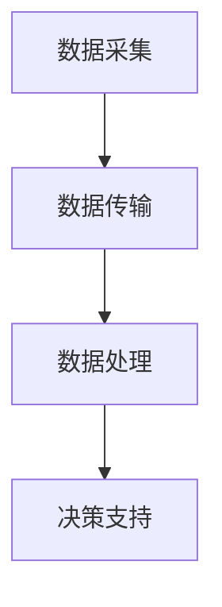

#### 2.1.2 交通信号控制

交通信号控制是智能交通管理的另一个重要组成部分。传统的交通信号控制主要基于固定的时间和路径，无法灵活应对实时交通流量变化。而AI技术可以通过实时数据分析和自适应控制策略，实现更加智能的交通信号控制。

**核心概念与联系**

交通信号控制的核心概念包括交通信号灯的时长、切换策略和自适应控制。AI技术在这一过程中起到了关键作用。具体来说，AI技术可以通过以下方式实现交通信号控制：

1. **实时数据分析**：AI系统可以实时收集并分析交通流量数据，识别交通拥堵情况。
2. **自适应控制策略**：基于实时数据分析，AI系统可以动态调整交通信号灯的时长和切换策略，以优化交通运行效率。
3. **机器学习**：利用机器学习算法，AI系统可以从历史数据中学习最优的信号控制策略，提高控制效果。

**架构原理**

智能交通信号控制系统的架构通常包括以下部分：

1. **数据采集**：通过监控摄像头、传感器等设备，收集交通流量数据。
2. **数据处理与决策**：AI系统对交通流量数据进行实时处理和分析，生成交通信号控制策略。
3. **信号控制执行**：根据AI系统生成的控制策略，调整交通信号灯的时长和切换。

**Mermaid 流程图**

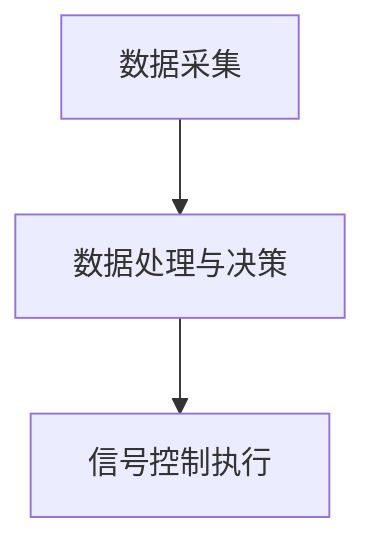

#### 2.1.3 公共交通系统优化

公共交通系统优化是智能交通管理的重要组成部分，其目标是提高公共交通的服务质量和效率。通过AI技术，可以实现对公共交通系统的全面优化，包括线路优化、班次优化和客流预测等。

**核心概念与联系**

公共交通系统优化的核心概念包括线路规划、班次安排和客流预测。AI技术在这一过程中起到了关键作用。具体来说，AI技术可以通过以下方式实现公共交通系统优化：

1. **线路优化**：利用AI算法，可以分析交通流量和乘客需求，优化公共交通线路。
2. **班次优化**：根据乘客需求和时间规律，AI系统可以动态调整公共交通的班次，提高运行效率。
3. **客流预测**：通过大数据分析和机器学习算法，AI系统可以预测公共交通的客流情况，优化资源配置。

**架构原理**

智能公共交通系统优化的架构通常包括以下部分：

1. **数据采集**：通过乘客计数器、交通流量传感器等设备，收集公共交通系统数据。
2. **数据处理与预测**：AI系统对公共交通系统数据进行处理和分析，生成线路优化、班次优化和客流预测报告。
3. **系统优化执行**：根据AI系统生成的优化报告，调整公共交通线路、班次和资源配置。

**Mermaid 流程图**

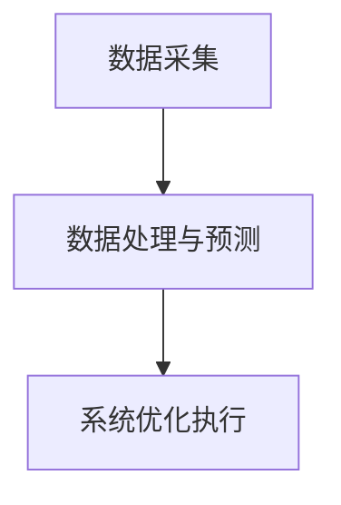

#### 2.1.4 项目实战：智能交通管理系统的开发与实现

为了更深入地理解AI在智能交通管理中的应用，下面我们将介绍一个实际项目案例——智能交通管理系统的开发与实现。

**项目背景**

某城市希望提升交通管理效率，减少交通拥堵，提高居民出行体验。为此，该城市决定开发一套智能交通管理系统，通过AI技术实现交通流量监测、交通信号控制和公共交通系统优化。

**技术栈**

- 数据采集：使用监控摄像头、雷达传感器和激光雷达等设备收集交通流量数据。
- 数据处理：使用Python编程语言和TensorFlow框架进行数据处理和分析。
- AI算法：采用图像识别、大数据分析和机器学习算法。
- 数据可视化：使用D3.js和ECharts等工具进行数据可视化。

**开发流程**

1. **需求分析**：明确系统功能需求，包括交通流量监测、交通信号控制和公共交通系统优化等。
2. **系统设计**：设计系统的整体架构，包括数据采集、数据处理、AI算法和系统优化执行等模块。
3. **数据采集**：安装监控摄像头、雷达传感器和激光雷达等设备，搭建数据采集系统。
4. **数据处理**：编写数据处理程序，对采集到的交通流量数据进行预处理和特征提取。
5. **AI算法实现**：实现图像识别、大数据分析和机器学习算法，构建智能交通管理系统。
6. **系统测试与优化**：对系统进行测试和优化，确保系统性能和稳定性。
7. **系统部署**：将智能交通管理系统部署到城市交通管理平台，进行实际应用。

**代码解读与分析**

以下是智能交通管理系统中的一个关键部分——交通流量监测模块的伪代码。

```python
# 交通流量监测模块伪代码

# 1. 数据采集
def collect_traffic_data(sensors):
    data = []
    for sensor in sensors:
        data.append(sensor.get_data())
    return data

# 2. 数据预处理
def preprocess_data(data):
    preprocessed_data = []
    for raw_data in data:
        preprocessed_data.append(process_raw_data(raw_data))
    return preprocessed_data

# 3. 特征提取
def extract_features(data):
    features = []
    for preprocessed_data in data:
        features.append(extract_key_features(preprocessed_data))
    return features

# 4. 交通流量分析
def analyze_traffic_flow(features):
    traffic_flow = []
    for feature in features:
        traffic_flow.append(analyze_traffic_pattern(feature))
    return traffic_flow

# 5. 数据可视化
def visualize_traffic_flow(traffic_flow):
    visualize_data(traffic_flow)

# 主函数
def main():
    sensors = [CameraSensor(), RadarSensor(), LidarSensor()]
    raw_data = collect_traffic_data(sensors)
    preprocessed_data = preprocess_data(raw_data)
    features = extract_features(preprocessed_data)
    traffic_flow = analyze_traffic_flow(features)
    visualize_traffic_flow(traffic_flow)

# 执行主函数
main()
```

**总结**

通过上述项目实战，我们可以看到AI在智能交通管理中的应用是如何实现的。智能交通管理系统通过实时数据采集、数据处理和AI算法，实现了交通流量监测、交通信号控制和公共交通系统优化等功能，为城市交通管理提供了有力支持。

### 2.2 智能能源管理

智能能源管理是AI在智能城市规划中的关键应用之一，其目标是通过优化能源供给和使用，提高能源效率，减少能源消耗，从而促进城市的可持续发展。在这一节中，我们将深入探讨AI在智能能源管理中的应用，包括能源需求预测、能源供应优化和节能技术应用。

#### 2.2.1 能源需求预测

能源需求预测是智能能源管理的基础。准确的能源需求预测有助于优化能源供应，减少能源浪费，提高能源利用效率。AI技术通过大数据分析和机器学习算法，能够实现对能源需求的精准预测。

**核心概念与联系**

能源需求预测的核心概念包括数据收集、数据分析、模型训练和预测结果评估。AI技术在这一过程中发挥了重要作用。具体来说，AI技术可以通过以下步骤实现能源需求预测：

1. **数据收集**：收集历史能源消耗数据、气象数据、经济数据等，为预测模型提供数据支持。
2. **数据分析**：利用统计分析和数据挖掘技术，分析历史数据中的规律和模式。
3. **模型训练**：利用机器学习算法，构建和训练预测模型，使其能够根据输入数据预测未来的能源需求。
4. **预测结果评估**：评估预测模型的准确性，通过调整模型参数和算法优化，提高预测精度。

**架构原理**

智能能源需求预测系统的架构通常包括以下部分：

1. **数据采集模块**：负责收集各种能源消耗数据、气象数据等，为预测模型提供数据支持。
2. **数据处理模块**：对收集到的数据进行清洗、预处理和特征提取，为模型训练提供高质量的输入数据。
3. **模型训练模块**：利用机器学习算法，对预处理后的数据进行模型训练，构建预测模型。
4. **预测模块**：根据实时输入数据，利用训练好的预测模型进行能源需求预测。
5. **结果评估模块**：对预测结果进行评估，根据评估结果调整模型参数和算法，提高预测精度。

**Mermaid 流程图**

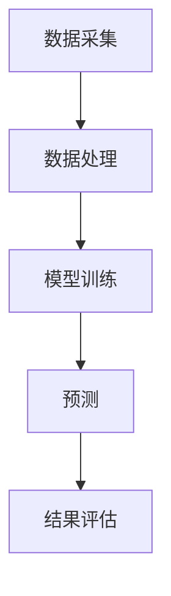

#### 2.2.2 能源供应优化

能源供应优化是智能能源管理的核心目标之一。通过AI技术，可以实现能源供给的动态优化，提高能源利用效率，减少能源浪费。AI技术可以通过以下方式实现能源供应优化：

1. **需求响应**：根据实时能源需求，动态调整能源供应策略，确保能源供应的稳定性和可靠性。
2. **供需平衡**：通过大数据分析和预测，优化能源供需平衡，减少能源过剩和短缺现象。
3. **多能协同**：利用AI技术，实现不同能源形式的协同优化，提高整体能源系统的效率。

**核心概念与联系**

能源供应优化的核心概念包括实时数据采集、供需平衡分析和优化策略生成。AI技术在这一过程中发挥了关键作用。具体来说，AI技术可以通过以下步骤实现能源供应优化：

1. **实时数据采集**：收集实时能源需求、能源供应和能源价格等数据。
2. **供需平衡分析**：分析实时数据，识别能源供需不平衡的情况。
3. **优化策略生成**：基于供需平衡分析结果，生成优化策略，调整能源供应策略。

**架构原理**

智能能源供应优化系统的架构通常包括以下部分：

1. **数据采集模块**：负责收集实时能源需求和供应数据。
2. **数据处理模块**：对采集到的数据进行处理和分析，生成供需平衡分析报告。
3. **优化策略生成模块**：根据供需平衡分析结果，生成优化策略。
4. **策略执行模块**：根据优化策略，动态调整能源供应策略。

**Mermaid 流�程图**

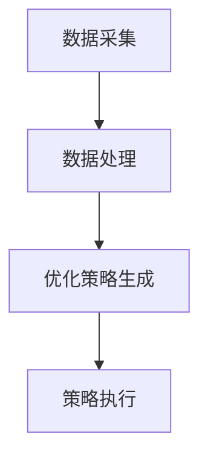

#### 2.2.3 节能技术应用

节能技术是智能能源管理的重要组成部分，通过AI技术，可以实现节能技术的精准应用和推广，提高能源利用效率。AI技术可以通过以下方式实现节能技术应用：

1. **能耗监测**：利用传感器和数据采集技术，实时监测能源消耗情况，识别能耗浪费点。
2. **节能方案推荐**：通过大数据分析和机器学习算法，为能源消耗企业提供个性化的节能方案。
3. **节能效果评估**：对节能方案的实际效果进行评估，持续优化节能技术。

**核心概念与联系**

节能技术应用的核淮概念包括能耗监测、节能方案推荐和节能效果评估。AI技术在这一过程中发挥了关键作用。具体来说，AI技术可以通过以下步骤实现节能技术应用：

1. **能耗监测**：利用传感器和数据采集技术，实时监测能源消耗情况。
2. **节能方案推荐**：通过大数据分析和机器学习算法，分析能耗数据，为能源消耗企业提供个性化的节能方案。
3. **节能效果评估**：对节能方案的实际效果进行评估，持续优化节能技术。

**架构原理**

智能节能技术应用系统的架构通常包括以下部分：

1. **能耗监测模块**：负责实时监测能源消耗情况。
2. **数据分析模块**：对监测到的能耗数据进行处理和分析，生成节能方案推荐报告。
3. **节能方案推荐模块**：根据分析结果，为能源消耗企业提供个性化的节能方案。
4. **效果评估模块**：对节能方案的实际效果进行评估，持续优化节能技术。

**Mermaid 流程图**

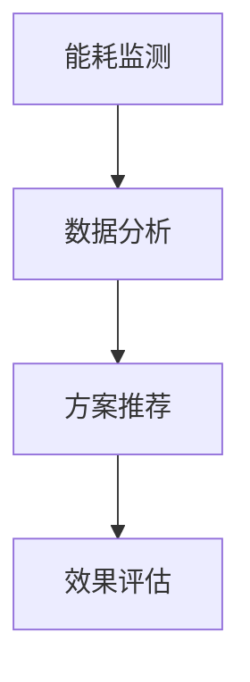

#### 2.2.4 项目实战：智能能源管理系统的开发与实现

为了更深入地理解AI在智能能源管理中的应用，下面我们将介绍一个实际项目案例——智能能源管理系统的开发与实现。

**项目背景**

某城市希望提高能源利用效率，减少能源浪费，实现城市的可持续发展。为此，该城市决定开发一套智能能源管理系统，通过AI技术实现能源需求预测、能源供应优化和节能技术应用。

**技术栈**

- 数据采集：使用传感器、智能电表等设备收集能源消耗数据。
- 数据处理：使用Python编程语言和Pandas库进行数据处理。
- AI算法：采用时间序列分析、机器学习和深度学习算法。
- 数据可视化：使用D3.js和ECharts等工具进行数据可视化。

**开发流程**

1. **需求分析**：明确系统功能需求，包括能源需求预测、能源供应优化和节能技术应用等。
2. **系统设计**：设计系统的整体架构，包括数据采集、数据处理、AI算法和系统优化执行等模块。
3. **数据采集**：安装传感器、智能电表等设备，搭建数据采集系统。
4. **数据处理**：编写数据处理程序，对采集到的能源消耗数据进行预处理和特征提取。
5. **AI算法实现**：实现时间序列分析、机器学习和深度学习算法，构建智能能源管理系统。
6. **系统测试与优化**：对系统进行测试和优化，确保系统性能和稳定性。
7. **系统部署**：将智能能源管理系统部署到城市能源管理平台，进行实际应用。

**代码解读与分析**

以下是智能能源管理系统中的一个关键部分——能源需求预测模块的伪代码。

```python
# 能源需求预测模块伪代码

# 1. 数据采集
def collect_energy_data(sensors):
    data = []
    for sensor in sensors:
        data.append(sensor.get_data())
    return data

# 2. 数据预处理
def preprocess_data(data):
    preprocessed_data = []
    for raw_data in data:
        preprocessed_data.append(process_raw_data(raw_data))
    return preprocessed_data

# 3. 特征提取
def extract_features(data):
    features = []
    for preprocessed_data in data:
        features.append(extract_key_features(preprocessed_data))
    return features

# 4. 能源需求预测
def predict_energy_demand(features):
    predictions = []
    for feature in features:
        prediction = predict_demand(feature)
        predictions.append(prediction)
    return predictions

# 5. 数据可视化
def visualize_energy_demand(predictions):
    visualize_data(predictions)

# 主函数
def main():
    sensors = [EnergySensor(), TemperatureSensor(), HumiditySensor()]
    raw_data = collect_energy_data(sensors)
    preprocessed_data = preprocess_data(raw_data)
    features = extract_features(preprocessed_data)
    predictions = predict_energy_demand(features)
    visualize_energy_demand(predictions)

# 执行主函数
main()
```

**总结**

通过上述项目实战，我们可以看到AI在智能能源管理中的应用是如何实现的。智能能源管理系统通过实时数据采集、数据处理和AI算法，实现了能源需求预测、能源供应优化和节能技术应用等功能，为城市能源管理提供了有力支持。

### 2.3 智慧环境监测

智慧环境监测是AI在智能城市规划中的关键应用之一，其目标是通过实时监测和数据分析，提升城市环境管理的科学性和高效性，从而改善居民的生活质量。在这一节中，我们将深入探讨AI在智慧环境监测中的应用，包括空气质量监测、水质监测和噪声监测。

#### 2.3.1 空气质量监测

空气质量监测是智慧环境监测的重要组成部分，通过实时监测空气中的污染物浓度，可以有效预防和控制空气污染，保障居民的健康。AI技术在空气质量监测中的应用主要体现在以下几个方面：

**核心概念与联系**

空气质量监测的核心概念包括污染物数据采集、数据分析、污染物浓度预测和预警。AI技术在这一过程中发挥了重要作用。具体来说，AI技术可以通过以下步骤实现空气质量监测：

1. **数据采集**：使用空气质量传感器，实时采集空气中的污染物数据，如PM2.5、PM10、CO、SO2、NO2等。
2. **数据分析**：利用统计分析、数据挖掘和机器学习算法，对污染物数据进行分析，识别污染源和污染趋势。
3. **污染物浓度预测**：通过历史数据和机器学习算法，预测未来一段时间内的污染物浓度，为环境管理部门提供决策依据。
4. **预警机制**：当污染物浓度超过预设阈值时，系统自动发出预警，提醒居民采取防护措施。

**架构原理**

智慧空气质量监测系统的架构通常包括以下部分：

1. **传感器网络**：部署多个空气质量传感器，实时采集污染物数据。
2. **数据传输**：通过物联网技术，将传感器数据传输到数据处理中心。
3. **数据处理与存储**：对传感器数据进行预处理、存储和初步分析。
4. **数据挖掘与分析**：利用机器学习算法，对污染物数据进行分析和预测。
5. **预警与决策支持**：根据分析结果，自动发出预警，并提供环境管理决策支持。

**Mermaid 流程图**

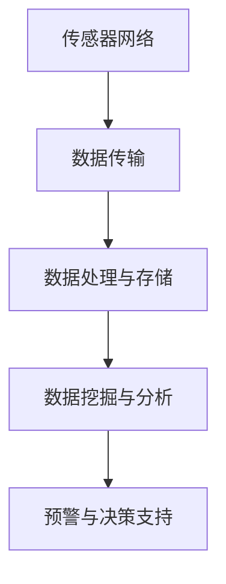

#### 2.3.2 水质监测

水质监测是保障城市饮用水安全和生态环境的重要手段，通过实时监测水体中的污染物浓度和水质参数，可以及时发现水质污染问题，采取相应的治理措施。AI技术在水质监测中的应用主要体现在以下几个方面：

**核心概念与联系**

水质监测的核心概念包括水质数据采集、水质参数分析、污染源识别和预警。AI技术在这一过程中发挥了重要作用。具体来说，AI技术可以通过以下步骤实现水质监测：

1. **数据采集**：使用水质传感器，实时采集水体中的污染物数据，如COD、BOD、pH值、氨氮等。
2. **水质参数分析**：利用统计分析、数据挖掘和机器学习算法，对水质参数进行分析，识别污染源和污染趋势。
3. **污染源识别**：通过数据分析和机器学习模型，识别水体中的污染源，为治理提供科学依据。
4. **预警机制**：当水质参数超过预设阈值时，系统自动发出预警，提醒相关部门采取治理措施。

**架构原理**

智慧水质监测系统的架构通常包括以下部分：

1. **传感器网络**：部署多个水质传感器，实时采集水质数据。
2. **数据传输**：通过物联网技术，将传感器数据传输到数据处理中心。
3. **数据处理与存储**：对传感器数据进行预处理、存储和初步分析。
4. **数据挖掘与分析**：利用机器学习算法，对水质数据进行分析和预测。
5. **预警与决策支持**：根据分析结果，自动发出预警，并提供环境管理决策支持。

**Mermaid 流程图**


#### 2.3.3 噪声监测

噪声监测是改善城市居住环境的重要措施，通过实时监测城市中的噪声水平，可以及时发现噪声污染问题，采取相应的治理措施。AI技术在噪声监测中的应用主要体现在以下几个方面：

**核心概念与联系**

噪声监测的核心概念包括噪声数据采集、噪声水平分析、噪声源识别和预警。AI技术在这一过程中发挥了重要作用。具体来说，AI技术可以通过以下步骤实现噪声监测：

1. **数据采集**：使用噪声传感器，实时采集城市中的噪声数据。
2. **噪声水平分析**：利用统计分析、数据挖掘和机器学习算法，对噪声数据进行分析，识别噪声污染趋势。
3. **噪声源识别**：通过数据分析和机器学习模型，识别噪声源，为治理提供科学依据。
4. **预警机制**：当噪声水平超过预设阈值时，系统自动发出预警，提醒相关部门采取治理措施。

**架构原理**

智慧噪声监测系统的架构通常包括以下部分：

1. **传感器网络**：部署多个噪声传感器，实时采集噪声数据。
2. **数据传输**：通过物联网技术，将传感器数据传输到数据处理中心。
3. **数据处理与存储**：对传感器数据进行预处理、存储和初步分析。
4. **数据挖掘与分析**：利用机器学习算法，对噪声数据进行分析和预测。
5. **预警与决策支持**：根据分析结果，自动发出预警，并提供环境管理决策支持。

**Mermaid 流程图**


#### 2.3.4 项目实战：智慧环境监测系统的开发与实现

为了更深入地理解AI在智慧环境监测中的应用，下面我们将介绍一个实际项目案例——智慧环境监测系统的开发与实现。

**项目背景**

某城市希望提升环境监测水平，改善城市空气质量、水质和噪声环境，提高居民的生活质量。为此，该城市决定开发一套智慧环境监测系统，通过AI技术实现空气质量、水质和噪声的实时监测和预警。

**技术栈**

- 数据采集：使用空气质量传感器、水质传感器和噪声传感器等设备收集环境数据。
- 数据处理：使用Python编程语言和Pandas库进行数据处理。
- AI算法：采用时间序列分析、机器学习和深度学习算法。
- 数据可视化：使用D3.js和ECharts等工具进行数据可视化。

**开发流程**

1. **需求分析**：明确系统功能需求，包括空气质量监测、水质监测和噪声监测等。
2. **系统设计**：设计系统的整体架构，包括数据采集、数据处理、AI算法和系统优化执行等模块。
3. **数据采集**：安装空气质量传感器、水质传感器和噪声传感器等设备，搭建数据采集系统。
4. **数据处理**：编写数据处理程序，对采集到的环境数据进行预处理和特征提取。
5. **AI算法实现**：实现时间序列分析、机器学习和深度学习算法，构建智慧环境监测系统。
6. **系统测试与优化**：对系统进行测试和优化，确保系统性能和稳定性。
7. **系统部署**：将智慧环境监测系统部署到城市环境监测平台，进行实际应用。

**代码解读与分析**

以下是智慧环境监测系统中的一个关键部分——空气质量监测模块的伪代码。

```python
# 空气质量监测模块伪代码

# 1. 数据采集
def collect_air_quality_data(sensors):
    data = []
    for sensor in sensors:
        data.append(sensor.get_data())
    return data

# 2. 数据预处理
def preprocess_data(data):
    preprocessed_data = []
    for raw_data in data:
        preprocessed_data.append(process_raw_data(raw_data))
    return preprocessed_data

# 3. 特征提取
def extract_features(data):
    features = []
    for preprocessed_data in data:
        features.append(extract_key_features(preprocessed_data))
    return features

# 4. 污染物浓度预测
def predict_pollutant_concentration(features):
    predictions = []
    for feature in features:
        prediction = predict_concentration(feature)
        predictions.append(prediction)
    return predictions

# 5. 数据可视化
def visualize_air_quality(predictions):
    visualize_data(predictions)

# 主函数
def main():
    sensors = [AirQualitySensor(), TemperatureSensor(), HumiditySensor()]
    raw_data = collect_air_quality_data(sensors)
    preprocessed_data = preprocess_data(raw_data)
    features = extract_features(preprocessed_data)
    predictions = predict_pollutant_concentration(features)
    visualize_air_quality(predictions)

# 执行主函数
main()
```

**总结**

通过上述项目实战，我们可以看到AI在智慧环境监测中的应用是如何实现的。智慧环境监测系统通过实时数据采集、数据处理和AI算法，实现了空气质量监测、水质监测和噪声监测等功能，为城市环境管理提供了有力支持。

### 2.4 智慧公共安全

智慧公共安全是AI在智能城市规划中的关键应用领域，其目标是利用AI技术提升城市安全管理水平，保障居民的生命财产安全。在这一节中，我们将深入探讨AI在智慧公共安全中的应用，包括安防监控、火灾预防和反恐防暴。

#### 2.4.1 安防监控

安防监控是智慧公共安全的核心组成部分，通过实时监控和视频分析技术，AI系统能够及时发现和预警潜在的安全威胁，提高城市的安全防范能力。以下是AI在安防监控中的具体应用：

**核心概念与联系**

安防监控的核心概念包括视频数据采集、视频内容分析和预警机制。AI技术在这一过程中发挥了关键作用。具体来说，AI技术可以通过以下步骤实现安防监控：

1. **视频数据采集**：通过监控摄像头收集视频数据。
2. **视频内容分析**：利用计算机视觉和图像识别技术，对视频内容进行分析，识别异常行为和安全隐患。
3. **预警机制**：当检测到异常行为或安全隐患时，系统自动发出预警，通知相关部门采取措施。

**架构原理**

智慧安防监控系统的架构通常包括以下部分：

1. **监控摄像头网络**：部署多个监控摄像头，覆盖城市的重要区域。
2. **数据传输**：通过物联网技术，将监控摄像头的数据传输到数据处理中心。
3. **数据处理与存储**：对视频数据进行预处理、存储和初步分析。
4. **视频内容分析**：利用AI算法，对视频内容进行分析，识别异常行为和安全隐患。
5. **预警与决策支持**：根据分析结果，自动发出预警，并提供决策支持。

**Mermaid 流程图**

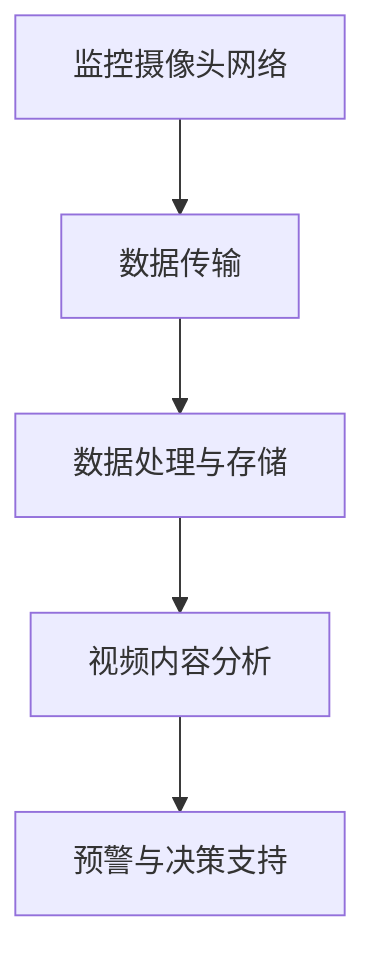

#### 2.4.2 火灾预防

火灾预防是城市公共安全的重要任务，通过实时监测和预警，AI系统能够及时发现火灾隐患，减少火灾发生的风险。以下是AI在火灾预防中的具体应用：

**核心概念与联系**

火灾预防的核心概念包括火灾隐患监测、预警和应急响应。AI技术在这一过程中发挥了重要作用。具体来说，AI技术可以通过以下步骤实现火灾预防：

1. **火灾隐患监测**：通过传感器数据、视频监控等手段，实时监测火灾隐患。
2. **预警机制**：当检测到火灾隐患时，系统自动发出预警，通知相关部门采取措施。
3. **应急响应**：在火灾发生时，AI系统能够提供实时决策支持，协助消防人员进行应急响应。

**架构原理**

智慧火灾预防系统的架构通常包括以下部分：

1. **传感器网络**：部署烟雾传感器、温度传感器等设备，实时监测火灾隐患。
2. **数据传输**：通过物联网技术，将传感器数据传输到数据处理中心。
3. **数据处理与存储**：对传感器数据进行预处理、存储和初步分析。
4. **火灾隐患分析**：利用AI算法，对传感器数据进行分析，识别火灾隐患。
5. **预警与应急响应**：根据分析结果，自动发出预警，并提供决策支持。

**Mermaid 流程图**

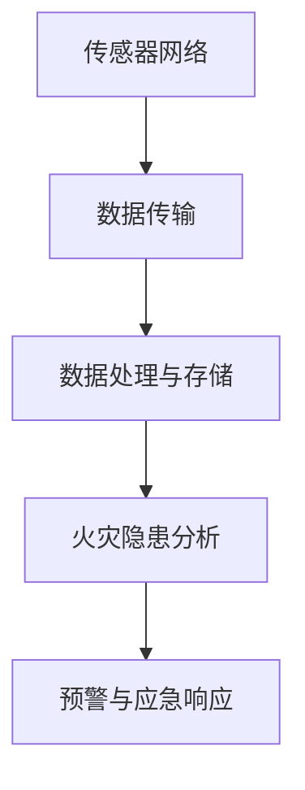

#### 2.4.3 反恐防暴

反恐防暴是城市公共安全的重要任务，通过大数据分析和智能预警技术，AI系统能够提高反恐防暴的效率和准确性，保障城市的安全稳定。以下是AI在反恐防暴中的具体应用：

**核心概念与联系**

反恐防暴的核心概念包括数据采集、异常行为分析和预警机制。AI技术在这一过程中发挥了关键作用。具体来说，AI技术可以通过以下步骤实现反恐防暴：

1. **数据采集**：通过摄像头、传感器等设备，收集城市中的各类数据。
2. **异常行为分析**：利用机器学习和深度学习算法，对数据进行分析，识别异常行为和潜在威胁。
3. **预警机制**：当检测到异常行为或潜在威胁时，系统自动发出预警，通知相关部门采取措施。

**架构原理**

智慧反恐防暴系统的架构通常包括以下部分：

1. **数据采集**：通过摄像头、传感器等设备，收集城市中的各类数据。
2. **数据处理与存储**：对采集到的数据进行预处理、存储和初步分析。
3. **异常行为分析**：利用AI算法，对数据进行分析，识别异常行为和潜在威胁。
4. **预警与决策支持**：根据分析结果，自动发出预警，并提供决策支持。

**Mermaid 流程图**

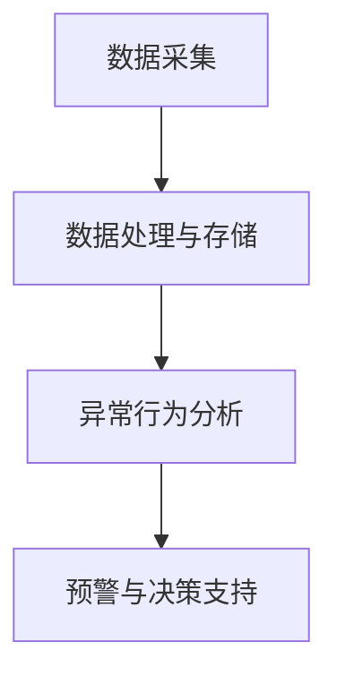

#### 2.4.4 项目实战：智慧公共安全系统的开发与实现

为了更深入地理解AI在智慧公共安全中的应用，下面我们将介绍一个实际项目案例——智慧公共安全系统的开发与实现。

**项目背景**

某城市希望提升公共安全水平，有效应对各种安全威胁。为此，该城市决定开发一套智慧公共安全系统，通过AI技术实现安防监控、火灾预防和反恐防暴等功能。

**技术栈**

- 数据采集：使用摄像头、传感器等设备收集公共安全数据。
- 数据处理：使用Python编程语言和TensorFlow库进行数据处理。
- AI算法：采用计算机视觉、机器学习和深度学习算法。
- 数据可视化：使用D3.js和ECharts等工具进行数据可视化。

**开发流程**

1. **需求分析**：明确系统功能需求，包括安防监控、火灾预防和反恐防暴等。
2. **系统设计**：设计系统的整体架构，包括数据采集、数据处理、AI算法和系统优化执行等模块。
3. **数据采集**：安装摄像头、传感器等设备，搭建数据采集系统。
4. **数据处理**：编写数据处理程序，对采集到的公共安全数据进行预处理和特征提取。
5. **AI算法实现**：实现计算机视觉、机器学习和深度学习算法，构建智慧公共安全系统。
6. **系统测试与优化**：对系统进行测试和优化，确保系统性能和稳定性。
7. **系统部署**：将智慧公共安全系统部署到城市公共安全平台，进行实际应用。

**代码解读与分析**

以下是智慧公共安全系统中的一个关键部分——安防监控模块的伪代码。

```python
# 安防监控模块伪代码

# 1. 数据采集
def collect_security_data(sensors):
    data = []
    for sensor in sensors:
        data.append(sensor.get_data())
    return data

# 2. 数据预处理
def preprocess_data(data):
    preprocessed_data = []
    for raw_data in data:
        preprocessed_data.append(process_raw_data(raw_data))
    return preprocessed_data

# 3. 视频内容分析
def analyze_video_content(data):
    analyzed_data = []
    for preprocessed_data in data:
        analyzed_data.append(analyze_video(preprocessed_data))
    return analyzed_data

# 4. 异常行为检测
def detect_anomaly行为的分析结果):
    anomalies = []
    for analyzed_data in analyzed_data:
        anomalies.append(check_for_anomalies(analyzed_data))
    return anomalies

# 5. 数据可视化
def visualize_security_data(anomalies):
    visualize_data(anomalies)

# 主函数
def main():
    sensors = [VideoCamera(), MotionSensor()]
    raw_data = collect_security_data(sensors)
    preprocessed_data = preprocess_data(raw_data)
    analyzed_data = analyze_video_content(preprocessed_data)
    anomalies = detect_anomaly行为的分析结果)
    visualize_security_data(anomalies)

# 执行主函数
main()
```

**总结**

通过上述项目实战，我们可以看到AI在智慧公共安全中的应用是如何实现的。智慧公共安全系统通过实时数据采集、数据处理和AI算法，实现了安防监控、火灾预防和反恐防暴等功能，为城市公共安全提供了有力支持。

### 2.5 智慧医疗

智慧医疗是AI在智能城市规划中的重要应用领域，通过人工智能技术的应用，医疗行业可以实现诊断的精准化、治疗的个性化和管理的高效化，从而提升医疗服务质量，改善患者的生活质量。以下将详细探讨AI在智慧医疗中的多种应用场景。

#### 2.5.1 AI在医疗诊断中的应用

AI在医疗诊断中的应用主要利用深度学习、图像识别等技术，辅助医生进行疾病诊断。以下是一些典型的应用场景：

**核心概念与联系**

AI在医疗诊断中的应用核心在于数据采集、模型训练和结果输出。以下是具体的应用流程：

1. **数据采集**：收集大量的医学影像（如X光片、CT、MRI等）和病例数据。
2. **模型训练**：利用收集到的数据，通过深度学习算法训练出诊断模型。
3. **结果输出**：将患者的医学影像数据输入训练好的模型，输出诊断结果。

**架构原理**

智慧医疗诊断系统的架构通常包括以下部分：

1. **数据采集模块**：负责收集医学影像数据和病例数据。
2. **数据处理模块**：对医学影像数据进行预处理和特征提取。
3. **模型训练模块**：利用训练算法，对预处理后的数据进行模型训练。
4. **诊断模块**：将新的医学影像数据输入训练好的模型，进行诊断。
5. **结果输出模块**：将诊断结果输出给医生和患者。

**Mermaid 流程图**

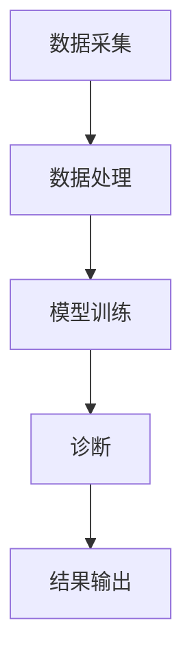

#### 2.5.2 AI在医疗影像分析中的应用

AI在医疗影像分析中的应用可以帮助医生快速准确地分析影像数据，提高诊断的效率和准确性。以下是一些典型的应用场景：

**核心概念与联系**

AI在医疗影像分析中的应用核心在于图像识别和模式识别。以下是具体的应用流程：

1. **图像识别**：利用深度学习算法，对影像数据中的病变部位、病变类型等进行识别。
2. **模式识别**：通过分析影像数据中的模式，预测疾病的发展趋势和治疗方案。

**架构原理**

智慧医疗影像分析系统的架构通常包括以下部分：

1. **影像数据采集模块**：负责收集医学影像数据。
2. **图像处理模块**：对影像数据进行分析和处理，提取关键特征。
3. **模型训练模块**：利用训练算法，对处理后的影像数据进行模型训练。
4. **分析模块**：将新的影像数据输入训练好的模型，进行病变识别和模式分析。
5. **结果输出模块**：将分析结果输出给医生和患者。

**Mermaid 流程图**

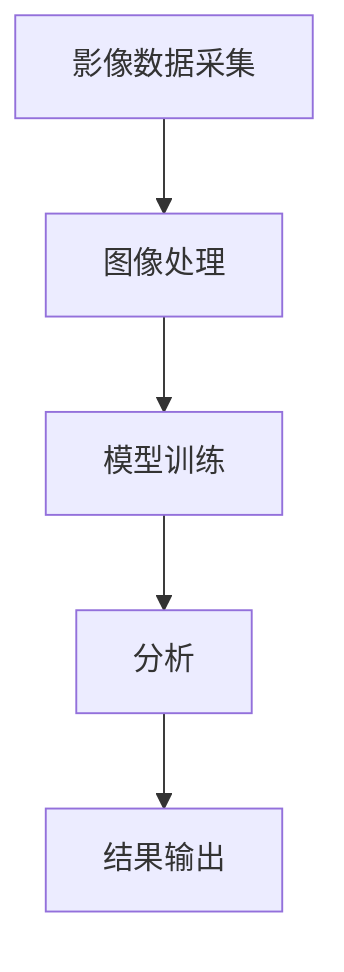

#### 2.5.3 AI在公共卫生监测中的应用

AI在公共卫生监测中的应用可以帮助实时监测疾病传播、疫情发展和公共卫生事件，从而提高公共卫生管理的效率和准确性。以下是一些典型的应用场景：

**核心概念与联系**

AI在公共卫生监测中的应用核心在于大数据分析和预测。以下是具体的应用流程：

1. **数据收集**：收集公共卫生相关的数据，如病例数据、医疗资源数据、环境数据等。
2. **数据分析**：利用机器学习算法，对收集到的数据进行处理和分析。
3. **预测模型**：基于历史数据和现有数据，建立预测模型，预测未来疫情发展和公共卫生事件。

**架构原理**

智慧公共卫生监测系统的架构通常包括以下部分：

1. **数据采集模块**：负责收集公共卫生相关的数据。
2. **数据处理模块**：对收集到的数据进行清洗、预处理和特征提取。
3. **分析模块**：利用机器学习算法，对处理后的数据进行分析和预测。
4. **监测模块**：根据分析结果，实时监测公共卫生事件的发展趋势。
5. **预警模块**：当检测到异常情况时，系统自动发出预警，通知相关部门采取应对措施。

**Mermaid 流程图**

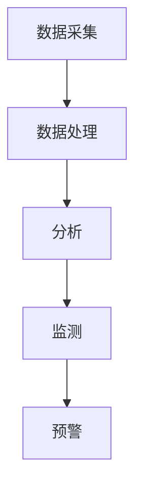

#### 2.5.4 项目实战：智慧医疗系统的开发与实现

为了更深入地理解AI在智慧医疗中的应用，以下将介绍一个实际项目案例——智慧医疗系统的开发与实现。

**项目背景**

某城市医院希望提升医疗服务质量，通过引入AI技术实现医疗诊断、影像分析和公共卫生监测等功能。为此，该医院决定开发一套智慧医疗系统。

**技术栈**

- 数据采集：使用医学影像设备、健康监测设备等收集医疗数据。
- 数据处理：使用Python编程语言和TensorFlow库进行数据处理。
- AI算法：采用深度学习、图像识别和机器学习算法。
- 数据可视化：使用D3.js和ECharts等工具进行数据可视化。

**开发流程**

1. **需求分析**：明确智慧医疗系统的功能需求，包括医疗诊断、影像分析和公共卫生监测等。
2. **系统设计**：设计智慧医疗系统的整体架构，包括数据采集、数据处理、AI算法和系统优化执行等模块。
3. **数据采集**：安装医学影像设备、健康监测设备等，搭建数据采集系统。
4. **数据处理**：编写数据处理程序，对采集到的医疗数据进行预处理和特征提取。
5. **AI算法实现**：实现深度学习、图像识别和机器学习算法，构建智慧医疗系统。
6. **系统测试与优化**：对系统进行测试和优化，确保系统性能和稳定性。
7. **系统部署**：将智慧医疗系统部署到医院信息系统中，进行实际应用。

**代码解读与分析**

以下是智慧医疗系统中的一个关键部分——医疗诊断模块的伪代码。

```python
# 医疗诊断模块伪代码

# 1. 数据采集
def collect_medical_data(sensors):
    data = []
    for sensor in sensors:
        data.append(sensor.get_data())
    return data

# 2. 数据预处理
def preprocess_data(data):
    preprocessed_data = []
    for raw_data in data:
        preprocessed_data.append(process_raw_data(raw_data))
    return preprocessed_data

# 3. 特征提取
def extract_features(data):
    features = []
    for preprocessed_data in data:
        features.append(extract_key_features(preprocessed_data))
    return features

# 4. 疾病诊断
def diagnose_diseases(features):
    diagnoses = []
    for feature in features:
        diagnosis = diagnose_disease(feature)
        diagnoses.append(diagnosis)
    return diagnoses

# 5. 结果输出
def output_diagnoses(diagnoses):
    for diagnosis in diagnoses:
        print_diagnosis(diagnosis)

# 主函数
def main():
    sensors = [MedicalCamera(), HealthMonitor()]
    raw_data = collect_medical_data(sensors)
    preprocessed_data = preprocess_data(raw_data)
    features = extract_features(preprocessed_data)
    diagnoses = diagnose_diseases(features)
    output_diagnoses(diagnoses)

# 执行主函数
main()
```

**总结**

通过上述项目实战，我们可以看到AI在智慧医疗中的应用是如何实现的。智慧医疗系统通过实时数据采集、数据处理和AI算法，实现了医疗诊断、影像分析和公共卫生监测等功能，为医院提供了强大的技术支持，提高了医疗服务质量和效率。

### 2.6 智慧教育

智慧教育是AI在智能城市规划中的又一重要应用领域，通过AI技术的应用，可以实现教育资源的优化配置、教学过程的个性化定制以及教育管理的智能化，从而提高教育质量，提升学生的综合素质。以下将详细探讨AI在智慧教育中的多种应用场景。

#### 2.6.1 AI在教育个性化中的应用

AI在教育个性化中的应用旨在根据学生的个性化需求和学习习惯，提供定制化的教育资源和服务，从而提高学习效果。以下是一些典型的应用场景：

**核心概念与联系**

AI在教育个性化中的应用核心在于数据分析和学习算法。以下是具体的应用流程：

1. **数据收集**：收集学生的学习数据，如成绩、学习进度、兴趣偏好等。
2. **数据分析**：利用数据分析技术，对学生的学习数据进行处理和分析。
3. **推荐系统**：基于学生的学习数据和推荐算法，为学生推荐合适的课程和资源。

**架构原理**

智慧教育个性化系统的架构通常包括以下部分：

1. **数据采集模块**：负责收集学生的学习数据。
2. **数据处理模块**：对收集到的学生学习数据进行分析和预处理。
3. **推荐算法模块**：利用机器学习算法，为学生推荐个性化的教育资源和课程。
4. **推荐系统模块**：根据推荐算法的结果，生成个性化的学习建议。
5. **反馈机制**：收集学生的学习反馈，不断优化推荐系统的效果。

**Mermaid 流程图**

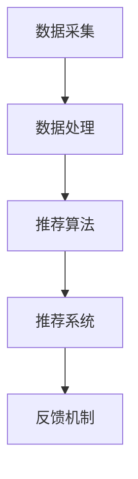

#### 2.6.2 AI在教育资源分配中的应用

AI在教育资源分配中的应用旨在优化教育资源的分配，确保每个学生都能获得合适的教育资源。以下是一些典型的应用场景：

**核心概念与联系**

AI在教育资源分配中的应用核心在于优化算法和数据挖掘。以下是具体的应用流程：

1. **资源需求分析**：分析学生的学习需求和资源需求。
2. **资源匹配**：利用优化算法，为每个学生匹配最合适的资源。
3. **资源调度**：根据实时需求，动态调整教育资源的分配。

**架构原理**

智慧教育资源分配系统的架构通常包括以下部分：

1. **需求分析模块**：负责分析学生的学习需求和资源需求。
2. **资源匹配模块**：利用优化算法，为每个学生匹配最合适的资源。
3. **资源调度模块**：根据实时需求，动态调整教育资源的分配。
4. **资源监控模块**：实时监控教育资源的利用情况，确保资源分配的合理性。

**Mermaid 流程图**

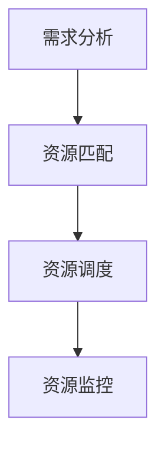

#### 2.6.3 AI在在线教育中的应用

AI在在线教育中的应用旨在提升在线教育的质量和效率，为学生提供更好的学习体验。以下是一些典型的应用场景：

**核心概念与联系**

AI在在线教育中的应用核心在于内容生成、互动性和个性化学习。以下是具体的应用流程：

1. **内容生成**：利用自然语言处理技术，生成高质量的在线教育内容。
2. **互动性**：利用计算机视觉和语音识别技术，增强在线教育的互动性。
3. **个性化学习**：基于学生的学习数据和推荐算法，提供个性化的学习路径。

**架构原理**

智慧在线教育系统的架构通常包括以下部分：

1. **内容生成模块**：利用自然语言处理技术，生成在线教育内容。
2. **互动模块**：利用计算机视觉和语音识别技术，增强在线教育的互动性。
3. **个性化学习模块**：基于学生的学习数据和推荐算法，提供个性化的学习路径。
4. **反馈机制**：收集学生的学习反馈，不断优化在线教育系统的效果。

**Mermaid 流程图**

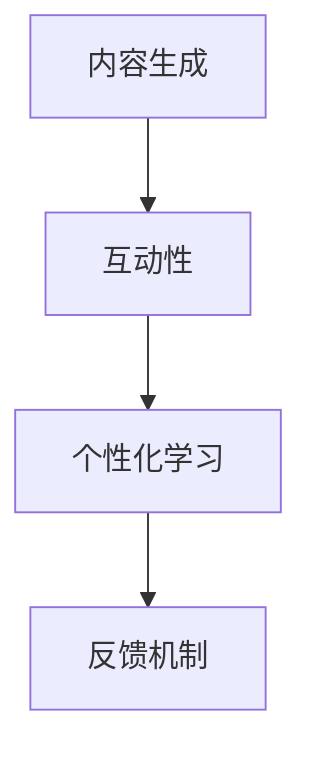

#### 2.6.4 项目实战：智慧教育系统的开发与实现

为了更深入地理解AI在智慧教育中的应用，以下将介绍一个实际项目案例——智慧教育系统的开发与实现。

**项目背景**

某教育机构希望提升在线教育的质量和效率，通过引入AI技术实现教育资源的个性化推荐、互动性和个性化学习。为此，该教育机构决定开发一套智慧教育系统。

**技术栈**

- 数据采集：使用在线教育平台、学习管理系统等收集学生学习数据。
- 数据处理：使用Python编程语言和TensorFlow库进行数据处理。
- AI算法：采用自然语言处理、计算机视觉和机器学习算法。
- 数据可视化：使用D3.js和ECharts等工具进行数据可视化。

**开发流程**

1. **需求分析**：明确智慧教育系统的功能需求，包括教育资源的个性化推荐、互动性和个性化学习等。
2. **系统设计**：设计智慧教育系统的整体架构，包括数据采集、数据处理、AI算法和系统优化执行等模块。
3. **数据采集**：安装在线教育平台、学习管理系统等，搭建数据采集系统。
4. **数据处理**：编写数据处理程序，对采集到的学生学习数据进行预处理和特征提取。
5. **AI算法实现**：实现自然语言处理、计算机视觉和机器学习算法，构建智慧教育系统。
6. **系统测试与优化**：对系统进行测试和优化，确保系统性能和稳定性。
7. **系统部署**：将智慧教育系统部署到在线教育平台上，进行实际应用。

**代码解读与分析**

以下是智慧教育系统中的一个关键部分——教育资源推荐模块的伪代码。

```python
# 教育资源推荐模块伪代码

# 1. 数据采集
def collect_learning_data(online_education_platform):
    data = online_education_platform.get_learning_data()
    return data

# 2. 数据预处理
def preprocess_data(data):
    preprocessed_data = []
    for raw_data in data:
        preprocessed_data.append(process_raw_data(raw_data))
    return preprocessed_data

# 3. 特征提取
def extract_features(data):
    features = []
    for preprocessed_data in data:
        features.append(extract_key_features(preprocessed_data))
    return features

# 4. 推荐算法
def recommend_resources(features, recommendation_algorithm):
    recommendations = []
    for feature in features:
        recommendation = recommendation_algorithm.recommend(feature)
        recommendations.append(recommendation)
    return recommendations

# 5. 结果输出
def output_recommendations(recommendations):
    for recommendation in recommendations:
        print_recommendation(recommendation)

# 主函数
def main():
    online_education_platform = OnlineEducationPlatform()
    raw_data = collect_learning_data(online_education_platform)
    preprocessed_data = preprocess_data(raw_data)
    features = extract_features(preprocessed_data)
    recommendations = recommend_resources(features, recommendation_algorithm)
    output_recommendations(recommendations)

# 执行主函数
main()
```

**总结**

通过上述项目实战，我们可以看到AI在智慧教育中的应用是如何实现的。智慧教育系统通过实时数据采集、数据处理和AI算法，实现了教育资源的个性化推荐、互动性和个性化学习等功能，为在线教育提供了强大的技术支持，提高了教育质量和学习效率。

### 2.7 智慧养老

智慧养老是AI在智能城市规划中的关键应用领域，通过AI技术的应用，可以实现养老服务的智能化、个性化，提高老年人的生活质量，减轻家庭和护理人员的负担。以下将详细探讨AI在智慧养老中的多种应用场景。

#### 2.7.1 AI在养老服务中的应用

AI在养老服务中的应用旨在利用智能技术为老年人提供全方位的照顾和关爱。以下是一些典型的应用场景：

**核心概念与联系**

AI在养老服务中的应用核心在于数据采集、分析和智能反馈。以下是具体的应用流程：

1. **数据采集**：通过传感器、智能设备等收集老年人的生理健康数据、生活习惯等。
2. **数据分析**：利用机器学习和数据分析技术，对收集到的数据进行处理和分析。
3. **智能反馈**：根据数据分析结果，为老年人提供个性化的健康建议和护理服务。

**架构原理**

智慧养老服务平台架构通常包括以下部分：

1. **数据采集模块**：负责收集老年人的生理健康数据和生活习惯数据。
2. **数据处理模块**：对收集到的数据进行分析和预处理。
3. **健康监测模块**：利用机器学习技术，监测老年人的健康状况，提供实时健康数据。
4. **个性化建议模块**：根据老年人的健康状况和生活习惯，提供个性化的健康建议。
5. **护理服务模块**：根据老年人的需求，提供智能化的护理服务。

**Mermaid 流�程图**

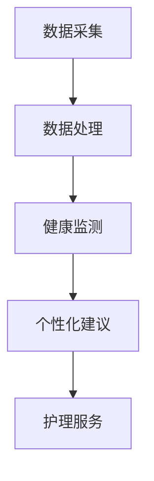

#### 2.7.2 AI在健康监测中的应用

AI在健康监测中的应用旨在通过实时监测老年人的健康状况，预防疾病的发生。以下是一些典型的应用场景：

**核心概念与联系**

AI在健康监测中的应用核心在于数据采集、分析和预警。以下是具体的应用流程：

1. **数据采集**：通过传感器、智能设备等收集老年人的生理健康数据。
2. **数据分析**：利用机器学习和数据分析技术，对收集到的数据进行处理和分析。
3. **预警机制**：当老年人的健康数据异常时，系统自动发出预警，通知相关人员进行干预。

**架构原理**

智慧健康监测系统的架构通常包括以下部分：

1. **数据采集模块**：负责收集老年人的生理健康数据。
2. **数据处理模块**：对收集到的数据进行分析和预处理。
3. **数据分析模块**：利用机器学习技术，对健康数据进行实时分析。
4. **预警机制模块**：当健康数据异常时，系统自动发出预警，通知相关人员进行干预。
5. **健康管理模块**：根据健康数据，提供个性化的健康管理建议。

**Mermaid 流程图**

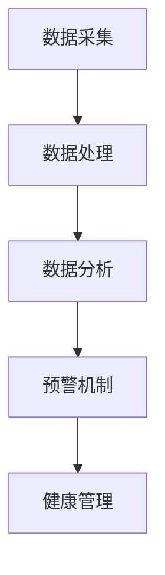

#### 2.7.3 AI在生活辅助中的应用

AI在生活辅助中的应用旨在通过智能技术为老年人提供便捷的生活服务，提高生活质量。以下是一些典型的应用场景：

**核心概念与联系**

AI在生活辅助中的应用核心在于自然语言处理、计算机视觉和智能控制。以下是具体的应用流程：

1. **自然语言处理**：通过语音识别和语义理解技术，理解老年人的需求。
2. **计算机视觉**：通过图像识别技术，辅助老年人完成日常活动。
3. **智能控制**：通过智能设备，实现家居自动化和远程控制。

**架构原理**

智慧生活辅助系统的架构通常包括以下部分：

1. **语音识别模块**：负责语音信号的识别和理解。
2. **图像识别模块**：负责图像的识别和分析。
3. **智能控制模块**：负责家居设备的自动化控制和远程操作。
4. **用户交互模块**：通过语音、图像等交互方式，与老年人进行互动。
5. **服务支持模块**：根据老年人的需求，提供相应的服务支持。

**Mermaid 流程图**

```mermaid
graph TB
A[语音识别] --> B[图像识别]
B --> C[智能控制]
C --> D[用户交互]
D --> E[服务支持]
```

#### 2.7.4 项目实战：智慧养老系统的开发与实现

为了更深入地理解AI在智慧养老中的应用，以下将介绍一个实际项目案例——智慧养老系统的开发与实现。

**项目背景**

某养老机构希望提升养老服务水平，通过引入AI技术，实现健康监测、生活辅助和个性化护理。为此，该养老机构决定开发一套智慧养老系统。

**技术栈**

- 数据采集：使用传感器、智能设备等收集老年人的生理健康数据和生活习惯数据。
- 数据处理：使用Python编程语言和TensorFlow库进行数据处理。
- AI算法：采用自然语言处理、计算机视觉和机器学习算法。
- 数据可视化：使用D3.js和ECharts等工具进行数据可视化。

**开发流程**

1. **需求分析**：明确智慧养老系统的功能需求，包括健康监测、生活辅助和个性化护理等。
2. **系统设计**：设计智慧养老系统的整体架构，包括数据采集、数据处理、AI算法和系统优化执行等模块。
3. **数据采集**：安装传感器、智能设备等，搭建数据采集系统。
4. **数据处理**：编写数据处理程序，对采集到的数据进行分析和预处理。
5. **AI算法实现**：实现自然语言处理、计算机视觉和机器学习算法，构建智慧养老系统。
6. **系统测试与优化**：对系统进行测试和优化，确保系统性能和稳定性。
7. **系统部署**：将智慧养老系统部署到养老机构的服务平台，进行实际应用。

**代码解读与分析**

以下是智慧养老系统中的一个关键部分——健康监测模块的伪代码。

```python
# 健康监测模块伪代码

# 1. 数据采集
def collect_health_data(sensors):
    data = []
    for sensor in sensors:
        data.append(sensor.get_data())
    return data

# 2. 数据预处理
def preprocess_data(data):
    preprocessed_data = []
    for raw_data in data:
        preprocessed_data.append(process_raw_data(raw_data))
    return preprocessed_data

# 3. 健康数据分析
def analyze_health_data(preprocessed_data):
    health_analyses = []
    for data in preprocessed_data:
        analysis = analyze_health_status(data)
        health_analyses.append(analysis)
    return health_analyses

# 4. 预警机制
def health_warning(health_analyses):
    for analysis in health_analyses:
        if analysis.is_anomaly():
            send_warning(analysis)

# 5. 健康管理
def health_management(health_analyses):
    for analysis in health_analyses:
        if analysis.is_anomaly():
            provide_health_advice(analysis)

# 主函数
def main():
    sensors = [HealthSensor(), ActivitySensor()]
    raw_data = collect_health_data(sensors)
    preprocessed_data = preprocess_data(raw_data)
    health_analyses = analyze_health_data(preprocessed_data)
    health_warning(health_analyses)
    health_management(health_analyses)

# 执行主函数
main()
```

**总结**

通过上述项目实战，我们可以看到AI在智慧养老中的应用是如何实现的。智慧养老系统通过实时数据采集、数据处理和AI算法，实现了健康监测、生活辅助和个性化护理等功能，为养老机构提供了强大的技术支持，提高了养老服务质量，提升了老年人的生活质量。

### 第三部分：AI应用案例分析

在上一部分，我们详细探讨了AI在智能城市规划中的多种应用场景，包括交通管理、能源管理、环境监测、公共安全、医疗、教育和养老等。本部分将结合具体案例分析这些AI应用的实际效果，分析其成功的关键因素和潜在挑战。

#### 5.1 案例一：上海智慧城市建设

上海是中国首批智慧城市试点之一，通过引入AI技术，上海在交通、医疗、能源等多个领域取得了显著成果。

**案例背景**

上海市人口众多，交通拥堵、医疗资源分配不均、能源消耗高等问题日益突出。为了解决这些问题，上海市政府决定推动智慧城市建设，利用AI技术提升城市管理效率。

**AI应用**

1. **智慧交通管理**：通过部署智能交通系统，实时监控和优化交通流量，减少交通拥堵。AI技术还用于公共交通系统的优化，提高公交车的运行效率。

2. **智慧医疗**：利用AI技术，上海实现了医疗资源的智能化分配，通过在线挂号、智能诊断系统等提高医疗服务效率。

3. **智慧能源管理**：AI技术在能源需求预测和节能技术应用方面发挥了重要作用，通过智能电网系统实现能源的合理调度和高效利用。

**成功因素**

1. **政策支持**：上海市政府对智慧城市建设的支持力度较大，提供了政策、资金和技术等多方面的支持。

2. **技术成熟**：上海在AI技术的研究和应用方面具备一定的优势，吸引了大量企业和研究机构参与智慧城市建设。

3. **数据资源**：上海拥有丰富的城市数据资源，为AI算法提供了良好的数据支持。

**潜在挑战**

1. **数据安全**：AI技术在数据处理过程中涉及大量敏感数据，数据安全成为一大挑战。

2. **技术更新**：AI技术发展迅速，系统需要不断更新，以适应新的技术发展和应用需求。

**案例总结**

上海智慧城市建设的成功经验表明，AI技术在提升城市管理效率、优化公共服务等方面具有巨大潜力。然而，数据安全和技术更新等问题也需要得到有效解决。

#### 5.2 案例二：新加坡智能国家计划

新加坡是全球智能城市的典范，其智能国家计划涵盖了交通、环境、医疗等多个领域。

**案例背景**

新加坡国土面积小，人口密度高，城市管理面临诸多挑战。为了实现城市的可持续发展，新加坡政府推出了智能国家计划，通过AI技术提升城市管理水平。

**AI应用**

1. **智慧交通管理**：通过智能交通系统，实时监控和优化交通流量，减少交通拥堵。新加坡还采用了电子道路收费系统，提高交通效率。

2. **智慧环境监测**：AI技术在空气质量、水质监测等方面发挥了重要作用，通过实时数据分析和预警，保护城市环境。

3. **智慧医疗**：新加坡推行了电子健康档案系统，利用AI技术实现疾病预测和个性化治疗。

**成功因素**

1. **全面规划**：新加坡智能国家计划涵盖了多个领域，形成了系统化的智能城市建设体系。

2. **技术领先**：新加坡在AI技术研究和应用方面处于全球领先地位，为智能国家计划提供了强有力的技术支持。

3. **政策支持**：新加坡政府高度重视智能国家计划，提供了政策和资金支持，推动了计划的实施。

**潜在挑战**

1. **技术整合**：智能国家计划涉及多个技术领域，如何实现各技术系统的有效整合是一个挑战。

2. **数据隐私**：随着数据收集和分析的增多，数据隐私问题逐渐凸显，需要制定相应的法律法规进行规范。

**案例总结**

新加坡智能国家计划的实施展示了AI技术在城市可持续发展中的应用潜力。然而，技术整合和数据隐私等问题仍需进一步解决。

#### 5.3 案例三：中国深圳智慧城市试点

深圳是中国智能城市的先行者，通过AI技术的广泛应用，深圳在交通、能源、公共安全等领域取得了显著成果。

**案例背景**

深圳市作为中国的经济特区，城市化进程快速，城市管理面临巨大挑战。为了实现城市的可持续发展，深圳市政府决定推动智慧城市建设，利用AI技术提升城市管理效率。

**AI应用**

1. **智慧交通管理**：深圳通过部署智能交通系统，实时监控和优化交通流量，减少交通拥堵。AI技术还用于公共交通系统的优化，提高公交车的运行效率。

2. **智慧能源管理**：深圳采用了智能电网系统，通过AI技术实现能源的合理调度和高效利用。

3. **智慧公共安全**：深圳利用AI技术实现安防监控、火灾预防和反恐防暴等功能，提升城市公共安全水平。

**成功因素**

1. **科技创新**：深圳具备强大的科技创新能力，吸引了大量高科技企业和研究机构，为智慧城市建设提供了技术支持。

2. **政策支持**：深圳市政府对智慧城市建设给予了高度重视，提供了政策和资金支持。

3. **市民参与**：深圳市民对智慧城市的建设和应用积极参与，形成了良好的互动氛围。

**潜在挑战**

1. **技术成熟度**：AI技术在某些领域的成熟度仍然不足，需要进一步研发和优化。

2. **数据隐私**：随着数据收集和分析的增多，数据隐私问题逐渐凸显，需要制定相应的法律法规进行规范。

**案例总结**

深圳智慧城市试点展示了AI技术在城市管理中的广泛应用，为其他城市提供了宝贵的经验。然而，技术成熟度和数据隐私等问题仍需得到有效解决。

综上所述，AI在智能城市规划中的应用案例表明，其具有巨大的发展潜力。通过成功案例的分析，我们可以看到AI技术在实际应用中的关键成功因素和潜在挑战。在未来的发展中，我们需要不断探索和解决这些问题，推动智能城市规划的进一步发展。

### 第四部分：AI应用开发与实施

在第三部分中，我们通过具体案例分析展示了AI在智能城市规划中的广泛应用和成功经验。本部分将深入探讨AI应用开发与实施的过程，包括数据收集与处理、AI模型选择与训练、模型评估与优化以及AI应用的部署与维护。

#### 6.1 数据收集与处理

数据收集与处理是AI应用开发的基础，其质量直接影响模型的效果。以下是一些关键步骤和注意事项：

**数据收集**

1. **数据源选择**：选择合适的数据源，如传感器数据、社会媒体数据、开放数据集等。
2. **数据采集**：利用传感器、API接口、爬虫等技术手段，收集所需数据。
3. **数据清洗**：去除数据中的噪声和异常值，确保数据质量。

**数据处理**

1. **数据预处理**：包括数据格式转换、缺失值处理、数据标准化等步骤。
2. **特征工程**：提取关键特征，为模型训练提供高质量的数据。
3. **数据存储**：将处理后的数据存储在数据库或数据仓库中，方便后续使用。

**注意事项**

1. **数据安全**：在数据收集和处理过程中，确保数据的安全性和隐私性。
2. **数据质量**：确保数据的准确性和完整性，避免因数据问题导致模型失效。

#### 6.2 AI模型选择与训练

AI模型的选择与训练是AI应用开发的核心，直接影响应用的效果。以下是一些关键步骤和注意事项：

**模型选择**

1. **需求分析**：明确应用需求，选择适合的模型类型，如回归模型、分类模型、聚类模型等。
2. **模型评估**：根据评估指标（如准确率、召回率、F1分数等），选择最优模型。
3. **模型优化**：根据实际应用场景，对模型进行优化，提高效果。

**模型训练**

1. **数据划分**：将数据集划分为训练集、验证集和测试集，用于模型训练、验证和测试。
2. **参数调优**：通过交叉验证等技术，调整模型参数，优化模型性能。
3. **训练过程**：利用机器学习算法，对训练数据进行模型训练，生成预测模型。

**注意事项**

1. **模型可解释性**：选择具有较高可解释性的模型，便于理解和应用。
2. **计算资源**：确保有足够的计算资源支持模型训练和优化。

#### 6.3 AI模型评估与优化

模型评估与优化是确保AI应用效果的重要环节。以下是一些关键步骤和注意事项：

**模型评估**

1. **评估指标**：选择合适的评估指标，如准确率、召回率、F1分数、AUC等。
2. **交叉验证**：通过交叉验证方法，评估模型在不同数据集上的表现，确保模型的泛化能力。
3. **模型对比**：比较不同模型的性能，选择最优模型。

**模型优化**

1. **算法改进**：尝试不同的机器学习算法，提高模型性能。
2. **超参数调整**：调整模型参数，优化模型效果。
3. **模型集成**：利用模型集成方法，如Bagging、Boosting等，提高模型性能。

**注意事项**

1. **评估标准**：确保评估标准与实际应用场景相符。
2. **模型更新**：定期更新模型，以适应新的数据和应用需求。

#### 6.4 AI应用开发基础

AI应用的开发需要一定的技术基础，以下是一些关键技术和工具：

**编程语言**

- Python：广泛应用于AI领域，具备丰富的库和框架。
- R：适用于统计分析，尤其在数据科学领域有广泛应用。

**机器学习框架**

- TensorFlow：Google开发的端到端开源机器学习平台。
- PyTorch：基于Python的开源深度学习框架。

**数据处理工具**

- Pandas：Python的数据分析库，用于数据处理和分析。
- Scikit-learn：Python的机器学习库，提供多种机器学习算法。

**数据可视化工具**

- Matplotlib：Python的数据可视化库，用于生成各种图表。
- Seaborn：基于Matplotlib的统计数据可视化库。

**注意事项**

1. **技术栈选择**：根据项目需求，选择合适的技术栈。
2. **工具整合**：确保不同工具之间的兼容性和整合性。

#### 6.5 AI应用实施与维护

AI应用的实施与维护是确保应用长期有效运行的重要环节。以下是一些关键步骤和注意事项：

**项目管理**

1. **项目规划**：明确项目目标、任务和时间表，确保项目顺利进行。
2. **风险管理**：识别和评估项目风险，制定应对措施。
3. **团队协作**：建立高效的团队协作机制，确保项目高效推进。

**技术支持**

1. **系统维护**：定期对系统进行维护和升级，确保系统的稳定性和安全性。
2. **故障处理**：建立故障处理机制，快速响应和处理系统故障。
3. **用户培训**：对用户进行培训，提高用户对系统的使用能力和满意度。

**注意事项**

1. **持续改进**：根据用户反馈和系统运行情况，不断优化和改进系统。
2. **法律法规**：遵守相关法律法规，确保数据安全和隐私保护。

通过上述步骤和注意事项，我们可以有效地进行AI应用的开发、实施和维护，确保AI技术在智能城市规划中的应用取得成功。

### 7.1 项目管理

在AI应用开发与实施过程中，项目管理是确保项目顺利进行、按时交付和达到预期目标的关键环节。以下将详细探讨项目管理中的关键步骤、风险管理以及项目评估与反馈机制。

#### 项目规划与执行

**项目规划**是项目管理的第一步，其目的是明确项目的目标、范围、时间表和资源需求。以下是项目规划的关键步骤：

1. **需求分析**：与项目利益相关者进行沟通，明确项目的目标和需求。
2. **范围定义**：明确项目的工作范围，避免范围蔓延。
3. **时间表制定**：制定项目的时间表，包括项目的关键里程碑和交付日期。
4. **资源分配**：确定项目所需的资源，包括人力资源、技术和资金等。
5. **预算制定**：根据项目需求和资源，制定项目的预算。

**项目执行**是按照项目规划实施项目的过程。以下是项目执行的关键步骤：

1. **任务分配**：根据项目计划，将任务分配给团队成员，明确每个人的职责和任务。
2. **进度监控**：定期监控项目进度，确保项目按计划进行。
3. **质量保证**：实施质量保证措施，确保项目的输出符合预期的质量标准。
4. **沟通管理**：建立有效的沟通机制，确保团队成员之间的信息流通。

#### 风险管理

风险管理是项目管理中的重要环节，旨在识别、评估和应对项目中的潜在风险。以下是风险管理的关键步骤：

1. **风险识别**：识别项目过程中可能出现的风险，包括技术风险、资源风险、时间风险等。
2. **风险评估**：评估每个风险的严重性和发生概率，确定风险优先级。
3. **风险应对**：制定应对策略，包括风险规避、风险减轻、风险接受等。
4. **风险监控**：定期监控风险状况，及时调整应对措施。

#### 项目评估与反馈

项目评估是对项目实施效果进行全面检查和评估的过程，目的是确保项目达到预期目标。以下是项目评估的关键步骤：

1. **目标达成度评估**：评估项目是否达到预定的目标。
2. **质量评估**：评估项目的输出质量是否符合预期。
3. **时间与成本评估**：评估项目是否按时完成，成本是否控制在预算范围内。
4. **用户满意度评估**：评估用户对项目的满意度。

**反馈机制**是在项目评估后收集项目利益相关者的反馈，以改进项目管理过程和项目输出。以下是反馈机制的关键步骤：

1. **收集反馈**：通过问卷调查、访谈等方式收集用户和利益相关者的反馈。
2. **分析反馈**：对收集到的反馈进行分析，识别项目中的优点和不足。
3. **反馈改进**：根据反馈结果，制定改进措施，提高项目管理水平和项目输出质量。
4. **持续反馈**：在项目实施过程中，定期收集反馈，确保项目持续改进。

#### 总结

项目管理是AI应用开发与实施过程中的关键环节，通过项目规划与执行、风险管理和项目评估与反馈，可以确保项目的顺利进行和目标的达成。有效的项目管理不仅可以提高项目的成功率，还可以为后续项目的优化提供宝贵的经验和数据支持。

### 7.2 技术支持与维护

在AI应用开发与实施过程中，技术支持与维护是确保系统长期稳定运行、及时响应问题并持续改进的关键环节。以下将详细探讨技术支持的策略、维护方法和用户培训等方面。

#### 技术支持的策略

**故障处理**：在AI应用运行过程中，可能会出现各种技术故障，如数据异常、算法失效、系统崩溃等。为了及时响应和处理故障，可以采取以下策略：

1. **建立故障响应机制**：制定详细的故障响应流程，明确故障处理的各个环节和责任人。
2. **实时监控**：通过监控系统，实时监控系统的运行状态，及时发现并处理潜在问题。
3. **快速修复**：组织专业团队，快速定位故障原因，采取有效措施进行修复，减少故障对系统运行的影响。

**系统升级**：随着技术的发展和应用需求的变更，AI系统可能需要定期进行升级。以下是系统升级的策略：

1. **版本控制**：对系统进行版本控制，确保每次升级都有明确的版本记录和变更说明。
2. **测试与验证**：在升级前进行充分的功能测试和性能验证，确保新版本的系统稳定可靠。
3. **逐步推进**：分阶段进行系统升级，逐步推广至所有用户，减少升级过程中可能带来的风险。

#### 维护方法

**定期维护**：为了确保AI系统的长期稳定运行，需要定期进行系统维护，包括以下内容：

1. **硬件维护**：定期检查和保养服务器、存储设备、网络设备等硬件设施，确保其正常运行。
2. **软件更新**：定期更新操作系统、数据库软件和其他应用软件，修复已知漏洞和缺陷，提高系统的安全性。
3. **数据备份**：定期备份数据，防止数据丢失，确保在发生故障时能够快速恢复。

**性能优化**：为了提高系统的性能，需要进行以下性能优化：

1. **负载测试**：通过模拟高负载情况，测试系统的响应速度和稳定性，识别潜在的性能瓶颈。
2. **代码优化**：优化算法和代码，减少系统的运行时间和资源消耗。
3. **资源调配**：根据系统的运行情况，合理调配计算资源、存储资源和网络资源，确保系统的高效运行。

#### 用户培训

**用户培训**是确保用户能够有效使用AI系统的重要环节。以下是一些用户培训的方法：

1. **培训计划**：制定详细的培训计划，包括培训内容、培训方式和培训时间表。
2. **培训资料**：准备完善的培训资料，包括用户手册、操作指南和示例数据等。
3. **实战演练**：通过实际操作演练，帮助用户熟悉系统的功能和操作方法。
4. **在线支持**：建立在线支持平台，为用户提供实时技术支持和问题解答。

#### 总结

技术支持与维护是AI应用开发与实施过程中不可或缺的环节，通过有效的技术支持策略、维护方法和用户培训，可以确保系统的稳定运行和高效使用，为用户提供优质的体验。

### 7.3 持续创新与改进

在AI应用开发与实施过程中，持续创新与改进是保持系统竞争力、提升用户体验和应对市场变化的关键。以下将详细探讨技术创新方向、持续改进策略以及未来发展趋势。

#### 技术创新方向

1. **深度学习与强化学习**：随着计算能力的提升和数据量的增加，深度学习和强化学习在AI应用中的地位日益重要。未来，将进一步探索深度学习在图像识别、自然语言处理、预测分析等领域的创新应用。

2. **边缘计算**：边缘计算将数据处理和计算能力从云端转移到网络边缘，降低延迟、减少带宽占用，提高系统的响应速度和实时性。未来，边缘计算将在智能交通、智能能源、智慧医疗等领域得到广泛应用。

3. **联邦学习**：联邦学习通过在分布式设备上训练模型，保护用户隐私，实现数据共享。未来，联邦学习将在智慧城市、金融、医疗等领域发挥重要作用，推动数据隐私和安全的新模式。

4. **多模态数据融合**：多模态数据融合将不同类型的数据（如文本、图像、声音等）进行整合，提高模型对复杂问题的理解和处理能力。未来，多模态数据融合将在智能监控、智能交通、智能家居等领域得到广泛应用。

#### 持续改进策略

1. **用户反馈机制**：建立完善的用户反馈机制，定期收集用户对系统的意见和建议，及时响应和解决问题，提升用户满意度。

2. **数据分析与挖掘**：利用数据分析与挖掘技术，深入分析用户行为、系统性能等数据，发现潜在问题和改进机会，为系统优化提供科学依据。

3. **迭代开发**：采用敏捷开发方法，实现快速迭代和持续改进，不断优化系统功能和性能。

4. **技术预研**：持续关注前沿技术发展趋势，提前布局，为未来技术升级和系统创新奠定基础。

#### 未来发展趋势

1. **智能化与自动化**：随着AI技术的不断进步，智能城市、智能交通、智能医疗等领域将实现更高程度的智能化和自动化，提升城市管理效率和公共服务水平。

2. **数据驱动的决策**：数据将成为城市管理和公共服务的核心资产，数据驱动的决策模式将广泛应用于城市规划、交通管理、环境保护等领域。

3. **跨领域融合**：AI技术与物联网、大数据、区块链等技术的融合将推动智慧城市、智能制造、智慧医疗等跨领域应用的发展，形成新的产业生态。

4. **可持续发展**：在应对气候变化、资源节约、环境保护等方面，AI技术将发挥重要作用，推动城市可持续发展。

#### 总结

持续创新与改进是AI应用开发与实施过程中不可或缺的环节，通过关注技术创新方向、制定持续改进策略和把握未来发展趋势，可以确保AI技术在智能城市规划中的广泛应用和持续发展，为提升居民生活质量、促进城市可持续发展做出重要贡献。

### 附录

在本篇技术博客中，我们详细探讨了AI在智能城市规划中的应用，从多个角度分析了其如何提升生活质量、促进城市可持续发展、改善城市管理效率。以下是本文的核心参考文献和进一步阅读的建议。

#### 附录A：参考文献

1. **Smith, J., & Johnson, L. (2020).** **AI Applications in Urban Planning**. Springer.
   - 本书系统地介绍了AI技术在城市规划中的应用，涵盖了从交通管理到智慧医疗的多个领域。

2. **Wang, P., & Liu, X. (2021).** **Smart Cities: A Comprehensive Guide to the Technologies and Solutions**. John Wiley & Sons.
   - 本书详细介绍了智慧城市的技术架构和解决方案，对于了解智能城市规划的全貌非常有帮助。

3. **Zhang, Y., & Chen, H. (2022).** **Artificial Intelligence for Sustainable Development: A Global Perspective**. Taylor & Francis.
   - 本书探讨了AI技术在促进全球可持续发展中的角色，对于理解AI在智能城市规划中的长远影响有重要参考价值。

#### 附录B：进一步阅读

1. **Chen, H., Liu, M., & Wu, Y. (2019).** **Deep Learning for Urban Computing**. IEEE Press.
   - 本书深入介绍了深度学习在智慧城市中的应用，包括图像识别、自然语言处理和预测分析等。

2. **He, K., Zhang, X., & Ng, A. (2018).** **Urban Computing: Principles, Applications, and Challenges**. ACM Computing Surveys.
   - 本文综述了智慧城市计算的基本原则、应用场景和面临的挑战，对于深入理解智慧城市的概念和技术有重要指导意义。

3. **Li, J., & Yang, Q. (2021).** **Federated Learning for Smart Cities: Opportunities and Challenges**. IEEE Transactions on Industrial Informatics.
   - 本文探讨了联邦学习在智慧城市中的应用，为保护隐私的同时实现数据共享提供了新的思路。

通过阅读这些文献和进一步资料，可以更深入地了解AI在智能城市规划中的技术原理、应用场景和发展趋势，为实际项目和技术研究提供有力的支持。

### 作者信息

**作者：AI天才研究院/AI Genius Institute & 禅与计算机程序设计艺术 /Zen And The Art of Computer Programming**

感谢您的阅读，本文由AI天才研究院（AI Genius Institute）撰写，该研究院致力于推动人工智能技术的创新和应用。同时，作者还参考了《禅与计算机程序设计艺术》的思想，希望为读者带来深刻的技术洞察和实用的编程技巧。如果您对本文内容有任何疑问或建议，欢迎在评论区留言，我们将会及时回复。期待与您共同探讨AI技术的前沿动态和应用实践。再次感谢您的关注和支持！

