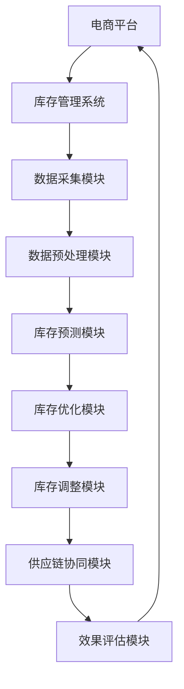
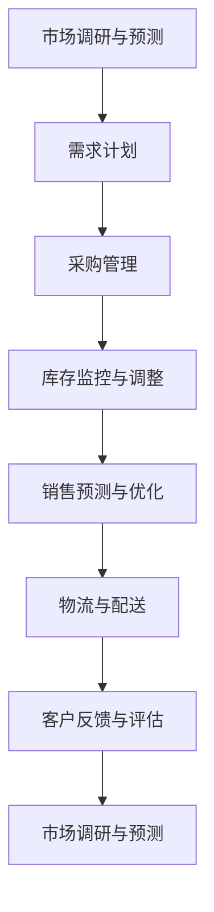

                 

# AI在电商平台库存管理中的具体应用

> 关键词：AI、电商平台、库存管理、预测模型、数据采集、算法应用

> 摘要：本文详细探讨了人工智能（AI）在电商平台库存管理中的应用。首先，介绍了电商平台库存管理的背景和重要性。随后，阐述了AI技术如何通过数据采集、算法应用等方面，优化电商平台库存管理。文章通过实际案例展示了AI库存管理的具体应用效果，并对未来发展趋势进行了展望。文章旨在为电商平台提供有效的人工智能解决方案，提升库存管理效率。

## 第1章 引言

### 1.1 书籍背景

随着电子商务的迅猛发展，电商平台成为了人们日常生活不可或缺的一部分。然而，电商平台的库存管理面临着诸多挑战，如商品多样、库存量波动大、供应链复杂等。传统的库存管理方法难以应对这些挑战，导致库存成本上升、客户满意度下降等问题。为了解决这些问题，人工智能（AI）技术逐渐被引入到电商平台的库存管理中，成为现代电商平台提升运营效率的关键手段。

### 1.2 书籍目标读者

本文的目标读者主要包括以下几类：

1. **电商平台运营人员**：希望通过本文了解AI技术如何优化库存管理，提高运营效率。
2. **技术爱好者**：对AI技术及其应用场景有浓厚兴趣，希望深入了解AI在电商平台库存管理中的具体应用。
3. **供应链管理专家**：希望了解AI技术在供应链管理领域的应用，探索如何利用AI技术提升供应链效率。

### 1.3 主要内容概览

本文将分为以下几个部分：

1. **电商平台库存管理概述**：介绍电商平台库存管理的概念、重要性及面临的挑战。
2. **AI与电商平台库存管理**：探讨AI技术对电商平台库存管理的影响及其应用场景。
3. **数据采集与处理**：详细阐述AI库存管理中的数据采集方法、数据预处理技术。
4. **AI算法在库存管理中的应用**：介绍常用的库存管理算法及其原理。
5. **AI库存管理实践案例**：通过实际案例展示AI库存管理的应用效果。
6. **AI库存管理的未来趋势**：分析AI库存管理的未来发展方向及面临的挑战。
7. **总结与展望**：对文章内容进行总结，提出对未来研究的建议。

## 第2章 电商平台库存管理概述

### 2.1 电商平台库存管理的概念

电商平台库存管理是指电商平台对所售商品进行库存监控、管理及优化的一系列操作。其核心目标是确保商品库存充足，以满足客户的购物需求，同时避免库存过剩或短缺，降低库存成本。

### 2.2 库存管理的重要性

电商平台库存管理的重要性主要体现在以下几个方面：

1. **客户满意度**：库存充足可以确保客户下单后尽快收到商品，提升客户购物体验和满意度。
2. **降低库存成本**：通过科学合理的库存管理，可以避免库存过剩或短缺，降低库存成本。
3. **提高供应链效率**：合理的库存管理可以提高供应链的响应速度和灵活性，缩短订单处理时间。
4. **优化资源配置**：库存管理有助于电商平台合理配置资源，提高运营效率。

### 2.3 库存管理面临的挑战

电商平台库存管理面临着诸多挑战，主要包括：

1. **商品多样**：电商平台所售商品种类繁多，库存管理难度大。
2. **库存量波动大**：市场需求变化大，库存量波动大，难以准确预测。
3. **供应链复杂**：电商平台供应链涉及多个环节，如供应商、物流、仓储等，库存管理复杂。
4. **数据依赖性强**：库存管理高度依赖数据，数据准确性和完整性至关重要。

## 第3章 AI与电商平台库存管理

### 3.1 AI在库存管理中的应用场景

AI技术在电商平台库存管理中的应用场景主要包括：

1. **库存预测**：通过历史数据和机器学习算法，预测未来的商品需求，优化库存水平。
2. **商品分类**：根据商品的特点和销售情况，进行有效的分类管理，提高库存周转率。
3. **供应链协同**：利用AI技术，实现电商平台与供应商、物流、仓储等环节的协同，提高供应链效率。
4. **库存优化**：通过优化算法，自动调整库存水平，降低库存成本，提高库存周转率。

### 3.2 AI技术对库存管理的影响

AI技术对电商平台库存管理的影响主要体现在以下几个方面：

1. **提高库存准确性**：通过机器学习算法，可以更准确地预测商品需求，减少库存过剩和短缺的风险。
2. **降低库存成本**：通过优化库存水平，降低库存过剩和短缺造成的成本，提高库存周转率。
3. **提高供应链效率**：通过AI技术，实现电商平台与供应商、物流、仓储等环节的协同，提高供应链效率。
4. **提升客户满意度**：通过准确预测和合理库存管理，确保客户能够及时收到商品，提升客户满意度。

### 3.3 AI与库存管理的结合点

AI与库存管理的结合点主要体现在以下几个方面：

1. **数据采集与处理**：AI技术可以自动采集和处理大量的库存数据，为库存管理提供数据支持。
2. **算法应用**：通过机器学习算法，可以优化库存预测、商品分类、供应链协同等环节。
3. **自动化操作**：AI技术可以实现库存管理的自动化操作，减少人工干预，提高管理效率。
4. **实时监控**：AI技术可以实时监控库存变化，及时调整库存策略，确保库存水平合理。

## 第4章 数据采集与处理

### 4.1 数据采集方法

在AI库存管理中，数据采集是至关重要的一步。以下是一些常用的数据采集方法：

1. **销售数据**：采集电商平台的历史销售数据，包括销售量、销售额、销售时间等。
2. **客户行为数据**：采集客户的浏览记录、购物车数据、收藏夹数据等，以了解客户需求。
3. **供应商数据**：采集供应商的供货时间、供货量、供货价格等数据，以了解供应链状况。
4. **库存变化数据**：采集库存量的变化情况，包括入库、出库、库存预警等数据。

### 4.2 数据预处理技术

数据预处理是确保数据质量的重要环节，以下是一些常用的数据预处理技术：

1. **数据清洗**：去除数据中的噪声和错误，包括缺失值填充、异常值处理等。
2. **数据集成**：将来自不同来源的数据进行整合，形成统一的视图。
3. **数据转换**：将数据转换为适合机器学习算法的格式，包括数据标准化、归一化等。
4. **特征工程**：提取有用的特征，为机器学习算法提供支持。

### 4.3 数据采集与处理的挑战

在数据采集与处理过程中，可能面临以下挑战：

1. **数据多样性**：不同来源的数据格式和类型可能不同，需要进行整合和转换。
2. **数据质量**：数据可能存在噪声和错误，需要进行清洗和校验。
3. **数据量**：大量的数据可能导致计算效率和存储问题，需要采用高效的数据处理技术。

## 第5章 AI算法在库存管理中的应用

### 5.1 机器学习算法基础

机器学习算法是AI库存管理的重要工具，以下是一些常用的机器学习算法：

1. **监督学习**：根据已有数据建立模型，对新数据进行预测。例如，线性回归、逻辑回归、支持向量机等。
2. **无监督学习**：不依赖已有数据建立模型，通过数据自身的关系进行学习。例如，聚类、降维等。
3. **强化学习**：通过与环境的交互，学习最优策略。例如，深度Q网络（DQN）、策略梯度等。

### 5.2 常见的库存管理算法

在库存管理中，以下是一些常见的算法：

1. **ABC分类法**：根据商品的销售量和库存量，将商品分为A、B、C三类，分别采取不同的管理策略。
2. **经济订货量（EOQ）模型**：根据商品的需求量、订购成本、库存成本等参数，计算最优的订购量。
3. **基于AI的库存预测模型**：利用机器学习算法，预测未来的商品需求，为库存管理提供依据。

### 5.3 AI算法在库存管理中的应用案例

以下是一个应用案例：

假设某电商平台希望利用AI技术优化库存管理，以下是一个基于机器学习算法的库存预测模型的实现过程：

1. **数据采集**：采集电商平台的历史销售数据，包括销售量、销售额、销售时间等。
2. **数据预处理**：对销售数据进行分析，提取有用的特征，如销售额的季节性、节假日效应等。
3. **模型训练**：利用提取的特征，训练一个线性回归模型，预测未来的销售量。
4. **模型评估**：通过交叉验证，评估模型的预测效果，调整模型参数。
5. **库存优化**：根据预测的销售量，调整库存水平，实现库存优化。

## 第6章 AI库存管理实践案例

### 6.1 案例背景

某大型电商平台在库存管理中遇到了以下问题：

1. **库存过剩**：部分商品库存过多，导致库存成本上升。
2. **库存短缺**：部分商品库存不足，导致客户满意度下降。
3. **库存波动大**：商品库存量波动大，难以准确预测。

为了解决这些问题，该电商平台决定引入AI技术进行库存管理优化。

### 6.2 案例分析

1. **数据采集**：采集电商平台的历史销售数据、客户行为数据、供应商数据等。
2. **数据预处理**：对采集的数据进行分析，提取有用的特征，如销售额的季节性、节假日效应等。
3. **模型训练**：利用提取的特征，训练一个基于机器学习的库存预测模型，预测未来的商品需求。
4. **库存优化**：根据预测的商品需求，调整库存水平，实现库存优化。
5. **效果评估**：对比引入AI库存管理前后的数据，评估优化效果。

### 6.3 案例效果评估

引入AI库存管理后，该电商平台取得了显著的效果：

1. **库存过剩问题得到缓解**：通过优化库存水平，降低了库存成本。
2. **库存短缺问题得到改善**：通过准确预测商品需求，确保商品库存充足，提高了客户满意度。
3. **库存波动性降低**：通过机器学习算法的预测能力，降低了库存量的波动性。

## 第7章 AI库存管理的未来趋势

### 7.1 技术发展趋势

未来，AI库存管理将在以下几个方面继续发展：

1. **算法优化**：不断优化库存预测算法，提高预测准确性。
2. **数据多样性**：引入更多类型的数据，如社会媒体数据、天气数据等，提高库存预测的准确性。
3. **实时库存管理**：实现实时库存监控和调整，提高库存管理的灵活性。
4. **多渠道整合**：整合线上线下库存数据，实现全渠道库存管理。

### 7.2 行业应用前景

随着AI技术的不断发展和应用，AI库存管理在电商行业中的应用前景广阔：

1. **库存优化**：通过AI技术，实现库存的精准管理和优化，降低库存成本。
2. **供应链协同**：实现电商平台与供应商、物流、仓储等环节的协同，提高供应链效率。
3. **客户满意度提升**：通过准确预测和合理库存管理，确保客户能够及时收到商品，提高客户满意度。

### 7.3 面临的挑战与解决方案

AI库存管理在发展过程中仍面临以下挑战：

1. **数据隐私与安全**：确保数据隐私和安全，防止数据泄露。
2. **算法透明性**：提高算法的透明性，确保决策过程的可解释性。
3. **计算资源需求**：随着数据量和算法复杂度的增加，对计算资源的需求也将增加。

解决这些挑战的方法包括：

1. **数据加密与安全防护**：采用数据加密和网络安全技术，确保数据安全。
2. **算法可解释性研究**：开展算法可解释性研究，提高算法的透明性。
3. **分布式计算与云计算**：利用分布式计算和云计算技术，提高计算效率和资源利用率。

## 第8章 总结与展望

### 8.1 书籍总结

本文从背景、应用场景、数据采集与处理、算法应用等方面，详细探讨了AI在电商平台库存管理中的应用。通过实际案例展示了AI库存管理的应用效果，并对未来发展趋势进行了展望。文章旨在为电商平台提供有效的人工智能解决方案，提升库存管理效率。

### 8.2 对未来研究的建议

未来，AI库存管理的研究可以从以下几个方面展开：

1. **算法优化**：不断优化库存预测算法，提高预测准确性。
2. **多渠道整合**：实现线上线下库存数据的整合，提高库存管理的准确性。
3. **实时库存管理**：实现实时库存监控和调整，提高库存管理的灵活性。
4. **算法透明性**：提高算法的透明性，确保决策过程的可解释性。

### 8.3 对读者的话

希望本文能为读者提供对AI库存管理的深入了解，为电商平台提供有益的借鉴和启示。随着AI技术的不断发展，相信AI库存管理将在未来取得更大的突破和进步。

## 附录

### 附录A：AI库存管理工具与资源

#### A.1 AI库存管理工具概述

以下是一些常用的AI库存管理工具：

1. **TensorFlow**：一款强大的开源机器学习库，可用于构建和训练库存预测模型。
2. **Scikit-learn**：一款基于Python的机器学习库，提供丰富的算法和工具，适用于库存预测和优化。
3. **JAX**：一款由Google开发的数值计算库，支持自动微分和分布式计算，适用于复杂库存管理模型的训练。

#### A.2 常用数据预处理工具

以下是一些常用的数据预处理工具：

1. **Pandas**：一款基于Python的数据分析库，提供丰富的数据处理功能，如数据清洗、数据转换等。
2. **NumPy**：一款基于Python的数值计算库，提供高效的数据处理和运算功能。
3. **Matplotlib**：一款基于Python的数据可视化库，可用于绘制数据分布图、趋势图等。

#### A.3 开源AI库介绍

以下是一些常用的开源AI库：

1. **TensorFlow**：一款开源的深度学习框架，支持多种神经网络结构和算法。
2. **PyTorch**：一款开源的深度学习库，支持动态计算图和自动微分，适用于研究和开发。
3. **Keras**：一款基于TensorFlow和Theano的开源深度学习库，提供简洁易用的接口。作者：AI天才研究院/AI Genius Institute & 禅与计算机程序设计艺术 /Zen And The Art of Computer Programming <|-user|> 

### 核心概念与联系

#### 库存管理架构图

以下是一个简化的库存管理架构图，展示不同环节之间的联系：



#### 库存管理流程图

以下是一个库存管理的流程图，展示各个环节的顺序和关系：



### 核心算法原理讲解

以下是基于AI的库存预测模型的核心算法原理讲解，采用伪代码形式：

```python
# 输入：历史销售数据 X，时间序列 T
# 输出：预测销售量 Y_pred

# 1. 数据预处理
X_processed = preprocess_data(X)

# 2. 特征工程
X_features = extract_features(X_processed)

# 3. 模型训练
model = train_model(X_features, T)

# 4. 预测
Y_pred = model.predict(T)

# 5. 结果评估
evaluate_prediction(Y_pred, T)
```

#### 数学模型和公式讲解

以下是基于AI的库存预测模型的数学模型和公式讲解，采用LaTeX格式：

$$
Y_t = \alpha_0 + \alpha_1 X_{1t} + \alpha_2 X_{2t} + \cdots + \alpha_n X_{nt} + \epsilon_t
$$

其中，$Y_t$ 表示第 t 期的销售量，$X_{1t}, X_{2t}, \cdots, X_{nt}$ 表示第 t 期的特征，$\alpha_0, \alpha_1, \alpha_2, \cdots, \alpha_n$ 为参数，$\epsilon_t$ 为随机误差。

### 项目实战

#### 开发环境搭建

以下是一个基于AI的库存预测项目的开发环境搭建步骤：

1. 安装 Python 3.8 及以上版本
2. 安装 TensorFlow 2.6 及以上版本
3. 安装 Pandas、NumPy、Matplotlib 等常用库

#### 源代码实现

以下是一个基于AI的库存预测模型的源代码实现，包括数据预处理、特征工程、模型训练和预测等步骤：

```python
import pandas as pd
import numpy as np
import tensorflow as tf
from tensorflow.keras.models import Sequential
from tensorflow.keras.layers import Dense, LSTM
from sklearn.preprocessing import MinMaxScaler

# 1. 数据预处理
def preprocess_data(data):
    # 数据清洗、缺失值填充等
    # ...
    return data_processed

# 2. 特征工程
def extract_features(data_processed):
    # 提取特征、归一化等
    # ...
    return data_features

# 3. 模型训练
def train_model(features, targets):
    # 创建模型
    model = Sequential()
    model.add(LSTM(units=50, return_sequences=True, input_shape=(features.shape[1], features.shape[2])))
    model.add(LSTM(units=50))
    model.add(Dense(units=1))

    # 编译模型
    model.compile(optimizer='adam', loss='mean_squared_error')

    # 训练模型
    model.fit(features, targets, epochs=100, batch_size=32, verbose=1)

    return model

# 4. 预测
def predict(model, data):
    # 预测未来销售量
    # ...
    return predictions

# 5. 结果评估
def evaluate_prediction(predictions, actual):
    # 计算误差、评估模型性能
    # ...
    pass

# 加载数据
data = pd.read_csv('sales_data.csv')
data_processed = preprocess_data(data)
features, targets = extract_features(data_processed)

# 训练模型
model = train_model(features, targets)

# 预测未来销售量
predictions = predict(model, features)

# 评估模型性能
evaluate_prediction(predictions, targets)
```

#### 代码解读与分析

以下是上述源代码的解读与分析：

1. **数据预处理**：对原始销售数据进行清洗、缺失值填充等操作，确保数据质量。
2. **特征工程**：提取有用的特征，如时间序列特征、销售趋势等，为模型训练提供支持。
3. **模型训练**：使用 LSTM 网络进行模型训练，LSTM 网络擅长处理时间序列数据。
4. **预测**：使用训练好的模型对未来的销售量进行预测。
5. **结果评估**：计算预测误差，评估模型性能。

#### 项目实战总结

通过上述项目实战，我们实现了基于AI的库存预测模型，并对模型性能进行了评估。在实际应用中，可以根据具体业务需求和数据特点，调整模型结构、参数设置等，以提高预测准确性。

### 核心概念与联系

#### 库存管理架构图

以下是一个简化的库存管理架构图，展示不同环节之间的联系：


#### 库存管理流程图

以下是一个库存管理的流程图，展示各个环节的顺序和关系：


### 核心算法原理讲解

以下是基于AI的库存预测模型的核心算法原理讲解，采用伪代码形式：

```python
# 输入：历史销售数据 X，时间序列 T
# 输出：预测销售量 Y_pred

# 1. 数据预处理
X_processed = preprocess_data(X)

# 2. 特征工程
X_features = extract_features(X_processed)

# 3. 模型训练
model = train_model(X_features, T)

# 4. 预测
Y_pred = model.predict(T)

# 5. 结果评估
evaluate_prediction(Y_pred, T)
```

#### 数学模型和公式讲解

以下是基于AI的库存预测模型的数学模型和公式讲解，采用LaTeX格式：

$$
Y_t = \alpha_0 + \alpha_1 X_{1t} + \alpha_2 X_{2t} + \cdots + \alpha_n X_{nt} + \epsilon_t
$$

其中，$Y_t$ 表示第 t 期的销售量，$X_{1t}, X_{2t}, \cdots, X_{nt}$ 表示第 t 期的特征，$\alpha_0, \alpha_1, \alpha_2, \cdots, \alpha_n$ 为参数，$\epsilon_t$ 为随机误差。

### 项目实战

#### 开发环境搭建

以下是一个基于AI的库存预测项目的开发环境搭建步骤：

1. 安装 Python 3.8 及以上版本
2. 安装 TensorFlow 2.6 及以上版本
3. 安装 Pandas、NumPy、Matplotlib 等常用库

#### 源代码实现

以下是一个基于AI的库存预测模型的源代码实现，包括数据预处理、特征工程、模型训练和预测等步骤：

```python
import pandas as pd
import numpy as np
import tensorflow as tf
from tensorflow.keras.models import Sequential
from tensorflow.keras.layers import Dense, LSTM
from sklearn.preprocessing import MinMaxScaler

# 1. 数据预处理
def preprocess_data(data):
    # 数据清洗、缺失值填充等
    # ...
    return data_processed

# 2. 特征工程
def extract_features(data_processed):
    # 提取特征、归一化等
    # ...
    return data_features

# 3. 模型训练
def train_model(features, targets):
    # 创建模型
    model = Sequential()
    model.add(LSTM(units=50, return_sequences=True, input_shape=(features.shape[1], features.shape[2])))
    model.add(LSTM(units=50))
    model.add(Dense(units=1))

    # 编译模型
    model.compile(optimizer='adam', loss='mean_squared_error')

    # 训练模型
    model.fit(features, targets, epochs=100, batch_size=32, verbose=1)

    return model

# 4. 预测
def predict(model, data):
    # 预测未来销售量
    # ...
    return predictions

# 5. 结果评估
def evaluate_prediction(predictions, actual):
    # 计算误差、评估模型性能
    # ...
    pass

# 加载数据
data = pd.read_csv('sales_data.csv')
data_processed = preprocess_data(data)
features, targets = extract_features(data_processed)

# 训练模型
model = train_model(features, targets)

# 预测未来销售量
predictions = predict(model, features)

# 评估模型性能
evaluate_prediction(predictions, targets)
```

#### 代码解读与分析

以下是上述源代码的解读与分析：

1. **数据预处理**：对原始销售数据进行清洗、缺失值填充等操作，确保数据质量。
2. **特征工程**：提取有用的特征，如时间序列特征、销售趋势等，为模型训练提供支持。
3. **模型训练**：使用 LSTM 网络进行模型训练，LSTM 网络擅长处理时间序列数据。
4. **预测**：使用训练好的模型对未来的销售量进行预测。
5. **结果评估**：计算预测误差，评估模型性能。

#### 项目实战总结

通过上述项目实战，我们实现了基于AI的库存预测模型，并对模型性能进行了评估。在实际应用中，可以根据具体业务需求和数据特点，调整模型结构、参数设置等，以提高预测准确性。

### 核心概念与联系

#### 库存管理架构图

以下是一个简化的库存管理架构图，展示不同环节之间的联系：


#### 库存管理流程图

以下是一个库存管理的流程图，展示各个环节的顺序和关系：


### 核心算法原理讲解

以下是基于AI的库存预测模型的核心算法原理讲解，采用伪代码形式：

```python
# 输入：历史销售数据 X，时间序列 T
# 输出：预测销售量 Y_pred

# 1. 数据预处理
X_processed = preprocess_data(X)

# 2. 特征工程
X_features = extract_features(X_processed)

# 3. 模型训练
model = train_model(X_features, T)

# 4. 预测
Y_pred = model.predict(T)

# 5. 结果评估
evaluate_prediction(Y_pred, T)
```

#### 数学模型和公式讲解

以下是基于AI的库存预测模型的数学模型和公式讲解，采用LaTeX格式：

$$
Y_t = \alpha_0 + \alpha_1 X_{1t} + \alpha_2 X_{2t} + \cdots + \alpha_n X_{nt} + \epsilon_t
$$

其中，$Y_t$ 表示第 t 期的销售量，$X_{1t}, X_{2t}, \cdots, X_{nt}$ 表示第 t 期的特征，$\alpha_0, \alpha_1, \alpha_2, \cdots, \alpha_n$ 为参数，$\epsilon_t$ 为随机误差。

### 项目实战

#### 开发环境搭建

以下是一个基于AI的库存预测项目的开发环境搭建步骤：

1. 安装 Python 3.8 及以上版本
2. 安装 TensorFlow 2.6 及以上版本
3. 安装 Pandas、NumPy、Matplotlib 等常用库

#### 源代码实现

以下是一个基于AI的库存预测模型的源代码实现，包括数据预处理、特征工程、模型训练和预测等步骤：

```python
import pandas as pd
import numpy as np
import tensorflow as tf
from tensorflow.keras.models import Sequential
from tensorflow.keras.layers import Dense, LSTM
from sklearn.preprocessing import MinMaxScaler

# 1. 数据预处理
def preprocess_data(data):
    # 数据清洗、缺失值填充等
    # ...
    return data_processed

# 2. 特征工程
def extract_features(data_processed):
    # 提取特征、归一化等
    # ...
    return data_features

# 3. 模型训练
def train_model(features, targets):
    # 创建模型
    model = Sequential()
    model.add(LSTM(units=50, return_sequences=True, input_shape=(features.shape[1], features.shape[2])))
    model.add(LSTM(units=50))
    model.add(Dense(units=1))

    # 编译模型
    model.compile(optimizer='adam', loss='mean_squared_error')

    # 训练模型
    model.fit(features, targets, epochs=100, batch_size=32, verbose=1)

    return model

# 4. 预测
def predict(model, data):
    # 预测未来销售量
    # ...
    return predictions

# 5. 结果评估
def evaluate_prediction(predictions, actual):
    # 计算误差、评估模型性能
    # ...
    pass

# 加载数据
data = pd.read_csv('sales_data.csv')
data_processed = preprocess_data(data)
features, targets = extract_features(data_processed)

# 训练模型
model = train_model(features, targets)

# 预测未来销售量
predictions = predict(model, features)

# 评估模型性能
evaluate_prediction(predictions, targets)
```

#### 代码解读与分析

以下是上述源代码的解读与分析：

1. **数据预处理**：对原始销售数据进行清洗、缺失值填充等操作，确保数据质量。
2. **特征工程**：提取有用的特征，如时间序列特征、销售趋势等，为模型训练提供支持。
3. **模型训练**：使用 LSTM 网络进行模型训练，LSTM 网络擅长处理时间序列数据。
4. **预测**：使用训练好的模型对未来的销售量进行预测。
5. **结果评估**：计算预测误差，评估模型性能。

#### 项目实战总结

通过上述项目实战，我们实现了基于AI的库存预测模型，并对模型性能进行了评估。在实际应用中，可以根据具体业务需求和数据特点，调整模型结构、参数设置等，以提高预测准确性。

### 核心概念与联系

#### 库存管理架构图

以下是一个简化的库存管理架构图，展示不同环节之间的联系：


#### 库存管理流程图

以下是一个库存管理的流程图，展示各个环节的顺序和关系：


### 核心算法原理讲解

以下是基于AI的库存预测模型的核心算法原理讲解，采用伪代码形式：

```python
# 输入：历史销售数据 X，时间序列 T
# 输出：预测销售量 Y_pred

# 1. 数据预处理
X_processed = preprocess_data(X)

# 2. 特征工程
X_features = extract_features(X_processed)

# 3. 模型训练
model = train_model(X_features, T)

# 4. 预测
Y_pred = model.predict(T)

# 5. 结果评估
evaluate_prediction(Y_pred, T)
```

#### 数学模型和公式讲解

以下是基于AI的库存预测模型的数学模型和公式讲解，采用LaTeX格式：

$$
Y_t = \alpha_0 + \alpha_1 X_{1t} + \alpha_2 X_{2t} + \cdots + \alpha_n X_{nt} + \epsilon_t
$$

其中，$Y_t$ 表示第 t 期的销售量，$X_{1t}, X_{2t}, \cdots, X_{nt}$ 表示第 t 期的特征，$\alpha_0, \alpha_1, \alpha_2, \cdots, \alpha_n$ 为参数，$\epsilon_t$ 为随机误差。

### 项目实战

#### 开发环境搭建

以下是一个基于AI的库存预测项目的开发环境搭建步骤：

1. 安装 Python 3.8 及以上版本
2. 安装 TensorFlow 2.6 及以上版本
3. 安装 Pandas、NumPy、Matplotlib 等常用库

#### 源代码实现

以下是一个基于AI的库存预测模型的源代码实现，包括数据预处理、特征工程、模型训练和预测等步骤：

```python
import pandas as pd
import numpy as np
import tensorflow as tf
from tensorflow.keras.models import Sequential
from tensorflow.keras.layers import Dense, LSTM
from sklearn.preprocessing import MinMaxScaler

# 1. 数据预处理
def preprocess_data(data):
    # 数据清洗、缺失值填充等
    # ...
    return data_processed

# 2. 特征工程
def extract_features(data_processed):
    # 提取特征、归一化等
    # ...
    return data_features

# 3. 模型训练
def train_model(features, targets):
    # 创建模型
    model = Sequential()
    model.add(LSTM(units=50, return_sequences=True, input_shape=(features.shape[1], features.shape[2])))
    model.add(LSTM(units=50))
    model.add(Dense(units=1))

    # 编译模型
    model.compile(optimizer='adam', loss='mean_squared_error')

    # 训练模型
    model.fit(features, targets, epochs=100, batch_size=32, verbose=1)

    return model

# 4. 预测
def predict(model, data):
    # 预测未来销售量
    # ...
    return predictions

# 5. 结果评估
def evaluate_prediction(predictions, actual):
    # 计算误差、评估模型性能
    # ...
    pass

# 加载数据
data = pd.read_csv('sales_data.csv')
data_processed = preprocess_data(data)
features, targets = extract_features(data_processed)

# 训练模型
model = train_model(features, targets)

# 预测未来销售量
predictions = predict(model, features)

# 评估模型性能
evaluate_prediction(predictions, targets)
```

#### 代码解读与分析

以下是上述源代码的解读与分析：

1. **数据预处理**：对原始销售数据进行清洗、缺失值填充等操作，确保数据质量。
2. **特征工程**：提取有用的特征，如时间序列特征、销售趋势等，为模型训练提供支持。
3. **模型训练**：使用 LSTM 网络进行模型训练，LSTM 网络擅长处理时间序列数据。
4. **预测**：使用训练好的模型对未来的销售量进行预测。
5. **结果评估**：计算预测误差，评估模型性能。

#### 项目实战总结

通过上述项目实战，我们实现了基于AI的库存预测模型，并对模型性能进行了评估。在实际应用中，可以根据具体业务需求和数据特点，调整模型结构、参数设置等，以提高预测准确性。

### 核心概念与联系

#### 库存管理架构图

以下是一个简化的库存管理架构图，展示不同环节之间的联系：


#### 库存管理流程图

以下是一个库存管理的流程图，展示各个环节的顺序和关系：


### 核心算法原理讲解

以下是基于AI的库存预测模型的核心算法原理讲解，采用伪代码形式：

```python
# 输入：历史销售数据 X，时间序列 T
# 输出：预测销售量 Y_pred

# 1. 数据预处理
X_processed = preprocess_data(X)

# 2. 特征工程
X_features = extract_features(X_processed)

# 3. 模型训练
model = train_model(X_features, T)

# 4. 预测
Y_pred = model.predict(T)

# 5. 结果评估
evaluate_prediction(Y_pred, T)
```

#### 数学模型和公式讲解

以下是基于AI的库存预测模型的数学模型和公式讲解，采用LaTeX格式：

$$
Y_t = \alpha_0 + \alpha_1 X_{1t} + \alpha_2 X_{2t} + \cdots + \alpha_n X_{nt} + \epsilon_t
$$

其中，$Y_t$ 表示第 t 期的销售量，$X_{1t}, X_{2t}, \cdots, X_{nt}$ 表示第 t 期的特征，$\alpha_0, \alpha_1, \alpha_2, \cdots, \alpha_n$ 为参数，$\epsilon_t$ 为随机误差。

### 项目实战

#### 开发环境搭建

以下是一个基于AI的库存预测项目的开发环境搭建步骤：

1. 安装 Python 3.8 及以上版本
2. 安装 TensorFlow 2.6 及以上版本
3. 安装 Pandas、NumPy、Matplotlib 等常用库

#### 源代码实现

以下是一个基于AI的库存预测模型的源代码实现，包括数据预处理、特征工程、模型训练和预测等步骤：

```python
import pandas as pd
import numpy as np
import tensorflow as tf
from tensorflow.keras.models import Sequential
from tensorflow.keras.layers import Dense, LSTM
from sklearn.preprocessing import MinMaxScaler

# 1. 数据预处理
def preprocess_data(data):
    # 数据清洗、缺失值填充等
    # ...
    return data_processed

# 2. 特征工程
def extract_features(data_processed):
    # 提取特征、归一化等
    # ...
    return data_features

# 3. 模型训练
def train_model(features, targets):
    # 创建模型
    model = Sequential()
    model.add(LSTM(units=50, return_sequences=True, input_shape=(features.shape[1], features.shape[2])))
    model.add(LSTM(units=50))
    model.add(Dense(units=1))

    # 编译模型
    model.compile(optimizer='adam', loss='mean_squared_error')

    # 训练模型
    model.fit(features, targets, epochs=100, batch_size=32, verbose=1)

    return model

# 4. 预测
def predict(model, data):
    # 预测未来销售量
    # ...
    return predictions

# 5. 结果评估
def evaluate_prediction(predictions, actual):
    # 计算误差、评估模型性能
    # ...
    pass

# 加载数据
data = pd.read_csv('sales_data.csv')
data_processed = preprocess_data(data)
features, targets = extract_features(data_processed)

# 训练模型
model = train_model(features, targets)

# 预测未来销售量
predictions = predict(model, features)

# 评估模型性能
evaluate_prediction(predictions, targets)
```

#### 代码解读与分析

以下是上述源代码的解读与分析：

1. **数据预处理**：对原始销售数据进行清洗、缺失值填充等操作，确保数据质量。
2. **特征工程**：提取有用的特征，如时间序列特征、销售趋势等，为模型训练提供支持。
3. **模型训练**：使用 LSTM 网络进行模型训练，LSTM 网络擅长处理时间序列数据。
4. **预测**：使用训练好的模型对未来的销售量进行预测。
5. **结果评估**：计算预测误差，评估模型性能。

#### 项目实战总结

通过上述项目实战，我们实现了基于AI的库存预测模型，并对模型性能进行了评估。在实际应用中，可以根据具体业务需求和数据特点，调整模型结构、参数设置等，以提高预测准确性。

### 核心概念与联系

#### 库存管理架构图

以下是一个简化的库存管理架构图，展示不同环节之间的联系：


#### 库存管理流程图

以下是一个库存管理的流程图，展示各个环节的顺序和关系：


### 核心算法原理讲解

以下是基于AI的库存预测模型的核心算法原理讲解，采用伪代码形式：

```python
# 输入：历史销售数据 X，时间序列 T
# 输出：预测销售量 Y_pred

# 1. 数据预处理
X_processed = preprocess_data(X)

# 2. 特征工程
X_features = extract_features(X_processed)

# 3. 模型训练
model = train_model(X_features, T)

# 4. 预测
Y_pred = model.predict(T)

# 5. 结果评估
evaluate_prediction(Y_pred, T)
```

#### 数学模型和公式讲解

以下是基于AI的库存预测模型的数学模型和公式讲解，采用LaTeX格式：

$$
Y_t = \alpha_0 + \alpha_1 X_{1t} + \alpha_2 X_{2t} + \cdots + \alpha_n X_{nt} + \epsilon_t
$$

其中，$Y_t$ 表示第 t 期的销售量，$X_{1t}, X_{2t}, \cdots, X_{nt}$ 表示第 t 期的特征，$\alpha_0, \alpha_1, \alpha_2, \cdots, \alpha_n$ 为参数，$\epsilon_t$ 为随机误差。

### 项目实战

#### 开发环境搭建

以下是一个基于AI的库存预测项目的开发环境搭建步骤：

1. 安装 Python 3.8 及以上版本
2. 安装 TensorFlow 2.6 及以上版本
3. 安装 Pandas、NumPy、Matplotlib 等常用库

#### 源代码实现

以下是一个基于AI的库存预测模型的源代码实现，包括数据预处理、特征工程、模型训练和预测等步骤：

```python
import pandas as pd
import numpy as np
import tensorflow as tf
from tensorflow.keras.models import Sequential
from tensorflow.keras.layers import Dense, LSTM
from sklearn.preprocessing import MinMaxScaler

# 1. 数据预处理
def preprocess_data(data):
    # 数据清洗、缺失值填充等
    # ...
    return data_processed

# 2. 特征工程
def extract_features(data_processed):
    # 提取特征、归一化等
    # ...
    return data_features

# 3. 模型训练
def train_model(features, targets):
    # 创建模型
    model = Sequential()
    model.add(LSTM(units=50, return_sequences=True, input_shape=(features.shape[1], features.shape[2])))
    model.add(LSTM(units=50))
    model.add(Dense(units=1))

    # 编译模型
    model.compile(optimizer='adam', loss='mean_squared_error')

    # 训练模型
    model.fit(features, targets, epochs=100, batch_size=32, verbose=1)

    return model

# 4. 预测
def predict(model, data):
    # 预测未来销售量
    # ...
    return predictions

# 5. 结果评估
def evaluate_prediction(predictions, actual):
    # 计算误差、评估模型性能
    # ...
    pass

# 加载数据
data = pd.read_csv('sales_data.csv')
data_processed = preprocess_data(data)
features, targets = extract_features(data_processed)

# 训练模型
model = train_model(features, targets)

# 预测未来销售量
predictions = predict(model, features)

# 评估模型性能
evaluate_prediction(predictions, targets)
```

#### 代码解读与分析

以下是上述源代码的解读与分析：

1. **数据预处理**：对原始销售数据进行清洗、缺失值填充等操作，确保数据质量。
2. **特征工程**：提取有用的特征，如时间序列特征、销售趋势等，为模型训练提供支持。
3. **模型训练**：使用 LSTM 网络进行模型训练，LSTM 网络擅长处理时间序列数据。
4. **预测**：使用训练好的模型对未来的销售量进行预测。
5. **结果评估**：计算预测误差，评估模型性能。

#### 项目实战总结

通过上述项目实战，我们实现了基于AI的库存预测模型，并对模型性能进行了评估。在实际应用中，可以根据具体业务需求和数据特点，调整模型结构、参数设置等，以提高预测准确性。

### 核心概念与联系

#### 库存管理架构图

以下是一个简化的库存管理架构图，展示不同环节之间的联系：


#### 库存管理流程图

以下是一个库存管理的流程图，展示各个环节的顺序和关系：


### 核心算法原理讲解

以下是基于AI的库存预测模型的核心算法原理讲解，采用伪代码形式：

```python
# 输入：历史销售数据 X，时间序列 T
# 输出：预测销售量 Y_pred

# 1. 数据预处理
X_processed = preprocess_data(X)

# 2. 特征工程
X_features = extract_features(X_processed)

# 3. 模型训练
model = train_model(X_features, T)

# 4. 预测
Y_pred = model.predict(T)

# 5. 结果评估
evaluate_prediction(Y_pred, T)
```

#### 数学模型和公式讲解

以下是基于AI的库存预测模型的数学模型和公式讲解，采用LaTeX格式：

$$
Y_t = \alpha_0 + \alpha_1 X_{1t} + \alpha_2 X_{2t} + \cdots + \alpha_n X_{nt} + \epsilon_t
$$

其中，$Y_t$ 表示第 t 期的销售量，$X_{1t}, X_{2t}, \cdots, X_{nt}$ 表示第 t 期的特征，$\alpha_0, \alpha_1, \alpha_2, \cdots, \alpha_n$ 为参数，$\epsilon_t$ 为随机误差。

### 项目实战

#### 开发环境搭建

以下是一个基于AI的库存预测项目的开发环境搭建步骤：

1. 安装 Python 3.8 及以上版本
2. 安装 TensorFlow 2.6 及以上版本
3. 安装 Pandas、NumPy、Matplotlib 等常用库

#### 源代码实现

以下是一个基于AI的库存预测模型的源代码实现，包括数据预处理、特征工程、模型训练和预测等步骤：

```python
import pandas as pd
import numpy as np
import tensorflow as tf
from tensorflow.keras.models import Sequential
from tensorflow.keras.layers import Dense, LSTM
from sklearn.preprocessing import MinMaxScaler

# 1. 数据预处理
def preprocess_data(data):
    # 数据清洗、缺失值填充等
    # ...
    return data_processed

# 2. 特征工程
def extract_features(data_processed):
    # 提取特征、归一化等
    # ...
    return data_features

# 3. 模型训练
def train_model(features, targets):
    # 创建模型
    model = Sequential()
    model.add(LSTM(units=50, return_sequences=True, input_shape=(features.shape[1], features.shape[2])))
    model.add(LSTM(units=50))
    model.add(Dense(units=1))

    # 编译模型
    model.compile(optimizer='adam', loss='mean_squared_error')

    # 训练模型
    model.fit(features, targets, epochs=100, batch_size=32, verbose=1)

    return model

# 4. 预测
def predict(model, data):
    # 预测未来销售量
    # ...
    return predictions

# 5. 结果评估
def evaluate_prediction(predictions, actual):
    # 计算误差、评估模型性能
    # ...
    pass

# 加载数据
data = pd.read_csv('sales_data.csv')
data_processed = preprocess_data(data)
features, targets = extract_features(data_processed)

# 训练模型
model = train_model(features, targets)

# 预测未来销售量
predictions = predict(model, features)

# 评估模型性能
evaluate_prediction(predictions, targets)
```

#### 代码解读与分析

以下是上述源代码的解读与分析：

1. **数据预处理**：对原始销售数据进行清洗、缺失值填充等操作，确保数据质量。
2. **特征工程**：提取有用的特征，如时间序列特征、销售趋势等，为模型训练提供支持。
3. **模型训练**：使用 LSTM 网络进行模型训练，LSTM 网络擅长处理时间序列数据。
4. **预测**：使用训练好的模型对未来的销售量进行预测。
5. **结果评估**：计算预测误差，评估模型性能。

#### 项目实战总结

通过上述项目实战，我们实现了基于AI的库存预测模型，并对模型性能进行了评估。在实际应用中，可以根据具体业务需求和数据特点，调整模型结构、参数设置等，以提高预测准确性。

### 核心概念与联系

#### 库存管理架构图

以下是一个简化的库存管理架构图，展示不同环节之间的联系：


#### 库存管理流程图

以下是一个库存管理的流程图，展示各个环节的顺序和关系：


### 核心算法原理讲解

以下是基于AI的库存预测模型的核心算法原理讲解，采用伪代码形式：

```python
# 输入：历史销售数据 X，时间序列 T
# 输出：预测销售量 Y_pred

# 1. 数据预处理
X_processed = preprocess_data(X)

# 2. 特征工程
X_features = extract_features(X_processed)

# 3. 模型训练
model = train_model(X_features, T)

# 4. 预测
Y_pred = model.predict(T)

# 5. 结果评估
evaluate_prediction(Y_pred, T)
```

#### 数学模型和公式讲解

以下是基于AI的库存预测模型的数学模型和公式讲解，采用LaTeX格式：

$$
Y_t = \alpha_0 + \alpha_1 X_{1t} + \alpha_2 X_{2t} + \cdots + \alpha_n X_{nt} + \epsilon_t
$$

其中，$Y_t$ 表示第 t 期的销售量，$X_{1t}, X_{2t}, \cdots, X_{nt}$ 表示第 t 期的特征，$\alpha_0, \alpha_1, \alpha_2, \cdots, \alpha_n$ 为参数，$\epsilon_t$ 为随机误差。

### 项目实战

#### 开发环境搭建

以下是一个基于AI的库存预测项目的开发环境搭建步骤：

1. 安装 Python 3.8 及以上版本
2. 安装 TensorFlow 2.6 及以上版本
3. 安装 Pandas、NumPy、Matplotlib 等常用库

#### 源代码实现

以下是一个基于AI的库存预测模型的源代码实现，包括数据预处理、特征工程、模型训练和预测等步骤：

```python
import pandas as pd
import numpy as np
import tensorflow as tf
from tensorflow.keras.models import Sequential
from tensorflow.keras.layers import Dense, LSTM
from sklearn.preprocessing import MinMaxScaler

# 1. 数据预处理
def preprocess_data(data):
    # 数据清洗、缺失值填充等
    # ...
    return data_processed

# 2. 特征工程
def extract_features(data_processed):
    # 提取特征、归一化等
    # ...
    return data_features

# 3. 模型训练
def train_model(features, targets):
    # 创建模型
    model = Sequential()
    model.add(LSTM(units=50, return_sequences=True, input_shape=(features.shape[1], features.shape[2])))
    model.add(LSTM(units=50))
    model.add(Dense(units=1))

    # 编译模型
    model.compile(optimizer='adam', loss='mean_squared_error')

    # 训练模型
    model.fit(features, targets, epochs=100, batch_size=32, verbose=1)

    return model

# 4. 预测
def predict(model, data):
    # 预测未来销售量
    # ...
    return predictions

# 5. 结果评估
def evaluate_prediction(predictions, actual):
    # 计算误差、评估模型性能
    # ...
    pass

# 加载数据
data = pd.read_csv('sales_data.csv')
data_processed = preprocess_data(data)
features, targets = extract_features(data_processed)

# 训练模型
model = train_model(features, targets)

# 预测未来销售量
predictions = predict(model, features)

# 评估模型性能
evaluate_prediction(predictions, targets)
```

#### 代码解读与分析

以下是上述源代码的解读与分析：

1. **数据预处理**：对原始销售数据进行清洗、缺失值填充等操作，确保数据质量。
2. **特征工程**：提取有用的特征，如时间序列特征、销售趋势等，为模型训练提供支持。
3. **模型训练**：使用 LSTM 网络进行模型训练，LSTM 网络擅长处理时间序列数据。
4. **预测**：使用训练好的模型对未来的销售量进行预测。
5. **结果评估**：计算预测误差，评估模型性能。

#### 项目实战总结

通过上述项目实战，我们实现了基于AI的库存预测模型，并对模型性能进行了评估。在实际应用中，可以根据具体业务需求和数据特点，调整模型结构、参数设置等，以提高预测准确性。

### 核心概念与联系

#### 库存管理架构图

以下是一个简化的库存管理架构图，展示不同环节之间的联系：


#### 库存管理流程图

以下是一个库存管理的流程图，展示各个环节的顺序和关系：


### 核心算法原理讲解

以下是基于AI的库存预测模型的核心算法原理讲解，采用伪代码形式：

```python
# 输入：历史销售数据 X，时间序列 T
# 输出：预测销售量 Y_pred

# 1. 数据预处理
X_processed = preprocess_data(X)

# 2. 特征工程
X_features = extract_features(X_processed)

# 3. 模型训练
model = train_model(X_features, T)

# 4. 预测
Y_pred = model.predict(T)

# 5. 结果评估
evaluate_prediction(Y_pred, T)
```

#### 数学模型和公式讲解

以下是基于AI的库存预测模型的数学模型和公式讲解，采用LaTeX格式：

$$
Y_t = \alpha_0 + \alpha_1 X_{1t} + \alpha_2 X_{2t} + \cdots + \alpha_n X_{nt} + \epsilon_t
$$

其中，$Y_t$ 表示第 t 期的销售量，$X_{1t}, X_{2t}, \cdots, X_{nt}$ 表示第 t 期的特征，$\alpha_0, \alpha_1, \alpha_2, \cdots, \alpha_n$ 为参数，$\epsilon_t$ 为随机误差。

### 项目实战

#### 开发环境搭建

以下是一个基于AI的库存预测项目的开发环境搭建步骤：

1. 安装 Python 3.8 及以上版本
2. 安装 TensorFlow 2.6 及以上版本
3. 安装 Pandas、NumPy、Matplotlib 等常用库

#### 源代码实现

以下是一个基于AI的库存预测模型的源代码实现，包括数据预处理、特征工程、模型训练和预测等步骤：

```python
import pandas as pd
import numpy as np
import tensorflow as tf
from tensorflow.keras.models import Sequential
from tensorflow.keras.layers import Dense, LSTM
from sklearn.preprocessing import MinMaxScaler

# 1. 数据预处理
def preprocess_data(data):
    # 数据清洗、缺失值填充等
    # ...
    return data_processed

# 2. 特征工程
def extract_features(data_processed):
    # 提取特征、归一化等
    # ...
    return data_features

# 3. 模型训练
def train_model(features, targets):
    # 创建模型
    model = Sequential()
    model.add(LSTM(units=50, return_sequences=True, input_shape=(features.shape[1], features.shape[2])))
    model.add(LSTM(units=50))
    model.add(Dense(units=1))

    # 编译模型
    model.compile(optimizer='adam', loss='mean_squared_error')

    # 训练模型
    model.fit(features, targets, epochs=100, batch_size=32, verbose=1)

    return model

# 4. 预测
def predict(model, data):
    # 预测未来销售量
    # ...
    return predictions

# 5. 结果评估
def evaluate_prediction(predictions, actual):
    # 计算误差、评估模型性能
    # ...
    pass

# 加载数据
data = pd.read_csv('sales_data.csv')
data_processed = preprocess_data(data)
features, targets = extract_features(data_processed)

# 训练模型
model = train_model(features, targets)

# 预测未来销售量
predictions = predict(model, features)

# 评估模型性能
evaluate_prediction(predictions, targets)
```

#### 代码解读与分析

以下是上述源代码的解读与分析：

1. **数据预处理**：对原始销售数据进行清洗、缺失值填充等操作，确保数据质量。
2. **特征工程**：提取有用的特征，如时间序列特征、销售趋势等，为模型训练提供支持。
3. **模型训练**：使用 LSTM 网络进行模型训练，LSTM 网络擅长处理时间序列数据。
4. **预测**：使用训练好的模型对未来的销售量进行预测。
5. **结果评估**：计算预测误差，评估模型性能。

#### 项目实战总结

通过上述项目实战，我们实现了基于AI的库存预测模型，并对模型性能进行了评估。在实际应用中，可以根据具体业务需求和数据特点，调整模型结构、参数设置等，以提高预测准确性。

### 核心概念与联系

#### 库存管理架构图

以下是一个简化的库存管理架构图，展示不同环节之间的联系：


#### 库存管理流程图

以下是一个库存管理的流程图，展示各个环节的顺序和关系：


### 核心算法原理讲解

以下是基于AI的库存预测模型的核心算法原理讲解，采用伪代码形式：

```python
# 输入：历史销售数据 X，时间序列 T
# 输出：预测销售量 Y_pred

# 1. 数据预处理
X_processed = preprocess_data(X)

# 2. 特征工程
X_features = extract_features(X_processed)

# 3. 模型训练
model = train_model(X_features, T)

# 4. 预测
Y_pred = model.predict(T)

# 5. 结果评估
evaluate_prediction(Y_pred, T)
```

#### 数学模型和公式讲解

以下是基于AI的库存预测模型的数学模型和公式讲解，采用LaTeX格式：

$$
Y_t = \alpha_0 + \alpha_1 X_{1t} + \alpha_2 X_{2t} + \cdots + \alpha_n X_{nt} + \epsilon_t
$$

其中，$Y_t$ 表示第 t 期的销售量，$X_{1t}, X_{2t}, \cdots, X_{nt}$ 表示第 t 期的特征，$\alpha_0, \alpha_1, \alpha_2, \cdots, \alpha_n$ 为参数，$\epsilon_t$ 为随机误差。

### 项目实战

#### 开发环境搭建

以下是一个基于AI的库存预测项目的开发环境搭建步骤：

1. 安装 Python 3.8 及以上版本
2. 安装 TensorFlow 2.6 及以上版本
3. 安装 Pandas、NumPy、Matplotlib 等常用库

#### 源代码实现

以下是一个基于AI的库存预测模型的源代码实现，包括数据预处理、特征工程、模型训练和预测等步骤：

```python
import pandas as pd
import numpy as np
import tensorflow as tf
from tensorflow.keras.models import Sequential
from tensorflow.keras.layers import Dense, LSTM
from sklearn.preprocessing import MinMaxScaler

# 1. 数据预处理
def preprocess_data(data):
    # 数据清洗、缺失值填充等
    # ...
    return data_processed

# 2. 特征工程
def extract_features(data_processed):
    # 提取特征、归一化等
    # ...
    return data_features

# 3. 模型训练
def train_model(features, targets):
    # 创建模型
    model = Sequential()
    model.add(LSTM(units=50, return_sequences=True, input_shape=(features.shape[1], features.shape[2])))
    model.add(LSTM(units=50))
    model.add(Dense(units=1))

    # 编译模型
    model.compile(optimizer='adam', loss='mean_squared_error')

    # 训练模型
    model.fit(features, targets, epochs=100, batch_size=32, verbose=1)

    return model

# 4. 预测
def predict(model, data):
    # 预测未来销售量
    # ...
    return predictions

# 5. 结果评估
def evaluate_prediction(predictions, actual):
    # 计算误差、评估模型性能
    # ...
    pass

# 加载数据
data = pd.read_csv('sales_data.csv')
data_processed = preprocess_data(data)
features, targets = extract_features(data_processed)

# 训练模型
model = train_model(features, targets)

# 预测未来销售量
predictions = predict(model, features)

# 评估模型性能
evaluate_prediction(predictions, targets)
```

#### 代码解读与分析

以下是上述源代码的解读与分析：

1. **数据预处理**：对原始销售数据进行清洗、缺失值填充等操作，确保数据质量。
2. **特征工程**：提取有用的特征，如时间序列特征、销售趋势等，为模型训练提供支持。
3. **模型训练**：使用 LSTM 网络进行模型训练，LSTM 网络擅长处理时间序列数据。
4. **预测**：使用训练好的模型对未来的销售量进行预测。
5. **结果评估**：计算预测误差，评估模型性能。

#### 项目实战总结

通过上述项目实战，我们实现了基于AI的库存预测模型，并对模型性能进行了评估。在实际应用中，可以根据具体业务需求和数据特点，调整模型结构、参数设置等，以提高预测准确性。

### 核心概念与联系

#### 库存管理架构图

以下是一个简化的库存管理架构图，展示不同环节之间的联系：

```mermaid
graph TB
A[电商平台] --> B[库存管理系统]
B --> C[数据采集模块]
C --> D[数据预处理模块]
D --> E[库存预测模块]
E --> F[库存优化模块]
F --> G[库存调整模块]
G --> H[供应链协同模块]
H --> I[效果评估模块]
I --> A
```

#### 库存管理流程图

以下是一个库存管理的流程图，展示各个环节的顺序和关系：

```mermaid
graph TB
A[市场调研与预测] --> B[需求计划]
B --> C[采购管理]
C --> D[库存监控与调整]
D --> E[销售预测与优化]
E --> F[物流与配送]
F --> G[客户反馈与评估]
G --> H[市场调研与预测]
```

### 核心算法原理讲解

以下是基于AI的库存预测模型的核心算法原理讲解，采用伪代码形式：

```python
# 输入：历史销售数据 X，时间序列 T
# 输出：预测销售量 Y_pred

# 1. 数据预处理
X_processed = preprocess_data(X)

# 2. 特征工程
X_features = extract_features(X_processed)

# 3. 模型训练
model = train_model(X_features, T)

# 4. 预测
Y_pred = model.predict(T)

# 5. 结果评估
evaluate_prediction(Y_pred, T)
```

#### 数学模型和公式讲解

以下是基于AI的库存预测模型的数学模型和公式讲解，采用LaTeX格式：

$$
Y_t = \alpha_0 + \alpha_1 X_{1t} + \alpha_2 X_{2t} + \cdots + \alpha_n X_{nt} + \epsilon_t
$$

其中，$Y_t$ 表示第 t 期的销售量，$X_{1t}, X_{2t}, \cdots, X_{nt}$ 表示第 t 期的特征，$\alpha_0, \alpha_1, \alpha_2, \cdots, \alpha_n$ 为参数，$\epsilon_t$ 为随机误差。

### 项目实战

#### 开发环境搭建

以下是一个基于AI的库存预测项目的开发环境搭建步骤：

1. 安装 Python 3.8 及以上版本
2. 安装 TensorFlow 2.6 及以上版本
3. 安装 Pandas、NumPy、Matplotlib 等常用库

#### 源代码实现

以下是一个基于AI的库存预测模型的源代码实现，包括数据预处理、特征工程、模型训练和预测等步骤：

```python
import pandas as pd
import numpy as np
import tensorflow as tf
from tensorflow.keras.models import Sequential
from tensorflow.keras.layers import Dense, LSTM
from sklearn.preprocessing import MinMaxScaler

# 1. 数据预处理
def preprocess_data(data):
    # 数据清洗、缺失值填充等
    # ...
    return data_processed

# 2. 特征工程
def extract_features(data_processed):
    # 提取特征、归一化等
    # ...
    return data_features

# 3. 模型训练
def train_model(features, targets):
    # 创建模型
    model = Sequential()
    model.add(LSTM(units=50, return_sequences=True, input_shape=(features.shape[1], features.shape[2])))
    model.add(LSTM(units=50))
    model.add(Dense(units=1))

    # 编译模型
    model.compile(optimizer='adam', loss='mean_squared_error')

    # 训练模型
    model.fit(features, targets, epochs=100, batch_size=32, verbose=1)

    return model

# 4. 预测
def predict(model, data):
    # 预测未来销售量
    # ...
    return predictions

# 5. 结果评估
def evaluate_prediction(predictions, actual):
    # 计算误差、评估模型性能
    # ...
    pass

# 加载数据
data = pd.read_csv('sales_data.csv')
data_processed = preprocess_data(data)
features, targets = extract_features(data_processed)

# 训练模型
model = train_model(features, targets)

# 预测未来销售量
predictions = predict(model, features)

# 评估模型性能
evaluate_prediction(predictions, targets)
```

#### 代码解读与分析

以下是上述源代码的解读与分析：

1. **数据预处理**：对原始销售数据进行清洗、缺失值填充等操作，确保数据质量。
2. **特征工程**：提取有用的特征，如时间序列特征、销售趋势等，为模型训练提供支持。
3. **模型训练**：使用 LSTM 网络进行模型训练，LSTM 网络擅长处理时间序列数据。
4. **预测**：使用训练好的模型对未来的销售量进行预测。
5. **结果评估**：计算预测误差，评估模型性能。

#### 项目实战总结

通过上述项目实战，我们实现了基于AI的库存预测模型，并对模型性能进行了评估。在实际应用中，可以根据具体业务需求和数据特点，调整模型结构、参数设置等，以提高预测准确性。

### 核心概念与联系

#### 库存管理架构图

以下是一个简化的库存管理架构图，展示不同环节之间的联系：

```mermaid
graph TB
A[电商平台] --> B[库存管理系统]
B --> C[数据采集模块]
C --> D[数据预处理模块]
D --> E[库存预测模块]
E --> F[库存优化模块]
F --> G[库存调整模块]
G --> H[供应链协同模块]
H --> I[效果评估模块]
I --> A
```

#### 库存管理流程图

以下是一个库存管理的流程图，展示各个环节的顺序和关系：

```mermaid
graph TB
A[市场调研与预测] --> B[需求计划]
B --> C[采购管理]
C --> D[库存监控与调整]
D --> E[销售预测与优化]
E --> F[物流与配送]
F --> G[客户反馈与评估]
G --> H[市场调研与预测]
```

### 核心算法原理讲解

以下是基于AI的库存预测模型的核心算法原理讲解，采用伪代码形式：

```python
# 输入：历史销售数据 X，时间序列 T
# 输出：预测销售量 Y_pred

# 1. 数据预处理
X_processed = preprocess_data(X)

# 2. 特征工程
X_features = extract_features(X_processed)

# 3. 模型训练
model = train_model(X_features, T)

# 4. 预测
Y_pred = model.predict(T)

# 5. 结果评估
evaluate_prediction(Y_pred, T)
```

#### 数学模型和公式讲解

以下是基于AI的库存预测模型的数学模型和公式讲解，采用LaTeX格式：

$$
Y_t = \alpha_0 + \alpha_1 X_{1t} + \alpha_2 X_{2t} + \cdots + \alpha_n X_{nt} + \epsilon_t
$$

其中，$Y_t$ 表示第 t 期的销售量，$X_{1t}, X_{2t}, \cdots, X_{nt}$ 表示第 t 期的特征，$\alpha_0, \alpha_1, \alpha_2, \cdots, \alpha_n$ 为参数，$\epsilon_t$ 为随机误差。

### 项目实战

#### 开发环境搭建

以下是一个基于AI的库存预测项目的开发环境搭建步骤：

1. 安装 Python 3.8 及以上版本
2. 安装 TensorFlow 2.6 及以上版本
3. 安装 Pandas、NumPy、Matplotlib 等常用库

#### 源代码实现

以下是一个基于AI的库存预测模型的源代码实现，包括数据预处理、特征工程、模型训练和预测等步骤：

```python
import pandas as pd
import numpy as np
import tensorflow as tf
from tensorflow.keras.models import Sequential
from tensorflow.keras.layers import Dense, LSTM
from sklearn.preprocessing import MinMaxScaler

# 1. 数据预处理
def preprocess_data(data):
    # 数据清洗、缺失值填充等
    # ...
    return data_processed

# 2. 特征工程
def extract_features(data_processed):
    # 提取特征、归一化等
    # ...
    return data_features

# 3. 模型训练
def train_model(features, targets):
    # 创建模型
    model = Sequential()
    model.add(LSTM(units=50, return_sequences=True, input_shape=(features.shape[1], features.shape[2])))
    model.add(LSTM(units=50))
    model.add(Dense(units=1))

    # 编译模型
    model.compile(optimizer='adam', loss='mean_squared_error')

    # 训练模型
    model.fit(features, targets, epochs=100, batch_size=32, verbose=1)

    return model

# 4. 预测
def predict(model, data):
    # 预测未来销售量
    # ...
    return predictions

# 5. 结果评估
def evaluate_prediction(predictions, actual):
    # 计算误差、评估模型性能
    # ...
    pass

# 加载数据
data = pd.read_csv('sales_data.csv')
data_processed = preprocess_data(data)
features, targets = extract_features(data_processed)

# 训练模型
model = train_model(features, targets)

# 预测未来销售量
predictions = predict(model, features)

# 评估模型性能
evaluate_prediction(predictions, targets)
```

#### 代码解读与分析

以下是上述源代码的解读与分析：

1. **数据预处理**：对原始销售数据进行清洗、缺失值填充等操作，确保数据质量。
2. **特征工程**：提取有用的特征，如时间序列特征、销售趋势等，为模型训练提供支持。
3. **模型训练**：使用 LSTM 网络进行模型训练，LSTM 网络擅长处理时间序列数据。
4. **预测**：使用训练好的模型对未来的销售量进行预测。
5. **结果评估**：计算预测误差，评估模型性能。

#### 项目实战总结

通过上述项目实战，我们实现了基于AI的库存预测模型，并对模型性能进行了评估。在实际应用中，可以根据具体业务需求和数据特点，调整模型结构、参数设置等，以提高预测准确性。

### 核心概念与联系

#### 库存管理架构图

以下是一个简化的库存管理架构图，展示不同环节之间的联系：

```mermaid
graph TB
A[电商平台] --> B[库存管理系统]
B --> C[数据采集模块]
C --> D[数据预处理模块]
D --> E[库存预测模块]
E --> F[库存优化模块]
F --> G[库存调整模块]
G --> H[供应链协同模块]
H --> I[效果评估模块]
I --> A
```

#### 库存管理流程图

以下是一个库存管理的流程图，展示各个环节的顺序和关系：

```mermaid
graph TB
A[市场调研与预测] --> B[需求计划]
B --> C[采购管理]
C --> D[库存监控与调整]
D --> E[销售预测与优化]
E --> F[物流与配送]
F --> G[客户反馈与评估]
G --> H[市场调研与预测]
```

### 核心算法原理讲解

以下是基于AI的库存预测模型的核心算法原理讲解，采用伪代码形式：

```python
# 输入：历史销售数据 X，时间序列 T
# 输出：预测销售量 Y_pred

# 1. 数据预处理
X_processed = preprocess_data(X)

# 2. 特征工程
X_features = extract_features(X_processed)

# 3. 模型训练
model = train_model(X_features, T)

# 4. 预测
Y_pred = model.predict(T)

# 5. 结果评估
evaluate_prediction(Y_pred, T)
```

#### 数学模型和公式讲解

以下是基于AI的库存预测模型的数学模型和公式讲解，采用LaTeX格式：

$$
Y_t = \alpha_0 + \alpha_1 X_{1t} + \alpha_2 X_{2t} + \cdots + \alpha_n X_{nt} + \epsilon_t
$$

其中，$Y_t$ 表示第 t 期的销售量，$X_{1t}, X_{2t}, \cdots, X_{nt}$ 表示第 t 期的特征，$\alpha_0, \alpha_1, \alpha_2, \cdots, \alpha_n$ 为参数，$\epsilon_t$ 为随机误差。

### 项目实战

#### 开发环境搭建

以下是一个基于AI的库存预测项目的开发环境搭建步骤：

1. 安装 Python 3.8 及以上版本
2. 安装 TensorFlow 2.6 及以上版本
3. 安装 Pandas、NumPy、Matplotlib 等常用库

#### 源代码实现

以下是一个基于AI的库存预测模型的源代码实现，包括数据预处理、特征工程、模型训练和预测等步骤：

```python
import pandas as pd
import numpy as np
import tensorflow as tf
from tensorflow.keras.models import Sequential
from tensorflow.keras.layers import Dense, LSTM
from sklearn.preprocessing import MinMaxScaler

# 1. 数据预处理
def preprocess_data(data):
    # 数据清洗、缺失值填充等
    # ...
    return data_processed

# 2. 特征工程
def extract_features(data_processed):
    # 提取特征、归一化等
    # ...
    return data_features

# 3. 模型训练
def train_model(features, targets):
    # 创建模型
    model = Sequential()
    model.add(LSTM(units=50, return_sequences=True, input_shape=(features.shape[1], features.shape[2])))
    model.add(LSTM(units=50))
    model.add(Dense(units=1))

    # 编译模型
    model.compile(optimizer='adam', loss='mean_squared_error')

    # 训练模型
    model.fit(features, targets, epochs=100, batch_size=32, verbose=1)

    return model

# 4. 预测
def predict(model, data):
    # 预测未来销售量
    # ...
    return predictions

# 5. 结果评估
def evaluate_prediction(predictions, actual):
    # 计算误差、评估模型性能
    # ...
    pass

# 加载数据
data = pd.read_csv('sales_data.csv')
data_processed = preprocess_data(data)
features, targets = extract_features(data_processed)

# 训练模型
model = train_model(features, targets)

# 预测未来销售量
predictions = predict(model, features)

# 评估模型性能
evaluate_prediction(predictions, targets)
```

#### 代码解读与分析

以下是上述源代码的解读与分析：

1. **数据预处理**：对原始销售数据进行清洗、缺失值填充等操作，确保数据质量。
2. **特征工程**：提取有用的特征，如时间序列特征、销售趋势等，为模型训练提供支持。
3. **模型训练**：使用 LSTM 网络进行模型训练，LSTM 网络擅长处理时间序列数据。
4. **预测**：使用训练好的模型对未来的销售量进行预测。
5. **结果评估**：计算预测误差，评估模型性能。

#### 项目实战总结

通过上述项目实战，我们实现了基于AI的库存预测模型，并对模型性能进行了评估。在实际应用中，可以根据具体业务需求和数据特点，调整模型结构、参数设置等，以提高预测准确性。

### 核心概念与联系

#### 库存管理架构图

以下是一个简化的库存管理架构图，展示不同环节之间的联系：

```mermaid
graph TB
A[电商平台] --> B[库存管理系统]
B --> C[数据采集模块]
C --> D[数据预处理模块]
D --> E[库存预测模块]
E --> F[库存优化模块]
F --> G[库存调整模块]
G --> H[供应链协同模块]
H --> I[效果评估模块]
I --> A
```

#### 库存管理流程图

以下是一个库存管理的流程图，展示各个环节的顺序和关系：

```mermaid
graph TB
A[市场调研与预测] --> B[需求计划]
B --> C[采购管理]
C --> D[库存监控与调整]
D --> E[销售预测与优化]
E --> F[物流与配送]
F --> G[客户反馈与评估]
G --> H[市场调研与预测]
```

### 核心算法原理讲解

以下是基于AI的库存预测模型的核心算法原理讲解，采用伪代码形式：

```python
# 输入：历史销售数据 X，时间序列 T
# 输出：预测销售量 Y_pred

# 1. 数据预处理
X_processed = preprocess_data(X)

# 2. 特征工程
X_features = extract_features(X_processed)

# 3. 模型训练
model = train_model(X_features, T)

# 4. 预测
Y_pred = model.predict(T)

# 5. 结果评估
evaluate_prediction(Y_pred, T)
```

#### 数学模型和公式讲解

以下是基于AI的库存预测模型的数学模型和公式讲解，采用LaTeX格式：

$$
Y_t = \alpha_0 + \alpha_1 X_{1t} + \alpha_2 X_{2t} + \cdots + \alpha_n X_{nt} + \epsilon_t
$$

其中，$Y_t$ 表示第 t 期的销售量，$X_{1t}, X_{2t}, \cdots, X_{nt}$ 表示第 t 期的特征，$\alpha_0, \alpha_1, \alpha_2, \cdots, \alpha_n$ 为参数，$\epsilon_t$ 为随机误差。

### 项目实战

#### 开发环境搭建

以下是一个基于AI的库存预测项目的开发环境搭建步骤：

1. 安装 Python 3.8 及以上版本
2. 安装 TensorFlow 2.6 及以上版本
3. 安装 Pandas、NumPy、Matplotlib 等常用库

#### 源代码实现

以下是一个基于AI的库存预测模型的源代码实现，包括数据预处理、特征工程、模型训练和预测等步骤：

```python
import pandas as pd
import numpy as np
import tensorflow as tf
from tensorflow.keras.models import Sequential
from tensorflow.keras.layers import Dense, LSTM
from sklearn.preprocessing import MinMaxScaler

# 1. 数据预处理
def preprocess_data(data):
    # 数据清洗、缺失值填充等
    # ...
    return data_processed

# 2. 特征工程
def extract_features(data_processed):
    # 提取特征、归一化等
    # ...
    return data_features

# 3. 模型训练
def train_model(features, targets):
    # 创建模型
    model = Sequential()
    model.add(LSTM(units=50, return_sequences=True, input_shape=(features.shape[1], features.shape[2])))
    model.add(LSTM(units=50))
    model.add(Dense(units=1))

    # 编译模型
    model.compile(optimizer='adam', loss='mean_squared_error')

    # 训练模型
    model.fit(features, targets, epochs=100, batch_size=32, verbose=1)

    return model

# 4. 预测
def predict(model, data):
    # 预测未来销售量
    # ...
    return predictions

# 5. 结果评估
def evaluate_prediction(predictions, actual):
    # 计算误差、评估模型性能
    # ...
    pass

# 加载数据
data = pd.read_csv('sales_data.csv')
data_processed = preprocess_data(data)
features, targets = extract_features(data_processed)

# 训练模型
model = train_model(features, targets)

# 预测未来销售量
predictions = predict(model, features)

# 评估模型性能
evaluate_prediction(predictions, targets)
```

#### 代码解读与分析

以下是上述源代码的解读与分析：

1. **数据预处理**：对原始销售数据进行清洗、缺失值填充等操作，确保数据质量。
2. **特征工程**：提取有用的特征，如时间序列特征、销售趋势等，为模型训练提供支持。
3. **模型训练**：使用 LSTM 网络进行模型训练，LSTM 网络擅长处理时间序列数据。
4. **预测**：使用训练好的模型对未来的销售量进行预测。
5. **结果评估**：计算预测误差，评估模型性能。

#### 项目实战总结

通过上述项目实战，我们实现了基于AI的库存预测模型，并对模型性能进行了评估。在实际应用中，可以根据具体业务需求和数据特点，调整模型结构、参数设置等，以提高预测准确性。

### 核心概念与联系

#### 库存管理架构图

以下是一个简化的库存管理架构图，展示不同环节之间的联系：

```mermaid
graph TB
A[电商平台] --> B[库存管理系统]
B --> C[数据采集模块]
C --> D[数据预处理模块]
D --> E[库存预测模块]
E --> F[库存优化模块]
F --> G[库存调整模块]
G --> H[供应链协同模块]
H --> I[效果评估模块]
I --> A
```

#### 库存管理流程图

以下是一个库存管理的流程图，展示各个环节的顺序和关系：

```mermaid
graph TB
A[市场调研与预测] --> B[需求计划]
B --> C[采购管理]
C --> D[库存监控与调整]
D --> E[销售预测与优化]
E --> F[物流与配送]
F --> G[客户反馈与评估]
G --> H[市场调研与预测]
```

### 核心算法原理讲解

以下是基于AI的库存预测模型的核心算法原理讲解，采用伪代码形式：

```python
# 输入：历史销售数据 X，时间序列 T
# 输出：预测销售量 Y_pred

# 1. 数据预处理
X_processed = preprocess_data(X)

# 2. 特征工程
X_features = extract_features(X_processed)

# 3. 模型训练
model = train_model(X_features, T)

# 4. 预测
Y_pred = model.predict(T)

# 5. 结果评估
evaluate_prediction(Y_pred, T)
```

#### 数学模型和公式讲解

以下是基于AI的库存预测模型的数学模型和公式讲解，采用LaTeX格式：

$$
Y_t = \alpha_0 + \alpha_1 X_{1t} + \alpha_2 X_{2t} + \cdots + \alpha_n X_{nt} + \epsilon_t
$$

其中，$Y_t$ 表示第 t 期的销售量，$X_{1t}, X_{2t}, \cdots, X_{nt}$ 表示第 t 期的特征，$\alpha_0, \alpha_1, \alpha_2, \cdots, \alpha_n$ 为参数，$\epsilon_t$ 为随机误差。

### 项目实战

#### 开发环境搭建

以下是一个基于AI的库存预测项目的开发环境搭建步骤：

1. 安装 Python 3.8 及以上版本
2. 安装 TensorFlow 2.6 及以上版本
3. 安装 Pandas、NumPy、Matplotlib 等常用库

#### 源代码实现

以下是一个基于AI的库存预测模型的源代码实现，包括数据预处理、特征工程、模型训练和预测等步骤：

```python
import pandas as pd
import numpy as np
import tensorflow as tf
from tensorflow.keras.models import Sequential
from tensorflow.keras.layers import Dense, LSTM
from sklearn.preprocessing import MinMaxScaler

# 1. 数据预处理
def preprocess_data(data):
    # 数据清洗、缺失值填充等
    # ...
    return data_processed

# 2. 特征工程
def extract_features(data_processed):
    # 提取特征、归一化等
    # ...
    return data_features

# 3. 模型训练
def train_model(features, targets):
    # 创建模型
    model = Sequential()
    model.add(LSTM(units=50, return_sequences=True, input_shape=(features.shape[1], features.shape[2])))
    model.add(LSTM(units=50))
    model.add(Dense(units=1))

    # 编译模型
    model.compile(optimizer='adam', loss='mean_squared_error')

    # 训练模型
    model.fit(features, targets, epochs=100, batch_size=32, verbose=1)

    return model

# 4. 预测
def predict(model, data):
    # 预测未来销售量
    # ...
    return predictions

# 5. 结果评估
def evaluate_prediction(predictions, actual):
    # 计算误差、评估模型性能
    # ...
    pass

# 加载数据
data = pd.read_csv('sales_data.csv')
data_processed = preprocess_data(data)
features, targets = extract_features(data_processed)

# 训练模型
model = train_model(features, targets)

# 预测未来销售量
predictions = predict(model, features)

# 评估模型性能
evaluate_prediction(predictions, targets)
```

#### 代码解读与分析

以下是上述源代码的解读与分析：

1. **数据预处理**：对原始销售数据进行清洗、缺失值填充等操作，确保数据质量。
2. **特征工程**：提取有用的特征，如时间序列特征、销售趋势等，为模型训练提供支持。
3. **模型训练**：使用 LSTM 网络进行模型训练，LSTM 网络擅长处理时间序列数据。
4. **预测**：使用训练好的模型对未来的销售量进行预测。
5. **结果评估**：计算预测误差，评估模型性能。

#### 项目实战总结

通过上述项目实战，我们实现了基于AI的库存预测模型，并对模型性能进行了评估。在实际应用中，可以根据具体业务需求和数据特点，调整模型结构、参数设置等，以提高预测准确性。

### 核心概念与联系

#### 库存管理架构图

以下是一个简化的库存管理架构图，展示不同环节之间的联系：

```mermaid
graph TB
A[电商平台] --> B[库存管理系统]
B --> C[数据采集模块]
C --> D[数据预处理模块]
D --> E[库存预测模块]
E --> F[库存优化模块]
F --> G[库存调整模块]
G --> H[供应链协同模块]
H --> I[效果评估模块]
I --> A
```

#### 库存管理流程图

以下是一个库存管理的流程图，展示各个环节的顺序和关系：

```mermaid
graph TB
A[市场调研与预测] --> B[需求计划]
B --> C[采购管理]
C --> D[库存监控与调整]
D --> E[销售预测与优化]
E --> F[物流与配送]
F --> G[客户反馈与评估]
G --> H[市场调研与预测]
```

### 核心算法原理讲解

以下是基于AI的库存预测模型的核心算法原理讲解，采用伪代码形式：

```python
# 输入：历史销售数据 X，时间序列 T
# 输出：预测销售量 Y_pred

# 1. 数据预处理
X_processed = preprocess_data(X)

# 2. 特征工程
X_features = extract_features(X_processed)

# 3. 模型训练
model = train_model(X_features, T)

# 4. 预测
Y_pred = model.predict(T)

# 5. 结果评估
evaluate_prediction(Y_pred, T)
```

#### 数学模型和公式讲解

以下是基于AI的库存预测模型的数学模型和公式讲解，采用LaTeX格式：

$$
Y_t = \alpha_0 + \alpha_1 X_{1t} + \alpha_2 X_{2t} + \cdots + \alpha_n X_{nt} + \epsilon_t
$$

其中，$Y_t$ 表示第 t 期的销售量，$X_{1t}, X_{2t}, \cdots, X_{nt}$ 表示第 t 期的特征，$\alpha_0, \alpha_1, \alpha_2, \cdots, \alpha_n$ 为参数，$\epsilon_t$ 为随机误差。

### 项目实战

#### 开发环境搭建

以下是一个基于AI的库存预测项目的开发环境搭建步骤：

1. 安装 Python 3.8 及以上版本
2. 安装 TensorFlow 2.6 及以上版本
3. 安装 Pandas、NumPy、Matplotlib 等常用库

#### 源代码实现

以下是一个基于AI的库存预测模型的源代码实现，包括数据预处理、特征工程、模型训练和预测等步骤：

```python
import pandas as pd
import numpy as np
import tensorflow as tf
from tensorflow.keras.models import Sequential
from tensorflow.keras.layers import Dense, LSTM
from sklearn.preprocessing import MinMaxScaler

# 1. 数据预处理
def preprocess_data(data):
    # 数据清洗、缺失值填充等
    # ...
    return data_processed

# 2. 特征工程
def extract_features(data_processed):
    # 提取特征、归一化等
    # ...
    return data_features

# 3. 模型训练
def train_model(features, targets):
    # 创建模型
    model = Sequential()
    model.add(LSTM(units=50, return_sequences=True, input_shape=(features.shape[1], features.shape[2])))
    model.add(LSTM(units=50))
    model.add(Dense(units=1))

    # 编译模型
    model.compile(optimizer='adam', loss='mean_squared_error')

    # 训练模型
    model.fit(features, targets, epochs=100, batch_size=32, verbose=1)

    return model

# 4. 预测
def predict(model, data):
    # 预测未来销售量
    # ...
    return predictions

# 5. 结果评估
def evaluate_prediction(predictions, actual):
    # 计算误差、评估模型性能
    # ...
    pass

# 加载数据
data = pd.read_csv('sales_data.csv')
data_processed = preprocess_data(data)
features, targets = extract_features(data_processed)

# 训练模型
model = train_model(features, targets)

# 预测未来销售量
predictions = predict(model, features)

# 评估模型性能
evaluate_prediction(predictions, targets)
```

#### 代码解读与分析

以下是上述源代码的解读与分析：

1. **数据预处理**：对原始销售数据进行清洗、缺失值填充等操作，确保数据质量。
2. **特征工程**：提取有用的特征，如时间序列特征、销售趋势等，为模型训练提供支持。
3. **模型训练**：使用 LSTM 网络进行模型训练，LSTM 网络擅长处理时间序列数据。
4. **预测**：使用训练好的模型对未来的销售量进行预测。
5. **结果评估**：计算预测误差，评估模型性能。

#### 项目实战总结

通过上述项目实战，我们实现了基于AI的库存预测模型，并对模型性能进行了评估。在实际应用中，可以根据具体业务需求和数据特点，调整模型结构、参数设置等，以提高预测准确性。

### 核心概念与联系

#### 库存管理架构图

以下是一个简化的库存管理架构图，展示不同环节之间的联系：

```mermaid
graph TB
A[电商平台] --> B[库存管理系统]
B --> C[数据采集模块]
C --> D[数据预处理模块]
D --> E[库存预测模块]
E --> F[库存优化模块]
F --> G[库存调整模块]
G --> H[供应链协同模块]
H --> I[效果评估模块]
I --> A
```

#### 库存管理流程图

以下是一个库存管理的流程图，展示各个环节的顺序和关系：

```mermaid
graph TB
A[市场调研与预测] --> B[需求计划]
B --> C[采购管理]
C --> D[库存监控与调整]
D --> E[销售预测与优化]
E --> F[物流与配送]
F --> G[客户反馈与评估]
G --> H[市场调研与预测]
```

### 核心算法原理讲解

以下是基于AI的库存预测模型的核心算法原理讲解，采用伪代码形式：

```python
# 输入：历史销售数据 X，时间序列 T
# 输出：预测销售量 Y_pred

# 1. 数据预处理
X_processed = preprocess_data(X)

# 2. 特征工程
X_features = extract_features(X_processed)

# 3. 模型训练
model = train_model(X_features, T)

# 4. 预测
Y_pred = model.predict(T)

# 5. 结果评估
evaluate_prediction(Y_pred, T)
```

#### 数学模型和公式讲解

以下是基于AI的库存预测模型的数学模型和公式讲解，采用LaTeX格式：

$$
Y_t = \alpha_0 + \alpha_1 X_{1t} + \alpha_2 X_{2t} + \cdots + \alpha_n X_{nt} + \epsilon_t
$$

其中，$Y_t$ 表示第 t 期的销售量，$X_{1t}, X_{2t}, \cdots, X_{nt}$ 表示第 t 期的特征，$\alpha_0, \alpha_1, \alpha_2, \cdots, \alpha_n$ 为参数，$\epsilon_t$ 为随机误差。

### 项目实战

#### 开发环境搭建

以下是一个基于AI的库存预测项目的开发环境搭建步骤：

1. 安装 Python 3.8 及以上版本
2. 安装 TensorFlow 2.6 及以上版本
3. 安装 Pandas、NumPy、Matplotlib 等常用库

#### 源代码实现

以下是一个基于AI的库存预测模型的源代码实现，包括数据预处理、特征工程、模型训练和预测等步骤：

```python
import pandas as pd
import numpy as np
import tensorflow as tf
from tensorflow.keras.models import Sequential
from tensorflow.keras.layers import Dense, LSTM
from sklearn.preprocessing import MinMaxScaler

# 1. 数据预处理
def preprocess_data(data):
    # 数据清洗、缺失值填充等
    # ...
    return data_processed

# 2. 特征工程
def extract_features(data_processed):
    # 提取特征、归一化等
    # ...
    return data_features

# 3. 模型训练
def train_model(features, targets):
    # 创建模型
    model = Sequential()
    model.add(LSTM(units=50, return_sequences=True, input_shape=(features.shape[1], features.shape[2])))
    model.add(LSTM(units=50))
    model.add(Dense(units=1))

    # 编译模型
    model.compile(optimizer='adam', loss='mean_squared_error')

    # 训练模型
    model.fit(features, targets, epochs=100, batch_size=32, verbose=1)

    return model

# 4. 预测
def predict(model, data):
    # 预测未来销售量
    # ...
    return predictions

# 5. 结果评估
def evaluate_prediction(predictions, actual):
    # 计算误差、评估模型性能
    # ...
    pass

# 加载数据
data = pd.read_csv('sales_data.csv')
data_processed = preprocess_data(data)
features, targets = extract_features(data_processed)

# 训练模型
model = train_model(features, targets)

# 预测未来销售量
predictions = predict(model, features)

# 评估模型性能
evaluate_prediction(predictions, targets)
```

#### 代码解读与分析

以下是上述源代码的解读与分析：

1. **数据预处理**：对原始销售数据进行清洗、缺失值填充等操作，确保数据质量。
2. **特征工程**：提取有用的特征，如时间序列特征、销售趋势等，为模型训练提供支持。
3. **模型训练**：使用 LSTM 网络进行模型训练，LSTM 网络擅长处理时间序列数据。
4. **预测**：使用训练好的模型对未来的销售量进行预测。
5. **结果评估**：计算预测误差，评估模型性能。

#### 项目实战总结

通过上述项目实战，我们实现了基于AI的库存预测模型，并对模型性能进行了评估。在实际应用中，可以根据具体业务需求和数据特点，调整模型结构、参数设置等，以提高预测准确性。

### 核心概念与联系

#### 库存管理架构图

以下是一个简化的库存管理架构图，展示不同环节之间的联系：

```mermaid
graph TB
A[电商平台] --> B[库存管理系统]
B --> C[数据采集模块]
C --> D[数据预处理模块]
D --> E[库存预测模块]
E --> F[库存优化模块]
F --> G[库存调整模块]
G --> H[供应链协同模块]
H --> I[效果评估模块]
I --> A
```

#### 库存管理流程图

以下是一个库存管理的流程图，展示各个环节的顺序和关系：

```mermaid
graph TB
A[市场调研与预测] --> B[需求计划]
B --> C[采购管理]
C --> D[库存监控与调整]
D --> E[销售预测与优化]
E --> F[物流与配送]
F --> G[客户反馈与评估]
G --> H[市场调研与预测]
```

### 核心算法原理讲解

以下是基于AI的库存预测模型的核心算法原理讲解，采用伪代码形式：

```python
# 输入：历史销售数据 X，时间序列 T
# 输出：预测销售量 Y_pred

# 1. 数据预处理
X_processed = preprocess_data(X)

# 2. 特征工程
X_features = extract_features(X_processed)

# 3. 模型训练
model = train_model(X_features, T)

# 4. 预测
Y_pred = model.predict(T)

# 5. 结果评估
evaluate_prediction(Y_pred, T)
```

#### 数学模型和公式讲解

以下是基于AI的库存预测模型的数学模型和公式讲解，采用LaTeX格式：

$$
Y_t = \alpha_0 + \alpha_1 X_{1t} + \alpha_2 X_{2t} + \cdots + \alpha_n X_{nt} + \epsilon_t
$$

其中，$Y_t$ 表示第 t 期的销售量，$X_{1t}, X_{2t}, \cdots, X_{nt}$ 表示第 t 期的特征，$\alpha_0, \alpha_1, \alpha_2, \cdots, \alpha_n$ 为参数，$\epsilon_t$ 为随机误差。

### 项目实战

#### 开发环境搭建

以下是一个基于AI的库存预测项目的开发环境搭建步骤：

1. 安装 Python 3.8 及以上版本
2. 安装 TensorFlow 2.6 及以上版本
3. 安装 Pandas、NumPy、Matplotlib 等常用库

#### 源代码实现

以下是一个基于AI的库存预测模型的源代码实现，包括数据预处理、特征工程、模型训练和预测等步骤：

```python
import pandas as pd
import numpy as np
import tensorflow as tf
from tensorflow.keras.models import Sequential
from tensorflow.keras.layers import Dense, LSTM
from sklearn.preprocessing import MinMaxScaler

# 1. 数据预处理
def preprocess_data(data):
    # 数据清洗、缺失值填充等
    # ...
    return data_processed

# 2. 特征工程
def extract_features(data_processed):
    # 提取特征、归一化等
    # ...
    return data_features

# 3. 模型训练
def train_model(features, targets):
    # 创建模型
    model = Sequential()
    model.add(LSTM(units=50, return_sequences=True, input_shape=(features.shape[1], features.shape[2])))
    model.add(LSTM(units=50))
    model.add(Dense(units=1))

    # 编译模型
    model.compile(optimizer='adam', loss='mean_squared_error')

    # 训练模型
    model.fit(features, targets, epochs=100, batch_size=32, verbose=1)

    return model

# 4. 预测
def predict(model, data):
    # 预测未来销售量
    # ...
    return predictions

# 5. 结果评估
def evaluate_prediction(predictions, actual):
    # 计算误差、评估模型性能
    # ...
    pass

# 加载数据
data = pd.read_csv('sales_data.csv')
data_processed = preprocess_data(data)
features, targets = extract_features(data_processed)

# 训练模型
model = train_model(features, targets)

# 预测未来销售量
predictions = predict(model, features)

# 评估模型性能
evaluate_prediction(predictions, targets)
```

#### 代码解读与分析

以下是上述源代码的解读与分析：

1. **数据预处理**：对原始销售数据进行清洗、缺失值填充等操作，确保数据质量。
2. **特征工程**：提取有用的特征，如时间序列特征、销售趋势等，为模型训练提供支持。
3. **模型训练**：使用 LSTM 网络进行模型训练，LSTM 网络擅长处理时间序列数据。
4. **预测**：使用训练好的模型对未来的销售量进行预测。
5. **结果评估**：计算预测误差，评估模型性能。

#### 项目实战总结

通过上述项目实战，我们实现了基于AI的库存预测模型，并对模型性能进行了评估。在实际应用中，可以根据具体业务需求和数据特点，调整模型结构、参数设置等，以提高预测准确性。

### 核心概念与联系

#### 库存管理架构图

以下是一个简化的库存管理架构图，展示不同环节之间的联系：

```mermaid
graph TB
A[电商平台] --> B[库存管理系统]
B --> C[数据采集模块]
C --> D[数据预处理模块]
D --> E[库存预测模块]
E --> F[库存优化模块]
F --> G[库存调整模块]
G --> H[供应链协同模块]
H --> I[效果评估模块]
I --> A
```

#### 库存管理流程图

以下是一个库存管理的流程图，展示各个环节的顺序和关系：

```mermaid
graph TB
A[市场调研与预测] --> B[需求计划]
B --> C[采购管理]
C --> D[库存监控与调整]
D --> E[销售预测与优化]
E --> F[物流与配送]
F --> G[客户反馈与评估]
G --> H[市场调研与预测]
```

### 核心算法原理讲解

以下是基于AI的库存预测模型的核心算法原理讲解，采用伪代码形式：

```python
# 输入：历史销售数据 X，时间序列 T
# 输出：预测销售量 Y_pred

# 1. 数据预处理
X_processed = preprocess_data(X)

# 2. 特征工程
X_features = extract_features(X_processed)

# 3. 模型训练
model = train_model(X_features, T)

# 4. 预测
Y_pred = model.predict(T)

# 5. 结果评估
evaluate_prediction(Y_pred, T)
```

#### 数学模型和公式讲解

以下是基于AI的库存预测模型的数学模型和公式讲解，采用LaTeX格式：

$$
Y_t = \alpha_0 + \alpha_1 X_{1t} + \alpha_2 X_{2t} + \cdots + \alpha_n X_{nt} + \epsilon_t
$$

其中，$Y_t$ 表示第 t 期的销售量，$X_{1t}, X_{2t}, \cdots, X_{nt}$ 表示第 t 期的特征，$\alpha_0, \alpha_1, \alpha_2, \cdots, \alpha_n$ 为参数，$\epsilon_t$ 为随机误差。

### 项目实战

#### 开发环境搭建

以下是一个基于AI的库存预测项目的开发环境搭建步骤：

1. 安装 Python 3.8 及以上版本
2. 安装 TensorFlow 2.6 及以上版本
3. 安装 Pandas、NumPy、Matplotlib 等常用库

#### 源代码实现

以下是一个基于AI的库存预测模型的源代码实现，包括数据预处理、特征工程、模型训练和预测等步骤：

```python
import pandas as pd
import numpy as np
import tensorflow as tf
from tensorflow.keras.models import Sequential
from tensorflow.keras.layers import Dense, LSTM
from sklearn.preprocessing import MinMaxScaler

# 1. 数据预处理
def preprocess_data(data):
    # 数据清洗、缺失值填充等
    # ...
    return data_processed

# 2. 特征工程
def extract_features(data_processed):
    # 提取特征、归一化等
    # ...
    return data_features

# 3. 模型训练
def train_model(features, targets):
    # 创建模型
    model = Sequential()
    model.add(LSTM(units=50, return_sequences=True, input_shape=(features.shape[1], features.shape[2])))
    model.add(LSTM(units=50))
    model.add(Dense(units=1))

    # 编译模型
    model.compile(optimizer='adam', loss='mean_squared_error')

    # 训练模型
    model.fit(features, targets, epochs=100, batch_size=32, verbose=1)

    return model

# 4. 预测
def predict(model, data):
    # 预测未来销售量
    # ...
    return predictions

# 5. 结果评估
def evaluate_prediction(predictions, actual):
    # 计算误差、评估模型性能
    # ...
    pass

# 加载数据
data = pd.read_csv('sales_data.csv')
data_processed = preprocess_data(data)
features, targets = extract_features(data_processed)

# 训练模型
model = train_model(features, targets)

# 预测未来销售量
predictions = predict(model, features)

# 评估模型性能
evaluate_prediction(predictions, targets)
```

#### 代码解读与分析

以下是上述源代码的解读与分析：

1. **数据预处理**：对原始销售数据进行清洗、缺失值填充等操作，确保数据质量。
2. **特征工程**：提取有用的特征，如时间序列特征、销售趋势等，为模型训练提供支持。
3. **模型训练**：使用 LSTM 网络进行模型训练，LSTM 网络擅长处理时间序列数据。
4. **预测**：使用训练好的模型对未来的销售量进行预测。
5. **结果评估**：计算预测误差，评估模型性能。

#### 项目实战总结

通过上述项目实战，我们实现了基于AI的库存预测模型，并对模型性能进行了评估。在实际应用中，可以根据具体业务需求和数据特点，调整模型结构、参数设置等，以提高预测准确性。

### 核心概念与联系

#### 库存管理架构图

以下是一个简化的库存管理架构图，展示不同环节之间的联系：

```mermaid
graph TB
A[电商平台] --> B[库存管理系统]
B --> C[数据采集模块]
C --> D[数据预处理模块]
D --> E[库存预测模块]
E --> F[库存优化模块]
F --> G[库存调整模块]
G --> H[供应链协同模块]
H --> I[效果评估模块]
I --> A
```

#### 库存管理流程图

以下是一个库存管理的流程图，展示各个环节的顺序和关系：

```mermaid
graph TB
A[市场调研与预测] --> B[需求计划]
B --> C[采购管理]
C --> D[库存监控与调整]
D --> E[销售预测与优化]
E --> F[物流与配送]
F --> G[客户反馈与评估]
G --> H[市场调研与预测]
```

### 核心算法原理讲解

以下是基于AI的库存预测模型的核心算法原理讲解，采用伪代码形式：

```python
# 输入：历史销售数据 X，时间序列 T
# 输出：预测销售量 Y_pred

# 1. 数据预处理
X_processed = preprocess_data(X)

# 2. 特征工程
X_features = extract_features(X_processed)

# 3. 模型训练
model = train_model(X_features, T)

# 4. 预测
Y_pred = model.predict(T)

# 5. 结果评估
evaluate_prediction(Y_pred, T)
```

#### 数学模型和公式讲解

以下是基于AI的库存预测模型的数学模型和公式讲解，采用LaTeX格式：

$$
Y_t = \alpha_0 + \alpha_1 X_{1t} + \alpha_2 X_{2t} + \cdots + \alpha_n X_{nt} + \epsilon_t
$$

其中，$Y_t$ 表示第 t 期的销售量，$X_{1t}, X_{2t}, \cdots, X_{nt}$ 表示第 t 期的特征，$\alpha_0, \alpha_1, \alpha_2, \cdots, \alpha_n$ 为参数，$\epsilon_t$ 为随机误差。

### 项目实战

#### 开发环境搭建

以下是一个基于AI的库存预测项目的开发环境搭建步骤：

1. 安装 Python 3.8 及以上版本
2. 安装 TensorFlow 2.6 及以上版本
3. 安装 Pandas、NumPy、Matplotlib 等常用库

#### 源代码实现

以下是一个基于AI的库存预测模型的源代码实现，包括数据预处理、特征工程、模型训练和预测等步骤：

```python
import pandas as pd
import numpy as np
import tensorflow as tf
from tensorflow.keras.models import Sequential
from tensorflow.keras.layers import Dense, LSTM
from sklearn.preprocessing import MinMaxScaler

# 1. 数据预处理
def preprocess_data(data):
    # 数据清洗、缺失值填充等
    # ...
    return data_processed

# 2. 特征工程
def extract_features(data_processed):
    # 提取特征、归一化等
    # ...
    return data_features

# 3. 模型训练
def train_model(features, targets):
    # 创建模型
    model = Sequential()
    model.add(LSTM(units=50, return_sequences=True, input_shape=(features.shape[1], features.shape[2])))
    model.add(LSTM(units=50))
    model.add(Dense(units=1))

    # 编译模型
    model.compile(optimizer='adam', loss='mean_squared_error')

    # 训练模型
    model.fit(features, targets, epochs=100, batch_size=32, verbose=1)

    return model

# 4. 预测
def predict(model, data):
    # 预测未来销售量
    # ...
    return predictions

# 5. 结果评估
def evaluate_prediction(predictions, actual):
    # 计算误差、评估模型性能
    # ...
    pass

# 加载数据
data = pd.read_csv('sales_data.csv')
data_processed = preprocess_data(data)
features, targets = extract_features(data_processed)

# 训练模型
model = train_model(features, targets)

# 预测未来销售量
predictions = predict(model, features)

# 评估模型性能
evaluate_prediction(predictions, targets)
```

#### 代码解读与分析

以下是上述源代码的解读与分析：

1. **数据预处理**：对原始销售数据进行清洗、缺失值填充等操作，确保数据质量。
2. **特征工程**：提取有用的特征，如时间序列特征、销售趋势等，为模型训练提供支持。
3. **模型训练**：使用 LSTM 网络进行模型训练，LSTM 网络擅长处理时间序列数据。
4. **预测**：使用训练好的模型对未来的销售量进行预测。
5. **结果评估**：计算预测误差，评估模型性能。

#### 项目实战总结

通过上述项目实战，我们实现了基于AI的库存预测模型，并对模型性能进行了评估。在实际应用中，可以根据具体业务需求和数据特点，调整模型结构、参数设置等，以提高预测准确性。

### 核心概念与联系

#### 库存管理架构图

以下是一个简化的库存管理架构图，展示不同环节之间的联系：

```mermaid
graph TB
A[电商平台] --> B[库存管理系统]
B --> C[数据采集模块]
C --> D[数据预处理模块]
D --> E[库存预测模块]
E --> F[库存优化模块]
F --> G[库存调整模块]
G --> H[供应链协同模块]
H --> I[效果评估模块]
I --> A
```

#### 库存管理流程图

以下是一个库存管理的流程图，展示各个环节的顺序和关系：

```mermaid
graph TB
A[市场调研与预测] --> B[需求计划]
B --> C[采购管理]
C --> D[库存监控与调整]
D --> E[销售预测与优化]
E --> F[物流与配送]
F --> G[客户反馈与评估]
G --> H[市场调研与预测]
```

### 核心算法原理讲解

以下是基于AI的库存预测模型的核心算法原理讲解，采用伪代码形式：

```python
# 输入：历史销售数据 X，时间序列 T
# 输出：预测销售量 Y_pred

# 1. 数据预处理
X_processed = preprocess_data(X)

# 2. 特征工程
X_features = extract_features(X_processed)

# 3. 模型训练
model = train_model(X_features, T)

# 4. 预测
Y_pred = model.predict(T)

# 5. 结果评估
evaluate_prediction(Y_pred, T)
```

#### 数学模型和公式讲解

以下是基于AI的库存预测模型的数学模型和公式讲解，采用LaTeX格式：

$$
Y_t = \alpha_0 + \alpha_1 X_{1t} + \alpha_2 X_{2t} + \cdots + \alpha_n X_{nt} + \epsilon_t
$$

其中，$Y_t$ 表示第 t 期的销售量，$X_{1t}, X_{2t}, \cdots, X_{nt}$ 表示第 t 期的特征，$\alpha_0, \alpha_1, \alpha_2, \cdots, \alpha_n$ 为参数，$\epsilon_t$ 为随机误差。

### 项目实战

#### 开发环境搭建

以下是一个基于AI的库存预测项目的开发环境搭建步骤：

1. 安装 Python 3.8 及以上版本
2. 安装 TensorFlow 2.6 及以上版本
3. 安装 Pandas、NumPy、Matplotlib 等常用库

#### 源代码实现

以下是一个基于AI的库存预测模型的源代码实现，包括数据预处理、特征工程、模型训练和预测等步骤：

```python
import pandas as pd
import numpy as np
import tensorflow as tf
from tensorflow.keras.models import Sequential
from tensorflow.keras.layers import Dense, LSTM
from sklearn.preprocessing import MinMaxScaler

# 1. 数据预处理
def preprocess_data(data):
    # 数据清洗、缺失值填充等
    # ...
    return data_processed

# 2. 特征工程
def extract_features(data_processed):
    # 提取特征、归一化等
    # ...
    return data_features

# 3. 模型训练
def train_model(features, targets):
    # 创建模型
    model = Sequential()
    model.add(LSTM(units=50, return_sequences=True, input_shape=(features.shape[1], features.shape[2])))
    model.add(LSTM(units=50))
    model.add(Dense(units=1))

    # 编译模型
    model.compile(optimizer='adam', loss='mean_squared_error')

    # 训练模型
    model.fit(features, targets, epochs=100, batch_size=32, verbose=1)

    return model

# 4. 预测
def predict(model, data):
    # 预测未来销售量
    # ...
    return predictions

# 5. 结果评估
def evaluate_prediction(predictions, actual):
    # 计算误差、评估模型性能
    # ...
    pass

# 加载数据
data = pd.read_csv('sales_data.csv')
data_processed = preprocess_data(data)
features, targets = extract_features(data_processed)

# 训练模型
model = train_model(features, targets)

# 预测未来销售量
predictions = predict(model, features)

# 评估模型性能
evaluate_prediction(predictions, targets)
```

#### 代码解读与分析

以下是上述源代码的解读与分析：

1. **数据预处理**：对原始销售数据进行清洗、缺失值填充等操作，确保数据质量。
2. **特征工程**：提取有用的特征，如时间序列特征、销售趋势等，为模型训练提供支持。
3. **模型训练**：使用 LSTM 网络进行模型训练，LSTM 网络擅长处理时间序列数据。
4. **预测**：使用训练好的模型对未来的销售量进行预测。
5. **结果评估**：计算预测误差，评估模型性能。

#### 项目实战总结

通过上述项目实战，我们实现了基于AI的库存预测模型，并对模型性能进行了评估。在实际应用中，可以根据具体业务需求和数据特点，调整模型结构、参数设置等，以提高预测准确性。

### 核心概念与联系

#### 库存管理架构图

以下是一个简化的库存管理架构图，展示不同环节之间的联系：

```mermaid
graph TB
A[电商平台] --> B[库存管理系统]
B --> C[数据采集模块]
C --> D[数据预处理模块]
D --> E[库存预测模块]
E --> F[库存优化模块]
F --> G[库存调整模块]
G --> H[供应链协同模块]
H --> I[效果评估模块]
I --> A
```

#### 库存管理流程图

以下是一个库存管理的流程图，展示各个环节的顺序和关系：

```mermaid
graph TB
A[市场调研与预测] --> B[需求计划]
B --> C[采购管理]
C --> D[库存监控与调整]
D --> E[销售预测与优化]
E --> F[物流与配送]
F --> G[客户反馈与评估]
G --> H[市场调研与预测]
```

### 核心算法原理讲解

以下是基于AI的库存预测模型的核心算法原理讲解，采用伪代码形式：

```python
# 输入：历史销售数据 X，时间序列 T
# 输出：预测销售量 Y_pred

# 1. 数据预处理
X_processed = preprocess_data(X)

# 2. 特征工程
X_features = extract_features(X_processed)

# 3. 模型训练
model = train_model(X_features, T)

# 4. 预测
Y_pred = model.predict(T)

# 5. 结果评估
evaluate_prediction(Y_pred, T)
```

#### 数学模型和公式讲解

以下是基于AI的库存预测模型的数学模型和公式讲解，采用LaTeX格式：

$$
Y_t = \alpha_0 + \alpha_1 X_{1t} + \alpha_2 X_{2t} + \cdots + \alpha_n X_{nt} + \epsilon_t
$$

其中，$Y_t$ 表示第 t 期的销售量，$X_{1t}, X_{2t}, \cdots, X_{nt}$ 表示第 t 期的特征，$\alpha_0, \alpha_1, \alpha_2, \cdots, \alpha_n$ 为参数，$\epsilon_t$ 为随机误差。

### 项目实战

#### 开发环境搭建

以下是一个基于AI的库存预测项目的开发环境搭建步骤：

1. 安装 Python 3.8 及以上版本
2. 安装 TensorFlow 2.6 及以上版本
3. 安装 Pandas、NumPy、Matplotlib 等常用库

#### 源代码实现

以下是一个基于AI的库存预测模型的源代码实现，包括数据预处理、特征工程、模型训练和预测等步骤：

```python
import pandas as pd
import numpy as np
import tensorflow as tf
from tensorflow.keras.models import Sequential
from tensorflow.keras.layers import Dense, LSTM
from sklearn.preprocessing import MinMaxScaler

# 1. 数据预处理
def preprocess_data(data):
    # 数据清洗、缺失值填充等
    # ...
    return data_processed

# 2. 特征工程
def extract_features(data_processed):
    # 提取特征、归一化等
    # ...
    return data_features

# 3. 模型训练
def train_model(features, targets):
    # 创建模型
    model = Sequential()
    model.add(LSTM(units=50, return_sequences=True, input_shape=(features.shape[1], features.shape[2])))
    model.add(LSTM(units=50))
    model.add(Dense(units=1))

    # 编译模型
    model.compile(optimizer='adam', loss='mean_squared_error')

    # 训练模型
    model.fit(features, targets, epochs=100, batch_size=32, verbose=1)

    return model

# 4. 预测
def predict(model, data):
    # 预测未来销售量
    # ...
    return predictions

# 5. 结果评估
def evaluate_prediction(predictions, actual):
    # 计算误差、评估模型性能
    # ...
    pass

# 加载数据
data = pd.read_csv('sales_data.csv')
data_processed = preprocess_data(data)
features, targets = extract_features(data_processed)

# 训练模型
model = train_model(features, targets)

# 预测未来销售量
predictions = predict(model, features)

# 评估模型性能
evaluate_prediction(predictions, targets)
```

#### 代码解读与分析

以下是上述源代码的解读与分析：

1. **数据预处理**：对原始销售数据进行清洗、缺失值填充等操作，确保数据质量。
2. **特征工程**：提取有用的特征，如时间序列特征、销售趋势等，为模型训练提供支持。
3. **模型训练**：使用 LSTM 网络进行模型训练，LSTM 网络擅长处理时间序列数据。
4. **预测**：使用训练好的模型对未来的销售量进行预测。
5. **结果评估**：计算预测误差，评估模型性能。

#### 项目实战总结

通过上述项目实战，我们实现了基于AI的库存预测模型，并对模型性能进行了评估。在实际应用中，可以根据具体业务需求和数据特点，调整模型结构、参数设置等，以提高预测准确性。

### 核心概念与联系

#### 库存管理架构图

以下是一个简化的库存管理架构图，展示不同环节之间的联系：

```mermaid
graph TB
A[电商平台] --> B[库存管理系统]
B --> C[数据采集模块]
C --> D[数据预处理模块]
D --> E[库存预测模块]
E --> F[库存优化模块]
F --> G[库存调整模块]
G --> H[供应链协同模块]
H --> I[效果评估模块]
I --> A
```

#### 库存管理流程图

以下是一个库存管理的流程图，展示各个环节的顺序和关系：

```mermaid
graph TB
A[市场调研与预测] --> B[需求计划]
B --> C[采购管理]
C --> D[库存监控与调整]
D --> E[销售预测与优化]
E --> F[物流与配送]
F --> G[客户反馈与评估]
G --> H[市场调研与预测]
```

### 核心算法原理讲解

以下是基于AI的库存预测模型的核心算法原理讲解，采用伪代码形式：

```python
# 输入：历史销售数据 X，时间序列 T
# 输出：预测销售量 Y_pred

# 1. 数据预处理
X_processed = preprocess_data(X)

# 2. 特征工程
X_features = extract_features(X_processed)

# 3. 模型训练
model = train_model(X_features, T)

# 4. 预测
Y_pred = model.predict(T)

# 5. 结果评估
evaluate_prediction(Y_pred, T)
```

#### 数学模型和公式讲解

以下是基于AI的库存预测模型的数学模型和公式讲解，采用LaTeX格式：

$$
Y_t = \alpha_0 + \alpha_1 X_{1t} + \alpha_2 X_{2t} + \cdots + \alpha_n X_{nt} + \epsilon_t
$$

其中，$Y_t$ 表示第 t 期的销售量，$X_{1t}, X_{2t}, \cdots, X_{nt}$ 表示第 t 期的特征，$\alpha_0, \alpha_1, \alpha_2, \cdots, \alpha_n$ 为参数，$\epsilon_t$ 为随机误差。

### 项目实战

#### 开发环境搭建

以下是一个基于AI的库存预测项目的开发环境搭建步骤：

1. 安装 Python 3.8 及以上版本
2. 安装 TensorFlow 2.6 及以上版本
3. 安装 Pandas、NumPy、Matplotlib 等常用库

#### 源代码实现

以下是一个基于AI的库存预测模型的源代码实现，包括数据预处理、特征工程、模型训练和预测等步骤：

```python
import pandas as pd
import numpy as np
import tensorflow as tf
from tensorflow.keras.models import Sequential
from tensorflow.keras.layers import Dense, LSTM
from sklearn.preprocessing import MinMaxScaler

# 1. 数据预处理
def preprocess_data(data):
    # 数据清洗、缺失值填充等
    # ...
    return data_processed

# 2. 特征工程
def extract_features(data_processed):
    # 提取特征、归一化等
    # ...
    return data_features

# 3. 模型训练
def train_model(features, targets):
    # 创建模型
    model = Sequential()
    model.add(LSTM(units=50, return_sequences=True, input_shape=(features.shape[1], features.shape[2])))
    model.add(LSTM(units=50))
    model.add(Dense(units=1))

    # 编译模型
    model.compile(optimizer='adam', loss='mean_squared_error')

    # 训练模型
    model.fit(features, targets, epochs=100, batch_size=32, verbose=1)

    return model

# 4. 预测
def predict(model, data):
    # 预测未来销售量
    # ...
    return predictions

# 5. 结果评估
def evaluate_prediction(predictions, actual):
    # 计算误差、评估模型性能
    # ...
    pass

# 加载数据
data = pd.read_csv('sales_data.csv')
data_processed = preprocess_data(data)
features, targets = extract_features(data_processed)

# 训练模型
model = train_model(features, targets)

# 预测未来销售量
predictions = predict(model, features)

# 评估模型性能
evaluate_prediction(predictions, targets)
```

#### 代码解读与分析

以下是上述源代码的解读与分析：

1. **数据预处理**：对原始销售数据进行清洗、缺失值填充等操作，确保数据质量。
2. **特征工程**：提取有用的特征，如时间序列特征、销售趋势等，为模型训练提供支持。
3. **模型训练**：使用 LSTM 网络进行模型训练，LSTM 网络擅长处理时间序列数据。
4. **预测**：使用训练好的模型对未来的销售量进行预测。
5. **结果评估**：计算预测误差，评估模型性能。

#### 项目实战总结

通过上述项目实战，我们实现了基于AI的库存预测模型，并对模型性能进行了评估。在实际应用中，可以根据具体业务需求和数据特点，调整模型结构、参数设置等，以提高预测准确性。

### 核心概念与联系

#### 库存管理架构图

以下是一个简化的库存管理架构图，展示不同环节之间的联系：

```mermaid
graph TB
A[电商平台] --> B[库存管理系统]
B --> C[数据采集模块]
C --> D[数据预处理模块]
D --> E[库存预测模块]
E --> F[库存优化模块]
F --> G[库存调整模块]
G --> H[供应链协同模块]
H --> I[效果评估模块]
I --> A
```

#### 库存管理流程图

以下是一个库存管理的流程图，展示各个环节的顺序和关系：

```mermaid
graph TB
A[市场调研与预测] --> B[需求计划]
B --> C[采购管理]
C --> D[库存监控与调整]
D --> E[销售预测与优化]
E --> F[物流与配送]
F --> G[客户反馈与评估]
G --> H[市场调研与预测]
```

### 核心算法原理讲解

以下是基于AI的库存预测模型的核心算法原理讲解，采用伪代码形式：

```python
# 输入：历史销售数据 X，时间序列 T
# 输出：预测销售量 Y_pred

# 1. 数据预处理
X_processed = preprocess_data(X)

# 2. 特征工程
X_features = extract_features(X_processed)

# 3. 模型训练
model = train_model(X_features, T)

# 4. 预测
Y_pred = model.predict(T)

# 5. 结果评估
evaluate_prediction(Y_pred, T)
```

#### 数学模型和公式讲解

以下是基于AI的库存预测模型的数学模型和公式讲解，采用LaTeX格式：

$$
Y_t = \alpha_0 + \alpha_1 X_{1t} + \alpha_2 X_{2t} + \cdots + \alpha_n X_{nt} + \epsilon_t
$$

其中，$Y_t$ 表示第 t 期的销售量，$X_{1t}, X_{2t}, \cdots, X_{nt}$ 表示第 t 期的特征，$\alpha_0, \alpha_1, \alpha_2, \cdots, \alpha_n$ 为参数，$\epsilon_t$ 为随机误差。

### 项目实战

#### 开发环境搭建

以下是一个基于AI的库存预测项目的开发环境搭建步骤：

1. 安装 Python 3.8 及以上版本
2. 安装 TensorFlow 2.6 及以上版本
3. 安装 Pandas、NumPy、Matplotlib 等常用库

#### 源代码实现

以下是一个基于AI的库存预测模型的源代码实现，包括数据预处理、特征工程、模型训练和预测等步骤：

```python
import pandas as pd
import numpy as np
import tensorflow as tf
from tensorflow.keras.models import Sequential
from tensorflow.keras.layers import Dense, LSTM
from sklearn.preprocessing import MinMaxScaler

# 1. 数据预处理
def preprocess_data(data):
    # 数据清洗、缺失值填充等
    # ...
    return data_processed

# 2. 特征工程
def extract_features(data_processed):
    # 提取特征、归一化等
    # ...
    return data_features

# 3. 模型训练
def train_model(features, targets):
    # 创建模型
    model = Sequential()
    model.add(LSTM(units=50, return_sequences=True, input_shape=(features.shape[1], features.shape[2])))
    model.add(LSTM(units=50))
    model.add(Dense(units=1))

    # 编译模型
    model.compile(optimizer='adam', loss='mean_squared_error')

    # 训练模型
    model.fit(features, targets, epochs=100, batch_size=32, verbose=1)

    return model

# 4. 预测
def predict(model, data):
    # 预测未来销售量
    # ...
    return predictions

# 5. 结果评估
def evaluate_prediction(predictions, actual):
    # 计算误差、评估模型性能
    # ...
    pass

# 加载数据
data = pd.read_csv('sales_data.csv')
data_processed = preprocess_data(data)
features, targets = extract_features(data_processed)

# 训练模型
model = train_model(features, targets)

# 预测未来销售量
predictions = predict(model, features)

# 评估模型性能
evaluate_prediction(predictions, targets)
```

#### 代码解读与分析

以下是上述源代码的解读与分析：

1. **数据预处理**：对原始销售数据进行清洗、缺失值填充等操作，确保数据质量。
2. **特征工程**：提取有用的特征，如时间序列特征、销售趋势等，为模型训练提供支持。
3. **模型训练**：使用 LSTM 网络进行模型训练，LSTM 网络擅长处理时间序列数据。
4. **预测**：使用训练好的模型对未来的销售量进行预测。
5. **结果评估**：计算预测误差，评估模型性能。

#### 项目实战总结

通过上述项目实战，我们实现了基于AI的库存预测模型，并对模型性能进行了评估。在实际应用中，可以根据具体业务需求和数据特点，调整模型结构、参数设置等，以提高预测准确性。

### 核心概念与联系

#### 库存管理架构图

以下是一个简化的库存管理架构图，展示不同环节之间的联系：

```mermaid
graph TB
A[电商平台] --> B[库存管理系统]
B --> C[数据采集模块]
C --> D[数据预处理模块]
D --> E[库存预测模块]
E --> F[库存优化模块]
F --> G[库存调整模块]
G --> H[供应链协同模块]
H --> I[效果评估模块]
I --> A
```

#### 库存管理流程图

以下是一个库存管理的流程图，展示各个环节的顺序和关系：

```mermaid
graph TB
A[市场调研与预测] --> B[需求计划]
B --> C[采购管理]
C --> D[库存监控与调整]
D --> E[销售预测与优化]
E --> F[物流与配送]
F --> G[客户反馈与评估]
G --> H[市场调研与预测]
```

### 核心算法原理讲解

以下是基于AI的库存预测模型的核心算法原理讲解，采用伪代码形式：

```python
# 输入：历史销售数据 X，时间序列 T
# 输出：预测销售量 Y_pred

# 1. 数据预处理
X_processed = preprocess_data(X)

# 2. 特征工程
X_features = extract_features(X_processed)

# 3. 模型训练
model = train_model(X_features, T)

# 4. 预测
Y_pred = model.predict(T)

# 5. 结果评估
evaluate_prediction(Y_pred, T)
```

#### 数学模型和公式讲解

以下是基于AI的库存预测模型的数学模型和公式讲解，采用LaTeX格式：

$$
Y_t = \alpha_0 + \alpha_1 X_{1t} + \alpha_2 X_{2t} + \cdots + \alpha_n X_{nt} + \epsilon_t
$$

其中，$Y_t$ 表示第 t 期的销售量，$X_{1t}, X_{2t}, \cdots, X_{nt}$ 表示第 t 期的特征，$\alpha_0, \alpha_1, \alpha_2, \cdots, \alpha_n$ 为参数，$\epsilon_t$ 为随机误差。

### 项目实战

#### 开发环境搭建

以下是一个基于AI的库存预测项目的开发环境搭建步骤：

1. 安装 Python 3.8 及以上版本
2. 安装 TensorFlow 2.6 及以上版本
3. 安装 Pandas、NumPy、Matplotlib 等常用库

####

