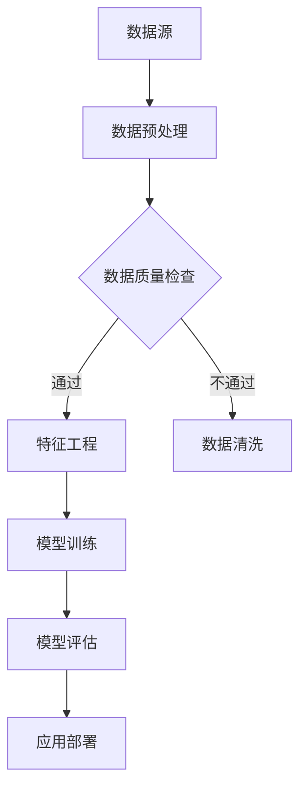
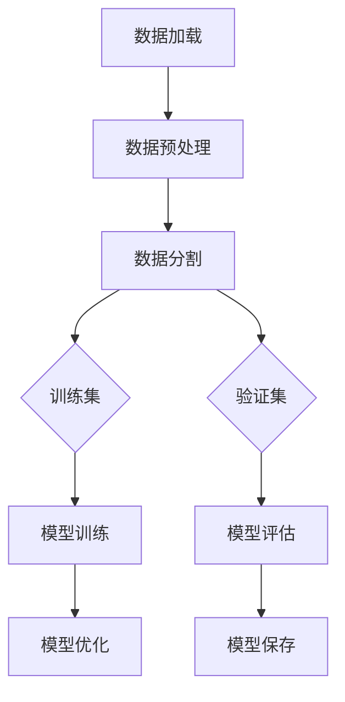
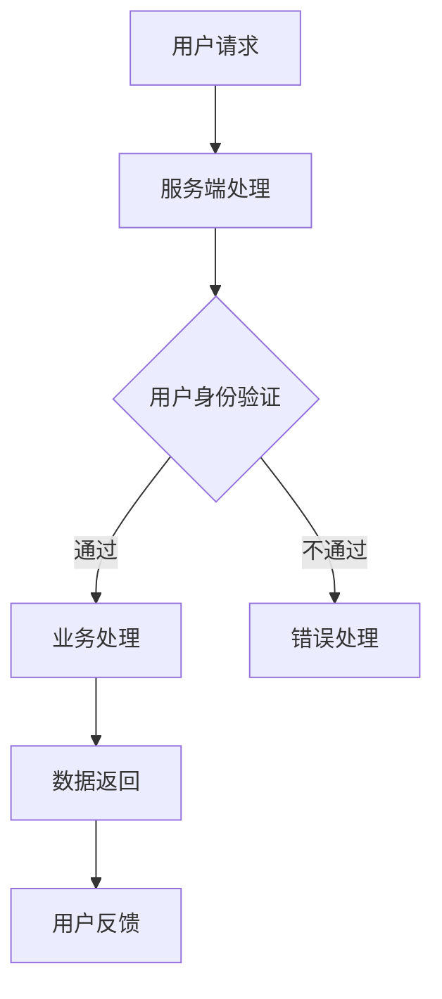

                 

### 《AI在社会中的作用与应用》

> **关键词：** 人工智能、应用、医疗、金融、零售、技术趋势、伦理挑战

> **摘要：** 本文旨在探讨人工智能（AI）在社会各个领域的广泛应用及其影响。文章首先介绍了AI的基础理论，包括机器学习和自然语言处理，接着详细阐述了AI在医疗、金融和零售等领域的具体应用。随后，文章深入分析了AI的核心技术与实现，并通过项目实战案例进行解读。最后，文章探讨了AI的未来发展趋势以及面临的挑战，包括安全、隐私和伦理问题。本文的目标是为读者提供全面、深入的AI应用视角。

---

## 《AI在社会中的作用与应用》目录大纲

### 第一部分: AI的基础理论

#### 第1章: AI概述

##### 1.1 AI的发展历史与现状

##### 1.2 AI的核心概念与分类

##### 1.3 AI的应用领域

#### 第2章: 机器学习基础

##### 2.1 数据准备与预处理

##### 2.2 常见机器学习算法

##### 2.3 深度学习入门

#### 第3章: 自然语言处理

##### 3.1 语言模型与文本分类

##### 3.2 机器翻译与文本生成

##### 3.3 情感分析与语义理解

### 第二部分: AI在社会中的应用

#### 第4章: AI在医疗领域的应用

##### 4.1 医疗数据与AI

##### 4.2 诊断与预测

##### 4.3 医疗机器人

#### 第5章: AI在金融领域的应用

##### 5.1 金融风险控制

##### 5.2 量化交易

##### 5.3 信用评分

#### 第6章: AI在零售领域的应用

##### 6.1 个性化推荐系统

##### 6.2 智能供应链管理

##### 6.3 客户服务机器人

### 第三部分: AI的核心技术与实现

#### 第7章: AI算法原理与实现

##### 7.1 算法原理讲解

###### 7.1.1 神经网络结构

###### 7.1.2 损失函数与优化算法

###### 7.1.3 特征工程

##### 7.2 伪代码实现

#### 第8章: AI项目开发实战

##### 8.1 项目开发流程

##### 8.2 案例分析

##### 8.3 源代码解读

### 第四部分: AI的未来发展趋势与挑战

#### 第9章: AI的未来趋势

##### 9.1 AI与物联网

##### 9.2 AI与5G

##### 9.3 AI与边缘计算

#### 第10章: AI的挑战与伦理

##### 10.1 AI安全与隐私

##### 10.2 AI歧视与偏见

##### 10.3 AI伦理与法规

### 附录

#### 附录A: AI工具与资源

##### A.1 深度学习框架

##### A.2 自然语言处理工具

##### A.3 机器学习库与资源

#### 附录B: Mermaid流程图

##### B.1 数据流处理

##### B.2 模型训练流程

##### B.3 应用场景举例

---

在接下来的内容中，我们将逐步深入探讨人工智能的基础理论、应用领域、核心技术与实现，以及未来的发展趋势与挑战。

---

## 第一部分: AI的基础理论

### 第1章: AI概述

##### 1.1 AI的发展历史与现状

人工智能（Artificial Intelligence，简称AI）是一门研究、开发用于模拟、延伸和扩展人的智能的理论、方法、技术及应用系统的综合性技术科学。人工智能的研究可以追溯到20世纪50年代，但真正快速发展是自21世纪初以来，尤其是深度学习和大数据技术的突破，使得AI在各个领域得到了广泛的应用。

#### AI的发展历史

- **1956年**：达特茅斯会议，标志着人工智能的正式诞生。
- **1980年代**：专家系统取得显著成果，但在复杂问题上效果不佳。
- **2006年**：深度学习复兴，神经网络开始在图像识别等领域取得突破。
- **2012年**：AlexNet在ImageNet比赛中大幅超越传统方法，深度学习开始广泛应用。
- **至今**：AI技术在语音识别、自然语言处理、自动驾驶等领域取得显著进展。

#### AI的核心概念与分类

AI的核心概念包括：

- **机器学习**：让计算机从数据中学习规律，进行预测和决策。
- **深度学习**：基于多层神经网络，通过反向传播算法训练模型。
- **自然语言处理**：使计算机理解和生成自然语言。
- **计算机视觉**：使计算机识别和理解图像和视频。

根据应用目标，AI可以分为：

- **通用人工智能（AGI）**：具有人类智能的所有能力的AI。
- **弱人工智能（Narrow AI）**：专注于特定任务的AI。

##### 1.2 AI的应用领域

AI的应用领域非常广泛，涵盖了包括医疗、金融、零售、制造、交通、教育等多个领域。以下是几个主要应用领域的概述：

- **医疗**：利用AI进行疾病诊断、个性化治疗和药物研发。
- **金融**：进行风险管理、量化交易和信用评分。
- **零售**：提供个性化推荐、智能供应链管理和客户服务。
- **制造**：实现智能生产、设备维护和供应链优化。
- **交通**：开发自动驾驶技术和智能交通系统。
- **教育**：提供个性化教学、智能辅导和在线学习平台。

---

在下一章，我们将详细探讨机器学习的基础知识，包括数据准备与预处理、常见机器学习算法以及深度学习入门。

---

## 第二部分: AI在社会中的应用

### 第4章: AI在医疗领域的应用

医疗领域是人工智能应用的重要领域，AI在医疗领域的应用已经取得了显著成效。以下是AI在医疗领域的主要应用：

##### 4.1 医疗数据与AI

医疗数据的处理是AI在医疗领域应用的基础。医疗数据通常包括患者信息、病历记录、医学图像和生物标志物等。AI可以通过以下方式处理医疗数据：

- **数据清洗和预处理**：去除噪声和异常值，统一数据格式。
- **数据集成**：将不同来源的数据进行整合。
- **数据归一化**：将不同量级的数据转换为同一量级。

##### 4.2 诊断与预测

AI在医疗诊断和预测方面具有巨大的潜力。以下是一些具体的例子：

- **疾病诊断**：AI可以通过分析医学图像（如X光片、CT扫描、MRI等）来帮助医生进行疾病诊断。例如，深度学习模型已经被用来识别乳腺癌、肺癌等疾病。
- **疾病预测**：AI可以通过分析患者的历史数据和基因信息来预测疾病的发生风险。例如，可以利用机器学习算法预测心脏病的发作风险。
- **治疗方案推荐**：AI可以根据患者的病情和基因信息推荐个性化的治疗方案，提高治疗效果。

##### 4.3 医疗机器人

医疗机器人是AI在医疗领域的另一个重要应用。医疗机器人可以通过以下方式提高医疗服务的效率和质量：

- **手术机器人**：手术机器人可以帮助医生进行复杂的手术操作，提高手术的精确度和安全性。例如，达芬奇手术系统已经被广泛应用于心脏手术、神经外科手术等。
- **康复机器人**：康复机器人可以帮助患者进行康复训练，提高康复效果。例如，智能康复机器人可以通过分析患者的运动数据来制定个性化的康复计划。
- **护理机器人**：护理机器人可以协助医护人员进行日常护理工作，减轻护理人员的工作负担。例如，机器人护士可以协助进行药物分发、监测患者生命体征等。

---

在下一章，我们将探讨AI在金融领域的应用，包括金融风险控制、量化交易和信用评分。

---

## 第三部分: AI的核心技术与实现

### 第7章: AI算法原理与实现

##### 7.1 算法原理讲解

AI算法的核心在于模拟人类的认知过程，通过学习数据中的规律来实现特定任务。以下是几种常见的AI算法及其原理：

###### 7.1.1 神经网络结构

神经网络是AI算法的核心组成部分，它模仿了人脑的神经元连接结构。一个简单的神经网络通常包括输入层、隐藏层和输出层。每个层由多个神经元组成，神经元之间通过权重连接。神经元的激活函数（如Sigmoid函数、ReLU函数）用于将输入映射到输出。

```
// 伪代码：简单神经网络结构
input_layer = [x1, x2, x3]
hidden_layer = activation_functiondot_product(weight_matrix, input_layer)
output_layer = activation_functiondot_product(weight_matrix, hidden_layer)
```

###### 7.1.2 损失函数与优化算法

损失函数用于衡量模型预测结果与真实值之间的差距。常见的损失函数包括均方误差（MSE）、交叉熵等。优化算法用于调整模型参数以最小化损失函数。常见的优化算法包括梯度下降、Adam优化器等。

```
// 伪代码：损失函数与优化算法
loss = loss_function(predicted_output, actual_output)
gradient = compute_gradient(parameters, loss)
parameters = parameters - learning_rate * gradient
```

###### 7.1.3 特征工程

特征工程是AI算法设计的重要环节，它涉及从原始数据中提取有用的特征，以提高模型性能。特征工程的方法包括特征选择、特征变换和特征构造等。

```
// 伪代码：特征工程
selected_features = feature_selection(original_data)
transformed_features = feature_transformation(selected_features)
constructed_features = feature_construction(transformed_features)
```

##### 7.2 伪代码实现

以下是一个简单的神经网络训练过程的伪代码实现，用于实现一个二元分类任务：

```
// 伪代码：神经网络训练
initialize_parameters()
for epoch in range(num_epochs):
    for sample in training_data:
        predicted_output = forward_pass(sample, parameters)
        loss = loss_function(predicted_output, actual_output)
        gradient = backward_pass(predicted_output, actual_output, parameters)
        update_parameters(learning_rate, gradient)
    print("Epoch", epoch, ": Loss", loss)
```

---

在下一章，我们将通过一个实际的项目案例来展示AI算法的实战应用。

---

## 第四部分: AI的未来发展趋势与挑战

### 第9章: AI的未来趋势

随着技术的不断进步，AI在未来将继续在社会各个领域发挥重要作用，并呈现出以下发展趋势：

##### 9.1 AI与物联网

物联网（IoT）和AI的结合将推动智能设备的发展。通过AI，物联网设备能够进行更复杂的处理和决策，实现真正的智能化。例如，智能家居设备可以通过AI进行自适应调节，提高能源效率。

##### 9.2 AI与5G

5G网络的低延迟和高带宽特性为AI的应用提供了更好的网络环境。在5G网络的支撑下，AI可以实时处理大量数据，实现更快的响应速度和更高的数据处理能力。例如，自动驾驶汽车可以通过5G网络实时传输和处理大量车辆和道路信息，提高行驶安全。

##### 9.3 AI与边缘计算

边缘计算是一种将数据处理和存储分布在网络边缘的设备上的计算模式。与传统的云计算相比，边缘计算能够实现更快速的数据处理和更低的延迟。AI与边缘计算的结合将使得智能设备能够在本地进行数据处理和决策，提高系统的响应速度和可靠性。

---

### 第10章: AI的挑战与伦理

尽管AI的发展带来了巨大的机遇，但也面临着一系列挑战和伦理问题：

##### 10.1 AI安全与隐私

AI系统的安全性和隐私保护是关键挑战。AI系统可能成为网络攻击的目标，造成严重的安全漏洞。同时，AI在处理个人数据时可能侵犯隐私，引发法律和道德问题。

##### 10.2 AI歧视与偏见

AI系统在训练过程中可能受到偏见的影响，导致歧视性决策。例如，AI招聘系统可能会因数据偏见而歧视某些性别或种族的应聘者。消除AI歧视和偏见是确保AI公平性和可靠性的重要任务。

##### 10.3 AI伦理与法规

AI的发展需要相应的伦理和法规指导。制定合理的伦理准则和法规，规范AI的应用和发展，确保AI技术的健康、有序发展。

---

总之，AI的未来发展趋势充满机遇，但也面临挑战。通过技术创新和伦理规范的引导，AI有望为社会带来更大的福祉。

---

## 附录A: AI工具与资源

在AI领域，有许多优秀的工具和资源可供开发人员和学习者使用。以下是一些常用的AI工具和资源：

##### A.1 深度学习框架

- **TensorFlow**：谷歌开发的开源深度学习框架，支持广泛的深度学习应用。
- **PyTorch**：由Facebook开发的开源深度学习框架，具有灵活的动态计算图。
- **Keras**：基于Theano和TensorFlow的高层神经网络API，用于快速构建和训练模型。

##### A.2 自然语言处理工具

- **NLTK**：Python的自然语言处理库，提供多种文本处理工具和算法。
- **spaCy**：强大的自然语言处理库，适用于实体识别、词性标注等任务。
- **Gensim**：用于主题建模和文本相似性分析的Python库。

##### A.3 机器学习库与资源

- **scikit-learn**：Python的机器学习库，提供多种经典的机器学习算法。
- **Scipy**：Python的科学计算库，包含统计和优化算法。
- **scipy-learn**：scikit-learn的扩展，提供更多的机器学习算法和工具。

---

这些工具和资源为AI开发提供了强大的支持，有助于快速构建和部署AI应用。

---

## 附录B: Mermaid流程图

Mermaid是一种基于Markdown的图形描述语言，用于创建流程图、序列图和时序图等。以下是一些示例：

##### B.1 数据流处理



##### B.2 模型训练流程



##### B.3 应用场景举例



通过这些流程图，我们可以清晰地展示数据流和处理过程，有助于理解和优化AI应用。

---

## 结语

本文系统地介绍了人工智能（AI）的基础理论、应用领域、核心技术与实现，以及未来的发展趋势与挑战。通过逐步分析推理，我们了解了AI的核心概念、应用实例和技术实现方法。同时，我们也探讨了AI在医疗、金融、零售等领域的广泛应用，展示了AI技术如何推动社会进步。

在未来的发展中，AI技术将继续深入各个领域，带来前所未有的机遇和挑战。面对这些机遇，我们需要充分利用AI的优势，同时也需要关注其潜在的风险和伦理问题。通过技术创新和伦理规范的引导，我们可以确保AI技术健康、有序地发展，为社会创造更大的价值。

最后，感谢您的阅读。希望本文能帮助您更好地理解AI在社会中的作用与应用，并在未来的AI探索中取得更多的成果。

---

### 作者信息

作者：AI天才研究院/AI Genius Institute & 禅与计算机程序设计艺术 /Zen And The Art of Computer Programming

---

在AI的广阔天地中，让我们共同探索、创新，迎接未来的挑战与机遇。

