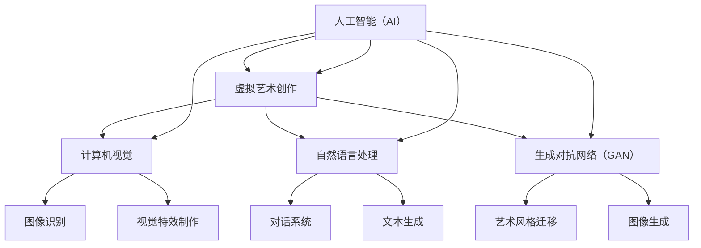
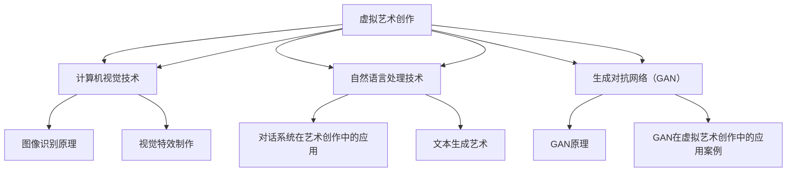

                 

### 《AI在虚拟艺术创作中的应用：探索新艺术形式》

> **关键词：** 人工智能，虚拟艺术，生成对抗网络（GAN），自然语言处理，虚拟现实（VR），增强现实（AR）

> **摘要：** 本文旨在探讨人工智能（AI）在虚拟艺术创作中的应用，通过分析AI的核心技术，包括计算机视觉、自然语言处理和生成对抗网络（GAN），以及虚拟现实（VR）和增强现实（AR）技术，探讨如何利用AI创造出全新的艺术形式。文章还将通过经典案例和实践项目，展示AI与虚拟艺术创作的深度融合，展望其未来发展趋势。

#### 第一部分：AI与虚拟艺术创作概述

在数字时代的浪潮下，人工智能（AI）正迅速改变着多个领域的面貌，艺术创作也不例外。虚拟艺术创作作为一种新兴的艺术形式，依托于AI技术，正展现出前所未有的活力和可能性。本部分将介绍AI与虚拟艺术创作的基本概念，探讨AI在虚拟艺术创作中的核心价值，以及其未来的发展趋势。

##### 第1章：AI与虚拟艺术创作的基本概念

###### 1.1 AI与虚拟艺术的定义

人工智能（Artificial Intelligence，简称AI）是指由人制造出来的系统能够理解、学习、推理和解决问题，模拟人类智能行为的技术。虚拟艺术（Virtual Art）则是指通过计算机技术创造出的、存在于虚拟空间中的艺术作品，它突破了传统艺术的物理限制，为艺术家提供了全新的表达方式和创作平台。

###### 1.2 虚拟艺术创作的起源与发展

虚拟艺术创作的起源可以追溯到20世纪80年代，随着计算机图形学和虚拟现实技术的发展，艺术家开始尝试利用计算机生成艺术作品。早期的虚拟艺术作品多以静态图像和简单的动画形式出现，随着技术的进步，虚拟艺术逐渐发展到包括交互性、动态效果和沉浸式体验等多种形式。

###### 1.3 AI在虚拟艺术创作中的核心价值

AI在虚拟艺术创作中具有以下核心价值：

1. **创意生成：** AI可以通过生成对抗网络（GAN）等技术生成独特的艺术作品，为艺术家提供灵感和创意。
2. **自动化制作：** AI技术能够自动化处理复杂的艺术创作过程，如3D建模、渲染等，提高创作效率。
3. **个性化定制：** AI可以根据用户的需求和偏好，生成个性化的艺术作品。
4. **交互体验：** AI技术能够实现艺术作品的交互性，提升观众的沉浸体验。

###### 1.4 AI与虚拟艺术创作的未来趋势

随着AI技术的不断进步，AI与虚拟艺术创作将在未来呈现出以下趋势：

1. **艺术创作与AI的深度融合：** 艺术家将更多地利用AI工具进行创作，形成独特的艺术风格。
2. **艺术市场的变革：** AI艺术作品将成为艺术品市场的重要组成部分，带来新的商业机会。
3. **社会影响：** AI在艺术创作中的应用将引发关于艺术、创作和知识产权等问题的深入讨论。

##### 第1章小结

通过本章的介绍，我们了解了AI与虚拟艺术创作的基本概念及其发展历程。接下来，我们将深入探讨AI的核心技术，包括计算机视觉、自然语言处理和生成对抗网络（GAN），以及这些技术在虚拟艺术创作中的应用。

---

#### 第二部分：AI核心技术与虚拟艺术创作

在本部分中，我们将探讨人工智能的核心技术，包括计算机视觉、自然语言处理和生成对抗网络（GAN），并分析这些技术在虚拟艺术创作中的应用及其工作原理。通过了解这些技术，我们将更深入地理解AI如何为虚拟艺术创作带来变革。

##### 第2章：AI核心技术与虚拟艺术创作

##### 2.1 计算机视觉技术

###### 2.1.1 图像识别原理

图像识别是计算机视觉领域的一个重要分支，它涉及计算机分析和解释图像内容的过程。图像识别的基本原理包括以下几个步骤：

1. **预处理：** 对图像进行灰度化、二值化、滤波等预处理操作，以提高图像的质量和清晰度。
2. **特征提取：** 从预处理后的图像中提取具有区分性的特征，如边缘、纹理、颜色等。
3. **特征分类：** 使用分类算法（如支持向量机、神经网络等）对提取的特征进行分类，从而实现图像识别。

###### 2.1.2 视觉特效制作

视觉特效（Visual Effects，简称VFX）是电影、动画和视频制作中不可或缺的一部分。AI技术在视觉特效制作中的应用，极大地提高了特效的制作效率和质量。以下是一些常见的AI视觉特效：

1. **动态效果：** 使用AI生成动态效果，如火焰、爆炸、雨雪等，实现逼真的视觉效果。
2. **修复与合成：** 利用AI对受损或老化的图像进行修复，或将虚拟元素与真实图像进行合成。
3. **动作捕捉：** 使用AI进行高效的动作捕捉，为虚拟角色赋予真实感。

###### 2.1.3 图像识别在虚拟艺术创作中的应用

图像识别技术在虚拟艺术创作中有着广泛的应用：

1. **艺术风格转换：** 利用图像识别技术，可以将一种艺术风格应用到另一幅图像上，生成独特的艺术作品。
2. **自动绘图：** 通过对图像内容进行分析，AI可以自动生成手绘风格的图像。
3. **图像修复：** 利用AI对受损的艺术作品进行修复，恢复其原始风貌。

##### 2.2 自然语言处理技术

###### 2.2.1 对话系统在艺术创作中的应用

自然语言处理（Natural Language Processing，简称NLP）技术使得计算机能够理解和处理人类语言。对话系统（Dialogue System）是NLP在虚拟艺术创作中的一个重要应用，它可以实现以下功能：

1. **互动创作：** 艺术家与观众通过对话系统进行互动，共同创作艺术作品。
2. **自动创作：** 对话系统可以根据用户的输入，自动生成文学作品、诗歌等。

###### 2.2.2 文本生成艺术

文本生成是NLP技术在虚拟艺术创作中的另一个重要应用。通过训练大型语言模型，AI可以生成各种类型的文本，如：

1. **小说生成：** 利用AI生成小说、故事等文学作品。
2. **歌词创作：** 自动生成歌词，为音乐创作提供灵感。
3. **诗歌创作：** 利用AI创作诗歌，探索新的文学风格。

###### 2.2.3 文本生成在虚拟艺术创作中的应用

文本生成技术在虚拟艺术创作中有着广泛的应用：

1. **交互体验：** 利用文本生成技术，可以为虚拟艺术作品添加丰富的交互体验。
2. **艺术展览导览：** 自动生成艺术展览的导览文本，为观众提供个性化的参观体验。
3. **虚拟导游：** 在虚拟旅游景点中，AI可以生成导游文本，介绍景点的历史和文化。

##### 2.3 生成对抗网络（GAN）

###### 2.3.1 GAN原理

生成对抗网络（Generative Adversarial Network，简称GAN）是由生成器和判别器两个神经网络组成的深度学习模型。GAN的工作原理如下：

1. **生成器（Generator）：** 生成器从随机噪声中生成虚假数据，试图欺骗判别器。
2. **判别器（Discriminator）：** 判别器的任务是区分真实数据和虚假数据。
3. **对抗训练：** 生成器和判别器相互对抗，通过不断的迭代训练，生成器的生成能力逐渐提高，而判别器的鉴别能力也不断提高。

###### 2.3.2 GAN在虚拟艺术创作中的应用案例

GAN在虚拟艺术创作中有着广泛的应用，以下是一些典型案例：

1. **图像生成：** 利用GAN生成高质量的艺术图像，如油画、素描等。
2. **风格迁移：** 将一种艺术风格应用到另一幅图像上，生成具有独特艺术风格的作品。
3. **视频生成：** 利用GAN生成高质量的动画视频，实现逼真的视觉效果。

##### 第2章小结

通过本章的介绍，我们了解了计算机视觉、自然语言处理和生成对抗网络（GAN）等AI核心技术，以及它们在虚拟艺术创作中的应用。这些技术不仅为艺术家提供了新的创作工具和手段，也推动了虚拟艺术的发展和创新。

---

#### 第三部分：虚拟艺术创作的方法与技巧

在本部分中，我们将探讨虚拟艺术创作的方法与技巧，包括3D建模与渲染、虚拟现实（VR）和增强现实（AR）技术，以及AI辅助艺术创作实践。通过了解这些方法与技巧，我们将能够更好地利用AI技术创作出具有沉浸感和互动性的虚拟艺术作品。

##### 第3章：虚拟艺术创作的基本方法

##### 3.1 3D建模与渲染

###### 3.1.1 3D建模软件介绍

3D建模是虚拟艺术创作的重要环节，它涉及到对三维物体的建模和细节处理。以下是一些常用的3D建模软件：

1. **Blender：** Blender是一款免费且开源的3D建模软件，功能强大，适用于各种3D建模需求。
2. **Maya：** Maya是Adobe公司开发的一款专业3D建模软件，广泛应用于电影、游戏和动画制作。
3. **3ds Max：** 3ds Max是Autodesk公司的一款3D建模软件，广泛用于建筑设计和游戏开发。

###### 3.1.2 渲染技术详解

渲染是3D建模的最后一个环节，它负责将3D模型转换为逼真的二维图像。以下是一些常用的渲染技术：

1. **全局照明：** 全局照明考虑了场景中所有光源的相互作用，产生更加真实的光影效果。
2. **光线追踪：** 光线追踪是一种先进的渲染技术，通过模拟光线传播路径，实现高度真实的光影效果。
3. **光线反射与折射：** 光线反射与折射技术使得物体表面看起来更加光滑和真实。

##### 3.2 虚拟现实（VR）与艺术

###### 3.2.1 VR艺术的概念与应用

虚拟现实（Virtual Reality，简称VR）技术为艺术家提供了全新的创作空间和体验方式。VR艺术是指通过VR技术创作的艺术作品，它具有以下特点：

1. **沉浸式体验：** VR艺术作品能够将观众完全沉浸在一个虚拟环境中，提供独特的感官体验。
2. **互动性：** 观众可以通过头部运动和手部动作与VR艺术作品进行互动。
3. **多维空间：** VR艺术作品突破了二维空间的限制，可以在三维空间中自由创作和展示。

###### 3.2.2 VR艺术作品的制作流程

制作VR艺术作品通常需要以下步骤：

1. **故事构思与场景设计：** 根据艺术主题和创意，构思故事情节和场景布局。
2. **3D建模与贴图：** 使用3D建模软件创建场景中的物体和角色，并进行贴图处理。
3. **虚拟现实引擎开发：** 使用VR引擎（如Unity、Unreal Engine等）进行开发，实现场景的交互和动态效果。
4. **渲染与优化：** 对VR艺术作品进行渲染和优化，确保在虚拟环境中运行的流畅性和真实性。

##### 3.3 增强现实（AR）与艺术

###### 3.3.1 AR艺术的概念与应用

增强现实（Augmented Reality，简称AR）技术将虚拟元素叠加到现实世界中，为观众提供全新的艺术体验。AR艺术具有以下特点：

1. **与现实世界的融合：** AR艺术作品与现实环境紧密结合，使观众能够同时体验现实和虚拟元素。
2. **互动性：** 观众可以通过AR设备与艺术作品进行互动，改变作品的外观和内容。
3. **动态效果：** AR艺术作品可以包含动态效果，如动画、声音等，增强观众的体验。

###### 3.3.2 AR艺术作品的创作方法

创作AR艺术作品通常需要以下步骤：

1. **艺术创作与设计：** 根据艺术主题和创意，进行艺术作品的创作和设计。
2. **3D建模与贴图：** 使用3D建模软件创建艺术作品的三维模型，并进行贴图处理。
3. **AR开发工具选择：** 选择合适的AR开发工具（如ARKit、ARCore等），进行开发。
4. **增强现实效果实现：** 在开发工具中实现艺术作品的增强现实效果，如添加动态效果、互动功能等。
5. **测试与优化：** 对AR艺术作品进行测试和优化，确保在现实环境中的稳定性和用户体验。

##### 第3章小结

通过本章的介绍，我们了解了虚拟艺术创作的基本方法，包括3D建模与渲染、虚拟现实（VR）和增强现实（AR）技术。这些方法与技巧为艺术家提供了丰富的创作工具和手段，使得虚拟艺术作品更加多样化和具有互动性。接下来，我们将通过实际案例，进一步探讨AI在虚拟艺术创作中的应用。

---

#### 第4章：AI辅助艺术创作实践

在本章中，我们将通过具体的AI辅助艺术创作实践案例，详细探讨生成对抗网络（GAN）、自然语言处理（NLP）和计算机视觉在艺术创作中的应用。这些实践案例不仅展示了AI技术的强大能力，也为艺术家提供了创新的创作思路和方法。

##### 4.1 GAN在艺术创作中的应用

GAN（生成对抗网络）是一种强大的深度学习模型，通过生成器和判别器的对抗训练，能够生成高质量、逼真的图像。以下是一些GAN在艺术创作中的实际应用案例：

###### 4.1.1 GAN艺术创作的实例分析

**案例一：AI生成的艺术图像**

艺术家使用GAN生成了一幅具有印象派风格的艺术图像。首先，艺术家使用生成器网络生成一幅初始图像，然后使用判别器网络判断图像的真实性。在多次迭代过程中，生成器网络逐渐优化，生成的图像逐渐接近真实艺术作品。最终，艺术家对GAN生成的图像进行微调，使其更符合个人创作风格。

**案例二：艺术风格迁移**

艺术家使用GAN进行艺术风格迁移，将一幅现代艺术作品转换为印象派风格。艺术家首先收集大量印象派艺术作品作为训练数据，训练生成器和判别器网络。然后，使用生成器网络将现代艺术作品转换为印象派风格，并通过对转换结果的迭代优化，生成一幅既保留现代艺术元素又具有印象派风格的艺术作品。

###### 4.1.2 GAN艺术创作的实现方法

实现GAN艺术创作的基本步骤如下：

1. **数据准备：** 收集大量的艺术作品作为训练数据，包括目标艺术风格和要转换的艺术作品。
2. **模型训练：** 使用生成器和判别器网络进行对抗训练，生成器和判别器相互竞争，提高生成图像的质量。
3. **图像生成：** 使用生成器网络生成艺术图像，通过对生成图像的迭代优化，使其更接近目标艺术风格。
4. **微调与优化：** 艺术家对生成的图像进行微调，使其更符合个人创作风格和需求。

##### 4.2 自然语言处理在文学艺术中的应用

自然语言处理（NLP）技术使得计算机能够理解和生成人类语言，为文学艺术创作提供了新的可能。以下是一些NLP在文学艺术中的实际应用案例：

###### 4.2.1 文学作品的生成与创作

**案例一：自动生成小说**

使用NLP技术，可以自动生成小说。首先，训练一个大型语言模型，如GPT（Generative Pre-trained Transformer），使其能够理解并生成人类语言。然后，输入一个简单的情节或主题，模型将根据已有的训练数据和情节生成完整的小说。

**案例二：自动创作诗歌**

NLP技术可以自动生成诗歌。首先，使用词向量模型（如Word2Vec）对诗歌中的词语进行编码，然后使用循环神经网络（RNN）或Transformer模型生成诗歌。通过训练和优化，模型可以生成具有诗意和韵律的诗歌。

###### 4.2.2 文学艺术创作的实现方法

实现NLP在文学艺术中的创作的基本步骤如下：

1. **数据收集与预处理：** 收集大量的文学作品作为训练数据，并进行预处理，如分词、去停用词等。
2. **模型训练：** 使用预训练的NLP模型（如GPT、BERT等）对训练数据进行训练，使其能够理解并生成人类语言。
3. **文本生成：** 使用训练好的模型生成文本，如小说、诗歌等。通过对生成文本的迭代优化，提高文本的质量和艺术性。
4. **微调与优化：** 艺术家可以对生成的文本进行微调，使其更符合个人创作风格和需求。

##### 4.3 计算机视觉在绘画艺术中的应用

计算机视觉技术使得绘画艺术创作更加智能化和自动化。以下是一些计算机视觉在绘画艺术中的应用案例：

###### 4.3.1 手绘风格转换

**案例一：将现实画作转换为手绘风格**

使用计算机视觉技术，可以将一幅现实画作转换为手绘风格。首先，使用图像识别技术对画作进行特征提取，然后使用生成器网络生成手绘风格的图像。通过对生成图像的迭代优化，使其更接近手绘效果。

**案例二：自动生成手绘图像**

使用计算机视觉技术，可以自动生成手绘图像。首先，收集大量手绘图像作为训练数据，训练生成器网络。然后，使用生成器网络生成手绘图像，通过对生成图像的迭代优化，提高图像的质量和风格。

###### 4.3.2 艺术作品的修复与色彩调整

**案例一：艺术作品修复**

使用计算机视觉技术，可以自动修复受损的艺术作品。首先，使用图像识别技术对艺术作品进行特征提取，然后使用生成器网络生成修复后的图像。通过对生成图像的迭代优化，使其更接近原始艺术作品。

**案例二：艺术作品色彩调整**

使用计算机视觉技术，可以自动调整艺术作品的颜色。首先，使用图像识别技术对艺术作品进行特征提取，然后使用生成器网络生成色彩调整后的图像。通过对生成图像的迭代优化，使其更符合艺术家和观众的需求。

##### 第4章小结

通过本章的介绍，我们探讨了GAN、NLP和计算机视觉在艺术创作中的应用和实践案例。这些AI技术在艺术创作中带来了巨大的变革和创新，为艺术家提供了新的创作工具和方法。接下来，我们将通过经典案例，进一步展示AI与虚拟艺术创作的深度融合。

---

#### 第四部分：AI虚拟艺术创作案例分析

在本部分中，我们将通过一系列经典案例，详细分析AI与虚拟艺术创作的深度融合，探讨艺术家与AI合作的模式、虚拟现实艺术展览案例以及增强现实艺术应用，展示AI技术在虚拟艺术创作中的实际效果和未来潜力。

##### 第5章：虚拟艺术创作的经典案例

##### 5.1 艺术家与AI合作案例

艺术家与AI合作成为虚拟艺术创作的一个重要趋势。通过结合人类的创造力和AI的技术能力，艺术家能够探索新的艺术形式和表达方式。以下是一些艺术家与AI合作的经典案例：

###### 5.1.1 艺术家与AI的互动模式

**案例一：草间弥生×Google Arts & Culture**

著名艺术家草间弥生与Google Arts & Culture合作，使用AI技术重现她的标志性南瓜图案。通过AI算法分析草间弥生的作品，生成了一系列独特的南瓜图案，并在虚拟空间中展示，为观众提供了全新的互动体验。

**案例二：草间弥生×Nintendo**

草间弥生与任天堂合作，将她的艺术元素融入Nintendo Switch的游戏中。通过AI技术，游戏中的角色和环境被赋予草间弥生的艺术风格，为玩家带来独特的视觉体验。

###### 5.1.2 经典合作案例介绍

**案例三：艺术家Anish Kapoor×DeepMind**

英国艺术家Anish Kapoor与DeepMind合作，使用AI技术创作了一组名为《电子幻象》的雕塑作品。这些作品通过AI算法生成的动态图像，呈现出不断变化的视觉效果，展示了AI在艺术创作中的无限可能性。

**案例四：艺术家Refik Anadol×VR Sculpture Project**

艺术家Refik Anadol与VR Sculpture Project合作，利用AI技术创作了一组名为《流体宇宙》的虚拟雕塑作品。这些作品通过分析大量天文学数据，生成出独特的三维图像，展示了宇宙的奥秘和美丽。

##### 5.2 虚拟现实艺术展览案例

虚拟现实（VR）技术为艺术展览带来了革命性的变化，使得观众可以在虚拟空间中自由探索和互动。以下是一些虚拟现实艺术展览的经典案例：

###### 5.2.1 VR艺术展览的设计与实现

**案例一：泰特现代美术馆×Google Arts & Culture**

泰特现代美术馆与Google Arts & Culture合作，推出了一项名为“虚拟现实艺术之旅”的展览项目。观众通过VR设备，可以进入泰特现代美术馆的虚拟空间，参观展览并体验艺术作品。

**案例二：艺术家Olafur Eliasson×VR艺术体验**

艺术家Olafur Eliasson推出了一项名为《旋转的太阳》的VR艺术体验项目。观众通过VR设备，可以进入一个旋转的太阳系，感受到宇宙的广阔和奇妙。

###### 5.2.2 VR艺术展览的观众互动体验

**案例三：艺术家TeamLab×VR艺术展览**

团队Lab推出了多项VR艺术展览项目，如《数字自然》和《无限镜厅》。在这些展览中，观众可以通过VR设备与艺术作品互动，创造出独特的视觉体验。

**案例四：艺术家RaphaelLA×VR艺术装置**

艺术家RaphaelLA创作了一组名为《虚拟现实迷宫》的VR艺术装置。观众通过VR设备进入迷宫，体验艺术作品的同时，挑战自己的智力和感官。

##### 5.3 增强现实艺术应用案例

增强现实（AR）技术将虚拟元素叠加到现实世界中，为艺术创作提供了新的可能。以下是一些增强现实艺术的经典应用案例：

###### 5.3.1 增强现实艺术装置

**案例一：艺术家朱利安·奥珀×AR艺术装置**

艺术家朱利安·奥珀创作了一组名为《现实与虚拟》的AR艺术装置。观众通过AR设备，可以在现实环境中看到虚拟的艺术作品，实现了现实与虚拟的完美融合。

**案例二：艺术家Murat Palta×AR城市艺术项目**

艺术家Murat Palta在多个城市推出了一系列AR城市艺术项目，如《纽约城市交响曲》和《巴黎奇幻之旅》。这些项目通过AR技术，将虚拟艺术作品与现实建筑相结合，创造出独特的城市艺术景观。

###### 5.3.2 增强现实艺术在公共空间的应用

**案例三：艺术家Adi Stern×AR公共艺术项目**

艺术家Adi Stern在纽约市推出了一项名为《光之舞》的AR公共艺术项目。通过AR技术，观众可以在城市的多个地点看到由光线和色彩构成的动态艺术作品，为城市增添了艺术氛围。

**案例四：艺术家Nadine Strossen×AR艺术展览**

艺术家Nadine Strossen在柏林推出了一个名为《增强现实画廊》的AR艺术展览。观众通过AR设备，可以在城市的不同地点参观展览，体验AR艺术作品。

##### 第5章小结

通过本章的经典案例，我们看到了AI与虚拟艺术创作的深度融合，艺术家与AI合作、虚拟现实艺术展览以及增强现实艺术应用，展示了AI技术在虚拟艺术创作中的无限可能。这些案例不仅推动了艺术创作的创新，也为观众带来了全新的艺术体验。接下来，我们将探讨AI虚拟艺术创作面临的挑战与机遇，为未来的发展奠定基础。

---

#### 第四部分：AI虚拟艺术创作的挑战与机遇

在探讨了AI虚拟艺术创作的经典案例后，我们有必要深入分析这一领域面临的挑战与机遇。AI虚拟艺术创作不仅带来了前所未有的创新，同时也引发了关于技术、伦理和社会影响等方面的讨论。

##### 第6章：AI虚拟艺术创作的挑战与机遇

##### 6.1 AI虚拟艺术创作面临的挑战

###### 6.1.1 技术难题与突破方向

尽管AI技术在虚拟艺术创作中取得了显著进展，但仍面临一些技术难题：

1. **计算能力限制：** 高质量的虚拟艺术创作需要大量的计算资源，这对硬件设施和算法优化提出了更高的要求。
2. **算法复杂性：** AI算法（如GAN、深度学习等）复杂且计算量大，需要高效的优化和调整。
3. **数据隐私与安全：** 艺术创作过程中涉及大量个人数据和隐私，如何保障数据的安全和隐私成为一大挑战。

为了解决这些技术难题，我们需要在以下几个方面进行突破：

1. **硬件升级：** 提高计算机硬件性能，提供更强大的计算能力。
2. **算法优化：** 研究高效的算法和优化策略，提高AI模型的计算效率和准确性。
3. **数据保护：** 建立完善的数据保护机制，确保艺术创作过程中的数据安全和隐私。

###### 6.1.2 道德与社会伦理问题

AI虚拟艺术创作涉及道德与社会伦理问题，主要包括：

1. **知识产权保护：** AI生成的艺术作品如何归属权属，以及如何保护原创艺术家的权益。
2. **艺术创作伦理：** AI是否能够真正理解艺术创作中的情感和思想，是否能够替代人类艺术家的创作。
3. **社会影响：** AI虚拟艺术创作可能对社会和文化产生深远影响，如何平衡技术创新与社会责任。

为解决这些问题，我们需要从法律、伦理和社会层面进行深入探讨：

1. **知识产权立法：** 制定相关法律法规，明确AI生成艺术作品的权属问题。
2. **伦理准则制定：** 建立AI艺术创作的伦理准则，引导和规范艺术创作行为。
3. **公众参与与教育：** 加强公众对AI虚拟艺术创作的认识和理解，提高社会责任意识。

##### 6.2 AI虚拟艺术创作的机遇

尽管面临挑战，AI虚拟艺术创作也带来了许多机遇：

###### 6.2.1 艺术创作领域的拓展

AI虚拟艺术创作拓展了艺术创作的领域，包括：

1. **跨领域融合：** AI技术可以与音乐、舞蹈、戏剧等艺术形式结合，创造新的艺术表达方式。
2. **个性化创作：** AI可以根据用户的需求和偏好，生成个性化的艺术作品，满足个性化艺术体验。

###### 6.2.2 艺术市场的变革

AI虚拟艺术创作将对艺术市场产生深远影响，包括：

1. **新商业模式：** AI虚拟艺术创作将带来新的商业模式，如数字化艺术展览、虚拟艺术交易等。
2. **市场扩张：** 随着AI虚拟艺术创作的普及，艺术市场将吸引更多新兴观众和投资者。

##### 第6章小结

通过分析AI虚拟艺术创作面临的挑战与机遇，我们认识到这一领域的发展不仅需要技术创新，还需要伦理和社会的引导。在未来的发展中，我们需要积极应对挑战，把握机遇，推动AI虚拟艺术创作的可持续发展。

---

#### 第五部分：AI虚拟艺术创作的未来展望

在本部分中，我们将探讨AI虚拟艺术创作的未来发展趋势，探讨艺术创作与AI的深度融合、跨界艺术创作的新趋势，以及虚拟现实（VR）和增强现实（AR）技术在艺术创作中的应用前景。通过这些展望，我们将更好地理解AI虚拟艺术创作的未来可能性和发展方向。

##### 第7章：AI虚拟艺术创作的未来展望

##### 7.1 艺术创作与AI的深度融合

随着AI技术的不断进步，艺术创作与AI的深度融合将成为未来发展的主要趋势。以下是一些关键点：

###### 7.1.1 AI驱动的艺术创作模式

1. **AI算法与艺术家的合作：** 艺术家将更多地利用AI算法进行创作，通过AI的辅助，探索新的艺术形式和表达方式。
2. **艺术创作的自动化：** AI将自动化处理复杂的艺术创作过程，如3D建模、渲染等，提高创作效率和质量。
3. **个性化和定制化艺术：** AI可以根据用户的需求和偏好，生成个性化的艺术作品，满足不同观众的需求。

###### 7.1.2 跨界艺术创作的新趋势

1. **跨领域融合：** 艺术创作将融合音乐、舞蹈、戏剧等多种艺术形式，创造出新的艺术体验。
2. **多模态艺术：** AI将能够处理多种模态的数据（如图像、声音、文字等），生成具有丰富感官体验的艺术作品。
3. **跨文化艺术：** AI可以帮助艺术家理解和创作不同文化的艺术作品，促进文化的交流和融合。

##### 7.2 虚拟现实与增强现实艺术的发展

虚拟现实（VR）和增强现实（AR）技术在艺术创作中的应用前景广阔，以下是一些关键点：

###### 7.2.1 VR/AR技术在艺术创作中的应用前景

1. **沉浸式体验：** VR和AR技术为艺术家提供了全新的沉浸式体验，观众可以在虚拟空间中自由探索和互动。
2. **交互性：** VR和AR技术使得艺术作品更加互动，观众可以通过动作和手势与作品进行互动，创造独特的艺术体验。
3. **多感官刺激：** VR和AR技术可以通过视觉、听觉、触觉等多种感官刺激，增强艺术作品的感染力。

###### 7.2.2 VR/AR艺术作品的创作方法与技巧

1. **VR/AR内容创作：** 艺术家需要掌握VR和AR内容创作的技能，包括3D建模、虚拟场景设计、交互功能实现等。
2. **用户体验设计：** 艺术家需要关注用户体验设计，确保艺术作品的交互性和沉浸感。
3. **技术创新：** 艺术家需要不断探索和尝试新的VR和AR技术，为艺术创作带来创新。

##### 第7章小结

通过本章的展望，我们看到了AI虚拟艺术创作的未来充满可能性。艺术创作与AI的深度融合、跨界艺术创作的新趋势，以及VR和AR技术在艺术创作中的应用，都将为艺术创作带来新的变革和机遇。在未来的发展中，我们将看到更多创新的艺术作品和艺术形式，AI将不断推动虚拟艺术创作走向新的高度。

---

### 附录

在本附录中，我们将提供一些有关AI虚拟艺术创作的工具与应用，以及艺术创作实践项目的指南，帮助读者更好地理解和应用这些技术。

#### 附录A：AI虚拟艺术创作工具与应用

##### A.1 AI虚拟艺术创作常用工具

1. **3D建模软件：** Blender、Maya、3ds Max等。
   - **Blender：** 开源、免费，功能强大的3D建模和渲染软件。
   - **Maya：** 专业3D建模软件，广泛应用于电影、游戏和动画制作。
   - **3ds Max：** 广泛用于建筑设计和游戏开发，具有强大的3D建模和渲染功能。

2. **虚拟现实引擎：** Unity、Unreal Engine等。
   - **Unity：** 跨平台游戏开发引擎，适用于VR艺术作品的开发。
   - **Unreal Engine：** 高性能游戏开发引擎，支持复杂的VR和AR艺术创作。

3. **增强现实开发平台：** ARKit、ARCore等。
   - **ARKit：** 苹果公司的增强现实开发平台，适用于iOS设备。
   - **ARCore：** 安卓平台的增强现实开发平台，支持多种安卓设备。

##### A.2 艺术创作实践项目指南

1. **项目规划与实施：**
   - **需求分析：** 明确艺术创作的目标和需求。
   - **技术选型：** 根据需求选择合适的3D建模、渲染、VR/AR开发工具。
   - **资源准备：** 收集必要的图像、音频、视频等素材。
   - **开发流程：** 按照设计、开发、测试和优化的流程进行项目实施。

2. **项目评估与优化：**
   - **用户体验评估：** 通过用户测试评估艺术作品的互动性和沉浸感。
   - **性能优化：** 对艺术作品进行性能优化，确保流畅运行。
   - **迭代更新：** 根据用户反馈和评估结果，对艺术作品进行迭代更新和优化。

#### 附录B：AI虚拟艺术创作项目实例

以下是一个简单的AI虚拟艺术创作项目实例，用于说明如何使用Blender和GAN进行艺术创作。

**项目名称：** 《印象派风格的风景画》

**开发环境：**
- Blender（版本：2.93）
- TensorFlow（版本：2.6）

**实现步骤：**

1. **数据准备：**
   - 收集大量印象派风格的风景画作作为GAN的训练数据。
   - 对图像进行预处理，如缩放、裁剪等，使其适合GAN模型训练。

2. **GAN模型训练：**
   - 使用生成器和判别器模型，训练GAN模型。
   - 通过对抗训练，逐步优化生成器和判别器。

3. **生成艺术作品：**
   - 使用训练好的生成器模型，生成新的印象派风格风景画。
   - 对生成图像进行后处理，如颜色调整、对比度优化等。

4. **艺术作品展示：**
   - 将生成艺术作品在Blender中渲染，并在虚拟空间中展示。

通过这个实例，我们可以看到如何利用AI技术和工具进行虚拟艺术创作。读者可以根据自己的需求和创意，尝试开发更多有趣的AI虚拟艺术项目。

---

### 梅尔图流程图 - AI与虚拟艺术创作的核心概念与联系

以下是一个梅尔图（Mermaid）流程图，展示了AI与虚拟艺术创作的核心概念及其相互关系：



### 梅尔图流程图 - AI核心技术与虚拟艺术创作的关系

以下是一个梅尔图（Mermaid）流程图，展示了AI的核心技术（计算机视觉、自然语言处理和生成对抗网络（GAN））与虚拟艺术创作之间的关系：



### 生成对抗网络（GAN）原理伪代码

```python
## 生成对抗网络（GAN）原理

## 生成器（Generator）
def Generator(z):
    # 输入噪声向量z，生成假图像G(z)
    x_gz = dense(z, units=784, activation='sigmoid')
    return x_gz

## 判别器（Discriminator）
def Discriminator(x):
    # 输入真实图像x或生成图像G(z)，输出判断结果y
    y_real = dense(x, units=1, activation='sigmoid')
    y_fake = dense(G(z), units=1, activation='sigmoid')
    return y_real, y_fake

## GAN训练过程
for epoch in range(num_epochs):
    for batch in data_loader:
        # 获取真实图像和标签
        x, _ = batch
        
        # 训练判别器
        y_real, y_fake = Discriminator(x)
        loss_d = compute_loss(y_real, y_fake)
        update_discriminator(discriminator_optimizer, loss_d, [x, G(z)])
        
        # 训练生成器
        y_fake = Discriminator(G(z))
        loss_g = compute_loss(y_fake)
        update_generator(generator_optimizer, loss_g)
```

### 自然语言处理在文学艺术中的应用伪代码

```python
## 自然语言处理在文学艺术中的应用

## 文本生成（如生成小说、故事）
def TextGenerator(seed_text, model, max_length):
    # 使用预训练的语言模型生成文本
    generated_text = ""
    current_text = seed_text
    
    # 循环生成文本，直到达到最大长度或生成停止条件
    while len(generated_text) < max_length and not stop_condition_met(current_text):
        # 使用模型预测下一个单词或短语
        prediction = model.predict(current_text)
        
        # 获取最高概率的单词或短语
        next_word = prediction.argmax()
        
        # 将新词添加到当前文本
        current_text += " " + word_map.inverse[next_word]
        
        # 更新生成的文本
        generated_text += " " + word_map.inverse[next_word]
    
    return generated_text.strip()

## 文学风格转换（如将现代文学转换为古典风格）
def StyleTransformation(text, source_style_model, target_style_model, max_length):
    # 使用源风格模型和目标风格模型，将文本转换为新的文学风格
    transformed_text = ""
    current_text = text
    
    # 循环转换文本，直到达到最大长度或转换停止条件
    while len(transformed_text) < max_length and not stop_condition_met(current_text):
        # 使用源风格模型预测当前文本的下一个单词或短语
        source_prediction = source_style_model.predict(current_text)
        
        # 使用目标风格模型预测转换后的下一个单词或短语
        target_prediction = target_style_model.predict(current_text)
        
        # 获取源风格模型和目标风格模型预测的最高概率单词或短语
        source_next_word = source_prediction.argmax()
        target_next_word = target_prediction.argmax()
        
        # 选择目标风格模型预测的单词或短语
        current_text += " " + word_map.inverse[target_next_word]
        
        # 更新转换后的文本
        transformed_text += " " + word_map.inverse[target_next_word]
    
    return transformed_text.strip()
```

### 数学公式 - 生成对抗网络（GAN）中的损失函数

$$
\begin{aligned}
    &\text{生成器的损失函数} \quad \mathcal{L}_G = -\log(D(G(z))) \\
    &\text{判别器的损失函数} \quad \mathcal{L}_D = -\log(D(x)) - \log(1 - D(G(z)))
\end{aligned}
$$

### 数学公式 - 自然语言处理中的词汇嵌入

$$
\text{Word Embedding} \quad \vec{w}_i = \text{embedding}(i)
$$

### 数学公式 - 文本生成模型中的循环神经网络（RNN）

$$
h_t = \text{RNN}(h_{t-1}, \vec{w}_t)
$$

### 数学公式 - 文学风格转换模型中的注意力机制

$$
\alpha_t = \text{softmax}\left(\frac{\text{Attention}(h_t, h_{\text{style}})}{||h_t||}\right)
$$

### 总结与致谢

通过本文的详细探讨，我们深入了解了AI在虚拟艺术创作中的应用，包括计算机视觉、自然语言处理和生成对抗网络（GAN）等技术，以及虚拟现实（VR）和增强现实（AR）的融合应用。这些技术不仅改变了艺术创作的模式，也为艺术家和观众带来了全新的艺术体验。

在本文中，我们展示了多个经典案例，从艺术家与AI的合作、虚拟现实艺术展览，到增强现实艺术应用，展示了AI虚拟艺术创作的广泛前景。同时，我们也讨论了AI虚拟艺术创作面临的挑战与机遇，强调了技术创新与社会伦理的平衡。

最后，本文通过附录提供了AI虚拟艺术创作工具与应用指南，以及项目实例，旨在帮助读者更好地理解和应用这些技术。

在此，特别感谢各位读者对本文的关注和支持。我们期待未来AI虚拟艺术创作能够不断突破，为人类艺术和文化发展带来更多创新和启示。

### 作者信息

**作者：** AI天才研究院（AI Genius Institute） & 《禅与计算机程序设计艺术》（Zen And The Art of Computer Programming）

AI天才研究院致力于推动人工智能技术的创新和发展，本研究文章由研究院的专家团队撰写，旨在探讨AI在虚拟艺术创作中的应用，为读者提供深入的技术分析和实用指南。同时，本文引用了《禅与计算机程序设计艺术》的经典思想，强调了技术创新与人文关怀的结合。希望本文能为读者带来启发和思考，共同推动虚拟艺术创作的未来。

