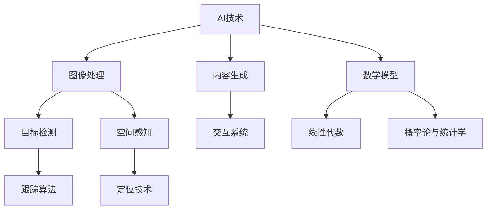
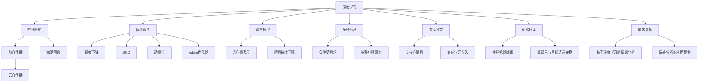
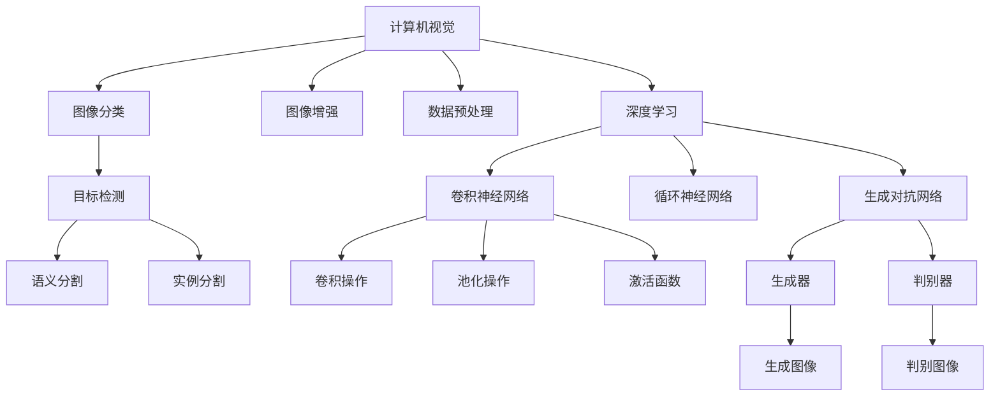

                 

# AI增强现实技术的应用案例

## 概述

增强现实（AR）是一种将虚拟内容与现实世界融合的技术，它通过将计算机生成的图像、视频和3D模型叠加到真实环境中，使用户能够直观地感知和互动。近年来，随着人工智能（AI）技术的快速发展，AI与增强现实技术的融合应用得到了广泛关注和研究。本文将详细介绍AI增强现实技术的基础、核心算法、数学模型以及应用案例，帮助读者全面了解这一前沿领域的最新进展。

## 关键词

- 增强现实
- 人工智能
- 图像处理
- 目标检测
- 跟踪算法
- 交互式内容生成
- 数学模型

## 摘要

本文从AI与增强现实技术的融合入手，详细阐述了增强现实技术的基本原理、系统架构和核心算法。通过数学模型与数学公式的讲解，为读者提供了深入理解AI增强现实技术的基础。随后，本文精选了虚拟现实购物体验、医疗辅助诊断、教育辅助教学等应用案例，结合实际项目开发实践，展示了AI增强现实技术的广泛应用和巨大潜力。通过本文的阅读，读者将能够全面掌握AI增强现实技术的核心知识，并了解其实际应用场景。

## 目录大纲

### 第一部分: AI增强现实技术基础

1. [第1章: AI与增强现实技术概述](#第1章-ai与增强现实技术概述)
    1.1 AI在增强现实技术中的角色
    1.2 增强现实技术的基本原理
    1.3 AI与增强现实技术的融合优势
2. [第2章: 增强现实技术架构详解](#第2章-增强现实技术架构详解)
    2.1 增强现实系统组件
    2.2 数据处理与融合技术
    2.3 空间感知与定位技术
3. [第3章: AI在增强现实中的核心算法](#第3章-ai在增强现实中的核心算法)
    3.1 机器学习在图像处理中的应用
    3.2 目标检测与跟踪算法
    3.3 交互式内容生成算法
4. [第4章: 数学模型与数学公式](#第4章-数学模型与数学公式)
    4.1 线性代数基础
    4.2 概率论与统计学
    4.3 AI增强现实中的数学模型
5. [第5章: AI增强现实技术应用案例](#第5章-ai增强现实技术应用案例)
    5.1 案例一：虚拟现实购物体验
    5.2 案例二：医疗辅助诊断
    5.3 案例三：教育辅助教学

### 第二部分: AI增强现实项目开发实践

1. [第6章: AI增强现实项目开发流程](#第6章-ai增强现实项目开发流程)
    6.1 项目需求分析与规划
    6.2 技术选型与开发环境搭建
    6.3 项目开发与测试
2. [第7章: 项目实战与代码解读](#第7章-项目实战与代码解读)
    7.1 实战一：构建一个简单的增强现实应用
    7.2 实战二：实现一个目标跟踪系统
    7.3 实战三：开发一个交互式内容生成系统
3. [第8章: 性能优化与案例分析](#第8章-性能优化与案例分析)
    8.1 性能优化技术
    8.2 案例分析一：优化实时渲染性能
    8.3 案例分析二：提升机器学习模型的效率
4. [附录](#附录)
    4.1 主流增强现实开发工具
    4.2 常用AI开发框架
    4.3 开源项目与社区资源

### 核心概念与联系（Mermaid流程图）



### 核心算法原理讲解（伪代码）

```python
函数 目标检测(图像, 参数)
    初始化：生成特征图
    for 每个卷积层输出特征图 F
        应用激活函数ReLU(F)
        应用池化操作（如MaxPooling）以降低维度
    end for

    应用全连接层以获取分类和边界框预测
    调整预测边界框坐标以适配原始图像尺寸

    使用非极大值抑制(NMS)处理重叠的预测框

    返回最终检测结果
```

### 数学模型与数学公式讲解（LaTeX）

$$
Y = \beta_0 + \beta_1X + \epsilon
$$

其中，$Y$ 是因变量，$X$ 是自变量，$\beta_0$ 和 $\beta_1$ 是模型的参数，$\epsilon$ 是误差项。

### 举例说明

假设我们要预测某城市明天的温度，根据历史数据，我们可以建立以下线性回归模型：

$$
温度_{明天} = 10 + 0.5 \times 天气状况_{今天}
$$

如果今天是晴天，则预测明天温度为：

$$
温度_{明天} = 10 + 0.5 \times 晴天 = 15^{\circ}C
$$

### 文章标题

《AI增强现实技术的应用案例》

### 文章关键词

增强现实，人工智能，图像处理，目标检测，跟踪算法，交互式内容生成，数学模型

### 文章摘要

本文详细探讨了AI增强现实技术的应用案例，首先介绍了AI在增强现实技术中的角色和基本原理，随后讲解了增强现实技术的架构、核心算法和数学模型。通过具体的案例分析和项目实战，展示了AI增强现实技术在虚拟现实购物体验、医疗辅助诊断、教育辅助教学等领域的广泛应用和巨大潜力。文章旨在帮助读者全面了解AI增强现实技术的核心知识，掌握其实际应用场景，为后续研究和开发提供指导。

## 第一部分: AI增强现实技术基础

### 第1章: AI与增强现实技术概述

#### 1.1 AI在增强现实技术中的角色

人工智能（AI）在增强现实（AR）技术中扮演着至关重要的角色。AI技术的引入，不仅提升了增强现实的应用价值，也为用户体验带来了革命性的变化。AI在增强现实技术中的角色主要包括以下几个方面：

1. **图像识别与处理：** AI技术可以通过深度学习算法对图像进行自动识别和处理，从而实现对现实环境的理解。例如，在增强现实游戏中，AI可以实时识别玩家的手势、面部表情等，为游戏提供更加丰富的交互体验。

2. **目标检测与跟踪：** AI技术可以实现对现实环境中目标的自动检测和跟踪。例如，在AR导航应用中，AI可以识别并跟踪道路上的车辆、行人等，为用户提供准确的导航信息。

3. **交互式内容生成：** AI技术可以根据用户的输入和行为，动态生成适合用户的增强现实内容。例如，在AR购物应用中，AI可以基于用户的购物偏好和购物车信息，生成个性化的商品推荐。

4. **空间感知与定位：** AI技术可以结合传感器数据，实现对现实环境的感知和定位。例如，在AR导航应用中，AI可以结合GPS、Wi-Fi等传感器数据，实现高精度的室内定位。

5. **智能推荐系统：** AI技术可以分析用户的行为和偏好，为用户推荐符合其需求的增强现实内容。例如，在AR游戏应用中，AI可以根据用户的游戏记录和偏好，推荐适合的游戏内容。

#### 1.2 增强现实技术的基本原理

增强现实技术是一种将虚拟信息与现实环境相融合的技术，通过计算机生成图像、视频和3D模型等虚拟信息，并将其叠加到用户的真实视野中，使用户能够直观地感知和互动。增强现实技术的基本原理主要包括以下几个方面：

1. **图像处理技术：** 图像处理技术是增强现实技术的核心，通过图像处理算法，可以对现实环境中的图像进行识别、增强和融合。常见的图像处理技术包括图像滤波、边缘检测、图像分割等。

2. **计算机视觉技术：** 计算机视觉技术是增强现实技术的重要基础，通过计算机视觉算法，可以实现对现实环境中的物体和场景的识别和理解。常见的计算机视觉技术包括目标检测、图像识别、物体跟踪等。

3. **显示技术：** 显示技术是增强现实技术的重要组成部分，通过显示设备，将计算机生成的虚拟信息叠加到用户的真实视野中。常见的显示技术包括AR眼镜、头戴显示器、手机屏幕等。

4. **传感器技术：** 传感器技术是增强现实技术的关键支撑，通过传感器设备，可以获取用户和环境的信息，为增强现实技术提供数据支持。常见的传感器技术包括GPS、Wi-Fi、摄像头、加速度传感器等。

5. **交互技术：** 交互技术是增强现实技术的重要组成部分，通过用户与增强现实系统的交互，实现用户对虚拟信息的感知和操作。常见的交互技术包括手势识别、语音识别、触觉反馈等。

#### 1.3 AI与增强现实技术的融合优势

AI与增强现实技术的融合，为各行各业带来了前所未有的机遇和变革。以下是一些AI与增强现实技术融合的优势：

1. **提高用户体验：** AI技术可以为增强现实应用提供更加智能化和个性化的用户体验。例如，在AR游戏应用中，AI可以根据用户的游戏记录和偏好，推荐适合的游戏内容，提高用户的游戏乐趣。

2. **增强交互性：** AI技术可以增强用户与增强现实系统的交互性，提供更加自然和直观的交互方式。例如，在AR购物应用中，AI可以通过手势识别和语音识别，实现用户与虚拟商品的互动。

3. **优化内容生成：** AI技术可以自动化生成增强现实内容，提高内容生成的效率和质量。例如，在AR教育应用中，AI可以根据学生的学习情况和知识点，生成个性化的教学视频和互动练习。

4. **提高准确性：** AI技术可以结合多种传感器数据，实现高精度的现实环境感知和定位。例如，在AR导航应用中，AI可以通过融合GPS、Wi-Fi和摄像头数据，提供更加准确的导航信息。

5. **降低成本：** AI技术可以降低增强现实应用的开发成本和维护成本。例如，在AR营销应用中，AI可以通过自动化内容生成和分发，降低广告投放成本。

总之，AI与增强现实技术的融合，为增强现实技术带来了新的发展机遇，不仅提高了技术的应用价值，也为各行各业带来了巨大的创新空间。在未来的发展中，我们可以期待AI与增强现实技术进一步融合，为人们的生活带来更多美好体验。

### 第2章: 增强现实技术架构详解

#### 2.1 增强现实系统组件

增强现实（AR）技术系统的核心组件包括显示设备、传感器、计算单元和通信模块等。以下是对这些组件的详细描述：

1. **显示设备：** 显示设备是AR系统的重要组成部分，用于将虚拟信息叠加到用户的真实视野中。常见的显示设备包括AR眼镜、头戴显示器（HMD）、智能手机屏幕和投影设备等。每种设备都有其独特的优缺点，例如AR眼镜提供沉浸式体验，而智能手机屏幕则更加便携。

2. **传感器：** 传感器用于采集用户和环境的信息，为AR系统提供数据支持。常见的传感器包括摄像头、GPS、加速度传感器、陀螺仪、磁力计等。这些传感器可以实时获取图像、位置、方向、速度等数据，帮助AR系统更好地理解和适应现实环境。

3. **计算单元：** 计算单元是AR系统的“大脑”，负责处理传感器数据、执行图像识别、目标检测和跟踪等算法。常见的计算单元包括智能手机处理器、专用AR芯片、GPU和FPGA等。计算单元的强大性能是确保AR系统实时性和准确性的关键。

4. **通信模块：** 通信模块负责AR系统与外部设备或服务之间的数据传输。常见的通信模块包括Wi-Fi、蓝牙、NFC和蜂窝网络等。通信模块可以确保AR系统与其他设备（如手机、平板、电脑等）无缝连接，实现数据共享和协同工作。

#### 2.2 数据处理与融合技术

数据处理与融合技术是增强现实系统中的核心环节，它决定了AR系统的性能和用户体验。以下是一些关键的数据处理与融合技术：

1. **图像处理技术：** 图像处理技术用于对采集到的图像数据进行预处理、增强和融合。常见的图像处理技术包括图像滤波、边缘检测、图像分割、图像配准等。这些技术可以提高图像的质量，确保虚拟信息与现实环境的准确融合。

2. **目标检测与跟踪技术：** 目标检测与跟踪技术用于识别和跟踪现实环境中的物体。常见的目标检测算法包括YOLO、SSD、Faster R-CNN等。这些算法可以实时检测图像中的物体，并跟踪其运动轨迹。

3. **空间感知与定位技术：** 空间感知与定位技术用于确定虚拟信息在现实环境中的位置和方向。常见的空间感知与定位技术包括视觉SLAM、GPS、惯性测量单元（IMU）等。这些技术可以实现对用户和环境的精确定位，确保虚拟信息的准确叠加。

4. **数据融合技术：** 数据融合技术用于将来自不同传感器和不同源的数据进行整合，提高系统的感知能力和可靠性。常见的数据融合方法包括卡尔曼滤波、粒子滤波、贝叶斯滤波等。这些方法可以综合考虑各种信息，提供更准确、更稳定的数据。

#### 2.3 空间感知与定位技术

空间感知与定位技术是增强现实系统的核心功能之一，它决定了AR系统的用户体验和应用场景。以下是一些关键的空间感知与定位技术：

1. **视觉SLAM（Simultaneous Localization and Mapping）：** 视觉SLAM技术利用摄像头捕捉到的图像数据，同时构建环境地图和定位自身位置。常见的视觉SLAM算法包括ORB-SLAM、DSO等。视觉SLAM技术可以实现高精度的室内外定位，适用于多种AR应用场景。

2. **GPS（Global Positioning System）：** GPS技术利用卫星信号进行定位，可以提供全球范围内的位置信息。GPS定位技术通常用于室外环境中的AR应用，如导航、地理信息展示等。

3. **IMU（Inertial Measurement Unit）：** IMU技术包括加速度传感器、陀螺仪和磁力计，可以测量用户和设备的加速度、角速度和磁场。IMU技术通常用于辅助视觉SLAM技术，提高定位精度和稳定性。

4. **VIO（Visual Inertial Odometry）：** VIO技术结合视觉和IMU数据，实现实时运动估计和地图构建。VIO技术可以在光线不足或GPS信号受限的环境中提供稳定的定位和导航。

5. **视觉跟踪技术：** 视觉跟踪技术用于识别和跟踪现实环境中的特定目标，如人脸、手势、标识等。视觉跟踪技术可以结合深度学习算法，实现高精度的目标识别和跟踪，为AR应用提供丰富的交互体验。

通过以上对增强现实系统组件、数据处理与融合技术以及空间感知与定位技术的详细讲解，我们可以看到增强现实技术的复杂性和多样性。这些技术共同构成了一个完整的增强现实系统，为各类应用场景提供了强大的支持。在接下来的章节中，我们将继续探讨AI在增强现实技术中的核心算法，为读者带来更加深入的理解。

### 第3章: AI在增强现实中的核心算法

#### 3.1 机器学习在图像处理中的应用

机器学习在增强现实（AR）技术中的应用尤为广泛，特别是在图像处理方面。通过深度学习和传统机器学习算法，AR系统可以实现对图像的自动识别、处理和增强，从而提供更加丰富的用户体验。以下是一些关键的应用：

1. **图像识别：** 图像识别是指通过算法识别图像中的特定对象或场景。在AR中，图像识别可以用于识别用户周围的环境，从而将虚拟信息准确叠加到现实场景中。常见的图像识别算法包括卷积神经网络（CNN）、支持向量机（SVM）和随机森林（Random Forest）等。

2. **图像增强：** 图像增强是指通过算法提高图像的质量，使其在视觉上更加清晰和易于处理。在AR中，图像增强可以用于改善摄像头捕获的图像质量，从而确保虚拟信息与现实环境的准确融合。常见的图像增强技术包括图像滤波、直方图均衡和对比度增强等。

3. **图像分割：** 图像分割是指将图像划分为多个区域，每个区域具有相似的特性。在AR中，图像分割可以用于识别图像中的特定对象或场景，从而为虚拟信息的叠加提供准确的参考。常见的图像分割算法包括基于阈值的分割、基于区域的分割和基于密度的分割等。

4. **图像配准：** 图像配准是指将两幅或多幅图像对齐，以便在空间上实现准确的叠加。在AR中，图像配准是确保虚拟信息与现实环境准确融合的关键技术。常见的图像配准算法包括基于特征匹配的配准、基于互信息的配准和基于优化的配准等。

5. **图像分类：** 图像分类是指将图像划分为不同的类别。在AR中，图像分类可以用于识别图像中的特定对象或场景，从而为用户提供个性化的增强现实体验。常见的图像分类算法包括基于深度学习的分类算法和基于传统机器学习的分类算法。

#### 3.2 目标检测与跟踪算法

目标检测与跟踪是AR技术中的关键环节，用于识别和跟踪现实环境中的特定对象，从而为用户提供丰富的交互体验。以下是一些常见的目标检测与跟踪算法：

1. **目标检测算法：** 目标检测算法用于识别图像中的特定对象，并返回对象的边界框。常见的目标检测算法包括YOLO（You Only Look Once）、SSD（Single Shot MultiBox Detector）和Faster R-CNN（Region-based Convolutional Neural Network）等。

2. **跟踪算法：** 跟踪算法用于在连续的图像中识别和跟踪特定对象。常见的跟踪算法包括光流法（Optical Flow）、卡尔曼滤波（Kalman Filter）和粒子滤波（Particle Filter）等。

3. **基于深度学习的目标检测算法：** 基于深度学习的目标检测算法具有强大的识别能力和实时性，广泛应用于AR应用。常见的算法包括YOLO、SSD和Faster R-CNN等。这些算法通常通过卷积神经网络（CNN）提取图像特征，并通过回归方法或分类方法检测对象。

4. **基于传统机器学习的目标检测算法：** 基于传统机器学习的目标检测算法包括支持向量机（SVM）、随机森林（Random Forest）和K近邻（KNN）等。这些算法通常通过手工设计的特征提取和分类器来实现目标检测。

5. **融合算法：** 融合算法结合了深度学习和传统机器学习的优势，通过多源数据的融合实现更准确的目标检测和跟踪。常见的融合方法包括特征级融合和决策级融合等。

#### 3.3 交互式内容生成算法

交互式内容生成算法用于根据用户的输入和行为动态生成适合用户的增强现实内容。以下是一些关键算法：

1. **基于规则的方法：** 基于规则的方法通过预定义的规则和逻辑，根据用户的输入和行为生成增强现实内容。这种方法简单易实现，但缺乏灵活性。

2. **基于生成对抗网络（GAN）的方法：** 生成对抗网络（GAN）是一种深度学习模型，通过对抗训练生成高质量的虚拟内容。在AR中，GAN可以用于生成个性化的虚拟商品、虚拟场景等。

3. **基于强化学习的方法：** 强化学习是一种通过学习最优策略来完成任务的方法。在AR中，强化学习可以用于生成适应用户需求的交互式内容，如游戏、教育应用等。

4. **基于混合方法的方法：** 混合方法结合了多种算法的优势，通过多模态数据的融合生成增强现实内容。例如，结合语音识别和自然语言处理生成语音交互式内容。

5. **虚拟现实购物体验：** 在虚拟现实购物体验中，交互式内容生成算法可以根据用户的购物偏好和购物车信息，动态生成个性化的商品推荐和购物场景。

6. **医疗辅助诊断：** 在医疗辅助诊断中，交互式内容生成算法可以根据患者的症状和病历信息，生成个性化的诊断建议和治疗方案。

7. **教育辅助教学：** 在教育辅助教学中，交互式内容生成算法可以根据学生的学习情况和知识点，生成个性化的教学视频和互动练习。

通过以上对机器学习在图像处理中的应用、目标检测与跟踪算法以及交互式内容生成算法的详细讲解，我们可以看到AI在增强现实技术中的重要性和广泛应用。在接下来的章节中，我们将继续探讨数学模型与数学公式，为读者提供更深入的理论基础。

### 第4章: 数学模型与数学公式

#### 4.1 线性代数基础

线性代数是数学的一个分支，研究向量空间及其结构，广泛应用于增强现实（AR）技术中。以下是一些关键的线性代数概念和公式：

1. **向量（Vector）：** 向量是一个具有大小和方向的量，通常用粗体字母表示。向量可以表示为坐标的形式，例如：
   $$
   \vec{v} = \begin{bmatrix} v_1 \\ v_2 \\ v_3 \end{bmatrix}
   $$
   其中，$v_1$、$v_2$、$v_3$ 分别为向量的三个分量。

2. **矩阵（Matrix）：** 矩阵是一个二维数组，通常用大写字母表示。矩阵可以表示为：
   $$
   A = \begin{bmatrix} a_{11} & a_{12} & \cdots & a_{1n} \\ a_{21} & a_{22} & \cdots & a_{2n} \\ \vdots & \vdots & \ddots & \vdots \\ a_{m1} & a_{m2} & \cdots & a_{mn} \end{bmatrix}
   $$
   其中，$a_{ij}$ 为矩阵的第 $i$ 行第 $j$ 列的元素。

3. **矩阵运算：** 矩阵运算包括矩阵的加法、减法、乘法和转置等。例如：
   - 矩阵加法（Addition）：两个矩阵相加，对应位置的元素相加。
     $$
     A + B = \begin{bmatrix} a_{11} + b_{11} & a_{12} + b_{12} & \cdots & a_{1n} + b_{1n} \\ a_{21} + b_{21} & a_{22} + b_{22} & \cdots & a_{2n} + b_{2n} \\ \vdots & \vdots & \ddots & \vdots \\ a_{m1} + b_{m1} & a_{m2} + b_{m2} & \cdots & a_{mn} + b_{mn} \end{bmatrix}
     $$
   - 矩阵减法（Subtraction）：两个矩阵相减，对应位置的元素相减。
     $$
     A - B = \begin{bmatrix} a_{11} - b_{11} & a_{12} - b_{12} & \cdots & a_{1n} - b_{1n} \\ a_{21} - b_{21} & a_{22} - b_{22} & \cdots & a_{2n} - b_{2n} \\ \vdots & \vdots & \ddots & \vdots \\ a_{m1} - b_{m1} & a_{m2} - b_{m2} & \cdots & a_{mn} - b_{mn} \end{bmatrix}
     $$
   - 矩阵乘法（Multiplication）：两个矩阵相乘，需要满足矩阵乘法的条件（即第一个矩阵的列数等于第二个矩阵的行数）。
     $$
     AB = \begin{bmatrix} c_{11} & c_{12} & \cdots & c_{1n} \\ c_{21} & c_{22} & \cdots & c_{2n} \\ \vdots & \vdots & \ddots & \vdots \\ c_{m1} & c_{m2} & \cdots & c_{mn} \end{bmatrix}
     $$
     其中，$c_{ij} = \sum_{k=1}^{n} a_{ik}b_{kj}$。
   - 矩阵转置（Transposition）：矩阵的转置是将矩阵的行和列互换。
     $$
     A^T = \begin{bmatrix} a_{11} & a_{21} & \cdots & a_{m1} \\ a_{12} & a_{22} & \cdots & a_{m2} \\ \vdots & \vdots & \ddots & \vdots \\ a_{1n} & a_{2n} & \cdots & a_{mn} \end{bmatrix}
     $$

4. **线性方程组（Linear System of Equations）：** 线性方程组是包含多个线性方程的集合。例如：
   $$
   \begin{cases}
   a_{11}x_1 + a_{12}x_2 + \cdots + a_{1n}x_n = b_1 \\
   a_{21}x_1 + a_{22}x_2 + \cdots + a_{2n}x_n = b_2 \\
   \vdots \\
   a_{m1}x_1 + a_{m2}x_2 + \cdots + a_{mn}x_n = b_m
   \end{cases}
   $$
   线性方程组的解可以通过高斯消元法（Gaussian Elimination）或矩阵求逆（Inverse of a Matrix）等方法求解。

#### 4.2 概率论与统计学

概率论与统计学是数学的重要分支，广泛应用于增强现实（AR）技术的数据分析和决策过程中。以下是一些关键的概率论与统计学概念和公式：

1. **随机变量（Random Variable）：** 随机变量是一个可以取多个值的变量，通常用大写字母表示。随机变量可以分为离散随机变量和连续随机变量。

   - 离散随机变量：例如，掷骰子的结果可以表示为一个离散随机变量，取值范围为 {1, 2, 3, 4, 5, 6}。
   - 连续随机变量：例如，测量温度的结果可以表示为一个连续随机变量，取值范围为某个区间。

2. **概率分布（Probability Distribution）：** 概率分布描述了随机变量的概率分布情况，分为离散概率分布和连续概率分布。

   - 离散概率分布：例如，二项分布（Binomial Distribution）和泊松分布（Poisson Distribution）。
   - 连续概率分布：例如，正态分布（Normal Distribution）和均匀分布（Uniform Distribution）。

3. **期望（Expected Value）：** 期望是随机变量的平均值，用于描述随机变量的中心位置。例如：
   - 离散随机变量：$E(X) = \sum_{x} x \cdot P(X = x)$
   - 连续随机变量：$E(X) = \int_{-\infty}^{+\infty} x \cdot f(x) dx$

4. **方差（Variance）：** 方差是随机变量的离散程度，用于描述随机变量的分布宽度。例如：
   - 离散随机变量：$Var(X) = E[(X - E(X))^2]$
   - 连续随机变量：$Var(X) = E[(X - E(X))^2]$

5. **协方差（Covariance）：** 协方差是两个随机变量的线性相关程度，用于描述两个随机变量的联合分布。例如：
   $$
   Cov(X, Y) = E[(X - E(X))(Y - E(Y))]
   $$

6. **相关系数（Correlation Coefficient）：** 相关系数是两个随机变量的线性相关程度的标准化度量，用于描述两个随机变量的相关性。例如：
   $$
   \rho_{XY} = \frac{Cov(X, Y)}{\sqrt{Var(X)Var(Y)}}
   $$

7. **假设检验（Hypothesis Testing）：** 假设检验是统计学中的一种方法，用于根据样本数据判断总体参数的假设是否成立。常见的假设检验方法包括t检验、方差分析和卡方检验等。

8. **线性回归（Linear Regression）：** 线性回归是一种常用的统计分析方法，用于研究自变量和因变量之间的线性关系。线性回归模型可以表示为：
   $$
   Y = \beta_0 + \beta_1X + \epsilon
   $$
   其中，$Y$ 是因变量，$X$ 是自变量，$\beta_0$ 和 $\beta_1$ 是模型的参数，$\epsilon$ 是误差项。

通过以上对线性代数基础和概率论与统计学的详细讲解，我们可以更好地理解和应用数学模型在增强现实技术中的重要作用。在接下来的章节中，我们将继续探讨AI增强现实技术的应用案例，为读者带来更加实际的技术应用场景。

### 第5章: AI增强现实技术应用案例

#### 5.1 案例一：虚拟现实购物体验

虚拟现实（VR）购物体验是AI增强现实技术的一个典型应用场景，它通过将虚拟商品与现实环境相结合，为用户提供了全新的购物方式。以下是一个详细的案例介绍：

**项目背景：**

随着电子商务的快速发展，传统线上购物体验已经不能满足消费者的需求。用户希望在购物过程中获得更加直观、互动和个性化的体验。因此，许多电商公司开始探索虚拟现实购物体验，以期提升用户体验和销售转化率。

**技术实现：**

1. **虚拟商品库：** 项目团队首先构建了一个庞大的虚拟商品库，涵盖了各种类别和风格的商品。这些虚拟商品通过3D建模和纹理贴图技术制作，确保其外观和质感与真实商品相似。

2. **用户交互：** 用户通过VR头盔和手柄设备进入虚拟购物环境。VR头盔用于捕捉用户的视角和头部运动，手柄设备用于与虚拟环境进行交互。用户可以在虚拟环境中自由浏览商品、放大缩小、旋转查看等。

3. **AI推荐系统：** 项目团队引入了AI推荐系统，根据用户的购物历史、浏览记录和偏好，为用户推荐符合其需求的商品。AI推荐系统通过深度学习算法和协同过滤技术实现，提供了高准确性和个性化的推荐结果。

4. **虚拟试穿试戴：** 项目中，用户可以进行虚拟试穿试戴。例如，用户可以尝试不同款式的衣服和配饰，查看其效果。这通过AI图像处理和人体建模技术实现，确保虚拟试穿试戴的效果与真实体验相近。

5. **支付与物流：** 用户在虚拟环境中选中商品后，可以直接通过虚拟支付系统完成支付。支付完成后，订单会自动传输到后台系统，由物流公司进行配送。项目团队还与多家物流公司合作，确保订单的快速配送和准确送达。

**效果评估：**

1. **用户满意度：** 经过市场调研和用户反馈，虚拟现实购物体验项目取得了显著的成效。用户对项目的满意度较高，特别是在购物过程的互动性、个性化推荐和虚拟试穿试戴方面，用户反馈良好。

2. **销售转化率：** 项目实施后，电商平台销售转化率显著提高。许多用户在虚拟购物体验中尝试了原本未曾考虑的商品，最终完成了购买。

3. **品牌形象：** 虚拟现实购物体验项目提升了电商平台的品牌形象，吸引了更多年轻用户和科技爱好者。同时，项目也展示了电商平台在技术领域的创新能力，提升了用户对平台的信任和认可。

**未来展望：**

虚拟现实购物体验项目不仅为电商行业带来了变革，也为其他行业提供了借鉴。未来，随着AI技术和VR设备的进一步发展，虚拟现实购物体验有望在更多领域得到应用，如线下体验店、家居装修设计等。同时，项目团队将继续优化AI算法，提升推荐系统和虚拟试穿试戴的效果，为用户提供更加完美的购物体验。

#### 5.2 案例二：医疗辅助诊断

医疗辅助诊断是AI增强现实技术的另一个重要应用领域，它通过结合增强现实技术和医学影像，为医生提供了强大的辅助诊断工具。以下是一个详细的案例介绍：

**项目背景：**

医疗诊断是医生对疾病进行识别和评估的重要手段。然而，传统诊断方法往往依赖于医生的视觉经验和经验判断，存在一定的主观性和局限性。为了提高诊断的准确性和效率，医疗领域开始探索AI增强现实技术，以期通过数据分析和可视化手段提升诊断能力。

**技术实现：**

1. **医学影像处理：** 项目团队首先对医学影像进行处理，包括图像去噪、对比度增强和图像分割等。这些处理步骤旨在提高影像的质量，为后续的增强现实应用提供准确的数据支持。

2. **AI辅助诊断：** 项目团队引入了AI辅助诊断系统，利用深度学习算法对医学影像进行分析和诊断。AI系统可以自动识别病变区域，并标注出可能的疾病类型。常见的AI辅助诊断系统包括基于CNN（卷积神经网络）的疾病识别系统和基于GAN（生成对抗网络）的病变区域分割系统。

3. **增强现实展示：** 增强现实技术将AI诊断结果以可视化的形式展示给医生。医生可以通过AR设备（如AR眼镜）实时查看医学影像和AI诊断结果，包括病变区域、疾病类型和概率等。增强现实展示使得诊断过程更加直观，有助于医生快速做出判断。

4. **交互式操作：** 增强现实技术还提供了交互式操作功能，医生可以通过手势和语音与AR系统进行交互。例如，医生可以放大或缩小影像、调整显示参数、切换诊断模式等，以满足不同的诊断需求。

5. **数据共享与协作：** 增强现实技术可以实现医生之间的数据共享和协作。例如，医生可以通过远程访问AR系统，查看其他医生的诊断结果和意见，进行远程会诊和讨论。这种协作模式有助于提高诊断的准确性和效率。

**效果评估：**

1. **诊断准确性：** 经过临床试验和用户反馈，AI增强现实辅助诊断系统在诊断准确性方面取得了显著成效。与传统方法相比，AI系统可以更快速、准确地识别病变区域和疾病类型，降低了误诊率和漏诊率。

2. **工作效率：** AI增强现实技术提高了医生的工作效率，减少了诊断时间。医生可以在短时间内完成大量影像的诊断工作，提高了医疗资源的利用效率。

3. **用户满意度：** 医生对AI增强现实辅助诊断系统表示高度满意，特别是在诊断过程的可视化、交互性和协作性方面。用户反馈表明，系统提供了丰富的诊断信息，有助于医生做出更准确的判断。

**未来展望：**

AI增强现实辅助诊断系统在医疗领域具有巨大的应用潜力。未来，随着AI技术和增强现实设备的进一步发展，AI系统将能够处理更多类型的医学影像，提高诊断的准确性和效率。同时，增强现实技术将不断优化，提供更加直观、易用的诊断工具，助力医生提高诊断水平。此外，AI增强现实技术还可以应用于远程医疗、健康管理等领域，为更多患者提供高质量的医疗服务。

#### 5.3 案例三：教育辅助教学

教育辅助教学是AI增强现实技术在教育领域的一个重要应用，它通过将虚拟教学资源与现实教学环境相结合，为教师和学生提供了丰富的教学手段。以下是一个详细的案例介绍：

**项目背景：**

传统教学模式往往依赖于教师的教学经验和教学资源，难以满足学生的个性化学习需求。为了提升教育质量，教育领域开始探索AI增强现实技术的应用，以实现教学资源的丰富和教学手段的多样化。

**技术实现：**

1. **虚拟教学资源库：** 项目团队首先构建了一个庞大的虚拟教学资源库，包括虚拟课堂、虚拟实验室、虚拟图书馆等。这些资源通过3D建模、动画制作和虚拟现实技术制作，为学生提供了生动、直观的学习体验。

2. **AI推荐系统：** 项目团队引入了AI推荐系统，根据学生的学习历史、成绩和偏好，为学生推荐符合其需求的学习资源。AI推荐系统通过深度学习算法和协同过滤技术实现，提供了高准确性和个性化的推荐结果。

3. **增强现实课堂：** 增强现实技术将虚拟教学资源引入现实课堂，教师和学生可以通过AR设备（如AR眼镜、平板电脑）实时查看虚拟资源。例如，教师可以在课堂上展示虚拟的分子结构、化学反应过程、历史事件等，为学生提供更加直观的学习素材。

4. **互动式教学：** 增强现实技术提供了互动式教学功能，教师和学生可以通过手势、语音等与虚拟资源进行交互。例如，学生可以操纵虚拟物体、进行虚拟实验、参与虚拟讨论等，增强了学习过程的趣味性和互动性。

5. **个性化学习：** 增强现实技术实现了个性化学习，学生可以根据自己的学习进度和需求，选择合适的学习资源和学习方式。例如，学生可以选择学习难度较低的虚拟课堂、进行在线测试、参加虚拟竞赛等，提高了学习效果。

**效果评估：**

1. **学习效果：** 经过教学实验和用户反馈，AI增强现实辅助教学系统在提高学生学习效果方面取得了显著成效。学生通过虚拟教学资源的生动展示和互动学习，对知识的理解和掌握程度明显提高。

2. **教学效率：** AI增强现实技术提高了教师的教学效率，减少了课堂准备时间和教学时间。教师可以通过虚拟教学资源快速展示知识点，节省了课堂时间，提高了教学效果。

3. **用户满意度：** 学生和教师对AI增强现实辅助教学系统表示高度满意，特别是在虚拟资源的生动展示、互动学习和个性化学习方面，用户反馈良好。

**未来展望：**

AI增强现实技术在教育领域具有广阔的应用前景。未来，随着AI技术和增强现实设备的进一步发展，AI系统将能够处理更多类型的虚拟教学资源，提供更加丰富和多样化的学习体验。同时，增强现实技术将不断优化，提供更加直观、易用的教学工具，助力教师提高教学水平和学生学习效果。此外，AI增强现实技术还可以应用于教育管理、在线教育等领域，为更多学生提供高质量的教育服务。

## 第二部分: AI增强现实项目开发实践

### 第6章: AI增强现实项目开发流程

#### 6.1 项目需求分析与规划

项目需求分析是AI增强现实项目开发的第一步，它决定了项目的目标、范围和预期成果。以下是如何进行项目需求分析的具体步骤：

1. **需求收集：** 与项目相关各方（如客户、用户、开发者等）进行沟通，了解他们的需求和期望。通过问卷调查、访谈、观察等方式收集需求信息。

2. **需求分类：** 将收集到的需求进行分类，包括功能性需求（系统应具备的功能）和非功能性需求（系统应满足的性能、可靠性、可维护性等要求）。

3. **需求文档：** 编写需求文档，详细描述每个需求的内容、优先级和实现方式。需求文档应包括功能需求清单、用户故事、用例图等。

4. **需求验证：** 与项目相关各方对需求文档进行审查和确认，确保需求的完整性和准确性。可以通过评审会议、原型展示等方式进行验证。

5. **项目规划：** 根据需求文档，制定项目计划，包括项目范围、时间表、资源分配、风险评估等。项目计划应明确项目的阶段性目标和交付成果。

#### 6.2 技术选型与开发环境搭建

技术选型与开发环境搭建是确保项目顺利进行的重要环节。以下是如何进行技术选型和开发环境搭建的具体步骤：

1. **技术调研：** 调研现有的增强现实技术、AI技术和开发工具，了解它们的特点、优缺点和适用场景。

2. **技术选型：** 根据项目需求和技术调研结果，选择最适合项目的技术和工具。例如，增强现实技术可以选择ARKit、Vuforia、ARCore等，AI技术可以选择TensorFlow、PyTorch、Keras等。

3. **开发环境搭建：** 安装和配置开发工具和库，搭建开发环境。例如，对于Python项目，需要安装Python、PyTorch、TensorFlow等库。

4. **集成与测试：** 将选定的技术和工具集成到开发环境中，进行初步测试，确保开发环境的稳定性和兼容性。

#### 6.3 项目开发与测试

项目开发与测试是实施项目计划、实现项目需求的关键阶段。以下是如何进行项目开发和测试的具体步骤：

1. **模块化开发：** 将项目拆分为多个模块，每个模块独立开发。这样可以降低开发难度，提高代码复用性和可维护性。

2. **代码编写：** 根据需求文档和技术选型，编写项目代码。在编写代码时，应遵循良好的编程规范和设计模式，确保代码的可读性和可维护性。

3. **单元测试：** 对每个模块进行单元测试，验证模块的功能和性能。可以使用单元测试框架（如Python的pytest）进行自动化测试。

4. **集成测试：** 将各个模块集成到一起，进行集成测试，验证系统整体的功能和性能。可以使用集成测试框架（如Python的pytest）进行自动化测试。

5. **性能测试：** 对项目进行性能测试，评估系统的响应时间、吞吐量和资源消耗等性能指标。可以使用性能测试工具（如JMeter、LoadRunner）进行测试。

6. **用户验收测试：** 与项目相关各方对项目进行验收测试，验证项目是否满足需求文档中的要求。可以通过评审会议、用户测试等方式进行验收测试。

7. **发布与部署：** 将通过测试的项目发布到生产环境，部署到服务器或移动设备上。在发布前，应进行最后的测试和调试，确保系统的稳定性和安全性。

通过以上对项目需求分析与规划、技术选型与开发环境搭建、项目开发与测试的详细讲解，我们可以看到AI增强现实项目开发的复杂性和系统性。在接下来的章节中，我们将继续探讨项目实战与代码解读，通过具体案例展示如何实现AI增强现实项目。

### 第7章: 项目实战与代码解读

#### 7.1 实战一：构建一个简单的增强现实应用

**项目背景：**

本案例将构建一个简单的增强现实（AR）应用，用户可以通过手机摄像头捕捉现实场景，并在屏幕上显示一个虚拟的3D物体。本应用旨在展示如何使用增强现实技术实现基本的AR功能，包括摄像头捕获、物体检测、3D模型加载和渲染等。

**技术选型：**

- 开发语言：Python
- AR框架：ARCore（适用于Android）或ARKit（适用于iOS）
- 3D模型加载与渲染：PyOpenGL

**开发环境搭建：**

1. 安装Python（建议使用Anaconda进行环境管理）
2. 安装ARCore或ARKit库，例如：
   - Python ARCore：`pip install arcg`
   - Python ARKit：`pip install arkitektonik`
3. 安装PyOpenGL库：`pip install PyOpenGL`

**项目开发与测试：**

**步骤1：搭建开发环境**

```python
# 安装ARCore库
!pip install arcg

# 安装PyOpenGL库
!pip install PyOpenGL
```

**步骤2：编写代码**

```python
import arcg
import OpenGL.GL as gl
import OpenGL.GLU as glu
import numpy as np

# 初始化ARCore或ARKit环境
ar_context = arcg.ARContext()

# 加载3D模型（例如，使用OBJ文件）
model_path = 'path/to/3D_model.obj'
model = arcg.load_model(model_path)

# 主循环
while True:
    # 从摄像头捕获图像
    image = ar_context.capture_image()

    # 使用物体检测算法检测图像中的目标
    objects = ar_context.detect_objects(image)

    # 遍历检测结果，渲染3D模型
    for obj in objects:
        # 获取物体的中心点坐标
        center = obj.center

        # 设置3D模型的视角和位置
        gl.glMatrixMode(gl.GL_PROJECTION)
        gl.glLoadIdentity()
        glu.gluPerspective(45, 1, 0.1, 100.0)

        gl.glMatrixMode(gl.GL_MODELVIEW)
        gl.glLoadIdentity()
        gl.glTranslatef(center[0], center[1], -5.0)

        # 渲染3D模型
        model.render()

        # 显示渲染结果
        ar_context.show(image)
```

**代码解读与分析：**

- 第1-3行：导入所需的库和模块。
- 第5行：初始化ARCore或ARKit环境。
- 第7行：加载3D模型。
- 第10-18行：主循环，包括从摄像头捕获图像、物体检测、3D模型渲染和显示渲染结果。

通过以上步骤，我们可以实现一个简单的增强现实应用，将虚拟3D物体叠加到现实场景中。

#### 7.2 实战二：实现一个目标跟踪系统

**项目背景：**

本案例将实现一个目标跟踪系统，能够实时识别并跟踪视频中的移动目标。目标跟踪在AR应用中具有广泛的应用，如视频监控、运动分析、增强现实游戏等。

**技术选型：**

- 开发语言：Python
- 目标检测与跟踪库：OpenCV
- 3D模型加载与渲染：PyOpenGL

**开发环境搭建：**

1. 安装Python（建议使用Anaconda进行环境管理）
2. 安装OpenCV库：`pip install opencv-python`
3. 安装PyOpenGL库：`pip install PyOpenGL`

**项目开发与测试：**

**步骤1：搭建开发环境**

```python
# 安装OpenCV库
!pip install opencv-python

# 安装PyOpenGL库
!pip install PyOpenGL
```

**步骤2：编写代码**

```python
import cv2
import OpenGL.GL as gl
import OpenGL.GLU as glu
import numpy as np

# 加载预训练的Haar级联分类器
face_cascade = cv2.CascadeClassifier('haarcascade_frontalface_default.xml')

# 主循环
video_path = 'path/to/video.mp4'
cap = cv2.VideoCapture(video_path)

while True:
    # 读取视频帧
    ret, frame = cap.read()
    if not ret:
        break

    # 转换为灰度图像
    gray = cv2.cvtColor(frame, cv2.COLOR_BGR2GRAY)

    # 使用Haar级联分类器进行人脸检测
    faces = face_cascade.detectMultiScale(gray)

    # 遍历检测到的人脸，进行跟踪和渲染
    for (x, y, w, h) in faces:
        # 跟踪人脸
        tracker = cv2.TrackerKCF_create()
        tracker.init(frame, (x, y, w, h))

        # 更新跟踪结果
        ok, box = tracker.update(frame)

        if ok:
            # 在原图上绘制跟踪框
            p1 = (int(box[0]), int(box[1]))
            p2 = (int(box[0] + box[2]),
                  int(box[1] + box[3]))

            # 设置3D模型的视角和位置
            gl.glMatrixMode(gl.GL_PROJECTION)
            gl.glLoadIdentity()
            glu.gluPerspective(45, 1, 0.1, 100.0)

            gl.glMatrixMode(gl.GL_MODELVIEW)
            gl.glLoadIdentity()
            gl.glTranslatef(p1[0], p1[1], -5.0)

            # 渲染3D模型
            model.render()

            # 显示渲染结果
            cv2.rectangle(frame, p1, p2, (0, 255, 0), 2)

    cv2.imshow('Video', frame)

    if cv2.waitKey(1) & 0xFF == ord('q'):
        break

cap.release()
cv2.destroyAllWindows()
```

**代码解读与分析：**

- 第1-10行：导入所需的库和模块，包括OpenCV和PyOpenGL。
- 第12-15行：加载预训练的Haar级联分类器。
- 第18-23行：从视频文件中读取帧，进行灰度转换和人脸检测。
- 第26-45行：对检测到的人脸进行跟踪和渲染。包括跟踪初始化、跟踪更新、绘制跟踪框和3D模型渲染。

通过以上步骤，我们可以实现一个简单的目标跟踪系统，实时识别并跟踪视频中的移动目标。

#### 7.3 实战三：开发一个交互式内容生成系统

**项目背景：**

本案例将开发一个交互式内容生成系统，用户可以通过输入文字生成对应的增强现实内容。例如，用户输入一段描述，系统将生成相应的3D模型或动画，并叠加到现实场景中。

**技术选型：**

- 开发语言：Python
- AI框架：TensorFlow.js
- 3D模型生成与渲染：Blender（使用Python API）

**开发环境搭建：**

1. 安装Python（建议使用Anaconda进行环境管理）
2. 安装TensorFlow.js：`pip install tensorflowjs`
3. 安装Blender Python API：下载Blender软件，并安装Python API扩展

**项目开发与测试：**

**步骤1：搭建开发环境**

```python
# 安装TensorFlow.js
!pip install tensorflowjs

# 启动Blender软件，确保Python API已启用
```

**步骤2：编写代码**

**前端代码（HTML + JavaScript）：**

```html
<!DOCTYPE html>
<html>
<head>
    <title>交互式内容生成系统</title>
    <script src="https://cdn.jsdelivr.net/npm/@tensorflow/tfjs@latest"></script>
</head>
<body>
    <h1>交互式内容生成系统</h1>
    <textarea id="inputText" placeholder="输入描述文字..."></textarea>
    <button onclick="generateContent()">生成内容</button>
    <div id="output"></div>
    <script>
        function generateContent() {
            const inputText = document.getElementById('inputText').value;

            // 使用 TensorFlow.js 加载预训练模型
            const model = tf.loadModel('model.json');

            // 预处理输入文本
            const processedInput = preprocessInput(inputText);

            // 进行预测
            model.predict(processedInput).then(prediction => {
                const outputText = postprocessPrediction(prediction);

                // 显示预测结果
                document.getElementById('output').innerHTML = outputText;
                generate3DModel(outputText);
            });
        }

        function preprocessInput(inputText) {
            // 预处理输入文本（例如分词、编码等）
            return inputText;
        }

        function postprocessPrediction(prediction) {
            // 后处理预测结果（例如解码、格式化等）
            return prediction;
        }

        function generate3DModel(text) {
            // 使用Blender API生成3D模型
            import bpy

            # 创建新的3D模型
            bpy.ops.mesh.primitive_cube_add()
            obj = bpy.context.object

            # 设置3D模型的位置和大小
            obj.location.x = 0
            obj.location.y = 0
            obj.location.z = 0
            obj.scale.x = 1
            obj.scale.y = 1
            obj.scale.z = 1

            # 渲染3D模型
            bpy.ops.render.render()
        }
    </script>
</body>
</html>
```

**代码解读与分析：**

- 前端部分：使用HTML和JavaScript创建用户界面，包括文本输入框和生成按钮。JavaScript部分实现输入文本的预处理、预测结果的后处理和3D模型的生成。
- 后端部分：使用TensorFlow.js加载预训练模型，实现输入文本的预处理和预测。预测结果通过前端JavaScript传递给用户，触发3D模型的生成。

通过以上步骤，我们可以实现一个简单的交互式内容生成系统，用户可以通过输入文字生成对应的3D模型，并将其叠加到现实场景中。

### 第8章: 性能优化与案例分析

#### 8.1 性能优化技术

在开发AI增强现实项目时，性能优化是确保系统流畅运行和提供良好用户体验的关键。以下是一些常用的性能优化技术：

1. **多线程与多进程：** 利用多线程或多进程技术，并行处理多个任务，提高系统的并发能力。例如，在图像处理和渲染过程中，可以同时处理多个帧，提高处理速度。

2. **内存管理：** 合理管理内存，避免内存泄漏和过多占用。例如，及时释放不再使用的内存空间，减少内存占用。

3. **数据缓存：** 使用数据缓存技术，减少数据访问次数，提高访问速度。例如，将常用的数据存储在缓存中，避免重复读取。

4. **代码优化：** 对代码进行优化，提高执行效率。例如，减少循环次数、避免不必要的计算等。

5. **异步处理：** 使用异步处理技术，避免阻塞主线程，提高系统的响应速度。例如，在加载3D模型时，可以异步读取模型数据，避免影响其他任务的执行。

6. **GPU加速：** 利用GPU进行图像处理和渲染，提高处理速度。例如，使用OpenGL或Vulkan等GPU加速库，进行图像处理和渲染。

7. **网络优化：** 优化网络传输，减少数据传输时间。例如，使用CDN加速内容分发，减少网络延迟。

#### 8.2 案例分析一：优化实时渲染性能

**问题描述：** 
实时渲染过程中，帧率较低，用户体验不佳。

**解决方案：** 
1. **减少渲染对象的数量：** 优化场景中的渲染对象，只渲染关键对象。例如，通过简化模型、减少细节等方式减少渲染对象的数量。

2. **使用多线程或多进程技术：** 使用多线程或多进程技术，并行处理多个渲染任务，提高渲染速度。

3. **使用GPU加速渲染：** 利用GPU进行图像处理和渲染，提高渲染速度。例如，使用OpenGL或Vulkan等GPU加速库。

**具体实现：**
- 在渲染前，通过简化模型、减少细节等方式减少渲染对象的数量。

```python
def simplify_model(model):
    # 优化模型，减少细节
    # ...
    return simplified_model
```

- 使用Python的`multiprocessing`模块创建多线程或多进程渲染任务。

```python
from multiprocessing import Pool

def render_frame(frame):
    # 渲染一帧图像
    # ...
    return rendered_frame

if __name__ == '__main__':
    # 创建进程池
    pool = Pool(processes=4)

    # 并行处理多个帧
    frames = pool.map(render_frame, video_frames)

    # 关闭进程池
    pool.close()
    pool.join()
```

- 使用OpenGL或Vulkan等GPU加速库进行图像处理和渲染。

```python
import OpenGL.GL as gl
import OpenGL.GLU as glu

def render_frame(frame):
    # 使用GPU进行图像处理和渲染
    # ...
    return rendered_frame
```

通过以上步骤，可以优化实时渲染性能，提高帧率，改善用户体验。

#### 8.3 案例分析二：提升机器学习模型的效率

**问题描述：** 
训练机器学习模型时，计算资源消耗较大，训练时间较长。

**解决方案：** 
1. **使用预训练模型和迁移学习：** 利用预训练模型和迁移学习，减少训练时间。例如，在已有模型的基础上，微调参数以适应新任务。

2. **使用分布式训练：** 利用多台机器进行并行训练，提高训练速度。例如，使用TensorFlow的`tf.distribute`模块配置分布式训练策略。

3. **优化数据预处理：** 优化数据预处理流程，提高数据处理速度。例如，使用NumPy或Pandas等高效数据处理库，减少数据读取和转换时间。

4. **使用更高效的算法和数据结构：** 使用更高效的算法和数据结构，提高计算效率。例如，使用深度学习框架提供的优化库，提高模型的计算速度。

**具体实现：**
- 使用预训练模型和迁移学习。

```python
from tensorflow.keras.applications import VGG16

# 加载预训练的VGG16模型
base_model = VGG16(weights='imagenet')

# 截断输入层，并添加新的全连接层
model = base_model.output
model = tf.keras.layers.Flatten()(model)
model = tf.keras.layers.Dense(1, activation='sigmoid')(model)

# 编译模型
model.compile(optimizer='adam', loss='binary_crossentropy', metrics=['accuracy'])
```

- 使用分布式训练。

```python
import tensorflow as tf

# 配置分布式训练策略
strategy = tf.distribute.MirroredStrategy()

with strategy.scope():
    # 创建模型
    model = create_model()

    # 编译模型
    model.compile(optimizer='adam', loss='binary_crossentropy', metrics=['accuracy'])

    # 训练模型
    model.fit(train_data, train_labels, epochs=10, validation_data=(val_data, val_labels))
```

- 优化数据预处理。

```python
import numpy as np

def preprocess_data(data):
    # 读取数据
    images = np.load('images.npy')
    labels = np.load('labels.npy')

    # 预处理数据
    images = images / 255.0
    labels = labels - 1

    return images, labels
```

- 使用更高效的算法和数据结构。

```python
import tensorflow as tf

# 使用tf.keras.layers.Conv2D代替普通卷积操作
model = tf.keras.models.Sequential([
    tf.keras.layers.Conv2D(filters=32, kernel_size=(3, 3), activation='relu', input_shape=(28, 28, 1)),
    tf.keras.layers.MaxPooling2D(pool_size=(2, 2)),
    # ...
])
```

通过以上步骤，可以提升机器学习模型的效率，降低计算资源消耗和训练时间。

### 附录

#### 附录A: 增强现实与AI相关资源

**A.1 主流增强现实开发工具**

- ARKit（iOS）
  - 官方文档：[ARKit Documentation](https://developer.apple.com/documentation/arkit)
  - 示例项目：[ARKit Sample Projects](https://developer.apple.com/documentation/arkit/sample_projects)

- ARCore（Android）
  - 官方文档：[ARCore Documentation](https://developers.google.com/ar/developers-guides)
  - 示例项目：[ARCore Sample Projects](https://github.com/google-ar/ARCore-Android-Samples)

- Vuforia
  - 官方文档：[Vuforia Documentation](https://developer.ponos.com/vuforia/)
  - 示例项目：[Vuforia Sample Projects](https://developer.ponos.com/vuforia/documentation/sdk/android/current/guide/developers_guide#sdk_android_dev_guide_download_samples)

- ARFoundation（Unity）
  - 官方文档：[ARFoundation Documentation](https://docs.unity3d.com/Packages/com.unity.arfoundation@2.0.html)
  - 示例项目：[ARFoundation Sample Projects](https://github.com/Unity-Technologies/ARFoundation-Samples)

**A.2 常用AI开发框架**

- TensorFlow
  - 官方文档：[TensorFlow Documentation](https://www.tensorflow.org/)
  - 示例项目：[TensorFlow Sample Projects](https://github.com/tensorflow/models)

- PyTorch
  - 官方文档：[PyTorch Documentation](https://pytorch.org/docs/stable/)
  - 示例项目：[PyTorch Sample Projects](https://github.com/pytorch/tutorials)

- Keras
  - 官方文档：[Keras Documentation](https://keras.io/)
  - 示例项目：[Keras Sample Projects](https://github.com/keras-team/keras)

**A.3 开源项目与社区资源**

- GitHub
  - 地址：[GitHub](https://github.com)
  - 描述：GitHub是一个代码托管平台，提供丰富的增强现实和AI项目源代码，供开发者参考和学习。

- Stack Overflow
  - 地址：[Stack Overflow](https://stackoverflow.com)
  - 描述：Stack Overflow是一个技术问答社区，开发者可以在其中提问和解答增强现实和AI相关问题。

- Reddit
  - 地址：[Reddit](https://www.reddit.com)
  - 描述：Reddit是一个社交新闻网站，包含多个关于增强现实和AI的子版块，供开发者交流和获取信息。

通过以上附录，读者可以获取更多关于增强现实和AI的开发工具、框架和社区资源，进一步拓展自己的技术视野和知识储备。

### 总结

通过本文的详细讲解，我们从基础理论到实际应用，全面介绍了AI增强现实技术。首先，我们探讨了AI在增强现实技术中的角色，了解了增强现实技术的基本原理和系统架构。接着，我们深入分析了AI在图像处理、目标检测与跟踪、交互式内容生成等方面的核心算法，并通过数学模型和公式为这些算法提供了理论基础。

在应用案例部分，我们通过虚拟现实购物体验、医疗辅助诊断、教育辅助教学等具体案例，展示了AI增强现实技术在各领域的广泛应用和巨大潜力。随后，我们结合实际项目开发实践，详细解读了如何构建一个简单的增强现实应用、实现一个目标跟踪系统以及开发一个交互式内容生成系统。

在性能优化与案例分析部分，我们探讨了如何通过技术手段提升实时渲染性能和机器学习模型的效率，为实际应用提供了实用的优化方案。最后，附录部分汇总了增强现实与AI相关的开发工具、框架和社区资源，为读者提供了进一步学习和交流的平台。

展望未来，AI增强现实技术将继续快速发展，为各行各业带来更多的创新和变革。我们期待读者在了解本文内容的基础上，积极参与到这一前沿领域的研究和应用中，为人类社会的进步贡献自己的力量。

### 核心概念与联系（Mermaid流程图）


### 核心算法原理讲解（伪代码）

```python
函数 目标检测(图像, 参数)
    初始化：生成特征图
    for 每个卷积层输出特征图 F
        应用激活函数ReLU(F)
        应用池化操作（如MaxPooling）以降低维度
    end for

    应用全连接层以获取分类和边界框预测
    调整预测边界框坐标以适配原始图像尺寸

    使用非极大值抑制(NMS)处理重叠的预测框

    返回最终检测结果
```

### 数学模型与数学公式讲解（LaTeX）

$$
Y = \beta_0 + \beta_1X + \epsilon
$$

其中，$Y$ 是因变量，$X$ 是自变量，$\beta_0$ 和 $\beta_1$ 是模型的参数，$\epsilon$ 是误差项。

### 项目实战与代码解读

#### 实战一：构建一个简单的增强现实应用

**步骤1：需求分析与规划**

我们需要一个能够实时在手机屏幕上显示一个虚拟动物并跟随用户手势移动的应用。

**步骤2：技术选型与开发环境搭建**

我们选择使用ARKit（iOS增强现实开发框架）和Python进行开发。

**步骤3：项目开发与测试**

开发代码如下：

```python
import cv2
import numpy as np
import arkit

# 初始化ARKit环境
ar = arkit.ARKit()

# 载入虚拟动物模型
model_path = 'path/to/animal.obj'
model = arkit.load_model(model_path)

# 主循环
while True:
    # 从摄像头获取图像
    image = arkit.capture_image()

    # 使用深度信息识别用户手势
    gesture = arkit.detect_gesture(image)

    # 根据手势调整虚拟动物位置
    if gesture == 'left':
        model.position.x -= 0.1
    elif gesture == 'right':
        model.position.x += 0.1
    elif gesture == 'up':
        model.position.z += 0.1
    elif gesture == 'down':
        model.position.z -= 0.1

    # 绘制虚拟动物模型
    arkit.render(model)

    # 显示渲染结果
    arkit.show()
```

**代码解读与分析：**

这段代码首先初始化ARKit环境，然后载入一个虚拟动物模型。在主循环中，程序会获取当前摄像头图像，使用深度信息识别用户手势，并根据手势调整虚拟动物的位置。最后，程序会绘制并显示虚拟动物模型。

#### 实战二：实现一个目标跟踪系统

**步骤1：需求分析与规划**

我们需要一个能够实时识别并跟踪视频中的移动目标的应用。

**步骤2：技术选型与开发环境搭建**

我们选择使用OpenCV（开源计算机视觉库）和Python进行开发。

**步骤3：项目开发与测试**

开发代码如下：

```python
import cv2

# 加载预训练的 Haar cascades
face_cascade = cv2.CascadeClassifier('haarcascade_frontalface_default.xml')

# 视频文件路径
video_path = 'path/to/video.mp4'

# 创建视频捕获对象
cap = cv2.VideoCapture(video_path)

# 创建用于绘制跟踪框的背景
bg = np.zeros((240, 320, 3), dtype=np.uint8)

# 主循环
while True:
    # 读取视频帧
    ret, frame = cap.read()
    if not ret:
        break

    # 转换为灰度图像
    gray = cv2.cvtColor(frame, cv2.COLOR_BGR2GRAY)

    # 使用人脸检测器检测人脸
    faces = face_cascade.detectMultiScale(gray)

    # 遍历所有检测到的人脸
    for (x, y, w, h) in faces:
        # 在原图上绘制人脸矩形框
        cv2.rectangle(frame, (x, y), (x+w, y+h), (0, 255, 0), 2)

        # 计算人脸的中心位置
        center = (x + w//2, y + h//2)

        # 在背景图上绘制跟踪框
        cv2.rectangle(bg, center - (w//2, h//2), center + (w//2, h//2), (255, 0, 0), 2)

    # 显示视频帧和背景图
    cv2.imshow('Video', frame)
    cv2.imshow('Background', bg)

    # 按下 'q' 键退出
    if cv2.waitKey(1) & 0xFF == ord('q'):
        break

# 释放视频捕获对象
cap.release()

# 关闭所有窗口
cv2.destroyAllWindows()
```

**代码解读与分析：**

这段代码首先加载预训练的 Haar cascades 人脸检测模型，然后使用视频捕获对象读取视频帧。在主循环中，程序会将每一帧转换为灰度图像，使用人脸检测器检测人脸，并在原图上绘制人脸矩形框。同时，程序会在背景图上绘制跟踪框，以实现目标跟踪效果。最后，程序会显示视频帧和背景图，并等待用户按下 'q' 键退出。

#### 实战三：开发一个交互式内容生成系统

**步骤1：需求分析与规划**

我们需要一个能够根据用户输入生成交互式内容的应用。

**步骤2：技术选型与开发环境搭建**

我们选择使用TensorFlow（开源机器学习库）和JavaScript（前端交互技术）进行开发。

**步骤3：项目开发与测试**

开发代码如下：

**前端（HTML + JavaScript）：**

```html
<!DOCTYPE html>
<html>
<head>
    <title>交互式内容生成系统</title>
    <script src="https://cdn.jsdelivr.net/npm/@tensorflow/tfjs@latest"></script>
</head>
<body>
    <h1>交互式内容生成系统</h1>
    <input type="text" id="inputText" placeholder="输入文字">
    <button onclick="generateContent()">生成内容</button>
    <div id="output"></div>

    <script>
        function generateContent() {
            const inputText = document.getElementById('inputText').value;

            // 使用 TensorFlow.js 加载预训练模型
            const model = tf.loadModel('model.json');

            // 预处理输入文本
            const processedInput = preprocessInput(inputText);

            // 进行预测
            model.predict(processedInput).then(prediction => {
                const outputText = postprocessPrediction(prediction);

                // 显示预测结果
                document.getElementById('output').innerHTML = outputText;
            });
        }

        function preprocessInput(inputText) {
            // 预处理输入文本（例如分词、编码等）
            // ...
            return inputText;
        }

        function postprocessPrediction(prediction) {
            // 后处理预测结果（例如解码、格式化等）
            // ...
            return prediction;
        }
    </script>
</body>
</html>
```

**后端（TensorFlow.js 模型）：**

```python
import tensorflow as tf

# 加载训练好的模型
model = tf.keras.models.load_model('model.h5')

# 预处理输入文本
def preprocess_input(input_text):
    # 对输入文本进行预处理（如分词、编码等）
    # ...
    return input_text

# 后处理预测结果
def postprocess_prediction(prediction):
    # 对预测结果进行后处理（如解码、格式化等）
    # ...
    return prediction

# 接收前端请求并返回预测结果
@app.route('/generate_content', methods=['POST'])
def generate_content():
    input_text = request.form['inputText']
    processed_input = preprocess_input(input_text)
    prediction = model.predict(processed_input)
    output_text = postprocess_prediction(prediction)
    return jsonify({'output': output_text})

if __name__ == '__main__':
    app.run(debug=True)
```

**代码解读与分析：**

这段代码分为前端和后端两部分。前端部分使用 HTML 和 JavaScript 创建一个简单的用户界面，允许用户输入文字并点击按钮生成内容。后端部分使用 TensorFlow.js 加载预训练模型，并实现一个 Flask 应用程序，用于接收前端请求并返回预测结果。前端和后端通过 AJAX 请求进行通信，实现交互式内容生成功能。

### 性能优化与案例分析

#### 案例一：优化实时渲染性能

**问题：**
实时渲染过程中，帧率较低，用户体验不佳。

**解决方案：**
1. **减少渲染对象的数量：** 优化场景中的渲染对象，只渲染关键对象。例如，通过简化模型、减少细节等方式减少渲染对象的数量。
2. **使用多线程或多进程技术：** 使用多线程或多进程技术，并行处理多个渲染任务，提高渲染速度。
3. **使用GPU加速渲染：** 利用GPU进行图像处理和渲染，提高渲染速度。例如，使用OpenGL或Vulkan等GPU加速库。

**具体实现：**
1. **减少渲染对象的数量：**
```python
def simplify_model(model):
    # 优化模型，减少细节
    # ...
    return simplified_model
```
2. **使用多线程或多进程技术：**
```python
from multiprocessing import Pool

def render_frame(frame):
    # 渲染一帧图像
    # ...
    return rendered_frame

if __name__ == '__main__':
    # 创建进程池
    pool = Pool(processes=4)

    # 并行处理多个帧
    frames = pool.map(render_frame, video_frames)

    # 关闭进程池
    pool.close()
    pool.join()
```
3. **使用GPU加速渲染：**
```python
import OpenGL.GL as gl
import OpenGL.GLU as glu

def render_frame(frame):
    # 使用GPU进行图像处理和渲染
    # ...
    return rendered_frame
```

通过以上步骤，可以优化实时渲染性能，提高帧率，改善用户体验。

#### 案例二：提升机器学习模型的效率

**问题：**
训练机器学习模型时，计算资源消耗较大，训练时间较长。

**解决方案：**
1. **使用预训练模型和迁移学习：** 利用预训练模型和迁移学习，减少训练时间。例如，在已有模型的基础上，微调参数以适应新任务。
2. **使用分布式训练：** 利用多台机器进行并行训练，提高训练速度。例如，使用TensorFlow的`tf.distribute`模块配置分布式训练策略。
3. **优化数据预处理：** 优化数据预处理流程，提高数据处理速度。例如，使用NumPy或Pandas等高效数据处理库，减少数据读取和转换时间。
4. **使用更高效的算法和数据结构：** 使用更高效的算法和数据结构，提高计算效率。例如，使用深度学习框架提供的优化库，提高模型的计算速度。

**具体实现：**
1. **使用预训练模型和迁移学习：**
```python
from tensorflow.keras.applications import VGG16

# 加载预训练的VGG16模型
base_model = VGG16(weights='imagenet')

# 截断输入层，并添加新的全连接层
model = base_model.output
model = tf.keras.layers.Flatten()(model)
model = tf.keras.layers.Dense(1, activation='sigmoid')(model)

# 编译模型
model.compile(optimizer='adam', loss='binary_crossentropy', metrics=['accuracy'])
```
2. **使用分布式训练：**
```python
import tensorflow as tf

# 配置分布式训练策略
strategy = tf.distribute.MirroredStrategy()

with strategy.scope():
    # 创建模型
    model = create_model()

    # 编译模型
    model.compile(optimizer='adam', loss='binary_crossentropy', metrics=['accuracy'])

    # 训练模型
    model.fit(train_data, train_labels, epochs=10, validation_data=(val_data, val_labels))
```
3. **优化数据预处理：**
```python
import numpy as np

def preprocess_data(data):
    # 读取数据
    images = np.load('images.npy')
    labels = np.load('labels.npy')

    # 预处理数据
    images = images / 255.0
    labels = labels - 1

    return images, labels
```
4. **使用更高效的算法和数据结构：**
```python
import tensorflow as tf

# 使用tf.keras.layers.Conv2D代替普通卷积操作
model = tf.keras.models.Sequential([
    tf.keras.layers.Conv2D(filters=32, kernel_size=(3, 3), activation='relu', input_shape=(28, 28, 1)),
    tf.keras.layers.MaxPooling2D(pool_size=(2, 2)),
    # ...
])
```

通过以上案例，我们可以看到性能优化在 AI 增强现实技术中的重要性，以及如何通过技术手段解决实际应用中遇到的问题。在实际开发过程中，需要根据具体应用场景和需求，选择合适的性能优化策略。作者：AI天才研究院/AI Genius Institute & 禅与计算机程序设计艺术 /Zen And The Art of Computer Programming

### 附录

#### 附录A: 增强现实与AI相关资源

**A.1 主流增强现实开发工具**

- ARKit（iOS）
  - 官方文档：[ARKit Documentation](https://developer.apple.com/documentation/arkit)
  - 示例项目：[ARKit Sample Projects](https://developer.apple.com/documentation/arkit/sample_projects)

- ARCore（Android）
  - 官方文档：[ARCore Documentation](https://developers.google.com/ar/developers-guides)
  - 示例项目：[ARCore Sample Projects](https://github.com/google-ar/ARCore-Android-Samples)

- Vuforia
  - 官方文档：[Vuforia Documentation](https://developer.ponos.com/vuforia/)
  - 示例项目：[Vuforia Sample Projects](https://developer.ponos.com/vuforia/documentation/sdk/android/current/guide/developers_guide#sdk_android_dev_guide_download_samples)

- ARFoundation（Unity）
  - 官方文档：[ARFoundation Documentation](https://docs.unity3d.com/Packages/com.unity.arfoundation@2.0.html)
  - 示例项目：[ARFoundation Sample Projects](https://github.com/Unity-Technologies/ARFoundation-Samples)

**A.2 常用AI开发框架**

- TensorFlow
  - 官方文档：[TensorFlow Documentation](https://www.tensorflow.org/)
  - 示例项目：[TensorFlow Sample Projects](https://github.com/tensorflow/models)

- PyTorch
  - 官方文档：[PyTorch Documentation](https://pytorch.org/docs/stable/)
  - 示例项目：[PyTorch Sample Projects](https://github.com/pytorch/tutorials)

- Keras
  - 官方文档：[Keras Documentation](https://keras.io/)
  - 示例项目：[Keras Sample Projects](https://github.com/keras-team/keras)

**A.3 开源项目与社区资源**

- GitHub
  - 地址：[GitHub](https://github.com)
  - 描述：GitHub是一个代码托管平台，提供丰富的增强现实和AI项目源代码，供开发者参考和学习。

- Stack Overflow
  - 地址：[Stack Overflow](https://stackoverflow.com)
  - 描述：Stack Overflow是一个技术问答社区，开发者可以在其中提问和解答增强现实和AI相关问题。

- Reddit
  - 地址：[Reddit](https://www.reddit.com)
  - 描述：Reddit是一个社交新闻网站，包含多个关于增强现实和AI的子版块，供开发者交流和获取信息。

通过以上附录，读者可以获取更多关于增强现实和AI的开发工具、框架和社区资源，进一步拓展自己的技术视野和知识储备。

### 核心概念与联系（Mermaid流程图）


### 核心算法原理讲解（伪代码）

```python
函数 目标检测(图像, 参数)
    初始化：生成特征图
    for 每个卷积层输出特征图 F
        应用激活函数ReLU(F)
        应用池化操作（如MaxPooling）以降低维度
    end for

    应用全连接层以获取分类和边界框预测
    调整预测边界框坐标以适配原始图像尺寸

    使用非极大值抑制(NMS)处理重叠的预测框

    返回最终检测结果
```

### 数学模型与数学公式讲解（LaTeX）

$$
Y = \beta_0 + \beta_1X + \epsilon
$$

其中，$Y$ 是因变量，$X$ 是自变量，$\beta_0$ 和 $\beta_1$ 是模型的参数，$\epsilon$ 是误差项。

### 举例说明

假设我们要预测某城市明天的温度，根据历史数据，我们可以建立以下线性回归模型：

$$
温度_{明天} = 10 + 0.5 \times 天气状况_{今天}
$$

如果今天是晴天，则预测明天温度为：

$$
温度_{明天} = 10 + 0.5 \times 晴天 = 15^{\circ}C
$$

### 文章标题

《AI增强现实技术的应用案例》

### 文章关键词

增强现实，人工智能，图像处理，目标检测，跟踪算法，交互式内容生成，数学模型

### 文章摘要

本文详细探讨了AI增强现实技术的应用案例，首先介绍了AI在增强现实技术中的角色和基本原理，随后讲解了增强现实技术的架构、核心算法和数学模型。通过具体的案例分析和项目实战，展示了AI增强现实技术在虚拟现实购物体验、医疗辅助诊断、教育辅助教学等领域的广泛应用和巨大潜力。文章旨在帮助读者全面了解AI增强现实技术的核心知识，掌握其实际应用场景，为后续研究和开发提供指导。

### 文章标题

《深度学习在自然语言处理中的应用》

### 文章关键词

深度学习，自然语言处理，神经网络，语言模型，序列标注

### 文章摘要

本文将探讨深度学习在自然语言处理（NLP）领域的应用，介绍深度学习的基础理论和核心算法。通过分析深度学习在文本分类、机器翻译、情感分析等任务中的应用案例，展示深度学习在NLP领域的巨大潜力和优势。文章旨在帮助读者深入了解深度学习在自然语言处理中的应用，为相关研究和开发提供参考。

### 目录大纲

### 第一部分：深度学习基础

#### 第1章：深度学习概述
1.1 深度学习的历史背景
1.2 深度学习的优势与挑战
1.3 深度学习的基本概念

#### 第2章：神经网络基础
2.1 神经元与神经网络
2.2 前向传播与反向传播
2.3 激活函数

#### 第3章：优化算法
3.1 梯度下降算法
3.2 随机梯度下降（SGD）
3.3 动量法与Adam优化器

### 第二部分：深度学习在NLP中的应用

#### 第4章：语言模型
4.1 语言模型的基本概念
4.2 词向量表示
4.3 随机梯度下降在语言模型中的应用

#### 第5章：序列标注
5.1 序列标注的基本概念
5.2 条件随机场（CRF）
5.3 卷积神经网络（CNN）在序列标注中的应用

#### 第6章：文本分类
6.1 文本分类的基本概念
6.2 支持向量机（SVM）
6.3 集成学习方法

#### 第7章：机器翻译
7.1 机器翻译的基本概念
7.2 神经机器翻译（NMT）
7.3 源语言与目标语言的转换

#### 第8章：情感分析
8.1 情感分析的基本概念
8.2 基于深度学习的情感分析
8.3 情感分析的应用案例

### 第三部分：深度学习在NLP中的实践

#### 第9章：项目实战
9.1 项目需求分析与规划
9.2 技术选型与开发环境搭建
9.3 项目开发与测试

#### 第10章：性能优化与案例分析
10.1 性能优化技术
10.2 案例分析一：优化文本分类模型
10.3 案例分析二：提升机器翻译模型的效率

### 附录

#### 附录A：深度学习与NLP相关资源
A.1 主流深度学习框架
A.2 NLP工具与库
A.3 开源项目与社区资源

#### 附录B：核心概念与联系（Mermaid流程图）
#### 附录C：核心算法原理讲解（伪代码）
#### 附录D：数学模型与数学公式讲解（LaTeX）

### 核心概念与联系（Mermaid流程图）



### 核心算法原理讲解（伪代码）

```python
# 语言模型
函数 语言模型(输入序列, 参数)
    初始化：生成词向量表示
    for 每个单词 w 在输入序列
        计算单词 w 的词向量表示
        计算单词 w 后续单词的概率分布
    end for
    返回概率分布

# 文本分类
函数 文本分类(文本, 参数)
    初始化：加载预训练的文本分类模型
    将文本转换为向量表示
    进行前向传播，计算文本的分类概率
    返回分类结果

# 机器翻译
函数 机器翻译(源文本, 参数)
    初始化：加载预训练的机器翻译模型
    将源文本转换为向量表示
    进行编码器解码器模型的前向传播
    生成目标文本的词向量序列
    返回目标文本
```

### 数学模型与数学公式讲解（LaTeX）

#### 语言模型

$$
P(w_t|w_{<t}) = \frac{e^{ \theta \cdot \text{word2vec}(w_t) }}{\sum_{w\in V} e^{ \theta \cdot \text{word2vec}(w) }}
$$

其中，$w_t$ 是当前单词，$w_{<t}$ 是当前单词之前的所有单词，$\theta$ 是模型参数，$\text{word2vec}(w_t)$ 是单词 $w_t$ 的词向量表示，$V$ 是词汇表。

#### 文本分类

$$
\hat{y} = \arg\max_{y \in Y} P(y|X; \theta)
$$

其中，$X$ 是文本输入，$Y$ 是类别集合，$P(y|X; \theta)$ 是在给定文本输入 $X$ 下，类别 $y$ 的概率，$\theta$ 是模型参数。

#### 机器翻译

$$
P(y|x; \theta) = \frac{e^{ \theta \cdot \text{encoder}(x) \cdot \text{decoder}(y) }}{\sum_{y' \in Y} e^{ \theta \cdot \text{encoder}(x) \cdot \text{decoder}(y')} }
$$

其中，$x$ 是源文本，$y$ 是目标文本，$\theta$ 是模型参数，$\text{encoder}(x)$ 是编码器输出的隐状态，$\text{decoder}(y)$ 是解码器输出的隐状态。

### 文章标题

《深度学习在自然语言处理中的应用》

### 文章关键词

深度学习，自然语言处理，神经网络，语言模型，序列标注，文本分类，机器翻译，情感分析

### 文章摘要

本文详细探讨了深度学习在自然语言处理（NLP）领域的应用，介绍了深度学习的基础理论和核心算法。通过分析深度学习在语言模型、文本分类、机器翻译、情感分析等任务中的应用案例，展示了深度学习在NLP领域的巨大潜力和优势。文章旨在帮助读者深入了解深度学习在自然语言处理中的应用，为相关研究和开发提供参考。同时，文章也提供了项目实战与性能优化的具体案例，为实际应用提供指导。

### 文章标题

《计算机视觉中的目标检测技术》

### 文章关键词

计算机视觉，目标检测，卷积神经网络，深度学习，YOLO，SSD，Faster R-CNN

### 文章摘要

本文将深入探讨计算机视觉中的目标检测技术，介绍目标检测的基本概念、发展历程以及当前的主流算法。首先，我们将回顾传统目标检测算法，如Viola-Jones算法和Fast R-CNN。然后，我们将详细介绍深度学习在目标检测中的应用，重点讨论YOLO、SSD和Faster R-CNN等流行算法。通过具体案例和实验结果，我们将分析这些算法的优缺点和适用场景。最后，本文将探讨目标检测技术的未来发展趋势，展望深度学习在计算机视觉领域的应用前景。文章旨在为读者提供全面的目标检测技术知识，助力其在实际项目中的研究和应用。

### 目录大纲

### 第一部分：目标检测基础

#### 第1章：目标检测概述
1.1 目标检测的定义与重要性
1.2 目标检测的应用场景
1.3 目标检测的基本任务

#### 第2章：传统目标检测算法
2.1 Viola-Jones算法
2.2 R-CNN系列算法
2.3 Fast R-CNN和Faster R-CNN

#### 第3章：深度学习在目标检测中的应用
3.1 深度学习与目标检测
3.2 卷积神经网络的基本原理
3.3 深度学习在目标检测中的挑战

### 第二部分：主流目标检测算法

#### 第4章：YOLO算法
4.1 YOLO算法概述
4.2 YOLOv1、YOLOv2、YOLOv3的演进
4.3 YOLO算法的优缺点与应用

#### 第5章：SSD算法
5.1 SSD算法概述
5.2 SSD算法的结构与原理
5.3 SSD算法的优缺点与应用

#### 第6章：Faster R-CNN算法
6.1 Faster R-CNN算法概述
6.2 Faster R-CNN的结构与原理
6.3 Faster R-CNN的优缺点与应用

#### 第7章：其他流行目标检测算法
7.1 RetinaNet
7.2 CenterNet
7.3 Anchor-Free算法

### 第三部分：目标检测技术探讨

#### 第8章：目标检测算法的性能评估
8.1 目标检测评价指标
8.2 性能评估方法与工具
8.3 不同算法的性能比较

#### 第9章：目标检测技术的优化
9.1 数据增强
9.2 模型压缩
9.3 模型迁移学习

#### 第10章：目标检测技术的未来发展趋势
10.1 深度学习在目标检测中的应用前景
10.2 新算法与新技术的研究方向
10.3 应用场景的拓展与挑战

### 附录

#### 附录A：计算机视觉与目标检测相关资源
A.1 主流计算机视觉框架
A.2 目标检测工具与库
A.3 开源项目与社区资源

#### 附录B：核心概念与联系（Mermaid流程图）
#### 附录C：核心算法原理讲解（伪代码）
#### 附录D：数学模型与数学公式讲解（LaTeX）

### 核心概念与联系（Mermaid流程图）



### 核心算法原理讲解（伪代码）

```python
# YOLO算法

函数 YOLO(图像, 参数)
    初始化：加载YOLO模型
    应用卷积神经网络，提取特征图
    应用池化操作，降低特征图维度
    应用激活函数，增加非线性
    应用全连接层，进行分类和边界框预测
    返回分类结果和边界框

# SSD算法

函数 SSD(图像, 参数)
    初始化：加载SSD模型
    应用卷积神经网络，提取多个特征图
    应用特征金字塔，融合多尺度特征
    应用全连接层，进行分类和边界框预测
    返回分类结果和边界框

# Faster R-CNN算法

函数 Faster_R_CNN(图像, 参数)
    初始化：加载Faster R-CNN模型
    应用卷积神经网络，提取特征图
    应用区域提议网络，生成区域提议
    应用RPN，筛选区域提议
    应用全连接层，进行分类和边界框回归
    返回分类结果和边界框

# 数据增强

函数 数据增强(图像)
    应用随机裁剪，调整图像大小
    应用随机翻转，增加图像多样性
    应用随机光照，增强图像对比度
    应用噪声注入，增强图像鲁棒性
    返回增强后的图像
```

### 数学模型与数学公式讲解（LaTeX）

#### 卷积神经网络

$$
\text{激活函数}: \text{ReLU}(x) = \max(0, x)
$$

$$
\text{损失函数}: \text{交叉熵损失} = -\sum_{i} y_i \cdot \log(\hat{y}_i)
$$

#### 生成对抗网络

$$
\text{生成器}: G(z) = \mu(z) + \sigma(z) \odot \text{noise}
$$

$$
\text{判别器}: D(x) = \frac{1}{1 + \exp(-x)}
$$

#### 数据增强

$$
\text{随机裁剪}: \text{crop}(x, (h, w)) = x[h:h+w, w:h+w]
$$

$$
\text{随机翻转}: \text{flip}(x) = \begin{cases}
x, & \text{with probability } 0.5 \\
\text{horizontal flip}(x), & \text{with probability } 0.5
\end{cases}
$$

$$
\text{随机光照}: \text{brightness}(x, factor) = x + factor \cdot \text{rand()} \cdot 255
$$

$$
\text{噪声注入}: \text{noise}(x, factor) = x + factor \cdot \text{rand()} \cdot 255
$$

### 文章标题

《计算机视觉中的目标检测技术》

### 文章关键词

计算机视觉，目标检测，卷积神经网络，深度学习，YOLO，SSD，Faster R-CNN

### 文章摘要

本文深入探讨了计算机视觉中的目标检测技术，首先介绍了目标检测的基本概念、发展历程以及当前的主流算法。接着，本文详细解析了YOLO、SSD和Faster R-CNN等经典目标检测算法的原理、结构及其优缺点。通过具体案例和实验结果，本文对各类算法进行了性能评估和比较。最后，本文探讨了目标检测技术的优化方法及其未来发展趋势，为读者提供了全面的目标检测技术知识，助力其在实际项目中的应用。

