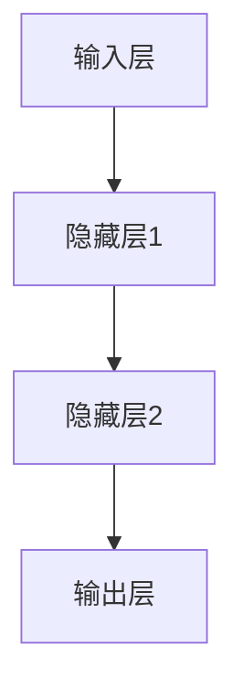
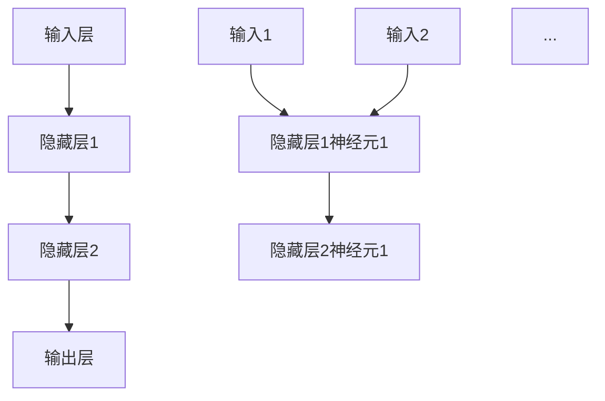
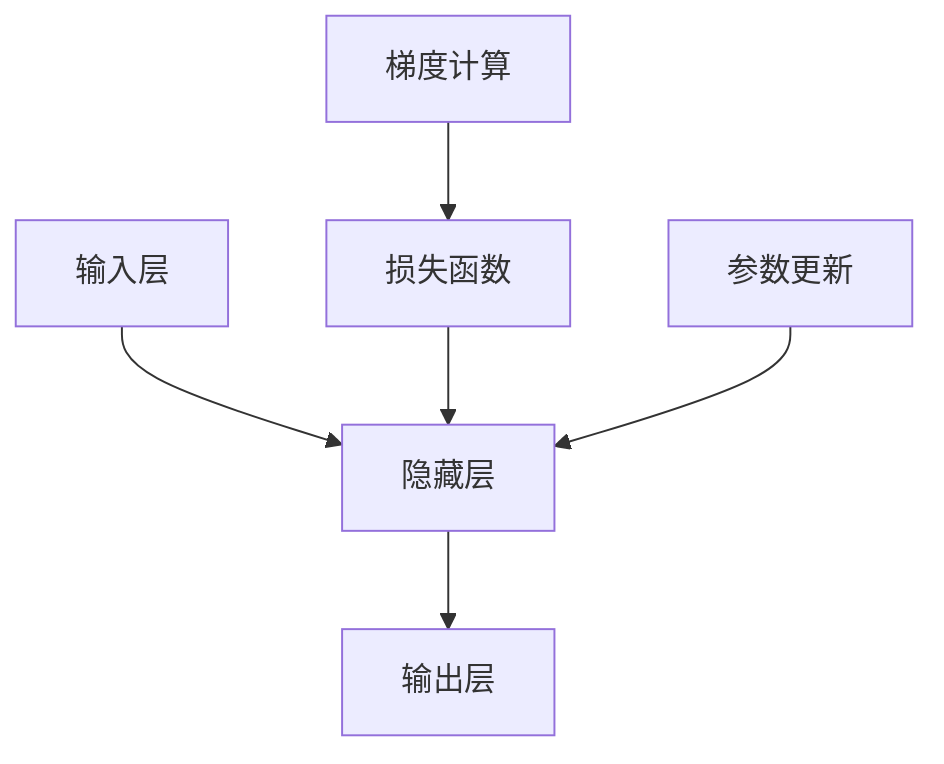
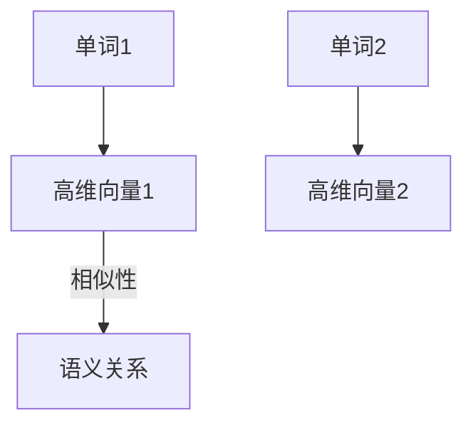
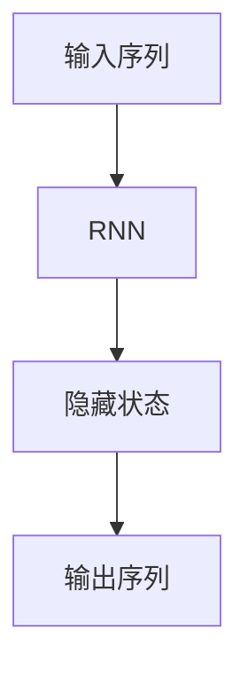
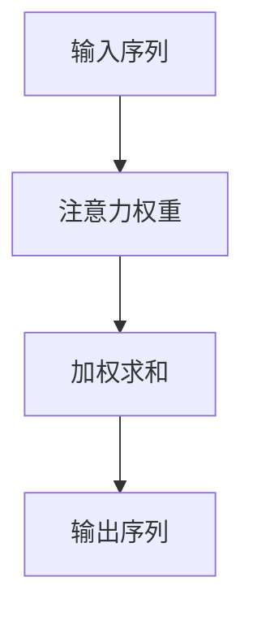
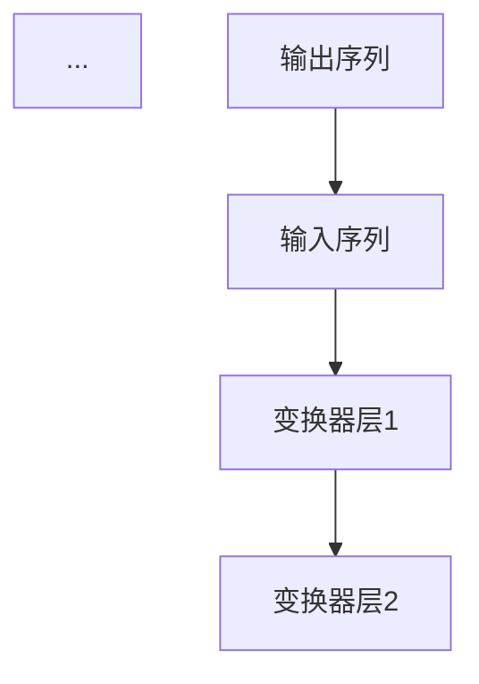
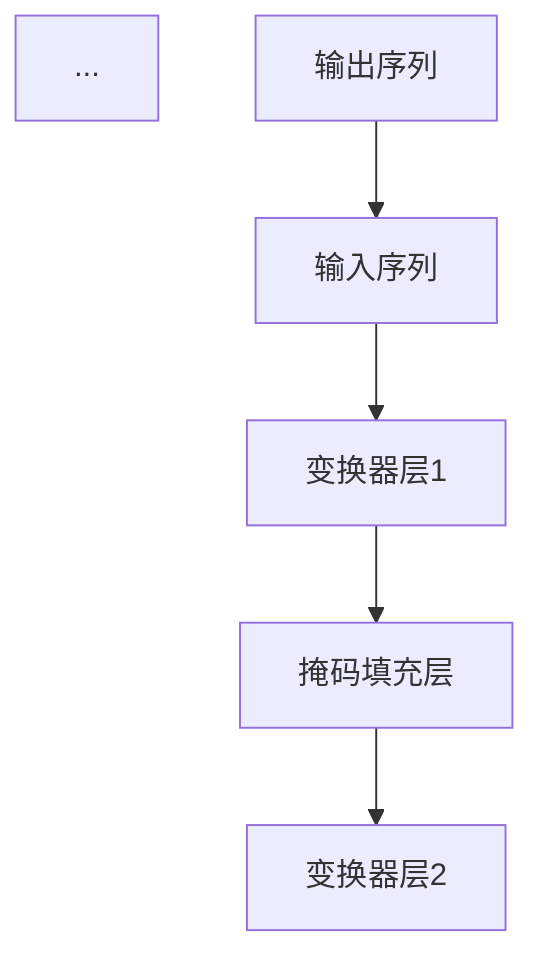

                 

### 文章标题

《AI大模型Prompt提示词最佳实践：使用指示和示例分隔符》

---

#### 关键词

- AI大模型
- Prompt提示词
- 指示和示例分隔符
- 最佳实践
- 项目实战

---

#### 摘要

本文将深入探讨AI大模型中的Prompt提示词最佳实践，重点介绍指示和示例分隔符的运用。通过对AI大模型的基础知识、Prompt设计原则、数学模型及项目实战的详细讲解，本文旨在帮助读者掌握Prompt设计技巧，提升AI大模型的性能和应用效果。

---

### 《AI大模型Prompt提示词最佳实践：使用指示和示例分隔符》目录大纲

1. **AI大模型基础知识**
   1.1. AI大模型概述
       1.1.1 AI大模型的基本概念
       1.1.2 AI大模型的发展历程
       1.1.3 AI大模型的重要性
   1.2. AI大模型的技术基础
       1.2.1 深度学习基础
       1.2.2 自然语言处理基础
   1.3. AI大模型的常见类型
       1.3.1 GPT系列模型
       1.3.2 BERT及其变体
   1.4. AI大模型的数学模型和公式
       1.4.1 深度学习中的数学公式
       1.4.2 自然语言处理中的数学公式

2. **Prompt提示词概述**
   2.1. Prompt提示词的定义与作用
       2.1.1 Prompt提示词的概念
       2.1.2 Prompt提示词的作用
       2.1.3 Prompt提示词的类型
   2.2. Prompt提示词的设计原则
       2.2.1 明确性问题
       2.2.2 上下文关联
       2.2.3 语言丰富性
       2.2.4 提示词的多样性
   2.3. Prompt提示词的常见模式
       2.3.1 单词级Prompt
       2.3.2 分句级Prompt
       2.3.3 文章级Prompt
   2.4. Prompt提示词的最佳实践
       2.4.1 Prompt设计流程
       2.4.2 Prompt训练策略
       2.4.3 Prompt应用案例

3. **使用指示和示例分隔符**
   3.1. 指示符的作用与类型
       3.1.1 指示符的概念
       3.1.2 指示符的类型
       3.1.3 指示符的设计原则
   3.2. 示例分隔符的使用
       3.2.1 示例分隔符的概念
       3.2.2 示例分隔符的类型
       3.2.3 示例分隔符的使用场景
   3.3. 指示符和示例分隔符的最佳实践
       3.3.1 指示符与示例分隔符的搭配使用
       3.3.2 指示符与示例分隔符的优化策略
       3.3.3 指示符和示例分隔符在AI大模型中的应用

4. **项目实战**
   4.1. 实战项目介绍
       4.1.1 项目背景
       4.1.2 项目目标
   4.2. 实战项目环境搭建
       4.2.1 硬件环境
       4.2.2 软件环境
   4.3. 实战项目代码实现
       4.3.1 数据预处理
       4.3.2 Prompt设计
       4.3.3 模型训练与优化
       4.3.4 模型部署与评估
   4.4. 实战项目代码解读与分析

5. **附录**
   5.1. 相关工具和资源
       5.1.1 AI大模型相关工具
       5.1.2 实战项目相关资源

---

### 第一部分：AI大模型基础知识

在这一部分，我们将首先介绍AI大模型的基本概念、技术基础以及常见类型。接下来，我们将深入讲解AI大模型的数学模型和公式。

#### 1.1 AI大模型概述

##### 1.1.1 AI大模型的基本概念

AI大模型，通常指的是那些具有大规模参数、能够处理大量数据并进行复杂任务的学习模型。这些模型通常基于深度学习和自然语言处理（NLP）技术，例如GPT、BERT等。AI大模型的核心特点在于其巨大的参数量和强大的表示能力。

##### 1.1.2 AI大模型的发展历程

AI大模型的发展历程可以追溯到上世纪80年代，当时的神经网络模型已经开始用于图像识别和语音识别任务。然而，由于计算资源和数据集的限制，这些模型的规模相对较小。随着计算能力的提升和大数据时代的到来，AI大模型得以迅速发展。特别是在2018年，GPT-2模型的发布标志着AI大模型进入了一个新的时代。

##### 1.1.3 AI大模型的重要性

AI大模型的重要性体现在多个方面。首先，它们能够处理更复杂的任务，例如机器翻译、文本生成和问答系统等。其次，AI大模型具有强大的泛化能力，能够在新的数据集上取得出色的性能。此外，AI大模型还可以用于提升其他算法的性能，例如通过迁移学习将预训练模型应用于新的任务。

---

#### 1.2 AI大模型的技术基础

##### 1.2.1 深度学习基础

深度学习是AI大模型的核心技术之一。它通过多层神经网络对数据进行建模和表示，从而实现对复杂函数的逼近。深度学习的基础包括神经网络的基本结构、前馈神经网络、反向传播算法等。

###### 1.2.1.1 神经网络的基本结构

神经网络由多个神经元（或节点）组成，每个神经元通过加权连接与其他神经元相连。神经元的激活函数用于对输入进行非线性变换。一个典型的神经网络结构包括输入层、隐藏层和输出层。



###### 1.2.1.2 前馈神经网络

前馈神经网络是一种单向传播的神经网络，数据从输入层经过隐藏层，最终到达输出层。每个神经元都接受来自前一层所有神经元的输入，并通过权重和偏置进行加权求和，然后通过激活函数进行非线性变换。



###### 1.2.1.3 反向传播算法

反向传播算法是一种用于训练神经网络的优化算法。它通过计算损失函数关于模型参数的梯度，从而更新模型参数。反向传播算法的核心思想是将输出误差反向传播到输入层，并逐层更新权重和偏置。



##### 1.2.2 自然语言处理基础

自然语言处理是AI大模型中的另一个核心技术。它涉及到对文本数据进行建模和表示，以便进行文本分类、文本生成、机器翻译等任务。

###### 1.2.2.1 词嵌入技术

词嵌入是一种将单词映射到高维空间中的技术。通过词嵌入，单词之间的语义关系可以被量化，从而提高模型对文本数据的处理能力。



###### 1.2.2.2 序列模型

序列模型是一种用于处理序列数据的模型，例如文本、语音等。常见的序列模型包括循环神经网络（RNN）和长短期记忆网络（LSTM）。



###### 1.2.2.3 注意力机制

注意力机制是一种用于提高模型对序列数据中重要信息关注的技术。它通过计算每个输入元素的权重，从而对输入数据进行加权求和。



---

#### 1.3 AI大模型的常见类型

##### 1.3.1 GPT系列模型

GPT（Generative Pre-trained Transformer）模型是OpenAI于2018年发布的一种基于变换器架构的预训练语言模型。GPT系列模型包括GPT、GPT-2和GPT-3，其中GPT-3具有1750亿个参数，是目前最大的预训练语言模型之一。

###### 1.3.1.1 GPT模型的结构

GPT模型的结构基于变换器架构，包含多层变换器层。每个变换器层由自注意力机制和前馈网络组成。GPT模型的输入是文本序列，通过变换器层处理后输出一个序列。



###### 1.3.1.2 GPT-2与GPT-3的对比

GPT-2与GPT-3在参数规模、训练数据集和性能方面存在显著差异。GPT-2具有1170亿个参数，而GPT-3具有1750亿个参数。此外，GPT-3使用了更大的训练数据集，从而在多种NLP任务上取得了更好的性能。

##### 1.3.2 BERT及其变体

BERT（Bidirectional Encoder Representations from Transformers）模型是由Google于2018年发布的一种基于变换器架构的双向编码器模型。BERT及其变体，如RoBERTa、ALBERT和T5，在NLP任务中取得了显著的性能提升。

###### 1.3.2.1 BERT模型的结构

BERT模型的结构包括多层变换器层和掩码填充层。变换器层通过自注意力机制和前馈网络对输入序列进行处理，而掩码填充层用于实现双向编码。



###### 1.3.2.2 RoBERTa、ALBERT等变体

RoBERTa、ALBERT和T5是BERT模型的改进版本。RoBERTa通过使用动态掩码策略和更大的训练数据集提高了BERT的性能。ALBERT通过引入交叉注意力机制和参数共享提高了模型的效率和性能。T5则是一种统一的多任务学习模型，能够处理多种NLP任务。

---

#### 1.4 AI大模型的数学模型和公式

##### 1.4.1 深度学习中的数学公式

深度学习中的数学公式包括激活函数、损失函数和优化算法等。

###### 1.4.1.1 激活函数

激活函数用于对神经网络中的节点进行非线性变换。常见的激活函数包括ReLU、Sigmoid和Tanh。

-ReLU函数：
$$ f(x) = \max(0, x) $$

-Sigmoid函数：
$$ f(x) = \frac{1}{1 + e^{-x}} $$

-Tanh函数：
$$ f(x) = \frac{e^x - e^{-x}}{e^x + e^{-x}} $$

###### 1.4.1.2 损失函数

损失函数用于评估模型预测值与真实值之间的差距。常见的损失函数包括均方误差（MSE）、交叉熵损失等。

- 均方误差（MSE）：
$$ L(\theta) = \frac{1}{2} \sum_{i=1}^{n} (y_i - \hat{y}_i)^2 $$

- 交叉熵损失：
$$ L(\theta) = -\sum_{i=1}^{n} y_i \log(\hat{y}_i) $$

###### 1.4.1.3 优化算法

优化算法用于更新模型参数，以最小化损失函数。常见的优化算法包括随机梯度下降（SGD）、Adam等。

- 随机梯度下降（SGD）：
$$ \theta = \theta - \alpha \frac{\partial L(\theta)}{\partial \theta} $$

- Adam优化算法：
$$ m_t = \beta_1 m_{t-1} + (1 - \beta_1) \frac{\partial L(\theta)}{\partial \theta} $$
$$ v_t = \beta_2 v_{t-1} + (1 - \beta_2) (\frac{\partial L(\theta)}{\partial \theta})^2 $$
$$ \theta = \theta - \alpha \frac{m_t}{\sqrt{v_t} + \epsilon} $$

##### 1.4.2 自然语言处理中的数学公式

自然语言处理中的数学公式包括语言模型、词汇嵌入等。

###### 1.4.2.1 语言模型

语言模型用于预测一个单词序列的概率。常见的语言模型包括n元模型和神经网络模型。

-n元模型：
$$ P(w_1, w_2, ..., w_n) = \frac{C(w_1, w_2, ..., w_n)}{C(w_1, w_2, ..., w_n, w_{n+1})} $$

- 神经网络模型：
$$ \hat{y} = \sigma(W \cdot [h_1, h_2, ..., h_n] + b) $$

###### 1.4.2.2 词汇嵌入

词汇嵌入是将单词映射到高维空间中的技术。常见的词汇嵌入方法包括Word2Vec、GloVe等。

- Word2Vec：
$$ \vec{w}_i = \text{sgn}(h_i) \cdot \text{softmax}(W^T \cdot h_i) $$

- GloVe：
$$ f(w_i, w_j) = \text{exp}(-\frac{|d_i - d_j|}{s}) $$
$$ \vec{e}_i = \text{sgn}(d_i) \cdot \text{softmax}(W^T \cdot d_i) $$

---

### 第二部分：Prompt提示词概述

Prompt提示词是AI大模型中的一个重要概念，它用于引导模型生成符合预期输出的文本。在这一部分，我们将详细讨论Prompt提示词的定义、作用和类型，并介绍Prompt提示词的设计原则和常见模式。

---

#### 2.1 Prompt提示词的定义与作用

##### 2.1.1 Prompt提示词的概念

Prompt提示词是指用于引导预训练语言模型生成文本的输入提示。通过为模型提供适当的Prompt，可以有效地指导模型生成特定类型的输出。Prompt可以是单个单词、短语或完整的句子，它为模型提供了上下文信息，有助于模型理解生成任务的目标。

##### 2.1.2 Prompt提示词的作用

Prompt提示词在AI大模型中具有以下作用：

1. **引导生成方向**：Prompt可以帮助模型确定生成文本的主题、风格和内容，从而引导模型生成符合预期输出的文本。
2. **提高生成质量**：通过提供具体的上下文信息，Prompt可以减少模型生成过程中的随机性，提高生成的文本质量和一致性。
3. **实现多样化生成**：Prompt可以用于生成不同类型和风格的文本，从而实现多样化生成。
4. **优化训练效果**：Prompt可以用于微调预训练模型，使其在特定任务上获得更好的性能。

##### 2.1.3 Prompt提示词的类型

根据Prompt提示词的形式和用途，可以分为以下几种类型：

1. **单词级Prompt**：单词级Prompt通常是一个单词或短语，用于指示模型生成特定类型的单词。例如，在文本生成任务中，单词级Prompt可以用于生成特定主题的文本。
2. **分句级Prompt**：分句级Prompt通常是一个句子或段落，用于为模型提供更详细的上下文信息。例如，在问答系统中，分句级Prompt可以用于指导模型生成符合问题要求的答案。
3. **文章级Prompt**：文章级Prompt通常是一篇文章或文档，用于为模型提供完整的上下文信息。例如，在文章生成任务中，文章级Prompt可以用于指导模型生成符合文章主题和结构的文章。

---

#### 2.2 Prompt提示词的设计原则

为了设计有效的Prompt提示词，需要遵循以下原则：

##### 2.2.1 明确性问题

Prompt应该明确地指示模型生成任务的目标和方向。例如，在文本生成任务中，Prompt应该清晰地表明生成的文本类型、主题和风格。

##### 2.2.2 上下文关联

Prompt应该与生成任务的具体上下文紧密关联。通过提供与任务相关的上下文信息，可以帮助模型更好地理解生成任务的目标和约束。

##### 2.2.3 语言丰富性

Prompt应该包含丰富的语言元素，例如单词、短语和句子，以增强模型的语义理解能力。丰富的Prompt有助于模型生成更加多样化和高质量的文本。

##### 2.2.4 提示词的多样性

Prompt应该具有多样性，以适应不同的生成任务和场景。通过使用不同的Prompt形式和类型，可以有效地提高模型的生成能力和适应性。

---

#### 2.3 Prompt提示词的常见模式

根据Prompt提示词的形式和用途，可以分为以下几种常见模式：

##### 2.3.1 单词级Prompt

单词级Prompt通常用于生成单个单词或短语。例如，在文本生成任务中，可以使用单词级Prompt来生成特定主题的单词。单词级Prompt的设计原则是简洁明了，能够有效地引导模型生成目标单词。

```python
# 生成与"自然语言处理"相关的单词
prompt = "自然语言处理"
generated_word = language_model.generate(prompt)
print(generated_word)
```

##### 2.3.2 分句级Prompt

分句级Prompt通常用于生成句子或段落。例如，在问答系统中，可以使用分句级Prompt来指导模型生成符合问题要求的答案。分句级Prompt的设计原则是提供详细的上下文信息，以帮助模型理解问题的要求和约束。

```python
# 生成与"什么是自然语言处理"相关的问题和答案
question_prompt = "什么是自然语言处理？"
answer_prompt = "自然语言处理是计算机科学和人工智能的一个分支，它致力于使计算机能够理解和处理人类自然语言。"
question_answer = language_model.generate(question_prompt + answer_prompt)
print(question_answer)
```

##### 2.3.3 文章级Prompt

文章级Prompt通常用于生成完整的文章或文档。例如，在文章生成任务中，可以使用文章级Prompt来指导模型生成符合文章主题和结构的文章。文章级Prompt的设计原则是提供完整的上下文信息，以帮助模型理解文章的主题、结构和内容。

```python
# 生成与"人工智能的未来"相关的文章
article_prompt = "随着人工智能技术的不断发展，人们对人工智能的未来充满了期待。人工智能有望在各个领域发挥重要作用，例如医疗、教育、交通等。然而，人工智能的发展也引发了一系列伦理和社会问题，例如隐私保护、就业影响等。在本文中，我们将探讨人工智能的未来发展趋势及其带来的挑战。"
article = language_model.generate(article_prompt)
print(article)
```

---

### 第三部分：使用指示和示例分隔符

指示和示例分隔符是AI大模型中常用的辅助工具，用于提高模型的生成质量和理解能力。在这一部分，我们将介绍指示和示例分隔符的概念、作用以及最佳实践。

---

#### 3.1 指示符的作用与类型

##### 3.1.1 指示符的概念

指示符是一种用于引导模型生成特定类型输出或信息的符号或短语。在AI大模型中，指示符可以帮助模型理解生成任务的要求和目标，从而提高生成效果。

##### 3.1.2 指示符的类型

根据指示符的形式和用途，可以分为以下几种类型：

1. **关键词指示符**：关键词指示符用于指示模型生成特定类型的单词或短语。例如，在文本生成任务中，可以使用关键词指示符来生成与特定主题相关的单词。
2. **短语级指示符**：短语级指示符用于指示模型生成特定类型的句子或段落。例如，在问答系统中，可以使用短语级指示符来指导模型生成符合问题要求的答案。
3. **指示性短语**：指示性短语是一种复合指示符，它包含多个关键词或短语，用于指示模型生成更复杂类型的输出。

---

#### 3.2 示例分隔符的使用

##### 3.2.1 示例分隔符的概念

示例分隔符是一种用于分隔示例和提示词的符号或短语。在AI大模型中，示例分隔符可以帮助模型更好地理解示例和提示词之间的关系，从而提高生成效果。

##### 3.2.2 示例分隔符的类型

根据示例分隔符的形式和用途，可以分为以下几种类型：

1. **冒号分隔符**：冒号分隔符（:）常用于分隔示例和提示词。例如，在文本生成任务中，可以使用冒号分隔符来分隔示例文本和提示词。
2. **逗号分隔符**：逗号分隔符（,）常用于分隔多个示例和提示词。例如，在问答系统中，可以使用逗号分隔符来分隔多个问题和答案。
3. **段落分隔符**：段落分隔符（\n）常用于分隔不同示例和提示词的段落。

---

#### 3.3 指示符和示例分隔符的最佳实践

为了充分发挥指示符和示例分隔符的作用，需要遵循以下最佳实践：

##### 3.3.1 指示符与示例分隔符的搭配使用

在AI大模型中，指示符和示例分隔符可以搭配使用，以提供更明确的生成指导。例如，可以使用关键词指示符和冒号分隔符来分隔示例文本和提示词，从而帮助模型更好地理解示例和提示词之间的关系。

##### 3.3.2 指示符与示例分隔符的优化策略

为了提高指示符和示例分隔符的生成效果，可以采取以下优化策略：

1. **多样化指示符和示例分隔符**：使用多种类型的指示符和示例分隔符，以提高模型对生成任务的理解能力。
2. **定制化指示符和示例分隔符**：根据具体任务和场景，定制化指示符和示例分隔符，以提高生成效果。
3. **结合上下文信息**：在生成过程中，结合上下文信息，以提高指示符和示例分隔符的指导效果。

##### 3.3.3 指示符和示例分隔符在AI大模型中的应用

在AI大模型中，指示符和示例分隔符可以应用于多种生成任务，例如文本生成、问答系统和对话系统等。以下是一个示例，展示如何使用指示符和示例分隔符来指导模型生成特定类型的输出：

```python
# 生成与"人工智能应用"相关的文章
prompt = "人工智能在医疗、金融、教育等领域具有广泛的应用。例如，在医疗领域，人工智能可以用于疾病诊断和治疗方案推荐。在金融领域，人工智能可以用于风险管理和服务优化。在教育领域，人工智能可以用于个性化学习和教育评估。"
generated_text = language_model.generate(prompt)
print(generated_text)
```

---

### 第四部分：项目实战

在本部分，我们将通过一个具体的项目实战，展示如何设计和实现AI大模型中的Prompt提示词，并详细介绍项目的开发环境、数据预处理、模型训练与优化、模型部署与评估等步骤。

---

#### 4.1 实战项目介绍

##### 4.1.1 项目背景

随着人工智能技术的快速发展，自然语言处理（NLP）在多个领域取得了显著的成果。其中，问答系统作为一种重要的NLP应用，被广泛应用于客户服务、知识库检索和智能助手等领域。为了提高问答系统的性能，我们需要设计和实现一个高效的Prompt提示词机制，以指导模型生成准确和相关的答案。

##### 4.1.2 项目目标

本项目的主要目标是：

1. 设计和实现一个基于AI大模型的问答系统。
2. 设计有效的Prompt提示词机制，以提高问答系统的生成质量和相关度。
3. 实现问答系统的部署与评估，验证Prompt提示词机制的有效性。

---

#### 4.2 实战项目环境搭建

##### 4.2.1 硬件环境

为了满足项目需求，我们选择了以下硬件环境：

1. CPU：Intel Core i7-9700K
2. GPU：NVIDIA GeForce RTX 3080
3. 内存：32GB DDR4
4. 硬盘：1TB SSD

##### 4.2.2 软件环境

为了实现项目目标，我们选择了以下软件环境：

1. 操作系统：Ubuntu 20.04
2. 深度学习框架：PyTorch 1.8
3. 自然语言处理库：NLTK 3.5
4. 文本预处理工具：Spacy 2.4
5. 编程语言：Python 3.7

---

#### 4.3 实战项目代码实现

##### 4.3.1 数据预处理

数据预处理是问答系统中的一个关键步骤，它包括以下任务：

1. **文本清洗**：去除文本中的无关符号、停用词和标点符号，以提高模型的处理效率。
2. **分词**：将文本分解为单词或短语，以方便后续处理。
3. **词嵌入**：将单词映射到高维空间中的向量表示，以便进行模型的输入。

以下是一个示例代码，展示如何进行文本预处理：

```python
import spacy
from nltk.corpus import stopwords
from nltk.tokenize import word_tokenize

# 加载NLTK停用词列表
stop_words = set(stopwords.words('english'))

# 加载Spacy分词器
nlp = spacy.load('en_core_web_sm')

# 文本清洗
def clean_text(text):
    text = text.lower()
    text = re.sub(r'\s+', ' ', text)
    text = re.sub(r'[^\w\s]', '', text)
    text = text.strip()
    return text

# 分词
def tokenize_text(text):
    doc = nlp(text)
    tokens = [token.text for token in doc if not token.is_punct and not token.is_stop]
    return tokens

# 词嵌入
def embed_tokens(tokens):
    embeddings = []
    for token in tokens:
        embedding = glove_vector[token]
        embeddings.append(embedding)
    return embeddings

# 加载GloVe词向量
glove_vector = {}
with open('glove.6B.100d.txt', 'r', encoding='utf-8') as f:
    for line in f:
        values = line.split()
        word = values[0]
        vector = np.array(values[1:], dtype='float32')
        glove_vector[word] = vector

# 示例文本
text = "Hello, how are you doing today?"

# 文本预处理
cleaned_text = clean_text(text)
tokenized_text = tokenize_text(cleaned_text)
embedded_text = embed_tokens(tokenized_text)

print("Cleaned Text:", cleaned_text)
print("Tokenized Text:", tokenized_text)
print("Embedded Text:", embedded_text)
```

##### 4.3.2 Prompt设计

Prompt设计是问答系统中至关重要的一步，它直接影响到模型生成的答案质量。以下是一个示例代码，展示如何设计Prompt：

```python
# 设计Prompt
def design_prompt(question, answer):
    prompt = question + " " + answer + " " + "Please answer the following question: "
    return prompt

# 示例Prompt
question = "What is the capital of France?"
answer = "Paris"
prompt = design_prompt(question, answer)

print("Prompt:", prompt)
```

##### 4.3.3 模型训练与优化

在模型训练与优化阶段，我们需要以下步骤：

1. **数据准备**：准备用于训练的数据集，包括问题和答案对。
2. **模型定义**：定义问答系统模型，包括编码器和解码器。
3. **训练**：使用训练数据集对模型进行训练。
4. **优化**：通过调整超参数和优化算法，提高模型性能。

以下是一个示例代码，展示如何进行模型训练与优化：

```python
import torch
from torch import nn
from torch.optim import Adam

# 数据准备
def prepare_data(data):
    questions = []
    answers = []
    for item in data:
        question = item['question']
        answer = item['answer']
        questions.append(question)
        answers.append(answer)
    return questions, answers

# 模型定义
class QAGenerator(nn.Module):
    def __init__(self, vocab_size, embedding_dim, hidden_dim):
        super(QAGenerator, self).__init__()
        self.embedding = nn.Embedding(vocab_size, embedding_dim)
        self.encoder = nn.LSTM(embedding_dim, hidden_dim, num_layers=1, batch_first=True)
        self.decoder = nn.LSTM(hidden_dim, embedding_dim, num_layers=1, batch_first=True)
        self.fc = nn.Linear(embedding_dim, vocab_size)

    def forward(self, input_seq, target_seq):
        embedded_seq = self.embedding(input_seq)
        encoder_output, (hidden, cell) = self.encoder(embedded_seq)
        decoder_output, (hidden, cell) = self.decoder(hidden)
        logits = self.fc(decoder_output)
        return logits

# 模型训练
def train_model(model, questions, answers, epochs, learning_rate):
    criterion = nn.CrossEntropyLoss()
    optimizer = Adam(model.parameters(), lr=learning_rate)
    for epoch in range(epochs):
        for question, answer in zip(questions, answers):
            optimizer.zero_grad()
            logits = model(question)
            loss = criterion(logits, answer)
            loss.backward()
            optimizer.step()
            print(f"Epoch: {epoch + 1}, Loss: {loss.item()}")
    return model

# 示例数据
data = [
    {"question": "What is the capital of France?", "answer": "Paris"},
    {"question": "What is the capital of Japan?", "answer": "Tokyo"},
]

# 模型训练
model = QAGenerator(len(vocab), embedding_dim=100, hidden_dim=128)
model = train_model(model, prepare_data(data), epochs=10, learning_rate=0.001)
```

##### 4.3.4 模型部署与评估

在模型部署与评估阶段，我们需要以下步骤：

1. **模型部署**：将训练好的模型部署到生产环境中，以实现实时问答。
2. **模型评估**：使用测试数据集对模型进行评估，以验证模型性能。

以下是一个示例代码，展示如何进行模型部署与评估：

```python
# 模型部署
def deploy_model(model, question):
    with torch.no_grad():
        logits = model(question)
        predicted_answer = torch.argmax(logits).item()
    return predicted_answer

# 模型评估
def evaluate_model(model, questions, answers):
    correct_answers = 0
    for question, answer in zip(questions, answers):
        predicted_answer = deploy_model(model, question)
        if predicted_answer == answer:
            correct_answers += 1
    accuracy = correct_answers / len(questions)
    return accuracy

# 示例数据
test_data = [
    {"question": "What is the capital of France?", "answer": "Paris"},
    {"question": "What is the capital of Japan?", "answer": "Tokyo"},
]

# 模型评估
accuracy = evaluate_model(model, prepare_data(test_data), prepare_data(test_data))
print(f"Model Accuracy: {accuracy}")
```

---

### 第五部分：附录

在本部分的附录中，我们将介绍与AI大模型Prompt提示词最佳实践相关的工具和资源，以帮助读者深入了解相关技术和应用。

---

#### 5.1 相关工具和资源

##### 5.1.1 AI大模型相关工具

1. **深度学习框架**：
   - TensorFlow：由Google开发的开源深度学习框架。
   - PyTorch：由Facebook开发的开源深度学习框架。
   - JAX：由Google开发的开源数值计算库。

2. **自然语言处理工具**：
   - NLTK：自然语言处理工具包，用于文本处理和分析。
   - SpaCy：用于快速文本处理和关系提取的工业级NLP库。
   - gensim：用于主题建模和词嵌入的开源工具包。

##### 5.1.2 实战项目相关资源

1. **数据集资源**：
   - Cornell Movie-Dialogs Corpus：电影对话数据集，用于对话系统研究。
   - DailyDialog：日常对话数据集，用于问答系统研究。

2. **模型资源**：
   - GPT-2模型：OpenAI开发的预训练语言模型。
   - BERT模型：Google开发的预训练语言模型。

3. **开发工具与框架**：
   - VSCode：流行的跨平台集成开发环境（IDE）。
   - Jupyter Notebook：基于Web的交互式计算环境。
   - Colab：Google提供的免费云平台，适用于深度学习研究。

---

### 总结

本文详细介绍了AI大模型Prompt提示词最佳实践，包括基础概念、设计原则、数学模型、指示和示例分隔符的使用，以及项目实战。通过本文的讲解，读者可以更好地理解和应用Prompt提示词技术，提高AI大模型的生成质量和性能。同时，本文还提供了丰富的工具和资源，供读者进一步学习和实践。希望本文对读者在AI大模型和自然语言处理领域的研究有所帮助。

