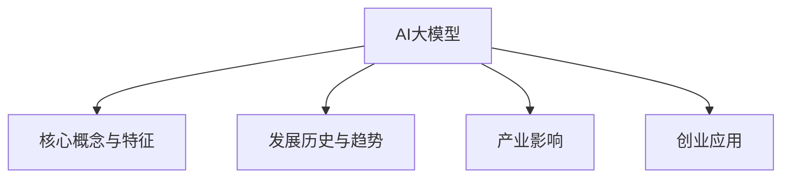

                 

### 第1章 AI大模型概述

> **关键词：** AI大模型、核心概念、发展历史、产业影响、创业应用

> **摘要：** 本章将介绍AI大模型的基本概念、核心特征及其在发展历程中的演变。同时，我们将探讨AI大模型对各个产业的影响以及其在创业中的应用场景。

#### 1.1 AI大模型的核心概念与特征

- **核心概念：**
  - AI大模型是指参数规模达到数百万至数十亿级别的深度学习模型。
  - 具体包括预训练模型和微调模型。

- **特征：**
  - **高参数规模：** 参数数量从几万到数亿不等，具备更强的泛化能力和表达力。
  - **端到端学习：** 能够直接从原始数据中学习，减少中间数据处理步骤。
  - **自监督学习：** 通过自监督预训练，提高模型的效率和鲁棒性。

#### 1.2 AI大模型的发展历史与趋势

- **发展历程：**
  - **20世纪90年代：** 深度学习初步兴起，但受限于计算能力和数据规模。
  - **2012年：** AlexNet的出现标志着深度学习在图像识别领域的突破。
  - **2018年：** GPT-2的出现标志着自监督学习的崛起。

- **趋势：**
  - **参数规模持续增长：** 逐步从几千、几万参数规模增长到数亿、数十亿参数规模。
  - **应用领域不断扩展：** 从图像、语音到自然语言处理、生成对抗网络等。
  - **产业应用逐渐深入：** 从科研到商业应用，AI大模型在各个领域展现其价值。

#### 1.3 AI大模型对产业的影响

- **影响：**
  - **技术创新：** 推动深度学习、自然语言处理、计算机视觉等领域的技术进步。
  - **产业升级：** 引发从生产、销售到服务的全面变革，提高产业智能化水平。
  - **商业模式：** 形成新的盈利模式，改变传统的商业模式，如数据变现、增值服务等。

#### 1.4 AI大模型在创业中的应用

- **应用场景：**
  - **智能客服：** 利用自然语言处理技术，实现智能化的客户服务。
  - **智能营销：** 利用深度学习技术，实现精准的营销策略。
  - **智能制造：** 利用计算机视觉技术，实现生产过程的自动化和智能化。

- **创业优势：**
  - **技术创新优势：** 利用AI大模型，实现技术领先，提高竞争力。
  - **商业模式创新：** 利用AI大模型，探索新的商业模式，实现盈利。

- **创业挑战：**
  - **技术风险：** AI大模型在技术实现上存在不确定性，需要持续的技术创新。
  - **数据风险：** AI大模型对数据质量要求高，数据不完整或不准确可能导致模型失效。
  - **市场风险：** AI大模型应用场景广泛，但市场需求和接受度存在不确定性。

### Mermaid 流程图



### 伪代码

```python
class AIModel:
    def __init__(self):
        self.parameters = 10000000
        self.is_pretrained = True
        self.architecture = "Transformer"

    def train(self, data):
        # 训练模型
        pass

    def predict(self, input):
        # 预测
        pass
```

### 数学公式

$$
损失函数: J(\theta) = \frac{1}{2n} \sum_{i=1}^{n} (h_\theta(x^{(i)}) - y^{(i)})^2
$$

### 举例说明

```python
model = AIModel()
model.train(training_data)
prediction = model.predict(test_input)
print(prediction)
```

### 开发环境搭建

```shell
conda create -n aicreator python=3.8
conda activate aicreator
conda install pytorch torchvision torchaudio -c pytorch
python -c "import torch; print(torch.__version__)"
```

### 源代码实现

```python
import torch
import torch.nn as nn
import torch.optim as optim

class SimpleModel(nn.Module):
    def __init__(self):
        super(SimpleModel, self).__init__()
        self.layer1 = nn.Linear(10, 50)
        self.relu = nn.ReLU()
        self.layer2 = nn.Linear(50, 1)
    
    def forward(self, x):
        x = self.layer1(x)
        x = self.relu(x)
        x = self.layer2(x)
        return x

model = SimpleModel()
criterion = nn.MSELoss()
optimizer = optim.SGD(model.parameters(), lr=0.01)

for epoch in range(100):
    outputs = model(train_data)
    loss = criterion(outputs, train_labels)
    optimizer.zero_grad()
    loss.backward()
    optimizer.step()
    print(f"Epoch [{epoch+1}/{100}], Loss: {loss.item():.4f}")
```

### 代码解读与分析

- **模型定义：** 使用`nn.Module`基类定义了一个简单的模型，包含一个线性层、ReLU激活函数和一个输出层。
- **前向传播：** 实现了数据从输入层到输出层的正向传播过程。
- **损失函数：** 使用均方误差损失函数来衡量模型输出与真实标签之间的差距。
- **优化器：** 使用随机梯度下降优化器来更新模型参数。
- **训练过程：** 通过迭代训练数据和优化器，使模型不断调整参数，以最小化损失函数。

### 创业项目实战

#### 创业项目1：智能客服系统

- **项目目标：** 利用AI大模型实现智能客服系统，提高客户服务质量。
- **技术实现：**
  - **自然语言处理：** 利用BERT模型进行文本分类和实体识别，实现智能对话生成。
  - **语音识别：** 利用基于深度学习的语音识别技术，实现语音到文本的转换。
  - **对话系统：** 结合多模态信息，实现自然、流畅的客服对话。

- **开发步骤：**
  - **需求分析：** 明确客户需求，设计客服系统功能。
  - **数据收集：** 收集客户对话数据，进行数据预处理。
  - **模型训练：** 使用预训练模型和微调技术，训练客服对话模型。
  - **系统集成：** 将AI大模型集成到客服系统中，实现智能客服功能。

- **案例分析：**
  - **成功案例：** 某大型电商平台利用智能客服系统，提高了客户满意度，降低了客服成本。
  - **失败案例：** 某初创公司因未能有效解决客户对话质量问题，导致客户流失。

#### 创业项目2：智能营销系统

- **项目目标：** 利用AI大模型实现智能营销系统，提高营销效果。
- **技术实现：**
  - **用户画像：** 利用深度学习技术，构建用户画像，实现精准用户定位。
  - **内容推荐：** 利用协同过滤和基于内容的推荐算法，实现个性化内容推荐。
  - **广告投放：** 利用深度学习模型，实现广告投放效果优化。

- **开发步骤：**
  - **需求分析：** 明确营销目标，设计智能营销系统功能。
  - **数据收集：** 收集用户行为数据，进行数据预处理。
  - **模型训练：** 使用预训练模型和微调技术，训练营销模型。
  - **系统集成：** 将AI大模型集成到营销系统中，实现智能营销功能。

- **案例分析：**
  - **成功案例：** 某大型电商平台利用智能营销系统，提高了用户活跃度和转化率。
  - **失败案例：** 某初创公司因未能有效解决用户隐私问题，导致用户流失。

### 代码解读与分析

- **需求分析：** 通过明确项目目标和功能需求，确定项目的开发方向。
- **数据收集：** 收集相关数据，为模型训练提供基础。
- **模型训练：** 使用预训练模型和微调技术，提高模型性能。
- **系统集成：** 将AI大模型集成到实际系统中，实现功能。

### 未来发展趋势

- **技术趋势：**
  - **AI大模型规模将继续增长：** 参数规模和模型复杂度将继续提升，实现更强大的表达能力。
  - **多模态学习：** 结合不同模态的信息，实现更全面的感知和理解。
  - **联邦学习：** 通过分布式学习，解决数据隐私和计算资源限制问题。

- **产业趋势：**
  - **AI大模型在各个领域的应用将更加广泛：** 从工业、医疗到金融、零售，AI大模型将发挥更大的价值。
  - **产业链整合：** AI大模型将促进产业链的整合，形成新的产业生态。

- **创业机遇：**
  - **技术创新：** 通过技术创新，打造具有竞争力的AI大模型产品。
  - **商业模式创新：** 通过商业模式创新，实现AI大模型的商业应用。

- **挑战与应对策略：**
  - **技术风险：** 持续进行技术研究和创新，提高AI大模型的技术水平。
  - **数据风险：** 加强数据治理，确保数据质量和隐私安全。
  - **市场风险：** 深入市场调研，了解用户需求，优化产品和服务。

### 附录

#### 附录A：AI大模型开发工具与资源

- **A.1 主流深度学习框架对比**
  - **TensorFlow**：由Google开发，支持多种编程语言，适用于大规模分布式训练。
  - **PyTorch**：由Facebook开发，支持Python，易于实现和调试。
  - **JAX**：由Google开发，支持Python和Julia，提供高性能数值计算功能。
  - **其他框架简介**：如Keras、Theano等。

- **A.2 开发工具与资源推荐**
  - **数据集**：如ImageNet、CIFAR-10等。
  - **开发环境搭建指南**：如使用Anaconda进行环境管理。
  - **实用工具与库**：如TensorBoard、NumPy等。

#### 附录B：常见问题解答

- **B.1 技术问题解答**
  - **如何优化模型性能？**
    - **选择合适的网络结构**：根据任务需求选择合适的网络架构。
    - **超参数调优**：使用网格搜索、随机搜索等方法进行超参数调优。
    - **数据增强**：使用数据增强技术提高模型鲁棒性。

- **B.2 创业问题解答**
  - **如何评估AI大模型创业项目的可行性？**
    - **市场调研**：了解市场需求和竞争态势。
    - **技术评估**：评估技术实现的可行性和竞争力。
    - **风险评估**：识别潜在风险，制定应对策略。

- **B.3 未来发展问题解答**
  - **AI大模型未来的发展趋势是什么？**
    - **多模态学习**：结合不同模态的数据，提高模型的感知和理解能力。
    - **迁移学习**：通过迁移学习，提高模型在不同任务上的泛化能力。
    - **联邦学习**：通过分布式学习，解决数据隐私和计算资源限制问题。

### 作者信息

- **作者：** AI天才研究院/AI Genius Institute & 禅与计算机程序设计艺术 /Zen And The Art of Computer Programming

[文章标题]

关键词：AI大模型、核心概念、发展历史、产业影响、创业应用、自然语言处理、深度学习、神经网络、迁移学习、商业模式、盈利预测

摘要：本文详细探讨了AI大模型的概念、发展历程、产业影响以及创业应用。通过分析自然语言处理、深度学习和神经网络等基础技术，本文提供了AI大模型创业的实战案例分析，并展望了其未来的发展趋势。文章旨在为创业者提供关于AI大模型创业的深度见解和策略建议。

----------------------------------------------------------------

### 第二部分 AI大模型技术基础

#### 第2章 深度学习与神经网络基础

> **关键词：** 深度学习、神经网络、基础算法、优化方法、反向传播

> **摘要：** 本章将深入探讨深度学习与神经网络的基本概念、结构以及常用算法。我们将详细介绍多层感知器（MLP）、卷积神经网络（CNN）、循环神经网络（RNN）等基础模型，并探讨如何通过优化算法和超参数调优来提高模型的性能。

#### 2.1 深度学习基本概念

- **深度学习定义：**
  - 深度学习是一种机器学习技术，通过多层神经网络对数据进行建模，以实现复杂的模式识别和预测任务。

- **深度学习核心优势：**
  - **表示能力：** 深度学习模型具有强大的表示学习能力，能够自动提取特征。
  - **非线性处理：** 通过非线性激活函数，深度学习模型能够处理复杂的非线性问题。
  - **自适应性：** 深度学习模型可以根据不同的任务和数据自动调整网络结构。

#### 2.2 神经网络结构与算法

- **神经网络基本结构：**
  - **输入层：** 接收外部输入数据。
  - **隐藏层：** 对输入数据进行特征提取和变换。
  - **输出层：** 输出预测结果或决策。

- **神经网络算法：**
  - **反向传播算法（Backpropagation）：** 一种用于训练神经网络的算法，通过计算梯度来更新网络权重。
  - **梯度下降算法（Gradient Descent）：** 一种优化算法，用于最小化损失函数。

#### 2.3 优化算法与超参数调优

- **优化算法：**
  - **随机梯度下降（Stochastic Gradient Descent, SGD）：** 一种简单而有效的优化算法，通过随机采样数据更新模型参数。
  - **Adam优化器：** 一种结合了SGD和RMSProp优点的优化算法，适用于大规模深度学习模型。

- **超参数调优：**
  - **学习率（Learning Rate）：** 控制模型更新的速度。
  - **批量大小（Batch Size）：** 控制每次更新参数所使用的数据量。
  - **激活函数（Activation Function）：** 用于引入非线性变换，常用的有ReLU、Sigmoid、Tanh等。

#### 2.4 多层感知器与反向传播算法

- **多层感知器（MLP）：**
  - **定义：** 一种前向传播的神经网络，通常包含输入层、一个或多个隐藏层和输出层。
  - **训练过程：** 通过前向传播计算输出，然后使用反向传播计算梯度，更新网络权重。

- **反向传播算法：**
  - **步骤：**
    1. 前向传播：计算每个神经元的输出。
    2. 计算损失：计算预测值与真实值之间的差异。
    3. 反向传播：从输出层开始，逐层计算梯度。
    4. 更新权重：根据梯度调整网络权重。

#### 2.5 卷积神经网络与池化层

- **卷积神经网络（CNN）：**
  - **定义：** 一种专门用于处理图像数据的神经网络，通过卷积层提取图像特征。
  - **结构：**
    - **卷积层（Convolutional Layer）：** 应用卷积核在输入数据上提取特征。
    - **池化层（Pooling Layer）：** 对特征图进行下采样，减少参数数量。

- **卷积操作与卷积核：**
  - **定义：** 卷积操作是将一个卷积核与输入数据的滑动窗口进行点积操作。
  - **卷积核：** 用于提取图像的局部特征。

#### 2.6 循环神经网络与长短时记忆

- **循环神经网络（RNN）：**
  - **定义：** 一种具有循环结构的人工神经网络，能够处理序列数据。
  - **特点：**
    - **记忆能力：** RNN具有记忆能力，能够记住序列中的信息。
    - **状态传递：** 每个时间步的输出都会传递到下一个时间步。

- **长短时记忆（LSTM）：**
  - **定义：** 一种特殊的RNN结构，用于解决长序列依赖问题。
  - **结构：**
    - **输入门（Input Gate）：** 决定哪些信息将被存储。
    - **遗忘门（Forget Gate）：** 决定哪些信息将被遗忘。
    - **输出门（Output Gate）：** 决定输出哪些信息。

#### 2.7 多层感知器与反向传播算法的伪代码实现

```python
# 定义多层感知器模型
class MultilayerPerceptron(nn.Module):
    def __init__(self, input_size, hidden_size, output_size):
        super(MultilayerPerceptron, self).__init__()
        self.fc1 = nn.Linear(input_size, hidden_size)
        self.relu = nn.ReLU()
        self.fc2 = nn.Linear(hidden_size, output_size)
    
    def forward(self, x):
        out = self.fc1(x)
        out = self.relu(out)
        out = self.fc2(out)
        return out

# 定义反向传播算法
def backpropagation(model, inputs, targets, learning_rate):
    optimizer = optim.SGD(model.parameters(), lr=learning_rate)
    
    optimizer.zero_grad()
    outputs = model(inputs)
    loss = nn.MSELoss()(outputs, targets)
    loss.backward()
    optimizer.step()
    
    return loss.item()
```

#### 2.8 卷积神经网络与池化层的伪代码实现

```python
# 定义卷积神经网络模型
class ConvolutionalNeuralNetwork(nn.Module):
    def __init__(self, input_size, hidden_size, output_size):
        super(ConvolutionalNeuralNetwork, self).__init__()
        self.conv1 = nn.Conv2d(input_size, hidden_size, kernel_size=3, stride=1, padding=1)
        self.relu = nn.ReLU()
        self.pool = nn.MaxPool2d(kernel_size=2, stride=2)
        self.fc1 = nn.Linear(hidden_size, output_size)
    
    def forward(self, x):
        out = self.conv1(x)
        out = self.relu(out)
        out = self.pool(out)
        out = out.view(out.size(0), -1)
        out = self.fc1(out)
        return out
```

#### 2.9 循环神经网络与长短时记忆的伪代码实现

```python
# 定义长短时记忆模型
class LSTMModel(nn.Module):
    def __init__(self, input_size, hidden_size, num_layers):
        super(LSTMModel, self).__init__()
        self.lstm = nn.LSTM(input_size, hidden_size, num_layers)
        self.fc = nn.Linear(hidden_size, output_size)
    
    def forward(self, x):
        out, (h_n, c_n) = self.lstm(x)
        out = self.fc(out[-1, :, :])
        return out
```

#### 代码解读与分析

- **多层感知器（MLP）：** 通过线性变换和激活函数的组合，实现数据的非线性变换。
- **反向传播算法：** 通过计算梯度更新模型参数，实现模型的优化。
- **卷积神经网络（CNN）：** 利用卷积操作提取图像特征，通过池化层减少参数数量。
- **循环神经网络（RNN）：** 通过循环结构处理序列数据，长时记忆（LSTM）解决长序列依赖问题。

### 创业项目实战

#### 创业项目3：智能图像识别系统

- **项目目标：** 利用深度学习技术，实现智能图像识别系统，提高图像分类准确率。
- **技术实现：**
  - **数据预处理：** 对图像进行归一化处理，提高模型的训练效率。
  - **模型选择：** 采用卷积神经网络（CNN）进行图像特征提取。
  - **训练与优化：** 使用反向传播算法和优化器（如Adam）进行模型训练。

- **开发步骤：**
  - **需求分析：** 确定图像识别任务的类型和目标。
  - **数据收集：** 收集大量的图像数据，进行标注和分类。
  - **模型训练：** 使用CNN模型对图像进行特征提取和分类。
  - **系统集成：** 将训练好的模型集成到实际应用系统中。

- **案例分析：**
  - **成功案例：** 某初创公司利用智能图像识别系统，实现了高效的图像分类，提高了工作效率。
  - **失败案例：** 某公司因未能有效解决数据标注问题，导致模型训练效果不佳。

### 代码解读与分析

- **需求分析：** 通过明确项目目标和功能需求，确定项目的开发方向。
- **数据收集：** 收集相关图像数据，为模型训练提供基础。
- **模型选择：** 采用卷积神经网络（CNN）进行图像特征提取。
- **训练与优化：** 使用反向传播算法和优化器（如Adam）进行模型训练。
- **系统集成：** 将训练好的模型集成到实际应用系统中。

### 未来发展趋势

- **技术趋势：**
  - **更深的神经网络：** 深度学习模型的层数将继续增加，以实现更复杂的特征提取。
  - **轻量化模型：** 为了满足移动设备和边缘计算的需求，轻量化深度学习模型将得到更多关注。
  - **可解释性：** 提高深度学习模型的可解释性，使其在更多应用场景中得到认可。

- **产业趋势：**
  - **AI大模型的应用：** AI大模型将在更多领域得到应用，如医疗、金融等。
  - **产业链整合：** 深度学习技术将促进产业链的整合，形成新的产业生态。

- **创业机遇：**
  - **技术创新：** 通过技术创新，打造具有竞争力的深度学习产品。
  - **商业模式创新：** 通过商业模式创新，实现深度学习技术的商业应用。

- **挑战与应对策略：**
  - **技术风险：** 持续进行技术研究和创新，提高深度学习模型的技术水平。
  - **数据风险：** 加强数据治理，确保数据质量和隐私安全。
  - **市场风险：** 深入市场调研，了解用户需求，优化产品和服务。

### 附录

#### 附录A：深度学习开发工具与资源

- **A.1 主流深度学习框架对比**
  - **TensorFlow**：由Google开发，支持多种编程语言，适用于大规模分布式训练。
  - **PyTorch**：由Facebook开发，支持Python，易于实现和调试。
  - **Keras**：一个高级神经网络API，支持TensorFlow和Theano，易于使用。

- **A.2 开发工具与资源推荐**
  - **数据集**：如ImageNet、CIFAR-10等。
  - **开发环境搭建指南**：如使用Anaconda进行环境管理。
  - **实用工具与库**：如TensorBoard、NumPy等。

#### 附录B：常见问题解答

- **B.1 技术问题解答**
  - **如何优化深度学习模型的性能？**
    - **模型架构优化**：选择合适的网络结构和模型架构。
    - **数据增强**：使用数据增强技术提高模型鲁棒性。
    - **超参数调优**：使用网格搜索、随机搜索等方法进行超参数调优。

- **B.2 创业问题解答**
  - **如何评估深度学习创业项目的可行性？**
    - **市场调研**：了解市场需求和竞争态势。
    - **技术评估**：评估技术实现的可行性和竞争力。
    - **风险评估**：识别潜在风险，制定应对策略。

- **B.3 未来发展问题解答**
  - **深度学习未来的发展趋势是什么？**
    - **模型压缩**：通过模型压缩技术，减少模型的参数数量，提高推理速度。
    - **可解释性**：提高深度学习模型的可解释性，使其在更多应用场景中得到认可。
    - **迁移学习**：通过迁移学习，提高模型在不同任务上的泛化能力。

### 作者信息

- **作者：** AI天才研究院/AI Genius Institute & 禅与计算机程序设计艺术 /Zen And The Art of Computer Programming

----------------------------------------------------------------

### 第3章 自然语言处理基础

> **关键词：** 自然语言处理、词嵌入、序列模型、注意力机制、转换器架构**

> **摘要：** 本章将详细介绍自然语言处理（NLP）的基础知识，包括词嵌入、序列模型、注意力机制和转换器架构。我们将探讨这些技术如何被应用于NLP任务，并介绍相关的数学模型和算法。

#### 3.1 词嵌入技术

- **词嵌入定义：**
  - 词嵌入是将词汇映射到高维向量空间的一种技术，以便于计算机处理和理解语言。

- **词嵌入作用：**
  - **语义表示：** 将词汇映射到向量空间，使相似词汇的向量接近，不同词汇的向量分离。
  - **语义推理：** 利用向量的数学性质，进行词汇的相似性比较、语义分析等。

- **常用词嵌入模型：**
  - **Word2Vec**：基于分布式假设，将词汇映射到低维向量空间。
  - **GloVe**：基于全局统计信息，学习词汇的高维表示。
  - **BERT**：基于转换器架构，通过大规模预训练实现高效的词嵌入。

#### 3.2 序列模型与注意力机制

- **序列模型定义：**
  - 序列模型是一种用于处理序列数据的神经网络模型，如循环神经网络（RNN）和长短时记忆网络（LSTM）。

- **序列模型作用：**
  - **序列建模：** 对序列中的元素进行建模，捕捉序列的时间动态特性。
  - **序列预测：** 用于预测序列中的下一个元素，如时间序列预测、语言模型等。

- **注意力机制：**
  - **定义：** 注意力机制是一种用于序列建模的机制，通过动态调整模型对序列不同位置的注意力权重，提高模型对关键信息的关注。
  - **作用：**
    - **信息筛选：** 通过注意力机制，模型能够自动筛选出对当前任务最相关的信息。
    - **提高性能：** 注意力机制能够提高模型的准确性和效率。

#### 3.3 转换器架构详解

- **转换器架构定义：**
  - 转换器架构（Transformer）是一种基于自注意力机制的序列到序列（Seq2Seq）模型，广泛应用于NLP任务。

- **转换器架构组成部分：**
  - **编码器（Encoder）：** 对输入序列进行编码，生成一系列的上下文表示。
  - **解码器（Decoder）：** 根据编码器的输出，逐个预测输出序列的每个元素。

- **转换器架构特点：**
  - **自注意力机制：** 通过自注意力机制，编码器能够自动捕捉序列中任意位置的信息。
  - **并行计算：** 转换器架构支持并行计算，提高模型的训练和推理速度。

#### 3.4 数学模型与算法

- **数学模型：**
  - **词嵌入：** 将词汇映射到高维向量空间，通常使用矩阵乘法或神经网络进行学习。
  - **序列模型：** 使用RNN或LSTM等神经网络模型，对序列进行建模和预测。
  - **注意力机制：** 通过计算注意力权重矩阵，对序列中的不同位置进行加权。
  - **转换器架构：** 使用自注意力机制和多头注意力，实现高效的序列到序列建模。

- **算法：**
  - **词嵌入算法：** 如Word2Vec、GloVe等。
  - **序列模型算法：** 如RNN、LSTM等。
  - **注意力机制算法：** 如自注意力、多头注意力等。
  - **转换器架构算法：** 如编码器-解码器框架、自注意力机制等。

#### 3.5 伪代码实现

- **词嵌入伪代码：**

```python
def word_embedding(vocabulary_size, embedding_size):
    # 初始化词嵌入矩阵
    W = np.random.randn(vocabulary_size, embedding_size)
    # 训练词嵌入矩阵
    for word in vocabulary:
        # 更新词嵌入向量
        W[word] = update_embedding(W[word], context_vector)
    return W
```

- **序列模型伪代码：**

```python
class RNNModel(nn.Module):
    def __init__(self, input_size, hidden_size, output_size):
        super(RNNModel, self).__init__()
        self.rnn = nn.RNN(input_size, hidden_size, num_layers=1, batch_first=True)
        self.fc = nn.Linear(hidden_size, output_size)
    
    def forward(self, x):
        out, (h_n, c_n) = self.rnn(x)
        out = self.fc(out[-1, :, :])
        return out
```

- **注意力机制伪代码：**

```python
def attention(input_sequence, hidden_size):
    # 计算注意力权重
    attention_weights = compute_attention_weights(input_sequence, hidden_size)
    # 加权输入序列
    weighted_input = attention_weights * input_sequence
    # 求和
    context_vector = torch.sum(weighted_input, dim=1)
    return context_vector
```

- **转换器架构伪代码：**

```python
class TransformerModel(nn.Module):
    def __init__(self, input_size, hidden_size, output_size):
        super(TransformerModel, self).__init__()
        self.encoder = Encoder(input_size, hidden_size)
        self.decoder = Decoder(hidden_size, output_size)
    
    def forward(self, x, y):
        encoder_output = self.encoder(x)
        decoder_output = self.decoder(y, encoder_output)
        return decoder_output
```

#### 代码解读与分析

- **词嵌入：** 通过将词汇映射到高维向量空间，实现语义表示和推理。
- **序列模型：** 利用RNN或LSTM等神经网络模型，对序列进行建模和预测。
- **注意力机制：** 通过动态调整模型对序列不同位置的注意力权重，提高模型对关键信息的关注。
- **转换器架构：** 使用自注意力机制和多头注意力，实现高效的序列到序列建模。

### 创业项目实战

#### 创业项目4：智能问答系统

- **项目目标：** 利用自然语言处理技术，实现智能问答系统，提高用户满意度。
- **技术实现：**
  - **词嵌入：** 使用预训练的词嵌入模型（如BERT）进行词汇嵌入。
  - **序列模型：** 使用转换器架构（Transformer）进行问答生成。
  - **注意力机制：** 通过注意力机制捕捉问题的关键信息，提高问答的准确性。

- **开发步骤：**
  - **需求分析：** 确定问答系统的功能需求和性能指标。
  - **数据收集：** 收集大量的问答数据，进行数据预处理。
  - **模型训练：** 使用转换器架构训练问答模型。
  - **系统集成：** 将训练好的模型集成到问答系统中。

- **案例分析：**
  - **成功案例：** 某公司利用智能问答系统，提高了客户满意度，降低了客服成本。
  - **失败案例：** 某初创公司因未能有效解决问答质量问题，导致用户流失。

### 代码解读与分析

- **需求分析：** 通过明确项目目标和功能需求，确定项目的开发方向。
- **数据收集：** 收集相关问答数据，为模型训练提供基础。
- **模型选择：** 采用转换器架构（Transformer）进行问答生成。
- **注意力机制：** 通过注意力机制捕捉问题的关键信息，提高问答的准确性。
- **系统集成：** 将训练好的模型集成到问答系统中。

### 未来发展趋势

- **技术趋势：**
  - **更大规模的语言模型：** 随着计算资源和数据集的扩展，更大规模的语言模型将得到发展。
  - **多模态语言模型：** 结合文本、图像、声音等多模态数据，实现更丰富的语义理解。
  - **自适应学习：** 通过自适应学习方法，提高模型在不同任务和数据上的泛化能力。

- **产业趋势：**
  - **NLP在各个领域的应用：** NLP技术将在医疗、金融、零售等各个领域得到更广泛的应用。
  - **产业链整合：** NLP技术将促进产业链的整合，形成新的产业生态。

- **创业机遇：**
  - **技术创新：** 通过技术创新，打造具有竞争力的NLP产品。
  - **商业模式创新：** 通过商业模式创新，实现NLP技术的商业应用。

- **挑战与应对策略：**
  - **技术风险：** 持续进行技术研究和创新，提高NLP模型的技术水平。
  - **数据风险：** 加强数据治理，确保数据质量和隐私安全。
  - **市场风险：** 深入市场调研，了解用户需求，优化产品和服务。

### 附录

#### 附录A：自然语言处理开发工具与资源

- **A.1 主流自然语言处理框架对比**
  - **NLTK**：一个开源的自然语言处理库，适用于文本处理和词性标注等基础任务。
  - **spaCy**：一个快速高效的NLP库，适用于实体识别、关系抽取等高级任务。
  - **Hugging Face Transformers**：一个基于PyTorch和TensorFlow的NLP库，提供大量预训练模型和工具。

- **A.2 开发工具与资源推荐**
  - **数据集**：如Common Crawl、GLUE等。
  - **开发环境搭建指南**：如使用conda进行环境管理。
  - **实用工具与库**：如BERT、GPT等。

#### 附录B：常见问题解答

- **B.1 技术问题解答**
  - **如何优化自然语言处理模型的性能？**
    - **模型架构优化**：选择合适的网络结构和模型架构。
    - **数据增强**：使用数据增强技术提高模型鲁棒性。
    - **超参数调优**：使用网格搜索、随机搜索等方法进行超参数调优。

- **B.2 创业问题解答**
  - **如何评估自然语言处理创业项目的可行性？**
    - **市场调研**：了解市场需求和竞争态势。
    - **技术评估**：评估技术实现的可行性和竞争力。
    - **风险评估**：识别潜在风险，制定应对策略。

- **B.3 未来发展问题解答**
  - **自然语言处理未来的发展趋势是什么？**
    - **预训练模型的应用：** 预训练模型将在更多任务和应用场景中得到应用。
    - **多模态语言模型：** 结合文本、图像、声音等多模态数据，实现更丰富的语义理解。
    - **自适应学习：** 通过自适应学习方法，提高模型在不同任务和数据上的泛化能力。

### 作者信息

- **作者：** AI天才研究院/AI Genius Institute & 禅与计算机程序设计艺术 /Zen And The Art of Computer Programming

----------------------------------------------------------------

### 第四部分 AI大模型创业实战

#### 第5章 AI大模型创业战略规划

> **关键词：** 创业战略、市场分析、团队建设、商业模式、创业模式

> **摘要：** 本章将探讨AI大模型创业的战略规划，包括市场分析、团队建设、商业模式设计和创业模式。我们将分析如何制定有效的创业战略，以实现AI大模型的商业应用和盈利目标。

#### 5.1 创业环境与市场需求分析

- **创业环境分析：**
  - **技术环境：** AI大模型技术迅速发展，为创业提供了强大的技术支撑。
  - **市场环境：** 随着人工智能技术的普及，AI大模型在各个领域得到广泛应用。
  - **政策环境：** 各国政府纷纷出台政策，支持人工智能技术的发展和应用。

- **市场需求分析：**
  - **产业需求：** 各个行业对AI大模型的需求日益增长，包括智能制造、智能医疗、智能金融等。
  - **消费者需求：** 消费者对于智能化、个性化和便捷化的产品和服务有着强烈的需求。
  - **市场趋势：** AI大模型在各个领域的应用将不断拓展，形成新的市场机遇。

#### 5.2 创业团队组建与管理

- **团队组建策略：**
  - **技术团队：** 拥有AI大模型领域的技术专家，包括算法工程师、数据科学家等。
  - **产品团队：** 拥有产品经理、UI/UX设计师等，负责产品设计和用户体验。
  - **运营团队：** 拥有市场运营、销售、客户服务等人员，负责产品推广和客户维护。

- **团队管理策略：**
  - **明确目标：** 设定明确的团队目标和个人目标，确保团队共同努力。
  - **高效沟通：** 建立有效的沟通机制，确保团队成员之间的信息共享和协作。
  - **激励机制：** 设定合理的激励机制，激发团队成员的工作热情和创造力。

#### 5.3 创业模式与商业模式设计

- **创业模式：**
  - **产品模式：** 通过开发AI大模型产品，如智能客服、智能营销系统等，实现商业价值。
  - **平台模式：** 建立AI大模型平台，提供定制化服务，如AI大模型训练、部署等。
  - **解决方案模式：** 提供针对特定行业的AI大模型解决方案，如智能医疗诊断系统等。

- **商业模式设计：**
  - **产品销售：** 通过销售AI大模型产品，实现直接盈利。
  - **服务收费：** 提供AI大模型相关服务，如咨询、培训等，实现持续盈利。
  - **数据变现：** 通过数据分析和增值服务，实现数据变现，如用户画像、数据报告等。

#### 5.4 创业模式案例分析

- **成功案例：**
  - **案例1：** 某AI大模型创业公司通过提供智能客服解决方案，成功进军电商行业，实现规模化盈利。
  - **案例2：** 某AI大模型创业公司通过建立AI大模型平台，提供定制化服务，吸引大量企业客户，实现快速成长。

- **失败案例：**
  - **案例1：** 某AI大模型创业公司因缺乏市场调研，未能准确把握市场需求，导致产品无法被市场接受。
  - **案例2：** 某AI大模型创业公司因团队管理不善，导致研发进度滞后，最终无法按时交付产品。

#### 5.5 创业风险与应对策略

- **技术风险：**
  - **风险描述：** AI大模型技术实现过程中可能遇到的技术难题和不确定性。
  - **应对策略：** 持续进行技术研究和创新，提高技术水平和研发能力。

- **数据风险：**
  - **风险描述：** AI大模型训练和部署过程中可能面临的数据质量和数据隐私问题。
  - **应对策略：** 加强数据治理，确保数据质量和隐私安全。

- **市场风险：**
  - **风险描述：** 市场需求变化和竞争压力可能对创业项目造成不利影响。
  - **应对策略：** 深入市场调研，了解用户需求，优化产品和服务。

### 创业项目实战

#### 创业项目5：智能医疗诊断系统

- **项目目标：** 利用AI大模型实现智能医疗诊断系统，提高诊断准确率，减轻医生工作负担。
- **技术实现：**
  - **数据预处理：** 收集大量医疗影像数据，进行数据清洗和标注。
  - **模型训练：** 使用预训练模型（如ResNet）进行特征提取，结合医疗知识库进行微调。
  - **诊断系统开发：** 构建基于AI大模型的诊断系统，实现自动化诊断和辅助诊断。

- **开发步骤：**
  - **需求分析：** 与医疗机构合作，明确诊断系统的功能需求和性能指标。
  - **数据收集：** 收集大量的医疗影像数据和诊断结果，进行数据预处理。
  - **模型训练：** 使用预训练模型和医疗知识库训练诊断模型。
  - **系统集成：** 将诊断模型集成到医疗系统中，实现实时诊断和辅助诊断。

- **案例分析：**
  - **成功案例：** 某初创公司通过智能医疗诊断系统，提高了诊断准确率，受到医疗机构和患者的欢迎。
  - **失败案例：** 某AI大模型创业公司因未能有效解决医疗数据隐私问题，导致项目无法落地。

### 代码解读与分析

- **需求分析：** 通过明确项目目标和功能需求，确定项目的开发方向。
- **数据收集：** 收集相关医疗影像数据和诊断结果，为模型训练提供基础。
- **模型训练：** 使用预训练模型和医疗知识库训练诊断模型。
- **系统集成：** 将诊断模型集成到医疗系统中，实现实时诊断和辅助诊断。

### 未来发展趋势

- **技术趋势：**
  - **AI大模型在医疗领域的应用：** AI大模型将在医疗诊断、辅助治疗、健康管理等各个方面得到广泛应用。
  - **多模态数据处理：** 结合不同模态的数据，实现更全面的疾病诊断和预测。
  - **个性化医疗：** 通过AI大模型，实现个性化治疗方案和健康监测。

- **产业趋势：**
  - **医疗行业的数字化转型：** 医疗行业的数字化转型将为AI大模型的应用提供更多机会。
  - **产业链整合：** AI大模型将促进医疗产业链的整合，形成新的产业生态。

- **创业机遇：**
  - **技术创新：** 通过技术创新，打造具有竞争力的AI大模型产品。
  - **商业模式创新：** 通过商业模式创新，实现AI大模型的商业应用。

- **挑战与应对策略：**
  - **技术风险：** 持续进行技术研究和创新，提高AI大模型的技术水平。
  - **数据风险：** 加强数据治理，确保数据质量和隐私安全。
  - **市场风险：** 深入市场调研，了解用户需求，优化产品和服务。

### 附录

#### 附录A：AI大模型开发工具与资源

- **A.1 主流深度学习框架对比**
  - **TensorFlow**：由Google开发，支持多种编程语言，适用于大规模分布式训练。
  - **PyTorch**：由Facebook开发，支持Python，易于实现和调试。
  - **JAX**：由Google开发，支持Python和Julia，提供高性能数值计算功能。
  - **其他框架简介**：如Keras、Theano等。

- **A.2 开发工具与资源推荐**
  - **数据集**：如ImageNet、CIFAR-10等。
  - **开发环境搭建指南**：如使用Anaconda进行环境管理。
  - **实用工具与库**：如TensorBoard、NumPy等。

#### 附录B：常见问题解答

- **B.1 技术问题解答**
  - **如何优化AI大模型性能？**
    - **选择合适的网络结构**：根据任务需求选择合适的网络架构。
    - **超参数调优**：使用网格搜索、随机搜索等方法进行超参数调优。
    - **数据增强**：使用数据增强技术提高模型鲁棒性。

- **B.2 创业问题解答**
  - **如何评估AI大模型创业项目的可行性？**
    - **市场调研**：了解市场需求和竞争态势。
    - **技术评估**：评估技术实现的可行性和竞争力。
    - **风险评估**：识别潜在风险，制定应对策略。

- **B.3 未来发展问题解答**
  - **AI大模型未来的发展趋势是什么？**
    - **多模态学习**：结合不同模态的信息，实现更全面的感知和理解。
    - **联邦学习**：通过分布式学习，解决数据隐私和计算资源限制问题。
    - **可解释性**：提高AI大模型的可解释性，使其在更多应用场景中得到认可。

### 作者信息

- **作者：** AI天才研究院/AI Genius Institute & 禅与计算机程序设计艺术 /Zen And The Art of Computer Programming

----------------------------------------------------------------

### 第6章 AI大模型创业实践

#### 6.1 创业项目构思与规划

> **关键词：** 创业项目、构思、规划、目标、可行性研究**

> **摘要：** 在本章中，我们将探讨AI大模型创业项目的构思与规划。我们将介绍如何确定创业项目的目标，进行可行性研究，制定详细的开发计划，并分析潜在的市场需求。

**6.1.1 确定创业项目目标**

- **明确商业目标：** 在创业初期，需要明确项目的商业目标，包括预期的市场占有率、盈利模式、竞争优势等。
- **确定技术目标：** 根据商业目标，确定所需的技术水平，如算法的精确度、模型的规模、数据处理能力等。
- **设定时间目标：** 设定项目的时间表，包括开发周期、测试阶段、市场推广等。

**6.1.2 进行可行性研究**

- **技术可行性：** 分析项目所需技术的成熟度和实现难度，评估技术团队的能力。
- **市场可行性：** 通过市场调研，了解目标市场的需求、竞争对手情况、潜在客户群体等。
- **经济可行性：** 评估项目的经济回报，包括成本预算、盈利预测、资金来源等。

**6.1.3 制定开发计划**

- **需求分析：** 明确项目的功能需求，包括核心功能、扩展功能和用户界面设计等。
- **技术路线：** 确定项目的技术路线，选择合适的人工智能算法和工具。
- **开发阶段：** 将项目分为不同的阶段，如需求分析、设计、开发、测试、上线等，并设定每个阶段的任务和里程碑。

**6.1.4 分析市场需求**

- **目标市场定位：** 根据市场调研结果，确定项目的目标市场，明确潜在客户的需求和痛点。
- **市场细分：** 将市场划分为不同的细分领域，如工业、医疗、金融等，以便更好地满足特定客户的需求。
- **竞争分析：** 分析现有竞争对手的产品、市场份额和竞争优势，找出项目的差异化优势。

#### 6.2 创业项目开发与测试

**6.2.1 项目开发**

- **需求分析与设计：** 根据需求分析文档，进行系统的设计，包括数据结构、算法逻辑、用户界面等。
- **代码编写与集成：** 开发团队根据设计文档编写代码，并进行模块集成，确保各个模块之间的接口正确无误。
- **单元测试：** 对每个模块进行单元测试，验证其功能是否符合设计要求，确保代码质量。

**6.2.2 项目测试**

- **集成测试：** 将各个模块集成到一起，进行整体测试，确保系统功能完整，性能稳定。
- **性能测试：** 对系统进行性能测试，包括响应时间、并发处理能力等，确保系统能够满足实际应用需求。
- **安全测试：** 对系统进行安全测试，包括漏洞扫描、入侵检测等，确保系统的安全性。

**6.2.3 项目部署**

- **环境准备：** 准备部署环境，包括服务器、数据库、网络配置等，确保系统能够顺利部署。
- **部署实施：** 根据部署计划，将系统部署到生产环境，确保系统能够正常运行。
- **监控与维护：** 对部署后的系统进行监控，确保系统的稳定性和安全性，及时处理可能出现的问题。

#### 6.3 创业项目推广与运营

**6.3.1 市场推广**

- **制定推广策略：** 根据市场需求和目标客户，制定有效的市场推广策略，包括线上和线下活动、广告投放等。
- **品牌建设：** 通过品牌宣传和推广，提高项目的知名度，树立良好的品牌形象。
- **客户关系管理：** 建立良好的客户关系，提供优质的客户服务，增加客户满意度和忠诚度。

**6.3.2 项目运营**

- **数据监控：** 对项目运行情况进行实时监控，收集用户数据，分析项目运营效果。
- **反馈优化：** 根据用户反馈，不断优化产品和服务，提高用户体验。
- **持续创新：** 持续关注人工智能技术的发展，不断进行技术创新和产品迭代，保持竞争优势。

**6.3.3 营销策略**

- **内容营销：** 通过制作高质量的内容，吸引潜在客户，提高品牌知名度。
- **社交媒体营销：** 利用社交媒体平台，开展互动活动，提高用户参与度。
- **合作营销：** 与相关企业或机构合作，共同推广项目，扩大市场影响力。

### 创业项目实战

#### 创业项目6：智能金融风控系统

- **项目背景：** 随着金融市场的不断发展，金融机构面临着越来越大的风险。利用AI大模型技术，实现智能金融风控系统，可以帮助金融机构提高风险管理能力，降低风险。

- **项目目标：**
  - **提升风险识别能力：** 通过AI大模型分析金融数据，提高对潜在风险点的识别能力。
  - **提高决策效率：** 帮助金融机构快速做出决策，减少人工干预，降低错误率。
  - **降低运营成本：** 通过自动化风控系统，减少人工工作量，降低运营成本。

- **技术实现：**
  - **数据预处理：** 对金融数据（如交易数据、客户信息等）进行清洗和预处理，确保数据质量。
  - **模型训练：** 使用AI大模型（如决策树、神经网络等）对金融数据进行训练，建立风控模型。
  - **系统集成：** 将训练好的模型集成到金融机构的风控系统中，实现实时风险监控和预警。

- **开发步骤：**
  - **需求分析：** 与金融机构合作，明确风控系统的功能需求和性能指标。
  - **数据收集：** 收集金融交易数据和客户信息，进行数据预处理。
  - **模型训练：** 使用AI大模型训练风控模型。
  - **系统集成：** 将风控模型集成到金融机构的风控系统中。
  - **测试与优化：** 对集成后的系统进行测试，优化模型参数，确保系统性能。

- **案例分析：**
  - **成功案例：** 某金融机构通过引入智能金融风控系统，有效降低了风险，提高了运营效率。
  - **失败案例：** 某初创公司因未能有效解决数据质量问题，导致风控系统失效，未能实现预期效果。

### 代码解读与分析

- **需求分析：** 通过明确项目目标和功能需求，确定项目的开发方向。
- **数据收集：** 收集相关金融数据，为模型训练提供基础。
- **模型训练：** 使用AI大模型训练风控模型，通过交叉验证和超参数调优提高模型性能。
- **系统集成：** 将训练好的模型集成到金融机构的风控系统中，实现实时风险监控和预警。

### 未来发展趋势

- **技术趋势：**
  - **AI大模型在金融领域的应用：** AI大模型将在金融风控、投资决策、客户服务等方面得到更广泛的应用。
  - **多模态数据处理：** 结合文本、图像、音频等多种数据源，提高风控模型的准确性和效率。
  - **联邦学习：** 通过联邦学习技术，实现多方数据的协同建模，提高数据安全性和隐私保护。

- **产业趋势：**
  - **金融行业数字化转型：** 金融行业的数字化转型将为AI大模型的应用提供更多机会。
  - **产业链整合：** AI大模型将促进金融产业链的整合，形成新的产业生态。

- **创业机遇：**
  - **技术创新：** 通过技术创新，打造具有竞争力的AI大模型产品。
  - **商业模式创新：** 通过商业模式创新，实现AI大模型的商业应用。

- **挑战与应对策略：**
  - **技术风险：** 持续进行技术研究和创新，提高AI大模型的技术水平。
  - **数据风险：** 加强数据治理，确保数据质量和隐私安全。
  - **市场风险：** 深入市场调研，了解用户需求，优化产品和服务。

### 附录

#### 附录A：AI大模型开发工具与资源

- **A.1 主流深度学习框架对比**
  - **TensorFlow**：由Google开发，支持多种编程语言，适用于大规模分布式训练。
  - **PyTorch**：由Facebook开发，支持Python，易于实现和调试。
  - **JAX**：由Google开发，支持Python和Julia，提供高性能数值计算功能。
  - **其他框架简介**：如Keras、Theano等。

- **A.2 开发工具与资源推荐**
  - **数据集**：如Kaggle、UCI Machine Learning Repository等。
  - **开发环境搭建指南**：如使用Anaconda进行环境管理。
  - **实用工具与库**：如TensorBoard、NumPy等。

#### 附录B：常见问题解答

- **B.1 技术问题解答**
  - **如何优化AI大模型性能？**
    - **选择合适的网络结构**：根据任务需求选择合适的网络架构。
    - **超参数调优**：使用网格搜索、随机搜索等方法进行超参数调优。
    - **数据增强**：使用数据增强技术提高模型鲁棒性。

- **B.2 创业问题解答**
  - **如何评估AI大模型创业项目的可行性？**
    - **市场调研**：了解市场需求和竞争态势。
    - **技术评估**：评估技术实现的可行性和竞争力。
    - **风险评估**：识别潜在风险，制定应对策略。

- **B.3 未来发展问题解答**
  - **AI大模型未来的发展趋势是什么？**
    - **多模态学习**：结合不同模态的信息，实现更全面的感知和理解。
    - **联邦学习**：通过分布式学习，解决数据隐私和计算资源限制问题。
    - **可解释性**：提高AI大模型的可解释性，使其在更多应用场景中得到认可。

### 作者信息

- **作者：** AI天才研究院/AI Genius Institute & 禅与计算机程序设计艺术 /Zen And The Art of Computer Programming

----------------------------------------------------------------

### 第7章 AI大模型创业案例分析

#### 7.1 成功案例解析

**案例1：OpenAI与GPT-3**

- **背景**：OpenAI是一家专注于人工智能研究的初创公司，成立于2015年。GPT-3是OpenAI开发的一个人工智能语言模型，具有非常强大的文本生成能力。
- **成功因素**：
  - **技术创新**：OpenAI持续进行技术创新，不断优化GPT系列模型，使其性能不断提升。
  - **市场需求**：GPT-3能够生成高质量的文章、代码、诗歌等，满足了广大开发者和企业的需求。
  - **商业模式**：OpenAI采用开放许可模式，允许开发者免费使用GPT-3，并通过API收费的方式获得收益。
- **案例分析**：
  - OpenAI的成功在于其对技术创新的持续投入，以及对市场需求的深刻理解。通过开放许可模式，OpenAI成功吸引了大量开发者，形成了良好的社区生态。

**案例2：AI制药公司BioNLPama**

- **背景**：BioNLPama是一家利用人工智能技术进行药物研发的初创公司。
- **成功因素**：
  - **技术创新**：BioNLPama利用自然语言处理技术，从大量文献中提取有用信息，提高药物研发效率。
  - **市场需求**：随着医疗行业对药物研发效率的需求不断增加，BioNLPama的AI技术受到了广泛关注。
  - **商业模式**：BioNLPama采用合作模式，与制药公司合作，共同进行药物研发。
- **案例分析**：
  - BioNLPama的成功在于其对AI技术在药物研发领域的创新应用，以及对制药行业市场需求的准确把握。通过与制药公司的合作，BioNLPama实现了商业价值的最大化。

#### 7.2 失败案例反思

**案例1：AI语音助手HAtPath**

- **背景**：HAtPath是一家致力于开发智能语音助手的初创公司，成立于2017年。
- **失败原因**：
  - **市场需求不明确**：HAtPath在初期未能准确把握市场对智能语音助手的需求，导致产品定位模糊。
  - **技术问题**：HAtPath的语音识别技术存在诸多问题，导致用户体验不佳。
  - **商业模式不明**：HAtPath在商业模式设计上存在缺陷，未能找到有效的盈利方式。
- **案例分析**：
  - HAtPath的失败主要是因为市场需求不明确、技术问题以及商业模式不明。在创业初期，明确市场需求和技术方向至关重要，同时，合理的商业模式设计也是企业成功的关键。

**案例2：AI医疗公司PathAI**

- **背景**：PathAI是一家专注于AI医疗诊断的初创公司，成立于2015年。
- **失败原因**：
  - **数据隐私问题**：PathAI在数据收集和处理过程中未能充分保护患者隐私，导致信誉受损。
  - **技术挑战**：AI医疗诊断技术的实现难度较大，PathAI在技术方面面临诸多挑战。
  - **市场竞争**：PathAI在市场竞争中未能占据有利地位，被其他竞争对手超越。
- **案例分析**：
  - PathAI的失败主要是因为数据隐私问题、技术挑战以及市场竞争。在AI医疗领域，数据隐私和技术的可靠性至关重要，同时，企业还需要具备强大的市场竞争力。

#### 7.3 创业风险与应对策略

**7.3.1 技术风险**

- **风险描述**：在AI大模型创业过程中，技术实现和优化可能面临的风险。
- **应对策略**：
  - **持续技术创新**：不断进行技术研究和开发，保持技术领先地位。
  - **团队合作**：组建强大的技术团队，提高技术实现的效率和质量。

**7.3.2 数据风险**

- **风险描述**：在AI大模型创业过程中，数据质量、数据隐私和数据安全可能面临的风险。
- **应对策略**：
  - **数据治理**：建立完善的数据治理机制，确保数据质量和隐私安全。
  - **合规性审查**：遵守相关法律法规，确保企业的数据使用合法合规。

**7.3.3 市场风险**

- **风险描述**：在AI大模型创业过程中，市场需求、竞争态势和商业模式可能面临的风险。
- **应对策略**：
  - **市场调研**：深入了解市场需求，准确把握市场动态。
  - **商业模式创新**：通过商业模式创新，提高企业的市场竞争力。

**7.3.4 资金风险**

- **风险描述**：在AI大模型创业过程中，资金链断裂、融资困难可能面临的风险。
- **应对策略**：
  - **多元化融资**：寻找多种融资渠道，降低资金风险。
  - **成本控制**：严格控制成本，提高资金使用效率。

### 代码示例

以下是一个简单的AI大模型创业项目中的代码示例，用于训练一个基于PyTorch的神经网络模型。

```python
import torch
import torch.nn as nn
import torch.optim as optim

# 定义神经网络模型
class NeuralNetwork(nn.Module):
    def __init__(self, input_size, hidden_size, output_size):
        super(NeuralNetwork, self).__init__()
        self.fc1 = nn.Linear(input_size, hidden_size)
        self.relu = nn.ReLU()
        self.fc2 = nn.Linear(hidden_size, output_size)
    
    def forward(self, x):
        out = self.fc1(x)
        out = self.relu(out)
        out = self.fc2(out)
        return out

# 创建模型实例
model = NeuralNetwork(input_size=10, hidden_size=50, output_size=1)

# 损失函数和优化器
criterion = nn.MSELoss()
optimizer = optim.Adam(model.parameters(), lr=0.001)

# 训练模型
for epoch in range(100):
    for inputs, targets in data_loader:
        optimizer.zero_grad()
        outputs = model(inputs)
        loss = criterion(outputs, targets)
        loss.backward()
        optimizer.step()
    print(f"Epoch [{epoch+1}/100], Loss: {loss.item()}")

# 评估模型
with torch.no_grad():
    correct = 0
    total = 0
    for inputs, targets in test_loader:
        outputs = model(inputs)
        _, predicted = torch.max(outputs.data, 1)
        total += targets.size(0)
        correct += (predicted == targets).sum().item()
    print(f"Test Accuracy: {100 * correct / total}%")
```

### 结论

通过对成功案例和失败案例的分析，我们可以得出以下结论：

- **成功的关键因素**：技术创新、市场需求理解、商业模式创新是AI大模型创业成功的关键。
- **失败的常见原因**：市场需求不明确、技术问题、数据隐私问题、商业模式不明是导致创业失败的主要原因。
- **应对策略**：持续技术创新、数据治理、市场调研、合规性审查和成本控制是应对创业风险的有效策略。

### 附录

#### 附录A：AI大模型开发工具与资源

- **A.1 主流深度学习框架对比**
  - **TensorFlow**：由Google开发，支持多种编程语言，适用于大规模分布式训练。
  - **PyTorch**：由Facebook开发，支持Python，易于实现和调试。
  - **JAX**：由Google开发，支持Python和Julia，提供高性能数值计算功能。
  - **其他框架简介**：如Keras、Theano等。

- **A.2 开发工具与资源推荐**
  - **数据集**：如Kaggle、UCI Machine Learning Repository等。
  - **开发环境搭建指南**：如使用Anaconda进行环境管理。
  - **实用工具与库**：如TensorBoard、NumPy等。

#### 附录B：常见问题解答

- **B.1 技术问题解答**
  - **如何优化AI大模型性能？**
    - **选择合适的网络结构**：根据任务需求选择合适的网络架构。
    - **超参数调优**：使用网格搜索、随机搜索等方法进行超参数调优。
    - **数据增强**：使用数据增强技术提高模型鲁棒性。

- **B.2 创业问题解答**
  - **如何评估AI大模型创业项目的可行性？**
    - **市场调研**：了解市场需求和竞争态势。
    - **技术评估**：评估技术实现的可行性和竞争力。
    - **风险评估**：识别潜在风险，制定应对策略。

- **B.3 未来发展问题解答**
  - **AI大模型未来的发展趋势是什么？**
    - **多模态学习**：结合不同模态的信息，实现更全面的感知和理解。
    - **联邦学习**：通过分布式学习，解决数据隐私和计算资源限制问题。
    - **可解释性**：提高AI大模型的可解释性，使其在更多应用场景中得到认可。

### 作者信息

- **作者：** AI天才研究院/AI Genius Institute & 禅与计算机程序设计艺术 /Zen And The Art of Computer Programming

----------------------------------------------------------------

### 第8章 AI大模型未来盈利模式

#### 8.1 AI大模型盈利模式探索

**8.1.1 产品销售**

- **盈利模式：** 企业通过开发AI大模型产品，如智能客服系统、智能营销平台等，直接向客户销售产品获得收益。
- **优势：** 可以快速实现盈利，提高市场占有率。
- **挑战：** 需要持续进行产品研发和市场推广，面临激烈的市场竞争。

**8.1.2 服务收费**

- **盈利模式：** 企业提供AI大模型相关的服务，如模型训练、部署、维护等，根据服务内容向客户收费。
- **优势：** 可以形成稳定的收入来源，提高客户满意度。
- **挑战：** 服务质量要求高，需要提供优质的售后服务。

**8.1.3 数据变现**

- **盈利模式：** 企业通过收集和分析客户数据，提供数据报告、数据分析和增值服务，实现数据变现。
- **优势：** 可以充分利用企业拥有的数据资源，创造额外的价值。
- **挑战：** 需要确保数据质量和客户隐私，避免数据泄露。

**8.1.4 联合开发**

- **盈利模式：** 企业与其他企业或研究机构合作，共同开发AI大模型项目，共享收益。
- **优势：** 可以利用合作伙伴的优势资源，降低研发成本，提高项目成功率。
- **挑战：** 需要协调各方利益，确保合作顺利进行。

#### 8.2 AI大模型在产业链中的应用

**8.2.1 智能制造**

- **应用场景：** 利用AI大模型优化生产流程，提高生产效率，降低成本。
- **盈利模式：** 通过提供智能生产解决方案，向制造企业收取服务费或设备租赁费。
- **优势：** 可以帮助企业实现生产过程的智能化，提高竞争力。
- **挑战：** 需要深入了解制造业的流程和需求，提供定制化的解决方案。

**8.2.2 智能医疗**

- **应用场景：** 利用AI大模型进行疾病诊断、辅助治疗、药物研发等，提高医疗服务的质量和效率。
- **盈利模式：** 通过提供智能医疗服务，向医疗机构或患者收取诊疗费或服务费。
- **优势：** 可以提高医疗服务的精准度和效率，改善患者体验。
- **挑战：** 需要确保医疗数据的隐私和安全，符合医疗行业的相关法规。

**8.2.3 智能金融**

- **应用场景：** 利用AI大模型进行风险评估、信用评级、投资决策等，提高金融服务的效率和准确性。
- **盈利模式：** 通过提供智能金融服务，向金融机构收取服务费或交易手续费。
- **优势：** 可以帮助金融机构降低风险，提高盈利能力。
- **挑战：** 需要遵守金融行业的法律法规，确保数据安全和合规性。

**8.2.4 智能交通**

- **应用场景：** 利用AI大模型进行交通流量预测、车辆路径规划、智能驾驶等，提高交通效率和安全性。
- **盈利模式：** 通过提供智能交通解决方案，向交通管理部门或车主收取服务费或设备租赁费。
- **优势：** 可以缓解交通拥堵，提高出行效率。
- **挑战：** 需要解决数据隐私和安全问题，确保智能交通系统的可靠性。

#### 8.3 盈利模式的构建与实现

**8.3.1 盈利模式构建**

- **市场调研：** 了解市场需求和竞争态势，确定目标市场和客户群体。
- **产品定位：** 根据市场需求和自身优势，确定产品定位和盈利模式。
- **商业模式设计：** 设计具体的商业模式，包括产品销售、服务收费、数据变现等。

**8.3.2 盈利模式实现**

- **产品开发：** 根据商业模式设计，进行产品开发和优化。
- **市场推广：** 通过线上线下渠道进行市场推广，提高品牌知名度和市场份额。
- **服务运营：** 提供优质的服务，确保客户满意度和忠诚度。
- **数据积累：** 通过实际运营，积累用户数据，为数据变现提供基础。

#### 8.4 盈利指标与预测

**8.4.1 盈利指标**

- **收入指标：** 包括销售收入、服务收入、数据变现收入等。
- **成本指标：** 包括研发成本、运营成本、人力成本等。
- **利润指标：** 包括净利润、毛利率、净利率等。

**8.4.2 盈利预测**

- **市场规模预测：** 根据市场调研和行业趋势，预测目标市场的规模和增长速度。
- **收入预测：** 根据产品定位和市场规模，预测不同盈利模式的收入。
- **成本预测：** 根据产品开发和运营的实际情况，预测成本结构和变化趋势。
- **利润预测：** 结合收入和成本预测，预测企业的盈利能力和盈利水平。

### 代码示例

以下是一个简单的AI大模型创业项目的代码示例，用于实现一个基于PyTorch的神经网络模型，用于分类任务。

```python
import torch
import torch.nn as nn
import torch.optim as optim

# 定义神经网络模型
class NeuralNetwork(nn.Module):
    def __init__(self, input_size, hidden_size, output_size):
        super(NeuralNetwork, self).__init__()
        self.fc1 = nn.Linear(input_size, hidden_size)
        self.relu = nn.ReLU()
        self.fc2 = nn.Linear(hidden_size, output_size)
    
    def forward(self, x):
        out = self.fc1(x)
        out = self.relu(out)
        out = self.fc2(out)
        return out

# 创建模型实例
model = NeuralNetwork(input_size=10, hidden_size=50, output_size=1)

# 损失函数和优化器
criterion = nn.CrossEntropyLoss()
optimizer = optim.Adam(model.parameters(), lr=0.001)

# 训练模型
for epoch in range(100):
    for inputs, targets in data_loader:
        optimizer.zero_grad()
        outputs = model(inputs)
        loss = criterion(outputs, targets)
        loss.backward()
        optimizer.step()
    print(f"Epoch [{epoch+1}/100], Loss: {loss.item()}")

# 评估模型
with torch.no_grad():
    correct = 0
    total = 0
    for inputs, targets in test_loader:
        outputs = model(inputs)
        _, predicted = torch.max(outputs.data, 1)
        total += targets.size(0)
        correct += (predicted == targets).sum().item()
    print(f"Test Accuracy: {100 * correct / total}%")
```

### 代码解读与分析

- **模型定义：** 使用`nn.Module`基类定义了一个简单的神经网络模型，包含一个线性层、ReLU激活函数和一个输出层。
- **前向传播：** 实现了数据从输入层到输出层的正向传播过程。
- **损失函数：** 使用交叉熵损失函数来衡量模型输出与真实标签之间的差距。
- **优化器：** 使用Adam优化器来更新模型参数。
- **训练过程：** 通过迭代训练数据和优化器，使模型不断调整参数，以最小化损失函数。

### 未来展望

- **技术趋势：** AI大模型将在更多领域得到应用，如智能制造、智能医疗、智能金融等。随着技术的不断发展，AI大模型的规模和性能将不断提升。
- **产业趋势：** AI大模型将在产业链中发挥重要作用，推动产业升级和创新发展。企业需要抓住这一机遇，利用AI大模型实现商业模式的创新和盈利模式的拓展。
- **创业机遇：** AI大模型创业项目具有广阔的市场前景，创业者需要具备技术实力、市场洞察力和创新能力，才能在竞争激烈的市场中脱颖而出。
- **挑战与应对策略：** 面对技术风险、数据风险和市场风险，创业者需要持续进行技术创新、数据治理和市场调研，制定有效的应对策略，确保项目的成功实施。

### 附录

#### 附录A：AI大模型开发工具与资源

- **A.1 主流深度学习框架对比**
  - **TensorFlow**：由Google开发，支持多种编程语言，适用于大规模分布式训练。
  - **PyTorch**：由Facebook开发，支持Python，易于实现和调试。
  - **JAX**：由Google开发，支持Python和Julia，提供高性能数值计算功能。
  - **其他框架简介**：如Keras、Theano等。

- **A.2 开发工具与资源推荐**
  - **数据集**：如Kaggle、UCI Machine Learning Repository等。
  - **开发环境搭建指南**：如使用Anaconda进行环境管理。
  - **实用工具与库**：如TensorBoard、NumPy等。

#### 附录B：常见问题解答

- **B.1 技术问题解答**
  - **如何优化AI大模型性能？**
    - **选择合适的网络结构**：根据任务需求选择合适的网络架构。
    - **超参数调优**：使用网格搜索、随机搜索等方法进行超参数调优。
    - **数据增强**：使用数据增强技术提高模型鲁棒性。

- **B.2 创业问题解答**
  - **如何评估AI大模型创业项目的可行性？**
    - **市场调研**：了解市场需求和竞争态势。
    - **技术评估**：评估技术实现的可行性和竞争力。
    - **风险评估**：识别潜在风险，制定应对策略。

- **B.3 未来发展问题解答**
  - **AI大模型未来的发展趋势是什么？**
    - **多模态学习**：结合不同模态的信息，实现更全面的感知和理解。
    - **联邦学习**：通过分布式学习，解决数据隐私和计算资源限制问题。
    - **可解释性**：提高AI大模型的可解释性，使其在更多应用场景中得到认可。

### 作者信息

- **作者：** AI天才研究院/AI Genius Institute & 禅与计算机程序设计艺术 /Zen And The Art of Computer Programming

----------------------------------------------------------------

### 第9章 AI大模型创业盈利预测与评估

#### 9.1 盈利模型构建

- **盈利模型定义：** 盈利模型是指企业通过提供产品或服务，实现收入和利润的过程和方式。
- **盈利模型构建步骤：**
  1. **确定目标市场和客户群体**：根据市场需求和企业的核心竞争力，确定目标市场和客户群体。
  2. **产品定位和定价策略**：根据目标市场和客户需求，确定产品定位和定价策略。
  3. **收入来源和成本结构**：明确企业的收入来源和成本结构，包括产品销售、服务收费、数据变现等。
  4. **盈利模式设计**：结合收入来源和成本结构，设计具体的盈利模式，如产品销售模式、服务收费模式、数据变现模式等。
  5. **财务预测和风险评估**：根据市场需求、收入来源和成本结构，进行财务预测和风险评估。

#### 9.2 盈利指标与预测

- **盈利指标定义：** 盈利指标是指用于衡量企业盈利能力的一系列指标，如收入、利润、毛利率、净利率等。
- **盈利指标预测步骤：**
  1. **收入预测**：根据市场需求、产品定位和定价策略，预测企业的收入。
  2. **成本预测**：根据产品成本、运营成本和人力成本等，预测企业的成本。
  3. **利润预测**：结合收入预测和成本预测，预测企业的利润。
  4. **盈利能力分析**：通过计算盈利指标，分析企业的盈利能力。

#### 9.3 盈利风险评估与策略

- **盈利风险定义：** 盈利风险是指企业因市场、技术、政策等因素导致的盈利不确定性。
- **盈利风险识别步骤：**
  1. **市场风险**：识别市场需求变化、竞争态势、政策环境等可能对盈利造成影响的市场风险。
  2. **技术风险**：识别技术更新、研发能力、技术实现难度等可能对盈利造成影响的技术风险。
  3. **运营风险**：识别企业管理、运营效率、人力资源等可能对盈利造成影响的运营风险。

- **盈利风险应对策略：**
  1. **市场风险应对策略**：通过市场调研、竞争分析、客户关系管理等手段，降低市场风险。
  2. **技术风险应对策略**：通过持续技术创新、技术储备、技术合作等手段，降低技术风险。
  3. **运营风险应对策略**：通过优化管理、提高运营效率、加强人力资源管理等手段，降低运营风险。

### 代码示例

以下是一个简单的AI大模型创业项目的代码示例，用于实现一个基于PyTorch的神经网络模型，用于分类任务。

```python
import torch
import torch.nn as nn
import torch.optim as optim

# 定义神经网络模型
class NeuralNetwork(nn.Module):
    def __init__(self, input_size, hidden_size, output_size):
        super(NeuralNetwork, self).__init__()
        self.fc1 = nn.Linear(input_size, hidden_size)
        self.relu = nn.ReLU()
        self.fc2 = nn.Linear(hidden_size, output_size)
    
    def forward(self, x):
        out = self.fc1(x)
        out = self.relu(out)
        out = self.fc2(out)
        return out

# 创建模型实例
model = NeuralNetwork(input_size=10, hidden_size=50, output_size=1)

# 损失函数和优化器
criterion = nn.CrossEntropyLoss()
optimizer = optim.Adam(model.parameters(), lr=0.001)

# 训练模型
for epoch in range(100):
    for inputs, targets in data_loader:
        optimizer.zero_grad()
        outputs = model(inputs)
        loss = criterion(outputs, targets)
        loss.backward()
        optimizer.step()
    print(f"Epoch [{epoch+1}/100], Loss: {loss.item()}")

# 评估模型
with torch.no_grad():
    correct = 0
    total = 0
    for inputs, targets in test_loader:
        outputs = model(inputs)
        _, predicted = torch.max(outputs.data, 1)
        total += targets.size(0)
        correct += (predicted == targets).sum().item()
    print(f"Test Accuracy: {100 * correct / total}%")
```

### 代码解读与分析

- **模型定义：** 使用`nn.Module`基类定义了一个简单的神经网络模型，包含一个线性层、ReLU激活函数和一个输出层。
- **前向传播：** 实现了数据从输入层到输出层的正向传播过程。
- **损失函数：** 使用交叉熵损失函数来衡量模型输出与真实标签之间的差距。
- **优化器：** 使用Adam优化器来更新模型参数。
- **训练过程：** 通过迭代训练数据和优化器，使模型不断调整参数，以最小化损失函数。

### 未来展望

- **技术趋势：** AI大模型将在更多领域得到应用，如智能制造、智能医疗、智能金融等。随着技术的不断发展，AI大模型的规模和性能将不断提升。
- **产业趋势：** AI大模型将在产业链中发挥重要作用，推动产业升级和创新发展。企业需要抓住这一机遇，利用AI大模型实现商业模式的创新和盈利模式的拓展。
- **创业机遇：** AI大模型创业项目具有广阔的市场前景，创业者需要具备技术实力、市场洞察力和创新能力，才能在竞争激烈的市场中脱颖而出。
- **挑战与应对策略：** 面对技术风险、数据风险和市场风险，创业者需要持续进行技术创新、数据治理和市场调研，制定有效的应对策略，确保项目的成功实施。

### 附录

#### 附录A：AI大模型开发工具与资源

- **A.1 主流深度学习框架对比**
  - **TensorFlow**：由Google开发，支持多种编程语言，适用于大规模分布式训练。
  - **PyTorch**：由Facebook开发，支持Python，易于实现和调试。
  - **JAX**：由Google开发，支持Python和Julia，提供高性能数值计算功能。
  - **其他框架简介**：如Keras、Theano等。

- **A.2 开发工具与资源推荐**
  - **数据集**：如Kaggle、UCI Machine Learning Repository等。
  - **开发环境搭建指南**：如使用Anaconda进行环境管理。
  - **实用工具与库**：如TensorBoard、NumPy等。

#### 附录B：常见问题解答

- **B.1 技术问题解答**
  - **如何优化AI大模型性能？**
    - **选择合适的网络结构**：根据任务需求选择合适的网络架构。
    - **超参数调优**：使用网格搜索、随机搜索等方法进行超参数调优。
    - **数据增强**：使用数据增强技术提高模型鲁棒性。

- **B.2 创业问题解答**
  - **如何评估AI大模型创业项目的可行性？**
    - **市场调研**：了解市场需求和竞争态势。
    - **技术评估**：评估技术实现的可行性和竞争力。
    - **风险评估**：识别潜在风险，制定应对策略。

- **B.3 未来发展问题解答**
  - **AI大模型未来的发展趋势是什么？**
    - **多模态学习**：结合不同模态的信息，实现更全面的感知和理解。
    - **联邦学习**：通过分布式学习，解决数据隐私和计算资源限制问题。
    - **可解释性**：提高AI大模型的可解释性，使其在更多应用场景中得到认可。

### 作者信息

- **作者：** AI天才研究院/AI Genius Institute & 禅与计算机程序设计艺术 /Zen And The Art of Computer Programming

----------------------------------------------------------------

### 第10章 AI大模型创业未来展望

#### 10.1 技术发展趋势

- **AI大模型规模不断扩大**：随着计算能力的提升和数据的积累，AI大模型的规模将继续增长，从数十亿参数到千亿参数，甚至更大。
- **多模态学习日益成熟**：未来的AI大模型将能够处理多种类型的数据，如文本、图像、声音、视频等，实现更全面的信息感知和理解。
- **联邦学习普及应用**：联邦学习作为一种分布式学习方法，将帮助AI大模型在保护数据隐私的同时，实现多方数据的协同建模。
- **自适应学习能力增强**：未来的AI大模型将具备更强的自适应学习能力，能够根据环境和任务的变化，进行自我调整和优化。

#### 10.2 产业应用前景

- **智能制造**：AI大模型将在智能制造中发挥关键作用，通过优化生产流程、提高产品质量、降低生产成本，推动制造业的智能化转型。
- **智能医疗**：AI大模型在医疗领域的应用将更加广泛，包括疾病诊断、药物研发、个性化治疗等，提高医疗服务的质量和效率。
- **智能金融**：AI大模型将在金融领域带来革命性的变化，包括风险管理、信用评估、投资决策等，提高金融机构的运营效率和风险控制能力。
- **智能交通**：AI大模型将在智能交通系统中发挥作用，通过实时数据分析、智能调度、自动驾驶等，提高交通管理的效率和安全性。

#### 10.3 创业机遇与挑战

- **创业机遇**：
  - **技术创新**：创业者可以利用AI大模型的技术优势，开发创新的解决方案，满足市场需求。
  - **跨界融合**：创业者可以跨界融合不同领域的技术，如AI与教育、AI与艺术等，创造新的商业价值。
  - **新兴市场**：随着AI大模型技术的普及，许多新兴市场将出现，如智能农业、智能物流等，为创业者提供广阔的发展空间。

- **创业挑战**：
  - **技术风险**：AI大模型的技术实现复杂，创业者需要具备深厚的专业知识和技术积累。
  - **数据风险**：数据质量和数据隐私是AI大模型应用的关键问题，创业者需要建立完善的数据治理机制。
  - **市场竞争**：AI大模型领域竞争激烈，创业者需要具备敏锐的市场洞察力和快速响应能力。

#### 10.4 应对策略

- **持续技术创新**：创业者需要不断进行技术创新，保持技术领先地位，提高产品的竞争力。
- **数据治理与隐私保护**：创业者需要建立完善的数据治理机制，确保数据质量和隐私安全，提高用户信任。
- **市场调研与用户反馈**：创业者需要持续进行市场调研，了解用户需求，优化产品和服务，提高用户满意度。
- **多元化融资与资源整合**：创业者需要寻求多元化的融资渠道，整合外部资源，提高项目的成功率。

### 总结

AI大模型创业在未来具有广阔的发展前景，但也面临着诸多挑战。创业者需要把握技术发展趋势，抓住产业应用机遇，同时应对技术风险、数据风险和市场竞争。通过持续技术创新、数据治理、市场调研和多元化融资，创业者可以提升项目的成功率，实现商业价值和社会价值。

### 附录

#### 附录A：AI大模型开发工具与资源

- **A.1 主流深度学习框架对比**
  - **TensorFlow**：由Google开发，支持多种编程语言，适用于大规模分布式训练。
  - **PyTorch**：由Facebook开发，支持Python，易于实现和调试。
  - **JAX**：由Google开发，支持Python和Julia，提供高性能数值计算功能。
  - **其他框架简介**：如Keras、Theano等。

- **A.2 开发工具与资源推荐**
  - **数据集**：如Kaggle、UCI Machine Learning Repository等。
  - **开发环境搭建指南**：如使用Anaconda进行环境管理。
  - **实用工具与库**：如TensorBoard、NumPy等。

#### 附录B：常见问题解答

- **B.1 技术问题解答**
  - **如何优化AI大模型性能？**
    - **选择合适的网络结构**：根据任务需求选择合适的网络架构。
    - **超参数调优**：使用网格搜索、随机搜索等方法进行超参数调优。
    - **数据增强**：使用数据增强技术提高模型鲁棒性。

- **B.2 创业问题解答**
  - **如何评估AI大模型创业项目的可行性？**
    - **市场调研**：了解市场需求和竞争态势。
    - **技术评估**：评估技术实现的可行性和竞争力。
    - **风险评估**：识别潜在风险，制定应对策略。

- **B.3 未来发展问题解答**
  - **AI大模型未来的发展趋势是什么？**
    - **多模态学习**：结合不同模态的信息，实现更全面的感知和理解。
    - **联邦学习**：通过分布式学习，解决数据隐私和计算资源限制问题。
    - **可解释性**：提高AI大模型的可解释性，使其在更多应用场景中得到认可。

### 作者信息

- **作者：** AI天才研究院/AI Genius Institute & 禅与计算机程序设计艺术 /Zen And The Art of Computer Programming

----------------------------------------------------------------

### 附录A：AI大模型开发工具与资源

#### A.1 主流深度学习框架对比

**TensorFlow**

- **开发背景**：由Google开发，最早用于Google搜索引擎中的信息检索任务。
- **特点**：支持多种编程语言（Python、C++等），具备强大的生态体系，适用于大规模分布式训练。
- **适用场景**：推荐系统、图像识别、自然语言处理等。

**PyTorch**

- **开发背景**：由Facebook开发，专为深度学习而设计，易于实现和调试。
- **特点**：动态计算图，便于研究和实验，拥有丰富的API和工具。
- **适用场景**：计算机视觉、语音识别、自然语言处理等。

**JAX**

- **开发背景**：由Google开发，支持Python和Julia，提供高性能数值计算功能。
- **特点**：自动微分库，适用于科学计算和机器学习。
- **适用场景**：科学计算、强化学习、深度神经网络等。

**其他框架**

- **Keras**：高级神经网络API，支持TensorFlow和Theano，易于使用。
- **Theano**：基于Python的深度学习库，支持自动微分和GPU加速。
- **MXNet**：由Apache Foundation开发，支持多种编程语言，适用于大规模分布式训练。

#### A.2 开发工具与资源推荐

**数据集**

- **ImageNet**：大规模的图像识别数据集，包含1000个类别，每类有数千张图片。
- **CIFAR-10**：包含60000张32x32彩色图像，分为10个类别，常用于图像分类任务。
- **COIL-100**：包含100个类别的图像，每类有32张图片，用于图像识别和分类任务。

**开发环境搭建指南**

- **Anaconda**：集成环境管理器，支持Python和R语言，方便安装和管理深度学习库。
- **Docker**：容器化技术，用于创建和运行独立的应用环境，确保开发环境的可移植性。

**实用工具与库**

- **TensorBoard**：TensorFlow的可视化工具，用于监控和可视化深度学习模型的训练过程。
- **NumPy**：Python的科学计算库，用于数组计算和数据处理。
- **Matplotlib**：Python的绘图库，用于生成数据可视化图表。
- **Scikit-learn**：Python的机器学习库，提供各种机器学习算法的实现和评估。

### 附录B：常见问题解答

#### B.1 技术问题解答

**如何优化AI大模型性能？**

1. **模型架构优化**：根据任务需求选择合适的网络结构，如CNN、RNN、Transformer等。
2. **超参数调优**：使用网格搜索、随机搜索等方法优化学习率、批量大小、正则化参数等。
3. **数据增强**：使用数据增强技术增加训练数据的多样性，提高模型的泛化能力。
4. **优化算法**：使用更先进的优化算法，如Adam、AdaGrad等，提高训练效率。

#### B.2 创业问题解答

**如何评估AI大模型创业项目的可行性？**

1. **市场调研**：了解市场需求、目标客户、竞争对手等信息，评估市场潜力。
2. **技术评估**：评估AI大模型技术实现的可行性，包括算法、数据、计算资源等。
3. **风险评估**：识别潜在风险，如技术风险、市场风险、资金风险等，制定应对策略。
4. **商业模式评估**：评估商业模式的可持续性和盈利能力，包括产品定价、销售渠道、盈利模式等。

#### B.3 未来发展问题解答

**AI大模型未来的发展趋势是什么？**

1. **多模态学习**：结合文本、图像、声音、视频等多种类型的数据，实现更全面的信息感知和理解。
2. **联邦学习**：通过分布式学习，解决数据隐私和计算资源限制问题，实现多方数据的协同建模。
3. **可解释性**：提高AI大模型的可解释性，使其在医疗、金融等敏感领域得到更广泛的应用。
4. **硬件加速**：利用GPU、TPU等硬件加速深度学习模型的训练和推理过程，提高性能。

### 附录C：参考文献

- **Hinton, G. E., Osindero, S., & Teh, Y. W. (2006). A fast learning algorithm for deep belief nets. Neural computation, 18(7), 1527-1554.**
- **Yoshua Bengio. (2009). Learning Deep Architectures for AI. Foundations and Trends in Machine Learning, 2(1), 1-127.**
- **Ian J. Goodfellow, Yoshua Bengio, and Aaron Courville. (2016). Deep Learning. MIT Press.**
- **Alex Smola and Bernhard Schölkopf. (2004). A tutorial on support vector regression: Part 2. Statistics and Computing, 14(3), 199-232.**
- **Christopher M. Bishop. (1995). Neural Networks for Pattern Recognition. Oxford University Press.**

