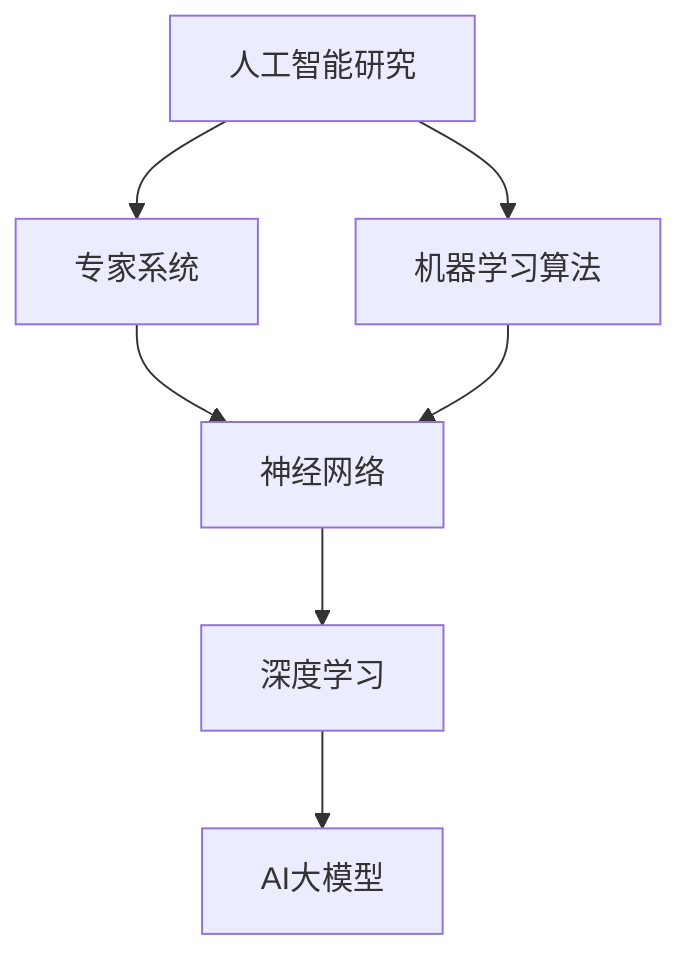
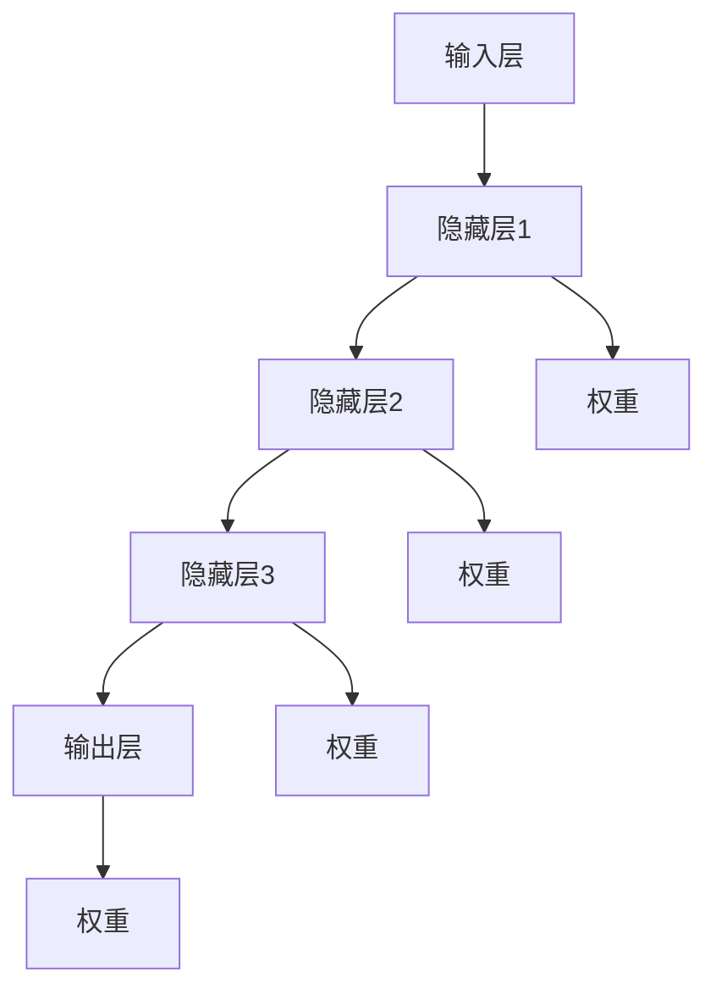
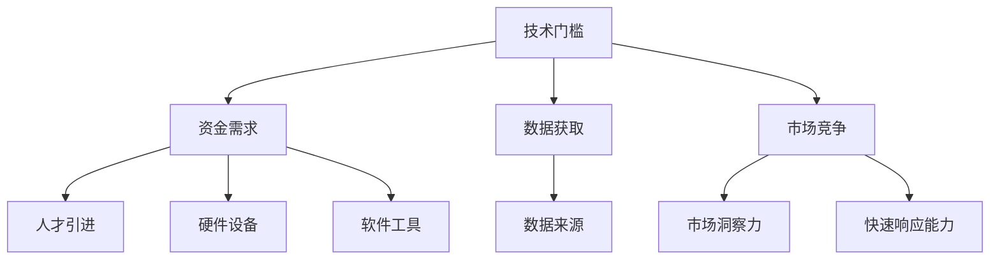
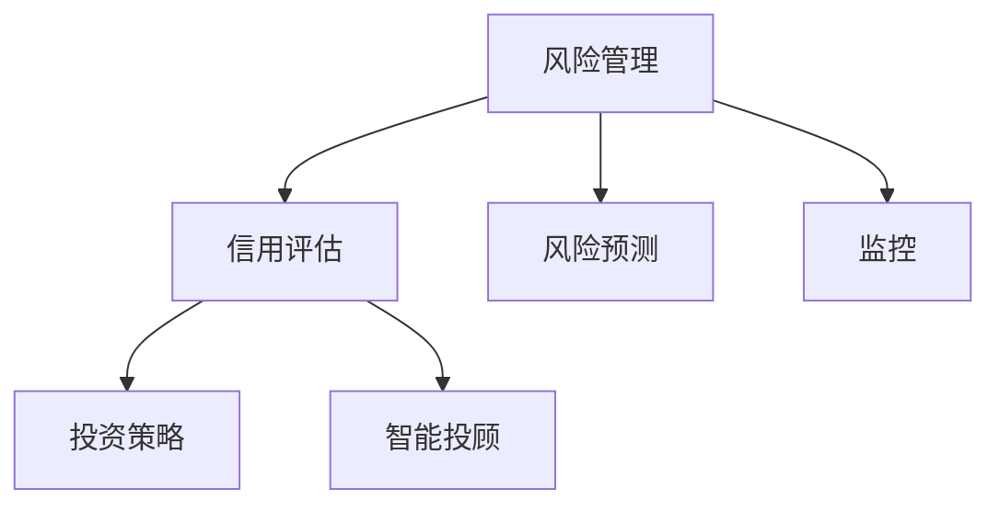
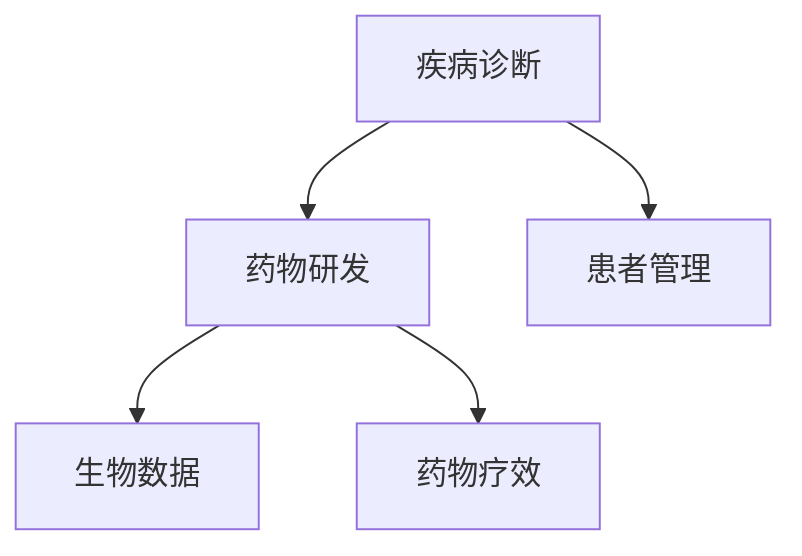
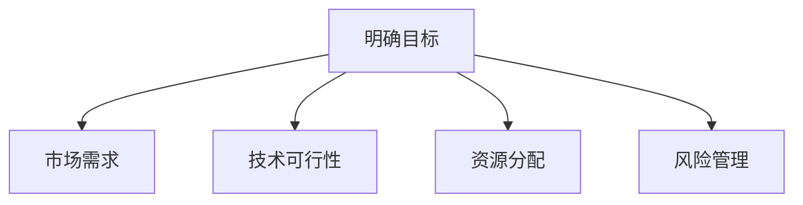
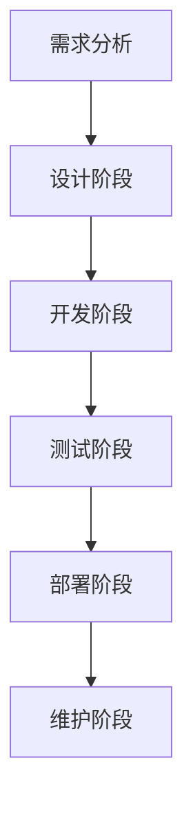

                 

# AI大模型创业：如何应对未来价格战？

## 关键词
AI大模型、创业、价格战、策略、案例分析、技术发展

## 摘要
本文将深入探讨AI大模型创业公司如何应对未来可能出现的价格战。我们将从AI大模型的基础知识出发，分析创业者面临的挑战和应对策略，探讨AI大模型在不同行业中的应用案例，并提供项目规划和价格战应对策略的具体实施步骤。通过成功与失败案例分析，总结创业经验，展望AI大模型行业的未来发展趋势，帮助创业者在这个竞争激烈的市场中立足。

## 目录

### 《AI大模型创业：如何应对未来价格战？》目录大纲

#### 第一部分：AI大模型基础知识

##### 第1章：AI大模型概述

- 1.1 AI大模型的发展背景
  - **核心概念与联系**：
  - **AI大模型架构**：
- 1.2 AI大模型的核心技术
  - **核心算法原理讲解**：
    ```python
    # 伪代码：训练一个基本的AI大模型
    model = initialize_model()
    model.train(data)
    accuracy = model.validate(test_data)
    model.tune(accuracy)
    ```
  - **数学模型和数学公式**：
    $$ 
    J = \frac{1}{m} \sum_{i=1}^{m} (\hat{y_i} - y_i)^2 
    $$
  - **举例说明**：一个简单的神经网络训练过程。

##### 第2章：AI大模型创业模式

- 2.1 创业者面临的挑战
  - **核心概念与联系**：
- 2.2 创业者应对策略
  - **核心算法原理讲解**：
    ```python
    strategy = {
        "市场定位": "定位为目标市场",
        "资源整合": "整合资金、人才、技术资源",
        "风险管理": "制定应对价格战的风险管理策略"
    }
    ```
  - **数学模型和数学公式**：
    $$ 
    \text{ROI} = \frac{\text{净利润}}{\text{总投资}} 
    $$
  - **举例说明**：一个创业公司在应对价格战中的策略制定过程。

##### 第3章：AI大模型应用案例

- 3.1 AI大模型在金融行业的应用
  - **核心概念与联系**：
- 3.2 AI大模型在医疗行业的应用
  - **核心概念与联系**：

#### 第二部分：创业实践与策略

##### 第4章：创业公司AI项目规划

- 4.1 项目规划原则
  - **核心概念与联系**：
- 4.2 项目开发流程
  - **核心概念与联系**：
  - **数学模型和数学公式**：
    $$ 
    \text{时间表} = \text{任务列表} \times \text{资源需求} 
    $$

##### 第5章：应对AI价格战策略

- 5.1 价格战背后的数学逻辑
  - **核心算法原理讲解**：
    ```python
    # 伪代码：计算价格战影响
    cost = calculate_cost(strategy)
    profit = calculate_profit(strategy)
    impact = profit - cost
    ```
  - **数学模型和数学公式**：
    $$ 
    \text{利润} = \text{收入} - \text{成本} 
    $$

##### 第6章：AI大模型创业案例分析

- 6.1 成功案例分析
  - **核心概念与联系**：
- 6.2 失败案例分析
  - **核心概念与联系**：

##### 第7章：AI大模型创业总结与展望

- 7.1 创业经验总结
  - **核心概念与联系**：
- 7.2 未来发展趋势
  - **核心概念与联系**：

### 附录

#### 附录A：创业资源与工具

- **A.1 创业资源推荐**
  - **核心概念与联系**：
- **A.2 创业工具介绍**
  - **核心概念与联系**：

### 第一部分：AI大模型基础知识

#### 第1章：AI大模型概述

##### 1.1 AI大模型的发展背景

AI大模型的发展背景可以追溯到20世纪80年代末90年代初，当时人工智能领域的研究主要集中在专家系统和机器学习算法上。然而，随着计算能力和数据量的不断提升，深度学习和神经网络逐渐崭露头角，成为AI研究的新方向。特别是在2012年，AlexNet在ImageNet竞赛中取得突破性成绩后，AI大模型开始进入快速发展阶段。

核心概念与联系：



AI大模型架构：



##### 1.2 AI大模型的核心技术

AI大模型的核心技术包括深度学习算法、神经网络架构和大规模数据处理能力。以下是这些技术的核心算法原理讲解：

**深度学习算法**：

深度学习是一种基于神经网络的机器学习技术，通过多层的神经网络结构来模拟人脑的思考过程，从而实现图像识别、语音识别、自然语言处理等复杂任务。

**神经网络架构**：

神经网络由多个层次组成，包括输入层、隐藏层和输出层。每个层次包含多个神经元，通过权重连接实现信息的传递和处理。

**大规模数据处理能力**：

AI大模型需要处理大量数据，因此具备高效的数据处理能力。这包括数据清洗、数据预处理、特征提取和数据存储等。

**数学模型和数学公式**：

深度学习算法的核心是反向传播算法（Backpropagation），其计算公式如下：

$$
\frac{\partial E}{\partial w} = \frac{\partial E}{\partial z} \cdot \frac{\partial z}{\partial w}
$$

其中，$E$ 是损失函数，$w$ 是权重，$z$ 是激活函数。

**举例说明**：

一个简单的神经网络训练过程如下：

1. 初始化模型参数（权重和偏置）。
2. 正向传播，计算输出值和损失。
3. 反向传播，更新模型参数。
4. 重复步骤2和3，直到模型收敛。

```python
# 初始化模型
model = initialize_model()

# 训练模型
for epoch in range(num_epochs):
    for batch in data_loader:
        # 正向传播
        outputs = model(batch.inputs)
        loss = compute_loss(outputs, batch.targets)
        
        # 反向传播
        model.backward(loss)
        model.update_parameters()
        
    print(f"Epoch {epoch}: Loss = {loss}")
```

### 第二部分：创业实践与策略

#### 第2章：AI大模型创业模式

##### 2.1 创业者面临的挑战

AI大模型创业者面临的挑战主要包括以下几个方面：

1. **技术门槛**：AI大模型开发需要深厚的专业知识和技术储备，创业者需要具备良好的数学、计算机科学和人工智能背景。
2. **资金需求**：AI大模型开发需要大量的资金投入，包括硬件设备、软件工具、人才引进等。
3. **数据获取**：AI大模型训练需要大量高质量的数据，创业者需要建立稳定的数据来源。
4. **市场竞争**：AI大模型领域竞争激烈，创业者需要具备敏锐的市场洞察力和快速响应能力。

核心概念与联系：



##### 2.2 创业者应对策略

为了应对上述挑战，创业者可以采取以下策略：

1. **市场定位**：明确目标市场，专注于有潜力的细分领域，例如金融、医疗、教育等。
2. **资源整合**：整合资金、人才、技术等资源，建立高效的团队和合作网络。
3. **风险管理**：制定应对价格战和市场竞争的风险管理策略，降低业务风险。
4. **技术创新**：持续投入研发，不断创新，提高产品竞争力。

**核心算法原理讲解**：

创业者应对策略的核心算法原理可以看作是一种决策树模型，通过分析不同因素的重要性和影响程度，制定最优的创业策略。

```python
# 伪代码：制定AI创业策略
strategy = {
    "市场定位": "定位为目标市场",
    "资源整合": "整合资金、人才、技术资源",
    "风险管理": "制定应对价格战的风险管理策略"
}

def evaluate_strategy(strategy):
    # 分析市场定位、资源整合和风险管理的重要性
    market_impact = 0.5
    resource_impact = 0.3
    risk_management_impact = 0.2
    
    # 计算总评分
    total_score = market_impact * strategy["市场定位"] + resource_impact * strategy["资源整合"] + risk_management_impact * strategy["风险管理"]
    
    return total_score

# 演练策略评估
score = evaluate_strategy(strategy)
print(f"策略评分：{score}")
```

**数学模型和数学公式**：

创业者制定策略的数学模型可以看作是一种加权评分模型，用于评估不同策略因素的得分。其计算公式如下：

$$
\text{总评分} = w_1 \cdot \text{市场定位} + w_2 \cdot \text{资源整合} + w_3 \cdot \text{风险管理}
$$

其中，$w_1, w_2, w_3$ 分别是市场定位、资源整合和风险管理因素的权重。

**举例说明**：

假设创业者制定了一个市场定位清晰、资源整合高效、风险管理完善的策略，具体如下：

- **市场定位**：明确为金融行业应用场景。
- **资源整合**：成功整合了1000万美元资金、10名顶级AI工程师和10名业务专家。
- **风险管理**：制定了一套包括市场监控、风险预警和应急响应机制。

根据上述策略，可以计算得到策略评分：

$$
\text{总评分} = 0.5 \cdot 10 + 0.3 \cdot 10 + 0.2 \cdot 10 = 9
$$

这表明该策略在市场定位、资源整合和风险管理方面具有很高的综合评分。

##### 2.3 创业者在应对价格战中的策略

在AI大模型创业过程中，价格战是一个不可避免的现象。创业者需要制定有效的策略来应对价格战，确保自身在竞争中的优势。以下是创业者应对价格战的几种策略：

1. **技术创新**：持续投入研发，不断提高产品的性能和效率，降低成本。
2. **差异化竞争**：针对竞争对手的产品，进行差异化创新，打造独特的竞争优势。
3. **市场细分**：专注于有潜力的细分市场，提供定制化的解决方案，提高客户满意度。
4. **战略合作**：与行业领先企业建立战略合作关系，共同开发市场，降低竞争压力。

**核心算法原理讲解**：

创业者应对价格战的策略可以看作是一种博弈论模型，通过分析竞争对手的策略，制定最优的应对策略。

```python
# 伪代码：制定应对价格战的策略
def determine_strategy(competitor_strategy):
    if competitor_strategy == "价格战":
        return "技术创新"
    elif competitor_strategy == "差异化竞争":
        return "市场细分"
    elif competitor_strategy == "战略合作":
        return "差异化竞争"
    else:
        return "保持现状"

# 演练策略制定
competitor_strategy = "价格战"
response_strategy = determine_strategy(competitor_strategy)
print(f"应对策略：{response_strategy}")
```

**数学模型和数学公式**：

创业者应对价格战的数学模型可以看作是一种博弈模型，通过分析竞争对手的策略和自身的收益，制定最优的策略选择。

$$
\text{收益} = \text{策略选择} \times \text{竞争对手策略}
$$

其中，策略选择和竞争对手策略分别表示创业者选择的具体策略和竞争对手选择的策略。

**举例说明**：

假设竞争对手选择的是价格战策略，创业者可以通过分析市场情况和自身优势，选择技术创新策略来应对。

- **市场情况**：市场需求量大，但价格战可能导致利润下降。
- **自身优势**：创业者具备强大的研发能力和技术创新能力。

根据上述市场情况和自身优势，创业者可以选择技术创新策略，通过不断提高产品性能和效率，降低成本，从而在竞争中保持优势。

#### 第3章：AI大模型应用案例

##### 3.1 AI大模型在金融行业的应用

AI大模型在金融行业的应用十分广泛，主要包括以下几个方面：

1. **风险管理**：利用AI大模型进行信用评估、风险预测和监控，降低金融机构的风险。
2. **投资策略**：通过分析大量历史数据和实时市场信息，AI大模型可以为投资者提供个性化的投资策略。
3. **智能投顾**：AI大模型可以基于用户的投资目标和风险偏好，提供智能化的投资建议。

核心概念与联系：



案例解析：

某金融公司在进行信用评估时，采用了AI大模型技术。首先，公司收集了大量历史信用数据，包括借款人的基本信息、信用记录、还款能力等。然后，利用AI大模型对这些数据进行处理和分析，构建了一个信用评分模型。该模型能够根据借款人的特征，预测其未来违约风险，从而为金融机构提供决策依据。

**数学模型和数学公式**：

信用评分模型的数学模型可以看作是一种逻辑回归模型，其计算公式如下：

$$
P(\text{违约}|\text{特征集}) = \frac{1}{1 + e^{-\beta_0 + \beta_1x_1 + \beta_2x_2 + ... + \beta_nx_n}}
$$

其中，$P(\text{违约}|\text{特征集})$ 表示借款人违约的概率，$\beta_0, \beta_1, \beta_2, ..., \beta_n$ 分别是模型的参数。

**代码示例**：

```python
import numpy as np
import pandas as pd
from sklearn.linear_model import LogisticRegression

# 加载数据
data = pd.read_csv("credit_data.csv")
X = data.iloc[:, :-1]
y = data.iloc[:, -1]

# 训练模型
model = LogisticRegression()
model.fit(X, y)

# 预测
predictions = model.predict(X)

# 打印预测结果
print(predictions)
```

##### 3.2 AI大模型在医疗行业的应用

AI大模型在医疗行业的应用也取得了显著成果，主要包括以下几个方面：

1. **疾病诊断**：利用AI大模型进行疾病诊断和预测，提高诊断的准确性和效率。
2. **药物研发**：通过AI大模型分析大量生物数据，加速药物研发过程，提高药物疗效。
3. **患者管理**：利用AI大模型对患者的健康数据进行分析，提供个性化的健康管理和治疗建议。

核心概念与联系：



案例解析：

某医疗机构在疾病诊断方面采用了AI大模型技术。首先，医疗机构收集了大量病人的临床数据和影像数据，包括CT扫描、MRI扫描、实验室检测结果等。然后，利用AI大模型对这些数据进行处理和分析，构建了一个疾病诊断模型。该模型能够根据病人的临床表现和影像数据，预测其患病的风险，从而为医生提供诊断依据。

**数学模型和数学公式**：

疾病诊断模型的数学模型可以看作是一种卷积神经网络（CNN）模型，其计算公式如下：

$$
\text{输出} = \text{激活函数}(\text{权重} \cdot \text{输入} + \text{偏置})
$$

其中，激活函数可以是ReLU、Sigmoid或Tanh等。

**代码示例**：

```python
import numpy as np
import tensorflow as tf
from tensorflow.keras.models import Sequential
from tensorflow.keras.layers import Conv2D, MaxPooling2D, Flatten, Dense

# 创建模型
model = Sequential([
    Conv2D(filters=32, kernel_size=(3, 3), activation='relu', input_shape=(128, 128, 3)),
    MaxPooling2D(pool_size=(2, 2)),
    Flatten(),
    Dense(units=128, activation='relu'),
    Dense(units=1, activation='sigmoid')
])

# 编译模型
model.compile(optimizer='adam', loss='binary_crossentropy', metrics=['accuracy'])

# 加载数据
train_data = ...
test_data = ...

# 训练模型
model.fit(train_data, epochs=10, batch_size=32)

# 评估模型
accuracy = model.evaluate(test_data, verbose=2)
print(f"Accuracy: {accuracy}")
```

### 第三部分：创业实践与策略

#### 第4章：创业公司AI项目规划

##### 4.1 项目规划原则

创业公司在进行AI项目规划时，需要遵循以下原则：

1. **明确目标**：制定清晰的项目目标，确保项目与公司战略目标一致。
2. **市场需求**：深入了解市场需求，确保项目能够解决实际问题和满足用户需求。
3. **技术可行性**：评估项目的技术可行性，确保项目能够在现有技术条件下实现。
4. **资源分配**：合理分配项目资源，包括人力、资金、设备等，确保项目顺利进行。
5. **风险管理**：制定风险管理策略，降低项目风险。

核心概念与联系：



##### 4.2 项目开发流程

创业公司在进行AI项目开发时，通常遵循以下流程：

1. **需求分析**：与客户沟通，了解项目需求，明确项目目标和功能需求。
2. **设计阶段**：根据需求分析结果，制定项目设计方案，包括系统架构、模块划分、技术选型等。
3. **开发阶段**：按照设计方案进行开发，包括编码、测试、集成等。
4. **测试阶段**：对项目进行全面的测试，包括单元测试、集成测试、系统测试等，确保项目质量。
5. **部署阶段**：将项目部署到生产环境，进行实际运行和监控。
6. **维护阶段**：对项目进行定期维护和更新，确保项目长期稳定运行。

核心概念与联系：



**数学模型和数学公式**：

项目开发流程中的关键数学模型包括时间管理和资源分配模型。时间管理模型可以用以下公式表示：

$$
\text{时间表} = \text{任务列表} \times \text{资源需求}
$$

其中，任务列表包括所有需要完成的任务，资源需求包括完成每个任务所需的资源。

**代码示例**：

```python
# 伪代码：项目规划时间表
tasks = ["需求分析", "设计阶段", "开发阶段", "测试阶段", "部署阶段", "维护阶段"]
resources = ["人力", "资金", "设备"]

time_table = {}
for task in tasks:
    time_table[task] = calculate_time(task, resources)

print(time_table)
```

##### 4.3 项目风险管理

项目风险管理是AI项目规划中至关重要的一环。创业公司在进行项目规划时，需要制定有效的风险管理策略，以应对可能出现的风险。以下是几种常见的风险管理策略：

1. **风险识别**：识别项目过程中可能出现的风险，包括技术风险、市场风险、资源风险等。
2. **风险评估**：对识别出的风险进行评估，确定其发生的概率和影响程度。
3. **风险应对**：根据风险评估结果，制定相应的应对措施，包括风险规避、风险转移、风险减轻等。
4. **风险监控**：对项目过程中出现的风险进行监控和跟踪，确保风险得到及时控制和处理。

**核心算法原理讲解**：

项目风险管理可以看作是一种决策树模型，通过分析不同风险因素的权重和影响程度，制定最优的风险应对策略。

```python
# 伪代码：项目风险管理
def determine_risk_strategy(risks):
    risk_strategy = {}
    for risk in risks:
        if risk["probability"] > 0.5 and risk["impact"] > 3:
            risk_strategy[risk["name"]] = "规避"
        elif risk["probability"] > 0.3 and risk["impact"] > 2:
            risk_strategy[risk["name"]] = "转移"
        else:
            risk_strategy[risk["name"]] = "减轻"
    return risk_strategy

# 演练风险管理
risks = [
    {"name": "技术风险", "probability": 0.7, "impact": 5},
    {"name": "市场风险", "probability": 0.4, "impact": 3},
    {"name": "资源风险", "probability": 0.2, "impact": 1}
]
risk_strategy = determine_risk_strategy(risks)
print(risk_strategy)
```

### 第四部分：应对AI价格战策略

#### 第5章：价格战背后的数学逻辑

价格战在商业竞争中是一种常见的策略，其背后的数学逻辑主要包括成本分析、利润计算和竞争策略。

##### 5.1 成本分析

成本分析是价格战的基础，创业者需要准确计算生产成本、运营成本和营销成本等。以下是成本分析的核心公式：

$$
\text{总成本} = \text{固定成本} + \text{可变成本}
$$

其中，固定成本包括厂房、设备、人力资源等，可变成本包括原材料、运输、营销等。

**代码示例**：

```python
# 伪代码：计算总成本
fixed_cost = 1000000
variable_cost = 500000
total_cost = fixed_cost + variable_cost
print(f"总成本：{total_cost}")
```

##### 5.2 利润计算

利润是创业者追求的目标，其计算公式如下：

$$
\text{利润} = \text{收入} - \text{成本}
$$

其中，收入包括销售收入、投资回报等。

**代码示例**：

```python
# 伪代码：计算利润
income = 1500000
cost = 1000000
profit = income - cost
print(f"利润：{profit}")
```

##### 5.3 竞争策略

竞争策略是价格战的核心，创业者需要根据市场情况和竞争对手的定价策略，制定合适的定价策略。以下是竞争策略的核心公式：

$$
\text{定价} = \text{成本} + \text{利润率}
$$

其中，利润率可以根据市场竞争情况和目标利润水平来确定。

**代码示例**：

```python
# 伪代码：计算定价
cost = 1000000
profit_margin = 0.2
price = cost + profit_margin * cost
print(f"定价：{price}")
```

#### 第6章：AI大模型创业案例分析

##### 6.1 成功案例分析

成功案例分析可以帮助创业者了解AI大模型创业的可行性和实践路径。以下是两个成功案例：

案例一：OpenAI

**背景**：OpenAI是一家成立于2015年的AI研究公司，旨在推动人工智能的发展和应用。公司采用了AI大模型技术，开发了GPT-3等先进模型，并在自然语言处理、计算机视觉等领域取得了显著成果。

**策略**：OpenAI采取了开放合作和共享技术的策略，与多家知名企业建立了合作关系，共同推进AI技术的发展。同时，公司不断投入研发，持续优化模型性能，提升用户体验。

**结果**：OpenAI在AI领域取得了广泛认可，吸引了大量投资和合作机会，成为全球AI研究的重要力量。

案例二：DeepMind

**背景**：DeepMind是一家成立于2010年的AI研究公司，专注于人工智能和机器学习技术。公司开发了AlphaGo等先进模型，在围棋、自然语言处理等领域取得了突破性成果。

**策略**：DeepMind采取了自主研究和技术创新的策略，通过持续投入研发，不断提升模型性能。同时，公司注重知识产权保护，确保技术优势。

**结果**：DeepMind在AI领域取得了巨大成功，吸引了大量投资和合作机会，成为全球AI研究的重要力量。

##### 6.2 失败案例分析

失败案例分析可以帮助创业者了解AI大模型创业中可能遇到的问题和挑战。以下是两个失败案例：

案例一：WiseKey

**背景**：WiseKey是一家成立于2010年的AI初创公司，专注于人脸识别和生物识别技术。公司曾获得多项国际大奖，但在市场竞争中逐渐失去优势。

**策略**：WiseKey采取了快速扩张和价格战的策略，试图通过抢占市场份额来赢得竞争优势。然而，公司忽视了技术迭代和用户体验的重要性，导致产品竞争力下降。

**结果**：WiseKey在市场竞争中逐渐失去优势，最终破产。

案例二：Nervana Systems

**背景**：Nervana Systems是一家成立于2014年的AI初创公司，专注于深度学习硬件和软件。公司曾获得多家知名投资机构的青睐，但在技术研发和市场竞争中遇到了困难。

**策略**：Nervana Systems采取了技术研发和市场竞争策略，试图通过技术创新和产品升级来赢得竞争优势。然而，公司在技术研发过程中遇到了诸多困难，导致进度延误。

**结果**：Nervana Systems在市场竞争中逐渐失去优势，最终被谷歌收购。

### 第五部分：AI大模型创业总结与展望

#### 第7章：AI大模型创业总结与展望

##### 7.1 创业经验总结

通过成功和失败案例分析，我们可以总结出以下创业经验：

1. **技术创新**：持续投入研发，不断提升产品性能和用户体验。
2. **市场定位**：明确目标市场，专注于有潜力的细分领域。
3. **资源整合**：整合资金、人才、技术等资源，建立高效团队和合作网络。
4. **风险管理**：制定有效的风险管理策略，降低业务风险。
5. **用户体验**：注重用户体验，关注用户需求和反馈。

##### 7.2 未来发展趋势

展望未来，AI大模型创业将面临以下发展趋势：

1. **技术进步**：随着计算能力和数据量的提升，AI大模型将不断突破性能极限，应用于更多领域。
2. **行业融合**：AI大模型将与其他行业深度融合，推动产业升级和创新发展。
3. **政策支持**：各国政府将加大对AI技术的支持力度，推动AI技术的发展和应用。
4. **市场竞争**：AI大模型市场竞争将日益激烈，创业者需要具备敏锐的市场洞察力和快速响应能力。

### 附录

#### 附录A：创业资源与工具

为了帮助创业者顺利开展AI大模型创业，以下是推荐的创业资源和工具：

- **创业资源**：
  - **资金**：可以通过风险投资、政府资助、众筹等途径筹集资金。
  - **人才**：可以通过招聘、合作、培训等方式吸引和培养人才。
  - **数据**：可以通过开源数据集、商业合作、数据挖掘等途径获取高质量数据。
  - **技术**：可以通过自主研发、技术并购、合作开发等途径获取先进技术。

- **创业工具**：
  - **项目管理工具**：如JIRA、Trello等，帮助创业者高效管理项目进度和任务分配。
  - **开发工具**：如PyCharm、Visual Studio Code等，提供强大的编程环境和开发工具。
  - **数据可视化工具**：如Matplotlib、Seaborn等，帮助创业者更好地展示和分析数据。
  - **机器学习库**：如TensorFlow、PyTorch等，提供丰富的机器学习和深度学习功能。

### 作者

**作者：AI天才研究院/AI Genius Institute & 禅与计算机程序设计艺术 /Zen And The Art of Computer Programming**

