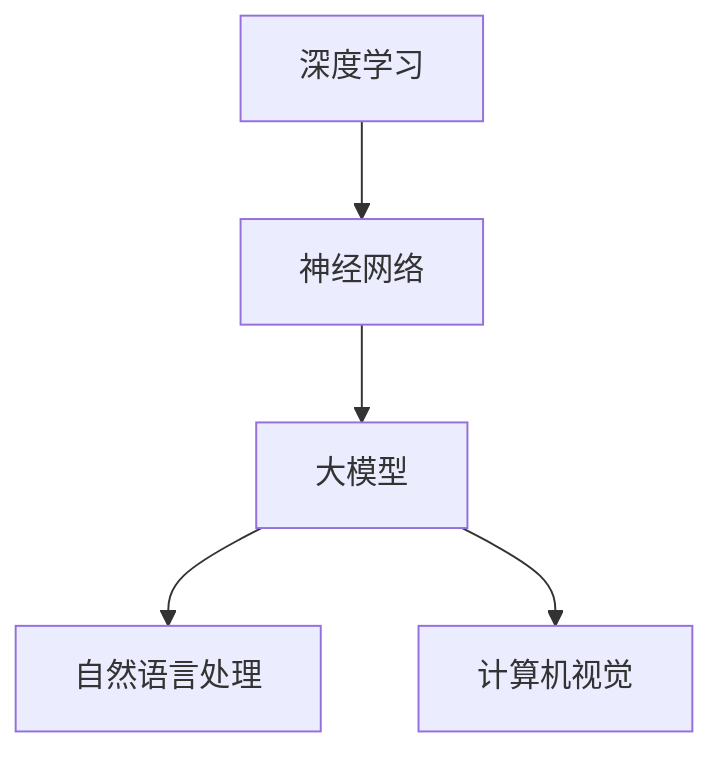

                 

# 《AI大模型创业：如何应对未来挑战？》

> 关键词：AI大模型、创业、技术挑战、商业化、安全性、伦理影响、未来发展

> 摘要：本文将深入探讨AI大模型在创业中的机遇与挑战。通过分析AI大模型的基本概念、核心技术、创业应用、商业化路径、未来挑战以及应对策略，帮助创业者更好地理解AI大模型的发展趋势，掌握创业所需的关键技能，为未来创业之路奠定坚实基础。

## 目录大纲

1. AI大模型基础
2. 创业与商业化
3. 应对未来挑战
4. 附录

## 第一部分：AI大模型基础

### 第1章 AI大模型概述

#### 1.1 AI大模型的基本概念

AI大模型是指那些具有大规模参数和高复杂度的深度学习模型。这些模型能够处理大量的数据和复杂的任务，从而实现高度智能化的功能。例如，自然语言处理、计算机视觉、语音识别等领域中，大模型的应用已经取得了显著的成果。

#### 核心概念与联系

以下是AI大模型的核心概念及其联系：

#### 1.2 AI大模型的分类

AI大模型可以按应用领域和模型架构进行分类。

- **按应用领域分类**：

  - 文本处理
  - 图像识别
  - 语音识别
  - 多模态处理

- **按模型架构分类**：

  - Transformer
  - GPT
  - BERT
  - 其他变体

#### 1.3 AI大模型的技术演进

AI大模型的技术演进经历了从早期基于传统机器学习方法的模型，到快速发展阶段的大模型，再到当前趋势中的大规模模型。随着计算能力和数据量的增长，大模型的规模和性能不断提升，应用领域也不断拓展。

### 第2章 AI大模型的核心技术

#### 2.1 深度学习基础

深度学习是AI大模型的核心技术之一。以下是深度学习的核心原理和算法：

- **神经网络原理**：

  - **前向传播与反向传播**：
    $$ 
    前向传播：输入 \rightarrow 输出 \\
    反向传播：输出 \rightarrow 输入
    $$

  - **激活函数与损失函数**：
    $$
    激活函数：ReLU、Sigmoid、Tanh \\
    损失函数：均方误差（MSE）、交叉熵（CE）
    $$

- **深度学习算法**：

  - **卷积神经网络（CNN）**：
    $$
    卷积层、池化层、全连接层
    $$

  - **循环神经网络（RNN）**：
    $$
    RNN、LSTM、GRU
    $$

  - **生成对抗网络（GAN）**：
    $$
    生成器、判别器、对抗训练
    $$

#### 2.2 自然语言处理

自然语言处理是AI大模型的重要应用领域。以下是自然语言处理的核心技术：

- **词嵌入**：

  - **Word2Vec**：
    $$
    \text{词向量的训练：CBOW、Skip-Gram}
    $$

  - **GloVe**：
    $$
    \text{全局向量表示：矩阵分解、最小化损失函数}
    $$

- **上下文理解**：

  - **Transformer**：
    $$
    \text{自注意力机制、多头注意力、编码器-解码器结构}
    $$

  - **BERT**：
    $$
    \text{预先训练、上下文理解、掩码语言模型}
    $$

#### 2.3 计算机视觉基础

计算机视觉是AI大模型的另一个重要应用领域。以下是计算机视觉的核心技术：

- **图像特征提取**：

  - **卷积层**：
    $$
    \text{卷积操作、特征映射、权重共享}
    $$

  - **池化层**：
    $$
    \text{最大池化、平均池化、下采样}
    $$

- **目标检测与识别**：

  - **R-CNN**：
    $$
    \text{区域提议网络、分类与边界框回归}
    $$

  - **YOLO**：
    $$
    \text{单阶段检测、边界框预测、类别预测}
    $$

  - **SSD**：
    $$
    \text{多尺度特征融合、边界框预测、类别预测}
    $$

## 第二部分：创业与商业化

### 第3章 AI大模型在创业中的应用

#### 3.1 创业机会分析

AI大模型在创业中的应用有着广阔的市场需求和技术优势。

- **市场需求**：

  - 解决特定行业的问题：如医疗、金融、教育等领域的智能化解决方案。

  - 满足消费者个性化需求：如智能语音助手、个性化推荐系统等。

- **技术优势**：

  - 大模型的强大处理能力。

  - 快速迭代和优化能力。

#### 3.2 商业模式探索

AI大模型创业的商业模式多种多样。

- **产品服务**：

  - API服务：为开发者提供强大的AI能力，如文本生成、图像识别等。

  - SaaS平台：提供在线的AI服务，如智能问答系统、智能客服等。

  - 整体解决方案：为行业提供端到端的AI解决方案，如智能医疗、智能金融等。

- **收入来源**：

  - 服务费：为用户提供API调用或SaaS服务的费用。

  - 广告收入：在AI服务中嵌入广告，如个性化推荐中的广告投放。

  - 软件销售：销售自主研发的AI软件产品。

#### 3.3 团队构建与管理

AI大模型创业需要具备多方面的专业人才。

- **核心成员**：

  - 数据科学家：负责数据分析和模型训练。

  - 算法工程师：负责算法研发和优化。

  - 产品经理：负责产品规划和迭代。

  - 市场营销专家：负责市场推广和品牌建设。

- **管理模式**：

  - 目标导向：明确团队目标，确保团队成员共同为实现目标而努力。

  - 创新驱动：鼓励创新思维，不断探索新的技术与应用。

  - 灵活应变：根据市场变化和技术发展，灵活调整团队战略和目标。

### 第4章 AI大模型的商业化路径

#### 4.1 数据策略与隐私保护

数据是AI大模型商业化的重要资产。

- **数据来源**：

  - 自有数据：公司内部产生或收集的数据。

  - 合作数据：与合作伙伴共同收集的数据。

  - 公开数据：从公共数据源获取的数据。

- **隐私保护**：

  - 数据脱敏：对敏感信息进行加密、遮挡等处理，保护用户隐私。

  - 加密技术：使用加密算法保护数据传输和存储。

  - 合规性审核：确保数据收集和使用符合相关法律法规。

#### 4.2 产品设计与用户获取

AI大模型产品的设计需要充分考虑用户需求。

- **产品设计**：

  - 用户需求分析：通过调查、访谈等方式了解用户需求。

  - 用户体验优化：持续迭代产品，提升用户体验。

  - 功能迭代与完善：根据用户反馈，不断优化产品功能。

- **用户获取**：

  - 市场营销：通过广告、内容营销等方式吸引潜在用户。

  - 社交媒体：利用社交媒体平台推广产品。

  - 合作伙伴：与行业合作伙伴共同推广产品。

#### 4.3 营销推广与品牌建设

有效的营销推广和品牌建设有助于提升AI大模型产品的知名度。

- **营销策略**：

  - 内容营销：通过发布高质量的内容，提升品牌影响力。

  - 搜索引擎优化（SEO）：提高产品在搜索引擎中的排名。

  - 广告投放：在目标用户集中的平台投放广告。

- **品牌建设**：

  - 品牌定位：明确产品定位，塑造品牌形象。

  - 品牌形象设计：设计独特的品牌标识和视觉元素。

  - 社会责任：积极承担社会责任，提升品牌形象。

## 第三部分：应对未来挑战

### 第5章 AI大模型的安全性挑战

#### 5.1 安全漏洞与防范

AI大模型的安全性面临多种威胁。

- **常见漏洞**：

  - 模型篡改：恶意攻击者可以通过篡改模型参数来改变模型的行为。

  - 数据泄露：敏感数据可能因安全措施不足而泄露。

  - 网络攻击：攻击者可能通过网络攻击破坏AI系统的正常运行。

- **防范措施**：

  - 安全加固：加强系统安全防护，如防火墙、入侵检测系统等。

  - 审计日志：记录系统操作日志，便于追踪和监控异常行为。

  - 加密传输：使用加密技术保护数据传输和存储。

#### 5.2 数据安全与隐私保护

数据安全和隐私保护是AI大模型商业化的重要保障。

- **数据安全**：

  - 数据备份：定期备份重要数据，防止数据丢失。

  - 访问控制：设定严格的访问权限，防止未经授权的访问。

  - 数据加密：对敏感数据进行加密存储和传输。

- **隐私保护**：

  - 数据匿名化：对敏感信息进行脱敏处理，保护用户隐私。

  - 用户同意：确保用户在提供数据时明确同意数据使用的范围和目的。

  - 法律合规：遵守相关法律法规，确保数据收集和使用合法。

#### 5.3 法律法规与合规性

AI大模型在商业应用中需遵守相关法律法规。

- **法规要求**：

  - GDPR（通用数据保护条例）：欧盟地区的数据保护法规。

  - CCPA（加州消费者隐私法）：美国加州地区的消费者隐私保护法规。

  - 其他国家和地区的数据保护法规：如中国的《网络安全法》等。

- **合规性审核**：

  - 法律顾问：聘请专业法律顾问，确保业务合规。

  - 内部审计：定期进行内部审计，检查合规性。

  - 第三方评估：邀请第三方机构进行合规性评估。

### 第6章 AI大模型的伦理与社会影响

#### 6.1 AI伦理原则

AI大模型的伦理问题备受关注。

- **公平性**：

  - 避免偏见和歧视：确保AI模型在不同群体中的表现一致。

  - 确保机会均等：为所有人提供公平的AI服务。

- **透明性**：

  - 模型决策过程可解释：使模型决策过程透明，便于用户理解和监督。

  - 用户有权了解和使用数据：用户应明确数据的使用范围和目的。

- **责任**：

  - 明确责任主体：确定AI系统设计和运营的责任主体。

  - 建立责任机制：制定明确的责任分配和追究机制。

#### 6.2 社会影响与责任

AI大模型对社会的影响深远。

- **社会影响**：

  - 改变就业结构：自动化和智能化的进步可能导致部分岗位的消失。

  - 促进技术创新：推动人工智能技术的发展和应用。

  - 提高生活质量：为用户提供更便捷、高效的AI服务。

- **责任**：

  - 企业责任：企业应承担社会责任，关注AI技术的可持续发展。

  - 政府监管：政府应制定相关政策，引导和监管AI技术的发展。

  - 社会参与：鼓励公众参与AI伦理讨论，共同构建健康的AI社会。

#### 6.3 可持续发展

AI大模型的可持续发展是重要的议题。

- **环境影响**：

  - 能源消耗：AI大模型的训练和运行需要大量能源，可能导致碳排放增加。

  - 电子废弃物：随着设备的更新换代，电子废弃物处理问题日益严峻。

- **可持续发展策略**：

  - 绿色能源：推动使用可再生能源，降低能源消耗。

  - 循环利用：推动电子废弃物的循环利用，减少废弃物排放。

  - 社会责任：企业应积极参与社会公益事业，承担社会责任。

### 第7章 AI大模型的未来发展趋势

#### 7.1 技术趋势与前沿

AI大模型的技术发展趋势如下：

- **大模型规模**：

  - 参数规模不断扩大。

  - 训练时间显著缩短。

- **跨领域应用**：

  - 多模态处理：结合不同类型的数据，如文本、图像、声音等。

  - 融合不同领域的AI技术：如将计算机视觉与自然语言处理结合，实现更智能的交互。

#### 7.2 行业变革与机遇

AI大模型在各个行业的应用正引发变革。

- **行业应用**：

  - 医疗：智能诊断、个性化治疗等。

  - 金融：智能投顾、风险控制等。

  - 教育：智能教育、个性化学习等。

- **机遇**：

  - 创新创业：AI大模型为创业者提供了广阔的创新空间。

  - 投资热点：AI大模型领域成为投资机构关注的重点。

#### 7.3 创业与投资策略

AI大模型创业和投资策略如下：

- **创业策略**：

  - 市场需求分析：深入了解市场需求，找到切入点。

  - 技术创新：研发具有竞争力的AI大模型技术。

  - 资源整合：整合人才、资金、技术等资源。

- **投资策略**：

  - 早期投资：关注具有潜力的初创企业。

  - 风险评估：对投资项目进行全面的评估和风险控制。

  - 多元化投资：分散投资，降低风险。

### 附录

#### 附录A：AI大模型开发工具与资源

- **开发工具对比**：

  - TensorFlow：强大的生态系统，广泛的应用场景。

  - PyTorch：灵活且易用，强大的动态计算能力。

  - 其他框架：如JAX、Theano等。

- **学习资源推荐**：

  - 在线课程：如Coursera、edX等。

  - 书籍：如《深度学习》、《Python深度学习》等。

  - 社区与论坛：如Stack Overflow、GitHub、Reddit等。

#### 附录B：AI大模型项目实战案例

- **项目背景**：

  - **项目名称**：智能问答系统。

  - **项目目标**：提供高效、准确的问答服务。

- **环境搭建**：

  - **硬件环境**：GPU服务器、高速网络。

  - **软件环境**：Python、TensorFlow。

- **源代码实现**：

  - **数据预处理**：数据清洗、数据分割。

  - **模型搭建**：定义模型结构、编译模型。

  - **训练与评估**：训练过程、评估指标。

- **代码解读与分析**：

  - **核心代码**：数据加载与预处理、模型训练与评估、结果分析。

  - **优化与调参**：网络结构调整、学习率调整、损失函数优化。

### 作者信息

作者：AI天才研究院/AI Genius Institute & 禅与计算机程序设计艺术 /Zen And The Art of Computer Programming

---

本文通过深入分析AI大模型的基本概念、核心技术、创业应用、商业化路径、未来挑战以及应对策略，为创业者提供了一份全面的指南。在AI大模型快速发展的时代，创业者需要紧跟技术趋势，充分利用AI大模型的优势，同时关注安全性、伦理问题和社会影响。通过合理规划创业策略和商业路径，创业者有望在AI大模型的蓝海中找到自己的位置，实现企业的可持续发展。同时，AI大模型的未来发展充满机遇，创业者需保持创新精神，勇于探索新的应用领域，把握行业变革的契机。

在创业过程中，数据策略、产品设计与用户获取、营销推广与品牌建设等环节都是至关重要的。创业者需要深入了解用户需求，持续优化产品功能，提高用户体验。同时，遵守相关法律法规，保护用户隐私，确保数据安全和合规性。面对AI大模型的安全性挑战，创业者需加强安全防范，建立完善的安全体系，降低安全风险。

此外，AI大模型的伦理问题不容忽视。创业者应秉持公平、透明、责任的原则，关注AI技术的可持续发展。在推动技术创新的同时，关注社会影响，积极参与社会责任，为构建健康的AI社会贡献力量。

展望未来，AI大模型将继续发展，带来更多的商业机会和社会变革。创业者需紧跟技术趋势，持续创新，把握行业变革的机遇。通过合理规划创业策略和商业路径，创业者有望在AI大模型的蓝海中找到自己的位置，实现企业的可持续发展。同时，创业者需保持警惕，关注潜在的风险和挑战，积极应对，确保企业健康、稳定的发展。

在AI大模型创业的道路上，创业者需不断学习和进步，紧跟技术发展，关注行业动态，积极拓展人脉资源，为企业的长期发展奠定坚实基础。通过本文的指导，创业者将更好地理解AI大模型的发展趋势，掌握创业所需的关键技能，为未来的创业之路做好准备。希望本文能为您的AI大模型创业之路提供有价值的参考和启示。祝您在AI大模型的创业领域取得成功！

